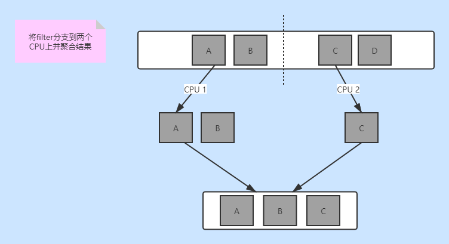
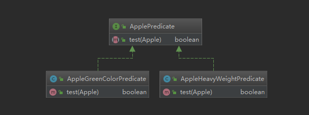
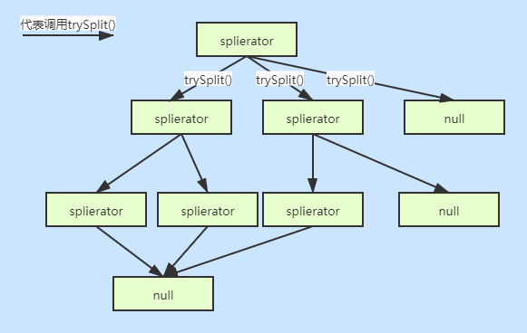
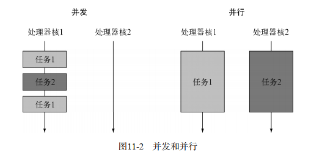
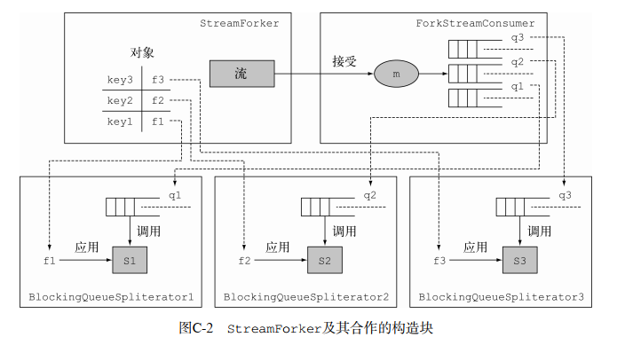

# Java8实战 笔记

- [ ] 作者  厄马(Raoul-Gabriel Urma) / 弗斯科(Mario Fusco)/米克罗夫特(Alan Mycroft)
- [ ] 笔记时间 2020.11.27


## 第一部分 基础知识

### 第 1 章 为什么关心Java8

#### 1.1 Java还在变

> 1. 大数据时代下并行性变得十分重要,以前支持的并不好
> 2. 流处理: Java 8可以透明地把输入的不相关部分拿到几个CPU内核上去分别执行你的
>    Stream操作流水线——这是几乎免费的并行  
> 3. 行为参数化  : 传递一段代码
> 4. 函数式编程范式的基石  :没有共享的可变数据，将方法和函数即代码传递给其他方法的能力

#### 1.2 Java中的函数

> 一等值: 原始值,对象(可以用于传递的)
>
> 二等值: 不能传递的(方法,类)
>
> 方法引用: 让方法能传递
>
> Lambda: 函数作为值  

#### 1.3 流

> stream: 内部迭代,遍历正确性由系统维护,Stream允许并提倡并行处理一个Stream中的元素  



#### 1.4 默认方法

> 允许不用更改接口实现类,而在接口里扩展新的功能

### 第 2 章 通过行为参数化传递代码

#### 2.1 应对不断变化的需求

> 挑选苹果:
>
> 1. 只要绿苹果/红苹果
> 2. 只要重量大于150g的苹果
> 3. 只要重量大于150g的绿苹果/红苹果
>
> 将变化封装起来,假如可以传递一个对象来判断条件就好了===> 策略模式



> Q:  假如我不是分区分苹果,而是打印苹果,那么就要创建新的一组策略
>
> A: 使用匿名类可以解决
>
> Q: 匿名内部类很多都是重复的结构代码,显得很笨重 ,有没有更好的方法?
>
> A: Lambda表达式

#### 2.4 一些栗子

1. List.sort() 方法

```java
 List<Apple> inventory = new ArrayList<>();
inventory.sort((a1,a2)->{return Double.compare(a1.getWeight(),a2.getWeight());});
```

2. Runnable

```Java
 Thread = new Thread(() -> System.out.println("hello world"));
```

3. GUI

```Java
new Button().addActionListener((e)->{});
```


### 第 3 章 Lambda表达式

#### 3.1 认识Lambda

> 理论上来说，你在Java 8之前做不了的事情， Lambda也做不了  
>
> Lambda表达式  = 匿名函数,使代码 简洁 清晰
>
> 语法: (parameters)-> expression 或者  (parameters)-> {expression}
>
> 1. 只有一条执行语句,可以省略return 和 {}
> 2. 只有一个参数可以省略()  没有参数不能省略()

#### 3.2 函数式接口

> 1. 函数式接口就是只定义一个抽象方法的接口  (可以有很多默认方法)
>
> 2. Lambda表达式允许你直接以内联的形式为函数式接口的抽象方法提供实现，
>
> 并把整个表达式作为函数式接口的实例    (匿名内部类也可以做到)
>
> 3. 函数式接口的抽象方法的签名(**返回值类型,参数个数和类型要一致**)基本上就是Lambda表达式的签名。我们将这种抽象方法叫作**函数描述符**  

#### 3.3 自定义函数式接口

> 1. 参数行为化(先写出需要的lambda表达式)
>
>    ```java
>    String file = processFile(br ->
>            br.readLine() + br.readLine());
>    ```
>
> 2. 根据签名编写接口
>
>    ```java
>    @FunctionalInterface
>    public interface BufferedReaderProcessor {
>        String process(BufferedReader br) throws IOException;
>    }
>    ```
>
> 3. 执行一个行为
>
>    ```java
>    public static String processFile(BufferedReaderProcessor p) throws IOException {
>        try (BufferedReader bufferedReader =
>                     new BufferedReader(new FileReader("data.txt"))) {
>            return p.process(bufferedReader);
>        }
>    }
>    ```
>
> 4. 传递一个Lambda


#### 3.4 一些已经定义好的函数式接口  

```Java
// 接收一个参数,返回一个Boolean值
@FunctionalInterface
public interface Predicate<T>{
	boolean test(T t);
}
// 接收一个参数,没有返回值
@FunctionalInterface
public interface Consumer<T>{
	void accept(T t);
}
// 接收一个参数,返回一个对象
@FunctionalInterface
public interface Function<T, R>{
	R apply(T t);
}
```

有一些原始类型特化,比如 **IntFunction** 表示返回/接收int类型 可以避免装箱带来的消耗

**注意事项**

1. 请注意，任何函数式接口都不允许抛出受检异常（ checked exception）  

   **方案**: 定义一个自己的函数式接口，并声明受检异常，或者把Lambda包在一个try/catch块中。  

#### 3.5 类型检查

1. 流程基本就是检查 参数类型,个数 和 返回值类型
   如果Lambda表达式抛出一个异常，那么抽象方法所声明的throws语句也必须与之匹配  
   所以,一个Lambda表达式完全可以对应多个函数接口

2. 特殊的void兼容规则  
   如果一个Lambda的主体是一个语句表达式， 它就和一个返回void的函数描述符兼容  

3. Lambda表达式也允许使用自由变量（不是参数，而是在外层作用域中定义的变量），就像匿名类一样。 它们被称作 **捕获Lambda**  

   > 限制: Lambda表达式引用的局部变量必须是最终的（ final）或事实上最终的  
   >
   > 原因: 
   >
   > 1. 实例变量在堆,局部变量在栈.假如Lambda在另一个线程访问,可能访问的是副本,就会和初始值不同
   > 2. 这一限制不鼓励你使用改变外部变量的典型命令式编程模式  


#### 3.6 方法引用

方法引用就是Lambda表达式 的快捷写法  

```java
lambda表达式								等价的 方法引用
(Apple a) -> a.getWeight() 					Apple::getWeight
() -> Thread.currentThread().dumpStack() 	Thread.currentThread()::dumpStack
(str, i) -> str.substring(i) 				String::substring
(String s) -> System.out.println(s) 		System.out::println
```

三种方法引用:

1. 指向静态方法的方法引用  Integer::parseInt  
2. 指向任意类型实例方法的方法引用  String::length  
3. 指向现有对象的实例方法的方法引用  

构造函数引用:

````java
Supplier<Apple> c1 = Apple::new;
````

#### 3.8 复合 Lambda 表达式的有用方法  

1. 比较器复合 Comparator  下有 reversed() / thenComparing()
2. 谓词复合  Predicate下    negate  and和or
3. 函数复合 Function下    f.andThen(g)  等于g(f(x))    f.compose(g)  等于 f(g(x))

## 第二部分 函数式数据处理  

### 第 4 章 引入流

> 允许你以声明性方式处理数据集合  可并行 可复合
>
> 从支持数据处理操作的源生成的元素序列  
>
> **元素序列** : 流也提供了一个接口，可以访问特定元素类型的一组有序值。  流的目的在于表达计算  
>
> **源** : 流会使用一个提供数据的源 ,有序集合会保留元素顺序
>
> **数据处理操作  **:  流的数据处理功能支持类似于数据库的操作  
>
> **流水线** : 很多流操作本身会返回一个流，这样多个操作就可以链接起来，形成一个大的流水线。
>
> **内部迭代** : 与使用迭代器显式迭代的集合不同，流的迭代操作是在背后进行的。

#### 4.3 集合与流

> 1. 流可以边走边看按需生成 ,集合需要计算完成才能进行下一步
> 2. 流只能遍历一次,第二次遍历会IllegalStateException   
> 3. 流是内部迭代

#### 4.4 中间操作 和 终端操作

> **中间操作**
>
> 能够返回流的操作,会自动进行流水线并行

> **终端操作** 
>
> 不能够返回流的操作

### 第 5 章 使用流

#### 5.1 切片和筛选

> filter(Predicate)
>
> distinct()  //使用equals和hashCode进行判断
>
> limit(int)
>
> skip(int)

#### 5.2 映射

> map() //这个函数会被应用到每个元素上，并将其映射成一个新的元素  
>
> flatMap() //流的扁平化  ,将内容映射成流
>
> Arrays.stream()  //将一个数组转成一个流的数组,一个元素对应一个流

#### 5.3 查找和匹配

> allMatch 都是短路操作
>
> anyMatch
>
> noneMatch
>
> findFirst	
>
> findAny  	并行使用,假如不关心顺序

#### 5.4 规约 

> reduce(init,BinaryOperator  )

ps

**无状态** : map或filter等操作会从输入流中获取每一个元素，并在输出流中得到0或1个结果。这些操作一般都是**无状态**的：它们没有内部状态  

**有状态的**: 诸如reduce、 sum、 max等操作需要内部状态来累积结果  

#### 5.5 数值流  

> mapToInt、 mapToDouble和mapToLong  
>
> boxed  //返回对象流

#### 5.7 创建流

> Stream.of()
>
> Arrays.stream()
>
> Files.lines()
>
> Stream.iterate和Stream.generate  无限流 和limit()配合使用


### 第 6 章 用流收集数据

#### 6.2 归约和汇总  

> Collectors.maxBy  
>
> Collectors.summingInt  
>
> Collectors.averagingInt  
>
> summarizingInt  返回最大值和最小值，以及计算其总和和平均值  的对象封装
>
> joining  内部使用了StringBuilder来把生成的字符串逐个追加起来  
>
> Collectors.reducing(k,v,z)  // k起始值,v需要使用的函数,z二元操作返回一个值

#### 6.3 分组

> groupingBy  
>
> collectingAndThen  
>
> mapping  

#### 6.4 分区

> partitioningBy  需要Predicate

#### 6.5 收集器接口

```java
public interface Collector<T, A, R> {
    Supplier<A> supplier();// 建立新的结果容器
    BiConsumer<A, T> accumulator();//将元素添加到结果容器
    Function<A, R> finisher();//对结果容器应用最终转换
    BinaryOperator<A> combiner();//合并两个结果容器
    Set<Characteristics> characteristics();//会返回一个不可变的Characteristics集合
}
/**
    Characteristics是一个包含三个项目的枚举。
     UNORDERED——归约结果不受流中项目的遍历和累积顺序的影响。
     CONCURRENT——accumulator函数可以从多个线程同时调用，且该收集器可以并行归
    约流。如果收集器没有标为UNORDERED，那它仅在用于无序数据源时才可以并行归约。
     IDENTITY_FINISH——这表明完成器方法返回的函数是一个恒等函数，可以跳过。这种
    情况下，累加器对象将会直接用作归约过程的最终结果。这也意味着，将累加器A不加检
    查地转换为结果R是安全的。
*/
```

### 第 7 章 并行数据处理与性能

#### 7.1 并行流

> 最后一次parallel或sequential调用会影响整个流水线  
>
> 并行流内部使用了默认的ForkJoinPool  ,线程数量就是处理器数量
>
> 自己的求和程序并行效果差:
>
> 1.  iterate生成的是装箱的对象，必须拆箱成数字才能求和；==>LongStream.rangeClosed  
> 2.  我们很难把iterate分成多个独立块来并行执行  

注意事项:

1. 错用并行流而产生错误的首要原因，就是使用的算法改变了某些共享状态  
2. 留意装箱  .可以的话尽量使用原始类型的流
3. 要考虑流背后的数据结构是否易于分解  
4. 一些集合的可分解性

| ArrayList IntStream.range   | 极佳 |
| --------------------------- | ---- |
| LinkedList   Stream.iterate | 差   |
| TreeSet HashSet             | 好   |

#### 7.2 分支/合并框架

> 目的是以递归方式将可以并行的任务拆分成更小的任务，然后将每个子任务的结果合并起来生成整体结果。它是ExecutorService接口的一个实现，它把子任务分配给线程池（称为ForkJoinPool）中的工作线程  

1. 使用 RecursiveTask  

   > 要把任务提交到这个池，必须创建RecursiveTask<R>的一个子类，其中R是并行化任务（以及所有子任务）产生的结果类型  或者如果任务不返回结果，则是RecursiveAction类型  

2. 注意事项

   - 对一个任务调用join方法会阻塞调用方，直到该任务做出结果。  
   - 不应该在RecursiveTask内部使用ForkJoinPool的invoke方法。相反，你应该始终直接调用compute或fork方法，只有顺序代码才应该用invoke来启动并行计算  
   - 对子任务调用fork方法可以把它排进ForkJoinPool  
   - 调试使用分支/合并框架的并行计算可能有点棘手  
   - 和并行流一样，你不应理所当然地认为在多核处理器上使用分支/合并框架就比顺序计算快  有时候需要"预热",让JIT工作

3. 工作窃取  

   > 任务差不多被平均分配到ForkJoinPool中的所有线程上  
   >
   > 每个线程都为分配给它的任务保存一个**双向链式队列**，每完成一个任务，就会从队列头上取出下一个任务开始执行。基于前面所述的原因，某个线程可能早早完成了分配给它的所有任务，也就是它的队列已经空了，而其他的线程还很忙。这时，这个线程并没有闲下来，而是随机选了一个别的线程，从队列的尾**巴上“偷走”一个任务**。这个过程一直继续下去，直到所有的任务都执行完毕，所有的队列都清空。这就是为什么要划成**许多小任务**而不是少数几个大任务，这有助于更好地在工作线程之间平衡负载  

#### 7.3 Spliterator  

```java
// 专门为并行执行设计
public interface Spliterator<T> {
    boolean tryAdvance(Consumer<? super T> action);
    Spliterator<T> trySplit();
    long estimateSize();
    int characteristics();
}
```

1. trySplit

   > 不停尝试划分新的迭代器	
   >
   > Spliterator的特性  :
   >
   > ​	Spliterator接口声明的最后一个抽象方法是characteristics，它将返回一个int，代表Spliterator本身特性集的编码  



2. 注意点

   > Spliterator还有最后一个值得注意的功能，就是可以在第一次遍历、第一次拆分或第一次查询估计大小时绑定元素的数据源，而不是在创建时就绑定。这种情况下，它称为延迟绑定（ late-binding）的Spliterator。  

## 第三部分 高效 Java 8 编程  

### 第 8 章 重构、测试和调试

#### 8.1 为改善可读性和灵活性重构代码  

1. 匿名内部类->Lambda表达式

   > 首先，匿名类和Lambda表达式中的this和super的含义是不同的。在匿名类中， this代表的是类自身，但是在Lambda中，它代表的是包含类。其次，匿名类可以屏蔽包含类的变量，而Lambda表达式不能（它们会导致编译错误）  

2. 从 Lambda 表达式到方法引用的转换  

   > 可以将Lambda表达式的内容抽取到一个单独的方法中，将其作为参数传递给groupingBy方法  
   >
   > 应该尽量考虑使用静态辅助方法  

3. 从命令式的数据处理切换到 Stream  

4. 增加代码的灵活性  

   > 1 采用函数接口  **有条件的延迟执行和环绕执行**  **策略模式** **模板方法**
   >
   > 2 有条件的延迟执行  logger.log(Level.FINER, () -> "Problem: " + generateDiagnostic());  
   >
   > 3 环绕执行  
   >
   > 4 设计模式 
   >
   >  策略模式
   >  模板方法
   >  观察者模式 : 观察者的逻辑有可能十分复杂，它们可能还持有状态，抑或定义了多个方法，诸如此类。在这些情形下，你还是应该继续使用类的方式  
   >  责任链模式
   >  工厂模式  

#### 8.3 测试 Lambda 表达式  

1. 可以借助某个字段访问Lambda函数  
2. 高阶函数的测试  => 可以采用的一个方案是使用不同的Lambda表达式对它进行测试  
3. 特别注意，涉及Lambda表达式的栈跟踪可能非常难理解  
4. peek的设计初衷就是在流的每个元素恢复运行之前，插入执行一个动作。但是它不像forEach那样恢复整个流的运行，而是在一个元素上完成操作之后，它只会将操作顺承到流水线中的下一个操作  

###  第 9 章 默认方法

> Java8支持在接口中实现方法: 静态方法 和 默认方法

#### 9.1 不断演进的API

> 假如接口更新一个新方法,实现类还是原有的,由于二进制兼容,还能正常运行;
>
> 但是直接/间接调用新方法会AbstractMethodError  
>
> 再编译项目的话 报运行时错误,没有实现接口的新方法
>
> - **二进制级的兼容性**表示现有的二进制执行文件能无缝持续链接（包括验证、准备和解析）
>   和运行  
> - **源代码级的兼容性**表示引入变化之后，现有的程序依然能成功编译通过
> - **函数行为的兼容性**表示变更发生之后，程序接受同样的输入能得到同样的结果    

#### 9.3 默认方法的使用模式  

1. 可选方法  
2. 方法多继承

#### 9.4 冲突

如果一个类使用相同的函数签名从多个地方（比如另一个类或接口）继承了方法，通过三条规则可以进行判断。

1. 类中的方法优先级最高。类或父类中声明的方法的优先级高于任何声明为默认方法的优先级。
2.  如果无法依据第一条进行判断，那么子接口的优先级更高：函数签名相同时，优先选择拥有最具体实现的默认方法的接口，即如果B继承了A，那么B就比A更加具体。
3.  最后，如果还是无法判断，继承了多个接口的类必须通过显式覆盖和调用期望的方法，显式地选择使用哪一个默认方法的实现    

### 第 10 章 用Optional取代null

#### 10.1 null的问题

1. 错误之源。NullPointerException是目前Java程序开发中最典型的异常  
2. 代码膨胀。它让你的代码充斥着深度嵌套的null检查，代码的可读性糟糕透顶。  
3. 毫无意义的。null自身没有任何的语义，尤其是，它代表的是在静态类型语言中以一种错误的方式对缺失变量值的建模  
4. 破坏了Java的哲学。Java一直试图避免让程序员意识到指针的存在，唯一的例外是： null指针
5. Java的类型系统上开了个口子。null并不属于任何类型，这意味着它可以被赋值给任意引用类型的变量    

#### 10.2 使用注意

1. 类似stream,有map,flatmap,filter
2. 不支持序列化
3. 基础类型的Optional对象，以及为什么应该避免使用它们  ==> 很多方法不支持

### 第 11 章 CompletableFuture： 组合式异步编程

> **分支/合并框架以及并行流**是实现并行处理的宝贵工具；它们将一个操作切分为多个子操作，在多个不同的核、 CPU甚至是机器上并行地执行这些子操作。  
>
> 如果你的意图是**实现并发**，而非并行  或者你的主要目标是在同一个CPU上执行几个松耦合的任务，充分利用CPU的核，让其足够忙碌，从而最大化程序的吞吐量  **Future接口**  是处理这种情况的利器  



#### 11.1 Future接口

> 它建模了一种异步计算，返回一个执行运算结果的引用，当运算结束后，这个引用被返回给调用方  
>
> 缺点: get()方法会阻塞,建议使用带限制时间的get()
>
> **同步API**: 其实只是对传统方法调用的另一种称呼：你调用了某个方法，调用方在被调用方运行的过程中会等待，被调用方运行结束返回，调用方取得被调用方的返回值并继续运行。  
>
> **异步API**: 会直接返回，或者至少在被调用方计算完成之前，将它剩余的计算任务交给另一个线程去做，该线程和调用方是异步的  

#### 11.2 错误处理

> 用于提示错误的异常会被限制在试图计算商品价格的当前线程的范围内，最终会杀死该线程，而这会导致等待get方法返回结果的客户端永久地被阻塞  
>
> CompletableFuture类中的join方法和Future接口中的get有相同的含义，并且也声明在Future接口中，它们唯一的不同是join不会抛出任何检测到的异常。  

#### 11.3 使用细节

> CompletableFuture具有一定的优势，因为它允许你对执行器（ Executor）进行配置，尤其是线程池的大小，让它以更适合应用需求的方式进行配置，满足程序的要求，而这是并行流API无法提供的  
>
> Nthreads = NCPU * UCPU * (1 + W/C)  
>
> Ncpu : 处理器核的数目
>
> Ucpu : 期望的利用率
>
> W/C: 等待和计算的时间比

**建议**:

1. CUP密集型,没有IO交互,建议Stream
2. 涉及IO,CompletableFuture 更好

### 第 12 章 新的日期和时间API

#### 12.1 LocalDate、 LocalTime、 Instant、 Duration 以及 Period  

> **LocalDate** : 该类的实例是一个不可变对象，它只提供了简单的日期，并不含当天的时间信息。另外，它也不附带任何与时区相关的信息  用静态方法获取实例
>
> **Instant**的设计初衷是为了便于机器使用。它包含的是由秒及纳秒所构成的数字  
>
> 如果你需要以年、月或者日的方式对多个时间单位建模，可以使用**Period类**  
>
> 以上都是不可变的时间类,线程安全

#### 12.2 操纵 解析 格式化

> with plus minus 等 会返回新对象
>
> TemporalAdjuster :使用重载版本的with方法，向其传递一个提供了更多定制化选择的TemporalAdjuster对象  
>
> DateTimeFormatter类: 格式化用
>
> 地区ID都为“{区域}/{城市}”的格式，这些地区集合的设定都由英特网编号分配机构（ IANA）的时区数据库提供。  

#### 12.3 日历系统

> ISO-8601日历系统是世界文明日历系统的事实标准。但是， Java 8中另外还提供了4种其他的日历系统。这些日历系统中的每一个都有一个对应的日志类，分别是ThaiBuddhistDate、MinguoDate 、 JapaneseDate 以 及 HijrahDate 。   

## 第四部分 超越 Java 8

### 第 13 章 函数式的思考

#### 13.1 实现和维护系统

> 让我们假设你被要求对一个大型的遗留软件系统进行升级，而且这个系统你之前并不是非常
> 了解。你是否应该接受维护这种软件系统的工作呢？稍有理智的外包Java程序员只会依赖如下这
> 种言不由衷的格言做决定，“搜索一下代码中有没有使用synchronized关键字，如果有就直接
> 拒绝（由此我们可以了解修复并发导致的缺陷有多困难），否则进一步看看系统结构的复杂程度”。  
>
> 1. 函数式编程提出的“无副作用”以及“不变性”对于解决这一难题是大有裨益的 
>
>   - 如果一个方法既不修改它内嵌类的状态，也不修改其他对象的状态，使用return返回所有的计算结果，那么我们称其为纯粹的或者**无副作用的**   
>   - 副作用有: 除了构造器,修改数据结构(比如setter);抛出异常;进行IO操作
>
> 2. “如何做”风格的编程非常适合经典的面向对象编程，有些时候我们也称之为“命令式”编程  ;
>    “要做什么”风格的编程通常被称为声明式编程 ,制定规则 ,让系统决定如何实现

#### 13.2 什么是函数式编程  

1. 纯粹的函数式编程  : 没有副作用
2. 函数式编程  : 有副作用,但是不被调用者感知
3. 要被称为函数式， 函数或者方法不应该抛出任何异常  
4. 如 果不使用异常，你该如何对除法这样的函数进行建模呢？答案是请使用Optional<T>类型  
5. 如果一个函数只要传递同样的参数值，总是返回同样的结果，那这个函数就是**引用透明**的  
6. 使用递归-尾 调优化（ tail-call optimization）  ,Java不支持
7. 尽量使用Stream取代迭代操作  

### 第 14 章 函数式编程的技巧

#### 14.1 无处不在的函数  

1. 能够像普通变量一样使用的函数称为一等函数  (方法引用 ::)
2. 能满足下面任一要求就可以被称为高阶函数  : 
   接受至少一个函数作为参数;
   返回的结果是一个函数    
3. 科里化  : 是一种将具备2个参数（比如， x和y）的函数f转化为使用一个参数的函数g，并
   且这个函数的返回值也是一个函数，它会作为新函数的一个参数  

#### 14.2 持久化数据结构  

1. 破坏式更新:修改传入的参数(引用的内容),函数式更新返回副本

#### 14.3 Stream 的延迟计算  

1. 你无法声明一个递归的Stream  
2. 只有当你向Stream发起一个终端操作时，才会实际地进行计算  
3. 延迟列表

#### 14.4 模式匹配

选择使用Lambda，原则上你的代码里不应该使用if-then-else  

#### 14.5 杂项  

1. 缓存
2. 结合器 (FutureTask的thenCombine())


### 第 15 章 面向对象和函数式编程的混合： Java 8和Scala的比较  

简单过一过,暂时不打算学Scala

> - Java 8和Scala都是整合了面向对象编程和函数式编程特性的编程语言，它们都运行于JVM
>   之上，在很多时候可以相互操作。
> -  Scala支持对集合的抽象，支持处理的对象包括List、 Set、 Map、 Stream、 Option，这
>   些和Java 8非常类似。不过，除此之外Scala还支持元组。
> -  Scala为函数提供了更加丰富的特性，这方面比Java 8做得好， Scala支持：函数类型、可以
>   不受限制地访问本地变量的闭包，以及内置的科里化表单。
> -  Scala中的类可以提供隐式的构造器、 getter方法以及setter方法。
> -  Scala还支持trait，它是一种同时包含了字段和默认方法的接口  

### 第 16 章 结论以及Java的未来

#### 16.1 Java8出现原因

> 对**多核处理器**处理能力的需求日益增长，虽然硅开发技术也在不断进步，但依据摩尔定律每年新增的晶体管数量已经无法使独立CPU核的速度更快了。简单来说，要让你的代码运行得更快，需要你的代码具备并行运算的能力。
> 		**更简洁地调度**以显示风格处理数据的数据集合，这一趋势不断增长。比如，创建一些数据源，抽象所有数据以符合给定的标准，给结果运用一些操作，而不是概括结果或者将结果组成集合以后再做进一步处理。这一风格与使用不变对象和集合相关，它们之后会进一步生成不变值。  

出现的技术

1. 行为参数化(Lambda 方法引用)
2. 流
3. CompletableFuture  
4. Optional  
5. 默认方法

#### 16.2 展望Java未来

1. 集合(小声bb,不是可以双括号初始化吗)

   ```java
   // 期望出现这种初始化方式        
   Map<String, Integer> map = #{"Raoul" -> 23, "Mario" -> 40, "Alan" -> 53};
   ```

2. 类型系统的改进  (建议类型推断加强)

3. 模式匹配(不推荐用switch而是访问者模式)

4. 更加丰富的泛型(具化泛型,泛型中特别为函数类型增加的语法灵活性  ,原型特化和泛型  

5. 对不变性的更深层支持  (final的局限性)

6. 值类型(对于值类型，默认情况下，硬件对int进行比较时会以一个字节接着一个字节逐次的方式进行  )

   希望能够在Java中引入值类型，因为函数式编程处理的不可变对象并不含有特征。我们希望简单数据类型可以作为值类型的特例，但又不要有当前Java所携带的泛型的消除模式，因为这意味着值类型不做装箱就不能使用泛型  

## 附录

### A 其他语言特性的更新

#### A.1 注解

> Java中的注解是一种对程序元素进行配置，提供附加信息的机制  

1. 重复注解
2. 为任何类型添加注解

#### A.2 通用目标类型推断  

### B 类库的更新

#### B.1集合

1. Map 增加 getOrDefault  , computeIfAbsent  等
2. Set 增加 removeIf  等
3. List 增加 replaceAll  等
4. Comparator  里的静态方法和默认方法

#### B.2 并发  

1. java.util.concurrent.atomic  包下
2. ConcurrentHashMap  改进,mappingCount  替代size,增加视图KeySet

#### B.3 Arrays  

1. parallelSort  
2. setAll 和 parallelSetAll  
3. parallelPrefix  

#### B.4 Number 和 Math  

增加了方法

#### B.5 Files  

Files类最引人注目的改变是，你现在可以用文件直接产生流  

1. Files.list  生成由指定目录中所有条目构成的Stream<Path>。这个列表不是递归包含的。由于流是延迟消费的，处理包含内容非常庞大的目录时，这个方法非常有用。  
2. Files.find—— 通过递归地遍历一个目录找到符合条件的条目，并生成一个Stream<Path>对象。  


### C 如何以并发方式在同一个流 上执行多种操作

>  希望一次性向流中传递多个Lambda表达式。为了达到这一目标，你需要一个fork类型的方法，对每个复制的流应用不同的函数。更理想的情况是你能以并发的方式执行这些操作，用不同的线程执行各自的运算得到对应的结果。  

https://github.com/java8/Java8InAction/blob/master/src/main/java/lambdasinaction/appc/StreamForker.java





### D Lambda表达式和JVM 字节码

#### D.1 匿名类

> 编译器会为每个匿名类生成一个新的.class文件  
>
> 每个新的匿名类都会为类或者接口产生一个新的子类型  

#### D.2 生成字节码  

javap -c -v ClassName  查看字节码

#### D.3 用 InvokeDynamic 力挽狂澜  

> invokedynamic指令字节码指令invokedynamic最初被JDK7引入，用于支持运行于JVM上的动态类型语言。执行方法调用时， invokedynamic添加了更高层的抽象，使得一部分逻辑可以依据动态语言的特征来决定调用目标  

#### D.4 代码生成策略  

将Lambda表达式的代码体填入到运行时动态创建的静态方法，就完成了Lambda表达式的字
节码转换。  

```java
// 最终转换的结果从逻辑上看起来就像下面这样
public class Lambda {
    Function<Object, String> f = [dynamic invocation of lambda$1]
    static String lambda$1(Object obj) {
    return obj.toString();
    }
}
```

