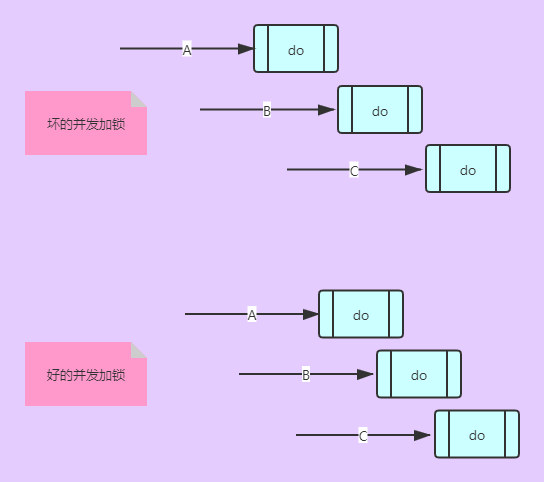
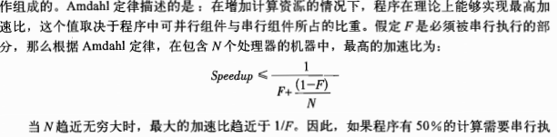

# Java并发编程实战 笔记

- [ ] 作者 [Brian Goetz](https://book.douban.com/search/Brian Goetz) / [Tim Peierls](https://book.douban.com/search/Tim Peierls) / [Joshua Bloch](https://book.douban.com/search/Joshua Bloch) / [Joseph Bowbeer](https://book.douban.com/search/Joseph Bowbeer) / [David Holmes](https://book.douban.com/search/David Holmes) / [Doug Lea](https://book.douban.com/search/Doug Lea)
- [ ] 笔记时间 2020.12.2


## Part 1 基础知识

### 第1章 简介

#### 1.1 并发简史

1. 早期计算机不包含操作系统,只能有一个程序,可以访问任何资源
2. 操作系统使得多进程出现,资源利用率上升
   1. 进程: 拥有存储指令和数据的空间,串行执行,拥有指令存储器,是资源分配的基本单位
   2. 线程: 共享进程资源,拥有独立的PC,栈和局部变量等,是调度的基本单位

#### 1.2 线程优势

1. 多处理器背景下,提高利用率,吞吐率
2. GUI里面提高响应(事件分发线程)
3. 建模简单化,将一个复杂任务分解为多个并行的任务组合
4. 异步处理

#### 1.3 线程带来的风险

1. 竞争条件(多个线程抢一个资源)
2. 活跃性(死锁,饥饿,活锁)
3. 性能(频繁切换导致开销过大)

#### 1.4 无处不在的线程

1. 框架通过再框架线程中调用应用程序代码将并发性引入到程序中.在代码中将不可避免的访问应用程序状态,因此所有访问这些状态的代码路径都必须是线程安全的
2. Timer类.TimerTask在Timer管理的线程中执行
3. Servlet(每个请求会包装成一个线程)
4. RMI(由RMI负责打包拆包远程对象)
5. Swing(具有异步性)

### 第2章 线程安全性

> 多个线程访问同一个可变的状态变量时没有使用合适的同步机制,可以用以下方法修复:
>
> 1. 不在线程间共享该变量
> 2. 将变量变为常量
> 3. 访问时候使用同步

#### 2.1 什么是线程安全性

1. 正确性: 某个类的行为与其规范完全一致

2. 线程安全性: 当多个线程访问某个类时,该类仍表现行为正确性,称这个类是线程安全的

3. 在线程安全类里面封装必要的同步机制,因此客户端无序同步

4. 大多数Servlet是无状态的,无状态就是线程安全的

   > 无状态:不包含任何域,也不包含对其他域的引用,只有计算过程的局部变量

#### 2.2 原子性

1. 竞争条件: 由于不恰当的执行顺序导致出现不正确的结果(最常见的就是先检查后执行)

   > 先检查后执行-栗子:延迟初始化,不安全的单例模式,懒汉模式
   >
   > 读取-修改-写入 栗子: count++导致的线程不安全

2. 解决方案: 原子操作

   > 使用juc 里面的类 
   >
   > 1. 比如count可以用AtomicLong类型操作 
   > 2. 多个操作可以用加锁机制

#### 2.3 加锁机制

> 内置锁:synchronized(lock),lock称为监视锁
>
> 重入锁:为锁(就是lock对象)关联一个持有者和计数值,持有者再次进入次数加一,当使用关键字synchronized时候默认实例方法的锁就是this,那么假如父类和子类的方法都是sync的,锁就要获取两次

#### 2.4　用锁来保护状态

1. 错误: 只有写入共享变量才需要同步

   > 栗子: 加法,假定数是线程安全,但是问题在实行加法未返回期间出现

2. 每个共享的和可变的变量应该由同一个锁维护
3. 不要滥用锁,下场就是vector

#### 2.5　活跃性与性能

1. 执行时间长的一定不要加锁(开启异步线程)



### 第3章　对象的共享

> synchronized不仅可以保证原子性还有内存可见性

#### 3.1　可见性

1. 失效数据(当一个线程修改数据,但其他线程不能立马看到)

2. 最低安全性(失效值至少是由之前的线程设置,而不是随机值)

3. 大多数变量都是最低安全性,除了 非volatile类型的64位操作(double和long),jvm允许将64位操作拆解为2个 32位操作

4. 内置锁保证可见性

5. **volatile**: 保证可见性,禁止指令重排,不保证原子性(使用场合:保证自身可见性,引用对象状态可见性,标识重要的生命周期事件)

   > 当且仅当满足以下所有条件时,才应该使用volatile变量:
   >
   > - 对变量的写入操作不依赖变量的当前值或者只有单个线程更新值
   > - 该变量不会与其他状态变量一起纳入不变性条件
   > - 在访问变量时不需要加锁

#### 3.2 发布与逸出

**发布**: 使对象能够在当前作用域之外的代码中使用

**逸出**: 当某个不应该发布的对象被发布

> 常见逸出情况有:
>
> 全局变量
>
> 发布内部类对象:不要在构造过程中使this引用逸出(使用私有构造器或者工厂方法)
>
> 发布私有对象引用(get方法返回实例)

#### 3.3 线程封闭

**线程封闭**: 如果仅在单线程访问数据,就不需要同步

> swing: 将组件放到事件分发线程
>
> JDBC.Connection对象: 大多数请求都是单线程采用同步方式处理

**Ad-hoc**: 核线程封闭性的职责完全由程序实现来承担(脆弱,少用)

**栈封闭**: 只能通过局部变量访问对象(Java基本类型或者局部变量)

**ThreadLocal类**: 提供getter和setter,位每个使用该变量的线程存有一份独立的副本

> ThreadLocal<T>包含了Map<Thread,T> 类型对象,其中保存了特定于改相称的值,当线程终止后gc会回收这些值

#### 3.4 不变性

满足同步需求的一种方法使用不可变对象.(lambda表达式就要求变量要有不变性,参考Java8实战)

满足以下条件,对象才是不可变的:

1. 创建以后状态不可修改
2. 所有域都是final
3. 对象正确创建

> 通过将一个保存新状态的实例来"替换"原有的不可变对象

**final**: 确保初始化过程的安全性,共享时无需同步(用好private和final)

#### 3.5 安全发布

不正确的发布:正确的对象被破坏(没有同步,失效值)

由于不可变对象很重要,Java内存模型位不可变对象的共享提供一种特殊的初始化安全性保证.

一个正确构造的对象可以通过以下方式安全发布:

1. 静态初始化函数中初始化一个对象引用
2. 引用保存到volatile域或者AtomicReference对象中
3. 引用保存到某个正确构造对象的final域
4. 引用保存到锁保护的域(容器也可)


不可变对象 可以放宽到 **事实不可变对象**(对象在发布之后不会改变状态)

可变对象必须通过安全方式发布,并且必须是线程安全的或者锁保护起来

tips:共享对象实用策略

1. 线程封闭
2. 只读共享
3. 线程安全共享:对象内部实现同步
4. 保护对象:锁机制

### 第4章 对象的组合

#### 4.1 设计线程安全的类

1. 在设计线程安全类的过程中，常会包含以下三个基本要素: 
   1. 找出构成时象状态的所有变量。
   2. 找出约束状态变量的不变性条件。
   3. 建立对象状态的并发访问管理策略。

如果不了解对象的不变性条件和后验条件,就无法确保线程安全性

2. 先验条件(队列非空)一种简单方法就是阻塞队列或者信号量,利用已经实现的类库

#### 4.2 实例封闭

1. 将数据封装在对象内部,更容易确保线程访问数据是由正确的锁

2. Java监视器模式:编写代码的约定,对于任何一种所对象,自始至终使用该所对象,都可以用来保护对象状态(建议参考Java核心技术卷Ⅰ 14.5.7)
3. 由于使用副本进行返回,性能消耗在所难免,需要考虑(毕竟Java8也有CopyOnWriteArrayList)

#### 4.3 线程安全性的委托

1. 将保证线程安全的职责委托给线程安全类

   ```java
   // 非委托
   class Adder{
       private int val = 0;
   	public synchronized int inc(){
           return val++;
       }
   }
   // 委托
   class Adder{
       private AtomicInteger val = new AtomicInteger(0);
   	public int inc(){
           return val.incrementAndGet();
       }
   }
   ```

2. 假如多个向量互不相关,可以将安全性委托给多个变量

3. 委托失效

   > 多个变量间有不变性条件,比如大小关系等,需要加锁,除非复合操作可以由线程安全类保证

4. 如果一个状态变量是线程安全的,并且没有任何不变型条件约束它,变量操作也没有不允许的状态,那么就可以安全发布该变量

#### 4.4 扩展线程安全类

1. 通过继承(不推荐)
2. 客户端加锁(使用辅助类,容易造成假同步现象,就是所对象错误)
3. 组合

#### 4.5 同步策略文档化

1. 接口是否线程
2. 执行回调时候是否持有锁
3. 是否某些特定锁影响类的行为


### 第5章 基础构建模块

#### 5.1 同步容器类

Vector和Hashtable(状态封装,每个方法同步),但是客户端不加锁仍会出错(比如迭代时候其他线程增删元素)

1. 迭代器与并发修改异常

   > fail-fast: 迭代过程中发现元素被修改,立即抛出ConcurrentModificationException
   >
   > 问题假如多个线程修改,由于可见性,有可能看到的是失效值(modCount并没有声明为volatile类型)

2. 解决方案: 迭代加锁(不建议)  克隆容器(看情况分析)
3. 隐藏的迭代器(某些操作底层隐藏着调用迭代器比如集合的toString)

#### 5.2 并发容器

1. ConcurrentHashMap 

   > 使用分段锁,具有弱一致性,同时size和isEmpty是估计并不精确
   >
   > 只有需要独占Map,才不建议使用该Map(比如客户端加锁创建新的原子操作)

2. CopyOnWriteArrayList 

   > 每次修改都是返回副本,建议迭代多修改少的时候使用

3. Queue 

4.  BlockingQueue

   > 生产者和消费者,假如该队列还不能设计需求,可以使用Semaphore等进行补充
   >
   > LinkedBlockingQueue 和 ArrayBlockingQueue 比同步List更好 FIFO
   >
   > PriorityBlockingQueue 优先级排序
   >
   > SynchronousQueue 不是一个实际的队列,维护一组线程,这些线程等待着把元素移入移出队列

#### 5.3 串行封闭性

对于可变对象,生产-消费促进串行封闭,将对象所有权转移给消费者,只能有一个线程拥有对象

5. Deque
6. BlockingDeque
7. ArrayDeque
8. LinkedBlockingDeque

#### 5.4 阻塞方法 与 中断方法

1. 当某个方法抛出InterruptedException,说明该方法是阻塞方法,会努力提前结束阻塞状态
2. 代码中调用一个阻塞方法,必须处理中断响应.
   1. 捕获/抛出异常
   2. 恢复中断.调用当前线程的interrupt


#### 5.5 同步工具类

1. 阻塞队列
2. 信号量:类似发布凭证,但是任意线程都可以发布和返还
3. 栅栏: 阻塞一组线程,直到某个条件满足;如果有某个线程await期间中断或者超时,所有阻塞的调用都会终止并抛出BrokednBarrierException
4. 闭锁 : 延迟线程进度,直到条件满足 Latch  FutureTask也可以做闭锁

#### 5.6 构建高效且可伸缩的缓存

1. HashMap => 同时存取存在并发问题,需要sync,但是性能太差
2. ConcurrentHashMap  => 不用加锁,但是存在 检查-修改 导致多次计算
3. 直接存储结果,假如计算过程太久会出现多个线程计算同一个值,使用 FutureTask 作为值缓存,取的时候只需要get()自动阻塞  存在多个线程计算同一个值的问题
4. putIfAbsent() 原子操作,解决问题  

## Part 2 结构化并发应用程序

### 第6章　任务执行

#### 6.1　在线程中执行任务

1. 串行执行任务(响应会慢假如有IO的话,服务器资源利用率低)
2. 显式为每个请求申请一个线程(创建销毁浪费时间,浪费资源,稳定性不足(OOM))
   1. 任务处理线程从主线程分离,提高响应速度
   2. 任务可以并行处理,提高吞吐量
   3. 任务处理代码必须是线程安全的,多个线程会并发执行

#### 6.2　Executor框架

> Executor基于生产-消费模式,提交任务相当于生产者,执行任务的线程相当于消费者.

1. 执行策略:
   1. What: 在什么线程中执行任务,按什么顺序执行
   2. How Many: 多少并发,多少等待
   3. Which: 拒绝选择什么任务
   4. How: 怎么通知任务成功/失败

2. **线程池**:管理一组同构工作线程的资源池,跟工作队列密切相关

3. Executor 生命周期

   > 为了方便管理,使用ExecutorService ,三种状态 
   >
   > 运行 : 对象新建时就是运行状态
   >
   > 关闭 : 不接受新任务,同时等待已有任务完成,包括未执行的任务,关闭后任务再提交由 "拒绝执行处理器" 处理或者直接抛异常
   >
   > 终止 : 关闭后任务完成

4. 延迟任务和周期任务

   > Timer类可以负责,但是存在缺陷,应该考虑ScheduledThreadPoolExecutor代替它
   >
   > Timer: 只用一个线程执行定时任务,假如某个任务耗时过长,会影响其他任务的定时准确性.除此之外,不支持抛出异常,发生异常将终止线程(已调度未执行线程不会执行,称为线程泄露)
   >
   > DelayQueue: 实现阻塞队列,并为ScheduledThreadPoolExecutor提供调度策略,可以使用这个

#### 6.3 找出可利用的并行性

1. 将耗时的IO使用别的线程获取,再填充;而不是简单的串行执行

2. Future 表示一个任务的生命周期,并提供相应的方法判断完成/取消,get会阻塞或哈抛异常
3. 异构任务并行化获取重大性能提升很困难.
   1. 任务大小不同
   2. 负载均衡问题
   3. 协调开销

4. CompletionService 将 Executor和BlockingQueue结合在一起,计算完成时可以执行代码

5. 为任务设置时限

### 第7章 取消和关闭

利用中断进行取消

#### 7.1 任务取消

原因很多: 错误,超时,关闭等,Java没有安全的抢占式方法停止线程.

1. 协作机制能设置取消位,任务定期查看该标识,假如置位就提前完成任务(假如线程阻塞了,就看不到取消位,那么就停不下来了)

2. 中断: 在取消之外的其他操作中使用中断,是不合适的

   > 每个线程都有一个中断标志,interrupt中断目标线程,interrupted清除中断; 
   >
   > Thread.sleep和Object.wait都会检查线程什么时候中断,发现时提前返回(不会立即响应,只是传递请求而已)

3. 中断策略: 尽快推迟执行流程,传递给上层代码;由于每个线程拥有各自的中断策略,除非知道中断对这个线程的含义,否则不应该终端该线程

4. 响应中断: 
   1. 传递异常(捕获到异常,调用interrupt)
   2. 恢复中断状态,使上层代码对其处理
   3. 不要在外部线程安排中断
5. 通过Future实现取消
6. 处理不可中断的阻塞
   1. java.io中的同步Socket I/O.通过关闭Socket可以使阻塞线程抛出异常
   2. java.io中的同步 I/O.终端一个InterruptibleChannel会抛出异常并关闭链路
   3. 获取某个锁. Lock提供lockInterruptibly

7. 通过newTaskFor 方法进一步优化

#### 7.2 停止基于线程的服务

> 除非拥有某个线程,否则不能对该线程进行操作
>
> 对于持有线程的服务,只要服务存在时间对于创建线程的方法的存在时间,那么就应该提供生命周期的方法

1. 日志服务

   > 生产者写入消息到阻塞队列,消费者将消息写入日志文件,停止日志服务需要正确取消/关闭线程
   >
   > 1. 使用标志位(存在 判断-执行 问题,会出现生产者在服务关闭后依旧写入消息),使用原子操作检查标志位

2. 关闭ExecutorService

   > 将日志服务委托给ExecutorService

3. "毒丸"现象

   > 当得到"毒丸"对象队列立即停止,只有生产者和消费者数量已知情况才能使用

4. shutdownNow局限性

   > 会尝试取消正在执行的任务,返回已提交未执行的任务

#### 7.3 处理非正常的线程终止

> 1. try-catch
> 2. UncaughtExceptionHandler: 检测某个线程由于未捕获的异常而终结的情况
> 3. 通过execute提交的任务才能交给UncaughtExceptionHandler处理,submit提交的话或被包装在get里面ExecutionException

#### 7.4 JVM关闭

> 正常关闭 :最后一个非守护线程结束,调用System.exit() 或者 Ctrl-C 
>
> 强行关闭: Runtime.halt()  操作系统"杀死"jvm进程

1. 关闭钩子

   > 正常关闭中,JVM首先调用所有已注册的关闭钩子(通过Runtime.addShutdownHook注册单位开始的线程).关闭应用程序线城市,如果由线程仍在运行,钩子线程并行执行.当所有钩子线程结束,如果runFinalizersOnExit为true,那么jvm经运行终结器.

2. 守护线程

   > 和普通线程差别在于线程退出的操作,如果只剩下守护线程,jvm会自动关闭,守护线程不会执行finally也不会执行回卷栈 少用

3. 终结器

   > - 垃圾回收器发现这些对象实现了finalize()方法。因为会把它们添加到java.lang.ref.Finalizer.ReferenceQueue队列中
   > - Finalizer线程会处理这个队列，将里面的对象逐个弹出，并调用它们的finalize()方法。
   > - finalize()方法调用完后，Finalizer线程会将引用从Finalizer类中去掉，因此在下一轮GC中，这些对象就可以被回收了

### 第8章 线程池的使用

#### 8.1　在任务与执行策略之间的隐性耦合

- 依赖性任务可能会导致活跃性问题
- 使用线程封闭机制的任务
- 对相应时间敏感的任务
- 使用ThreadLocal的任务

1. 线程饥饿死锁

   > 单线程,将相互依赖的任务提交到同一个Executor
   >
   > 如果线程池过小,多个任务通过Barrier进行协调也会饥饿死锁

2. 运行耗时时间长的任务

   > 即使不出现死锁,也会降低性能,通过限制执行时间可以缓解

#### 8.2 设置线程池的大小

> Runtime.availableProcessors

1. 计算密集 Ncpu个处理器,线程池大小Ncpu+1

2. IO密集型 Nthread = Ncpu * Ucpu * (1 + W/C)

   > Ucpu = cpu的利用率,0~1之间
   >
   > W/C  = 等待/计算时间比

#### 8.3 配置ThreadPoolExecutor

1. 线程创建与销毁

   > **基本大小**(核心线程数): 没有任务执行时候线程池大小,只有工作队列满了才会创建超出这个数量的线程
   >
   > **最大大小**: 表示可同时活动的线程数量上限
   >
   > **存活时间**: 如果线程空闲时间超过存活时间,会被标记可回收,当线程池超过基本大小,线程会被终止

2. 管理队列任务

   > ThreadPoolExecutor允许提供一个阻塞队列保存等待执行的任务
   >
   > 无界队列 有界队列 同步移交
   >
   > 对耶非常大的线程池,可以通过SynchronousQueue避免任务排队

3. 饱和策略

   > 等待队列满了,饱和错略工作
   >
   > 1. Abort: 默认,抛异常
   > 2. Discard: 丢弃最旧的任务
   > 3. Caller-Runs: 回退到调用者
   > 4. 无界队列可以使用信号量进行饱和策略

4. 线程工厂

   > ThreadFactory,可以通过Executor的privilegedThradFactory定制自己的线程工厂

5. 调用构造函数后再定制ThreadPoolExecutor

#### 8.4 扩展ThreadPoolExecutor

beforeExecute: 假如发生异常,任务不执行

afterExecute: 一定会被调用(finally里面的效果)

terminated: 线程池关闭时调用

#### 8.5 递归算法并行化

1. 如果迭代操作之间时独立的,直接可以并行执行
2. 递归不依赖于后续递归的结果


### 第9章 GUI

> GUI限制在单程程,几乎所有工具包都被实现为单线程子系统

#### 9.1 为什么GUI是单线程的

早期GUI都是单线程的,在"主事件循环"进行处理事件.当前的GUI采用"事件分发线程"进行处理事件.采用一个专门的线程从队列中抽取事件,并将他们转发到应用程序定义的事件处理器

多线程处理容易引发死锁,其次就是MVC设计模式

1. 串行事件处理

   > 优势: 代码编写简单
   >
   > 劣势: 处理耗时长的任务,发生无响应现象(可以委派给另一个线程完成)

2. Swing的线程封闭机制

   > 所有Swing组件和数据模型对象都封闭在事件线程中,任何访问它们的代码必须在事件线程里
   >
   > invokeLater 和 invokeAndWait两个方法酷似 Executor

#### 9.2 短时间的GUI任务

事件在事件线程中产生,并通过"气泡上升" 的方式床底给应用程序

Swing将大多数可视化组件分为两个对象(模型对象和视图对象),模型对象保存数据,可以通过引发事件表示模型发生变化,视图对象通过订阅接收事件

#### 9.3 长时间的GUI任务

对于长时间的任务可以使用线程池

1. 取消 使用Future
2. 进度标识 

#### 9.4 共享数据模型

1. 只要阻塞操作不会过度影响响应性,那么事件线程和后台线程就可以共享该模型
2. 分解数据模型.将共享的模型通过快照共享


#### 9.5 其他形式单线程

每当某个工具需要被实现为单线程子系统都可以使用.一些原生的库


## Part 3 活跃性 性能与测试

#### 第10章 避免活跃性危险

#### 10.1 死锁

1. 死锁(哲学家进餐)

   > 数据库通过事务解决
   >
   > 如果所有线程以固定的顺序获取锁,那么就不会出现顺序死锁问题

2. 动态锁的顺序死锁

   > 执行顺序可能会导致死锁,通过定义执行顺序可以避免,还可以使用加时赛锁消除死锁可能性

3. 协作对象的死锁

   > 如果在持有锁时调用外部方法,将会出现活跃性问题,这个外部方法可能阻塞,加锁等导致其他线程无法获得当前被持有的锁

4. 开放调用

   > 如果调用某个方法时不需要持有锁,那么这种调用称为开放调用

5. 资源死锁

   > 线程饥饿死锁就是其中一种

#### 10.2 死锁的避免与诊断

> 使用两阶段策略检查死锁:首先找出什么地方获取多个锁,然后进行全局分析,确保获取所得顺序保持一致

1. 支持定时的锁

   > Lock.tryLock()代替内置锁

2. 通过线程转存信息分析死锁

   > jvm通过信息查出死锁,显示Lock信息精度低

#### 10.3 其他活跃性危险

1. 饥饿

   > 线程由于无法访问它所需要的资源而不能继续执行,避免使用线程优先级,可能导致活跃性问题

2. 糟糕的响应性

3. 活锁

   > 线程不断重复执行相同的操作,而且总会失败(常见于处理事务消息的应用程序),可以在重试机制里面加入随机性

### 第11章 性能与可伸缩性

#### 11.1 对性能的思考

可伸缩性: 增加计算资源时,程序吞吐量相应增加

性能: 更少资源做更多事

1. 性能的"多块"和"多少"可能是矛盾的
2. MVC说明提高可伸缩性,会有性能损耗

#### 11.2 Amdahl定律



1. 如果能准确估计执行过程中串行所占比例,Amdahl就更具准确性

#### 11.3 线程引入的开销

1. 上下文切换开销
2. 内存同步(jvm能通过逸出分析,编译器锁粒度粗化)
3. 阻塞(非竞争的同步可以在JVM处理,竞争的同步需要操作系统介入,竞争失败的线程必定阻塞,可以采用自旋/阻塞)

#### 11.4 减少锁的竞争

> 并发程序中,对伸缩性最主要的问些就是独占方式的资源锁
>
> 1. 减少锁的持有时间
> 2. 降低锁的请求频率
> 3. 使用带有协调机制的独占锁

1. 快进快出(减小范围)

2. 减小粒度(锁分解/分段)

   > 劣势: 开销更高

3. 避免热点域

4. 替代独占锁的方法

   > ReadWriteLock
   >
   > 原子变量
   >
   > 

5. 监视CPU利用率

   > 过低时可能负载不足,IO密集,锁竞争

6. 不要使用对象池(对象分配操作比同步开销低)

#### 11.6 减少上下文开销

1. 日志记录由专门的线程负责
2. 请求服务的时间不应该过长
3. 将IO分离出来


### 第12章 并发程序的测试

性能测试: 吞吐量 响应性 可伸缩性

#### 12.1 正确性测试

1. 调用各个方法,验证后验条件和不变型条件

2. 阻塞操作的测试:当方法成功阻塞后必须是方法解除阻塞

   > 使用终端,在一个单独线程中启动一个阻塞操作,等到线程阻塞后再中断它,然后宣告阻塞成功.
   >
   > Thread.getState不可靠.被阻塞线程不需要Waiting状态,jvm可以通过自旋实现阻塞.类似Object.wait和Condition.wait存在伪唤醒

3. 安全性测试:

   > 生产者-消费者 可以通过一个对吮吸敏感的校验和计算函数来计算所有入列原色和出列元素的校验和,一致则通过

4. 资源管理测试

   > 使用堆查看的工具

5. 使用回调

   > 线程池可以使用自定的线程工厂

6. 产生更多的交替操作

   > Thread.yield(Thread.sleep虽然更慢,但是更可靠一些)

#### 12.2 性能测试

1. 增加计时功能

   > 使用栅栏进行计时

2. 多种算法的比较
3. 响应性衡量

#### 12.3 避免性能测试的陷阱

1. 垃圾回收(无法预测)

   > 要么不执行,要么执行多次

2. 动态编译

   > 运行足够长时间或者与先运行一段时间并且不测试代码性能

3. 对代码路径的不真实采样

   > JVM可以与执行过程特定的信息生成更优的代码,编译器也会优化

4. 不真实的竞争程度

   > 尽量模拟真实情况,CPU密集型或者IO密集型

5. 无用代码的删除

   > 技巧 计算某个派生类的散列值,与任意值比较,加入相等就输出一个无用且可被忽略的消息

#### 12.4 其他测试方法

1. 代码审查
2. 静态分析工具(FindBugs等)
3. 面向方面的测试技术(06年就有AOP,感慨一下)
4. 分析与检测工具(JMX等)

## Part4 高级主题

### 第13章 显式锁

#### 13.1 Lock和ReentrantLock

> 轮询,定时:tryLock实现,可避免死锁
>
> 可中断:lockInterruptibly
>
> 非块结构加锁


#### 13.2 性能因素

内置锁已经不比显式锁性能差

#### 13.3 公平性

ReentrantLock提供公平性选择,非公平锁可以插队(不提倡,但是不阻止),性能相比公平锁会好一些

#### 13.4 选择

优先内置锁,实在不行再显式锁

#### 13.5 读写锁

ReentrantReadWriteLock 实现可重入,默认非公平,写锁可以降级为读锁

### 第14章 构建自定义的同步工具

最简单的方式使用已有类进行构造

#### 14.1 状态依赖性的管理

将前提条件未满足则失败 改为 前提条件满足则执行,也就是阻塞

生产者消费者可以利用阻塞队列

1. 通过抛异常表示失败一次,不如自旋/阻塞(或者调用yield)
2. 通过轮询与休眠实现简单的阻塞(存在不需要的睡眠时间),可以通过中断唤醒,休眠时候持有锁很危险

3. 条件队列:Object.wait notify 和 notifyAll构成内部条件队列的API,wait会释放锁(本质和轮询与休眠是一样的)

#### 14.2 使用条件队列

1. 条件谓词:将图条件队列相关的条件谓词以及为此上等待的操作写入文档

   条件等待中存在一种重要的三元关系,包括枷锁,wait和一个条件谓词

   每一次调用wait都会与特定的条件谓词联系起来.调用者必须已经持有与条件队列相关的锁,并且这个锁必须保护着构成条件谓词的状态变量

2. 过早唤醒

   一个线程由于调用notifyAll醒来,不意味着它的等待条件谓词已经为真.每当线程醒来必须再次测试条件谓词(使用循环)

3. 丢失的信号

   线程必须等待一个已经为真的条件,但是再开始等待之间没有检查条件谓词

4. 通知
   条件满足后尽快通知,建议优先notifyAll

   只有 所有等待线程类型相同 并且单进单出采用notify

5. 子类安全问题

   如果子类违背了通知条件,需要增加合适的通知机制代表基类

   所以,要么向子类完全公开,要么禁止继承

6. 封装条件队列

7. 入口与出口协议

   入口协议: 操作的条件谓词

   出口协议: 检查该操作修改的所有状态变量,确认他们是否使某个条件谓词成真,若是,通知相关队列

#### 14.3 显示Condition

对应方法是await signal 和 signalAll

#### 14.4 Synchronizer剖析

通过Lock实现信号量,两者十分相似,都有共同基类AQS

#### 14.5 AbstractQueueSynchronizer

AQS负责管理一个整数状态信息,获取操作可以是独占也可以是非独占的

更新同步器状态可以通过添加一些操作实现不同的锁机制

通过委托给AQS处理,而不是直接扩展AQS

#### 14.6 JUC同步器类中的AQS

1. ReentrantLock 独占,实现tryAcquire tryRelease isHeldExclusively 使用cas进行获取
2. Semaphore 和 CountDownLatch tryAcquire也是cas

3. FutureTask 不像一个同步器,AQS同步状态用来保存任务状态
4. ReentrantReadWriteLock 使用一个16位状态表示读取所的计数,AQS内部维护一个等待队列,记录某个线程独占访问还是共享访问

### 第15章 原子变量与非阻塞同步机制

非阻塞实现难度大,单丝不存在死锁和其他活跃性问题. 不会受到单线程失败影响,更高效

#### 15.1 锁的劣势

JVM对非竞争锁进行优化,但是如果多个线程同时请求锁,就要借助操作系统,开销是很大的.相比之下volatile是更清凉的同步机制,但是没有原子性

还会出现优先级反转(阻塞线程优先级高,但是后执行),死锁等问题

#### 15.2 硬件对并发的支持

独占锁是悲观锁,总是假设最坏情况,只有确保其他线程不会干扰才能执行

乐观锁:Test-and-Set CAS等

1. CAS 读取内存位置V 进行比较的值A 写入的值B

   如果V等于A,就写入B,不等则返回V

2. 非阻塞的计数器
   看起来操作会更多次,但是在竞争不激烈的情况下,性能比锁优秀

   缺点使调度者处理竞争问题

3. JVM编译位底层硬件支持的有效方法,假如不支持CAS,jvm将采用自旋锁

#### 15.3 原子变量类

1. 粒度最细的情况,相当于泛化的volatile变量,"更好的volatile"

2. 性能比较: 锁与原子变量

   在高度竞争情况下,锁性能更好,正常情况下,原子变量性能更好

#### 15.4 非阻塞算法

如果在某种算法中,一个线程的失败或者挂起不会导致其他线程也失败或挂起,那么这种算法称为非阻塞算法

如果在算法的每个步骤都纯在某个线程能够执行下去,这种算法称为无锁算法

1. 非阻塞的栈 使用cas进行操作

2. 非阻塞的链表 Michale-scott算法

3. 原子的域更新器

   表示现有volatile域的一种基于反射的视图,能够在已有的volatile域上使用cas

4. ABA问题

   取到V值以后测试等于A,在写入之前,其他线程偷偷改了B,再改回A.适用版本号可以解决

### 第16章 Java内存模型

#### 16.1 内存模型是什么

并行架构允许处理器乱序执行,缓存可能会改变将写入变量提交到主存的次序;处理器本地缓存对其他处理器不可见.编译器生成的指令顺序优化,变量可能存在寄存器  这里原因会导致一个线程无法看到变量最新值

1. 平台的内存模型

   多处理器架构中,每个处理器有自己的缓存,并定期与主存协调

   时刻保持处理器知道其他处理器的工作是不必要的,内存栅栏可以提供额外的存储保障

   **串行一致性**: 程序中只存在唯一的操作执行顺序,不考虑操作在和中处理器执行,每次读取变量都能获得执行序列中最近一次写入的值

2. 重排序

   同步将限制编译器 运行时和硬件对内存造作重排序的方式,从而实施重排序时不会破坏JMM提供的可见性保证

3. Java内存模型简介

   JMM位所有操作定义了一个偏序关系,称为Happens-Before,

   > 规则如下:
   >
   > **程序顺序规则**: A操作在B操作之前,那么线程A操作将在B操作之前
   >
   > **监视器锁规则**: 在监视器锁上的解锁操作必须在同一个监视器锁的枷锁操作之前执行
   >
   > **volatile变量规则**: 对volatile变量的写入操作必须在都操作之前执行
   >
   > **线程启动规则**: 线程上对Thread.start的调用必须在该线程中执行任何操作之前执行
   >
   > **线程结束规则**: 线程中任何操作必须在其他线程检测到该线程已经结束之前执行或者从Thread.join返回或者盗用Thread.isAlive返回false
   >
   > **中断规则**: 当一个线程在另一个线程上diaoyonginterrupt,必须在被中断县城检测到interrupt调用之前执行
   >
   > **终结器规则**:对象的构造函数必须在启动该对象的终结器之前执行完成
   >
   > **传递性**: 操作A在操作B之前执行,B在C之前,那么A在C之前

4. 借助同步
   - 将一个元素放入线程安全容器的操作将在另一个线程重容器获得该元素之前执行
   - 在CountDownLatch上的倒数在做将在线程从比锁上的await返回之前执行

#### 16.2 发布

1. 不安全的发布

   ​	当缺少Happens-Before关系时候,就可能出现重排序问题,这就解释了为什么没有同步情况下发布一个对象会导致另一个线程看到一个只被部分构造的对象

   ​	除了不可变对象以外,使用被另一个线程初始化对象通常都是不安全的除非对象发布操作在使用该对象的线程之前执行

2. 安全发布

   使用锁或者volatile变量可以确保读写操作按照 Happens-Before 排序

3. 安全初始化

   ​	创建对象的getInstance直接加锁(假如竞争不激烈,性能不会差)

   ​	静态初始化其由jvm在类初始化阶段执行并获得一个锁,每个线程至少获取一次这个锁以确保类一被加载,因此,内存写入操作对所有线程可见(仅使用构造时状态)

   ​	延迟初始化加上静态构造(静态内部类)

4. 双重检查锁 注意使用volatile 但是已经废弃,建议使用延迟初始化占位类模式,就是静态内部类模式

#### 16.3 初始化过程的安全性

初始化安全性只能保证通过final域科大的值从构造过程完成时开始的可见性.对于通过非final域可达的值,或者构成完成之后可能改变的值,必须采用同步确保可见性