# Java核心技术 卷Ⅱ 高级特性 笔记

- [ ] 作者: CayS.Horstmann
- [ ] 笔记时间: 2020.12.06 


## 第 1 章 Java SE 8 的流库

由于之前看过java8实战,所以这里就只是简单记录

### 1.1 从迭代到流操作

1. 不存储元素
2. 不会修改数据源
3. 流操作尽量惰性执行

### 1.2 流的创建

1. Stream.of() 集合变成流
2. Array.stream() 数组变成流
3. Stream.empty() 不含元素的流
4. Stream.generate() 无限流,
5. Stream.iterate() 无限流
6. Files.lines 
7. Pattern.splitAsStream()

### 1.3 filter map 和flapMap方法

### 1.4 limit,skip,concat

### 1.5 distinct sorted peek

### 1.6 简单规约

count max min 

findFirst findAny 

anyMatch allMatch noneMatch

 返回值都是Optional类型,都是终结操作

### 1.7 Optional类型

#### 1.7.1 如何使用Optional值

它的值在不存在的情况下会产生可替代物,而只有在值存在情况下才会使用这个值

栗子: 当没有任何匹配的时候,我们希望是空字符串而不是空指针

orELse()/ orElseGet() /orElseThrow()  当Optional值不存在时替代产物

ifPresent() 存在则处理

map() 类似stream.map,假如不存在则返回Optional.empty()

#### 1.7.2 不适合使用Optional值的方式

如果没有正确使用Optional值,相较以往得到"某物或者null",并没有任何好处,因为get会抛异常(跟抛空指针异常并没有差别)

#### 1.7.3 创建Optional值

Optional.of()会抛异常  Optional.empty()  

Optional.ofNullable() 有值返回of(),没值返回empty()

#### 1.7.4 用flatMap构建Optional值的函数

Optional.flatMap() 将mapper应用于当前Optional值所产生的结果,空时返回empty()

### 1.8 收集结果

forEach()

toArray(String[]::new) : 因为无法在运行时创建泛型数组,所以传递正确的类型

collect(Collectors.joining())连接

summarizing(Int/Long/Double) 可以获取总和 平均值 最大值 最小值

### 1.9 收集到映射表(Map)中

Collectors.toMap()当需要元素自身时候使用Function.identity()

对于每一个toMap方法,都有一个等价的toConcurrentMap()

### 1.10 分组和分区

Collectors.groupingBy()

Collectors.partitioningBy()

### 1.11 下游收集器

groupingBy()方法会产生一个映射表,每个值都是一个列表.如果想要处理这些列表,就需要提供一个"下游收集器"(第二个参数)

通过静态导入Collectors.*,会更具阅读性

将群组元素规约为数字的收集器:

	1. counting()
 	2. summing(Int|long|Double)
 	3. maxBy | minBy
 	4. mapping 方法会产生将函数应用到下游结果上的收集器,并将函数值传递给另一个收集器

### 1.12 规约操作

reduce方法实现规约,返回Optional对象

当reduce收集不够通用时候,可以选择collect,接收一个提供者,一个累积器,一个组合器

### 1.13 基本类型流

避免装箱/拆箱带来的消耗,在Stream前面加上对应的类型

(Int|Double|...)Stream

通过 of() / Arrays.toStream() / mapToInt()可以获取到对应流,

boxed()获得包装流

区别:

1. toArray()获得基本类型
2. 产生可选结果返回Optional(Int|Long|Double)类型
3. summaryStatistics方法产生基本类型的SummaryStatistics对象

### 1.14 并行流

parallelStream() 传递给并行流操作的函数不应该被阻塞.并行流使用fork-join池操作流的各个部分.

正常工作条件:

1. 数据应该在内存里,必须等到数据到达十分低效
2. 流应该可以被高效分成若干部分
3. 应该具有较大规模计算量
4. 流操作不应该被阻塞

## 第 2 章 输入与输出

### 2.1 IO流

字节流 InputStream OutputStream(不方便处理字符)

字符流 Reader Writer 基本单位两字节的Char类型


#### 2.1.1 读写字节

InputStream的抽象方法read,读入一个字节,若无返回-1;

OutputStream的抽象方法write,写出一个字节;

都是阻塞方法

available() 方法检查当前可读入的字节数量

最后记得close  可以使用 flush() 刷新缓冲区

#### 2.1.2 流家族

基本分类为 字符流 和 字节流 即可,家族60+流,不必记住


注意: 

Closeable扩展了AutoCloseable.可以使用try-with-resource 语句

前者的close只抛出IO异常,后者可以抛出任何异常

CharBuffer拥有随机读写访问方法

CharSequence接口描述一个char值序列的基本属性

java.io中的类将相对路径解释为亿用户工作目录开始.可以通过调用System.getProperty("user.dir")获取信息

Windows文件处理的系统调用需要转义 "//" ,不建议 \ 因为可能会发生变化,java.io.File.seperator可以获取

### 2.2 文本输入与输出

存储时候需要考虑编码,默认UTF-16,但是UTF-8在网络传输更通用

具体Reader构造时候可以传入字符集类型 StandardCharsets.UTF_8

#### 2.2.1 写出文本

文本输出   PrintWriter 使用同System.out,默认自动刷新机制是禁用的,构造的时候可以选择启用(启用状态下,println会自动刷新缓冲)

#### 2.2.2 读入文本

最简单就是Scanner类

1. 短小文本  new String(Files.readAllBytes(path),charset);
2. 一行一行  Files.readAllLines(path,charset);
3. 大文件 try(lines = Files.lines(path,charset)){}
4. 早期只有BufferedReader类,如今有lines方法,可以产生流对象

#### 2.2.3 文本格式存储对象

写对象: 使用分隔符进行区分属性值,拼接属性写入文件

读对象: 读一行使用分隔符分割,字符转基本类型,构造对象

要点 正则 换行

#### 2.2.4 字符编码方式


Java采用的UTF-16.分为高为优先和低位优先存储格式.文件可以以"字节顺序标记"开头确定字节顺序


ps:记事本(Windows)在UTF-8编码的文件开头添加了字节顺序标记,尽管不需要,但是可以让编码机制不留疑惑.但是Java并没有这么做,最好的做法时将输入中发现的所有先到的\uFEFF都剥离掉

最好总是明确指定编码方式,比如网页应该检查Content-Type头信息;有些方法默认平台编码方式(Charset.defaultCharset),而其他方法使用UTF-8

### 2.3 读写二进制数据

#### 2.3.1 DataInput 和 DataOutput

二进制方式写数组 字符 boolean和字符串 Java的值都是高位在前模式写数据

writeUTF是为了兼容Unicode没有超过16位构建的虚拟机,它先转UTF16再UTF-8进行编码.所以只在写出用于Java虚拟机的字符串才使用它.比如字节码生成程序

其他场合使用writeChars

#### 2.3.2 随机访问文件

RandomAccessFile类可以在文件中随机读写

seek() 定位

length() 总字节数

writeFixedString 写从字符串开始执行数量的码元

#### 2.3.3 ZIP文档

zip文档都有一个头,包含注入文件名字压缩方法等信息.可以使用ZipInputStream读取.

getNextEntry() 返回一个描述这些项的对象

getInputStream() 返回读取该项的输入流

closeEntry() 读入下一项

JAR是带有一个特殊项ZIP文件,项称为清单可以使用JarInputStream读取

### 2.4 对象IO流与序列化

#### 2.4.1 保存与加载序列化对象

ObjectOutputStream 对象 writeObject() 写一个对象,必须实现Serializable接口

当基本类型时候 使用 write(Integer|Double)等

每个对象都是用一个序列号保存的,算法如下:

1. 遇到每一个对象引用都关联一个序列号
2. 每个对象第一次遇到时,保存期对象数据到输出流中
3. 如果对象之前已经保存过,那么只写出"与之前保存公的序列号为x的对象相同"

#### 2.4.2 对象序列化的文件格式

每个文件都是以两个字节的"魔幻数字"开始的 AC ED 后面紧跟者队列序列化格式的版本号00 05

然后,是它包含的对象序列,其顺序就是他们存储的顺序

1. 字符串对象被存为 74 两字节表示的字符串长度 所有字符

   "Harry"  存为  74 00 05 Harry 字符串的Unicode被存储为修订过的UTF-8格式

2. 对象.这个对象所属的类也必须存储.

   类名 | 序列化的版本唯一的ID,它是数据域类型和方法签名的指纹 | 描述序列化方法的标志集 | 对数据与的描述

   指纹通过对类 超累 接口 与类型 和 方法签名按照规范方式排序,然后将安全散列算法(SHA)应用与这些数据而获得的.SHA总是20个字节,但是序列化机制只是用前8个字节

   ​	读入一个对象时,会拿指纹同类指纹进行比对,不匹配时会产生异常

   ​	类标识符存储

   - 72
   - 2字节的类名长度
   - 类名
   - 8字节的指纹
   - 1字节的标志
   - 2字节的数据域描述符的数量
   - 数据域描述符
   - 78
   - 超类类型(没有就是70)

   标志字节由ObjectStreamConstants定义的三位掩码构成

   数据域描述符格式:

   - 1字节的类型编码
   - 2字节的域名长度
   - 域名
   - 类名

   类型编码

   |      |         |
   | ---- | ------- |
   | B    | byte    |
   | C    | chat    |
   | D    | double  |
   | F    | float   |
   | J    | long    |
   | L    | 对象    |
   | S    | short   |
   | Z    | boolean |
   | [    | 数组    |
   | I    | int     |

   描述符相当长,如果需要相同的类描述符 可以使用:  71 4字节序列号

3. 对象存储为 :  73 类描述符 对象数据
4. 数组 : 75 类描述符 4字节数组项数量 数组项
5. 所有对象和所有类描述符存储室都赋予一个序列号,以 00 7E 00 00 开头
6. 空引用 70

#### 2.4.3 修改默认的序列化机制

transient 修饰表示不可序列化

可序列化类可以定义readObject 和 writeObject 方法.数据域就不会自动序列化,而是调用方法 java.util.Date 和 java.awt.geom.LabeledPoint都是栗子

类自定义自己的机制,实现Externalizable接口,对整个对象的存储和恢复负责

#### 2.4.4 序列化单例和类型安全的枚举

即使构造器是私有的,序列化机制也可以创建新的对象,为了解决这个问题,需要定义称为readResolve的特殊序列化方法.

请记住向遗留代码中所有类型安全的枚举以及所有支持单例设计模式的类中添加该方法

#### 2.4.5 版本管理

版本更迭可能导致类的指纹产生变化.

serialver Employee 可以获得指纹

这个类的所有交心版本都必须把 serialVersionUID常量 定义为 旧指纹

如果类只有方法变化,读入新对象不会有问题.数据域变化可能会出现问题

- 名字匹配,类型不匹配,强制转换
- 被序列化对象具有当前版本没有的,忽略
- 当前版本拥有被序列化对象没有的,设置默认值

#### 2.4.6 利用序列化克隆

可以用ByteArrayOutputStream保存数据到数组中,虽然灵巧,但是比clone()慢得多

### 2.5 操作文件

#### 2.5.1 Path

可以绝对路径,也可以相对路径

Paths.get()  接收一个或者多个字符串,并且连接起来(默认路径分隔符).不合法则抛异常

组合或解析路径.p.resolve(q) 如果q是绝对路径,就是q;否则"p后面跟着q"作为路径(还可以 resolveSibling() 同一个文件夹下替换不同的文件名字)

relativize() 相对化操作

normalize 将已出所有冗余

toAbsolutePath 获取绝对路径

Path.toFile()  File.toPath()

#### 2.5.2 读写文件

Files.reanAllBytes()

readAllLines()

write()

适合中等长度文本文件,如果二进制或者大文件,还是乖乖用流

#### 2.5.3 创建目录和文件

Files.createDirectory() 不会创建中间路径

createDirectories()	创建中间路径

createFile() 存在则抛异常.检查和创建是原子操作,此过程中其他程序不能执行文件创建操作

Files.createTemp(File|Directory)() 创建临时文件

#### 2.5.4 复制 移动 删除 文件

Files.copy()

move()	可以选择StandardCopyOption.常量 表示覆盖,原子操作等

delete() | deleteIfExists()

#### 2.5.5 获取文件信息

Files.exists()

isHidden()

isReadable() // 读 写 执行都可查

isRegularFile() // 普通文件 目录 符号连接

size() 返回字节数

readAttributes(path,BasicFileAttributes.class) //返回基本信息 创建时间 文件类型 大小 等

#### 2.5.6 访问目录中的项

Files.list()  返回Stream<Path>对象,

不会进入子目录,使用Files.walk()

#### 2.5.7 目录流

Files.newDirectoryStream() 返回目录流,它是迭代器,可以用增强for

可以使用 glob 模式进行过滤

如果想要访问某个目录的子孙成员,可以walkFileTree,传递FileVisitor对象(会根据对应文件访问调用不同的方法).

需要覆盖postVisitDirectory  和 visitFileFailed 方法,否则遇到不允许代开和不允许访问的文件会立即失败

可以利用这个进行目录树的删除

#### 2.5.8 ZIP文件系统

FileSystems.newFileSystem()获取文件系统,假如获得zip文件,它将建立zip文件系统

之后同操作普通目录,操作ZIP文档树

### 2.6 内存映射文件

操作系统可以利用虚拟内存实现来将一个文件或文件的一部分"映射"到内存中.然后,这个文件可以当作内存数组一样访问

#### 2.6.1 内存映射文件的性能

与随机访问相比,性能提高显著;但是对于中等尺寸文件的顺序读入则没有必要使用内存映射

java.nio 使得内存映射十分简单:

1. 获取一个通道(channel),是我们可以访问内存映射,文件加锁机制以及文件间快速数据传递等操作系统特性

   FileChannel.open()

   然后通过FileChannel.map()方法可以获取一个ByteBuffer,可以指定映射的文件与模式

   - FileChannel.MapMode.READ_ONLY,只读,写入触发异常
   - FileChannel.MapMode.READ_WRITE,可读可写
   - FileChannel.MapMode.PRIVATE 可写,不会传播到文件中

2. 可以通过get() put()操作来移动位置
   order()可以变成低位在前的存储方式

#### 2.6.2 缓冲区数据结构

Buffer类是一个抽象类,具有众多子类(StringBuffer没有在这里面)

缓冲区具有: 

- 一个容量(不可变)
- 一个读写位置
- 一个界限,超过它进行读写没有意义
- 一个可选的标记,用于重入一个读写操作

满足 0≤ 标记 ≤ 位置 ≤ 界限 ≤ 容量 


使用缓冲区的目的主要是执行"写,然后读入"循环,

调用flip方法,把界限设置到当前位置,并把位置复位0.

remaining方法返回正数(界限-位置),不断调用get读入

clear方法为下一次写做好准备(位置复位0,界限复位容量)

获取缓冲区可以ByteBuffer.allocate这样

#### 2.6.3 文件加锁机制

FileChannel.lock/tryLock 可以对文件加锁 第一个阻塞,第二个要么获得要么跳过

release() 释放锁

加锁可以设置共享锁/独占锁(甚至可以部分加锁)

注意:

1. 文件锁需要操作系统支持
2. 某些系统,不能锁定一个文件同时将其映射到内存中
3. 文件锁是有整个Java虚拟机持有.如果有两个程序由同一个虚拟机启动,尝试都获得锁,抛异常OverlappingFileLockException
4. 在某些系统,关闭一个通道会释放所有锁
5. 网络文件系统锁定文件高度依赖系统,尽力避免

### 2.7 正则

[详细看Pattern类的API文档]( https://docs.oracle.com/javase/8/docs/api/index.html)

1. Pattern.compile()获取一个pattern,然后调用matcher()获得一个Matcher对象.用它来检测字符串是否符合要求
2. 可以设置一个或者多个标志,比如忽略大小写,使用Unicode匹配等
3. 集合或者流匹配,将模式转换为谓词,pattern.asPredicate()
4. 如果包含群组,Matcher对象可以解释群组边界
5. replaceAll() 
6. split() 也可以惰性获取,splitAsStream() 如果不关心预编译模式和惰性获取,可以直接使用String.split()

## 第 3 章 XML 

### 3.1 XML文档概述

用property可以描述配置文件(键值对),在许多情况下,假如结构复杂描述就不方便.(现在yaml格式可以方便的做到,spring的配置文件可以使用)

1. 比如字体 font = Times Roman 12;可以通过font.item=xxx这种进行处理.

2. 另一个缺点,键值唯一

#### 3.1.1 XML文档的结构

1. 文档头开始(可选,建议写) &lt;?xml version="1.0" encoding="UTF-8"?&gt;
2. 通常接下来是DTD(Document Type Definition)&lt;!DOCTYPE configuration...&gt;
3. 正文包含根元素,根元素包含其他元素(避免混合式内容,要么文本,要么标签)
4. 元素可以添加属性,应该用来修改值的解释,比如单位

5. 一些标记
   - 字符引用 &# 十进制
   - 实体引用 &name;  name可以取值 lt  gt  amp  quot apos 等
   - CDATA 不解释标签  &lt; ![CDATA[something.....]]&gt;
   - 处理指令 &lt;?  ...  ?&gt;
   - 注释  &lt;!--  --&gt;

### 3.2 解析XML文档

Java提供了 DOM(Document Object Model)的属树型解析器 和 SAX(simple API for XML) 的流机制解析器

1. 获取一个DocumentBuider对象,可以从DocumentBuiderFactory获取

2. 读入文档/url/流

3. dom对象由实现Node接口和其他各种子接口对象组成

   

4. 方法
   - getDocumentElement() 返回根元素
   - getTagName() 标签名
   - getChildNodes() 获取子元素,空白字符也会算进去

### 3.3 验证xml文档

如果要制定文档结构,可以提供一个DTD或者XML Schema

&lt;!ELEMENT font (name,size)&gt;表示font元素总有两个子元素

XML Schema可以表达更复杂的验证

#### 3.3.1 文档类型定义

```xml
<!-- 将dtd文档引入 可以是url/文件地址 -->
<!DOCTYPE configuration SYSTEM "config.dtd"> 
<!-- 如果是一个流对象,需要提供尸体解析器
	使用的是DOM解析器,想要支持PUBLIC,需要调用setENtityResolver()安装ENtityResolver的某个实现类
-->
<!DOCTYPE web-app 
	PUBLIC "-//Sun Microsystems,Inc.//DTD Web Application 2.2 //EN"
	"http://java.sun.com/j2ee/dtds/web-app_2_2.dtd"
> 

```


还可以指定元素属性的规则

```xml
<!ATTLIST element attribute type default>
<!ATTLIST font style (plain|bold) "plain">
```


使用:

- 通知文档生成工厂打开验证特性  factory.setValidating(true)
- 不生成空白字符对象   factory.setIgnoringElementContentWhitespace(true)

#### 3.3.2 XML Schema

[w3c学习地址](https://www.w3school.com.cn/schema/index.asp)

如果要在文档中引用Schema文件 需要在根元素中添加属性

```xml
<?xml version="1.0"?>
<note
xmlns="http://www.w3school.com.cn"
xmlns:xsi="http://www.w3.org/2001/XMLSchema-instance"
xsi:schemaLocation="http://www.w3school.com.cn note.xsd">

<to>George</to>
<from>John</from>
<heading>Reminder</heading>
<body>Don't forget the meeting!</body>
</note>
```

定义一个note.xsd

```xml
<?xml version="1.0"?>
<xs:schema xmlns:xs="http://www.w3.org/2001/XMLSchema"
targetNamespace="http://www.w3school.com.cn"
xmlns="http://www.w3school.com.cn"
elementFormDefault="qualified">

<xs:element name="note">
    <xs:complexType>
      <xs:sequence>
	<xs:element name="to" type="xs:string"/>
	<xs:element name="from" type="xs:string"/>
	<xs:element name="heading" type="xs:string"/>
	<xs:element name="body" type="xs:string"/>
      </xs:sequence>
    </xs:complexType>
</xs:element>

</xs:schema>
```

xsd: 表示 命名空间

解析步骤:

1. 打开命名空间的支持 factory.setNamespaceAware(true)
2. 准备好处理Schema的工厂 设置schema的语言和schema
3. 解析器不会丢弃元素的空白字符

可以利用XML替我们完成一些"无聊"的初始化工作(比如spring我们可以用xml注入一个bean对象)

### 3.4 使用XPath定位信息

Xpath可以描述xml文档中的一个节点集,[文档学习地址](https://www.w3school.com.cn/xpath/index.asp)

XpathFactory.newInstance().newXpath() 可以获取一个XPath对象

调用evaluate()可以计算

### 3.5 使用命名空间

名字空间是由URI标识的.HTTP的URL格式是最常见的标识符.(这里的标识可以是不存在,采用url好处可以保证唯一性)

```xml
<xsd:schema xmlns:xsd="http://..........">
</xsd:schema>
```

xsd代表名称空间

### 3.6 流机制解析器

SAX采用事件回调,StAX提供遍历解析的迭代器

#### 3.6.1 SAX的使用

解析XML输入各个组成部分会报告事件,但不会存储文档(DOM解析器是在SAX基础上构建的)

ContentHandler接口定义了若干回调方法:

- startElement() 遇到标签开始
- characters()  遇到字符数据时调用
- startDocument() 文档开始时调用

XHTML时良构的XML,是HTML方言

如果不需要验证文件,调用setFeature("http://apache.org/xml/features/nonvalidating/load-external-dtd",false);

#### 3.6.2 StAX解析器

同迭代器的使用 hasNext()之类的,构造时候需要输入流

### 3.7 生成XML文档

#### 3.7.1 不带命名空间的文档

使用DocumentBuilder.newDocument()获得一个空文档,

之后可以createElement()创建元素,

setAttribute()可以添加属性,

再调用append追加,

#### 3.7.2 带命名空间的文档

工厂设置命名空间感知,再创建实例

factory.setNamespaceAware(true);

factory.newDocumentBuilder()

调用createElementNS()创建元素

setAttributeNS()可以添加属性,

#### 3.7.3 写出文档

使用XSLT(Extensible Stylesheet Language Transformations)API

```java
t = TransformerFactory.newInstance().newTransformer();
// 设置各种属性
t.transform(new DOMSource(),new StreamResult())
```

另一种方法使用LSSerializer接口.

```java
impl = doc.getImplementation();
implLS = impl.getFeature("LS","3.0");
ser = implLS.createSSerializer();
```

### 3.8 XSL转换

可以制定将XML转换为其他格式的规则,

[规范](https://www.w3school.com.cn/xsl/index.asp)

[书籍 Essential](https://book.douban.com/subject/1922711/)


## 第 4 章 网络

### 4.1 链接到服务器

#### 4.1.1 使用 telnet

telnet用于网络编程的的非常强大的调试工具(windows需要激活telnet)

#### 4.1.2 用Java链接到服务器

作用同telnet工具(书中只涉及TCP)

创建一个Socket,需要指定地址和端口号,之后就可以获取输入/输出流了

#### 4.1.3 Socket超时

setSoTimeout()设置读写超时就抛异常

也可以构建一个空套接字,再使用一个超时来进行连接的方式

#### 4.1.4 因特网地址

通常用ip即可,但是假如需要地址转换,可以用InetAddress类(操作系统至此v6的话,java.net也支持)

### 4.2 实现服务器

#### 4.2.1 服务器套接字

```java
s = new ServerSocket(port); // 建立一个套接字
incoming = s.accept();//监控端口的服务器
incoming.getInputStream();//可以获取对方发送的文本数据
//记得关闭
```

#### 4.2.2 为多个客户端服务

将请求封装到一个新线程执行,让主程序接着监听端口

#### 4.2.3 半关闭

套接字连接的一端可以终止其输出,同时仍旧可以接收另一端的数据

可以通过关闭套接字的输出流标识发送给服务器的请求数据已经结束,输入必须初一打开状态

### 4.3 可中断套接字

当连接到一个套接字,当前线程会阻塞直到建立连接或超时为止.同样,通过套接字读写数据也会阻塞线程直到操作成功或超时

但是当线程因套接字无法响应而发生阻塞时,无法通过interrupt解除阻塞.为了中断套接字操作,可以使用SocketChannel类

```java
SocketChannel.open(new InetSocketAddress(host,port))
```

channel没有与之关联的流.它的read/write方法都是通过Buffer对象实现的

如果不想处理缓冲区,可以使用Scanner类从SockeChannel读取信息

通过调用Channels.newOutputStream可以把通道转换成输出流

### 4.4 获取Web数

#### 4.4.1 URL和URI

可以通过字符串构建URL对象,通过openStream获取流对象进行处理

URI纯粹的语法结构,URL时URI的一个特例,用于定位Web资源.无法定位资源的URI我们称为URN(Uniform Resource Name)

URI规范: [scheme:] shemeSpecificPart[#fragment] 包含 scheme的称为绝对URI.如果绝对URI的shemeSpecificPart不是以 / 开头 ,称URI是不透明的

所有绝对的透明URI和相对URI都是分层的

URI的另一个作用是处理绝对和相对RUI(可以相互转发)

#### 4.4.2 使用RULConnection

从某个Web资源获取更多信息,应该使用该类.必须小心爱拍操作步骤

1. 调用URL类的openConnection()
2. 可以通过 setter 设置请求属性
3. 调用 connect 连接远程资源(除了建立套接字连接,还可以用于查询头信息)
4. 建立连接后,可以查询头信息.通过getter获取信息
5. 访问资源数据.getInputStream

一些说明:

默认建立连接只能获取输入流,若要输出流需要调用 connection.setDoOutput(true)

设置请求头 setRequestProperty 

HTTP请求头格式参照[RFC 2616](https://datatracker.ietf.org/doc/rfc2616/)

#### 4.4.3 提交表单数据

常用GET 和 POST

GET: http://host/path?query 参数使用URL编码模式进行编码

- 保留字符A-Z a-z 0-9 . - ~ _
- 用+替换所有空格
- 将其他所有字符编码为UTF-8格式,并且将每个字节都编码为%后面紧跟一个两位的十六进制数

POST: 通过URLConnection获取输出流.依旧需要URL编码,用&字符分割

注意: POST数据发送响应可能是redirect:,后面跟着一个RUL,HttpURLConnection通常可以处理这种重定向

如果cookie需要重定向,可以设置一个全局的cookie处理器,

```java
CookieHandler.setDefault(new CookieManager(null,CookiePolicy.ACCEPT_ALL))
```

有时候需要手动重定向,比如 http和https的重定向

```java
connection.setInstanceFollowRedirects(false); //关闭自动重定向
connection.getResponseCode();//检查是否为重定向的响应码
connection.getHeaderField("Location");//获取重定向的URL.
// 之后断开连接,获取新的连接
```

### 4.5 发送EMAIL

1. 打开一个到达主机的套接字
2. 发送信息到打印流

使用方法可以用[Java Mail](https://javaee.github.io/javamail/)

## 第 5 章 数据库编程

### 5.1 JDBC的设计

接口组织方式遵循微软公司的ODBC模式.根据API编写的程序都可以与驱动管理器进行通信,驱动管理器则通过驱动程序与实际数据库进行通信

#### 5.1.1 JDBC驱动程序类型

1. 类驱动程序将JDBC程序翻译成ODBC,然后使用ODBC驱动程序与数据库进行通信.Java8不提供JDBC/ODBC桥了
2. 由部分Java程序与部分本地代码组成,用于与数据库客户端的API进行通信.
3. 纯Java客户端类库,使用与具体数据库无关的协议将数据库请求发送给服务器构件,然后该构件再将数据库请求翻译成数据库相关的协议
4. 纯Java类库,将JDBC请求直接翻译成数据库相关的协议

总之,JDBC最终是为了实现一下目标:

- 通过标准的SQL语句,程序员可以访问数据库
- 数据库供应商和开发商可以提供底层的驱动程序

#### 5.1.2 JDBC的典型用法

C/S模型里面,通常是服务端部署数据库,客户端安装富GUI程序.所以,JDBC应该在客户端


如见三层模型更加常见.客户端调用服务器的中间件层,中间件层访问数据库


### 5.2 SQL

[SQL学习](https://www.w3school.com.cn/sql/index.asp)

### 5.3 JDBC配置

#### 5.3.1 数据库url

jdbc:subprotocol:other stuff  

```java
// mysql 的驱动加载
Class.forName("com.mysql.cj.jdbc.Driver");
conn = DriverManager.getConnection("jdbc:mysql://localhost:3306/test_demo?useSSL=false&allowPublicKeyRetrieval=true&serverTimezone=UTC","root","password");
```

#### 5.3.2 驱动程序jar包

需要把jar包加入到类路径 

java -classpath driverPath;. ProgramName

(通常使用maven工程,不用手动处理)

#### 5.3.3 启动数据库

参照相关数据库文档

#### 5.3.4 注册驱动类

包含META-INF/services/java.sql.Driver文件的JAR可以自动注册驱动器类.这种注册机制使用的是[JAR规范](https://docs.oracle.com/javase/8/docs/technotes/guides/jar/jar.html#Service%20Provider)

Class.forName("SpecificDriver"); //强制加载

或者命令行 java -Djdbc.drivers=SpecificDriver ClassName

或者设置系统属性

#### 5.3.5 连接到数据库

使用DriverManager.getConnection()获取一个连接,像用户名密码可以放到配置文件里使用固定格式编写,驱动程序可以自动解析

[MySQL的connector文档](https://dev.mysql.com/doc/connector-j/8.0/en/)

### 5.4 使用JDBC

#### 5.4.1 执行SQL语句

**注意**存在SQL注入问题,不要使用Statement

```java
sta = conn.createStatement();// 获取一个Statement对象
sta.executeUpdate(sql);	// 执行更新语句,查询使用Query
// 结果集ResultSet,需要不断调用next(),默认索引从1开始
```

#### 5.4.2 管理连接 语句 结果集

每个连接对象都可以创建一个或多个Statement对象.

同一个Statement对象可以用于多个不相关的命令和查询.

但是一个statement对象最多只能有一个打开的结果集.

使用玩ResultSet Statement Connection对象后应该立即调用close方法.

用try-with-resource可以简化代码

#### 5.4.3 分析SQL异常

每个SQLException都有一个由多个SQLException对象构成的链,可以通过getNextException获取.可以通过迭代器循环获取

可以从getSQLState 和 getErrorCode 获取有关警告的信息

#### 5.4.4 组装数据库

往数据库填充数据.

### 5.5 执行查询操作

#### 5.5.1 预备语句

conn.prepareStatement();//可以使用占位符 ? 之后用对应的setter进行填充

注意: 能使用SQL解决就不要使用Java程序.因为数据库就是用来查询/保存数据的,它的查询性能肯定比Java用迭代好.不过当数据量大的时候查询是有注意点的(可以查看一些MySQL查询优化的文章)

#### 5.5.2 读写LOB

二进制打对象BLOB 字符型打对象CLOB

需要先get/createBlob(),之后使用流进行读写

#### 5.5.3 SQL转义

- 日期和时间常量 {d '2222-01-01'}
- 标量函数,返回单个值的函数. {fn left(?,20)}
- 存储过程 {call PROC1(?,?)}
- 外连接
- LIKE where ? like %!_%{escape !},这里!被定义为转义字符

#### 5.5.4 多结果集

1. 使用execute方法执行SQL语句
2. 获取第一个结果集/更新计数
3. 重复调用getMoreResults移动到下一个结果集
4. 当不存在更多结果集,完成

#### 5.5.5 获取自动生成的键

```java
stat.executeUpdate(state,Statement.RETURN_GENERATE_KEYS);
stat.getGenerateKeys()
```

### 5.6 可滚动和可更新的结果集

#### 5.6.1 可滚动的结果集

创建prepareStatement的时候指定参数,不是所有数据库都支持可滚动的

```java
conn.createStatement(ResultSet.TyPE_SCROLL_INSENEITIVE,ResultSet.CONCUR_READ_ONLY)
    rs.previous()//如果游标位于一个实际的行上,fanhuitrue 
    rs.relative()//前后动
    rs.absolute()//定点移动
```

#### 5.6.2 可更新的结果集

配置方法同上.如果查询设计多个表的连接,那么结果集是不可更新的

如果只涉及一个表.或者表采用主键连接,那么是可更新的.不是所有数据库都支持

使用update修改对应的段值.必须调用updateRow才能应用到数据库

建议直接用SQL更直观

### 5.7 行集

可滚动的结果必须和数据库保持连接,而行集不用

RowSet扩展子ResultSet

#### 5.7.1 构件行集

- CachedRowSet 允许断开连接状态下操作
- WebRowSet 代表了一个被缓存的行集,可以保存为XML文件
- FilteredRowSet / JoinRowSet 支持对行集的轻量级操作,相当于SQL的select 和 join
- JdbcRowSet 包装器

```java
fac = RowSetProvider.newFactory();
fac.createXXXRowSet();
```

#### 5.7.2 被缓存的行集

可以修改后,发起请求同步到数据库(可能有一致性问题)

方法基本是setter,

### 5.8 元数据

描述数据库的数据DatabaseMetaData,可以获取数据库信息,表信息等

ResultSetMetaData 可以获取列信息,名称 长度 类型等

### 5.9 事务

#### 5.9.1 用JDBC对事务编程

默认自动提交.

```java
conn.setAutoCommit(false);
conn.commit();
conn.rollback();
```

#### 5.9.2 保存点

可以通过setSavepoint()控制回滚点,不需要的时候必须释放它releaseSavepoint()

#### 5.9.3 批量操作

```java
command = 'CREATE ....';
stat.addBatch(command);
stat.executeBatch();
// 为了正确处理批量模式下出现的错误,必须把整体操作作为事务
```

### 5.10 高级SQL类型


### 5.11 Web与企业应用中的连接管理

企业中部署JDBC应用时,数据库连接管理与Java名字和目录接口(JNDI)是集成在一起的

```java
jnid = new InitialContext();
DataSource source = jnid.lookup("java:comp/env/jdbc/corejava");
source.getConnection();
```

不再使用DriverManager,而是使用JNDI服务定位数据源.数据源就是一个能够提供简单的JDBC连接和更多高级服务的接口

## 第 6 章 日期和时间API

### 6.1 时间线

Java的Date和TimeAPI规范要求Java使用的时间尺度为:

- 每天86 400秒
- 每天正午与官方时间精确匹配
- 其他时间点上,以精确定义的方式尽量匹配官方时间

Instant 标识时间线上的某个点.("新纪元" 时间线的原点 1970.1.1的0时)可向前10亿年.

- 静态方法Instant.now()获取当前时刻
- Duration可以获取时间差

### 6.2  本地时间

不带有时区信息的时间.比如 1903.06.14

- LocalDate
- LocalTime
- LocalDateTime
- ChroniUnit  存储时间单位,秒,纳秒等

### 6.3 时间调整器

TemporalAdjusters提供了用于调整的静态方法.比如每月的第一周周日

跟with配合使用

```java
// 某月第一个周二
LocalDate.of(year,month,1).with(TemporalAdjusters.nextOrSame(DayOfWeek.TUESDAY))
```

还可以通过实现TemporalAdjuster接口创建自己的调整期

### 6.4 本地时间

用法同LocalDate,本身不关心AM/PM,交给格式器处理

LocalDateTime同上

### 6.5 时区时间

IANA(Internet Assigned Numbes Authority)互联网编码分配管理机构保存着一个数据库,里面存储着世界上所有已知时区.Java使用了IANA

- 可以调用ZoneId.getAvailableZoneId()获取
- ZoneId.of(id) 产生一个对象.
- local.atZone(zone) 设置时区(变成ZoneDateTime)
- 长时间时间差 使用 Period

### 6.6 格式化 和 解析

DateTimeFormatter提供了三种用于打印的格式器:

- 预定义格式器
- Locale相关的格式器
- 定制的格式器

具体的格式化符号[参考文档](https://docs.oracle.com/javase/tutorial/datetime/iso/format.html)

### 6.7 与遗留代码的互操作


## 第 7 章 国际化

### 7.1 Locale对象

由五个部分组成:

1. 一种语言.由两三个小写字母表示,如en de zh 等
2. 可选的一段脚本,由首字母大写的四个字母表示.如Latn Cyrl
3. 可选的一个国家或地区,由两个大写字母或者三个数字标识 如US
4. 可选的一个变体,用于指定复杂特性 如方言
5. 可选的一个扩展

Locale.forLanguageTag("en-US");可以获取一个Locale对象

JavaSE预定了国家和语言对象,可以通过getAvailableLocale获取所有对象

### 7.2  数字格式

数字和货币格式高度依赖locale.Java提供了formatter即可,可以对java.text包中的数字值进行格式化和解析

1. 获取locale对象
2. 获取一个格式器对象 NumberFormat类有三个工厂方法
3. 利用格式器对象进行格式化和解析

### 7.3 货币

用NumberFormat的静态方法格式或灵活性不好,可以使用Currency类

可以通过一个货币标识符传给静态方法得到一个对象.然后对每一个格式器调用setCurrency

### 7.4 日期和时间

```java
// DateTimeFormatter可以处理
DateTimeFormatter.ofLocalizeDate(style).withLocale(locale)
```

### 7.5 排序和范化

可以调用Collator.getInstance方法,获取locale相关的排序

Unicode定义了四种范化形式:D KD  C KC

### 7.6 消息格式化

#### 7.6.1 格式化日期和数字

MessageFormat类可以进行格式,占位符 {索引,类型,风格}

#### 7.6.2 选择格式

choice格式化选项,有一个序列对构成(一个下线和一个格式字符串)

{1,choice,0#no houses|1#one house|2#{1} houses}

### 7.7 文本文件和字符集

#### 7.7.1 文本文件

最好使用UTF-8,可以指定字符都写的时候

#### 7.7.2 行结束符

Windows 换行 \n\r

UNIX 换行 \n

可以使用 out.printf("Hello%n World %n")

#### 7.7.3 控制台

windows可以通过 chcp 65001 切换字符集UTF-8 控制台

但是还不够,必须配置 java -Dfile.encoding=UTF-8 ProgramName

(万恶的乱码,垃圾Windows)

#### 7.7.4 日志文件

java.util.logging.FileHandler.encoding=UTF-8

#### 7.7.5 UTF-8字节顺序标志

文件以0xEF 0xBB 0xBF 开头,那么标识该文件使用UTF-8编码

但是Java固执地不遵循Unicode标准,所以开头碰到U+FEFF请忽略它

#### 7.7.6 源文件的字符编码

通常记事本是GB/Big5的,只有编译后的class才能随处使用,底层使用modified UTF-8

源文件 本地编码(为了使源文件到处使用,最好是ASCII)

类文件 modified UTF-8

虚拟机 UTF-16

jdk有一个工具可以把非ASCII字符变成Unicode值: native2ascii

### 7.8 资源包

外部定义消息字符串,通常称为资源

#### 7.8.1 定位资源包(resource bundle)

每个资源包都是一个属性文件或者描述了与locale相关项得嘞

使用 包名\_语言\_国家 命名和国家相关的资源,

使用 包名\_语言来命名和语言相关的资源

默认资源可以放到没有后缀的文件中

ResourceBundle.getBundle()会试图加载当前locale定义的语言和国家的包,如果失败一次放假国家和语言进行查找.同样的查找被应用于默认的包.最后查看默认包

#### 7.8.2 属性文件

字符串国际化很直接,放到一个properties文件,里面存放键值对.文件命名同上一节(都是ASCII文件 )

每一个资源包类都实现了一个查询表,需要为每一个想定位的设置提供一个关键字符串

## 第 8 章 脚本 编译 注解

### 8.1 Java平台的脚本

脚本语言是解释型,快速变更,支持定制,修改运行时行为

#### 8.1.1 获取脚本引擎

脚本引擎是一个可以执行某种特定语言编写的脚本的类库.虚拟机启动时,它会发现可用的脚本引擎.


ScriptEngineManage.getEngineByName("nashorn");

#### 8.1.2 脚本赋值与绑定

engine.eval(string);可以直接调用脚本

如果在文件中,可以用一个Reader读入,再eval

#### 8.1.3 重定向IO

```java
w = new StringWriter();
engine.getContext().setWriter(new PrintWriter(writer,true));
```

#### 8.1.4 调用脚本函数

提供这种功能的引擎都实现了Invocable接口

```java
engine.invokeMethod(obj,param)
```

#### 8.1.5 编译脚本

某些脚本引擎实现了Compilable接口,就可以把脚本编译成中间代码,调用compile即可

### 8.2 编译器API

#### 8.2.1 编译便捷之法

```java
compiler = ToolProvider.getSystemJavaCompiler();
compiler.run(null,out,err,"-sourcepath","src","Test.java");
```

#### 8.2.2 使用编译工具

- 控制程序代码来源
- 控制类文件的存放位置
- 监听编译过程中产生的错误和警告
- 后台运行编译

源代码和类文件位置由JavaFileManager控制的,它负责确定源代码和类文件的JavaFileObject实例.

为了监听错误消息,需要安装DiagnosticListener.  DiagnosticCollector实现了该接口

可以通过JavaCompiler类的getTask获取CompilationTash对象

需要指定一些属性:

- 编译器输出的Writer
- Java FileManager
- DiagnosticListener
- 选项字符串
- 注解处理的类名
- 用于源文件的JavaFileObject实例

可以使用ForWardingJavaFileManager.它将所有调用都代理给了给定的文件管理器

### 8.3 注解

- 不能改变编译方式. 需要一个处理工具,工具可以理解代码中的注解
- 附属文件的自动生成
- 测试,日志,事务语义等代码的自动生成

#### 8.3.1 注解简介

Java中,注解被当做一个修饰符.本身不会做任何事,需要工具的支持

注解可以定义成包含元素的形式

@interface声明一个真正的Java接口.处理注解的工具将接收那些实现了这个注解接口的对象.这类工具可以调用timeout方法检索某个特定Test注解的timeout元素

注解本身不会做任何事,只是存在于源文件中.ActionListenerInstaller可以分析注解以及安装监听器

```java
// 该方法可以枚举某个对象接收到的所有方法
ActionListenerInstaller.processAnnotations(this);
// 对于每一个方法,我们可以先获取注解对象,在处理
method.getAnnotation(MyAnnotation.class);
// 示例代码可以通过source进行检索,因为源成员域的名字是存储在注解对象的.局部变量不可以
```


### 8.4 注解语法

#### 8.4.1 注解接口

```java
modifiers @interface AnnotationName{
    type name()[default val];
}
```

#### 8.4.2 注解

每个注解具有一下格式

```java
@AnnotationName(name=val,...)
```

1. 如果没有指定元素(要么没有元素,要么默认) 可以省略括号
2. 单值注解省略name
3. 注解是编译器计算来的,所有元素必须编译器常量

#### 8.4.3 注解各类声明

对局部变量的注解只能再源码级别进行.类文件并不描述局部变量.同样,包的注解不能再源码界别之外存在

#### 8.4.4 注解类型用法

通常将类型注解放到其他修饰符后面

将声明注解放到其他修饰符前面

#### 8.4.5 注解this

只能为方法提供接收器参数

```java
// 给this注解,也可以给外围类添加
class Point{
	public boolean  equals(@ReadOnly Point this,@ReadOnly Point other){...}
}
```

### 8.5 标准注解

| 注解接口   | 场合 | 目的                                         |
| ---------- | ---- | -------------------------------------------- |
| Target     | 全部 | 指明可以应用这个注解的哪些项                 |
| Retention  | 注解 | 指明注解可以保留多久                         |
| Document   | 注解 | 指明注解应该包含在文档里                     |
| Inherited  | 注解 | 指明这个注解应用于一个累的时候可以被子类继承 |
| Repeatable | 注解 | 可重复注解                                   |

#### 8.5.1 用于编译的注解

```Java
@Depreciated 标注过时的
@SuppressWarings 阻止特定类型的警告信息
@Override	表明覆盖
@Generated	共代码生成工具使用    
```

#### 8.5.2 用于管理资源的注解

```java
@PostConstruct @PostDestroy 声明周期标记
@Resource 资源注入,IOC可以见到  
```

#### 8.5.3 元注解

表格里都是.

1. @Inherited 只能应用于类,子类自动获得该注解

### 8.6 源码级注解处理

#### 8.6.1 注解处理

```shell
# 调用注解处理器
javac -processor class1,class2,... sourcesFiles
```

注解处理器只能产生新的源文件,不能修改已有的

#### 8.6.2 语言模型API


### 8.7 字节码工程

ASM库

#### 8.7.1 修改类文件

```java
// 举例做了如下注解
@LogEntry(logger="global")public int hashCode()
// 那么,每次调用该方法都会打印一条信息
/**
1. 加载类文件的字节码
2.定位所有方法
3.对于每个方法,检查它是否有一个LogEntry注解
4.如果有,再方法开始部分添加字码指令(用于打印日志的字节码指令)
**/
```

#### 8.7.2 加载时修改字节码

将字节码工程延迟到载入时,即类加载器加载类的时候.

设备API提供了一个安装字节码转换器的挂钩,不过,必须在程序的main方法调用之前安装转换器

1. 实现一个具有下面这个方法的类

   ```java
   public static void premain(String arg,Instrumentation  instr)
   ```

   当加载代理的时候,此方法会被调用,instr可以用来安装各种挂钩

2. 制作一个清单文件EntryLoggingAgent.mf来设置Premain-Class属性

3. 将代理打包,并生成jar文件

4. 为了运行一个具有改代理的Java程序,需要(在idea的破解文件看过)

   ```shell
   java -javaagent:EntryLoggingAgent.jar=set.Item -classpath .:asm/lib/\* set.SetTest
   ```

   

## 第 9 章 安全

Java问世安全性就是其一大卖点.提供了三种确保安全的机制:

1. 语言设计特性(数组边界,无指针算法,无不受检查的类型转换)
2. 访问控制机制,用于控制代码能够执行的操作(文件,网络等)
3. 代码签名,利用该特性,代码的作者就能够用标准的加密算法来认证Java代码.

### 9.1 类加载器

Java编译器会为虚拟机转换源指令.虚拟机代码存储在.class为扩展名的文件里.这些文件必须由一个程序进行解释,改程序能够将虚拟机的指令集翻译成目标机器的机器语言.

#### 9.1.1 类加载过程

虚拟机只加载程序需要的类文件.

假设程序从MyProgram.class开始运行.

1. 虚拟机有一个用于加载类文件的机制.利用该机制加载MyProgram.class的内容

2. 如果MyProgram类拥有其他类的域或者超类,那么这些类文件也会被加载(加载某个类所依赖的所有类的过程称为 类的解析)

3. 接着,虚拟机执行main

4. 如果main方法或main方法调用的方法需要用到更多的类,那么就会加载这些类

   类加载机制用到至少三个类加载器:

   - 引导类加载器(加载系统类 通常从rt.jar加载,获取不到,通常用C语言实现)
   - 扩展类加载器(jre/lib/ext加载标准的扩展)
   - 系统类加载器(由CLASSPATH 或者 设置类路径 或者jar/zip里面查找类)

   

   ​    在Oracle的Java语言实现中,扩展类和系统类加载器都是Java实现的,都是URLClassLoader的实例 

   ​    如果把jar文件放到jre/lib/ext,它的类中有一个需要用到系统类或者扩展类就会遇到麻烦,因为它不使用类路径

#### 9.1.2 类加载器的层次结构

双亲委派机制: 类加载的时候,先调用父类类加载器加载,如果没有自己再加载.

某些程序具有插件结构.如果插件是jar类型,可以直接用URLClassLoader的实例加载类

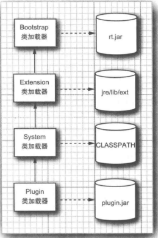

通常,加载机制对我们是透明的.在某些特殊情况下才需要干预:

- 应用的代码包含一个助手方法,它要调用Class.forName(className);
- 这个方法从一个插件类被调用
- className是一个包含在插件的类

助手类由系统类加载器加载,然而插件JAR是不可视的,这种现象称为 类加载器倒置

每个线程都有加载器引用,称为上下文类加载器(主线程的是 系统类加载器),我们可以获得/设置.

#### 9.1.3 将类加载器作为命名空间

类是由它的全名和类的加载器来确定的.再加载来自多处的代码时很有用

这种技术还有其他用处,比如servlets 和 EJB的"热部署"

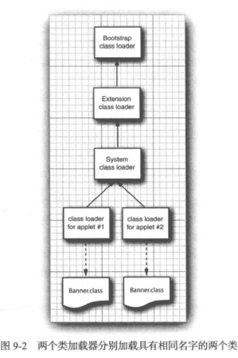

#### 9.1.4 编写自己的类加载器

它拒绝加载没有标记为"paid for"的类

1. 继承ClassLoader类,覆盖方法 findClass(当父类无法加载才调用)
2. 为来自本地文件系统的类加载字节码,调用ClassLoader超类的defineClass方法,向虚拟机提供字节码

#### 9.1.5 字节码校验

当加载器将新加载的类的字节码传递给虚拟机的时候,首要要接受校验器的校验.除了系统类外,所有类都要进行校验.

- 变量要在使用之前初始化
- 方法调用与对象引用类型之间要匹配
- 访问私有数据和方法的规则没有被违反
- 对本地变量的访问都落在运行时对站内
- 运行时堆栈没有溢出

可以防止恶意修改字节码文件

### 9.2 安全管理器与访问权限

一旦加载到虚拟机中,并且由检验器检验过.Java平台的第二种安全机制就会启动,这个机制是 安全管理器

#### 9.2.1 权限检查

安全管理器是一个负责控制具体操作是否允许执行的类.检查的操作包括:

- 创建一个新的类的加载器

- 退出虚拟机

- 使用反射访问另一个类的成员

- 访问本地文件

- 打开socket连接

- 启动打印作业

- 访问系统剪切板

- 访问AWT时间队列

- 打开一个顶层窗口

  默认设置不安装安全管理器,所有的操作都是允许的.

  Applet浏览器会执行一个功能受限的安全策略.比如不能推出虚拟机

注意: 实现并安装自己的安全管理器是可以的,但是不建议,除非你是安全方面的专家

#### 9.2.2 Java平台安全性

代码来源: 由一个代码位置 和 一个证书集指定.

权限 : 安全管理器负责检查的任何属性

安全策略建立了 代码来源 和 权限 之间的映射关系

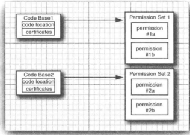

Policy类的默认实现可以从访问权限文件中读取

每个类都有一个保护域,用于封装类的代码来源和权限集合的对象

当SecurityManager需要检查某个权限时,它要查看当前位于调用堆栈上的所有方法的类,然后它要获得所有类的保护域,询问权限,不通过就抛异常

#### 9.2.3 安全策略文件

可以把策略文件安装在标准位置上:

- Java平台主目录的java.policy文件
- 用户主目录的 .java.policy文件

策略文件包含一系列grant项 grant codesource {permission1;...};

权限采用 permission className targetName,actionList

#### 9.2.4 定制权限

可以继承Permission类,其中implies最重要,更加范化的权限隐含更加具体的权限

比如允许读写/tmp 目录及子目录的任何文件

隐含 子文件的读/写

### 9.3 用户认证

#### 9.3.1 JAAS框架

Java认证和授权服务,认证:确定程序使用者的身份,授权:将用户映射到相应的权限

JAAX是一个可拔插的API

```java
grant principal com.sun.security.auth.UnixPrincipal "harry"{
  permission java.util.PropertyPermission "user.*"  ,"read";
    ...
};
```

改语法中,Principal类检查用户名.可以使用一个LoginContext使得安全管理器能够检查这样的授权语句

一个登录策略由一个登陆模块快序列组成.每个模块标记为required sufficient requisite 和 optional

1. 各个模块依次执行,知道有一个sufficient的模块认真成功,或者有个requisite模块认证失败,或者已经执行到最后一个模块才停止
2. 当标记required 或 requisite的所有模块认证成功或都没有执行,但至少有一个sufficient/optional模块认证成功,那么这次认证就成功了

用户登陆后,会在独立的访问控制上下文中,运行要求检查用户特征的代码.

静态的doAs/ doAsPrivileged ,启动一个新的 PrivilegedAction执行

#### 9.3.2 JAAS登陆模块

登陆模块应该将用户映射到角色,并将角色赋予权限

登录模块中做之一就是组装被认证的特征集

查看源码理解

### 9.4 数字签名

#### 9.4.1 消息摘要

消息摘要时数据块的数字指纹,SHA1可以数据压缩为20字节的序列

消息摘要属性:

1. 如果数据的1位或者几位变了,那么消息摘要也会变
2. 拥有消息的伪造者不能创建与原消息具有相同摘要的假信息(概率问题)

MessageDigest类承担两个职责:

- 工厂类
- 消息摘要算法的超类

#### 9.4.2 消息签名


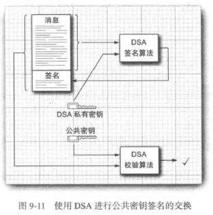

#### 9.4.3 校验签名

jdk配有一个keytool,用于生成和管理一组证书

keytool负责管理密钥库 证书数据库 和 私有/共有密钥对

证书添加到密钥库中,使用密钥库的任何程序都会认为可以用这些证书来对签名进行校验

```shell
keytool -genkeypair -keystore alice.certs -alias alice
keytool -exportcert -keystore alice.certs -alias alice -file alice.cer
keytool -printcert -file alice.cert
keytool -importcert -keysotre bob.certs -alias alice -file alice.cer
jarsigner -keystore alice.certs document.jar alice
jarsigner -verify -keystore bob.certs document.jar
```

#### 9.4.4 认证问题

任何人都可以生成一堆公共密钥和私钥,私钥签名,把签名好的消息和公钥给你.这种确定发送者身份的问题称为 认证问题

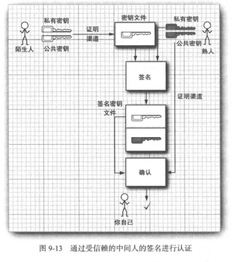

#### 9.4.5 证书签名

用户信任一个部门的信息,这个部门负责证书授权(CA)的运作,这个部门的每个人在其密钥库中都有CA的公共密钥,这是由一个专门负责详细喝茶密钥指纹的系统管理员安装的.如果Alice要把消息发送用户,需要把自己信息发送该部门让其合适并生成如下的签名证书:

```shell
java CertificateSigner -keystore acmesoft.certs -alias acmeroot -infile alice.cer -outfile alice_signedby_acmeroot.cer
```

现在Alice可以把生成的证书交给用户,文件包包含Alice公共密钥和部门的声明

#### 9.4.6 证书请求

许多系统都有OpenSSL,为了创建一个CA,需要运行一个CA脚本.

```shell
/usr/lib/ssl/misc/CA.pl -newca#创建一个demoCA子目录,包含密钥对和证书
```

将demoCA/cacert.pem复制成文件acmeroot.pem,移除一下之前内容

---BEGIN CERTIFICATE---

以及一下之后所有内容

---END CERTIFICATE---

之后就可以把acmeroot.pem导入到密钥库了

```shell
keytool -importcert -keystore cindy.certs -alias alice -file acmeroot.pem #导入
keytool -certreq -keystore alice.store -alias alice -file alice.pem #生成一个证书请求
openssl ca -in alice.pem -out alice_signedby_acmeroot.pem #签名,切除标记外内容,再导入
keytool -importcert -keystore cindy.certs -alias alice -file alice_signedby_acmeroot.pem #导入
```

#### 9.4.7 代码签名

对jar文件签名以及如何配置Java校验签名.这种能力是为了Java插件设计的.已经不再广泛使用了,但是仍旧需要再遗留产品支持.直接看书,记不了

### 9.5 加密

安全性的第二个重要方面.

#### 9.5.1 对称加密

Cipher类,对称加密的超类.

一旦获得一个密码对象可以设置模式和密钥进行初始化.反复调用update对数据块加密,完成后最后地用一次doFinal

#### 9.5.2 密钥生成

1. 获取KeyGenerator
2. 用随机源初始化密钥发生器.
3. 调用generateKey

#### 9.5.3 密码流

JCE库提供一组便捷的加密/解密流(可以透明的调用update 和 doFinal方法)

CipherOutputStream 

#### 9.5.4 公共密钥密码

1. A 生成一个随机对称密钥,明文加密
2. A 用 B 的公共密钥对 对称密钥 加密
3. A 把加密后的密钥 和 明文 发送给B
4. B 解密 密钥
5. B 解密明文

## 第 10 章 高级Swing

### 10.1 列表

#### 10.1.1 JList构件

1. 字符串数组提供选项,传递给JList
2. 不能自动滚动,必须将它插入到滚动面板JScrollPane
3. 支持快捷键 ctrl多选  shift 范围选中
4. 可以像列表构件添加监听器,按下鼠标event.getValueIsAdjusting()返回true 松开鼠标 返回false
5. getSelectedValue()/getSelectedValuesList()获取选中对象

#### 10.1.2 列表模式

处理一些复杂的情况:

- 很长的列表
- 内容会变化的列表
- 不包含字符串的列表

1. JList采用MVC模式,JList负责数据可视化外观,它只知道可以通过ListModel接口对象获取数据
2. 我们可以传递给JList一个ListModel对象,这个对象通过计算获取数据,而不是访问数组

#### 10.1.3 插入和移除值

list.getModel()可以获取模型

Jlist 可以接收一个 DefaultListModel对象,可以通过这个进行增删.会自动通知JList重绘

#### 10.1.4 值的绘制

可以使用人和图形表示列表值.

为此需要一个自定义图形的列表单元格绘制器.一个实现ListCellRenderer接口的类

一种方法是扩展Jcomponent类如果仅仅包含文本/图标/颜色,那么通过配置JLabel就可以得到

### 10.2 表格

#### 10.2.1 简单表格

JTable不存储,也是mvc模型,可以通过二维数组传递数据,依旧要放进JScrollPane添加滚动条

对表格的修改是视图的,不会影响存储.

排序是调用 table.setAutoCreateRowSorter(true)激活

如果没有将表格包装在滚动面板中,就需要手动添加表格头

#### 10.2.2 表格模型

AbstractTableModel类

#### 10.2.3 行列操作

牢记Swing表格不对称,行 列操作不同

1. 各种列类

   通过 getColumnClass() 返回一个描述列类型的类

2. 访问列表格

   JTable将有关列表格的选项存放在类型位TableColumn的对象中,由一个TableColumnModel进行管理.

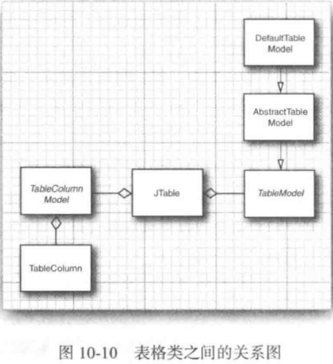

3. 改变列的大小

   TableColumn类可以控制,通过setter方法进行调整

4. 改变行大小

   行高度直接由JTable类管理,可以单独调整某行行高

5. 选择行 列 和单元格

   默认行选择,table.getSelectionMode().setSelectionMode(mode);可以设置(默认列选择关闭,需要开启)

   getSelectedRows/Columns可以获得选中行列方辉的索引数组,是视图的数组索引(转译调用 convertRowIndexToModel())

6. 对行排序

   细粒度控制要安装TableRowSorter大小,某系列不可排序,可以调用setSortable()进行关闭

   默认排序规则:

   1. 如果列所属对象是String,按照Collator.getInstance()方法返回的比较器进行
   2. 如果列所属对象实现了Comparable,直接使用
   3. 如果已经为排序其设置过TableStringConverter,就用默认比较器对转换器的头String排序
   4. 否则调用toString,默认排序

7. 过滤行

   设置RowFilter,可以设置组合过滤器

8. 隐藏和显示列

   JTable的removeColumn可以将一列隐藏起来,通过addColumn和moveColumn可以添加到任意地方

#### 10.2.4 单元格的绘制和编辑

列的类型确定单元格如何绘制,Boolean和Icon类有默认的绘制器

1. 绘制单元格

   显现TableCellRenderer接口.JTable类的setDefaultRenderer方法可以让你建立他们之间的这种联系(类型-绘制器)

2. 绘制表头

   setHeaderValue()

   setHeaderRenderer()

3. 单元格编辑

   定义isCellEditable方法可以指明,可以构造一个DefaultCellEditor,提供复选框等

4. 定制编辑器

   1. 实现TableCellEditor,可以继承AbstractCellEditor来处理
   2. 定义getTableCellEditorComponent方法踢狗一个构件.
   3. 定义shouldSelectCell stopCellEditing  cancelCellEditing来处理编辑过程的启动 完成 和 取消
   4. 定义getCellEditorValue获取编辑结果
   5. JTable会调用 setValueAt() 更新模型.可以通过覆盖该方法实现

### 10.3 树

#### 10.3.1 简单的树

JTree,接收一个TreeModel对象,可以使用DefaultTreeModel进行创建树,

节点需要是实现TreeNode的类,可以使用 DefaultMutableTreeNode

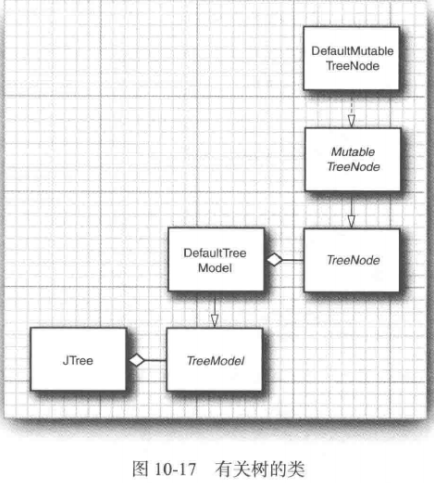

之后就是创建树

tree.putClientProperty("JTree.lineStyle","Angled)可以设置水平样式的线

setAllowsChildren(); // 可以明确指明叶节点

model.setAsksAllowChildren(true);//让树显示时候不用默认的区分机制

#### 10.3.2 编辑树和树的路径

通过完整路径处理,TreePaht管理一个Object引用序列.通过getSelectionPath可以获得路径,之后进行检索getLastPahtComponent获得对象.(也可以 getLastSelectedPathComponent获得)

不能直接添加,需要自己发通知(如果修改结构的话)DefaultTreeModel可以自动通知

可以通过makeVisiable(path) 进行更新路径,而不是整棵树

#### 10.3.3 节点枚举

breathFirstEnumeration 和 depthFirstEnumeration 分别使用宽度优先和深度优先遍历

#### 10.3.4 绘制节点

默认使用 DefaultTreeCellRenderer绘制节点,继承自JLabel类

1. 使用DefaultTreeCellRenderer 改变图标 字体以及背景颜色
2. 安装一个继承DefaultTreeCellRenderer的类的绘制器
3. 安装一个实现了 TreeCellRenderer 的绘制器,自定义图像

getTreeCellRendererComponent返回的是this.如果需要定制一个构件,需要: 调用超类方法以便准备标签数据,定制标签属性,返回this

#### 10.3.5 监听树事件

监听器实现TreeSelectionListener接口.用户选定或者撤销的时候就会触发

#### 10.3.6 定制树模型

通过实现TreeModel接口的方法

### 10.4 文本构件

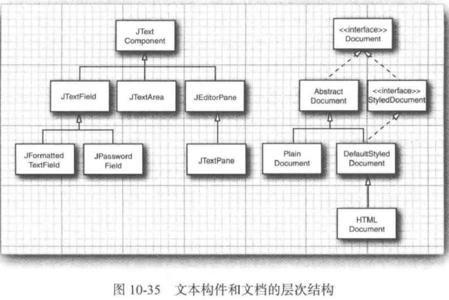

#### 10.4.1 文本构件中的修改跟踪

不建议监听键盘,而是让文档通知数据发生变化,所以安装文档监听器.所以通过安装文档监听器.DocumentListener.

text.getDocument().addDocumentListener()

#### 10.4.2 格式化的输入框

希望对输入进行过滤,监听键盘依旧不建议.可以通过JFormatteredTextField类

1. 整数

```java
intField = new JFormatteredTextField(Numberformat.getIntegerInstance());
```

2. 失去焦点的行为

   通过isEditValid方法检查是否有效,若有效则提交,无效就不变

3. 过滤器

   底层文档是PlainDocument对象里.通过DocumentFilter类可以处理

   ```java
   new JFormatteredTextField(
   new InternationalFormatter(NumberFormatter.getIntegerInstance())){
       protected DoucmentFIlter getDocumentFilter(){
           return new DoucmentFilter();
       }
   }
   ```

   

4. 校验器

   任意的JComponent上附着一个校验器,扩展InputVerifier类并定义verify

5. 其他的标准格式器

   getNumberInstance()

   getCurrencyInstance()等,参看文档

6. 定制格式器

   扩展DefaultFormatter

#### 10.4.3 JSpinner构件

包含一个文本框以及两个在文本框旁边的小按钮,点击按钮就会增减

对应的模型SpinnerListModel

#### 10.4.4 JEditorPane显示HTML

能以HTML和RTF(富文本)格式显示和编辑文本.

HTML绘制器只能显示简答页面,不建议处理复杂页面.

HTML编辑器也是功能有限,而且不稳定.

- setPage() 载入一个新文档
- getDocument().setAsynchronousPriority(0) 强制单独线程载入
- HyperlinkListener 超链接监听器

### 10.5 进度指示器

#### 10.5.1 进度条

JProgressBar,通过setValue()更新

#### 10.5.2 进度监视器

可以放进一个窗体中,ProgressMonitor是一个包含进度条的对话框

setProgress()更新值

#### 10.5.3 监视输入流的进度

ProgressMonitorInputStream,自动监视流读取多少了,使用InputStream的available方法确定总字节数,但是,该方法只报告六种不阻塞就可访问的字节数

### 10.6 构件组织器和装饰器

#### 10.6.1 分割面板

把一个构件分割成两个.构件时候需要设定方向

```java
new JSplitePane(JSplitPane.HORIZONTAL_SPLIT,param...)
```

#### 10.6.2 选项卡面板

JTabledPane,

- 通过addTab添加组件
- removeTabAt() 删除
- setTabLayoutPolicy(JTabbedPane.WRAP_TAB_LAYOUT)设置滚动条
- 通知使用ChangeListener,用选项卡对象添加

#### 10.6.3 桌面面板和内部框体

1. 显示内部框体
   - 使用常规JFrame
   - 添加JDesktopPane
   - 构件JInternalFram
   - 向内部框体添加构件
   - 设置内部框体图标,大小
   - 设置可见,并添加到 桌面面板
   - 可以通过setSelected() 选定一个框体

2. 级联与平铺

   内部框体可以有三种状态之一: 图标  最大化  最大化

3. 否决属性设置

   框体通常并不想使用否决机制以抗议将窗口图标化或者失去焦点,检查框体是否可以关闭很常见.setClosed()是可否觉得,因此更改之前,它会调用所有已注册的可否觉得更改监听器,给了一个抛出异常的机会

   1. 为每个框体添加监视器.VetoableChangeListener
   2. 实现 vetoableChange方法
   3. getNewValue()获取新值
   4. 直接通过抛出PropertyVetoException阻止修改,否则正常返回

4. 内部框体的对话框

   JDiaglog是重量级的,窗口系统不知道如何确定这些对话框的相对位置

   简单情况,使用JOptionalPane类的showInternalXxxDiaglog方法

   复杂情况,使用JinternalFram构件

5. 边框拖拽

   内部框体性能不是很好,框体拖拽会不停重绘,速度缓慢

   边框拖拽可以在最终位置才进行刷新

   desktop.setDragMode(JDesktopPane.OUTLINE_DRAG_MODE)

#### 10.6.4 层

JLayer将构件与LayerUI对象联系在一起,后者负责绘制和事件处理

添加时候,父面板添加的是层,paint需要调用super.paint方法

## 第 11 章 高级AWT

### 11.1 绘图操作流程

1. 获得Graphics2D对象(paint等方法可以自动接收一个该对象)
2. 使用setRenderingHints方法设置绘图提示
3. setStroke设置比划,用于绘制形状边框
4. setPaint 设置颜色填充
5. clip 设置剪切区域
6. transform 设置一个从用户控件到设备空间的变换方式
7. setComposite设置一个组合规则
8. 建立一个形状
9. 绘制填充


### 11.2 形状

drawLine / drawRectangle 等,还有 配到的fill方法

Java 2D 使用一套API,直接使用类,都实现了Shape方法

#### 11.2.1 形状类层次结构

创建一个实现Shape接口的类的对象,然后调用draw()

名字以2D结尾的每个类都有两个子类,用于指定坐标是float类型还是double类型

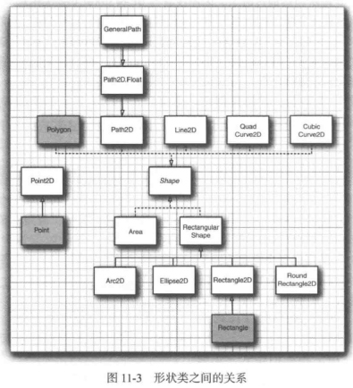

#### 11.2.2 使用形状类

创建对象,确定参数含义

可以建立线段 二次曲线 三次曲线 并把他们存放到一个GeneralPath对象中去.

- moveTo 指定第一个坐标
- lineTo / quadTo / curveTo 扩展路径
- append 添加图形

### 11.3 区域

Area类

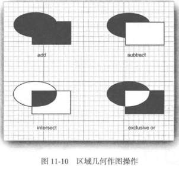

### 11.4 笔划

setStroke 选定笔划,默认BasicStroke

可以配置 笔尖样式 连接样式 连线样式

### 11.5 着色

- Color类实现了Paint接口,图形直接setPaint()即可
- GradientPaint 渐变色
- TexturePaint 用一个图像重复着色

### 11.6 坐标变换

```java
g2.scale(pixelsPerMeter,pixelsPerMeter); // 比例变换
g2.draw(new Line2D.Double(...))
```

- scale 比例缩放
- rotate 旋转
- translate 平移
- shear 切变

用矩阵表示变换称为仿射变换(AffineTransform类支持)

### 11.7 剪切

setClip()  实际应用不要调用,回取代图形上下文中可能存在的任何剪切形状,调用clip()

### 11.8 透明与组合

由透明度通道描述,Color对象可以设置

假设由一个透明度值为 a~S~ 像素源,该图像中,已经存在里一个 a~D~ 的目标像素,想要组合起来.

Porter和Duff将透明度值作为像素颜色被使用的概率

AphoaComposite类的工厂方法可以产生AphoaComposite对象,可以设置规则和透明度值

### 11.9 绘图提示

setRenderingHint()进行提示,以_DEFAULT结尾的值表示某种特定实现将其作为性能与质量之间的良好平衡而选择的默认值

比较有用的是消除锯齿(jaggies)

```java
g2.setRenderingHint(RenderingHints.KEY_TEXT_ANTIALIASING,
                   RenderingHints.VALUE_TEXT_ANTIALIAS_ON);
```

### 11.10 图像的读取器和写入器

javax.imageio包包含读写数种常见文件格式的图像

ImageIO.read(in);//直接就可以读取

它可以参考文件扩展名和文件开头的 magic number选择合适的读取器

#### 11.10.1 获得适合图像文件类型的读取器和写入器

ImageIO类枚举了匹配下列条件之一的读取器和写入器.

- 图像格式
- 文件后缀
- MIME类型

getWriterFileSuffixes() 可以获取读取器能处理的后缀

#### 11.10.2 读写带有多个图像的文件

GIF动画

ImageIO.createImageInputStream(),不断读取图像,直到抛异常

有些文件带有缩略图

reader.getNumThumbnails(index); 可以获取数量

写出获取ImageOutputStream对象,然后必须将每一个图像封装到IIOImage对象中

### 11.11 图像处理

BufferedImage类提供了对图像中像素的控制能力,BufferedImageOP接口的类都可以对图像进行变换

#### 11.11.1 构建光栅图像

每次为图像增加一个像素.构建一个BUfferedImage对象.

调用getRaster获取一个WritableRaster对象,使用该对象来访问和修改像素

- setPixel 设置单独的像素,设置素的样本值(可以批量设置)
- RGB颜色模型并没有想象中的那么标准,国际配色联盟推荐所有颜色都应该配有一个ICC配置特性,建议使用一个相对简单的标准sRGB
- getColorModel()返回就是这样一个颜色模型

#### 11.11.2 图像过滤

BufferedImageOP 只用嗲用filter就可以转换,该接口由许多子类,

- AffineTransformOp用于仿射变换
- LookupOp可以为样本值设定任意的映射操作
- ColorConvertOp 对于颜色空间的转换很有用

### 11.12 打印

#### 11.12.1 图形打印

- 提供一个实现Printable接口的对象

- 启动一个打印作业

  每当打印引擎需要对某一页面排版以便打印时,都会调用Printable的方法

  启动作业使用PrinterJob类,getPrinterJob()获取一个对象

  可以把打印机设置封装到PrintRequestAttributeSet接口的实现类里

磅是美国印刷业的计量单位:

- 纸张大小和图形上下文都是用磅为单位

#### 11.12.2 打印多页文件

实际的打印操作,不应该将原生的Printable对象传递给打印作业.而是一个实现该接口的类对象.Java平台提供了这样一个Book类,包含多个Printable对象

printable.setPageable(book) 打印作业就知道要打印的页数了

#### 11.12.3 打印预览

构建一个PrintPreviewDialog类(自定义) 必须提供Printable对象或book对象,还要提供一个PageFormat对象

看源码

#### 11.12.4 打印服务程序

文档风格描述了一个数据源和一个数据类型的组合,DocFlavor类为不同的数据源定义了许多内部了,每个内部类都定义了指定s风格

PrintServiceLookup类的静态lookupPrintServices 方法返回一个能够处理给定文档风格的PrintService对象的数组

#### 11.12.5 流打印服务程序

打印服务程序把数据发送被打印机.

流打印服务程序发送给流(目的也许是延迟打印,或者打印格式由其他程序解释)

```java
// 枚举打印程序
doc = DocFlavor.SERVICE_FORMATTED.PRINTABLE;
mimeType = "application/postscript";
factories = StreamPrintServiceFactory.lookupStreamPrintServiceFactories(doc,mimeType);
// 打印
factories[0].getPrintService(out);
```

#### 11.12.6 打印属性

- 打印请求属性: 为打印作业的所有doc对象请求特定的打印属性,比如纸张大小

- Doc属性: 作用在单个doc对象的请求属性

- 打印服务属性: 提供关于打印服务程序的信息

- 打印作业属性: 提供关于某个特定作业的信息

  对应Attribute接口的一个或多个子接口

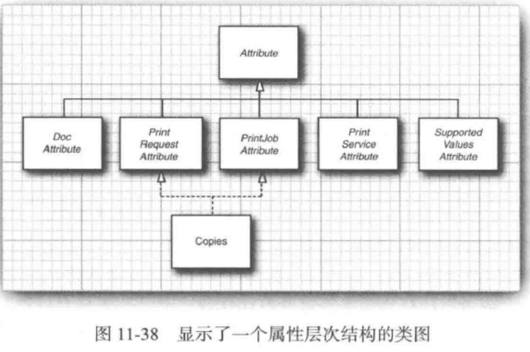


可以构建一个打印属性集 HashPrintRequestAttrbutes 构建完就不用担心Hash前缀问题.

属性集是一个特殊的映射表,键是Class类型,值是一个实现Attribute接口的类.键称为属性的类别

### 11.13 剪切板

查看jre/lib/flavormap.properties可以得知那些类型的对象可以在Java程序和系统剪切板之间传递

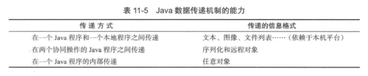

#### 11.13.1 用于数据传递的类和接口

java.awt.datatransfer包实现数据传递功能

- 通过剪切板传递的对象必须实现Transferable接口
- Clipboard类描述了一个剪切板
- DataFlavor类描述剪切板中数据风格
- StringSelection类是一个实现Transferable接口的实体类
- 剪切板内容被改写,一个类想得到通知,必须实现 ClipboardOwner接口 .剪切板的所有权实现了复杂数据的"延迟格式化"

#### 11.13.2 传递文本

Toolkit.getDefaultToolkit().getSystemClipboard() 获取剪切板,

传递给剪切版的对象必须封装到StringSelection对象.

获取时候有时候需要指定风格 

#### 11.13.3 Transferable接口和数据风格

DataFlavor 由两个特性定义

- MIME类型的名字
- 用于访问数据的表示类

#### 11.13.4 构建一个可传递的图像

实现接口,告知其唯一可用的数据格式是DataFlavor.imageFlavor,并且持有一个image对象

#### 11.13.5 通过系统剪切板传递Java对象

可以通过序列化对象放到剪切板里实现

#### 11.13.6 使用本地剪切板来传递对象引用

使用MIME类型,为这种类型制定一个Transferable包装器

### 11.14 拖放操作

三种放置操作 移动  拷贝 连接 

#### 11.14.1 Swing对数据传递的支持

setDragEnabled()进行启用

#### 11.14.2 拖拽源

必须子类化TransferHandler类.

- getSourceActions 表明支持什么行为
- getTransferable 产生transferable对象,遵循拷贝过程
- 移动行为之后移除原来的数据

#### 11.14.3 放置目标

需要设置一个TransferHandler, 实现canImport 和 importData方法

最常用的数据类型 DataFlavor.javaFileListFlavor

在TransferSupport参数调用getDropLocation可以得到放置目标

### 11.15 平台集成

#### 11.15.1 闪屏

Java启动过长,原因加载初始化.解决方案 采用闪屏,迅速出现的小窗体,告诉用户应用程序已经启动.

- 命令行 java -splash:myimage.png MyApp

- jar文件清单指定

  ```properties
  Main-Class: MyApp
  SplashScreen-Image: myImage.gif
  ```

  

```java
// 获取闪屏,之后就可以常规绘制了
SplashScreen.getSplashScreen();
splash.createGraphics();
```

#### 11.15.2 启动桌面应用

java.awt.Desktop 可以是我们启动默认浏览器,还可以用注册为用于某类文件类型的应用程序打开编辑这类文件

- desktop.isDesktopSupported() true 支持
- getDesktop() 获取实例
- 为了启动浏览器需要构造一个URI,之后调用browse()方法

#### 11.15.3 系统托盘

java.awt.SystemTray跨平台的系统果盘渠道.同Desktop类,需要先确定平台是否支持,之后才能获取实例,设置

add可以添加一个TrayIcon实例.包含三个属性:

- 图标

- 划过的时候的提示

- 右键弹出菜单

  菜单是PopupMenu类的一个实例,不是Swing菜单

## 第 12 章 本地方法

除非必需才使用本地代码.尤其是在以下三种情况:

- 你的应用需要访问系统特性和设备通过Java平台无法实现
- 已经有大量的测试过和调试过的另一种语言编写的代码,并且知道如何将其导出到所有的目标平台
- 通过基准测试,你发现编写的Java代码比用其他代码编写的邓加代码慢得多

Java平台有一个用于和本地C代码交互的API,称为[Java本地接口(JNI)](https://docs.oracle.com/javase/8/docs/technotes/guides/jni/spec/jniTOC.html)

### 12.1 从Java程序调用C函数

使用关键字native表示本地方法,用于提醒编译器该方法在外部定义

实际的实现需要相应的C函数,规则如下:

1. 使用完整的Java方法名,全类名.方法名
2. 用下划线替换所有句号,并加上Java前缀
3. 如果类名含有非ASCII字母或数字,使用_0xxxx,xxxx是该字符的Unicode值的4个十六进制序列

实际上,不用手工编写.可以使用javah 自动生成对应的 c的头文件,只需要自己实现对应的源文件即可(可以使用C++实现本地方法,必须把方法声明为extern "C")

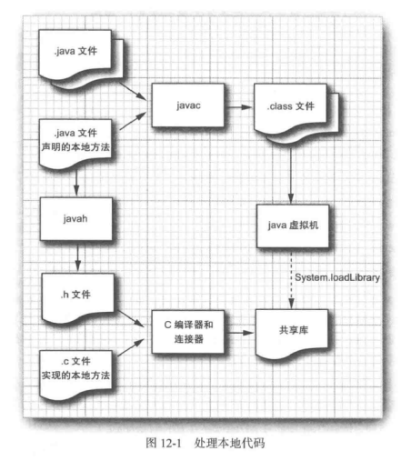

> 使用的是MinGw 的 gcc编译器 位数要和操作系统一样
>
> gcc -shared -I %JAVA_HOME%\include -I %JAVA_HOME%\include\win32 -o DLLName.dll FileName.c

### 12.2 数值参数与返回值

类型对应

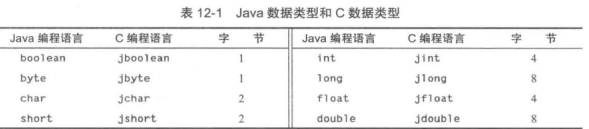

### 12.3 字符串参数

Java由两组操作字符串的函数,

一组把字符串转成"改良的UTF-8" NewStringUTF

另一组转换成UTF-16 NewString

具体参考jni的API文档

### 12.4 访问域

#### 12.4.1 访问实例域

```c
// fieldID 是一个特殊类型jfieldID的值,标识一个域
// Xxx代表Java数据类型(Object  Boolean...)
x =(*env)->GetXxxField(env,this_obj,fieldID);
(*env)->SetXxxField(env,this_obj,fieldID,x);

// 获取对象的类
jcalss objClass = (*env)->GetObjectClass(env,this_obj);
objClass = (*env)->FindClass(env,"java/lang/String");
// 获取ID
(*env)->GetFieldID(env,objClass,"fieldName","Type");
```

类引用只在本地方法返回之前有效不要保存下来供以后使用

#### 12.4.2 访问静态域

与上面的几乎一致,使用FindClass代替GetObjectClass

访问与提供类,而不是实例对象

### 12.5 编码签名

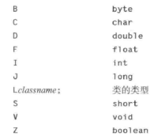

一个float数组 可以描述成 [[F

Spring方法具有下面的混编签名:

(Ljava/lang/String;D)Ljava/lang/String;

可以用javap -s 查看方法签名

### 12.6 调用Java方法

#### 12.6.1 实例方法

1. 获取隐式参数的类
2. 获取方法ID
3. 进行调用

```c
(*env)->CallXxxMethod(env,implicit paramter,methodID,explicit parameters)
```

#### 12.6.2 静态方法

- 用GetStaticMethodID 和 CallStaticXxxMethod
- 调用方法时候提供类对象

#### 12.6.3 构造器

```c
(*env)->NewObject(env,class,methodID,constructor parameters)
```

可以通过指定方法名"\<init\>",并指定构造器(返回值void)的编码签名,从GetMethodID函数中获取该调用必须的方法ID

#### 12.6.4 另一种方法调用

CallNonvirtualXxxMethod

### 12.7 访问数组

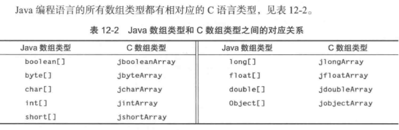

- GetArrayLength 返回数组长度
- GetObjectArrayElement 获取元素,效率低下
- GetXxxArrayElements 返回一个指针,不用了记得释放指针
- ReleaseXxxArrayElements 释放指针
- GetXxxArrayRegion 获取一个大数组的多个元素
- NewXxxArray 本地方法中创建新的Java数组

### 12.8 错误处理

C语言没有异常,必须调用Throw 或 ThrowNew 创建一个新的异常对象,本地方法退出时,jvm就会抛出异常

先通过NewObject创建一个Throwable子类对象,然后调用Throw.作用仅仅是发布异常,还需要调用return

本地方法应该调用ExceptionOccurred(env)进行确认异常是否发生

ExceptionClear 处理完异常,调用该函数关闭

### 12.9 使用调用API

调用API使你能够把Java虚拟机嵌入到C或者C++程序

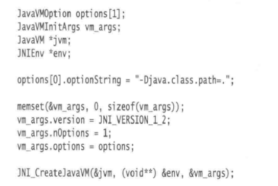

对JNI_CreateJavaVM 的调用会创建虚拟机,一旦设置完虚拟机,就可以调用Java方法

DestroyJavaVM 可以终止虚拟机

遗憾的是Windows下,动态链接到jre/bin/client/jvm.dll中的JNI_CreateJavaVM变得十分困难.可以通过手工加载类库解决问题.

参阅JDK的src.jar文件里的launcher/java_md.c文件