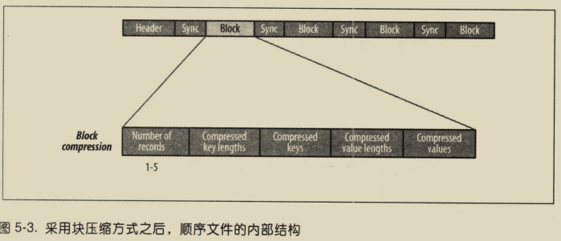

# Hadoop权威指南

- [ ] 书籍作者: [(美) Tom White](https://book.douban.com/search/Tom White)
- [ ] 笔记时间: 2021.01.11

## 第Ⅰ部分 Hadoop基础知识

### 第1章 初识Hadoop

#### 1.1 数据!数据

数据级别是 TB,PB

#### 1.2 数据的存储与分析

硬盘存储量大,传输慢 -- 多个硬盘同时读写

- 硬件故障--复制(replication)
- 任务的合并--Hadoop

#### 1.3 查询所有数据

MapReduce

##### 1.4 不仅仅是批处理

不适合交互,Hadoop不仅仅是HDFS和Map Reduce

#### 1.5 相较于其他系统的优势

##### 1.5.1 关系型数据库管理系统

寻址速度提升远远小于传输速度提升

MapReduce适合一次写入,多次读取数据

RDBMS适合持续更新数据集

##### 1.5.2 网格计算

高性能计算和网格计算主要使用消息传递接口(MPI)的API,使用共享文件系统,适合计算密集型,控制权大,控制复杂

Hadoop尽量在计算节点存储数据,数据本地化是核心

##### 1.5.3 志愿计算

志愿计算把问题分成很多块,每块称为一个工作单元,主要贡献是CPU周期,而不是网络带宽

#### 1.6 Apache Hadoop发展简史

### 第2章 关于MapReduce

可用于数据处理的编程模型

#### 2.1 气象数据集

#### 2.2 使用Unix工具来分析数据

使用awk,需要多线程加上数据控制

#### 2.3 使用Hadoop来分析数据

##### 2.3.1 map 和 reduce

#### 2.3.2 Java MapReduce

###### 2.3.2.1 运行测试

#### 2.4 横向扩展

需要把资源放到HDFS里面

##### 2.4.1 数据流

作业是客户端需要执行的一个单元: 输入数据 Map Reduce程序和配置信息

作业分为若干个任务(分为map和reduce任务),运行在集群,通过YARN进行调度

输入数据划分为等长小数据块,称为输入分片,每个分片构建一个map任务(默认128M),map输出写入本地硬盘,reduce才是结果放入到HDFS

##### 2.4.2 combiner函数

属于优化方案,针对map任务的输出制定一个combiner,作为reduce的输入

#### 2.5 Hadoop Streaming

使用Unix标准流作为Hadoop和应用程序之间的接口,可以通过任何编程语言写程序

### 第3章 Hadoop分布式文件系统

管理网络中跨多台计算机存储的文件系统称为 分布式文件系统

#### 3.1 HDFS的设计

以流式数据访问模式存储超大文件

- 超大文件 几百MB,GB,已经由PB级别
- 低延迟数据访问 使用HBase更好
- 大量小文件 受限于namenode
- 目前只能单用户添加模式

#### 3.2 HDFS的概念

##### 3.2.1 数据块

文件系统基于块进行管理(磁盘块通常为512KB),HDFS128MB(减少寻址时间)

- 所有块不一定在一块硬盘上
- 块复制(默认3个)

##### 3.2.2 namenode 和 datanode

- namenode管理文件系统树以及书内所有文件和目录(存于命名空间镜像文件和编辑日志文件)
- datanode记录每个文件中各个块所在的数据节点信息

没有namenode,文件系统将无法运行,容错非常重要

- 备份组成文件系统元数据持久状态的文件
- 运行辅助namenode(定期合并两个文件)

##### 3.2.3 块缓存

默认情况下,一个块仅缓存在一个datanode中

##### 3.2.4 联邦HDFS

2.x版本引入,namenode管理的是一部分文件系统命名空间

每个namenode维护一个命名空间卷(命名空间元数据和一个数据块池组成)

##### 3.2.5 HDFS的高可用性

依旧存在单点失效问题.增加了HDFS(HA),配置一对活动-备用namenode

- namenode共享存储,实现编辑日志的共享
- datanode需要同时向两个namenode发送数据块报告

共享存储有 QJM和NFS过滤器

**故障切换与规避**

故障转移控制器,一种是使用Zookeeper确保只有一个namenode(心跳机制)

#### 3.3 命令行接口

#### 3.4 Hadoop文件系统

是一个接口,有很多实现,HDFS只是其中一种

**接口**

使用Java的FileSystem类提供文件系统操作

1. HTTP

   速度慢,尽量不要用来传输(直接访问,代理访问都可)

   

2. C语言

   libhdfs的库

3. NFS

4. FUSE

#### 3.5 Java接口

##### 3.5.1 从Hadoop URL读取数据

最简单的使用java.net.URL读取数据流

通过FsUrlStreamHandleFactory实例调用URL的setURLStreamHandlerFactory()方法,只能调用一次

##### 3.5.2 通过FileSystem API读取数据

Hadoop文件系统通过HadoopPath对象代表文件.

FileSystem是一个通用的文件API,有一些静态方法可以获取

Configuration对象封装客户端/服务器配置

建议使用流数据来构建应用访问模式,而非大量使用Seek方法

##### 3.5.3 写入数据

最简单方法是给准备建的文件制定一个Path对象,返回输出流

FSDataOutputStream类不允许在文件定位,只允许追加/顺序写入

##### 3.5.4 目录

FileSystem类的mkdirs提供

##### 3.5.5 查询文件系统

1. 文件元数据: FileStatus
2. 列出文件 listStatus方法
3. 文件模式 globStatus方法,支持通配符
4. PathFilter对象 编程方式控制通配符

##### 3.5.6 删除数据

delete方法

#### 3.6 数据流

##### 3.6.1 剖析文件读取

客户端可以直连datanode且namenode告知客户端每个块所在的最佳datanode

namenode只需响应块位置请求

带宽是稀缺资源,Hadoop把网络看做一棵树,节点之间距离是到祖先节点之和

##### 3.6.2 剖析文件写入

客户端写入数据,DFSOutputStream将其分为若干数据包,写入内部的 数据队列.DataStreamer挑出一组datanode进行存储

DFSOutputStream同时也维护一个 确认队列,收到datanode的确认信息,数据包才会从确认队列删除

datanode写入错误,先关闭管线,确认把所有数据包添加回数据队列前端.为存储在另一正常datanode的当前数据块指定一个新的标识

只要写入了dfs.namenode.replication.min的副本数,写操作就会成功,并且这个块可以在集群中异步复制

##### 3.6.3 一致模型

文件系统的一致模型(coherency model)描述了文件读写可见性

HDFS的FSDataOutputStream的hflush方法提供强制刷新,刷入内存,hsync方法刷入硬盘

#### 3.7 通过distcp并行复制

大批量复制数据,是作为MapReduce作业来实现的,只有map(默认20个)

### 第4章 关于YARN

Apache YARN(Yet Another Resource Negotiator)是Hadoop集群资源管理系统

#### 4.1 剖析YARN应用运行机制

两类进程: 资源管理器 和 节点管理器(启动和监控容器)

##### 4.1.1 资源请求

YARN允许指定容器需要的计算机资源数量(内存和CPU)

##### 4.1.2 应用生命周期

1. 一个应用对应一个作业(map-reduce)
2. 作业的每个工作流对应一个应用(Spark)
3. 多个用户共享一个长期运行的应用

##### 4.1.3 构建YARN应用

Spark 或者 Slider 都可以直接用

#### 4.2 YARN与MapReduce 1相比

#### 4.3 YARN中的调度

##### 4.3.1 调度选项

FIFO调度器 容量调度器 公平调度器

##### 4.3.2 容量调度器配置

弹性队列: 容量调度器会将空余资源分配给队列,哪怕超出队列容量

capacity-scheduler.xml进行配置

##### 4.3.3 公平调度器配置

fair-scheduler.xml进行配置,启动方式查看文档

支持抢占

##### 4.3.4 延迟调度

容量和公平调度器都支持(请求等待一段时间,能够增加分配到所请求节点一个容器的机会)

##### 4.3.5 主导资源公平性

看资源占比,占比大的为主要资源

默认不启用

#### 4.4 延伸阅读

Apache Hadoop YARN -- Arun C.Murthy

### 第5章 Hadoop的I／O操作

#### 5.1 数据完整性

校验和只能检验不能修复,主要使用 CRC-32,HDFS使用其变体

##### 5.1.1 HDFS的数据完整性

默认512字节校验一次,占比开销低于1%

管线最后一个datanode负责验证校验和

##### 5.1.2 LocalFileSystem

执行客户端的校验,会在包含每个文件快校验和的同目录建一个 .firename.crc 隐藏文件

##### 5.1.3 ChecksumFileSystem

用该类向其他文件系统加入校验和

#### 5.2 压缩

减少存储空间,加速传输

##### 5.2.1 codec

codec是压缩-解压算法的一种实现.CompressionCodec接口的实现类

1. 通过CompressionCodec.重写两个方法,实现对拷即可

   关键点在于获取压缩类型和利用反射得到压缩/解压类对象

2. 通过CompressionCodecFactory 推断

3. 原生类库

4. CodecPool 均摊压缩/解压开销

##### 5.2.2 压缩和输入分片

最好使用支持切分的压缩格式同时兼顾速度,比如LZO  Snappy等

##### 5.2.3 在MapReduce中使用压缩

#### 5.3 序列化

结构化对象转为二进制流. 用于传输和对象存储 使用的是Writable(目的要求 快速 紧凑 可扩展 互操作)

##### 5.3.1 Writable接口

可以参看实现类写法

1. WritableComparable 接口和 comparator

   WritableComparator允许二进制流直接比较,充当RawComparator的工厂

##### 5.3.2 Writable类

1. Java基本类型都对应Writable实现类(有定长和变长)

2. Text类型 对应 String

   索引是根据编码后字节序列位置实现(UTF-8),Java默认UTF-16

   

   通常转为String再操作

3. BytesWritable 可变

4. NullWritable

5. ObjectWritable 和 GenericWritable

6. Writable集合类

##### 5.3.3 实现定制的Writable集合

实现对应接口(Writable及其子接口),必须有无参构造器,充当key的话需要能实现比较的接口

1. 为了提高速度实现RowComparator
2. 定制comparator

##### 5.3.4 序列化框架

用Serialization实现,需要修改io.serializations属性,可以修改为Java自带的序列化机制(不建议,低效)

1. 序列化IDL不依赖于具体语言进行声明

   比较流行的有 Apache Thrift 和 Google Protocol Buffers

#### 5.4 基于文件的数据结构

##### 5.4.1 关于SequenceFile

二进制键值对提供持久数据结构

SequenceFile.Reader对象的sync()方法可以将读取位置定位到指定位置后的同步点(指数据读取迷路后能够再一次与记录边界同步的数据流中的某个位置,由Writer维护,写入时候隔几个记录就插入一个同步标识)

1. 命令行显示SequenceFile  

   `hadoop fs -text `

2. 排序&合并 通过MapReduce

3. 格式

   

   

##### 5.4.2 关于MapFile

排序过的SequenceFile,带有索引,一些变种 SetFile ArrayFile等

##### 5.4.3 其他文件格式和面向列的格式

Avro数据文件面向大规模数据,紧凑且可切分

## 第Ⅱ部分 关于MapReduce

### 第6章 MapReduce应用开发

本地小数据集进行实验,再集群测试

#### 6.1 用于配置的API

org.apache.hadoop.conf下的Configuration类,可以读入xml配置文件

##### 6.1.1 资源合并

多个配置文件,后者覆盖前者(覆盖final类型会报错,可以用于管理员配置)

##### 6.1.2 变量扩展

配置属性可以用于其他属性使用,配置文件里面用 ${property-name},适合java命令行 -Dproperty=value

#### 6.2 配置开发环境

hadoop-client可以构建作业

mrunit测试用例

hadoop-minicluster包含mini集群

##### 6.2.1 管理配置

针对不同环境使用不同配置文件管理,可以用 -conf 指定配置文件

##### 6.2.2 辅助类GenericOptionsParser，Tool和ToolRunner

GenericOptionsParser 解释常用命令行,通常不直接用

实现Tool使用ToolRunner运行程序,通过-D property=value 对属性进行覆盖,适合 hadoop 命令行,而不是系统属性修改

#### 6.3 用MRUnit来写单元测试

可以独立测试 mapper 和 reducer

##### 6.3.1 关于Mapper

在MapDriver.runTest()之前配置好Mapper,Input,Output	

##### 6.3.2 关于Reducer

在ReduceDriver.runTest()之前配置好Mapper,Input,Output	

#### 6.4 本地运行测试数据

##### 6.4.1 在本地作业运行器上运行作业

直接使用ToolRunner,默认在local运行

##### 6.4.2 测试驱动程序

1. 直接使用本地文件系统
2. 使用mini集群

#### 6.5 在集群上运行

##### 6.5.1 打包作业

本地环境只要在类路径即可

集群使用maven或者ant等打包工具(需要指定主类,通过manifest或者命令行指定)之后上传到集群

1. 客户端的类路径
   - 作业的JAR文件
   - 作业Jar文件的lib目录
   - HADOOP_CLASSPH定义的类路径
2. 任务的类路径(分别在独立的JVM运行)
   - 1 的 前两者
   - libjars指定
3. 打包依赖
   - 将作业的lib打包,通过1 或 2 的方法进行添加
4. 任务类路径的优先权
   - 客户端 HADOOP_USER_CLASSPATH_FIRST
   - 任务类路径 mapreduce.job.user.classpath.first

##### 6.5.2 启动作业

可以用 yarn 启动,也可以用 hadoop 启动

**作业 任务 任务尝试ID**

- 作业ID  由YARN应用ID生成. application-时间戳-编号是应用ID,将application替换为job就是作业ID
- 任务ID  job替换为task并添加后缀表明哪个任务
- 任务尝试ID  task替换为attemp并添加后缀表明尝试次数

##### 6.5.3 MapReduce的Web界面

yarn端口8088,需要访问resourceManager所在主机IP

##### 6.5.4 获取结果

每个reducer都会产生一个文件,可以通过hadoop fs的-getmerger进行合并

##### 6.5.5 作业调试

优先使用计数器找出错误,之后才考虑日志等

可以通过命令行查看计数器值 mapred job -counter .....

##### 6.5.6 Hadoop日志

YARN有一个日志聚合,如果启用可以通过web界面进入

在API中也可以写入日志

##### 6.5.7 远程调试

- 下载失败文件到本地重新运行
- 使用JVM调试选项 设置dump
- 使用任务分析

#### 6.6 作业调优

**分析任务**

1. HPROF

   添加 -agentlib 参数,将 mapreduce.task.profile设置为true即可

#### 6.7 MapReduce的工作流

复杂问题要么分解成多个job要么使用更高级框架

##### 6.7.1 将问题分解成MapReduce作业

可以使用ChainMapper进行分解多个Mapper

##### 6.7.2 关于JobControl

线性处理可以使用该类

##### 6.7.3 关于Apache Oozie

运行工作流的系统,由相互依赖的作业组成.

1. 定义工作流(xml文件)
2. 打包和配置Oozie工作流应用
3. 运行

### 第7章 MapReduce的工作机制

#### 7.1 剖析MapReduce作业运行机制

##### 7.1.1 作业的提交

2. 申请ID,之后检查输出和切片

3. 没有错误后提交到HDFS(提交内容 作业Jar,配置文件,切片信息)

4. 提交任务请求开始执行

##### 7.1.2 作业的初始化

5. 请求到达调度器,yarn分配容器,启动master管理该作业
6.  
7. 获取输入,分配任务ID(如果是小任务就在同一JVM运行,小于10mapper和1reducer)

##### 7.1.3 任务的分配

8. 如果不是小任务,就要申请资源进行运行

##### 7.1.4 任务的执行

Streaming运行特殊的map任务和reduce任务

##### 7.1.5 进度和状态的更新

mapper进度是已处理输入所占比例

reducer与shuffle三个阶段相对应

##### 7.1.6 作业的完成

清除容器,保存日志

#### 7.2 失败

##### 7.2.1 任务运行失败

向父application master报告,记录日志

可以设置超时就判定失败,默认10min,重试4次

##### 7.2.2 application master运行失败

默认2次,基于心跳,失败就要新运行一个master

##### 7.2.3 节点管理器运行失败

心跳(10min),如果失败次数过多会迁移任务到别的节点

##### 7.2.4 资源管理器运行失败

通常使用HA,双机热备.一旦挂掉十分严重.默认使用故障转移控制器,使用zk

#### 7.3 shuffle和排序

mapper输出到reduce输入 这个过程称为shuffle

##### 7.3.1 map端

1. map任务输出到环形缓冲区(100MB),大于80%进行溢写(会排序),一个后台线程进行

   如果此时缓冲区再满,就会阻塞至溢写完成

2. 任务完成前,合并多个溢写文件

##### 7.3.2 reduce端

1. 复制mapper输出,进行合并

##### 7.3.3 配置调优

尽量给shuffle留足够空间,配合 合并/压缩 进行传输

#### 7.4 任务的执行

##### 7.4.1 任务执行环境

可以获得环境变量

##### 7.4.2 推测执行

只有启动运行速度明显慢于平均水平的任务才会有副本。关闭有利于节省资源,尤其是reducer。

##### 7.4.3 关于OutputCommiters

Hadoop MapReduce使用提交协议确保任务和作业都完全成功或失败。新版API使用OutputFormat的getOutputCommiter()确定

查看API进行简要说明

- setupJob（）用于初始化，输出目录${mapreduce.output.fileoutputformat.outputdir}
- 如果作业成功，调用commitJob()，删除临时目录并常见一个_SUCCESS的隐藏标志文件.否则,调用abortJob()

**任务附属文件**

对于map和reduce任务的输出，常用的写方式是通过OutputCollector来手机键值对。

### 第8章 MapReduce的类型与格式

#### 8.1 MapReduce的类型

map: (k,v)->list (k,v)

combiner:(k,list(v))->list(k,v)

reduce: 同上

##### 8.1.1 默认的MapReduce作业

输入 TextInputFormat 行偏移量-文本行

mapper Mapper类,直接写出

分区 HashPartitioner,根据key进行分区,默认只有一个分区

reduce Reducer类,直接写出

##### 8.1.2 默认的Streaming作业

只传递值,输出的key可以进行配置

#### 8.2 输入格式

##### 8.2.1 输入分片与记录

一个split就是由但个map操作处理的输入块,对应InputSplit接口,不包含数据而是引用.由InputFormat创建的

1. FileInputFormat 使用文件作为数据源,不会自动递归文件夹需要配置或者进行过滤.分片大小可以设置,参见computeSplitSize()方法,大致是max(min,min(max,block));

2. 小文件与CombineFileInputFormat

   1 每个文件对应一个分片,该类可以打包多个分片(最好用序列文件进行合并)

3. 避免切分

   1. 直接拉大最小分片大小
   2. 使用FileInputFormat 子类,重写isSplitable()方法

4. mapper获取文件信息

   通过ctx获取切片,切片可以获取各种原信息

5. 整文件作为一条记录

   禁止切片,并重写createRecordReader()

##### 8.2.2 文本输入

1. TextInputFormat

   可以控制一行最大长度

2. KeyValueTextInputFormat

   使用分界符分割,可以制定

3. NLineInputFormat

4. xml

   StreamXmlRecordReader可以处理

##### 8.2.3 二进制输入

1. SequenceFileInputFormat

   顺序文件格式存储二进制的键值对序列,可分割所以reader可以从文件的任意一点与边界同步

2. SequenceFileAsTextInputFormat

   1 的基础上,把kv转为Text类型,还有转为二进制类型和固定长度输入类

##### 8.2.4 多个输入

所有文件都由同一个InputFormat和同一个Mapper处理.面对不同格式的文件输入,可以用MultipleInputs类处理,它可以为不同文件输入指定不同InputFormat和Mapper

##### 8.2.5 数据库输入（和输出）

DBInputFormat需要小心使用,没有共享能力,最好用于加载小数据量的数据集.大数据量可以使用MultipleInputs. SQLDB与HDFS文件迁移可以使用Sqoop.

#### 8.3 输出格式

##### 8.3.1 文本输出

TextOutputFormat,文本行,kv对,分隔符可指定

##### 8.3.2 二进制输出

SequenceFileOutputFormat输出为一个顺序文件,容易压缩.

SequenceFileAsBinaryOutputFormat 对应之前的input,二进制格式把kv存储到文件里

MapFileOutputFormat把map文件作为输入,MapFile的键必须顺序添加,所以必须确保reducer输出的key已经排好序

##### 8.3.3 多个输出

让每个reducer输出多个文件.让应用程序设定分区数的情况:0或1个reducer.

##### 8.3.4 延迟输出

FileOutputFormat的子类会产生输出文件,即使文件是空的.LazyOutputFormat可以保证指定分区第一条记录输出时才创建文件.

##### 8.3.5 数据库输出

### 第9章 MapReduce的特性

#### 9.1 计数器

每个作业都有若干个计数器

##### 9.1.1 内置计数器

1. 任务计数器

   任务执行过程中采集信息,会聚集所有任务的结果,所以需要传输.

2. 作业计数器

   application master 维护,不用传输.

##### 9.1.2 用户定义的Java计数器

计数器由一个枚举类型定义,以便增加有关的计数器分组(使用Java枚举类型的命名方式,用下划线作为嵌套类的分隔符,称为资源捆绑)

1. 动态计数器

   不由Java枚举类型定义的计数器.直接使用string,好处是方便

2. 获取计数器

   除了web界面和命令行(mapred job -count),使用API也可以(作业ID->job对象->getCounters())

##### 9.1.3 用户定义的Streaming计数器

使用streaming的mp程序可以向标准错误流发送一行特殊信息来增加计数器的值

`reporter:counter:group,counter,amount`

#### 9.2 排序

MapReduce核心功能

##### 9.2.1 准备

将Mapper的输出key转为可比较的类型,IntWritable等

##### 9.2.2 部分排序

程序调用默认HashPartitioner按IntWritable键排序顺序文件

key的配列顺序由RawComparator控制,可以设置 (Job的setSortComparatorClass()),输出是分区有序

##### 9.2.3 全排序

1. 使用一个分区 (效率低下)

2. 创建区间有序文件,再合并为一个有序文件(这里的分区有序就需要采样决定如何分区)

   InputSampler实现Sampler接口,是内置采样器

   RandomSampler 制定采样率均匀从一个数据集选择样本

   SpliSampler 只采样一个分片的前n条数据

   IntervalSample 以一定间隔采样

##### 9.2.4 辅助排序

MP框架在记录到达reducer之前按键对记录排序,不对值排序.可以通过组合键进行排序

1. 实现WritableComparator,重写compare方法(自定义Key)

2. Streaming

   Hadoop提供一组哭实现Streaming排序,也是组合键排序

#### 9.3 连接

实现比较棘手,可以使用框架

##### 9.3.1 map端连接

利用mapreduce.join包的CompositeInputFormat进行连接操作

##### 9.3.2 reduce端连接

实现简单,压力大.mapper为各个记录标记源,并且使用连接键作为map输出键,见相同的记录放到同一个reducer

1. 多输入
2. 辅助排序

#### 9.4 边数据分布

作业所需的额外只读数据,辅助处理主数据集.

##### 9.4.1 利用JobConf来配置作业

Configuration类各种setter方法,但是会增加内存开销

##### 9.4.2 分布式缓存

每个作业中,各个文件通常只需要复制到一个节点一次

1. 用法

   对于GenericOptionsParser,可以使用-files选项指定待分发文件,-archives指定需要复制存档文件,

   -libjars 添加jar文件到类路径

2. 工作机制

   启动一个作业,Hadoop会把参数指定文件复制到HDFS,接着节点管理器复制文件到本地

3. 分布式缓存API

   不通过GenericOptionsParser,直接使用分布式缓存,Job中由相关方法 addCacheXxx 等

#### 9.5 MapReduce库类

## 第Ⅲ部分 Hadoop的操作

### 第10章 构建Hadoop集群

apache tarball 或者 packages 获取文件

cloudera manager或者 apache ambari 集群管理工具

#### 10.1 集群规范

1. 支持商业硬件(不等于低端硬件),不推荐使用大型数据库级别机器(性价比低)
2. 使用RAID不会带来HDFS益处
   1. 速度比JBOD慢
   2. 磁盘故障,RAID会导致节点不可用

##### 10.1.1 集群规模

可以添加机器增加集群性能.

Master节点场景:小集群可以在一个master运行namenode和资源管理器;大机群最好分开以支持HA

##### 10.1.2 网络拓扑

通常包含两级网络拓扑,机架30~40个服务器,共享10GB交换机;交换机通过路由器连接

hadoop通过DNSToSwitchMapping指定节点地址和网络位置之间的映射关系

(默认ScriptBaseMapping即可实现)

#### 10.2 集群的构建和安装

##### 10.2.1 安装Java

##### 10.2.2 创建Unix 用户账号

创建特定账号区分各进程,如hdfs运行HDFS服务,属于hadoop组

##### 10.2.3 安装Hadoop

官网下载,解压,配置PAHT

##### 10.2.4 SSH配置

为了支持无缝工作,允许hdfs和yarn用户无需密码登录,可以创建公钥放在NFS里面

##### 10.2.5 配置Hadoop

##### 10.2.6 格式化HDFS 文件系统

`hdfs namenode -format`

##### 10.2.7 启动和停止守护进程

##### 10.2.8 创建用户目录

#### 10.3 Hadoop配置

##### 10.3.1 配置管理

没有把所有配置信息放在一个单独全局位置.每个节点都有配置文件,所以需要同步工具(所有机器都可以使用同一套配置)

新增机器硬件规格不同时候,需要"机器类",为每一机器类维护单独配置文件,需要借助工具(Chef,Pupper等)

##### 10.3.2 环境设置

hadoop-env.sh mapred-env.sh yarn-env.sh

1. JAVA_HOME

2. 内存堆大小,默认1G.

   1G一般足够管理数百万文件,保守1百万数据块1G内存

3. 系统日志

   默认 $HADOOP_HOME/logs 建议修改,便于以后升级

   .log是log4j产生,采用日常滚动文件追加方式,不会自动删除过期日志

   .out 是标准输出和错误日志.,通常很少

4. SSH设置

   StrictHostKeyChecking,设置no会自动将新主机追加到已知主机文件,(默认ask,不适合大型集群)

##### 10.3.3 Hadoop守护进程的关键属性

*-site.xml 直接看官网等

1. HDFS

   指定namenode,目录数据存储位置,数据块存储位置,辅助namenode检查点目录

2. YARN

   resourcemanager ,存储空间大小,nodemanager,启用shuffle

3. YARN和MP内存设置

   Hadoop守护进程 1G,1个datanode和1个nodemanager需要2G

   YARN调度器会制定一个最小(1G)和最大内存(8G)分配量

   如果一个容器使用内存超过分配大小,就会被终止(虚拟内存是2.1倍)

4. YARN和MPCPU设置

   默认都是1核

##### 10.3.4 Hadoop守护进程的地址和端口

直接查官网

##### 10.3.5 Hadoop的其他属性

1. 集群成员

   dfs.hosts 白名单 

   dfs.hosts.exclude 黑名单 

2. 缓冲区大小

   使用4KB缓冲区进行辅助,可以配置 core-site.xml 进行修改

3. HDFS块大小

   默认128MB,可修改

4. 保留存储空间

   默认datanode可以使用存储目录所有闲置空间,可以指定保留大小

5. 回收站

   删除时候转移到一个特定文件夹,core-site.xml配置,定期删除

6. 作业调度

7. 慢启动reduce

   默认调度器一直等待,指导5%map任务已经完成

8. 短回路本地读

   加入数据块在本地存储,就不用通过tcp从hdfs获取,可配置开启

#### 10.4 安全性

##### 10.4.1 Kerberos和Hadoop

Kerberos 用户需要 认证,授权,服务请求(类似ssh过程)

##### 10.4.2 委托令牌

避免授权时候多次访问,类似CS架构的cookie

##### 10.4.3 其他安全性改进

1. 任务可以由提交作业的用户以操作系统账号启动运行
2. 任务由提交作业的用户启动时候,分布式缓存是安全的
3. 用户只能查看和修改自己的作业
4. shuffle是安全的
5. ....

#### 10.5 利用基准评测程序测试Hadoop集群

直接跑几个job测试

##### 10.5.1 Hadoop基准评测程序

自带基准程序, 基准评测程序打包为 tests.jar

1. TeraSort评测HDFS 随机数据->全排序
2. 其他基准评测程序
   - TestDFSIO
   - MRBench
   - NNBench
   - ....

##### 10.5.2 用户作业

使用Gridmix或者SWIM都推荐,用户作业需要选择一致的数据集合,便于比较结果

### 第11章 管理Hadoop

#### 11.1 HDFS

##### 11.1.1 永久性数据结构

1. namenode目录结构

   dfs.namenode.name.dir /

   |---- current

   |	|----version 包含版本信息,名称空间表示符,数据块池id

   |	|----edits_00001-0000 编辑日志,操作先写入,该文件成为一个段

   |	|----edits_inprogress_0000

   |	|----fsimage_0000..  和 fsimages_0000....md5 检查点,大型文件(包含目录和文件inode信息)

   |	|----seen_txid

   |----in_use.lock 使用该文件为存储目录家所

2. 辅助namenode的目录结构

   检查点目录和namenode一致,便于恢复

3. datanode 目录结构

   初始阶段自动创建,不需要格式化.

   dfs.datanode.name.dir /

   |---- current

   |	|----BP-5262342-127.0.00.1-234131

   |	|	|----current

   |	|	|	|----version 

   |	|	|	|----finalized

   |	|	|	|	|----blk_12312334 和 blk_12312334_1001.meta 数据块存储的地方,当查过64个会创建子目录

   |	|	|	|----rbw

   |	|	|----VERSION

   |----in_use.lock 使用该文件为存储目录家所

##### 11.1.2 安全模式

namenode启动时,首先将fsimage载入,并执行edits内容.完成后,创建新的fsimages文件和一个空的edits.该过程成为安全模式,客户端只能读.

数据块信息实际由datanode维护,安全模式下需要向namenode报告,并且每隔一段时间就要报告.

"最小副本条件"(99.9%的块满足最小副本级别(1))满足后,30s后退出安全模式,命令行可以进入/退出该模式

##### 11.1.3 日志审计

HDFS的日志能够记录所有文件系统的访问,默认log4j在INFO级别实现,不开启

##### 11.1.4 工具

1. dfsadmin工具

   既可以查找状态信息,又可以进行管理操作

2. 文件系统检查fsck工具

   只是从namenode获取信息,不与datanode交互

3. datanode块扫描器

   定期检查本节点所有块,默认3周

4. 均衡器

   是一个hadoop守护进程,进行块的重新分配

#### 11.2 监控

##### 11.2.1 日志

所有守护进程都会产生日志

1. 设置日志级别

   可以通过网页进行操作,如资源管理 可以访问 resourcemanage节点的8088端口,也可以命令行操作

2. 获取堆栈跟踪

   网页的 stacks 目录,可以转储

##### 12.2.2 度量和JMX(java管理扩展)

度量(metric)由Hadoop守护进程收集,MapReduce系统确保计数器值由任务JVM产生再收集.

所有Hadoop度量都发布给JMX,可以使用标准JMX工具,需要在hadoop-env.sh进行配置端口

#### 11.3 维护

##### 11.3.1 日常管理过程

1. 元数据备份 -- 直接下载文件副本

2. 数据备份

   distcp 是一个理想备份工具,可以备份到别的集群.HDFS允许快照(只读副本),不是替代品

3. 文件系统检查fsck

4. 文件系统均衡器

##### 11.3.2 委任和解除节点

1. 委任新节点

   配置 hdfs-site.xml 指向 namenode ; 配置yarn-site.xml 指向资源管理器;启动datanode和资源管理器

   允许连接到namenode的所有datanode应该在 dfs.hosts 里面制定,同理资源管理器在 yarn.resourcemanager.nodes.include-path指定文件

   所以步骤便是 先添加网络地址到白名单,更新节点信息,启动并验证节点

2. 解除旧节点

   由exclude 文件控制

##### 11.3.3 升级

如果文件系统布局没改变,升级就是安装新版本hadoop,关闭旧的守护进程,升级配置文件,启动并清理

**HDFS** 的数据和元数据升级

会保留副本(硬连接),但是只能留一个版本,上一个版本需要删除,成为 定妥升级

## 第 IV 部分 Hadoop相关开源项目

### 第12章 关于Avro

Apache Avro是一个独立于编程语言的数据序列化系统,旨在解决Hadoop的Writable类型的可移植性.

代码生成是可选的,模式通常使用JSON,数据采用二进制编码

具有丰富的模式解析能力,支持模式演化.为一系列对象指定了一个容器格式,可压缩和切分

#### 12.1 Avro数据类型和模式

本身定义了一些数据类型,所有语言都支持动态映射(java里称为 通用映射),可以实现代码生成(java里称为 特殊映射).自反映射(映射到已有类型)速度较慢

#### 12.2 内存中的序列化和反序列化

模式存储在 .avsc 文件,通过 Schema.Parser()进行解析,可以使用通用API放入数据

DatumWriter 对象将数据对象翻译成Encoder对象可以理解的类型由Encode写入输出流.

可以使用插件反向生成对应的Bean类

#### 12.3 Avro数据文件

Avro的对象容器文件格式主要用于存储Avro对象序列.

数据文件包含元数据(Avro模式和sync marker),接着是对象数据块(通过marker分割),写入文件也需要用到DatumWriter

#### 12.4 互操作性

##### 12.4.1 Python API

写入数据到 Avro 数据文件

##### 12.4.2 Avro工具集

可以从官网获得,进行读取数据文件

#### 12.5 模式解析

当读写模式不同时,需要调用GenericDatumReader,另外一种做法是曲调某些字段(投影)

对于Avro模式演化,另一种方式使用别名,作用将writer模式转为reader模式,但是别名对读取程序不可见.

#### 12.6 排列顺序

除了 record ,所有类型都是预定义规则排序的,不能改写.对于记录,可以指定order排序

Avro实现了二进制比较

#### 12.7 关于Avro Mapeduce

#### 12.8 使用 Avro Mapeduce 进行排序

排序函数由 Avro模式确定,过程在 shuffle

#### 12.9 其他语言的Avro

### 第13章 关于Parquet

Apache Parquet 是一种能够有效存储潜逃数据的列式存储格式

#### 13.1 数据模型

自带一些已定义的数据类型,利用group类型构造复杂类型

**嵌套编码**

使用 Dremel 编码方法,模式每个原子类型的字段都单独存储为一列,每个值都要通过两个整数对其进行编码(列定义深度和列元素重复次数)

#### 13.2 Parquet 文件格式

一个文件头 -- PAR1的4个字节数字

多个文件块

一个文件尾 -- 所有元数据,最后两字段 4字节字段和PAR1

写文件时候会根据列类型选择编码格式,默认字典编码.若字典太大,则退回无格式编码.阈值成为字典大小,默认页大小.压缩支持Snappy gzip LZO等工具

#### 13.3 Parquet的配置

文件属性在写操作时设置.设置文件块大小需要考虑扫描效率和内存的使用,默认128MB,不能超过HDFS块大小,页默认1MB

#### 13.4 Parquet文件读写

通常使用高级工具 Pig Hive Impala等,Java中 ReadSupport 和 WriteSupport

##### 13.4.1 Avro, Protocal Buffers 和 Thrift

可以由对应类进行三者与Parquet模式的转换

##### 13.4.2 投影模式和读取模式

投影用来过滤

#### 13.5 Parquet MapReduce

### 第14章 关于Flume

向Hadoop批量导入基于事件的海量数据. 使用 Flume Agent (source channel sink构成),Flume由一组分布式拓扑结构相互连接的代理构成,边缘代理收集,中心代理汇总并发送到目的地

#### 14.1 安装Flume

#### 14.2 示例

监视文件或者目录都支持

#### 14.3 事务和可靠性

两个事务(source->channel->sink 箭头处),source为每一行创建一个事件,一旦事务所有时间成功提交,就标记为完成.事件至少到达sink一次(有可能重复,比如重起),假如需要 exactly once ,需要两阶段提交协议,代价很高

**批量处理**

尽量以事务为单位,大多数可配置

#### 14.4 HDFS Sink

修改flume配置文件并运行

##### 14.4.1 分区和拦截器

大型数据集通常要分区,便于查找.Flume通常按照事件分区,对hdfs.path进行设置

可以添加拦截器,基于时间戳

##### 14.4.2 文件格式

使用二进制格式是一个好方法,默认顺序文件,可以配置avro格式 snappy压缩等

#### 14.5 扇出

一个source向多个channel传输

##### 14.5.1 交付保证

使用独立事务负责 source 到每一个 channel 的每批事件传递.

MorphlineSolrSink从Flume事件提取字段,并转为Solr文件,装载到一个Solr服务器,由于导入的数据很快就可以呈现在搜索结果中,该过程称为 近实时索引

##### 14.5.2 复制和复用选择器

正常扇出是复制事件到所有channel,可以在source设置一个 复用选择器定义路由规则

#### 14.6 通过代理层分发

需要使用特殊的sink,如 Avro sink可以通过 Avro RPC

默认能恢复事件数量不超过一百万条,可用性就显得十分重要

#### 14.7 Sink组

允许将多个sink当成一个处理,实现故障转移/负载均衡;

当某个sink不可用会尝试下一个(默认轮询所有sink进行事件分发),可以设置超时周期就加入黑名单

还有一种故障转移,失败时切换到另一个sink

#### 14.8 Flume与应用程序集成

Avro source接受RPC端点,那么就有可能编写RPC客户端程序进行数据发送.

Flume SDK 提供Java Rpclient类用于发送,Flume 嵌入式代理也提供了类似功能

#### 14.9 组建编目

### 第15章 关于Sqoop

允许用户将数据从结构化存储器抽取到Hadoop,可以被MR使用,Hive使用,转移到HBase.

最终分析完成,可以把结果导回数据存储器

#### 15.1 获取Sqoop

官网.Sqoop1只支持命令行

#### 15.2 Sqoop 连接器

支持常见的数据库,还可以安装新连接器 

#### 15.3 一个导入例子

mysql 填充数据,给sqoop添加mysql驱动,命令行导入HDFS

import工具会运行一个MR作业,连接数据库读取数据,使用4map进行工作.默认保存为逗号分割的文本文件.

**文本和二进制文件格式**

文本不能保存二进制字段,可以使用 SequenceFile ,Avro ,Parquet文件.

#### 15.4 生成代码

生成的类对应一条记录

#### 15.5 深入了解数据库导入

使用Java编写,JDBC

导入开始之前,使用JDBC检查表,逆向创建对应的类,关键的是DBWritable接口的序列化方法,JDBC的ResultSet提供了一个查询结果的由表,允许Sqoop将新的行插入表,称为导出

1. 用到DataDrivenDBinputFormat 能够为几个map任务对结果进行划分,查询根据划分列,通常是主键;

   如果id列不是均匀分布,可能就会数据倾斜

2. 生成反序列化代码和配置InputFormat之后,作业就执行了

##### 15.5.1 导入控制

部分列或记录导入.查询语句进行限制

##### 15.5.2 导入和一致性

导入时不允许运行任何对表中数据更新的进程

##### 15.5.3 增量导入

--last-value 指定大于该值才导入,append模式(只有新行才添加),或者基于事件

##### 15.5.4 直接模式导入

MySQL允许mysqldump以大于JDBC的吞吐率读取数据,这种使用外部工具的方法称为直接模式

#### 15.6 使用导入的数据

对数据解析,Sqoop生成的类表能够自动完成

**导入的数据与Hive**

两者构成数据链,Sqoop能够根据一个关系数据源生成一个Hive表,也可以直接导入Hive

#### 15.7 导入对象

Sqoop导入的记录在磁盘的存储格式与数据库内部结构十分类似,大对象完全物化效率将会十分低下

当对象超过16MB,就会将对象存入 Lobile 文件,生成指向该文件的引用

#### 15.8 指定导出

需要先有目标表,才能导出

#### 15.9 深入了解导出功能

与导入十分类似,JDBC生成类,解析文本,启动作业(从HDFS读数据,解析,写入)

对于mysql可以使用mysqlimport直接模式方法,每个map任务生成一个mysqlimport进程.

##### 15.9.1 导出与事务

每导入几千条就会提交一次,所以导出完成前不要启动使用导出结果的程序.

可以先导出到临时表,完成后在转移到目标表进行解决

##### 15.9.2 导出和SequenceFile

局限不能保存任意类型

### 第16章 关于Pig

Apache Pig为大型数据集处理提供了更高层次的抽象.MP有时需要已连续的map和reduce模式匹配

- 用于描述数据流的语言,Pig Latin
- 用于运行 Pig Latin 的执行环境. 单JVM的本地环境和Hadoop集群环境

Pig Latin由一系列操作/变换组成.Pig内部将变换转成一系列MR作业.是一种探索大规模数据集的脚本语言.

Pig可以仅仅物流行代码就能处理TB级数据.可扩展性,包括载入 存储 过滤 分组 连接都可以定制

#### 16.1 安装与运行Pig

作为客户端运行,集群不用动

##### 16.1.1 执行类型

1. 本地模式 单个JVM,测试用 -x local启动
2. MapReduce模式 配置好环境(hdfs,yarn)

##### 16.1.2 运行Pig程序

1. 脚本 .pig结尾的文件
2. Grunt 运行Pig命令的shell环境. 通过run和exec 运行pig脚本
3. 嵌入式方法 Java中通过PigServer类运行Pig程序.

##### 16.1.3 Grunt

可以创建autocomplete文件放在Pig类路径下,定制自动补全.

##### 16.1.4 Pig Latin编辑器

常见的Java IDE都支持

#### 16.2 示例

#### 16.3 与数据库进行比较

| 项目         | SQL    | Pig Latin  |
| ------------ | ------ | ---------- |
| 类别         | 声明式 | 数据流编程 |
| 事务/索引    | 有     | 无         |
| 复杂嵌套查询 | 有     | 有         |

#### 16.4 PigLatin

##### 16.4.1 结构

一个语句由分号结束,交互式可以不用分号,支持c风格注释

##### 16.4.2 语句

解释器给每个关系操作建立一个逻辑计划,构成Pig Latin程序核心.

逻辑计划没有实际执行,真正执行是DUMP语句.可以把结果输出到多个文件,称为 多查询执行

有些种类语句不会加入逻辑计划,比如诊断操作

可以自定义操作 ,缺少原生控制流,建议使用嵌入

##### 16.4.3 表达式

##### 16.4.4 类型

复杂类型通常从文件加载,使用PigStorage加载时,原始形式往往与之不同.

##### 16.4.5 模式

Pig中一个关系可以关联一个模式,模式为关系中的字段指定名称和类型.

即案例中的AS; pig设计用来分析不包含数据类型的纯文本输入文件

1. 通过HCatalog 使用 Hive

   查询中声明模式灵活,不利于模式重用.通过提供基于Hive的metastore表的元数据服务解决该问题

   这样Pig查询就可以通过名称引用模式

2. 验证与空值

   SQL数据库在加载数据时,会强制加载表模式中的约束.
   
   Pig 在处理损坏的行时会为违例的值产生一个null,为非法字段产生警告.可以用计数语句进行统计行数(损坏的)
   
   也可以利用SPLIT操作划分好坏关系
   
3. 模式合并

   UNION操作,带AS的FOREACH...GENERATE操作

##### 16.4.6 函数

1. 计算函数 -- 多个输入,返回一个表达式
2. 过滤函数 -- 返回布尔值
3. 加载函数 -- 
4. 存储函数
5. 其他类库,可以去社区找

##### 16.4.7 宏

可以把程序定义成宏,Pig在内部将宏定义展开

#### 16.5 用户自定义函数

##### 16.5.1 过滤UDF

都是FilterFunc子类(本身是EvalFunc子类),需要打包,使用 REGINSTER 进行指定

##### 16.5.2 计算UDF

动态调用器可以在Pig脚本调用Java方法,代价是反射

##### 16.5.3 加载UDF

#### 16.6 数据处理操作

##### 16.6.1 数据的加载和存储

##### 16.6.2 数据的过滤

1. FOREACH...GENERATE操作
2. STREAM操作

##### 16.6.3 数据的分组与连接

1. JOIN语句

   如果连接关系太大,影噶使用通用连接操作;

   足够小到全部放进内存,可以使用分段复制连接;

2. COGROUP语句

   JOIN结果是 一组元组, COGROUP输出是嵌套元组

3. 关于CROSS语句

   笛卡尔乘积.

4. GROUP

   不仅支持键分组,还可以使用表达式/自定义函数作为分组键

##### 16.6.4 数据的排序

使用LIMIT提升性能

##### 16.6.5 数据的组合和切分

组合 UNION,SPITE是反操作

#### 16.7 Pig实战

##### 16.7.1 并行处理

默认每GB输入使用一个reducer,并且不超过 999.可配置.reduce阶段使用PARALLEL子句可以指定.

##### 16.7.2 匿名关系

@可以指向前一个关系 

=> 可以创建没有别名的关系

##### 16.7.3 参数代换

1. 动态参数 -param ,运行脚本即可
2. 参数代换处理是一个预处理步骤. -dryrun可以查看

### 第17章 关于Hive

构建在Hadoop之上的数据仓库框架.可以用SQL进行操作HDFS.将SQL编程一系列作业在Hadoop运行.

#### 17.1 安装Hive

看官网;

#### 17.2 示例

同RDBMS,Hive把数据组织成表.语法类似SQL,具体关键字可能有差异

#### 17.3 运行Hive

##### 17.3.1 配置Hive

也是xml配置,--config 可以指定,设置属性具有优先级层次.大概是 命令行 > 自定义 > 默认

1. 执行引擎

   原始设计是MR(默认),现在还包括 Apache Tez和Spark.

2. 日志记录

##### 17.3.2 Hive服务

shell环境只是其中一种服务,--service指明使用哪种

- cli 默认
- hiveserver2 提供Thrift服务的服务器模式
- beeline 嵌入方式的Hive命令行
- hwi web接口
- jar
- metastore 默认和Hive服务在同一个进程

**Hive客户端**

##### 17.3.3 Metastore

metastore 是 hive 元数据集中存放地.包括服务和后台数据.

metastore和Hive默认在同一个JVM,包含一个内嵌的Derby数据库,称为 内嵌metastore配置

如果要支持多会话,需要配置独立数据库,称为 本地metestore配置.

还有一种 远程metestore配置

#### 17.4 Hive与传统数据库相比

##### 17.4.1 读时模式vs.写时模式

数据对照模式进行检查写入数据库(加载数据)时发生,这一设计称为 写时模式;-- 可以索引,加载花更多时间

发生在查询时称为 读时模式 -- 速度快

##### 17.4.2 更新、事务和索引

不支持,全表扫描时常规操作,更新表则是通过把数据变换后放入新表.定期合并.

表级锁和分区锁,通过zk进行管理.

索引分为紧凑(存储的是值的HDFS块号)和位图索引(使用压缩的位集合来存储某个特殊值的行).

##### 17.4.3 其他SQL—on—Hadoop技术

Cloudera Impala / Spark SQL/ Facebook Presto 等

#### 17.5 HiveQL

#### 17.6 表

表逻辑上由存储的数据和元数据组成.元素据放在关系型数据库,而不是HDFS

##### 17.6.1 托管表和外部表

默认Hive管理数据,可以创建一个外部表,让Hive到仓库目录外访问数据.

外部表延迟加载,删除不会真正删除数据,只删除元数据.

##### 17.6.2 分区和桶

表组织成分区,根据分区列划分.跟去又划分为桶.

1. 分区 -- 可以根据多个属性进行分区
2. 桶 -- 连接两个相同列划分桶的表可以使用map连接;采样更高效

##### 17.6.3 存储格式

两个维度进行存储管理.

- 行格式

- 文件格式

  SerDe定义,默认 分隔的文本,分隔符时 ASCII码 的 1(CTRL-A),集合类是CTRL-B,Map是CTRL-C

  支持 顺序文件 Avro Parquet RCFile ORCFile

  可以定制SerDe

  存储句柄 用于自身无法访问的存储系统

##### 17.6.4 导入数据

可以参看Sqoop

1. INSERT语句,可以使用分区值指明动态分区
2. 多表插入 把INSETY放在FROM之后
3. CREATE TABLE ... AS SELECT

##### 17.6.5 表的修改

使用 读时模式,所以可以灵活修改.

##### 17.6.6 表的丢弃

外部表只删除元数据.

#### 17.7 查询数据

##### 17.7.1 排序和聚集

##### 17.7.2 MapReduce脚本

同Hadoop Streaming,可以在Hive中调用外部脚本

##### 17.7.3 连接

支持内外连接 和 半连接,map连接(放入mapper内存操作)

##### 17.7.4 子查询

##### 17.7.5 视图

#### 17.8 用户定义函数

##### 17.8.1 写UDF

继承 UDF类,实现特定方法;

打包,注册,并使用CREATE FUNCTION为它起名

##### 17.8.2 写UDAF

聚集函数比普通UDF难写,因为值在块内进行聚集. UDAF子类.

### 第18章 关于Crunch

用来写MR管线的高层API,具有友好的Java类型(Java版Pig).

默认MR为执行引擎,也可以使用Spark

#### 18.1 示例

可以构建不同的Pipeline进行任务执行.

Pipeline接收多个数据源,类似流式操作

#### 18.2 Crunch核心API

##### 18.2.1 基本操作

核心数据结构 PConllection\<S\>

1. union
2. parallelDo()
3. groupByKey()
4. combineValues()

##### 18.2.2 类型

PType\<S\> 具有两个家族 Hadoop Writable 和 Avro

1. 记录和元组 -- 记录是通过名称访问字段的类,元组通过位置

##### 18.2.3 源和目标

1. 读取源

   起点是若干个 Source实例以及PType\<T\>

2. 写入目标 -- 调用PCollection 的 write()即可

3. 输出已存在 -- write 指明覆盖即可

4. 组合的源和目标 SourceTarget接口

##### 18.2.4 函数

1. 函数序列化

   管线执行之后,所有DoFn实例都序列化到一个文件,通过Hadoop分布式缓存机制分发到各任务节点,

   可以通过反序列化进行调用.

2. 对象重用

   MR程序,reducer的值迭代器中的对象是可重用的,Crunch的combineValues和mapValues也是

##### 18.2.5 物化

让PCcollection的值变得可用的过程.

1. 直接调用 materialize(), PTable 的 materializeToMap 返回Map,也就是说会把表加载进内存

2. PObject -- 另一种物化方式

#### 18.3 管线执行

Crunch在管线构建期间会建立内部执行计划

##### 18.3.1 运行管线

Pipeline的run()方法,本身是阻塞调用,runAsync()异步调用.

调用enableDebug()方法可以获取详细调试信息

##### 18.3.2 停止管线

run() 或者 done() 启动 -- Java中断机制可以返回

异步启动 -- 保留引用,调用kill()并等待管线完成.

##### 18.3.3 查看Crunch计划

getPlanDotFile() 可以查看.

##### 18.3.4 迭代算法

PObjects一种常见用法是检查迭代算法的收敛性.典型的栗子 PageRank算法

##### 18.3.5 给管线设置检查点

新管线实例不会自动分享来自其他管线的任何物化PCollection.

可以在持久存储器设置一个PCollection检查点,

#### 18.4 Crunch库

org.apache.crunch.lib下有很多工具类

### 第19章 关于Spark

大数据处理的集群运算框架.不是MR为执行引擎,使用自己的分布式运行环境在集群上执行.

核心在于工作数据放在内存而不是硬盘,性能超过MR一个数量级,收益最大的应用类型是迭代算法和交互式分析

在机器学习 图算法 流式计算 SQL 查询都有应用.

#### 19.1 安装Spark

#### 19.2 示例

可以在控制台进行交互,默认scala

RDD (Resilient Distributed Dataset),集群中跨多机器分区存储的一个只读典型集合.弹性指的是Spark可以通过重新安排计算来自动重建丢失的分区.

saveAsTextFile()方法会触发Spark作业的运行.

##### 19.2.1 Spark应用、作业、阶段和任务

Spark 作业有任意的多阶段有向无环图(DAG)构成,每个阶段相当于MR的map或reduce阶段.

这些阶段又被分解为多个任务,并行运行于集群的RDD上.

##### 19.2.2 Scala独立应用

##### 19.2.3 Java示例

##### 19.2.4 Python示例

#### 19.3 弹性分布式数据集

##### 19.3.1 创建

1. 来自内存的对象集合 -- 适合少量数据并行CPU密集计算.
2. 创建一个对外部数据集的引用.
3. 基于现有RDD进行转换

##### 19.3.2 转换和动作

- 转换: 基于现有RDD生成新RDD

  惰性执行--返回类型RDD

- 动作: 对RDD计算并对计算结果执行操作

  立即执行

##### 19.3.3 持久化

调用cache()不会立即缓存RDD,而是进行标记指示该RDD应当在Spark作业运行时被缓存.

Spark可以在跨集群的内存中缓存数据集.

**持久化级别**

调用cache()会在executor的内存中持久化保持RDD的每个分区.内存不足会重新计算分区.

- MEMORY_ONLY 默认

- MEMORY_ONLY_SER 把分区元素序列化为字节数据,适合内存存储,默认Java序列化方法.

  可以使用Kryo序列化,结合压缩

- MEMORY_AND_DISK 溢写磁盘

##### 19.3.4 序列化

1. 数据序列化

   默认Java序列化,效率不高.Kryo是一个更高效的选择.

2. 函数序列化

   Scala的函数都可以通过Java标准序列化.

#### 19.4 共享变量

##### 19.4.1 广播变量

经过序列化后发送给各个executor,然后缓存在那里.

常规变量作为闭包函数的一部分序列化,因此每个任务中都要通过网络被传播一次.

广播变量类似MR的分布式缓存,两者不同之处在于Spark将数据保存在内存.

是单项传播,不可传回和更新.

##### 19.4.2 累加器

只能做加法的变量.

#### 19.5 剖析Spark作业运行机制

最高层有两个独立实体:

- driver 负责托管应用,并为作业调度任务,客户端运行
- executor 专属于应用,执行应用任务,集群运行

##### 19.5.1 作业提交

##### 19.5.2 DAG的构建

两种类型任务

- shuffle map任务: 类似MR的map端的shuffle,每个任务在RDD分区运行计算,并根据分区函数把输出写入一组新的分区中,允许后面阶段去用
- result 任务: 运行在最终阶段,将结果返回给用户.任务在RDD分区运行,结果发送给driver,driver汇总.

##### 19.5.3 任务调度

任务集合发送到任务调度程序,程序用executor列表构建任务到executor的映射.

分配具有可用内核的executor.默认每个任务分派一个内核.

##### 19.5.4 任务执行

1. Executor 首先确保任务JAR包和文件依赖关系都是最新的.
2. 反序列化任务代码 并执行.

任务可以向driver返回执行结果.

#### 19.6 执行器和集群管理器

负责管理executor生命周期的是集群管理器.

本地模式 有一个executor与driver运行在同一个JVM中.

独立模式 一个master 以及多个worker

Mesos模式 Apache Mesos是一个通用集群资源管理器,每个Spark任务被当作一个Mesos运行

YARN模式 对应yarn实例,推荐

客户端模式

集群模式

### 第20章 关于HBase

#### 20.1 HBase基础

面向列的分布式数据库,适合超大规模数据集的实时随机访问

#### 20.2 概念

##### 20.2.1 数据模型的“旋风之旅”

数据存入表,表由行和列组成.单元格由行列决定,带有版本(自动分配,基于时间戳),行的key也是字节数组

列 分成列族,列族作业表模式定义的一部分预先给出.可以随时添加新的列

表水平可以划分成 区域,行更新都是原子操作

##### 20.2.2 实现

#### 20.3 安装

#### 20.4 客户端

##### 20.4.1 Java

HBaseAdmin 进行表的创建,通过HTableDescriptor 和 HColumnDescriptor 进行模式配置

HBase扫描器和迭代器类似,但是需要手动关闭.

##### 20.4.2 MapReduce

TableInputFormat 可以在区域边界进行分股

TableOutputFormat  输出到HBase

##### 20.4.3 REST和Thrift

#### 20.5 创建在线查询应用

HDFS和MR对于读写单独记录效率很低,本身适合海量数据批处理.

##### 20.5.1 模式设计

主要是 列族 和 rowKey 的设计.前者同一列族需要放入访问类型相同的数据列,后者考虑组合键的设计方便排序.

性能优化需要考虑 分区均匀

##### 20.5.2 加载数据

可以利用MR将数据从HDFS导入HBase

1. 加载的分布. 当心数据导入引发的"步调一致"情况.这时所有客户端都对同一个表的区域进行操作,

   通常由"先排序后输出"和切分原理共同造成

2. HBase 有一个批量加载工具,从MR把以内部格式表示的数据直接写入文件系统.

   - 使用HFileOutputFormat2 通过MR作业将HFiles写入HDFS目录,需要执行完全排序
   - 将HFiles 从 HDFS 移入现有HBase表

##### 20.5.3 在线查询

#### 20.6 HBase和RDBMS的比较

前者适合海量数据,伸缩性好,表模式是物理存储的直接反映,程序开发者负责存储和检索

RDBMS 模式固定,面向行,具有ACID和复杂SQL,适合中小规模应用.

##### 20.6.1 成功的服务

1. 服务首次提供公开访问 -- 服务运行在良好模式定义的,远程的MySQL实例上
2. 读请求过多 -- 增加缓存(比如redis),不再是严格的ACID,缓存数据具有超时限制
3. 写请求也过多 -- 硬件升级,垂直升级MySQL,十分昂贵.
4. 新特性导致查询复杂度增加;很多连接操作 -- 对数据反规范化以减少连接次数
5. 服务请求增加,速度变慢 -- 停止服务端计算
6. 某些查询太慢 -- 定期对最复杂的查询进行"预物化"
7. 读性能尚可,写越来越慢 -- 放弃二级索引和触发器

##### 20.6.2 HBase

- 没有索引 顺序存储,插入性能与表大小无关
- 自动分区
- 线性扩展和对于新阶段自动处理
- 商用硬件支持
- 容错
- 批处理

前提,数据量要很大

#### 20.7 Praxis

##### 20.7.1 HDFS

MR: 打开HDFS文件,map任务流式处理内容,关闭文件

HBase: 启动时打开,处理过程保持打开状态

1. 文件描述符用完 -- 默认单个进程限制1024个文件描述符.调大文件描述符的ulimit可以解决
2. datanode 线程用完 -- 默认4096,提高

##### 20.7.2 用户界面

HBase端口为 60010(默认)

##### 20.7.3 度量

也是通过JMX,具体参看文档

##### 20.7.4 计数器

使用HTable的incrementColumnValue()方法,技术系可以实现每秒数千次更新.

### 第21章 关于ZooKeeper

分布式协调服务.简单,高可用,松耦合,高性能.

#### 21.1 安装和运行ZooKeeper

#### 21.2 示例

##### 21.2.1 ZooKeeper中的组成员关系

看成高可用特征的文件系统.

##### 21.2.2 创建组

节点类型 具有 暂时 和 持久 两种类型,区别在会话断开后是否保持该节点.

##### 21.2.3 加入组

创建子节点

##### 21.2.4 列出组成员

查看节点成员

##### 21.2.5 删除组

删除节点

#### 21.3 ZooKeeper服务

##### 21.3.1 数据模型

树形层次结构,节点称为znode,可以存储数据并有一个关联的ACL.存储大小限制为1MB.

访问具有原子性.

1. 短暂znode 成员管理适合使用(比如决定master 热备等)
2. 顺序号 可以用于全局排序
3. 观察 监视节点或内容,一旦发生变化就出发通知

##### 21.3.2 操作

更新是非阻塞操作,版本号需要匹配(乐观锁?)

1. 集合更新,multi操作.
2. 关于API 支持Java和C,也可以使用Perl Python等,支持异步(使用回调)
3. 观察触发器 
4. ACL列表

##### 21.3.3 实现

独立模式 -- 测试环境

复制模式 -- 半数以上可以用,奇数台服务器(Zab协议)

- 阶段一 领导者选举

  先选择自己,机器数不够,投id号大的,直到半数以上

- 阶段二 原子广播

  写请求全发送给领导者,再由领导者发送给跟随者,半数以上完成持久化领导者才提交更新.

由于数据量通常都很小,即使持久化到硬盘也很快

##### 21.3.4 一致性

1. 顺序一致性

2. 原子性

3. 单一系统映像

4. 持久性

5. 及时性

   滞后视图不会超过几十秒,所有读操作都是从内存获取.

##### 21.3.5 会话

每个zk客户端配置都包含集群服务器列表.通常会话长期存在,当会话空闲超过一定时间,就会发送ping请求(心跳),保持会话不过期

zk客户端可以自动进行故障转移

滴答(tick time)参数定义基本时间周期,通常2s.会话超时(2< t < 20),就是 4~40s

1. 短会话超时可以较快检测到机器故障,但是可能出现 振动 现象,短时间离开又加入反复出现
2. 长会话或重建代价大,适合设置较长过期时间.

通常zk集群服务器越多,超时应该设置越大

##### 21.3.6 状态

#### 21.4 使用ZooKeeper来构建应用

##### 21.4.1 配置服务

分布式服务配置

##### 21.4.2 可复原的ZooKeeper应用

1. InterruptedException 

   Java取消阻塞方法的标准机制,使用zk库通常会传播该异常

2. KeeperException

   如果zk服务器发出一个错误信号或与服务器存在通信问题

   - 状态异常
   - 可恢复异常 需要对幂等操作进行区分.
   - 不可恢复异常

3. 通过上述异常,可以实现可靠的配置服务.

##### 21.4.3 锁服务

分布式锁. 指定一个作为锁的节点,希望获得锁的客户端创建顺序临时子节点,序号小的持有锁

1. 羊群效应

   成百上千客户端同时收到同一事件的通知,可以优化通知条件,即不是群发而是通知下一客户端

2. 可恢复异常

   不能处理连接丢失的create操作失败.如果第一次创建成功,重试会多一个删不掉的孤儿节点导致死锁.

   在名称里面嵌入一个ID,通过检查ID判断是否已经创建过

3. 不可恢复异常

   一个会话过期,短暂znode会被删除

4. 实现

   很棘手,zk 带有一个WriteLock,可以直接使用.

##### 21.4.4 更多分布式数据结构和协议

zk可以实现 屏障 队列 两阶段提交协议 等分布式数据结构和协议

#### 21.5 生产环境中的ZooKeeper

##### 21.5.1 可恢复性和性能

应当运行在专用机器,在不要求低延迟的情况下,可以跨数据中心以确保高可用.

性能提升在与写操作速度.

##### 21.5.2 配置

服务器id 在 conf/myid 文件里,取值在 1~255之间.

同时每台服务器都要配置集群信息

