# Netty实战 笔记

- [ ] 书籍作者:  [诺曼·毛瑞尔（Norman Maurer）](https://book.douban.com/search/诺曼·毛瑞尔) / [马文·艾伦·沃尔夫泰尔（Marvin Allen Wolftha](https://book.douban.com/search/马文·艾伦·沃尔夫泰尔)

- [ ] 笔记时间: 2020.12.24

## 第一部分 Netty的概念及体系结构 

Netty 是一款用于创建高性能网络应用程序的高级框架

### 第 1 章 Netty——异步和事件驱动

Netty 是一款异步的事件驱动的网络应用程序框架，支持快速地开发可维护的高性能的面向协议的服务器和客户端。

#### 1.1 Java 网络编程

那些最早期的 Java API（java.net）只支持由本地系统套接字库提供的所谓的阻塞函数。

- ServerSocket 的 accept()会一直阻塞直到连接建立,随后返回一个

  新的 Socket 用于客户端和服务器之间的通信

- 用IO流对象进行客户端和服务器之间的通信,IO流对象是阻塞的

要管理多个并发客户端，需要为每个新的客户端Socket 创建一个新的 Thread

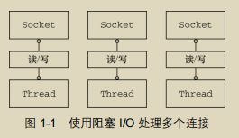

方案影响:

1. 可能会有大量大量线程处于休眠状态
2. 线程是需要资源的,操作栈大小区间为 64 KB 到 1 MB，具体取决于操作系统
3. 上下文切换开销大

##### 1.1.1 Java NIO

本地套接字库很早就提供了非阻塞调用(深入理解的话需要读Linux操作系统相关书籍)

- 可以使用 setsockopt()方法配置套接字，以便读/写调用在没有数据的时候立即返回
- 可以使用操作系统的事件通知 API②注册一组非阻塞套接字，以确定它们中是否有任何的套接字已经有数据可供读写。

##### 1.1.2 选择器

class java.nio.channels.Selector 是Java 的非阻塞 I/O 实现的关键。它使用了事件通知 API以确定在一组非阻塞套接字中有哪些已经就绪能够进行 I/O 相关的操作。

一个单一的线程便可以处理多个并发的连接。

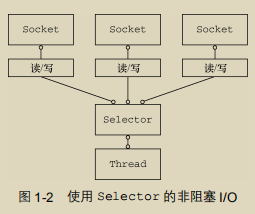

- 上下文开销少,线程少
- 没有IO操作可以进行别的任务

#### 1.2 Netty 简介

对 NIO 等高级API 的封装的框架

##### 1.2.1 谁在使用 Netty

见 http://netty.io/wiki/adopters.html

##### 1.2.2 异步和事件驱动

- 非阻塞网络调用使得我们可以不必等待一个操作的完成
- 选择器使得我们能够通过较少的线程便可监视许多连接上的事件

#### 1.3 Netty 的核心组件

##### 1.3.1 Channel

它代表一个到实体的开放连接，如读操作和写操作

##### 1.3.2 回调

Netty 在内部使用了回调来处理事件

##### 1.3.3 Future

JDK自带实现,但是允许手动检查对应的操作是否已经完成，或者一直阻塞直到它完成

Netty实现ChannelFuture,用于在执行异步操作的时候使用

事实上，回调和 Future 是相互补充的机制

##### 1.3.4 事件和 ChannelHandler

所有事件是按照它们与入站或出站数据流的相关性进行分类的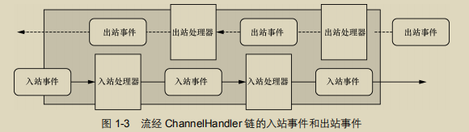

##### 1.3.5 把它们放在一起

1. Future、回调和 ChannelHandler

   Netty的异步编程模型是建立在Future和回调的概念之上的，而将事件派发到ChannelHandler的方法则发生在更深的层次上

2. 选择器、事件和 EventLoop

   Netty 通过触发事件将 Selector 从应用程序中抽象出来,在内部，将会为每个 Channel 分配一个 EventLoop，用以处理所有事件，包括：

   - 注册感兴趣的事件
   - 将事件派发给 ChannelHandler
   - 安排进一步的动作。

   EventLoop 本身只由一个线程驱动，其处理了一个 Channel 的所有 I/O 事件，并且在该EventLoop 的整个生命周期内都不会改变。

### 第 2 章 你的第一款Netty应用程序

#### 2.1 设置开发环境

JDK+Maven+IDE 即可

#### 2.2 Netty 客户端/服务器概览

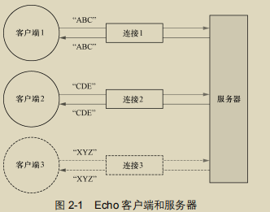

#### 2.3 编写 Echo 服务器

Netty服务器至少包含以下两部分:

- 引导——这是配置服务器的启动代码。至少，它会将服务器绑定到它要监听连接请求的端口上。
- 至少一个 ChannelHandler——该组件实现了服务器对从客户端接收的数据的处理，即它的业务逻辑。

##### 2.3.1 ChannelHandler 和业务逻辑

Netty，所有的数据处理逻辑都包含在核心抽象的实现中.

Echo 服务器会响应 **入站** 事件的方法.

继承 ChannelInboundHandlerAdapter 类也就足够了，它提供了 ChannelInboundHandler 的默认实现

> 每个channel 都有一个ChannelPipeline相关联,异常会沿着链传递,直到被处理(底端会记录下来)

##### 2.3.2 引导服务器

任务如下:

- 绑定到服务器将在其上监听并接受传入连接请求的端口；
- 配置 Channel，以将有关的入站消息通知给 EchoServerHandler 实例。

实现步骤如下:

- 创建一个 ServerBootstrap 的实例以引导和绑定服务器；
- 创建并分配一个 NioEventLoopGroup 实例以进行事件的处理，如接受新连接以及读/写数据； 
- 指定服务器绑定的本地的 InetSocketAddress； 
- 使用一个 EchoServerHandler 的实例初始化每一个新的 Channel； 
- 调用 ServerBootstrap.bind()方法以绑定服务器。

#### 2.4 编写 Echo 客户端

差别不大

#### 2.5 构建和运行 Echo 服务器和客户端

##### 2.5.1 运行构建

```shell
mvn clean package
```

##### 2.5.2 运行 Echo 服务器和客户端

已经添加了插件  exec-maven-plugin,并且配置了一些属性

```shell
mvn exec:java
```

### 第 3 章 Netty的组件和设计

#### 3.1 Channel、EventLoop 和 ChannelFuture

##### 3.1.1 Channel 接口

基本的 I/O 操作（bind()、connect()、read()和 write()）依赖于底层网络传输所提供的原语

##### 3.1.2 EventLoop 接口

EventLoop 定义了 Netty 的核心抽象，用于处理连接的生命周期中所发生的事件

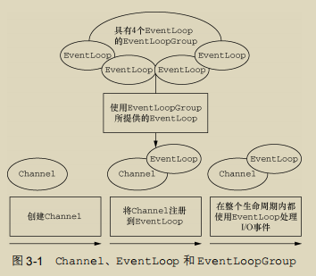

 

- 一个Group对应多个Loop
- 一个Loop对应一个线程
- 一个Loop对应多个Channel

##### 3.1.3 ChannelFuture 接口

Netty 提供了ChannelFuture 接口，其 addListener()方法注册了一个 ChannelFutureListener，以便在某个操作完成时（无论是否成功）得到通知。

#### 3.2 ChannelHandler 和 ChannelPipeline

##### 3.2.1 ChannelHandler 接口

充当了所有处理入站和出站数据的应用程序逻辑的容器

##### 3.2.2 ChannelPipeline 接口

ChannelPipeline 提供了 ChannelHandler 链的容器，并定义了用于在该链上传播入站和出站事件流的 API。当 Channel 被创建时，它会被自动地分配到它专属的 ChannelPipeline。

Handler 安装到 Pipeline过程:

1. 一个ChannelInitializer的实现被注册到了ServerBootstrap中
2. initializer.initChannel() 将在Pipeline中安装一组自定义的Handler
3. initializer将自己从Pipeline删除

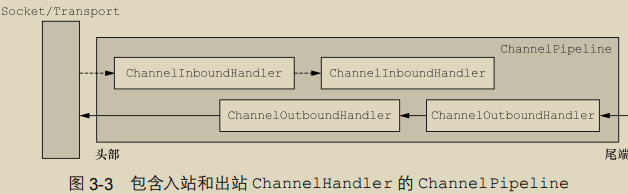

 

Netty 中，有两种发送消息的方式。

- 直接写到 Channel 中，消息从ChannelPipeline 的尾端开始流动
- 写到和 ChannelHandler相关联的ChannelHandlerContext对象中，消息从 ChannelPipeline 中的下一个 ChannelHandler 开始流动。

##### 3.2.3 更加深入地了解 ChannelHandler

Netty 以适配器类的形式提供了大量默认的 ChannelHandler 实现，其旨在简化应用程序处理逻辑的开发过程

##### 3.2.4 编码器和解码器

入站解码为对象,出站编码为字节

##### 3.2.5 抽象类 SimpleChannelInboundHandler

利用一个 ChannelHandler 来接收解码消息，并对该数据应用业务逻辑

#### 3.3 引导

Netty 的引导类为应用程序的网络层配置提供了容器，这涉及将一个进程绑定到某个指定的端口，或者将一个进程连接到另一个运行在某个指定主机的指定端口上的进程。

| 类别             | Bootstrap            | ServerBootstrap    |
| ---------------- | -------------------- | ------------------ |
| 网络编程中的作用 | 连接到远程主机和端口 | 绑定到一个本地端口 |
| EventLoopGroup   | 1                    | 2                  |

服务器需要两组不同的 Channel.

第一组将只包含一个 ServerChannel，代表服务器自身的已绑定到某个本地端口的正在监听的套接字。

第二组将包含所有已创建的用来处理传入客户端连接（对于每个服务器已经接受的连接都有一个）的 Channel

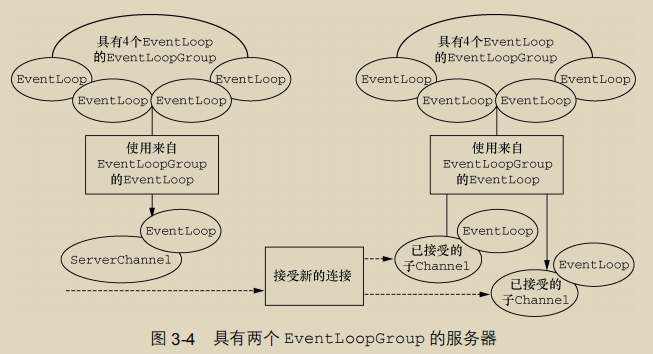

### 第 4 章 传输

#### 4.1 案例研究：传输迁移

Echo服务器,但是只返回"Hi"

##### 4.1.1 不通过 Netty 使用 OIO 和 NIO

OIO模式:

1. 创建 ServerSocket 监听端口,调用 accept() 监听请求并阻塞
2. 请求进来后,创建连接,开启一个新线程处理请求,接着监听

NIO模式:

1. 绑定端口,打开Selector来处理Channel,将ServerSocket 注册到Selector以接受连接
2. 接受客户端并注册到选择器,检查套接字是否已经准备好写数据,处理接着监听

##### 4.1.2 通过 Netty 使用 OIO 和 NIO

##### 4.1.3 非阻塞的 Netty 版本

看代码,两者几乎没有差别

#### 4.2 传输 API

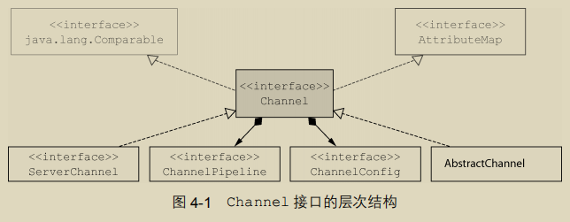

- ChannelConfig 包含了该 Channel 的所有配置设置，并且支持热更新

- ChannelPipeline 持有所有将应用于入站和出站数据以及事件的 ChannelHandler 实例，这些 ChannelHandler 实现了应用程序用于处理状态变化以及数据处理的逻辑

  > ChannelPipeline 实现了一种常见的设计模式—拦截过滤器 	

Netty 的 Channel 实现是线程安全的，因此你可以存储一个到 Channel 的引用，并且每当你需要向远程节点写数据时，都可以使用它，

#### 4.3 内置的传输

##### 4.3.1 NIO——非阻塞 I/O

选择器背后的基本概念是充当一个注册表，在那里你将可以请求在 Channel 的状态发生变化时得到通知

选择器运行在一个检查状态变化并对其做出相应响应的线程上，在应用程序对状态的改变做出响应之后，选择器将会被重置，并将重复这个过程。

选择操作的位模式(class java.nio.channels.SelectionKey)

| 名 称      | 描 述                                               |
| ---------- | --------------------------------------------------- |
| OP_ACCEPT  | 请求在接受新连接并创建 Channel 时获得通知           |
| OP_CONNECT | 请求在建立一个连接时获得通知                        |
| OP_READ    | 请求当数据已经就绪，可以从 Channel 中读取时获得通知 |
| OP_WRITE   | 请求当可以向 Channel 中写更多的数据时获得通知       |

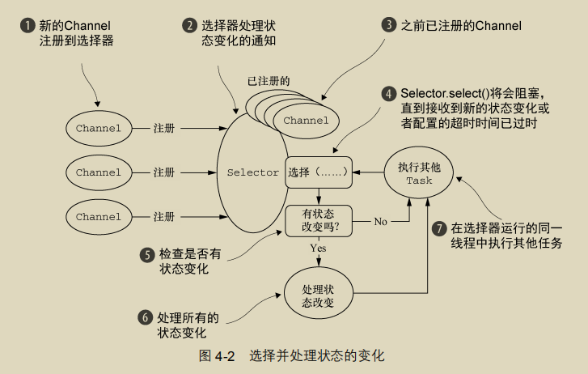

> 零拷贝（zero-copy）是一种目前只有在使用 NIO 和 Epoll 传输时才可使用的特性。它使你可以快速高效地将数据从文件系统移动到网络接口，而不需要将其从内核空间复制到用户空间，其在像 FTP 或者HTTP 这样的协议中可以显著地提升性能。但是，并不是所有的操作系统都支持这一特性

##### 4.3.2 Epoll—用于 Linux 的本地非阻塞传输

API几乎一致,只需把NIO编程EPOLL即可

##### 4.3.3 OIO—旧的阻塞 I/O

Netty利用了SO_TIMEOUT这个Socket标志，它指定了等待一个I/O操作完成的最大毫秒数。如果操作在指定的时间间隔内没有完成，则将会抛出一个SocketTimeout Exception。Netty将捕获这个异常并继续处理循环。在EventLoop下一次运行时，它将再次尝试。这实际上也是类似于Netty这样的异步框架能够支持OIO的唯一方式

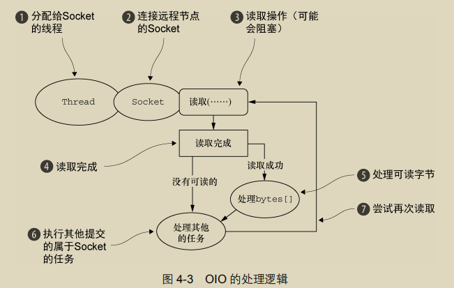

##### 4.3.4 用于 JVM 内部通信的 Local 传输

Netty 提供了一个 Local 传输，用于在同一个 JVM 中运行的客户端和服务器程序之间的异步通信

在这个传输中，和服务器 Channel 相关联的 SocketAddress 并没有绑定物理网络地址；相反，只要服务器还在运行，它就会被存储在注册表里，并在 Channel 关闭时注销。因为这个传输并不接受真正的网络流量，所以它并不能够和其他传输实现进行互操作。

##### 4.3.5 Embedded 传输

Netty 提供了一种额外的传输，使得你可以将一组 ChannelHandler 作为帮助器类嵌入到其他的 ChannelHandler 内部。通过这种方式，你将可以扩展一个 ChannelHandler 的功能，而又不需要修改其内部代码。

#### 4.4 传输的用例

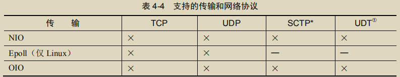

### 第 5 章 ByteBuf

Java NIO 提供了 ByteBuffer 作为它的字节容器,Netty 的 ByteBuffer 替代品是 ByteBuf

#### 5.1 ByteBuf 的 API

Netty 的数据处理 API 通过两个组件暴露——abstract class ByteBuf 和 interface ByteBufHolder

优点:

- 它可以被用户自定义的缓冲区类型扩展； 

-  通过内置的复合缓冲区类型实现了透明的零拷贝；

- 容量可以按需增长（类似于 JDK 的 StringBuilder）； 

- 在读和写这两种模式之间切换不需要调用 ByteBuffer 的 flip()方法； 

- 读和写使用了不同的索引； 

-  支持方法的链式调用；
-  支持引用计数； 
-  支持池化。

#### 5.2 ByteBuf 类——Netty 的数据容器

##### 5.2.1 它是如何工作的

ByteBuf 维护了两个不同的索引：一个用于读取，一个用于写入

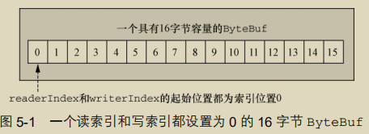

##### 5.2.2 ByteBuf 的使用模式

1. 堆缓冲区

   最常用的 ByteBuf 模式是将数据存储在 JVM 的堆空间中。这种模式被称为支撑数组（backing array），它能在没有使用池化的情况下提供快速的分配和释放

2. 直接缓冲区

   直接缓冲区是另外一种 ByteBuf 模式。使用直接内存

   直接缓冲区的主要缺点是，相对于基于堆的缓冲区，它们的分配和释放都较为昂贵

3. 复合缓冲区

   它为多个 ByteBuf 提供一个聚合视图。在这里你可以根据需要添加或者删除 ByteBuf 实例

   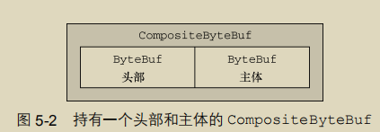

   Netty使用了CompositeByteBuf来优化套接字的I/O操作，尽可能地消除了由JDK的缓冲区实现所导致的性能以及内存使用率的惩罚

#### 5.3 字节级操作

##### 5.3.1 随机访问索引

使用那些需要一个索引值参数的方法（的其中）之一来访问数据既不会改变readerIndex 也不会改变 writerIndex

##### 5.3.2 顺序访问索引

虽然 ByteBuf 同时具有读索引和写索引，但是 JDK 的 ByteBuffer 却只有一个索引，这也就是为什么必须调用 flip()方法来在读模式和写模式之间进行切换的原因

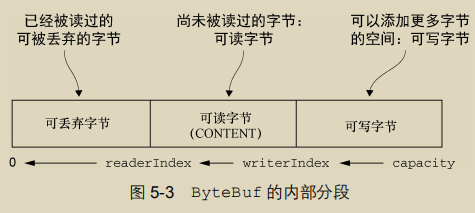

##### 5.3.3 可丢弃字节

通过调用 discardReadBytes()方法，可以丢弃它们并回收空间(get*操作)

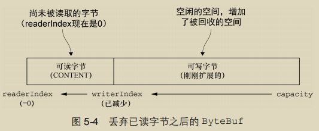

##### 5.3.4 可读字节

ByteBuf 的可读字节分段存储了实际数据。新分配的、包装的或者复制的缓冲区的默认的readerIndex 值为 0。任何名称以 read 或者 skip 开头的操作都将检索或者跳过位于当前readerIndex 的数据，并且将它增加已读字节数。

##### 5.3.5 可写字节

可写字节分段是指一个拥有未定义内容的、写入就绪的内存区域。。新分配的缓冲区的writerIndex 的默认值为 0。任何名称以 write 开头的操作都将从当前的 writerIndex 处开始写数据，并将它增加已经写入的字节数。

##### 5.3.6 索引管理

可以通过 markXxxIndex 和 resetXxxIndex 进行索引设置,调用 clear()只是重置索引而不会复制任何的内存

##### 5.3.7 查找操作

已废弃: 较复杂的查找 ByteBufProcessor 作为参数的方法达成

##### 5.3.8 派生缓冲区

派生缓冲区为 ByteBuf 提供了以专门的方式来呈现其内容的视图。方法调用会返回ByteBuf对象,其内部存储和 JDK 的 ByteBuffer 一样也是共享的。

> **ByteBuf 复制** 如果需要一个现有缓冲区的真实副本，请使用 copy()或者 copy(int, int)方法。不同于派生缓冲区，由这个调用所返回的 ByteBuf 拥有独立的数据副本。

##### 5.3.9 读/写操作

- get()和 set()操作，从给定的索引开始，并且保持索引不变
- read()和 write()操作，从给定的索引开始，并且会根据已经访问过的字节数对索引进行调整

#### 5.4 ByteBufHolder 接口

要存储各种属性值(比如HTTP响应),ByteBufHolder 也为 Netty 的高级特性提供了支持，如缓冲区池化，其中可以从池中借用 ByteBuf，并且在需要时自动释放

#### 5.5 ByteBuf 分配

##### 5.5.1 按需分配：ByteBufAllocator 接口

为了降低分配和释放内存的开销，Netty 通过 interface ByteBufAllocator 实现了（ByteBuf 的）池化，它可以用来分配我们所描述过的任意类型的ByteBuf 实例

可以通过 Channel（每个都可以有一个不同的 ByteBufAllocator 实例）或者 ChannelHandlerContext 获取一个到 ByteBufAllocator 的引用。

Netty提供了两种ByteBufAllocator的实现：PooledByteBufAllocator和UnpooledByteBufAllocator。前者池化ByteBuf减少碎片提高性能;后者每次都会创建一个新的

##### 5.5.2 Unpooled 缓冲区

Unpooled 的工具类，它提供了静态的辅助方法来创建未池化的 ByteBuf实例。

##### 5.5.3 ByteBufUtil 类

这些静态方法中最有价值的可能就是 hexdump()方法，它以十六进制的表示形式打印ByteBuf 的内容。以及 equals 方法

#### 5.6 引用计数

ByteBuf 和 ByteBufHolder 引入了引用计数技术，它们都实现了 interface ReferenceCounted。

一般来说，是由最后访问（引用计数）对象的那一方来负责将它释放

### 第 6 章 ChannelHandler和 ChannelPipeline

#### 6.1 ChannelHandler 家族

##### 6.1.1 Channel 的生命周期

| 状态                | 描述                                                         |
| ------------------- | ------------------------------------------------------------ |
| ChannelUnregistered | Channel 已经被创建，但还未注册到 EventLoop                   |
| ChannelRegistered   | Channel 已经被注册到了 EventLoop                             |
| ChannelActive       | Channel 处于活动状态（已经连接到它的远程节点）。它现在可以接收和发送数据了 |
| ChannelInactive     | Channel 没有连接到远程节点                                   |

当这些状态发生改变时，将会生成对应的事件。这些事件将会被转发给 ChannelPipeline 中的 ChannelHandler，其可以随后对它们做出响应。

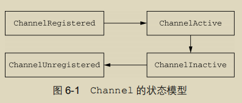

##### 6.1.2 ChannelHandler 的生命周期

interface ChannelHandler 定义的生命周期操作，在 ChannelHandler被添加到 ChannelPipeline 中或者被从 ChannelPipeline 中移除时会调用这些操作

| 类型            | 描述                                                  |
| --------------- | ----------------------------------------------------- |
| handlerAdded    | 当把 ChannelHandler 添加到 ChannelPipeline 中时被调用 |
| handlerRemoved  | 当从 ChannelPipeline 中移除 ChannelHandler 时被调用   |
| exceptionCaught | 当处理过程中在 ChannelPipeline 中有错误产生时被调用   |

##### 6.1.3 ChannelInboundHandler 接口

内有许多生命周期方法。这些方法将会在数据被接收时或者与其对应的 Channel 状态发生改变时被调用。

##### 6.1.4 ChannelOutboundHandler 接口

**ChannelPromise**与**ChannelFuture** ChannelOutboundHandler中的大部分方法都需要一个ChannelPromise参数，以便在操作完成时得到通知。ChannelPromise是ChannelFuture的一个子类，其定义了一些可写的方法，如setSuccess()和setFailure()，从而使ChannelFuture不可变

##### 6.1.5 ChannelHandler 适配器

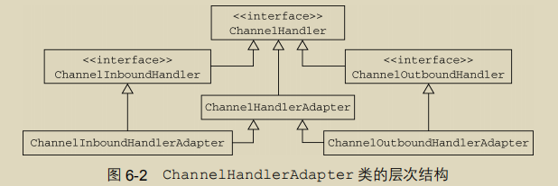

##### 6.1.6 资源管理

每当通过调用 Handler.channelRead()或者 Handler.write()方法来处理数据时，你都需要确保没有任何的资源泄漏。Netty 使用引用计数来处理池化的 ByteBuf。

Netty提供了 class ResourceLeakDetector 它将对你应用程序的缓冲区分配做大约 1%的采样来检测内存泄露。相关的开销是非常小的

总之，如果一个消息被消费或者丢弃了，并且没有传递给ChannelPipeline 中的下一个ChannelOutboundHandler，那么用户就有责任调用 ReferenceCountUtil.release()。如果消息到达了实际的传输层，那么当它被写入时或者 Channel 关闭时，都将被自动释放。

#### 6.2 ChannelPipeline 接口

ChannelPipeline是一个拦截流经Channel的入站和出站事件的ChannelHandler 实例链

每一个新创建的 Channel 都将会被分配一个新的 ChannelPipeline。这项关联是永久性的；Channel 既不能附加另外一个 ChannelPipeline，也不能分离其当前的。

根据事件的起源，事件将会被入站/出站的Handler处理.随后，通过调用 ChannelHandlerContext 实现，它将被转发给同一超类型的下一个ChannelHandler

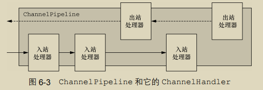

左边是头,右边是尾

##### 6.2.1 修改 ChannelPipeline

ChannelPipeline 可以通过添加、删除或者替换其他的 ChannelHandler 来实时地修改ChannelPipeline 的布局

> ChannelHandler 的执行和阻塞
>
> 通常 ChannelPipeline 中的每一个 ChannelHandler 都是通过它的 EventLoop（I/O 线程）来处理传递给它的事件的。所以至关重要的是不要阻塞这个线程，因为这会对整体的 I/O 处理产生负面的影响。
>
> 但有时可能需要与那些使用阻塞 API 的遗留代码进行交互。对于这种情况，ChannelPipeline 有一些s接受一个 EventExecutorGroup 的 add()方法。

##### 6.2.2 触发事件

ChannelPipeline 的 API 公开了用于调用入站和出站操作的附加方法

总结一下：

- ChannelPipeline 保存了与 Channel 相关联的 ChannelHandler；
- ChannelPipeline 可以根据需要，通过添加或者删除 hannelHandler 来动态地修改
- ChannelPipeline 有着丰富的 API 用以被调用，以响应入站和出站事件。

#### 6.3 ChannelHandlerContext 接口

ChannelHandlerContext 代表了 ChannelHandler 和 ChannelPipeline 之间的关联，每当有 ChannelHandler 添加到 ChannelPipeline 中时，都会创建 ChannelHandlerContext。

如果调用 Channel 或者 ChannelPipeline 上的这些方法，它们将沿着整个 ChannelPipeline 进行传播。而调用位于 ChannelHandlerContext上的相同方法，则将从当前所关联的 ChannelHandler 开始，并且只会传播给位于该ChannelPipeline 中的下一个能够处理该事件的 ChannelHandler。

当使用 ChannelHandlerContext 的 API 的时候，请牢记以下两点： 

- ChannelHandlerContext 和 ChannelHandler 之间的关联（绑定）是永远不会改变的，所以缓存对它的引用是安全的；
- 如同我们在本节开头所解释的一样，相对于其他类的同名方法，ChannelHandler Context的方法将产生更短的事件流，应该尽可能地利用这个特性来获得最大的性能。

##### 6.3.1 使用 ChannelHandlerContext

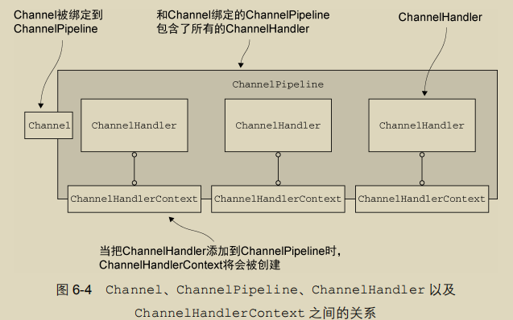

##### 6.3.2 ChannelHandler 和 ChannelHandlerContext 的高级用法

- 运行时可以操作ChannelPipeline 的 ChannelHandler
- 缓存到 ChannelHandlerContext 的引用以供稍后使用

> 为何要共享同一个**ChannelHandler** 在多个ChannelPipeline中安装同一个ChannelHandler的一个常见的原因是用于收集跨越多个 Channel 的统计信息。

#### 6.4 异常处理

##### 6.4.1 处理入站异常

- ChannelHandler.exceptionCaught()的默认实现是简单地将当前异常转发 ChannelPipeline 中的下一个 ChannelHandler； 
- 如果异常到达了 ChannelPipeline 的尾端，它将会被记录为未被处理； 
- 要想定义自定义的处理逻辑，你需要重写 exceptionCaught()方法。然后你需要决定 是否需要将该异常传播出去。

##### 6.4.2 处理出站异常

用于处理出站操作中的正常完成以及异常的选项，都基于以下的通知机制。 

- 每个出站操作都将返回一个 ChannelFuture。注册到 ChannelFuture 的 ChannelFutureListener 将在操作完成时被通知该操作是成功了还是出错了。 
- 几乎所有的 ChannelOutboundHandler 上的方法都会传入一个 ChannelPromise的实例。

### 第 7 章 EventLoop和线程模型

#### 7.1 线程模型概述

基本的线程池化模式可以描述为：

- 从池的空闲线程列表中选择一个 Thread，并且指派它去运行一个已提交的任务（一个Runnable 的实现）；
- 当任务完成时，将该 Thread 返回给该列表，使其可被重用。

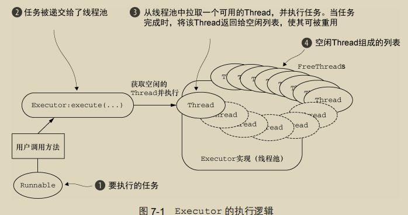

#### 7.2 EventLoop 接口

运行任务来处理在连接的生命周期内发生的事件是任何网络框架的基本功能.与之相应的编程上的构造通常被称为事件循环—一个 Netty 使用了 interface io.netty.channel.EventLoop 来适配的术语。

基本原理:

- 阻塞直到有事件已经就绪可以执行
- 循环遍历,处理所有事件

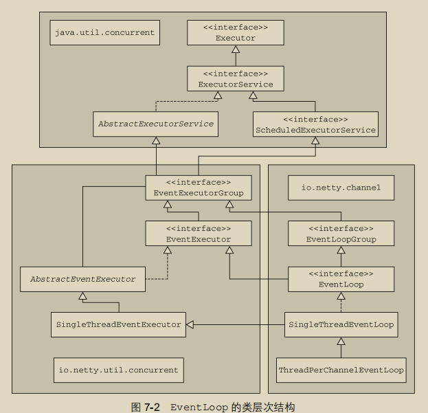

在这个模型中，一个 EventLoop 将由一个永远都不会改变的 Thread 驱动，同时任务（Runnable 或者 Callable）可以直接提交给 EventLoop 实现，以立即执行或者调度执行。

事件/任务的执行顺序 事件和任务是以先进先出（FIFO）的顺序执行的。这样可以通过保证字节内容总是按正确的顺序被处理，消除潜在的数据损坏的可能性。

##### 7.2.1 Netty 4 中的 I/O 和事件处理

Netty 4 中，所有的I/O操作和事件都由已经被分配给了EventLoop的那个Thread来处理

##### 7.2.2 Netty 3 中的 I/O 操作

所有的出站（下游）事件都由调用线程处理，其可能是 I/O 线程也可能是别的线程。

#### 7.3 任务调度

##### 7.3.1 JDK 的任务调度 API

基于 ScheduledExecutorService,在高负载下它将带来性能上的负担。

ScheduledExecutorService 的实现具有局限性，例如，事实上作为线程池管理的一部分，将会有额外的线程创建。如果有大量任务被紧凑地调度，那么这将成为一个瓶颈。

##### 7.3.2 使用 EventLoop 调度任务

Netty的EventLoop扩展了ScheduledExecutorService,提供了使用JDK实现可用的所有方法，

#### 7.4 实现细节

##### 7.4.1 线程管理

Netty线程模型的卓越性能取决于对于当前执行的Thread的身份的确定，也就是说，确定它是否是分配给当前Channel以及它的EventLoop的那一个线程。

如果（当前）调用线程正是支撑 EventLoop 的线程，那么所提交的代码块将会被（直接）执行。否则，EventLoop 将调度该任务以便稍后执行，并将它放入到内部队列中。当 EventLoop下次处理它的事件时，它会执行队列中的那些任务/事件。这也就解释了任何的 Thread 是如何与 Channel 直接交互而无需在 ChannelHandler 中进行额外同步的。注意，每个 EventLoop 都有它自已的任务队列，独立于任何其他的 EventLoop。

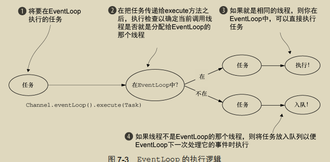

“永远不要将一个长时间运行的任务放入到执行队列中，因为它将阻塞需要在同一线程上执行的任何其他任务。”如果必须要进行阻塞调用或者执行长时间运行的任务，我们建议使用一个专门的EventExecutor。

##### 7.4.2 EventLoop/线程的分配

1. 异步传输

   异步传输实现只使用了少量的 EventLoop,可能会被多个 Channel 所共享

   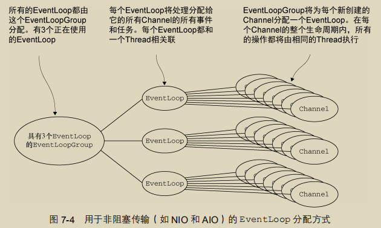

   EventLoop 的分配方式对 ThreadLocal 的使用的影响,它对于实现状态追踪等功能来说是个糟糕的选择

2. 阻塞传输

   用于像 OIO（旧的阻塞 I/O）这样的其他传输的设计

   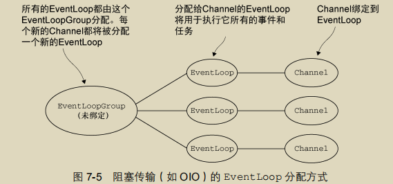

### 第 8 章 引导

Netty处理引导的方式使你的应用程序和网络层相隔离，无论它是客户端还是服务器

#### 8.1 Bootstrap 类

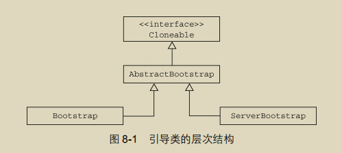

服务器致力于使用一个父 Channel 来接受来自客户端的连接，并创建子 Channel 以用于它们之间的通信；

而客户端将最可能只需要一个单独的、没有父 Channel 的 Channel 来用于所有的网络交互

> 为什么引导类是 Cloneable 的
>
> 你有时可能会需要创建多个具有类似配置或者完全相同配置的Channel在一个已经配置完成的引导类实例上调用clone()方法将返回另一个可以立即使用的引导类实例,这种方式只会创建引导类实例的EventLoopGroup的一个浅拷贝

#### 8.2 引导客户端和无连接协议

##### 8.2.1 引导客户端

Bootstrap 类负责为客户端和使用无连接协议的应用程序创建 Channel

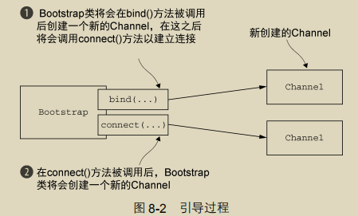

##### 8.2.2 Channel 和 EventLoopGroup 的兼容性

必须保持这种兼容性，不能混用具有不同前缀的组件

> 关于 IllegalStateException 的更多讨论
>
> 在引导的过程中，在调用 bind()或者 connect()方法之前，必须调用以下方法来设置所需的组件：
>
> -  group()； 
>
> -  channel()或者 channelFactory()； 
>
> -  handler()。
>
> 如果不这样做，则将会导致 IllegalStateException。对 handler()方法的调用尤其重要，因为它需要配置好 ChannelPipeline。

#### 8.3 引导服务器

##### 8.3.1 ServerBootstrap 类

拥有child*() 的方法.

##### 8.3.2 引导服务器

ServerChannel 的实现负责创建子 Channel，这些子 Channel 代表了已被接受的连接。

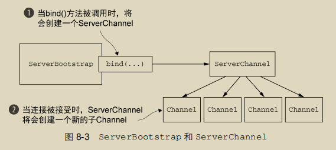

#### 8.4 从 Channel 引导客户端

假设你的服务器正在处理一个客户端的请求，这个请求需要它充当第三方系统的客户端。这时候就需要从已经被接受的子 Channel 中引导一个客户端 Channel。

通过将已被接受的子 Channel 的 EventLoop 传递给 Bootstrap的 group()方法来共享该 EventLoop。因为分配给 EventLoop 的所有 Channel 都使用同一个线程，所以这避免了额外的线程创建，以及前面所提到的相关的上下文切换。

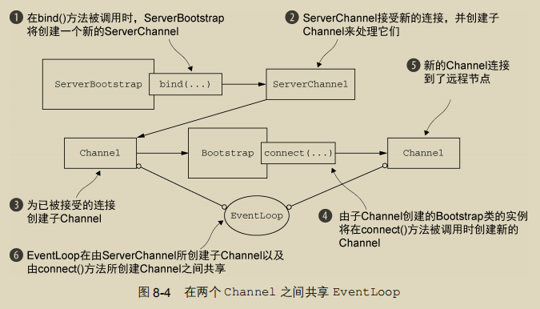

#### 8.5 在引导过程中添加多个 ChannelHandler

Netty 提供了一个特殊的 ChannelInboundHandlerAdapter 子类

```java
protected abstract void initChannel(C ch) throws Exception;
```


这个方法提供了一种将多个 ChannelHandler 添加到一个ChannelPipeline 中的简便方法。你只需要简单地向 Bootstrap 或 ServerBootstrap 的实例提供你的 ChannelInitializer 实现即可，并且一旦 Channel 被注册到了它的 EventLoop 之后，就会调用你的initChannel()版本。在该方法返回之后，ChannelInitializer 的实例将会从 ChannelPipeline 中移除它自己。

#### 8.6 使用 Netty 的 ChannelOption 和属性

你可以使用 option()方法来将 ChannelOption 应用到引导。你所提供的值将会被自动应用到引导所创建的所有 Channel。可用的 ChannelOption 包括了底层连接的详细信息，如keep-alive 或者超时属性以及缓冲区设置。

在某些常用的属性和数据不可用时，Netty 提供了AttributeMap 抽象（一个由 Channel 和引导类提供的集合）以及 AttributeKey\<T（一个用于插入和获取属性值的泛型类）。使用这些工具，便可以安全地将任何类型的数据项与客户端和服务器 Channel（包含 ServerChannel 的子 Channel）相关联了。

#### 8.7 引导 DatagramChannel

Bootstrap 类也可以被用于无连接的协议。为此，Netty 提供了各种 DatagramChannel 的实现。唯一区别就是，不再调用 connect()方法，而是只调用 bind()方法

#### 8.8 关闭

引导使你的应用程序启动并且运行起来，但是迟早你都需要优雅地将它关闭。

最重要的是，你需要关闭 EventLoopGroup，它将处理任何挂起的事件和任务，并且随后释放所有活动的线程。

### 第9章　单元测试

最佳实践要求你的测试不仅要能够证明你的实现是正确的，而且还要能够很容易地隔离那些因修改代码而突然出现的问题。这种类型的测试叫作单元测试

需要使用到 EmbeddedChannel 和 JUnit框架 

#### 9.1 EmbeddedChannel 概述

想法是直截了当的：将入站数据或者出站数据写入到 EmbeddedChannel 中，然后检 查是否有任何东西到达了 ChannelPipeline 的尾端。以这种方式，你便可以确定消息是否已 经被编码或者被解码过了以及是否触发了任何的 ChannelHandler 动作。

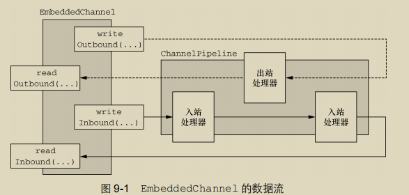

#### 9.2 使用 EmbeddedChannel 测试 ChannelHandler

##### 9.2.1 测试入站消息

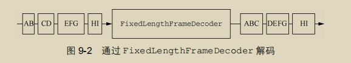

##### 9.2.2 测试出站消息

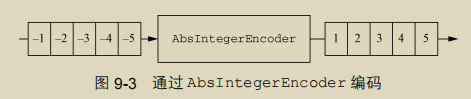

下面是代码中执行的步骤: 

1. 将 4 字节的负整数写到一个新的 ByteBuf 中。
2. 创建一个 EmbeddedChannel，并为它分配一个 AbsIntegerEncoder。
3. 调用 EmbeddedChannel 上的 writeOutbound()方法来写入该 ByteBuf
4. 标记该 Channel 为已完成状态。
5. 从 EmbeddedChannel 的出站端读取所有的整数，并验证是否只产生了绝对值。

#### 9.3 测试异常处理

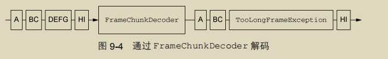

## 第二部分 编解码器 

网络只将数据看作是原始的字节序列。然而，我们的应用程序则会把这些字节组织成有意义的信息

将应用程序的数据转换为网络格式，以及将网络格式转换为应用程序的数据的组件分别叫作编码器和解码器，同时具有这两种功能的单一组件叫作编解码器。

### 第 10 章 编解码器框架

#### 10.1 什么是编解码器

编码器是将消息转换为适合于传输的格式

解码器则是将网络字节流转换回应用程序的消息格式

#### 10.2 解码器

Netty 的解码器实现了 ChannelInboundHandler

Netty提供两种:

- 将字节解码为消息——ByteToMessageDecoder 和 ReplayingDecoder
- 将一种消息类型解码为另一种——MessageToMessageDecoder

##### 10.2.1 抽象类 ByteToMessageDecoder

该类会对入站数据进行缓冲


> 编解码器中的引用计数
>
> 一旦消息被编码或者解码，它就会被 ReferenceCountUtil.release(message)调用自动释放。如果你需要保留引用以便稍后使用，那么你可以调用 ReferenceCountUtil.retain(message)方法。这将会增加该引用计数，从而防止该消息被释放。

##### 10.2.2 抽象类 ReplayingDecoder

ReplayingDecoder扩展了ByteToMessageDecoder类，使得我们不必调用 readableBytes()方法。它通过使用一个自定义的ByteBuf实现 ，ReplayingDecoderByteBuf，包装传入的ByteBuf实现了这一点，其将在内部执行该调用

##### 10.2.3 抽象类 MessageToMessageDecoder

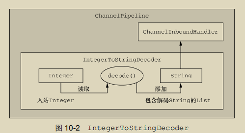

##### 10.2.4 TooLongFrameException 类

由于 Netty 是一个异步框架，所以需要在字节可以解码之前在内存中缓冲它们。因此，不能让解码器缓冲大量的数据以至于耗尽可用的内存。Netty 提供了TooLongFrameException 类，其将由解码器在帧超出指定的大小限制时抛出。

#### 10.3 编码器

- 消息编码为字节； 
- 将消息编码为消息

##### 10.3.1 抽象类 MessageToByteEncoder

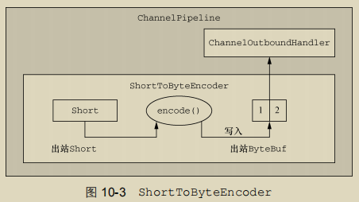

##### 10.3.2 抽象类 MessageToMessageEncoder

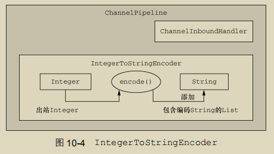

#### 10.4 抽象的编解码器类

通过尽可能地将这两种功能分开，最大化了代码的可重用性和可扩展性，这是 Netty 设计的一个基本原则

##### 10.4.1 抽象类 ByteToMessageCodec

任何的请求/响应协议都可以作为使用ByteToMessageCodec的理想选择。

##### 10.4.2 抽象类 MessageToMessageCodec

在两种不同的消息 API 之间来回转换数据

> WebSocket 协议
>
> 下面关于 MessageToMessageCodec 的示例引用了一个新出的 WebSocket 协议，这个协议能实现 Web 浏览器和服务器之间的全双向通信。

##### 10.4.3 CombinedChannelDuplexHandler 类

### 第11章　预置的ChannelHandler和编解码器

#### 11.1 通过 SSL/TLS 保护 Netty 应用程序

为了支持 SSL/TLS，Java 提供了 javax.net.ssl 包，它的 SSLContext 和 SSLEngine类使得实现解密和加密相当简单直接。Netty 通过一个名为 SslHandler 的 ChannelHandler实现利用了这个 API，其中 SslHandler 在内部使用 SSLEngine 来完成实际的工作。

> Netty 还提供了使用 OpenSSL 工具包（www.openssl.org）的 SSLEngine 实现。这个 OpenSslEngine 类提供了比 JDK 提供的 SSLEngine 实现更好的性能。

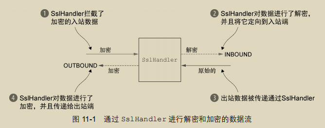

在大多数情况下，SslHandler 将是 ChannelPipeline 中的第一个 ChannelHandler。这确保了只有在所有其他的 ChannelHandler 将它们的逻辑应用到数据之后，才会进行加密。

#### 11.2 构建基于 Netty 的 HTTP/HTTPS 应用程序

##### 11.2.1 HTTP 解码器、编码器和编解码器

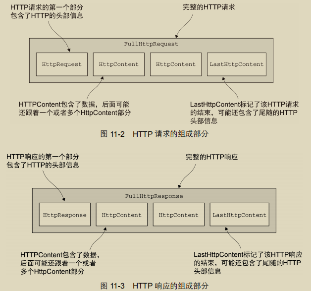

##### 11.2.2 聚合 HTTP 消息

由于消息分段需要被缓冲，直到可以转发一个完整的消息给下一个 ChannelInboundHandler，所以这个操作有轻微的开销。其所带来的好处便是你不必关心消息碎片了。

##### 11.2.3 HTTP 压缩

建议开启压缩功能以尽可能多地减小传输数据的大小.Netty 为压缩和解压缩提供了 ChannelHandler 实现，它们同时支持 gzip 和 deflate 编码。

> HTTP 请求的头部信息
>
> 客户端可以通过提供以下头部信息来指示服务器它所支持的压缩格式：
>
> GET /encrypted-area HTTP/1.1
>
> Host: www.example.com
>
> Accept-Encoding: gzip, deflate
>
> 然而，需要注意的是，服务器没有义务压缩它所发送的数据。

##### 11.2.4 使用 HTTPS

启用 HTTPS 只需要将 SslHandler 添加到 ChannelPipeline 的ChannelHandler 组合中。

##### 11.2.5 WebSocket

WebSocket 在客户端和服务器之间提供了真正的双向数据交换。

要想向你的应用程序中添加对于 WebSocket 的支持，你需要将适当的客户端或者服务器WebSocket ChannelHandler 添加到 ChannelPipeline 中。这个类将处理由 WebSocket 定义的称为帧的特殊消息类型。

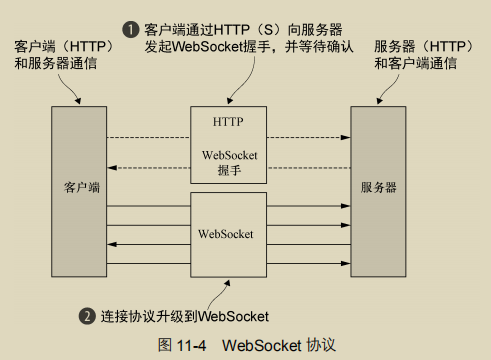

#### 11.3 空闲的连接和超时

检测空闲连接以及超时对于及时释放资源来说是至关重要的。由于这是一项常见的任务，Netty 特地为它提供了几个 ChannelHandler 实现

IdleStateHandler  ReadTimeoutHandler

#### 11.4 解码基于分隔符的协议和基于长度的协议

##### 11.4.1 基于分隔符的协议

基于分隔符的（delimited）消息协议使用定义的字符来标记的消息或者消息段（通常被称为帧）的开头或者结尾。。由RFC文档正式定义的许多协议（如SMTP、POP3、IMAP以及Telnet)都是这样的。

DelimiterBasedFrameDecoder   LineBasedFrameDecoder

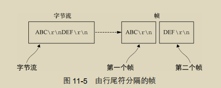

##### 11.4.2 基于长度的协议

基于长度的协议通过将它的长度编码到帧的头部来定义帧，而不是使用特殊的分隔符来标记它的结束  

FixedLengthFrameDecoder   LengthFieldBasedFrameDecoder

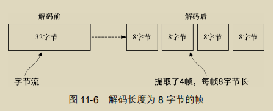

变长帧，你可以使用 LengthFieldBasedFrameDecoder，

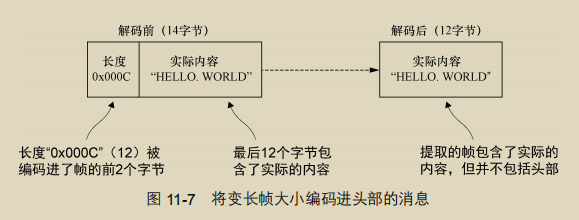

#### 11.5 写大型数据

由于使用异步框架,所以即使没有写出所有的数据，写操作也会在完成时返回并通知 ChannelFuture。当这种情况发生时，如果仍然不停地写入，就有内存耗尽的风险。

提到了 NIO 的零拷贝特性，这种特性消除了将文件的内容从文件系统移动到网络栈的复制过程。所有的这一切都发生在 Netty 的核心中，所以应用程序所有需要做的就是使用一个 FileRegion 接口的实现，通过支持零拷贝的文件传输的 Channel 来发送的文件区域

在需要将数据从文件系统复制到用户内存中时，可以使用 ChunkedWriteHandler，它支持异步写大型数据流，而又不会导致大量的内存消耗。

| 名称             | 描述                                                         |
| ---------------- | ------------------------------------------------------------ |
| ChunkedFile      | 从文件中逐块获取数据，当你的平台不支持零拷贝或者你需要转换数据时使用 |
| ChunkedNioFile   | 和 ChunkedFile 类似，只是它使用了 FileChannel                |
| ChunkedStream    | 从 InputStream 中逐块传输内容                                |
| ChunkedNioStream | 从 ReadableByteChannel 中逐块传输内容                        |

#### 11.6 序列化数据

##### 11.6.1 JDK 序列化

如果你的应用程序必须要和使用了ObjectOutputStream和ObjectInputStream的远程节点交互，并且兼容性也是你最关心的，那么JDK序列化将是正确的选择

JDK序列化编解码器 CompatibleObjectDecoder ObjectDecoder等

##### 11.6.2 使用 JBoss Marshalling 进行序列化

JBoss Marshalling将是个理想的选择：它比JDK序列化最多快 3 倍，而且也更加紧凑

CompatibleMarshallingDecoder 兼容JDK序列化

MarshallingDecoder 适用于使用 JBoss Marshalling 的节点。这些类必须一起使用

##### 11.6.3 通过 Protocol Buffers 序列化

Netty序列化的最后一个解决方案是利用Protocol Buffers 的编解码器

[文档地址](https://github.com/google/protobuf)

## 第三部分 网络协议 

### 第 12 章 WebSocket

实时 Web 利用技术和实践，使用户在信息的作者发布信息之后就能够立即收到信息，而不需要他们或者他们的软件周期性地检查信息源以获取更新。

#### 12.1 WebSocket 简介

异步地处理消息回执

Netty 对于 WebSocket 的支持包含了所有正在使用中的主要实现，因此在你的下一个应用程序中采用它将是简单直接的。和往常使用 Netty 一样，你可以完全使用该协议，而无需关心它内部的实现细节。

#### 12.2 我们的 WebSocket 示例应用程序

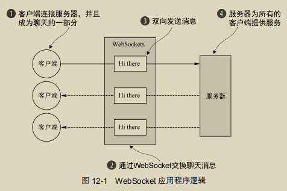

#### 12.3 添加 WebSocket 支持

在从标准的HTTP或者HTTPS协议切换到WebSocket时，将会使用一种称为升级握手 的机制。因此，使用WebSocket的应用程序将始终以HTTP/S作为开始，然后再执行升级。

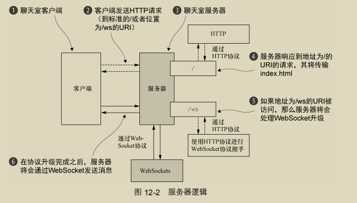

##### 12.3.1 处理 HTTP 请求

HttpRequestHandler 扩展了 SimpleChannelInboundHandler 以处理 FullHttpRequest 消息

WEBSOCKET 帧 WebSocket 以帧的方式传输数据，每一帧代表消息的一部分。一个完整的消息可能会包含许多帧。

##### 12.3.2 处理 WebSocket 帧

由 IETF 发布的 WebSocket RFC，定义了 6 种帧，Netty 为它们每种都提供了一个 POJO 实现。

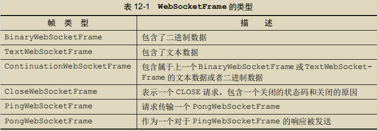

##### 12.3.3 初始化 ChannelPipeline

为了将 ChannelHandler 安装到 ChannelPipeline 中，你扩展了 ChannelInitializer，并实现了 initChannel()方法

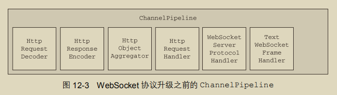

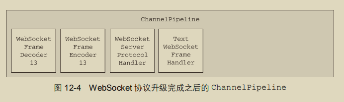

##### 12.3.4 引导

引导该服务器，并安装 ChatServerInitializer 的代码

#### 12.4 测试

```shell
mvn -PChatServer clean package exec:exec
mvn -PChatServer -Dport=1111 clean package exec:exec
```


如何进行加密

不过是将一个 SslHandler 添加到 ChannelPipeline 中，并配置它的问题

### 第 13 章 使用UDP广播事件

#### 13.1 UDP 的基础知识

无连接/纠错,消息可能会丢失

#### 13.2 UDP 广播

#### 13.3 UDP 示例应用程序

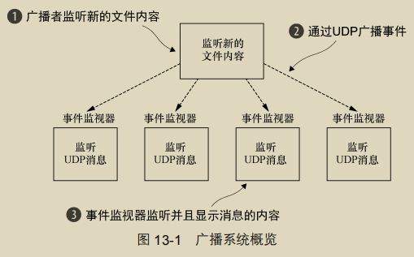

#### 13.4 消息 POJO: LogEvent

#### 13.5 编写广播者

Netty 提供了大量的类来支持 UDP 应用程序的编写

DatagramChannel 实现用它来和远程节点通信。

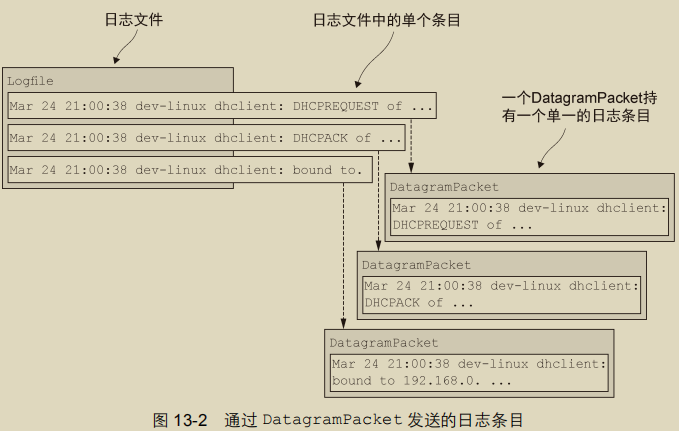

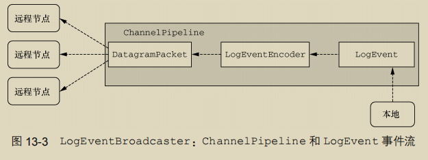

*netcat* 非常适合于对这个应用程序进行基本的测试；它只是监听某个指定的端口，并且将所有接收到的数据打印到标准输出。

#### 13.6 编写监视器

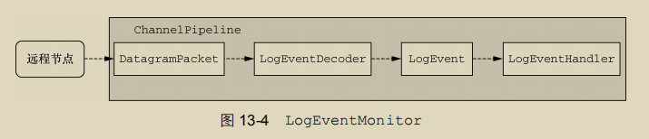

## 第四部分 案例研究 

### 第 14 章 案例研究，第一部分

#### 14.1 Droplr——构建移动服务

##### 14.1.1 这一切的起因

运行的是一个 LAMP 应用程序，其作为前端页面服务于用户，同时还作为 API 服务于客户端应用程序(LAMP:  Linux、Apache Web Server、MySQL 以及 PHP 的首字母组成)

重新设计目标:

- 将单片的技术栈拆分为多个可横向扩展的组件；
- 添加冗余，以避免宕机； 
-  为客户端创建一个简洁的 API； 
-  使其全部运行在 HTTPS 上。

##### 14.1.2 Droplr 是怎样工作的

将一个文件拖动到应用程序的菜单栏图标，然后 Droplr将会上传该文件。当上传完成之后，Droplr 将复制一个短 URL——到剪贴板。

##### 14.1.3 创造一个更加快速的上传体验

原本流程: 

1. 接收上传
2. 上传到S3
3. 如果是图片创建缩略图
4. 应答客户端

总结: 2 和 3 是瓶颈,尝试进行如下优化


1. 方案A ,使用两个阶段操作,一旦有个阶段出了问题就会导致不一致
2. 方案B,需要缓冲和长连接,推迟缩略图创建

##### 14.1.4 技术栈

需求:

1. 快速
2. 可伸缩
3. 提供对底层数据的控制

#### 14.2 Firebase——实时的数据同步服务

通过传统的 3 层架构很难实现实时的数据同步，其需要开发者管理他们自己的运维、服务器以及伸缩

通过维护到客户端的实时的、双向的通信，允许开发人员在几分钟之内跨越不同的客户端进行应用程序数据的同步—这一切都不需要任何的后端工作、服务器、运维或者伸缩。

##### 14.2.1 Firebase 的架构


##### 14.2.2 长轮询

Firebase 同时使用了长轮询和 WebSocket 传输。

长轮询传输是高度可靠的，覆盖了所有的浏览器、网络以及运营商；

而基于 WebSocket 的传输，速度更快，但是由于浏览器/客户端的局限性，并不总是可用的。

1. 保证消息的按顺序投递

   > 可以通过将单一请求的模式切换为最多两个请求的模式。

2. 关闭通知

##### 14.2.3 HTTP 1.1 keep-alive 和流水线化

可以在同一个连接上发送多个请求到服务器

##### 14.2.4 控制 SslHandler

计费

#### 14.3 Urban Airship——构建移动服务

##### 14.3.1 移动消息的基础知识

虽然市场人员长期以来都使用 SMS 来作为一种触达移动设备的通道，但是最近一种被称为推送通知的功能正在迅速地成为向智能手机发送消息的首选机制


##### 14.3.2 第三方递交

##### 14.3.3 使用二进制协议的例子

苹果公司的 APNS 是一个具有特定的网络字节序的有效载荷的二进制协议

##### 14.3.4 直接面向设备的递交

##### 14.3.5 Netty 擅长管理大量的并发连接

##### 14.3.6 Urban Airship 小结—跨越防火墙边界

1．内部的 RPC 框架

2．负载和性能测试

3．同步协议的异步客户端

### 第 15 章 案例研究，第二部分

#### 15.1 Netty在Facebook的使用：Nifty和Swift

##### 15.1.1 什么是 Thrift

Thrift是一个用来构建服务和客户端的框架，其通过远程过程调用（RPC）来进行通信.后端服务之间相互通信的主要方式之一，同时它还被用于非RPC 的序列化任务，因为它提供了一个通用的、紧凑的存储格式，能够被多种语言读取，以便后续处理。

##### 15.1.2 使用 Netty 改善 Java Thrift 的现状

主要是NIO的出现和流水线处理

##### 15.1.3 Nifty 服务器的设计


##### 15.1.4 Nifty 异步客户端的设计


#### 15.2 Netty 在 Twitter 的使用：Finagle

##### 15.2.1 Twitter 成长的烦恼

规模成长,Ruby难以维护,们决定使用 Java 或者 Scala 在 JVM 上构建所有的新服务

##### 15.2.2 Finagle 的诞生

需要一个高性能的、容错的、协议不可知的、异步的 RPC 框架

Twitter构建在几种开源的协议之上,Netty的连接管理以及协议不可知的特性为构建Finagle提供了绝佳的基础

##### 15.2.3 Finagle 是如何工作的

Finagle 的内部结构是非常模块化的

Finagle 栈的底部是 Transport 层

