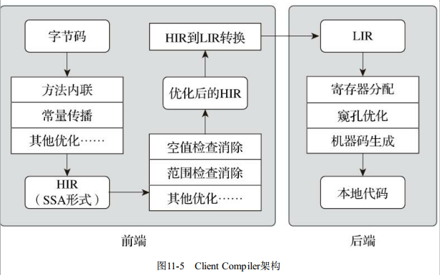
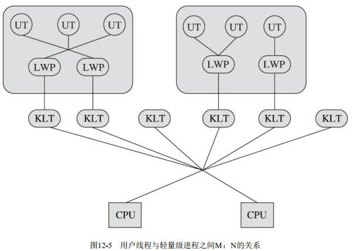

# 深入理解Java虚拟机(第三版)

- [ ] 书籍作者 周志明
- [ ] 笔记时间 2020.12.10

## 第一部分 走近Java

### 第 1 章 走近Java

#### 1.1 概述

[官方自我介绍](https://www.java.com/zh-CN/about/)

- 它摆脱了硬件平台的束缚， 实现了“一次编写， 到处运行”的理想  

- 安全(提供内存管理和访问机制,避免了绝大部分内存泄漏和指针越界问题  )
- 了热点代码检测和运行时编译及优化  

- .......

#### 1.2 Java技术体系

[Java8体系结构](https://docs.oracle.com/javase/8/docs/)


#### 1.3 Java发展史


- 1995年5月23日， Oak语言改名为Java， 并且在SunWorld大会上正式发布Java 1.0版本。 Java语言第一次提出了“Write Once， Run Anywhere”的口号  
- 1996年1月23日， JDK 1.0发布.提供了一个纯解释执行的Java虚拟机实现（Sun Classic VM）  
- 1998年12月4日， JDK迎来了一个里程碑式的重要版本 ;技术体系分为3个方向(SE EE ME)
- 1999年4月27日， HotSpot虚拟机诞生  
- 2009年2月19日， 工程代号为Dolphin（海豚） 的JDK 7完成了其第一个里程碑版本  
- 2014年3月18日 , JDK 8的第一个正式版本  
- JDK 9 带着模块化来了 并且只有LST才会是维护更新的版本(其他的就是尝鲜版)
- .....

#### 1.4 Java虚拟机家族

1. 虚拟机始祖： Sun Classic/Exact VM  

   > “世界上第一款商用Java虚拟机  只能使用纯解释器方式来执行Java代码， 如果要使用即时编译器那就必须进行外挂， 但是假如外挂了即时编译器的话， 即时编译器就会完全接管虚拟机的执行系统， 解释器便不能再工作了。  

   > Exact VM因它使用准确式内存管理（Exact Memory Management， 也可以叫Non-Conservative/Accurate Memory Management） 而得名 . 准确式内存管理是指虚拟机可以知道内存中某个位置的数据具体是什么类型  

2. 武林盟主： HotSpot VM  

   > 是Sun/OracleJDK和OpenJDK中的默认Java虚拟机， 也是目前使用范围最广的Java虚拟机  .由一家名为“Longview Technologies”的小公司设计  

3. 小家碧玉： Mobile/Embedded VM  

   > 由于Java ME产品线的发展相对Java SE来说并不那么成功， 所以Java ME中的Java虚拟机相比HotSpot要低调得多。  

4. 天下第二： BEA JRockit/IBM J9 VM  

   > JRockit虚拟机曾经号称是“世界上速度最快的Java虚拟机” BEA将其发展为一款专门为服务器硬件和服务端应用场景高度优化的虚拟机， 由于专注于服务端应用， 它可以不太关注于程序启动速度， 因此JRockit内部不包含解释器实现， 全部代码都靠即时编译器编译后执行   

   > IBM J9虚拟机并不是IBM公司唯一的Java虚拟机， 不过目前IBM主力发展无疑就是J9  .IBM J9虚拟机的职责分离与模块化做得比HotSpot更优秀，  

5. 软硬合璧： BEA Liquid VM/Azul VM  

   > Liquid VM也被称为JRockit VE（Virtual Edition， VE） ， 它是BEA公司开发的可以直接运行在自家Hypervisor系统上的JRockit虚拟机的虚拟化版本， Liquid VM不需要操作系统的支持， 或者说它自己本身实现了一个专用操作系统的必要功能， 如线程调度、 文件系统、 网络支持等。  

   > Azul VM是Azul Systems公司在HotSpot基础上进行大量改进， 运行于Azul Systems公司的专有硬件Vega系统上的Java虚拟机， 每个Azul VM实例都可以管理至少数十个CPU和数百GB的内存的硬件资源， 并提供在巨大内存范围内停顿时间可控的垃圾收集器  

   > Zing虚拟机是一个从HotSpot某旧版代码分支基础上独立出来重新开发的高性能Java虚拟机， 它可以运行在通用的Linux/x86-64平台上。 Azul公司为它编写了新的垃圾收集器， 也修改了HotSpot内的许多实现细节， 在要求低延迟、 快速预热等场景中， Zing VM都要比HotSpot表现得更好。  

6. 挑战者： Apache Harmony/Google Android Dalvik VM  

   > Harmony虚拟机（准确地说是Harmony里的DRLVM） 和Dalvik虚拟机只能称作“虚拟机”， 而不能称作“Java虚拟机” 
   >
   >  Apache Harmony是一个Apache软件基金会旗下以Apache License协议开源的实际兼容于JDK 5和JDK 6的Java程序运行平台， 它含有自己的虚拟机和Java类库API， 用户可以在上面运行Eclipse、Tomcat、 Maven等常用的Java程序。   

   > Dalvik虚拟机并不是一个Java虚拟机， 它没有遵循《Java虚拟机规范》 ， 不能直接执行Java的Class文件， 使用寄存器架构而不是Java虚拟机中常见的栈架构  

7. 没有成功， 但并非失败： Microsoft JVM及其他  

8. 百家争鸣  
   - KVM
   - Java Card JVM
   - Squawk VM  
   - JavaInJava  
   - Maxine VM  
   - ...

#### 1.5 展望Java技术的未来  

1. 无语言倾向

   ​	Java“天下第一”的底气不在于语法多么先进好用， 而是来自它庞大的用户群和极其成熟的软件生态， 这在朝夕之间难以撼动。  Graal VM 号称 "Run Programs Faster Anywhere  "

   ​	Graal VM才是真正意义上与物理计算机相对应的高级语言虚拟机， 理由是它与物理硬件的指令集一样， 做到了只与机器特性相关而不与某种高级语言特性相关  

2. 新一代即时编译器  

   ​	HotSpot虚拟机中含有两个即时编译器， 分别是编译耗时短但输出代码优化程度较低的客户端编译器（简称为C1） 以及编译耗时长但输出代码优化质量也更高的服务端编译器（简称为C2）  

   ​	 Graal编译器， 看名字就可以联想到它是来自于前一节提到的Graal VM。  

3. 向Native迈进  

   Substrate VM补全了Graal VM“Run Programs Faster Anywhere”愿景蓝图里的最后一块拼图， 让Graal VM支持其他语言时不会有重量级的运行负担。  

4. 灵活的胖子

   虚拟机模块化

5. 语言语法持续增强

#### 1.6 实战 编译JDK

跟着书籍步骤走

## 第二部分 自动内存管理  

### 第2章 Java内存区域与内存溢出异常

#### 2.1 概述  

在虚拟机自动内存管理机制的帮助下， 不再需要为每一个new操作去写配对的delete/free代码， 不容易出现内存泄漏和内存溢出问题， 看起来由虚拟机管理内存一切都很美好。 不过， 也正是因为Java程序员把控制内存的权力交给了Java虚拟机， 一旦出现内存泄漏和溢出方面的问题， 如果不了解虚拟机是怎样使用内存的， 那排查错误、 修正问题将会成为一项异常艰难的工作  

#### 2.2 运行时数据区域  


##### 2.2.1 程序计数器

程序计数器（Program Counter Register） 是一块较小的内存空间， 它可以看作是当前线程所执行的字节码的行号指示器。   (字节码解释器通过改变PC的值选取吓一跳需要执行的字节码指令)

如果线程正在执行的是一个Java方法， 这个计数器记录的是正在执行的虚拟机字节码指令的地址； 如果正在执行的是本地（Native） 方法， 这个计数器值则应为空（Undefined） 。 此内存区域是唯一一个在《Java虚拟机规范》 中没有规定任何OutOfMemoryError情况的区域。  

##### 2.2.2 Java虚拟机栈  

与程序计数器一样， Java虚拟机栈（Java Virtual Machine Stack） 也是线程私有的， 它的生命周期与线程相同。  

每个方法被执行,jvm都会同步创建一个栈帧用于存储

- 局部变量表(存放了编译期可知的各种Java虚拟机基本数据类型（boolean、 byte、 char、 short、 int、float、 long、 double） 、 对象引用（reference类型， 它并不等同于对象本身， 可能是一个指向对象起始地址的引用指针， 也可能是指向一个代表对象的句柄或者其他与此对象相关的位置） 和returnAddress类型（指向了一条字节码指令的地址）  )
- 操作数栈
- 动态链接
- 方法出口
- ...

1. 如果线程请求的栈深度大于虚拟机所允许的深度， 将抛出StackOverflowError异常；   (递归可以导致)
2. 如果Java虚拟机栈容量可以动态扩展， 当栈扩展时无法申请到足够的内存会抛出OutOfMemoryError异常。  

##### 2.2.3 本地方法栈  

本地方法栈（Native Method Stacks） 与虚拟机栈所发挥的作用是非常相似的， 其区别只是虚拟机栈为虚拟机执行Java方法（也就是字节码） 服务， 而本地方法栈则是为虚拟机使用到的本地（Native）方法服务。  

抛出的异常同虚拟机栈

##### 2.2.4 Java堆  

Java堆是被所有线程共享的一块内存区域， 在虚拟机启动时创建。 此内存区域的唯一目的就是存放对象实例， Java世界里“几乎”所有的对象实例都在这里分配内存。   (几乎 原因 现在已经能看到些许迹象表明日后可能出现值类型的支持  )

Java堆是垃圾收集器管理的内存区域  

如果从分配内存的角度看， 所有线程共享的Java堆中可以划分出多个线程私有的分配缓冲区（Thread Local Allocation Buffer， TLAB） ， 以提升对象分配时的效率。  

Java堆存储要求逻辑上连续,实际不用连续

主流的Java虚拟机都是按照可扩展来实现的（通过参数-Xmx和-Xms设定） 。 如果在Java堆中没有内存完成实例分配， 并且堆也无法再扩展时， Java虚拟机将会抛出OutOfMemoryError异常。

##### 2.2.5 方法区  

方法区（Method Area） 与Java堆一样， 是各个线程共享的内存区域， 它用于存储已被虚拟机加载的类型信息、 常量、 静态变量、 即时编译器编译后的代码缓存等数据。   

永久代 是 JDK8之前HotSpot虚拟机对永久代的实现方式,前者是标准,后者是实现.譬如BEA JRockit、 IBM J9等来说， 是不存在永久代的概念的.同时JDK8直接废弃永久代,使用元空间代替

除了和Java堆一样不需要连续的内存和可以选择固定大小或者可扩展外， 甚至还可以选择不实现垃圾收集 .这区域的内存回收目标主要是针对常量池的回收和对类型的卸载， 一般来说这个区域的回收效果比较难令人满意， 尤其是类型的卸载， 条件相当苛刻， 但是这部分区域的回收有时又确实是必要的  

##### 2.2.6 运行时常量池  

运行时常量池（Runtime Constant Pool） 是方法区的一部分。 Class文件中除了有类的版本、 字段、 方法、 接口等描述信息外， 还有一项信息是常量池表（Constant Pool Table） ， 用于存放编译期生成的各种字面量与符号引用， 这部分内容将在类加载后存放到方法区的运行时常量池中。  

具备动态性， Java语言并不要求常量一定只有编译期才能产生， 也就是说， 并非预置入Class文件中常量池的内容才能进入方法区运行时常量池， 运行期间也可以将新的常量放入池中， 这种特性被开发人员利用得比较多的便是String类的intern()方法。  

##### 2.2.7 直接内存  

直接内存（Direct Memory） 并不是虚拟机运行时数据区的一部分， 也不是《Java虚拟机规范》 中定义的内存区域。   

在JDK 1.4中新加入了NIO（New Input/Output） 类， 引入了一种基于通道（Channel） 与缓冲区（Buffer） 的I/O方式， 它可以使用Native函数库直接分配堆外内存， 然后通过一个存储在Java堆里面的DirectByteBuffer对象作为这块内存的引用进行操作。 这样能在一些场景中显著提高性能， 因为避免了在Java堆和Native堆中来回复制数据。  

#### 2.3 HotSpot虚拟机对象探秘  

以最常用的虚拟机HotSpot和最常用的内存区域Java堆为例， 深入探讨一下HotSpot虚拟机在Java堆中对象分配、 布局和访问的全过程  

##### 2.3.1 对象的创建  

1. 类加载

   > 当Java虚拟机遇到一条字节码new指令时， 首先将去检查这个指令的参数是否能在常量池中定位到一个类的符号引用， 并且检查这个符号引用代表的类是否已被加载、 解析和初始化过。 如果没有， 那必须先执行相应的类加载过程  

2. 分配内存

   > 对象所需内存的大小在类加载完成后便可完全确定  
   >
   > 内存分配方式有两种:
   >
   > - 指针碰撞(内存规整,移动分界线)
   > - 空闲列表(内存不规整,维护列表)
   >
   > 分配时候需要保证原子性:
   >
   > - 同步处理,虚拟机使用CAS
   > - 在TLAB先分配,不够再同步分配(-XX:+/-UseTLAB)

3. 设置必要属性

   > Java虚拟机还要对对象进行必要的设置， 例如这个对象是哪个类的实例、 如何才能找到类的元数据信息、 对象的哈希码（实际上对象的哈希码会延后到真正调用Object::hashCode()方法时才计算） 、 对象的GC分代年龄等信息。 这些信息存放在对象的对象头（Object Header） 之中。 根据虚拟机当前运行状态的不同， 如是否启用偏向锁等， 对象头会有不同的设置方式。

4.  构造函数

   > 上面完成后,从虚拟机的视角来看， 一个新的对象已经产生了 
   >
   > 但是从Java程序的视角看来， 对象创建才刚刚开始——构造函数， 即Class文件中的<init>()方法还没有执行， 所有的字段都
   > 为默认的零值， 对象需要的其他资源和状态信息也还没有按照预定的意图构造好.只有按照程序员意愿初始化完成,才能算一个真正可用对象被构造出来   

##### 2.3.2 对象的内存布局  

[源码地址](https://github.com/unofficial-openjdk/openjdk/blob/jdk/jdk/src/hotspot/share/oops/markWord.hpp)

HotSpot虚拟机里， 对象在堆内存中的存储布局可以划分为三个部分： 

- 对象头（Header）

  - 自身的运行时数据  

    > 如哈希码（HashCode） 、 GC分代年龄、 锁状态标志、 线程持有的锁、 偏向线程ID、 偏向时间戳等， 这部分数据的长度在32位和64位的虚拟机（未开启压缩指针） 中分别为32个比特和64个比特， 官方称它
    > 为“Mark Word”。   

  - 类型指针  

    > Java虚拟机通过这个指针
    > 来确定该对象是哪个类的实例  

- 实例数据（Instance Data） 

  > 存储顺序会受到虚拟机分配策略参数（-XX： FieldsAllocationStyle参数） 和字段在Java源码中定义顺序的影响  
  >
  > HotSpot虚拟机默认的分配顺序为longs/doubles、 ints、 shorts/chars、 bytes/booleans、 oops（Ordinary Object Pointers， OOPs） ， 从以上默认的分配策略中可以看到， 相同宽度的字段总是被分配到一起存放， 在满足这个前提条件的情况下， 在父类中定义的变量会出现在子类之前。   

- 对齐填充（Padding）   

  > 由于HotSpot虚拟机的自动内存管理系统要求对象起始地址必须是8字节的整数倍， 换句话说就是任何对象的大小都必须是8字节的整数倍  

1. **对象存储**

| 存储对象               | 字节数                     | 作用                                                         |
| ---------------------- | -------------------------- | ------------------------------------------------------------ |
| markword               | 8Bytes                     | 用于标记锁信息、GC信息、IdentityHashCode等                   |
| Class Pointer 类指针   | 4Bytes                     | 用于标记该对象是哪个Class的实例 开启内存压缩(-XX:+UseCompressedClassPointer)后为4字节，不开启内存压缩为8个字节(下面有例子) |
| 数组长度(数组对象才有) | 4Bytes                     | 标记数组有多少个元素                                         |
| 成员变量               | 视成员变量的类型和数量而定 | 如果没有成员变量，则这一块为空                               |
| Padding 对齐           | 视上述字节而定             | 一个对象占用的字节数必须是8的倍数，不足的用padding对齐       |

2. 32 位Mark Word

   

3. 64MarkWord

   


##### 2.3.3 对象的访问定位  

- 句柄访问

  > ​	Java堆中将可能会划分出一块内存来作为句柄池， reference中存储的就是对象的句柄地址， 而句柄中包含了对象实例数据与类型数据各自具体的地址信息
  >
  > ​	好处: 句柄稳定地址,移动对象时候秩序改变句柄中的实例数据指针

- 直接指针访问(Java主要采用这种)

  > ​	Java堆中对象的内存布局就必须考虑如何放置访问类型数据的相关信息， reference中存储的直接就是对象地址， 如果只是访问对象本身的话， 就不需要多一次间接访问的开销  
  >
  > ​	好处:快速


#### 2.4 实战OOM异常

为了更好体现,需要设置一些虚拟机参数

```shell
-verbose:gc -Xms20mM-Xmx20M -Xmn10M -XX:+PrintGCDetails -XX:SuivivorRatio=8
```

##### 2.4.1 Java堆溢出  

只要不停创建对象,并且避免被清除就可以做到OOM

限制Java堆的大小为20MB， 不可扩展（将堆的最小值-Xms参数与最大值-Xmx参数设置为一样即可避免堆自动扩展） ， 通过参数-XX： +HeapDumpOnOutOf-MemoryError可以让虚拟机在出现内存溢出异常的时候Dump出当前的内存堆转储快照以便进行事后分析  

要解决这个内存区域的异常， 常规的处理方法是首先通过内存映像分析工具（如Eclipse MemoryAnalyzer） 对Dump出来的堆转储快照进行分析。 第一步首先应确认内存中导致OOM的对象是否是必要的， 也就是要先分清楚到底是出现了内存泄漏（Memory Leak） 还是内存溢出（Memory Overflow）   

(使用的是IDEA,参数输入后,在项目下有dump文件)

##### 2.4.2 虚拟机栈和本地方法栈溢出  

由于HotSpot虚拟机中并不区分虚拟机栈和本地方法栈， 因此对于HotSpot来说， -Xoss参数（设置本地方法栈大小） 虽然存在， 但实际上是没有任何效果的， 栈容量只能由-Xss参数来设定  

1. 线程请求栈深度大于最大值,栈溢出

2. 如果栈内存允许动态扩展,申请栈容量失败,OOM(HotSpot不支持栈的动态扩展,所以除非在创建线程申请内存时就因无法获得足够内存而出现OutOfMemoryError异常， 否则在线程运行时是不会因为扩展而导致内存溢出的， 只会因为栈容量无法容纳新的栈帧而导致StackOverflowError异常。  )

   >  ​	无论是由于栈帧太大还是虚拟机栈容量太小， 当新的栈帧内存无法分配的时候，HotSpot虚拟机抛出的都是StackOverflowError异常  
   >
   > ​	通过不断建立线程的方式， 在HotSpot上也是可以产生内存溢出异常的， 但是这样产生的内存溢出异常和栈空间是否足够并不存在任何直接的关系， 主要取决于操作系统本身的内存使用状态  

##### 2.4.3 方法区和运行时常量池溢出  

由于运行时常量池是方法区的一部分， 所以这两个区域的溢出测试可以放到一起进行。  

String::intern()是一个本地方法， 它的作用是如果字符串常量池中已经包含一个等于此String对象的字符串， 则返回代表池中这个字符串的String对象的引用； 否则， 会将此String对象包含的字符串添加到常量池中， 并且返回此String对象的引用。  

**注意**: 自JDK 7起， 原本存放在永久代的**字符串常量池**被移至Java堆之中  

1. JDK7 以下设置 -XX:PermSize=6M -XX:MaxPermSize=6M  
2. JDK8及以上 设置 堆大小就可以 -Xmx6m
3. -XX： MaxMetaspaceSize  设置元空间大小以字节为单位， 达到该值就会触发垃圾收集进行类型卸载， 同时收集器会对该值进行调整： 如果释放了大量的空间， 就适当降低该值； 如果释放了很少的空间， 那么在不超过-XX： MaxMetaspaceSize（如果设置了的话） 的情况下， 适当提高该值
4. -XX： MinMetaspaceFreeRatio： 作用是在垃圾收集之后控制最小的元空间剩余容量的百分比， 可减少因为元空间不足导致的垃圾收集的频率。 类似的还有-XX： Max-MetaspaceFreeRatio， 用于控制最大的元空间剩余容量的百分比。  

考题:

> 在JDK 6中， intern()方法会把首次遇到的字符串实例复制到永久代的字符串常量池中存储， 返回的也是永久代里面这个字符串实例的引用
>
> JDK 7（以及部分其他虚拟机， 例如JRockit） 的intern()方法实现就不需要再拷贝字符串的实例到永久代了， 既然字符串常量池已经移到Java堆中， 那只需要在常量池里记录一下首次出现的实例引用即可， 因此intern()返回的引用和由StringBuilder创建的那个字符串实例就是同一个。  

##### 2.4.4 本机直接内存溢出  

直接内存（Direct Memory） 的容量大小可通过-XX： MaxDirectMemorySize参数来指定， 如果不去指定， 则默认与Java堆最大值（由-Xmx指定） 一致，  Unsafe类的getUnsafe()方法指定只有引导类加载器才会返回实例，  真正申请分配内存的方法是Unsafe::allocateMemory()  

一个明显的特征是在Heap Dump文件中不会看见有什么明显的异常
情况， 如果读者发现内存溢出之后产生的Dump文件很小， 而程序中又直接或间接使用了DirectMemory（典型的间接使用就是NIO） ， 那就可以考虑重点检查一下直接内存方面的原因了。  

### 第3章 垃圾收集器与内存分配策略

#### 3.1 概述  

垃圾收集需要完成的三件事情：

- 哪些内存需要回收？
- 什么时候回收？
- 如何回收？  

Java内存运行时区域的各个部分， 其中程序计数器、 虚拟机栈、 本地方法栈3个区域随线程而生， 随线程而灭， 栈中的栈帧随着方法的进入和退出而有条不紊地执行着出栈和入栈操作。因此这几个区域的内存分配和回收都具备确定性，在这几个区域内就不需要过多考虑如何回收的问题， 当方法结束或者线程结束时， 内存自然就跟随着回收了。     

Java堆和方法区这两个区域则有着很显著的不确定性:一个接口的多个实现类需要的内存可能会不一样， 一个方法所执行的不同条件分支所需要的内存也可能不一样， 只有处于运行期间， 我们才能知道程序究竟会创建哪些对象， 创建多少个对象， 这部分内存的分配和回收是动态的  

#### 3.2 对象已死？  

如何判断对象是可回收的?

##### 3.2.1 引用计数算法  

在对象中添加一个引用计数器， 每当有一个地方引用它时， 计数器值就加一； 当引用失效时， 计数器值就减一； 任何时刻计数器为零的对象就是不可能再被使用的。

好处: 简单,效率高.

坏处: 占空间,循环引用   

微软COM（Component Object Model） 技术、 使用ActionScript 3的FlashPlayer、 Python语言以及在游戏脚本领域得到许多应用的Squirrel中都使用了引用计数算法进行内存管理 

##### 3.2.2 可达性分析算法  

基本思路就是通过一系列称为“GC Roots”的根对象作为起始节点集， 从这些节点开始， 根据引用关系向下搜索， 搜索过程所走过的路径称为“引用链”（Reference Chain） ， 如果某个对象到GC Roots间没有任何引用链相连，或者用图论的话来说就是从GC Roots到这个对象不可达时， 则证明此对象是不可能再被使用的。  

GC Roots:

- 在虚拟机栈（栈帧中的本地变量表） 中引用的对象  
- 在方法区中类静态属性引用的对象  
- 在方法区中常量引用的对象  
- 在本地方法栈中JNI（即通常所说的Native方法） 引用的对象  
- Java虚拟机内部的引用(基本数据类型对应的Class对象， 一些常驻的异常对象  )
- 所有被同步锁（synchronized关键字） 持有的对象  
- 反映Java虚拟机内部情况的JMXBean、 JVMTI中注册的回调、 本地代码缓存等。  

除了这些固定的GC Roots集合以外， 根据用户所选用的垃圾收集器以及当前回收的内存区域不同， 还可以有其他对象“临时性”地加入， 共同构成完整GC Roots集合。   

##### 3.2.3 再谈引用  

在JDK 1.2版之前， Java里面的引用是很传统的定义：

> 如果reference类型的数据中存储的数值代表的是另外一块内存的起始地址， 就称该reference数据是代表某块内存、某个对象的引用。  

JDK1.2之后,进行扩充

- 强引用: 指在程序代码之中普遍存在的引用赋值,存在该关系,不会回收
- 软引用: 描述一些还有用， 但非必须的对象。 只被软引用关联着的对象， 在系统将要发生内存溢出异常前， 会把这些对象列进回收范围之中进行第二次回收， 如果这次回收还没有足够的内存，才会抛出内存溢出异常。   
- 弱引用: 用来描述那些非必须对象， 但是它的强度比软引用更弱一些， 被弱引用关联的对象只能生存到下一次垃圾收集发生为止。 当垃圾收集器开始工作， 无论当前内存是否足够， 都会回收掉只被弱引用关联的对象。  
- 虚引用: 一个对象是否有虚引用的存在， 完全不会对其生存时间构成影响， 也无法通过虚引用来取得一个对象实例。 为一个对象设置虚引用关联的唯一目的只是为了能在这个对象被收集器回收时收到一个系统通知。   

##### 3.2.4 生存还是死亡？  

即使在可达性分析算法中判定为不可达的对象， 也不是“非死不可”的， 这时候它们暂时还处于“缓刑”阶段， 要真正宣告一个对象死亡， 至少要经历两次标记过程  :

1. 如果对象在进行可达性分析后发现没有与GC Roots相连接的引用链， 那它将会被第一次标记， 随后进行一次筛选， 筛选的条件是此对象是否有必要执行finalize()方法。 假如对象没有覆盖finalize()方法， 或者finalize()方法已经被虚拟机调用过， 那么虚拟机将这两种情况都视为“没有必要执行”   (免死金牌,并且只能用一次)
2. 如果这个对象被判定为确有必要执行finalize()方法， 那么该对象将会被放置在一个名为F-Queue的队列之中， 并在稍后由一条由虚拟机自动建立的、 低调度优先级的Finalizer线程去执行它们的finalize()
   方法。  finalize()方法是对象逃脱死亡命运的最后一次机会， 稍后收集器将对F-Queue中的对象进行第二次小规模的标记， 如果对象要在finalize()中成功拯救自己——只要重新与引用链上的任何一个对象建立关联即可那在第二次标记时它将被移出“即将回收”的集合； 如果对象这时候还没有逃脱， 那基本上它就真的要被回收了。(前朝的免死金牌就没用了)     

总结: 不要用finalize方法

##### 3.2.5 回收方法区  

方法区的垃圾收集主要回收两部分内容： 废弃的常量和不再使用的类型  

- 回收废弃常量与回收Java堆中的对象非常类似。  
-  判定一个类型是否属于“不再被使用的类”的条件就比较苛刻  
  - 该类所有的实例都已经被回收  
  - 加载该类的类加载器已经被回收  
  - 该类对应的java.lang.Class对象没有在任何地方被引用， 无法在任何地方通过反射访问该类的方法  

Java虚拟机被允许对满足上述三个条件的无用类进行回收  

在大量使用反射、 动态代理、 CGLib等字节码框架， 动态生成JSP以及OSGi这类频繁自定义类加载器的场景中， 通常都需要Java虚拟机具备类型卸载的能力， 以保证不会对方法区造成过大的内存压力  

HotSpot虚拟机提供了

- -Xnoclassgc参数进行控制， 
- 还可以使用-verbose： class
- 以及-XX： +TraceClass-Loading、 -XX：
  +TraceClassUnLoading查看类加载和卸载信息， 
- 其中-verbose： class和-XX： +TraceClassLoading可以在Product版的虚拟机中使用， -XX： +TraceClassUnLoading参数需要FastDebug版的虚拟机支持。  

#### 3.3 垃圾收集算法  

从如何判定对象消亡的角度出发， 垃圾收集算法可以划分为“引用计数式垃圾收集”（ReferenceCounting GC） 和“追踪式垃圾收集”（Tracing GC） 两大类， 这两类也常被称作“直接垃圾收集”和“间接垃圾收集”。  

##### 3.3.1 分代收集理论  

分代收集名为理论， 实质是一套符合大多数程序运行实际情况的经验法则， 它建立在两个分代假说之上：

1. 弱分代假说（Weak Generational Hypothesis） ： 绝大多数对象都是朝生夕灭的。
2. 强分代假说（Strong Generational Hypothesis） ： 熬过越多次垃圾收集过程的对象就越难以消亡。  

这两个分代假说共同奠定了多款常用的垃圾收集器的一致的设计原则： 收集器应该将Java堆划分出不同的区域， 然后将回收对象依据其年龄（年龄即对象熬过垃圾收集过程的次数） 分配到不同的区域之中存储。   

分代收集它至少存在一个明显的困难： 对象不是孤立的， 对象之间会存在跨代引用。 但新生代中的对象是完全有可能被老年代所引用的， 为了找出该区域中的存活对象， 不得不在固定的GC Roots之外， 再额外遍历整个老年代中所有对象来确保可达性分析结果的正确性， 反过来也是一样   

3. 跨代引用假说（ Intergenerational Reference Hypothesis） ： 跨代引用相对于同代引用来说仅占极少数  

依据这条假说， 我们就不应再为了少量的跨代引用去扫描整个老年代， 也不必浪费空间专门记录每一个对象是否存在及存在哪些跨代引用， 只需在新生代上建立一个全局的数据结构（ 该结构被称为“记忆集”， Remembered Set） ， 这个结构把老年代划分成若干小块， 标识出老年代的哪一块内存会
存在跨代引用。 此后当发生Minor GC时， 只有包含了跨代引用的小块内存里的对象才会被加入到GCRoots进行扫描。 虽然这种方法需要在对象改变引用关系（ 如将自己或者某个属性赋值） 时维护记录数据的正确性， 会增加一些运行时的开销， 但比起收集时扫描整个老年代来说仍然是划算的。  

**一些概念**:

- 部分收集（ Partial GC） ： 指目标不是完整收集整个Java堆的垃圾收集， 其中又分为：  
  - 新生代收集（ Minor GC/Young GC） ： 指目标只是新生代的垃圾收集。  
  - 老年代收集（ Major GC/Old GC） ： 指目标只是老年代的垃圾收集。   目前只有CMS收集器会有此行为
  - 混合收集（ Mixed GC） ： 指目标是收集整个新生代以及部分老年代的垃圾收集。   目前只有G1

- ·整堆收集（ Full GC） ： 收集整个Java堆和方法区的垃圾收集。  

##### 3.3.2 标记-清除算法  

最早出现也是最基础的垃圾收集算法是“标记-清除”（Mark-Sweep） 算法，  算法分为“标记”和“清除”两个阶段： 首先标记出所有需要回收的对象， 在标记完成后， 统一回收掉所有被标记的对象， 也可以反过来， 标记存活的对象， 统一回收所有未被标记的对象。 标记过程就是对象是否属于垃圾的判定过程

缺点主要有两个:

1. 第一个是执行效率不稳定， 如果Java堆中包含大量对象， 而且其中大部分是需要被回收的， 这时必须进行大量标记和清除的动作， 导致标记和清除两个过程的执行效率都随对象数量增长而降低； 
2.  第二个是内存空间的碎片化问题， 标记、 清除之后会产生大量不连续的内存碎片， 空间碎片太多可能会导致当以后在程序运行过程中需要分配较大对象时无法找到足够的连续内存而不得不提前触发另一次垃圾收集动作。  


##### 3.3.3 标记-复制算法  

为了解决标记-清除算法面对大量可回收对象时执行效率低的问题， 1969年Fenichel提出了一种称为“半区复制”（Semispace Copying） 的垃圾收集算法， 它将可用内存按容量划分为大小相等的两块， 每次只使用其中的一块  

这样实现简单， 运行高效， 不过其缺陷也显而易见， 这种复制回收算法的代价是将可用内存缩小为了原来的一半， 空间浪费未免太多了一点  

现在的商用Java虚拟机大多都优先采用了这种收集算法去回收新生代， IBM公司曾有一项专门研究对新生代“朝生夕灭”的特点做了更量化的诠释——新生代中的对象有98%熬不过第一轮收集。 因此并不需要按照1∶ 1的比例来划分新生代的内存空间。  (HotSpot虚拟机默认Eden和Survivor的大小比例是8∶ 1  )


##### 3.3.4 标记-整理算法  

针对老年代对象的存亡特征， 1974年Edward Lueders提出了另外一种有针对性的“标记-整理”（Mark-Compact） 算法， 其中的标记过程仍然与“标记-清除”算法一样， 但后续步骤不是直接对可回收对象进行清理， 而是让所有存活的对象都向内存空间一端移动， 然后直接清理掉边界以外的内存  

如果移动存活对象， 尤其是在老年代这种每次回收都有大量对象存活区域， 移动存活对象并更新所有引用这些对象的地方将会是一种极为负重的操作， 而且这种对象移动操作必须全程暂停用户应用程序才能进行,像这样的停顿被最初的虚拟机,设计者形象地描述为“Stop The World”。  

但如果跟标记-清除算法那样完全不考虑移动和整理存活对象的话， 弥散于堆中的存活对象导致的空间碎片化问题就只能依赖更为复杂的内存分配器和内存访问器来解决。  

基于以上两点， 是否移动对象都存在弊端， 移动则内存回收时会更复杂， 不移动则内存分配时会更复杂。 从垃圾收集的停顿时间来看， 不移动对象停顿时间会更短， 甚至可以不需要停顿， 但是从整个程序的吞吐量来看， 移动对象会更划算  .HotSpot虚拟机里面关注吞吐量的Parallel Scavenge收集器是基于标记-整理算法的， 而关注延迟的CMS收集器则是基于标记-清除算法的， 这也从侧面印证这点。  


#### 3.4 HotSpot的算法细节实现  

##### 3.4.1 根节点枚举  

迄今为止， 所有收集器在根节点枚举这一步骤时都是**必须暂停用户线程**的， 因此毫无疑问根节点枚举与之前提及的整理内存碎片一样会面临相似的“Stop The World”的困扰。 现在可达性分析算法耗时最长的查找引用链的过程已经可以做到与用户线程一起并发但根节点枚举始终还是必须在一个能保障一致性的快照中才得以进行——这里“一致性”的意思是整个枚举期间执行子系统看起来就像被冻结在某个时间点上， 不会出现分析过程中， 根节点集合的对象引用关系还在不断变化的情况

当用户线程停顿下来之后， 其实并不需要一个不漏地检查完所有执行上下文和全局的引用位置， 虚拟机应当是有办法直接得到哪些地方存放着对象引用的  

> 使用一组称为OopMap的数据结构来达到这个目的。 一旦类加载动作完成的时候，HotSpot就会把对象内什么偏移量上是什么类型的数据计算出来， 在即时编译过程中， 也会在特定的位置记录下栈里和寄存器里哪些位置是引用。   

##### 3.4.2 安全点  

导致OopMap内容变化的指令非常多， 如果为每一条指令都生成对应的OopMap， 那将会需要大量的额外存储空间  

HotSpot也的确没有为每条指令都生成OopMap， 前面已经提到， 只是在“特定的位置”记录了这些信息， 这些位置被称为安全点（Safepoint） 。

> 安全点位置的选取基本上是以“是否具有让程序长时间执行的特征”为标准进行选定的， 因为每条指令执行的时间都非常短暂， 程序不太可能因为指令流长度太长这样的原因而长时间执行， “长时间执行”的最明显特征就是指令序列的复用， 例如方法调用、 循环跳转、 异常跳转等都属于指令序列复用， 所以只有具有这些功能的指令才会产生安全点    

如何在垃圾收集发生时让所有线程（这里其实不包括执行JNI调用的线程） 都跑到最近的安全点， 然后停顿下来。 这里有两种方案可供选择：  

1. 抢先式中断（Preemptive Suspension）   

   > 抢先式中断不需要线程的执行代码主动去配合， 在垃圾收集发生时， 系统首先把所有用户线程全部中断， 如果发现有用户线程中断的地方不在安全点上， 就恢复这条线程执行， 让它一会再重新中断， 直到跑到安全点上。   

2. 主动式中断（Voluntary Suspension）  

   > 主动式中断的思想是当垃圾收集需要中断线程的时候， 不直接对线程操作， 仅仅简单地设置一个标志位， 各个线程执行过程时会不停地主动去轮询这个标志， 一旦发现中断标志为真时就自己在最近的安全点上主动中断挂起。 轮询标志的地方和安全点是重合的， 另外还要加上所有创建对象和其他需要在Java堆上分配内存的地方， 这是为了检查是否即将要发生垃圾收集， 避免没有足够内存分配新对象。  

HotSpot使用内存保护陷阱的方式，把轮询操作精简至只有一条汇编指令的程度。  

##### 3.4.3 安全区域  

安全点机制保证了程序执行时， 在不太长的时间内就会遇到可进入垃圾收集过程的安全点。   线程无法响应虚拟机的中断请求， 不能再走到安全的地方去中断挂起自己， 虚拟机也显然不可能持续等待线程重新被激活分配处理器时间。 对于这种情况， 就必须引入安全区域（Safe Region） 来解决。  

安全区域是指能够确保在某一段代码片段之中， 引用关系不会发生变化， 因此， 在这个区域中任意地方开始垃圾收集都是安全的。 我们也可以把安全区域看作被扩展拉伸了的安全点。  

> 当用户线程执行到安全区域里面的代码时， 首先会标识自己已经进入了安全区域， 那样当这段时间里虚拟机要发起垃圾收集时就不必去管这些已声明自己在安全区域内的线程了。 当线程要离开安全区域时， 它要检查虚拟机是否已经完成了根节点枚举（或者垃圾收集过程中其他需要暂停用户线程的阶段） ， 如果完成了， 那线程就当作没事发生过， 继续执行； 否则它就必须一直等待， 直到收到可以离开安全区域的信号为止。  

##### 3.4.4 记忆集与卡表  

记忆集是一种用于记录从非收集区域指向收集区域的指针集合的抽象数据结构。 如果我们不考虑效率和成本的话， 最简单的实现可以用非收集区域中所有含跨代引用的对象数组来实现这个数据结构  ,这种记录全部含跨代引用对象的实现方案， 无论是空间占用还是维护成本都相当高昂。   

> 那设计者在实现记忆集的时候， 便可以选择更为粗犷的记录粒度来节省记忆集的存储和维护成本， 下面列举了一些可供选择（当然也可以选择这个范围以外的） 的记录精度：
>
> - **字长精度**： 每个记录精确到一个机器字长（就是处理器的寻址位数， 如常见的32位或64位， 这个精度决定了机器访问物理内存地址的指针长度） ， 该字包含跨代指针。
> - **对象精度**： 每个记录精确到一个对象， 该对象里有字段含有跨代指针。
> - **卡精度**： 每个记录精确到一块内存区域， 该区域内有对象含有跨代指针。  

第三种“卡精度”所指的是用一种称为**“卡表”**（Card Table） 的方式去实现记忆集  ,它定义了记忆集的记录精度、 与堆内存的映射关系等。关于卡表与记忆集的关系， 读者不妨按照Java语言中HashMap与Map的关系来类比理解  

卡表最简单的形式可以只是**一个字节数组**， 而HotSpot虚拟机确实也是这样做的 .字节数组CARD_TABLE的每一个元素都对应着其标识的内存区域中一块特定大小的内存块， 这个内存块被称作“**卡页**”（Card Page）,一般来说，卡页大小都是以2的N次幂的字节数,HotSpot中使用的卡页是2的9次幂， 即512字节 .

一个卡页的内存中通常包含不止一个对象， 只要卡页内有一个（或更多） 对象的字段存在着跨代指针， 那就将对应卡表的数组元素的值标识为1， 称为这个元素**变脏**（Dirty） ， 没有则标识为0。 在垃圾收集发生时， 只要筛选出卡表中变脏的元素， 就能轻易得出哪些卡页内存块中包含跨代指， 把它们加入GC Roots中一并扫描。        


##### 3.4.5 写屏障  

卡表元素何时变脏的答案是很明确的——有其他分代区域中对象引用了本区域对象时， 其对应的卡表元素就应该变脏， 变脏时间点原则上应该发生在引用类型字段赋值的那一刻  

假如是解释执行的字节码， 那相对好处理， 虚拟机负责每条字节码指令的执行， 有充分的介入空间  

HotSpot虚拟机里是通过**写屏障**（Write Barrier） 技术维护卡表状态的应用写屏障后， 虚拟机就会为所有赋值操作生成相应的指令， 一旦收集器在写屏障中增加了更新卡表操作， 无论更新的是不是老年代对新生代对象的引用， 每次只要对引用进行更新， 就会产生额外的开销， 不过这个开销与Minor GC时扫描整个老年代的代价相比还是低得多的    

> 写屏障可以看作在虚拟机层面对“引用类型字段赋值”这个动作的AOP切面， 在引用对象赋值时会产生一个环形（Around） 通知， 供程序执行额外的动作， 也就是说赋值的前后都在写屏障的覆盖范畴内。  
>
> 在赋值前的部分的写屏障叫作写前屏障（Pre-Write Barrier） ， 在赋值后的则叫作写后屏障（Post-Write Barrier）HotSpot虚拟机的许多收集器中都有使用到写屏障， 但直至G1收集器出现之前， 其他收集器都只用到了写后屏障。     

现代中央处理器的缓存系统中是以缓存行（Cache Line）为单位存储的， 当多线程修改互相独立的变量时， 如果这些变量恰好共享同一个缓存行， 就会彼此影响（写回、 无效化或者同步） 而导致性能降低， 这就是伪共享问题  

一种简单的解决方案是不采用无条件的写屏障， 而是先检查卡表标记， 只有当该卡表元素未被标记过时才将其标记为变脏，  在JDK 7之后，HotSpot虚拟机增加了一个新的参数-XX： +UseCondCardMark， 用来决定是否开启卡表更新的条件判断。 开启会增加一次额外判断的开销， 但能够避免伪共享问题， 两者各有性能损耗， 是否打开要根据应用实际运行情况来进行测试权衡。  

##### 3.4.6 并发的可达性分析  

可达性分析算法理论上要求全过程都基于一个能保障一致性的快照中才能够进行分析，这意味着必须全程冻结用户线程的运行。  

包含“标记”阶段是所有追踪式垃圾收集算法的共同特征， 如果这个阶段会随着堆变大而等比例增加停顿时间， 其影响就会波及几乎所有的垃圾收集器， 同理可知， 如果能够削减这部分停顿时间的话， 那收益也将会是系统性的。  

为什么必须在一个能保障一致性的快照上才能进行对象图的遍历？   

> 三色标记（Tri-color Marking）  作为工具来辅助推导， 把遍历对象图过程中遇到的对象， 按照“是否访问过”这个条件标记成以下三种颜色：
>
> - 白色： 表示对象尚未被垃圾收集器访问过。若在分析结束的阶段， 仍然是白色的对象， 即代表不可达  
> - 黑色： 表示对象已经被垃圾收集器访问过， 且这个对象的所有引用都已经扫描过.黑色的对象代表已经扫描过， 它是安全存活的， 如果有其他对象引用指向了黑色对象， 无须重新扫描一遍。    
> - 灰色： 表示对象已经被垃圾收集器访问过， 但这个对象上至少存在一个引用还没有被扫描过      
>
> 收集器在对象图上标记颜色， 同时用户线程在修改引用关系——即修改对象图的结构， 这样可能出现两种后果 
>
> 1. 把原本消亡的对象错误标记为存活  
> 2. 把原本存活的对象错误标记为已消亡 (很严重) 


> Wilson于1994年在理论上证明了， 当且仅当以下两个条件同时满足时， 会产生“对象消失”的问题， 即原本应该是黑色的对象被误标为白色：
>
> - 赋值器插入了一条或多条从黑色对象到白色对象的新引用；
> - 赋值器删除了全部从灰色对象到该白色对象的直接或间接引用。
>
> 我们要解决并发扫描时的对象消失问题， 只需破坏这两个条件的任意一个即可  
>
> 1. 增量更新要破坏的是第一个条件， 当黑色对象插入新的指向白色对象的引用关系时， 就将这个新插入的引用记录下来， 等并发扫描结束之后， 再将这些记录过的引用关系中的黑色对象为根， 重新扫描一次。 
> 2. 原始快照要破坏的是第二个条件， 当灰色对象要删除指向白色对象的引用关系时， 就将这个要删除的引用记录下来， 在并发扫描结束之后， 再将这些记录过的引用关系中的灰色对象为根， 重新扫描一次。    
>
> 以上无论是对引用关系记录的插入还是删除， 虚拟机的记录操作都是通过写屏障实现的。 在HotSpot虚拟机中， 增量更新和原始快照这两种解决方案都有实际应用， 譬如， CMS是基于增量更新来做并发标记的， G1、 Shenandoah则是用原始快照来实现  

#### 3.5 经典垃圾收集器  


> 图3-6展示了七种作用于不同分代的收集器， 如果两个收集器之间存在连线， 就说明它们可以搭配使用， 图中收集器所处的区域， 则表示它是属于新生代收集器抑或是老年代收集器。  

##### 3.5.1 Serial收集器  

这个收集器是一个单线程工作的收集器,它进行垃圾收集时， 必须暂停其他所有工作线程， 直到它收集结束  


简单而高效,它是所有收集器里额外内存消耗（Memory Footprint）最小的；  Serial收集器对于运行在客户端模式下的虚拟机来说是一个很好的选择  

##### 3.5.2 ParNew收集器  

ParNew收集器实质上是Serial收集器的多线程并行版本 ,除了使用多线程进行垃圾收集,其余的行为完全和Serial完全一致(XX： SurvivorRatio、 -XX：
PretenureSizeThreshold、 -XX： HandlePromotionFailure等 、 收集算法、 Stop The World、 对象分配规则、 回收策略等  ) 


除了Serial收集器外， 目前只有它能与CMS收集器配合工作。  


CMS收集器。 这款收集器是HotSpot虚拟机中第一款真正意义上支持并发的垃圾收集器， 它首次实现了让垃圾收集线程与用户线程（基本上） 同时工作  .CMS作为老年代的收集器， 却无法与JDK 1.4.0中已经存在的新生代收集器ParallelScavenge配合工作  

> G1是一个面向全堆的收集器， 不再需要其他新生代收集器的配合工作。 所以自JDK 9开始， ParNew加CMS收集器的组合就不再是官方推荐的服务端模式下的收集器解决方案了  

##### 3.5.3 Parallel Scavenge收集器  

Parallel Scavenge收集器也是一款新生代收集器， 它同样是基于标记-复制算法实现的收集器.Parallel Scavenge收集器的特点是它的关注点与其他收集器不同， CMS等收集器的关注点是尽可能地缩短垃圾收集时用户线程的停顿时间， 而Parallel Scavenge收集器的目标则是达到一个可控制的吞吐量（Throughput）    

 吞吐量 = T~运行用户代码~/(T~运行用户代码~ + T~运行垃圾收集~)

- -XX： MaxGCPauseMillis参数允许的值是一个大于0的毫秒数， 收集器将尽力保证内存回收花费的时间不超过用户设定值。
- -XX： GCTimeRatio参数的值则应当是一个大于0小于100的整数， 也就是垃圾收集时间占总时间的比率， 相当于吞吐量的倒数。  
- -XX： +UseAdaptiveSizePolic 参数被激活之后， 就不需要人工指定各种大小(新生代 老年代等),会自动调节

##### 3.5.4 Serial Old收集器  

Serial Old是Serial收集器的老年代版本， 它同样是一个单线程收集器， 使用标记-整理算法。 这个收集器的主要意义也是供客户端模式下的HotSpot虚拟机使用。  (可以和Parallel Scavenge 配合 或者 作为CMS的后背方案)


##### 3.5.5 Parallel Old收集器  

Parallel Old是Parallel Scavenge收集器的老年代版本， 支持多线程并发收集， 基于标记-整理算法实现。 这个收集器是直到JDK 6时才开始提供的， 在此之前， 新生代的Parallel Scavenge收集器一直处于相当尴尬的状态， 原因是如果新生代选择了Parallel Scavenge收集器， 老年代除了SerialOld（PS
MarkSweep） 收集器以外别无选择  


##### 3.5.6 CMS收集器  

CMS（Concurrent Mark Sweep） 收集器是一种以获取最短回收停顿时间为目标的收集器。基于标记-清除算法实现的 ,过程分为四个步骤:

1. 初始标记（CMS initial mark）:STW,仅仅标记GC Roots能直接关联的大小,速度很快
2.  并发标记（CMS concurrent mark）:从GC Roots的直接关联对象开始遍历整个对象图的过程， 这个过程耗时较长但是不需要停顿用户线程， 可以与垃圾收集线程一起并发运行  
3.  重新标记（CMS remark）:重新标记阶段则是为了修正并发标记期间， 因用户程序继续运作而导致标记产生变动的那一部分对象的标记记录  (这个阶段的停顿时间通常会比初始标记阶段稍长一
   些， 但也远比并发标记阶段的时间短；)
4.  并发清除（CMS concurrent sweep）  :最后是并发清除阶段， 清理删除掉标记阶段判断的已经死亡的对象， 由于不需要移动存活对象， 所以这个阶段也是可以与用户线程同时并发的  


三个明显的缺点:

1. CMS收集器对处理器资源非常敏感 .面向并发设计的程序都对处理器资源比较敏感。 在并发阶段， 它虽然不会导致用户线程停顿， 但却会因为占用了一部分线程（或者说处理器的计算能力） 而导致应用程序变慢， 降低总吞吐量。 CMS默认启动的回收线程数是（处理器核心数量+3） /4， 也就是说， 如果处理器核心数在四个或以上， 并发回收时垃圾收集线程只占用不超过25%的处理器运算资源， 并且会随着处理器核心数量的增加而下降。   
2. 由于CMS收集器无法处理“浮动垃圾”（Floating Garbage） ， 有可能出现“Con-current Mode Failure”失败进而导致另一次完全“Stop The World”的Full GC的产生。  在CMS的并发标记和并发清理阶
   段， 用户线程是还在继续运行的， 程序在运行自然就还会伴随有新的垃圾对象不断产生， 但这一部分垃圾对象是出现在标记过程结束以后， CMS无法在当次收集中处理掉它们， 只好留待下一次垃圾收集时再清理掉。 这一部分垃圾就称为“浮动垃圾”。   
3. CMS是一款基于“标记-清除”算法实现的收集器， 如果读者对前面这部分介绍还有印象的话， 就可能想到这意味着收集结束时会有大量空间碎片产生。  

CMS收集器提供了一个-XX： +UseCMS-CompactAtFullCollection开关参数（默认是开启的， 此参数从JDK 9开始废弃） ， 用于在CMS收集器不得不进行Full GC时开启内存碎片的合并整理过程， 由于这个内存整理必须移动存活对象， （在Shenandoah和ZGC出现前） 是无法并发的。   

##### 3.5.7 Garbage First收集器  

Garbage First（简称G1） 收集器是垃圾收集器技术发展历史上的里程碑式的成果， 它开创了收集器**面向局部收集**的设计思路和**基于Region**的内存布局形式。  

作为CMS收集器的替代者和继承人， 设计者们希望做出一款能够建立起“停顿时间模型”（PausePrediction Model） 的收集器， 停顿时间模型的意思是能够支持指定在一个长度为M毫秒的时间片段内， 消耗在垃圾收集上的时间大概率不超过N毫秒这样的目标， 这几乎已经是实时Java（RTSJ） 的中
软实时垃圾收集器特征了。 

>  可以面向堆内存任何部分来组成回收集（Collection Set， 一般简称CSet） 进行回收， 衡量标准不再是它属于哪个分代， 而是哪块内存中存放的垃圾数量最多， 回收收益最大， 这就是G1收集器的Mixed GC模式。  
>
> G1开创的基于Region的堆内存布局是它能够实现这个目标的关键 ,G1不再坚持固定大小以及固定数量的分代区域划分， 而是把连续的Java堆划分为多个大小相等的独立区域（Region） ， 每一个Region都可根据需要， 扮演新生代的Eden空间、 Survivor空间， 或者老年代空间。 收集器能够对扮演不同角色的Region采用不同的策略去处理， 这样无论是新创建的对象还是已经存活了一段时间、 熬过多次收集的旧对象都能获取很好的收集效果   
>
> Region中还有一类特殊的Humongous区域， 专门用来存储大对象。 G1认为只要大小超过了一个Region容量一半的对象即可判定为大对象。 每个Region的大小可以通过参数-XX： G1HeapRegionSize设定， 取值范围为1MB～32MB， 且应为2的N次幂。 而对于那些超过了整个Region容量的超级大对象，将会被存放在N个连续的Humongous Region之中， G1的大多数行为都把Humongous Region作为老年代的一部分来进行看待，     

> G1收集器之所以能建立可预测的停顿时间模型， 是因为它将Region作为单次回收的最小单元， 即每次收集到的内存空间都是Region大小的整数倍， 这样可以有计划地避免在整个Java堆中进行全区域的垃圾收集。 更具体的处理思路是让G1收集器去跟踪各个Region里面的垃圾堆积的“价值”大小， 价值即回收所获得的空间大小以及回收所需时间的经验值， 然后在后台维护一个优先级列表， 每次根据用户设定允许的收集停顿时间（使用参数-XX： MaxGCPauseMillis指定， 默认值是200毫秒） ， 优先处理回收价值收益最大的那些Region， 这也就是“Garbage First”名字的由来。这种使用Region划分内存空间， 以及具有优先级的区域回收方式， 保证了G1收集器在有限的时间内获取尽可能高的收集效率。  


几个关键细节问题:

1. 跨Region引用如何处理? 使用记忆集.每个Region都维护有自己的记忆集， 这些记忆集会记录下别的Region指向自己的指针， 并标记这些指针分别在哪些卡页的范围之内。  

> G1的记忆集在存储结构的本质上是一种哈希表， Key是别的Region的起始地址， Value是一个集合， 里面存储的元素是卡表的索引号。 这
> 种“双向”的卡表结构（卡表是“我指向谁”， 这种结构还记录了“谁指向我”） 比原来的卡表实现起来更复杂， 同时由于Region数量比传统收集器的分代数量明显要多得多， 因此G1收集器要比其他的传统垃圾收集器有着更高的内存占用负担。 根据经验， G1至少要耗费大约相当于Java堆容量10%至20%的额外内存来维持收集器工作。  

2. 并发标记阶段如何保证收集线程与用户线程互不干扰地运行？  

   > G1收集器则是通过原始快照（SATB） 算法来实现的。 此外， 垃圾收集对用户线程的影响还体现在回收过程中新创建对象的内存分配上， 程序要继续运行就肯定会持续有新对象被创建， G1为每一个Region设计了两个名为TAMS（Top at Mark Start） 的指针， 把Region中的一部分空间划分出来用于并发回收过程中的新对象分配， 并发回收时新分配的对象地址都必须要在这两个指针位置以上。   

3. 怎样建立起可靠的停顿预测模型？   

   > G1收集器的停顿预测模型是以衰减均值（Decaying Average） 为理论基础来实现的， 在垃圾收集过程中， G1收集器会记录每个Region的回收耗时、 每个Region记忆集里的脏卡数量等各个可测量的步骤花费的成本， 并分析得出平均值、 标准偏差、 置信度等统计信息。   

过程:

- 初始标记（Initial Marking） ： 仅仅只是标记一下GC Roots能直接关联到的对象， 并且修改TAMS指针的值， 让下一阶段用户线程并发运行时， 能正确地在可用的Region中分配新对象  
- 并发标记（Concurrent Marking） ： 从GC Root开始对堆中对象进行可达性分析， 递归扫描整个堆里的对象图， 找出要回收的对象， 这阶段耗时较长， 但可与用户程序并发执行。 当对象图扫描完成以
  后， 还要重新处理SATB记录下的在并发时有引用变动的对象。  
- 最终标记（Final Marking） ： 对用户线程做另一个短暂的暂停， 用于处理并发阶段结束后仍遗留下来的最后那少量的SATB记录。
- 筛选回收（Live Data Counting and Evacuation） ： 负责更新Region的统计数据， 对各个Region的回收价值和成本进行排序， 根据用户所期望的停顿时间来制定回收计划， 可以自由选择任意多个Region构成回收集， 然后把决定回收的那一部分Region的存活对象复制到空的Region中， 再清理掉整个旧Region的全部空间。 这里的操作涉及存活对象的移动， 是必须暂停用户线程， 由多条收集器线程并行完成的。    

官方给它设定的目标是在延迟可控的情况下获得**尽可能高的吞吐量**， 所以才能担当起“全功能收集器”的重任与期望  


| 项目   | CMS       | G1              |
| ------ | --------- | --------------- |
| 算法   | 标记-清除 | 标记-整理       |
| 记忆集 | 一份      | 多份,占空间多   |
| 写屏障 | 写前屏障  | 前后都有,消耗多 |
| 趋势   | 被替代    | 大内存,逐步优化 |

#### 3.6 低延迟垃圾收集器  

衡量垃圾收集器的三项最重要的指标是： 内存占用（Footprint） 、 吞吐量（Throughput） 和延迟（Latency） ， 三者共同构成了一个“不可能三角"  

- 延迟重要性日渐重要.内存不那么紧缺了硬件性能增长， 对软件系统的处理能力是有直接助益的， 硬件的规格和性能越高， 也有助于降低收集器运行时对应用程序的影响， 换句话说， 吞吐量会更高。 但对延迟则不是这样， 硬件规格提升， 准确地说是内存的扩大， 对延迟反而会带来负面的效果，   


##### 3.6.1 Shenandoah收集器  

Shenandoah作为第一款不由Oracle（包括以前的Sun） 公司的虚拟机团队所领导开发的HotSpot垃圾收集器  ,不可避免地会受到一些来自“官方”的排挤 .与G1至少有三个明显的不同之处，  

1. 支持并发的整理算法，  
2. Shenandoah（目前） 是默认不使用分代收集的，  
3. Shenandoah摒弃了在G1中耗费大量内存和计算资源去维护的记忆集， 改用名为“连接矩阵”（Connection Matrix） 的全局数据结构来记录跨Region的引用关系， 降低了处理跨代指针时的记忆集维护消耗， 也降低了伪共享问题的发生概率。   


可以拆为9个阶段:

1. 初始标记  同G1

2. 并发标记  同G1

3. 最终标记  同G1

4. 并发清理  清理那些整个区域内连一个存活对象都没有找到的Region（这类Region被称为Immediate Garbage Region）

5.   并发回收（Concurrent Evacuation） ： 并发回收阶段是Shenandoah与之前HotSpot中其他收集器的核心差异。

   >   在这个阶段， Shenandoah要把回收集里面的存活对象先复制一份到其他未被使用的Region之中。   Shenandoah将会通过读屏障和被称为“Brooks Pointers”的转发指针来解决  

6. 初始引用更新  并发回收阶段复制对象结束后， 还需要把堆中所有指向旧对象的引用修正到复制后的新地址， 这个操作称为引用更新。

7. 并发引用更新  真正开始进行引用更新操作， 这个阶段是与用户线程一起并发的， 时间长短取决于内存中涉及的引用数量的多少。 

8. 最终引用更新  解决了堆中的引用更新后， 还要修正存在于GC Roots中的引用。     

9. 并发清理  经过并发回收和引用更新之后， 整个回收集中所有的Region已再无存活对象， 这些Region都变成Immediate Garbage Regions了， 最后再调用一次并发清理过程来回收这些Region的内存空间， 供以后新对象分配使用。  

   


> Rodney A.Brooks  提出了使用转发指针来实现对象移动与用户程序并发的一种解决方案。
>
> Brooks提出的新方案不需要用到内存保护陷阱， 而是在原有对象布局结构的最前面统一增加一个新的引用字段， 在正常不处于并发移动的情况下， 该引用指向对象自己
>
> 转发指针加入后带来的收益自然是当对象拥有了一份新的副本时， 只需要修改一处指针的值， 即旧对象上转发指针的引用位置， 使其指向新对象， 便可将所有对该对象的访问转发到新的副本上。
>
> 实际上Shenandoah收集器是通过比较并交换（Compare And Swap， CAS） 操作来保证并发时对象的访问正确性的        

> 此前， 要做类似的并发操作， 通常是在被移动对象原有的内存上设置保护陷阱（Memory Protection Trap） ， 一旦用户程序访问到归属于旧对象的内存空间就会产生自陷中段， 进入预设好的异常处理器中， 再由其中的代码逻辑把访问转发到复制后的新对象上。 虽然确实能够实现对象移动与用户线程并发， 但是如果没有操作系统层面的直接支持， 这种方案将导致用户态频繁切换到核心态，代价是非常大的， 不能频繁使用      


##### 3.6.2 ZGC收集器  

GC和Shenandoah的目标是高度相似的， 都希望在尽可能对吞吐量影响不太大的前提下， 实现在任意堆内存大小下都可以把垃圾收集的停顿时间限制在十毫秒以内的低延迟。  

ZGC收集器是一款基于Region内存布局的.使用了读屏障、 染色指针和内存多重映射等技术来实现可并发的标记-整理算法的， 以低延迟为首要目标的一款垃圾收集器。     

- Region: 具有动态性——动态创建和销毁， 以及动态的区域容量大小  

  > 小型Region: 2M,放置<256kB的小对象
  >
  > 中型Region: 32M,放置小于4M 大于等于 256kB的对象
  >
  > 大型Region: 大小不限,2M整数倍,大于等于4MB对象

  


- 并发整理算法的实现  

  > ​	染色指针技术:是一种直接将少量额外的信息存储在指针上的技术  AMD64架构中只支持到52位（4PB） 的地址总线和48位（256TB） 的虚拟地址空间， 所以目前64位的硬件实际能够支持的最大内存只有256TB。  
  >
  > ​	尽管Linux下64位指针的高18位不能用来寻址， 但剩余的46位指针所能支持的64TB内存在今天仍然能够充分满足大型服务器的需要。 鉴于此， ZGC的染色指针技术继续盯上了这剩下的46位指针宽度， 将其高4位提取出来存储四个标志信息。 通过这些标志位， 虚拟机可以直接从指针中看到其引用对象的三色标记状态、 是否进入了重分配集（即被移动过） 、 是否只能通过finalize()方法才能被访问到，  


问题在于:操作系统是否支持?处理器是否支持?

这里面的解决方案要涉及虚拟内存映射技术

> 远古时代: 进程公用内存,互相污染
>
> Intel 80386: 提供保护模式隔离进程.分页管理机制把线性地址空间和物理地址空间分别划分为大小相同的块， 这样的内存块被称为“页”（Page） 。 通过在线性虚拟空间的页与物理地址空间的页之间建立的映射表， 分页管理机制会进行线性地址到物理地址空间的映射， 完成线性地址到物理地址的转换


> Linux/x86-64平台上的ZGC使用了多重映射（Multi-Mapping） 将多个不同的虚拟内存地址映射到同一个物理内存地址上， 这是一种多对一映射， 意味着ZGC在虚拟内存中看到的地址空间要比实际的堆内存容量来得更大。 把染色指针中的标志位看作是地址的分段符， 那只要将这些不同的地址段都映射到同一个物理内存空间， 经过多重映射转换后， 就可以使用染色指针正常进行寻址了，  


主要分为四个阶段:

- 并发标记  : 并发标记是遍历对象图做可达性分析的阶段， 前后也要经过类似于G1、 Shenandoah的初始标记、 最终标记（尽管ZGC中的名字不叫这些） 的短暂停顿  

- 并发预备重分配 : 这个阶段需要根据特定的查询条件统计得出本次收集过程要清理哪些Region， 将这些Region组成重分配集（Relocation Set） 。  

- 并发重分配: 重分配是ZGC执行过程中的核心阶段， 这个过程要把重分配集中的存活对象复制到新的Region上， 并为重分配集中的每个Region维护一个转发表（Forward Table） ， 记录从旧对象到新对象的转向关系。 

  > 得益于染色指针的支持， ZGC收集器能仅从引用上就明确得知一个对象是否处于重分配集之中， 如果用户线程此时并发访问了位于重分配集中的对象， 这次访问将会被预置的内存屏障所截获， 然后立即根据Region上的转发表记录将访问转发到新复制的对象上， 并同时修正更新该引用的值， 使其直接指向新对象， ZGC将这种行为称为指针的“自愈”（SelfHealing） 能力。   

- 并发重映射 :   重映射所做的就是修正整个堆中指向重分配集中旧对象的所有引用，  但是ZGC的并发重映射并不是一个必须要“迫切”去完成的任务， 因为前面说过， 即使是旧引用， 它也是可以自愈的， 最多只是第一次使用时多一次转发和修正操作。  

#### 3.7 选择合适的垃圾收集器  

##### 3.7.1 Epsilon收集器  

Epsilon， 这是一款以不能够进行垃圾收集为“卖点”的垃圾收集器  ---“自动内存管理子系统”  Epsilon也是有着类似的目标， 如果读者的应用只要运行数分钟甚至数秒，只要Java虚拟机能正确分配内存， 在堆耗尽之前就会退出， 那显然运行负载极小、 没有任何回收行为的Epsilon便是很恰当的选择。  

##### 3.7.2 收集器的权衡  

- 应用程序的主要关注点是什么？  
- 运行应用的基础设施如何？  
- 使用JDK的发行商是什么？  

##### 3.7.3 虚拟机及垃圾收集器日志  

HotSpot所有功能的日志都收归到了“-Xlog”参数上，  

```shell
-Xlog[:[selector][:[output][:[decorators][:output-options]]]]
# selector | add， age， alloc， annotation， aot， arguments， attach， barrier， biasedlocking， blocks， bot， breakpoint， bytecod
# level | Trace， Debug， Info， Warning， Error， Off
# decorators | time,uptime,timemillis,pid,tid,level
```

1. 查看GC基本信息， 在JDK 9之前使用-XX： +PrintGC， JDK 9后使用-Xlog： gc：  

2. 查看GC详细信息， 在JDK 9之前使用-XX： +PrintGCDetails， 在JDK 9之后使用-X-log： gc\*，
   用通配符\*将GC标签下所有细分过程都打印出来， 
3.  查看GC前后的堆、 方法区可用容量变化， 在JDK 9之前使用-XX： +PrintHeapAtGC， JDK 9之后使用-Xlog： gc+heap=debug：   

4. 查看GC过程中用户线程并发时间以及停顿的时间， 在JDK 9之前使用-XX： +PrintGCApplicationConcurrentTime以及-XX： +PrintGCApplicationStoppedTime， JDK 9之后使用-Xlog：
   safepoint：  
5. 查看收集器Ergonomics机制（ 自动设置堆空间各分代区域大小、 收集目标等内容， 从Parallel收集器开始支持） 自动调节的相关信息。 在JDK 9之前使用-XX： +PrintAdaptive-SizePolicy， JDK 9之后使用-Xlog： gc+ergo*=trace：  

6. 查看熬过收集后剩余对象的年龄分布信息， 在JDK 9前使用-XX： +PrintTenuring-Distribution，JDK 9之后使用-Xlog： gc+age=trace：  

#### 3.8 实战： 内存分配与回收策略 

##### 3.8.1 对象优先在Eden分配  

大多数情况下， 对象在新生代Eden区中分配。 当Eden区没有足够空间进行分配时， 虚拟机将发起一次Minor GC。  

##### 3.8.2 大对象直接进入老年代  

HotSpot虚拟机提供了-XX： PretenureSizeThreshold参数， 指定大于该设置值的对象直接在老年代分配， 这样做的目的就是避免在Eden区及两个Survivor区之间来回复制， 产生大量的内存复制操作  

##### 3.8.3 长期存活的对象将进入老年代  

虚拟机给每个对象定义了一个对象年龄（Age） 计数器， 存储在对象头中  对象通常在Eden区里诞生， 如果经过第一次Minor GC后仍然存活， 并且能被Survivor容纳的话， 该对象会被移动到Survivor空间中， 并且将其对象
年龄设为1岁。 对象在Survivor区中每熬过一次Minor GC， 年龄就增加1岁， 当它的年龄增加到一定程度（默认为15） ， 就会被晋升到老年代中。 对象晋升老年代的年龄阈值， 可以通过参数-XX：MaxTenuringThreshold设置。  

##### 3.8.4 动态对象年龄判定  

如果在Survivor空间中相同年龄所有对象大小的总和大于Survivor空间的一半， 年龄大于或等于该年龄的对象就可以直接进入老年代， 无须等到-XX：MaxTenuringThreshold中要求的年龄。  

##### 3.8.5 空间分配担保  

在发生Minor GC之前， 虚拟机必须先检查老年代最大可用的连续空间是否大于新生代所有对象总空间， 如果这个条件成立， 那这一次Minor GC可以确保是安全的。 如果不成立， 则虚拟机会先查看-XX： HandlePromotionFailure参数的设置值是否允许担保失败（Handle Promotion Failure） ； 如果允许， 那会继续检查老年代最大可用的连续空间是否大于历次晋升到老年代对象的平均大小， 如果大于， 将尝试进行一次Minor GC， 尽管这次Minor GC是有风险的； 如果小于， 或者-XX：HandlePromotionFailure设置不允许冒险， 那这时就要改为进行一次Full GC。  

JDK 6 Update 24之后的规则变为只要老年代的连续空间大于新生代对象总大小或者历次晋升的平均大小， 就会进行Minor GC， 否则将进行Full GC。  

### 第4章 虚拟机性能监控、 故障处理工具

[工具文档地址](https://docs.oracle.com/javase/8/docs/technotes/tools/unix/index.html)

#### 4.1 概述  

给一个系统定位问题的时候， 知识、 经验是关键基础， 数据是依据， 工具是运用知识处理数据的手段。 这里说的数据包括但不限于异常堆栈、 虚拟机运行日志、 垃圾收集器日志、 线程快照（threaddump/javacore文件） 、 堆转储快照（heapdump/hprof文件） 等。  

#### 4.2 基础故障处理工具  

JDK的bin目录中有各种工具,主要是用于监视虚拟机运行状态和进行故障处理的工具。   根据软件可用性和授权的不同,分为三类:

1. 商业授权工具： 主要是JMC（Java Mission Control） 及它要使用到的JFR  Java FlightRecorder）JDK 11之前都无须独立下载， 但是在商业环境中使用它则是要付费的  
2. 正式支持工具： 这一类工具属于被长期支持的工具， 不同平台、 不同版本的JDK之间， 这类工具可能会略有差异， 但是不会出现某一个工具突然消失的情况    
3. 实验性工具： 这一类工具在它们的使用说明中被声明为“没有技术支持， 并且是实验性质的”（Unsupported and Experimental） 产品， 日后可能会转正， 也可能会在某个JDK版本中无声无息地消失。 但事实上它们通常都非常稳定而且功能强大， 也能在处理应用程序性能问题、 定位故障时发挥很大的作用  

工具大多很小,不少工具是由Shell脚本直接写的.真正的功能代码在JDK工具库实现的

##### 4.2.1 jps： 虚拟机进程状况工具  

JDK的很多小工具的名字都参考了UNIX命令的命名方式  ,JVM Process Status Tool (jps)就是一个.

可以列出正在运行的虚拟机进程， 并显示虚拟机执行主类（ Main Class， main()函数所在的类） 名称以及这些进程的本地虚拟机唯一ID（ LVMID， Local Virtual Machine Identifier） 。  

```shell
jps [ options ] [ hostid ]
```

##### 4.2.2 jstat： 虚拟机统计信息监视工具  

jstat（ JVM Statistics Monitoring Tool） 是用于监视虚拟机各种运行状态信息的命令行工具 它可以显示本地或者远程虚拟机进程中的类加载、 内存、 垃圾收集、 即时编译等运行时数据，   

```shell
jstat [ option vmid [interval[s|ms] [count]] ]
#本地虚拟机的VMID ,远程的话VMID等于下面的格式
[protocol:][//]lvmid[@hostname[:port]/servername]
```

##### 4.2.3 jinfo： Java配置信息工具  

jinfo（ Configuration Info for Java） 的作用是实时查看和调整虚拟机各项参数。   

```shell
jinfo [ option ] pid
```

##### 4.2.4 jmap： Java内存映像工具  

jmap（ Memory Map for Java） 命令用于生成堆转储快照（ 一般称为heapdump或dump文件） 。  

jmap的作用并不仅仅是为了获取堆转储快照， 它还可以查询finalize执行队列、 Java堆和方法区的详细信息， 如空间使用率、 当前用的是哪种收集器等。  

> 如果不使用jmap命令， 要想获取Java堆转储快照也还有一些比较“暴力”的手段： 譬如在第2章中用过的-XX： +HeapDumpOnOutOfMemoryError参数， 可以让虚拟机在内存溢出异常出现之后自动生成堆转储快照文件， 通过-XX： +HeapDumpOnCtrlBreak参数则可以使用[Ctrl]+[Break]键让虚拟机生成堆转储快照文件， 又或者在Linux系统下通过Kill-3命令发送进程退出信号“恐吓”一下虚拟机， 也能顺利拿到堆转储快照  


##### 4.2.5 jhat： 虚拟机堆转储快照分析工具  

JDK提供jhat（ JVM Heap Analysis Tool） 命令与jmap搭配使用， 来分析jmap生成的堆转储快照。jhat内置了一个微型的HTTP/Web服务器， 生成堆转储快照的分析结果后， 可以在浏览器中查看  .

通常不会用:

1. 一般不会在部署应用程序的服务器上直接分析堆转储快照， 即使可以这样做， 也会尽量将堆转储快照文件复制到其他机器上进行分析  
2. jhat的分析功能相对来说比较简陋  

##### 4.2.6 jstack： Java堆栈跟踪工具  

jstack（ Stack Trace for Java） 命令用于生成虚拟机当前时刻的线程快照（ 一般称为threaddump或者javacore文件） 。 线程快照就是当前虚拟机内每一条线程正在执行的方法堆栈的集合， 生成线程快照的目的通常是定位线程出现长时间停顿的原因， 如线程间死锁、 死循环、 请求外部资源导致的长时间挂起等， 都是导致线程长时间停顿的常见原因。   

> 从JDK 5起， java.lang.Thread类新增了一个getAllStackTraces()方法用于获取虚拟机中所有线程的StackTraceElement对象。 使用这个方法可以通过简单的几行代码完成jstack的大部分功能， 在实际项目中不妨调用这个方法做个管理员页面， 可以随时使用浏览器来查看线程堆栈， 这也算是笔者的一个小经验  

##### 4.2.7 基础工具总结  

- 基础工具:用于支持基本的程序创建和运行


更多的参看[工具文档地址](https://docs.oracle.com/javase/8/docs/technotes/tools/unix/index.html)

#### 4.3 可视化故障处理工具  

主要包括JConsole、JHSDB、 VisualVM和JMC四个  

其中， JConsole是最古老， 早在JDK 5时期就已经存在的虚拟机监控工具， 而JHSDB虽然名义上是JDK 9中才正式提供， 但之前已经以sa-jdi.jar包里面的HSDB（可视化工具） 和CLHSDB（命令行工具） 的形式存在了很长一段时间。 它们两个都是JDK的正式成员， 随着JDK一同发布， 无须独立下载， 使用也是完全免费的。  

##### 4.3.1 JHSDB： 基于服务性代理的调试工具  


JHSDB是一款基于服务性代理（ Serviceability Agent， SA） 实现的进程外调试工具。  

> 服务性代理是HotSpot虚拟机中一组用于映射Java虚拟机运行信息的、 主要基于Java语言（ 含少量JNI代码） 实现的API集合。   

建议用64位系统的读者在实验时禁用压缩指针， 另外为了后续操作时可以加快在内存中搜索对象的速度， 也建议读者限制一下Java堆的大小。  

```shell
-Xmx10m -XX:+UseSerialGC -XX:-UseCompressedOops
```

[代码案例参考](https://www.iteye.com/blog/rednaxelafx-1847971)

##### 4.3.2 JConsole： Java监视与管理控制台  

Console（ Java Monitoring and Management Console） 是一款基于JMX（ Java Manage-mentExtensions） 的可视化监视、 管理工具。   

1. 启动JConsole : 直接在JDK/bin下 jconsole.exe就有

2. 内存监控  :相当于可视化的jstat命令  

> 1） 虚拟机启动参数只限制了Java堆为100MB， 但没有明确使用-Xmn参数指定新生代大小， 读者能否从监控图中估算出新生代的容量？
>
> 答案: 内存标签页切换Eden区,可以看到最大值27,328KB,默认8:1,所以,新生代34160KB  ;
>
> 2）为何执行了System.gc()之后， 图4-12中代表老年代的柱状图仍然显示峰值状态， 代码需要如何调整才能让System.gc()回收掉填充到堆中的对象？  
>
> System.gc()移动到fillHeap()方法外调用就可以回收掉全部内存  

3. 线程监控  那“线程”页签的功能就相当于可视化的jstack命令了， 遇到线程停顿的时候可以使用这个页签的功能进行分析  


##### 4.3.3 VisualVM： 多合-故障处理工具  

VisualVM（ All-in-One Java Troubleshooting Tool） 是功能最强大的运行监视和故障处理程序之一，曾经在很长一段时间内是Oracle官方主力发展的虚拟机故障处理工具。   

1. VisualVM兼容范围与插件安装
2. 生成、 浏览堆转储快照    
   - 在“应用程序”窗口中右键单击应用程序节点， 然后选择“堆Dump”。
   - 在“应用程序”窗口中双击应用程序节点以打开应用程序标签， 然后在“监视”标签中单击“堆Dump”。  

3. 分析程序性能  

   在Profiler页签中， VisualVM提供了程序运行期间方法级的处理器执行时间分析以及内存分析  或者改用JMC来完成， JMC的Profiling能力更强， 对应用的影响非常轻微。  

4. BTrace动态日志跟踪  

   BTrace是一个很神奇的VisualVM插件， 它本身也是一个可运行的独立程序。 BTrace的作用是在不中断目标程序运行的前提下， 通过HotSpot虚拟机的Instrument功能动态加入原本并不存在的调试代码。   

##### 4.3.4 Java Mission Control： 可持续在线的监控工具  

JFR是一套内建在HotSpot虚拟机里面的监控和基于事件的信息搜集框架， 与其他的监控工具（ 如JProfiling） 相比， Oracle特别强调它“可持续在线”（ Always-On） 的特性。   

现在的JMC不仅可以下载到独立程序， 更常见的是作为Eclipse的插件来使用。 JMC与虚拟机之间同样采取JMX协议进行通信， JMC一方面作为JMX控制台， 显示来自虚拟机MBean提供的数据； 另一方面作为JFR的分析工具， 展示来自JFR的数据。   

### 第5章 调优案例分析与实战  

#### 5.1 概述  

考虑到虚拟机的故障处理与调优主要面向各类服务端应用， 而大多数Java程序员较少有机会直接接触生产环境的服务器， 因此本章还准备了一个所有开发人员都能够进行“亲身实战”的练习， 希望大家通过实践能获得故障处理、 调优的经验。  

#### 5.2 案例分析  

一部分来源于笔者处理过的实际问题  一部分来源于网上有特色和代表性的案例总结。 出于对客户商业信息保护的原因， 在不影响前后逻辑的前提下， 笔者对实际环境和用户业务做了一些屏蔽和精简。  

##### 5.2.1 大内存硬件上的程序部署策略  

一个15万PV/日左右的在线文档类型网站最近更换了硬件系统， 服务器的硬件为四路志强处理器、 16GB物理内存， 操作系统为64位CentOS 5.4， Resin作为Web服务器。 整个服务器暂时没有部署别的应用， 所有硬件资源都可以提供给这访问量并不算太大的文档网站使用。 软件版本选用的是64位的JDK 5， 管理员启用了一个虚拟机实例， 使用-Xmx和-Xms参数将Java堆大小固定在12GB。 使用一段时间后发现服务器的运行效果十分不理想， 网站经常不定期出现长时间失去响应。  

监控服务器运行状况后发现网站失去响应是由垃圾收集停顿所导致的， 在该系统软硬件条件下，HotSpot虚拟机是以服务端模式运行， 默认使用的是吞吐量优先收集器， 回收12GB的Java堆， 一次Full GC的停顿时间就高达14秒。   

目前单体应用在较大内存的硬件上主要的部署方式有两种：

1. 通过一个单独的Java虚拟机实例来管理大量的Java堆内存。
2. 同时使用若干个Java虚拟机， 建立逻辑集群来利用硬件资源。  

> 使用Parallel Scavenge/Old收集器， 并且给Java虚拟机分配较大的堆内存也是有很多运行得很成功的案例的， 但前提是必须把应用的Full GC频率控制得足够低， 至少要低到不会在用户使用过程中发生， 譬如十几个小时乃至一整天都不出现一次Full GC， 这样可以通过在深夜执行定时任务的方式触发Full GC甚至是自动重启应用服务器来保持内存可用空间在一个稳定的水平。  

单个Java虚拟机管理大内存需要考虑以下问题:

1. 回收大块堆内存而导致的长时间停顿， 自从G1收集器的出现， 增量回收得到比较好的应用  
2. 大内存必须有64位Java虚拟机的支持， 但由于压缩指针、 处理器缓存行容量（Cache Line） 等因素， 64位虚拟机的性能测试结果普遍略低于相同版本的32位虚拟机  
3. 必须保证应用程序足够稳定， 因为这种大型单体应用要是发生了堆内存溢出， 几乎无法产生堆转储快照（要产生十几GB乃至更大的快照文件） ， 哪怕成功生成了快照也难以进行分析； 如果确实出了问题要进行诊断， 可能就必须应用JMC这种能够在生产环境中进行的运维工具  
4. 相同的程序在64位虚拟机中消耗的内存一般比32位虚拟机要大， 这是由于指针膨胀， 以及数据类型对齐补白等因素导致的， 可以开启（默认即开启） 压缩指针功能来缓解  


鉴于上述这些问题， 现阶段仍然有一些系统管理员选择第二种方式来部署应用： 同时使用若干个虚拟机建立逻辑集群来利用硬件资源。 做法是在一台物理机器上启动多个应用服务器进程， 为每个服务器进程分配不同端口， 然后在前端搭建一个负载均衡器， 以反向代理的方式来分配访问请求。   

缺点:

- 节点竞争全局的资源， 最典型的就是磁盘竞争， 各个节点如果同时访问某个磁盘文件的话（尤其是并发写操作容易出现问题） ， 很容易导致I/O异常。
- 很难最高效率地利用某些资源池， 譬如连接池， 一般都是在各个节点建立自己独立的连接池， 这样有可能导致一些节点的连接池已经满了， 而另外一些节点仍有较多空余。 尽管可以使用集中式的JNDI来解决， 但这个方案有一定复杂性并且可能带来额外的性能代价。
- 如果使用32位Java虚拟机作为集群节点的话， 各个节点仍然不可避免地受到32位的内存限制， 在32位Windows平台中每个进程只能使用2GB的内存， 考虑到堆以外的内存开销， 堆最多一般只能开到1.5GB。 在某些Linux或UNIX系统（如Solaris） 中， 可以提升到3GB乃至接近4GB的内存， 但32位中仍然受最高4GB（2的32次幂） 内存的限制。  
- 大量使用本地缓存（如大量使用HashMap作为K/V缓存） 的应用， 在逻辑集群中会造成较大的内存浪费， 因为每个逻辑节点上都有一份缓存， 这时候可以考虑把本地缓存改为集中式缓存  

##### 5.2.2 集群间同步导致的内存溢出  

一个基于B/S的MIS系统， 硬件为两台双路处理器、 8GB内存的HP小型机， 应用中间件是WebLogic9.2， 每台机器启动了3个WebLogic实例， 构成一个6个节点的亲合式集群。 由于是亲合式集群， 节点之间没有进行Session同步， 但是有一些需求要实现部分数据在各个节点间共享。 最开始这些数据是存放在数据库中的， 但由于读写频繁、 竞争很激烈， 性能影响较大， 后面使用JBossCache构建了一个全局缓存。 全局缓存启用后， 服务正常使用了一段较长的时间。 但在最近不定期出现多次的内存溢出问题。  

在内存溢出异常不出现的时候， 服务内存回收状况一直正常， 每次内存回收后都能恢复到一个稳定的可用空间。 开始怀疑是程序某些不常用的代码路径中存在内存泄漏， 但管理员反映最近程序并未更新、 升级过， 也没有进行什么特别操作。 只好让服务带着-XX： +HeapDumpOnOutOfMemoryError
参数运行了一段时间。 在最近一次溢出之后， 管理员发回了堆转储快照， 发现里面存在着大量的org.jgroups.protocols.pbcast.NAKACK对象。  

##### 5.2.3 堆外内存导致的溢出错误  

这是一个学校的小型项目： 基于B/S的电子考试系统， 为了实现客户端能实时地从服务器端接收考试数据， 系统使用了逆向AJAX技术（也称为Comet或者Server Side Push） ， 选用CometD 1.1.1作为服务端推送框架， 服务器是Jetty 7.1.4， 硬件为一台很普通PC机， Core i5 CPU， 4GB内存， 运行32位Windows操作系统。  

测试期间发现服务端不定时抛出内存溢出异常， 服务不一定每次都出现异常， 但假如正式考试时崩溃一次， 那估计整场电子考试都会乱套。 网站管理员尝试过把堆内存调到最大， 32位系统最多到1.6GB基本无法再加大了， 而且开大了基本没效果， 抛出内存溢出异常好像还更加频繁。 加入-XX：
+HeapDumpOnOutOfMemoryError参数， 居然也没有任何反应， 抛出内存溢出异常时什么文件都没有产生。 无奈之下只好挂着jstat紧盯屏幕， 发现垃圾收集并不频繁， Eden区、 Survivor区、 老年代以及方法区的内存全部都很稳定， 压力并不大， 但就是照样不停抛出内存溢出异常。   

从实践经验的角度出发， 在处理小内存或者32位的应用问题时， 除了Java堆和方法区之外， 我们注意到下面这些区域还会占用较多的内存， 这里所有的内存总和受到操作系统进程最大内存的限制：

- 直接内存： 可通过-XX： MaxDirectMemorySize调整大小， 内存不足时抛出OutOf-MemoryError或者OutOfMemoryError： Direct buffer memory。

- 线程堆栈： 可通过-Xss调整大小， 内存不足时抛出StackOverflowError（如果线程请求的栈深度大于虚拟机所允许的深度） 或者OutOfMemoryError（如果Java虚拟机栈容量可以动态扩展， 当栈扩展时无法申请到足够的内存） 。 
- Socket缓存区： 每个Socket连接都Receive和Send两个缓存区， 分别占大约37KB和25KB内存， 连接多的话这块内存占用也比较可观。 如果无法分配， 可能会抛出IOException： Too many open files异常。
- JNI代码： 如果代码中使用了JNI调用本地库， 那本地库使用的内存也不在堆中， 而是占用Java虚拟机的本地方法栈和本地内存的。
- 虚拟机和垃圾收集器： 虚拟机、 垃圾收集器的工作也是要消耗一定数量的内存的。     

##### 5.2.4 外部命令导致系统缓慢  

一个数字校园应用系统， 运行在一台四路处理器的Solaris 10操作系统上， 中间件为GlassFish服务器。 系统在做大并发压力测试的时候， 发现请求响应时间比较慢， 通过操作系统的mpstat工具发现处理器使用率很高， 但是系统中占用绝大多数处理器资源的程序并不是该应用本身。 这是个不正常的现象， 通常情况下用户应用的处理器占用率应该占主要地位， 才能说明系统是在正常工作。
		通过Solaris 10的dtrace脚本可以查看当前情况下哪些系统调用花费了最多的处理器资源， dtrace运行后发现最消耗处理器资源的竟然是“fork”系统调用。 众所周知， “fork”系统调用是Linux用来产生新进程的， 在Java虚拟机中， 用户编写的Java代码通常最多只会创建新的线程， 不应当有进程的产生， 这又是个相当不正常的现象。
		通过联系该系统的开发人员， 最终找到了答案： 每个用户请求的处理都需要执行一个外部Shell脚本来获得系统的一些信息。 执行这个Shell脚本是通过Java的Runtime.getRuntime().exec()方法来调用的.这种调用方式可以达到执行Shell脚本的目的， 但是它在Java虚拟机中是非常消耗资源的操作， 即使外部命令本身能很快执行完毕， 频繁调用时创建进程的开销也会非常可观。 Java虚拟机执行这个命令的过程是首先复制一个和当前虚拟机拥有一样环境变量的进程， 再用这个新的进程去执行外部命令， 最后再退出这个进程。 如果频繁执行这个操作， 系统的消耗必然会很大， 而且不仅是处理器消耗， 内存
负担也很重。
		用户根据建议去掉这个Shell脚本执行的语句， 改为使用Java的API去获取这些信息后， 系统很快恢复了正常  

##### 5.2.5 服务器虚拟机进程崩溃  

一个基于B/S的MIS系统， 硬件为两台双路处理器、 8GB内存的HP系统， 服务器是WebLogic9.2（与第二个案例中那套是同一个系统） 。 正常运行一段时间后， 最近发现在运行期间频繁出现集群节点的虚拟机进程自动关闭的现象， 留下了一个hs_err_pid###.log文件后， 虚拟机进程就消失了， 两台物理机器里的每个节点都出现过进程崩溃的现象。 从系统日志中注意到， 每个节点的虚拟机进程在崩溃之前， 都发生过大量相同的异常， 见代码清单5-2。  

```shell
java.net.SocketException: Connection reset
at java.net.SocketInputStream.read(SocketInputStream.java:168)
at java.io.BufferedInputStream.fill(BufferedInputStream.java:218)
at java.io.BufferedInputStream.read(BufferedInputStream.java:235)
at org.apache.axis.transport.http.HTTPSender.readHeadersFromSocket(HTTPSender.java:583)
at org.apache.axis.transport.http.HTTPSender.invoke(HTTPSender.java:143)
```

这是一个远端断开连接的异常， 通过系统管理员了解到系统最近与一个OA门户做了集成， 在MIS系统工作流的待办事项变化时， 要通过Web服务通知OA门户系统， 把待办事项的变化同步到OA门户之中。   

由于MIS系统的用户多， 待办事项变化很快， 为了不被OA系统速度拖累， 使用了异步的方式调用Web服务， 但由于两边服务速度的完全不对等， 时间越长就累积了越多Web服务没有调用完成， 导致在等待的线程和Socket连接越来越多， 最终超过虚拟机的承受能力后导致虚拟机进程崩溃。 通知OA门户方修复无法使用的集成接口， 并将异步调用改为生产者/消费者模式的消息队列实现后， 系统恢复正常。  

##### 5.2.6 不恰当数据结构导致内存占用过大  

一个后台RPC服务器， 使用64位Java虚拟机， 内存配置为-Xms4g-Xmx8g-Xmn1g， 使用ParNew加CMS的收集器组合。 平时对外服务的Minor GC时间约在30毫秒以内， 完全可以接受。 但业务上需要每10分钟加载一个约80MB的数据文件到内存进行数据分析， 这些数据会在内存中形成超过100万个HashMap<Long， Long>Entry， 在这段时间里面Minor GC就会造成超过500毫秒的停顿， 对于这种长度的停顿时间就接受不了了，   

ParNew收集器使用的是复制算法， 这个算法的高效是建立在大部分对象都“朝生夕灭”的特性上的

如果不修改程序， 仅从GC调优的角度去解决这个问题， 可以考虑直接将Survivor空间去掉（加入参数-XX： SurvivorRatio=65536、 -XX： MaxTenuringThreshold=0或者-XX： +Always-Tenure） ， 让新生代中存活的对象在第一次Minor GC后立即进入老年代， 等到Major GC的时候再去清理它们。 这种措施可以治标， 但也有很大副作用； 治本的方案必须要修改程序， 因为这里产生问题的根本原因是用HashMap<Long， Long>结构来存储数据文件空间效率太低了。  

我们具体分析一下HashMap空间效率， 在HashMap<Long， Long>结构中， 只有Key和Value所存放的两个长整型数据是有效数据， 共16字节（2×8字节） 。 这两个长整型数据包装成java.lang.Long对象之后， 就分别具有8字节的Mark Word、 8字节的Klass指针， 再加8字节存储数据的long值。 然后这2个Long对象组成Map.Entry之后， 又多了16字节的对象头， 然后一个8字节的next字段和4字节的int型的hash字段， 为了对齐， 还必须添加4字节的空白填充， 最后还有HashMap中对这个Entry的8字节的引用， 这样增加两个长整型数字， 实际耗费的内存为(Long(24byte)×2)+Entry(32byte)+HashMapRef(8byte)=88byte， 空间效率为有效数据除以全部内存空间， 即16字节/88字节=18%， 这确实太低了。  

##### 5.2.7 由Windows虚拟内存导致的长时间停顿  

有一个带心跳检测功能的GUI桌面程序， 每15秒会发送一次心跳检测信号， 如果对方30秒以内都没有信号返回， 那就认为和对方程序的连接已经断开。 程序上线后发现心跳检测有误报的可能， 查询日志发现误报的原因是程序会偶尔出现间隔约一分钟的时间完全无日志输出， 处于停顿状态。
		因为是桌面程序， 所需的内存并不大（-Xmx256m） ， 所以开始并没有想到是垃圾收集导致的程序停顿， 但是加入参数-XX： +PrintGCApplicationStoppedTime-XX： +PrintGCDate-Stamps-Xloggc：gclog.log后， 从收集器日志文件中确认了停顿确实是由垃圾收集导致的， 大部分收集时间都控制在100毫秒以内， 但偶尔就出现一次接近1分钟的长时间收集过程  

除收集器日志之外， 还观察到这个GUI程序内存变化的一个特点， 当它最小化的时候， 资源管理中显示的占用内存大幅度减小， 但是虚拟内存则没有变化， 因此怀疑程序在最小化时它的工作内存被自动交换到磁盘的页面文件之中了， 这样发生垃圾收集时就有可能因为恢复页面文件的操作导致不正
常的垃圾收集停顿。
		在MSDN上查证确认了这种猜想， 在Java的GUI程序中要避免这种现象， 可以加入参数“-Dsun.awt.keepWorkingSetOnMinimize=true”来解决。 这个参数在许多AWT的程序上都有应用， 例如JDK（曾经） 自带的VisualVM， 启动配置文件中就有这个参数， 保证程序在恢复最小化时能够立即响应。 在这个案例中加入该参数， 问题马上得到解决。  

##### 5.2.8 由安全点导致长时间停顿  

有一个比较大的承担公共计算任务的离线HBase集群， 运行在JDK 8上， 使用G1收集器。 每天都有大量的MapReduce或Spark离线分析任务对其进行访问， 同时有很多其他在线集群Replication过来的数据写入， 因为集群读写压力较大， 而离线分析任务对延迟又不会特别敏感， 所以将-XX：MaxGCPauseMillis参数设置到了500毫秒。 不过运行一段时间后发现垃圾收集的停顿经常达到3秒以上， 而且实际垃圾收集器进行回收的动作就只占其中的几百毫秒，

但是HotSpot虚拟机为了避免安全点过多带来过重的负担， 对循环还有一项优化措施， 认为循环次数较少的话， 执行时间应该也不会太长， 所以使用int类型或范围更小的数据类型作为索引值的循环默认是不会被放置安全点的。 这种循环被称为可数循环（Counted Loop） ， 相对应地， 使用long或者范围更大的数据类型作为索引值的循环就被称为不可数循环（Uncounted Loop） ， 将会被放置安全点。    

HotSpot原本提供了-XX： +UseCountedLoopSafepoints参数去强制在可数循环中也放置安全点， 不过这个参数在JDK 8下有Bug  

## 第三部分 虚拟机执行子系统  

### 第6章 类文件结构  

代码编译的结果从本地机器码转变为字节码， 是存储格式发展的一小步， 却是编程语言发展的一大步。 

[字节码规范 JavaSE11](https://docs.oracle.com/javase/specs/jvms/se11/html/jvms-4.html) 

#### 6.1 概述  

越来越多的程序语言选择了与操作系统和机器指令集无关的、 平台中立的格式作为程序编译后的存储格式  

#### 6.2 无关性的基石  

实现语言无关性的基础仍然是虚拟机和字节码存储格式  ,图灵完备的字节码格式， 保证了任意一门功能性语言都可以表示为一个能被Java虚拟机所接受的有效的Class文件  

#### 6.3 Class类文件的结构  

尽管不同版本的《Java虚拟机规范》 对Class文件格式进行了几次更新， 但基本上只是在原有结构基础上新增内容、 扩充功能， 并未对已定义的内容做出修改。  

任何一个Class文件都对应着唯一的一个类或接口的定义信息  

Class文件是一组以8个字节为基础单位的二进制流， 各个数据项目严格按照顺序紧凑地排列在文件之中， 中间没有添加任何分隔符.当遇到需要占用8个字节以上空间的数据项时， 则会按照高位在前的方式分割成若干个8个字节进行存储。    

Class文件格式采用伪结构来存储数据， 这种伪结构中只有两种数据类型： 

- 无符号数属于基本的数据类型， 以u1、 u2、 u4、 u8来分别代表1个字节、 2个字节、 4个字节和8个字节的无符号数， 无符号数可以用来描述数字、 索引引用、 数量值或者按照UTF-8编码构成字符串值。  

- 表是由多个无符号数或者其他表作为数据项构成的复合数据类型， 为了便于区分， 所有表的命名都习惯性地以“_info”结尾。


无论无符号数还是表， 当需要描述同一类型但数量不定的多个数据时， 经常会使用一个前置的容量计数器加若干个连续的数据项的形式， 这时候称这一系列连续的某一类型的数据为某一类型的“集合”。  

##### 6.3.1 魔数与Class文件的版本  

每个Class文件的头4个字节被称为魔数（Magic Number） ，它的唯一作用是确定这个文件是否为一个能被虚拟机接受的Class文件。     

紧接着魔数的4个字节存储的是Class文件的版本号： 第5和第6个字节是次版本号（Minor Version） ， 第7和第8个字节是主版本号（Major Version）   

##### 6.3.2 常量池  

紧接着主、 次版本号之后的是常量池入口， 通常也是占用Class文件空间最大的数据项目之一   ,第一个出现的表类型数据项目  .

由于常量池中常量的数量是不固定的， 所以在常量池的入口需要放置一项u2类型的数据， 代表常量池容量计数值（constant_pool_count） ,计数从1开始.  

> 在Class文件格式规范制定之时， 设计者将第0项常量空出来是有特殊考虑的， 这样做的目的在于， 如果后面某些指向常量池的索引值的数据在特定情况下需要表达“不引用任何一个常量池项目”的含义， 可以把索引值设置为0来表示。 Class文件结构中只有常量池的容量计数是从1开始， 对于其他集合类型， 包括接口索引集合、 字段表集合、 方法表集合等的容量计数都与一般习惯相同， 是从0开始。  

常量池中主要存放两大类常量：  

- 字面量（Literal）:如文本字符串、 被声明为final的常量值  
- 符号引用（Symbolic References）符号引用则属于编译原理方面的概念    
  - 被模块导出或者开放的包  
  - 类和接口的全限定名  
  - 字段的名称和描述符  
  - 方法的名称和描述符  
  - 方法句柄和方法类型  
  - 动态调用点和动态常量  

表结构起始的第一位是u1类型的标志位,代表属于那种常量类型

由于Class文件中方法、 字段等都需要引用CONSTANT_Utf8_info型常量来描述名称， 所以CONSTANT_Utf8_info型常量的最大长度也就是Java中方法、 字段名的最大长度。 而这里的最大长度就是length的最大值， 既u2类型能表达的最大值65535。 所以Java程序中如果定义了超过64KB英文字符的变量或方法名， 即使规则和全部字符都是合法的， 也会无法编译。  

> 通过javap -verbose className 我们可以看到详细的字节码信息

##### 6.3.3 访问标志  

常量池结束之后， 紧接着的2个字节代表访问标志（access_flags） ， 这个标志用于识别一些类或者接口层次的访问信息， 包括： 这个Class是类还是接口； 是否定义为public类型； 是否定义为abstract类型； 如果是类的话， 是否被声明为final； 等等。  

access_flags中一共有16个标志位可以使用， 当前只定义了其中9个， 没有使用到的标志位要求一律为零。   

##### 6.3.4 类索引、 父类索引与接口索引集合  

类索引（this_class） 和父类索引（super_class） 都是一个u2类型的数据， 而接口索引集合（interfaces） 是一组u2类型的数据的集合， Class文件中由这三项数据来确定该类型的继承关系。  

- 类索引用于确定这个类的全限定名，   
- 父类索引用于确定这个类的父类的全限定名  
- 口索引集合就用来描述这个类实现了哪些接口， 这些被实现的接口将按implements关键字从左到右出现在集合里

##### 6.3.5 字段表集合  

字段表（field_info） 用于描述接口或者类中声明的变量.不包括局部变量  

各个修饰符都是布尔值  字段引用常量池中的常量来描述    

对于数组类型， 每一维度将使用一个前置的“[”字符来描述，   

用描述符来描述方法时， 按照先参数列表、 后返回值的顺序描述， 参数列表按照参数的严格顺序放在一组小括号“()”之内。  

字段表集合中不会列出从父类或者父接口中继承而来的字段， 但有可能出现原本Java代码之中不存在的字段， 譬如在内部类中为了保持对外部类的访问性， 编译器就会自动添加指向外部类实例的字段。   

另外， 在Java语言中字段是无法重载的， 两个字段的数据类型、 修饰符不管是否相同， 都必须使用不一样的名称， 但是对于Class文件格式来讲， 只要两个字段的描述符不是完全相同， 那字段重名就是合法的。  

##### 6.3.6 方法表集合  

方法里的Java代码， 经过Javac编译器编译成字节码指令之后， 存放在方法属性表集合中一个名为“Code”的属性里面  

类中没有被重写（Override） ， 方法表集合中就不会出现来自父类的方法信息。 但同样地， 有可能会出现由编译器自动添加的方法， 最常见的便是类构造器“\<clinit\>()”方法和实例构造器“\<init\>()”方法  

字节码的特征签名还包括方法返回值以及受查异常表,可以以此区分方法  

##### 6.3.7 属性表集合  

允许只要不与已有属性名重复， 任何人实现的编译器都可以向属性表中写入自己定义的属性信息， Java虚拟机运行时会忽略掉它不认识的属性。  

1. Code属性 .Java程序方法体里面的代码经过Javac编译器处理之后， 最终变为字节码指令存储在Code属性内。  

   - max_locals的单位是变量槽（Slot） ， 变量槽是虚拟机为局部变量分配内存所使用的最小单位,每个局部变量占用一个变量槽    

     double和long这两种64位的数据类型则需要两个变量槽来存放。

     当代码执行超出一个局部变量的作用域时， 这个局部变量所占的变量槽可以被其他局部变量所使用， Javac编译器会根据变量的作用域来分配变量槽给各个变量使用， 根据同时生存的最大局部变量数量和类型计算出max_locals的大小。    

   - 《Java虚拟机规范》 中明确限制了一个方法不允许超过65535条字节码指令， 即它实际只使用了u2的长度， 如果超过这个限制， Javac编译器就会拒绝编译。 

   -  aload_0  将第0个变量槽中为reference类型的本地变量推送到操作数栈顶  

   - invokespecial  以栈顶的reference类型的数据所指向的对象作为方法接收者， 调用此对象的实例构造器方法、 private方法或者它的父类的方法。  

   - 实例方法的局部变量表中至少会存在一个指向当前对象实例的局部变量， 局部变量表中也会预留出第一个变量槽位来存放对象实例的引用，  

2. Exceptions属性  

   Exceptions属性的作用是列举出方法中可能抛出的受查异常（Checked Excepitons） ， 也就是方法描述时在throws关键字后面列举的异常  

3. LineNumberTable属性  

   LineNumberTable属性用于描述Java源码行号与字节码行号（字节码的偏移量） 之间的对应关系。  

4. LocalVariableTable及LocalVariableTypeTable属性  

   LocalVariableTable属性用于描述栈帧中局部变量表的变量与Java源码中定义的变量之间的关系  

   在JDK 5引入泛型之后， LocalVariableTable属性增加了一个“姐妹属性”  LocalVariableTypeTable  ,仅仅是把记录的字段描述符的descriptor_index替换成了字段的特征签名（Signature） 。使用字段的特征签名来完成泛型的描述。  (泛型擦除问题) 

5. SourceFile及SourceDebugExtension属性  

   SourceFile属性用于记录生成这个Class文件的源码文件名称  

   在JDK 5时， 新增了SourceDebugExtension属性用于存储额外的代码调试信息  

6. ConstantValue属性  

   ConstantValue属性的作用是通知虚拟机自动为静态变量赋值。  

   对于类变量， 则有两种方式可以选择： 在类构造器\<clinit\>()方法中或者使用ConstantValue属性。

   >  目前Oracle公司实现的Javac编译器的选择是， 如果同时使用final和static来修饰一个变量（按照习惯， 这里称“常量”更贴切） ， 并且这个变量的数据类型是基本类型或者java.lang.String的话， 就将会生成ConstantValue属性来进行初始化； 如果这个变量没有被final修饰， 或者并非基本类型及字符串， 则将会选择在<clinit>()方法中进行初始化。  

7. InnerClasses属性  

   InnerClasses属性用于记录内部类与宿主类之间的关联,如果一个类中定义了内部类， 那编译器将会为它以及它所包含的内部类生成InnerClasses属性    

8. Deprecated及Synthetic属性  

   Deprecated属性用于表示某个类、 字段或者方法， 已经被程序作者定为不再推荐使用  

   Synthetic属性代表此字段或者方法并不是由Java源码直接产生的， 而是由编译器自行添加的  

9. StackMapTable属性  

   这个属性会在虚拟机类加载的字节码验证阶段被新类型检查验证器（TypeChecker） 使用 ,目的在于代替以前比较消耗性能的基于数据流分析的类型推导验证器。  

10. Signature属性  

    之所以要专门使用这样一个属性去记录泛型类型， 是因为Java语言的泛型采用的是擦除法实现的伪泛型，  

11. BootstrapMethods属性  

    用于保存invokedynamic指令引用的引导方法限定符  

12. MethodParameters属性  

    作用是记录方法的各个形参名称和信息  是方法表的属性， 与Code属性平级的， 可以运行时通过反射API获取  

13. 模块化相关属性  

    JDK 9的一个重量级功能是Java的模块化功能， 因为模块描述文件（module-info.java） 最终是要编译成一个独立的Class文件来存储的， 所以， Class文件格式也扩展了Module、 ModulePackages和
    ModuleMainClass三个属性用于支持Java模块化相关功能。  

14. 运行时注解相关属性  

    RuntimeVisibleAnnotations是一个变长属性， 它记录了类、 字段或方法的声明上记录运行时可见注解， 当我们使用反射API来获取类、 字段或方法上的注解时， 返回值就是通过这个属性来取到的。  

#### 6.4 字节码指令简介  

基于栈结构,指令大多数只有操作码

操作码只用一个字节,所以指令集不能超过256条.指令参数都存放在操作数栈中  

放弃编译后代码操作数对齐,所以处理那些超过一个字节的数据时， 不得不在运行时从字节中重建出具体数据的结构  

##### 6.4.1 字节码与数据类型  

大多数对于boolean、 byte、 short和char类型数据的操作， 实际上都是使用相应的对int类型作为运算类型（Computational Type） 来进行的  

##### 6.4.2 加载和存储指令  

加载/存储指令用于将数据在栈帧中的局部变量表和操作数栈之间来回传输  

| 操作           | 源       | 目的                           |
| -------------- | -------- | ------------------------------ |
| load           | 局部变量 | 操作栈                         |
| store          | 操作数栈 | 局部变量表                     |
| push/ldc/const | 常量     | 操作数栈                       |
| wide           |          | 扩充局部变量表的访问索引的指令 |

##### 6.4.3 运算指令  

算术指令用于对两个操作数栈上的值进行某种特定运算， 并把结果重新存入到操作栈顶  

加减乘除 位运算 自增 比较等指令

> 其实《Java虚拟机规范》 中并没有明确定义过整型数据溢出具体会得到什么计算结果， 仅规定了在处理整型数据时， 只有除法指令（idiv和ldiv） 以及求余指令（irem和lrem） 中当出现除数为零时会导致虚拟机抛出ArithmeticException异常， 其余任何整型数运算场景都不应该抛出运行时异常  

long 有符号比较; 浮点型,无符号比较

##### 6.4.4 类型转换指令  

Java虚拟机直接支持以下数值类型的宽化类型转换（Widening
Numeric Conversion， 即小范围类型向大范围类型的安全转换） ：

- int类型到long、 float或者double类型
- long类型到float、 double类型
- float类型到double类型  

在将int或long类型窄化转换为整数类型T的时候， 转换过程仅仅是简单丢弃除最低位N字节以外的内容， N是类型T的数据类型长度， 这将可能导致转换结果与输入值有不同的正负号。  

   Java虚拟机将一个浮点值窄化转换为整数类型T（T限于int或long类型之一） 的时候， 必须遵循以下转换规则：

- 如果浮点值是NaN， 那转换结果就是int或long类型的0。
- 如果浮点值不是无穷大的话， 浮点值使用IEEE 754的向零舍入模式取整， 获得整数值v。 如果v在目标类型T（int或long） 的表示范围之类， 那转换结果就是v； 否则， 将根据v的符号， 转换为T所能表
  示的最大或者最小正数。  

##### 6.4.5 对象创建与访问指令  

类实例和数组都是对象， 但Java虚拟机对类实例和数组的创建与操作使用了不同的字节码指令  

| 指令     | 作用                               |
| -------- | ---------------------------------- |
| new      | 创建类对象                         |
| newarray | 创建数组                           |
| get/put  | 访问字段                           |
| aload    | 把一个数组元素加载到操作数栈       |
| astore   | 将一个操作数栈的值储存到数组元素中 |

##### 6.4.6 操作数栈管理指令  

| 指令 | 作用            |
| ---- | --------------- |
| pop  | 弹栈            |
| dup  | 复制并压栈      |
| swap | 栈顶/次栈顶交换 |

##### 6.4.7 控制转移指令  

| 指令        | 作用         |
| ----------- | ------------ |
| if          | 分支         |
| tableswitch | 复合条件分支 |
| goto        | 无条件分支   |

> 对于boolean类型、 byte类型、 char类型和short类型的条件分支比较操作， 都使用int类型的比较指令来完成， 而对于long类型、 float类型和double类型的条件分支比较操作， 则会先执行相应类型的比较运算指令（dcmpg、 dcmpl、 fcmpg、 fcmpl、 lcmp， 见6.4.3节） ， 运算
> 指令会返回一个整型值到操作数栈中， 随后再执行int类型的条件分支比较操作来完成整个分支跳转  

##### 6.4.8 方法调用和返回指令  

- invokevirtual指令： 用于调用对象的实例方法， 根据对象的实际类型进行分派（虚方法分派） ，这也是Java语言中最常见的方法分派方式。

- invokeinterface指令： 用于调用接口方法， 它会在运行时搜索一个实现了这个接口方法的对象， 找出适合的方法进行调用。

- invokespecial指令： 用于调用一些需要特殊处理的实例方法， 包括实例初始化方法、 私有方法和父类方法。

- invokestatic指令： 用于调用类静态方法（static方法） 。

- invokedynamic指令： 用于在运行时动态解析出调用点限定符所引用的方法。 并执行该方法。 

  前面四条调用指令的分派逻辑都固化在Java虚拟机内部， 用户无法改变， 而invokedynamic指令的分派逻辑是由用户所设定的引导方法决定的。  

##### 6.4.9 异常处理指令  

在Java程序中显式抛出异常的操作（throw语句） 都由athrow指令来实现， 除了用throw语句显式抛出异常的情况之外， 《Java虚拟机规范》 还规定了许多运行时异常会在其他Java虚拟机指令检测到异常状况时自动抛出。   

而在Java虚拟机中， 处理异常（catch语句） 不是由字节码指令来实现的  而是采用异常表来完成  

##### 6.4.10 同步指令  

Java虚拟机可以支持方法级的同步和方法内部一段指令序列的同步， 这两种同步结构都是使用管程（Monitor， 更常见的是直接将它称为“锁”） 来实现的。  

方法级的同步是隐式的， 无须通过字节码指令来控制， 它实现在方法调用和返回操作之中  编译器必须确保无论方法通过何种方式完成， 方法中调用过的每条monitorenter指令都必须有其对应的monitorexit指令， 而无论这个方法是正常结束还是异常结束。  

#### 6.5 公有设计， 私有实现  

#### 6.6 Class文件结构的发展  

二十余年间， 字节码的数量和语义只发生过屈指可数的几次变动， 例如JDK 1.0.2时改动过invokespecial指令的语义， JDK 7增加了invokedynamic指令， 禁止了ret和jsr指令  

### 第7章 虚拟机类加载机制  

[官方文档](https://docs.oracle.com/javase/specs/jvms/se8/html/jvms-5.html)

#### 7.1 概述  

在Class文件中描述的各类信息， 最终都需要加载到虚拟机中之后才能被运行和使用。  

Java虚拟机把描述类的数据从Class文件加载到内存， 并对数据进行校验、 转换解析和初始化， 最终形成可以被虚拟机直接使用的Java类型， 这个过程被称作虚拟机的**类加载机制**。  

Java应用提供了极高的扩展性和灵活性， Java天生可以动态扩展的语言特性就是依赖运行期动态加载和动态连接这个特点实现的  (这种策略让Java语言进行提前编译会面临额外的困难， 也会让类加载时稍微增加一些性能开销 )

#### 7.2 类加载的时机  

类型的生命周期


加载、 验证、 准备、 初始化和卸载这五个阶段的顺序是确定的， 类型的加载过程必须按照这种顺序按部就班地开始， 而解析阶段则不一定： 它在某些情况下可以在初始化阶段之后再开始，这是为了支持Java语言的运行时绑定特性  (这里说的只是 开始 ,没有说按部就班完成,说明执行过程可以交叉)

虚拟机规范严格规定六种情况必须立即对类进行初始化(自然会执行前面的步骤):

1. 遇到new、 getstatic、 putstatic或invokestatic这四条字节码指令时， 如果类型没有进行过初始化， 则需要先触发其初始化阶段 
2. 使用java.lang.reflect包的方法对类型进行反射调用的时候， 如果类型没有进行过初始化， 则需要先触发其初始化   
3. 当初始化类的时候， 如果发现其父类还没有进行过初始化， 则需要先触发其父类的初始化  
4. 当虚拟机启动时， 用户需要指定一个要执行的主类， 虚拟机会先初始化这个主类  
5. 当使用JDK 7新加入的动态语言支持时， 如果一个java.lang.invoke.MethodHandle实例最后的解析结果为REF_getStatic、 REF_putStatic、 REF_invokeStatic、 REF_newInvokeSpecial四种类型的方法句柄， 并且这个方法句柄对应的类没有进行过初始化， 则需要先触发其初始化  
6. 当一个接口中定义了JDK 8新加入的默认方法（ 被default关键字修饰的接口方法） 时， 如果有这个接口的实现类发生了初始化， 那该接口要在其之前被初始化。  

以上六种初始化限定语"有且只有",这六种场景中的行为称为对一个类型进行**主动引用**  ,除此之外,所有引用类型的方式都不会触发初始化， 称为**被动引用**  

一些情况:

1. 对于静态字段，只有直接定义这个字段的类才会被初始化， 因此通过其子类来引用父类中定义的静态字段， 只会触发父类的初始化而不会触发子类的初始化。
2.  数组创建  是一个由虚拟机自动生成的、 直接继承于java.lang.Object的子类， 创建动作由字节码指令newarray触发
3. 编译阶段通过常量传播优化， 已经将此常量的值直接存储在类的常量池,对常量的引用会转化为对常量池的引用        

> 接口也有初始化过程，这点与类是一致的， 上面的代码都是用静态语句块“static{}”来输出初始化信息的， 而接口中不能使用“static{}”语句块， 但编译器仍然会为接口生成“\<clinit\>()”类构造器， 用于初始化接口中所定义的成员变量。 
>
> 接口与类真正有所区别的是前面讲述的六种“有且仅有”需要触发初始化场景中的第三种：当一个类在初始化时， 要求其父类全部都已经初始化过了， 但是一个接口在初始化时， 并不要求其父接口全部都完成了初始化， 只有在真正使用到父接口的时候（如引用接口中定义的常量） 才会初始化。  

#### 7.3 类加载的过程  

##### 7.3.1 加载  

Java虚拟机需要完成以下三件事情：  

1. 通过一个类的全限定名来获取定义此类的二进制字节流。(来源广泛)
2. 将这个字节流所代表的静态存储结构转化为方法区的运行时数据结构。
3. 在内存中生成一个代表这个类的java.lang.Class对象， 作为方法区这个类的各种数据的访问入口。  

> 数组类的创建:
>
> 1. 如果数组的组件类型是引用类型， 那就递归采用本节中定义的加载过程去加载这个组件类型， 数组C将被标识在加载该组件类型的类加载器的类名称空间上    
> 2. 如果数组的组件类型不是引用类型,数组C与引导类加载器关联
> 3. 数组类的可访问性与它的组件类型的可访问性一致， 如果组件类型不是引用类型， 它的数组类的可访问性将默认为public， 可被所有的类和接口访问到      

加载阶段结束后， Java虚拟机外部的二进制字节流就按照虚拟机所设定的格式存储在方法区之中.类型数据妥善安置在方法区之后， 会在Java堆内存中实例化一个java.lang.Class类的对象，这个对象将作为程序访问方法区中的类型数据的外部接口。    

加载阶段与连接阶段的部分动作是交叉进行的， 加载阶段尚未完成， 连接阶段可能已经开始    

##### 7.3.2 验证  

目的是确保Class文件的字节流中包含的信息符合《Java虚拟机规范》 的全部约束要求， 保证这些信息被当作代码运行后不会危害虚拟机自身的安全  

验证阶段的工作量在虚拟机的类加载过程中占了相当大的比重  

###### 1.文件格式验证  

验证字节流是否符合Class文件格式的规范， 并且能被当前版本的虚拟机处理。 

- 是否以魔数0xCAFEBABE开头  
- 主、 次版本号是否在当前Java虚拟机接受范围之内  
- 常量池的常量中是否有不被支持的常量类型  
- Class文件中各个部分及文件本身是否有被删除的或附加的其他信息  
- .......

只有通过了这个阶段的验证之后， 这段字节流才被允许进入Java虚拟机内存的方法区中进行存储  

###### 2.元数据验证  

对字节码描述的信息进行语义分析  

- 这个类是否有父类
- 这个类的父类是否继承了不允许被继承的类  
- 类中的字段、 方法是否与父类产生矛盾  
- ......

###### 3.字节码验证  

目的是通过数据流分析和控制流分析， 确定程序语义是合法的、 符合逻辑的, 对类的方法体（Class文件中的Code属性） 进行校验分析， 保证被校验类的方法在运行时不会做出危害虚拟机安全的行为  

- 保证任意时刻操作数栈的数据类型与指令代码序列都能配合工作  
- 保证任何跳转指令都不会跳转到方法体以外的字节码指令上  
- 类型转换有效
- .....

如果一个类型中有方法体的字节码没有通过字节码验证， 那它肯定是有问题的； 但如果一个方法体通过了字节码验证， 也仍然不能保证它一定就是安全的  

> 停机问题”（Halting Problem） 
>
> 即不能通过程序准确地检查出程序是否能在有限的时间之内结束运行    

给方法体Code属性的属性表中新增加了一项名为“StackMapTable”的新属性， 这项属性描述了方法体所有的基本块（Basic Block， 指按照控制流拆分的代码块） 开始时本地变量表和操作栈应有的状态  ,Java虚拟机就不需要根据程序推导这些状态的合法性， 只需要检查StackMapTable属性中的记录是否合法即可  

###### 4.符号引用验证  

最后一个阶段的校验行为发生在虚拟机将符号引用转化为直接引用的时候， 这个转化动作将在连接的第三阶段——解析阶段中发生。  

- 符号引用中通过字符串描述的全限定名是否能找到对应的类  
- 指定类中是否存在符合方法的字段描述符及简单名称所描述的方法和字段  
- ......

是一个非常重要的、 但却不是必须要执行的阶段， 因为验证阶段只有通过或者不通过的差别  ,如果程序运行的全部代码已经被返沪使用和验证过,就可以使用-Xverity: none,缩短加载时间

##### 7.3.3 准备  

准备阶段是正式为类中定义的变量（即静态变量， 被static修饰的变量） 分配内存并设置类变量初始值的阶段  (默认值,除非是常量,存在ConstantValue属性  )

JDK 8及之后， 类变量则会随着Class对象一起存放在Java堆中， 这时候“类变量在方法区”就完全是一种对逻辑概念的表述  

##### 7.3.4 解析  

解析阶段是Java虚拟机将常量池内的符号引用替换为直接引用的过程  

- 符号引用（Symbolic References） ： 符号引用以一组符号来描述所引用的目标， 符号可以是任何形式的字面量， 只要使用时能无歧义地定位到目标即可  (布局无关,不一定已经加载)

- 直接引用（Direct References） ： 直接引用是可以直接指向目标的指针、 相对偏移量或者是一个能间接定位到目标的句柄  (布局有关,一定已经加载)

  > 《Java虚拟机规范》 之中并未规定解析阶段发生的具体时间， 只要求了在执行ane-warray、checkcast、 getfield、 getstatic、 instanceof、 invokedynamic、 invokeinterface、 invoke-special、invokestatic、 invokevirtual、 ldc、 ldc_w、 ldc2_w、 multianewarray、 new、 putfield和putstatic这17个用于操作符号引用的字节码指令之前， 先对它们所使用的符号引用进行解析  

除invokedynamic指令以外， 虚拟机实现可以对第一次解析的结果进行缓存，  invokedynamic指令的目的本来就是用于动态语言支持， 它对应的引用称为“动态调用点限定符  

###### 1.类或接口的解析  

当前代码所处的类为D， 如果要把一个从未解析过的符号引用N解析为一个类或接口C的直接引用   需要包括以下步骤:

1. 如果C不是一个数组类型， 那虚拟机将会把代表N的全限定名传递给D的类加载器去加载这个类C  .一旦这个加载过程出现了任何异常， 解析过程就将宣告失败  
2. 如果C是一个数组类型， 并且数组的元素类型为对象， 也就是N的描述符会是类似“[Ljava/lang/Integer”的形式， 那将会按照第一点的规则加载数组元素类型 .接着由虚拟机生成一个代表该数组维度和元
   素的数组对象   
3. 如果上面两步没有出现任何异常， 那么C在虚拟机中实际上已经成为一个有效的类或接口了，但在解析完成前还要进行符号引用验证， 确认D是否具备对C的访问权限。 如果发现不具备访问权限，将抛出java.lang.IllegalAccessError异常  

> JDK 9引入了模块化  一个D拥有C的访问权限， 那就意味着以下3条规则中至少有其中一条成立：  
>
> - 被访问类C是public的， 并且与访问类D处于同一个模块。
> - 被访问类C是public的， 不与访问类D处于同一个模块， 但是被访问类C的模块允许被访问类D的模块进行访问。
> - 被访问类C不是public的， 但是它与访问类D处于同一个包中。  

###### 2.字段解析  

首先将会对字段表内class_index项中索引的CONSTANT_Class_info符号引用进行解析，解析成功用C表示.按照如下步骤对C进行后续字段的搜索：  

1. 如果C本身就包含了简单名称和字段描述符都与目标相匹配的字段， 则返回这个字段的直接引用， 查找结束。
2. 否则， 如果在C中实现了接口， 将会按照继承关系从下往上递归搜索各个接口和它的父接口，如果接口中包含了简单名称和字段描述符都与目标相匹配的字段， 则返回这个字段的直接引用， 查找结束。
3. 否则， 如果C不是java.lang.Object的话， 将会按照继承关系从下往上递归搜索其父类， 如果在父类中包含了简单名称和字段描述符都与目标相匹配的字段， 则返回这个字段的直接引用， 查找结束。
4. 否则， 查找失败， 抛出java.lang.NoSuchFieldError异常。  

###### 3.方法解析  

1. 由于Class文件格式中类的方法和接口的方法符号引用的常量类型定义是分开的， 如果在类的方法表中发现class_index中索引的C是个接口的话， 那就直接抛出java.lang.IncompatibleClassChangeError
   异常。
2. 如果通过了第一步， 在类C中查找是否有简单名称和描述符都与目标相匹配的方法， 如果有则返回这个方法的直接引用， 查找结束。
3. 否则， 在类C的父类中递归查找是否有简单名称和描述符都与目标相匹配的方法， 如果有则返回这个方法的直接引用， 查找结束。
4. 否则， 在类C实现的接口列表及它们的父接口之中递归查找是否有简单名称和描述符都与目标相匹配的方法， 如果存在匹配的方法， 说明类C是一个抽象类， 这时候查找结束， 抛出java.lang.AbstractMethodError异常。
5. 否则， 宣告方法查找失败， 抛出java.lang.NoSuchMethodError。  

###### 4.接口方法解析  

1. 与类的方法解析相反， 如果在接口方法表中发现class_index中的索引C是个类而不是接口， 那么就直接抛出java.lang.IncompatibleClassChangeError异常。
2. 否则， 在接口C中查找是否有简单名称和描述符都与目标相匹配的方法， 如果有则返回这个方法的直接引用， 查找结束。
3. 否则， 在接口C的父接口中递归查找， 直到java.lang.Object类（接口方法的查找范围也会包括Object类中的方法） 为止， 看是否有简单名称和描述符都与目标相匹配的方法， 如果有则返回这个方
   法的直接引用， 查找结束。
4.  对于规则3， 由于Java的接口允许多重继承， 如果C的不同父接口中存有多个简单名称和描述符都与目标相匹配的方法， 那将会从这多个方法中返回其中一个并结束查找， 《Java虚拟机规范》 中并
   没有进一步规则约束应该返回哪一个接口方法。 但与之前字段查找类似地， 不同发行商实现的Javac编译器有可能会按照更严格的约束拒绝编译这种代码来避免不确定性。
5. 否则， 宣告方法查找失败， 抛出java.lang.NoSuchMethodError异常。  

##### 7.3.5 初始化  

直到初始化阶段， Java虚拟机才真正开始执行类中编写的Java程序代码， 将主导权移交给应用程序。  

初始化阶段， 则会根据程序员通过程序编码制定的主观计划去初始化类变量和其他资源  (初始化阶段就是执行类构造器\<clinit\>()方法的过程  )

- \<clinit\>()方法是由编译器自动收集类中的所有类变量的赋值动作和静态语句块（static{}块） 中的语句合并产生的， 编译器收集的顺序是由语句在源文件中出现的顺序决定的， 静态语句块中只能访问到定义在静态语句块之前的变量， 定义在它之后的变量， 在前面的静态语句块可以赋值， 但是不能访问  
- \<clinit\>()方法与类的构造函数不同， 它不需要显式地调用父类构造器， Java虚拟机会保证在子类的\<clinit\>()方法执行前， 父类的\<clinit\>()方法已经执行完毕。 因此在Java虚拟机中第一个被执行的\<clinit\>()方法的类型肯定是java.lang.Object    
- \<clinit\>()方法对于类或接口来说并不是必需的  
- 接口中不能使用静态语句块， 但仍然有变量初始化的赋值操作， 因此接口与类一样都会生成\<clinit\>()方法 只有当父接口中定义的变量被使用时， 父接口才会被初始化   
- Java虚拟机必须保证一个类的\<clinit\>()方法在多线程环境中被正确地加锁同步  .如果在一个类的\<clinit\>()方法中有耗时很长的操作， 那就可能造成多个进程阻塞  

#### 7.4 类加载器  

类加载阶段中的“通过一个类的全限定名来获取描述该类的二进制字节流”这个动作放到Java虚拟机外部去实现， 以便让应用程序自己决定如何去获取所需的类。 实现这个动作的代码被称为“类加载器”（Class Loader） 。  

##### 7.4.1 类与类加载器  

类加载器虽然只用于实现类的加载动作， 但它在Java程序中起到的作用却远超类加载阶段  .比较两个类是否“相等”， 只有在这两个类是由同一个类加载器加载的前提下才有意义  

##### 7.4.2 双亲委派模型  

JVM的角度看,只有两种加载器:启动类(c++实现,jvm一部分);自定义(Java实现,继承ClassLoader)

程序员:

- 启动类.负责加载	JAVA_HOME/lib 或者 -Xclasspath指定的类.类库(名字不符合的类库不识别) 委派引导类传入null就可以
- 扩展类加载器 ,Launcher$ExtClassLoader实现. JAVA_HOME/lib/ext 或者 java.ext.dirs系统变量指定的类库(可以把类库放到ext里面,JDK 9 这种行为被模块化取代)
- 应用程序加载器:Launcher$AppClassLoader 加载类路径所有类库


不是继承关系,组合关系实现(很像职责链)

双亲委派模型的工作过程 : 类加载器收到加载请求,优先委托给父类,若父类不能完成,自己再尝试加载(保证系统类有且只有一个)

##### 7.4.3 破坏双亲委派模型  

双亲委派模型并不是一个具有强制性约束的模型， 而是Java设计者推荐给开发者们的类加载器实现方式 .双亲委派模型主要出现过3次较大规模“被破坏”的情况。  

 双亲委派模型的第一次“被破坏”其实发生在双亲委派模型出现之前——即JDK 1.2面世以前的“远古”时代.委派模型在1.2引入,但是ClassLoader在第一个版本就存在,为了兼容,只能添加一个findClass(),引导用户覆盖该方法,而不是loadClass();

双亲委派模型的第二次“被破坏”是由这个模型自身的缺陷导致的，双亲委派很好地解决了各个类加载器协作时基础类型的一致性问题（越基础的类由越上层的加载器进行加载）   如果有基础类型又要调用回用户的代码,如何处理?

> 并非不可能,JNDI是Java标准服务,由启动类加载(1.3加入到rt.jar) 
>
> 解决方案是线程上下文类加载器,默认应用加载器.JNDI服务使用这个线程上下文类加载器去加载所需的SPI服务代码， 这是一种父类加载器去请求子类加载器完成类加载的行为， 这种行为实际上是打通了双亲委派模型的层次结构来逆向使用类加载器， 已经违背了双亲委派模型的一般性原则， 但也是无可奈何的事情  
>
> 在JDK 6时， JDK提供了java.util.ServiceLoader类， 以META-INF/services中的配置信息， 辅以责任链模式， 这才算是给SPI的加载提供了一种相对合理的解决方案。  

双亲委派模型的第三次“被破坏”是由于用户对程序动态性的追求而导致的，比如热部署,代码热替换等   

> OSGi实现模块化热部署的关键是它自定义的类加载器机制的实现， 每一个程序模块都有一个自己的类加载器， 当需要更换一个Bundle时， 就把Bundle连同类加载器一起换掉以实现代码的热替换。  在OSGi环境下， 类加载器不再双亲委派模型推荐的树状结构， 而是进一步发展为更加复杂的网状结构， 当收到类加载请求时， OSGi将按照下面的顺序进行类搜索：
>
> 1.  将以java.*开头的类， 委派给父类加载器加载。  
> 2. 否则， 将委派列表名单内的类， 委派给父类加载器加载。  
> 3. 否则， 将Import列表中的类， 委派给Export这个类的Bundle的类加载器加载 
> 4. 否则， 查找当前Bundle的ClassPath， 使用自己的类加载器加载。 
> 5. 否则， 查找类是否在自己的Fragment Bundle中， 如果在， 则委派给Fragment Bundle的类加载器加载。
> 6. 否则， 查找Dynamic Import列表的Bundle， 委派给对应Bundle的类加载器加载。
> 7. 否则， 类查找失败。    

上面的查找顺序中只有开头两点仍然符合双亲委派模型的原则， 其余的类查找都是在平级的类加载器中进行的，  

#### 7.5 Java模块化系统  

JDK 9中引入的Java模块化系统  ,Java的模块定义还包含以下内容  

- 依赖其他模块的列表  
- 导出的包列表， 即其他模块可以使用的列表  
- 开放的包列表， 即其他模块可反射访问模块的列表  
- 使用的服务列表。
- 提供服务的实现列表  

##### 7.5.1 模块的兼容性   

JDK 9提出了与“类路径”（ClassPath） 相对应的“模块路径”（ModulePath） 的概念  

- JAR文件在类路径的访问规则： 所有类路径下的JAR文件及其他资源文件， 都被视为自动打包在一个匿名模块（Unnamed Module） 里， 这个匿名模块几乎是没有任何隔离的， 它可以看到和使用类路径上所有的包、 JDK系统模块中所有的导出包， 以及模块路径上所有模块中导出的包  
- 模块在模块路径的访问规则： 模块路径下的具名模块（Named Module） 只能访问到它依赖定义中列明依赖的模块和包， 匿名模块里所有的内容对具名模块来说都是不可见的， 即具名模块看不见传统JAR包的内容。  
- JAR文件在模块路径的访问规则： 如果把一个传统的、 不包含模块定义的JAR文件放置到模块路径中， 它就会变成一个自动模块（Automatic Module）   (默认可以访问所有模块导出的包,自己导出所有包)

Java模块化系统目前不支持在模块定义中加入版本号来管理和约束依赖， 本身也不支持多版本号的概念和版本选择功能。  

##### 7.5.2 模块化下的类加载器  

JDK 9并没有从根本上动摇三层类加载器架构以及双亲委派模型 ,但是有些变动需要注意:

1. 是扩展类加载器（Extension Class Loader） 被平台类加载器（Platform Class Loader） 取代 
2. 平台类加载器和应用程序类加载器都不再派生自java.net.URLClassLoader， 现在启动类加载器、 平台类加载器、 应用程序类加载器全都继承于jdk.internal.loader.BuiltinClassLoader， 在BuiltinClassLoader中实现了新的模块化架构下类如何从模块中加载的逻辑， 以及模块中资源可访问性的处理。    

3. 启动类加载器现在是在Java虚拟机内部和Java类库共同协作实现的类加载器， 尽管有了BootClassLoader这样的Java类， 但为了与之前的代码保持兼容， 所有在获取启动类加载器的场景（譬如Object.class.getClassLoader()） 中仍然会返回null来代替， 而不会得到BootClassLoader的实例。  


JDK 9中虽然仍然维持着三层类加载器和双亲委派的架构， 但类加载的委派关系也发生了变动。 当平台及应用程序类加载器收到类加载请求， 在委派给父加载器加载前， 要先判断该类是否能够归属到某一个系统模块中， 如果可以找到这样的归属关系， 就要优先委派给负责那个模块的加载器完成加载， 也许这可以算是对双亲委派的第四次破坏。  

### 第8章 虚拟机字节码执行引擎  

#### 8.1 概述  

《Java虚拟机规范》 中制定了Java虚拟机字节码执行引擎的概念模型， 这个概念模型成为各大发行商的Java虚拟机执行引擎的统一外观（Facade）   

所有的Java虚拟机的执行引擎输入、 输出都是一致的： 输入的是字节码二进制流， 处理过程是字节码解析执行的等效过程， 输出的是执行结果，   

#### 8.2 运行时栈帧结构  

Java虚拟机以方法作为最基本的执行单元， “栈帧”（Stack Frame） 则是用于支持虚拟机进行方法调用和方法执行背后的数据结构  

在编译Java程序源码的时候， 栈帧中需要多大的局部变量表， 需要多深的操作数栈就已经被分析计算出来， 并且写入到方法表的Code属性之中  

只有位于栈顶的方法才是在运行的， 只有位于栈顶的栈帧才是生效的， 其被称为“当前栈帧”（Current Stack Frame）  与这个栈帧所关联的方法被称为“当前方法”（Current Method） 。    

##### 8.2.1 局部变量表  

局部变量表（Local Variables Table） 是一组变量值的存储空间， 用于存放方法参数和方法内部定义的局部变量。 在Java程序被编译为Class文件时， 就在方法的Code属性的max_locals数据项中确定了该方法所需分配的局部变量表的最大容量   

局部变量表的容量以变量槽（Variable Slot） 为最小单位，并没有明确指出一个变量槽应占用的内存空间大小是很有导向性地说到每个变量槽都应该能存放一个boolean、byte、 char、 short、 int、 float、 reference或returnAddress类型的数据， 这8种数据类型， 都可以使用32位或更小的物理内存来存储      


Java虚拟机通过索引定位的方式使用局部变量表， 索引值的范围是从0开始至局部变量表最大的变量槽数量。   (64位数据就是N和N+1 两个槽)

当一个方法被调用时， Java虚拟机会使用局部变量表来完成参数值到参数变量列表的传递过程，即实参到形参的传递。  如果是实例方法,第一个参数就是this

为了尽可能节省栈帧耗用的内存空间， 局部变量表中的变量槽是可以重用的， 方法体中定义的变量， 其作用域并不一定会覆盖整个方法体  (超出作用域就可以被回收),但是具有一些副作用.

把“不使用的对象应手动赋值为null”作为一条推荐的编码规则  在
实际情况中， 即时编译才是虚拟机执行代码的主要方式， 赋null值的操作在经过即时编译优化后几乎是一定会被当作无效操作消除掉的， 这时候将变量设置为null就是毫无意义的行为  

##### 8.2.2 操作数栈  

操作数栈的最大深度也在编译的时候被写入到Code属性的max_stacks数据项之中 ,32位数据类型所占的栈容量为1， 64位数据类型所占的栈容量为2   

操作数栈中元素的数据类型必须与字节码指令的序列严格匹配， 在编译程序代码的时候， 编译器必须要严格保证这一点， 在类校验阶段的数据流分析中还要再次验证这一点  

在概念模型中， 两个不同栈帧作为不同方法的虚拟机栈的元素， 是完全相互独立的。 但是在大多虚拟机的实现里都会进行一些优化处理， 令两个栈帧出现一部分重叠  (Java虚拟机的解释执行引擎被称为“基于栈的执行引擎”， 里面的“栈”就是操作数栈。)


##### 8.2.3 动态连接  

每个栈帧都包含一个指向运行时常量池中该栈帧所属方法的引用， 持有这个引用是为了支持方法调用过程中的动态连接（Dynamic Linking） 。   

我们知道Class文件的常量池中存有大量的符号引用， 字节码中的方法调用指令就以常量池里指向方法的符号引用作为参数。 这些符号引用一部分会在类加载阶段或者第一次使用的时候就被转化为直接引用， 这种转化被称为静态解析。另外一部分将在每一次运行期间都转化为直接引用， 这部分就称为动态连接。   

##### 8.2.4 方法返回地址  

当一个方法开始执行后， 只有两种方式退出这个方法。  

1. 正常调用完成: 执行引擎遇到任意一个方法返回的字节码指令， 这时候可能会有返回值传递给上层的方法调用者 (方法正常退出时， 主调方法的PC计数器的值就可以作为返回地址  ) 
2. 异常调用完成: 方法执行的过程中遇到了异常， 并且这个异常没有在方法体内得到妥善处理    (返回地址是要通过异常处理器表来确定的， 栈帧中就一般不会保存这部分信息  )

方法退出的过程实际上等同于把当前栈帧出栈， 因此退出时可能执行的操作有： 恢复上层方法的局部变量表和操作数栈， 把返回值（如果有的话） 压入调用者栈帧的操作数栈中， 调整PC计数器的值以指向方法调用指令后面的一条指令等  

##### 8.2.5 附加信息  

例如与调试、性能收集相关的信息， 这部分信息完全取决于具体的虚拟机实现， 这里不再详述。 在讨论概念时， 一般会把动态连接、 方法返回地址与其他附加信息全部归为一类， 称为栈帧信息。  

#### 8.3 方法调用  

方法调用并不等同于方法中的代码被执行， 方法调用阶段唯一的任务就是确定被调用方法的版本（即调用哪一个方法） ， 暂时还未涉及方法内部的具体运行过程。   

##### 8.3.1 解析  

调用目标在程序代码写好、 编译器进行编译那一刻就已经确定下来。 这类方法的调用被称为解析（Resolution）  (比如私有方法和静态方法) 

- invokestatic。 用于调用静态方法。
- invokespecial。 用于调用实例构造器<init>()方法、 私有方法和父类中的方法。
- invokevirtual。 用于调用所有的虚方法。
- invokeinterface。 用于调用接口方法， 会在运行时再确定一个实现该接口的对象。
- invokedynamic。  先在运行时动态解析出调用点限定符所引用的方法， 然后再执行该方法。  

前面4条调用指令， 分派逻辑都固化在Java虚拟机内部， 而invokedynamic指令的分派逻辑是由用户设定的引导方法来决定的  

只要能被invokestatic和invokespecial指令调用的方法， 都可以在解析阶段中确定唯一的调用版本，Java语言里符合这个条件的方法共有静态方法、 私有方法、 实例构造器、 父类方法4种， 再加上被final修饰的方法（尽管它使用invokevirtual指令调用） ， 这5种方法调用会在类加载的时候就可以把符号引用解析为该方法的直接引用。 这些方法统称为“非虚方法”（Non-Virtual Method） ， 与之相反， 其他方法就被称为“虚方法”（Virtual Method） 。  

另一种主要的方法调用形式： 分派（Dispatch） 调用则要复杂许多， 它可能是静态的也可能是动态的， 按照分派依据的宗量数可分为单分派和多分派(可以两两组合构成4种分配)

##### 8.3.2 分派

分派调用过程将会揭示多态性特征的一些最基本的体现， 如“重载”和“重写”在Java虚拟机之中是如何实现的  

###### 1.静态分派  

“分派”（Dispatch） 这个词本身就具有动态性， 一般不应用在静态语境之中  

```java
Human man = new Man();
```

把上面代码中的“Human”称为变量的“静态类型”（Static Type）

后面的“Man”则被称为变量的“实际类型”    

静态类型和实际类型在程序中都可能会发生变化， 区别是静态类型的变化仅仅在使用时发生， 变量本身的静态类型不会被改变， 并且最终的静态类型是在编译期可知的； 而实际类型变化的结果在运行期才可确定， 编译器在编译程序的时候并不知道一个对象的实际类型是什么  

重载时是通过参数的静态类型  (invokevirtual  )

所有依赖静态类型来决定方法执行版本的分派动作， 都称为静态分派。静态分派的最典型应用表现就是方法重载。    

重载优先级: 完全匹配>类型提升>装箱>父类>不定类型

###### 2.动态分派  

invokevirtual指令的运行时解析过程大致分为以下几步：  

1. 找到操作数栈顶的第一个元素所指向的对象的实际类型， 记作C。
2.  如果在类型C中找到与常量中的描述符和简单名称都相符的方法， 则进行访问权限校验， 如果通过则返回这个方法的直接引用， 查找过程结束； 不通过则返回java.lang.IllegalAccessError异常。
3. 否则， 按照继承关系从下往上依次对C的各个父类进行第二步的搜索和验证过程。
4. 如果始终没有找到合适的方法， 则抛出java.lang.AbstractMethodError异常。  

invokevirtual指令并不是把常量池中方法的符号引用解析到直接引用上就结束了， 还会根据方法接收者的实际类型来选择方法版本， 这个过程就是Java语言中方法重写的本质。 我们把这种在运行期根据实际类型确定方法执行版本的分派过程称为动态分派。  

既然这种多态性的根源在于虚方法调用指令invokevirtual的执行逻辑， 那自然我们得出的结论就只会对方法有效， 对字段是无效的， 因为字段不使用这条指令  

###### 3.单分派与多分派  

方法的接收者与方法的参数统称为方法的宗量  单分派是根据一个宗量对
目标方法进行选择， 多分派则是根据多于一个宗量对目标方法进行选择  

Java语言的静态分派属于多分派类型  

Java语言的动态分派属于单分派类型  

###### 4.虚拟机动态分派的实现  

动态分派的方法版本选择过程需要运行时在接收者类型的方法元数据中搜索合适的目标方法. Java不会频繁反复搜索类型元数据,而是为类型在方法区中建立一个虚方法表（Virtual Method Table， 也称为vtable， 与此对应的， 在invokeinterface执行时也会用到接口方法表——Interface Method Table， 简称itable）      


 

虚方法表中存放着各个方法的实际入口地址。 如果某个方法在子类中没有被重写， 那子类的虚方法表中的地址入口和父类相同方法的地址入口是一致的， 都指向父类的实现入口  (比如Object.clone等)

虚方法表一般在类加载的连接阶段进行初始化， 准备了类的变量初始值后， 虚拟机会把该类的虚方法表也一同初始化完毕  

> 为了进一步提高性能， 还会使用类型继承关系分析（Class Hierarchy Analysis， CHA） 、 守护内联（Guarded Inlining） 、 内联缓存（Inline Cache） 等多种非稳定的激进优化来争取更大的性能空间  

#### 8.4 动态类型语言支持  

自从Sun公司的第一款Java虚拟机问世至今， 二十余年间只新增过一条指令， 它就是随着JDK 7的发布的字节码首位新成员——invokedynamic指令  

##### 8.4.1 动态类型语言  

动态类型语言的关键特征是它的类型检查的主体过程是在运行期而不是编
译期进行的  (Groovy,JS,Lua等)

##### 8.4.2 Java与动态类型  

尽管也可以想一些办法（譬如调用点缓存） 尽量缓解支持动态语言而导致的性能下降，缓存的大小总是有限的， 类型信息的不确定性导致了缓存内容不断被失效和更新， 先前优化过的方法也可能被不断替换而无法重复使用    

##### 8.4.3 java.lang.invoke包  

这个包的主要目的是在之前单纯依靠符号引用来确定调用的目标方法这条路之外， 提供一种新的动态确定目标方法的机制， 称为“方法句柄”（Method Handle） 。   

仅站在Java语言的角度看， MethodHandle在使用方法和效果上与Reflection有众多相似之处。  有些区别:

- Reflection和MethodHandle机制本质上都是在模拟方法调用， 但是Reflection是在模拟Java代码层次的方法调用， 而MethodHandle是在模拟字节码层次的方法调用。  
- Reflection中的java.lang.reflect.Method对象远比MethodHandle机制中的java.lang.invoke.MethodHandle对象所包含的信息来得多  
- 由于MethodHandle是对字节码的方法指令调用的模拟， 那理论上虚拟机在这方面做的各种优化（如方法内联） ， 在MethodHandle上也应当可以采用类似思路去支持（但目前实现还在继续完善中） ， 而通过反射去调用方法则几乎不可能直接去实施各类调用点优化措施  

##### 8.4.4 invokedynamic指令  

每一处含有invokedynamic指令的位置都被称作“动态调用点（Dynamically-Computed Call Site） ”，  指令的第一个参数新加入的CONSTANT_InvokeDynamic_info常量  

常量可以得到三个信息:

- 引导方法(放在新增的BootstrapMethods属性中  )
- 方法类型  
- 名称

> 引导方法是有固定的参数， 并且返回值规定是java.lang.invoke.CallSite对象， 这个对象代表了真正要执行的目标方法调用。 根据CONSTANT_InvokeDynamic_info常量中提供的信息， 虚拟机可以找到并且执行引导方法， 从而获得一个CallSite对象， 最终调用到要执行的目标方法上。  

##### 8.4.5 实战： 掌控方法分派规则  

#### 8.5 基于栈的字节码解释执行引擎  

多次强调了“概念模型”， 是因为实际的虚拟机实现， 譬如HotSpot的模板解释器工作的时候， 并不是按照下文中的动作一板一眼地进行机械式计算， 而是动态产生每条字节码对应的汇编代码来运行， 这与概念模型中执行过程的差异很大， 但是结果却能保证是一致的。  

##### 8.5.1 解释执行  


 

在Java语言中， Javac编译器完成了程序代码经过词法分析、 语法分析到抽象语法树， 再遍历语法树生成线性的字节码指令流的过程。 因为这一部分动作是在Java虚拟机之外进行的， 而解释器在虚拟机的内部， 所以Java程序的编译就是半独立的实现  

##### 8.5.2 基于栈的指令集与基于寄存器的指令集  

Javac编译器输出的字节码指令流， 基本上[1]是一种基于栈的指令集架构（Instruction Set Architecture， ISA） ， 字节码指令流里面的指令大部分都是零地址指令， 它们依赖操作数栈进行工作  

另外一套常用的指令集架构是基于寄存器的指令集， 最典型的就是x86的二地址指令集  

栈指令集: 优势可移植,代码紧凑,编译器实现更加简单;

​				劣势: 理论上执行慢一些,指令数量多(指令集小)

##### 8.5.3 基于栈的解释器执行过程  

查看字节码

```shell
Code:
Stack=2, Locals=4, Args_size=1
0: bipush 100
2: istore_1
3: sipush 200
6: istore_2
7: sipush 300
10: istore_3
11: iload_1
12: iload_2
13: iadd
14: iload_3
15: imul
16: ireturn
```


### 第9章 类加载及执行子系统的案例与实战  

#### 9.1 概述  

能通过程序进行操作的， 主要是字节码生成与类加载器这两部分的功能  

#### 9.2 案例分析  

##### 9.2.1 Tomcat： 正统的类加载器架构  

一个功能健全的Web服务器， 都要解决如下的这些问题： 

- 部署在同一个服务器上的两个Web应用程序所使用的Java类库可以实现相互隔离   
- 部署在同一个服务器上的两个Web应用程序所使用的Java类库可以互相共享  
- 服务器需要尽可能地保证自身的安全不受部署的Web应用程序影响。  
- 支持JSP应用的Web服务器， 十有八九都需要支持HotSwap功能  

在Tomcat目录结构中， 可以设置3组目录（ /common/、 /server/和/shared/， 但默认不一定是开放的， 可能只有/lib/目录存在） 用于存放Java类库， 另外还应该加上Web应用程序自身的“/WEBINF/”目录， 一共4组。 把Java类库放置在这4组目录中， 每一组都有独立的含义， 分别是：  

- 放置在/common目录中。 类库可被Tomcat和所有的Web应用程序共同使用  
- 放置在/server目录中。 类库可被Tomcat使用， 对所有的Web应用程序都不可见  
- 放置在/shared目录中。 类库可被所有的Web应用程序共同使用， 但对Tomcat自己不可见  
- 放置在/WebApp/WEB-INF目录中。 类库仅仅可以被该Web应用程序使用， 对Tomcat和其他Web应用程序都不可见  

为了支持这套目录结构， 并对目录里面的类库进行加载和隔离， Tomcat自定义了多个类加载器，这些类加载器按照经典的双亲委派模型来实现  


 

其中WebApp类加载器和JSP类加载器通常还会存在多个实例， 每一个Web应用程序对应一个WebApp类加载器， 每一个JSP文件对应一个JasperLoader类加载器。  

> 如果有10个Web应用程序都是用Spring来进行组织和管理的话， 可以把Spring放到Common或Shared目录下让这些程序共享。 Spring要对用户程序的类进行管理， 自然要能访问到用户程序的类， 而用户的程序显然是放在/WebApp/WEB-INF目录中的。 那么被Common类加载器或
> Shared类加载器加载的Spring如何访问并不在其加载范围内的用户程序呢？   
>
> 破坏双亲委派,使用线程上下文加载器

##### 9.2.2 OSGi： 灵活的类加载器架构  

“学习Java EE规范， 推荐去看JBoss源码； 学习类加载器的知识， 就推荐去看OSGi源码。 ”  

OSGi（Open Service Gateway Initiative） 是OSGi联盟（ OSGi Alliance） 制订的一个基于Java语言的动态模块化规范（ 在JDK 9引入的JPMS是静态的模块系统） ，  

OSGi中的每个模块（ 称为Bundle） 与普通的Java类库区别并不太大， 两者一般都以JAR格式进行封装， 并且内部存储的都是Java的Package和Class  .一个Bundle可以声明它所依赖的Package（ 通过Import-Package描述） ， 也可以声明它允许导出发布的Package（ 通过Export-Package描述）   

在今天， 通常引入OSGi的主要理由是基于OSGi架构的程序很可能会实现模块级的热插拔功能  (比如插件安装后不用重启)  

##### 9.2.3 字节码生成技术与动态代理的实现  

```java
// 磁盘中将会产生一个名为“$Proxy0.class”的代理类Class文件
System.getProperties().put("sun.misc.ProxyGenerator.saveGeneratedFiles", "true");
```

这个代理类的实现代码也很简单， 它为传入接口中的每一个方法， 以及从java.lang.Object中继承来的equals()、 hashCode()、 toString()方法都生成了对应的实现， 并且统一调用了InvocationHandler对象的invoke()方法  

generateProxyClass()方法具体是如何产生代理类“$Proxy0.class”的字节码的， 大致的生成过程其实就是根据Class文件的格式规范去拼装字节码  

##### 9.2.4 Backport工具： Java的时光机器  

把高版本JDK中编写的代码放到低版本JDK环境中去部署使用。 为了解决这个问题， 一种名为“Java逆向移植”的工具（Java Backporting Tools） 应运而生， Retrotranslator和Retrolambda是这类工具中的杰出代表  

Retrotranslator的作用是将JDK 5编译出来的Class文件转变为可以在JDK 1.4或1.3上部署的版本，它能很好地支持自动装箱、 泛型、 动态注解、 枚举、 变长参数、 遍历循环、 静态导入这些语法特性，甚至还可以支持JDK 5中新增的集合改进、 并发包及对泛型、 注解等的反射操作。 Retrolambda的作用与Retrotranslator是类似的， 目标是将JDK 8的Lambda表达式和try-resources语法转变为可以在JDK5、 JDK 6、 JDK 7中使用的形式， 同时也对接口默认方法提供了有限度的支持。  

JDK升级每次都分为以下五类:

1. 对Java类库API的代码增强  
2. 在前端编译器层面做的改进  (语法糖)
3. 需要在字节码中进行支持的改动  
4. 需要在JDK整体结构层面进行支持的改进  
5. 集中在虚拟机内部的改进  

#### 9.3 实战： 自己动手实现远程执行功能  

排查问题的过程中， 苦于没有方法把这些值输出到界面或日志中  

1. 可以使用BTrace[1]这类JVMTI工具去动态修改程序中某一部分的运行代码 
2.  使用JDK 6之后提供了Compiler API， 可以动态地编译Java程序  
3. 也可以通过“曲线救国”的方式来做到， 譬如写一个JSP文件上传到服务器， 然后在浏览器中运行它  
4. 在应用程序中内置动态执行的功能。  

##### 9.3.1 目标  

实现“在服务端执行临时代码”这个需求 ,我们希望最终的产品是这样的：  

- 不依赖某个JDK版本才加入的特性  
- 不改变原有服务端程序的部署， 不依赖任何第三方类库  
- 不侵入原有程序， 即无须改动原程序的任何代码。  
- 考虑到BeanShell Script或JavaScript等脚本与Java对象交互起来不太方便， “临时代码”应该直接支持Java语言。  
- “临时代码”应当具备足够的自由度， 不需要依赖特定的类或实现特定的接口  
- “临时代码”的执行结果能返回到客户端， 执行结果可以包括程序中输出的信息及抛出的异常等  

##### 9.3.2 思路  

需要解决以下3个问题：  

- 如何编译提交到服务器的代码?
- 如何执行编译后的Java代码?
- 如何收集Java代码的结果?

问题一的解决方案:

1. 服务器上编译(JDK6可以使用API)
2. 上传字节码

问题二的解决方案:

1. 让类加载器加载这个类生成一个Class对象， 然后反射调用一下某个方法就可以了  (还要可以被卸载和回收)

问题三的解决方案:

1. 直接在
   执行的类中把对System.out的符号引用替换为我们准备的PrintStream的符号引用，  

##### 9.3.3 实现  

看书

## 第四部分 程序编译与代码优化  

### 第10章 前端编译与优化  

#### 10.1 概述  

- 前端编译器： JDK的Javac、 Eclipse JDT中的增量式编译器（ECJ）  
- 即时编译器： HotSpot虚拟机的C1、 C2编译器， Graal编译器。  
- 提前编译器： JDK的Jaotc、 GNU Compiler for the Java（GCJ、 Excelsior JET  

Java虚拟机设计团队选择把对性能的优化全部集中到运行期的即时编译器中， 这样可以让那些不是由Javac产生的Class文件也同样能享受到编译器优化措施所带来的性能红利    

#### 10.2 Javac编译器  

Javac编译器本身就是一个由Java语言编写的程序    

##### 10.2.1 Javac的源码与调试  

Javac编译器除了JDK自身的标准类库外， 就只引用了JDK_SRC_HOME/langtools/src/share/classes/com/sun/*里面的代码， 所以我们的代码编译环境建立时基本无须处理依赖关系， 相当简单便捷  

从Javac代码的总体结构来看， 编译过程大致可以分为1个准备过程和3个处理过程， 它们分别如下所示。  

1. 准备过程: 初始化插入式注解处理器
2. 解析与填充符号表过程,包括:词法、 语法分析  填充符号表  
3. 插入式注解处理器的注解处理过程： 插入式注解处理器的执行阶段
4. 分析与字节码生成过程， 包括：
   ·标注检查。 对语法的静态信息进行检查。
   ·数据流及控制流分析。 对程序动态运行过程进行检查。
   ·解语法糖。 将简化代码编写的语法糖还原为原有的形式。
   ·字节码生成。 将前面各个步骤所生成的信息转化成字节码。    


##### 10.2.2 解析与填充符号表  

解析过程包括了经典程序编译原理中的词法分析和语法分析两个步骤  

###### 1.词法、 语法分析  

词法分析是将源代码的字符流转变为标记（Token） 集合的过程， 单个字符是程序编写时的最小元素， 但标记才是编译时的最小元素  词法分析过程由com.sun.tools.javac.parser.Scanner类来实现  

语法分析是根据标记序列构造抽象语法树的过程 com.sun.tools.javac.parser.Parser类实现， 这个阶段产出的抽象语法树是以com.sun.tools.javac.tree.JCTree类表示的   

###### 2.填充符号表  

符号表（Symbol Table） 是由一组符号地址和符号信息构成的数据结构  

##### 10.2.3 注解处理器  

插入式注解处理器的初始化过程是在initPorcessAnnotations()方法中完成的，  执行过程则是在processAnnotations()方法中完成。  这个方法会判断是否还有新的注解处理器需要执行， 如果有的话， 通过com.sun.tools.javac.processing.JavacProcessing-Environment类的doProcessing()方法来生成一个新的JavaCompiler对象， 对编译的后续步骤进行处理。  

##### 10.2.4 语义分析与字节码生成  

我们编码时经常能在IDE中看到由红线标注的错误提示， 其中绝大部分都是来源于语义分析阶段的检查结果。  

###### 1.标注检查  

标注检查步骤要检查的内容包括诸如变量使用前是否已被声明、 变量与赋值之间的数据类型是否能够匹配， 等等，  还会顺便进行一个称为常量折叠（Constant Folding） 的代码优化   

实现类是com.sun.tools.javac.comp.Attr类和com.sun.tools.javac.comp.Check类  

###### 2.数据及控制流分析  

数据流分析和控制流分析是对程序上下文逻辑更进一步的验证， 它可以检查出诸如程序局部变量在使用前是否有赋值、 方法的每条路径是否都有返回值、 是否所有的受查异常都被正确处理了等问题。 编译时期的数据及控制流分析与类加载时的数据及控制流分析的目的基本上可以看作是一致的，但校验范围会有所区别， 有一些校验项只有在编译期或运行期才能进行。

  com.sun.tools.javac.comp.Flow类来完成  

###### 3.解语法糖  

解语法糖的过程由desugar()方法触发， 在com.sun.tools.javac.comp.TransTypes类和com.sun.tools.javac.comp.Lower类中完成  

###### 4.字节码生成  

由com.sun.tools.javac.jvm.Gen类来完成。   

实例构造器<init>()方法和类构造器<clinit>()方法就是在这个阶段被添加到语法树之中的。   

##### 10.3.1 泛型  

泛型的本质是参数化类型  

###### 1.Java与C#的泛型  

Java选择的泛型实现方式叫作“类型擦除式泛型”  

C#选择的泛型实现方式是“具现化式泛型”  

Java的类型擦除式泛型无论在使用效果上还是运行效率上， 几乎是全面落后于C#的具现化式泛型， 而它的唯一优势是在于实现这种泛型的影响范围上  ,擦除式泛型的实现几乎只需要在Javac编译器上做出改进即可  

###### 2.泛型的历史背景  

二进制向后兼容性是明确写入《Java语言规范》 中的对Java使用者的严肃承诺， 譬如一个在JDK 1.2中编译出来的Class文件， 必须保证能够在JDK 12乃至以后的版本中也能够正常运行  

1. 需要泛型化的类型（主要是容器类型） ， 以前有的就保持不变， 然后平行地加一套泛型化版本的新类型。
2. 直接把已有的类型泛型化， 即让所有需要泛型化的已有类型都原地泛型化， 不添加任何平行于已有类型的泛型版。  

但第二条路也并不意味着一定只能使用类型擦除来实现， 如果当时有足够的时间好好设计和实现， 是完全有可能做出更好的泛型系统的， 否则也不会有今天的Valhalla项目来还以前泛型偷懒留下的技术债了  

3. 类型擦除  

“裸类型”（Raw Type） 的概念， 裸类型应被视为所有该类型泛型化实例的共同父类型（Super Type）  

实现方式:

1. 运行时期JVM真正构造ArrayList<Integer>这样的类型， 并且自动实现从ArrayList<Integer>派生自ArrayList的继承关系来满足裸类型的定义  
2. 索性简单粗暴地直接在编译时把ArrayList<Integer>还原回ArrayList， 只在元素访问、 修改时自动插入一些强制类型转换和检查指令  

编译后,泛型类型都变回了裸类型， 只在元素访问时插入了从Object到String的强制转型代码    

> 泛型擦除导致的缺点:
>
> 1. 不能使用基本类型(没有Object和基本类型的转换,导致装箱消耗大)
> 2. 运行期无法取到泛型类型信息 
> 3.  丧失了一些面向对象思想应有的优雅， 带来了一些模棱两可的模糊状况  (重载问题)

从Signature属性的出现我们还可以得出结论， 擦除法所谓的擦除， 仅仅是对方法的Code属性中的字节码进行擦除， 实际上元数据中还是保留了泛型信息， 这也是我们在编码时能通过反射手段取得参数化类型的根本依据  

4. 值类型与未来的泛型  

值类型可以与引用类型一样， 具有构造函数、 方法或是属性字段， 等等， 而它与引用类型的区别在于它在赋值的时候通常是整体复制， 而不是像引用类型那样传递引用的。 更为关键的是， 值类型的实例很容易实现分配在方法的调用栈上的， 这意味着值类型会随着当前方法的退出而自动释放， 不会给垃圾收集子系统带来任何压力。  

##### 10.3.2 自动装箱、 拆箱与遍历循环  

就纯技术的角度而论， 自动装箱、 自动拆箱与遍历循环（for-each循环） 语法糖  

```java
public static void main(String[] args) {
    List<Integer> list = Arrays.asList(1, 2, 3, 4);
    int sum = 0;
    for (int i : list) {
    sum += i;
    }
    System.out.println(sum);
}
```

编译之后

```java
public static void main(String[] args) {
List list = Arrays.asList( new Integer[] {
    Integer.valueOf(1),
    Integer.valueOf(2),
    Integer.valueOf(3),
    Integer.valueOf(4) });
int sum = 0;
    for (Iterator localIterator = list.iterator(); localIterator.hasNext(); ) {
    int i = ((Integer)localIterator.next()).intValue();
    sum += i;
    }
    System.out.println(sum);
}
```

泛型 自动装/拆箱 遍历 变长参数物种语法糖

鉴于包装类的“==”运算在不遇到算术运算的情况下不会自动拆箱， 以及它们equals()方法不处理数据转型的关系，笔者建议在实际编码中尽量避免这样使用自动装箱与拆箱  

##### 10.3.3 条件编译  

Java语言当然也可以进行条件编译， 方法就是使用条件为常量的if语句。 

```java
if(true) ...
else ...
```

也是Java语言的一颗语法糖， 根据布尔常量值的真假， 编译器将会把分支中不成立的代码块消除掉， 这一工作将在编译器解除语法糖阶段  

还有不少其他的语法糖， 如内部类、 枚举类、 断言语句、 数值字面量、 对枚举和字符串的switch支持、 try语句中定义和关闭资源  

### 第11章 后端编译与优化  

#### 11.1 概述  

无论是提前编译器抑或即时编译器， 都不是Java虚拟机必需的组成部分 

后端编译器编译性能的好坏、 代码优化质量的高低却是衡量一款商用虚拟机优秀与否的关键指标之一， 它们也是商业Java虚拟机中的核心， 是最能体现技术水平与价值的功能。  

#### 11.2 即时编译器  

当虚拟机发现某个方法或代码块的运行特别频繁， 就会把这些代码认
定为“热点代码”（Hot Spot Code） ， 为了提高热点代码的执行效率， 在运行时， 虚拟机将会把这些代码编译成本地机器码， 并以各种手段尽可能地进行代码优化， 运行时完成这个任务的后端编译器被称为即时编译器。  

##### 11.2.1 解释器与编译器  

目前主流的商用Java虚拟机， 譬如HotSpot、 OpenJ9等， 内部都同时包含解释器与编译器  (解释器启动迅速 编译器效率高)同时， 解释器还可以作为编译器激进优化时后备的“逃生门”  


 HotSpot虚拟机中内置了两个（或三个） 即时编译器， 其中有两个编译器存在已久， 分别被称为“客户端编译器”（Client Compiler） 和“服务端编译器”（Server Compiler）   第三个是Graal编译器

解释器与编译器搭配使用的方式在虚拟机中被称为“混合模式”（Mixed Mode） ， 用户也可以使用参数“-Xint”强制虚拟机运行于“解释模式”使用参数“-Xcomp”强制虚拟机运行于“编译模式”

为了在程序启动响应速度与运行效率之间达到最佳平衡，HotSpot虚拟机在编译子系统中加入了分层编译的功能 分层编译根据编译器编译、 优化的规模与耗时， 划分出不同的编译层次  

- 第0层。 程序纯解释执行， 并且解释器不开启性能监控功能（Profiling）   
- 第1层。 使用客户端编译器将字节码编译为本地代码来运行， 进行简单可靠的稳定优化， 不开启性能监控功能。
- 第2层。 仍然使用客户端编译器执行， 仅开启方法及回边次数统计等有限的性能监控功能。
- 第3层。 仍然使用客户端编译器执行， 开启全部性能监控， 除了第2层的统计信息外， 还会收集如分支跳转、 虚方法调用版本等全部的统计信息。
- 第4层。 使用服务端编译器将字节码编译为本地代码， 相比起客户端编译器， 服务端编译器会启用更多编译耗时更长的优化， 还会根据性能监控信息进行一些不可靠的激进优化。  


##### 11.2.2 编译对象与触发条件  

- 被多次调用的方法。

- 被多次执行的循环体。  

编译的目标对象都是整个方法体， 而不会是单独的循环体  

对于后一种情况， 尽管编译动作是由循环体所触发的， 热点只是方法的一部分， 但编译器依然必须以整个方法作为编译对象， 只是执行入口（从方法第几条字节码指令开始执行） 会稍有不同， 编译时会传入执行入口点字节码序号（Byte Code Index， BCI） 。 这种编译方式因为编译发生在方法执行的过程中， 因此被很形象地称为“栈上替换”（On Stack Replacement， OSR） ， 即方法的栈帧还在栈上， 方法就被替换了  

要知道某段代码是不是热点代码， 是不是需要触发即时编译， 这个行为称为“热点探测”  ,主流判定方式:

- 基于采样的热点探测  

  采用这种方法的虚拟机会周期性地检查各个线程的调用栈顶， 如果发现某个（或某些） 方法经常出现在栈顶， 那这个方法就是“热点方法”。  (简单高效,容易被干扰)

- 基于计数器的热点探测  

  采用这种方法的虚拟机会为每个方法（甚至是代码块） 建立计数器， 统计方法的执行次数， 如果执行次数超过一定的阈值就认为它是“热点方法”。  (麻烦,但是比较准确)

HotSpot虚拟机中使用的是第二种基于计数器的热点探测方法， 为了实现热点计数， HotSpot为每个方法准备了两类计数器： 方法调用计数器（Invocation Counter） 和回边计数器（Back Edge Counter， “回边”的意思
就是指在循环边界往回跳转）  计数器阈值一旦溢出， 就会触发即时编译。  

1. 方法调用计数器  

   > 默认阈值在客户端模式下是1500次， 在服务端模式下是10000次， 这个阈值可以通过虚拟机参数-XX：CompileThreshold来人为设定  
   >
   > 当一个方法被调用时， 虚拟机会先检查该方法是否存在被即时编译过的版本， 如果存在， 则优先使用编译后的本地代码来执行。 如果不存在已被编译过的版本， 则将该方法的调用计数器值加一， 然后判断方法调用计数器与回边计数器值之和是否超过方法调用计数器的阈值。 一旦已超过阈值的话， 将会向即时编译器提交一个该方法的代码编译请求。  

   >  在默认设置下， 方法调用计数器统计的并不是方法被调用的绝对次数， 而是一个相对的执行频率， 即一段时间之内方法被调用的次数。 当超过一定的时间限度， 如果方法的调用次数仍然不足以让它提交给即时编译器编译， 那该方法的调用计数器就会被减少一半， 这个过程被称为方法调用计数器热度的衰减（Counter Decay） ， 而这段时间就称为此方法统计的半衰周期（Counter Half Life Time） ，进行热度衰减的动作是在虚拟机进行垃圾收集时顺便进行的， 可以使用虚拟机参数-XX： -
   > UseCounterDecay来关闭热度衰减， 让方法计数器统计方法调用的绝对次数， 这样只要系统运行时间足够长， 程序中绝大部分方法都会被编译成本地代码。 另外还可以使用-XX： CounterHalfLifeTime参数设置半衰周期的时间， 单位是秒。  


2. 回边计数器  

   > 它的作用是统计一个方法中循环体代码执行的次数， 在字节码中遇到控制流向后跳转的指令就称为“回边（Back Edge） ”， 很显然建立回边计数器统计的目的是为了触发栈上的替换编译。  

   设置另外一个参数-XX： OnStackReplacePercentage来间接调整回边计数器的阈值， 其计算公式有如下两种。  

   - 客户端模式下， 回边计数器阈值计算公式为： 方法调用计数器阈值（-XX：CompileThreshold） 乘以OSR比率（-XX： OnStackReplacePercentage） 除以100。 其中-XX：OnStackReplacePercentage默认值为933， 如果都取默认值， 那客户端模式虚拟机的回边计数器的阈值为13995。  
   - 服务端模式下， 回边计数器阈值的计算公式为： 方法调用计数器阈值（-XX：CompileThreshold） 乘以（OSR比率（-XX： OnStackReplacePercentage） 减去解释器监控比率（-XX：InterpreterProfilePercentage） 的差值） 除以100。 其中-XX： OnStack ReplacePercentage默认值为140， -XX： InterpreterProfilePercentage默认值为33， 如果都取默认值， 那服务端模式虚拟机回边计数器的阈值为10700。  


与方法计数器不同， 回边计数器没有计数热度衰减的过程， 因此这个计数器统计的就是该方法循环执行的绝对次数。 当计数器溢出的时候， 它还会把方法计数器的值也调整到溢出状态， 这样下次再进入该方法的时候就会执行标准编译过程  

##### 11.2.3 编译过程  

还未完成编译之前， 都仍然将按照解释方式继续执行代码， 而编译动作则在后台的编译线程中进行 用户可以通过参数-XX： -BackgroundCompilation来禁止后台编译， 后台编译被禁止后， 当达到触发即时编译的条件时， 执行线程向虚拟机提交编译请求以后将会一直阻塞等待， 直到编译过程完成再开始执行编译器输出的本地代码   

- 客户端编译器 相对简单快速的三段式编译器  
  1.  一个平台独立的前端将字节码构造成一种高级中间代码表示  HIR使用静态单分配 的形式来代表代码值， 这可以使得一些在HIR的构造过程之中和之后进行的优化动作更容易实现   
  2. 一个平台相关的后端从HIR中产生低级中间代码表示在此之前会在HIR上完成另外一些优化， 如空值检查消除、 范围检查消除等， 以便让HIR达到更高效的代码表示形式   
  3. 平台相关的后端使用线性扫描算法   在LIR上分配寄存器， 并在LIR上做窥孔（Peephole） 优化， 然后产生机器代码  



- 服务端编译器  是一个能容忍很高优化复杂度的高级编译器， 几乎能达到GNU C++编译器使用-O2参数时的优化强度  

  > 它会执行大部分经典的优化动作， 如： 无用代码消除（Dead Code Elimination） 、 循环展开（Loop Unrolling） 、 循环表达式外提（Loop Expression Hoisting） 、 消除公共子表达式（Common Subexpression Elimination） 、 常量传播（Constant Propagation） 、 基本块重排序（Basic Block
  > Reordering） 等， 还会实施一些与Java语言特性密切相关的优化技术， 如范围检查消除（Range Check Elimination） 、 空值检查消除（Null Check Elimination，  

服务端编译采用的寄存器分配器是一个全局图着色分配器， 它可以充分利用某些处理器架构（如RISC） 上的大寄存器集合。  

##### 11.2.4 实战： 查看及分析即时编译结果  

提到的部分运行参数需要FastDebug或SlowDebug优化级别的HotSpot虚拟机才能够支持，Product级别的虚拟机无法使用这部分参数。 如果读者使用的是根据第1章的教程自己编译的JDK， 请注意将“--with-debug-level”参数设置为“fastdebug”或者“slowdebug”。 现在Oracle和OpenJDK网站上都已
经不再直接提供FastDebug的JDK下载了（从JDK 6 Update 25之后官网上就没有再提供下载） ， 所以要完成本节全部测试内容， 读者除了自己动手编译外， 就只能到网上搜索非官方编译的版本了。  

- -XX： +PrintCompilation  要求虚拟机在即时编译时将被编译成本地代码的方法名称打印出来
- -XX： +PrintInlining要求虚拟机输出方法内联信息    

可以下载或自己编译出与自己机器相符合的反汇编适配器， 之后将其放置在JAVA_HOME/lib/amd64/server下  只要与jvm.dll或libjvm.so的
路径相同即可被虚拟机调用。 为虚拟机安装了反汇编适配器之后， 我们就可以使用-XX：+PrintAssembly参数要求虚拟机打印编译方法的汇编代码了，   

服务端编译器的中间代码表示是一种名为理想图（Ideal Graph） 的程序依赖图 

- 空循环在最终的本地代码里实际上是不会被执行  
- 许多语言安全保障措施和GC安全点的轮询操作也被一起消除了， 因为编译器判断到即使不做这些保障措施， 程序也能得到相同的结果  

#### 11.3 提前编译器  

##### 11.3.1 提前编译的优劣得失  

现在提前编译产品和对其的研究有着两条明显的分支  

- 静态翻译工作  

  > 即时编译要占用程序运行时间和运算资源  

- 把原本即时编译器在运行时要做的编译工作提前做好并保存下来， 下次运行到这些代码（譬如公共库代码在被同一台机器其他Java进程使用） 时直接把它加载进来使用  

  > 本质是给即时编译器做缓存加速， 去改善Java程序的启动时间， 以及需要一段时间预热后才能到达最高性能的问题  
  >
  > 这种提前编译被称为动态提前编译（Dynamic AOT） 或者索性就大大方方地直接叫即时编译缓存（JIT Caching） 。  

提前编译的代码输出质量， 一定会比即时编译更高吗？   

JIT优势:

- 性能分析制导优化（Profile-Guided Optimization， PGO）   
- 激进预测性优化（Aggressive Speculative Optimization） ， 这也已经成为很多即时编译优化措施的基础。   
- 链接时优化（Link-Time Optimization， LTO） ， Java语言天生就是动态链接的，  Class文件在运行期被加载到虚拟机内存当中， 然后在即时编译器里产生优化后的本地代码， 这类事情在Java程序员眼里看起来毫无违和之处  

[实战]( https://openjdk.java.net/jeps/295。)

### 11.4 编译器优化技术  

##### 11.4.1 优化技术概览  

https://wiki.openjdk.java.net/display/HotSpot/PerformanceTacticIndex

##### 11.4.2 方法内联  

内联被业内戏称为优化之母， 因为除了消除方法调用的成本之外， 它更重要的意义是为其他优化手段建立良好的基础  (就是把目标方法的代码原封不动地“复制”到发起调用的方法之中， 避免发生真实的方法调用而已  )

Java语言中默认的实例方法是虚方法 ,编译器静态地去做内联的时候很难确定应该使用哪个方法版本,实际类型必须在实际运行到这一行代码时才能确定， 编译器很难在编译时得出绝对准确的结论     

Java虚拟机首先引入了一种名为类型继承关系分析（Class Hierarchy
Analysis， CHA） 的技术， 这是整个应用程序范围内的类型分析技术， 用于确定在目前已加载的类中， 某个接口是否有多于一种的实现、 某个类是否存在子类、 某个子类是否覆盖了父类的某个虚方法等信息  编译器在进行内联时就会分不同情况采取不同的处理：  

- 非虚方法， 那么直接进行内联就可以了， 这种的内联是有百分百安全保障的  
- 虚方法， 则会向CHA查询此方法在当前程序状态下是否真的有多个目标版本可供选择  
  - 只有一个版本， 那就可以假设“应用程序的全貌就是现在运行的这个样子”来进行内联， 这种内联被称为守护内联  (必须留逃生门,动态加载类可能导致继承关系改变)
  - 多个版本的目标方法可供选择  使用内联缓存（Inline Cache） 的方式来缩减方法调用的开销  

##### 11.4.3 逃逸分析  

目前Java虚拟机中比较前沿的优化技术， 它与类型继承关系分析一样， 并不是直接优化代码的手段， 而是为其他优化措施提供依据的分析技术  

基本原理是： 分析对象动态作用域， 当一个对象在方法里面被定义后， 它可能被外部方法所引用， 例如作为调用参数传递到其他方法中， 这种称为方法逃逸； 甚至还有可能被外部线程访问到， 譬如赋值给可以在其他线程中访问的实例变量， 这种称为线程逃逸； 从不逃逸、 方法逃逸到线程逃逸， 称为对象由低到高的不同逃逸程度。  

优化程度可以根据逃逸程度进行:

- 栈上分配: 如果确定一个对象不会逃逸出线程之外， 那让这个对象在栈上分配内存将会是一个很不错的主意， 对象所占用的内存空间就可以随栈帧出栈而销毁    

- 标量替换 :若一个数据已经无法再分解成更小的数据来表示了,若一个数据已经无法再分解成更小的数据来表示了;反之称为聚合量

  ​		如果把一个Java对象拆散， 根据程序访问的情况， 将其用到的成员变量恢复为原始类型来访问， 这个过程就称为标量替换。 不允许对象逃逸出方法范围内  

- 同步消除: 线程同步本身是一个相对耗时的过程， 如果逃逸分析能够确定一个变量不会逃逸出线程，  其他线程无法访问,对这个变量实施的同步措施也就可以安全地消除掉   

目前逃逸分析技术仍在发展之中， 未完全成熟， 但它是即时编译器优化技术的一个重要前进方向  

##### 11.4.4 公共子表达式消除  

如果一个表达式E之前已经被计算过了， 并且从先前的计算到现在E中所有变量的值都没有发生变化， 那么E的这次出现就称为公共子表达式。对于这种表达式， 没有必要花时间再对它重新进行计算， 只需要直接用前面计算过的表达式结果代替E     

如果这种优化仅限于程序基本块内， 便可称为局部公共子表达式消除（Local Common Subexpression Elimination） ， 如果这种优化的范围涵盖了多个基本块， 那就称为全局公共子表达式消除（Global Common Subexpression Elimination）   

##### 11.4.5 数组边界检查消除  

使用隐式异常优化  虚拟机会注册一个Segment Fault信号的异常处理器  这样当foo不为空的时候， 对value的访问是不会有任何额外对foo判空的开销的， 而代价就是当foo真的为空时， 必须转到异常处理器中恢复中断并抛出NullPointException异常  

与语言相关的其他消除操作还有不少， 如自动装箱消除（Autobox Elimination） 、 安全点消除（Safepoint Elimination） 、 消除反射（Dereflection） 等  


#### 11.5 实战： 深入理解Graal编译器

##### 11.5.1 历史背景  

Graal编译器最初是在Maxine虚拟机中作为C1X编译器的下一代编译器而设计的， 所以它理所当然地使用于Java语言来编写  

Java虚拟机编译器接口（Java-Level JVM Compiler Interface， JVMCI） 使得Graal可以从HotSpot的代码中分离出来。  

JVMCI主要提供如下三种功能：

- 响应HotSpot的编译请求， 并将该请求分发给Java实现的即时编译器。
- 允许编译器访问HotSpot中与即时编译相关的数据结构， 包括类、 字段、 方法及其性能监控数据等， 并提供了一组这些数据结构在Java语言层面的抽象表示。
- 提供HotSpot代码缓存（Code Cache） 的Java端抽象表示， 允许编译器部署编译完成的二进制机器码。  

##### 11.5.2 构建编译调试环境  

1. 把构建工具mx安装好  
2. 安装JDK合适的版本
3. 是获取Graal编译器代码， 编译器部分的代码是与整个Graal VM放在一块的， 我们把GraalVM复制下来， 大约有700MB  
4. 安装Eclipse


##### 11.5.3 JVMCI编译器接口  

输入是要编译的方法的字节码  

找到JVMCICompiler接口  ,可以清楚地看到有一个实现类HotSpotGraalCompiler实现了JVMCI  ,这个就是我们要分析的代码的入口  

##### 11.5.4 代码中间表示  

Graal编译器在设计之初就刻意采用了与HotSpot服务端编译器一致的中间表示形式， 也即是被称为Sea-of-Nodes的中间表示， 或者与其等价的被称为理想图  

从编译器内部来看即： 字节码→理想图→优化→机器码  

##### 11.5.5 代码优化与生成  

- 理想图本身的数据结构。 它是一组不为空的节点的集合， 它的节点都是用ValueNode的不同类型的子类节点来表示的  
- 如何从字节码转换到理想图。 该过程被封装在BytecodeParser类中， 这个解析器我们可以按照字节码解释器的思路去理解它。   

每一个理想图的节点都有两个共同的主要操作， 一个是规范化（Canonicalisation） ， 另一个是生成机器码（Generation）   

Graal并不是直接由理想图转换到机器码， 而是和其他编译器一样， 会先生成低级中间表示（LIR， 与具体机器指令集相关的中间表示） ， 然后再由HotSpot统一后端来产生机器码  

## 第五部分 高效并发  

### 第12章 Java内存模型与线程  

并发处理的广泛应用是Amdahl定律代替摩尔定律成为计算机性能发展源动力的根本原因， 也是人类压榨计算机运算能力的最有力武器。  

#### 12.1 概述  

- 计算机的运算速度与它的存储和通信子系统的速度差距太大  
- 一个服务端要同时对多个客户端提供服务  

#### 12.2 硬件的效率与一致性  

物理机为了匹配不同处理速率之间的问题,使用了缓存;带来了缓存一致性问题:

在多路处理器系统中， 每个处理器都有自己的高速缓存， 而它们又共享同一主内存（Main Memory） ， 这种系统称为共享内存多核系统（Shared Memory Multiprocessors System）


 为了使处理器内部的运算单元能尽量被充分利用， 处理器可能会对输入代码进行乱序执行（Out-Of-Order Execution） 优化，  Java虚拟机的即时编译器中也有指令重排序（Instruction Reorder） 优化。   

#### 12.3 Java内存模型  

##### 12.3.1 主内存与工作内存  

Java内存模型的主要目的是定义程序中各种变量的访问规则  ,包括了实例字段、 静态字段和构成数组对象的元素， 但是不包括局部变量与方法参数  

Java内存模型规定了所有的变量都存储在主内存  ,每条线程还有自己的工作内存  线程的工作内存中保存了被该线程使用的变量的主内存副本， 线程对变量的所有操作（读取、 赋值等） 都必须在工作内存中进行， 而不能直接读写主内存中的数据  不同的线程之间也无法直接访问对方工作内存中的变量， 线程间变量值的传递均需要通过主内存来完成  


#####  12.3.2 内存间交互操作  

关于主内存与工作内存之间具体的交互协议，   Java内存模型中定义了以下8种操作来完成(Java虚拟机实现时必须保证下面提及的每一种操作都是原子的、 不可再分的  )  

- lock（锁定） ： 作用于主内存的变量， 它把一个变量标识为一条线程独占的状态。
- unlock（解锁） ： 作用于主内存的变量， 它把一个处于锁定状态的变量释放出来， 释放后的变量才可以被其他线程锁定。
- read（读取） ： 作用于主内存的变量， 它把一个变量的值从主内存传输到线程的工作内存中， 以便随后的load动作使用。
- load（载入） ： 作用于工作内存的变量， 它把read操作从主内存中得到的变量值放入工作内存的变量副本中。
- use（使用） ： 作用于工作内存的变量， 它把工作内存中一个变量的值传递给执行引擎， 每当虚拟机遇到一个需要使用变量的值的字节码指令时将会执行这个操作。
- assign（赋值） ： 作用于工作内存的变量， 它把一个从执行引擎接收的值赋给工作内存的变量，每当虚拟机遇到一个给变量赋值的字节码指令时执行这个操作。
- store（存储） ： 作用于工作内存的变量， 它把工作内存中一个变量的值传送到主内存中， 以便随后的write操作使用。
- write（写入） ： 作用于主内存的变量， 它把store操作从工作内存中得到的变量的值放入主内存的变量中。  

还必须满足下列规则:

- 不允许read和load、 store和write操作之一单独出现  
- 不允许一个线程丢弃它最近的assign操作  
- 不允许一个线程无原因地（没有发生过任何assign操作） 把数据从线程的工作内存同步回主内存中  
- 一个新的变量只能在主内存中“诞生”， 不允许在工作内存中直接使用一个未被初始化的变量  
- 一个变量在同一个时刻只允许一条线程对其进行lock操作(可重入)  
- 如果对一个变量执行lock操作， 那将会清空工作内存中此变量的值， 在执行引擎使用这个变量前， 需要重新执行load或assign操作以初始化变量的值  
- 如果一个变量事先没有被lock操作锁定， 那就不允许对它执行unlock操作， 也不允许去unlock一个被其他线程锁定的变量。 
- 对一个变量执行unlock操作之前， 必须先把此变量同步回主内存中   

##### 12.3.3 对于volatile型变量的特殊规则  

第一项是保证此变量对所有线程的可见性  

> 由于volatile变量只能保证可见性， 在不符合以下两条规则的运算场景中， 我们仍然要通过加锁（使用synchronized、 java.util.concurrent中的锁或原子类） 来保证原子性：
>
> - 运算结果并不依赖变量的当前值， 或者能够确保只有单一的线程修改变量的值。
> - 变量不需要与其他的状态变量共同参与不变约束。  

第二个语义是禁止指令重排序优化  (单例模式-双段锁) 

Java内存模型中对volatile变量定义的特殊规则的定义。 假定T表示一个线程， V和W分别表示两个volatile型变量， 那么在进行read、 load、 use、 assign、 store和write操作时需要满足如下规则：  

- 只有当线程T对变量V执行的前一个动作是load的时候， 线程T才能对变量V执行use动作； 并且，只有当线程T对变量V执行的后一个动作是use的时候， 线程T才能对变量V执行load动作。  

  > 这条规则要求在工作内存中， 每次使用V前都必须先从主内存刷新最新的值， 用于保证能看见其他线程对变量V所做的修改  

- 只有当线程T对变量V执行的前一个动作是assign的时候， 线程T才能对变量V执行store动作； 并且， 只有当线程T对变量V执行的后一个动作是store的时候， 线程T才能对变量V执行assign动作  

  > 这条规则要求在工作内存中， 每次修改V后都必须立刻同步回主内存中， 用于保证其他线程可以看到自己对变量V所做的修改。  

- 假定动作A是线程T对变量V实施的use或assign动作， 假定动作F是和动作A相关联的load或store动作， 假定动作P是和动作F相应的对变量V的read或write动作  如果A先于B， 那么P先于Q  

  > 这条规则要求volatile修饰的变量不会被指令重排序优化， 从而保证代码的执行顺序与程序的顺序相同  

##### 12.3.4 针对long和double型变量的特殊规则  

定义了一条宽松的规定： 允许虚拟机将没有被volatile修饰的64位数据的读写操作划分为两次32位的操作来进行，  

在实际开发中， 除非该数据有明确可知的线程竞争， 否则我们在编写代码时一般不需要因为这个原因刻意把用到的long和double变量专门声明为volatile。  

##### 12.3.5 原子性、 可见性与有序性  

###### 1. 原子性

大致可以认为， 基本数据类型的访问、 读写都是具备原子性的  

如果应用场景需要一个更大范围的原子性保证（经常会遇到） ， Java内存模型还提供了lock和unlock操作来满足这种需求  (不能直接用)

提供了更高层次的字节码指令monitorenter和monitorexit来隐式地使用这两个操作。 这两个字节码指令反映到Java代码中就是同步块——synchronized关键字， 因此在synchronized块之间的操作也具备原子性。  

###### 2.可见性（Visibility）  

可见性就是指当一个线程修改了共享变量的值时， 其他线程能够立即得知这个修改。   

除了volatile之外， Java还有两个关键字能实现可见性， 它们是synchronized和final。  

> 同步块的可见性是由“对一个变量执行unlock操作之前， 必须先把此变量同步回主内存中（执行store、 write操作） ”这条规则获得的。
>
>   final关键字的可见性是指： 被final修饰的字段在构造器中一旦被初始化完成， 并且构造器没有把“this”的引用传递出去那么在其他线程中就能看见final字段的值    

###### 3.有序性（Ordering）  

Java程序中天然的有序性可以总结为一句话： 如果在本线程内观察， 所有的操作都是有序的； 如果在一个线程中观察另一个线程，所有的操作都是无序的。  后半句是指“指令重排序”现象和“工作内存与主内存同步延迟”现象  

Java语言提供了volatile和synchronized两个关键字来保证线程之间操作的有序性， volatile关键字本身就包含了禁止指令重排序的语义， 而synchronized则是由“一个变量在同一个时刻只允许一条线程对其进行lock操作”这条规则获得的， 这个规则决定了持有同一个锁的两个同步块只能串行地进入。  

##### 12.3.6 先行发生原则  

先行发生是Java内存模型中定义的两项操作之间的偏序关系， 比如说操作A先行发生于操作B， 其实就是说在发生操作B之前， 操作A产生的影响能被操作B观察到， “影响”包括修改了内存中共享变量的值、 发送了消息、 调用了方法等。   

Java内存模型下一些“天然的”先行发生关系， 这些先行发生关系无须任何同步器协助就已经存在， 可以在编码中直接使用。   

- 程序次序规则（Program Order Rule） ： 在一个线程内， 按照控制流顺序， 书写在前面的操作先行发生于书写在后面的操作。 注意， 这里说的是控制流顺序而不是程序代码顺序， 因为要考虑分支、 循
  环等结构。
- 管程锁定规则（Monitor Lock Rule） ： 一个unlock操作先行发生于后面对同一个锁的lock操作。 这里必须强调的是“同一个锁”， 而“后面”是指时间上的先后。
- volatile变量规则（Volatile Variable Rule） ： 对一个volatile变量的写操作先行发生于后面对这个变量的读操作， 这里的“后面”同样是指时间上的先后。
- 线程启动规则（Thread Start Rule） ： Thread对象的start()方法先行发生于此线程的每一个动作。
- 线程终止规则（Thread Termination Rule） ： 线程中的所有操作都先行发生于对此线程的终止检测， 我们可以通过Thread::join()方法是否结束、 Thread::isAlive()的返回值等手段检测线程是否已经终止
  执行。
- 线程中断规则（Thread Interruption Rule） ： 对线程interrupt()方法的调用先行发生于被中断线程的代码检测到中断事件的发生， 可以通过Thread::interrupted()方法检测到是否有中断发生。
- 对象终结规则（Finalizer Rule） ： 一个对象的初始化完成（构造函数执行结束） 先行发生于它的finalize()方法的开始。
- 传递性（Transitivity） ： 如果操作A先行发生于操作B， 操作B先行发生于操作C， 那就可以得出操作A先行发生于操作C的结论  

时间先后顺序与先行发生原则之间基本没有因果关系，所以我们衡量并发安全问题的时候不要受时间顺序的干扰， 一切必须以先行发生原则为准。  

#### 12.4 Java与线程  

##### 12.4.1 线程的实现  

目前线程是Java里面进行处理器资源调度的最基本单位  

实现线程主要有三种方式： 使用内核线程实现（1： 1实现） ， 使用用户线程实现（1： N实现） ，使用用户线程加轻量级进程混合实现（N： M实现） 。  

###### 1.内核线程实现  

内核线程（Kernel-Level Thread， KLT） 就是直接由操作系统内核（Kernel， 下称内核） 支持的线程， 这种线程由内核来完成线程切换， 内核通过操纵调度器（Scheduler） 对线程进行调度， 并负责将线程的任务映射到各个处理器上。 每个内核线程可以视为内核的一个分身， 这样操作系统就有能力同时处理多件事情， 支持多线程的内核就称为多线程内核  

程序一般不会直接使用内核线程， 而是使用内核线程的一种高级接口——轻量级进程（Light Weight Process， LWP） ， 轻量级进程就是我们通常意义上所讲的线程， 由于每个轻量级进程都由一个内核线程支持， 因此只有先支持内核线程， 才能有轻量级进程。 这种轻量级进程与内核线程之间1： 1的关系称为一对一的线程模型，   


 

局限性：  由于是基于内核线程实现的,操作代价相对较高  

​				一个系统支持轻量级进程的数量是有限的    

###### 2.用户线程实现  

使用用户线程实现的方式被称为1： N实现  


 

优势在于不需要系统内核支援， 劣势也在于没有系统内核的支援， 所有的线程操作都需要由用户程序自己去处理。  

###### 3.混合实现  

被称为N： M实现  ,用户线程还是完全建立在用户空间中，  操作系统支持的轻量级进程则作为用户线程和内核线程之间的桥梁，这样可以使用内核提供的线程调度功能及处理器映射， 并且用户线程的系统调用要通过轻量级进程来完成  



 

###### 4.Java线程的实现  

“主流”平台上的“主流”商用Java虚拟机的线程模型普遍都被替换为基于操作系统原生线程模型来实现， 即采用1： 1的线程模型  (全权交给底下的操作系统去处理， 所以何时冻结或唤醒线程、 该给线程分配多少处理器执行时间、 该把线程安排给哪个处理器核心去执行等， 都是由操作系统完成的， 也都是由操作系统全权决定的  )

##### 12.4.2 Java线程调度  

线程调度是指系统为线程分配处理器使用权的过程， 调度主要方式有两种， 分别是协同式（Cooperative Threads-Scheduling） 线程调度和抢占式（Preemptive Threads-Scheduling） 线程调度  

- 协同式调度的多线程系统， 线程的执行时间由线程本身来控制， 线程把自己的工作执行完了之后， 要主动通知系统切换到另外一个线程上去  

  > 实现简单，  一般没有什么线程同步的问题  
  >
  > 线程执行时间不可控制，  阻塞可能很长时间 

- 抢占式调度的多线程系统， 那么每个线程将由系统来分配执行时间， 线程的切换不由线程本身来决定  

  > 有Thread::yield()方法可以主动让出执行时间， 但是如果想要主动获取执行时间， 线程本身是没有什么办法的  
  >
  > Java使用的线程调度方式就是抢占式调度  (Java语言一共设置了10个级别的线程优先级)

我们并不能在程序中通过优先级来完全准确判断一组状态都为Ready的线程将会先执行哪一个  (操作系统不同,优先级也不同)

##### 12.4.3 状态转换  

6种线程状态， 在任意一个时间点中， 一个线程只能有且只有其中的一种状态， 并且可以通过特定的方法在不同状态之间转换。  


 

#### 12.5 Java与协程  

##### 12.5.1 内核线程的局限  

现代B/S系统中一次对外部业务请求的响应， 往往需要分布在不同机器上的大量服务共同协作来实现，要求每一个服务都必须在极短的时间内完成计算， 这样组合多个服务的总耗时才不会太长    

Java目前的并发编程机制就与上述架构趋势产生了一些矛盾，1： 1的内核线程模型是如今Java虚拟机线程实现的主流选择， 但是这种映射到操作系统上的线程天然的缺陷是切换、 调度成本高昂， 系统能容纳的线程数量也很有限。  

传统的Java Web服务器的线程池的容量通常在几十个到两百之间， 当程序员把数以百万计的请求往线程池里面灌时， 系统即使能处理得过来， 但其中的切换损耗也是相当可观的。  

##### 12.5.2 协程的复苏  

内核线程的调度成本主要来自于用户态与核心态之间的状态转换， 而这两种状态转换的开销主要来自于响应中断、 保护和恢复执行现场的成本。   

如果说内核线程的切换开销是来自于保护和恢复现场的成本， 那如果改为采用用户线程， 这部分开销就能够省略掉吗？ 答案是“不能”。  (但是可以通过玩出很多新的花样来缩减这些开销  )

由于最初多数的用户线程是被设计成协同式调度（Cooperative Scheduling） 的， 所以它有了一个别名——“协程”（Coroutine） 。 又由于这时候的协程会完整地做调用栈的保护、 恢复工作， 所以今天也被称为“有栈协程”  

协程的主要优势是轻量， 无论是有栈协程还是无栈协程， 都要比传统内核线程要轻量得多  

> 在64位Linux上HotSpot的线程栈容量默认是1MB， 此外内核数据结构（Kernel Data Structures） 还会额外消耗16KB内存。 与之相对的， 一个协程的栈通常在几百个字节到几KB之间，  

协程当然也有它的局限， 需要在应用层面实现的内容（调用栈、 调度器这些） 特别多  ,协程在最初， 甚至在今天很多语言和框架中会被设计成协同式调度， 这样在语言运行平台或者框架上的调度器就可以做得非常简单。  

##### 12.5.3 Java的解决方案  

对于有栈协程， 有一种特例实现名为纤程（Fiber） ， 这个词最早是来自微软公司， 后来微软还推出过系统层面的纤程包来方便应用做现场保存、 恢复和纤程调度。   

在新并发模型下， 一段使用纤程并发的代码会被分为两部分——执行过程（Continuation） 和调度器（Scheduler） 。 执行过程主要用于维护执行现场， 保护、 恢复上下文状态， 而调度器则负责编排所有要执行的代码的顺序。  

### 第13章 线程安全与锁优化  

#### 13.1 概述  

有时候， 良好的设计原则不得不向现实做出一些妥协， 我们必须保证程序在计算机中正确无误地运行， 然后再考虑如何将代码组织得更好， 让程序运行得更快  

#### 13.2 线程安全  

《Java并发编程实战（Java Concurrency In Practice） 》 的作者Brian Goetz为“线程安全”做出了一个比较恰当的定义： “当多个线程同时访问一个对象时， 如果不用考虑这些线程在运行时环境下的调度和交替执行， 也不需要进行额外的同步， 或者在调用方进行任何其他的协调操作， 调用这个对象的行为都可以获得正确的结果， 那就称这个对象是线程安全的。 ”  

在许多场景中， 我们都会将这个定义弱化一些。 如果把“调用这个对象的行为”限定为“单次调用”， 这个定义的其他描述能够成立的话， 那么就已经可以称它是线程安全了。   

##### 13.2.1 Java语言中的线程安全  

按照线程安全的“安全程度”由强至弱来排序， 可以将Java语言中各种操作共享的数据分为以下五类： 不可变、 绝对线程安全、 相对线程安全、 线程兼容和线程对立  

###### 1.不可变  

不可变（Immutable） 的对象一定是线程安全的， 无论是对象的方法实现还是方法的调用者， 都不需要再进行任何线程安全保障措施。   

如果多线程共享的数据是一个基本数据类型， 那么只要在定义时使用final关键字修饰它就可以保证它是不可变的  

保证对象行为不影响自己状态的途径有很多种， 最简单的一种就是把对象里面带有状态的变量都声明为final， 这样在构造函数结束之后， 它就是不可变的  

###### 2.绝对线程安全  

绝对的线程安全能够完全满足Brian Goetz给出的线程安全的定义，即使Vector也做不到(多个操作之间发生线程切换可能会导致问题)

###### 3.相对线程安全     

通常意义上所讲的线程安全， 它需要保证对这个对象单次的操作是线程安全的， 我们在调用的时候不需要进行额外的保障措施， 但是对于一些特定顺序的连续调用， 就可能需要在调用端使用额外的同步手段来保证调用的正确性。  

###### 4.线程兼容  

线程兼容是指对象本身并不是线程安全的， 但是可以通过在调用端正确地使用同步手段来保证对象在并发环境中可以安全地使用  

###### 5.线程对立  

线程对立是指不管调用端是否采取了同步措施， 都无法在多线程环境中并发使用代码。 由于Java语言天生就支持多线程的特性， 线程对立这种排斥多线程的代码是很少出现的， 而且通常都是有害的， 应当尽量避免。  

一个线程对立的例子是Thread类的suspend()和resume()方法。  

##### 13.2.2 线程安全的实现方法  

###### 1.互斥同步  

互斥同步是一种最常见也是最主要的并发正确性保障手段。    

同步是指在多个线程并发访问共享数据时， 保证共享数据在同一个时刻只被一条（或者是一些，当使用信号量的时候） 线程使用。  互斥是实现同步的一种手段， 临界区（Critical Section） 、 互斥量（Mutex） 和信号量（Semaphore） 都是常见的互斥实现方式   

> 最基本的互斥同步手段就是synchronized关键字， 这是一种块结构（Block Structured） 的同步语法。 synchronized关键字经过Javac编译之后， 会在同步块的前后分别形成monitorenter和monitorexit这两个字节码指令。 这两个字节码指令都需要一个reference类型的参数来指明
> 要锁定和解锁的对象。 如果Java源码中的synchronized明确指定了对象参数， 那就以这个对象的引用作为reference； 如果没有明确指定， 那将根据synchronized修饰的方法类型（如实例方法或类方法） ， 来决定是取代码所在的对象实例还是取类型对应的Class对象来作为线程要持有的锁。  

- 被synchronized修饰的同步块对同一条线程来说是可重入的  
- 被synchronized修饰的同步块在持有锁的线程执行完毕并释放锁之前， 会无条件地阻塞后面其他线程的进入。  

Java类库中新提供了java.util.concurrent包 

重入锁（ReentrantLock） 是Lock接口最常见的一种实现 :

-  等待可中断  
- 公平锁  
- 锁绑定多个条件

###### 2.非阻塞同步  

互斥同步面临的主要问题是进行线程阻塞和唤醒所带来的性能开销， 因此这种同步也被称为阻塞同步（Blocking Synchronization） 。  

从解决问题的方式上看， 互斥同步属于一种悲观的并发策略  

另外一个选择： 基于冲突检测的乐观并发策略，这种同步操作被称为非阻塞同步（Non-Blocking Synchronization） ， 使用这种措施的代码也常被称为无锁（Lock-Free）编程。   (需要"硬件指令集的发展",操作和冲突检测必须原子的) 

这类指令常见的有:

- 测试并设置（Test-and-Set） ；
- 获取并增加（Fetch-and-Increment） ；
- 交换（Swap） ；
- 比较并交换（Compare-and-Swap， 下文称CAS） ；
- 加载链接/条件储存（Load-Linked/Store-Conditional， 下文称LL/SC） 。  

Java类库中才开始使用CAS操作， 该操作由sun.misc.Unsafe类里面的compareAndSwapInt()和compareAndSwapLong()等几个方法包装提供。  

直到JDK 9之后， Java类库才在VarHandle类里开放了面向用户程序使用的CAS操作  

存在ABA问题,可以使用带版本号的解决(原子引用类AtomicStampedReference) ,基本用不到

###### 3.无同步方案  

有一些代码天生就是线程安全的  

可重入代码（Reentrant Code） ： 这种代码又称纯代码（Pure Code） ， 是指可以在代码执行的任何时刻中断它， 转而去执行另外一段代码（包括递归调用它本身） ， 而在控制权返回后， 原来的程序不会出现任何错误， 也不会对结果有所影响。  

> 共同的特征，   例如， 不依赖全局变量、 存储在堆上的数据和公用的系统资源，用到的状态量都由参数中传入， 不调用非可重入的方法等  

线程本地存储（Thread Local Storage） ： 如果一段代码中所需要的数据必须与其他代码共享， 那就看看这些共享数据的代码是否能保证在同一个线程中执行。 如果能保证， 我们就可以把共享数据的可见范围限制在同一个线程之内， 这样， 无须同步也能保证线程之间不出现数据争用的问题。  

#### 13.3 锁优化  

##### 13.3.1 自旋锁与自适应自旋  

为了让线程等待， 我们只须让线程执行一个忙循环（自旋） ， 这项技术就是所谓的自旋锁。  (次数默认十次,可以-XX： PreBlockSpin来自行更改  )

JDK 6中对自旋锁的优化， 引入了自适应的自旋,由前一次在同一个锁上的自旋时间及锁的拥有者的状态来决定的。     

##### 13.3.2 锁消除  

锁消除是指虚拟机即时编译器在运行时， 对一些代码要求同步， 但是对被检测到不可能存在共享数据竞争的锁进行消除。  

锁消除的主要判定依据来源于逃逸分析的数据支持（第11章已经讲解过逃逸分析技术） ， 如果判断到一段代码中， 在堆上的所有数据都不会逃逸出去被其他线程访问到， 那就可以把它们当作栈上数据对待， 认为它们是线程私有的， 同步加锁自然就无须再进行。  

##### 13.3.3 锁粗化  

如果虚拟机探测到有这样一串零碎的操作都对同一个对象加锁， 将会把加锁同步的范围扩展（粗化） 到整个操作序列的外部，  

##### 13.3.4 轻量级锁  

HotSpot虚拟机的对象头（Object Header） 分为两部分， 第一部分用于存储对象自身的运行时数据， 如哈希码（HashCode） 、 GC分代年龄（Generational GC Age）等。 这部分数据的长度在32位和64位的Java虚拟机中分别会占用32个或64个比特， 官方称它为“Mark Word”。   


 

轻量级锁的工作过程  :

1. 在代码即将进入同步块的时候， 如果此同步对象没有被锁定（锁标志位为“01”状态） ， 虚拟机首先将在当前线程的栈帧中建立一个名为锁记录（Lock Record） 的空间， 用于存储锁对象目前的Mark Word的拷贝  
2. 然后， 虚拟机将使用CAS操作尝试把对象的Mark Word更新为指向Lock Record的指针  
   1. 更新动作成功了， 即代表该线程拥有了这个对象的锁， 并且对象Mark Word的锁标志位 将转变为“00”  
   2.  更新操作失败了， 那就意味着至少存在一条线程与当前线程竞争获取该对象的锁  虚拟机首先会检查对象的Mark Word是否指向当前线程的栈帧， 如果是， 说明当前线程已经拥有了这个对象的锁， 那直接进入同步块继续执行就可以了， 否则就说明这个锁对象已经被其他线程抢占了必须要膨胀为重量级锁， 锁标志的状态值变为“10”， 此时Mark Word中存储的就是指向重量级锁（互斥量） 的指针， 后面等待锁的线程也必须进入阻塞状态。  
3. 解锁过程也同样是通过CAS操作来进行的， 如果对象的Mark Word仍然指向线程的锁记录， 那就用CAS操作把对象当前的Mark Word和线程中复制的Displaced Mark Word替换回来。 假如能够成功替换， 那整个同步过程就顺利完成了； 如果替换失败， 则说明有其他线程尝试过获取该锁， 就要在释放锁的同时， 唤醒被挂起的线程。  


##### 13.3.5 偏向锁  

目的是消除数据在无竞争情况下的同步原语，进一步提高程序的运行性能。  如果说  轻量级锁是在无竞争的情况下使用CAS操作去消除同步使用的互斥量， 那偏向锁就是在无竞争的情况下把整个同步都消除掉， 连CAS操作都不去做了。  

偏向锁会偏向于第一个获得它的线程， 如果在接下来的执行过程中， 该锁一直没有被其他的线程获取， 则持有偏向锁的线程将永远不需要再进行同步。    

假设当前虚拟机启用了偏向锁  ,那么当锁对象第一次被线程获取的时候， 虚拟机将会把对象头中的标志位设置为“01”、 把偏向模式设置为“1”， 表示进入偏向模式。 同时使用CAS操作把获取到这个锁的线程的ID记录在对象的Mark Word之中。 如果CAS操作成功， 持有偏向锁的线程以后每次进入这个锁相关的同步块时， 虚拟机都可以不再进行任何同步操作  

一旦出现另外一个线程去尝试获取这个锁的情况， 偏向模式就马上宣告结束。 根据锁对象目前是否处于被锁定的状态决定是否撤销偏向（偏向模式设置为“0”） ， 撤销后标志位恢复到未锁定（标志位为“01”） 或轻量级锁定（标志位为“00”） 的状态，  


 

作为绝大多数对象哈希码来源的Object::hashCode()方法， 返回的是对象的一致性哈希码,这个值是能强制保证不变的， 它通过在对象头中存储计算结果来保证第一次计算之后， 再次调用该方法取到的哈希码值永远不会再发生改变 ,所以锁变化重新存储也不会变