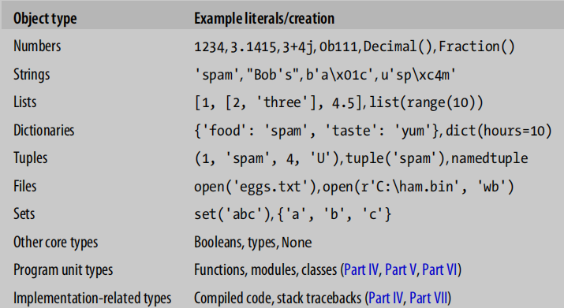
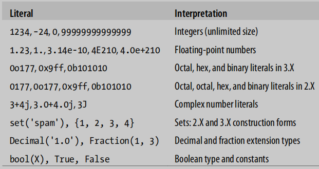
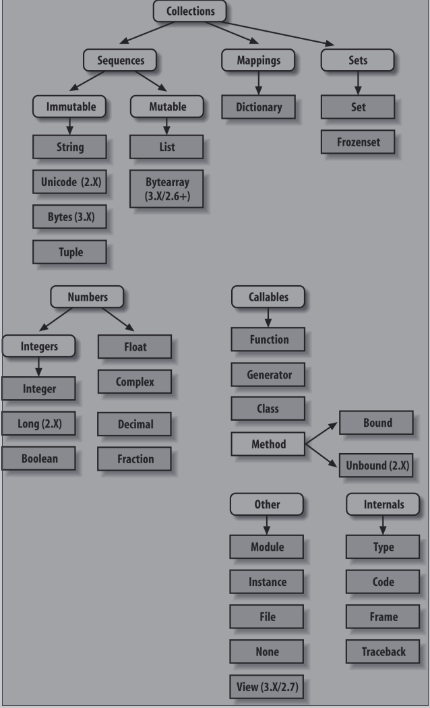
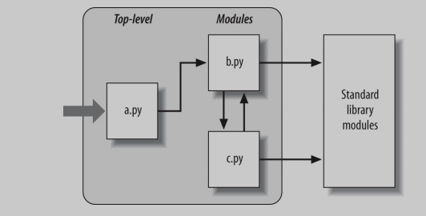

# Python学习手册

- [ ] 书籍作者：Mark Lutz
- [ ] 笔记时间：2021.9.22

------

> 很多都没有写,需要的时候再重读,第一次读目的是快速掌握python的基本用法

## 第一部分 基础

### 第一章 Python问答环节

- 为什么学习Python？可读性，体积小，跨平台，依赖库丰富等等

- python是脚本语言吗？python不止是脚本，这只是其中的一个角色

- 缺点：效率低，但是只有在要求很高的情况下才体现，平时和C/C++是没有差别的。

  可以通过将任务交给c/c++执行，因为python本身也有“胶水语言”的角色。

### 第二章 Python如何运行程序

- Python解释器
  - 只需要安装解释器和相关的库就可以开始编写代码了，一般系统会自带
  - 编写 py 结尾的脚本，即可开始执行

- 执行流程
  1. 编译为字节码，对用户隐藏 ，并且执行速度会快得多，以pyc结尾（只有import相应文件才会出现）。具有版本差异，可以部分编译优化速度
  2. PVM（python虚拟机），执行字节码（pyc文件）。在Python中真正拥有的只是运行时——根本没有初始编译时阶段，而且一切都是在程序运行时发生的。这甚至包括诸如创建函数和类以及模块的链接等操作。
- Python实现版本
  - 目前至少有五种，CPython, Jython, IronPython, Stackless, and PyPy .默认CPython是标准实现。
  - CPython：标准的Python实现，可以使用 C 的库，完整健壮。
  - Jython：编译成 Java  字节码，可以和Java的类一起用，应用范围较小。
  - IronPython：.NET平台，可以用到COM、NET技术
  - Stackless：面向并发的标准CPython实现
  - PyPy：另一个标准的CPython重新实现，专注于性能。拥有Python和JIT（将部分字节码编程二进制代码）
- FrozenBinaries：将程序文件的字节代码、以及PVM（解释器）和程序需要的任何Python支持文件捆绑在一个单一的包中，能够直接安装运行。

### 第三章 如何运行程序

- 交互模式：控制台直接输入 python 即可开始，代码调试和模块测试的好地方
- 缩进很严格，乱用可能导致代码执行错误
- 复合语句需要空行来终止

- 以 py 结尾的一个文件，就是一个模块，可以通过导入使用，使用 from imp import reload，利用 reload 方法进行加载
  - 引入之后可以使用内部变量和方法
  - 可以使用 exec 来执行模块，exec不需要在文件更改后重新加载模块

## 第二部分 类型和操作

### 第四章 对象类型

- 

- Number类型，两个\*表示指数

- 字符串，字符数组，支持正负索引，会有越界判断。可以使用切片语法 [begin​\:end\:step]，左闭右空。

  \*表示连接若干次，数字、字符串和元组是不可变的；""" 表示多行字符串

  利用 dir ，可以查看类型可用方法和属性；通过 help 可以查看方法的简要说明

  re模块可以使用模式匹配

- List类型，中括号表示，可以使用索引，切片语法。

  ```python
  col=[row[0] for row in M] 		#列表理解表达式，提取M矩阵的第一列
  [[x, x / 2, x * 2] for x in range(−6, 7, 2) if x > 0] 	#复杂表达式
  ```

- 字典，花括号表示，元素是键值对

  ```python
  D={}
  value = D['x'] if 'x' in D else '0'						#提前测试存在性
  ```

- 元组，小括号表示，不能更改的列表

- 文件， create/read/write/append 四种模式。二进制文件表示为特殊字节字符串，不受更改

  ```python
  for line in open("data"):print(line)					#逐行读取
  codecs.open('unidata.txt', encoding='utf8').read()		#打开utf-8
  ```

- 集合，花括号表示，元素是单个类型

  ```python
  x = {1,2,3,6}										#
  y = {6,7,8}
  x&y  x|y x-y
  ```

- 还有其他类型，比如 decimal、fraction、bool等，利用 type 函数可以检测类型

### 第五章 数字类型

- 整型、浮点型、复数、十进制、小数、集合、布尔、内置方法、表达式（无限精度、位操作等）、第三方扩展（向量、库、可视化等）
- 

- ```python
  "%e %4.2f" % a b		#格式化输出
  x < y < z				#整型大小比较
  a/b  a// b				#/保留小数，//向下取整
  a=9999999999999999999+1	#支持无限精度整数
  b = 2+1j				#复数虚部是j表示
  c=oxFF	bin/oct/hex(c)	#声明和使用各种进制
  math.sqrt(x) x**.5		#计算平方根
  Decimal("0.1")			#精确十进制，可以指定位数，上下文环境
  Fraction(1,3)			#分数类型，可以和浮点数相互转换
  set()					#集合的元素需要是不可变的对象，不可以是list和dictionary
  ```

### 第六章 动态类型

- 在分配变量时创建，可以引用任何类型的对象，并且必须在引用之前分配
- 对象有两个头字段，一个类型指示符和一个引用计数器，垃圾回收算法基于引用计数（并且解决了循环引用问题）
- Python缓存和重用小整数和小字符串，利用 is 和 == 进行验证 ，sys.getrefcount() 可以查看引用数，具有弱引用。

### 第七章 字符串原理

- 如果不能识别有效转义代码，会保留反斜杠。在字符串前面使用一个r表示不使用转义。

  三个双引号会保留原有形式，不会转义。可以充当注释，文档等

- ```python
  # 	0  	1  		-1	
  	A	B	C	D	E
  #	[:				:step],step可以是负数，表示反向
  repr()				#转为代码字符串
  ord()|chr()			#二进制表示|字符表示，利用replace方法和切片拼接
  '%s ...' % (values)	#格式化字符串
  '%(qty)d more %(food)s' % {'qty': 1, 'food': 'spam'}#可以利用 vars() 来填充变量
  '{motto}, {0:.2f} and {food}'.format(42, motto=3.14, food=[1, 2])#利用字典
  '{0.platform:>10} = {1[kind]:<10}'.format(sys, dict(kind='laptop'))
  ```

### 第八章 列表和字典

- 列表也是序列，支持和字符串类似的操作，并且列表是可变的，支持范围修改

- ```python
  L[:0] = [2, 3, 4]	#头部插入
  sorted(L, key=str.lower, reverse=True)			#内置
  sorted([x.lower() for x in L], reverse=True)   	#预转换
  ```

- 字典，

- ```python
  [title for (title, year) in table.items() if year == '1975']
  db['bob']['jobs']	#支持多级访问
  ```

### 第九章 元组、文件和其他一切

- 元组，和列表一样，除了不可变和小括号

- 文件，文件上下文使用with-as，json模块，struct模块，

  

## 第三部分 语句和语法

### 第十章 Python语句

- 可以省略小括号，花括号用冒号和缩进代替，不用分号（使用分号可以压缩到一行），换行对齐即可（不用反斜杠表示同一行）

### 第十一章 赋值，表达式和打印

- 可以使用元组形式赋值，等号两端数量匹配即可，右边可以是元组，列表，字典，字符串

- 循环里面可以使用元组取值，python3可以使用 *变量 取得剩下的值，这样数量就可以不一致

  假如前后还有变量，则会为其留一个

- 可以使用连续赋值，命名规则

  - 以单个下划线（\_X）开头的名称不会由从模块导入\*语句导入（如第23章所述）。
  - 有两个前划线和后划线(\_\_X\_\_)的名称是系统定义的名称，对解释器具有特殊含义。
  - 以两个下划线开头而不以两个(\_\_X)结束的名称将本地化（“损坏”）到封闭类。
  - 只有一个下划线（\_）的名称在交互工作时保留最后一个表达式的结果。

- print方法，可以通过 help(print) 查看用法，方法调用的时候可以使用命名参数。
  - 最好格式化以后再打印
  - 重定向：修改sys.stdout即可，同理标准输入和标准错误也是

### 第十二章 if和语法规则

- if 可以和 in 关键字一起使用

- 语法就是缩进和换行，括号可以跨行，三个引号也是。

- ```python
  a = 't' if 'spam' else 'f'		#三元运算，不支持？的三元运算
  ```

### 第十三章 while和for循环

- 空语句可以使用 pass ，可以在循环外使用else，当使用break跳出循环时候执行。

  不允许判断条件赋值形式

- for 使用 in ，支持 else 子句。

  内置 range、zip（会把多个数据封装为一个对象，然后并列访问）、

  enumerate（提供索引下标，支持next）、和map

### 第十四章 迭代

- 对象具有 "\_\_next\_\_" 方法，可以手动调用逐行读取，也可以调用 next() （内部调用\_\_netxt\_\_方法）

- ```python
  data = [ x**2 for x in range(10)]			#列表对迭代的支持
  lines = [line.rstrip() for line in open("data") if line[0] == 'p']
  data = [x,y for x in 'abc' for  y  in '123']
  ```

- 字典返回的并不是视图

### 第十五章 文档

- dir可以查看属性和方法
- \_\_doc\_\_可以查看三个"注释的文档说明
- help 方法查看具体用法 
-  python -m  pydoc -b 命令可以打开浏览器查看文档说明
- [在线文档](http://www.python.org)

## 第四部分 方法和生成器

### 第十七章 函数

- def 关键字，可以有命名参数，return结束。

  支持嵌套，函数也是对象，可以赋予属性，跟js用法差不多。

### 第十七章 作用域

- 基于方法的范围，方法之外则是全局变量，

  入口模块的 \_\_name\_\_ 的值会被设置为 "\_\_main\_\_",默认是当前模块名称

- 作用域有四种：  局部、闭包函数、全局、内置（Local，Enclosing，Global，Build-in）

  - 内置函数是在 buitins 模块里面
  
  - global 关键字指定使用 全局变量，而不是覆盖
  
  - lambda n: x\*\*n 
  
  - for循环也是变量范围有问题，需要用到闭包限定（局部变量覆盖）
  
  - nonlocal变量：允许嵌套函数更改，在闭包函数中，非本地域是每个调用的多个拷贝数据。
  
    只能定义在函数里，并且需要提前声明
  
  - global变量：需要提前声明和使用的地方声明 
  
  - 类会自动调用 \_\_init\_\_ 方法，\_\_call\_\_拦截对实例的直接调用，字段都可以访问
  
  - 函数具有属性，可以在嵌套函数之外访问状态变量


### 第十八章 参数

- 值复制和引用复制，没什么特殊的。可以通过传入不可变对象元组之类的，可以避免更改。

- 形参的匹配模式：参数默认值、\*\*参数收集到字典、\*参数收集到元组

  实参的匹配模式：命名参数、\*参数表示拆列表、\*\*拆字典

### 第十九章 高级函数主题

- 循环和递归
- 具有注解，在 \_\_annotations\_\_ ，在参数后可以指定参数的类型，语法就是 参数:类型，返回类型采用箭头
- lambda表达式应用场景，map 、filter、for，只进行简单处理的表达式。

### 第二十章 列表表达式和生成器

- 列表表达式更容易理解，效率高

- 生成器使用 yield ，可迭代对象

  生成器函数和生成器表达式都是它们自己的迭代器，因此只支持一个活动迭代

### 第二十一章 基准

- 利用 time 模块，自定义计时器，用到 perf_counter 方法。
- 可以用现成的 timeit 模块，基准测试模块和脚本

## 第五部分 模块和软件包

### 第二十二章模块 大图景

- 

- 导入过程--导入一次

  1. 找到对应的py文件 
  2. 编译成字节码，如果需要的话。文件将在\_\_pycache\_\_子目录中
  3. 根据代码构建对象

- 必须使用imp.reload调用强制重新导入

- 模块搜索目录：当前工作目录；PYTHONPATH；标准库；.pth文件指定的目录；

  sys.path 可以查看搜索目录，并且手动修改

### 第二十三章 模块编程 

- 一个py文件就是一个模块，import 只能工作一次

  \_\_dict\_\_ 属性访问模块的名称空间字典

  ```python
  from M import func  as mfunc
  from imp import reload 
  reload(module)
  ```

### 第二十四章 模块包

- Python代码的目录被称为一个包，因此这种导入被称为包导入，会被转化为一个名称空间。

  一个模块就是一个名称空间

  ```python
  from ch1.ch2.M import func  as mfunc 	#目录里面需要__init__.py文件 
  sys.path.append("..")					#引入相对路径
  from ch1.echo import calc_add
  from ..ch1.echo							#会出现问题
  ```

### 第二十五章 高级模块的主题

- \_开头的变量表示模块私有数据，可以给\_\_all\_\_赋值列表让 from*  加载

  ```python
  from __future__ import featurename #对可能破坏现有代码的语言的更改通常会在Python中逐步引入的
  # 可以通过字符串变量引入，获知使用 exec 拼接引入
  ```

- 每个模块都有\_\_name\_\_，入口文件的值为 \_\_main\_\_，可以用来单元测试


## 第六部分 OOP

### 第二十六章 OOP:宏伟蓝图

- ```python
  class C1:
      # 子类默认继承
      def method(self,param):
          print('this is C1')
  
  # 继承属性搜索顺序(从下往上,从左往右):当前类C -> 父类C1 -> 父类C2
  # 模块对应的是一个文件,内存里只有一份,或者说一个实例
  # 类对应的是class语句,内存里可以有多个实例
  class C(C1,C2):
      # 等同于构造函数,默认调用
      def __init__(self):
          # 属性设置/获取直接使用对象调用
          self.name = 'tom'
      
      # 类的对象方法参数具有隐藏参数 self ,一般作为默认的第一个参数自动传入
      def method(self):
          print('this is C')
  ```

### 第二十七章 类代码编写基础

- ```python
  # 类一般是文件导入时自动执行
  # 类是模块的属性
  class A:
      # 方法本质也是类对象的一个属性
      def method(self):
          pass
      
      # 运算符重载,双下划线包围的方法名,没有默认实现的运算符重载
      def __init__(self,value=None):
          self.age = value
      
      def __add__(self,other):
          return A(self.age + other.age)
      
      def __str__(self):
          return f'age:{self.age}'
      
         
  ```

- 命名空间

  ```python
  # 非常简单的空对象类,可以对该类增减属性,实现类似结构体的效果
  # python一切皆对象,OOP只是对象属性操作而已
  class rec:pass
  # __dict__ 基于类对象的命名空间字典
  list(rec.__dict__.keys())
  
  __class__ 	# 查看当前类
  __bases__	# 查看父类
  ```

  

### 第二十八章 一个更加实际的实例

- 继承案例
     ```python
      class Person:
          def __init__(self,name,job=None,pay=0):
            self.name = name
              self.job = job
              self.pay = pay

          def raiseMoney(self,percent):
              self.pay *= (1+percent)

          def __repr__(self):
              return '[Person %s %s]' % (self.name,self.pay) 

      class Manager(Person):
          def __init__(self,name,job=None,pay=0):
              Person.__init__(name,'mgr',pay)

          def raiseMoney(self,percent,bonus):
              # 不采用super关键字是可能引发未预料的效果
              Person.raiseMoney(percent+0.1*bonus)
             
             
      if __name__ == '__main__':
           # 测试代码,作为模块导入时候不会调用
           bob = Person('bob')
           sue = Person('Sue Jones',job='dev',pay=10000)
           print(bob.name,sue.name)
     ```


- 组合
     ```python
      # 非继承版本,使用组合方式实现
      def Manager:
          def __init__(self,name,pay):
              self.person = Person(name,'mgr',pay)

          # 调用方式还是点
          def __getattr__(self,attr):
              return getattr(self.person,attr)

          # 打印对象所有属性(不包含继承来的属性)
          # dir(self) 可以获取所有属性,包括基础
          def gaterAttrs(self):
              attrs = []
              for key in sorted(self.__dict__):
                  attrs.append('%s = %s'%(key,getattr(self,attr)))
              return ','.join(attrs)
     ```

- 一些模块

  ```python
  # pickle 用于序列化
  # shelve 将对象存在dbm文件的key里
  # 限制在于类及模块必须是可导入的.导入文件后shelve会自动创建实例
  mgr = Manager('tom',123)
  import shelve
  db = shelve.open('persondb')
  for obj in (bob,sue,tom):
      db[obj.name]=obj
  db.close()
  ```

### 第二十九章 类代码细节

- 类机制

  ```python
  # class 语句是对象创建,并且是隐含的赋值运算
  # 有效的封装了名称空间
  class A:
      name='tom'		# 共享类属性
      
      def action(self):	# 子类必须实现
          assert False,'must define action'
          raise NotImplementedError('must define action')
          
          
  # __doc__ 查看对象文档说明
  # help(模块) 查看文档
  ```

  

### 第三十章 运算符重载

- ```python
  # 虽然可以通过函数名调用,但是不推荐,速度会更慢
  class Indexer:
  	# 索引重载,容器类操作,也会被分片操作使用
      # 迭代的备选项
      def __getitem__(self,idx):
          return idx ** 2
      
      # 更新值
      def __setietm__(self,idx,value):
          data[idx] = value
          
      # 将对象转为一个整数
      def __index__(self):
          return 255
      
      # 自定义迭代,返回迭代器对象
      # 默认只能一次迭代,可以通过返回新的对象实现多次迭代
      def __iter__(self):
          return self
      def __next__(self):
          if self.value > 5:
              raise StopIteration
          self.value += 1
          return self.value**2
      
      # 备选方案 自动转换成生成器函数,自带 next 函数
      # 代码更简洁,省略了中间许多过程
      # 自动实现了可多次迭代
      def gen(self):
          for value in range(10):
              yield value**2
      
      # 作用于关键字 in
      def __contains__(self,val):
          return True
      
      # 拦截对象属性访问
      def __getattr__(self,attr):
          return 123
      
      # 不要直接对属性修改,会无限递归
      def __setattr__(self,attr,value):
          self.__dict__[attr]=value
      
      # 打印对象
      def __repr__(self):
          return 'abc'
      
  X = Indexer()
  X[2]
  ```

### 第三十一章 类的设计

- ```python
  # 可以使用 __getattr__ 实现包装类
  # _X 表示伪私有变量
  # 类内部变量 __X 会自动重整为 _类名__X,防止冲突
  ```

### 第三十二章 类的高级主题

- ```python
  # 内嵌扩展类型  ==> 使用代理模式 或者 继承
  # 新式类
  ## 	__getattr__ 不再搜索内置上下文 __X__ 的重载方法名
  ##	代理对象涉及到内置运算需重新定义 
  ## object 派生自 type,type 派生自 object
  
  # 多继承搜索规则 MRO ,广度优先搜索,适用于钻石继承
  # 最好不要依靠MRO,而是明确指定哪个类的方法
  # __mro__ 可以查看类的MRO顺序
  
  # slot 慎用
  # 不在 __slots__ 的属性会认为是拼写错误,会让 __dict__ 失效
  # getattr() 会搜索两者
  
  # property 少用
  
  # staticmethod() / classmethod() 静态方法不会传入对象,类方法自动传入类对象 
  ```

- 装饰器

  ```python
  # 元函数,下一部分介绍
  class Test:
  	@staticmethod
  	def meth():pass
      
  # super() 适合单继承使用,钻石协同不建议过多使用
  ```

## 第七部分 异常和工具

### 第三十三章 异常和工具

- ```python
  # 作用 错误处理/时间通知/特殊情况处理/终止行为/非常规控制
  
  # 越界案例
  try:
  	x = '1234'
  	x[5]
      raise IndexError		# 手动引发异常
      assert False,'error'	# 有条件的异常
  except IndexError:
      print('index error')
      
  # 自定义异常
  class MyError(Exception):pass
  ```

### 第三十四章 异常编写细节

- ```python
  try:
      do()
  except (A,B) as e:		# 捕获AB错误
  except :				# 捕获所有错误,最好捕获 Exception
      doHandle()
  else:
      doNoException()		# 不发生异常执行的代码
  finally:
   	doSome()			# 离开try后一定执行
        
  ## 引发异常
  raise Excetion
  raise Excetion()		# 两种触发方式都会产生实例,传递给except
  raise OtherException() from Exction		# 利用异常触发别的异常
  
  
  ## Assert 断言
  assert test,data
  
  ## with 上下文
  with open('a') as a:	# 资源自动管理
  	pass
  class DemoWith:
      def __enter__(self):
          return self
      def __exit__(self,exc_type,exc_value,exc_tb):
          if exc_type is None:
              print('ok')
          else:
              print('error')
              return False
  ```

### 第三十五章 异常对象

- ```python
  
  import excetions	# 查看所有异常
  help(excetions)
  					# 重新定义__str__,实现自定义输出
  e.logerror()
  sys.exc_info()		# 获取最近异常信息
  ```

### 第三十六章 异常的设计

- ```python
  # 异常不总是错误
  # 键盘输入也可以触发异常 Ctrl-C  / sys.exit() 等也会触发异常
  import tranceback		# 有大量方法可以查看异常信息
  # 避免空异常和Exception
  
  ```

- 可用工具

  - PyDoc  PyChecker  Pylint PyUnit 动态语言规范化,简单单元测试
  - doctest 标准库测试
  - profile 性能测试
  - 交付选项 py2exe PyInstaller
  - 优化选项 JIT

## 第八部分 高级主题

### 第三十七章 Unicode和字节串

- ```python
  # 字符编码方案 ASCII 7位编码
  ord('a')	#97
  hex(97)		#'0x61'
  chr(97)		#'a' ,
  
  # 编码 字符串根据编码格式转为字节序列
  # 解码 字节序列根据编码格式转为字符串
  'abc'.encode('utf8')
  
  # 实际上Python内存里字符串是编码独立的,也就是跟编码无关,只有输入/输出的时候才需要转换
  # Python3.2之前是UTF-16格式,3.3以后是1/2/4变长版本
  # 码点是字符个数,len()返回的就是码点个数
  ```

- ```python
  # 字符串类型
  # str表示8位文本和二进制  Unicode表示解码的Unicode文本  
  # bytes表示不可变的二进制数据,几乎支持str的全部运算
  # 由 open(file,mode) mode若含b则说明是二进制格式
  type(b'spam'),type('spam')	#(bytes, str),需要注意的是b会跟文档注释起作用
  type(u'spam')				# str
  bytes('spam',encoding='ascii')	# 转换,不可以默认相互转,最好明确指定编码格式
  
  \xNN	#十六进制转义
  \uNNNN	#unicode 4字节转义
  \UNNNNNNNN	#8字节
  
  # 字符串可以嵌入特殊字符,使用转义方式
  S = 'abc\xc4b'
  
  ```

- ```python
  # -*- coding: latin-1 -*-			#指明脚本编码格式,必须放在第一行,默认utf8
  
  set(dir('a')) - set(dir(b'a'))		#查看二进制操作少了哪些,bytes没有格式化
  bytearray							#支持原地修改的序列,也区分文本/二进制
  
  ```
- 文件操作

  ```python
  open('temp','w').write('abc\n')
  open('temp','r').read()				# abc\n
  open('temp','rb').read()			# abc\r\n
  open('temp','w',encoding='utf-8').write('abc\n')	# 指定编码格式
  # 文本保存时候可能会带有BOM(Byte Order Mark),需要指定对应的编码格式来跳过
  # 比如utf-16总是会保存BOM,使用二进制读取可以看到
  
  sys.byteorder
  sys.getdefaultencoding()
  sys.getfilesystemencoding()
  ```

- 字符串工具

  ```python
  # 正则
  import re
  src = 'abcabc'
  pat = 'abc'
  re.match(pat,src).groups()			# 匹配
  
  # 从字符串提取二进制
  from  struct import pack
  pack('abc',7,b'spam',8)				# 输出二进制
  
  # pickle 序列化
  
  # xml 工具
  # 正则 re
  # 默认DOM xml.dom.minidom.parse
  import xml.sax.handler
  from xml.etree.ElementTree import parse 
  ```

### 第三十八章 被管理的属性

- ```python
  # 属性验证
  # __getattr__ / __setattr__ / __getattribute___
  property			# 内置函数,用于特定属性访问路由
  描述符协议			 # 新类可用
  
  
  # property
  class demo{
  	def __init__(self,name):
      	self._name = name
      
      def getName(self):
      	print('get name ',self._name)
      	return self._name
      
      def setName(self,value):
      	print('set name ',value)
      	self._name = value
      
      def delName(self):
      	print('del name')
      	del self._name
      
      name = property(getName,setName,delName,'name property docs')
      
  }
  
  
  # 装饰器
  class demo{
      def __init__(self,name):
      	self._name = name
      
      @property
      def name(self):
      	"name property docs	"
      	print('get name ',self._name)
      	return self._name
      
      @name.setter
      def name(self,value):
      	print('set name ',value)
      	self._name = value
      
      @name.deleter
      def name(self):
      	print('del name')
      	del self._name
  }
  ```

- 描述符

  ```python
  # 带有以下方法的类就是描述符类,赋值方式访问时候会自动触发对应函数
  class Descriptor{
      def __get__(self,instance,owner):pass
      def __set__(self,instance,value):pass
      def __delete__(self,instance):pass
  }
  
  # 使用 slot/getattr工具和dir配合,可以向property一样访问属性
  def __getattr__			# 未定义属性获取
  def __getattribue__		# 全部属性获取,容易引起递归
  						# object.__getattribute__(self,'other'),不可以通过 __dict__
  def __setattr__			# 全部属性设置
  def __delattr__			# 全部属性删除
  
  
  
  ```

  

### 第三十九章 装饰器

- ```python
  # 装饰器提供了在函数/类定义结束时候自动插入运行的代码
  class demo{
      @staticmethod				# method=staticmethod(method)
      def method(self):pass
  }
  
  # 自定义装饰器,函数装饰器,不可以作用在类上
  class tracer():
      def __init__(self,func):
          self.calls = 0
          self.func = func
          
      def __call__(self,*args,**kwargs):
          self.calls+=1
          print('call %s to %s' % (self.calls,self.func.__name__))
          self.func(*args,**kwargs)
          
  # 闭包方式实现函数装饰器,可以作用在类上
  # 写法很多,需要函数和方法都有效的最好使用嵌套函数的方式
  def tracer(func):
      def wrapper(*args,**kwargs):
          global calls
          calls += 1
          print('call %s to %s' % (calls,func.__name))
          return func(*args,**kwargs)
      return wrapper
          
  @tracer							# spam = trancer(spam)
  def spam(a,b,c):				# 
      print(a+b+c)
  @tracer  
  def egg(x,y):
      print(x**y)
  ```

- ```python
  # 类装饰器
  def sigleton(aClass):
      instance = Node
      def onCall(*args,**kwargs):
          nonlocal instance
          if instance == None:
              instance = aClass(*args,**kwargs)
          return instance       
  	return onCall
  # 自包含方案
  def sigleton(aClass):
      def onCall(*args,**kwargs):
          if onCall.instance == None:
               onCall.instance = aClass(*args,**kwargs)
          return  onCall.instance       
  	return onCall
  
  # 可以使用装饰器实现Private等访问控制,原理还是利用 __getattr__ 进行拦截
  
  ```

### 第四十章 元类

- ```python
  # 元类是扩展了装饰器的代码插入模型
  # 元类是type类的字类,类对象是type类实例或子类
  # Python在class语句末尾运行
  # class = type(classname,superclasses,attrbuteddict)
  # type对象定义了__call__ 运算符重载,运行了 __new__ 和 __init__
  
  class Meta(type):
      def __new__(meta,classname,supers,classdict):
          return type.__new__(meta,classname,supers,classdict)
      
  class Spam(metaclass=Meta):			# 声明元类
     
  class M1(type):attr1=1
  class M2(M1):attr2=2
  class C1:attr3=3
  class C2(C1,metaclass=M2):attr4=4
  
  C2().attr1							# 元类属性 实例不可以继承 
  C2().__class__.attr1				# 可以访问
  ```

- python继承算法

  > 1. 从实例I出发,搜索该实例 , 该类 以及父类 通过
  >    1. 搜索实例I的 \_\_class\_\_ 中的 \_\_mro\_\_ 找到所有类的 \_\_dict\_\_
  >    2. 如果上一步找到描述符,调用并退出
  >    3. 否则,返回实例I的\_\_dict\_\_中的值
  >    4. 否则,调用1的非数据描述符或1中的找到的值
  > 2. 从一个类C出发,搜索该类,父类
  >    1. 同1
  > 3. 规则1和2,内置操作只用步骤1的版本

- ```python
  # 元类方法只能使用类调用
  # 元类扩展
  class Extender(type):
      def __new__(meta,classname,supers,classdict):
          classdict['eggs']=eggsfunc
          classdict['ham']=hamfunc
          return  type.__new__(meta,classname,supers,classdict)
      
  class Client1(metaclass=Extender):
      def __init__(self,value):
          self.value = value
          
      def spam(self):
          return self.value *2
  ```

- 