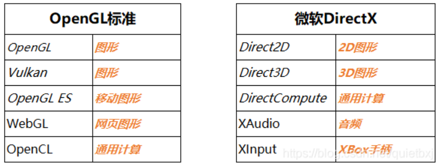

# WPF编程宝典的一些相关资料

- 笔记时间：2021.10.08

## 1. 基础知识

### DirectX

- 书中说WPF基于DirectX，[DirectX](https://baike.baidu.com/item/DirectX/314119?fr=aladdin)是微软提供的多媒体编程接口，跟众多网卡厂商有合作，主要为游戏开发。

  - 跟它一起的还有 OpenGL，特点是比较简单和稳定性好，跨平台，主流显卡一般都支持。

  - | 项目      | OpenGL | DirectX     |
    | --------- | ------ | ----------- |
    | 平台支持  | 跨平台 | Windows平台 |
    | 学习门槛  | 低     | 高          |
    | 效率/特性 | 低/少  | 高/多       |

  - 

  - VisualStudio本身使用C#开发

### [WPF体系结构](https://docs.microsoft.com/zh-cn/dotnet/desktop/wpf/advanced/wpf-architecture?view=netframeworkdesktop-4.8)

