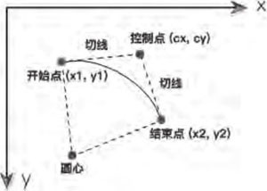
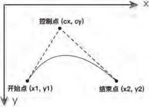
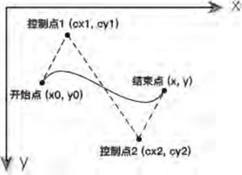
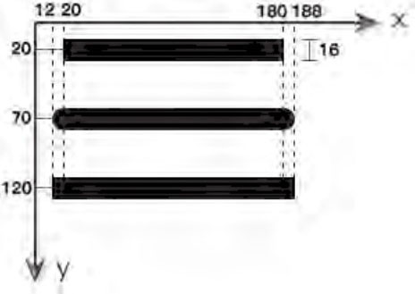
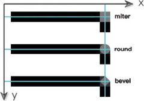
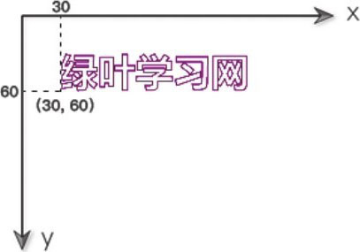
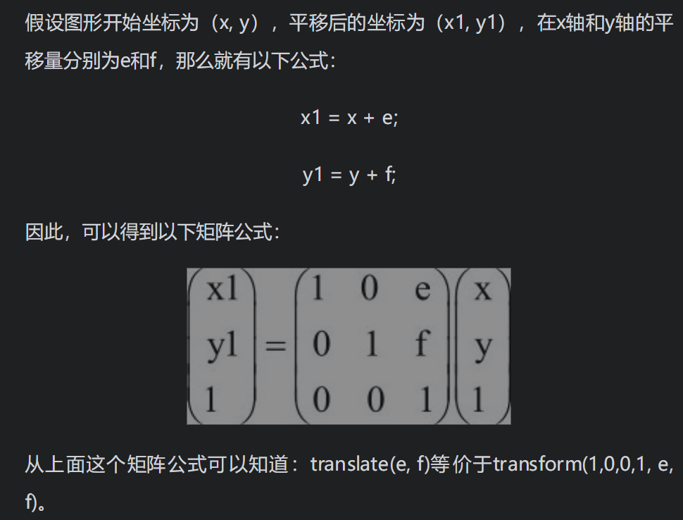
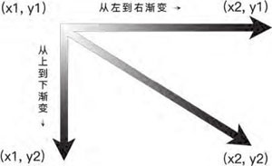
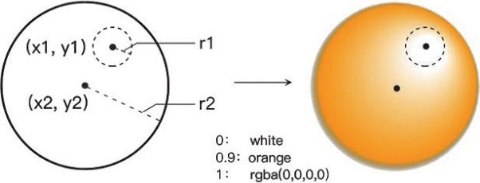
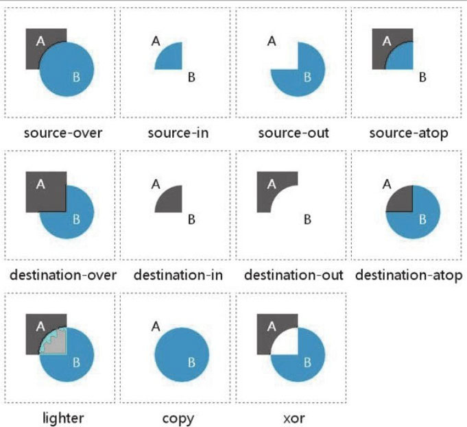

# Web前端精品开发课：HTML5Canvas开发详解

- [ ] 书籍作者：莫振杰
- [ ] 笔记时间：2021.9.3

## 第一部分 Canvas基础

### 第1章 Canvas概述

#### 1.1 Canvas简介

- Canvas技术，指的就是使用Canvas元素结合Javascript来绘制各种图形的技术。

- 与SVG技术的区别

  | 项目       | Canvas                   | SVG                    |
  | ---------- | ------------------------ | ---------------------- |
  | 生成方式   | Javascript动态生成       | XML静态描述            |
  | 失真       | 基于像素的位图，放大失真 | 基于矢量的图，不会失真 |
  | 修改后重绘 | 是                       | 否                     |

- 具有默认大小，一定要在html中指定大小，不要使用css，因为获取宽度的时候获取不到

- getContext("2d")来获取Canvas 2D上下文环境对象

### 第2章 直线图形

#### 2.1 直线图形简介

#### 2.2 直线

- 坐标系如下

  原点	x轴 →

  y轴 ↓

- ```js
  // 直线
  // 使用moveTo()和lineTo()这两个方法，最后一定要调用 stroke() 绘制
  ```

#### 2.3 矩形

- 描边矩形  strokeRect()，需要设置 strokeStyle

- 填充矩形 fillRect()，使用之前都需要设置好对应的画刷 fillStyle
- 上面两者调用之后立即绘制，然而 rect()需要调用 stroke()/fill() 才能绘制
- clearRect() 清空部分区域，可以用于清空canvas

#### 2.4 多边形 

- 自己利用线段绘画，正多边形可以使用path绘制

#### 2.5 训练题：绘制调色板

- 使用 LinearGradient 进行绘制，也可以将矩形分为若干个小矩形逐个填充颜色

### 第3章 曲线图形

#### 3.1 曲线图形简介

- 弧线是圆周的一部分，曲线则不一定。

  弧线上每个点都具有相同的曲率，曲线则不一定。

  或者也可以这样说，曲线包含弧线。

#### 3.2 圆形简介

#### 3.3 弧线

- arc() 进行绘制，需要配合beginPath进行绘制

- arcTo()可以绘制弧线，需要给定三个点（起始，终止，控制），

  

#### 3.4 二次贝塞尔曲线

- 需要复习一下 微积分的曲率部分 

  

#### 3.5 三次贝塞尔曲线

- 

### 第4章 线条操作

#### 4.1 线条操作

#### 4.2 lineWidth属性

- 不仅可以用于直线，还可以用曲线图像。实际宽度会在原来基础上增加线宽

#### 4.3 lineCap属性

- 具有 butt（默认）、round（端点是圆形）、square（端点矩形），会有实际宽度增加
- 有趣的是只对端点起作用，折线的拐弯点不算在内
- 

#### 4.4 lineJoin属性

- miter（默认，尖角）、round（圆角）、bevel（斜角）
- 

#### 4.5 setLineDash()方法

- 使用数组，表示 实线 空白 交替

### 第5章 文本操作

#### 5.1 文本操作简介

#### 5.2 文本操作“方法”

- strokeText()方法来绘制“描边文本”，也就是空心文本

  

- fillText()方法来绘制“填充文本”，也就是实心的文本。

- measureText()方法来返回一个对象，并且可以利用这个对象的width属性来获取某个文本的长度。

  配合Canvas 的 宽度可以实现水平居中 

#### 5.3 文本操作“属性”

- font 属性和 css的用法一样
- textAlign 属性，指定文本开始/结束坐标

- textBaseline属性，指定文本的基准线 

### 第6章 图片操作

#### 6.1 图片操作简介

#### 6.2 绘制图片

- drawImage 三个参数，指定图片和开始坐标（左上角）
- drawImage 五个参数，原来基础上增加宽高限制。用于绘制大小不一的图像。
- drawImage 九个参数，表示截取源坐标宽高和目标坐标宽高 。用于复制图像，提高速度。

#### 6.3 平铺图片

- createPattern()和fillRect()这两个方法配合使用。

#### 6.4 切割图片

- 绘制基本图形，调用clip()方法，绘制图片

#### 6.5 深入图片操作

- 图片结合文字实现 文字的颜色是图片或者结合图形

### 第7章 变形操作

#### 7.1 变形操作简介

#### 7.2 图形平移

- translate()方法来平移图形
- clearRect()方法来清空整个Canvas

#### 7.3 图形缩放

- scale()方法来对图形进行缩放操作，坐标会变化，宽度等 

#### 7.4 图形旋转

- rotate()方法来旋转图形。对齐canvas左上角旋转中心实现旋转
- 设置旋转中心translate(x, y)，然后再使用rotate()方法。

#### 7.5 变换矩阵

- 线性代数，平移采用加法，缩放采用乘法，旋转需要配合三角函数
- setTransform()方法，每次都会重置状态。
- 

#### 7.6 深入变形操作

- 图片和文字也支持

### 第8章 像素操作 

#### 8.1 像素操作简介

- getImageData()方法来获取一张图片的像素数据。返回的是一个canvasPixelArray对象，里面有一个data属性，该属性 表示的是每个像素数据
- putImageData()方法输出一张图片的像素数据

#### 8.2 反转效果

- 将RGB三个通道的值取反，透明度不做处理

#### 8.3 黑白效果

- 首先取红、绿、蓝三个通道的平均值，然后三个通道皆为该平均值

#### 8.4 亮度效果

- 让三个通道同时加上某个值

#### 8.5 复古效果

- 将红、绿、蓝三个通道，分别取这三个值的某种加权平均值。

#### 8.6 红色蒙版

- 将红通道（r）赋值为红、绿、蓝这三个的平均值，并且将绿通道、蓝通道都赋值为0

#### 8.7 透明处理

- 将A通道乘以n，n取值范围0~1

#### 8.8 createImageData()方法

- createImageData()用于在画布中创建一个区域，使得这个区域得以进行像素操作。

### 第9章 渐变与阴影

#### 9.1 线性渐变

- 创建渐变画刷，赋值给style，填充/描边
- 

#### 9.2 径向渐变

- x1表示开始渐变坐标，x2表示终止坐标 
- 

#### 9.3 阴影

- shadow相关属性设置

### 第10章 Canvas路径

#### 10.1 路径简介

#### 10.2 beginPath()方法和closePath()方法

- beginPath开始路径绘制，同一路径，后来者的状态会覆盖之前的状态
- 后者会自动闭合路径（起点和终点）

#### 10.3 isPointInPath()方法

- 判断某一个点是否存在于当前的路径中。
- 不支持strokeRect()和fillRect()，而只支持rect()方法。

### 第11章 Canvas状态

#### 11.1 状态简介

- Canvas是基于“状态”来绘制图形的，每一次都会检测程序定义的所有状态。
- 可以使用save()方法来保存“当前状态”，然后可以使用restore()方法来恢复“之前保存的状态”。

#### 11.2 clip()方法

- 不支持strokeRect()和fillRect()，而只支持rect()方法。

#### 11.3 save()方法和restore()方法

- 用于图片剪切、变形、属性 保存和恢复，不可以保存图形和路径

### 第12章 其他应用

#### 12.1 Canvas对象

- 常用属性 宽高
- 对象方法 getContext 获取上下文，toDataURL获取位图字符串（参数是MIME类型），可以用于图片保存

#### 12.2 globalAlpha属性

- 全局的透明度，小心使用

#### 12.3 globalCompositeOperation属性

- 改变交叉图形的显示方式

  

#### 12.4 stroke()和fill()

- 描边和填充 

## 第二部分 

### Canvas进阶第13章 事件操作

#### 13.1 Canvas动画简介

- 第一部分可以看成CSS的功能，提供静态框架，该部分则是JS功能，提供动态能力

#### 13.2 鼠标事件

- mousedown mouseup mousemove

#### 13.3 键盘事件

- keydown keyup，canvas元素本身不支持键盘事件，因此一般情况下都是使用window对象来实现Canvas中键盘事件的监听。
- 可以使用keycode判断 按键

#### 13.4 循环事件

- requestAnimationFrame()作用跟setInterval()功能是一样的，无需手动设置间隔时间
- 问题在于具有严重的兼容问题

### 第14章 物理动画

#### 14.1 物理动画简介

- 一些碰撞动画，一般用到物理的加速、匀速、摩擦力、三角函数等

#### 14.2 三角函数简介

- 需要注意弧度和角度的转化，推荐写法 度数*Math.PI/180
- 在Canvas中我们可以使用反正切函数Math.atan2()来求出两条边之间夹角的度数，并且能够准确判断该度数对应的是哪一个夹角。

#### 14.3 三角函数应用

- 两点间距离 -- 勾股定理
- 圆周运动 -- 椭圆都可以实现
- 波形运行 -- 正弦

#### 14.4 匀速运动

- 物理的合力分解

#### 14.5 加速运动

- 匀加速运动 Vt = V0+a * t

#### 14.6 重力

- 对于需要不断改变的变量，一般在动画循环之前先定义。
- 对于需要不断改变的变量，一般在动画循环中图形绘制之后才递增或递减。

#### 14.7 摩擦力

### 第15章 边界检测

#### 15.1 边界检测简介

#### 15.2 边界限制

- 只限在范围里面运动。

#### 15.3 边界环绕

- 从另一边进来

#### 15.4 边界生成

- 物体超出边界后，从开始位置重新生成

#### 15.5 边界反弹

- 碰到边界速度方向取反

### 第16章 碰撞检测

#### 16.1 碰撞检测简介

#### 16.2 外接矩形判定法

- 物体外形类似矩形，当成矩形处理，求出外接矩形

#### 16.3 外接圆判定法

- 判断圆心距离即可

#### 16.4 多物体碰撞

- 排列组合 -- C(n,2)，避免小球碰撞挤在一起，可以简单地添加偏移量，取半径即可

### 第17章 用户交互

#### 17.1 用户交互简介

#### 17.2 捕获物体

- 多边形以及不规则图形的捕获非常复杂，采用的方法是分离轴定理（SAT）和最小平移向量（MTV）。
- 矩形 -- 判断区域即可
- 圆形 -- 判断和圆心的距离即可
- 静止物体 -- 上边两种方法可以判断
- 移动物体 -- 静止物体的基础上加入一个共享的移动开关变量即可
- 拖拽的实现
  - 捕获物体：鼠标按下，判断落点，如果选中，添加 鼠标移动 和 鼠标松开 事件
  - 移动物体：鼠标移动事件更新坐标
  - 松开物体：鼠标松开事件移除自身和鼠标移动事件
  - 需要修改物体和指针的偏移量，使其自然些  

#### 17.4 抛掷物体

- 利用旧坐标进行速度计算，配合前面的匀加速运动可以实现 

### 第18章 高级动画

#### 18.1 高级动画简介

#### 18.2 缓动动画简介

1. 定义一个0～1之间的缓动系数easing。
2. 计算出物体与终点之间的距离。
3. 计算出当前速度，其中当前速度=距离×缓动系数。
4. 计算新的位置，其中新的位置=当前位置+当前速度。
5. 重复执行第2～4步，直到物体达到目标。

#### 18.3 缓动动画应用

- 各种属性值，颜色，透明度，旋转等等

#### 18.4 弹性动画简介

- 实现差别在于缓动动画是距离和速度成正比，弹性动画是速度和加速度成正比

### 第19章 Canvas游戏开发

#### 19.2 Box2D简介

- Box2D是暴雪工程师Erin Catto使用C++编写的一个非常优秀的物理引擎。在Box2D这个物理引擎中，可以模拟真实世界的运动情况，其中物体的运动、旋转和碰撞反应等，都会遵循牛顿运动三大定律。
  - 使用Box2DWeb版本，另一个版本不更新了

#### 19.3 HTML5游戏引擎

- Cocos2d-JS采用原生js，跨平台
- Egret，是国内一个非常流行的基于TypeScript语言开发的HTML5游戏引擎，遵循HTML5标准的2D、3D引擎，解决了HTML5性能问题及碎片化问题
- LayaAir相对前面两者而言，性能最佳，号称“H5游戏引擎性能之王”。
- Lufylegend是国内一位资深游戏开发工程师个人独立开发的一个HTML5开源框架，适合独立开发小游戏

### 第20章 Canvas图表库

#### 20.1 Canvas图表库简介

#### 20.2 ECharts和HightCharts

- 国内用的多 ，都是纯JS实现，Echarts基于Canvas，HightChart基于SVG


-----

### 一些问题

- 
  
  ```js
  // 使用其他选项无效
  ctx.createPattern(bgCas, "repeat")!;
  // 无法使用图片剪切
  ```
  
  

