# 深入浅出Vue.js

- [ ] 书籍作者:刘博文
- [ ] 笔记时间:2021.7.21

## 第一篇 变化侦测

- 响应式设计

### 第 2 章 Object的变化侦测

#### 2.1　什么是变化侦测

- 渲染 -- vue通过状态生成DOM，并将其输出到页面显示出来
- 运行时候内部状态会不断变化，此时需要不停重新渲染。
  - 拉方式 -- Angular和React通过暴力对比找出节点重新渲染（Angular脏检查过程，React使用虚拟DOM）
  - 推方式 -- 状态变化Vue立刻知道，一定程度知道哪些状态
  - 对比 -- 拉方式粒度更粗，粒度越细绑定的依赖越多，内存追踪会开销更大，所以Vue引入了虚拟DOM，调整为中粒度

#### 2.2　如何追踪变化

- JS通过Object.defineProperty 和 ES6的Proxy可以侦测到变化，默认使用第一种

#### 2.3　如何收集依赖

- 在Vue.js 2.0中，模板使用数据等同于组件使用数据，所以当数据发生变化时，会将通知发送到组件，然后组件内部再通过虚拟DOM重新渲染。
- 在getter中收集依赖，在setter中触发依赖。

#### 2.4　依赖收集在哪里

- 可以在Object.defineProperty中添加一个数组，记录依赖
- 默认添加window.target

#### 2.5　依赖是谁

- 需要通知的对象,称之为 Watcher

#### 2.6　什么是Watcher

- 一个中介角色,数据变化时通知它,由它再通知其他地方.需要让它将对象本身注册到指定属性的Dep(自定义的依赖数组)中
- 将本身赋值给window.target,调用属性的get方法,注册到Dep里面

#### 2.7　递归侦测所有key

#### 2.8　关于Object的问题

- 通过Object.defineProperty来将对象的key转换成getter/setter的形式来追踪变化，但getter/setter只能追踪一个数据是否被修改，无法追踪新增属性和删除属性 

#### 2.9 总结

- 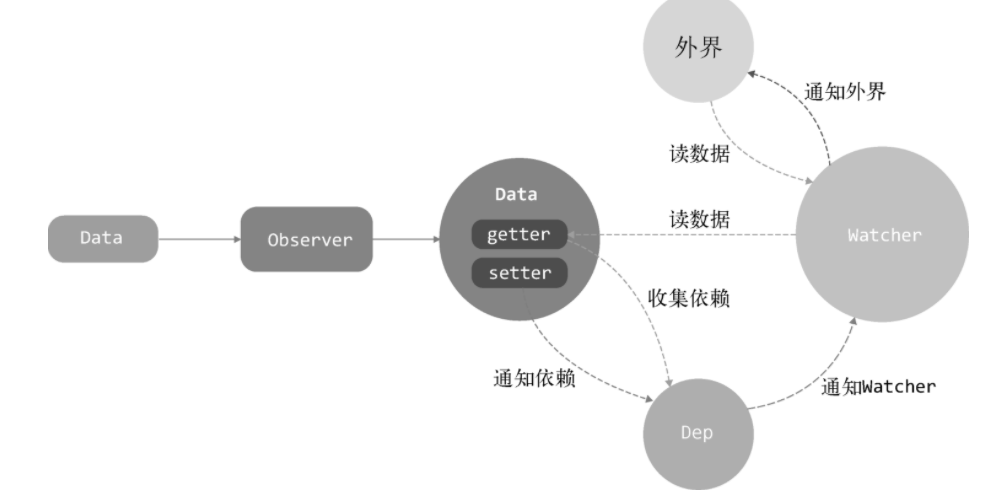

### 第 3 章 Array的变化侦测

- 数组的变化不会触发getter/setter

#### 3.1　如何追踪变化

- 使用自定义方法覆盖原生方法
- 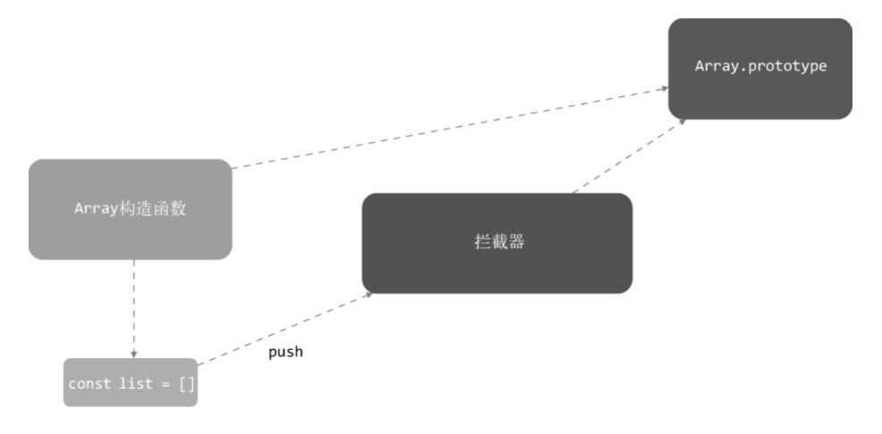

#### 3.2　拦截器

- 拦截器其实就是一个和Array.prototype一样的Object，里面包含的属性一模一样，不过方法需要进行一些处理

#### 3.3　使用拦截器覆盖Array原型

- 将一个数据转换成响应式的，需要通过Observer。将数组对象的\_\_proto\_\_指向自定义的拦截器
- 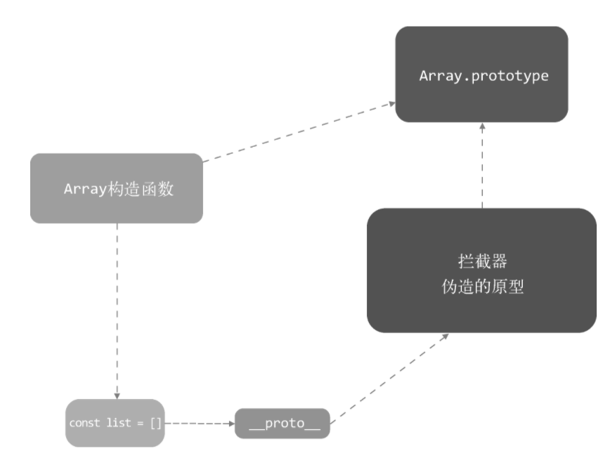

#### 3.4　将拦截器方法挂载到数组的属性上

- Vue的做法非常粗暴，如果不能使用 \_\_proto\_\_，就直接将arrayMethods身上的这些方法设置到被侦测的数组上

#### 3.5　如何收集依赖

- 也是使用getter

#### 3.6　依赖列表存在哪儿

- Vue.js把Array的依赖存放在Observer

#### 3.7　收集依赖

#### 3.8　在拦截器中获取Observer实例

- Array拦截器是对原型的一种封装，所以可以在拦截器中访问到this。通过在value上新增一个\_\_ob\_\_属性，指向Observer，就可以拿到dep

#### 3.9　向数组的依赖发送通知

- 在拦截方法里面就可以向依赖发送信息

#### 3.10　侦测数组中元素的变化

- 循环Array中的每一项，执行observe函数来侦测变化。前面介绍过observe函数，其实就是将数组中的每个元素都执行一遍new Observer，这很明显是一个递归的过程。

#### 3.11　侦测新增元素的变化

- 想要获取新增元素，我们需要在拦截器中对数组方法的类型进行判断。如果method是push、unshift、splice这种可以新增数组元素的方法，那么从args中将新增元素取出来，暂存在inserted中
- 可以在拦截器中通过this访问到 __ob__，然后调用 __ob__ 上的observeArray方法。因为Observer会将自身的实例附加到value的 __ob__ 属性上

#### 3.12　关于Array的问题

- 有些数组操作无法拦截到的，比如修改元素内容

### 第 4 章　变化侦测相关的API实现原理

####  4.1　vm.$watch

- ```javascript
  vm.$watch(expOrFn,callback,[options]);
  // 用于观察一个表达式或computed函数在Vue.js实例上的变化
  ```

- vm.$watch其实是对Watcher的一种封装，如果expOrFn不是函数会读取属性路径，当expOrFn是函数时，不仅可以动态返回数据，读取的所有数据也会被观察。

- Vue.js中计算属性（Computed）的实现原理与expOrFn支持函数有很大的关系

- unwatch实现是在wather中记录订阅的对象，遍历时候剔除掉。

- 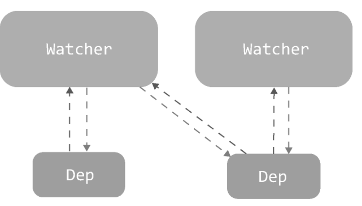

- options可以传入参数
  - deep参数 -- 除了要触发当前这个被监听数据的收集依赖的逻辑之外，还要把当前监听的这个值在内的所有子值都触发一遍收集依赖逻辑。

#### 4.2　vm.$set

- ```javascript
  vm.$set(target,key,value)
  // s在object上设置一个属性，如果object是响应式的，Vue.js会保证属性被创建后也是响应式的，并且触发视图更新。
  ```

- 是一个方法

  - 如果target是数组并且key是一个有效的索引值，就先设置length属性。是知道target位置并返回 val ，数组拦截器会侦测到 target 发生了变化。
  - 由于key已经存在于target中，所以其实这个key已经被侦测了变化。

- 处理新增的属性

  - 获取target的\_\_ob\_\_ 属性
  - this.$data就是根数据，对不是响应式的数据，添加上标记

#### 4.3　vm.$delete

- ```js
  vm.$delete(target,key)
  // 删除对象的属性。如果对象是响应式的，需要确保删除能触发更新视图
  ```

- vm.$delete方法也是为了解决变化侦测的缺陷，基本原理就是手动触发依赖。vm.$delete也不可以在Vue.js实例或Vue.js实例的根数据对象上使用。

- 最后，还要判断target是不是一个响应式数据

## 第二篇　虚拟DOM

### 第 5 章　虚拟DOM简介

#### 5.1　什么是虚拟DOM

- 早期web交互少，JQ足以应付。DOM操作频繁情况下，难以维护，需要用声明式来替代命令式。

- 本质上，我们将状态作为输入，并生成DOM输出到页面上显示出来，这个过程叫作渲染

  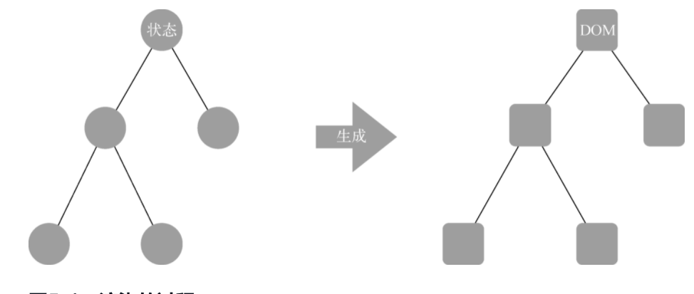
  - 渲染最简单粗暴方式 -- 删了重建，比较好的方案将变化的节点更新。

- 虚拟DOM的解决方式是通过状态生成一个虚拟节点树，然后使用虚拟节点树进行渲染。会使用新生成的虚拟节点树和旧的vnode树进行对比，只渲染不同的部分

#### 5.2　为什么要引入虚拟DOM

- Angular和React的变化侦测需要进行比较暴力的比对,React是通过虚拟DOM的比对，Angular是使用脏检查的流程。
- Vue.js的变化侦测在一定程度上知道具体哪些状态，这样就可以通过更细粒度的绑定来更新视图。
- Vue.js 2.0开始选择了一个中等粒度的解决方案，那就是引入了虚拟DOM。组件级别是一个watcher实例

#### 5.3　Vue.js中的虚拟DOM

- 使用模板来描述状态与DOM之间的映射关系。Vue.js通过编译将模板转换成渲染函数（render），执行渲染函数就可以得到一个虚拟节点树，使用这个虚拟节点树就可以渲染页面

  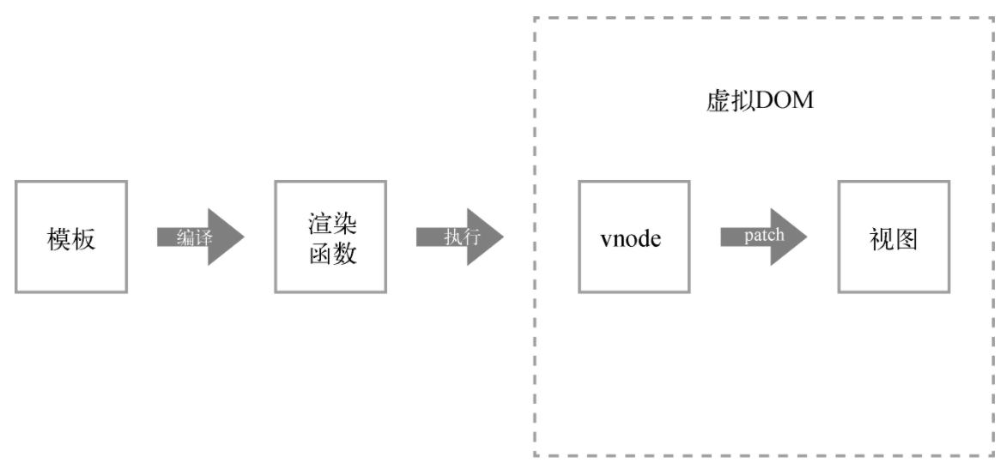

- 虚拟DOM主要做了两件事
  - 提供与真实DOM节点所对应的虚拟节点vnode。
  -  将虚拟节点vnode和旧虚拟节点oldVnode进行比对，然后更新视图。

### 第 6 章　VNode

#### 6.1　什么是VNode

- 在Vue.js中存在一个VNode类，使用它可以实例化不同类型的vnode实例，而不同类型的vnode实例各自表示不同类型的DOM元素。
  - vnode可以理解成节点描述对象，它描述了应该怎样去创建真实的DOM节点。
  - 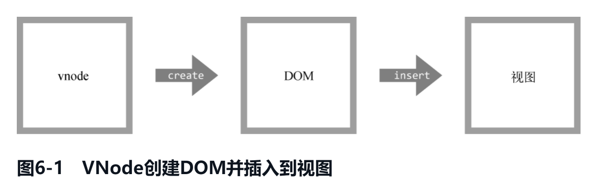

#### 6.2　VNode的作用

- 由于每次渲染视图时都是先创建vnode，然后使用它创建真实DOM插入到页面中，所以可以将上一次渲染视图时所创建的vnode缓存起来。
- Vue2使用的是组件级别，重新渲染整个组件十分浪费，所以只更新vnode节点就十分重要。

#### 6.3　VNode的类型

- 不同节点之间只是有效属性不同，无效属性设置为undefined或者false
- 注释节点 -- 只含有text和 isComment
- 文本节点 -- 只有text
- 克隆节点 -- 作用是优化静态节点和插槽节点
- 元素节点 
  - tag 节点名称/类型
  - data 节点数据，比如attrs/style等
  - children  子节点列表
  - context 当前组件的Vue.js实例

- 组件节点
  - componentOptions：顾名思义，就是组件节点的选项参数
  - componentInstance：组件的实例，也是Vue.js的实例
- 函数式组件 -- 函数式组件和组件节点类似，它有两个独有的属性functionalContext和functionalOptions。

#### 6.4　总结

- VNode是一个类，不同类型的实例只是可用属性不一样。
- 属性变化时候组件都要重新渲染，但是只需要更新组件变化的DOM节点，通过对比vnode。

### 第 7 章　patch

- 它可以将vnode渲染成真实的DOM。patch也可以叫作patching算法，通过它渲染真实DOM时，并不是暴力覆盖原有DOM，而是比对新旧两个vnode之间有哪些不同再增量更新。

#### 7.1　patch介绍

- patch的目的其实是修改DOM节点，也可以理解为渲染视图。需要对DOM进行处理：创建、删除、修改节点。
- 新增节点 -- 本质上是为了使用JavaScript的计算成本来换取DOM的操作成本。当首次渲染或者新旧节点完全不是同一个的时候。
- 删除节点 -- 新旧节点完全不是同一个的时候或者只在旧节点存在。
- 更新节点 -- 完全不同节点需要替换，属性不同则是更新。
- 

#### 7.2　创建节点

- 只有三种类型的节点会被创建并插入到DOM中：元素节点、注释节点和文本节点
  - 元素节点 -- 判断是否具有tag属性，调用createElement创建真实节点，调用父节点的appendChild方法。创建节点的时候需要递归创建子节点。
  - 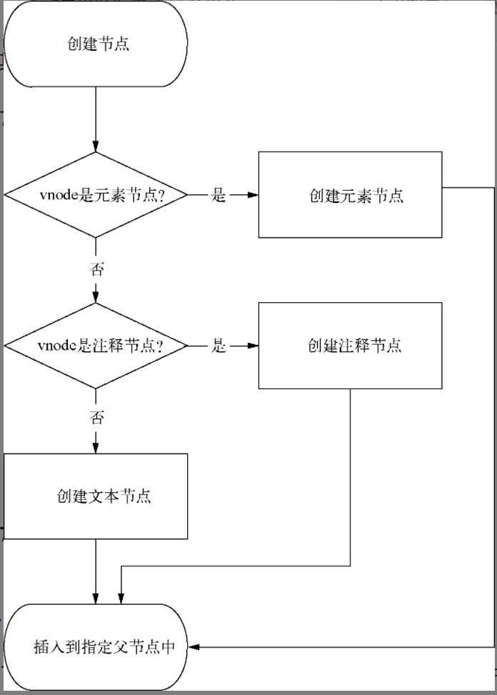

#### 7.3　删除节点

- 基本就是从父节点删除指定节点，涉及到跨平台渲染。

#### 7.4　更新节点

- 静态节点 -- 指的是渲染到界面上之后，无论日后状态如何变化，都不会发生任何变化的节点。
- 有text属性，直接调用setTextContent，更新以新创建的vnode为准，不关心旧节点 ，除非也是文本节点并且内容一致。
- 无text属性，可能带有子节点，需要更详细对对比更新 。没有子节点就把旧的节点清空。
- 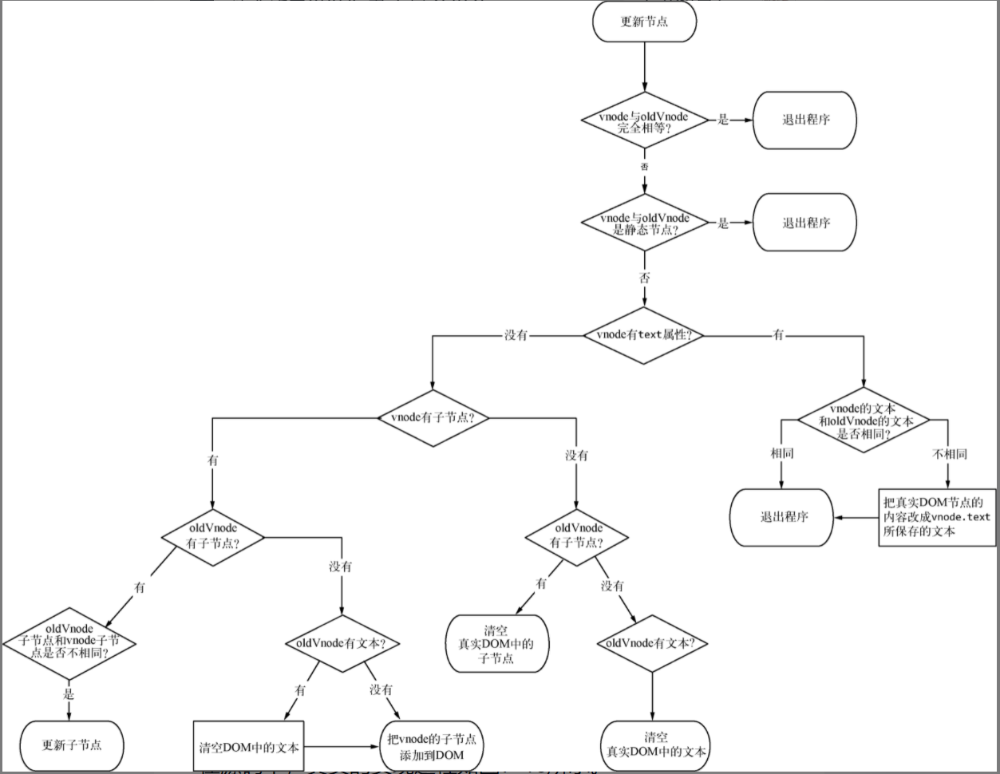

#### 7.5　更新子节点

- 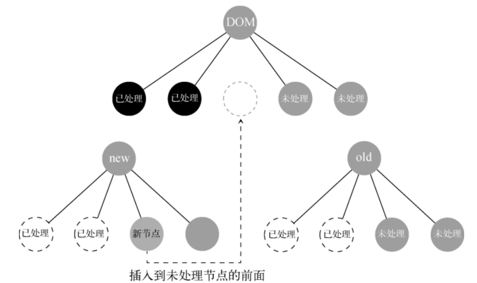

- 优化策略 -- 只需要尝试使用相同位置的两个节点来比对是否是同一个节点：如果恰巧是同一个节点，直接就可以进入更新节点的操作；如果尝试失败了，再用循环的方式来查找节点。
  - 提前对比未处理节点的首尾节点。
- 逻辑都是在循环体内处理的，所以只要让循环条件保证只有未处理过的节点才能进入循环体内。由于前后对比，所以可以使用两端向中间循环。

#### 7.6　总结

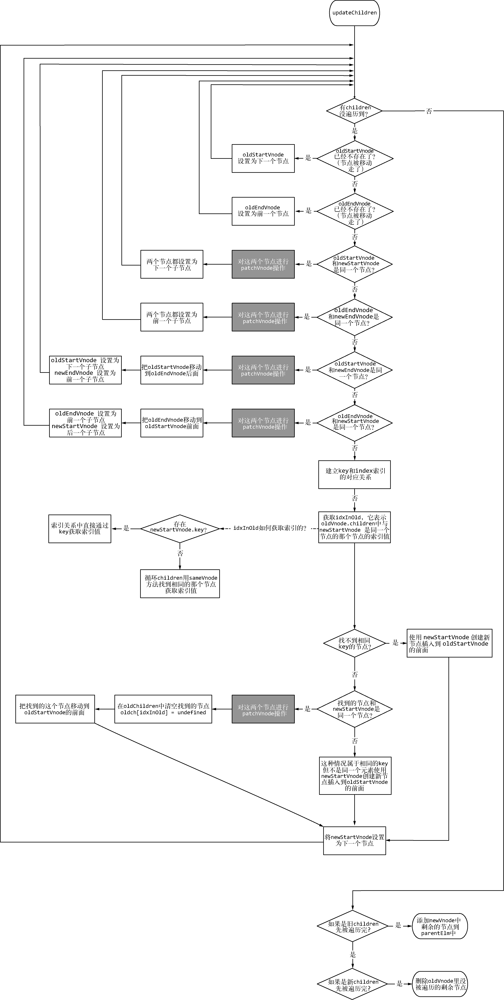

## 第三篇　模板编译原理

- 渲染函数是创建HTML最原始的方法。模板最终会通过编译转换成渲染函数，渲染函数执行后，会得到一份vnode用于虚拟DOM渲染。

### 第 8 章　模板编译

- 模板 → 模板编译 → 渲染函数 → vnode → 用户界面

#### 8.1　概念

#### 8.2　将模板编译成渲染函数

- 模板 → AST树 → 标记静态节点 → 渲染函数，三个箭头分别对应解析器，优化器，代码生成器
- 解析器 -- 使用主线将HTML、文本、过滤器解析器组合起来，主线主要监听HTML解析器，触发一次钩子函数就生成一个对应的AST节点。
- 优化器 -- 遍历树，标记静态节点。
- 代码生成器 -- 将AST转化为渲染函数的内容，可以称为代码字符串。里面有很多函数调用跟虚拟DOM操作相关。

### 第 9 章　解析器

#### 9.1　解析器的作用

#### 9.2　解析器内部运行原理

- 将模板解析为AST，AST节点是Javascript的一个对象，跟vnode一样，使用各种属性表示。
- 解析的时候会触发各种钩子函数，比如遇到标签头可以开始构建AST节点，利用tag，attrs等信息。利用栈来构造父子关系。

#### 9.3　HTML解析器

- 循环内部不断截取HTML字符串，进行解析处理，直至字符串截取完毕
- 截取开始标签
  - 利用正则截取以 \<  开头的，触发start钩子函数。
  - 解析标签属性
  - 解析自闭合标签，没有子节点
- 截取结束标签
  - 规则跟开始标签差不多，截取模板 触发钩子函数end
- 截取注释
  - 判断剩余HTML模板第一个字符是不是 \< ，
- 截取条件注释
  - 截取掉即可
- 截取DOCTYPE
  - 也是截取掉
- 截取文本 
  - 如果第一个字符不是 \< ，就是文本了。假如文本包含尖括号，可以通过语境判断是不是文本的一部分（也就是无法解析为标签）

- 纯文本内容元素的处理 -- script、style和textarea这三种元素叫作纯文本内容元素
  - 内容直接截取出来，并触发钩子函数。

- 使用栈维护DOM层级

#### 9.4　文本解析器

- vue可能用变量填充模板，在HTML解析器纯文本内容触发钩子函数chars，假如带有变量，会利用文本解析器二次加工。
- 里哟哦哦那个正则寻找双大括号，替换 拼接等 操作

### 第 10 章　优化器

- 作用是在AST中找出静态子树并打上标记。先标记所有静态节点，再标记静态根节点。

#### 10.1　找出所有静态节点并标记

- 判断规则比较多，基本就是保留标签不能用vue的命令、变量。标记完子节点需要校对当前节点

#### 10.2　找出所有静态根节点并标记

- 从上往下找第一个静态根节点就是了，一个元素节点只有一个文本节点不会被标记为静态根节点

### 第 11 章　代码生成器

- 代码字符串可以被包装在函数中执行，渲染函数其实是执行了createElement，而createElement可以创建一个VNode。

#### 11.1　通过AST生成代码字符串

- 递归实现，\_c:createElement，\_v:createTextVNode，\_e:createEmpthVNode

- 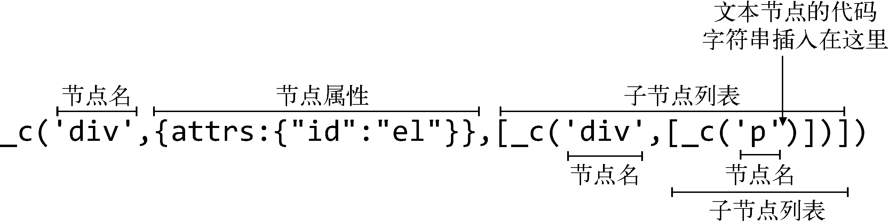

#### 11.2　代码生成器的原理

- 字符串拼接，当字符串拼接好后，会将字符串拼在with中返回给调用者。

## 第四篇　整体流程

### 第 12 章　架构设计与项目结构

#### 12.1　目录结构

- ```shell
  ├─scripts				#构建相关脚本和配置文件
  │  ├─dist				#构建后的文件
  │  │  ├─flow			#Flow类型声明 
  │  │  ├─packages		#vue render和compiler单独的NPM包发布
  │  │  ├─src				#源码
  │  │  │  └─compiler 	#编译相关代码
  │  │  │  └─core			#跨平台代代码
  │  │  │  	└─observer	#实现变化侦测代码
  │  │  │  	└─vdom		#虚拟DOM代码
  │  │  │  	└─instance	#Vue.js实例构造函数和原型方法
  │  │  │  	└─global-api
  │  │  │  	└─component
  │  │  ├─server			#服务器渲染相关
  │  │  ├─platforms
  │  │  ├─sfc				#单文件组件，.vue文件
  │  │  ├─shared
  │  ├─types				#TypeScript 类型定义
  │  │  └─test
  ```

- 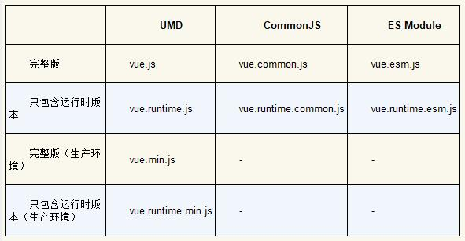

#### 12.2　架构设计

- 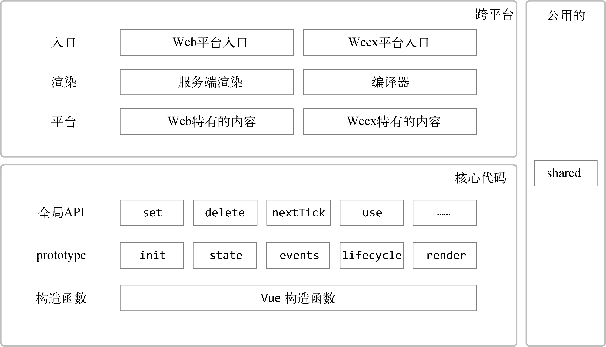

- 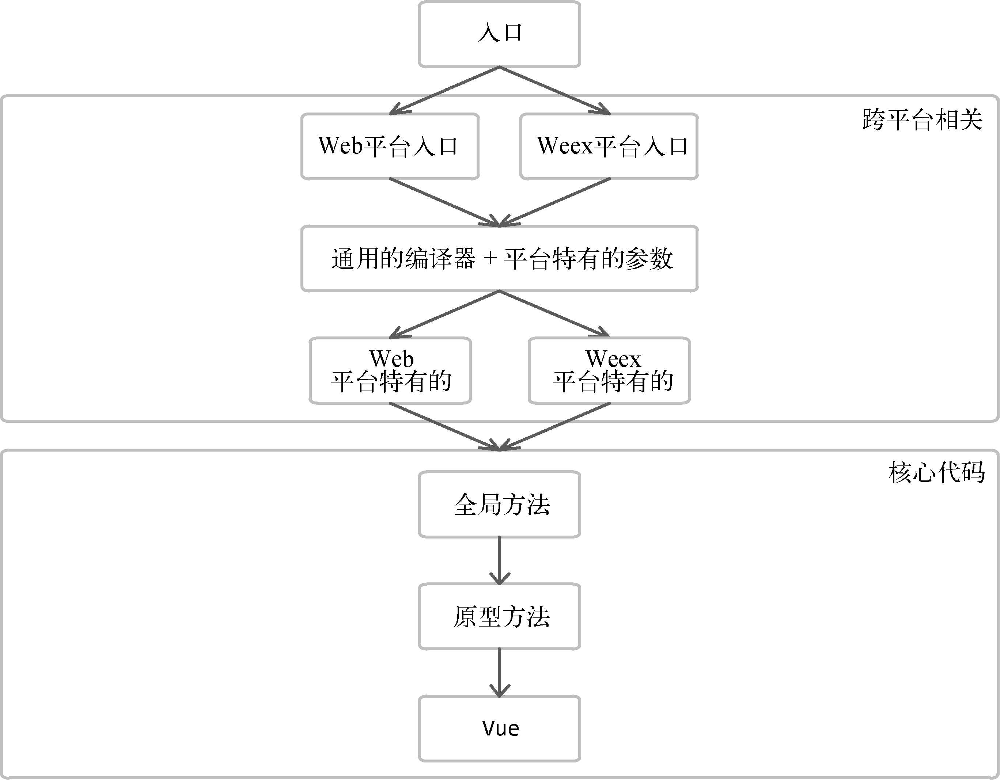

### 第 13 章　实例方法与全局API的实现原理

- 在Vue构造函数里，会调用 \_init()，然后分别调用五个方法，并将Vue构造函数传给 这些函数。主要是往Vue原型挂载方法

#### 13.1　数据相关的实例方法

- vm.$watch、vm.$set和vm.$delete，它们是在stateMixin中挂载到Vue的原型上的

#### 13.2　事件相关的实例方法

- vm.$on、vm.$once、vm.$off和vm.$emit。这4个方法是在eventsMixin中挂载到Vue原型 

- ```js
  vm.$on(event,callback)
  // 监听当前实例上的自定义事件，事件可以由vm.$emit触发。
  // 在注册事件时将回调函数收集起来，在触发事件时将收集起来的回调函数依次调用
  ```

- ```js
  vm.$off([event,callback])
  // 移除自定义事件监听器，从后往前遍历，避免影响
  ```

- ```js
  vm.$once(event,callback)
  // 监听一个自定义事件，但是只触发一次，在第一次触发之后移除监听器
  // 自定义事件触发后会执行拦截器，将事件移除
  ```

- ```js
  vm.$emit(event,[...args])
  // 触发当前实例上的事件。附加参数都会传给监听器回调。
  // 所有的事件监听器回调函数都会存储在vm._events中,依次执行列表中的监听器回调
  // 调用包在try-catch里面，如果配置了错误处理函数，发生错误时会调用
  ```

#### 13.3　生命周期相关的实例方法

- vm.$forceUpdate 迫使Vue.js实例重新渲染。注意它仅仅影响实例本身以及插入插槽内容的子组件。
  - 只需要执行实例watcher的update方法，就可以让实例重新渲染
  - 事实上，组件就是Vue.js实例，所以组件级别的watcher和Vue.js实例上的watcher说的是同一个watcher。
- vm.$destroy的作用是完全销毁一个实例，会清理该实例与其他实例的连接，并解绑其全部指令及监听器，同时会触发beforeDestroy和destroyed的钩子函数。
  - 为了防止反复执行 ，会对属性\_isBeingDestroyed进行判断。之后调用回调函数清理实例。
  - 清除联系只需要从父组件清除，子组件在不同父组件中是不同的Vue实例 。清除实例的监听状态，只需要执行vm._watcher.teardown() 。
  - 当执行new Vue() 时，在初始化的流程中，在this上添加一个 _watchers属性
  - 有趣的是，当vm.$destroy执行时，Vue.js不会将已经渲染到页面中的DOM节点移除，但会将模板中的所有指令解绑
- vm.$nextTick接收一个回调函数作为参数，它的作用是将回调延迟到下次DOM更新周期之后执行
  - vue有一个队列，当需要渲染时候会将watcher加入，在下一次事件循环触发。使用队列是因为渲染单位是组件，可以将状态都修改完一次渲染。
  - 事件循环 -- 主线程处理异步任务时候会挂起任务，任务处理完毕后将事件放入事件队列，等主线程任务都完成了，再执行队列任务。
  - JS先处理微任务，再处理一个宏任务，如此循环。如果想在vm.$nextTick中获取更新后的DOM，则一定要在更改数据的后面使用vm.$nextTick注册回调
  - 在一轮事件循环中，vm.$nextTick只会向任务队列添加一个任务，多次使用vm.$nextTick只会将回调添加到回调列表中缓存起来
  - 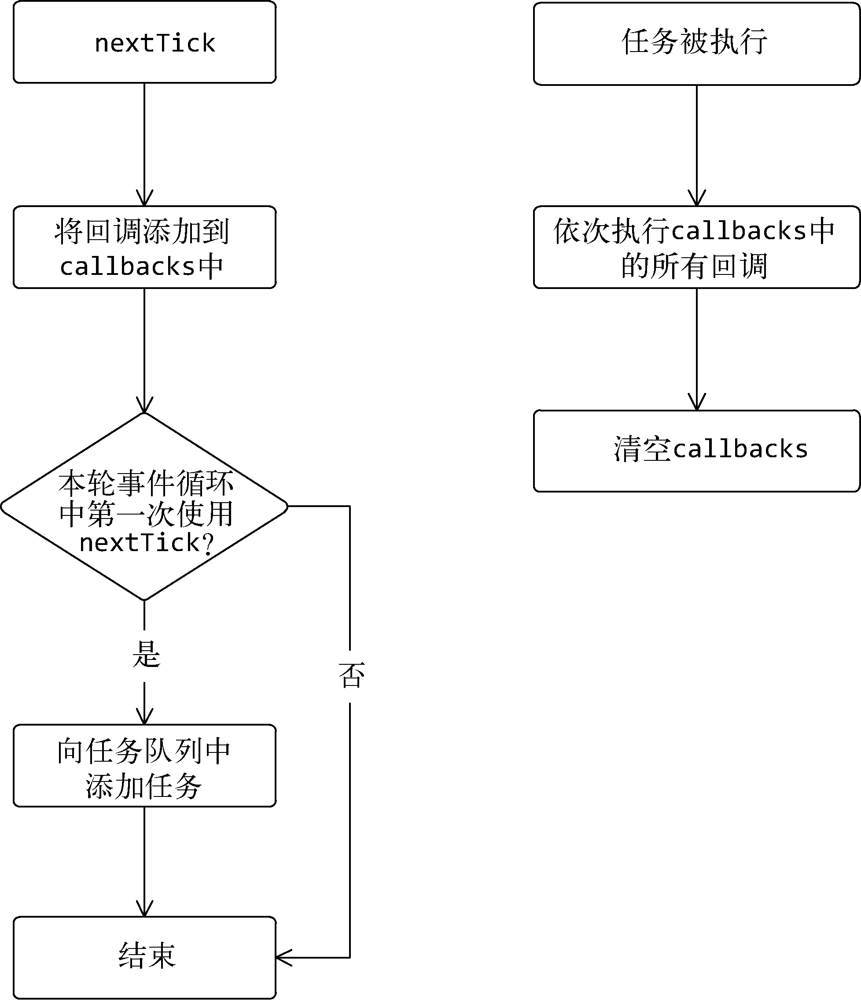

- vm.$mount并不常用这个方法，其原因是如果在实例化Vue.js时设置了el选项，会自动把Vue.js实例挂载到DOM元素上
  - 运行时版和 完整版 vue 实现会有差别。
  - 完整版，将Vue原型上的 $mount方法保存在mount，用一个新方法覆盖，方法中调用原始方法，称为函数劫持。
  - 首先判断Vue.js实例中是否存在渲染函数，只有不存在时，才会将模板编译成渲染函数。

#### 13.4　全局API的实现原理

- ```js
  Vue.extend(options)
  // 使用基础Vue构造器创建一个“子类”，其参数是一个包含“组件选项”的对象
  // shil全局API直接在Vue上挂载，实例方法在Vue.prototype挂载方法
  ```

  - 为了性能考虑，Vue.extend方法增加了缓存策略
  - 创建了一个Sub函数并继承了父级。如果直接使用Vue.extend，则Sub继承于Vue构造函数。

- ```js
  Vue.nextTick([callback,context])
  // 在下次DOM更新循环结束之后执行延迟回调，修改数据之后立即使用这个方法获取更新后的DOM。
  ```

- ```js
  Vue.set(target,key,value)
  // 设置对象的属性。如果对象是响应式的，确保属性被创建后也是响应式的，同时触发视图更新。这个方法主要用于避开Vue不能检测属性被添加的限制。
  ```

### 第 14 章　生命周期（略读，以后需要的话重新精读）

#### 14.1　生命周期图示

- 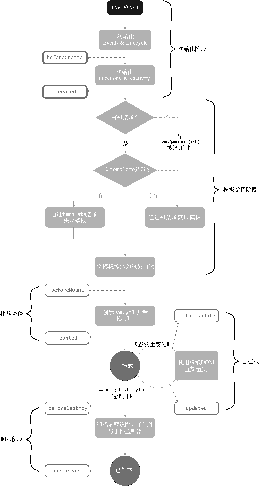

#### 14.2　从源码角度了解生命周期

- new Vue()
  - 初始化操作，Vue.js通过调用initMixin方法将\_init挂载到Vue构造函数的原型上
  - 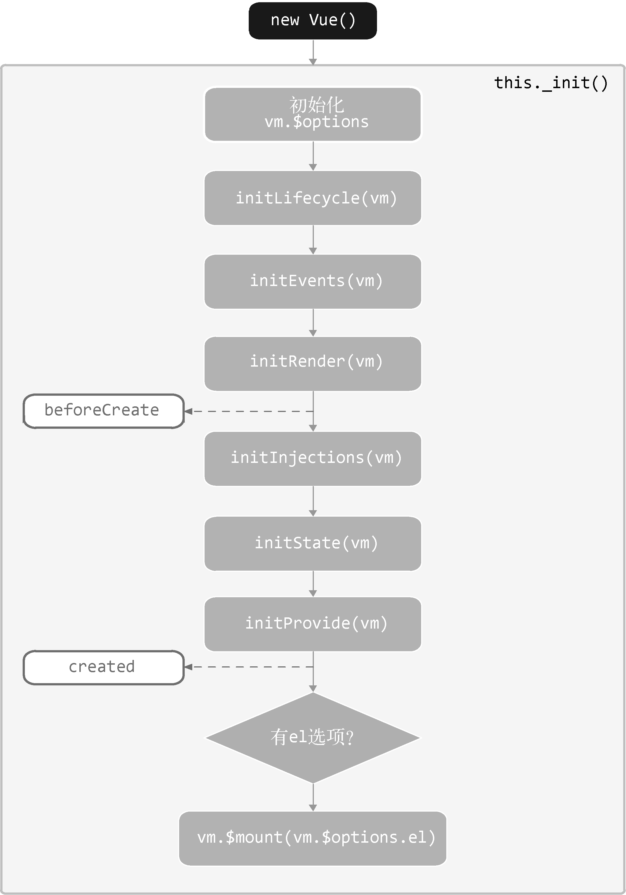

- callHook函数的内部原理
  - callHook的作用是触发用户设置的生命周期钩子，用户传入的options参数最终会与构造函数的options属性合并生成新的options并赋值到vm.$options属性中

#### 14.3　errorCaptured与错误处理

- 传播规则 
  -  所有错误都会发送给config.errorHandler
  - 如果继承链路存在多个errorCaptured钩子，逐个唤醒。如果再次发生错误，errorHandller捕捉
- Vue.js会捕获所有用户代码抛出的错误，然后会使用一个名叫handleError的函数来处理这些错误。

#### 14.4　初始化实例属性

- 以 $ 开头的属性是提供给用户使用的外部属性，以 _开头的属性是提供给内部使用的内部属性。

#### 14.5　初始化事件

- 初始化事件是指将父组件在模板中使用的v-on注册的事件添加到子组件的事件系统（Vue.js的事件系统）中。
  - 如果v-on写在组件标签上，那么这个事件会注册到子组件Vue.js事件系统中
  - 如果是写在平台标签上，例如div，那么事件会被注册到浏览器事件中。
- Vue.js的模板中支持事件修饰符，例如capture、once和passive等，如果我们在模板中注册事件时使用了事件修饰符，那么在模板编译阶段解析标签上的属性时，会将这些修饰符改成对应的符号加在事件名的前面

#### 14.6　初始化inject

- inject和provide通常是成对出现的，它们允许祖先组件向其所有子孙后代注入依赖，并在其上下游关系成立的时间里始终生效
- inject在data/props之前初始化，而provide在data/props后面初始化。初始化inject，就是使用inject配置的key从当前组件读取内容，读不到则读取它的父组件，以此类推。
- resolveInject的实现原理，读出用户在当前组件中设置的inject的key，然后循环key，将每一个key从当前组件起，不断向父组件查找是否有值，找到了就停止循环

#### 14.7　初始化状态

- 初始化具有顺序
- 初始化props
  - props会先规格化
  - 父组件提供数据，子组件通过props字段选择自己需要哪些内容，Vue.js内部通过子组件的props选项将需要的数据筛选出来之后添加到子组件的上下文中。
  - 会判断当前组件是否是根组件，如果不是，那么不需要将props数据转换成响应式数据。

- 初始化methods
  - 校验方法是否合法
  - 只需要循环选项中的methods对象，并将每个属性依次挂载到vm上即可
- 初始化data
  - data中的数据最终会保存到vm.\_data中。
  - 然后在vm上设置一个代理，使得通过vm.x可以访问到vm.\_data中的x属性。
  - 最后由于这些数据并不是响应式数据，所以需要调用observe函数将data转换成响应式数据
- 初始化computed
  - Vue.js内部的一个代理函数。在代理函数中可以结合Watcher实现缓存与收集依赖等功能。
  - 属性发生变化时，计算属性会将自身的Watcher的dirty属性设置为true
  - 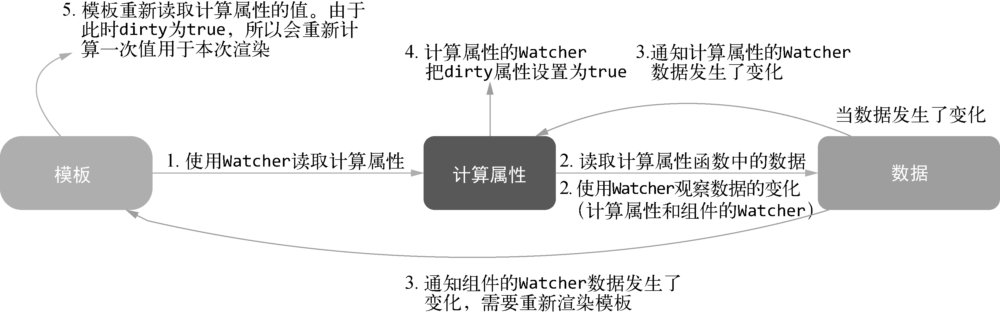

- 初始化watch
  - 只有当用户设置了watch选项并且watch选项不等于浏览器原生的watch时，才进行初始化watch的操作。
  - 只需要循环watch选项，将对象中的每一项依次调用vm.$watch方法来观察表达式或computed在Vue.js实例上的变化即可

- 初始化provide
  - provide选项应该是一个对象或者是返回一个对象的函数。该对象包含可注入其子孙的属性

### 第 15 章　指令的奥秘

#### 15.1　指令原理概述

- 在模板解析阶段，会将节点上的指令解析出来并添加到AST的directives属性

- v-if指令的原理 -- 模板编译的代码生成阶段实现，生成指定字符串
- v-on指令的作用是绑定事件监听器，事件监听器使用withMacroTask包了一层，并且如果v-on使用了once修饰符，那么会使用高阶函数createOnceHandler实现once的功能。

#### 15.2　自定义指令的内部原理

- 事件、指令、属性等相关处理逻辑只需要监听钩子函数，在钩子函数触发时执行相关处理逻辑即可实现功能。
- 无论哪个钩子函数被触发，最终都会执行一个叫作updateDirectives的函数。
- 通过normalizeDirectives函数将模板中使用的指令从用户注册的自定义指令集合中取出来。对比这两个新旧指令集合并触发对应的指令钩子函数，进行函数绑定。
- 最后，判断dirsWithInsert列表中是否有元素

#### 15.3　虚拟DOM钩子函数

- 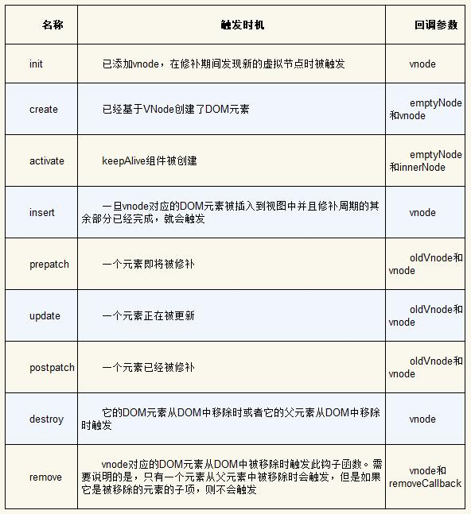

### 第 16 章　过滤器的奥秘

#### 16.1　过滤器原理概述

- 执行了capitalize过滤器函数并把message当作参数传递进去，接着将capitalize过滤器处理后的结果当作参数传递给toString函数。最终toString函数执行后的结果会保存到VNode中的text属性中
- 串联过滤器就是函数参数也是函数
- resolveFilter的内部原理
  - 查找id，驼峰化查找，首字母大写查找，沿着原型链查找
  - 注册全局过滤器和在组件的选项中定义本地的过滤器。

#### 16.2　解析过滤器

- 在解析出过滤器列表后，循环过滤器列表并拼接一个字符串即可

### 第 17 章　最佳实践

#### 17.1　为列表渲染设置属性key

- key这个特殊属性主要用在Vue.js的虚拟DOM算法中，在对比新旧虚拟节点时辨识虚拟节点。

#### 17.2　在v-if/v-if-else/v-else中使用key

#### 17.3　路由切换组件不变

- 导航守卫beforeRouteUpdate，组件生命周期不会在路由切换时候触发，但是该方法会。
- 观察 $route对象的变化，代价多了一个watch
- 为router-view组件添加属性key，取巧，“暴力”，每次切换都是新创建的

#### 17.4　为所有路由统一添加query

- 使用全局守卫beforeEach，并不具备修改query的能力，但可以在其中使用next方法来中断当前导航，并切换到新导航，添加一些新query进去。
- 使用函数劫持。通过拦截router.history.transitionTo方法，在vue-router内部在切换路由之前将参数添加到query中。

#### 17.5　区分Vuex与props的使用边界

- 在项目开发中，业务组件会使用Vuex维护状态，使用不同组件统一操作Vuex中的状态
- 对于通用组件，使用props以及事件进行父子组件间的通信

#### 17.6　避免v-if和v-for一起使用

#### 17.7　为组件样式设置作用域

- 可以通过scoped特性或CSS Modules来设置组件样式作用域。

#### 17.8　避免在scoped中使用元素选择器

- 使用类选择器

#### 17.9　避免隐性的父子组件通信

- 应该优先通过prop和事件进行父子组件之间的通信，而不是使用this.$parent或改变prop。
- 一个理想的Vue.js应用是“prop向下传递，事件向上传递”

#### 17.10　单文件组件如何命名

- 文件名单词首字母大写或者横线连接
- 组件命名统一的前后缀
- 单例组件名可以使用The开头
- 紧耦合的组件应该使用父组件名开头
- 形容性的单词放后头
- 完整单词组件名
- 组件名为多个单词
- 模板中的组件名大小写
- JS/JSX中的组件名大小写

#### 17.11　自闭合组件

- 在单文件组件、字符串模板和JSX中，没有内容的组件应该是自闭合的，但在DOM模板中永远不要这样做。

#### 17.12　prop名的大小写

- 其命名应该始终使用驼峰式命名规则，而在模板和JSX中应该始终使用横线连接的方式。

- 在JavaScript中更多使用驼峰式命名规则，而在HTML中则是横线连接的方式。

#### 17.13　多个特性的元素

- 多个特性的元素应该分多行撰写，每个特性一行

#### 17.14　模板中简单的表达式

- 组件模板应该只包含简单的表达式，复杂的表达式则应该重构为计算属性或方法。

#### 17.15　简单的计算属性

- 应该把复杂的计算属性分隔为尽可能多更简单的属性

#### 17.16　指令缩写

- 指令缩写（用:表示v-bind:、@表示v-on:）要保持统一。

#### 17.17　良好的代码顺序
