# Linux命令行与shell脚本编程大全

- [ ] 书籍作者: [[美]布鲁姆，布雷斯纳汉](https://book.douban.com/search/布鲁姆，布雷斯纳汉)
- [ ] 笔记时间: 2021.01.07

## 第一部分 Linux 命令行

### 第1章 初识Linux shell

#### 1.1 什么是 Linux

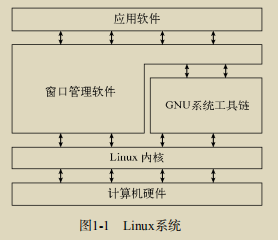

##### 1.1.1 深入探究 Linux 内核

Linux系统的核心是内核。内核控制着计算机系统上的所有硬件和软件，在必要时分配硬件，并根据需要执行软件。

1. 系统内存管理

   ​		物理内存和虚拟内存.内核通过硬盘上的存储空间来实现虚拟内存，这块区域称为交换空间（swap space）。

   ​		内核将每个内存页面放在物理内存或交换空间,内核不断地在交换空间和实际的物理内存之间反复交换虚拟内存中的内容.内核会记录哪些内存页面正在使用中，并自动把一段时间未访问的内存页面复制到交换空间区域（称为换出，swapping out）

2.  软件程序管理

   ​		内核创建了第一个进程（称为init进程）来启动系统上所有其他进程.放在虚拟内存里,任何新进程都是在虚拟内存分配.*/etc/init.d*管理启动进程

   ​		运行级为1,单用户模式(紧急情况);3标准情况;5图形化

3. 硬件设备管理

   ​		内核与设备交互需要驱动程序代码.可以通过编译进内核或者插入模块进行.硬件全都虚拟化为设备文件:

   ​	字符型: 终端,调制调节器等

   ​	块型: 硬盘等

   ​	网络: 网卡和特殊回环设备等

   每个设备都创建一种称为节点的特殊文件,通过节点进行通信,节点用 主设备号和次设备号进行标识

4. 文件系统管理

   Linux服务器所访问的所有硬盘都必须格式化成表1-1所列文件系统类型中的一种。Linux内核采用虚拟文件系统（Virtual File System，VFS）作为和每个文件系统交互的接口

   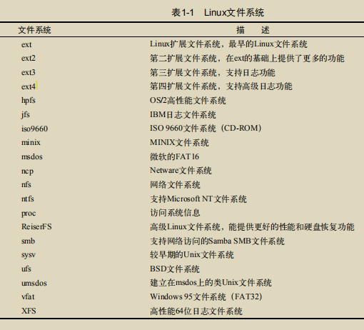

##### 1.1.2 GNU 工具

1. 核心GNU工具

   ​		供Linux系统使用的这组核心工具被称为coreutils.三部分构成(处理文本,操作文本,管理进程)

2. shell 

   ​		GNU/Linux shell是一种特殊的交互式工具。它为用户提供了启动程序、管理文件系统中的文件以及运行在Linux系统上的进程的途径.包含了一组内部命令,可以将多个shell命令放入文件中作为程序执行。这些文件被称作shell脚本(有很多种shell,默认bash)

##### 1.1.3 Linux 桌面环境

1. X Window系统
2. KDE桌面
3. GNOME桌面
4. Unity桌面
5. 其他桌面

#### 1.2 Linux 发行版

将完整的Linux系统包称为发行版。

##### 1.2.1 核心 Linux 发行版

核心Linux发行版含有内核、一个或多个图形化桌面环境以及预编译好的几乎所有能见到的Linux应用。它提供了一站式的完整Linux安装。

##### 1.2.2 特定用途的 Linux 发行版

它们通常基于某个主流发行版，但仅包含主流发行版中一小部分用于某种特定用途的应用程序。

##### 1.2.3 Linux LiveCD 

通过CD来启动PC，并且无需在硬盘安装任何东西就能运行Linux发行版。

### 第2章 走进shell

#### 2.1 进入命令行

shell所提供的文本命令行界面(CLI)

##### 2.1.1 控制台终端

Linux控制台,仿真了早期的硬接线控制台终端，而且是一种同Linux系统交互的直接接口

默认启动5-6个虚拟控制台

##### 2.1.2 图形化终端

可以使用Linux图形化桌面环境中的终端仿真包

#### 2.2 通过 Linux 控制台终端访问 CLI

通常使用Ctrl+Alt组合键配合F1或F7来进入图形界面

```shell
# 改变文本和背景颜色 --help可以进行更多设置
setterm -inversescreen on
```

#### 2.3 通过图形化终端仿真访问 CLI

GNOME Terminal、Konsole Terminal和xterm 默认安装,还有很多

介绍如何使用就pass,因为通常都是远程连接登录的

### 第3章 基本的bash shell命令

#### 3.1 启动 shell 

是作为普通程序运行的，通常是在用户登录终端时启动。登录时系统启动的shell依赖于用户账户的配置。

*/etc/passwd* 包含了所有系统用户账户列表以及每个用户的基本配置信息

#### 3.2 shell 提示符

#### 3.3 bash 手册

`man 命令名` 进行查看 ,完整版,每个内容区域都分配了一个数字，从1开始，一直到9(对应不同的内容级别)

`info 命令名` 进行查看

`man -k 关键字` 查询相关命令名

`-help` 进行查看,简单版

由分页程序(pager)进行显示,使用箭头前后翻滚,q退出

#### 3.4 浏览文件系统

##### 3.4.1 Linux 文件系统

Linux将文件存储在单个目录结构中，这个目录被称为虚拟目录（virtual directory）

在Linux PC上安装的第一块硬盘称为根驱动器。根驱动器包含了虚拟目录的核心，其他目录都是从那里开始构建的。Linux会在根驱动器上创建一些特别的目录，我们称之为挂载点（mount point）。挂载点是虚拟目录中用于分配额外存储设备的目录。

通常系统文件会存储在根驱动器中，而用户文件则存储在另一驱动器中

常见的目录名均基于文件系统层级标准（filesystem hierarchy standard，FHS）。

##### 3.4.2 遍历目录

cd pwd 相对/绝对路径

#### 3.5 文件和目录列表

##### 3.5.1 基本列表功能

`ls -F -R`区分目录和文件,递归进行

##### 3.5.2 显示长列表

-l 参数,描述信息

- 文件类型 -文件 d目录 c字符设备 b块设备
- 权限
- 硬链接总数

##### 3.5.3 过滤输出列表

?  \*  [ 可以用!排除 ]

#### 3.6 处理文件

###### 3.6.1 创建文件

`touch ` 会改变修改时间, `-a`只改变访问时间

`--time=atime` 显示访问时间

##### 3.6.2 复制文件

##### 3.6.3 制表键自动补全

##### 3.6.4 链接文件

虚拟的副本就称为链接,链接是目录中指向文件真实位置的占位符

- 符号链接

  ​		`ln -s`是一个实实在在的文件,指向存放在虚拟目录结构中某个地方的另一个文件(`ls -i`可以看出是不同的inode)

- 硬链接

  ​		`ln` 是同一个文件

##### 3.6.5 重命名文件 

##### 3.6.6 删除文件

#### 3.7 处理目录

##### 3.7.1 创建目录

##### 3.7.2 删除目录

`rm -r`方便

`rmdir` 目录要空

#### 3.8 查看文件内容

##### 3.8.1 查看文件类型

`file`

##### 3.8.2 查看整个文件

`cat -n` 	 `more` 	 `less`

##### 3.8.3 查看部分文件

`head`   	 `tail -f`可以实时更新	

### 第4章 更多的bash shell命令

#### 4.1 监测程序

##### 4.1.1 探查进程

`ps`支持3种不同类型的命令行参数 Unix风格 BSD风格 GNU风格

`-ef` 查看系统上运行的所有进程

`--forest`显示进程的层级信息

##### 4.1.2 实时监测进程

`top` 实时监控

- 第一部分系统概况

  - 第一行显示了当前时间、系统的运行时间、登录的用

    户数以及系统的平均负载(1,5,15min)

  - 第二行显示了进程概要信息——top命令的输出中将进程叫作任务（task）

  - 下一行显示了CPU的概要信息

键入f允许你选择对输出进行排序的字段，键入d允许你修改轮询间隔。键入q可以退出top

##### 4.1.3 结束进程

`kill pid` 信号9,直接杀死pid进程

`killall ` 可以杀死很多进程

#### 4.2 监测磁盘空间

##### 4.2.1 挂载存储媒体

在使用新的存储媒体之前，需要把它放到虚拟目录下。这项工作称为挂载（mounting）。

`mount` 输出以挂载的设备列表

`umount` 卸载

##### 4.2.2 使用 df 命令

`df -h`查看所有已挂载磁盘的使用情况

##### 4.2.3 使用 du 命令

`-c`：显示所有已列出文件总的大小

` -s`：显示每个输出参数的总计

#### 4.3 处理数据文件

##### 4.3.1 排序数据

`sort ` 排序 `-n`数字排序 `-k`指定排序段 `-t`指定分隔符 `-r`降序

##### 4.3.2 搜索数据

`grep pattern filename`

##### 4.3.3 压缩数据

gzip：用来压缩文件。

gzcat：用来查看压缩过的文本文件的内容。

gunzip：用来解压文件。

##### 4.3.4 归档数据

```shell
tar function [options] object1 object2 ...
```

### 第5章 理解shell

#### 5.1 shell 的类型

用户通常默认的是/bin/bash

另外一个默认shell是/bin/sh，它作为默认的系统shell，用于那些需要在启动时使用的系统shell脚本。

#### 5.2 shell 的父子关系

用于登录某个虚拟控制器终端或在GUI中运行终端仿真器时所启动的默认的交互shell，是一个父shell。

输入 bash 会创建新的shell(称为子shell),在生成子shell进程时，只有部分父进程的环境被复制到子shell环境中。

##### 5.2.1 进程列表

```shell
# 使用分号分隔,称为命令列表
pwd ; ls ; cd /etc ; pwd ; cd ; pwd ; ls
# 进程列表,会生成一个子shell执行
( pwd ; ls ; cd /etc ; pwd ; cd ; pwd ; ls)
# 命令分组,不会创建子shell
{ pwd ; ls ; cd /etc ; pwd ; cd ; pwd ; ls}
# 返回0就是没有子shell
echo $BASH_SUBSHELL
```

借助子shell可以实现多进程,但是不是真正多进程,终端控制子shell的IO

##### 5.2.2 别出心裁的子 shell 用法

1. 后台模式 `sleep 3000 &`  使用`jobs`可以查看后台任务,作业号和进程id

2. 将进程列表置入后台 `(cmd;cmd;)&`

3. 协程 它在后台生成一个子shell，并在这个子shell中执行命令

   `coproc cmd`

   协程: 对标用户级线程,用户可以自己控制切换

#### 5.3 理解 shell 的内建命令

##### 5.3.1 外部命令

为文件系统命令，是存在于bash shell之外的程序,通常位于/bin、/usr/bin、/sbin或/usr/sbin中。

使用`type`    `which`可以找到

外部命令执行时，会创建出一个子进程。这种操作被称为衍生（forking）。

##### 5.3.2 内建命令

不需要使用子进程来执行 cd 和 exit就是 `type`可以查看

`history` 可以使用	 `!!`执行最近的一条	 `!编号`执行特定历史纪录

`alias` 

### 第6章 使用Linux环境变量

#### 6.1 什么是环境变量

bash shell用一个叫作环境变量（environment variable）的特性来存储有关shell会话和工作环境的信息,分为全局变量和局部变量

##### 6.1.1 全局环境变量

局部变量则只对创建它们的shell可见。

`printenv`查看全局变量

`echo $HOME` 查看环境变量也可以作为参数

##### 6.1.2 局部环境变量

`set `设置局部变量

#### 6.2 设置用户定义变量

##### 6.2.1 设置局部用户定义变量

使用赋值符号即可 `变量名='变量值'`

在涉及用户定义的局部变量时坚持使用小写字母，这能够避免重新定义系统环境变量可能带来的灾难

##### 6.2.2 设置全局环境变量

`export`

#### 6.3 删除环境变量

`unset 变量名`

#### 6.4 默认的 shell 环境变量

#### 6.5 设置 PATH 环境变量

PATH环境变量定义了用于进行命令和程序查找的目录。

```shell
PATH=$PATH:/home/christine/Scripts
# 如果希望子shell也能找到你的程序的位置，一定要记得把修改后的PATH环境变量导出
```

#### 6.6 定位系统环境变量

默认情况下bash会在启动文件中查找命令,文件取决于启动bash的方式

##### 6.6.1 登录 shell 

-  /etc/profile 系统默认,登陆就会使用,迭代/etc/profile.d目录下所有文件

-  $HOME/.bash_profile 提供一个用户专属的启动文件来定义该用户所用到的环

   境变量,顺序从这往下

-  $HOME/.bashrc  该文件通常通过其他文件运行的

-  $HOME/.bash_login 

-  $HOME/.profile

##### 6.6.2 交互式 shell 进程

不会访问/etc/profile文件，只会检查用户HOME目录中的.bashrc文件。

.bashrc作用:

- 一是查看/etc目录下通用的bashrc文件
- 二是为用户提供一个定制自己的命令别名和私有脚本函数的地方

##### 6.6.3 非交互式 shell 

系统执行shell脚本时用的就是这种shell,BASH_ENV环境变量指定(默认不指定)

##### 6.6.4 环境变量持久化

最好是在/etc/profile.d目录中创建一个以.sh结尾的文件。把所有新的或修改过的全局环境变量设置放在这个文件中。

通常,存储个人用户永久性bash shell变量的地方是$HOME/.bashrc文件

但如果设置了BASH_ENV变量，那么记住，除非它指向的是$HOME/.bashrc，否则你应该将非交互式shell的用户变量放在别的地方。

##### 6.7 数组变量

不常用

```shell
mytest=(one two three four five)
echo $mytest # one
echo ${mytest[2]} # three,支持通配符*
```

### 第7章 理解Linux文件权限

#### 7.1 Linux 的安全性

Linux安全系统的核心是用户账户,用户权限是通过创建用户时分配的用户ID（User ID，通常缩写为UID）来跟踪的

##### 7.1.1 /etc/passwd 文件

系统账户，是系统上运行的各种服务进程访问资源用的特殊账户

所有运行在后台的服务都需要用一个系统用户账户登录到Linux系统上

Linux为系统账户预留了500以下的UID值

真正的密码并不在这里

##### 7.1.2 /etc/shadow 文件

只有root用户才能访问

##### 7.1.3 添加新用户

`useradd`

 `-D`可以查看默认值

`-m`创建HOME目录

系统会将/etc/skel目录下的内容复制到用户的HOME目录下

##### 7.1.4 删除用户

`userdel`只删除/etc/passwd文件中的用户信息

`-r`删除HOME目录

##### 7.1.5 修改用户

1. `usermod`

   用来修改/etc/passwd文件中的大部分字段,`-L`锁定账户 `-U`解锁

2. `passwd`和`chpasswd`

   后者可以批量修改,从文件读取kv键值对,冒号分割

3. `chsh`、`chfn`和`chage`

   chsh 改默认的用户登录shell

   chfn命令提供了在/etc/passwd文件的备注字段中存储信息的标准方法

   `finger`命令可以非常方便地查看Linux系统上的用户信息(很多都没有安装)

   chage命令用来帮助管理用户账户的有效期

#### 7.2 使用 Linux 组

##### 7.2.1 /etc/group 文件

用户组的GID则会从500开始分配

当一个用户在/etc/passwd文件中指定某个组作为默认组时，用户账户不会作为该组成员再出现在/etc/group文件中

##### 7.2.2 创建新组

`groupadd` 创建新组,使用 usermod 进行添加

如果加了`-g`选项，指定的组名会替换掉该账户的默认组,`-G`不会

##### 7.2.3 修改组

`groupmod`

#### 7.3 理解文件权限

##### 7.3.1 使用文件权限符

##### 7.3.2 默认文件权限

`umask 0022`命令用来设置所创建文件和目录的默认权限,第一位代表粘着位（sticky bit）,剩下是rwx

它不是对应权限码,而是掩码,需要减去才是真正的权限(文件全权限666,目录777)

#### 7.4 改变安全性设置

##### 7.4.1 改变权限

`chmod`

```shell
chmod o+r newfile
chmod 760 newfile
```

##### 7.4.2 改变所属关系

`chown`命令用来改变文件的属主，

`chgrp`命令用来改变文件的默认属组

#### 7.5 共享文件

Linux还为每个文件和目录存储了3个额外的信息位。

-  设置用户ID（SUID）：当文件被用户使用时，程序会以文件属主的权限运行。

-  设置组ID（SGID）：对文件来说，程序会以文件属组的权限运行；对目录来说，目录中创建的新文件会以目录的默认属组作为默认属组。

-  粘着位：进程结束后文件还驻留（粘着）在内存中。

SGID可通过chmod命令设置。它会加到标准3位八进制值之前（组成4位八进制值），或者在符号模式下用符号s。

### 第8章 管理文件系统

#### 8.1 探索 Linux 文件系统

##### 8.1.1 基本的 Linux 文件系统

1. ext文件系统

   ​		扩展文件系统（extended filesystem）,使用虚拟目录来操作硬件设备，在物理设备上按定长的块来存储数据。

   ​		采用名为索引节点的系统来存放虚拟目录中所存储文件的信息。索引节点系统在每个物理设备中创建一个单独的表（称为索引节点表）来存储这些文件的信息。存储在虚拟目录中的每一个文件在索引节点表中都有一个条目

   ​		Linux通过唯一的数值（称作索引节点号）来引用索引节点表中的每个索引节点，这个值是创建文件时由文件系统分配的。

2.  ext2文件系统

   ext2的索引节点表为文件添加了创建时间值、修改时间值和最后访问时间值,最大文件大小增加到了2 TB,ext2文件系统通过按组分配磁盘块来减轻碎片化

   

##### 8.1.2 日志文件系统

先将文件的更改写入到临时文件（称作日志，journal）中。在数据成功写到存储设备和索引节点表之后，再删除对应的日志条目。

| 方法     | 描述                                                         |
| -------- | ------------------------------------------------------------ |
| 数据模式 | 索引节点和文件都会被写入日志；丢失数据风险低，但性能差       |
| 有序模式 | 只有索引节点数据会被写入日志，但只有数据成功写入后才删除；<br />在性能和安全性之间取得了良好的折中 |
| 回写模式 | 只有索引节点数据会被写入日志，但不控制文件数据何时写入；丢失数据风险高，但仍比不用日志好 |


1. ext3文件系统

   ​		给每个存储设备增加了一个日志文件,默认有序模式,不支持加密,压缩等功能

2.  ext4文件系统

   ​		支持一个称作区段（extent）的特性,还引入了块预分配技术（block preallocation）

3.  Reiser文件系统

   ​		在线调整已有文件系统的大小；另一个是被称作尾部压缩（tailpacking）的技术，该技术能将一个文件的数据填进另一个文件的数据块中的空白空间

4. JFS文件系统

   ​		在用的最老的日志文件系统之一.

##### 8.1.3 写时复制文件系统

1. ZFS文件系统
2. Btrf文件系统

#### 8.2 操作文件系统

##### 8.2.1 创建分区

创建分区来容纳文件系统.`fdisk`工具用来帮助管理安装在系统上的任何存储设备上的分区

` fdisk /dev/sdb`

老式的IDE驱动器，Linux使用的是/dev/hdx (x代表字母)

SATA驱动器和SCSI驱动器，Linux使用/dev/sdx

主分区可以被文件系统直接格式化，可以通过创建一个扩展分区，然后在扩展分区内创建逻辑分区进行扩展

##### 8.2.2 创建文件系统

在将数据存储到分区之前，你必须用某种文件系统对其进行格式化

` mkfs.ext4 /dev/sdb1 `

下一步是将它挂载到虚拟目录下的某个挂载点

`mount -t ext4 /dev/sdb1 /mnt/my_partition`

要强制Linux在启动时自动挂载新的文件系统，可以将其添加到/etc/fstab文件

##### 8.2.3 文件系统的检查与修复

`fsck`命令能够检查和修复大部分类型的Linux文件系统

#### 8.3 逻辑卷管理

过将另外一个硬盘上的分区加入已有文件系统，动态地添加存储空间。Linux 逻辑卷管理器（logical volume manager，LVM）软件包正好可以用来做这个

##### 8.3.1 逻辑卷管理布局

逻辑卷管理的核心在于如何处理安装在系统上的硬盘分区.

硬盘称作物理卷（physical volume，PV）。每个物理卷都会映射到硬盘上特定的物理分区。

多个物理卷集中在一起可以形成一个卷组（volume group，VG）。

逻辑卷为Linux提供了创建文件系统的分区环境,Linux系统将逻辑卷视为物理分区。

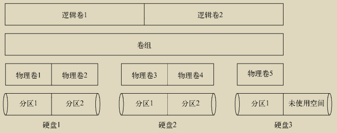

##### 8.3.2 Linux 中的 LVM 

允许你在Linux上用简单的命令行命令管理一个完整的逻辑卷管理环境。

1. 快照

   ​		最初的Linux LVM允许你在逻辑卷在线的状态下将其复制到另一个设备。这个功能叫作快 照。快照允许你在复制的同时，保证运行关键任务的Web服务器或数据库服务器继续工作。

   ​		LVM2允许你创建在线逻辑卷的可读写快照。有了可读写的快照，就可以删除原先的逻辑卷，  然后将快照作为替代挂载上。

2. 条带化

   ​		可跨多个物理硬盘创建逻辑卷。LVM条带化不同于RAID条带化。LVM条带化不提供用来创建容错环境的校验信息。

3. 镜像

   ​		镜像是一个实时更新的逻辑卷的完整副本。会降低写入性能

##### 8.3.3 使用 Linux LVM

1. 定义物理卷

   将硬盘上的物理分区转换成Linux LVM使用的物理卷区段 `fdisk t`

   下一步是用分区来创建实际的物理卷。这可以通过pvcreate命令来完成。pvcreate定义了用于物理卷的物理分区。

2. 创建卷组

   使用`vgcreate`命令

3. 创建逻辑卷

   `lvcreate`

4. 创建文件系统
运行完lvcreate命令之后，逻辑卷就已经产生了，但它还没有文件系统。你必须使用相应的命令行程序来创建所需要的文件系统

5. 修改LVM

### 第9章 安装软件程序

包管理系统（package management system，PMS）

#### 9.1 包管理基础 

PMS利用一个数据库来记录各种相关内容：已安装什么软件包,每个包安装什么文件,每个已安装的版本

软件包存储在服务器上,称服务器为仓库

PMS基础工具是dpkg和rpm。

#### 9.2 基于 Debian 的系统

dpkg命令是基于Debian系PMS工具的核心

- apt-get
- apt-cache
- aptitude

##### 9.2.1 用 aptitude 管理软件包

`aptitude show package_name` 显示某个特定包的详细信息

`dpkg -L package_name `所有跟某个特定软件包相关的所有文件的列表

##### 9.2.2 用 aptitude 安装软件包

`aptitude search package_name`

`aptitude install package_name`

##### 9.2.3 用 aptitude 更新软件

`aptitude safe-upgrade`

##### 9.2.4 用 aptitude 卸载软件

`aptitude purge wine `

##### 9.2.5 aptitude 仓库

具体位置存储在文件/etc/apt/sources. list中。

#### 9.3 基于 Red Hat 的系统

yum：在Red Hat和Fedora中使用。

urpm：在Mandriva中使用。

zypper：在openSUSE中使用。

##### 9.3.1 列出已安装包

`yum list installed `

`yum provides file_name `找出系统上的某个特定文件属于哪个软件包

##### 9.3.2 用 yum 安装软件

`yum install package_name`

`yum localinstall package_name.rpm `

##### 9.3.3 用 yum 更新软件

`yum update package_name`

##### 9.3.4 用 yum 卸载软件

`yum remove package_name`

##### 9.3.5 处理损坏的包依赖关系

某个包的软件依赖关系可能会被另一个包的安装覆盖掉。这叫作损坏的包依赖关系（broken dependency）

`yum clean all `

`yum deplist package_name`

`yum update --skip-broken`

##### 9.3.6 yum 软件仓库

`yum repolist `现在正从哪些仓库中获取软件

yum的仓库定义文件位于/etc/yum.repos.d。

#### 9.4 从源码安装

`./configure`

`make`

`make install`

### 第10章 使用编辑器

#### 10.1 vim 编辑器

##### 10.1.1 检查 vim 软件包

##### 10.1.2 vim 基础

vim编辑器在内存缓冲区中处理数据。

#### 10.2 nano 编辑器

#### 10.3 emacs 编辑器

#### 10.4 KDE 系编辑器

KWrite：单屏幕文本编辑程序。

Kate：功能全面的多窗口文本编辑程序

#### 10.5 GNOME 编辑器

## 第二部分　shell脚本编程基础

### 第11章 构建基本脚本

#### 11.1 使用多个命令

#### 11.2 创建 shell 脚本文件

```shell
#!/bin/bash 
#用哪个shell来运行脚本
./test.sh 	# 指定文件
chmod u+x test.sh	#可执行
```

#### 11.3 显示消息

`echo -n`实现同一行显示文本

#### 11.4 使用变量

`$HOME`就可以显示HOME环境变量,只要脚本在引号中出现美元符，它就会以为你在引用一个变量;可以使用 `\`进行转义

##### 11.4.2 用户变量

用户变量可以是任何由字母、数字或下划线组成的文本字符串，长度不超过20个。

赋值前后不能出现空格

##### 11.4.3 命令替换

使用 \`  和 $()

##### 11.5 重定向输入和输出

##### 11.5.1 输出重定向

`>`会覆盖,`>>`追加模式

##### 11.5.2 输入重定向

`<` 普通读入 `<<`内联输入重定向符号,无需使用文件进行重定向，只需要在命令行中指定用于输入重定向的数据就可以了

```txt
$ wc << EOF 
> test string 1 
> test string 2 
> test string 3 
> EOF
```

#### 11.6 管道

直接重定向到另一个命令。这个过程叫作管道连接（piping）。`|`

通常和 `more`配合

#### 11.7 执行数学运算

##### 11.7.1 expr 命令

十分麻烦

##### 11.7.2 使用方括号

`$[ operation ]`可以方便计算整数,也就整数

##### 11.7.3 浮点解决方案

1. bc的基本用法

   支持数字 变量 表达式 注释 函数等

2. 在脚本中使用bc

   `var1=$(echo "scale=4; 3.44 / 5" | bc) `

#### 11.8 退出脚本

每个命令都使用退出状态码（exit status）告诉shell它已经运行完毕

##### 11.8.1 查看退出状态码

`$?`

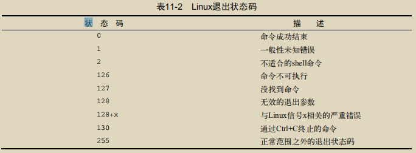

##### 11.8.2 exit 命令

脚本文件里面 `exit 5 `

### 第12章 使用结构化命令

#### 12.1 使用 if-then 语句

if语句会运行if后面的那个命令。如果该命令的退出状态码是0，位于then部分的命令就会被执行

记得以 `fi`结尾

#### 12.2 if-then-else 语句

#### 12.3 嵌套 if

可以使用 `elif`

#### 12.4 test 命令

if-then语句不能测试命令退出状态码之外的条件。

`test condition`检测成立时候退出状态码为0,简写为`[ condition ]`记得加上空格

可以检测 数值比较 字符串比较 文件比较

##### 12.4.1 数值比较

`n1 -eq n2`不能使用浮点数

##### 12.4.2 字符串比较

`str1 = str2` 大于号必须转义,否则认为重定向

##### 12.4.3 文件比较

检查文件/目录,可读写等

#### 12.5 复合条件测试

&& 和 || 连接两个判断条件

#### 12.6 if-then 的高级特性

##### 12.6.1 使用双括号

双括号命令允许你在比较过程中使用高级数学表达式。

`((表达式))`可以执行常见的逻辑运算,算数运算

##### 12.6.2 使用双方括号

`[[表达式]]` 双方括号命令提供了针对字符串比较的高级特性,支持模式匹配

#### 12.7 case 命令

```shell
case variable in 
pattern1 | pattern2) commands1;; 
pattern3) commands2;; 
*) default commands;; 
esac
```

### 第13章 更多的结构化命令

#### 13.1 for 命令

```shell
for var in list 
do 
 commands 
done
```

##### 13.1.1 读取列表中的值

`$var` 可以获取

##### 13.1.2 读取列表中的复杂值

使用转义字符（反斜线）来将单引号转义；

使用双引号来定义用到单引号的值。(区分部分与整体)

##### 13.1.3 从变量读取列表

字符串可以直接拼接双引号的字符串

```shell
list=$list"hello"
```

##### 13.1.4 从命令读取值

##### 13.1.5 更改字段分隔符

环境变量IFS，叫作内部字段分隔符（internal field separator）。IFS环境变量定义了bash shell用作字段分隔符的一系列字符。(默认 空格 制表符 换行)

`IFS=$'\n' `临时更改IFS

##### 13.1.6 用通配符读取目录

支持 \* 

#### 13.2 C 语言风格的 for 命令

##### 13.2.1 C 语言的 for 命令

```shell
for (( variable assignment ; condition ; iteration process ))
```

##### 13.2.2 使用多个变量

#### 13.3 while 命令

##### 13.3.1 while 的基本格式

```shell
while test command 
do 
 other commands 
done
```

##### 13.3.2 使用多个测试命令

每个测试命令都出现在单独的一行上

#### 13.4 until 命令

```shell
until test commands 
do
	other commands
done	
```

#### 13.5 嵌套循环

#### 13.6 循环处理文件数据

使用IFS和循环即可

#### 13.7 控制循环

`break` 可以使用 break n指定跳出的层级

`continue` 也支持层级

#### 13.8 处理循环的输出

done 之后可以添加重定向等操作

#### 13.9 实例

##### 13.9.1 查找可执行文件

```shell
#!/bin/bash 
# finding files in the PATH 
IFS=: 
for folder in $PATH 
do 
 echo "$folder:" 
 for file in $folder/* 
 do 
 if [ -x $file ] 
 then 
 echo " $file" 
 fi 
 done 
done
```

##### 13.9.2 创建多个用户账户

```shell
#!/bin/bash 
# process new user accounts 
input="users.csv" 
while IFS=',' read -r userid name 
do 
 echo "adding $userid" 
 useradd -c "$name" -m $userid 
done < "$input"
```

### 第14章 处理用户输入

#### 14.1 命令行参数

命令行参数允许在运行脚本时向命令行添加数据。

##### 14.1.1 读取参数

bash shell会将一些称为位置参数（positional parameter）的特殊变量分配给输入到命令行中的所有参数。$0-$9,${10}

##### 14.1.2 读取脚本名

$0,`$(basename $0) `可以获取脚本名,不包含全路径

##### 14.1.3 测试参数

使用之前要检测是否存在

#### 14.2 特殊参数变量

##### 14.2.1 参数统计

`$#` 命令行参数个数

` ${!#} `可以获取最后一个参数,没有参数就是脚本名

##### 14.2.2 抓取所有的数据

`$*`和`$@`变量可以用来轻松访问所有的参数。前者当成一个单词,后者不是

#### 14.3 移动变量

使用`shift`命令时，默认情况下它会将每个参数变量向左移动一个位置.($0不变,$1会被覆盖)

`shift n`一次移动多个

#### 14.4 处理选项

##### 14.4.1 查找选项

1. 处理简单选项

   ```shell
   while [ -n "$1" ] 
   do 
    case "$1" in 
    -a) echo "Found the -a option" ;; 
    -b) echo "Found the -b option" ;; 
    -c) echo "Found the -c option" ;; 
    *) echo "$1 is not an option" ;; 
    esac 
    shift 
   done
   ```

2. 分离参数和选项

   ```shell
   while [ -n "$1" ] 
   do 
    case "$1" in 
    -a) echo "Found the -a option" ;; 
    -b) echo "Found the -b option";; 
    -c) echo "Found the -c option" ;; 
    --) shift 
    break ;; 
    *) echo "$1 is not an option";; 
    esac 
    shift 
   done
   ```

3. 处理带值的选项

   利用shift 和 $1 $2即可

##### 14.4.2 使用 getopt 命令

1. 命令的格式

   `getopt optstring parameters`

   在optstring中列出你要在脚本中用到的每个命令行选项字母。然后，在每个需要参数值的选项字母后加一个冒号

2. 在脚本中使用getopt

   set命令的选项之一是双破折线（--），它会将命令行参数替换成set命令的命令行值。

   `set -- $(getopt -q ab:cd "$@") `

不擅长空格处理

##### 14.4.3 使用更高级的 getopts

getopts命令能够和已有的shell参数变量配合默契。每次处理一个参数,完成后返回一个大于零的状态码

格式同getopt

getopts命令会用到两个环境变量。如果选项需要跟一个参数值，OPTARG环境变量就会保存这个值。OPTIND环境变量保存了参数列表中getopts正在处理的参数位置。

```shell
echo 
while getopts :ab:c opt 
do 
 case "$opt" in 
 a) echo "Found the -a option" ;; 
 b) echo "Found the -b option, with value $OPTARG";; 
 c) echo "Found the -c option" ;; 
 *) echo "Unknown option: $opt";; 
 esac 
done
```

#### 14.5 将选项标准化

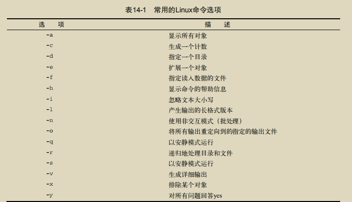

#### 14.6 获得用户输入

##### 14.6.1 基本的读取

read命令从标准输入（键盘）或另一个文件描述符中接受输入。之后放入一个变量

不指定变量就会放入REPLY里面

`-p`指定提示文本

##### 14.6.2 超时

`-t`指定超时秒数,不是一直等待

`-n1`指定接收单个字符

##### 14.6.3 隐藏方式读取

`-s`隐藏读取

##### 14.6.4 从文件中读取

最常见的方法是对文件使用cat命令，将结果通过管道直接传给含有read命令的while命令。

### 第15章 呈现数据

#### 15.1 理解输入和输出

##### 15.1.1 标准文件描述符

Linux用文件描述符（file descriptor）来标识每个文件对象。每个进程一次最多可以有九个文件描述符。前三个保留(012分别是标准输入,标准输出,错误输出)

1. STDIN

   标准是键盘,`<`会重定向替换标准输入

2. STDOUT

   显示器

3. STDERR

   默认显示器

##### 15.1.2 重定向错误

1. 只重定向错误

   `2> filename`

2. 重定向错误和数据

   `&> file`同一个位置

   `1> file1 2>file2`不同位置

#### 15.2 在脚本中重定向输出

##### 15.2.1 临时重定向

`echo "This is an error message" >&2 `

##### 15.2.2 永久重定向

`exec 1>testout`

#### 15.3 在脚本中重定向输入

`exec 0< testfile `

#### 15.4 创建自己的重定向

##### 15.4.1 创建输出文件描述符

```shell
exec 3>>test13out 
echo "This should display on the monitor" 
echo "and this should be stored in the file" >&3
```

##### 15.4.2 重定向文件描述符

```shell
exec 3>&1 
exec 1>test14out 
echo "This should store in the output file" 
echo "along with this line."
exec 1>&3 
echo "Now things should be back to normal"
```

#####  	15.4.3 创建输入文件描述符

```SHELL
exec 6<&0 
exec 0< testfile
exec 0<&6
```

##### 15.4.4 创建读写文件描述符

```shell
exec 3<> testfile 
read line <&3
```

##### 15.4.5 关闭文件描述符

`exec 3>&- `

#### 15.5 列出打开的文件描述符

`lsof`命令会列出整个Linux系统打开的所有文件描述符。

最常用的有`-p`和`-d`，前者允许指定进程ID（PID），后者允许指定要显示的文件描述符编号。

要想知道进程的当前PID，可以用特殊环境变量`$$`（shell会将它设为当前PID）。

`-a`选项用来对其他两个选项的结果执行布尔AND运算

#### 15.6 阻止命令输出

重定向到 /dev/null

#### 15.7 创建临时文件

大多数Linux发行版配置了系统在启动时自动删除/tmp目录的所有文件。

`mktemp`命令可以在/tmp目录中创建一个唯一的临时文件

##### 15.7.1 创建本地临时文件

要用mktemp命令在本地目录中创建一个临时文件，你只要指定一个文件名模板就行了。模板可以包含任意文本文件名，在文件名末尾加上6个X就行了。

`mktemp testing.XXXXXX`

```shell
tempfile=$(mktemp test19.XXXXXX) 
exec 3>$tempfile
```

##### 15.7.2 在/tmp 目录创建临时文件

`-t`强制创建,返回全路径

##### 15.7.3 创建临时目录

`-d`创建临时目录

#### 15.8 记录消息

`tee`将输出同时发送到显示器和日志文件

`-a`追加模式

#### 15.9 实例

```shell
#!/bin/bash 
# read file and create INSERT statements for MySQL 
outfile='members.sql' 
IFS=',' 
while read lname fname address city state zip 
do 
 cat >> $outfile << EOF 
 INSERT INTO members (lname,fname,address,city,state,zip) VALUES 
('$lname', '$fname', '$address', '$city', '$state', '$zip'); 
EOF 
done < ${1} 
$
```

### 第16章 控制脚本

#### 16.1 处理信号

Linux利用信号与运行在系统中的进程进行通信。

##### 16.1.1 重温 Linux 信号

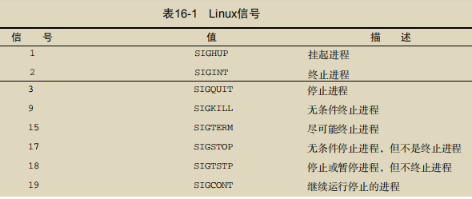

##### 16.1.2 生成信号

1. 中断进程

   Ctrl+C组合键会生成SIGINT信号，并将其发送给当前在shell中运行的所有进程。

2. 暂停进程

   Ctrl+Z组合键会生成一个SIGTSTP信号，停止shell中运行的任何进程。

##### 16.1.3 捕获信号

`trap`命令允许你来指定shell脚本要监看并从shell中拦截的Linux信号。

```shell
trap commands signals
trap "echo ' Sorry! I have trapped Ctrl-C'" SIGINT
```

##### 16.1.4 捕获脚本退出

只要在trap命令后加上EXIT信号就行。

##### 16.1.5 修改或移除捕获

只需重新使用带有新选项的trap命令。

`trap -- SIGINT `删除已设置好的捕获

#### 16.2 以后台模式运行脚本

后台模式中，进程运行时不会和终端会话上的STDIN、STDOUT以及STDERR关联

##### 16.2.1 后台运行脚本

`命令&`,但是依旧会占用STDOUT以及STDERR,最好重定向

##### 16.2.2 运行多个后台作业

如果终端会话退出，那么后台进程也会随之退出。

#### 16.3 在非控制台下运行脚本

nohup命令运行了另外一个命令来阻断所有发送给该进程的SIGHUP信号。这会在退出终端会话时阻止进程退出。

`nohup ./test1.sh &`默认重定向到 nohub.out文件

如果使用nohup运行了另一个命令，该命令的输出会被追加到已有的nohup.out文件中

#### 16.4 作业控制

启动、停止、终止以及恢复作业的这些功能统称为作业控制。

##### 16.4.1 查看作业

`jobs`带加号的作业会被当做默认作业。带减号的作业成为下一个默认作业。

##### 16.4.2 重启停止的作业

因为该作业是默认作业（从加号可以看出），只需要使用`bg`命令就可以将其以后台模式重启。

如果有多个作业，你得在bg命令后加上作业号

要以前台模式重启作业，可用带有作业号的fg命令。

#### 16.5 调整谦让度

在多任务操作系统中（Linux就是），内核负责将CPU时间分配给系统上运行的每个进程。

调度优先级是个整数值，从-20（最高优先级）到+19（最低优先级）。默认情况下，bash shell以优先级0来启动所有进程。

##### 16.5.1 nice 命令

`nice`命令允许你设置命令启动时的调度优先级。要让命令以更低的优先级运行，只要用nice的-n命令行来指定新的优先级级别。

必须将nice命令和要启动的命令放在同一行中。

nice命令的-n选项并不是必须的，只需要在破折号后面跟上优先级就行了。

##### 16.5.2 renice 命令

允许你指定运行进程的PID来改变它的优先级。

#### 16.6 定时运行作业

##### 16.6.1 用 at 命令来计划执行作业

`at`命令会将作业提交到队列中，指定shell何时运行该作业。at的守护进程atd会以后台模式运行，检查作业队列来运行作业。

atd守护进程会检查系统上的一个特殊目录（通常位于/var/spool/at）来获取用at命令提交的作业。默认情况下，atd守护进程会每60秒检查一下这个目录。

1. at命令的格式

   `at [-f filename] time`

   针对不同优先级，存在26种不同的作业队列。作业队列通常用小写字母a\~z和大写字母A\~Z来指代。

2. 获取作业的输出

   Linux系统会将提交该作业的用户的电子邮件地址作为STDOUT和STDERR。

   最好在脚本中对STDOUT和STDERR进行重定向

3. 列出等待的作业

   `atq`命令可以查看系统中有哪些作业在等待。

4. 删除作业

   `atrm`命令来删除等待中的作业

##### 16.6.2 安排需要定期执行的脚本

cron程序会在后台运行并检查一个特殊的表（被称作cron时间表），以获知已安排执行的作业。

1. cron时间表

   `min hour dayofmonth month dayofweek command `

2. 构建cron时间表

   `crontab`命令来处理cron时间表

   `-l`列出时间表`-e`添加

3. 浏览cron目录

   有4个基本目录：hourly、daily、monthly和weekly。(在 /etc/cron.*ly)

   脚本放到目录下就会自动运行

4. anacron程序

   如果anacron知道某个作业错过了执行时间，它会尽快运行该作业。

   anacron程序只会处理位于cron目录的程序，比如/etc/cron.monthly。

##### 16.6.3 使用新 shell 启动脚本

每次启动一个新shell时，bash shell都会运行.bashrc文件。

## 第三部分　高级shell 脚本编程

### 第17章 创建函数

#### 17.1 基本的脚本函数

##### 17.1.1 创建函数

```shell
function name { 
 commands 
}
# 两种都可以
name() { 
	commands 
}
```

##### 17.1.2 使用函数

指定函数名即可

#### 17.2 返回值

bash shell会把函数当作一个小型脚本，运行结束时会返回一个退出状态码

##### 17.2.1 默认退出状态码

默认情况下，函数的退出状态码是函数中最后一条命令返回的退出状态码。

可以用标准变量$?来确定函数的退出状态码

##### 17.2.2 使用 return 命令

return命令允许指定一个整数值来定义函数的退出状态码(退出状态码必须是0~255。超过取模255)

##### 17.2.3 使用函数输出

`val=$(fun1)`

#### 17.3 在函数中使用变量

##### 17.3.1 向函数传递参数

`func1 $value1 10 `执行方式,获取就用$1之类的就可以

##### 17.3.2 在函数中处理变量

1. 全局变量

   脚本里面都是

2. 局部变量

   函数内部可以使用 `local var1`

#### 17.4 数组变量和函数

##### 17.4.1 向函数传数组参数

```shell
function testit { 
 local newarray 
 newarray=(;'echo "$@"') 
 echo "The new array value is: ${newarray[*]}" 
} 

myarray=(1 2 3 4 5) 
testit ${myarray[*]}
```

##### 17.4.2 从函数返回数组

函数用echo语句来按正确顺序输出单个数组值，然后脚本再将它们重新放进一个新的数组变量中。

#### 17.5 函数递归

局部变量自成体系

#### 17.6 创建库

第一步是创建一个包含脚本中所需函数的公用库文件

第二步是在用到这些函数的脚本文件中包含myfuncs库文件。

​	source命令会在当前shell上下文中执行命令，而不是创建一个新shell。source命令有个快捷的别名，称作点操作符（dot operator）`. ./myfuncs`

#### 17.7 在命令行上使用函数

##### 17.7.1 在命令行上创建函数

1. 直接单行定义,需要加分号
2. 多行,直接回车即可

##### 17.7.2 在.bashrc 文件中定义函数

1. 直接定义函数

2. 读取函数文件

#### 17.8 实例

##### 17.8.1 下载及安装

ftp://ftp.gnu.org/gnu/shtool/shtool-2.0.8.tar.gz

##### 17.8.2 构建库

配置工作必须使用标准的configure和make命令

##### 17.8.3 shtool 库函数

##### 17.8.4 使用库

### 第18章 图形化桌面环境中的脚本编程

#### 18.1 创建文本菜单

shell脚本菜单的核心是case命令

##### 18.1.1 创建菜单布局

`echo -e "1.\tDisplay disk space" ` 显示制表符等

##### 18.1.2 创建菜单函数

通常我们会为还没有实现的函数先创建一个桩函数（stub function）。桩函数是一个空函数，或者只有一个echo语句，说明最终这里里需要什么内容。

##### 18.1.3 添加菜单逻辑

##### 18.1.4 整合 shell 脚本菜单

##### 18.1.5 使用 select 命令

`select`命令只需要一条命令就可以创建出菜单，然后获取输入的答案并自动处理。

```shell
select variable in list 
do 
 commands 
done
```

list参数是由空格分隔的文本选项列表，这些列表构成了整个菜单。

#### 18.2 制作窗口

dialog包能够用ANSI转义控制字符在文本环境中创建标准的窗口对话框。

##### 18.2.1 dialog 包

`dialog --widget parameters` 会使用退出状态码和STDERR

1. msgbox部件

   `dialog --msgbox text height width`在窗口中显示一条简单的消息

2. yesno部件

   `dialog --title "Please answer" --yesno "Is this thing on?" 10 20 `

3. inputbox部件

   `dialog --inputbox "Enter your age:" 10 20 2>age.txt`

4. textbox部件

   `dialog --textbox /etc/passwd 15 45`

5. menu部件

   ```shell
   dialog --menu "Sys Admin Menu" 20 30 10 1 "Display disk space" 
   2 "Display users" 3 "Display memory usage" 4 "Exit" 2> test.txt
   ```

6. fselect部件

   `dialog --title "Select a file" --fselect $HOME/ 10 50 2>file.txt `

##### 18.2.2 dialog 选项

##### 18.2.3 在脚本中使用 dialog 命令

#### 18.3 使用图形

##### 18.3.1 KDE 环境

KDE图形化环境默认包含kdialog包。

1. kdialog部件

   `kdialog display-options window-options arguments `

2. 使用kdialog

   窗口部件用STDOUT来输出值

##### 18.3.2 GNOME 环境

zenity是大多数GNOME桌面Linux发行版上最常见的包( gdialog是兼容旧的代码)

1. zenity部件

2. 在脚本中使用zenity

### 第19章 初识sed 和gawk

#### 19.1 文本处理

自动处理文本文件

##### 19.1.1 sed 编辑器

sed编辑器被称作流编辑器（stream editor），和普通的交互式文本编辑器恰好相反

`sed options script file`

如果需要用多个命令，要么使用-e选项在命令行中指定，要么使用-f选项在单独的文件中指定。

1. 在命令行定义编辑器命令

   ```shell
    echo "This is a test" | sed 's/test/big test/'
   #  进行替换
   ```

   sed编辑器并不会修改文本文件的数据

2. 在命令行使用多个编辑器命令

   ```shell
    sed -e 's/brown/green/; s/dog/cat/' data1.txt
   ```

3. 从文件中读取编辑器命令

   ```shell
    sed -f script1.sed data1.txt
   ```

##### 19.1.2 gawk 程序

1. gawk命令格式

   `gawk options program file`

2. 从命令行读取程序脚本

   必须将脚本命令放到两个花括号（{}）中,` gawk '{print "Hello World!"}' `

   Ctrl+D组合键会在bash中产生一个EOF字符

3. 使用数据字段变量

   $0代表整个文本行；$n代表第n个数据字段;分隔符默认空白字符

   `-F` 指定分隔符

4. 在程序脚本中使用多个命令

   ```shell
    echo "My name is Rich" | gawk '{$4="Christine"; print $0}'
   ```

5. 从文件中读取程序

   `-f`指定文件

6. 在处理数据前运行脚本

   ```shell
   # BEGIN 会强制执行
   $ gawk 'BEGIN {print "Hello World!"}
   > {print $0}' data3.txt
   ```

7. 在处理数据后运行脚本

   END关键字允许你指定一个程序脚本，gawk会在读完数据后执行它。

#### 19.2 sed 编辑器基础

##### 19.2.1 更多的替换选项

1. 替换标记

   `s/pattern/replacement/flags` 正则的使用

2. 替换字符

   sed编辑器允许选择其他字符来作为替换命令中的字符串分隔符

   ` sed 's!/bin/bash!/bin/csh!' /etc/passwd`

##### 19.2.2 使用地址

默认情况下，在sed编辑器中使用的命令会作用于文本数据的所有行。如果只想将命令作用于特定行或某些行，则必须用行寻址（line addressing）。

1. 数字方式的行寻址

   ` sed '2,$s/dog/cat/' data1.txt`

2. 使用文本模式过滤器

   `sed '/Samantha/s/bash/csh/' /etc/passwd`

3. 命令组合

##### 19.2.3 删除行

```shell
 sed '3,$d' data6.txt
 sed '/number 1/d' data6.txt
```

##### 19.2.4 插入和附加文本

##### 19.2.6 转换命令

vim差不多,查文档即可

### 第20章 正则表达式

#### 20.1 什么是正则表达式

##### 20.1.1 定义

正则表达式是你所定义的模式模板（pattern template），Linux工具可以用它来过滤文本。

##### 20.1.2 正则表达式的类型

正则表达式是通过正则表达式引擎（regular expression engine）实现的。正则表达式引擎是一套底层软件，负责解释正则表达式模式并使用这些模式进行文本匹配。

- POSIX基础正则表达式（basic regular expression，BRE）引擎
- POSIX扩展正则表达式（extended regular expression，ERE）引擎

#### 20.2 定义 BRE 模式

##### 20.2.1 纯文本

单词间有两个空格的行匹配正则表达式模式。

区分大小写

##### 20.2.2 特殊字符

`.*[]^${}\+?|() ` 代表特殊含义,需要原本字符就要用 `\`进行转义

##### 20.2.3 锚字符

1. 锁定在行首

   脱字符（^）定义从数据流中文本行的行首开始的模式。放在其他位置就是普通字符

2. 锁定在行尾

   特殊字符美元符（$）定义了行尾锚点

3. 组合锚点

   `sed '/^$/d' data5 `删除空白行

##### 20.2.4 点号字符

特殊字符点号用来匹配除换行符之外的任意单个字符。

##### 20.2.5 字符组

使用方括号来定义一个字符组。方括号中包含所有你希望出现在该字符组中的字符。

##### 20.2.6 排除型字符组

只要在字符组的开头加个脱字符。

##### 20.2.7 区间

只需要指定区间的第一个字符、单破折线以及区间的最后一个字符就行了

##### 20.2.8 特殊的字符组

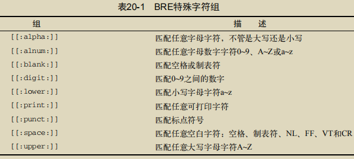

##### 20.2.9 星号

#### 20.3 扩展正则表达式

gawk程序能够识别ERE模式，但sed编辑器不能。

##### 20.3.1 问号

0-1次

##### 20.3.2 加号

必须至少出现1次

##### 20.3.3 使用花括号

ERE中的花括号允许你为可重复的正则表达式指定一个上限。这通常称为间隔（interval）。

```shell
 echo "beet" | gawk --re-interval '/b[ae]{1,2}t/{print $0}'
```

##### 20.3.4 管道符号

管道符号允许你在检查数据流时，用逻辑OR方式指定正则表达式引擎要用的两个或多个模式。

##### 20.3.5 表达式分组

正则表达式模式也可以用圆括号进行分组。当你将正则表达式模式分组时，该组会被视为一个标准字符。

#### 20.4 正则表达式实战

##### 20.4.1 目录文件计数

```shell
mypath=$(echo $PATH | sed 's/:/ /g')
for循环计数即可
```

##### 20.4.2 验证电话号码

```shell
gawk --re-interval '/^\(?[2-9][0-9]{2}\)?(| |-|\
[0-9]{3}( |-|\.)[0-9]{4}/{print $0}'
```

##### 20.4.3 解析邮件地址

```shell
^([a-zA-Z0-9_\-\.\+]+)@([a-zA-Z0-9_\-\.]+)\.([a-zA-Z]{2,5})$
```

### 第21章 sed进阶

#### 21.1 多行命令

##### 21.1.1 next 命令

1. 单行的next命令

   小写的n命令会告诉sed编辑器移动到数据流中的下一文本行，而不用重新回到命令的最开始再执行一遍。

   ` sed '/header/{n ; d}' data1.txt`

2. 合并文本行

   单行next命令会将数据流中的下一文本行移动到sed编辑器的工作空间（称为模式空间）。

   多行版本的next命令（用大写N）会将下一文本行添加到模式空间中已有的文本后。

   `sed '/first/{ N ; s/\n/ / }' data2.txt`

##### 21.1.2 多行删除命令

` sed '/^$/{N ; /header/D}' data5.txt`

##### 21.1.3 多行打印命令

`sed -n 'N ; /System\nAdministrator/P' data3.txt`

#### 21.2 保持空间

模式空间（pattern space）是一块活跃的缓冲区,另一块称作保持空间（hold space）的缓冲区域。

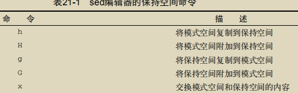

#### 21.3 排除命令

感叹号命令（!）用来排除（negate）命令

`sed -n '/header/!p' data2.txt`

#### 21.4 改变流

##### 21.4.1 分支

sed编辑器提供了一种方法，可以基于地址、地址模式或地址区间排除一整块命令。

```shell
[address]b [label]
 sed '{2,3b ; s/This is/Is this/ ; s/line./test?/}' data2.txt
```

##### 21.4.2 测试

```shell
[address]t [label]
```

#### 21.5 模式替代

##### 21.5.1 &符号

&符号可以用来代表替换命令中的匹配的模式。

```shell
echo "The cat sleeps in his hat." | sed 's/.at/"&"/g'
```

##### 21.5.2 替代单独的单词

用圆括号来定义替换模式中的子模式。第一个子模式分配字符\1，给第二个子模式分配字符\2

```shell
$ echo "The System Administrator manual" | sed ' 
> s/\(System\) Administrator/\1 User/'
```

#### 21.6 在脚本中使用 sed

##### 21.6.1 使用包装脚本

在shell脚本中，可以将普通的shell变量及参数和sed编辑器脚本一起使用。

##### 21.6.2 重定向 sed 的输出

可以在脚本中用$()将sed编辑器命令的输出重定向到一个变量中，以备后用

#### 21.7 创建 sed 实用工具

##### 21.7.1 加倍行间距

`sed '$!G' data2.txt`

##### 21.7.2 对可能含有空白行的文件加倍行间距

`sed '/^$/d ; $!G' data6.txt`

##### 21.7.3 给文件中的行编号

` sed '=' data2.txt | sed 'N; s/\n/ /'`

##### 21.7.4 打印末尾行

创建滚动窗口

```shell
$ sed '{ 
> :start 
> $q ; N ; 11,$D 
> b start 
> }' data7.txt
```

##### 21.7.5 删除行

1. 删除连续的空白行

   最简单办法是用地址区间来检查数据流.

   `sed '/./,/^$/!d' data8.txt`

2. 删除开头的空白行

   `sed '/./,$!d' data9.txt`

3. 删除结尾的空白行

   ```shell
   sed '{ 
   :start 
   /^
   \n*$/{$d; N; b start } 
   }'
   ```

##### 21.7.6 删除 HTML 标签

 `sed 's/<[^>]*>//g' data11.txt`

### 第22章 gawk进阶

#### 22.1 使用变量

#### 22.1.1 内建变量

1. 字段和记录分隔符变量

   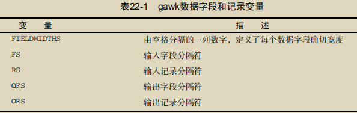

   ` gawk 'BEGIN{FS=","} {print $1,$2,$3}' data1`

2. 数据变量

   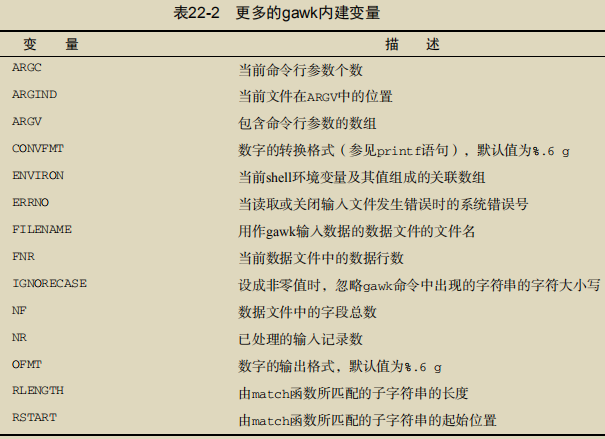

##### 22.1.2 自定义变量

1. 在脚本中给变量赋值

   ```shell
   $ gawk ' 
   > BEGIN{ 
   > testing="This is a test" 
   > print testing 
   > }' 
   This is a test
   ```

2. 在命令行上给变量赋值

   ```shell
   gawk -f script2 n=3 data1
   gawk -v n=3 -f script2 data1#允许你在BEGIN代码之前设定变量
   ```

#### 22.2 处理数组

##### 22.2.1 定义数组变量

`var[index] = element`

##### 22.2.2 遍历数组变量

```shell
for (var in array) 
{ 
 statements 
}
```

##### 22.2.3 删除数组变量

`delete array[index]`

#### 22.3 使用模式

##### 22.3.1 正则表达式

在使用正则表达式时，正则表达式必须出现在它要控制的程序脚本的左花括号前。

` gawk 'BEGIN{FS=","} /,d/{print $1}' data1`

##### 22.3.2 匹配操作符

匹配操作符（matching operator）允许将正则表达式限定在记录中的特定数据字段。匹配操作符是波浪线（~）。

```shell
gawk 'BEGIN{FS=","} $2 ~ /^data2/{print $0}' data1
gawk –F: '$1 !~ /rich/{print $1,$NF}' /etc/passwd
```

##### 22.3.3 数学表达式

```shell
 gawk -F: '$4 == 0{print $1}' /etc/passwd
```

#### 22.4 结构化命令

##### 22.4.1 if 语句

```shell
 gawk '{if ($1 > 20) print $1}' data4
```

##### 22.4.2 while 语句

```shell
while (condition) 
{ 
 statements 
}
```

##### 22.4.3 do-while 语句

```shell
do 
{ 
 statements 
} while (condition)
```

##### 22.4.4 for 语句

```shell
for( variable assignment; condition; iteration process)
```

#### 22.5 格式化打印

```shell
 printf "The answer is: %e\n", x
 gawk 'BEGIN{FS="\n"; RS=""} {printf "%-16s %s\n", $1, $4}' data2
```

#### 22.6 内建函数

##### 22.6.1 数学函数

`gawk 'BEGIN{x=exp(100); print x}' `

##### 22.6.2 字符串函数

```shell
 gawk 'BEGIN{x = "testing"; print toupper(x); print length(x) }'
```

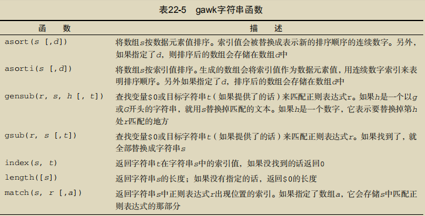

##### 22.6.3 时间函数


#### 22.7 自定义函数

##### 22.7.1 定义函数

```shell
function myrand(limit) 
{ 
 return int(limit * rand()) 
}
```

##### 22.7.2 使用自定义函数

在定义函数时，它必须出现在所有代码块之前（包括BEGIN代码块）

##### 22.7.3 创建函数库

需要创建一个存储所有gawk函数的文件。

创建一个含有你的gawk程序的文件，然后在命令行上同时指定库文件和程序文件

#### 22.8 实例

### 第23章 使用其他shell

#### 23.1 什么是 dash shell 

大多数基于Debian的Linux发行版将bash shell用作普通登录shell，而只将dash shell作为安装脚本的快速启动shell，用于安装发行版文件。

#### 23.2 dash shell 的特性

##### 23.2.1 dash 命令行参数

-E和-V命令行参数会启用dash shell特有的命令行编辑功能。

##### 23.2.2 dash 环境变量

1. 默认环境变量

   很像,数量更少

2. 位置参数

   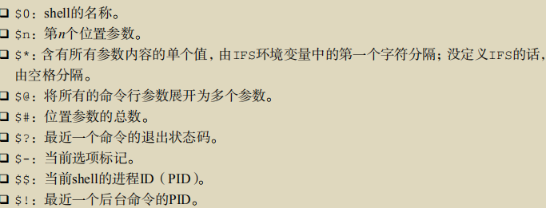

3. 用户自定义的环境变量

   不支持数组

##### 23.2.3 dash 内建命令

#### 23.3 dash 脚本编程

##### 23.3.1 创建 dash 脚本

`#!/bin/dash `

##### 23.3.2 不能使用的功能

1. 算术运算

   dash shell支持expr命令和双圆括号方法，但不支持方括号方法。

2. test命令

   bash shell的test命令允许你使用双等号（==）来测试两个字符串是否相等。

3. function命令

   dash shell不支持function语句。在dash shell中，你必须用函数名和圆括号定义函数。

#### 23.4 zsh shell

可加载模块是shell设计中最先进的功能

zsh shell提供了一组核心内建命令，并提供了添加额外命令模块（command module）的能力。

#### 23.5 zsh shell 的组成

##### 23.5.1 shell 选项

zsh shell使用了一些命令行参数来定义shell的操作，但大多数情况下它用选项来定制shell的行为。

##### 23.5.2 内建命令

1. 核心内建命令

2. 附加模块

   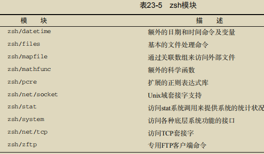

3. 查看、添加和删除模块

   zmodload命令是zsh模块的管理接口。你可以在zsh shell会话中用这个命令查看、添加或删除模块。

#### 23.6 zsh 脚本编程

##### 23.6.1 数学运算

1. 执行计算

   let 和 双括号 ,支持浮点

2. 数学函数

##### 23.6.2 结构化命令

多了repeat

##### 23.6.3 函数

## 第四部分　创建实用的脚本

### 第24章 编写简单的脚本实用工具

看代码,自己写一遍

#### 24.1 归档

#### 24.2 管理用户账户

#### 24.3 监测磁盘空间

### 第25章 创建与数据库、Web及电子邮件相关的脚本

#### 25.1 MySQL 数据库

##### 25.1.1 使用 MySQL 

4. 创建用户账户 `GRANT `

##### 25.1.2 在脚本中使用数据库

1. 登录到服务器

   mysql程序使用$HOME/.my.cnf文件来读取特定的启动命令和设置。其中一项设置就是用户启动的mysql会话的默认密码。

   ```shell
   $ cat .my.cnf 
   [client] 
   password = test 
   $ chmod 400 .my.cnf
   ```

2. 向服务器发送命令

   对于mysql命令，可以用-e选项。

   ```shell
   #!/bin/bash 
   # send a command to the MySQL server 
   MYSQL=$(which mysql) 
   $MYSQL mytest -u test -e 'select * from employees'
   ```

3. 格式化数据

   -B选项指定mysql程序工作在批处理模式运行，-s（silent）选项用于禁止输出列标题和格式化符号。

#### 25.2 使用 Web 

##### 25.2.1 安装 Lynx 

##### 25.2.2 lynx 命令行

##### 25.2.3 Lynx 配置文件

默认情况下，这个文件位于/usr/local/lib/lynx.cfg，不过有许多Linux发行版将其改放到了/etc目录下（/etc/lynx.cfg）

##### 25.2.4 从 Lynx 中获取数据

在shell脚本中使用Lynx时，大多数情况下你只是要提取Web页面中的某条（或某几条）特定信息。完成这个任务的方法称作屏幕抓取（screen scraping）。

用lynx进行屏幕抓取的最简单办法是用-dump选项。

#### 25.3 使用电子邮件

主要工具是Mailx程序,Mailx程序将来自echo命令的文本作为消息正文发送。

### 第26章 一些小有意思的脚本

#### 26.1 发送消息

用户可以禁止他人使用mesg工具向自己发送消息。

要查看别人的消息状态，还可以使用who命令。`-T`

只要消息功能启用，就可以使用write命令通过其他登录用户的用户名和当前终端向其发送消息。

#### 26.2 获取格言

wget是一款非常灵活的工具，它能够将Web页面下载到本地Linux系统中。

#### 26.3 编造借口

curl工具允许你从特定的Web服务器中接收数据。

还可以用它向Web服务器发送数据。

还需要一个能够提供免费SMS消息发送服务的网站。

或者通过Email