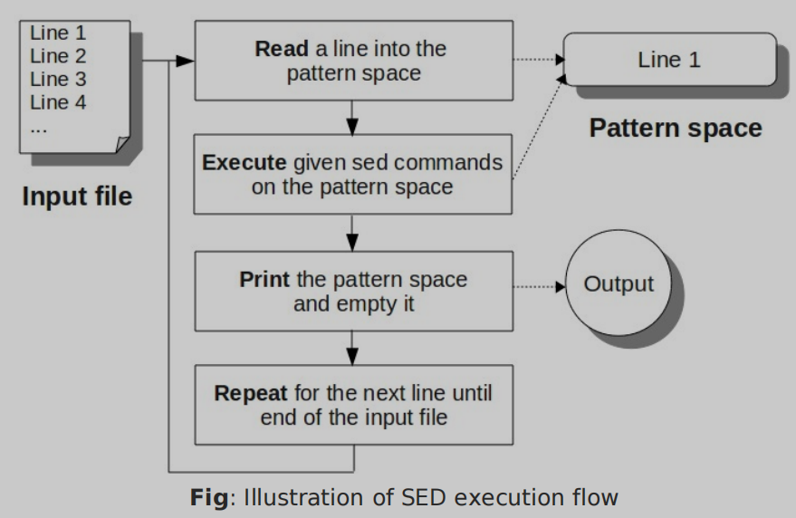

# sed-and-awk-101-hacks

- 书籍作者: VELOCIRAPTOR
- 笔记时间: 2022.08.11

## 第一章 Sed语法和基本命令

- sed语法(stream edit)

  ```shell
  sed [options] {sed-commands} {input_file}
  sed -n 'p' /etc/passwd			#打印
  sed [opt] -f script input_file	#使用命令文件执行
  
  ### script.sed		###
  /^root/ p
  /^nobody/ p
  ### end  script.sed ###
  sed -n -f script.sed /etc/passwd
  
  sed -n \
  -e '/^root/ p' \
  -e '/^nobody/ p' \
  /etc/passwd
  
  sed -n '{
  /^root/ p
  /^nobody/ p
  }' /etc/passwd
  
  
  ```

- REPR

  ```shell
  # Read a line into buffer
  # Excute command in buffer
  # Print and empty buffer
  # repeat the next line
  
  ```

  - 

- 命令说明

  ```shell
  # p-print 打印缓冲区,默认也会打印 使用 -n 进行抑制,否则会打印两次
  sed 'p' employee.txt		# 打印两次
  sed -n '2 p' employee.txt	# 只打印第二行
  							# 1,3 ==> 1,2,3
  							# 1,+3==> 1,2,3,4
  							# 1~3 ==> 1,4,7,10,...
  # 模式匹配
  sed -n '/Jason/,4 p' employee.txt	#匹配行到第四行,若无匹配则打印匹配行
  
  
  # d-delete
  sed '/^$/ d' employee.txt	#删除空行
  
  # w-write 一般使用重定向,这个了解即可
  sed -n '/Jason/,+2 w output.txt' employee.txt	
  ```

## 第二章 sed替换指令

- 替换语法

  ```shell
  # sed '[range/pattern] s/src/dst/flags' file
  sed '/Sales/s/Manager/Director/' employee.txt
  
  # g - global,标志位,全局作用
  # n - 标志位,数字,0-512,指定第几个匹配项
  # p - 标志位,打印
  # w - 标志位,保存
  # i - 标志位,忽略大小写
  # e - 标志位,执行每一行
  sed -n 's/Manager/Director/gipw output.txt'	#替换并保存
  # 分隔符可以替换为 ! / | / @ / ^
  
  # 多条命令作用在同一行
  
  # &表示匹配项
  sed 's/^[0-9][0-9][0-9]/[&]/g' employee.txt
  
  # 用awk做更方便
  sed 's/\([^,]*\).*/\1/g' employee.txt	#获取第一列
  sed 's/\([^,]*\),\([^,]*\),\([^,]*\).*/\1,\3/g' employee.txt #获取第1,3列
  ```

  

## 第三章 正则

- 基本规则

  ```shell
  # ^开头 $结尾 .任意字符  *任意数量 ?大于0个 [0-9]数字0-9 {5}数量5个
  # \b 单词边界
  
  sed -e 's/<[^>]*>//g' test.html		#去除标签
  ```

  

## 第四章 sed执行命令

- 多命令

  ```shell
  # test.sh
  #!/bin/sed -f
  s/\([^,]*\),\([^,]*\),\(.*\).*/\2,\1,\3/g
  s/^.*/<&>/
  
  ./test.sh filename
  
  # 修改源文件
  sed -i 's/a/b/' filename
  sed -ibak 's/a/b/' filename		#带备份修改
  ```

  

## 第五章 额外命令

- 插入

  ```shell
   sed '2 a 203,Jack Johnson,Engineer' employee.txt	#第二行之后插入文本
   sed '2 i 203,Jack Johnson,Engineer' employee.txt	#第二行之前插入文本
   sed '2 c 203,Jack Johnson,Engineer' employee.txt	#修改第二行内容
   sed '/Jason/{
   a addition file
   i insert file
   c change file 
   }' filename
   
   sed -n l filename		#打印隐藏符号
   sed = filename			#打印行号
   sed 'y/abc/ABC/' filename	#改变大小写
   sed '5 q' filename			#退出
   sed '$ r log.txt' filename	#读取文本并显示
   
  ```

- 命令行选项

  ```shell
  -n 		# 不打印默认输出
  -f		# 从文件执行命令
  -e		# 执行命令
  -i 		# 修改源文件,bak产生备份
  -c		#文件拥有者不变
  
  ```

## 第六章 sed保存/模式空间

- 模式空间  -- sed 交互/修改区域

- 保存空间  -- sed传参临时数据

  ```shell
  sed -n -e 'x;n' -e '/Manager/{x;p}' filename	# x;n 交换两个空间读取下一行
  sed -n -e '/Manager/!h' -e '/Manager/{x;p}'		#复制模式空间到保存空间
  sed -n -e '/Manager/!h' -e '/Manager/{H;x;p}'	#追加复制模式空间到保存空间
   sed -n -e '/Manager/!h' -e '/Manager/{g;p}'	#复制保存空间到模式空间
  ```

- 循环与格式化不学,使用awk处理

## 第八章 awk语法

- 基本处理

  ```shell
  awk -Fs '/匹配/操作' 文件		# 基本语法
  awk -F: '/mail/ {print $1}' /etc/passwd
  awk -Fs -f myscript.awk input-file
  
  # 编程结构
  awk 'BEGIN { FS=":";print "---header---" } \ 	# FS - Field Seperator
  /mail/ {print $1} \ 
  END { print "---footer---"}' /etc/passwd
  
  # 基本使用
  awk -F ',' '/Manager/ {print $2, $3}' employee.txt
  ```

## 第九章 awk内置变量

- 分隔符

  ```shell
  # 指定多种分割符
  awk 'BEGIN {FS="[,:%]"} {print $2, $3}' \
  employee-multiple-fs.txt
  
  # 指定输出字段分割符
  awk -F ',' 'BEGIN { OFS=":" } \
  { print $2, $3 }' employee.txt
  
  # 指定行分隔符
  awk -F, 'BEGIN { RS=":" } \
  { print $2 }' employee-one-line.txt
  
  # 指定输出行分隔符
  awk 'BEGIN { FS=","; ORS="\n---\n" } \
  {print $2, $3}' employee.txt
  
  # 输出行号
   awk 'BEGIN {FS=","} \
  {print "Emp Id of record number",NR,"is",$1;} \
  END {print "Total number of records:",NR}' employee.txt
  ```

  | 内置变量 | 作用                          |
  | -------- | ----------------------------- |
  | FS / OFS | Field Separate,字段分隔符     |
  | RS / ORS | Record Separate,行分隔符      |
  | NR / FNR | Number Record,行号/跨文件行号 |
  | NF       | Number of Field ,字段个数     |
  |          |                               |

  

## 第十章 awk变量

- 变量

  ```shell
  ### test.awk
  BEGIN{
  	FS=",";
  	total=0;
  }
  {
  	print $2 $4;
  	total=total+$4
  }
  END{
  	print $total
  }
  
  ### 数字操作
  # + - ++ --   + - * / %  ,支持 += 等
  ### 字符串操作  直接拼接
  ### ~ 正则匹配操作
  awk -F "," '$2 ~ "Tennis"' items.txt
  ```

  

## 第十一章 分支与循环

- 分支

  ```shell
  # 常见的if判断
  if(con)
  	action;
  # 循环
  while()
  	action;
  for(i=1;i<=NF;i++)
  	action;
  	break;continue;exit;
  ```

  

## 第十二章 关联数组

- 数组

  ```shell
  ### test.awk
  BEGIN{
  	item[0]="123";
  	items[0,0] = "asdkfjasldf"
  	items["0,1"] = "asdkfjasldf"
  
  	if( "a" in item)
  		action;
  		
  	for (x in item)
  		action;
  		
     	
  	delete item[0];
  	delete item;
  }
  
  asort(item);				# 按key排序
  total = asort(item, itemnew);
  
  asorti						# 按value排序
  ```

## 第十三章 额外命令

- 输出

  ```shell
  print 			# 会使用 OFS ORS
  printf			# 不使用 OFS ORS,和c语言的printf使用一样
  ```

- 内置函数

  | 函数                                                        | 说明                       |
  | ----------------------------------------------------------- | -------------------------- |
  | int()                                                       |                            |
  | log() / sqrt() / exp() /                                    |                            |
  | sin() / cos()  / atan()                                     |                            |
  | rand() / srand(x)                                           | 后者随机种子               |
  | index() / length() / split()  /  substr() / sub()  / gsub() |                            |
  | match() / tolower() /                                       |                            |
  | ARGC / ARGV / ARGIND                                        | 前者数量,次者数组,后者索引 |
  | OFMT                                                        | 默认浮点输出格式           |
  | ENVIRON / IGNORECASE / ERRNO                                |                            |

- pgawk

  ```shell
  # 用于产生可执行awk程序
  ```

- 位操作

  | 函数                   | 说明           |
  | ---------------------- | -------------- |
  | and() / or() /xor()    |                |
  | lshift() / rshift()    |                |
  | function func(param){} |                |
  | system()               | 调用系统函数   |
  | systime()              |                |
  | strftime()             | 格式化日期     |
  | getline tmp < "a.txt"  | 提前读取下一行 |
  |                        |                |
  |                        |                |

  