# 深入浅出Docker 笔记

- [ ] 书籍作者:[ [英]奈吉尔· 波尔顿（Nigel Poulton）](https://book.douban.com/search/奈吉尔· 波尔顿)
- [ ] 笔记时间: 2020.12.29

## 第一部分 Docker概览

### 第 1 章 容器发展之路

#### 1.1 落后的旧时代

单一应用硬件要求很高,导致负载低浪费严重

#### 1.2 Hello,VMware

可以把应用部署在虚拟机,增加应用的时候增加虚拟机即可

#### 1.3 虚拟机的不足

本身是一个完整的OS,同时还依赖OS,体积大,启动慢,可移植性差等

#### 1.4 容器

和VM相似,区别在于不会独占操作系统,而是共享操作系统(CPU RAM 存储) 启动快和便于迁移

#### 1.5 Linux容器

影响比较大的技术,受益于强大的基金会

- 内核命名空间
- 控制组
- 联合文件系统
- Docker

#### 1.6 Hello,Docker

使容器广泛应用

#### 1.7 Windows容器

实现容器所需的核心Windows内核技术称为 Windows容器,用户空间通过Docker来完成与容器的交互

#### 1.8 Windows容器 vs Linux容器

win平台运行linux容器已经成为可能

#### 1.9 Mac容器现状

没有Mac容器,可以在Mac使用 Docker for Mac运行Linux容器,通过启动一个轻量级LinuxVM在其中无缝运行Linux容器实现的

#### 1.10 Kubernetes

俗称k8s,谷歌开源项目,容器编排领域领头羊

Kubernetes是保证容器部署和运行的软件体系中很重要的一部分

原本使用Dockers作为其默认容器运行时(container tuntime),同时也提供了CRI接口,已经替换为containered

Kubernetes是Docker之上的一个平台,原采用Docker实现其底层容器相关的操作

### 第 2 章 走进Docker

#### 2.1 Docker简介

Docker是一种运行于Linux和Windows上的软件,用于创建 管理 和 编排 容器. 

Docker是在Github上开发的Moby开源项目的一部分,有Docker公司进行维护

#### 2.2 Docker公司

公司起初是一家名为dotCloud的平台及服务提供商(PaaS),底层利用了Linux容器技术,自己开发了一套内部工具就是后来的Docker

#### 2.3 Docker运行时与编排引擎

Docker引擎是运行和编排容器的基础设施工具,主要有社区版和企业版

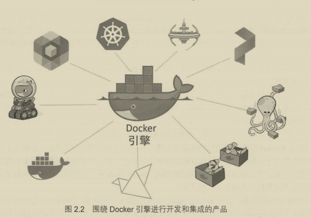

#### 2.4 Docker开源项目(Moby)

基于开源,将Docker拆分为更多的模块化组件,基于Go语言

#### 2.5 容器生态

含电池,可拆卸(Batteries included but removable),内置组件可以被替换

#### 2.6 开发容器计划

The Open Container Initiative ,OCI 是一个旨在对容器基础架构中的基础租价进行标准化的管理委员会

和CoreOS 共同成立OCI:发布了两份标准 镜像规范和运行时规范

### 第 3 章 Docker安装

官网看一看就会了,用户CE版就ok

#### 3.6 Docker存储驱动的选择

每个Docker容器都有一个本地存储空间,用于保存层叠的景象曾以及挂载的容器文件系统

可以修改/etc/docker/daemon.json的 storage-driver

` docker system info | grep Storage`  查看存储驱动类型

##### 3.6.1 Device Mapper 配置

默认情况下 Device Mapper 采用loopback mounted sparse file 作为底层实现为Docker提供存储支持,但是不适用生产环境.需要修改为 direct-lvm模式才能获取更好的性能

如何配置自己查找一下

### 第 4 章 纵观Docker

- Ops视角: 下载镜像 运行新容器 登陆新容器 容器内运行命令 销毁容器
- Dev视角: 拉取代码 解释Dockerfile 应用容器化 运行

#### 4.1 运维视角

安装时候设计两个组件: Docker客户端 和 Docker daemon

daemon实现了Docker引擎的API,Linux默认客户端和daemon之间的通信使用IPC/UNIX Socket完成

使用` docker version `可以看到来自两者的响应

##### 4.1.1 镜像

可以理解为一个包含OS文件系统和应用的对象,就是Java的类

`docker image ls`

##### 4.1.2 容器

`docker container run` 告诉Docker daemon 启动新容器

`CTRL+PQ` 可以退出容器同时保持容器运行

`docker container ls` 查看运行的容器

##### 4.1.3 连接到运行中的容器

`docker container exec` 可以把shell连接到一个运行中的容器中断

#### 4.2 开发视角

容器即应用!

每个仓库都有一个名为Dockerfile的文件,本事是一个纯文本文件,其中描述如何构件应用到Docker镜像中 

`docker build -t test:latest .` 根据当前目录下的Dockerfile进行构建镜像

## 第二部分 Docker技术

### 第 5 章 Docker引擎

#### 5.1 Docker引擎--简介

采用模块化设计

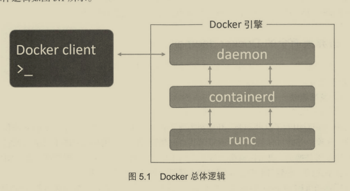

#### 5.2 Docker引擎详解

Docker首次发布时候由两个核心组件组成

- LXC: 提供了对名称空间 控制组 等基础工具操作的能力,基于Linux内核容器虚拟化技术
- Docker daemon: 单一二进制文件,包含客户端 API 运行时 镜像构建等

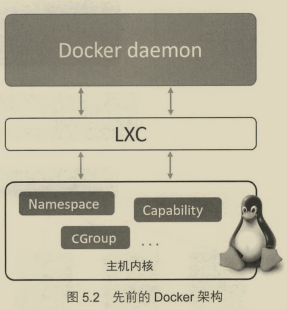

##### 5.2.1 摆脱LXC

- LXC基于Linux,无法跨平台
- 核心组件不能依赖外部工具

后来出现 Libcontainer 取代它

##### 5.2.2 摒弃大而全的Docker daemon

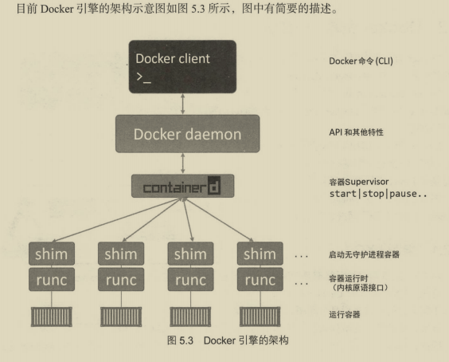

##### 5.2.3 OCI的影响

Docker引擎尽可能试下OCI标准

##### 5.2.4 runc

runc 是OCI容器运行时规范的参考实现,实质上是一个轻量级的,针对Libcontainer进行包装的命令行交互工具

作用就是创建容器

##### 5.2.5 containerd

所有容器执行逻辑被重构到一个 containerd 工具

任务就是管理容器的生命周期--start | stop | ...

随着时间推移,containerd也被赋予更多功能,不过都是模块化 可选的

##### 5.2.6 启动一个新的容器

`docker run --name ctrl -it alpine:latest sh`

1. Docker客户端会将其转换为合适的API格式并发送到正确的API节点

2. API在daemon实现的,接收到命令它就会向containerd发出调用(daemon本身不含任何创建容器的代码,通过gRPC和containerd通信)
3. containerd本身不会创建容器,而是指挥runc进行. containerd将Docker镜像转为OCI bundle,并让runc基于此创建一个新容器
4. runc与操作系统内核接口进行通信,基于必要工具创建容器.容器进程作为runc的子进程启动,启动完毕后runc会自动退出

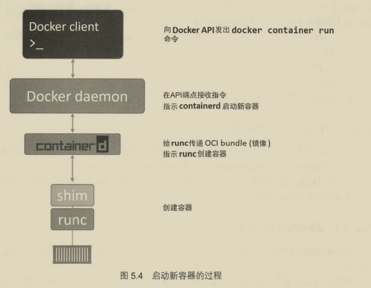

##### 5.2.7 该模型的显著优势

容器运行时是和daemon解耦,有时成为 无守护进程的容器

##### 5.2.8 shim

shim是实现无daemon的容器不可或缺的工具

一旦容器进程的父进程runc退出,相关联的 containerd-shim进程便会成为容器的父进程,职责如下:

- 保持所有STDIN 和 STDOUT流是开启状态,当daemon重启时候,容器不会应为pipe关闭而终止
- 将容器推出状态反馈给daemon

##### 5.2.9 在Linux中的实现

以上组件通过ps可以看到,有些需要运行容器才可见

##### 5.2.10 daemon作用

目前主要功能 : 镜像管理, 镜像构建, REST API ,身份验证,核心网络,编排

### 第 6 章 Docker镜像

#### 6.1  Docker镜像--简介

镜像由多个层组成,是一个精简的OS,同时还包含应用运行时所必须的文件和依赖包

#### 6.2  Docker镜像--详解


##### 6.2.1 镜像和容器

类和对象的关系

`docker run ` 或者 `docker service create` 从镜像启动若干个容器

容器全部停止之前是无法删除镜像的

##### 6.2.2 镜像通常比较小

容器目的就是运行应用或服务,只需要包含必须的OS和文件即可

##### 6.2.3 拉取镜像

本地镜像仓库通常位于 /var/lib/docker/\<storage-driver\>

`docker pull`

##### 6.2.4 镜像命名

##### 6.2.5 镜像仓库服务

Docker镜像存储在镜像仓库服务中.默认Docker Hub,可配置

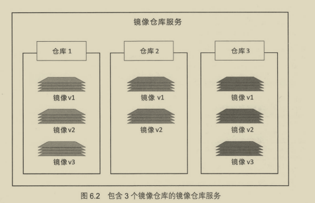

##### 6.2.6 镜像命名和标签

只要给出两者(用冒号分割)就能在仓库里定位一个镜像

- 版本不写默认latest
- 从非官方仓库拉取只需要在仓库名称前面加上组织名称

##### 6.2.7 为镜像打多个标签

 pull -a 可以拉取全部镜像,多个标签可能指向同一个镜像

##### 6.2.8 过滤 docker image ls 的输出内容

`docker image ls -- filter dangling=true`

没有标签的镜像称为 悬虚镜像,展示为 \<none\>: \<none\>,一般是因为构建了一个新镜像,然后为该镜像打了一个已经存在标签.当此情况出现,Docker会移除旧镜像标签而标在新镜像上

`docker image prune`移除全部悬虚镜像

过滤器如下:

- dangling: 指定true/false,进返回悬虚镜像(t)
- before: 需要镜像/ID,返回在之前被创建的全部镜像
- since: 类似before,在此之后
- label: 根据标注进行过滤
- reference: 自定义正则
- ...

##### 6.2.9 通过CLI方式搜索Docker Hub

`docker search nigelpoulton`	搜索

`docker search alpine --filter "is-official=true"` 搜索并过滤官方版

`docker search alpine --filter "is-automated=true"`搜索并过滤自动构建仓库

##### 6.2.10 镜像和分层

Docker镜像由一些松散耦合的只读镜像构成,Docker负责堆叠镜像层,并将它们表示为单个统一的对象

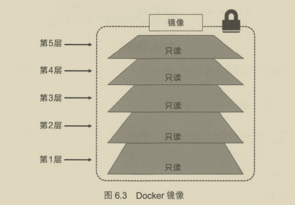

- pull 时候输出可以看出多个层
- `docker image inspect` 可以查看(在 RootFS | Layers)

镜像始终保持是当卡所有镜像的组合,新版本会取代旧版本

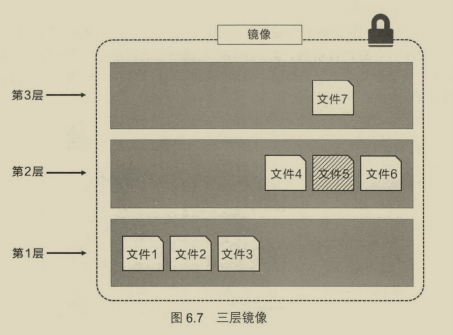

Docker 通过存储引擎(新版本通过快照机制)实现镜像层堆栈,并保证多镜像层对外展示为统一的文件系统

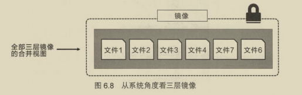

##### 6.2.11 共享镜像层

拉取新的镜像若本地已有不再远程拉取.

Docker在Linux上支持很多存储引擎(Snapshotter).每个存储引擎都有自己的镜像分层,镜像层共享和写时复制技术实现

##### 6.2.12 根据摘要拉取镜像

Image Digest,当同一个镜像由多个版本时进行区分

`docker image ls --digests alpine` 可以查看

`docker pull alpine@sha256: .....`可以指定摘要拉取

##### 6.2.13 镜像散列值(摘要)

镜像本身就是一个配置对象,其中包含镜像层列表以及一些元素据信息

镜像层才是实际数据存储的地方

镜像的唯一标识是一个加密ID,即配置对象本身的散列值.每个镜像层也由一个加密ID区分,其值镜像层本身内容的散列值

这个加密ID就是内容散列

在pull / push 镜像时候都会压缩节省带宽,但是会改变hash值,为了完成校验每个镜像层同时会包含一个分发散列值(这是一个压缩版镜像的散列值)

##### 6.2.14 多层架构的镜像

意味着某个镜像仓库标签下的镜像可以同时支持Linux / Windows /ARM等多种架构

进行仓库服务API支持两种重要结构: 

- Manifest列表 : 某个镜像标签支持的架构列表,支持的架构都有自己的Manifest
- Manifest : 具体镜像层和数据

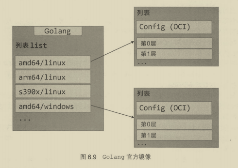

##### 6.2.15 删除镜像

`docker image rm` 删除镜像以及相关的镜像层

`docker iamge rm $(docker image ls -q) -f`删除所有镜像

### 第 7 章 Docker容器

#### 7.1 Docker容器--简介

`docker container run` 创建并启动容器

``docker container start` 重新启动容器

`docker container stop` 停止容器

`docker container rm` 删除容器

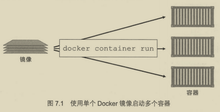

#### 7.2 Docker容器--详解

##### 7.2.1 容器 vs 虚拟机

- **虚拟机**

  1. 首先开启物理机并启动 Hypervisor 引导程序(跳过BIOS和Bootstrap代码等),一旦 Hypervisor启动,便会占据全部资源,如CPU RAM 存储和NIC.
  2. Hypervisor为物理资源划分虚拟资源,使其看起来和物理资源一致,然后将资源打包近一个叫做 虚拟机 的软件结构当中
  3. 用户可以使用这些虚拟机并在其中安装操作系统和应用

  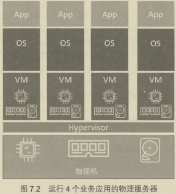

- **容器**
  1. 服务器启动后,操作系统启动,OS占据全部资源
  2. 安装容器引擎(比如Docker),以后获取系统资源,比如进程树,文件系统和网络栈,接着划分为安全的相互隔离的资源,称为 容器
  3. 每个容器看起来向一个真实的OS,可以安装软件


​	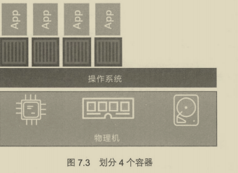


从更高层面上来说, Hypervisor 时 硬件虚拟化,容器是操作系统虚拟化

##### 7.2.2 虚拟机的额外开销

Hypervisor是一种针对虚拟机高度优化的操作系统

- 虚拟机模型将底层硬件资源划分到虚拟机当中,操作系统本身是有额外开销的
- 容器模型具有在宿主机操作系统运行的单个内核

#### 7.2.3 运行的容器

##### 7.2.4 检查Docker daemon

`docker version` 查看

若出现问题可能是 daemon没有启动

##### 7.2.5 启动一个简单容器

`docker run` 启动一个容器

- it 交互形式启动

##### 7.2.6 容器进程

上面启动的方式使得容器只有一个进程 Bash,如果退出就会导致容器关闭

`CTRL+PQ`退出容器但不关闭容器

`docker container exec -it id bash` 重新连接到docker内部bash,此时输入exit不会关闭容器

##### 7.2.7 容器生命周期

容器生命周期:(容器是可以持久化)

- 创建: run 命令 
- 运行: exec 连接进容器,执行各种操作

- 停止: stop 命令
- 删除: rm 命令

##### 7.2.8 优雅地停止容器

原理通过Linux/POSIX信号解释.stop 命令向容器内PID 1 的进程发送 SIGTERM信号,会为进程预留一个清理并停止的机会(10 s); 而 rm -f 是直接发送 SIGKILL 直接杀死

##### 7.2.9 利用重启策略进行容器的自我修复

可以作为参数传入 --restart 

- always 除非手动stop(此时进入Stopped(Exited)状态),否则一致尝试重启处于停滞状态的容器,重启daemon时候重启容器
- unless-stopped 处于Stopped(Exited),不会在重启daemon时候重启
- onfailure 会在退出容器并且返回值不是0的时候重启容器

##### 7.2.10 Web 服务器实例

`docker pull nigelpoulton/pluralsight-docker-ci` 作者提供的案例镜像

```shell
docker run -d --name webserver -p 80:8080 nigelpoulton/pluralsight-docker-ci
```

- -d 后台运行
- --name 自定义名称
- -p 端口映射, 主机端口:容器端口

##### 7.2.11 查看容器详情

构建Docker镜像时候可以通过嵌入指令列出希望容器运行时启动的默认应用,通过 inspect 查看 Cmd 可以得到

```shell
/bin/sh -c "cd /src && node ./app.js"
```

##### 7.2.12 快速清理

一定不能在生产环境使用

`docker rm $(docker ps -aq) -f` 清理所有容器

> 不想重新run一遍的话 docker stop $(docker ps -aq) 停止所有正在运行的容器

### 第 8 章 应用的容器化

Containerizing

#### 8.1 应用的容器化--简介

容器为应用而生! 应当简化应用的 构建 部署和运行 过程

1. 编写应用代码
2. 创建Dockerfile,其中包括当前应用的描述 依赖以及如何运行这个应用
3. 对 Dockerfile 执行 docker image build命令
4. 等待Docker将应用程序狗剪刀Docker镜像中

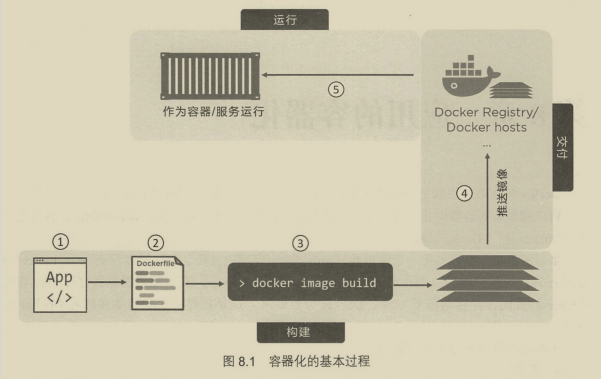

#### 8.2  应用的容器化--详解

##### 8.2.1 单体应用容器化

###### 1. 获取应用代码

psweb文件夹

###### 2. 分析Dockerfile

包含该文件的目录称为 构建上下文,作用有两个

- 描述当前应用

- 直到Docker完成应用的容器化

  ```sh
  # Test web-app to use with Pluralsight courses and Docker Deep Dive book
  # Linux x64
  FROM alpine
  
  LABEL maintainer="nigelpoulton@hotmail.com"
  
  # Install Node and NPM
  RUN apk add --update nodejs nodejs-npm
  
  # Copy app to /src
  COPY . /src
  
  WORKDIR /src
  
  # Install dependencies
  RUN  npm install
  
  EXPOSE 8080
  
  ENTRYPOINT ["node", "./app.js"]
  
  ```

  

  > 案例文件概述:
  >
  > 以 alpine 镜像作为当前镜像的基础,制定维护者,安装Node.js和NPM ,将应用代码复制到镜像中,设置新工作目录,安装依赖包,记录应用网络接口,最后设置app.js为默认运行应用 

一些命令作用

- FROM 指定镜像作为基础镜像
- LABEL 添加自定义属性值 K-V
- RUN apk ... 指令使用alpine的apk包管理器将nodejs和nodejs-npm安装到当前镜像中
- WORKDIR 指定未执行指令工作目录

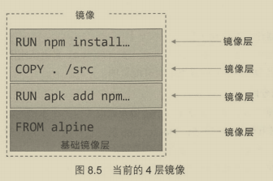

###### 3. 容器化当前应用

`docker build -t web:latest .`

###### 4. 推送镜像

登陆 docker hub,需要为镜像打标签

- Registry 默认 docker.io
- Repository 用户名
- Tag 默认latest

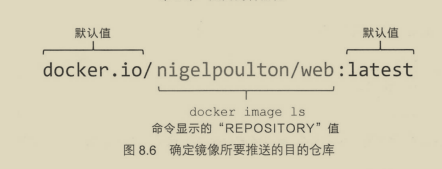

###### 5. 运行应用容器

之前已经测试过了

###### 6. 详述

新增元数据就会新建镜像层

##### 8.2.2 生产环境中的多阶段构建

通过 && 连接多个命令以及使用 \ 进行换行将多个命令包含在一个命令中是一个值得提倡的方法

使用一个Dockerfile,其中包含多个FROM指令,每一个都是新的构建阶段,可以方便复制之前阶段的构建

案例是 atsea-sample-shopapp

##### 8.2.3 最佳实践

1. 利用构建缓存

   一旦有指令在缓存中未命中,后续不会再使用缓存,所以把易于变化的指令放在后方执行

   COPY和ADD指令会检查复制镜像中的内容自上一次构建之后是否发生了变化

2. 合并镜像

   利弊参半 --squash

   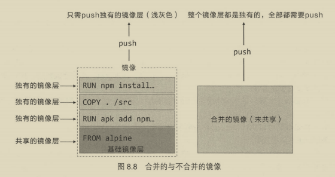

3. 使用 no-install-recommends
4. 不要安装MSI

### 第 9 章 使用Docker Compose部署应用

#### 9.1 使用Docker Compose部署应用--简介

多数应用可以通过多个小服务相互协作来组成一个完成可用的应用

#### 9.2 使用Docker Compose部署应用--详解

##### 9.2.1 Docker Compose的背景

前身Fig,Orchard公司的工具,用于多容器管理,基于Docker的Python工具,可以基于YAML定义多容器应用

目前还未完成集成,需要安装外部Python工具

##### 9.2.2 安装Docker Compose

[官网](https://docs.docker.com/compose/install/#alternative-install-options)

##### 9.2.3 Compose文件

使用YAML定义多服务的应用,YAML是JSON子集

Docker Compose默认文件名 docker-compose.yml 可以使用-f指定

- version 必须指定,并且位于第一行,定义Compose文件格式
- services 定义不同的应用服务,部署于各自容器
  - key 作为容器名称的一部分
  - build . 指定Docker基于当前下Dockerfile中定义的指令来构建一个镜像
  - command 指定Docker执行的主程序
  - ports 指定容器内端口映射到主机端口
  - networks 使得Docker可以将服务连接到指定的网络上
  - Volumes 指定Docker将 counter-vol 卷挂载到容器内的/code
- networks 用于指引 Docker 创建新网络,默认使用bridge网络,单主机网络,实现同一主机容器的连接
- volumes 指引Docker来创建新的卷

##### 9.2.4 使用 Docker Compose 部署应用

`docker-compose up` 启动Compose应用,它会构建所需的镜像,创建网络和卷,并启动容器 

- -f 可以指定 yml 文件,默认是 docker-compose.yml

- -d 后台启动应用
- & 将中断窗口返回

docker-compose.xml 指令解析

- build: .  基于当前目录Dockerfle构建一个镜像,Docker Compose会把项目名称和资源名称连起来

##### 9.2.5 使用Docker Compose管理应用

docker-compose down 进行停止

停止过程:

- 尝试关闭服务
- 停止容器
- 删除服务
- 删除网络(但是没有删除卷,说明持久化)
- 进程退出

`docker-compose top` 列出各个服务内运行的进程,PID是主机进程编号

`docker-compose stop` 不会删除定义,仅仅停止服务

`docker-compose rm` 删除容器和网络,不删除镜像和卷

`docker-compose restart` 重启服务

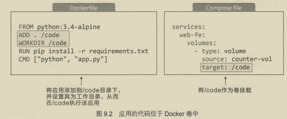

### 第 10 章 Docker Swarm

#### 10.1 Docker Swarm--简介

- 一个企业级的Docker安全集群 

  Swarm将一个或多个Docker节点组织起来,使得用户集群管理

  内置加密分布式集群存储 加密网络 公用TLS 等

- 一个微服务应用编排引擎

#### 10.2 Docker Swarm--详解

##### 10.2.1 Swarm的初步介绍

集群角度来说,一个Swarm由一个或多个节点组成,所有节点通过可靠网络连接

节点会被配置为管理节点或工作节点,配置信息和状态存储在一套位于所有管理节点的分布式etcd数据库

编排,最小调度单元是服务.当容器被封装在一个服务中,称为一个任务或一个副本

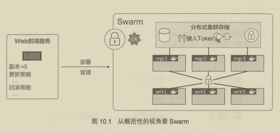

##### 10.2.2 搭建安全Swarm集群

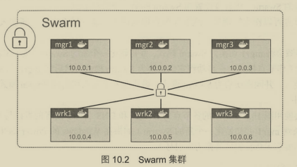

需要开放以下端口:

- 2377/tpc: 客户端和Swarm进行安全通信
- 7946/tcp与7946/udp: 用于控制面gossip分发
- 4789/udp: 用于基于VXLAN的覆盖网络

###### 1. 初始化一个全新的Swarm

不含Swarm的docker节点,称为运行于单引擎模式,一旦加入Swarm就会自动切换Swarm模式

`docker swarm init` 切换模式,默认管理节点

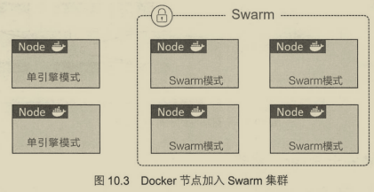

```shell
docker swarm init \
 --advertise-addr 10.0.0.1:2377 \
 --listen-addr 10.0.0.1:2377
```

初始化一个节点,指定连接端口

`docker node ls` 列出所有节点

```shell
docker swarm join-token worker #获取命令,manager替换worker就可以
docker swarm join\			# 添加一个worker节点
	--token SWMTKN-1-*** \
	10.0.0.1:2377 \
	--advertise-addr 10.0.0.4:2377 \
	--listen-addr 10.0.0.4:2377
```

###### 2. Swarm管理器高可用性(HA)

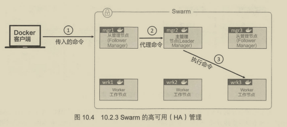

部署奇数个管理节点,减少脑裂情况

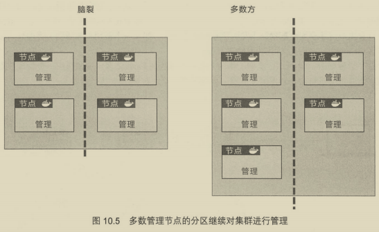

还不能将生产环境的应用和基础设置部署在多个不同的公有云

###### 3. 内置的Swarm安全机制

###### 4. 锁定Swarm

重启一个旧的管理节点或者进行备份恢复仍有可能对集群造成影响.Docker提供自动锁机制来锁定Swarm,强制重启的管理节点在提供一个集群解锁码之后才有权重新接入

##### 10.2.3 Swarm服务

`docker service create` 创建一个服务

- --name 名字
- -p 端口映射
- --replicas 告诉docker有五个副本

之后Swarm集群会实例化五个副本,相关节点拉去镜像,运行容器

###### 1. 查看服务

`docker service ls` 查看服务

`docker service ps` 查看服务副本

`docker service inspect` 查看详细信息

###### 2. 副本服务 vs 全局服务

默认复制模式是副本模式

全局模式每个节点进运行一个副本

###### 3. 服务的扩容/缩容

`docker service scale web-fe=10` 扩容

底层执行调度算法,尽量均衡节点的服务负载

###### 4. 删除服务

`docker service rm web-fe` 删除服务

###### 5. 滚动升级

先创建新的覆盖网络(overlay network)给服务使用

`docker network create -d overlay uber-net`

本质上说,覆盖网络是创建于底层异构网络之上的新的二层容器网络,容器通过覆盖网络连接

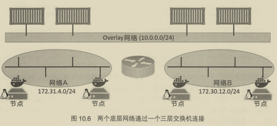

`docker network ls` 查看网络是否创建成功

之后创建新的服务接入网络,默认是在Swarm所有节点开放端口,称为入栈模式

之后使用 `docker service update`进行更新

##### 10.2.4 故障排除

`docker service logs`进行查看

可以在 daemon.json 的 log-service进行修改

### 第 11 章 Docker网络

#### 11.1 Docker网络--简介

Docker网络架构源自 容器网络模型(CNM) 的方案,支持桥式连接.Libnetwork是对CNM的一种实现

#### 11.2 Docker网络--详解

##### 11.2.1 基础理论

Docker网络架构由三部分构成:

- CNM是设计标准
- Libnetwork是CNM具体实现,Docker采用,Go语言实现
- 驱动 通过特定网络拓扑方式拓展模型能力

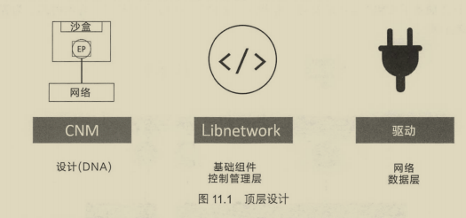

###### 1. CNM

CNM规定 Docker 网络的基础组成要素

- 沙盒(Sandbox) 独立的网络栈.包括以太网接口 端口 路由表 DNS配置
- 终端(Endpoint) 虚拟网络接口,负责将沙盒连接到网络
- 网络(Network) 802.1d网桥的软件实现.网络就是需要交互的终端集合,并且终端之间相互独立

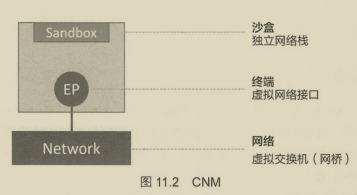

Docker最小调度单位是容器,CNM负责提供网络功能

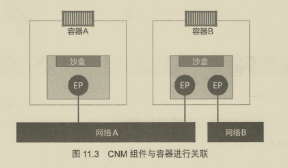

如果没有三层路由器的支持,容器B的两个终端不能通信

###### 2. Libnetwork

早期网络部分代码都存在于daemon中

现在Libnetwork实现了三个组件,还附带本地服务发现 基于Ingress的容器负载均衡 以及网络控制层和管理层功能

###### 3. 驱动

驱动负责实现数据层.比如网络连通性和隔离性

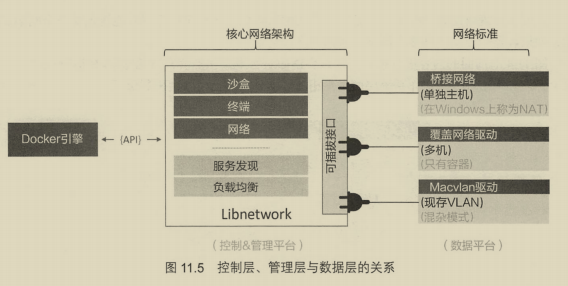

##### 11.2.2 单机桥接网络

- 单机 只能在单个Docker主机运行,并且只能与所在主机容器进行连接
- 桥接 二层交换机

默认网络是bridge,默认连接到该网络

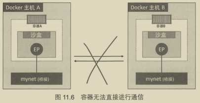

`docker network inspect bridge` 查看网络信息

`ip link show docker0` 默认"bridge"网络被映射到内核中'docker0'的Linux网桥

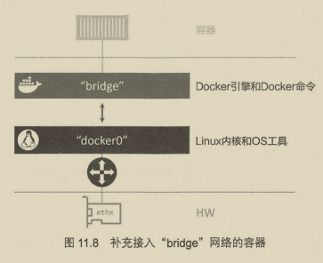

`docker network create -d bridge localnet` 创建新的单机桥接网络

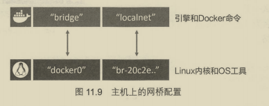

`brctl show` 查看网桥

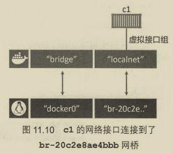

再新建一个容器连接到 localnet 可以相互ping通.但是只能局限于容器之间

可以通过端口映射解决与外网的连接

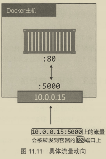

`docker port ` 查看容器的端口映射

综上,只适合与本地卡法环境以及非常小的应用

##### 11.2.3 多级覆盖网络

允许不同主机容器可以在链路层实现通信,创建网络时候使用 --d overlay

##### 11.2.4 接入现有网络

能够将容器化应用连接到外部系统以及网络是非常必要的

Docker内置Macvlan驱动可以提供MAC 和IP地址

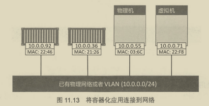

缺点是需要主机网卡(NIC)设置为混杂模式,公有云不允许,但是内部网络很棒

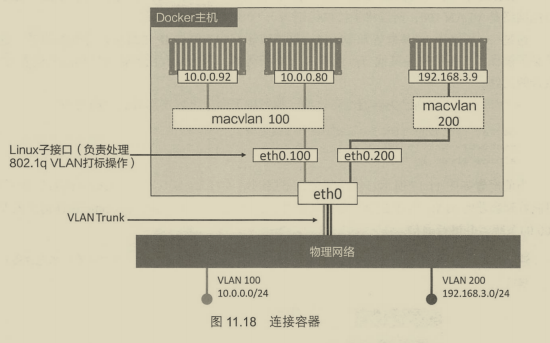


用于故障排除的容器和服务日志

- daemon日志位于  /var/log/upstart/docker.log

- 容器日志 `docker service logs`查看,json-file和journald是比较容易配置的,可以启动时候--log-driver 和 --log-opts 进行指定,前提是应用程序进程在容器内部PID为1,并且将正常日志输出STDOUT,异常输出到STDERR

##### 11.2.5 服务发现

服务发现允许容器和Swarm服务通过名称相互定位

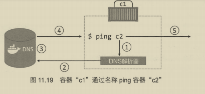

是通过容器内部/etc/resovle.conf文件内部增加条目实现的

可以在启动容器时候指定dns和域名

##### 11.2.6 Ingress网络

Swarm支持两种服务发布模式

- Ingress模式

  保证从Swarm集群任意节点都可以访问该服务

- Host

  只能通过运行服务副本访问

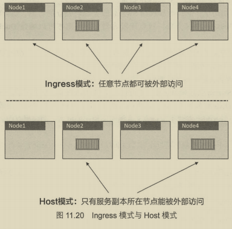

### 第 12 章 Docker覆盖网络

#### 12.1 Docker覆盖网络--简介

#### 12.2  Docker覆盖网络--详解

##### 12.2.1 在Swarm模式下构建并测试Docker覆盖网络

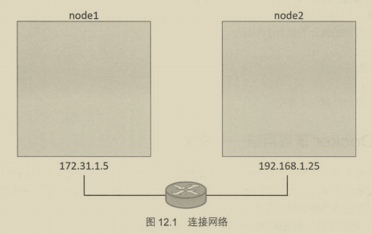

###### 1. 构建Swarm

需要将两台主机配置为包含两个节点的Swarm集群

###### 2. 创建新的覆盖网络

`docker network create -d overlay uber-net` 能连接所有主机并且该网络包含一个TLS加密控制层

只有当运行中的容器连接到覆盖网络的时候,该网络才变为可用状态

###### 3. 将服务连接到覆盖网络

```shell
docker service create --name test \
--network uber-net \
--replicas 2
ubuntu sleep infinity
```

###### 4. 测试覆盖网络

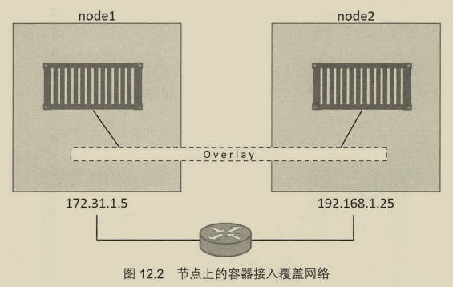

##### 12.2.2 工作原理

###### 1. VXLAN入门

Docker 使用VXLAN隧道技术创建了虚拟二层覆盖网络

VXLAN设计里,允许用户基于已经存在的三层网络结构创建虚拟的二层网络

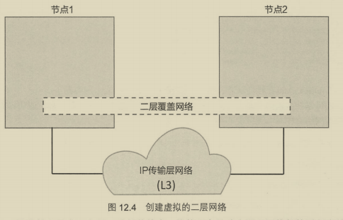

###### 2. 梳理一下两个容器的实例

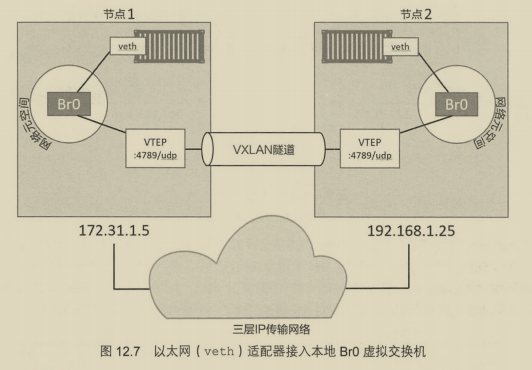

###### 3. 通信示例

基本就是交换机原理

### 第 13 章 卷与持久化数据

#### 13.1 卷与持久化数据--简介

非持久化属于容器

持久化需要存储在卷上,与容器解耦

#### 13.2 卷与持久化数据--详解

对于微服务而言,容器是合适的,无状态,临时工作负载

##### 13.2.1 容器与非持久数据

存储目录在/var/lib/docker/\<storage-driver\>/之下,是容器的一部分,默认情况下容器全部目录哦都使用该存储(本地存储)

##### 13.2.2 容器与持久化数据

先创建卷,然后创建容器,之后将卷挂载到容器上.卷会挂载到容器文件系统的某个目录之下,任何写到该目录的内容都会写到卷里

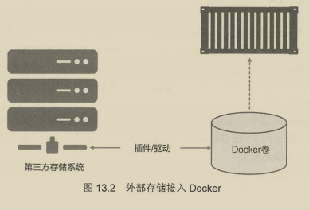

###### 1. 创建和管理容器卷

`docker volume create myvol` 创建新卷,默认内置local驱动,可以使用第三方驱动

已经有25中卷插件:

- 块存储: 相对性能更高
- 文件存储: NFS等,高性能下表现优异
- 对象存储: 使用与较大且长期存储的二进制数据

`docker volume ls` 查看

`docker volume inspect` 查看详情

`docker volume rm` | `docker volume prune` 删除卷,后者慎用

###### 2. 演示卷在容器和服务中的使用

``` shell
docker container run -dit --name voltainer \
--mount source=bizvol,target=/vol\
alpine
```

如果存在则使用,不存在则创建

甚至可以把卷挂载到新的容器

##### 13.2.3 在集群节点间共享存储

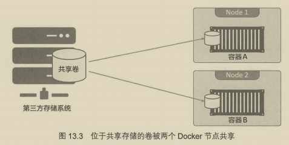

### 第 14 章 使用Docker Stack 部署应用

#### 14.1 使用Docker Stack 部署应用--简介

Stack 提供简单方式部署应用并管理其完整的生命周期:

初始化部署>健康检查>扩容>更新>回滚

#### 14.2 使用Docker Stack 部署应用--详解

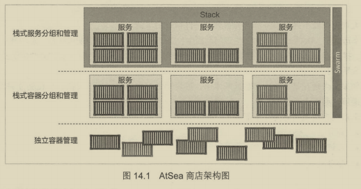

##### 14.2.1 简单应用

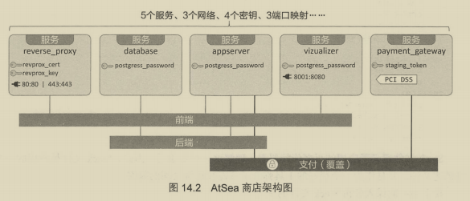

查看docker-stack.yml 格式Compose没什么差别

##### 14.2.2 深入分析Stack文件

1. 网络 定义了三个网络,payment使用加密

2. 密钥 属于顶级对象

3. 服务

   只是了解了解,不打算做笔记

##### 14.2.3 部署应用

前置: Swarm模式  标签 密钥

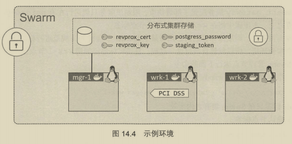

##### 14.2.4 管理应用

基本就是指令的使用

### 第 15 章 Docker安全

#### 15.1 Docker安全--简介

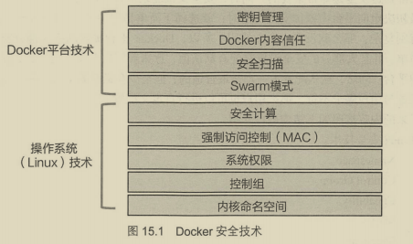

#### 15.2 Docker安全--详解

##### 15.2.1 Linux安全技术

###### 1. Namespace

内核命名空间属于容器非常核心的一部分,将OS拆分,看起来向多个OS;

Docker容器本质就是命名空间的有组织集合

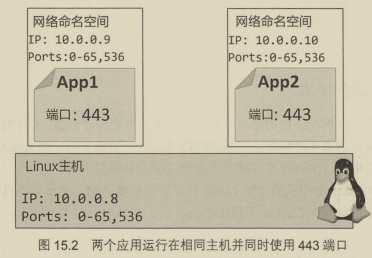

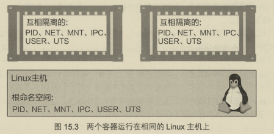

- 进程ID命名空间: Docker使用PID命名空间为每个容器提供相互独立的容器树.
- 网络命名空间: Docker使用NET命名空间为每个容器提供互相隔离的网络栈
- 挂载点命名空间: 每个容器都有互相隔离的根目录/
- 进程内命名空间: Docker使用IPC命名空间在容器内提供内存共享
- 用户命名空间: Docker允许用户使用USER命名空间将容器内用户映射到Linux主机不同的用户上

- UTS命名空间: Docker使用UTS命名空间为容器提供主机名称

###### 2. Control Group

控制组用于限额 命名空间用于隔离

###### 3. Capability

- CAP_CHOWN 允许用户修改文件所有权
- CAP_NET_BIND_SERVICE 允许用户将socket绑定到系统端口号
- ....

Docker 采用 Capability 机制实现用户以root运行同时移除非必需的root能力

###### 4. MAC

采用主流LinuxMAC技术

###### 5. Seccomp

Docker使用过滤模式下Seccomp限制容器对宿主机内核发起系统调用

###### 6. Linux安全总结

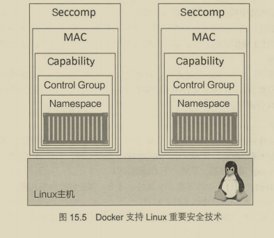

##### 15.2.2 Docker平台安全技术

###### 1. Swarm模式

集群管理,默认配置好了


原理:

1. Swarm准入令牌

   两种(管理者和工作者),四个字段构成 PREFIX-VERSION-SWARM ID-TOKEN,id是hash值,token决定类型

2. TLS 和 双向认证

3. 配置CA信息

4. 集群存储

###### 2. Docker安全扫描

二进制级别扫描 ,已经可以用于Docker Hub上私有仓库镜像

###### 3. Docker 内容信任

###### 4. Docker密钥


### 第 16 章 企业版工具-以后用到再看

### 第 17 章 企业级特性-以后用到再看