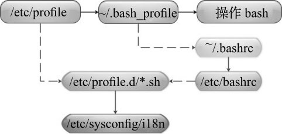
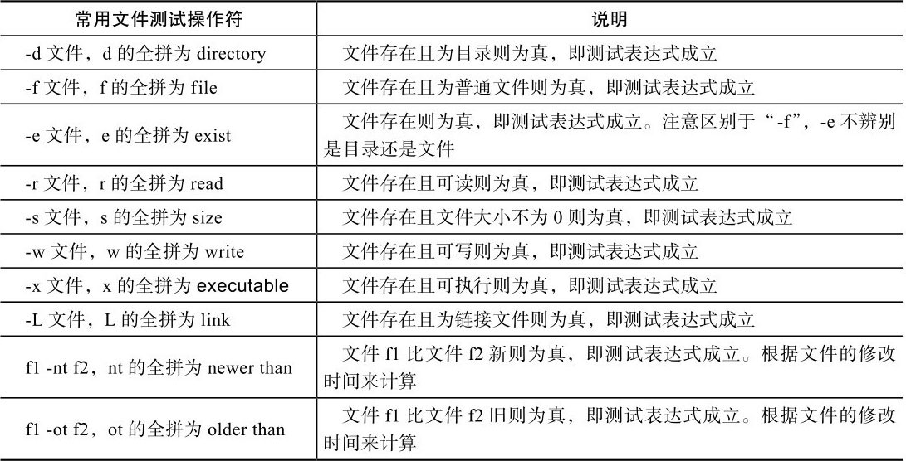
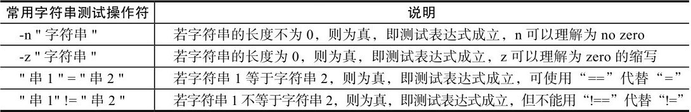
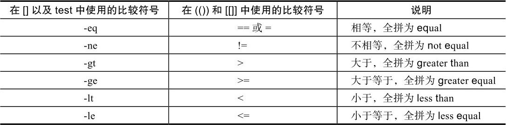
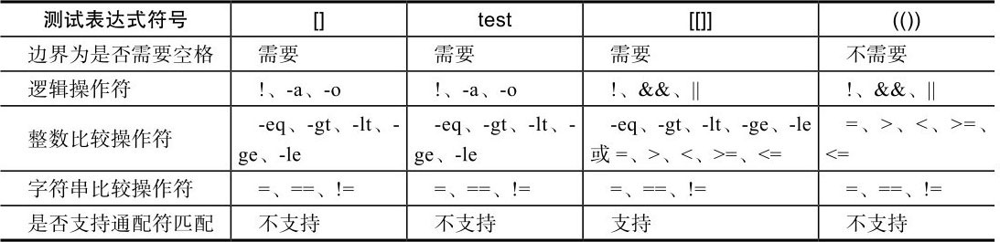
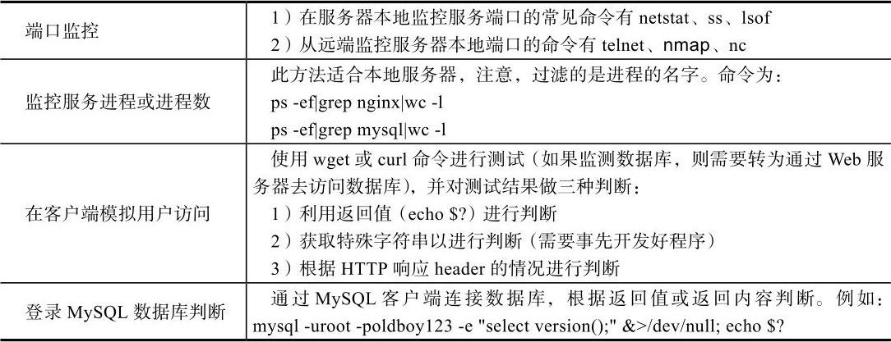
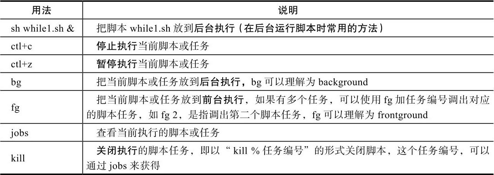
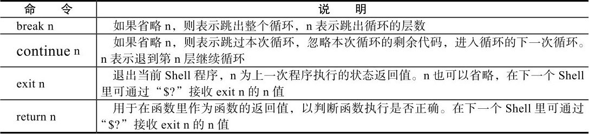
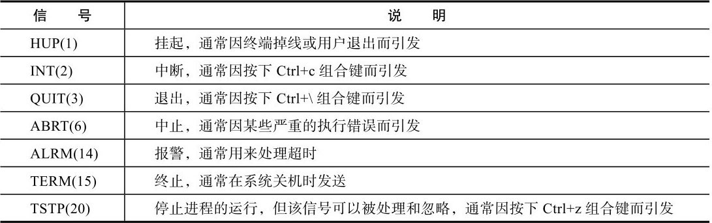

# 跟老男孩学Linux运维：Shell编程实战

- [ ] 书籍作者：老男孩、张耀
- [ ] 笔记时间：2021.8.3

## 第 1 章  如何才能学好Shell编程

### 1.1 为什么要学习Shell编程

- 实现Linux/UNIX系统管理及自动化运维所必备的重要工具
-  Linux/UNIX系统的底层及基础应用软件的核心大都涉及Shell脚本的内容

### 1.2 学好Shell编程所需的基础知识

- vim，ssh需要熟练使用
- 常用命令使用
- 熟练掌握Linux正则表达式及三剑客命令（grep、sed、awk）
- 熟悉常见的Linux网络服务部署、优化、日志分析及排错。

### 1.3 如何才能学好Shell编程之“老鸟”经验谈

- 多看多练
- 规范一些

## 第 2 章 Shell脚本初步入门

### 2.1 什么是Shell

- Shell是一个命令解释器，它的作用是解释执行用户输入的命令及程序等。是交互式

### 2.2 什么是Shell脚本

- 命令写入文件 ，让shell执行该文件，这个文件称为shell脚本

### 2.3 Shell脚本在Linux运维工作中的地位

- 很适合用于处理纯文本类型的数据

### 2.4 脚本语言的种类

- shell有很多种，选一种常用的即可
- 还有其他语言脚本，比如python等

### 2.5 常用操作系统默认的Shell

- ```shell
  echo $SHELL
  grep root /etc/passwd
  # 查看默认shell，常用的是bash（Bourne  Again Shell）
  ```

### 2.6 Shell脚本的建立和执行

- ```shel
  #!/bin/bash #指明使用哪个程序执行该脚本，头两个字符称为幻数，必须在第一行 
  bash --version
  ```

- 脚本执行顺序

  - 查找环境 变量ENV，该变量指定了环境文件（加载顺序通常是/etc/profile、～/.bash_profile、～/.bashrc、/etc/bashrc等）
  - 遇到了脚本嵌套 ，会先执行子脚本内容再返回父脚本。子脚本是一个新进程。

- 脚本执行 
  - bash 脚本名 推荐
  - ./脚本名 具有执行权限的时候，可以直接用
  - source/.  脚本名，可以将自身脚本变量传递到当前父Shell脚本 。（在shell中执行shell脚本的情况）
  - sh \< 脚本名 或 cat 脚本名，出奇制胜
- 总结 -- 子脚本默认继承父脚本变量，父脚本可以通过source加载子脚本获取其变量

## 第 3 章 Shell变量的核心基础知识与实践

### 3.1 什么是Shell变量

- 变量是暂时存储数据的地方及数据标记，shell可以直接使用变量，不用声明，取变量使用＄变量名 。
- 变量不区分类型，一般只分为全局变量和局部变量

### 3.2 环境变量

- 一般是指用export内置命令导出的变量，用于定义Shell的运行环境
  - 如果希望永久保存，可以在 \.bash_profile  或者  .bashrc(非用户登录)，/etc/bashrc(非用户登录)，/etc/profile定义
- 最好使用全大写变量名字，
  - 使用 `env`可以查看已有全局变量。
  - `set`输出所有变量（包括局部变量）
  - `declare`输出所有的变量、函数、整数和已经导出的变量
- 自定义环境变量
  - 设置环境变量使用 `export` 或者 `declare -x`，单次会话生效
  - 用户环境变量配置 -- 用户家目录下的 `.bashrc` 和 `.bash_profile`
  - 全局环境变量配置 -- `/etc/profile`  , `/etc/bashrc` , `/etc/profile.d`，若要在登录后初始化或显示加载内容，则把脚本文件放在最后一个目录下即可，无需执行权限。
- 设置登录提示
  - `/etc/motd`文件修改
  - `/etc/profile.d/`下添加脚本，打印需要输出的字符串
- 打印/删除变量
  - `echo` 或者  `printf`，后者可以格式化打印
  - `unset` 可以删除局部变量或者全局变量
- 环境变量加载顺序
  - 用户登录默认运行shell，
  - 不是登陆启动，只会加载 `.bashrc` 和  `/etc/bashrc`

### 3.3 普通变量

- `key=value`直接使用即可
  - 无包裹，会进行解析
  - 单引号包裹，不解析
  - 双引号，进行解析，推荐使用。
  - 使用 反引号 或者 $(命令) 可以将结果赋值给变量
- sed 和 grep 字符串解析规则是和上面一致的，awk 需要注意，单引号和双引号相反。

### 3.3 普通变量

- 学习和模仿操作系统自带的/etc/init.d/functions函数库脚本的定义思路

## 第 4 章 Shell变量知识进阶与实践

### 4.1 Shell中特殊且重要的变量

- `＄0` 当前执行脚本文件名
  - 可以配合`dirname`和`basename`进行路径和文件名提取
- `＄n` 执行脚本的第 n 个参数，可以使用 `＄{1..15}`进行简写，大于10需要使用花括号
- `＄#` 执行脚本参数个数
- `＄*`执行脚本所有参数，不加引号和下者相同，加双引号则视所有参数为单个字符串
- `＄@` 加双引号视所有参数为不通过的独立字符串
- Shell进程中的特殊状态变量
  - `$?` 执行命令后获取返回值，0成功，其余失败
  - `$$` 获取脚本进程号 PID
  - `$_` 上一条命令的最后参数
  - `$!` 上一次执行脚本的pid

### 4.2 bash Shell内置变量命令

- ```shell
  echo -n \ 	#不换行输出内容 
  	 -e \ 	#解析转义字符串,回车换行等
  eval 		#读入参数并组合成新命令执行
  exec 		#不创建子进程情况下执行该命令
  read		#标准输入读取字符串
  shift		#参数向左位移
  exit		#退出shell,可以给出返回值
  ```

  

### 4.3 Shell变量子串知识及实践

- 字符串的各种操作，查找、过滤、拼接等

- `${param}`返回内容

- `${#param}`返回内容长度，利用 `wc -L` 也可以，或者  `expr length "$param"`

- `${param:begin:length}`，左闭右开，可以利用 `cut -c` 实现

- ```shell
  ${param#pattern}	# 表示从开头删除匹配最短。
  					# ##表示从开头删除匹配最长。
  					# %表示从结尾删除匹配最短
  					# %%表示从结尾删除匹配最长。
  					# pattern 表示正则表达式
  					
  ```

- `${param/ori/replace}` 使用 replace 替换 ori，第一个斜杠变成双斜杠表示全部替换 。

### 4.4 Shell特殊扩展变量的知识与实践

- `${parameter:-word}` 如果parameter变量值为空或未赋值，则会返回word字符串替代变量的值。
- `${parameter:=word}` 如果parameter变量值为空或未赋值，就设置这个变量值为word，并返回其值。位置变量和特殊变量不适用。
- `{parameter:? word}` 如果parameter变量值为空或未赋值，那么word字符串将被作为标准错误输出，否则输出变量的值。
- `${parameter:+word}` 如果parameter变量值为空或未赋值，则什么都不做，否则word字符串将替代变量的值。

## 第 5 章 变量的数值计算实践

### 5.1 算术运算符

### 5.2 双小括号“(())”数值运算命令

- 数值计算，可以计算变量，只能计算整数

### 5.3 let运算命令的用法

- 相当于双括号。

### 5.4 expr命令的用法

- 命令既可以用于整数运算，也可以用于相关字符串长度、匹配等的运算处理。
- expr在Shell中可配合变量进行计算，但需要用反引号将计算表达式括起来。
  - 判断字符串是否为整数，利用expr做计算，将一个未知的变量和一个已知的整数相加，看返回值是否为0，如果为0就认为做加法的变量为整数，否则就不是整数。
- 功能很强大

### 5.5 bc命令的用法

- 可以通过管道传输给计算器，计算小数适合
- `seq -s "+" 10`生成数字序列
- `tr` 替换

### 5.6 awk实现计算

- 调用print，参数运算处理

### 5.7 declare（同typeset）命令的用法

- 需要定义才能生效，比较接近传统编程语言。

### 5.8 $[]符号的运算示例

- 可以在括号里运算，跟双括号接近

### 5.9 基于Shell变量输入read命令的运算实践

- `read` 读入，可以通过参数p设置提示，参数t设置超时。

## 第 6 章  Shell脚本的测试与比较

### 6.1 Shell脚本的条件测试

- 可以使用 test  ，中括号，双中括号 ，双小括号
- test 可以用于测试文件存在等，f文件存在，z长度为零
- []和上者一致
- [[]]可以支持通配符和 && 这种操作

### 6.2 文件测试表达式

- 

- 配合逻辑运算符进行回显，不如if容易理解

### 6.3 字符串测试表达式

- 

### 6.4 整数二元比较操作符

- 

- 除非是特殊的正则匹配等，在[]无法使用的场景下才会考虑使用[[]]。

### 6.5 逻辑操作符

- []中使用-a或-o更常见，[[]]中使用&&或||不常见

### 6.6 测试表达式test、[]、[[]]、(())的区别总结

- 

## 第 7 章  if条件语句的知识与实践

### 7.1 if条件语句

- ```shell
  if [ conditon ]
  	then
  elif [ condition2 ] ; then
  else
  fi
  ```

  

### 7.2 if条件语句企业案例精讲

- 监控web和 数据库案例
  - 

- ```shell
  # 端口监控
  netstat -lntup  # 查看本机tcp服务器端口 
  lsof -i tcp:3306
  # 数据库服务，远程监控
  telnet ip port
  nmap ip -p port
  nc -w 2  ip port
  ```

- ```shell
  # 服务进程监控
  wget --spider  --timeout=10 --tries=2  url
  curl -s -o /dev/null url
  ps -ef | grep -v  grep|grep xxx | wc -l  
  ```

- ```shell
  # 判断使用sed加正则
  # 判断使用字串替换加正则
  # expr
  # 利用“=～”符号判断
  ```

## 第 8 章 Shell函数的知识与实践

### 8.1 Shell函数的概念与作用介绍

### 8.2 Shell函数的语法

### 8.3 Shell函数的执行

- 跟命令一样使用，独立脚本需要用source加载

### 8.4 Shell函数的基础实践

- ```shell
  cat  >> file << EOF	#  添加到file结尾，EOF结束
  source file 		# 加载文件才能使用里面的函数
  ```

### 8.5 利用Shell函数开发企业级URL检测脚本

### 8.6 利用Shell函数开发一键优化系统脚本

- 配置yum源，禁用不需要的服务等操作

## 第 9 章 case条件语句的应用实践

### 9.1 case条件语句的语法

- ```shell
  case "xxx" in
  	con)
  		...
  		;;
  	con)
  		...
  		;;
  	*)
  		...
  		;;
  esac		
  ```

### 9.2 case条件语句实践

- console_codes代码表示颜色
- echo -e 配合上者可以改变字体颜色

## 第 10 章 while循环和until循环的实践

### 10.1 当型和直到型循环语法

- ```shell
  while [condition]
  do
  	...
  done
  ```

- ```shell
  until [condition]
  do
  	...
  done
  ```

### 10.2 当型和直到型循环的基本范例

- `uptime` 查看负载
- `sleep` 休眠n秒，`nsleep` 休眠微秒
- `cmd &` 后台运行，`tail -f`实时监控
- 防止被打断，使用`&`后台运行，或者使用 `nohub cmd &`，或者利用 `screen`保持当前会话。

### 10.3 让Shell脚本在后台运行的知识

- 
  - kill、killall、pkill：杀掉进程。
  - ps：查看进程。
  - pstree：显示进程状态树。
  - top：显示进程。
  - renice：改变优先权。
  - nohup：用户退出系统之后继续工作。
  - pgrep：查找匹配条件的进程。
  - strace：跟踪一个进程的系统调用情况。
  - ltrace：跟踪进程调用库函数的情况。

### 10.5 while循环按行读文件的方式总结

- 采用exec读取文件，重定向输入
- cat 利用管道输出给 read
- 在while循环结尾done处通过输入重定向指定读取的文件

## 第 11 章 for和select循环语句的应用实践

### 11.1 for循环语法结构

- ```shell
  for i in list
  do 
  	...
  done
  
  ###########
  for (( i=0;i<len;i++))
  do
  	...
  done
  ```

- 批量处理可以使用花括号


### 11.5 Linux系统产生随机数的6种方法

- `$RANDOM` 范围0~32767后再一起执行`md5sum`操作并截取结果的后n位

- `openssl rand -base64 8` 产生8位随机数
- `date +%s%N`
- `head /dev/urandom|cksum`

- `cat /proc/sys/kernel/random/uuid`

- `mkpasswd -l 9 -d 2 -c 3 -C 3 -s 1` 需要安装expect

### 11.6 select循环语句介绍及语法

- ```shell
  select var [ in list]
  do 
  	...
  done
  
  ######
  修改PS3环境变量可以修改提示符
  ```

## 第 12 章 循环控制及状态返回值的应用实践

### 12.1 break、continue、exit、return的区别和对比

- 

### 12.2 break、continue、exit功能执行流程图

- ```shell
  # `ifconfig` 可以用来配置ip，`ip`也可以
  ifconfig eth0:0 10.0.2.10/24 up	# add ip
  ip addr add 10.0.0.1/24 dev eth0 label eth0:0 #add ip
  ```

  

## 第 13 章 Shell数组的应用实践

### 13.2 Shell数组的定义与增删改查

- 使用小括号定义，不用逗号分隔元素，括号里面可以使用命令

  `echo ${array{*}}`可以打印数组

- `echo ${#array[*]}` 获取数组长度

- 删除使用 `unset`

### 13.4 Shell数组的重要命令

- ```shell
  array=(1 2 3) #静态数组
  array=($(ls /))
  ###########
  for ((i=0;i<${#array[*]};i++))
  do
  	...
  done
  #########
  for n in ${array[*]}
  do
  	...
  done
  ```

## 第 14 章 Shell脚本开发规范

### 14.1 Shell脚本基本规范

- ```shell
  #!/bin/bash
  #Date: xxx
  #Author: Created by xxx
  #Mail:
  #Function: xxxxxxx
  #Version: x.x.x  可以修改.vimrc配置文件自动加上以上信息
  # 尽量不要使用中文，最好统一字符集，如：export LANG="zh_CN.UTF-8"
  ```

- 中括号需要加空格，最好把流程控制语法一起写完再写代码

### 14.2 Shell脚本变量命名及引用变量规范

- 全局变量全大写，使用下划线连接，使用 export
- 局部变量最好统一，比如驼峰命名法等
- 引用变量前后都有字符，则需要使用${APACHE_ERR}，变量内容为字符串加上双引号，整数则不用括号语法

### 14.3 Shell函数的命名及函数定义规范

- 函数命名也差不多，可以加上前后缀，比如Min，Max，Get，Do等

### 14.4 Shell脚本（模块）高级命名规范

1）常规Shell脚本使用统一的后缀：.sh，例如oldboy.sh。

2）模块的启动和停止脚本统一命名为start\_模块名．sh和stop\_模块名．sh。

3）监控脚本通常以\*\_mon.sh为后缀。

4）控制脚本一般以\*\_ctl.sh为后缀。

### 14.5 Shell脚本的代码风格

- 如果是通用的公共函数可以存放于/etc/init.d/functions下，调用时采用source文件全路径即可。

### 14.6 Shell脚本的变量及文件检查规范

- 通过检查存在性和给定默认值

## 第 15 章 Shell脚本的调试

### 15.1 常见Shell脚本错误范例

- if 缺少结尾，循环缺少结尾，括号引号没有配对
- 中括号没有空格

### 15.2 Shell脚本调试技巧

- 使用dos2unix命令处理在Windows下开发的脚本

- 使用bash命令调试

  ```shell
  sh [-nvx] test.sh
  # -n 不执行，仅检查
  # -v 执行脚本先打印
  # -x 将执行的脚本内容及输出显示到屏幕上
  ```

- ```shell
  set命令也可以用于辅助脚本调试。
  # set -n：读命令但并不执行。
  # set -v：显示读取的所有行。
  # set -x：显示所有命令及其参数。
  ```

- 调试工具 -- bashdb 和 shellcheck

## 第 16 章 Shell脚本开发环境的配置和优化实践

### 16.1 使用vim而不是vi编辑器

- 就是取个别名，可以放在 /etc/profile 里面

### 16.2 配置文件．vimrc的重要参数介绍

- vim 配置文件位置 ～/.vimrc（全局路径为/etc/vimrc）
- 直接网上搜自己改改即可

## 第 17 章 Linux信号及trap命令的企业应用实践

### 17.1 信号知识

- Linux的信号是由一个整数构成的异步消息，它可以由某个进程发给其他的进程，也可以在用户按下特定键发生某种异常事件时，由系统发给某个进程
- `kill -l`可以查看信号
- 

### 17.2 使用trap控制信号

- trap命令用于指定在接收到信号后将要采取的行动，是在脚本程序被中断时完成清理工作，或者屏蔽用户非法使用的某些信号

- ```shell
  trap 'cmd;cmd' SIG_NO 
  trap 'echo hello' 2 # 捕捉ctrl-c信号
  stty -a  # 可以列出中断信号与键盘的对应信息
  ```

## 第 18 章 Expect自动化交互式程序应用实践

### 18.1 Expect介绍

- Expect是一个用来实现自动交互功能的软件套件（Expect is a softwaresuite for automating interactive tools，这是作者的定义），是基于TCL的脚本编程工具语言，方便学习，功能强大。
- spawn启动指定进程 → expect获取期待的关键字 → send向指定进程发送指定字符 → 进程执行完毕，退出结束。

### 18.2 安装Expect软件

-	```shell
    rpm -qa expect
    yum install expect -y
    rpm -qa expect
    ```

### 18.3 小试牛刀：实现Expect自动交互功能

- ```shell
  #!/usr/bin/expect
  spawn ssh root@ip uptime #执行一个命令
  expect "*password" {send "123456\n"}# 根据获取的信息，执行动作
  expect eof
  ###########
  expect test.exp
  #如果需要一次匹配多个字符串，那么不同的匹配之间就要加上exp_continue
  # send_user命令可用来打印Expect脚本信息
  ```
  
  

## 第 20 章 子shell及shell嵌套模式知识应用

### 20.1 子Shell的知识及实践说明

- 通过执行`pstree -a`命令就可以看到init及系统中其他进程的进程树信息

- ```shell
  # 都会产生子shell
  cmd &		#可以异步
  cmd | cmd   #可以异步
  ()
  sh xx.sh
  ```

### 20.2 子Shell在企业应用中的“坑”

- 使用管道与while循环时遭遇的“坑”，可以用重定向解决

### 20.3 Shell调用脚本的模式说明

- fork模式是最普通的脚本调用方式，即直接在父脚本里面用“/bin/sh/directory/script.sh”来调用脚本
- exec模式被调用的脚本与父脚本在同一个Shell内执行，父内容不再执行
  - source 父内容继续执行

### 20.5 Shell调用脚本3种不同模式的应用场景

- fork模式调用脚本主要应用于常规嵌套脚本执行的场合，父脚本不需要引用嵌套脚本内容
- exec模式调用脚本需要应用于嵌套脚本在主脚本的末尾执行的场合
- source模式调用脚本是比较重要且最常用的一种嵌套方式，主要应用之一是执行嵌套脚本启动某些服务程序
