#  图解HTTP 

- [ ]  书籍作者: 上野 宣 
- [ ]  笔记时间: 2021.04.19 

##  第 1 章　了解 Web 及网络基础 

###  1.1　使用 HTTP 协议访问 Web 

 HTTP出来的时候是为了解决文本传输的问题,让通信双方按照约定进行通信. 

###  1.2　HTTP 的诞生 

####  1.2.1 为知识共享而规划Web 

 CERN(欧洲核子研究组织)的蒂姆·伯纳斯-李提出: 多文档相互关联,连成WWW 

 三项构建WWW技术: HTTP , HTML ,URL 

####  1.2.2 Web成长时代 

 90年就出现了第一台Web服务器和浏览器,当时是HTML1.0.微软和网景公司打架,导致如今的兼容问题. 

####  1.2.3 驻足不前的HTTP 

 至今也只是快2.0 

###  1.3　网络基础 TCP/IP 

####  1.3.1 TCP/IP 协议族 

 协议: 约定好的通信规则,比如由谁发起,如何结束,用什么语言沟通等 

####  1.3.2 TCP/IP 的分层管理 

-  应用层: 用户最直接体验的层次,比如FTP和DNS(需要说明,虽然DNS是TCP家族的,但是通常使用UDP协议),HTTP协议自然也在这里. 
-  传输层: 点对点传输,就比较固定了,TCP和UDP协议 
-  网络层: 数据包是传输的最小单位,规定路径 
-  网络接口层: 用来处理硬件部分,比如设备,NIC等 

###  1.3.3 TCP/IP通信传输流 

 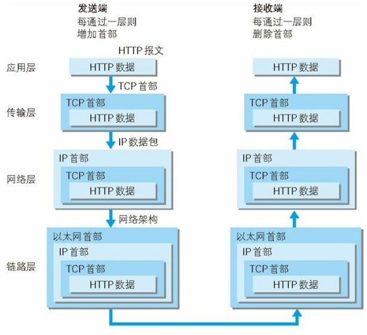 

###  1.4　与 HTTP 关系密切的协议 : IP、TCP 和 DNS 

####  1.4.1 负责传输的IP协议 

 IP确定网络节点,MAC确定具体物理机,这两者之间通过ARP协议可以通信 

 ARP不能跨网,所以会发给网关,由网关向目的网络通信(称为路由). 

####  1.4.2 确保可靠性的TCP 

 提供可靠的字节流服务(是指大块数据分割成以报文段为单位的数据包进行管理). 

 经典的三次握手:  

​	 SYN(可以帮助服务器区分是哪个客户端发起)   

​	 ACK(帮助客户端区分是哪个服务器返回) 

###  1.5 域名解析 

 域名与IP之间的映射关系就靠DNS了. 

###  1.6 各种协议与HTTP协议的关系 

 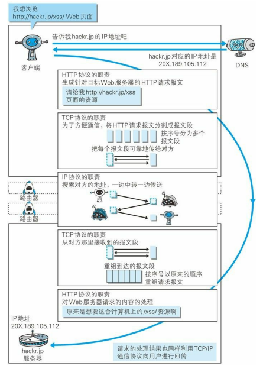 

###  1.7 URI与URL 

-  Uniform 规定统一的格式可方便处理多种不同类型的资源 
-  Resource 资源的定义是“可标识的任何东西” 
-  Identifier 表示可标识的对象。也称为标识符 

####  1.7.2 URI 格式  

 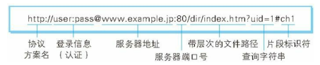 

##  第 2 章 简单的 HTTP 协议 

###  2.1 HTTP 协议用于客户端和服务器端之间的通信 

 用 HTTP 协议能够明确区分哪端是客户端，哪端是服务器端 

###  2.2 通过请求和响应的交换达成通信 

 请求必定由客户端发起. 

 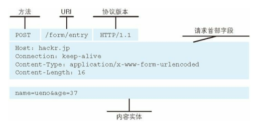 

 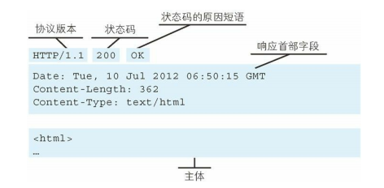 

###  2.3 HTTP 是不保存状态的协议 

​	 故意设计,为了处理大量事务.无法区分两次请求是否来自同一个浏览器. 

​	 利用Cookie解决辨别浏览器 

###  2.4 请求 URI 定位资源  

 如果不是访问特定资源而是对服务器本身发起请求，可以用一个 * 来代替请求 URI 

```
OPTIONS * HTTP/1.1 # 用于获取HTTP服务器支持的HTTP方法种类
```

###  2.5 告知服务器意图的 HTTP 方法 

 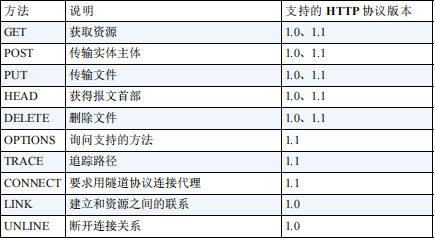 

-  CONNECT 方法要求在与代理服务器通信时建立隧道，实现用隧道协议进行 TCP 通信。主要使用 SSL（Secure Sockets Layer，安全套接层）和 TLS（Transport Layer Security，传输层安全）协议把通信内容加 密后经网络隧道传输。 

###  2.6 使用方法下达命令 

###  2.7 持久连接节省通信量  

 每要一个资源就这样进行一次通信,那么一个首页可能就要进行几十次链接. 

 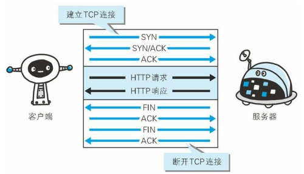 

####  2.7.1 持久连接  

 持久连接的特点是，只要任意一端没有明确提出断开连接，则保持 TCP 连接状态。  

####  2.7.2 管线化  

 持久连接使得多数请求以管线化（pipelining）方式发送成为可能。 

 回合制游戏变成动作类游戏 

 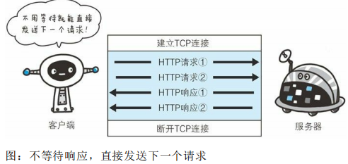 

###  2.8 使用 Cookie 的状态管理 

 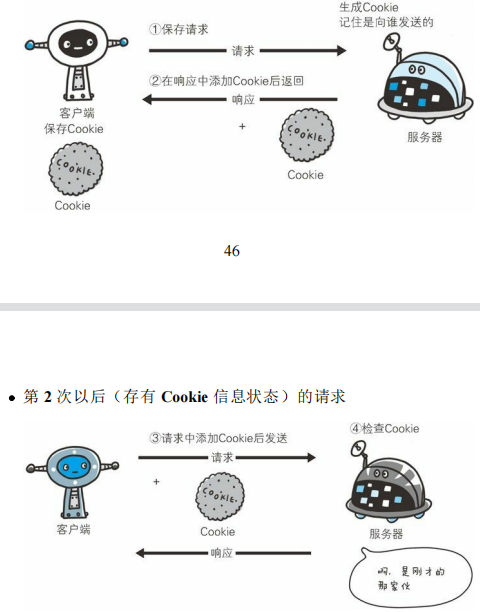 

##  第 3 章 HTTP 报文内的 HTTP 信息 

###  3.1 HTTP 报文  

 用于 HTTP 协议交互的信息被称为 HTTP 报文,分为请求报文和响应报文(在浏览器F12可以看到) 

 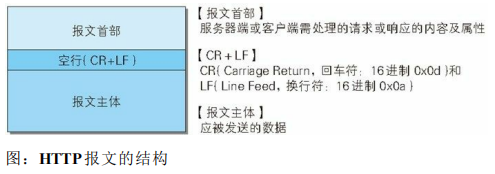 

###  3.2 请求报文及响应报文的结构 

 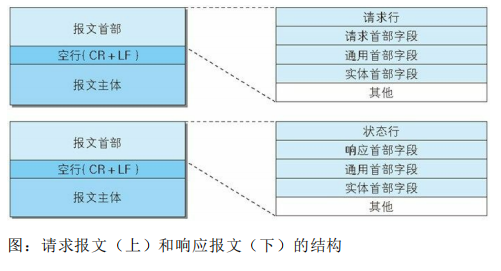 

###  3.3 编码提升传输速率 

####  3.3.1 报文主体和实体主体的差异  

-  报文: HTTP通信基本单位,由字节构成. 
-  实体: 请求或响应的有效载荷 
-  通常 实体主体等于报文主体,只有进行编码时候才不一致 

####  3.3.2 压缩传输的内容编码 

 内容编码指明应用在实体内容上的编码格式，并保持实体信息原样压缩。内容编码后的实体由客户端接收并负责解码。 

 常用的压缩算法有: gzip compress deflate 

####  3.3.3 分割发送的分块传输编码 

 当传输文件超大时候,实体就会特别大,当客户端没有接收完毕是无法显示的. 

 那么就把大文件切割为小文件,让客户端逐步显示. 

 这种把实体主体分块的功能称为分块传输编码 

 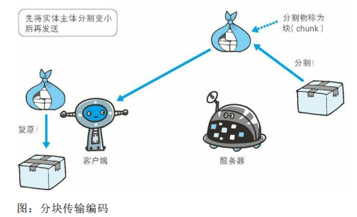 

###  3.4 发送多种数据的多部分对象集合 

 MIME（Multipurpose Internet Mail Extensions，多用途因特网邮件扩展） 

 在 HTTP 报文中使用多部分对象集合时，需要在首部字段里加上 Content-type。 

###  3.5 获取部分内容的范围请求  

  

###  3.6 内容协商返回最合适的内容  

 内容协商机制是指客户端和服务器端就响应的资源内容进行交涉，然后提供给客户端最为适合的资源。内容协商会以响应资源的语言、字符集、编码方式等作为判断的基准。  

-  Accept - Charset/Encoding/Language等 
-  服务器驱动协商（Server-driven Negotiation） 
-  客户端驱动协商（Agent-driven Negotiation）  
-  透明协商（Transparent Negotiation）  

##  第 4 章 返回结果的 HTTP 状态码 

###  4.1 状态码告知从服务器端返回的请求结果 

 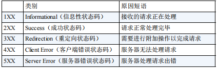 

###  4.2 2XX 成功 

-  200 OK 
-  204 No Content 
-  206 Partial Content 

###  4.3 3XX 重定向  

-  301 Moved Permanently 
-  302 Found 
-  303 See Other -- 跟302一样,指明用get请求 

###  4.4 4XX 客户端错误 

-  400 Bad Request 
-  401 Unauthorized  
-  403 Forbidden 
-  404 Not Found 

###  4.5 5XX 服务器错误 

-  500 Internal Server Error  
-  503 Service Unavailable 

##  第 5 章 与 HTTP 协作的 Web 服务器 

###  5.1 用单台虚拟主机实现多个域名  

 利用了虚拟主机（Virtual Host，又称虚拟服务器）的功能 

 客户端访问的时候是以IP访问的,域名作为请求头数据发送 

###   5.2 通信数据转发程序 ：代理、网关、隧道 

-  代理是一种有转发功能的应用程序，它扮演了位于服务器和客户端“中间人”的角色 
-  网关是转发其他服务器通信数据的服务器 
-  隧道是在相隔甚远的客户端和服务器两者之间进行中转，并保持双方通信连接的应用程序 

####  5.2.1 代理  

 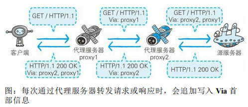 

-  缓存代理: 会预先将资源的副本（缓存）保存在代理服务器上。 
-  透明代理: 转发请求或响应时，不对报文做任何加工的代理类型被称为透明代理 

###  5.2.2 网关  

  

 利用网关能提高通信的安全性，因为可以在客户端与网关之间的通信线路上加密以确保连接的安全。 

####  5.2.3 隧道  

 隧道可按要求建立起一条与其他服务器的通信线路，届时使用 SSL等加密手段进行通信。隧道的目的是确保客户端能与服务器进行安全的通信。 

  

###  5.3 保存资源的缓存 

 优势在于利用缓存可避免多次从源服务器转发资源 

####  5.3.1 缓存的有效期限 

 即使存在缓存，也会因为客户端的要求、缓存的有效期等因素，向源服务器确认资源的有效性。 

####  5.3.2 客户端的缓存  

 缓存不仅可以存在于缓存服务器内，还可以存在客户端浏览器中。以 Internet Explorer 程序为例，把客户端缓存称为临时网络文件  

##  第 6 章 HTTP 首部  

###  6.1 HTTP 报文首部  

 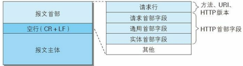 

###  6.2 HTTP 首部字段 

####  6.2.1 HTTP 首部字段传递重要信息  

 使用首部字段是为了给浏览器和服务器提供报文主体大小、所使用的语言、认证信息等内容 

####  6.2.2 HTTP 首部字段结构 

>  首部字段名: 字段值  
>
>  Keep-Alive: timeout=15, max=100  
>
>  重复出现的话不确定先处理哪个 

####  6.2.3 4 种 HTTP 首部字段类型 

-  通用首部字段（General Header Fields）  
-  请求首部字段（Request Header Fields） 
-  响应首部字段（Response Header Fields） 
-  实体首部字段（Entity Header Fields）  

####  6.2.4 HTTP/1.1 首部字段一览  

####  6.2.5 非 HTTP/1.1 首部字段  

 有 Cookie、Set-Cookie 和 Content-Disposition 等在其他 RFC 中定义的首部字段，它们的使用频率也很高 

####  6.2.6 End-to-end 首部和 Hop-by-hop 首部 

 HTTP 首部字段将定义成缓存代理和非缓存代理的行为 

-  端到端首部（End-to-end Header）此类别中的首部会转发给请求 / 响应对应的最终接收目标,且必须保存在由缓存生成的响应中 
-  逐跳首部（Hop-by-hop Header）此类别中的首部只对单次转发有效，会因通过缓存或代理而不再转发。 

###  6.3 HTTP/1.1 通用首部字段 

####  6.3.1 Cache-Control  

>  Cache-Control: private, max-age=0, no-cache  

 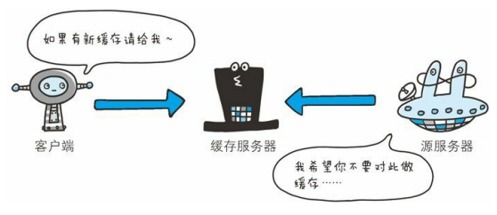 

####  6.3.2 Connection 

-  控制不再转发给代理的首部字段 -- 可控制不再转发给代理的首部字段（即 Hop-by-hop 首 部）。  
-  管理持久连接  

####  6.3.3 Date 

 Date 表明创建 HTTP 报文的日期和时间 

####  6.3.4 Pragma  

 历史遗留字段,通用首部字段，但只用在客户端发送的请求中。客户端会要求所有的中间服务器不返回缓存的资源。  

####  6.3.5 Trailer  

 首部字段 Trailer 会事先说明在报文主体后记录了哪些首部字段。该首部字段可应用在 HTTP/1.1 版本分块传输编码时 

####  6.3.6 Transfer-Encoding 

 首部字段 Transfer-Encoding 规定了传输报文主体时采用的编码方式。  

 HTTP/1.1 的传输编码方式仅对分块传输编码有效。  

####  6.3.7 Upgrade  

 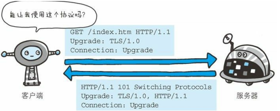 

####  6.3.8 Via  

 报文经过代理或网关时，会先在首部字段 Via 中附加该服务器的信 息，然后再进行转发。 

####  6.3.9 Warning  

 HTTP/1.1 的 Warning 首部是从 HTTP/1.0 的响应首部（Retry-After）演变过来的。该首部通常会告知用户一些与缓存相关的问题的警告。 

###  6.4 请求首部字段  

####  6.4.1 Accept  

 通知服务器，用户代理能够处理的媒体类型及媒体类型的相对优先级。可使用 type/subtype 这种形式，一次指定多种媒体类型。  

####  6.4.2 Accept-Charset  

####  6.4.3 Accept-Encoding  

####  6.4.4 Accept-Language  

####  6.4.5 Authorization 

 通常，想要通过服务器认证的用户代理会在接收到返回的401 状态码响应后，把首部字段 Authorization 加入请求中。 

####  6.4.6 Expect  

####  6.4.7 From  

 首部字段 From 用来告知服务器使用用户代理的用户的电子邮件地址。 

####  6.4.8 Host  

####  6.4.9 If-Match  

 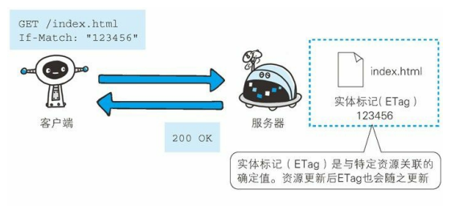 

###  6.4.10 If-Modified-Since  

####  6.4.11 If-None-Match 

####  6.4.12 If-Range  

 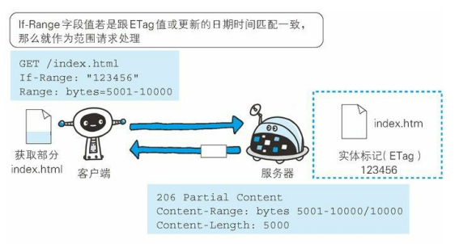 

####  6.4.13 If-Unmodified-Since  

####  6.4.14 Max-Forwards  

 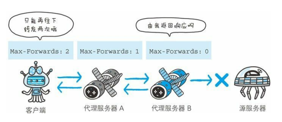 

####  6.4.15 Proxy-Authorization  

 认证行为发生在客户端与代理之间 

####  6.4.16 Range  

 对于只需获取部分资源的范围请求，包含首部字段 Range 即可告知服务器资源的指定范围。 

####  6.4.17 Referer 

 首部字段 Referer 会告知服务器请求的原始资源的 URI。 出于安全性考虑(可能带有密码等)也可能不带上. 

####  6.4.18 TE  

 告知服务器客户端能够处理响应的传输编码方式及相对优先级 

####  6.4.19 User-Agent 

 创建请求的浏览器和用户代理名称等信息传达给服务器。  

 爬虫发起请求时,可能在字段内添加爬虫作者的电子邮件地址 

###  6.5 响应首部字段 

####  6.5.1 Accept-Ranges 

 用来告知客户端服务器是否能处理范围请求，以指定获取服务器端某个部分的资源。  

####  6.5.2 Age 

 源服务器在多久前创建了响应。字段值的单位为秒。 

####  6.5.3 ETag 

 告知客户端实体标识。它是一种可将资源以字符串形式做唯一性标识的方式。服务器会为每份资源分配对应的 ETag 值。  

-  强 ETag 值 -- 不论实体发生多么细微的变化都会改变其值。 
-  弱 ETag 值 -- 只用于提示资源是否相同。只有资源发生了根本改变，产生差异时才会改变 ETag 值。这 

####  6.5.4 Location 

 将响应接收方引导至某个与请求 URI 位置不同的资源。一般配合重定向. 

####  6.5.5 Proxy-Authenticate  

 把由代理服务器所要求的认证信息发送给客户端。  

####  6.5.6 Retry-After  

 告知客户端应该在多久之后再次发送请求。主要配合状态码 503 Service Unavailable 响应，或 3xx Redirect 响应一起使用。 

####  6.5.7 Server  

 告知客户端当前服务器上安装的 HTTP 服务器应用程序的信息。 

####  6.5.8 Vary  

 可对缓存进行控制。源服务器会向代理服务器传达关于本地缓存使用方法的命令。 

####  6.5.9 WWW-Authenticate 

 首部字段 WWW-Authenticate 用于 HTTP 访问认证 

###  6.6 实体首部字段 

####  6.6.1 Allow  

 于通知客户端能够支持 Request-URI 指定资源的所有 HTTP 方法。当服务器接收到不支持的 HTTP 方法时，会以状态码 405 Method Not Allowed 作为响应返回。 

####  6.6.2 Content-Encoding  

 告知客户端服务器对实体的主体部分选用的内容编码方式 

####  6.6.3 Content-Language 

 告知客户端，实体主体使用的自然语言 

####  6.6.4 Content-Length  

 表明了实体主体部分的大小（单位是字节) 

 对实体主体进行内容编码传输时，不能再使用 Content-Length 首部字段。 

####  6.6.5 Content-Location 

 给出与报文主体部分相对应的 URI。 

####  6.6.6 Content-MD5  

 首部字段 Content-MD5 是一串由 MD5 算法生成的值，其目的在于检查报文主体在传输过程中是否保持完整，以及确认传输到达。  

 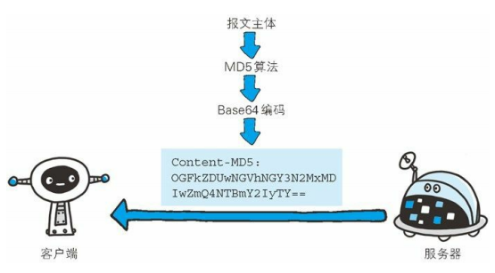 

####  6.6.7 Content-Range  

 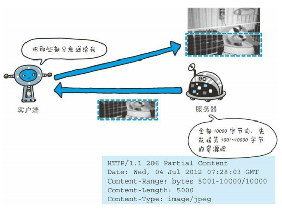 

####  6.6.8 Content-Type 

 和首部字段 Accept 一样，字段值用 type/subtype 形式赋值 

####  6.6.9 Expires  

 Expires 会将资源失效的日期告知客户端。 

 首部字段 Cache-Control 有指定 max-age 指令时，比起首部字段 Expires，会优先处理 max-age 指令。 

####  6.6.10 Last-Modified  

 类似使用 CGI 脚本进行动态数据处理时，该值有可能会变成数据最终修改时的时间。  

###  6.7 为 Cookie 服务的首部字段  

 Cookie 的工作机制是用户识别及状态管理。 

 调用 Cookie 时，由于可校验 Cookie 的有效期，以及发送方的域、路径、协议等信息，所以正规发布的 Cookie 内的数据不会因来自其他 Web 站点和攻击者的攻击而泄露。 

-  由网景公司颁布的规格标准  
-  RFC2109 某企业尝试以独立技术对Cookie进行标准化 
-  RFC2965 解决IE与网景浏览器的问题 
-  RFC6265 网景公司标准再扩展 

####  6.7.1 Set-Cookie  

 当服务器准备开始管理客户端的状态时，会事先告知各种信息。 

 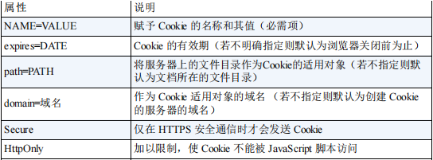 

####  6.7.2 Cookie  

 当客户端想获得 HTTP 状态管理支持时，就会在请求中包含从服务器接收到的 Cookie。 

###  6.8 其他首部字段  

####  6.8.1 X-Frame-Options 

 属于 HTTP 响应首部，用于控制网站内容在其他 Web 网站的 Frame 标签内的显示问题。其主要目的是为了防止点击劫持（clickjacking）攻击。 

####  6.8.2 X-XSS-Protection 

 属于 HTTP 响应首部，它是针对跨站脚本攻击（XSS）的一种对策，用于控制浏览器 XSS 防护机制的开关。  

####  6.8.3 DNT 

 HTTP 请求首部，其中 DNT 是 Do Not Track 的简称，意为拒绝个人信息被收集，是表示拒绝被精准广告追踪的一种方法。 

####  6.8.4 P3P  

 属于 HTTP 相应首部，通过利用 P3P（The Platform for Privacy Preferences，在线隐私偏好平台）技术，可以让 Web 网站上的个人隐私变成一种仅供程序可理解的形式，以达到保护用户隐私的目的 

##  第 7 章 确保 Web 安全的HTTPS 

###  7.1 HTTP 的缺点  

####  7.1.1 通信使用明文可能会被窃听 

 HTTP 本身不具备加密的功能，所以也无法做到对通信整体进行加密。 

-  TCP/IP是可能被窃听的网络。 

  -  通信线路都是可能窃听的，各种抓包工具（Wireshark等） 

     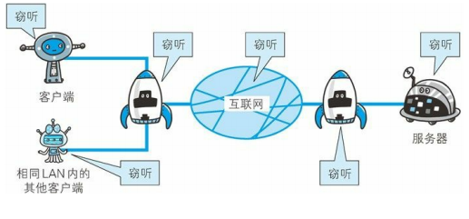 

-  加密处理防止被窃听  
  -  通信的加密 -- HTTP 协议中没有加密机制，但可以通过和SSL（Secure Socket Layer，安全套接层）或 TLS（Transport Layer Security，安全层传输协议）的组合使用 
  -  内容的加密  -- HTTP 报文里所含的内容进行加密处理。和SSL相比内容仍有可能被篡改。 

####  7.1.2 不验证通信方的身份就可能遭遇伪装  

 HTTP 协议中的请求和响应不会对通信方进行确认。 

-  任何人都可发起请求  

  -  有可能是已伪装的 Web 服务器 
  -  有可能是已伪装的客户端 
  -  无法确定正在通信的对方是否具备访问权限。 
  -  无法判定请求是来自何方、出自谁手。 
  -  即使是无意义的请求也会照单全收。无法阻止海量请求下的 DoS 攻击 

-  查明对手的证书  

  -  SSL不仅提供加密处理，而且还使用了一种被称为证书的手段，可用于确定方。 

  -  证书由值得信任的第三方机构颁发，用以证明服务器和客户端是实际存在的 
  -  客户端持有证书即可完成个人身份的确认，也可用于对 Web 网站的认证环节。  

####  7.1.3 无法证明报文完整性，可能已遭篡改  

-  接收到的内容可能有误 

   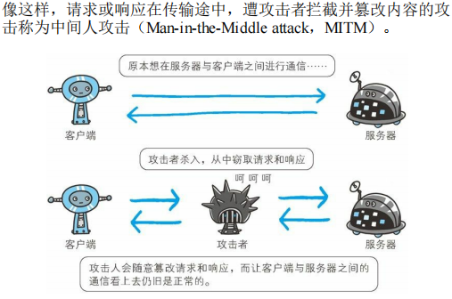 

-  如何防止篡改 
  -  虽然有使用 HTTP 协议确定报文完整性的方法，但事实上并不便 捷、可靠。其中常用的是 MD5 和 SHA-1 等散列值校验的方法，以及用来确认文件的数字签名方法。 
  -  SSL提供认证和加密处理及摘要功能。 

###  7.2 HTTP+ 加密 + 认证 + 完整性保护 =HTTPS  

#### 7.2.1 HTTP 加上加密处理和认证以及完整性保护后即是HTTPS

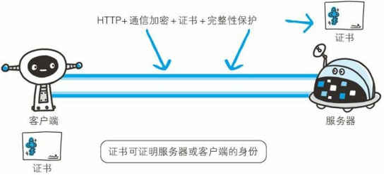

#### **7.2.2 HTTPS** 是身披 **SSL** 外壳的 **HTTP** 

其他运行在应用层的 SMTP 和 Telnet 等协议均可配合 SSL协议使用。

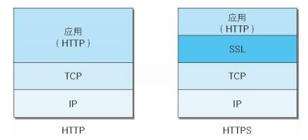

#### **7.2.3** 相互交换密钥的公开密钥加密技术

- 共享密钥加密的困境 

  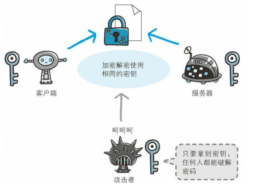

- 使用两把密钥的公开密钥加密

  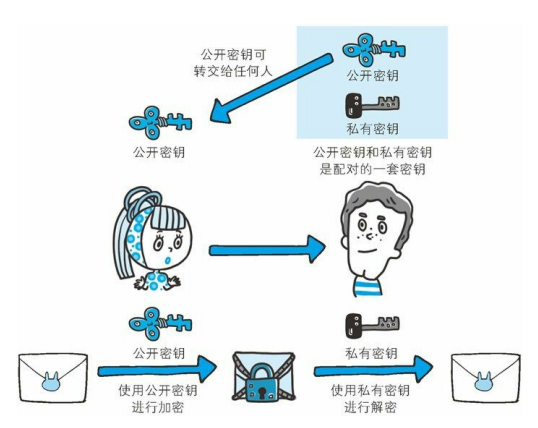

- HTTPS 采用混合加密机制

  在交换密钥环节使用公开密钥加密方式，之后的建立通信交换报文阶段则使用共享密钥加密方式。 

  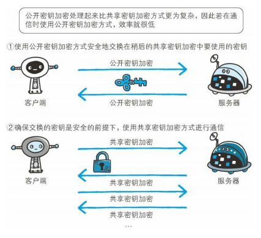

#### **7.2.4** 证明公开密钥正确性的证书

使用由数字证书认证机构（CA，Certificate Authority）和其相关机关颁发的公开密钥证书。

数字证书认证机构处于客户端与服务器双方都可信赖的第三方机构的立场上。威瑞信（VeriSign）就是其中一家非常有名的数字证书认证机构。

- 运营人员向CA提出公开密钥申请
- CA判明身份后,对密钥做数组签名,然后将密钥放入证书绑定
- 服务器将证书发给客户端
- 客户端根据证书可以使用CA的公开密钥解密验证.(CA的公开密钥通常会事先植入浏览器,防止被篡改)

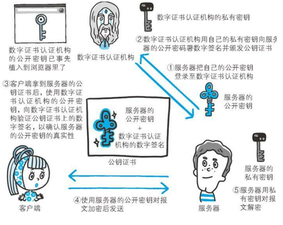

- 可证明组织真实性的 **EV SSL** 证书

- 用以确认客户端的客户端证书 

  > 银行的网上银行就采用了客户端证书。在登录网银时不仅要求用户确认输入 ID 和密码，还会要求用户的客户端证书，以确认用户是否从特定的终端访问网银。

- 认证机构信誉第一
- 由自认证机构颁发的证书称为自签名证书 

#### **7.2.5 HTTPS** 的安全通信机制

1. 以下步骤是建立在TCP连接已经完成的情况下
2. 步骤分析
   1. Hello报文: 作用发起连接,表明自己使用的加密算法等信息
   2. KeyExchange包含Pre-master secret随机密码串,用于对称加密
   3. TCP连接断掉之前,先发送close_notify报文.
   4. 应用层发送数据时会附加一种叫做 MAC 报文摘要
3. 总结
   1. SSL与TLS,后者基于前者发展而来,SSL是网景公司率先倡导的
   2. SSL速度慢吗?  是!慢2~100倍的样子
      1. 建立连接的时候需要多一次握手
      2. 发送数据时候需要加密解密
      3. 解决方案可以使用专用的硬件加速,建议在需要安全可靠的情况下才使用.

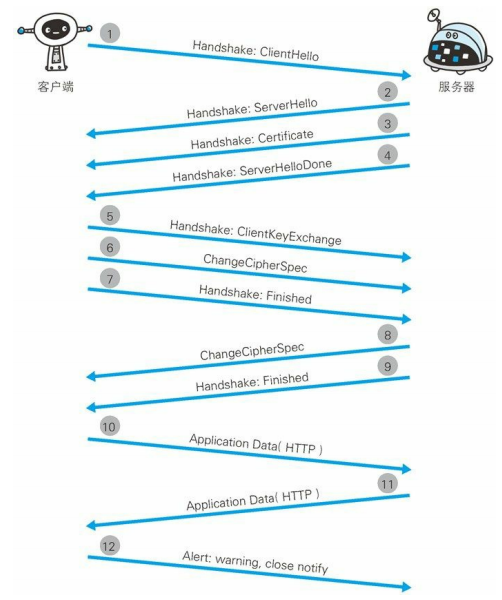

## 第 **8** 章 确认访问用户身份的认证

### **8.1** 何为认证 

客户端表明身份,服务端进行验证。

#### **8.2 BASIC** 认证

用户名密码验证，可以通过401进行告知。客户端通过Base64进行编码告知。不是加密处理，可以直接解码得到，所以不安全。并且无法实现注销操作。

#### **8.3 DIGEST** 认证 

为了解决BASIC缺点，使用了该技术，也是基于质询/响应的方式。

1. 服务器响应401 Authorization，带有指纹响应方式认证的所需的临时质询码
2. 客户端得到DIGEST之后填充相应的信息，会经过MD5运算
3. 可以防止密码被劫，但是不能识别伪装。

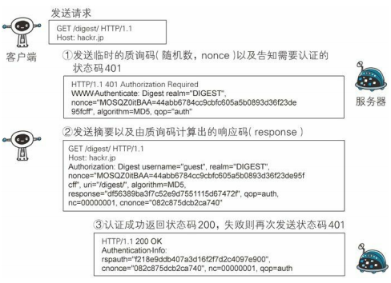

#### **8.4 SSL** 客户端认证 

可以避免伪造，因为利用证书完成认证。

#### **8.4.1 SSL** 客户端认证的认证步骤 

需要事先将客户端证书分发给客户端，且客户端必须安装此证书。

客户端将证书发给服务器认证后，才能开始HTTPS通信。

#### **8.4.2 SSL** 客户端认证采用双因素认证

一般配合表单进行认证，也就是客户端证书+账号密码进行认证。

#### **8.4.3 SSL** 客户端认证必要的费用

从认证机构购买客户端证书的费用，以及服务器运营者为保证自己搭建的认证机构安全运营所产生的费用。 

### **8.5** 基于表单认证

基于表单的认证方法并不是在 HTTP 协议中定义的。就是常见的页面登录（使用HTTPS？）

#### **8.5.1** 认证多半为基于表单认证 

BASIC 和 DIGEST 认证几乎不用，SSL客户端太贵，通常是Web程序认证。比如 SSH 和 FTP 协议需要考虑好认证安全问题。

#### **8.5.2 Session** 管理及 **Cookie** 应用 

基于表单认证一般会使用 Cookie 来管理 Session（会话）。 

1. Cookie可能被劫持，所以为了避免XSS攻击，建议httponly属性
2. 密码建议使用hash加上salt进行加密保存。

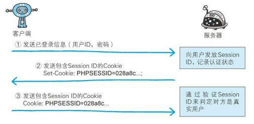

## 第 **9** 章 基于 **HTTP** 的功能追加协议

### **9.1** 基于 **HTTP** 的协议 

添加新功能，优化性能

#### **9.2** 消除 **HTTP** 瓶颈的 **SPDY**

Google 在 2010 年发布了 SPDY（取自 SPeeDY，发音同 speedy），其开发目标旨在解决 HTTP 的性能瓶颈，缩短 Web 页面的加载时间（50%）。

##### **9.2.1 HTTP** 的瓶颈

- 无法实时更新
- 信息没有压缩，首部冗余
- 客户端不接受指令

1. AJAX -- 局部更新问题解决

   一种有效利用 JavaScript 和 DOM的操作，局部更新数据。基于XMLHttpRequest的API发起HTTP通讯。

2. Comet的解决方案 -- 实时更新问题解决

   服务器内容更新，推送给客户端。通过先将响应挂起，更新数据再返回响应的流程

3. SPDY目标

   在协议级别消除 HTTP 所遭遇的瓶颈。

#### **9.2.2 SPDY**的设计与功能 

SPDY 没有完全改写 HTTP 协议，而是在 TCP/IP 的应用层与运输层之间通过新加会话层的形式运作。同时，考虑到安全性问题，SPDY 规定通信中使用 SSL。

- 多路复用 -- 一个TCP可以对应多个HTTP请求
- 请求具有优先级
- 压缩HTTP头部
- 推送功能 -- 提前将数据发送，可以避免多次请求
- 服务器提示功能 -- 提示客户端需要的资源

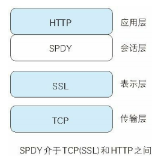

#### **9.2.3 SPDY**消除 **Web** 瓶颈了吗

SPDY 基本上只是将单个域名（ IP 地址）的通信多路复用，所以当一个 Web 网站上使用多个域名下的资源，改善效果就会受到限制。

的确是一种可有效消除 HTTP 瓶颈的技术

### 9.3 使用浏览器进行全双工通信的WebSocket 

是一套新的协议

#### **9.3.1 WebSocket** 的设计与功能

全双工标准，解决AJAX和Comet

#### **9.3.2 WebSocket** 协议

- 建立在HTTP之上，原协议之上升级
- 推送功能
- 减少通信量，长连接，HTTP建立连接之后需要完成一次握手
  - 握手请求，用到HTTP的Upgrade字段，内容是websocket
  - 握手响应 ，对于之前的请求返回101状态码（Switching Protocals)
  - 完成之后，使用WebSocket独立的数据帧传输。
- WebSocket API 
  - JS可以通过新的API进行访问，地址协议由http变成ws

### **9.4** 期盼已久的 **HTTP/2.0**

目标是改善用户在使用 Web 时的速度体验。基本上都会先通过 HTTP/1.1 与 TCP 连接

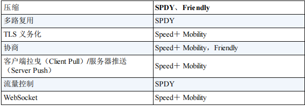

### **9.5 Web** 服务器管理文件的 **WebDAV**

是一个可对 Web 服务器上的内容直接进行文件复制、编辑等操作的分布式文件系统。（比如通过PUT等方法进行修改）

#### **9.5.1** 扩展 **HTTP/1.1** 的 **WebDAV**

- 具有锁的概念，文件锁定后不能修改，并发问题

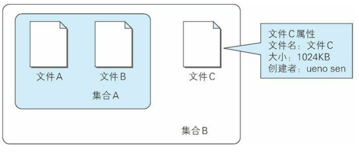

#### **9.5.2 WebDAV** 内新增的方法及状态码

| 方法          | 说明     | 状态码                       | 说明               |
| ------------- | -------- | ---------------------------- | ------------------ |
| **PROPFIND**  | 获取属性 | **102 Processing**           | 可正常处理请求     |
| **PROPPATCH** | 修改属性 | **207 Multi-Status**         | 存在多种状态       |
| **MKCOL**     | 创建集合 | **422 Unprocessible Entity** | 格式正确，内容有误 |
| 。。。        | 。。。   | 。。。                       | 。。。             |

- 为何 **HTTP** 协议受众如此广泛 
  - 大多数系统使用
  - 防火墙如果使用新协议需要用新端口
  - HTTP协议本身比较简单

## 第 **10** 章 构建 **Web** 内容的技术

### **10.1 HTML** 

#### **10.1.1 Web** 页面几乎全由 **HTML** 构建 

HTML（HyperText Markup Language，超文本标记语言）是为了发送Web 上的超文本（Hypertext）而开发的标记语言

- 超文本： 文档系统，可以和任意位置的其他信息建立关联（超链接）
- 标记语言： 通过特殊字符串修饰文档，特殊字符串称为标签。

#### **10.1.2 HTML** 的版本

Tim Berners-Lee 提出 HTTP 概念的同时，还提出了 HTML原型。

已经发展到5.0，但是依旧有兼容性问题。

#### **10.1.3** 设计应用 **CSS**

层叠样式表可以指定如何展现 HTML 内的各种元素，属于样式表标准之一。跟文档本身分离，达到解耦的目的。

### **10.2** 动态 **HTML**

#### **10.2.1** 让 **Web** 页面动起来的动态 **HTML** 

通过调用客户端脚本语言 JavaScript，实现对HTML的 Web 页面的动态改造。利用 DOM（Document Object Model，文档对象模型）可指定欲发生动态变化的 HTML元素。

#### **10.2.2** 更易控制 **HTML** 的 **DOM** 

DOM 是用以操作 HTML文档和 XML文档的 API

### **10.3 Web** 应用

#### **10.3.1** 通过 **Web** 提供功能的 **Web** 应用

原本应用 HTTP 协议的 Web 的机制就是对客户端发来的请求，返回事前准备好的内容。

由服务器动态生成的HTML（比如PHP，JSP等）叫动态页面。

#### **10.3.2** 与 **Web** 服务器及程序协作的 **CGI** 

CGI（Common Gateway Interface，通用网关接口）是指 Web 服务器在接收到客户端发送过来的请求后转发给程序的一组机制。

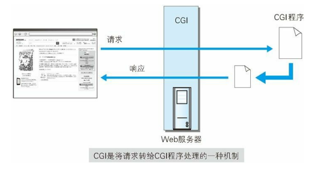

#### **10.3.3** 因 **Java** 而普及的 **Servlet**

Servlet 是一种能在服务器上创建动态内容的程序

CGI，由于每次接到请求，程序都要跟着启动一次。因此一旦访问量过大，Web 服务器要承担相当大的负载。而 Servlet 运行在与 Web 服务器相同的进程中，因此受到的负载较小

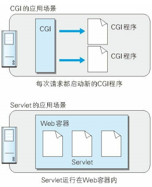

### **10.4** 数据发布的格式及语言

#### **10.4.1** 可扩展标记语言

XML（eXtensible Markup Language，可扩展标记语言）是一种可按应用目标进行扩展的通用标记语言

XML和 HTML都是从标准通用标记语言 SGML

#### **10.4.2** 发布更新信息的 **RSS/Atom**

RSS（简易信息聚合，也叫聚合内容）和 Atom 都是发布新闻或博客日志等更新信息文档的格式的总称。两者都用到了 XML。 

#### **10.4.3 JavaScript** 衍生的轻量级易用 **JSON** 

JSON（JavaScript Object Notation）是一种以JavaScript（ECMAScript）的对象表示法为基础的轻量级数据标记语言。能够处理的数据类型有 false/null/true/ 对象 / 数组 / 数字 / 字符串，这 7 种类型。 

## 第 **11** 章 **Web** 的攻击技术

### **11.1** 针对 **Web** 的攻击技术

简单的 HTTP 协议本身并不存在安全性问题，因此协议本身几乎不会成为攻击的对象

#### **11.1.1 HTTP** 不具备必要的安全功能

几乎现今所有的 Web 网站都会使用会话（session）管理、加密处理等安全性方面的功能

开发者需要自行设计并开发认证及会话管理功能来满足 Web 应用的安全。

#### **11.1.2** 在客户端即可篡改请求

在 HTTP 请求报文内加载攻击代码，就能发起对 Web 应用的攻击。通过 URL查询字段或表单、HTTP 首部、Cookie 等途径把攻击代码传入，

#### **11.1.3** 针对 **Web** 应用的攻击模式 

- 以服务器为目标的主动攻击 -- 直接访问web应用，传入攻击代码

  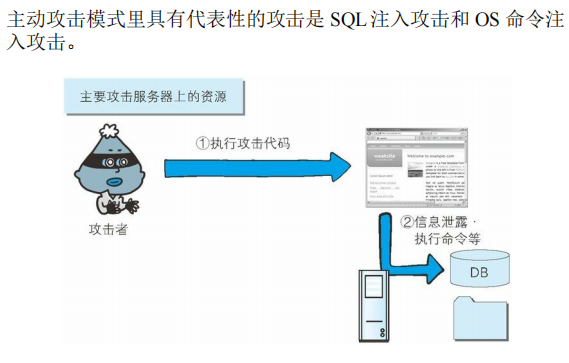

- 以服务器为目标的被动攻击 --跨站脚本攻击和跨站点请求伪造
- 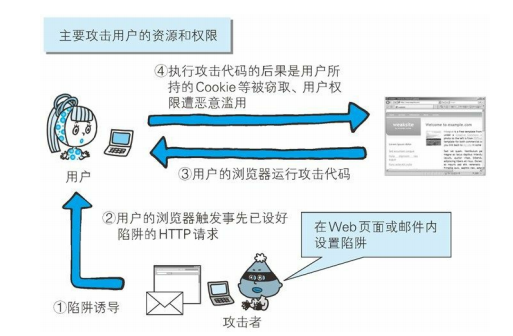

### **11.2** 因输出值转义不完全引发的安全漏洞

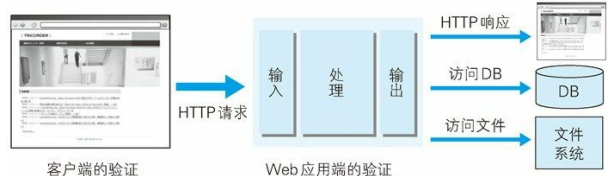

#### **11.2.1** 跨站脚本攻击

Cross-Site Scripting，XSS。指通过存在安全漏洞的 Web 网站注册用户的浏览器内运行非法的 HTML标签或 JavaScript 进行的一种攻击。

- 利用虚假输入表单骗取用户个人信息。
- 利用脚本窃取用户的 **Cookie** 值，被害者在不知情的情况下，帮助攻击者发送恶意请求。 
- 显示伪造的文章或图片。 

#### **11.2.2 SQL** 注入攻击 

- 会执行非法 **SQL** 的 **SQL** 注入攻击 

  针对数据库的攻击，可以规避认证，非法查看篡改数据

#### **11.2.3 OS** 命令注入攻击

通过 Web 应用，执行非法的操作系统命令达到攻击的目的。

比如打开文件时候，文件名被注入shell命令。

#### **11.2.4 HTTP** 首部注入攻击

指攻击者通过在响应首部字段内插入换行，添加任意响应首部或主体的一种攻击

向首部主体内添加内容的攻击称为 HTTP 响应截断攻击（注入两个换行）

影响： 设置Cookie，重定向URL

滥用 HTTP/1.1 中汇集多响应返回功能，会导致缓存服务器对任意内容进行缓存操作。这种攻击称为缓存污染。

#### **11.2.5** 邮件首部注入攻击 

攻击者通过向邮件首部 To 或 Subject 内任意添加非法内容发起的攻击。

注入换行符

#### **11.2.6** 目录遍历攻击

指对本无意公开的文件目录，通过非法截断其目录路径后，达成访问目的的一种攻击。

#### **11.2.7** 远程文件包含漏洞

指当部分脚本内容需要从其他文件读入时，攻击者利用指定外部服务器的 URL充当依赖文件，让脚本读取之后，就可运行任意脚本的一种攻击。 

### **11.3** 因设置或设计上的缺陷引发的安全漏洞

#### **11.3.1** 强制浏览 

从安置在 Web 服务器的公开目录下的文件中，浏览那些原本非自愿公开的文件。

#### **11.3.2** 不正确的错误消息处理

Web 应用的错误信息内包含对攻击者有用的信息。（包括应用错误消息和数据库错误消息）

#### **11.3.3** 开放重定向

是一种对指定的任意 URL作重定向跳转的功能。

### **11.4** 因会话管理疏忽引发的安全漏洞

#### **11.4.1** 会话劫持 

指攻击者通过某种手段拿到了用户的会话 ID，并非法使用此会话 ID 伪装成用户，达到攻击的目的。

- 通过非正规的生成方法推测会话 **ID** 
- 通过窃听或 **XSS** 攻击盗取会话 **ID** 
- 通过会话固定攻击（**Session Fixation**）强行获取会话 **ID** 

#### **11.4.2** 会话固定攻击 

对以窃取目标会话 ID 为主动攻击手段的会话劫持而言，会话固定攻击（Session Fixation）攻击会强制用户使用攻击者指定的会话 ID，属于被动攻击。

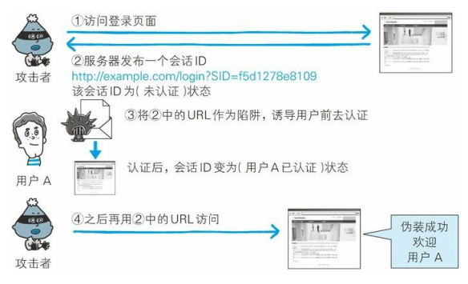

#### **11.4.3** 跨站点请求伪造

跨站点请求伪造（Cross-Site Request Forgeries，CSRF）攻击是指攻击者通过设置好的陷阱，强制对已完成认证的用户进行非预期的个人信息或设定信息等某些状态更新，属于被动攻击。 

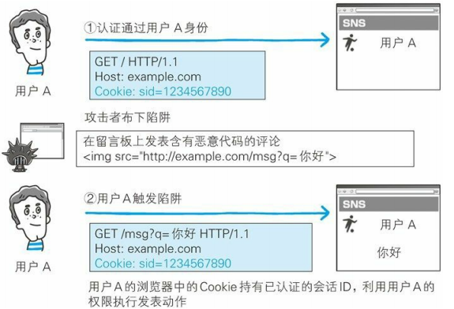

### **11.5** 其他安全漏洞

#### **11.5.1** 密码破解 

密码破解攻击（Password Cracking）即算出密码，突破认证

- 通过网络的密码试错 
  - 穷举法
  - 字典攻击
- 对已加密密码的破解
  - 通过穷举法**·**字典攻击进行类推 
  - 彩虹表 
  - 拿到密钥 
  - 加密算法的漏洞 

#### **11.5.2** 点击劫持 

点击劫持（Clickjacking）是指利用透明的按钮或链接做成陷阱，覆盖在 Web 页面之上。然后诱使用户在不知情的情况下，点击那个链接访问内容的一种攻击手段。

#### **11.5.3 DoS** 攻击 

让运行中的服务呈停止状态的攻击。

- 集中利用访问请求造成资源过载
- 通过攻击安全漏洞使服务停止

#### **11.5.4** 后门程序 

后门程序（Backdoor）是指开发设置的隐藏入口，可不按正常步骤使用受限功能。

- 开发阶段的Debug后面程序
- 开发者为了自身利益植入的后门程序 
- 攻击者通过某种方法设置的后门程序 