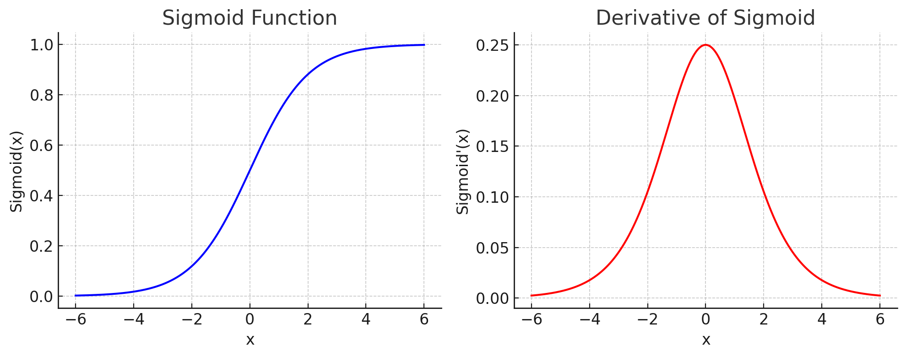
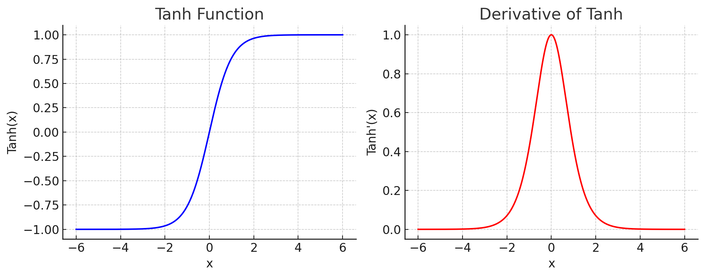
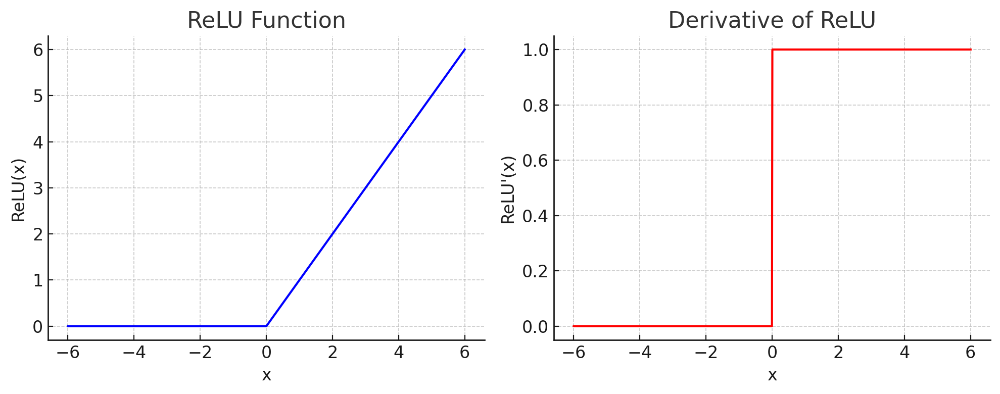
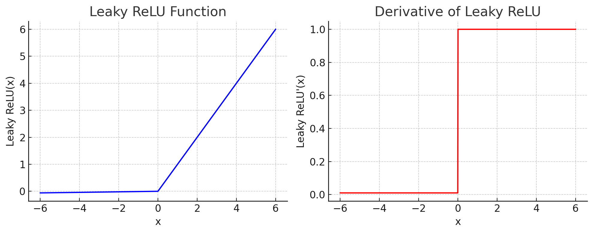
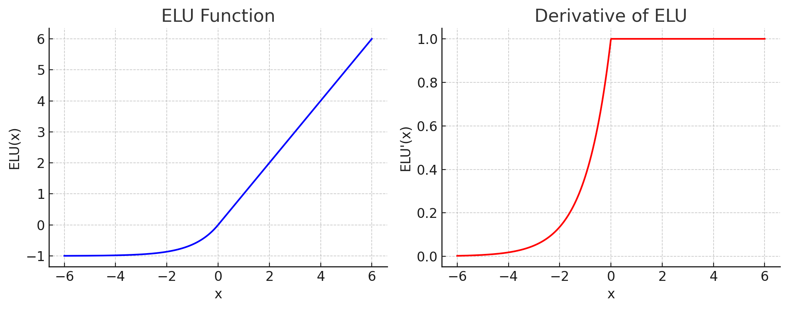
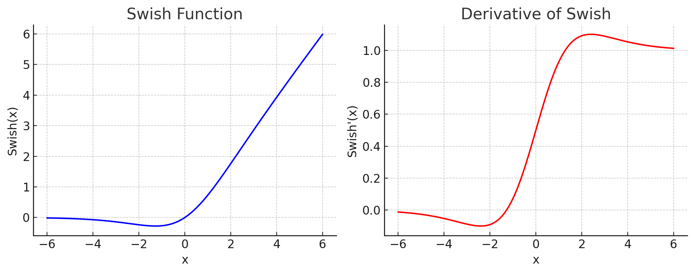
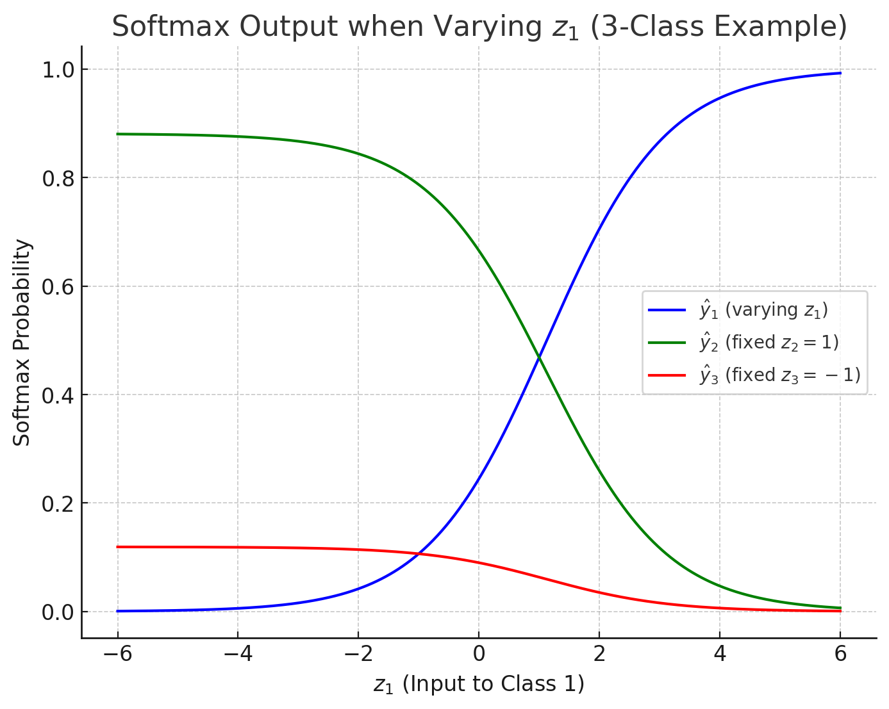

# 💡 深度学习基础知识笔记

---

## 📊 1. 基础: 分类任务评价指标

### 🎯 案例：猫狗图像二分类

以二分类问题为例，我们训练一个分类器来区分“猫（Cat）”和“狗（Dog）”的图片。

#### 📋 测试集数据

- 总样本数：100 张图像
- 真实标签分布：
  - 猫：50 张
  - 狗：50 张

#### 🤖 模型预测结果

- 预测为“猫”的图像：50 张
  - 正确预测（真实为猫）：35 张
  - 错误预测（真实为狗）：5 张
  - 未分类/错误分类（实际为狗但未识别）：10 张
- 预测为“狗”的图像：50 张
  - 正确预测（真实为狗）：25 张
  - 错误预测（真实为猫）：5 张
  - 未分类/错误分类（实际为猫但未识别）：20 张

> 📌 说明：模型**不预测不等于不中错**，在评估中视为预测错误，必须计入指标。
> - 医疗类任务：未诊断 = 漏诊，必须计入；
> - 安防任务：未识别目标 = 漏检，必须计入。

---

### ✅ 混淆矩阵（Confusion Matrix）

- TP（True Positive）：预测为猫，实际也是猫 → 35
- FP（False Positive）：预测为猫，实际是狗 → 5 + 10 = 15
- FN（False Negative）：预测为狗，实际是猫 → 5 + 20 = 25
- TN（True Negative）：预测为狗，实际也是狗 → 25

> ✅ True/False 表示预测是否正确  
> ✅ Positive/Negative 表示预测的类别是正/负类

| 实际 \ 预测       | 预测为猫（Cat） | 预测为狗（Dog） |
|------------------|------------------|------------------|
| 实际是猫（Cat）   | TP = 35           | FN = 25          |
| 实际是狗（Dog）   | FP = 15           | TN = 25          |

---

### 📈 分类指标计算

- **准确率 Accuracy**  
  > 准确率 = 正确预测数 / 总样本数  整体正确率
  
  $$
  \text{Accuracy} = \frac{TP + TN}{TP + TN + FP + FN} = \frac{35 + 25}{100} = 0.60
  $$
  
- **精确率 Precision**  
  > 猫的预测中有多少是真正的猫  正类预测的准确性
  
  $$
  \text{Precision} = \frac{TP}{TP + FP} = \frac{35}{35 + 15} = 0.70
  $$
  
- **召回率 Recall**  
  > 敏感度  所有真实是猫的样本中，预测正确的比例  真正例的识别能力
  
  $$
  \text{Recall} = \frac{TP}{TP + FN} = \frac{35}{35 + 25} = 0.583
  $$
  
- **F1 分数 F1 Score**  
  > 精确率与召回率的调和平均  综合精确率与召回率的能力
  
  $$
  \text{F1} = 2 \cdot \frac{Precision \cdot Recall}{Precision + Recall} = 2 \cdot \frac{0.7 \cdot 0.583}{0.7 + 0.583} \approx 0.632
  $$
  
- **AUC（Area Under Curve）**  
  > 留空，待二分类概率输出时补充绘制 ROC 曲线后计算

---

## 📈 2. 线性神经网络

### 2.1 线性回归(Linear Regression)
线性回归是一种基本的监督学习方法，目标是学习一个线性函数 $y = wx + b$，用来预测输入变量（特征）与输出变量（标签）之间的关系。

$$
\hat{y} = w^T x + b
$$

其中：

- $x \in \mathbb{R}^n$：输入特征向量
- $w \in \mathbb{R}^n$：模型权重
- $b \in \mathbb{R}$：偏置（截距项）
- $\hat{y}$：模型预测值

在寻找模型参数 w 和 b 之前,还需要两个东西:

- 损失函数（Loss Function）: 用于衡量模型预测值与真实值之间的差异(参考3),常用 均方误差(MSE)
  $$
  \text{MSE} = \frac{1}{n} \sum_{i=1}^n (y_i - \hat{y}_i)^2
  $$
- 优化器（Optimizer）: 用于根据损失函数的梯度更新模型参数
  训练过程中需要找到一组参数,使得损失函数最小化,这个过程称为**优化**,常用 梯度下降法
  $$
  \mathbf{w}^*, b^* = \operatorname*{argmin}_{\mathbf{w}, b}\  L(\mathbf{w}, b).
  $$

### 2.2 正态分布与平方损失
通过对噪声分布的假设来解读平方损失目标函数。
下面把高斯噪声线性回归模型的**似然函数**写清楚，并顺带给出对数似然、极大似然估计与一些扩展要点。

---

#### 1. 模型与记号

观测模型（带高斯噪声）：

$$
y = \mathbf{w}^\top \mathbf{x} + b + \epsilon,\qquad \epsilon \sim \mathcal{N}(0,\sigma^2).
$$

给定参数 $\theta=\{\mathbf{w}, b, \sigma^2\}$ 与输入 $\mathbf{x}$，则条件分布为单点高斯：

$$
p(y\mid \mathbf{x},\theta)=\mathcal{N}\!\big(y\;;\; \mathbf{w}^\top \mathbf{x}+b,\;\sigma^2\big).
$$

把偏置并到特征里更方便：令 $\tilde{\mathbf{x}}=[\mathbf{x};\,1]$，$\tilde{\mathbf{w}}=[\mathbf{w};\,b]$，则

$$
p(y\mid \tilde{\mathbf{x}},\theta)=\mathcal{N}\!\big(y\;;\; \tilde{\mathbf{w}}^\top \tilde{\mathbf{x}},\;\sigma^2\big).
$$

---

#### 2. 似然（单样本与全数据）

##### 2.1 单样本

$$
p(y\mid \mathbf{x},\theta)=\frac{1}{\sqrt{2\pi\sigma^2}}\;
\exp\!\left(-\frac{\big(y-\mathbf{w}^\top \mathbf{x}-b\big)^2}{2\sigma^2}\right).
$$

##### 2.2 全数据

假设 $N$ 个独立同分布样本 $\{(\mathbf{x}_i,y_i)\}_{i=1}^N$

独立性假设下，整体似然为乘积：

$$
\mathcal{L}(\theta)=\prod_{i=1}^N
\frac{1}{\sqrt{2\pi\sigma^2}}\;
\exp\!\left(-\frac{\big(y_i-\mathbf{w}^\top \mathbf{x}_i-b\big)^2}{2\sigma^2}\right).
$$

对数似然（更常用）：

$$
\log \mathcal{L}(\theta)
=-\frac{N}{2}\log(2\pi\sigma^2)
-\frac{1}{2\sigma^2}\sum_{i=1}^N\big(y_i-\mathbf{w}^\top \mathbf{x}_i-b\big)^2.
$$

用矩阵写更紧凑。令

$$
X=
\begin{bmatrix}
\mathbf{x}_1^\top\\
\vdots\\
\mathbf{x}_N^\top
\end{bmatrix}\in\mathbb{R}^{N\times d},\quad
\mathbf{1}\in\mathbb{R}^{N},\quad
\tilde{X}=[X\ \mathbf{1}],\quad
\tilde{\mathbf{w}}=
\begin{bmatrix}\mathbf{w}\\ b\end{bmatrix},\quad
\mathbf{y}=
\begin{bmatrix}y_1\\ \vdots\\ y_N\end{bmatrix}.
$$

则

$$
\log \mathcal{L}(\theta)=-\frac{N}{2}\log(2\pi\sigma^2)
-\frac{1}{2\sigma^2}\|\mathbf{y}-\tilde{X}\tilde{\mathbf{w}}\|_2^2.
$$

---

#### 3. 极大似然估计（MLE）

对 $\tilde{\mathbf{w}}$ 最大化 $\log \mathcal{L}$ 等价于最小化平方误差：

$$
\hat{\tilde{\mathbf{w}}}_{\text{MLE}}
=\arg\min_{\tilde{\mathbf{w}}}\ \|\mathbf{y}-\tilde{X}\tilde{\mathbf{w}}\|_2^2
= (\tilde{X}^\top \tilde{X})^{-1}\tilde{X}^\top \mathbf{y}
\quad (\tilde{X}^\top \tilde{X}\text{ 可逆时}).
$$

残差平方和 $\text{RSS}=\|\mathbf{y}-\tilde{X}\hat{\tilde{\mathbf{w}}}\|_2^2$。对 $\sigma^2$ 的 MLE：

$$
\hat{\sigma}^2_{\text{MLE}}=\frac{1}{N}\,\text{RSS}.
$$

（无偏估计常用 $\hat{\sigma}^2=\text{RSS}/(N-d-1)$。）

---

#### 4. 梯度（便于数值优化/实现）

$$
\nabla_{\tilde{\mathbf{w}}}\big(-\log \mathcal{L}\big)
=\frac{1}{\sigma^2}\tilde{X}^\top\big(\tilde{X}\tilde{\mathbf{w}}-\mathbf{y}\big),\qquad
\frac{\partial}{\partial \sigma^2}\big(-\log \mathcal{L}\big)
=\frac{N}{2\sigma^2}-\frac{1}{2(\sigma^2)^2}\|\mathbf{y}-\tilde{X}\tilde{\mathbf{w}}\|_2^2.
$$

---

### 2.3 随机梯度下降（SGD）

随机梯度下降是一种优化算法，用于最小化损失函数。它通过随机选择数据样本（mini-batch）来计算梯度，然后更新模型参数。

---

#### 1. **SGD 的基本概念**

* **目标**：最小化一个损失函数 $L(\theta)$，找到最佳参数 $\theta$（例如神经网络的权重和偏置）。
* **思想**：

  * 梯度下降（GD）：利用损失函数的梯度方向更新参数。
  * 随机梯度下降（SGD）：不是用全部数据计算梯度，而是用 **一个样本（stochastic）或小批量样本（mini-batch）** 估计梯度。
* **优点**：

  * 更新更快（每次只处理少量样本）。
  * 有一定的随机性，能跳出局部最优。
* **缺点**：

  * 更新有噪声，路径不稳定（可以通过动量、学习率调节等改进）。

---

#### 2. **数学公式**

假设损失函数为批量样本的平均值：

$$
L(\theta) = \frac{1}{N} \sum_{i=1}^N \ell(\theta; x_i, y_i)
$$

SGD 用小批量 $\mathcal{B}$（batch size = $m$）代替全部数据：

$$
g_t = \frac{1}{m} \sum_{i \in \mathcal{B}} \nabla_\theta \ell(\theta_t; x_i, y_i)
$$

更新公式：

$$
\theta_{t+1} = \theta_t - \eta \cdot g_t
$$

其中：

* $\eta$ = 学习率（lr）
* $g_t$ = 小批量梯度
* 除以 $m$（batch size）是为了保证更新步长不依赖于批量大小。

---

#### 3. **代码解读**

你的代码：

```python
def sgd(params, lr, batch_size):  # 小批量随机梯度下降
    with torch.no_grad():  # 不记录计算图
        for param in params:
            param -= lr * param.grad / batch_size  # 参数更新
            param.grad.zero_()  # 梯度清零
```

**逐行解析**：

1. **`with torch.no_grad()`**

   * 避免 PyTorch 记录梯度计算历史（否则会浪费显存）。
2. **`param -= lr * param.grad / batch_size`**

   * 对每个参数做梯度下降更新。
   * `param.grad` 是累积的梯度和（因为损失是批量总和），所以要除以 `batch_size`。
   * `lr` 控制更新步长。
3. **`param.grad.zero_()`**

   * PyTorch 的梯度是累积的，不清零会影响下一次更新。

---

#### 4. **为什么要除以 batch\_size**

* 训练时的损失函数通常是**批量样本的总和**（sum），而不是平均值（mean）。
* 梯度是损失的导数，如果损失是总和，批量越大，梯度越大，导致更新步长也变大。
* 除以 `batch_size` 可以保证步长大小与批量大小无关，让学习率 `lr` 在不同批量下表现一致。

---

#### 5. **SGD 的改进版本**

* **SGD + Momentum**（加速收敛，减少震荡）
* **Adam / RMSProp**（自适应学习率）
* **SGD + Weight Decay**（防止过拟合）

---


### 2.4 损失函数（Loss Function）

损失函数用于度量 **模型预测值（$\hat{y}$）与真实值（$y$）之间的差距**，是模型训练中优化的目标函数。

- 损失越小，表示模型预测越接近真实；
- 优化器通过最小化损失函数来更新网络参数；
- 不同任务和数据分布对损失函数的选择不同。

| 损失函数 | 公式 | 说明 |
|---------|------|------|
| MSE (均方误差) | $$\text{MSE} = \frac{1}{n} \sum_{i=1}^n (y_i - \hat{y}_i)^2$$ | 对每个样本预测误差的平方求平均 |
| MAE (平均绝对误差) | $$\text{MAE} = \frac{1}{n} \sum_{i=1}^n \left\|y_i - \hat{y}_i\right\|$$ | 每个样本的绝对误差求平均，抗异常值能力更强 |
| MAPE (平均绝对百分比误差) | $$\text{MAPE} = \frac{100\%}{n} \sum_{i=1}^n \left\| \frac{y_i - \hat{y}_i}{y_i} \right\|$$ | 衡量预测值偏离真实值的相对百分比，适合正值数据 |
| Huber Loss (鲁棒损失) | $$L_\delta(y, \hat{y}) = \begin{cases} \frac{1}{2}(y - \hat{y})^2 & \text{if } \|y - \hat{y}\| \leq \delta \\ \delta \cdot (\|y - \hat{y}\| - \frac{1}{2}\delta) & \text{otherwise} \end{cases}$$ | 兼顾 MSE 和 MAE 的平衡，对异常值更加稳健 |
| BCE (二元交叉熵) | $$\text{BCE} = -\frac{1}{n} \sum_{i=1}^n \left[ y_i \log(\hat{y}_i) + (1 - y_i)\log(1 - \hat{y}_i) \right]$$ | 适用于二分类问题，输出为样本属于正类的概率 |
| CE (交叉熵) | $$\text{CE} = - \frac{1}{n} \sum_{i=1}^n \sum_{c=1}^C y_{i,c} \log(\hat{y}_{i,c})$$ | 适用于多分类问题，输出为样本属于每个类别的概率 |


---


## 📊 激活函数
- 作用：引入非线性，使模型能够拟合复杂数据分布

---

#### Sigmoid
> 输出范围：$(0, 1)$，二分类任务输出层
> 优点： 输出值在 $(0, 1)$ 之间，可解释为概率;可导，便于反向传播求梯度
> 缺点：输出值接近 0 或 1 时，梯度接近 0，导致梯度消失;不是以 0 为中心，导致收敛速度慢

$$
\sigma(x) = \frac{1}{1 + e^{-x}} \quad\quad\quad\quad\quad\quad\quad\quad \sigma'(x) = \sigma(x)(1 - \sigma(x))
$$



---

#### TanH
> 输出范围：$(-1, 1)$，常用于 RNN 等网络
> 优点： 输出值在 $(-1, 1)$ 之间，以 0 为中心，收敛速度快
> 缺点：梯度接近 0，导致梯度消失

$$
tanh(x) = \frac{e^x - e^{-x}}{e^x + e^{-x}} \quad\quad\quad\quad\quad\quad\quad\quad tanh'(x) = 1 - tanh(x)^2
$$



---

#### ReLU(Rectified Linear Unit)
> 输出范围：$(0, \infty)$，常用
> 优点： 输出值非负，收敛速度快;稀疏性，部分神经元不工作，缓解过拟合
> 缺点：输出值非负，导致部分神经元死亡（梯度为 0）

$$
ReLU(x) = max(0, x) \quad\quad\quad\quad\quad\quad\quad\quad ReLU'(x) = \begin{cases} 1 & x > 0 \\ 0 & x \leq 0 \end{cases}
$$



---

#### Leaky ReLU
> 输出范围：$(-\infty, \infty)$，GAN 中判别器常用 Leaky ReLU
> 优点： 解决了 ReLU 部分神经元死亡问题 
> 缺点：引入超参数 𝛼，需要调参 理论上解释性较弱

$$
LeakyReLU(x) = max(0.01x, x) \quad\quad\quad\quad\quad\quad\quad\quad LeakyReLU'(x) = \begin{cases} 1 & x > 0 \\ 0.01 & x \leq 0 \end{cases}
$$



---

#### ELU
> 输出范围：$(-\infty, \infty)$，中等深度 MLP
> 优点： 负区间也有非零输出，更平滑
> 缺点：指数计算相对慢,参数 𝛼 需要设置

$$
ELU(x) = \begin{cases} x & x > 0 \\ 0.01(e^x - 1) & x \leq 0 \end{cases} \quad\quad\quad\quad\quad\quad\quad\quad ELU'(x) = \begin{cases} 1 & x > 0 \\ 0.01e^x & x \leq 0 \end{cases}
$$



---

#### Swish
> 输出范围：$(-\infty, \infty)$，Transformer 中常用
> 优点： 平滑,自门控机制,无上界,可导
> 缺点： 近似公式复杂  相对计算复杂（sigmoid × x）

$$
Swish(x) = x \sigma(x) \quad\quad\quad\quad\quad\quad\quad\quad Swish'(x) = \sigma(x) + x\sigma(x)(1 - \sigma(x))
$$



---

#### Softmax
> 输出范围：$(0, 1)$，多分类问题常用
> 优点： 输出值在 $(0, 1)$ 之间，可解释为概率;可导，便于反向传播求梯度
> 缺点：输出值接近 0 或 1 时，梯度接近 0，导致梯度消失;不是以 0 为中心，导致收敛速度慢

$$
\sigma(z)_i = \frac{e^{z_i}}{\sum_{j=1}^K e^{z_j}} \quad\quad\quad\quad\quad\quad\quad\quad \sigma(z)_i'(x) = \sigma(z)_i(1 - \sigma(z)_i)
$$

图中三条曲线表示:

- 蓝色曲线 $\hat{y}_1$: 随着 $z_1$ 增大,该类别的 Softmax 输出概率上升
- 绿色曲线 $\hat{y}_2$: 固定 $z_2=1$,随着 $z_1$ 增大,概率略微下降  
- 红色曲线 $\hat{y}_3$: 固定 $z_3=-1$,随着 $z_1$ 增大,概率明显下降



---

#### GELU
> 输出范围：$(-\infty, \infty)$，Transformer/BERT 系列默认激活函数
> 优点： 类似 Swish，具有自门控机制; 比 ReLU 更平滑
> 缺点： 近似公式复杂

$$
GELU(x) = 0.5x(1 + tanh(\sqrt{2/\pi}(x + 0.044715x^3))) \quad\quad\quad\quad\quad\quad\quad\quad GELU'(x) = 0.5(1 + tanh(\sqrt{2/\pi}(x + 0.044715x^3)) + \sqrt{2/\pi}x(1 - tanh(\sqrt{2/\pi}(x + 0.044715x^3))^2)(1 + 0.044715x^2))
$$


---

##


---


