# 概率论

## ✅第1章：Introduction to Statistics（统计学导论）

### 🎯 1.1 基本定义与概念（Basic Definitions and Concepts）

| 术语                           | 定义                                 | 示例                               |
| ------------------------------ | ------------------------------------ | ---------------------------------- |
| **Population（总体）**         | 所有研究对象的集合                   | 全体大学生、全国工厂               |
| **Sample（样本）**             | 从总体中选出的一个子集               | 某校100名学生                      |
| **Parameter（参数）**          | 描述总体的数值特征（通常未知）       | 总体均值 $\mu$、方差 $\sigma^2$    |
| **Statistic（统计量）**        | 从样本计算出的数值，用于估计总体参数 | 样本均值 $\bar{x}$、样本方差 $s^2$ |
| **Variable（变量）**           | 被测量的特征                         | 身高、性别、收入                   |
| **Data（数据）**               | 收集到的变量值集合                   | 一组人的年龄数据                   |
| **Quantitative（数量型变量）** | 表示数量，可运算                     | 身高、分数、温度                   |
| **Qualitative（类别型变量）**  | 表示类别，不可直接计算               | 性别、职业、血型                   |

- 总体 vs 样本：总体是研究对象全集，样本是其中的一个部分
- 参数 vs 统计量：参数是总体特征（一般未知），统计量是从样本估计得出

---

🧪 示例题
Q1：一家公司想了解员工的平均年龄。共有2000名员工，从中随机抽取100人并记录其年龄。
请指出：总体、样本、变量、参数、统计量。

✅ 解答：
总体：该公司全部 2000 名员工
样本：抽取的 100 名员工
变量：员工年龄
参数：总体平均年龄（未知）
统计量：样本平均年龄（可计算）

---

## ✅第2章：Descriptive Statistics（描述性统计）

描述性统计的目的是用简洁直观的数值与图表来总结数据的主要特征，通常用于：
初步理解数据分布,为后续的统计推断打基础

---

### 📘 2.1 集中趋势（Measures of Center）

🧠刻画“数据集中在哪”

| 指标                 | 定义                                                   | 特点                         |
| -------------------- | ------------------------------------------------------ | ---------------------------- |
| **Mean（均值）**     | 所有值求和后除以个数：$\bar{x} = \frac{1}{n} \sum x_i$ | 易受极端值影响               |
| **Median（中位数）** | 排序后位于正中间的值                                   | 抵抗极端值能力强             |
| **Mode（众数）**     | 出现次数最多的数                                       | 可用于定性数据，多众数也允许 |

---

### 📘 2.2 离散程度（Measures of Variation）

🧠刻画“数据分散程度”

| 指标                                            | 定义                                                   | 说明                                |
| ----------------------------------------------- | ------------------------------------------------------ | ----------------------------------- |
| **Range（极差）**                               | 最大值 - 最小值                                        | 简单但易受极端值影响                |
| **Variance（方差）**                            | 样本方差：$s^2 = \frac{1}{n-1} \sum (x_i - \bar{x})^2$ | 度量波动的平方                      |
| **Standard Deviation（标准差）**                | $s = \sqrt{s^2}$                                       | 单位与原数据一致，更直观            |
| **Interquartile Range（四分位距）**             | $Q_3 - Q_1$                                            | 表示中间50%数据范围，抗异常值能力强 |
| **z-Score（Z值）**                              | $z = \frac{x - \mu}{\sigma}$                           | 标准化数据，衡量离均值的距离        |
| **Population Variance（总体方差）**             | $\sigma^2 = \frac{1}{n} \sum (x_i - \mu)^2$            | 与样本方差类似，但考虑全部数据      |
| **Population Standard Deviation（总体标准差）** | $\sigma = \sqrt{\sigma^2}$                             | 与样本标准差类似，考虑全部数据      |

---
✅ 示例（数据：1, 2, 4, 4, 5, 7, 10）
极差：10 - 1 = 9
均值：$\bar{x} = \frac{33}{7} \approx 4.71$
方差：$s^2 = \frac{\sum(x_i-\bar{x})^2}{6} \approx 8.29$
标准差：$s = \sqrt{8.29} \approx 2.88$

Q1表示第一四分位数，即25%分位数，即小于等于Q1的25%数据 = 2
Q2表示中位数，即50%分位数，即小于等于Q2的50%数据 = 4
Q3表示第三四分位数，即75%分位数，即小于等于Q3的75%数据 = 7
IQR表示四分位距，即Q3 - Q1 = 7 - 2 = 5

---
🎯 样本方差公式推导
$$
\begin{aligned}
s^2
&= \frac{1}{n - 1} \sum_{i=1}^n (x_i - \bar{x})^2 \\
&= \frac{1}{n - 1} \sum_{i=1}^n (x_i^2 - 2x_i\bar{x} + \bar{x}^2) \\
&= \frac{1}{n - 1} \left( \sum_{i=1}^n x_i^2 - 2\bar{x} \sum_{i=1}^n x_i + n \bar{x}^2 \right) \\
&= \frac{1}{n - 1} \left( \sum_{i=1}^n x_i^2 - 2n \bar{x}^2 + n \bar{x}^2 \right) \\
&= \frac{1}{n - 1} \left( \sum_{i=1}^n x_i^2 - n \bar{x}^2 \right) \\
&= \frac{\sum x_i^2 - \frac{1}{n} \left( \sum x_i \right)^2}{n - 1}
\end{aligned}
$$

---

### 📘 2.3 数据分布形状（Shape of Distribution）

| 类型                 | 特征                      | 示例图形       |
| -------------------- | ------------------------- | -------------- |
| **对称分布**         | 均值 = 中位数             | 正态分布       |
| **右偏（正偏）**     | 尾巴拉向右，均值 > 中位数 | 收入分布       |
| **左偏（负偏）**     | 尾巴拉向左，均值 < 中位数 | 考试高分率高时 |
| **峰度（Kurtosis）** | 测量尖峭程度              | 高峰 vs 平坦   |

#### The Empirical Rule（经验法则）

数据近似服从正态分布（bell-shaped，钟形曲线）

| 范围（相对均值）  | 涵盖比例        |
| ----------------- | --------------- |
| $\mu \pm 1\sigma$ | 约 68% 的数据   |
| $\mu \pm 2\sigma$ | 约 95% 的数据   |
| $\mu \pm 3\sigma$ | 约 99.7% 的数据 |

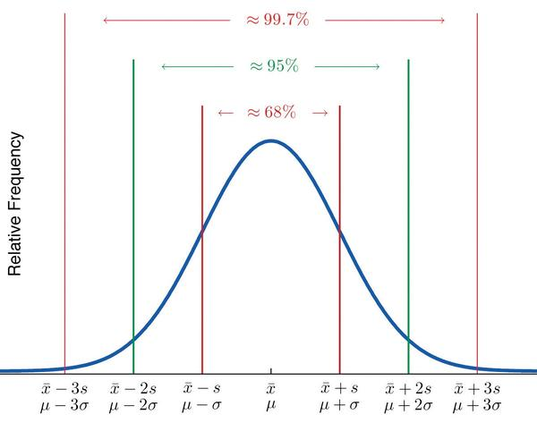

---

#### Chebyshev's Theorem（切比雪夫定理）

对于任何均值为 𝜇 标准差为 𝜎 的随机变量，满足：
$$
P(|X - \mu| \geq k\sigma) \leq \frac{1}{k^2}
$$
即，随机变量至少有 1 - 1/k^2 的概率在均值 ± k 个标准差范围内。

| $k$ 倍标准差 | 至少覆盖比例       |
| ------------ | ------------------ |
| $k = 2$      | 至少 75% 的数据    |
| $k = 3$      | 至少 88.9% 的数据  |
| $k = 4$      | 至少 93.75% 的数据 |

---

### 📘 2.4 数据展示图表

| 图表                             | 用途                     |
| -------------------------------- | ------------------------ |
| **Histogram（直方图）**          | 连续型数据的频率分布展示 |
| **Boxplot（箱线图）**            | 展示中位数、IQR、异常值  |
| **Stem-and-leaf plot（茎叶图）** | 精确显示数值和分布形态   |
| **Dot plot（点图）**             | 小样本展示个体数据点     |

---

## ✅ 第3章：Basic Concepts of Probability（概率基础）

### 📘 3.1 概率基本

| 概念                                           | 定义                         | 说明                                 |
| ---------------------------------------------- | ---------------------------- | ------------------------------------ |
| **随机试验（Experiment）**                     | 一种结果不确定但可重复的过程 | 如掷骰子、抛硬币                     |
| **样本空间（Sample Space, $S$ 或 $\Omega$）**  | 所有可能结果的集合           | 掷骰子的样本空间为 $\{1,2,3,4,5,6\}$ |
| **基本事件（Elementary Event／Sample Point）** | 仅包含一个可能结果的事件     | $\{3\}$ 就是一个基本事件             |
| **事件（Event）**                              | 样本空间的一个子集           | 如“掷到偶数”对应事件 $\{2,4,6\}$     |

**概率定义:**
1. 单一结果的概率：一个结果 $e$ 在一次试验中发生的概率，记为 $P(e)$，其值在 $[0,1]$ 之间。
2. 事件的概率：一个事件 $E=\{e_1,e_2,\dots,e_k\}$ 的概率为各基本事件概率之和：$P(E) = P(e_1) + P(e_2) + \dots + P(e_k)$
3. 归一性：样本空间中所有结果的概率和为 1  

### 📘 3.2 概率基本运算

| 概念                                                                     | 定义                                  | 公式                                        |
| ------------------------------------------------------------------------ | ------------------------------------- | ------------------------------------------- |
| **补事件**（Complement）  若 $A$ 是事件，则 $A^c$ 表示事件 **不发生** | 所有不在事件 $A$ 中的样本点           | $P(A^c) = 1 - P(A)$                         |
| **交事件**（Intersection）$A \cap B$：两事件同时发生                     | 只包含同时属于 $A$ 和 $B$ 的结果      | $P(A \cap B) = \sum P(e),\; e \in A \cap B$ |
| **并事件**（Union）$A \cup B$：至少发生一个事件                          | 包含属于 $A$、$B$、或两者都属于的结果 | $P(A \cup B) = P(A) + P(B) - P(A \cap B)$   |

---

### 📘 3.3 条件概率与独立事件

| 概念                                                     | 定义                                                                | 公式                                                            |
| -------------------------------------------------------- | ------------------------------------------------------------------- | --------------------------------------------------------------- |
| **条件概率**（Conditional Probability） $P(A \mid B)$ | 在事件 $B$ 已发生的前提下，事件 $A$ 发生的概率                      | $P(A \mid B) = \dfrac{P(A \cap B)}{P(B)}$                       |
| **乘法法则**（Multiplication Rule）                      | 联合事件概率 = 一个事件概率 × 另一个事件在其发生条件下的概率        | $P(A \cap B) = P(A) \cdot P(B \mid A) = P(B) \cdot P(A \mid B)$ |
| **独立事件**（Independent Events） $A$ 与 $B$ 独立    | 一个事件的发生不影响另一个事件的发生                                | $P(A \cap B) = P(A) \cdot P(B)$                                 |
| **独立性等价判断**                                       | 若 $P(A \mid B) = P(A)$ 或 $P(B \mid A) = P(B)$，则 $A$ 与 $B$ 独立 | 若 $P(A \cap B) = P(A) \cdot P(B)$ 则也成立                     |

---

### 📘 3.4 全概率公式与贝叶斯定理

---
#### 🌱样本空间的划分（Partition）

我们说：{B₁, B₂, ..., Bₙ} 是对样本空间 Ω 的划分，是指满足以下两个条件：

1. 完备性（Exhaustiveness）：
$$\bigcup_{i=1}^n B_i = \Omega$$
即所有可能的结果都被包含在某个 Bᵢ 中

2. 互斥性（Mutual Exclusivity）：
$$B_i \cap B_j = \emptyset, \forall i \neq j$$
即每个结果只能属于一个 Bᵢ，不能重叠

---

#### 🌱交集并集公式的推导
现在给定事件 $A \subseteq \Omega$，我们来证明：

$$A = \bigcup_{i=1}^n (A \cap B_i)$$

✍️ 形式化证明：
设 $x \in A$  ,
因为 ${B_i}$ 划分了整个样本空间，所以 $\exists i$ 使得 $x \in B_i$
所以 $x \in A \cap B_i$，那么 $x \in \bigcup_{i=1}^n (A \cap B_i)$
反过来：如果 $x \in \bigcup_{i=1}^n (A \cap B_i)$，则 $\exists i$ 使得 $x \in A$ 且 $x \in B_i$
所以 $x \in A$  
因此两个集合相等，得证：
$A = \bigcup_{i=1}^n (A \cap B_i)$

---

#### 🌿全概率公式推导

因为交集彼此互不相交，可以直接相加：
$$P(A) = P(A \cap B_1) + P(A \cap B_2) + \cdots + P(A \cap B_n)$$
利用条件概率定义 $P(A \cap B_i) = P(A|B_i) \cdot P(B_i)$，代入上式：
$$P(A) = \sum_{i=1}^n P(A \cap B_i) = \sum_{i=1}^n P(A|B_i) \cdot P(B_i)$$
这就是全概率公式的由来。

| 概念                                       | 定义                                                                                                                  | 公式                                                                                            |
| ------------------------------------------ | --------------------------------------------------------------------------------------------------------------------- | ----------------------------------------------------------------------------------------------- |
| **全概率公式**（Law of Total Probability） | 当样本空间被互不相交、完备的事件集合 ${B_1, B_2, ..., B_n}$ 划分时，任一事件 $A$ 的概率可表示为这些分块条件下的加权和 | $P(A) = \sum_{i=1}^n P(A \mid B_i) \cdot P(B_i)$                                                |
| **贝叶斯定理**（Bayes' Theorem）           | 给定一个事件 $A$ 已发生，计算它是由某个原因 $B_i$ 引起的概率（后验概率）                                              | $P(B_i \mid A) = \dfrac{P(A \mid B_i) \cdot P(B_i)}{\sum_{j=1}^{n} P(A \mid B_j) \cdot P(B_j)}$ |
| **后验概率**（Posterior Probability）      | 观察结果 $A$ 已知的条件下，反推某原因事件 $B_i$ 的概率                                                                | 与贝叶斯公式相同                                                                                |
| **树状图法则**（Probability Tree Diagram） | 将复合事件逐层展开，按路径相乘求联合概率，路径终点相加求总体概率                                                      | 任一路径概率：$P(A \cap B) = P(B) \cdot P(A \mid B)$；所有路径覆盖全概率，节点总和为 1          |

---

#### ✅具体例子（医学检测问题）
🔍 已知条件：
- 肝癌发病率：0.0004（0.04%）
- 肝癌患者检测阳性率：99%
- 非肝癌者假阳性率：0.1%（阴性率99.9%）

🧮 求解过程：

1. 事件定义

| 事件 | 含义     | 概率           |
| ---- | -------- | -------------- |
| A    | 患有肝癌 | P(A) = 0.0004  |
| Aᶜ   | 无肝癌   | P(Aᶜ) = 0.9996 |
| B    | 检测阳性 | P(B            | A) = 0.99   |
| B    | 检测阳性 | P(B            | Aᶜ) = 0.001 |

2. 使用贝叶斯公式计算
$$P(A|B) = \frac{P(A) \cdot P(B|A)}{P(A) \cdot P(B|A) + P(A^c) \cdot P(B|A^c)}$$

代入数值：
$$P(A|B) = \frac{0.0004 \times 0.99}{0.0004 \times 0.99 + 0.9996 \times 0.001} \approx 0.284$$

结论：单次检测阳性时，实际患病概率约为28.4%

3. 复检提高准确率

| 事件            | 第二次检测前（先验） | 第二次检测后（后验） |
| --------------- | -------------------- | -------------------- |
| A（患病）       | P(A) = 0.284         | P(A\|B,B) ≈ 0.997    |
| B（阳性）       | P(B\|A) = 0.99       | P(B\|A) = 0.99       |
| B（阳性\|无病） | P(B\|Aᶜ) = 0.001     | P(B\|Aᶜ) = 0.001     |

若再次检测仍为阳性，以0.284为先验概率重新计算：
$$P(A|B,B) \approx \frac{0.284 \times 0.99}{0.284 \times 0.99 + 0.716 \times 0.001} \approx 0.997$$
结论：两次检测均为阳性时，实际患病概率提升至99.7%

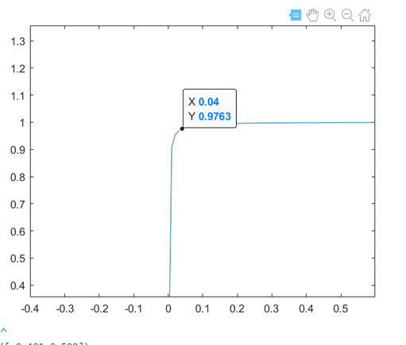

---

## ✅ 第4章：Discrete  Random Variables(离散随机变量)
### 📘 4.1 随机变量（Random Variables）
随机变量是一个函数，它将样本空间中的每个样本点映射到实数轴上的一个值。对于离散随机变量，其概率分布描述了变量可能取的每个离散值及其对应的概率。

#### 📌 形式化定义：
随机变量可表示为映射：
$X: \Omega \rightarrow \mathbb{R}$

其中：
- $\Omega$ 表示样本空间
- $\mathbb{R}$ 表示实数集
- $X$ 是将样本点映射到数值的函数

简而言之，随机变量 $X$ 代表了一次随机试验中我们感兴趣的某个数值特征或结果。

---

#### 对比

| 类型                     | 描述                                   | 示例                     |
| ------------------------ | -------------------------------------- | ------------------------ |
| **离散型（Discrete）**   | 可数或有限个取值                       | 掷骰子、顾客数、故障次数 |
| **连续型（Continuous）** | 无穷多个可能值，通常取某区间内所有实数 | 身高、体重、温度、时间   |

### 📘 4.2 离散型随机变量的概率分布（Probability Distributions for Discrete Random Variables）
离散随机变量的概率分布（Probability Distribution）指定了每个可能取值对应的概率，是描述该变量行为的基础工具。
离散随机变量的概率质量函数是指随机变量取特定值的概率。

---

#### 📌 概率质量函数：
给定一个离散随机变量 $X$，其概率分布列出每个可能值 $x_i$ 及其对应的概率 $P(X=x_i)$。
这个函数叫做概率质量函数（Probability Mass Function，PMF），满足以下两个条件：

非负性：$0 \leq P(X=x_i) \leq 1$
归一性：$\sum_i P(X=x_i) = 1$

---

#### 📌 期望（Expected Value / Mean）
表示随机变量取值的"加权平均"，反映整体集中趋势。

定义为：
$$E[X] = \sum_i x_i \cdot P(X=x_i)$$

条件：
若该级数绝对收敛，则期望存在。

| 编号 | 性质               | 数学表达式                                                                           | 简要说明         |
| ---- | ------------------ | ------------------------------------------------------------------------------------ | ---------------- |
| 1    | 线性性             | $\mathbb{E}[aX + b] = a\mathbb{E}[X] + b$                                            | **核心**性质     |
| 2    | 可加性             | $\mathbb{E}[X + Y] = \mathbb{E}[X] + \mathbb{E}[Y]$                                  | 不要求独立       |
| 3    | 多变量线性性       | $\mathbb{E}\left[\sum_{i=1}^{n} a_i X_i\right] = \sum_{i=1}^{n} a_i \mathbb{E}[X_i]$ | 推广             |
| 4    | 常数的期望         | $\mathbb{E}[c] = c$                                                                  | 常数就是它自己   |
| 5    | 若 $X$ 与 $c$ 无关 | $\mathbb{E}[cX] = c \cdot \mathbb{E}[X]$                                             | 可提取常数       |
| 6    | 若 $X, Y$ 独立     | $\mathbb{E}[XY] = \mathbb{E}[X] \cdot \mathbb{E}[Y]$                                 | 常用在方差推导中 |
| 7    | 单调性             | 若 $X \le Y$ 则 $\mathbb{E}[X] \le \mathbb{E}[Y]$                                    | 可辅助证明不等式 |

---

#### 📌 方差（Variance）
衡量随机变量与期望之间偏差的二阶平均值，反映分布的离散程度。

定义为：
$$\begin{aligned}
Var(X) &= E[(X-E[X])^2] \\
&= \sum_i (x_i-\mu)^2 \cdot P(X=x_i)
\end{aligned}$$

其中 $\mu = E[X]$
常用等价表达：
$$Var(X) = E[X^2] - (E[X])^2$$

---

当然，我帮你把关于协方差的内容补充完整，并且尽量条理清晰、内容丰富一些：

---

#### 📌 协方差（Covariance）

协方差是衡量两个随机变量之间线性关系强度和方向的统计量。它反映的是变量一起偏离各自均值的程度。

**定义：**
设随机变量 $X, Y$ 的期望分别为 $E[X]$ 和 $E[Y]$，协方差定义为

$$
\mathrm{Cov}(X, Y) = E\big[(X - E[X])(Y - E[Y])\big]
$$

也可等价写为：

$$
\mathrm{Cov}(X, Y) = E[XY] - E[X] E[Y]
$$

---

**性质：**

1. **自协方差即方差**

$$
\mathrm{Cov}(X, X) = \mathrm{Var}(X) = E[(X - E[X])^2]
$$

2. **对称性**

$$
\mathrm{Cov}(X, Y) = \mathrm{Cov}(Y, X)
$$

3. **线性性质（一）**
   对于常数 $a$，有

$$
\mathrm{Cov}(aX, Y) = a \mathrm{Cov}(X, Y)
$$

4. **线性性质（二）**
   对于随机变量 $X, Y, Z$，有

$$
\mathrm{Cov}(X + Y, Z) = \mathrm{Cov}(X, Z) + \mathrm{Cov}(Y, Z)
$$

5. **独立性与协方差**
   如果 $X$ 与 $Y$ 独立，则

$$
\mathrm{Cov}(X, Y) = 0
$$

但反之不一定成立，即协方差为零不必然代表两个变量独立（可能存在非线性关系）。

6. **取值范围**
   协方差的大小依赖于变量的单位和尺度，没有标准化，可能难以直接比较不同变量之间的协方差大小。

---

**几何意义：**

* 协方差为正：两个变量总体上同向变动（一个增大时另一个也倾向增大）
* 协方差为负：两个变量总体上反向变动（一个增大时另一个倾向减小）
* 协方差为零：两个变量无线性关系（不排除非线性关系）

---

**举例说明：**

假设你有两组数据，表示某班同学的数学成绩和物理成绩，协方差告诉你当数学成绩高于平均水平时，物理成绩是倾向于高于平均水平（协方差正），还是低于平均水平（协方差负），还是没有明显的线性关系（协方差接近零）。

---

**为什么需要标准化？**

因为协方差受两个变量的量纲影响（比如身高单位是米，体重单位是千克），所以不能直接比较不同数据集的协方差大小。为了解决这个问题，我们引入**相关系数**，用协方差除以两个变量的标准差，使得量纲消失，结果在 $[-1, 1]$ 之间，方便理解和比较。

---

#### 为什么协方差能衡量两个变量一起变化的趋势？

##### 1. 变量偏离平均值代表什么？

假设有一组数据点 $(x_i, y_i)$，它们的均值分别是 $\bar{x}$ 和 $\bar{y}$。

* $x_i - \bar{x}$ 表示第 $i$ 个 $X$ 值与平均值的差异（偏差）
* $y_i - \bar{y}$ 表示第 $i$ 个 $Y$ 值与平均值的偏差

这个偏差表示数据点相对于“中心点”的位置。正偏差说明数据点在均值右侧（或上方），负偏差说明数据点在均值左侧（或下方）。

---

##### 2. 为什么用偏差的乘积表示“共同变化”？

协方差计算的是所有点的偏差乘积之和：

$$
S_{xy} = \sum_{i=1}^n (x_i - \bar{x})(y_i - \bar{y})
$$

* 当 $x_i$ 和 $y_i$ **都比均值大**，即 $x_i - \bar{x} > 0$ 且 $y_i - \bar{y} > 0$，乘积为正
* 当 $x_i$ 和 $y_i$ **都比均值小**，即 $x_i - \bar{x} < 0$ 且 $y_i - \bar{y} < 0$，乘积同样为正（负×负=正）
* 当 $x_i$ 和 $y_i$ **一个大于均值，一个小于均值**，乘积为负

因此，乘积的符号表示了两个变量是否**同步变化**：

* **正乘积**说明两个变量同方向波动（都偏高或都偏低）
* **负乘积**说明两个变量反方向波动（一个偏高，一个偏低）

---

##### 3. 为什么累加所有乘积反映整体趋势？

单个乘积反映某一点的趋势，但我们更关心整体趋势，
所以把所有乘积累加：

* 如果累加结果是正，说明大部分数据点的 $X$ 和 $Y$ 都是“同步”偏离平均值，即存在**正相关**
* 如果是负，说明整体呈现**负相关**
* 如果接近零，说明没有稳定的线性关系

---

##### 4. 为什么不是直接用差值，而是用差值的乘积？

如果仅用差值的和：

$$
\sum (x_i - \bar{x}) + \sum (y_i - \bar{y})
$$

这个结果是0，因为偏差相加正负抵消（均值的定义保证了偏差的和为零）。

用乘积，避免了正负抵消的问题，同时直接表达“两个偏差的相对关系”。

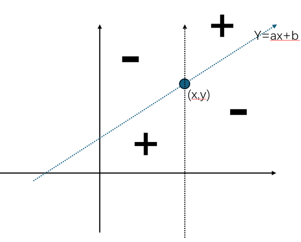

---

##### 总结

* 协方差的核心是“偏差乘积”
* 偏差乘积反映了两个变量在数据点上的“同向”或“反向”偏离
* 累加这些乘积得到整体变量的共同波动趋势
* 这个数值就是衡量两个变量是否存在相关关系的量化指标

---

| 序号 | 性质               | 数学表达                                                                                   | 说明                             | 简要证明                         |
| ---- | ------------------ | ------------------------------------------------------------------------------------------ | -------------------------------- | -------------------------------- |
| 1    | 非负性             | $\mathrm{Var}(X) \ge 0$                                                                    | 方差不可能是负数，因为平方非负   | 平方的期望必然非负               |
| 2    | 恒定项             | 若 $c$ 是常数，$\mathrm{Var}(c) = 0$                                                       | 常数没有波动                     | $\mathbb{E}[(c - c)^2] = 0$      |
| 3    | 线性变换           | $\mathrm{Var}(aX + b) = a^2 \mathrm{Var}(X)$                                               | 加常数不影响方差，乘常数放大方差 | 用定义代入，平方放大系数为 $a^2$ |
| 4    | 加法公式(独立变量) | 若 $X,Y$ 独立，$\mathrm{Var}(X + Y) = \mathrm{Var}(X) + \mathrm{Var}(Y)$                   | 方差可叠加                       | 利用期望性质和独立性展开         |
| 5    | 协方差关系         | $\mathrm{Var}(X + Y) = \mathrm{Var}(X) + \mathrm{Var}(Y) + 2 \mathrm{Cov}(X, Y)$           | 非独立变量方差计算公式           | 定义协方差，带入展开             |
| 6    | 方差的非线性       | 方差不满足线性性，$\mathrm{Var}(X + Y) \neq \mathrm{Var}(X) + \mathrm{Var}(Y)$（非独立时） | -                                | 见第5条                          |

---

### 4.3 常用分布

#### 伯努利分布(Bernoulli Distribution) 

伯努利分布是最简单的离散型分布，用于表示单次随机试验的结果。
它只有两个可能的结果：成功（1）或失败（0），且每次试验的成功概率是固定的。

📌 定义：
设随机变量 X 表示某次试验的结果：

$$X = \begin{cases}
1 & \text{成功，概率为 } p \\
0 & \text{失败，概率为 } 1-p
\end{cases}$$

我们就说：

$$X \sim \text{Bernoulli}(p)$$

其中 $p \in [0,1]$ 表示"成功"的概率。

---

$$P(X=x)=p^x(1-p)^{1-x}, \quad x\in\{0,1\}$$

这是一个非常简洁的公式：

当 $x=1$ 时：
$$P(X=1)=p^1(1-p)^{1-1}=p$$

当 $x=0$ 时：
$$P(X=0)=p^0(1-p)^{1-0}=1-p$$

**期望与方差**
$E[X]=1\cdot p+0\cdot(1-p)=p$
$Var(X)=E[X^2]-(E[X])^2=p-p^2=p(1-p)$

---

#### 二项分布 (Binomial Distribution)

只要满足以下四个必要条件，随机变量 $X$ 就服从二项分布：

1. **独立重复**：有 $n$ 次相同实验
2. **双分类结果**：每次试验只有"成功"或"失败"
3. **概率固定**：每次成功的概率相同，记作 $p$
4. **计数成功次数**：$X$ 表示 $n$ 次试验中成功的次数

---

📌 **定义**

设随机变量 X 表示 $n$ 次试验中成功的次数，$p$ 为每次试验成功的概率，则：

$$X \sim \text{Binomial}(n,p)$$

---

**PMF**：

$$P(X=x) = \binom{n}{x} p^x(1-p)^{n-x}, x=0,1,\dots,n$$

其中：
- $\binom{n}{x}$：组合系数，表示从n个中选x个的方式数
- $p^x$：x次成功的概率
- $(1-p)^{n-x}$：n-x次失败的概率

---

二项分布有简洁的统计特征：

期望：$\mu = E[X] = np$ ,利用期望的可加性,
$$E[X] = \sum_{x=0}^n x \cdot P(X=x) = \sum_{x=0}^n \binom{n}{x} p^x (1-p)^{n-x} = np$$

方差：$\sigma^2 = npq$ (其中 $q = 1-p$)
$$Var(X) =  Var(\sum_{i=0}^n X_i) = \sum_{i=0}^n Var( X_i) =npq$$

标准差：$\sigma = \sqrt{npq}$

---

#### 几何分布 (Geometric Distribution)
几何分布是用于描述首次成功出现在哪一次试验的离散型概率分布。

它假设进行一系列独立的伯努利试验（每次结果为 0 或 1），每次成功的概率固定为 
𝑝，直到第一次成功出现为止。

---

📌 **定义**：

设随机变量 X 表示第一次成功发生在第 k 次试验，则：

X = k 表示前 k-1 次失败，第 k 次成功，概率为 $(1-p)^(k-1)p$

我们记作：
X ~ Geometric(p)

其中:
- p ∈ (0,1] 为单次试验成功的概率
- X ∈ {1,2,3,...} 为可能的试验次数
---

**PMF**：

$$P(X=x) = p(1-p)^{x-1}, x=1,2,\dots$$

其中：
- $p$：成功的概率
- $(1-p)^{x-1}$：$x-1$ 次失败的概率

---

**期望与方差**
证明：

1. 期望的证明：
$$
\begin{aligned}
E[X] &= \sum_{k=1}^{\infty} k \cdot P(X=k) \\
&= \sum_{k=1}^{\infty} k \cdot p(1-p)^{k-1} \\
&= p \sum_{k=1}^{\infty} k(1-p)^{k-1} \\
&= p \cdot \frac{1}{p^2} \\
&= \frac{1}{p}
\end{aligned}
$$

2. 方差的证明：
$$
\begin{aligned}
Var(X) &= E[X^2] - (E[X])^2 \\
&= \sum_{k=1}^{\infty} k^2 \cdot p(1-p)^{k-1} - (\frac{1}{p})^2 \\
&= p \sum_{k=1}^{\infty} k^2(1-p)^{k-1} - \frac{1}{p^2} \\
&= p \cdot \frac{2-p}{p^3} - \frac{1}{p^2} \\
&= \frac{2-p}{p^2} - \frac{1}{p^2} \\
&= \frac{1-p}{p^2}
\end{aligned}
$$

因此得证：
$E[X]=1/p$
$Var(X)=(1-p)/p^2$

---

## ✅ 第5章: Continuous Random Variables (连续随机变量)

### 📘 5.1 连续型随机变量（Continuous Random Variables）
📌 基本概念

连续型随机变量是一种随机变量，其取值在实数轴上的某个区间内连续变化，即：

$X \in [a,b] \subseteq \mathbb{R}$

常见示例：
- 传感器输出的电压值
- 通勤时间（如开车上班时间）
- 产品的物理量（重量、长度等）

关键特性：
1. 连续变量在任意单点 $x$ 上的概率为0：
   $P(X = x) = 0$
   
2. 只能计算区间概率，如：
   $P(a < X < b)$ 或 $P(X \leq x)$

---

#### 概率密度函数 (Probability Density Function)

📌 定义
概率密度函数 $f(x)$ 是一个非负函数，满足：

$f(x) \geq 0$

在整个实数区间上，$f(x)$ 的积分为 1：

$\int_{-\infty}^{\infty} f(x) dx = 1$

📌 使用方式
给定一个区间 $[a,b]$，连续随机变量 $X$ 落在此区间的概率是：

$P(a \leq X \leq b) = \int_a^b f(x) dx$

例如，如果 $X$ 在区间 $[0,10]$ 上均匀分布：

则密度函数为 $f(x) = \frac{1}{10}$

$P(3 \leq X \leq 7) = \int_3^7 \frac{1}{10} dx = 0.4$

---

#### 期望与方差
- 连续随机变量 $X$ 的期望定义为：

$$E[X]=\int_{-\infty}^{\infty} x\cdot f(x)dx$$

它是所有可能取值加权平均后的结果，衡量 $X$ 的"中心"位置。

类比离散型期望：

$$E[X]=\sum x_i P(X=x_i)$$

- 方差的定义式：
$$Var(X)=E[(X−\mu)^2]=\int_{-\infty}^{\infty}(x-\mu)^2f(x)dx$$

也可用简化公式：
$$Var(X)=E[X^2]-(E[X])^2$$

其中：
$$E[X^2]=\int_{-\infty}^{\infty}x^2\cdot f(x)dx$$

---

#### 正态分布 (Normal Distribution)
📌 定义
正态分布是一类最常见的连续分布，形状呈钟形曲线（bell curve）。其 PDF 形式为：

$$f(x)=\frac{1}{\sqrt{2\pi}\sigma}\exp\left(-\frac{(x-\mu)^2}{2\sigma^2}\right)$$

其中：

$\mu$：均值（mean），决定曲线的中心

$\sigma$：标准差（standard deviation），决定曲线的宽度

📌 特征
- 对称分布，以 $\mu$ 为中心
- 越靠近 $\mu$，概率密度越大
- 曲线永不接触 $x$ 轴，但无限趋近

📌 标准正态分布（Standard Normal Distribution）
当 $\mu=0,\sigma=1$ 时，得到标准正态分布（记作 $Z\sim N(0,1)$）：

$$f(z)=\frac{1}{\sqrt{2\pi}}e^{-z^2/2}$$

---

#### 正态分布的随机变量 (Normally Distributed Random Variable)
📌 定义与符号
当我们说一个随机变量 $X$ 是"正态分布的"，我们记作：

$$X \sim N(\mu,\sigma^2)$$

说明：
- $X$ 是一个连续随机变量
- 其密度函数为上述正态形式
- 概率完全由两个参数 $\mu$、$\sigma^2$ 决定

📌 应用领域举例
- 自然现象：身高、体重、温度
- 工业制造：零件误差
- 金融经济：资产收益分布（虽然真实世界中可能是"肥尾分布"，但近似为正态）

---

### 📘5.2 标准正态分布

#### 标准正态分布的定义
标准正态分布是一种特殊的正态分布，具有以下参数：

均值（Mean）：$\mu = 0$

标准差（Standard deviation）：$\sigma = 1$

记作：$Z \sim N(0,1)$

其概率密度函数（PDF）为：

$f(z) = \frac{1}{\sqrt{2\pi}} e^{-z^2/2}$

它呈对称的"钟形曲线"，以0为中心，左右尾巴无限延伸但总面积为1。

---

| 特性                       | 说明                                                                |
| -------------------------- | ------------------------------------------------------------------- |
| 对称性                     | 关于 $z=0$ 对称，即 $P(Z < -a) = P(Z > a)$                          |
| 中心最大密度               | 最大概率密度出现在 $z = 0$                                          |
| 面积表示概率               | 曲线下的面积表示 $Z$ 落在某区间的概率                               |
| 常用区间（68-95-99.7规则） | - (P( Z< 1)) ≈ 68.27%  - (P( Z< 2)) ≈ 95.45% -  (P( Z< 3)) ≈ 99.73% |

---

#### Z 值（Z-Score）详解
🔹 Z 值的意义
Z 值表示某个观测值与均值之间相差的标准差倍数。

🔹 Z 转换公式
若 $X \sim N(\mu,\sigma^2)$，则：

$$Z = \frac{X-\mu}{\sigma}$$

该公式将任意正态分布转换为标准正态分布。

---

#### 正态分布密度函数结构与意义总结表格

| 阶段                     | 公式形式                                                               | 数学意义                                      | 物理/直观含义                          | 备注                                              |
| ------------------------ | ---------------------------------------------------------------------- | --------------------------------------------- | -------------------------------------- | ------------------------------------------------- |
| **1. 指数函数形态**      | $f(x) \propto e^{-x}$                                                  | 指数衰减，概率随着变量增大快速减小            | 适合描述“衰减”现象，如放射性、阻尼     | 基础函数，保证非负且单调递减                      |
| **2. 引入偏差平方**      | $f(x) \propto e^{-\alpha (x-\mu)^2}$                                   | 用平方代替绝对值，保证对称性且数学光滑        | 距离均值越远概率越小，左右偏差影响对称 | $\alpha > 0$ 控制衰减速度                         |
| **3. 引入参数 $\sigma$** | $f(x) \propto e^{-\frac{(x-\mu)^2}{2\sigma^2}}$                        | $\sigma$ 控制分布宽度，越大越平坦，越小越尖锐 | 标准差调整概率衰减速率，体现分散程度   | $\alpha = \frac{1}{2\sigma^2}$                    |
| **4. 归一化系数**        | $C = \frac{1}{\sigma \sqrt{2\pi}}$                                     | 保证整个概率密度积分面积为1                   | 确保总概率符合概率分布定义             | 来源于高斯积分结果                                |
| **5. 正态分布密度函数**  | $f(x) = \frac{1}{\sigma \sqrt{2\pi}} e^{-\frac{(x-\mu)^2}{2\sigma^2}}$ | 连续型随机变量的概率密度函数                  | 描述数据在均值附近对称分布的规律       | $\mu$为均值(位置参数)，$\sigma$为标准差(尺度参数) |

## 第6章: Sampling Distributions (采样分布)

### 6.1 样本均值的均值与标准差 (The Mean and Standard Deviation of the Sample Mean )
#### 🔷 背景概念：为什么样本均值本身是随机变量？
当我们从总体中抽取一个样本（大小为 n）时，计算出的样本均值：

$$\bar{X} = \frac{1}{n}\sum_{i=1}^n X_i$$

并不是一个固定数，而是一个随机变量，因为样本的组成是随机的。不同的样本会给出不同的 $\bar{X}$ 值。

#### 📌 1. 样本数据的分布假设：独立同分布(Independent and identically distributed)
✅ 定义：
我们通常假设样本 $X_1,X_2,...,X_n$ 是从总体 $X$ 中随机抽取的，满足：

独立性：
$$P(X_i,X_j) = P(X_i) \cdot P(X_j), i \neq j$$
每个样本观测值彼此无影响；

同分布：
$$X_i \sim F_X \;\; \forall i$$
所有样本来自同一个概率分布。

这种条件称为独立同分布，简称 i.i.d.，是统计推断中最基本的建模前提。

#### 📌 2. 样本均值的期望值（均值的均值）
样本均值的数学期望是：

$$E[\bar{X}] = E[\frac{1}{n}\sum_{i=1}^n X_i] = \frac{1}{n}\sum_{i=1}^n E[X_i] = \frac{1}{n} \cdot n\mu = \mu$$

✅ 结论：
$$E[\bar{X}] = \mu$$
说明样本均值在平均意义上等于总体均值，即：
样本均值是总体均值的无偏估计量。

#### 📌 3. 样本均值的标准差（标准误）
我们来计算样本均值的方差：

$$Var(\bar{X}) = Var(\frac{1}{n}\sum_{i=1}^n X_i) = \frac{1}{n^2}\sum_{i=1}^n Var(X_i) = \frac{1}{n^2} \cdot n\sigma^2 = \frac{\sigma^2}{n}$$

因此，样本均值的标准差（即标准误）为：

$$\sigma_{\bar{X}} = \frac{\sigma}{\sqrt{n}}$$

#### 📌 4. 如何理解"标准误差"？

| 术语           | 含义                                         | 直观理解             |
| -------------- | -------------------------------------------- | -------------------- |
| 标准误差（SE） | 样本均值 $\bar{X}$ 的标准差                  | 估计值的"波动范围"   |
| 公式           | $\sigma_{\bar{X}} = \frac{\sigma}{\sqrt{n}}$ | 样本越多，均值越稳定 |
| 重要性         | 衡量样本均值与真实均值 $\mu$ 偏离的典型程度  | 越小代表估计越精确   |

✅ 关键理解：
- 你取一个样本时，$\bar{X}$ 可能偏离 $\mu$；
- 你取多个样本，$\bar{X}$ 的分布会围绕 $\mu$ 集中；
- 标准误就是这个集中程度的量化指标。

#### 📌 5. 实际情况：总体标准差不可知时
如果 $\sigma$ 不知道，我们可以用样本标准差 $s$ 来估计标准误差：

$$\text{Estimated SE} = \frac{s}{\sqrt{n}}$$

这在实际分析中非常常见，尤其是在置信区间和假设检验中。

---

### 6.2: 样本均值的抽样分布（Sampling Distribution of the Sample Mean）

#### 🎯 基本概念
样本均值 $\bar{X}$ 的抽样分布描述了：当我们重复从同一总体中抽取相同大小的样本并计算均值时，这些样本均值的分布规律。

#### 📌 主要特征

| 特性                               | 含义                                                                                                   |
| ---------------------------------- | ------------------------------------------------------------------------------------------------------ |
| **中心位置（Mean）**               | $\mu_{\bar X} = \mu$（样本均值的期望等于总体均值，是总体均值的无偏估计）                               |
| **散布程度（Standard Error, SE）** | $\sigma_{\bar X} = \frac{\sigma}{\sqrt{n}}$（标准误差随样本量 $n$ 增大而减小）                         |
| **分布形态（Shape）**              | - 当总体为正态分布时：任意样本量下均值都服从正态分布 - 当总体非正态时：样本量 $n≥30$ 时近似正态分布 |

- 证明:
设总体变量为 $X$，其方差为 $Var(X)=\sigma^2$，我们从中抽出 $n$ 个独立样本 $X_1,X_2,...,X_n$，定义样本均值为：

$$\bar{X} = \frac{1}{n}\sum_{i=1}^n X_i$$

由于各 $X_i$ 独立同分布：

$$E[\bar{X}]=\mu$$

$$Var(\bar{X})=Var(\frac{1}{n}\sum X_i)=\frac{1}{n^2}\sum Var(X_i)=\frac{n\sigma^2}{n^2}=\frac{\sigma^2}{n}$$

所以：

$$SE(\bar{X})=\sqrt{Var(\bar{X})}=\frac{\sigma}{\sqrt{n}}$$

---
案例:
输入数组 [152, 156, 160, 164], 进行取样:
- 取样个数: 2
- 取样次数: 16
得到如下均值分布:

| 均值($\bar{x}$)  | 152  | 154  | 156  | 158  | 160  | 162  | 164  |
| ---------------- | ---- | ---- | ---- | ---- | ---- | ---- | ---- |
| 概率P($\bar{x}$) | 1/16 | 2/16 | 3/16 | 4/16 | 3/16 | 2/16 | 1/16 |

计算得到采样期望 $\mu_{\bar{x}} = 158$ 采样标准差 $\sigma_{\bar{x}} = \sqrt{10}$
真实期望 $\mu = 158$ 真实标准差 $\sigma = \sqrt{20}/\sqrt{2}$

继续增加采样次数,

| x̄:    | 0.00 | 0.05 | 0.10 | 0.15 | 0.20 | 0.25 | 0.30 | 0.35 | 0.40 | 0.45 | 0.50 | 0.55 | 0.60 | 0.65 | 0.70 | 0.75 | 0.80 | 0.85 | 0.90 | 0.95 | 1.00 |
| ----- | ---- | ---- | ---- | ---- | ---- | ---- | ---- | ---- | ---- | ---- | ---- | ---- | ---- | ---- | ---- | ---- | ---- | ---- | ---- | ---- | ---- |
| P(x̄): | 0.00 | 0.00 | 0.00 | 0.00 | 0.00 | 0.01 | 0.04 | 0.07 | 0.12 | 0.16 | 0.18 | 0.16 | 0.12 | 0.07 | 0.04 | 0.01 | 0.00 | 0.00 | 0.00 | 0.00 | 0.00 |

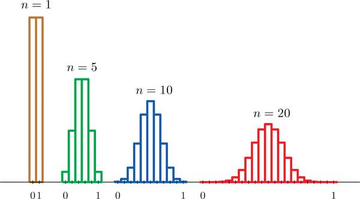

---

#### 🌟 中心极限定理（Central Limit Theorem, CLT）
- 核心结论：无论总体分布如何，只要样本量足够大（通常 $n≥30$），样本均值的分布就会近似服从正态分布
- 特殊情况：若总体本身服从正态分布，则样本均值在任意样本量下都精确服从正态分布
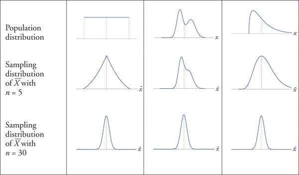

---

### 6.3 样本比例(sample proportion)
样本比例是一个随机变量，来源于对总体的抽样：我们关心总体中具有某特征的比例 p，通过 n 个样本估计得到 $\hat{p}=\frac{x}{n}$。
比如: 某城市居民是否支持一项新政策。
不同的样本会得到不同的 $\hat{p}$，所以 $\hat{p}$ 本质上是一个随机变量。
在大样本下，根据中心极限定理：
$$\hat{p} \sim N(p, \frac{p(1-p)}{n})$$
即：
$E[\hat{p}] = p$：期望是总体比例（无偏估计）

$Var(\hat{p}) = \frac{p(1-p)}{n}$：方差与样本容量成反比

---

#### 期望与标准差 推导
我们假设：
总体分布为二项分布，总体比例为 $p$，样本量为 $n$，$X$ 表示样本中"成功"的次数（如赞成票、正样本等）
则 $X \sim Binomial(n,p)$

样本比例定义为：
$$\hat{p} = \frac{X}{n}$$

从定义出发：
$$E[\hat{p}] = E[\frac{X}{n}] = \frac{1}{n}E[X]$$

因为 $X \sim Binomial(n,p)$，我们知道：
$$E[X] = np$$

所以：$$E[\hat{p}] = \frac{1}{n} \cdot np = p$$

✅ 结论：$E[\hat{p}] = p$  样本比例是对总体比例 $p$ 的无偏估计量。

---

我们再次从定义出发：

$$
\begin{aligned}
Var(\hat{p}) &= Var(\frac{X}{n}) \\
&= \frac{1}{n^2} \cdot Var(X)
\end{aligned}
$$

由于 $X \sim Binomial(n,p)$，其方差为：

$$Var(X) = np(1-p)$$

代入：

$$
\begin{aligned}
Var(\hat{p}) &= \frac{1}{n^2} \cdot np(1-p) \\
&= \frac{p(1-p)}{n}
\end{aligned}
$$

✅ 结论：

$$Var(\hat{p}) = \frac{p(1-p)}{n}$$

---

#### 样本比例的样本分布(The Sampling Distribution of the Sample Proportion)
当样本量 n 较大时，根据中心极限定理，$\hat{p}$ 可以近似服从正态分布：

$\hat{p} \approx N(p, \frac{p(1-p)}{n})$

✅ 样本足够大的判断准则：
通常要求

$[p-3\sigma_{\hat{p}}, p+3\sigma_{\hat{p}}] \subseteq [0,1]$

即

$3\sqrt{\frac{p(1-p)}{n}} \leq \min(p,1-p)$

如果 p 未知，可以用观察值 $\hat{p}$ 替代检查

---

#### 小结
| 项目     | 表达式 / 说明                                |
| -------- | -------------------------------------------- |
| 样本比例 | $\hat{p} = \frac{x}{n}$                      |
| 期望     | $E[\hat{p}] = p$（无偏）                     |
| 标准误   | $\sigma_{\hat{p}} = \sqrt{\frac{p(1-p)}{n}}$ |
| 正态近似 | 当区间 $p \pm 3\sigma$ ⊆ \[0,1] 时成立       |
| 应用     | 置信区间、假设检验（z 检验）                 |

---

## 第7章: Estimation(估计)
### 7.1 大样本估计总体均值(Large Sample Estimation of the Population Mean)
当样本容量较大（通常 n ≥ 30）时，根据**中心极限定理 (Central Limit Theorem, CLT)**，无论总体分布如何，样本均值 $\bar{X}$ 的抽样分布都将近似服从正态分布。这是进行大样本估计的基础。

---

#### 📌 点估计与区间估计（Point Estimation vs Interval Estimation）
🔹 点估计（point estimate）
用样本统计量去估计总体参数的具体数值。
典型例子：用样本均值 $\bar{x}$ 估计总体均值 $\mu$
点估计结果是一个单一数值，比如 $\bar{x}=70.6$
优点：计算简便，易于理解
缺点：无法反映估计的不确定性或波动性
📌 点估计的准确性依赖于：
样本容量 $n$：越大越稳定
样本代表性：是否随机、公平抽样

🔹 区间估计（interval estimate）
用一个区间来估计总体参数，给出一定的置信度（confidence level）
步骤：
计算样本均值 $\bar{x}$
计算误差界（margin of error）$E$
构造置信区间：$[\bar{x}-E, \bar{x}+E]$
例如：若 $\bar{x}=70.6$, $E=0.33$，则置信区间为 $[70.27, 70.93]$
我们可以说："有 95% 的置信度认为，总体均值 $\mu$ 落在这个区间内"。

#### **中心极限定理的体现：**
$\bar{X} \sim N(\mu, \frac{\sigma^2}{n})$

*   $\bar{X}$：样本均值，是我们从总体中抽取样本后计算得到的平均值。
*   $\mu$：总体均值，是我们希望估计的未知总体参数。
*   $\sigma^2$：总体方差。如果总体方差未知，在大样本情况下（n ≥ 30），通常可以用样本方差 $s^2$ 来代替。
*   $n$：样本容量。

#### **置信区间 (Confidence Interval) 的概念：**
置信区间是用于估计总体参数（如总体均值 $\mu$）的一个区间范围。它提供了一个概率，表明这个区间包含真实总体参数的可能性。例如，95% 的置信区间意味着如果我们重复抽样和构建置信区间很多次，大约有 95% 的区间会包含真实的总体均值。

**置信区间的构建：**

根据经验法则，对于正态分布，约 95% 的数据点落在均值 $\pm 2$ 倍标准差的范围内。对于样本均值的抽样分布，这意味着约 95% 的 $\bar{X}$ 落在 $\mu \pm 2\frac{\sigma}{\sqrt{n}}$ 之间。这提供了一个初步的估计。

---

#### **总体均值 $\mu$ 的大样本置信区间通用公式：**
$\bar{x} \pm z_{\alpha/2}  \frac{\sigma}{\sqrt{n}}$

**公式中各符号的含义：**
*   $\bar{x}$：观测到的样本均值，是点估计值。
*   $z_{\alpha/2}$：**临界值 (Critical Value)**，它是一个标准正态分布 (Z-distribution) 的值，取决于我们选择的置信水平。$\alpha$ 是显著性水平（即 1 - 置信水平），$\alpha/2$ 表示在正态分布两端各截取的尾部面积。例如，对于 95% 的置信水平，$\alpha = 0.05$，则 $z_{0.025} \approx 1.96$。
*   $\frac{\sigma}{\sqrt{n}}$：**标准误差 (Standard Error of the Mean, SEM)**，衡量样本均值抽样分布的离散程度。它表示样本均值与总体均值之间的平均差异。
*   注意 α 表示的是面积,公式里面的下标,而不是x轴坐标,所以是$z_{\alpha/2}$而不是$z_{\alpha}$
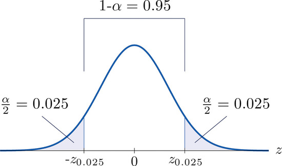

**推导过程**
我们要估计的是总体均值 $\mu$，而我们只能从样本中获得 $\bar{x}$。

如果我们知道 $\bar{X}$ 的分布近似为正态，就可以说：

$$Z=\frac{\bar{X}-\mu}{\sigma/\sqrt{n}} \sim N(0,1)$$

这是标准正态分布（Standard Normal Distribution），它有如下性质：

$$P(-z_{\alpha/2} \leq Z \leq z_{\alpha/2})=1-\alpha$$

带入 $Z$ 的定义：

$$P(-z_{\alpha/2} \leq \frac{\bar{X}-\mu}{\sigma/\sqrt{n}} \leq z_{\alpha/2})=1-\alpha$$

对这个不等式进行变形，解出 $\mu$：

$$P(\bar{X}-z_{\alpha/2} \cdot \frac{\sigma}{\sqrt{n}} \leq \mu \leq \bar{X}+z_{\alpha/2} \cdot \frac{\sigma}{\sqrt{n}})=1-\alpha$$

✅ 最终结果：置信区间表达式
$$\mu \in \bar{x} \pm z_{\alpha/2} \cdot \frac{\sigma}{\sqrt{n}}$$

---

**示例：**
假设我们想估计某城市成年人的平均身高。我们随机抽取了 100 名成年人（n=100），计算得到样本平均身高 $\bar{x} = 170$ 厘米，样本标准差 $s = 5$ 厘米。我们希望构建一个 95% 的置信区间。

1.  **已知**：$\bar{x} = 170$， $s = 5$， $n = 100$。
2.  **置信水平**：95%，所以 $\alpha = 0.05$，$\alpha/2 = 0.025$。
3.  **临界值**：查表可知 $z_{0.025} \approx 1.96$。
4.  **标准误差**：由于总体标准差 $\sigma$ 未知，我们用样本标准差 $s$ 代替，标准误差 $\approx \frac{s}{\sqrt{n}} = \frac{5}{\sqrt{100}} = \frac{5}{10} = 0.5$。
5.  **计算置信区间**：
    $170 \pm 1.96 \times 0.5$
    $170 \pm 0.98$
    置信区间为 $(169.02, 170.98)$。

**结论**：我们有 95% 的信心认为，该城市成年人的真实平均身高在 169.02 厘米到 170.98 厘米之间。

---

### 7.2 小样本估计总体均值(Small Sample Estimation of the Population Mean)
但当样本量 n 较小时，中心极限定理不再适用。为了继续估计总体均值，我们需要假设样本来自服从正态分布的总体。

如果总体标准差 σ 已知，仍然可以使用旧公式：$\bar{x} \pm z_{\alpha/2}  \frac{\sigma}{\sqrt{n}}$

#### Student t分布
如果总体标准差 σ 未知，我们可以使用 Student t 分布。t 分布是一种概率分布，它在小样本来估计总体均值时使用。
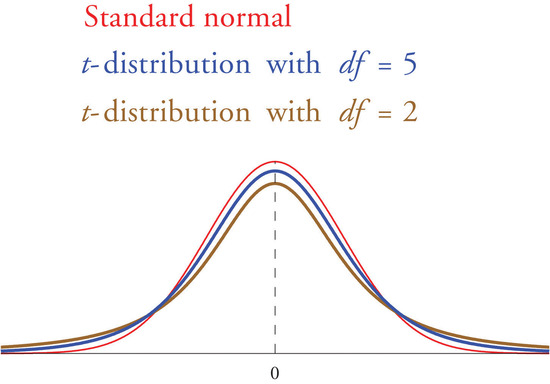

---

##### 一、为什么需要 t 分布？

在统计推断中，我们通常需要根据样本来估计总体特征（如均值）。对于大样本（$n \geq 30$），可以借助中心极限定理使用标准正态分布 $Z \sim N(0,1)$。

但当面对小样本（$n < 30$）且总体标准差 $\sigma$ 未知时，无法直接使用正态分布进行推断，原因是：

1. 用样本标准差 $s$ 替代总体标准差 $\sigma$ 后，样本均值的标准误 $s/\sqrt{n}$ 变成随机变量
2. 这导致统计量 $\frac{\bar{X}-\mu}{s/\sqrt{n}}$ 不再服从标准正态分布

此时需要使用由 William S. Gosset（化名 Student）提出的 t 分布来代替 Z 分布。

##### 二、t 分布的定义

设 $X_1,X_2,...,X_n$ 是来自正态总体 $N(\mu,\sigma^2)$ 的样本，定义：

- $\bar{X}$：样本均值
- $s$：样本标准差

则统计量：

$$T = \frac{\bar{X}-\mu}{s/\sqrt{n}} \sim t(n-1)$$

该变量 $T$ 服从自由度为 $n-1$ 的 t 分布。

##### 三、t 分布的性质

| 性质            | 描述                                   |
| --------------- | -------------------------------------- |
| 形状            | 钟形，对称，类似标准正态分布           |
| 中心            | 均值为 0                               |
| 厚尾            | 相比正态分布尾部更厚，反映不确定性更大 |
| 自由度 $df=n-1$ | 样本量越大，分布越接近正态分布         |
| 渐近性          | $n \to \infty$ 时，$t(n-1) \to N(0,1)$ |

##### 四、与正态分布的区别

| 特性           | 正态分布 Z              | t 分布                 |
| -------------- | ----------------------- | ---------------------- |
| 方差是否已知？ | 已知总体方差 $\sigma^2$ | 未知，用样本方差 $s^2$ |
| 使用条件       | 大样本或已知 $\sigma$   | 小样本且 $\sigma$ 未知 |
| 分布尾部       | 较瘦                    | 更厚尾，容忍极端值     |
| 自由度影响     | 无                      | 有，$n$ 越小尾部越厚   |

##### 五、小样本置信区间

当总体标准差 $\sigma$ 未知且样本容量 $n<30$ 时，总体均值 $\mu$ 的置信区间为：

$$\mu \in \bar{x} \pm t_{\alpha/2}(df) \cdot \frac{s}{\sqrt{n}}$$

其中：
- $t_{\alpha/2}(df)$：自由度为 $df=n-1$ 时的 t 分布临界值
- $s$：样本标准差
- $\bar{x}$：样本均值
---

### 7.3 大样本估计总体比例(Large Sample Estimation of the Population Proportion)

#### 基本概念
样本比例 $\hat{p}=\frac{X}{n}$ 的抽样分布近似服从正态分布：
- 均值为总体比例 $p$
- 标准差为 $\sigma_{\hat{p}}=\sqrt{\frac{p(1-p)}{n}}$

在实际应用中，由于总体比例 $p$ 未知，通常用样本比例 $\hat{p}$ 代替进行估计。

#### 大样本条件
判断是否满足正态近似的标准：
- 检查 $\hat{p} \pm 3\sigma_{\hat{p}}$ 是否完全落在 $[0,1]$ 区间内
- 这比简单使用 $n \geq 30$ 的判断更为严格

#### 置信区间
对总体比例 $p$ 的 $(1-\alpha)\%$ 置信区间为：

$$\hat{p} \pm z_{\alpha/2}\sqrt{\frac{\hat{p}(1-\hat{p})}{n}}$$

#### 示例计算
给定：
- 样本量 $n=120$
- 成功次数 69，得到 $\hat{p}=0.575$
- 90% 置信水平，对应 $z_{0.05}=1.645$

置信区间计算：
$$0.575 \pm 1.645\sqrt{\frac{0.575 \times 0.425}{120}} \approx 0.575 \pm 0.074$$
即 $(0.501, 0.649)$

#### 样本量确定
若需要控制误差范围在 $\epsilon$ 内，所需样本量：

$$n=\frac{(z_{\alpha/2})^2\hat{p}(1-\hat{p})}{\epsilon^2}$$

当 $\hat{p}$ 未知时，可保守取 $p=0.5$ 以获得最大样本量。

#### 使用注意事项
- 当 $\hat{p}$ 接近 0 或 1，且样本量较小时，正态近似可能失效
- 此时建议使用 Wilson 或 Clopper-Pearson 区间等替代方法
- 大样本方法优点是计算简单直观，但需满足相应的采样条件

---

### 7.4 样本量考虑 (Sample Size Considerations)

#### 基本概念
当需要以 $100(1-\alpha)\%$ 的置信水平，对总体均值或比例进行精确估计时，可通过以下公式计算所需最小样本量：

#### 🧮 估计总体均值所需样本量
假设总体标准差为 $\sigma$，预期估计误差不超过 $E$，则样本量 $n$：

$$n = \frac{(z_{\alpha/2})^2 \sigma^2}{E^2}$$

✅ 注意：计算结果应向上取整，以确保误差满足要求。

#### 🧮 估计总体比例所需样本量
若目标是估计比例 $p$，误差不超过 $\epsilon$，则需样本量：

$$n = \frac{(z_{\alpha/2})^2 p(1-p)}{\epsilon^2}$$

保守估计：当 $p$ 未知时，取 $p=0.5$ 可使分子最大，保证足够样本量。

#### 示例计算
##### (1) 均值估计
情景：$\sigma=30$，95% 置信，目标误差 $E=10$

从置信水平查表得 $z_{\alpha/2}=1.96$
$$n = \frac{(1.96)^2 \cdot 30^2}{10^2} = \frac{3.8416 \cdot 900}{100} = 34.5744 \rightarrow n=35$$

若改为 99% 置信（$z \approx 2.576$），所需样本量会更大。

#### 🔑 注意事项
1. 必须事先估计总体标准差 $\sigma$ 或比例 $p$。若不明，可通过历史数据或保守估计
2. 目标误差 $E$ 或 $\epsilon$ 要在合理范围，过小会导致样本量急剧上升
3. 提高置信水平（如从 95% → 99%）会显著增加所需样本量
4. 样本量计算结果应向上取整，避免实际误差超过设定值

---

## 第8章 假设检验(Hypothesis Testing)
| 类型       | 目标                            | 关注点       | 方法                |
| -------- | ----------------------------- | --------- | ----------------- |
| **参数估计** | 估计总体参数（如均值 $\mu$）             | 实际数值是多少   | 点估计、区间估计          |
| **假设检验** | 判断某个主张是否成立（如 $\mu = 75$ 是否成立） | 主张是否被数据支持 | 构造检验统计量，判断是否拒绝原假设 |

### 8.1 假设检验的基本元素

#### 假设
- **原假设（Null Hypothesis）**：$H_0$，假设总体参数值为某个特定值，如 $\mu = 75$ ,代表现状,默认成立,除非证据表明才拒绝
- **备择假设（Alternative Hypothesis）**：$H_1$，与原假设对立，如 $\mu \neq 75$ ,代表变化,希望通过实验证明,和 $H_0$ 对立

罕见事件准则（Rare Event Criterion）：
如果在原假设 H₀ 成立时，某个样本均值几乎不可能出现，那么我们更愿意相信原假设不成立。
$H_0: \mu = 75$：呼吸器平均供气时间为 75 分钟
如果样本均值是 75 或更大 → 不拒绝 $H_0$
如果样本均值略小于 75 → 可能只是抽样误差，也不拒绝
如果样本均值非常小（如 60 分钟或更低）→ 极小概率事件 → 拒绝 $H_0$，支持 $H_a: \mu < 75$

---

#### 拒绝域（Rejection Region）
拒绝域是检验统计量在其中的区域，若检验统计量落入该区域，则拒绝原假设。
假设原假设 H₀ 成立，那么：

- 大多数样本均值应该落在总体均值附近
- 极端的样本结果（远离均值）发生概率非常小
- 如果观察到了极端的样本均值，就说明：也许 H₀ 不成立

✅ 这些"极端的值"就构成了所谓的拒绝域。

| 备择假设形式 $H_a$          | 拒绝域的形状                               | 图示        |
| --------------------- | ------------------------------------ | --------- |
| $\mu < \mu_0$（左尾检验）   | $(-\infty, C]$                       | 拒绝区域在左侧尾部 |
| $\mu > \mu_0$（右尾检验）   | $[C, +\infty)$                       | 拒绝区域在右侧尾部 |
| $\mu \ne \mu_0$（双尾检验） | $(-\infty, C_1] \cup [C_2, +\infty)$ | 拒绝区域在两侧   |

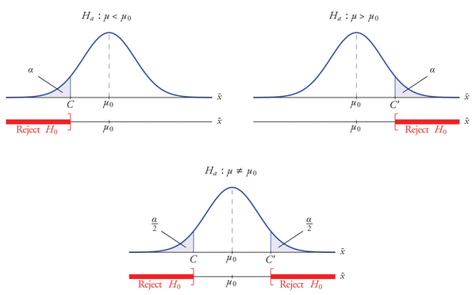

---

#### 🎯 题干总结（假设检验背景）
题目条件：
> 总体服从正态分布,已知总体标准差：$\sigma = 0.15$ 克
> 样本量 $n = 5$，显著性水平 $\alpha = 0.10$
> 
> 检验目标：
> $H_0: \mu = 8.0$ vs $H_a: \mu \neq 8.0$

##### 🧮 一、数学推导步骤
- 1：样本均值的分布
$\bar{X} \sim N(\mu, \sigma/\sqrt{n}) = N(8.0, 0.15/\sqrt{5}) = N(8.0, 0.067)$

- 2：因为是双尾检验，拒绝域分布在左右两侧, 显著性水平 $\alpha = 0.10$
      每个尾部面积 $\alpha/2 = 0.05$ 
      查标准正态分布表得到：$z_{0.05} = 1.645$

- 3：计算临界值（critical values）
$C = 8.0 - (1.645 \times 0.067) = 7.89$
$C' = 8.0 + (1.645 \times 0.067) = 8.11$

##### 📐 二、构造拒绝域（Rejection Region）
   根据上述计算，拒绝域如下：
   拒绝域 = $(-\infty, 7.89] \cup [8.11, +\infty)$

   也就是说：
   如果样本均值 $\bar{x} \leq 7.89$ 克 或者 $\bar{x} \geq 8.11$ 克 $\rightarrow$ 拒绝原假设 $H_0$
   否则 $\rightarrow$ 不拒绝 $H_0$

##### 🧠 三、决策解释与推理逻辑
假设 $H_0: \mu = 8.0$ 是正确的，我们可以推断出样本均值 $\bar{X}$ 的正态分布如下：
- 期望值 = 8.0
- 标准差 $\approx 0.067$
- 极端值（$<7.89$ 或 $>8.11$）的总概率仅为10%（即$\alpha$）

因此：
如果我们抽到一个样本，其均值落在极端区域（拒绝域内），那么我们会认为：
"样本太极端，不太可能来自 $\mu = 8.0$ 的总体"

于是我们更倾向于认为 $H_0$ 是错的，拒绝它，接受备择假设 $H_a: \mu \neq 8.0$

---

#### 📌 假设检验中的两类错误

| 实际情况 → / 我们的决定 ↓ | H₀ 为真                    | H₀ 为假                      |
| ---------------- | ------------------------ | -------------------------- |
| 不拒绝 H₀（接受 H₀）    | ✅ 正确决定                   | ❌ **II类错误**（Type II Error） |
| 拒绝 H₀（接受 Hₐ）     | ❌ **I类错误**（Type I Error） | ✅ 正确决定                     |

##### 🎯 两类错误的定义：
**Type I Error（α 错误）：**
错误地拒绝了其实为真的 H₀。
换句话说，把“偶然的样本波动”当成了“显著的差异”。
这种错误在科学研究中通常较严重。
其概率为 α（显著性水平），通常设为 0.05 或 0.01。

**Type II Error（β 错误）：**
没有拒绝其实为假的 H₀。
错过了发现实际差异的机会。
其概率为 β，较难计算，通常依赖于具体假设、样本大小、检验方法等。

**📐 显著性水平（Significance Level α）：**
是我们愿意接受的 Type I 错误概率。
由研究者事先设定，例如 α = 0.05 表示我们愿意承担 5% 的错误率。

---

#### 🌟 标准化检验统计量（Standardizing the Test Statistic）
假设检验（Hypothesis Testing）可在不同情境下展开，而通过标准化样本统计量，可以带来统一性和简化性。

**✅ 定义：标准化检验统计量**
标准化检验统计量是通过下面的方式获得的：

$$Z = \frac{X - \mu}{\sigma}$$

其中：
- $Z$ 是标准化统计量
- $X$ 是原始统计量
- $\mu$ 是均值
- $\sigma$ 是标准差

也就是说，从感兴趣的统计量中减去它的均值，然后除以其标准差。

---

### 8.2 大样本总体均值假设检验
在样本容量较大的情况下（一般认为 n ≥ 30），可以借助 中心极限定理（CLT），将样本均值近似看作正态分布变量，从而对总体均值 μ 进行假设检验。

大样本时，使用 Z 分布（标准正态分布）作为检验依据：

若 σ 已知：

$$Z = \frac{\bar{x} - \mu_0}{\sigma/\sqrt{n}}$$

若 σ 未知（但样本足够大）：

$$Z = \frac{\bar{x} - \mu_0}{s/\sqrt{n}}$$

---

#### 案例

##### 题目
人们希望一种新研发的止痛药能够比标准止痛药更快地显著减轻小手术后患者的疼痛。已知标准止痛药平均3.5分钟即可缓解疼痛，标准差为2.1分钟。
为了测试这种新型止痛药是否比标准止痛药起效更快，50名接受小手术的患者服用了这种新型止痛药，并记录了他们的缓解时间。
实验结果显示，样本平均值x¯=3.1分钟，样本标准差s=1.5分钟。
样本中是否有足够的证据表明，在5%的显著性水平下，新研发的止痛药确实能够更快地带来显著的缓解？

##### 提取信息
标准药平均起效时间（μ₀）：3.5 分钟
标准药标准差（σ，不是新药的 σ）：2.1 分钟
新药样本均值（x̄）：3.1 分钟
新药样本标准差（s）：1.5 分钟
样本容量（n）：50
显著性水平（α）：0.05
检验方向：单边检验（是否更快） → 左尾检验

##### 假设检验

| 步骤                       | 内容                                                           |
| ------------------------ | ------------------------------------------------------------ |
| **Step 1: 写出假设**         | H₀: μ = μ₀（新药起效时间与旧药一样） Hₐ: μ < μ₀（新药起效时间更快）              |
| **Step 2: 选择检验统计量**      | 因为样本大（n=50），用 Z： $Z = \frac{\bar{x} - \mu_0}{s/\sqrt{n}}$ |
| **Step 3: 插入样本数据计算 Z 值** | $Z = \frac{3.1 - 3.5}{1.5 / \sqrt{50}} = -1.886$             |
| **Step 4: 确定拒绝域（由α决定）**  | 左尾检验，α=0.05 ⇒ Z 临界值 = -1.645 拒绝域：Z ≤ -1.645               |
| **Step 5: 做决策，得结论**      | 因为 Z = -1.886 落在拒绝域，故**拒绝 H₀**。 结论：新药起效更快，有统计学意义。         |

---

### 8.3 观察显著性

假设检验的核心逻辑是：当我们观察到的数据在原假设 H₀ 成立的前提下非常"不太可能"时，我们就倾向于拒绝该假设。显著性水平 α 告诉我们"多少的概率算是不太可能"。而 p 值则是所观察到的结果（或更极端结果）究竟有多不太可能发生的量化表达。

---
#### 定义
> 观察显著性（Observed Significance）或 p 值是在原假设 H₀ 成立的前提下，产生当前观测结果（或更极端结果）的概率。

p 值越小 → 数据与原假设 H₀ 的不兼容性越强 → 越倾向拒绝原假设 H₀
假设检验的观测显著性是检验统计量所截取的分布尾部的面积（在双尾检验的情况下乘以二）。

---

#### 案例

##### 题目
普洛斯彼罗先生多年来一直在偏远岛高中教授代数II，并使用他所教的教材。多年来，他教的学生在期末考试（EOC）中的平均成绩一直保持在67分。今年，普洛斯彼罗先生使用了新教材，希望EOC考试的平均成绩能够更高。今年，64名选修普洛斯彼罗先生教的代数II的学生的平均EOC考试成绩为69.4分，样本标准差为6.1分。请确定这些数据是否在1%的显著性水平上提供了足够的证据，从而得出结论：使用新教材的学生的平均EOC考试成绩更高。

##### 提取信息
旧教材平均成绩（μ₀）：67 分
新教材样本均值（x̄）：69.4 分
新教材样本标准差（s）：6.1 分
样本容量（n）：64
显著性水平（α）：0.01
检验方向：单边检验（是否更高） → 右尾检验

1. 假设检验的假设
   1. 原假设（H₀）：旧教材的平均成绩与新教材的平均成绩相同（μ₀ = 67）
   2. 备择假设（Hₐ）：新教材的平均成绩高于旧教材的平均成绩（μ > 67）
2. 选择检验统计量
   1. 因为样本容量足够大（n = 64），我们可以使用 Z 检验。
   2. 检验统计量：$Z = \frac{\bar{x} - \mu_0}{s / \sqrt{n}}$
3. 计算检验统计量
   1. $Z = \frac{69.4 - 67}{6.1 / \sqrt{64}} = 3.15$
4. 确定拒绝域（由α决定）
   1. 查表知道  z
   2. 拒绝域：Z ≥ 2.33
5. 做决策，得结论
   1. 因为 Z = 2.27 落在拒绝域，故**拒绝 H₀**。
   2. 结论：新教材的平均成绩高于旧教材的平均成绩，有统计学意义。

---

### 8.4 小样本下的总体均值假设检验（Small Sample Tests for a Population Mean）

假设我们要检验：

$H_0: \mu = \mu_0$ vs $H_a: \mu \neq \mu_0$

如果总体标准差未知，采用以下统计量：

$$T = \frac{\bar{x} - \mu_0}{s/\sqrt{n}} \sim t(n-1)$$

其中：

$\bar{x}$：样本均值
$\mu_0$：零假设下的总体均值
$s$：样本标准差
$n$：样本容量
$t(n-1)$：自由度为 $n-1$ 的 Student t 分布

✅ t 分布在小样本时更保守，考虑了样本方差的额外不确定性。

---

#### 🧪 问题描述
在一个电子设备的制造过程中，有一个小组件的两个小孔之间的距离必须非常精确，理想平均距离是 0.02 毫米。如果这个距离出现偏差，会导致零件无法安装或性能下降，因此工厂必须进行严格质量控制。
质量控制工程师定期从产线上抽取小样本进行检查。这次他们随机抽取了 4 个组件，测得的两个小孔之间的距离如下（单位为毫米）：
> 0.021, 0.019, 0.023, 0.020

是否有充分的统计证据（在显著性水平 1% 下）表明这个平均距离已经发生了偏差？也就是说，是否需要进行机器调整？

---

🔍 解题步骤（五步法）

##### Step 1：提出假设
这是一个双尾检验问题（偏差发生在任何方向都不行）。

设总体平均值为 μ：
- 零假设（H₀）：μ = 0.02（生产过程仍然正常）
- 备择假设（H₁）：μ ≠ 0.02（生产过程出现偏差，需要调整）
- 显著性水平：α = 0.01

##### Step 2：选择检验统计量
由于样本容量 n = 4（小样本）且总体标准差未知，我们使用 t 统计量：

$$T = \frac{\bar{x} - \mu_0}{s/\sqrt{n}}$$

其中：
- $\bar{x}$：样本平均值
- $\mu_0$：假设的总体平均（0.02）
- $s$：样本标准差
- $n$：样本容量

t 分布自由度为：$df = n - 1 = 3$

##### Step 3：计算统计量
根据样本数据：

样本平均值：
$$\bar{x} = \frac{0.021 + 0.019 + 0.023 + 0.020}{4} = 0.02075$$

样本标准差：$s = 0.00171$

代入公式计算 t 值：
$$T = \frac{0.02075 - 0.02}{0.00171/\sqrt{4}} = \frac{0.00075}{0.000855} \approx 0.877$$

##### Step 4：确定临界值和拒绝域
查表（df = 3，α/2 = 0.005）得 t 临界值为：±5.841

拒绝域为：$T < -5.841$ 或 $T > 5.841$

我们的检验统计量 T = 0.877，不在拒绝域内。

##### Step 5：做出统计决策
因为 T = 0.877 不落入拒绝域，我们：
✅ 不能拒绝原假设 H₀

结论：在 1% 的显著性水平下，数据没有提供足够证据说明组件孔距的平均值已经偏离 0.02mm，因此不需要进行生产调整。

##### p-value
在进行双尾 t 检验时，已知自由度 df=3、检验统计量 t=0.877，显著性水平 α=0.01。
查 t 分布表得知，t=0.877 小于 df=3 时对应右尾概率为 0.200 的临界值 0.978，
说明 t=0.877 所对应的右尾概率大于 0.200，
因此两侧合并的 p 值（双尾检验）大于 2×0.200 = 0.400。
由于 p 值远大于显著性水平 0.01，我们无法拒绝原假设 H₀，意味着样本数据并不显著偏离假设均值。

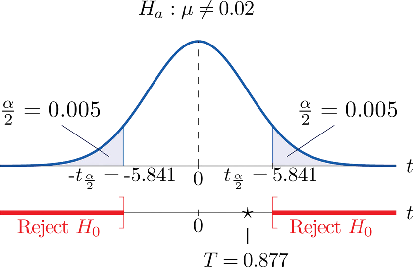

---

### 8.5 大样本总体比例假设检验(Large Sample Tests for a Population Proportion)

#### 步骤

##### 检验目标：
对总体比例 p 进行假设检验，原假设形式为：

$H_0: p = p_0$

备择假设可能是以下三种之一：

$H_1: p < p_0$ （左尾检验）
$H_1: p > p_0$ （右尾检验）
$H_1: p \neq p_0$ （双尾检验）

##### 检验统计量：

$$Z = \frac{\hat{p} - p_0}{\sqrt{\frac{p_0q_0}{n}}}$$

其中：
- $\hat{p}$：样本比例
- $p_0$：原假设中提出的总体比例  
- $q_0 = 1-p_0$
- $n$：样本容量

##### 检验条件：
虽然我们通常认为 n > 30 是大样本，但对于比例检验，更严格的判断条件是：

$$[\hat{p} - 3\sqrt{\frac{\hat{p}(1-\hat{p})}{n}}, \hat{p} + 3\sqrt{\frac{\hat{p}(1-\hat{p})}{n}}] \subseteq [0,1]$$

也就是说，样本比例的置信区间必须完全位于 [0,1] 范围内，才能认为样本足够大。

Z 分布应用：由于满足大样本条件，Z 统计量服从标准正态分布，因此可以直接使用标准正态表查临界值或计算 p 值。

##### 拒绝域判断：

左尾检验：如果 $Z < -Z_\alpha$，则拒绝 $H_0$
右尾检验：如果 $Z > Z_\alpha$，则拒绝 $H_0$
双尾检验：如果 $|Z| > Z_{\alpha/2}$，则拒绝 $H_0$

---

#### 案例

##### 问题
某软饮公司声称大多数成年人更喜欢它的饮料而非主要竞争对手的饮料。为验证这一说法，研究人员随机抽取了500人进行盲测，
其中270人更喜欢该公司的饮料，211人更喜欢竞争对手的，19人无法决定。
问题是：在显著性水平5%（α = 0.05）下，是否有足够证据支持该公司的主张，即大多数人（p > 0.5）更偏好其饮料？

##### 解答

**检验数量是否足够大**
计算标准误差（Standard Error）：

$$\sqrt{\frac{0.54(1-0.54)}{500}} = \sqrt{\frac{0.2484}{500}} \approx \sqrt{0.0004968} \approx 0.0223 \approx 0.02$$
然后构造 3 倍标准误差的区间（近似 99.7% 置信区间）：
$$[0.54 - 3(0.02), 0.54 + 3(0.02)] = [0.48, 0.60]$$
这个区间完全位于 [0, 1] 之间，因此说明样本足够大，可以使用正态分布近似做 Z 检验。

**假设**
- 原假设 H₀：p = 0.50（表示人群偏好各占一半）
- 备择假设 Hₐ：p > 0.50（表示更偏好该公司的饮料）

**检验统计量**
计算样本比例 $\hat{p} = \frac{270}{500} = 0.54$，样本大小 $n = 500$。
因为 $\frac{\hat{p}(1-\hat{p})}{n} = 0.0004968$，标准差约为 $\sqrt{0.0004968} \approx 0.0223$，因此检验统计量为：
$Z = \frac{0.54-0.50}{\sqrt{\frac{(0.50)(0.50)}{500}}} = \frac{0.04}{0.02236} \approx 1.789$

**临界值**
对于右尾检验（因为 Hₐ 是 ">"），显著性水平 α = 0.05，对应的标准正态临界值为 z = 1.645。

**拒绝域**
右尾检验：如果 $Z > 1.645$，则拒绝 $H_0$

**统计决策**
在 5% 的显著性水平下，有足够证据支持该软饮公司的主张：大多数成年人确实更偏好其饮料，而不是竞争对手的。

---

## 第9章 两样本假设检验(Two-Sample Tests)
| 核心内容       | 简述                                      |
| ---------- | --------------------------------------- |
| **研究对象转变** | 从单一样本的参数（如均值 μ、比例 p）推断，过渡到两个总体参数的比较。    |
| **典型应用场景** | 收入差异分析、产品性能对比、治疗效果对照、政策影响评估等。           |
| **参数比较种类** | - 均值之差（μ₁ − μ₂） - 比例之差（p₁ − p₂）      |
| **统计方法**   | - 两样本 t 检验 - z 检验（比例） - 构建差值的置信区间 |
| **样本量考虑**  | 如何根据预期效应大小、显著性水平和检验功效（power）来选择合适样本量。   |

### 9.1 两个总体均值的比较——大型独立样本

#### 独立样本 

- 如果从两个不同总体中抽取的样本彼此之间没有参考关系，且彼此之间没有联系，那么这两个样本就是独立的。

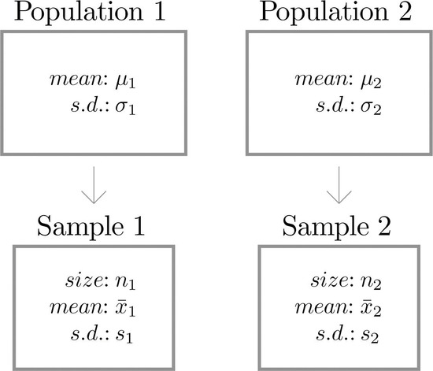

---

#### 可信区间
在比较两个总体的均值（$\mu_1$ 和 $\mu_2$）时，我们通常从这两个总体中分别独立抽取样本，并计算它们的样本均值（$\bar{x}_1$ 和 $\bar{x}_2$）作为总体均值的无偏估计。
为了对 $\mu_1 - \mu_2$ 进行区间估计，我们将 $\bar{x}_1 - \bar{x}_2$ 作为点估计，再加上标准误差与置信系数构成的置信区间；
在样本容量足够大（n₁ ≥ 30 且 n₂ ≥ 30）时，样本均值近似服从正态分布，因此可以使用以下公式构造置信区间：

$$\bar{x}_1 - \bar{x}_2 \pm z_{\alpha/2} \sqrt{\frac{s_1^2}{n_1} + \frac{s_2^2}{n_2}}$$

其中 $s_1^2$ 和 $s_2^2$ 分别为两个样本的方差，$z_{\alpha/2}$ 是标准正态分布的临界值。这个置信区间给出了在一定置信度（如 95%）下，$\mu_1 - \mu_2$ 落入该区间的可能性。该方法的前提是两个样本彼此独立，并且样本容量足够大以适用中心极限定理。

---

#### 假设检验
当两个样本容量均满足：n₁ ≥ 30 且 n₂ ≥ 30，中心极限定理保证样本均值近似服从正态分布，此时我们可使用标准化检验统计量：

$$Z = \frac{(\bar{x}_1 - \bar{x}_2) - D_0}{\sqrt{\frac{s_1^2}{n_1} + \frac{s_2^2}{n_2}}}$$

其中：

$\bar{x}_1, \bar{x}_2$：两个样本的均值

$s_1^2, s_2^2$：两个样本的方差

$n_1, n_2$：两个样本的容量

$D_0$：假设的均值差，一般为 0

Z 服从标准正态分布 $N(0,1)$

---

#### 公式推理

✅ 单样本均值检验的标准化公式
先回顾一个你熟悉的情形：对单个总体均值进行检验。

$$Z = \frac{\bar{x} - \mu}{s/\sqrt{n}}$$

解释：
- $\bar{x}$ 是样本均值，是对 $\mu$ 的点估计
- $s/\sqrt{n}$ 是样本均值的标准误差
- $Z$ 是一个标准正态分布的统计量，用来判断样本均值和总体均值是否显著不同

✅ 推广到两个独立样本的差
我们现在关心的是两个总体均值之差 $\mu_1 - \mu_2$，我们用两个独立样本的均值差来估计它：

点估计：$\bar{x}_1 - \bar{x}_2$

我们希望用它来检验：
$$H_0: \mu_1 - \mu_2 = D_0$$

那么，自然的标准化统计量是：

$$Z = \frac{(\bar{x}_1 - \bar{x}_2) - D_0}{\text{标准误差(Standard Error of Difference)}}$$

关键问题就变成：这个分母是怎么来的？

🧮 两个独立样本均值差的标准误推导
假设两个总体是独立的，那么两个样本均值也是独立的随机变量：

- $\bar{x}_1$ 的标准误差是：$s_1/\sqrt{n_1}$
- $\bar{x}_2$ 的标准误差是：$s_2/\sqrt{n_2}$

根据统计学中两个独立随机变量差的方差公式：

$$\text{Var}(\bar{x}_1 - \bar{x}_2) = \text{Var}(\bar{x}_1) + \text{Var}(\bar{x}_2) = \frac{s_1^2}{n_1} + \frac{s_2^2}{n_2}$$

于是标准差就是它的平方根：

$$SE = \sqrt{\frac{s_1^2}{n_1} + \frac{s_2^2}{n_2}}$$

将它代入标准化公式：

$$Z = \frac{(\bar{x}_1 - \bar{x}_2) - D_0}{\sqrt{\frac{s_1^2}{n_1} + \frac{s_2^2}{n_2}}}$$

---

### 9.2 两个总体均值的比较——小型独立样本

#### 置信区间

当两个总体服从正态分布且具有相等的标准差时，以下公式可用于 μ₁−μ₂ 的置信区间：
**置信度为 100(1−α)% 的两个总体均值差的置信区间（样本量小、相互独立）**：

$$
(\bar{x}_1 - \bar{x}_2) \pm t_{\alpha/2} \cdot \sqrt{s_p^2\left(\frac{1}{n_1} + \frac{1}{n_2}\right)} \tag{9.2.1}
$$

其中：

$$
s_p^2 = \frac{(n_1 - 1)s_1^2 + (n_2 - 1)s_2^2}{n_1 + n_2 - 2}
$$

自由度（degrees of freedom）为：

$$
df = n_1 + n_2 - 2
$$

**使用条件**：

* 两个样本必须是相互独立的；
* 两个总体都必须服从正态分布；
* 两个总体具有相等的标准差；
* "样本量小"指的是：n₁ < 30 或 n₂ < 30。

**说明**：

变量 $s_p^2$ 被称为**合并样本方差（pooled sample variance）**，它是两个样本方差 $s_1^2$ 和 $s_2^2$ 对总体共同方差 $\sigma_1^2 = \sigma_2^2$ 的加权平均估计值。

---

#### 🧮 推导与解释：为什么用合并样本方差
**✳️ 样本方差的估计**
假设：

第一个样本容量是 $n_1$，样本方差是 $s_1^2$
第二个样本容量是 $n_2$，样本方差是 $s_2^2$

对于各自的样本方差，我们知道（无偏估计）：
$E[s_1^2] = \sigma^2, E[s_2^2] = \sigma^2$

但这两个方差是基于不同的自由度计算的：
$s_1^2 = \frac{1}{n_1-1}\sum_{i=1}^{n_1}(x_{1i}-\bar{x}_1)^2$，自由度为 $n_1-1$

$s_2^2 = \frac{1}{n_2-1}\sum_{i=1}^{n_2}(x_{2i}-\bar{x}_2)^2$，自由度为 $n_2-1$

为了更好地估计公共方差 $\sigma^2$，我们使用加权平均来考虑这两个估计的可靠性（自由度越大越可靠）：

$s_p^2 = \frac{(n_1-1)s_1^2 + (n_2-1)s_2^2}{n_1+n_2-2}$

这就是所谓的合并样本方差，它把两个样本的信息合并成一个更精确、更稳定的估计。

**🧪 为什么不能直接用 $s_1^2$ 和 $s_2^2$？**
在小样本下：
单个样本方差的波动性较大；
如果不合并，置信区间或者假设检验中的标准误将受到较大影响；

而合并后，相当于增加了估计方差时的"样本量"（自由度更高），使得：
置信区间更窄；
检验统计量更稳健。
在大样本（n ≥ 30）情况下，由于中心极限定理成立，即使不假设方差相等，使用各自的样本方差也不会带来太大偏差，所以常用"非合并"的公式。但在小样本下，合并更优。

#### 假设检验

在使用小样本检验两个总体均值之差的假设时，其方法与大样本的情形完全一致，只是使用了下列**标准化检验统计量**。在进行假设检验时，必须满足与构造两个均值差的置信区间相同的条件。

$$
T = \frac{(\bar{x}_1 - \bar{x}_2) - D_0}{\sqrt{s_p^2\left(\frac{1}{n_1} + \frac{1}{n_2}\right)}}
$$

其中，

$$
s_p^2 = \frac{(n_1 - 1)s_1^2 + (n_2 - 1)s_2^2}{n_1 + n_2 - 2}
$$

该检验统计量服从**Student t 分布**，自由度为：

$$
\text{df} = n_1 + n_2 - 2
$$

要求如下：

* 两个样本必须**相互独立**
* 两个总体必须**服从正态分布**
* 两个总体的标准差必须**相等**
* “小样本”是指 **至少一个样本容量小于 30**，即 $n_1 < 30$ 或 $n_2 < 30$

---

### 9.3：两个总体均值的比较——配对样本（Paired Samples）

假设化学工程师想比较两种不同汽油配方的燃油经济性（油耗表现）。
由于燃油经济性在不同车型之间差异很大，如果直接比较两种燃料分别在**两个独立样本**车辆上的平均油耗，即使一种配方优于另一种，也可能因为车辆间差异过大而难以检测出燃油差异。

举个例子：如果一个样本里大车的比例明显高于另一个样本，即便燃料差异显著，也会被车辆本身的油耗差异掩盖。

因此，与其取两个独立随机样本，不如**成对地选择相同品牌与型号的汽车，并让它们在相似条件下驾驶**，然后比较每对汽车的燃油经济性。这样数据可能会像 **表 9.3.1** 那样：

---

#### 表 9.3.1：配对车辆的燃油经济性

| 品牌型号           | 车 1  | 车 2  |
| -------------- | ---- | ---- |
| Buick LaCrosse | 17.0 | 17.0 |
| Dodge Viper    | 13.2 | 12.9 |
| Honda CR-Z     | 35.3 | 35.4 |
| Hummer H3      | 13.6 | 13.2 |
| Lexus RX       | 32.7 | 32.5 |
| Mazda CX-9     | 18.4 | 18.1 |
| Saab 9-3       | 22.5 | 22.5 |
| Toyota Corolla | 26.8 | 26.7 |
| Volvo XC90     | 15.1 | 15.0 |

---

在这里：

* 第一列数值（Car 1）来自**总体 1**：所有使用汽油配方 1（Type 1）的汽车
* 第二列数值（Car 2）来自**总体 2**：所有使用汽油配方 2（Type 2）的汽车

不过，如果直接用上一节独立样本的公式来分析这些数据是**不正确的**，因为这里两个样本并不是独立抽取的。

**正确的做法**是：
对每一对汽车，计算它们油耗的差值（必须每次都用**相同顺序**做减法，比如“Car 1 − Car 2”），这样就得到 **表 9.3.2** 里的第三列数据。然后，把这些差值视为新的数据样本来分析。

此时，差值样本

$$
d_1 = 0.0, \dots, d_9 = 0.1
$$

（即表 9.3.2 第三列的值）
可被看作一个容量 $n = 9$ 的随机样本，来自一个均值为

$$
\mu_d = \mu_1 - \mu_2
$$

的总体。

这种方法**本质上**把“两个配对样本的均值差”问题**转化为一个单样本问题**，分析方法与前面两章介绍的单总体问题类似。

---

#### 表 9.3.2：配对车辆燃油经济性差值

| 品牌型号           | 车 1  | 车 2  | 差值 (Car 1 − Car 2) |
| -------------- | ---- | ---- | ------------------ |
| Buick LaCrosse | 17.0 | 17.0 | 0.0                |
| Dodge Viper    | 13.2 | 12.9 | 0.3                |
| Honda CR-Z     | 35.3 | 35.4 | -0.1               |
| Hummer H3      | 13.6 | 13.2 | 0.4                |
| Lexus RX       | 32.7 | 32.5 | 0.2                |
| Mazda CX-9     | 18.4 | 18.1 | 0.3                |
| Saab 9-3       | 22.5 | 22.5 | 0.0                |
| Toyota Corolla | 26.8 | 26.7 | 0.1                |
| Volvo XC90     | 15.1 | 15.0 | 0.1                |

---

**注意**：

* 虽然减法的顺序并不影响差值的**绝对值**，但在统计计算中**必须所有配对都用同一顺序**。
* 因此在表 9.3.2 中会出现正数和负数两种差值。

---
**置信区间**
当“差值总体（population of differences）”服从正态分布时，下面的公式可用于 μd = μ1 − μ2 的置信区间计算。
**100(1−α)% 的两个总体均值差的置信区间（配对样本）公式：**
$$
\bar{d} \pm t_{\alpha/2} \frac{s_d}{\sqrt{n}}
$$
其中：
* $n$ 为配对样本的对数（pairs 的数量）
* $\bar{d}$ 为差值的平均值（mean of differences）
* $s_d$ 为差值的标准差（standard deviation of differences）
自由度为：
$$
df = n - 1
$$
差值总体必须服从正态分布。

---

### 9.4 整体比例的比较

由于从总体 1 抽取的样本计算出的样本比例 $\hat{p}_1$ 是总体 1 的比例 $p_1$ 的一个良好估计量，
而从总体 2 抽取的样本计算出的样本比例 $\hat{p}_2$ 是总体 2 的比例 $p_2$ 的一个良好估计量，
因此对比例差 $p_1 - p_2$ 的一个合理点估计是 $\hat{p}_1 - \hat{p}_2$。

**$100(1-\alpha)\%$ 两个总体比例差的置信区间公式：**
$$
(\hat{p}_1 - \hat{p}_2) \ \pm \ z_{\alpha/2} \ \sqrt{ \frac{\hat{p}_1(1-\hat{p}_1)}{n_1} \ + \ \frac{\hat{p}_2(1-\hat{p}_2)}{n_2} }
$$
要求：
1. 两个样本必须 **独立**；
2. 每个样本必须足够大，即：
     $$
     \left[ \hat{p}_1 - 3 \sqrt{\frac{\hat{p}_1(1-\hat{p}_1)}{n_1}},\ \hat{p}_1 + 3 \sqrt{\frac{\hat{p}_1(1-\hat{p}_1)}{n_1}} \right]
     $$

     $$
     \left[ \hat{p}_2 - 3 \sqrt{\frac{\hat{p}_2(1-\hat{p}_2)}{n_2}},\ \hat{p}_2 + 3 \sqrt{\frac{\hat{p}_2(1-\hat{p}_2)}{n_2}} \right]
     $$
都必须**完全落在区间** $[0,1]$ 内。

---

在关于两个总体比例 $p_1$ 和 $p_2$ 的大小关系的假设检验中，这两个总体都具有某个特定特征。
**原假设**和**备择假设**总是用两个总体比例的差来表达，因此原假设总是写成：

$$
H_0: p_1 - p_2 = D_0
$$

其中 $D_0$ 是假设的比例差值（最常见的情况是 $D_0 = 0$）。

**备择假设**有三种常见形式：

| 备择假设形式                    | 检验类型 |
| ------------------------- | ---- |
| $H_a: p_1 - p_2 < D_0$    | 左尾检验 |
| $H_a: p_1 - p_2 > D_0$    | 右尾检验 |
| $H_a: p_1 - p_2 \neq D_0$ | 双尾检验 |

---

**当两个样本独立且样本量都足够大**时，标准化检验统计量的公式如下，并且它服从标准正态分布：

$$
Z = \frac{(\hat{p}_1 - \hat{p}_2) - D_0}{\sqrt{\frac{\hat{p}_1 (1 - \hat{p}_1)}{n_1} + \frac{\hat{p}_2 (1 - \hat{p}_2)}{n_2}}}
$$

---

**样本量“大”的条件**：每个样本的 3 倍标准差区间必须完全落在 $[0, 1]$ 之间。
即：

1. 样本 1：

$$
\left[ \hat{p}_1 - 3 \sqrt{\frac{\hat{p}_1 (1 - \hat{p}_1)}{n_1}},\ \hat{p}_1 + 3 \sqrt{\frac{\hat{p}_1 (1 - \hat{p}_1)}{n_1}} \right] \subseteq [0, 1]
$$

2. 样本 2：

$$
\left[ \hat{p}_2 - 3 \sqrt{\frac{\hat{p}_2 (1 - \hat{p}_2)}{n_2}},\ \hat{p}_2 + 3 \sqrt{\frac{\hat{p}_2 (1 - \hat{p}_2)}{n_2}} \right] \subseteq [0, 1]
$$

---
#### 合并比例

##### 1. 场景

在 **两个总体比例差的假设检验** 中，我们关心的是两个比例是否相等：

$$
H_0: p_1 = p_2
$$

$$
H_a: p_1 \neq p_2
$$

样本数据：

* 样本 1：样本量 $n_1$，成功次数 $x_1$，样本比例 $\hat{p}_1 = x_1/n_1$
* 样本 2：样本量 $n_2$，成功次数 $x_2$，样本比例 $\hat{p}_2 = x_2/n_2$

---

##### 2. 检验统计量的常规形式

如果我们要检验 $p_1 - p_2$，一般 Z 检验的统计量形式是：

$$
z = \frac{\hat{p}_1 - \hat{p}_2}{\text{标准误}}
$$

其中“标准误”来源于两个比例的方差。比例的方差公式是：

$$
Var(\hat{p}) = \frac{p(1-p)}{n}
$$

---

##### 3. 为什么在 $H_0$ 成立时要用 **合并比例（pooled proportion）**

在 $H_0: p_1 = p_2 = p$ 成立的假设下：

* 我们并不知道真实的总体比例 $p$
* 但既然假设两个总体的比例相同，那么 **最好的 $p$ 估计值** 就是 **把两个样本合并起来**，用总体样本成功次数的比例来估计它。

因此：

$$
\hat{p} = \frac{x_1 + x_2}{n_1 + n_2}
$$

这就是 **合并比例**（pooled proportion）。

这样做的原因：

1. **假设下的最优估计**
   在 $H_0$ 下，两个总体比例相等，所以我们可以用全部数据来估计这个公共比例 $p$，比用各自的样本比例更精确。
2. **保持一致的方差公式**
   标准误的计算必须使用同一个 $p$ 来反映零假设条件，否则会引入额外的误差。
3. **对应“合并样本方差”的逻辑**
   这和两总体均值差的 t 检验里“合并样本方差”的思路是一样的——在零假设下两个总体方差相等，就用所有样本数据一起估计一个公共方差。这里只是把“方差”换成了“比例”。

---

##### 4. 使用合并比例的标准误公式

用 $\hat{p}$ 计算标准误：

$$
SE = \sqrt{\hat{p}(1-\hat{p})\left(\frac{1}{n_1} + \frac{1}{n_2}\right)}
$$

检验统计量：

$$
z = \frac{\hat{p}_1 - \hat{p}_2}{SE}
$$

---

##### 5. 总结类比

| 场景         | 公共假设                      | 合并公式           | 原因                     |
| ---------- | ------------------------- | -------------- | ---------------------- |
| 两均值差的 t 检验 | $\sigma_1^2 = \sigma_2^2$ | 合并样本方差 $S_p^2$ | 在假设下两个总体方差相等，合并能提高估计精度 |
| 两比例差的 Z 检验 | $p_1 = p_2$               | 合并比例 $\hat{p}$ | 在假设下两个总体比例相等，合并能提高估计精度 |

---

### 9.5: 样本量的考量

由于抽样会消耗时间、精力和金钱，因此能够事先估算出最小样本量，并确保该样本量有较大概率满足这些要求，将是非常有用的。

#### 独立样本预估 $\mu_1-\mu_2$
假设需要较大的样本量，用**独立样本**估计两个总体均值差 μ₁ − μ₂ 的置信区间公式是：

$$
(\bar{x}_1 - \bar{x}_2) \pm E
$$

其中

$$
E = z_{\alpha/2} \sqrt{\frac{s_1^2}{n_1} + \frac{s_2^2}{n_2}}
$$

当我们说希望在一定的**误差范围**内估计均值时，意思是我们希望**误差限（margin of error） E** 不超过给定的数值。
这里的 $z_{\alpha/2}$ 由所需的置信水平决定。

* $s_1$ 和 $s_2$ 是对两个总体标准差 $\sigma_1$ 和 $\sigma_2$ 的估计值。
* 类似于 **7.4 节** 中的做法，我们假设 $\sigma_1$ 和 $\sigma_2$ 是已知的，或者可以合理地近似得到。

由于不能同时解出 $n_1$ 和 $n_2$，我们必须对它们的相对大小作出假设。
通常我们假设它们相等，即 $n_1 = n_2$。
在这种假设下，将上面的公式改写并解出 $n_1 = n_2$，就能得到所需的最小样本量。

---

**独立样本估计两个总体均值差的最小相等样本量公式**

已知总体标准差的情况下，要在 $100(1-\alpha)\%$ 置信水平下，把均值差 μ₁ − μ₂ 的估计误差控制在 ±E 以内，所需的最小相等样本量为：

$$
n_1 = n_2 = \frac{(z_{\alpha/2})^2 (\sigma_1^2 + \sigma_2^2)}{E^2} \quad \text{向上取整}
$$

---

#### 用配对样本估计 μ₁ − μ₂

正如我们在第 9.3 节结尾提到的，如果样本量较大（通常指 $n \geq 30$），那么置信区间公式中的 $t_{\alpha/2}$ 可以用 $z_{\alpha/2}$ 替代。
此时，置信区间的公式为：

$$
\bar{d} \pm E
$$

其中，

$$
E = z_{\alpha/2} \frac{s_d}{\sqrt{n}}
$$

* $s_d$ 是对差值总体标准差 $\sigma_d$ 的估计。
* 这里的差值指的是每对配对样本中两个观测值的差。
* 我们必须假设已知或能合理估计差值总体标准差 $\sigma_d$。

假设为了满足给定的误差要求需要较大的样本量，我们可以通过上面的公式反向解出所需的样本对数 $n$。

---

##### 用配对样本估计两个总体均值差所需的最小样本量

在配对样本情况下，要求以 $100(1-\alpha)\%$ 的置信度，在误差范围 ±E 内估计两个总体均值差 $\mu_d = \mu_1 - \mu_2$，
所需的最小样本对数为：

$$
n = \frac{(z_{\alpha/2})^2 \sigma_d^2}{E^2}
$$

向上取整后得到最终的样本对数。

---

#### 估计两个总体比例差 $p_1 - p_2$

我们用两个样本比例的差来估计总体比例的差，其置信区间公式为：

$$
\hat{p}_1 - \hat{p}_2 \pm E
$$

其中误差限 $E$ 为：

$$
E = z_{\alpha/2} \sqrt{\frac{\hat{p}_1 (1 - \hat{p}_1)}{n_1} + \frac{\hat{p}_2 (1 - \hat{p}_2)}{n_2}}
$$

* $\hat{p}_1$ 和 $\hat{p}_2$ 是两个样本中对应的样本比例。
* $z_{\alpha/2}$ 是由置信水平确定的标准正态分布临界值。

我们希望估计误差 $E$ 不超过给定的数值，这意味着我们要控制样本量，使置信区间足够窄。

---

##### 样本量计算的约束与假设

由于无法同时解出两个样本量 $n_1$ 和 $n_2$，我们通常假设它们相等：

$$
n_1 = n_2 = n
$$

带入假设后，解出最小相等样本量的公式为：

$$
n = \frac{(z_{\alpha/2})^2 \left( \hat{p}_1 (1 - \hat{p}_1) + \hat{p}_2 (1 - \hat{p}_2) \right)}{E^2}
$$

最后向上取整得到最终样本量。

---

##### 样本比例未知的困境与解决办法

这里和单个总体比例的样本量估计一样，公式中包含了样本比例 $\hat{p}_1, \hat{p}_2$，但我们在采样前并不知道它们的具体值。

解决方法有两种：

1. **基于先验知识的估计**

   * 研究者通常会对总体比例有一定的估计或预判，可以用这些估计值代替 $\hat{p}_1, \hat{p}_2$ 代入公式。
2. **保守估计法**

   * 将 $\hat{p}_1$ 和 $\hat{p}_2$ 都设为 0.5，这是在比例取值范围 \[0,1] 中导致最大方差的值，进而得到最大的样本量估计，保证样本量不会太小，防止低估。
   * 如果只对其中一个比例有估计，另一个比例就用 0.5 来做保守估计。

---

## 第10章 相关与回归
我们对总体或样本中的每个元素都可以测量两个变量 x 和 y，尤其是当我们希望用 x 的值来预测 y 的值时。

---

### 10.1 变量之间的线性关系

#### 变量关系举例

以下表格列出了一些统计学中可能感兴趣的变量对：

| $x$（预测变量或自变量） | $y$（响应变量或因变量） |
| ------------- | ------------- |
| 摄氏温度（℃）       | 华氏温度（℉）       |
| 房屋面积（平方英尺）    | 房屋价值          |
| 特定车型汽车的年龄     | 汽车转售价值        |
| 企业一年广告支出      | 当年收入          |
| 25岁男性身高（英寸）   | 体重（磅）         |

---

#### 确定性的线性关系

表格中第一行的关系与其他不同，因为它是确定性的：
一旦知道了 $x$ 的值，$y$ 的值就完全确定了。
事实上，$y$ 和 $x$ 之间有一个明确的公式：

$$
y = 1.8x + 32
$$

取不同的 $x$ 值代入，计算对应的 $y$ 得到数据表：

| $x$ | $y$ |
| --- | --- |
| -40 | -40 |
| -15 | 5   |
| 32  | 90  |
| 68  | 154 |
| 85  | 185 |
| 122 | 252 |

这些点绘制在坐标系中，所有点都落在同一条直线上，因此称之为线性关系。

* 公式中的数字 $1.8$ 是直线的斜率，表示当 $x$ 增加1单位时，$y$ 增加1.8单位。
* 公式中的数字 32 是 $y$ 轴截距，表示直线与 $y$ 轴的交点。
* 任何非垂直直线都可以用公式 $y = mx + b$ 表示，其中 $m$ 是斜率，$b$ 是截距。

---

#### 带随机性的线性关系

表格中其余的例子都含有随机成分。
以表中最后一行为例：25岁男性的身高 $x$ 和体重 $y$ 之间的关系。
如果随机选取若干25岁男性并测量他们的身高和体重，可能得到类似的数据对：

$$
(68, 151), (72, 163), (69, 146), (72, 180), (70, 157), (73, 170), (70, 164), (73, 175), (71, 171), (74, 178), (72, 160), (75, 188)
$$

这些数据点绘制在散点图上，如图所示。
虽然点大致沿一条线排列，但不完全在直线上，体现了随机因素的存在。

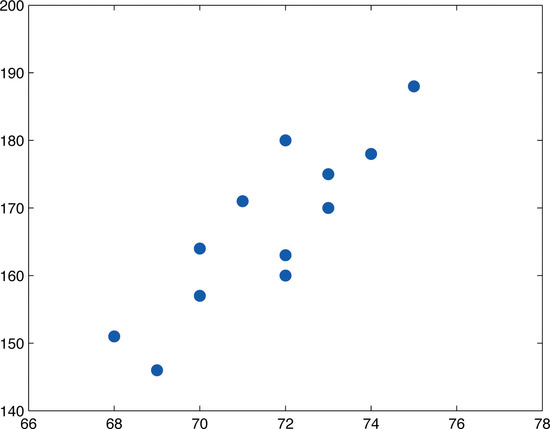

---
好的，我帮你把 **10.2 线性相关系数** 这一节补充完整，除了定义和性质，我们还可以加上 **计算步骤、几何意义、注意事项和实例**，这样内容会更加系统。

---

### 10.2 线性相关系数

#### 线性相关系数的定义

给定一组样本数据 $n$ 对数值 $(x_i, y_i)$，**线性相关系数** $r$ 由公式给出：

$$
r = \frac{S_{xy}}{\sqrt{S_{xx} S_{yy}}}
$$

其中：

$$
  S_{xy} = \sum_{i=1}^{n} (x_i - \bar{x})(y_i - \bar{y}) \\
  S_{xx} = \sum_{i=1}^{n} (x_i - \bar{x})^2 \\
  S_{yy} = \sum_{i=1}^{n} (y_i - \bar{y})^2
$$

$\bar{x}$ 是所有 $x$ 值的平均数，$\bar{y}$ 是所有 $y$ 值的平均数。

---

#### 线性相关系数的性质

1. **取值范围**

   $$
   -1 \le r \le 1
   $$
2. **方向**

   * $r > 0$：正相关（$x$ 增大时 $y$ 也倾向增大）。
   * $r < 0$：负相关（$x$ 增大时 $y$ 倾向减小）。
3. **强度**

   * $|r| \approx 1$：强线性关系（点接近一条直线）。
   * $|r| \approx 0$：弱线性关系（点云无明显直线趋势）。
4. **无量纲性**

   * $r$ 不依赖于变量的单位或尺度。
5. **对称性**

   $$
   r(x,y) = r(y,x)
   $$

---

#### 计算步骤

1. 计算 $\bar{x}$ 和 $\bar{y}$。
2. 计算每个点的 $(x_i - \bar{x})$ 和 $(y_i - \bar{y})$。
3. 计算 $S_{xx}$、$S_{yy}$ 和 $S_{xy}$。
4. 代入公式

   $$
   r = \frac{S_{xy}}{\sqrt{S_{xx} S_{yy}}}
   $$

---

#### 几何意义

1. **去均值**

   * 消除整体平移影响（只看波动模式，不看绝对大小）
   * 例：工资整体上涨 5000 元不影响相关性

2. **标准化长度（除以标准差）**

   * 消除量纲和波动幅度影响
   * 例：温度变化 1℃ 和股票涨跌 10 元，如果走势一致，相关系数仍为 1

3. **余弦相似度**

   皮尔逊系数本质上是 **去均值后的两个向量的余弦相似度**：

$$
\cos\theta = \frac{X \cdot Y}{\|X\| \cdot \|Y\|}
$$

意义：

* $\cos\theta \approx 1$：方向接近 → 走势一致（正相关）
* $\cos\theta \approx -1$：方向相反 → 一个涨一个跌（负相关）
* $\cos\theta \approx 0$：方向垂直 → 走势无关

---

#### 注意事项

* **只衡量线性关系**，非线性关系可能会被低估。
* 对异常值**非常敏感**。
* 相关不代表因果（Correlation ≠ Causation）。

---

#### 示例计算

已知数据：

$$
(x, y) = \{(1, 2), (2, 3), (3, 6), (4, 8)\}
$$

1. $\bar{x} = 2.5$，$\bar{y} = 4.75$
2. * $S_{xx} = (1-2.5)^2 + (2-2.5)^2 + (3-2.5)^2 + (4-2.5)^2 = 5$
   * $S_{yy} = (2-4.75)^2 + (3-4.75)^2 + (6-4.75)^2 + (8-4.75)^2 = 20.75$
   * $S_{xy} = (1-2.5)(2-4.75) + \dots = 10.125$
3. $$
   r = \frac{10.125}{\sqrt{5 \cdot 20.75}} \approx 0.997
   $$

结论：两者几乎完全正相关。

---

### 10.3 带随机性的线性关系建模

#### 研究背景

本章研究的是这样的总体：对总体中每个元素，我们可以测量两个变量 $x$ 和 $y$。
我们关注的是如何利用 $x$ 的值推断 $y$ 的值，比如根据住宅房屋的面积 $x$ 来预测它的转售价值 $y$。

由于 $x$ 和 $y$ 之间的关系不是确定性的，因此必须采用统计方法。
所有统计方法的相关公式只在特定假设条件下成立，这些假设条件就是所谓的**模型**。

---

#### 线性回归模型的假设

* 对于每一个固定的 $x$ 值，定义一个子总体，如所有面积为2100平方英尺的房屋。
* 对于该子总体中每个元素，都有一个对应的 $y$ 值，如这些2100平方英尺房屋的价值。
* 令 $E(y)$ 表示固定 $x$ 值对应的所有 $y$ 值的平均数，且 $E(y)$ 随 $x$ 的不同而变化。

---

#### 第一个假设：线性关系

假设 $x$ 和其对应子总体的 $y$ 的均值 $E(y)$ 之间存在线性关系，即存在常数 $\beta_0$ 和 $\beta_1$，使得：

$$
y = \beta_1 x + \beta_0
$$

这就是“简单线性回归”中“线性”的含义。（“简单”指的是 $y$ 仅依赖于一个变量 $x$）。

---

#### 第二个假设：随机误差服从正态分布且方差恒定

* 对于每一个固定的 $x$，对应的 $y$ 值围绕均值 $E(y)$ 服从以 $E(y)$ 为均值、标准差为 $\sigma$ 的正态分布。
* $\sigma$ 对所有 $x$ 值均相同。
* 也就是说，存在均值为0、标准差为 $\sigma$ 的正态随机变量 $\varepsilon$，使得总体的 $x, y$ 关系可以表示为：

$$
y = \beta_1 x + \beta_0 + \varepsilon
$$

---

#### 第三个假设：误差项独立

不同观察值对应的随机误差 $\varepsilon$ 是相互独立的。

---

#### 模型总结

**简单线性回归模型**：
对于数据集中每个点 $(x, y)$，观察值 $y$ 是随机变量，满足：

$$
y = \beta_1 x + \beta_0 + \varepsilon
$$

其中，参数 $\beta_0$ 和 $\beta_1$ 是固定的未知常数，
误差项 $\varepsilon$ 是均值为0、未知标准差 $\sigma$ 的正态随机变量。

---

#### 术语说明

* 直线方程 $y = \beta_1 x + \beta_0$ 称为**总体回归线**。

---

#### 模型的组成（图 10.3.1）

模型由两部分组成：

$$
y = \underbrace{\beta_1 x + \beta_0}_{\text{确定性部分}} + \underbrace{\varepsilon}_{\text{随机部分}}
$$

* **确定性部分**：描述 $y$ 随 $x$ 的变化趋势，是散点图中我们能看到的近似直线。
* **随机部分（误差项）**：解释了为何实际观测的 $y$ 值不会完全落在线上，而是在其附近波动。

只有了解了误差项的性质，才能判断趋势的可信度。

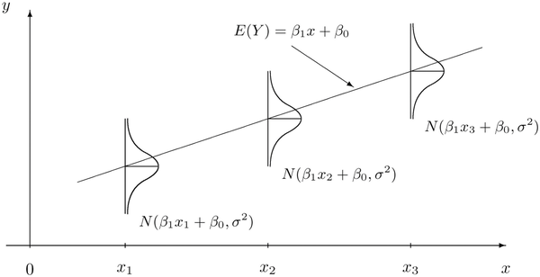

---

### 10.4: 最小二乘回归线 — 数据的直线拟合优度

当数据的散点图绘制完成，并且前面章节所述的模型假设至少在视觉上得到了验证（可能还计算了相关系数 $r$ 来定量验证线性趋势）后，下一步的分析是找到最能拟合数据的直线。

我们将通过一个示例来说明如何衡量一条直线对数据的拟合程度。示例中我们研究直线：

$$
y = \frac{1}{2}x - 1
$$

并将其与数据集：

$$
(x, y) = (2, 0), (2, 1), (6, 2), (8, 3), (10, 3)
$$

进行比较（此数据集将在接下来的三个小节中反复使用）。我们将这条直线的方程写作：

$$
\hat{y} = \frac{1}{2}x - 1
$$

这里在 $y$ 上加一个“帽子”符号 $\hat{y}$，表示这些 $y$ 值是由公式计算得到的预测值，而非数据中的真实值。所有用于近似数据的直线，我们都会采用这种符号。

这条直线是基于视觉判断选择的，看起来与数据的拟合效果还不错。

---

#### 拟合优度的思想

拟合优度的基本思想如 **图 10.4.1** 所示：
在数据的散点图上叠加直线 $\hat{y} = \frac{1}{2}x - 1$。

对于数据集中的每个点，都有一个对应的 **误差 (error)**：

* 它是该点到直线的垂直距离（正负号区分方向）
* 如果数据点在直线上方，则误差为正
* 如果数据点在直线下方，则误差为负

误差计算公式为：

$$
\text{error at data point} (x, y) = (\text{真实 } y) - (\text{预测 } \hat{y}) = y - \hat{y}
$$

其中 $\hat{y}$ 是将数据点的 $x$ 代入直线公式后得到的预测值。

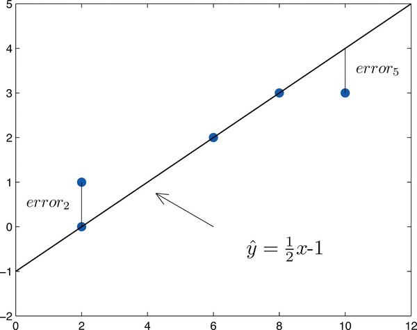

---

#### 示例数据的误差计算（表 10.4.1）

| $x$   | $y$ | $\hat{y} = \frac12 x - 1$ | $y - \hat{y}$ | $(y - \hat{y})^2$ |
| ----- | --- | ------------------------- | ------------- | ----------------- |
| 2     | 0   | 0                         | 0             | 0                 |
| 2     | 1   | 0                         | 1             | 1                 |
| 6     | 2   | 2                         | 0             | 0                 |
| 8     | 3   | 3                         | 0             | 0                 |
| 10    | 3   | 4                         | -1            | 1                 |
| **Σ** | —   | —                         | 0             | **2**             |

---

#### 为什么不直接用误差求和

最初的想法可能是将每个点的误差直接相加。但如本例所示，这样做并不合理：
虽然直线并不能完美拟合数据（事实上，没有任何直线能完全拟合除非点完全共线），但是由于正误差和负误差会相互抵消，本例中第四列的误差和为 **0**，误导性很大。

因此，拟合优度的常用度量是 **误差平方和**（Sum of Squared Errors，SSE）：

* 对每个点计算 $(y - \hat{y})^2$
* 然后将所有平方误差相加
* 平方可以消除正负抵消问题

在本例中，平方误差和为：

$$
\text{SSE} = 2
$$

这个数值衡量了直线对数据的拟合效果，越小表示拟合越好。

---

**定义：拟合优度（Goodness of Fit）**

给定一条直线：

$$
\hat{y} = mx + b
$$

和一个包含 $n$ 对数据点 $(x, y)$ 的样本，
该直线的拟合优度定义为：

$$
\sum (y - \hat{y})^2
$$

---

#### 最小二乘回归线（Least Squares Regression Line）

##### 概念

给定任意一组成对的数值数据 $(x, y)$（只要所有的 $x$ 不完全相同），以及对应的散点图，总可以找到且**只有一条直线**，使得它在**最小化误差平方和**（Sum of Squared Errors, SSE）的意义下，比其他任何直线都更适合数据。
这条直线被称为 **最小二乘回归线（Least Squares Regression Line）**。

它的好处是：不仅能用来描述数据趋势，还能用来做预测，并且有明确的计算公式。

---

##### 定义

设有一组数据点 $(x, y)$，并且不全是同一个 $x$ 值，
最小二乘回归线的形式为：

$$
\hat{y} = \hat{\beta}_1 x + \hat{\beta}_0
$$

其中：

* $\hat{\beta}_1$：回归直线的斜率
* $\hat{\beta}_0$：回归直线的截距（y 轴上的截距）

**计算公式：**

$$
\hat{\beta}_1 = \frac{SS_{xy}}{SS_{xx}}
$$

$$
\hat{\beta}_0 = \bar{y} - \hat{\beta}_1 \bar{x}
$$

这里：

$$
SS_{xx} = \sum x^2 - \frac{1}{n} \left( \sum x \right)^2
$$

$$
SS_{xy} = \sum xy - \frac{1}{n} \left( \sum x \right)\left( \sum y \right)
$$

---

#### 高斯最小二乘法推导过程整理

---

##### 1. 问题背景

* 给定一组带误差的观测数据 $\{(x_i, y_i)\}$，
* 假设关系为线性模型：

  $$
  y_i = \beta_0 + \beta_1 x_i + \varepsilon_i
  $$

  其中 $\varepsilon_i$ 是误差。
* 目标：找到参数 $\beta_0, \beta_1$ 使拟合误差最小。

---

##### 2. 构造目标函数 — 误差平方和

定义误差平方和：

$$
S(\beta_0, \beta_1) = \sum_{i=1}^n \left(y_i - \beta_0 - \beta_1 x_i\right)^2
$$

---

##### 3. 寻找最优参数 — 使误差平方和最小

* 对参数 $\beta_0, \beta_1$ 分别求偏导数，
* 设偏导数为0（极值条件）：

$$
\frac{\partial S}{\partial \beta_0} = -2 \sum_{i=1}^n \left(y_i - \beta_0 - \beta_1 x_i\right) = 0
$$

$$
\frac{\partial S}{\partial \beta_1} = -2 \sum_{i=1}^n x_i \left(y_i - \beta_0 - \beta_1 x_i\right) = 0
$$

---

##### 4. 化简正规方程组

将上式展开整理：

$$
\sum y_i = n \beta_0 + \beta_1 \sum x_i
$$

$$
\sum x_i y_i = \beta_0 \sum x_i + \beta_1 \sum x_i^2
$$

---

##### 5. 求解参数 $\beta_0, \beta_1$ 

* 这是一组关于 $\beta_0, \beta_1$ 的线性方程组，
* 利用高斯消元法逐步消元，解得：

$$
\hat{\beta}_1 = \frac{\sum (x_i - \bar{x})(y_i - \bar{y})}{\sum (x_i - \bar{x})^2} = \frac{SS_{xy}}{SS_{xx}}
$$

$$
\hat{\beta}_0 = \bar{y} - \hat{\beta}_1 \bar{x}
$$

---

##### 符号说明

| 符号                  | 名称           | 数学定义（样本形式）                                                                                  | 等价计算公式                                                         | 备注                         |
| ------------------- | ------------ | ------------------------------------------------------------------------------------------- | -------------------------------------------------------------- | -------------------------- |
| $\bar{x}$           | 样本均值         | $\displaystyle \bar{x} = \frac{1}{n} \sum x_i$                                              | —                                                              | $\bar{y}$ 同理               |
| $S_{xx}$, $SS_{xx}$ | 离差平方和        | $\displaystyle \sum (x_i - \bar{x})^2$                                                      | $\displaystyle \sum x_i^2 - \frac{1}{n}(\sum x_i)^2$           | 衡量 $x$ 的离散程度               |
| $S_{yy}$, $SS_{yy}$ | 离差平方和        | $\displaystyle \sum (y_i - \bar{y})^2$                                                      | $\displaystyle \sum y_i^2 - \frac{1}{n}(\sum y_i)^2$           | 衡量 $y$ 的离散程度               |
| $S_{xy}$, $SS_{xy}$ | 离差乘积和（协方差分子） | $\displaystyle \sum (x_i - \bar{x})(y_i - \bar{y})$                                         | $\displaystyle \sum x_i y_i - \frac{1}{n}(\sum x_i)(\sum y_i)$ | 衡量 $x,y$ 的共同变异             |
| $s_x^2$             | 样本方差         | $\displaystyle s_x^2 = \frac{S_{xx}}{n-1}$                                                  | —                                                              | 样本标准差：$s_x = \sqrt{s_x^2}$ |
| $s_y^2$             | 样本方差         | $\displaystyle s_y^2 = \frac{S_{yy}}{n-1}$                                                  | —                                                              | 样本标准差：$s_y = \sqrt{s_y^2}$ |
| $\mathrm{Cov}(X,Y)$ | 样本协方差        | $\displaystyle \mathrm{Cov}(X,Y) = \frac{S_{xy}}{n-1}$                                      | —                                                              | 衡量两个变量联合变异的平均水平            |
| $r$                 | 皮尔逊相关系数      | $\displaystyle r = \frac{S_{xy}}{\sqrt{S_{xx} S_{yy}}} = \frac{\mathrm{Cov}(X,Y)}{s_x s_y}$ | —                                                              | 范围 $[-1,1]$，衡量线性相关强度       |
| $\hat{\beta}_1$     | 线性回归斜率       | $\displaystyle \hat{\beta}_1 = \frac{S_{xy}}{S_{xx}} = r \cdot \frac{s_y}{s_x}$             | —                                                              | 回归直线斜率                     |
| $\hat{\beta}_0$     | 线性回归截距       | $\displaystyle \hat{\beta}_0 = \bar{y} - \hat{\beta}_1 \bar{x}$                             | —                                                              | 回归直线截距                     |

---

#### 最小二乘回归方程

$$
\hat{y} = \hat{\beta}_1 x + \hat{\beta}_0
$$

称为 **最小二乘回归方程（Least Squares Regression Equation）**。

回忆 10.3 节：

* **总体回归线（Population Regression Line）**：

  $$
  y = \beta_1 x + \beta_0
  $$

  其中 $\beta_1, \beta_0$ 是未知的总体参数
* **样本回归线（Sample Regression Line）**：

  $$
  \hat{y} = \hat{\beta}_1 x + \hat{\beta}_0
  $$

  其中 $\hat{\beta}_1, \hat{\beta}_0$ 是样本数据计算得到的估计值（statistics），用来估计总体参数。

---
#####  推导过程（协方差的分子部分）
$SS_{xy}$ 通常写作：

$$
SS_{xy} = \sum_{i=1}^n (x_i - \bar{x})(y_i - \bar{y})
$$

它是协方差公式的核心部分，在回归斜率公式中也直接用到。

---

###### 1. 从协方差的定义出发

总体协方差定义是：

$$
\mathrm{Cov}(X, Y) = E[(X - \mu_X)(Y - \mu_Y)]
$$

在样本情况下，用样本均值替代总体均值：

$$
\hat{\mathrm{Cov}}(X, Y) = \frac{1}{n} \sum_{i=1}^n (x_i - \bar{x})(y_i - \bar{y})
$$

如果我们不除以 $n$（只是先计算分子），就得到了：

$$
SS_{xy} = \sum_{i=1}^n (x_i - \bar{x})(y_i - \bar{y})
$$

这就是“离均差乘积的总和”。

---

###### 2. 展开公式

将 $(x_i - \bar{x})(y_i - \bar{y})$ 展开：

$$
(x_i - \bar{x})(y_i - \bar{y}) = x_i y_i - x_i \bar{y} - \bar{x} y_i + \bar{x} \bar{y}
$$

对 $i$ 求和：

$$
SS_{xy} = \sum x_i y_i - \bar{y} \sum x_i - \bar{x} \sum y_i + \sum \bar{x} \bar{y}
$$

---

###### 3. 利用均值的性质简化

因为：

$$
\sum x_i = n\bar{x}, \quad \sum y_i = n\bar{y}, \quad \sum \bar{x} \bar{y} = n \bar{x} \bar{y}
$$

代入：

$$
SS_{xy} = \sum x_i y_i - \bar{y} (n \bar{x}) - \bar{x} (n \bar{y}) + n \bar{x} \bar{y}
$$

$$
SS_{xy} = \sum x_i y_i - n \bar{x} \bar{y} - n \bar{x} \bar{y} + n \bar{x} \bar{y}
$$

$$
SS_{xy} = \sum x_i y_i - n \bar{x} \bar{y}
$$

---

###### 4. 最终推导结果

$$
\boxed{SS_{xy} = \sum x_i y_i - \frac{(\sum x_i)(\sum y_i)}{n}}
$$

这就是书上常用的快速计算公式，它避免了先求均值再逐项计算的繁琐。

---

###### 5. 和回归斜率的关系

回归斜率公式是：

$$
b_1 = \frac{SS_{xy}}{SS_{xx}}
$$

其中：

$$
SS_{xx} = \sum x_i^2 - \frac{(\sum x_i)^2}{n}
$$

它们的结构几乎一样，只是 $SS_{xy}$ 是交叉项，$SS_{xx}$ 是单变量平方项。

---

#### 例题

**题目**
求下面五点数据集的最小二乘回归直线，并验证它比第 10.4.1 节中考虑的直线 $\hat{y}=\tfrac{1}{2}x-1$ 对数据拟合得更好。

数据集：

$$
(x,y) = (2,0),\ (2,1),\ (6,2),\ (8,3),\ (10,3)
$$

---

##### 解（按原书思路以表格形式展示计算）

先列出每点的 $x, y, x^2, xy$ 并求列和：

| **序号** |   $x$ |    $y$ | $x^2$ |    $xy$ |
| ----: | ----: | -----: | ----: | ------: |
| **1** |     2 |      0 |     4 |       0 |
| **2** |     2 |      1 |     4 |       2 |
| **3** |     6 |      2 |    36 |      12 |
| **4** |     8 |      3 |    64 |      24 |
| **5** |    10 |      3 |   100 |      30 |
| **Σ** | **28** | **9** | **208** | **68** |

由表中和式计算：

* $n=5$
* $\displaystyle SS_{xx}=\sum x^2-\tfrac{1}{n}(\sum x)^2 = 208 - \tfrac{1}{5}\cdot 28^2 = 208 - 156.8 = 51.2$.
* $\displaystyle SS_{xy}=\sum xy-\tfrac{1}{n}(\sum x)(\sum y) = 68 - \tfrac{1}{5}\cdot 28\cdot 9 = 68 - 50.4 = 17.6$.
* $\bar{x}=\dfrac{\sum x}{n}=\dfrac{28}{5}=5.6,\quad \bar{y}=\dfrac{\sum y}{n}=\dfrac{9}{5}=1.8$.

因此斜率与截距为：

$$
\hat{\beta}_1=\frac{SS_{xy}}{SS_{xx}}=\frac{17.6}{51.2}=0.34375
$$

$$
\hat{\beta}_0=\bar{y}-\hat{\beta}_1\bar{x}=1.8-(0.34375)(5.6)=1.8-1.925=-0.125
$$

所以**最小二乘回归直线**为：

$$
\boxed{\ \hat{y}=0.34375x-0.125\ }
$$

---

##### 计算拟合误差（检验拟合优度）

将回归直线代入每个 $x$ 得到预测值 $\hat{y}$，并计算残差与残差平方：

|   $x$ | $y$ | $\hat{y}=0.34375x-0.125$ | $y-\hat{y}$ | $(y-\hat{y})^2$ |
| ----: | --: | -----------------------: | ----------: | --------------: |
|     2 |   0 |                   0.5625 |     -0.5625 |      0.31640625 |
|     2 |   1 |                   0.5625 |      0.4375 |      0.19140625 |
|     6 |   2 |                   1.9375 |      0.0625 |      0.00390625 |
|     8 |   3 |                   2.6250 |      0.3750 |      0.14062500 |
|    10 |   3 |                   3.3125 |     -0.3125 |      0.09765625 |
| **Σ** |   — |                        — |           — |        **0.75** |

残差平方和（SSE）为 $0.75$。

---

#### 平方误差和（Sum of Squared Errors，SSE）

为了衡量一条直线对一组数据的拟合优度，通常需要对数据集中每个点：

1. 计算该点对应的预测值 $\hat{y}$，
2. 计算误差（实际值与预测值之差），
3. 将误差平方后求和。

这个总和称为**平方误差和**，用来反映拟合误差的大小。

---

但是，对于**最小二乘回归线**（即最优拟合线），可以通过一个更简洁的公式直接用数据计算平方误差和，而不必逐点计算预测误差：

$$
SSE = SS_{yy} - \hat{\beta}_1 SS_{xy}
$$

其中：

* $SSE$ 是平方误差和，
* $SS_{yy} = \sum (y_i - \bar{y})^2$ 表示 $y$ 的总变异，
* $SS_{xy} = \sum (x_i - \bar{x})(y_i - \bar{y})$，
* $\hat{\beta}_1$ 是回归直线的斜率估计值。

---

### 10.5 关于回归斜率 $\beta_1$ 的统计推断

---

#### 1. $\beta_1$ 的意义

* $\beta_1$ 是总体回归线的斜率，表示响应变量 $y$ 的均值 $E(y)$ 随预测变量 $x$ 单位增加时的变化率。
* 若 $\beta_1 > 0$，则 $y$ 随 $x$ 增加而增加；若 $\beta_1 < 0$，则随之减少。
* 重点是对 $\beta_1$ 进行**置信区间估计**和**假设检验**。

---

#### 2. $\beta_1$ 的置信区间

* 样本回归斜率 $\hat{\beta}_1$ 是 $\beta_1$ 的点估计。
* 给定置信水平 $100(1-\alpha)\%$，$\beta_1$ 的置信区间为：

$$
\hat{\beta}_1 \pm t_{\alpha/2, df} \cdot S_\varepsilon \sqrt{\frac{1}{SS_{xx}}}
$$

* 其中：

  * $S_\varepsilon = \sqrt{\frac{SSE}{n-2}}$ 是误差的样本标准差（估计总体误差标准差 $\sigma$），
  * $df = n-2$ 是自由度，
  * $t_{\alpha/2, df}$ 是对应自由度和置信水平的 t 分布临界值。

* 置信区间计算基于第10.3节中列出的假设条件。

---

#### 3. 误差的样本标准差

* 统计量 $S_\varepsilon$ 被称为误差的样本标准差，
* 它估计了在固定 $x$ 条件下，$y$ 的误差标准差。

---

#### 4. 关于 $\beta_1$ 的假设检验

##### 4.1 检验步骤

* 使用第8.1节和8.3节介绍的五步法（临界值法或p值法）对 $\beta_1$ 进行假设检验。

##### 4.2 原假设与备择假设形式

* 原假设：

$$
H_0: \beta_1 = B_0
$$

* 备择假设形式及对应术语：

| 备择假设                    | 术语   |
| ----------------------- | ---- |
| $H_a: \beta_1 < B_0$    | 左尾检验 |
| $H_a: \beta_1 > B_0$    | 右尾检验 |
| $H_a: \beta_1 \neq B_0$ | 双尾检验 |

* 特别重要的假设是 $B_0 = 0$：

$$
H_0: \beta_1 = 0
$$

这对应 $x$ 对 $y$ 无预测作用的情况。

---

#### 5. 检验统计量

* 计算检验统计量：

$$
T = \frac{\hat{\beta}_1 - B_0}{S_\varepsilon / \sqrt{SS_{xx}}}
$$

* 其服从自由度为 $n-2$ 的 Student’s $t$ 分布。

* 同样，检验基于10.3节假设条件。

---

### 10.6 决定系数（Coefficient of Determination）

---

#### 1. 概述

* 当 $(x, y)$ 的散点图没有明显的上升或下降趋势时，水平线 $\hat{y} = \bar{y}$ 就是一个很好的拟合线。
* 这意味着随机选取一个样本，已知它的 $x$ 值对预测 $y$ 没有帮助。
* 当散点图表现出线性上升或下降趋势时，使用最小二乘回归线

$$
\hat{y} = \hat{\beta}_1 x + \hat{\beta}_0
$$

对 $y$ 进行预测是有用的。

---

#### 2. 拟合优度的直观体现

* 图示（如图10.6.1和10.6.2）显示：

  * 左图中用平均值线 $\hat{y} = \bar{y}$ 拟合数据；
  * 右图中用最小二乘回归线拟合数据，误差通过垂直线段展示。
* 最小二乘回归线的平方误差和 $SSE$ 小于任何其他线的平方误差和，尤其小于用平均线拟合的误差和 $SS_{yy}$。

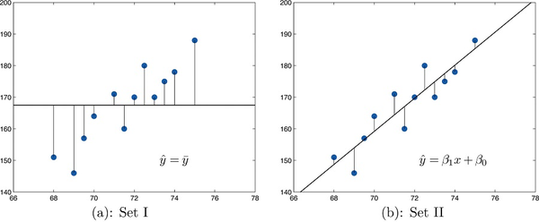

---

#### 3. 决定系数的定义与意义

* 衡量回归方程预测效果的一个指标是减少的平方误差比例：

$$
\frac{SS_{yy} - SSE}{SS_{yy}} = 1 - \frac{SSE}{SS_{yy}}
$$

* 其中：

  * $SSE/SS_{yy}$ 表示即使使用最优线性拟合后，$y$ 的变异中**无法解释的比例**，
  * $1 - SSE/SS_{yy}$ 表示通过线性关系被解释的 $y$ 的变异比例。

* 这就是**决定系数**，记作 $r^2$，它表示 $y$ 的总变异中被 $x$ 解释的比例。

---

#### 4. 决定系数的计算公式

决定系数可以用以下三个等价表达计算：

$$
r^2 = \frac{SS_{yy} - SSE}{SS_{yy}} = \frac{SS_{xy}^2}{SS_{xx} SS_{yy}} = \hat{\beta}_1 \frac{SS_{xy}}{SS_{yy}}
$$

* $SS_{xx}, SS_{yy}, SS_{xy}$ 是前面定义的离差平方和和协方差和。
* $\hat{\beta}_1$ 是回归斜率。

---

#### 5. 与相关系数的关系

* 决定系数 $r^2$ 是相关系数 $r$（第10.2节讨论）的平方：

$$
r^2 = (r)^2
$$

* 因此，若已知相关系数 $r$，只需平方即可得到决定系数。

---

### 10.7 估计与预测（Estimation and Prediction）

---

#### 1. 问题背景

考虑示例 10.4.2 中关于汽车年龄和价值的数据：

* 目标是根据汽车年龄预测其价值。

---

#### 2. 两组问题比较

| 问题编号 | 内容描述                                       | 目标               |
| ---- | ------------------------------------------ | ---------------- |
| 问题1  | 估计所有四年车龄汽车的平均价值，并构造 95% 置信区间。              | 估计总体参数（均值）       |
| 问题2  | 预测 Shylock 下周买到的第一辆四年车龄汽车的价值，并构造 95% 预测区间。 | 预测单个随机变量的取值（新观测） |

---

#### 3. 解答思路

##### 3.1 点估计（两个问题相同）

使用最小二乘回归方程：

$$
\hat{y} = -2.05x + 32.83
$$

代入 $x=4$：

$$
\hat{y} = -2.05 \times 4 + 32.83 = 24.63
$$

对应价值为 24,630 美元。

* 对于问题1，这个数是所有四年车龄汽车的均值估计 $E(y)$。
* 对于问题2，这个数是对第一辆四年车价值的最优猜测，即均值。

---

##### 3.2 区间估计的区别

| 项目 | 问题1（置信区间） | 问题2（预测区间） |
|------|--------------|--------------|
| 估计目标 | 总体均值 $E(y)$ | 单个新观测值的取值 |
| 区间名称 | 置信区间（Confidence Interval） | 预测区间（Prediction Interval） |
| 区间公式 | $\hat{y}_p \pm t_{\alpha/2, df} \cdot S_\varepsilon \sqrt{\frac{1}{n} + \frac{(x_p - \bar{x})^2}{SS_{xx}}}$ | $\hat{y}_p \pm t_{\alpha/2, df} \cdot S_\varepsilon \sqrt{1 + \frac{1}{n} + \frac{(x_p - \bar{x})^2}{SS_{xx}}}$ |
| 区间宽度比较 | 相对较窄 | 总是比置信区间宽（多了"1"项） |
| 自由度 | $df = n - 2$ | $df = n - 2$ |
| 依赖假设 | 需满足第10.3节的假设 | 需满足第10.3节的假设 |

---

#### 4. 关键符号解释

* $x_p$：特定的预测点 $x$ 值（样本 $x$ 的范围内）
* $\hat{y}_p$：用最小二乘回归方程计算得到的预测值
* $S_\varepsilon = \sqrt{\frac{SSE}{n-2}}$：误差的样本标准差
* $t_{\alpha/2, df}$：t 分布的临界值

---

#### 5. 总结

* **置信区间**用于估计总体均值的可信范围，反映平均趋势的不确定性。
* **预测区间**用于预测未来单个观测的取值范围，考虑了观测本身的随机波动，因此区间更宽。
* 在实践中，预测区间的"多余1项"使其对不确定性的考虑更充分，适用于实际预测。

---

## 附录
### 假设总表
| 假设类别          | 假设名称            | 数学/概念表述                             | 用途或应用场景                                   | 如果不成立的后果                     |
| ----------------- | ------------------- | ----------------------------------------- | ------------------------------------------------ | ------------------------------------ |
| **数据来源假设**  | 独立性假设          | $P(X_i, X_j) = P(X_i)P(X_j)$（$i \ne j$） | 保证样本间互不影响；可推导方差加法、中心极限定理 | 方差推导错误；推断失效               |
|                   | 同分布假设          | $X_i \sim F_X$（所有样本服从相同分布）    | 保证样本代表性；样本均值等于总体均值             | 推断目标失效，不再估计总体           |
|                   | 简单随机抽样（SRS） | 样本从总体中等概率抽取                    | 所有推断、置信区间、p 值等推导依据               | 偏差、不具代表性                     |
|                   | 样本量远小于总体    | $n < 0.1N$                                | 无放回抽样可近似为独立                           | 若不满足，需考虑依赖性或有限总体修正 |
| **分布性质假设**  | 正态性假设          | $X \sim N(\mu, \sigma^2)$                 | Z 检验、t 检验、线性模型等使用前提               | 小样本时推断不可靠                   |
|                   | 方差有限            | $\mathrm{Var}(X) < \infty$                | 中心极限定理、均值方差推导                       | 不可推导均值方差公式                 |
| **参数估计假设**  | 无偏估计            | $\mathbb{E}[\hat{\theta}] = \theta$       | 估计值准确反映总体参数                           | 系统性高估/低估参数                  |
|                   | 样本方差修正        | 使用 $n-1$ 作为分母                       | 样本方差估计总体方差时无偏                       | 使用 $n$ 时方差被低估                |
| **回归/模型假设** | 误差独立性          | 残差不相关                                | OLS 有效，检验有效                               | 回归失真，自相关问题                 |
|                   | 残差正态性          | 误差项 $\sim N(0, \sigma^2)$              | 回归系数检验、CI 有效                            | 推断不再精确                         |
|                   | 方差齐性            | 所有组或残差方差相等                      | t 检验、ANOVA 正确性                             | 推断偏倚，需 Welch 校正              |
| **假设检验设置**  | 原假设成立前提      | $H_0: \mu = \mu_0$ 等                     | 所有假设检验都建立在它之上                       | 无法进行判断                         |
|                   | 显著性水平事先设定  | $\alpha = 0.05$ 或其他值                  | 控制第一类错误（假阳性）                         | 多次试验时增加误报                   |

---

### 常用无穷级数求和公式

| 编号 | 公式                                         | 适用变量      | 结果                         |
| ---- | -------------------------------------------- | ------------- | ---------------------------- |
| 1    | $\sum_{n=0}^{\infty} q^n$                    | $\|q\| < 1$   | $\frac{1}{1 - q}$            |
| 2    | $\sum_{n=0}^{\infty} n q^n$                  | $\|q\| < 1$   | $\frac{q}{(1 - q)^2}$        |
| 3    | $\sum_{n=0}^{\infty} n^2 q^n$                | $\|q\| < 1$   | $\frac{q(1 + q)}{(1 - q)^3}$ |
| 4    | $\sum_{k=0}^{\infty} \frac{\lambda^k}{k!}$   | $\lambda > 0$ | $e^\lambda$                  |
| 5    | $\sum_{k=0}^{\infty} k \frac{\lambda^k}{k!}$ | 泊松期望      | $\lambda e^\lambda$          |

#### 证明
1. **等比级数求和**
$$\sum_{n=0}^{\infty} q^n = 1 + q + q^2 + \cdots = \frac{1}{1-q}, \text{当} |q|<1$$

📌 推导思路（乘法消项法）：
记：
$$S = 1 + q + q^2 + q^3 + \cdots$$

乘上 $q$：
$$qS = q + q^2 + q^3 + \cdots$$

相减：
$$S - qS = 1 \Rightarrow S(1-q) = 1 \Rightarrow S = \frac{1}{1-q}$$

---

2.  **带系数的等比级数（一次幂）**

$$\sum_{n=0}^{\infty} nq^n = \frac{q}{(1-q)^2}$$

📌 推导思路：对公式(1) 两边对 $q$ 求导

$$f(q)=\sum_{n=0}^{\infty} q^n = \frac{1}{1-q}$$

对两边求导（注意右边使用链式法则）：

$$f'(q)=\sum_{n=1}^{\infty} nq^{n-1} = \frac{1}{(1-q)^2}$$

再乘上 $q$：

$$\sum_{n=1}^{\infty} nq^n = \frac{q}{(1-q)^2}$$

✅ 所以：

$$\sum_{n=0}^{\infty} nq^n = \frac{q}{(1-q)^2}$$

---

3. **带系数的等比级数（二次幂）**
   证明直接对2的基础上求导,方法同2

---

4. **Maclaurin 级数**
在数学分析中，以 0 为中心的泰勒展开（Maclaurin 展开）定义如下：

对于函数 $f(x)$，若在 $x=0$ 处无限次可导，则：

$$f(x)=\sum_{k=0}^{\infty}\frac{f^{(k)}(0)}{k!}x^k$$

对于 $f(x)=e^x$，其所有阶导数都为 $e^x$，而且在 $x=0$ 处 $f^{(k)}(0)=1$，所以：

$$e^x=\sum_{k=0}^{\infty}\frac{x^k}{k!}$$

将 $x$ 替换为 $\lambda$，得到：

$$e^\lambda=\sum_{k=0}^{\infty}\frac{\lambda^k}{k!}$$

---

#### $e^x $ 定义
| 编号 | 定义方式   | 表达式                                                      |
| ---- | ---------- | ----------------------------------------------------------- |
| (A)  | 幂级数定义 | $e^x := \sum_{k=0}^\infty \dfrac{x^k}{k!}$                  |
| (B)  | 极限定义   | $e^x := \lim_{n\to\infty} \left(1 + \dfrac{x}{n} \right)^n$ |
| (C)  | 微分定义   | $e^x$ 是唯一满足 $f'(x) = f(x),\ f(0)=1$ 的函数             |

| 方向                | 推导说明                   |
| ------------------- | -------------------------- |
| 幂级数 → 微分定义   | 求导验证 $f'(x) = f(x)$    |
| 微分定义 → 幂级数   | 泰勒展开构造               |
| 幂级数 → 极限定义   | 用二项展开或洛必达法则验证 |
| 极限定义 → 幂级数   | 取极限逼近展开             |
| 极限定义 → 微分定义 | 构造导数、验证唯一性       |
| 微分定义 → 极限定义 | 间接推导可得               |

