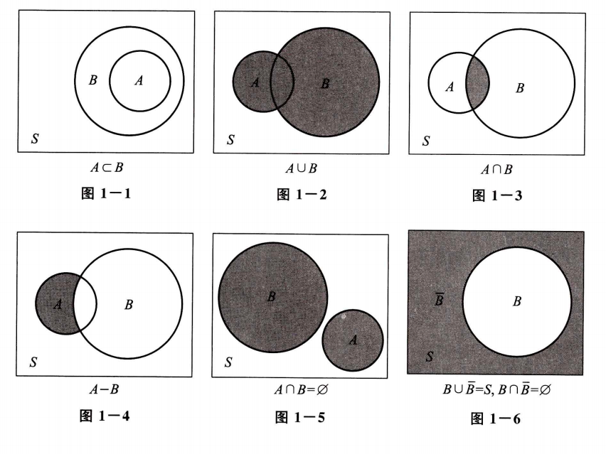
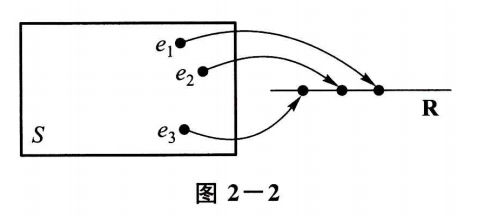

## 第一章 概率论的基本概念

| 概念 | 定义 | 示例 |
|------|------|------|
| 确定性现象(Deterministic Phenomenon) | 在一定条件下必然发生的现象 | - 向上抛石子必然下落 - 同性电荷相互排斥 |
| 统计规律性(Statistical Regularity) | 在大量重复试验或观察中呈现出的固有规律性 | - 多次抛硬币正面朝上约占一半 - 炮弹着点按规律分布 |
| 随机现象(Random Phenomenon) | - 个别试验结果呈现不确定性 - 大量重复试验具有统计规律性 | - 抛硬币正反面朝上 - 炮弹着点位置 |

概率论与数理统计是研究和揭示随机现象统计规律性的一门数学学科。

---

### 1 随机试验的基本概念

**随机试验(Random Experiment)**是概率论研究的基础。它是一种具有特定特征的试验，包括科学实验和对事物特征的观察。随机试验的基本特征如下：

1. 可在相同条件下重复进行
2. 具有多个可能结果，且所有可能结果能事先明确
3. 单次试验结果无法预先确定

以下是一些随机试验的例子：

| 编号 | 试验描述 | 可能结果 |
|------|----------|----------|
| E1 | 抛一枚硬币 | 正面(H)、反面(T) |
| E2 | 连续抛三次硬币 | HHH、HHT、HTH等8种组合 |
| E3 | 抛三次硬币统计正面次数 | 0、1、2、3次 |
| E4 | 抛一颗骰子 | 1、2、3、4、5、6点 |
| E5 | 记录急救电话24小时呼叫次数 | 任意非负整数 |
| E6 | 测试随机抽取灯泡的寿命 | 任意正实数(小时) |
| E7 | 记录某地一昼夜最高最低温 | 两个实数值 |

这些特征使随机试验成为研究随机现象的重要工具。在概率论中，除非特别说明，所讨论的试验均指随机试验。
本书中以后提到的试验都是指随机试验.我们是通过研究随机试验来研究随机现象的.

---

### 2 样本空间与随机事件

#### 一、样本空间

**样本空间(Sample Space)** 是随机试验 E 的所有可能结果组成的集合,记为 S。其中每个结果称为 **样本点(Sample Point)**。

示例:
- S₁ = {H, T} (抛一枚硬币)
- S₂ = {HHH, HHT, HTH, THH, HTT, THT, TTH, TTT} (连续抛三次硬币)
- S₃ = {0, 1, 2, 3} (抛三次硬币正面次数)
- S₄ = {1, 2, 3, 4, 5, 6} (抛一颗骰子)
- S₅ = {0, 1, 2, 3, ...} (24小时呼叫次数)
- S₆ = {t | t > 0} (灯泡寿命)
- S₇ = {(x,y) | T₁ ≤ x ≤ y ≤ T₂} (x为最低温度,y为最高温度)

---

#### 二、随机事件

在实际中，当进行随机试验时，人们常常关心满足某种条件的样本点所组成的集合。例如，若规定某种灯泡的寿命(h)小于 500 为次品，则在 E₆ 中我们关心灯泡的寿命是否大于 500。满足这一条件的样本点组成 S₆ 的一个子集：A = {t | t > 500}。我们称 A 为试验 E₆ 的一个**随机事件(Random Event)**。

一般地，我们称试验 E 的样本空间 (S) 的**子集**为 E 的**随机事件(Random Event)**，简称**事件(Event)**。在每次试验中，当且仅当这一子集中的某个样本点出现时，称这一事件**发生(Happens)**。

特别地：
- **基本事件(Basic Event)**：由一个样本点组成的单点集。例如，试验 E₁ 有两个基本事件 {H} 和 {T}；试验 E₄ 有 6 个基本事件 {1}, {2}, ..., {6}。
- **必然事件(Must Happen Event)**：样本空间 S，它在每次试验中都会发生。
- **不可能事件(Impossible Event)**：空集 ∅，它在每次试验中都不会发生。

示例：
1. 在 E₂ 中：
   - 事件 A₁："第一次出现的是 H"，即 A₁ = {HHH, HHT, HTH, HTT}
   - 事件 A₂："三次出现同一面"，即 A₂ = {HHH, TTT}
2. 在 E₆ 中：
   - 事件 A₃："寿命小于 1000h"，即 A₃ = {t | 0 ≤ t < 1000}
3. 在 E₇ 中：
   - 事件 A₄："最高温度与最低温度相差 10℃"，即 A₄ = {(x,y) | y-x = 10, T₁ < x < y ≤ T₂}

---

#### 三、事件间的关系与运算

事件是集合，因此事件间的关系与运算遵循集合论的规则。设试验 E 的样本空间为 S，而 A、B、Aₖ(k=1,2,...)是 S 的子集。

| 关系/运算类型 | 英文名称 | 数学表达式 | 含义说明 | 补充说明 |
|--------------|----------|------------|----------|----------|
| 包含关系 | Inclusion Relation | A⊂B | 事件 B 包含事件 A，A 发生必导致 B 发生 | 若 A⊂B 且 B⊂A，即 A=B，则事件 A 与事件 B 相等 |
| 和事件 | Union Event | A∪B = {x \| x∈A 或 x∈B} | A、B 中至少有一个发生时，A∪B 发生 | 可推广到 n 个事件和可列个事件 |
| 积事件 | Intersection Event | A∩B = {x \| x∈A 且 x∈B} | A、B 同时发生时，A∩B 发生 | 1. A∩B 也可记作 AB 2. 可推广到 n 个事件和可列个事件 |
| 差事件 | Difference Event | A-B = {x \| x∈A 且 x∉B} | A 发生但 B 不发生时，A-B 发生 | - |
| 互不相容事件 | Mutually Exclusive Events | A∩B = ∅ | 事件 A 与 B 是互不相容的（互斥的） | 基本事件都是两两互不相容的 |
| 逆事件 | Complementary Events | 1. A∪B = S 2. A∩B = ∅ | A 与 B 互为逆事件 | A 的对立事件记为 Ā，且 Ā = S-A |

| 运算定律 | 英文名称 | 公式 |
|----------|----------|------|
| 交换律 | Commutative Law | 1. A∪B = B∪A 2. A∩B = B∩A |
| 结合律 | Associative Law | 1. A∪(B∪C) = (A∪B)∪C 2. A∩(B∩C) = (A∩B)∩C |
| 分配律 | Distributive Law | 1. A∪(B∩C) = (A∪B)∩(A∪C) 2. A∩(B∪C) = (A∩B)∪(A∩C) |
| 德摩根律 | De Morgan's Laws | 1. (A∪B)ˉ = Ā∩B̄ 2. (A∩B)ˉ = Ā∪B̄ |

---

### 3 频率与概率

对于一个事件(除必然事件和不可能事件外)来说，它在一次试验中可能发生，也可能不发生。我们常常希望知道某些事件在一次试验中发生的可能性究竟有多大。为此，我们需要引入频率和概率这两个概念来描述事件发生的可能性大小。

---

#### 一、频率

**定义**：在相同条件下进行n次试验，事件A发生的次数记为$n_A$，比值$\frac{n_A}{n}$称为事件A发生的频率(Frequency)，记为$f(A)$。

**频率的基本性质**：
1. $0 \leq f(A) \leq 1$
2. $f(S) = 1$
3. 若$A_1, A_2, ..., A_n$是两两互不相容的事件，则：
   $f(A_1 \cup A_2 \cup ... \cup A_n) = f(A_1) + f(A_2) + ... + f(A_n)$

**频率稳定性(Frequency Stability)**：当重复试验的次数n逐渐增大时（即$n \to \infty$），频率$f_n(A)$呈现出稳定性，逐渐趋近于某个常数$P(A)$。这个极限值$P(A)$就是事件A的概率。这种"频率稳定性"即通常所说的统计规律性，也是概率论的基本哲学出发点。

---

#### 二、概率

**定义**：设E是随机试验，S是它的样本空间。对于E的每一事件A赋予一个实数，记为P(A)，称为事件A的概率(Probability)，如果集合函数P(·)满足以下条件：

1. 非负性(Non-negativity)：对于每一个事件A，有$P(A) \geq 0$
2. 规范性(Normalization)：对于必然事件S，有$P(S) = 1$
3. 可列可加性(Countable Additivity)：设$A_1, A_2, ...$是两两互不相容的事件，即对于$A_i \cap A_j = \emptyset$（$i \neq j, i,j = 1,2,...$），有：
   $P(A_1 \cup A_2 \cup ...) = P(A_1) + P(A_2) + ...$

**概率的重要性质**：

| 性质 | 英文名称 | 数学表达式 | 说明 |
|------|----------|------------|------|
| 性质1 | Empty Set Probability | $P(\emptyset) = 0$ | 空集的概率为0 |
| 性质2 | Finite Additivity | 有限可加性 | 若$A_1, A_2, ..., A_n$是两两互不相容的事件，则： $P(A_1 \cup A_2 \cup ... \cup A_n) = P(A_1) + P(A_2) + ... + P(A_n)$ |
| 性质3 | Subset Probability | $A \subset B$ 时的关系 | 若$A \subset B$，则： $P(B-A) = P(B) - P(A)$ $P(B) \geq P(A)$ |
| 性质4 | Upper Bound of Probability | 概率的上界 | 对于任一事件A，$P(A) \leq 1$ |
| 性质5 | Complementary Event Probability | 逆事件的概率 | 对于任一事件A，$P(\bar{A}) = 1 - P(A)$ |
| 性质6 | Addition Formula | 加法公式 | 对于任意两事件A,B： $P(A \cup B) = P(A) + P(B) - P(AB)$ |

**加法公式的推广**：
1. 三个事件的情况：
   $P(A_1 \cup A_2 \cup A_3) = P(A_1) + P(A_2) + P(A_3) - P(A_1A_2) - P(A_1A_3) - P(A_2A_3) + P(A_1A_2A_3)$

2. n个事件的一般情况：
   $P(\bigcup_{i=1}^n A_i) = \sum_{i=1}^n P(A_i) - \sum_{1 \leq i < j \leq n} P(A_iA_j) + \sum_{1 \leq i < j < k \leq n} P(A_iA_jA_k) + ... + (-1)^{n+1}P(A_1A_2...A_n)$

---

### 4 等可能概型 (Classical Probability Model)

等可能概型(也称为古典概型)是概率论发展初期的主要研究对象，具有以下两个特点：

| 特点 | 英文名称 | 说明 |
|------|----------|------|
| 有限性 | Finiteness | 试验的样本空间只包含有限个元素 |
| 等可能性 | Equal Probability | 试验中每个基本事件发生的可能性相同 |

---

#### 概率计算公式

设试验的样本空间为 $S = \{e_1, e_2, ..., e_n\}$。由于每个基本事件发生的可能性相同，且基本事件两两互不相容，有：

$P(\{e_1\}) = P(\{e_2\}) = ... = P(\{e_n\})$

且：

$1 = P(S) = P(\{e_1\} \cup \{e_2\} \cup ... \cup \{e_n\}) = P(\{e_1\}) + P(\{e_2\}) + ... + P(\{e_n\}) = nP(\{e_i\})$

因此：

$P(\{e_i\}) = \frac{1}{n}, i = 1,2,...,n$

若事件 A 包含 k 个基本事件，即 $A = \{e_{i_1}\} \cup \{e_{i_2}\} \cup ... \cup \{e_{i_k}\}$，则有：

$P(A) = \frac{A\text{包含的基本事件数}}{S\text{中基本事件的总数}} = \frac{k}{n}$

---

#### 特性与应用

1. **有限可加性等价性**：
   由于样本空间S中只含有限个子集（共 $2^n$ 个子集），可列可加性与有限可加性在等可能概型中是等价的。

2. **实际推断原理(Practical Inference Principle)**：
   概率很小的事件在一次试验中实际上几乎是不发生的。

示例：
某接待站在一周内接待了12次来访，这12次都在周二和周四进行。假设接待时间无规定（即来访者在一周任一天来访是等可能的），则12次来访都在周二、周四的概率为：

$P = (\frac{2}{7})^{12} \approx 0.0000003$

根据实际推断原理，由于这个极小概率事件发生了，可以推断接待站的接待时间是有规定的。

---

### 5 条件概率 (Conditional Probability)

条件概率是概率论中的一个重要而实用的概念，考虑的是事件A已发生的条件下事件B发生的概率。

| 概念 | 英文名称 | 定义 |
|------|----------|------|
| 条件概率 | Conditional Probability | 在事件A发生的条件下事件B发生的概率，记为$P(B|A)$ |
| 乘法定理 | Multiplication Theorem | 事件的概率乘法公式 |
| 全概率公式 | Total Probability Formula | 利用样本空间的划分计算事件概率的公式 |
| 贝叶斯公式 | Bayes' Formula | 用于计算条件概率的重要公式 |

---

#### 一、条件概率的定义与性质

设A、B是两个事件，且$P(A)>0$，定义条件概率：

$P(B|A)=\frac{P(AB)}{P(A)}$

条件概率$P(\cdot|A)$满足以下性质：
1. 非负性：对任一事件B，有$P(B|A) \geq 0$
2. 规范性：对必然事件S，有$P(S|A)=1$
3. 可列可加性：对于两两互不相容的事件序列$\{B_n\}$，有
   $P(\bigcup_{n=1}^{\infty} B_n|A)=\sum_{n=1}^{\infty}P(B_n|A)$

   3.1 简单证明
$$
P\Big(\bigcup_{n=1}^\infty B_n \,\Big|\, A\Big)
= \frac{\sum_{n=1}^\infty P(A \cap B_n)}{P(A)}
= \sum_{n=1}^\infty \frac{P(A \cap B_n)}{P(A)}
= \sum_{n=1}^\infty P(B_n|A)
$$

---

#### 二、乘法定理 (Multiplication Theorem)

若$P(A)>0$，则：
$P(AB)=P(B|A)P(A)$

对于多个事件$A_1,A_2,\ldots,A_n$，若$P(A_1A_2\cdots A_{n-1})>0$，则：
$P(A_1A_2\cdots A_n)=P(A_n|A_1A_2\cdots A_{n-1})P(A_{n-1}|A_1A_2\cdots A_{n-2})\cdots P(A_2|A_1)P(A_1)$

简单证明:
$$
P(ABC)=P(C|AB)P(AB)=P(C|AB)P(B|A)P(A)
$$

---

#### 三、样本空间的划分 (Partition of Sample Space)

设S为试验E的样本空间，$B_1,B_2,\ldots,B_n$为E的一组事件。若满足：
1. $B_iB_j=\emptyset, i\neq j, i,j=1,2,\ldots,n$
2. $B_1\cup B_2\cup\cdots\cup B_n=S$

则称$B_1,B_2,\ldots,B_n$为样本空间S的一个划分。

---

#### 四、全概率公式与贝叶斯公式

**全概率公式 (Total Probability Formula)**：
设$B_1,B_2,\ldots,B_n$是样本空间S的一个划分，且$P(B_i)>0(i=1,2,\ldots,n)$，则对任一事件A：

$P(A)=\sum_{i=1}^n P(A|B_i)P(B_i)$

**贝叶斯公式 (Bayes' Formula)**：
在全概率公式的条件下，若$P(A)>0$，则：

$P(B_i|A)=\frac{P(A|B_i)P(B_i)}{\sum_{j=1}^n P(A|B_j)P(B_j)}, i=1,2,\ldots,n$

特别地，当n=2时，上述公式简化为：

$P(A)=P(A|B)P(B)+P(A|\bar{B})P(\bar{B})$

$P(B|A)=\frac{P(A|B)P(B)}{P(A|B)P(B)+P(A|\bar{B})P(\bar{B})}$

**先验概率 (Prior Probability)**：
在获得新信息之前,对事件发生可能性的预先判断或估计。例如,在医疗诊断中,某种疾病在人群中的发病率就是这种疾病的先验概率。用数学表示为 $P(B_i)$。

**后验概率 (Posterior Probability)**：
在得到新的信息(如观察到事件A发生)后,对事件概率的修正估计。例如,在观察到某些症状后,对患某种疾病的概率重新评估。用数学表示为 $P(B_i|A)$。

这两个概念在贝叶斯定理中起着核心作用:
- 先验概率反映了我们在获得新证据前的初始信念
- 后验概率则是在获得新证据后,对这种信念的更新

---

##### ✅具体例子（医学检测问题）
🔍 已知条件：
- 肝癌发病率：0.0004（0.04%）
- 肝癌患者检测阳性率：99%
- 非肝癌者假阳性率：0.1%（阴性率99.9%）

🧮 求解过程：

1. 事件定义

| 事件 | 含义     | 概率           |
| ---- | -------- | -------------- |
| A    | 患有肝癌 | P(A) = 0.0004  |
| Aᶜ   | 无肝癌   | P(Aᶜ) = 0.9996 |
| B    | 检测阳性 | P(B\|A) = 0.99   |
| B    | 检测阳性 | P(B\|Aᶜ) = 0.001 |

1. 使用贝叶斯公式计算
$$P(A|B) = \frac{P(A) \cdot P(B|A)}{P(A) \cdot P(B|A) + P(A^c) \cdot P(B|A^c)}$$

代入数值：
$$P(A|B) = \frac{0.0004 \times 0.99}{0.0004 \times 0.99 + 0.9996 \times 0.001} \approx 0.284$$

结论：单次检测阳性时，实际患病概率约为28.4%

3. 复检提高准确率

| 事件            | 第二次检测前（先验） | 第二次检测后（后验） |
| --------------- | -------------------- | -------------------- |
| A（患病）       | P(A) = 0.284         | P(A\|B,B) ≈ 0.997    |
| B（阳性）       | P(B\|A) = 0.99       | P(B\|A) = 0.99       |
| B（阳性\|无病） | P(B\|Aᶜ) = 0.001     | P(B\|Aᶜ) = 0.001     |

若再次检测仍为阳性，以0.284为先验概率重新计算：
$$P(A|B,B) \approx \frac{0.284 \times 0.99}{0.284 \times 0.99 + 0.716 \times 0.001} \approx 0.997$$
结论：两次检测均为阳性时，实际患病概率提升至99.7%

---

### 6 事件的独立性 (Event Independence)

| 概念 | 英文名称 | 定义 |
|------|----------|------|
| 相互独立事件 | Mutually Independent Events | 满足 $P(AB)=P(A)P(B)$ 的两个事件 |
| 条件独立 | Conditional Independence | 当 $P(B\|A)=P(B)$ 时,称事件 A 和 B 条件独立 |
| n 重独立 | n-fold Independence | n 个事件中任意个数事件的积事件概率等于各事件概率之积 |

---

#### 一、两个事件的独立性

设 A,B 是试验 E 的两事件,若 $P(A)>0$,则可以定义 $P(B|A)$。一般情况下:
- 当 A 的发生影响 B 的概率时: $P(B|A) \neq P(B)$
- 当 A,B 相互独立时: $P(AB)=P(B|A)P(A)=P(A)P(B)$

**定义**: 若两事件 A,B 满足等式 $P(AB)=P(A)P(B)$,则称事件 A,B 相互独立。

**重要性质**:
1. 若 $P(A)>0, P(B)>0$,则 A,B 相互独立与互不相容不能同时成立
2. 若 A,B 相互独立,则 $P(B|A)=P(B)$ (反之亦然)

---

#### 二、独立性的扩展定理

**定理1**: 若事件 A 与 B 相互独立,则下列各对事件也相互独立:
- A 与 $\bar{B}$,$\bar{A}$ 与 B,$\bar{A}$ 与 $\bar{B}$

**证明**:
由 $A=A(B \cup \bar{B})=AB \cup A\bar{B}$,得:
$P(A)=P(AB \cup A\bar{B})=P(AB)+P(A\bar{B})=P(A)P(B)+P(A\bar{B})$
因此 $P(A\bar{B})=P(A)[1-P(B)]=P(A)P(\bar{B})$

---

#### 三、多事件独立性

**定义**: 设 A,B,C 是三个事件,如果满足:
1. $P(AB)=P(A)P(B)$
2. $P(BC)=P(B)P(C)$
3. $P(AC)=P(A)P(C)$
4. $P(ABC)=P(A)P(B)P(C)$
则称事件 A,B,C 相互独立。

**n 个事件的独立性**:
对于 n(n>2) 个事件 $A_1,A_2,\ldots,A_n$,如果其中任意个数事件的积事件概率等于各事件概率之积,则称这 n 个事件相互独立。

**重要推论**:
1. 若 n 个事件相互独立,则其中任意 k(2≤k≤n) 个事件也相互独立
2. 若 n 个事件相互独立,则将其中任意多个事件换成它们的对立事件,所得到的 n 个事件仍相互独立

---

## 第二章 随机变量及其分布
### 1 随机变量的定义 (Random Variable)

随机变量是定义在样本空间上的实值单值函数,它将随机试验的每个结果映射到实数轴上。

| 概念 | 英文名称 | 定义 |
|------|----------|------|
| 随机变量 | Random Variable | 设随机试验的样本空间为 $S=\{e\}$, $X=X(e)$ 是定义在样本空间 S 上的实值单值函数 |
| 取值概率 | Probability of Value | 随机变量取某个值的概率,如 $P(X=x)$ |
| 值域事件 | Domain Event | 随机变量在某个集合上取值的事件,记为 $(X \in L)$ |

---

#### 随机变量的基本特征

1. **表示方法**：
   - 大写字母(X, Y, Z, W等)表示随机变量
   - 小写字母(x, y, z, w等)表示实数值

2. **概率计算**：
   - 取特定值: $P(X=x)=P(\{e|X(e)=x\})$
   - 取值区间: $P(X \in L)=P(\{e|X(e) \in L\})$

3. **实际应用示例**：
   - Y: 某车间一天的缺勤人数
   - W: 某地区第一季度的降雨量
   - Z: 某工厂一天的耗电量
   - N: 某医院一天的挂号人数

---

#### 随机变量的本质特征

1. 取值的随机性：试验前无法预知具体取值
2. 取值的概率性：每个可能的取值都有对应的概率
3. 与普通函数的区别：具有随机性和概率分布特征

随机变量的引入使我们能够：
- 用数学方法描述随机现象
- 对随机试验结果进行定量分析
- 研究随机现象的统计规律

---

### 2 离散型随机变量及其分布律 

| 概念 | 英文名称 | 定义 |
|------|----------|------|
| 离散型随机变量 | Discrete Random Variable | 取值为有限个或可列无限多个的随机变量 |
| 分布律 | Distribution Law | 随机变量取各个可能值的概率分布规律 |

离散型随机变量的分布律需满足以下条件：

1. 非负性：$P\{X=x_k\} \geq 0, k=1,2,\ldots$
2. 规范性：$\sum_{k=1}^{\infty} P\{X=x_k\} = 1$

分布律的表格形式：

| $X$ | $x_1$ | $x_2$ | $\cdots$ |
|-----|--------|--------|-----------|
| $P$ | $p_1$ | $p_2$ | $\cdots$ |

---

#### 一、(0-1)分布 (Bernoulli Distribution)

| 概念 | 英文名称 | 定义 |
|------|----------|------|
| (0-1)分布 | Bernoulli Distribution | 只取0和1两个值的随机变量分布 |

分布律：$P\{X=k\} = p^k(1-p)^{1-k}, k=0,1 \quad (0<p<1)$

应用场景：
- 新生儿性别登记
- 产品质量检验
- 电力负荷监测
- 硬币抛掷试验

---

#### 二、伯努利试验与二项分布 

##### 伯努利分布(Bernoulli Distribution) 

伯努利分布是最简单的离散型分布，用于表示单次随机试验的结果。
它只有两个可能的结果：成功（1）或失败（0），且每次试验的成功概率是固定的。

📌 定义：
设随机变量 X 表示某次试验的结果：

$$X = \begin{cases}
1 & \text{成功，概率为 } p \\
0 & \text{失败，概率为 } 1-p
\end{cases}$$

我们就说：

$$X \sim \text{Bernoulli}(p)$$

其中 $p \in [0,1]$ 表示"成功"的概率。

$$P(X=x)=p^x(1-p)^{1-x}, \quad x\in\{0,1\}$$

---

#### 二项分布 (Binomial Distribution)

只要满足以下四个必要条件，随机变量 $X$ 就服从二项分布：

1. **独立重复**：有 $n$ 次相同实验
2. **双分类结果**：每次试验只有"成功"或"失败"
3. **概率固定**：每次成功的概率相同，记作 $p$
4. **计数成功次数**：$X$ 表示 $n$ 次试验中成功的次数

📌 **定义**

设随机变量 X 表示 $n$ 次试验中成功的次数，$p$ 为每次试验成功的概率，则：

$$X \sim \text{Binomial}(n,p)$$

$$P(X=x) = \binom{n}{x} p^x(1-p)^{n-x}, x=0,1,\dots,n$$

其中：
- $\binom{n}{x}$：组合系数，表示从n个中选x个的方式数
- $p^x$：x次成功的概率
- $(1-p)^{n-x}$：n-x次失败的概率

---

#### 泊松分布 (Poisson Distribution)

| 概念 | 英文名称 | 定义 |
|------|----------|------|
| 泊松分布 | Poisson Distribution | 描述单位时间内随机事件发生次数的分布 |

分布律：$P\{X=k\} = \frac{\lambda^k}{k!}e^{-\lambda}, k=0,1,2,\ldots \quad (\lambda>0)$

记作：$X \sim \pi(\lambda)$

应用场景：
- 印刷错误数
- 邮件遗失数
- 急诊病人数
- 交通事故次数
- 放射性粒子计数

**泊松定理**：
当 $n \to \infty$，$p \to 0$，且 $np=\lambda$ (常数) 时，二项分布可由泊松分布近似：

$\lim_{n \to \infty} \binom{n}{k}p^k(1-p)^{n-k} = \frac{\lambda^k}{k!}e^{-\lambda}$

---