# 📚 泰勒展开

布鲁克·泰勒（1685－1731）是英国牛顿学派的代表人物，曾参与判定牛顿和莱布尼茨微积分发明权归属的委员会。他因发明泰勒公式而名垂青史。

## 💡 概述

让我们来了解一下泰勒公式的作用。

## 1. 🎯 泰勒公式的作用

我们知道，切线是曲线的线性近似（下图中 g(x) 是函数 f(x)=e^x 在0点处的切线）：

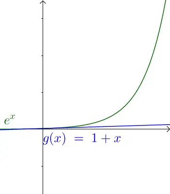

显然，切线近似仅在切点附近有效。那么，如何扩大这种近似的作用范围呢？答案是通过曲线来近似：

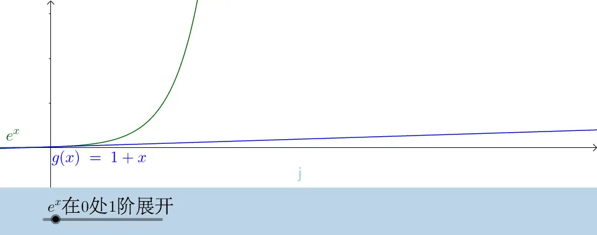

上图展示了泰勒公式在不同阶展开时的效果。可以看出，展开的多项式项数越多，近似效果越好。

简而言之，泰勒公式就是用幂级数来近似原函数（为什么选择幂级数？因为幂级数更容易研究）。

那么，为什么幂级数能够实现这样的近似效果呢？这要从牛顿插值法说起。

## 2. 🔢 牛顿插值法

在17、18世纪，随着天文学和航海技术的发展，插值成为了数学中的一个重要问题。

什么是插值？插值是数值分析中通过已知的离散数据来推算未知数据的过程或方法。

让我们通过一个具体例子来理解：

假设天文学家开普勒观测火星运行轨迹时记录了以下数据（数据仅供示例）：

- 周一：火星距太阳3万公里
- 周二：火星距太阳6万公里
- 周三：因雾霾未能观测
- 周四：火星距太阳5万公里
- 周五：火星距太阳7万公里

要推算周三的数据，我们可以将这些数据转换为数学表达：

x=1，y=3
x=2，y=6
x=4，y=5
x=5，y=7

现在的问题是：当x=3时，y的值是多少？

这就是一个典型的插值问题。
### 2.1 插值

根据物理定律，火星的运动轨迹必定是连续的。我们已知的4个观测点一定位于这条轨迹上。

基于这些观测点，我们可以尝试推测一条可能的运动轨迹：
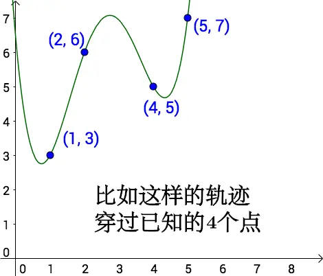

确定了轨迹后，我们就可以通过插值来计算 x=3 时对应的 y 值：
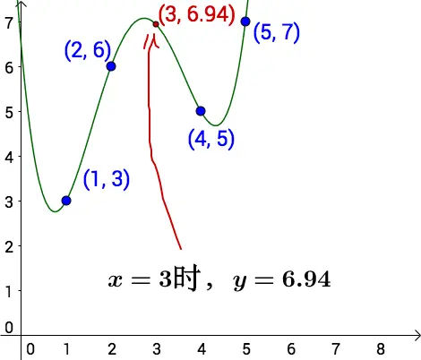

需要注意的是，能同时通过这4个点的曲线实际上有无穷多条，这也就意味着我们有多种不同的插值方法可以选择。

### 2.2 线性插值

线性插值是最基础的插值方法：
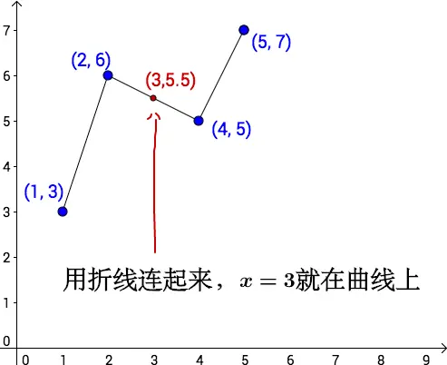

然而，这种线性近似方法过于简单粗糙。实际上，我们只需要 x=2 和 x=4 两个点的数据就能确定一条直线，而 x=1 和 x=5 的数据完全没有被利用。

更重要的是，作为一位经验丰富的天文学家，开普勒很清楚火星的运动轨迹不可能是由直线段组成的折线，因此这种线性插值方法并不适用于这种情况。
### 2.3 多项式插值

数学家很早就发现多项式可以形成各种曲线，因此用多项式进行插值是一个自然的想法。

#### 2.3.1 线性方程

假设我们有4个已知点：(1,3)、(2,6)、(4,5)、(5,7)。我们可以用一个三次多项式 $f(x)=a+bx+cx^2+dx^3$ 来拟合这些点，通过解以下方程组来求出参数 a,b,c,d：
$$
\begin{cases} 
3  = a + b + c + d \\
6  = a + 2b + 4c + 8d \\
5  = a + 4b + 16c + 64d \\
7  = a + 5b + 25c + 125d 
\end{cases}
$$
解出的三次多项式（如果存在唯一解）必然会经过这四个已知点。

然而，直接求解线性方程组在实际应用中存在两个主要问题：

1. 计算复杂度高：对于行星观测这类可能涉及数万甚至数十万个数据点的场景，即使借助计算机也会遇到效率瓶颈
2. 数据更新成本高：每当添加新的观测点，都需要重新计算整个方程组

为了克服这些限制，特别是第二个问题，牛顿提出了一种更高效的插值方法。

#### 2.3.2 牛顿插值法

牛顿插值法的完整名称是格雷戈里-牛顿公式。虽然格雷戈里和牛顿都独立发现了这个插值公式，但由于牛顿的影响力更大，格雷戈里的贡献常常被忽略。

#### 2.3.3 几何解释

需要注意的是，"牛顿插值法的几何意义"这个说法并不十分准确。因为从线性代数的角度来看，给定若干点通常只能确定唯一的插值多项式。因此，仅从几何图形上很难判断具体使用了哪种求解方法（是牛顿插值法还是直接求解线性方程组）。

以下两张图展示了使用牛顿插值法得到的插值效果：
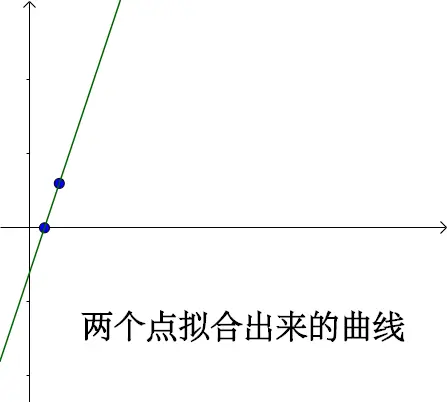

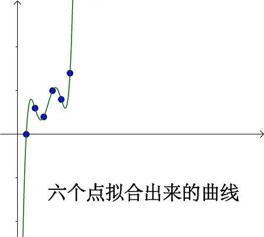

### 2.4 牛顿插值法与泰勒公式的关系

下面我们通过一系列图像来比较牛顿插值公式和泰勒公式：
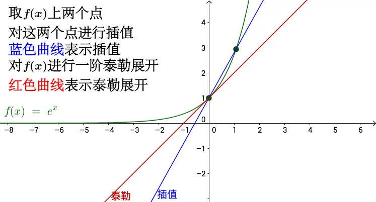
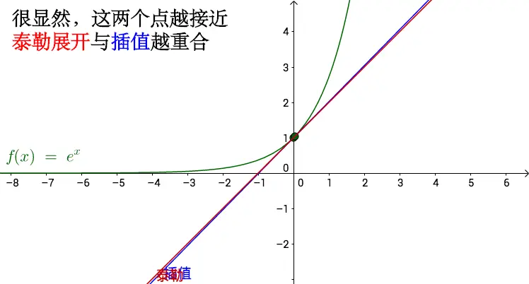
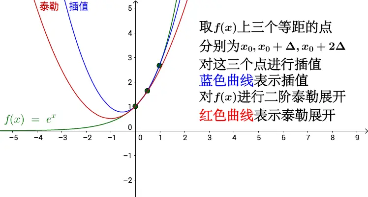
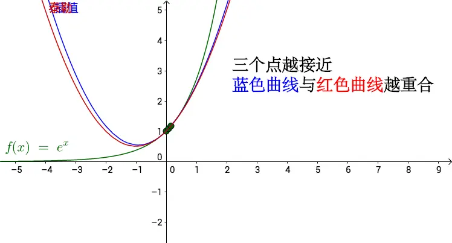

通过观察，我们可以得出以下结论：
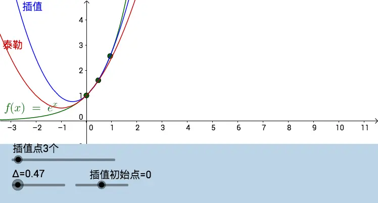

1. n个插值点对应于泰勒公式的(n-1)阶展开
2. 当插值点之间的距离趋近于零时，插值曲线会逐渐逼近泰勒公式

### 2.5 小结

牛顿插值法通过有限个点来近似原函数。当插值点无限密集时，牛顿插值法的极限形式就是泰勒公式，这也解释了为什么泰勒公式能够有效地近似原函数。
## 3. ✍️ 牛顿插值法与泰勒公式的代数推导

### 3.1 牛顿插值法

假设已知 n+1 个点相对多项式函数 f 的值为：$(x_0,f(x_0)),(x_1,f(x_1)),(x_2,f(x_2)), \cdots ,(x_n,f(x_n))$，求此多项式函数 f。

为了避免大家在后面的阅读中迷失，我先把思路列出来一下（其实不复杂，主要是符号看着眼晕）：

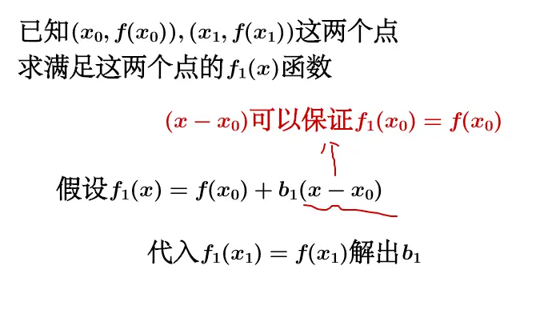
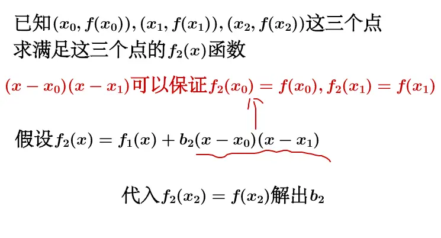

观察 $b_1,b_2$ 的特点，不断重复上述过程，就可以得到牛顿插值法。

先从求满足两个点 $(x_0,f(x_0)),(x_1,f(x_1))$ 的函数 $f_1(x)$ 说起：

假设 $f_1(x)=f(x_0)+b_1(x-x_0)$，

令 $f_1(x_1)=f(x_1)$：

$$\begin{align*} 
& \implies b_1 = \frac{f(x_1)-f(x_0)}{x_1-x_0} \\ 
& \implies f_1(x) = f(x_0) + \frac{f(x_1)-f(x_0)}{x_1-x_0}(x-x_0) 
\end{align*}$$

现在我们增加一个点，$(x_0,f(x_0)),(x_1,f(x_1)),(x_2,f(x_2))$，求满足这三个点的函数 $f_2(x)$：

假设 $f_2(x)=f_1(x)+b_2(x-x_0)(x-x_1)$，

令 $f_2(x_2)=f(x_2)$：

$$\begin{align*} 
& \implies b_2 = \frac{\left[\frac{f(x_2) - f(x_1)}{x_2 - x_1}\right] - \left[\frac{f(x_1) - f(x_0)}{x_1 - x_0}\right]}{x_2 - x_0} \\ 
& \implies f_2(x) = f(x_0) + \frac{f(x_1)-f(x_0)}{x_1-x_0}(x-x_0) \\ 
& \qquad + \frac{\left[\frac{f(x_2) - f(x_1)}{x_2 - x_1}\right] - \left[\frac{f(x_1) - f(x_0)}{x_1 - x_0}\right]}{x_2 - x_0}(x-x_0)(x-x_1) 
\end{align*}$$

$b_1,b_2$ 看起来蛮有特点的，我们把特点提炼一下。

一阶均差：

$f[x_i,x_j]=\frac{f(x_i)-f(x_j)}{x_i-x_j},i\ne j$

二阶均差是一阶均差的均差：

$f[x_i,x_j,x_k]=\frac{f[i,j]-f[j,k]}{x_i-x_k},i\ne j\ne k$

三阶均差就是二阶均差的均差，以此类推，我们得到牛顿插值法为：

$$\begin{align*} 
f(x) =& f(x_0) + f[x_0,x_1](x - x_0) \\ 
& + f[x_0,x_1,x_2](x - x_0)(x - x_1) +\cdots \\ 
& + f[x_0,x_1, \cdots ,x_{n-2},x_{n-1}](x - x_0)(x - x_1) \cdots (x - x_{n-2})(x - x_{n-1}) \\ 
& + f[x_0,x_1, \cdots ,x_{n-1},x_n](x - x_0)(x - x_1) \cdots (x - x_{n-1})(x - x_n) 
\end{align*}$$

计算通过下面这个示意图进行，就会很简单：
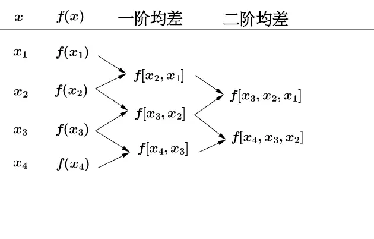

新增一个点，只需要计算相关的差分就可以了：
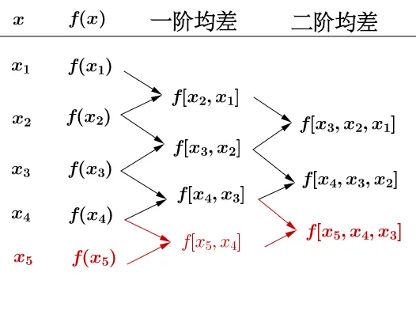

### 3.2 泰勒公式

之前说过泰勒公式是牛顿插值法的极限形式，极限体现在不断减小插值点的距离，就可得到泰勒公式。

首先，设 $f(x)$ 是一个函数，它在 $x_0,x_0+\Delta x,x_0+2\Delta x,x_0+3\Delta x,\cdots ,x_0+n\Delta x$ 的值已知（和之前相比，相当于每个点都是等距离间隔的，间隔 $\Delta x$），令：

$$
\Delta f(x_0)=f(x_0+\Delta x)-f(x_0)
$$
也称为一阶差分。

$$
\Delta f(x_0+\Delta x)=f(x_0+2\Delta x)-f(x_0+\Delta x)
$$

$$
\Delta f(x_0+2\Delta x)=f(x_0+3\Delta x)-f(x_0+2\Delta x)
$$

进一步令：

$$
\Delta ^2 f(x_0)=\Delta f(x_0+\Delta x)-\Delta f(x_0)
$$
也称为二阶差分（为一阶差分的差分）。

$$
\Delta ^3 f(x_0)=\Delta ^2 f(x_0+\Delta x)-\Delta ^2 f(x_0)
$$
也称为三阶差分。

做了这些假设之后我们来看看之前提到的 $b_1$ 会变成什么样子：

$$
b_1 = \frac{f(x_1)-f(x_0)}{x_1-x_0} \implies b_1 = \frac{\Delta f(x_0)}{\Delta x}
$$
而 $f_1(x)$ 会变成：
$$
f_1(x) = f(x_0) + \frac{f(x_1)-f(x_0)}{x_1-x_0}(x-x_0) \implies f_1(x) = f(x_0) + \frac{\Delta f(x_0)}{\Delta x}(x-x_0)
$$
同样的 $f_2(x)$ 就变成了：

$$
f_2(x) = f(x_0) + \frac{\Delta f(x_0)}{\Delta x}(x-x_0) + \frac{\Delta ^2 f(x_0)}{(\Delta x)^2}(x-x_0)(x-x_1)
$$

泰勒断言，当 $\Delta x=0$ 时（相当于把所有点都包含进来进行插值）：

$$
f_1(x) = f(x_0)+f'(x_0)(x-x_0)
$$

$$
f_2(x) = f(x_0)+f'(x_0)(x-x_0)+\frac{f''(x_0)}{2!}(x-x_0)^2
$$
（当 $\Delta x=0$ 时，有 $x-x_1=x-x_0$）

以此类推，大名鼎鼎的泰勒公式就出现了：

$$
f(x) = f(x_0)+f'(x_0)(x-x_0)+\frac{f''(x_0)}{2!}(x-x_0)^2+\cdots
$$

## 4. 📚 参考资料

1. [微积分的历史（六），发展之泰勒公式（下）](https://www.zhihu.com/tardis/zm/art/27442857?source_id=1003)
2. 《高等数学》第七版 同济大学数学系编
3. 《数值分析》第五版 李庆扬等编著
