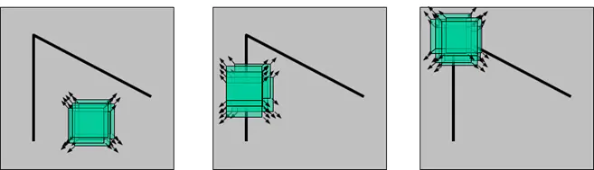

# OpenCV 3计算机视觉 Python语言实现

- 书籍作者：Joe Minichino & Joseph Howse
- 笔记时间：2022.02.23

---

评价：对OpenCV简单介绍，更像是目录书

## 第1章 安装OpenCV

- 需要的库 Numpy、 SciPy 、OpenNI（可选）、SensorKinect（可选），有些要求opencv从源码编译
- 建议安装Contrib模块，含有opencv没有的功能，

## 第2章 处理文件、摄像头和图形用户界面

### 2.1 基本I/O脚本

- 读写图像 -- imread、imwrite，
  - 需要注意的是OpenCV的颜色是BGR，所以需要用到通道颜色转换
  - 像素采用uint8，范围0~255
  - imread会删除alpha通道

- 图像与字节转换
  - bytearray可以将图片转为一维数组格式，reshape可以调整数组的组织方式（一维变多维） 
  - 图像的属性
    - Shape：数组的维度信息
    - size：图像像素个数
    - dtype：像素的数据类型，一般是uint8
  - 对于视频的处理可以当成连续的图片处理
    - 输出视频可以指定编码器，比如YUV、MPEG等
    - 多摄像头处理使用grab或则retrieve，单摄像头使用read
  - 图像使用imshow显示后，记得要销毁窗口

## 第3章 使用OpenCV 3 处理图像

### 3.1 不同色彩空间的转换

- 灰度空间，通过去除彩色信息将其转为灰阶。
- BGR，蓝绿红。
- HSV

### 3.2 傅里叶变换

- Joseph Fourier，边缘检测、形状检测等都用到
- 高通滤波器：High-pass Filter，允许高于某一截频的频率通过，去除低频干扰。
  - 作用提升亮度，根据像素与周围像素的亮度差进行提升，中间正四周负
- 低通滤波器：Low-pass Filter，用于去噪和模糊化，高斯模糊

### 3.4 边缘检测

- 检测之前需要先进行滤波平滑，然后进行灰度化
- 锐化的卷积核的和应该为0（小于 0），模糊的卷积核的和应该为1（大于0）

- Canny边缘检测：高斯滤波→计算梯度→边缘使用非最大抑制→双阈值去除→分析边缘连接

### 3.8 轮廓检测

- 调用findContours，参数会返回其层次关系可用于绘制外边框，外接圆，外 接矩形等等
- 绘制轮廓 
  - 矩形：boundingRect 绘制外接矩形，不考虑物体的旋转，面积不是最小，坐标轴平移相切围成
  - 旋转矩形：minAreaRect 返回Box2D，包含中心点，宽高，旋转角度，通过 boxPoints 可以获取四个角坐标
  - 外接圆：minEnclosingCircle 获取最小外接圆圆心和半径
  - 凸轮廓：approxPloyDP用于计算近似多边形，epsilon越小越逼近，是Douglas-Peucker算法的实现；convexHull实现图轮廓

### 3.11 直线和圆检测

- 直线检测：HoughLines 和 HoughLinesP，后者是优化版本，使用概率Hough变换
- 圆形检测：HoughCircles
- 多边形检测可以使用轮廓+多边形计算+凸轮廓检测

## 第4章 深度估计与分割

- 深度估计需要用到深度摄像机或者立体图像

  - 深度摄像头使用的是一些辅助设备，比如红外等测距

  - 普通图像测距：同一距离，同一物体，不同角度的图，使用视差法

    - StereoBM_create：计算视差图

    - GrabCut分离图像：利用概率进行区分前景和背景，需要用户选择前景方框

      原理是前景/背景像素应该具有相似性

    - 分水岭算法：通过标记区分背景，会受到噪声影响

## 第5章 人脸检测

- Harr级联：使用特征的欧氏距离进行判断相似度，应该具有尺度变化不变性，
- 源码带有Harr人脸检测的数据集，可以查找资料进行实验

## 第6章 图像检索以及基于图像描述符的检索

### 6.1 特征检测算法

- 特征：具有独特性或易于识别的图像某个区域
  - 好的特征，角点，高密度区域
  - 坏的特征，重复，低密度区域

- 角点检测：

  - cornerHarris，原理是哈里斯角点是在任意方向上移动(u,v)，都会有很明显的变化，具有旋转不变
  - SIFT算法具有尺度不变性，通过特征向量描述关键点周围区域
    - DoG（Different of Gaussians），对同一图像使用不同高斯滤波器，SIFT使用DoG进行关键点检测
    - 已经申请专利

  - SURF算法，SIFT的加速版本，也有专利
  - FAST算法，像素周围画圆，将每个像素加上一个阈值的圆心像素进行比较，若单调则判断圆心为角点
    - 利用机器学习进行角点检测 ，但还是和阈值紧密相关
  - BRIEF算法：特征提取，理论复杂

- 匹配算法：已经有特征

  - 暴力匹配
  - K-最近邻匹配，KNN
  - FLANN

## 第7章 目标检测与识别

### 7.1 目标检测与识别技术

- 梯度直方图 HOG（Histogram of Oriented Gradient）：HOG是一个特征描述符，将图像划分成多个部分并计算梯度
- 图像金字塔：一组具有不同分辨率的相同图像
- 滑动窗口：通过对图像的小区域逐个扫描，丢弃概率低的区域
- 非最大值抑制：重叠窗口只保留最佳评分的窗口，SVM用来评分 
- K-Means聚类

## 第8章 目标跟踪

### 8.1 检测移动目标

- 将视频第一帧作为背景，后续帧都跟它比较做差，将变化的像素提取出来检测轮廓
  - 缺点：需要有背景帧，受光照等环境影响大
  - 利用背景分割器分离前景和背景
- 背景分割器KNN、MOG2和GMG
  - 工作方式类似 GrabCut
  - 均值漂移：寻找概率函数离散样本的最大密度，并重新计算下一帧中的最大密度
    - 彩色直方图：统计范围内像素的个数
    - 反向投影：
    - 均值漂移
  - CAMShift
- 卡尔曼滤波器

## 第9章 基于OpenCV的神经网络简介 

### 9.1 人工神经网络

- ANN，是一个统计模型，以数学形式近似表示现实的统计观测
- 感知机，三层网络结构（输入→隐藏→输出）
- 学习算法：监督学习，非监督学习，

## 附录

- HSV色彩空间：HSV(Hue, Saturation, Value)是根据颜色的直观特性，
  - 色调（H）：用角度度量，取值范围为0°～360°，，从红色开始按逆时针方向计算，红色为0°，绿色为120°,蓝色为240°。
  - 饱和度（S）：饱和度S表示颜色接近光谱色的程度。光谱色的白光成分为0，饱和度达到最高。通常取值范围为0%～100%，值越大，颜色越饱和。
  - 明度（V）：明度表示颜色明亮的程度，对于光源色，明度值与发光体的光亮度有关。

- 彩色转灰度算法：RGB的加权平均数
  - Gray = R\*0.299 + G\*0.587 + B\*0.114，直接计算
  - Gray = (R\*30 + G\*59 + B\*11 + 50) / 100，通过缩放使用整型运算提速，50是为了四舍五入
  - Gray = (R\*19595 + G\*38469 + B\*7472) >> 16，用移位替代除法，缩放为2^n^,舍入方式是去尾法,计算时候会考虑前者产生的误差。八位精度和7位精度是一致的

- 颜色模型
  
  - RGB、HSV、CMYK等，指的是某个三维颜色空间中的一个可见光子集，它包含某个色彩域的所有色彩，具有加色模型和减色模型的区别
  
- 

- Harris角点算法公式，[参考](https://blog.csdn.net/lwzkiller/article/details/54633670)

  - 【u，v】表示窗口偏移量，（x，y）表示窗口内对应目标像素坐标，w（x，y）权重函数

    其含义是对于图像I(x,y)，在点(x,y)处平移(u,v)后的自相似性

    由公式可知需要求 I~x~ I~y~，通过梯度信息可以观察到不同的分布情况代表不同的类型

  - 矩阵M可以通过均值化转为协方差矩阵，再进行对角化就可以得到特征值，根据特征值判断不角点，边缘

  - 

  - 

    

  - 

  - ****

  

- HOG
  - 图像被划分为 16*16 的小单元，颜色梯度具有八个方向
  - 若干个小单元合并为一个快，用块构成特征向量

## 论文

- Douglas-Peucker算法
- Hough变换
  - 优化
- [Harris人脸检测](https://www.cs.cmu.edu/~efros/courses/LBMV07/Papers/viola-cvpr-01.pdf)
- [PCA](https://arxiv.org/pdf/1404.1100v1.pdf)

- [EgienFace](https://sites.cs.ucsb.edu/~mturk/Papers/jcn.pdf)
- [LBPH](http://pdf.xuebalib.com:1262/5r7gx9TAKlDH.pdf)