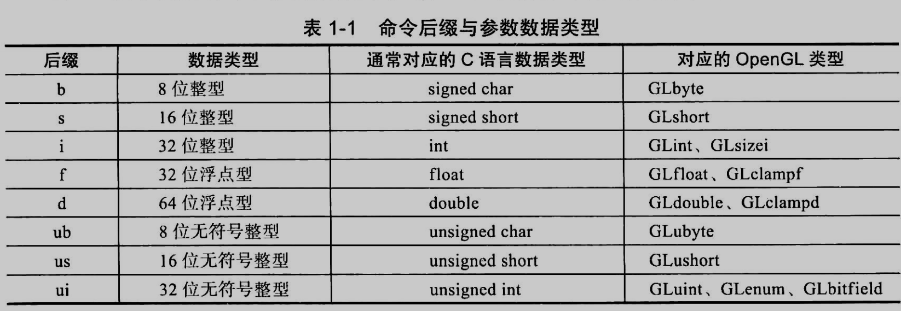
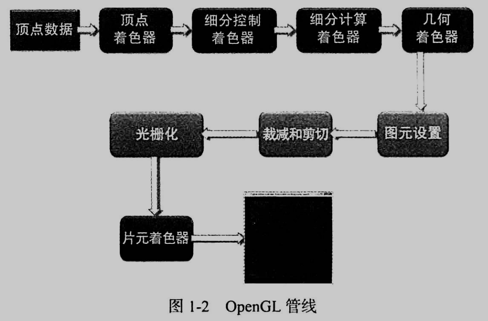
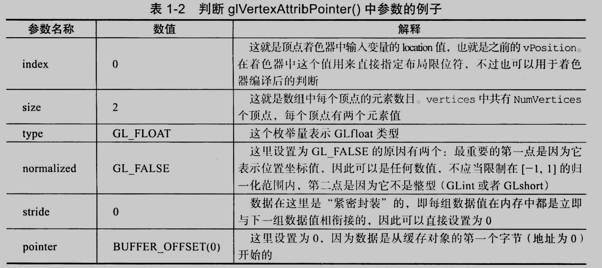
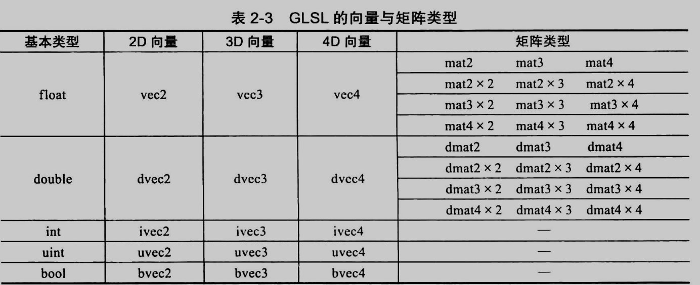
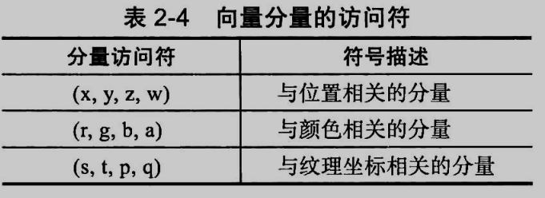
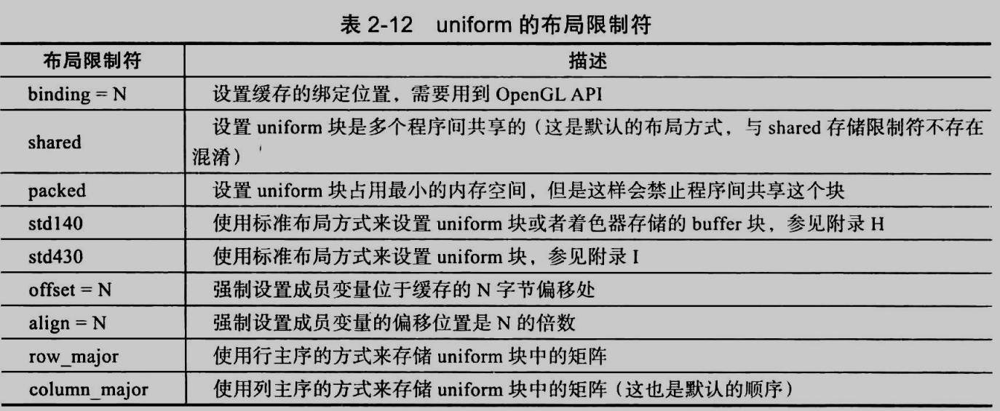
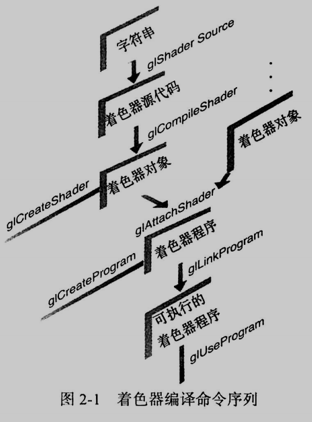
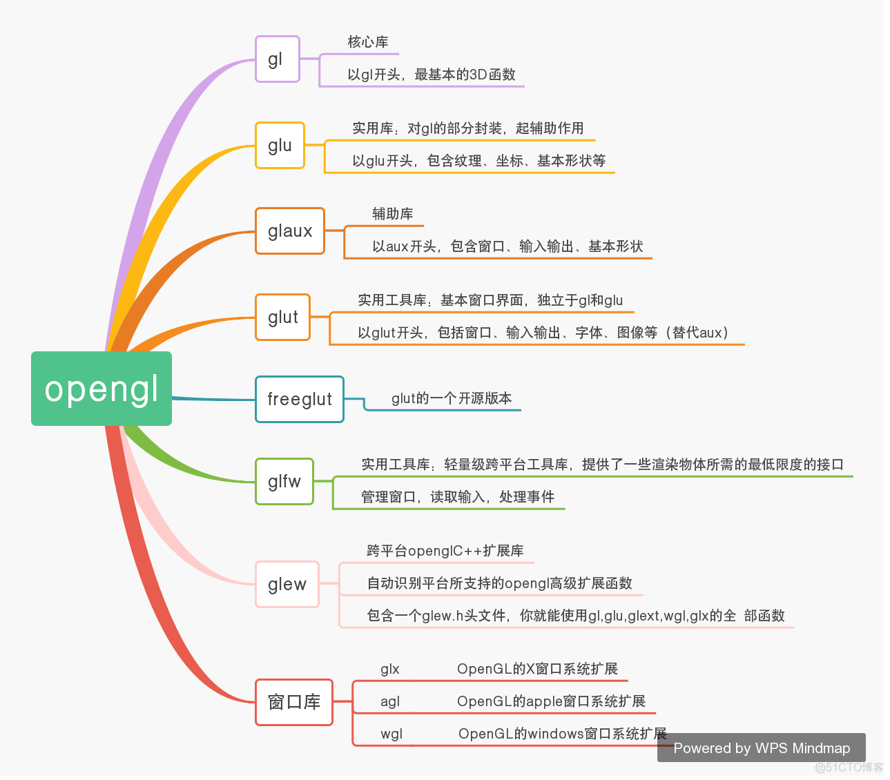

# OpenGL编程指南

- 书籍作者:John Kessennich / Graham Sellers / Dave Shreiner
- 笔记时间:2022.6.18

## 第1章 OpenGL概述

### 1 什么是OpenGL

- OpenGL是一种应用程序编程接口,对图形硬件设备特性进行访问的软件库.

  可以用于设置所需的对象/图像/操作,以便开发交互式三维计算机图形应用程序

- OpenGL本身没有提供任何用于表达三维物体模型或者读取图像文件的操作,需要手动通过一些列几何图元(geometry primitive,包括点/线/三角形/面)来创建物体

### 2 初识OpenGL程序

- OpenGL程序的基本结构都是类似的,初始化物体渲染状态→设置需要渲染的物体
- 图形学名词
  - 渲染(render),表示计算机从模型创建最终图像的过程.OpenGL是基于光栅化的渲染系统.还有很多其他渲染系统,比如光线追踪
  - 模型(model),通过几何图元来构建的,图元与模型的顶点(vertex)存在各种对应关系
  - 着色器(shader),图形硬件设备执行的一类特殊函数,
  - 像素(pixel)是显示器可见最小单元

### 3 OpenGL语法

- 函数名称约定
  - 以gl开头的驼峰命名法,比如 glfw开头的函数来自GLFW库
  - 常量 GL_ 开头,下划线分割
  - gl是C语言形式的库,所以没有函数重载,通过不同的后缀表明函数的不同"版本"
  - 

### 4 OpenGL渲染管线

- rendering pipeline,是一系列的数据处理过程,并将程序的数据转换到最终渲染的图像

- 流程
  - 准备向OpenGL传输数据
    - OpenGL需要将所有数据都保存到缓存对象(buffer object)中,相当于一块由OpenGL维护的内存区域,`glNamedBufferStorage()`命令可以设置缓存大小和内容
  - 数据传输到OpenGL
    - 缓存初始化完毕,通过 `glDrawArrays()`命令开始绘制,通常是将顶点数据传输到缓存
  - 顶点着色
    - 对于绘制命令的每个顶点,OpenGL都会调用一个顶点着色器处理相关数据
    - 比如单纯复制称为传递着色器(pass-through shader),也有复杂的如变换矩阵等
  - 细分着色
    - 顶点着色器处理每个点关联数据后,如果同时激活了细分着色器(tessellation shader),那么会进一步处理数据
    - 使用片(patch)描述物体形状,图元增加使外观更平滑等
  - 几何着色
    - 允许光栅化之前对图元进一步处理,可选
  - 图元装配
    - 将前面着色的顶点数据与相关的几何图元组织起来
  - 剪切(clipping)
    - 顶点可能落在视口(viewport)之外,此时与顶点相关的图元会做出改动,以保证相关像素不会在视口外绘制
  - 光栅化(rasterizer)
    - 将图元传递到光栅化单元生成对应片元,光栅化判断某部分几何所覆盖的屏幕空间,可以直接对片元着色器的每个变量进行线性插值,传递给用户的片元选择器
  - 片元着色
    - 最后一个可编程控制屏幕显示颜色的阶段,此阶段可以使用纹理映射
    - 顶点决定图元位置,片元决定图元颜色
  - 逐片元操作
    - 该阶段使用深度测试(depth test,z缓存)和模板测试(stencil test)决定片元是否可见
  - 

### 5 深入分析程序

- 常量

  - ```cpp
    enum VAO_IDs{Triangles,NumVAOs};
    enum Buffer_IDs{ArrayBuffer,NumBuffers};
    enum Attrib_IDs{vPosition=0};
    GLuint VAOs[NumVAOs];
    GLuint Buffers[NumBuffers];
    const GLuint NumVertices=6;
    ```

- main函数

  - ```cpp
    int main(int argc,char** argv){
        glfwInit();	//负责初始化GLFW库,库使用之前第一个调用
        GLFWwindow *window=glfwCreateWindow(640,480,"window",NULL,NULL); 	//设置程序使用的窗口类型和大小
        glfwMakeConterxtCurrent(window);	//绑定到当前上下文,可以设置多个设备环境和窗口
        
        gl3wInit();	//GL3W辅助库,简化获取函数地址过程
        
        init();		// 用户自定义的OpenGL数据初始化
        			//判断是否需要关闭,重绘窗口内容,检查窗口信息
        while(!glfwWindowShouldClose(window)){
        	display();	//自定义重绘函数
            glfwSwapBuffers(window);
            glfwPollEvents();
        }
        glfwDestroyWindow(window);
        glfwTerminate();
    }
    ```

    

- init函数

  - ```cpp
    void init(void){
    	static const GLfloat vertices[NumVertices][2]={
            {-0.9,-0.9},{0.85,-0.9},{-0.9,0.85}, // 三角形1 	
            {0.9,-0.85},{0.9,0.9},{-0.85,0.9} // 三角形2
        };
        glCreateVertexArrays(NumVAOs,VAOs);		//分配顶点数组对象,工有NumVAOs个对象,由VAOs指向
        glCreateBuffers(Buffers[ArrayBuffer],sizeof(vertices),vertices,0);	//OpenGL分配和管理的内存区域
        ShaderInfo shaders[]={
            {GL_VERTEX_SHADER,"triangles.vert"},// 着色器有自己的语法
            {GL_FRAGMENT_SHADER,"triangles.frag"},
            {GL_NONE,NULL}
        };
        GLuint program = LoadShaders(shaders);
        glUserProgram(program);
        glBindVertexArray(VAOs[Triangles]);	//将定义的顶点绑定到VAOs内存里,之后的任何状态操作都会应用到这个对象
        // gllsVertexArray 可以查看某个名称是否已经被保留位一个顶点数组对象了
        // glDeleteVertexArray 删除定义的定点数组对象
        glBindBuffer(GL_ARRAY_BUFFER,Buffers[ArrayBuffer]);
        glVertexAttribPointer(vPosition,2,GL_FLOAT,GL_FALSE,0,BUFFER_OFFSET(0));
        glEnableVertexAttribArray(vPosition);
    }
    ```

- triangle.vert

  - ```cpp
    #version 450 core	//指定OpenGL4.5的core模型
    layout(location=0) in vec4 vPosition;	//着色器变量,vec4表示类型,in表示方向,layout是限定符
    void main(){
    	gl_Position = vPosition;
    }
    ```

- 

- display函数

  - ```cpp
    void display(void){
        static const float black[] = {0.0f,0.0f,0.0f,0.0f};
        glClearBufferfv(GL_COLOR,0,black);
        glBindVertexArray(VAOs[Triangles]);
        glDrawArrays(GL_TRIANGLES,0,NUMVertices);
    }
    ```

## 第2章 着色器基础

### 1 着色器与OpenGL

- 现代OpenGL渲染管线严重依赖着色器处理,3.0以前含有一个固定功能管线(fixed-function pipeline),3.1后被移除
- 使用GLSL(OpenGL Shading Language)进行编写着色器

### 2 OpenGL的可编程管线

- 4.5 版本图形管线有4个处理阶段和一个通用计算阶段,每个阶段由专门的着色器控制
- 顶点着色阶段(vertex shading stage)将接收顶点缓存对象给出的顶点数据,独立处理每个顶点,可以一次性传输大量数据
- 细分着色阶段(tessellation shading stage)可选阶段,会在管线内部生成新的几何体
  - 实际上通过两个着色起来完成的,控制/赋值着色器
- 几何着色阶段(geometry shading stage)可选,对集合图元进行修改,
- 片元着色阶段(fragment shaing stage)会处理光栅化之后的独立片元
- 计算着色阶段(compute shading stage)不是管线一部分,是程序相对独立的阶段,处理程序给定范围的内容,比如其他着色器的缓存等

### 3 OpenGL着色语言概述

- 使用GLSL构建着色器

  - ```cpp
    #version 330 core
    // 变量类型有  float/double/int/uint/bool称为透明类型,内部形式是可见的
    // sampler/image/automic counter 是不可见的,称为不透明类型
    // 所有变量声明时候必须初始化
    // 支持数组和结构体
    void main(){
     	   
    }
    ```
  
- | 类型修饰符 | 作用                                            |
    | ---------- | ----------------------------------------------- |
  | const      | 只读类型                                        |
  | in         | 定义着色器阶段的输入变量,比如顶点属性           |
  | out        | 定义着色器阶段的输出变量,比如片元颜色           |
  | uniform    | 全局共享变量,着色器不能改变,                    |
  | buffer     | 跟uniform类似,着色器可以改变                    |
  | shared     | 只能用于计算着色器,可以建立本地工作组内共享内存 |
  
    
  
  - 
  
  - 

- 支持基本运算(算术/逻辑/位等),操作符大多有重载,控制流(循环/分支),跟C差不多的函数(增加了访问修饰符)

- 由于优化策略的不同,不同着色器相同代码不保证结果一致,使用invariant或者precise可以保持一致

- 支持预处理器/宏定义

- #pragma 可以向编译器传递优化选项,比如 optimize(off)关闭优化

  `#extension`用于提示编译器如何处理扩展内容

### 4 数据块接口

- 着色器之间/着色器与应用程序之间变量可以使用数据块方式传递

- uniform数据块

  - ```cpp
    // 多个着色器共享,只能包含透明类型,支持限定符
    layout(sharedrow_major) uniform b{
        vec4 v1;
        bool v2;
    } name;
    glGetUniformBlockIndex();	//获取uniform块在着色器程序中的索引位置
    glBindBuffer(GL_UNIFORM_BUFFER);	//初始化uniform缓存对象 
    glGetActiveUniformBlockiv(GL_UNIFORM_BLOCK_DATA_SIZE);	//获取uniform块变量占据多大空间
    glBindBufferRange/glBindBufferBase();	//用于将缓存与块关联
    glUniformBlockBinding();	//在glLinkProgram()之前调用,可以显示控制一个uniform块的绑定方式,避免不同着色器同一个块有不同索引号
    glGetUniformIndeces();	//负责获取指定名称unifrom变量的索引位置
    glGetActiveUniformsiv();//获取指定索引位置的偏移量和大小
    ```

  - 

- buffer块
  - 着色器存储缓存对象(shader storage buffer object),着色器可以修改
  - 只能使用std430布局
- in/out块
  
  - 前一阶段的输出必须和该阶段的输入匹配

### 5 着色器编译

- 和C语言等编译非常类似
  - 创建多个着色器对象是为了复用,`glCreateShader()`创建着色器对象
  - 创建完成后关联源码,`glShaderSource()`,使用 `glCompileShader()`编译着色器
  - `glCreateProgram()`生成着色器程序,`glAttachShader()`关联着色器对象
  - `glLinkProgram()`生成可执行程序,整个流程与C编译过程类似
  - `glUserProgram()`运行着色器程序
  - 

## 6 着色器子程序

- 可以定义函数,利用分支进行选择执行,着色器子程序类似C语言函数指针,可以实现动态子程序选择过程

  - 定义子程序类型 `subroutine returnType subroutineType()` 

  - 定义子程序集合内容 `subroutine (subroutineType) returnType functionName()`

  - 指定子程序uniform变量,相当于保存了"函数指针"的子程序选择信息

    `subroutine uniform subroutineType variableName`

- 选择着色子程序

  - 定义完子程序类型和函数,只需要在连接后的着色器程序查询一些数值,然后选择合适的函数即可
  - `glGetSubroutineUniformLocation()`使用该函数获取子程序自身位置
  - `glGetSubroutineIndex()` 可以获取子程序在着色器索引号
  - `glUniformSubroutinesuiv()` 在某个着色阶段中,子程序 uniform 必须经过初始化
  - `glUserProgram()` 会重新设置所有子程序uniform值,与硬件实现相关

### 7 独立的着色器对象

- 高级技巧

  - 4.1版本之前,应用程序同一时间只能绑定一个着色器程序.如果需要使用多个片元着色器来处理同一个顶点着色器,只能同时将顶点着色器赋值多份并绑定到不同着色器程序

  - 独立的着色器对象可以将不同的着色阶段合并到同一管线中

    - 创建用于着色器管线的着色器程序,`glProgramParameteri()`或者使用 `glCreateShaderProgramv`来封装着色器编译过程

    - 着色器程序集合合并之后,需要使用新的着色器管线合并多个程序的着色阶段

      大部分OpenGL对象都是 生成 - 绑定 -删除 的过程

    - 


## 附录

- OpenGL第三方库关系图
  - glad与glew作用相同，可以看作它的升级版。
  - 通常来说glad和glfw配合使用,glew和Freeglut配合使用.
  - 书中使用glfw+gl3w,gl3w是获取OpenGL核心配置文件规范所提供功能的最简单方法。
  - 

- NDC坐标

  - 标准化设备坐标(Normalized Device Coordinates),顶点着色器处理之后的坐标

    范围属于-1~1之间,超过部分被裁切

  - 视口负责把NDC转换为屏幕坐标