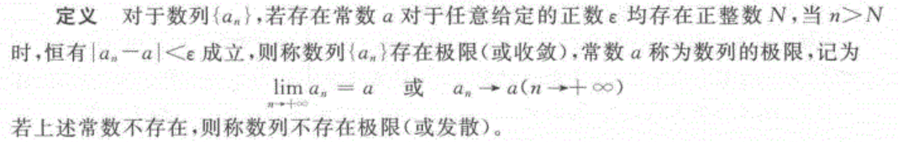
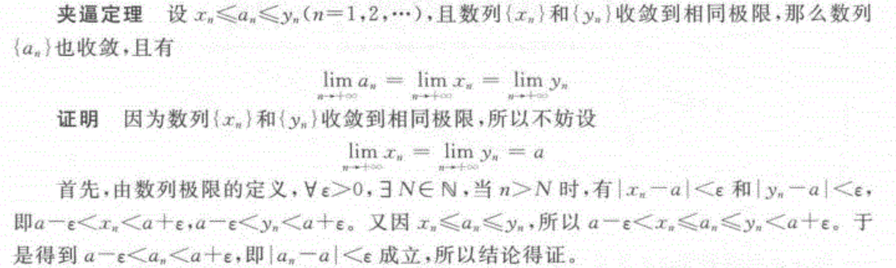
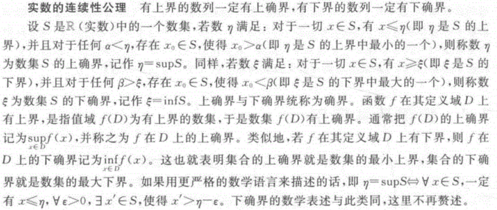
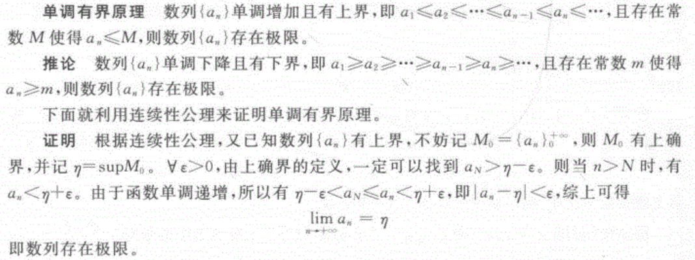

# 图像处理的数学修炼

- 书籍作者: 左飞
- 笔记时间: 2022.03.24

## 1 必不可少的数学基础

### 1.1 极限及其应用

- 数列极限的定义

  

  > 思考: 图片采用像素进行表示,用数列的极限似乎更合适

  - 

- 夹逼定理及其证明

  

- 实数的连续性公理(不证自明的就是公理)

  > 数集里面的最大值和最小值

  

  

- 单调有界原理及其证明

  

## 附录

- [公理 定理 定律 原理](https://zhuanlan.zhihu.com/p/52506376)

  > 公理：中学阶段一般在数学中出现，是数学理论体系的基础，不需要证明，是一种不可争议的共识。例如著名的欧几里得五公理——又称作欧氏几何公理。我们中学学习的所有几何知识，都必须以这五条公理为基础，并且这五条公理不会再由更基础的规律导出。
  >
  > 定理：由公理，原理，定律经过数学推导得出的结论。例如初中学的，圆周角定理，垂径定理。
  >
  > 原理：在中学范围内，这是一个同时和公理，定律非常像的概念。你可以理解为既是公理也是定律。
  >
  > 定律：中学阶段一般在物理中出现。定律都是由实验得出的基本结论，由定律进行数学推导可以得到一些物理上的结论或者定理，但是定律不能由其他规律通过数学推导获得