# 卡尔曼滤波

- 笔记时间 2025.12.23
- 参考资料:
  - [卡尔曼滤波中文网](https://kalmanfilter.net/CN/default_cn.aspx)
  - [卡尔曼滤波可视化](https://www.bzarg.com/p/how-a-kalman-filter-works-in-pictures/)

---

## 0 引入

### 0.1 关于卡尔曼滤波

对跟踪和控制系统而言，最大的挑战之一便是在存在不确定性的情况下获取一个对隐藏状态的精准的估计。
例如GPS接收机会受各种外部干扰，如热噪声、大气效应、卫星轨道微小变化、接收机时间精度等

卡尔曼滤波是最常用最重要的状态估计算法之一。卡尔曼滤波器能**从不确定且非精确**的测量中估计隐藏状态，同时还可以根据历史估计值对未来系统状态进行**预测**。

这种滤波算法以 Rudolf E. Kálmán (1930年5月19日 - 2016年7月2日) 的名字命名。在1960年，卡尔曼发表了著名的论文，描述了一个离散数据的线性滤波问题的递归解法。

### 0.2 为什么需要预测算法

1. 目标追踪雷达
   

假设雷达 5s 发起一次追踪,接收到返回的信息后开始估计目标当前位置和速度,同时还能估计目标在下一个测量周期的位置和速度。
那么坐标位置的预测方程(牛顿运动方程)为:

$$
\begin{aligned}
    x = x_0 + v_{x0} t + \frac{1}{2} a_x t^2 \\
    y = y_0 + v_{y0} t + \frac{1}{2} a_y t^2 \\
    z = z_0 + v_{z0} t + \frac{1}{2} a_z t^2 \\
    \end{aligned}
$$

其中 $x,y,z,x_0,y_0,z_0,v_{x0},v_{y0},v_{z0},a_x,a_y,a_z$ 称为  **系统状态** ,输入是当前状态,输出是未来状态.
这个方程组称为  **动态模型**/**状态空间模型** ,用于描述预测算法的输入和输出关系.
由于雷达的测量不完全正确,比如 雷达校准/回波信噪比等,会引入 **测量噪声**
由于飞行员/风速等,导致目标运动不能完全符合牛顿运动方程,会引入 **过程噪声**
由于这些噪声存在,那么就有可能丢失目标,导致预测错误.因此需要一套对抗噪声的预测算法,常用的就是 **卡尔曼滤波**.

---

## 1. α-β-γ 滤波器

状态更新方程
当前状态估计 = 当前状态预测 + 系数 * (测量 - 当前状态预测)

### 1.1 给金条称重

> 对一个静态系统的状态进行估计。所谓静态系统，是指在合理时间范围内系统状态不会自发改变的系统。
> 假设称是无偏的,但是有随机噪声.我们可以通过多次测量取平均值估计系统状态.

$$
\hat{ x }_{n,n} = \frac{1}{n}\sum_{i=1}^{n}z_i
$$

$x$ 是金条真实重量
$z_n$ 是n时刻对几条重量的测量值
$\hat{ x }_{n,n}$ 是n时刻,使用了n时刻测量值z_n,对x的估计值
$\hat{ x }_{n+1,n}$ 是n时刻,对未来的预测,对x的估计值

从工程角度来说,为了估计 $\hat{ x }_{n,n}$ ,需要记录下所有历史值,内存开销很多,并且每次都需要从头计算.
所以最好只需要存储上一刻的估计值,之后只需要得到当前测量值就可以完成估计.

$$
\begin{aligned}
\hat{x}_{n,n}
&= \frac{1}{n}\!\left(\sum_{i=1}^{n-1} z_i + z_n\right) \\
&= \frac{1}{n}\sum_{i=1}^{n-1} z_i + \frac{1}{n} z_n \\
&= \frac{n-1}{n} \cdot \frac{1}{n-1}\sum_{i=1}^{n-1} z_i + \frac{1}{n} z_n \\
&= \frac{n-1}{n}\,\hat{x}_{n-1,n-1} + \frac{1}{n} z_n \\
&= \hat{x}_{n-1,n-1} + \frac{1}{n}\!\left(z_n - \hat{x}_{n-1,n-1}\right)
\end{aligned}
$$

其中，第三步引入系数 $(n-1)/(n-1)$，使得前 $n-1$ 次测量的平均值显式出现；第四步利用上一时刻均值的定义 $\hat{x}_{n-1,n-1}=\frac{1}{n-1}\sum_{i=1}^{n-1}z_i$；最后一行写成增量形式，说明只需上一刻的估计与当前测量即可完成递推。对静态系统有 $\hat{x}_{n-1,n}=\hat{x}_{n-1,n-1}$，因为系统状态默认不会随着时间变化,所以任意时刻应该同样的数据预测值应该一致.

所以,当前时刻状态可以写成

$$
\hat{x}_{n,n} = \hat{x}_{n-1,n} + \frac{1}{n}\!\left(z_n - \hat{x}_{n-1,n}\right)
$$

,称为**状态更新方程** ,系数 1/n 称为**状态更新系数** 或者 **卡尔曼增益 Kalman Gain**, $\left(z_n - \hat{x}_{n-1,n}\right)$ 称为**测量残差**.

---

数值实例
初始化: 金条重量初始估计 1000g ,$ \hat{x}_{0,0} = 1000 $
预测: 下一个时刻重量估计 1000g ,$ \hat{x}_{0,1} = 1000 $
测量: 下一个时刻称重结果 996g ,$ z_1 = 996 $
增益: $K_1 = \frac{1}{1} = 1$
预估: $ \hat{x}_{1,1} = \hat{x}_{0,1} + K_1 \left(z_1 - \hat{x}_{0,1}\right) = 1000 + 1 \left(996 - 1000\right) = 996 $
更新: 下一个时刻重量估计 996g ,$ \hat{x}_{1,1} = 996 $
以此循环下去,就可以得到任意时刻的重量估计.这个估算法具有平滑的效果.

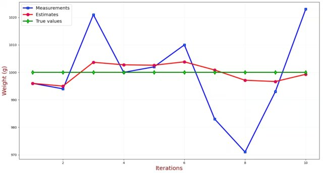

---

### 1.2 追踪匀速直线运动的飞行器

假设在一根数轴上,雷达可以得到飞行器的距离,不考虑高度,只有水平方向的运动.
$x_n$ 是n时刻的距离测量值,速度使用 $v_n$ 表示(距离差分法得到),v = dx/dt
由于是匀速运动,那么可以得到

$$
v_{n+1} = v_n \\
x_{n+1} = x_n + v_n \times t
$$

上面的方程称为 **状态外插方程** ,用于预测未来状态.(不依靠当前测量值,只依靠上一刻的状态)

**α-β 滤波器**
假设雷达的扫描周期 Δt= 5s , n-1时刻距离是 30,000 m, 速度是 40m/s
利用外插方程,可以得到 n 时刻的距离估计为 
$$
x_{n,n} = x_{n-1,n-1} + v_{n-1,n-1} \times t = 30,000 + 40 \times 5 = 30,200 m
$$
然而n时刻的测量只是 30,110m,与预测值相差较大,可能是雷达不精准,也可能是速度变化了(新速度 22m/s).

可以看出,速度没有变化,只是测量值有误差.
所以,可以得到 n 时刻的速度估计为 40m/s.

速度的状态更新方程为
$$
\hat{v}_{n,n} = \hat{v}_{n-1,n} + \beta \frac{\left(z_n - \hat{x}_{n-1,n}\right)}{\Delta t}
$$

β值和雷达精度有关,假设雷达的1σ 测量误差为 20m,那么 90m 大概率是速度变了.那么β就需要调高一些.
假设 β为 0.9,速度估计为:
$$
\hat{v}_{n,n} = \hat{v}_{n-1,n} + \beta \frac{\left(z_n - \hat{x}_{n-1,n}\right)}{\Delta t} 
= 40 + 0.9 \frac{\left(30,110 - 30,200\right)}{\Delta t} = 23.8 m/s
$$

位置的估计使用状态更新方程
$$
\hat{x}_{n,n} = \hat{x}_{n-1,n} + \alpha\!\left(z_n - \hat{x}_{n-1,n}\right)
$$

---

### 1.3 追踪变速直线运动
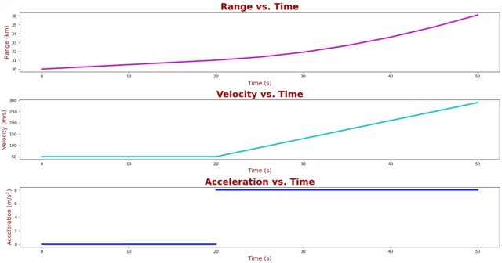

α = 0.2 ,β = 0.1 ,Δt = 5s
1. 迭代0
初始: $\hat{x}_{0,0} = 30,000 m,\hat{v}_{0,0} = 50 m/s$
外插方程预测: 牛顿公式,假设速度不变
    $\hat{x}_{0,1} = 30,000 + 50 \times 5 = 30,250 m$
    $\hat{v}_{0,1} = 50 m/s$
修正: 利用测量值修正预测值
    $\hat{x}_{1,1} = 30,250 + 0.2 \left(30,221 - 30,250\right) = 30,244.2 m$
    $\hat{v}_{1,1} = 50 + 0.1 \frac{\left(30,221 - 30,250\right)}{5} = 50 m/s$

以此类推,迭代n次,就可以得到任意时刻的位置和速度估计.
从结果来看,在真值和估计值之间有一个稳态误差。这个稳态误差又叫 **滞后误差**
滞后误差在加速阶段开始出现。在加速阶段结束后，滤波器会追上这个误差并收敛到真值。

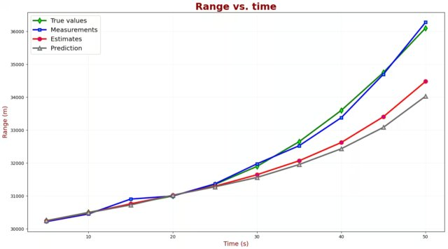
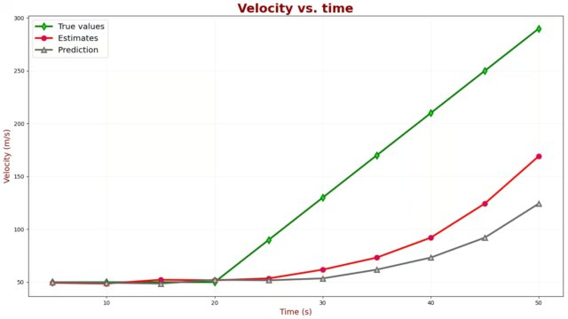

---

### 1.4 α-β-γ 滤波器
α是一阶低通滤波器,β是二阶低通滤波器,γ是三阶低通滤波器.
它们的作用是对信号进行滤波,去掉高频噪声,保留低频信号.
α-β-γ 滤波器的系数可以根据信号的特点进行调整,以获得最佳的滤波效果.

状态外推方程  
对应位移 / 速度 / 加速度  
$$
\begin{aligned}
\hat{x}_{n+1,n} &= \hat{x}_{n,n} + \hat{v}_{n,n}\,\Delta t + \frac{1}{2}\hat{a}_{n,n}\,\Delta t^2 \\[4pt]
\hat{v}_{n+1,n} &= \hat{v}_{n,n} + \hat{a}_{n,n}\,\Delta t \\[4pt]
\hat{a}_{n+1,n} &= \hat{a}_{n,n}
\end{aligned}
$$

状态更新方程  
对应位移 / 速度 / 加速度  
$$
\begin{aligned}
\hat{x}_{n,n} &= \hat{x}_{n-1,n} + \alpha\!\left(z_n - \hat{x}_{n-1,n}\right) \\[4pt]
\hat{v}_{n,n} &= \hat{v}_{n-1,n} + \beta \frac{z_n - \hat{x}_{n-1,n}}{\Delta t} \\[4pt]
\hat{a}_{n,n} &= \hat{a}_{n-1,n} + \gamma \frac{z_n - \hat{x}_{n-1,n}}{\Delta t^2}
\end{aligned}
$$

数值计算,
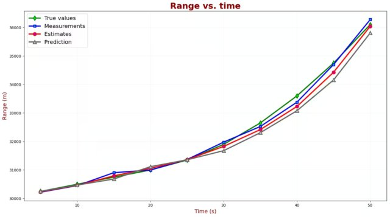
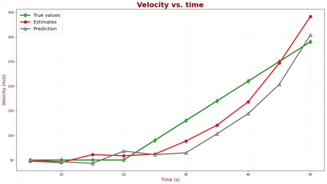
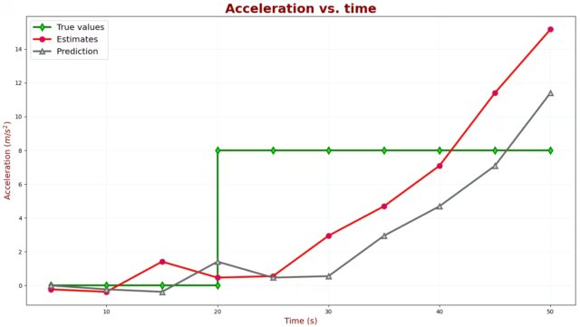

---

### 小结
1. 有许多 α-β-γ 滤波器,遵循同样原理,
   - 当前状态估计基于状态更新方程
   - 未来状态预测基于状态外推方程
   - 区别在于系数选择,有些固定,有些迭代重新计算
2. 初始化很重要

## 2. 一维卡尔曼滤波
### 一维无过程噪声卡尔曼滤波
在前面已经介绍了 状态更新方程 和 状态外推方程. 卡尔曼滤波将 测量值/预测状态/估计值 均视为具有正态分布的随机变量,
由**均值**和**方差**描述.

- 对随机变量进行估计:
  估计值(红)和真值(绿)之间的距离就是估计误差。实际中无法知道估计误差,但是可以计算 **估计值的不确定性(方差)**.
  方差越小,估计值越准确.记为 p.

- 对随机变量进行测量
  测量值(蓝)和真值(绿)之间的距离就是测量误差。使用方差来描述,σ 就是测量不确定性.
  记测量值的方差为 r

蓝色是测量值,红色是真值,绿色区域是概率密度函数,深绿色是1个标准差区间, 可以看到10次有7次测量值在1个标准差区间内.
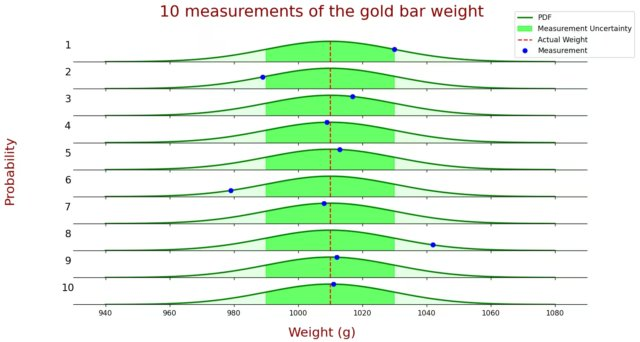

- 状态预测
  之前的雷达跟踪,使用的是 状态外插方程,并没有用到方差,卡尔曼滤波将状态估计也视为具有正态分布的随机变量,
  因此,方差也需要外插.
  金条案例里面  $\hat{p}_{n+1,n} = \hat{p}_{n,n} $
  第二个案例里面  
  $$
  \begin{aligned}
    位置: \hat{p}_{n+1,n} &= \hat{p}_{n,n} + \Delta t^2 \hat{p}_{n,n} \\[4pt]
    速度: \hat{p}_{n+1,n} &= \hat{p}_{n,n}
  \end{aligned}   
  $$
  上述状态估计的方差的外插方程称为**协方差外插方程**，是第三个卡尔曼滤波方程。

- 状态更新
  卡尔曼滤波器是一种最优滤波器，当前状态估计值是状态预测和测量值的加权和.
  $$
  \begin{align}
    \hat{x}_{n,n} &= w_1z_n + w_2\hat{x}_{n,n-1}  \\
    p_{n,n} &= w_1^2 r_n + w_2^2 p_{n,n-1} \\
    w_1 + w_2 &= 1
  \end{align}     
  $$
  我们试图找到一个最有估计来最小化 $p_{n,n}$ ,对公式进行最小化(对公式2对w1求导,令导数为0),
  得到
  $$
  \begin{aligned}
    w_1 &= \frac{p_{n,n-1}}{r_n + p_{n,n-1}} \\
    \hat{x}_{n,n} &= w_1 z_n + (1 - w_1)\hat{x}_{n,n-1} \\
                  &= \hat{x}_{n,n-1} + \frac{p_{n,n-1}}{p_{n,n-1} + r_n}(z_n - \hat{x}_{n,n-1})
  \end{aligned}
  $$
  至此,得到了 卡尔曼增益方程.

  $$
  \begin{aligned}
    K_n &= \frac{预测值方差}{预测值方差 + 测量值方差} \\
    p_{n,n} &= (1-K_n) p_{n,n-1}
  \end{aligned}
  $$
  称为 协方差更新方程.

---

汇总到一起:
1. 初始化只进行一次,提供 初始状态$\hat{x}_{0,0}$ 和 方差$p_0$
2. 测量得到 测量值 $z_n$ 和 测量方差 $r_n$
3. 估计状态值和方差 ,状态外插方程和协方差外插方程依赖具体系统的动力学模型。

| 阶段     | 方程                                                                 | 名字         |
|---------|---------------------------------------------------------------------|--------------|
| 状态更新 | $K_n = \frac{p_{n,n-1}}{p_{n,n-1} + r_n}$                              | 卡尔曼增益   |
| 状态更新 | $\hat{x}_{n,n} = \hat{x}_{n,n-1} + K_n (z_n - \hat{x}_{n,n-1})$       | 状态更新     |
| 状态更新 | $p_{n,n} = (1 - K_n)\, p_{n,n-1}$                                     | 协方差更新   |
| 状态预测 | $\hat{x}_{n+1,n} = \hat{x}_{n,n} + \hat{v}_{n,n}\,\Delta t$           | 状态外插     |
| 状态预测 | $p_{n+1,n} = p_{n,n} + \Delta t^2\, p_{n,n}$                          | 协方差外插   |

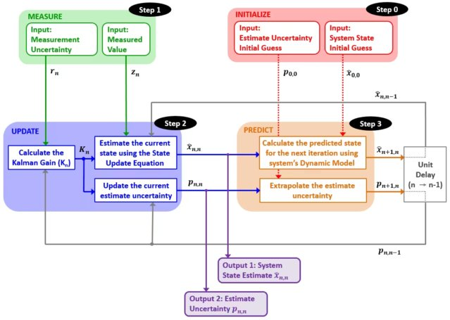
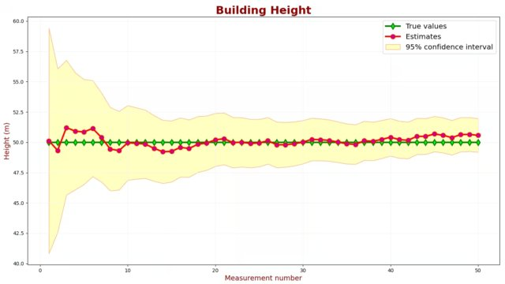

---

### 添加过程噪音
- 过程噪音
  真实世界中,系统动力模型总是有不确定性.比如电阻本身会随温度变化,导弹有风阻等.
  动态模型的不确定性称为 **过程噪音(process noise)** ,
  过程噪音方差用 $q$ 表示.协方差外插方程需要加入 $q$ 项.
  $$
  \begin{aligned}
    p_{n+1,n} &= p_{n,n} + q_n
  \end{aligned}
  $$  

  一个完美的卡尔曼滤波器要求系统的动态模型非常精确，尽量降低过程噪声。

# 附录

## 统计概念

### 随机变量(random variable)

离散随机变量使用 概率质量函数(probability mass function) 表示,即 $P(X=x_i) = p_i$
连续随机变量使用 概率密度函数(probability density function) 表示,即 $f(x) = P(a \leq X \leq b) = \int_a^b f(x) dx$
矩 Moment，矩是随机变量幂的期望。
1阶原点矩 即 期望 Expectation, 也称为 均值 Mean.
2阶中心矩 即 方差 Variance.

### 均值(mean) 期望(expectation)

假设一个人体重测量五次,得到如下结果 79.8kg，80kg，80.1kg，79.8kg和80.2kg
将这个人看成一个系统,那么体重就是它的状态,状态不同是因为称存在测量误差,即体重的测量值不是精确的.
我们可以通过多次测量求平均值进行估计,即 体重的均值(期望) 为 80kg.

| 概念   | 对应              | 符号        | 公式                                           |
| ------ | ----------------- | ----------- | ---------------------------------------------- |
| 平均值 | 样本,数量有限     | $\bar{x}$ | $\displaystyle \frac{1}{n}\sum_{i=1}^{n}x_i$ |
| 期望   | 随机变量,数量无限 | $E(X)$    | $\displaystyle \frac{1}{n}\sum_{i=1}^{n}x_i$ |

### 方差与标准差

方差是对数据分布的一种度量,表示数据的离散程度.
标准差是方差的平方根,表示数据的离散程度.

| 概念   | 对应          | 符号    | 公式                                                         |
| ------ | ------------- | ------- | ------------------------------------------------------------ |
| 方差   | 样本,数量有限 | $s^2$ | $\displaystyle \frac{1}{n-1}\sum_{i=1}^{n}(x_i-\bar{x})^2$ |
| 标准差 | 样本,数量有限 | $s$   | $\sqrt{\frac{1}{n-1}\sum_{i=1}^{n}(x_i-\bar{x})^2}$        |

### 正态分布

自然界许多现象都遵循 正态分布 Normal Distribution,也称为 高斯分布 Gaussian Distribution.
它是一种连续概率分布,在统计学中被广泛应用于描述随机变量的分布情况.
通常情况下，测量误差是正态分布的。卡尔曼滤波器假设测量误差具有正态分布

| 概念     | 对应              | 符号                | 公式                                                              |
| -------- | ----------------- | ------------------- | ----------------------------------------------------------------- |
| 正态分布 | 随机变量,数量无限 | $N(\mu,\sigma^2)$ | $\frac{1}{\sqrt{2\pi\sigma^2}}e^{-\frac{(x-\mu)^2}{2\sigma^2}}$ |

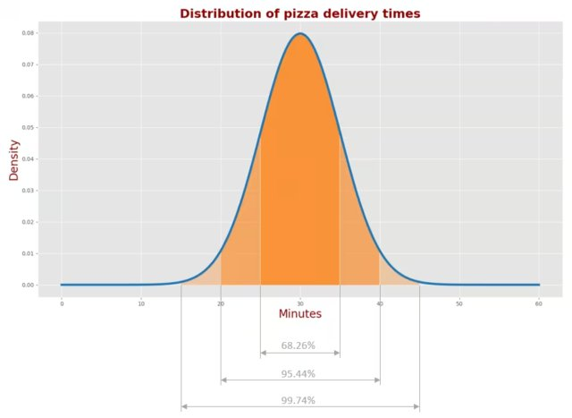

### 协方差

### 估计 准度 精度

估计 Estimation 是对系统的隐藏状态的估计。
准度 Accuracy 描述测量值与真值的接近情况。
精度 Precision 描述一系列测量值相对同一个真值的偏差分布情况。
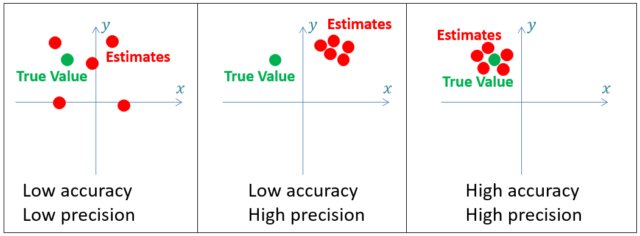
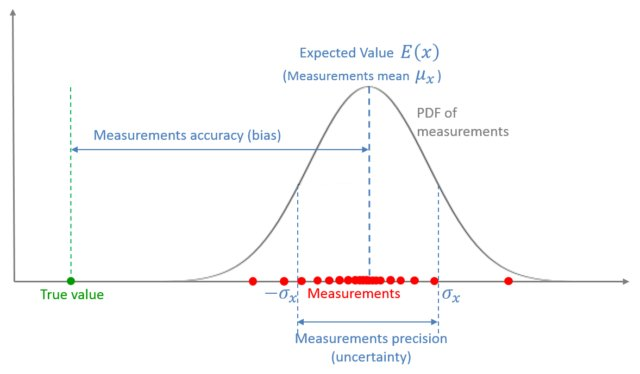

## 术语
| 中文 | 英文 | 中文 | 英文 |
| ------ | ----- | ------ | ----- |
| 卡尔曼滤波器 | Kalman filter | 系统状态 | system state |
| 隐藏状态 | hidden state | 状态估计 | state estimation |
| 预测 | prediction | 动态模型 | dynamic model |
| 状态空间模型 | state-space model | 状态外插方程 | state extrapolation equation |
| 状态外推方程 | state extrapolation equation | 状态更新方程 | state update equation |
| 测量值 | measurement | 测量残差 | innovation |
| 卡尔曼增益 | Kalman gain | 测量噪声 | measurement noise |
| 过程噪声 | process noise | 滞后误差 | lag error |
| 稳态误差 | steady-state error | 低通滤波器 | low-pass filter |
| α-β 滤波器 | alpha–beta filter | α-β-γ 滤波器 | alpha–beta–gamma filter |
| 扫描周期 | scan period | 采样周期 | sampling period |
| 时间步长 Δt | time step Δt | 牛顿运动方程 | kinematic equations |
| 均值 | mean | 期望 | expectation |
| 方差 | variance | 标准差 | standard deviation |
| 正态分布 | normal distribution | 高斯分布 | Gaussian distribution |
| 概率质量函数 | probability mass function (PMF) | 概率密度函数 | probability density function (PDF) |
| 协方差 | covariance | 估计 | estimation |
| 准度 | accuracy | 精度 | precision |
