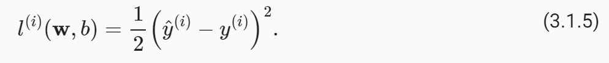

# 动手学深度学习

- 书籍作者:李沐
- 笔记时间:2022.08.09

## 第二章 预备知识

1. pandas数据操作/数据预处理
2. 线性代数
3. 微积分
4. 概率

## 第三章 线性神经网络

### 1 线性回归

#### 1 基本元素

- 回归（regression）是能为一个或多个自变量与因变量之间关系建模的一类方法
- 

- 当我们假设y与x~i~之间是线性关系,那么就可以用  y = Σw~i~x~i~ + b 来表示,w称为权重,b称为偏置
  - 不妨写成矩阵乘法的形式  y = w^T^ x+b,x=[x~1~, ... , x~n~]^T^,
  - 通过给w^T^ 增加 b^T^ 向量, x增加一个分量,可以将 b 合并到 w中,最终表达式 y = w^T^ x
  - 

- 损失函数

  - 用于量化目标的实际值与预测值之间的差距

  - MSE(均方误差) 公式3.1.5如下,1/2 是为了求导后去掉系数,该公式为一个点的误差,

    训练时需要对全部点求误差再取均值(3.1.6)

  - 

  - 

  - 

- 随机梯度下降
  - 梯度是函数增长最激烈的方向,那么反方向就是下降最快的方向,可以用来计算最小化损失函数的w和b
  - 假如每次都取所有点的损失函数进行梯度下降,计算量十分巨大,可以通过随机选择小批量点进行损失函数计算,取得梯度
  -  η代表学习率,也就是每次下降的步长
  - 

- 使用模型预测(prediction),虽然inference(推断)已经成为标准

#### 2 矢量加速

- for循环与矩阵运算速度的对比

#### 3 正态分布

- 这部分理解需要概率论相关知识支撑,还有信息熵的知识
- 

#### 4 从线性回归到深度网络

- 每个输出与每个输入都有连接,称为 全连接
- 

- 