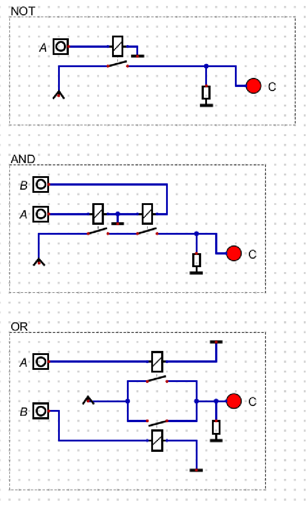

# Digital 仿真学习

- 笔记时间: 2024.11.09

- 参考: [尚硅谷嵌入式数字电路](https://www.bilibili.com/video/BV1tF4m1A7xH?spm_id_from=333.788.videopod.episodes&vd_source=75d343d583130dcc21675fbeadb22044&p=9)

----

## 1. 基础门电路

### NOT  AND  OR

---

### 

