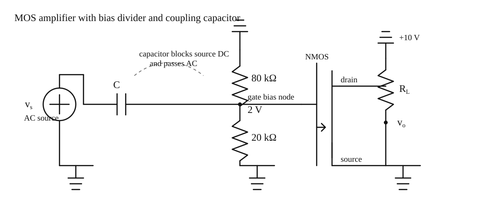

# 电子学一

- [ ] 来源: [NYCU OCW - Electronics (I) - 112](https://ocw.nycu.edu.tw/?course_page=all-course%2Fcollege-of-science%2Fep%2Felectronics-i-112)
- [ ] 时间: 2026.03.13
- [ ] 状态: 进行中
- [ ] 标签: 电子学, 模拟电路, 电路基础, NYCU

正文只保留结论与用法；长推导见文末 [附录](#附录)，文中以「→ 附录 X」引用。

---

## 目录

- [Chapter 1 Basic Concepts 第一章 基本概念](#chapter-1-basic-concepts-第一章-基本概念)
  - [1.1 Voltage, Current, and Resistance 电压、电流与电阻](#11-voltage-current-and-resistance-电压电流与电阻)
    - [1.1.1 Water-Flow Analogy 水流类比](#111-water-flow-analogy-水流类比)
    - [1.1.2 Power 功率](#112-power-功率)
  - [1.2 Circuit Analysis, Equivalent Circuit, and Source Representation 电路分析、等效电路与源表示](#12-circuit-analysis-equivalent-circuit-and-source-representation-电路分析等效电路与源表示)
    - [1.2.1 Maximum Output Power Theorem 最大输出功率定理](#121-maximum-output-power-theorem-最大输出功率定理)
    - [1.2.2 Equivalent Circuit 等效电路](#122-equivalent-circuit-等效电路)
    - [1.2.3 Source Representation 源表示](#123-source-representation-源表示)
    - [1.2.4 Example 示例](#124-example-示例)
  - [1.3 Capacitor and a Capacitive Microphone 电容与电容式麦克风](#13-capacitor-and-a-capacitive-microphone-电容与电容式麦克风)
    - [1.3.1 Capacitor 电容](#131-capacitor-电容)
    - [1.3.2 A Capacitive Microphone 电容式麦克风](#132-a-capacitive-microphone-电容式麦克风)
  - [1.4 DC and AC Voltage Charging C, Transient and Steady-State Solutions 电容的直流与交流充电、暂态与稳态解](#14-dc-and-ac-voltage-charging-c-transient-and-steady-state-solutions-电容的直流与交流充电暂态与稳态解)
    - [1.4.1 DC Voltage Charging C 直流对电容充电](#141-dc-voltage-charging-c-直流对电容充电)
    - [1.4.2 Transient and Steady-State Solutions 暂态与稳态解](#142-transient-and-steady-state-solutions-暂态与稳态解)
    - [1.4.3 AC Voltage Charging C 交流对电容充电](#143-ac-voltage-charging-c-交流对电容充电)
  - [1.5 DC Voltage Blocking and AC Voltage Passing 阻挡直流电压与交流通过](#15-dc-voltage-blocking-and-ac-voltage-passing-阻挡直流电压与交流通过)
    - [1.5.1 Basic C Concepts 基本电容概念](#151-basic-c-concepts-基本电容概念)
    - [1.5.2 Blocking DC Voltage 阻挡直流电压](#152-blocking-dc-voltage-阻挡直流电压)
    - [1.5.3 Condition for AC Voltage Passing 交流通过的条件](#153-condition-for-ac-voltage-passing-交流通过的条件)
  - [1.6 Equivalent Model for C Charging 电容充放电等效模型](#16-equivalent-model-for-c-charging-电容充放电等效模型)
    - [1.6.1 Equivalent Model for C Charging 电容充放电等效模型](#161-equivalent-model-for-c-charging-电容充放电等效模型)
  - [1.7 Phasor Analysis, RC Circuit, and Bode Plots 相量分析、电阻电容电路与波特图](#17-phasor-analysis-rc-circuit-and-bode-plots-相量分析电阻电容电路与波特图)
    - [1.7.1 Phasor Analysis 相量分析](#171-phasor-analysis-相量分析)
    - [1.7.2 RC Circuit 电阻电容电路](#172-rc-circuit-电阻电容电路)
    - [1.7.3 Bode Plots 波特图](#173-bode-plots-波特图)
  - [1.8 Impedance C in the Phasor Analysis, DC and AC Circuits, and Amplifier Concepts 相量分析中的电容阻抗、直流与交流电路、放大器概念](#18-impedance-c-in-the-phasor-analysis-dc-and-ac-circuits-and-amplifier-concepts-相量分析中的电容阻抗直流与交流电路放大器概念)
    - [1.8.1 Impedance C in the Phasor Analysis 相量分析中的电容阻抗](#181-impedance-c-in-the-phasor-analysis-相量分析中的电容阻抗)
    - [1.8.2 DC and AC Circuits 直流和交流电路](#182-dc-and-ac-circuits-直流和交流电路)
    - [1.8.3 Amplifier Concepts 放大器概念](#183-amplifier-concepts-放大器概念)
  - [1.9 A Simple MOS Amplifier, DC Operating Point, and AC Amplification 简易 MOS 放大器、直流工作点与交流放大](#19-a-simple-mos-amplifier-dc-operating-point-and-ac-amplification-简易-mos-放大器直流工作点与交流放大)
    - [1.9.1 A Simple MOS Amplifier 简易 MOS 放大器](#191-a-simple-mos-amplifier-简易-mos-放大器)
    - [1.9.2 DC Operating Point 直流工作点](#192-dc-operating-point-直流工作点)
    - [1.9.3 AC Amplification 交流放大](#193-ac-amplification-交流放大)
- [附录](#附录)
  - [A 最大功率传输定理](#附录-a-最大功率传输定理)
  - [B RC 直流充电微分方程与标准解](#附录-b-rc-直流充电微分方程与标准解)
  - [C 电容等效电阻 $R_C$](#附录-c-电容等效电阻-r_c)
  - [D RC 低通分压与转折频率](#附录-d-rc-低通分压与转折频率)
  - [E 相量、复数、欧拉公式与复平面](#附录-e-相量复数欧拉公式与复平面)
  - [F 平行板电容与高斯定理](#附录-f-平行板电容与高斯定理)
- [电子学一 · 第二章 运算放大器](./电子学一第二章.md)

---

## Chapter 1 Basic Concepts 第一章 基本概念

---

### 1.1 Voltage, Current, and Resistance 电压、电流与电阻

#### 1.1.1 Water-Flow Analogy 水流类比

> ◎ 核心：用水流类比建立电压、电流、电阻之间的直觉关系，并落到欧姆定律。

##### ◇ 直觉理解

为了直观理解电压、电流和电阻之间的关系，可以使用经典的水流类比：

1. **电压 (Voltage, $V$)**
   - 类比为水位差或压差。
   - 水位差驱动水流，电压驱动电荷流动。

2. **电流 (Current, $I$)**
   - 类比为水在管道中的流动。
   - 电流表示单位时间内通过截面的电荷量。

3. **电阻 (Resistance, $R$)**
   - 类比为水管粗细、阀门开度或流动阻碍。
   - 电阻越大，在相同电压下电流越小。

---

##### ∎ 定义 / 公式

欧姆定律为

$$
V = I \times R.
$$

对应关系是：

- 电压越大，若电阻不变，则电流越大。
- 电阻越大，若电压不变，则电流越小。

---

##### ✓ 结论

电压提供驱动力，电阻限制流动，电流是两者共同作用后的结果。

---

##### ✎ 备注

这部分是后续电子学课程的共同前提，主要用于统一直觉，不展开记录串并联基础推导。

---

#### 1.1.2 Power 功率

> ◎ 核心：功率描述单位时间内做功的快慢，在电路中可直接写成 $P = VI$。

##### ◇ 直觉理解

电压推动电荷移动，电荷在单位时间内完成的做功就是功率。

---

##### ∎ 定义 / 公式

电功与功率可由下式得到：

$$
\begin{aligned}
W &= Q \times V \\
P &= \frac{W}{t} = \frac{Q \times V}{t} = V \times \frac{Q}{t}
\end{aligned}
$$

又因为

$$
I = \frac{Q}{t},
$$

所以

$$
P = V \times I.
$$

---

##### ✓ 结论

只要知道某元件两端的电压和流过它的电流，就可以判断它吸收或输出多少功率。

---

##### ✎ 备注

这里的核心是记住功率与电压、电流的关系，后面分析电阻耗散、源输出能力、放大器功耗时都会反复使用。

---

### 1.2 Circuit Analysis, Equivalent Circuit, and Source Representation 电路分析、等效电路与源表示

#### 1.2.1 Maximum Output Power Theorem 最大输出功率定理

> ◎ 核心：当负载电阻等于源内阻时，负载获得最大功率。

##### ◇ 问题

给定电源电压 $V$ 和内阻 $R$ ，当负载电阻 $R_L$ 取何值时，负载获得的功率最大？

---

##### ✓ 结论

当 $R_L=R$ 时负载功率最大，$P_{L(\max)}=V^2/(4R)$ （求导过程见 [附录 A](#附录-a-最大功率传输定理)）。

---

##### ⚠ 易错点

最大功率传输 ≠ 输出电压最稳 ≠ 效率最高；匹配内阻是为了功率，不是为了让端电压不变。

---

#### 1.2.2 Equivalent Circuit 等效电路

> ◎ 核心：把复杂线性网络压缩成更容易分析的简单源模型。

##### ∎ 戴维宁等效

线性含源电阻网络可以等效为一个电压源 $V_{th}$ 与一个串联电阻 $R_{th}$：

- $V_{th}$：端口开路电压，即 $V_{oc}$
- $R_{th}$：独立源置零后，从端口看入的等效电阻

独立源置零规则：

- 电压源短路
- 电流源开路

若电路中含受控源，则可采用测试源法：在端口外加测试电压 $V_{test}$ ，测得测试电流 $I_{test}$ ，于是

$$
R_{th} = \frac{V_{test}}{I_{test}}.
$$

也可以通过短路电流直接求

$$
R_{th} = \frac{V_{oc}}{I_{sc}}.
$$

---

##### ∎ 诺顿等效

同一个线性网络也可以等效为一个电流源与一个并联电阻：

- 等效电流：短路电流 $I_{sc}$
- 等效电阻：仍为 $R_{th}$

---

##### ✓ 结论

戴维宁与诺顿不是两套不同理论，而是同一线性网络的两种等价表达。

---

#### 1.2.3 Source Representation 源表示

> ◎ 核心：只要端口关系是线性的，就能用少量参数描述整个网络。

##### ◇ 前提

当电路中的元件都是线性元件时，端口电压电流关系可写成线性形式

$$
V = aI + b.
$$

---

##### ∎ 如何确定系数

只需要两次独立测量：

1. 开路，即 $I = 0$ ，

$$
b = V_{oc}.
$$

2. 短路，即 $V = 0$ ，

$$
a = -\frac{V_{oc}}{I_{sc}}.
$$

---

##### ✓ 结论

从量纲上看，$a$ 的单位是电阻，$b$ 的单位是电压，因此它们分别对应戴维宁等效中的 $R_{th}$ 与 $V_{th}$。

---

##### ✎ 备注

这里的关键不在公式本身，而在于认识到：只要端口关系是线性的，就一定能被压缩成简化源模型。

---

#### 1.2.4 Example 示例

> ◎ 核心：先对未知负载 $R_L$ 所看到的前级网络做戴维宁等效，再直接套用最大功率定理。

##### ◇ 题目

已知电路中，电压源为 $10\text{ V}$ ，串联电阻为 $5\Omega$ ，节点到地并联了两个 $10\Omega$ ，最右侧接一个未知负载 $R_L$。要求：

1. 从 $R_L$ 端看进去，求左侧网络的戴维宁等效
2. 求使 $R_L$ 获得最大功率时的负载值
3. 求此时的最大负载功率

---

##### ∎ 求解

开路： $10\parallel10=5\,\Omega$ ，与左侧 $5\,\Omega$ 分压 → $V_{th}=5\,\text{V}$。源短路： $R_{th}=5\parallel10\parallel10=2.5\,\Omega$。由 1.2.1，$R_L=R_{th}=2.5\,\Omega$ 时 $P_{L(\max)}=V_{th}^2/(4R_{th})=2.5\,\text{W}$。

---

##### ✓ 小结

先戴维宁等效，再套 $R_L=R_{th}$ 、$P_{L(\max)}=V_{th}^2/(4R_{th})$。

### 1.3 Capacitor and a Capacitive Microphone 电容与电容式麦克风

#### 1.3.1 Capacitor 电容

> ◎ 核心：先用模型与等效的观点引入电容，再把 $C=\dfrac{Q}{V}$ 与 $C=\dfrac{\varepsilon A}{d}$ 连起来。

##### ∎ 电容的引入

可以先用水桶来类比电容：桶里的水量对应电荷 $Q$ ，水位对应电压 $V$。如果从外面挤压桶壁，等于改变“容纳电荷的几何空间”；在电荷近似不变时，水位会上下变化，对应的就是电压变化。于是我们把电容定义为

$$
C = \frac{Q}{V}.
$$

对平行板结构而言，

$$
C = \frac{\varepsilon A}{d},
$$

所以当声音使板间距 $d$ 改变时，电容 $C$ 也会随之改变。

---

##### ✓ 结论

平行板模型下 $C=\varepsilon A/d$ 由高斯定理与 $V=Ed$ 推出，步骤见 [附录 F](#附录-f-平行板电容与高斯定理)。定义式 $C=Q/V$ 强调储能，几何式强调结构。

#### 1.3.2 A Capacitive Microphone 电容式麦克风

> ◎ 核心：把麦克风振膜看成可移动极板，用可变电容模型说明声音如何变成小信号电压，并接到后级放大器。

##### ∎ 模型与后级

平行板：振膜改变 $d$ → $C(t)$ 变化。$V_{dc}=Q/C$ ；有声音时 $V_{out}=V_{dc}+v_{ac}(t)$ ，可等效为源 $V_{dc}+v_{ac}$ 串联 $R_{mic}$。后级串耦合电容挡直流、只传 $v_{ac}$ ；$R_i\to\infty$ 时 $v_o\approx A\,v_{ac}$。

---

### 1.4 DC and AC Voltage Charging C, Transient and Steady-State Solutions 电容的直流与交流充电、暂态与稳态解

#### 1.4.1 DC Voltage Charging C 直流对电容充电

> ◎ 核心：先用最简单的 RC 充电回路建立一阶微分方程，并记住它的标准响应形式。

##### ∎ 核心关系

水流类比： $V$ 定水位，$R$ 限流，$C$ 蓄电荷。由 $C=Q/v_C$ 得 $i=C\,dv_C/dt$ ，KVL 得 $V=RC\,dv_C/dt+v_C$ （推导见 [附录 B](#附录-b-rc-直流充电微分方程与标准解)）。

零初始条件：

$$
v_C(t)=V\left(1-e^{-t/\tau}\right),\quad
i(t)=\frac{V}{R}e^{-t/\tau},\quad
\tau=RC.
$$

记忆： $t=\tau$ 约 63%，$3\tau$ 约 95%，$5\tau$ 可视为稳态。

---

##### ✓ 小结

阶跃充电： $i$ 从 $V/R$ 指数衰减，$v_C$ 升至 $V$ ；$\tau=RC$ 决定快慢。

#### 1.4.2 Transient and Steady-State Solutions 暂态与稳态解

> ◎ 核心：把上一节的公式推广成通用解题方法，再用一个具体电路把 $V(0)$ 、$V(\infty)$ 与 $\tau$ 真正算出来。

##### ∎ 通用写法

$$
v_C(t)=V(\infty)+\bigl[V(0)-V(\infty)\bigr]e^{-t/\tau},\qquad \tau=R_{eq}C.
$$

先找 $V(0)$ （电容电压不突变）、$V(\infty)$ （$C$ 开路）、$R_{eq}$ （源置零），再代入，不必每次重解微分方程。

---

##### ◇ 例题（$R_1$–$C$–$R_2$）

$V(0)=0$ ；$t\to\infty$ 时 $C$ 开路 → $V(\infty)=V$ ；置零源后 $R_{eq}=R_1+R_2$ ，$\tau=C(R_1+R_2)$。代入通用式得

$$
v_C(t)=V\left(1-e^{-t/\tau}\right).
$$

套路：初值（不突变）→ 终值（$C$ 开路）→ $\tau=R_{eq}C$。

---

##### ✓ 小结

$\boxed{v_C(t)=V(\infty)+[V(0)-V(\infty)]e^{-t/\tau}}$ ，$\tau=R_{eq}C$。

#### 1.4.3 AC Voltage Charging C 交流对电容充电

> ◎ 核心：正弦输入下没有固定终值；能否跟上变化速度，由 $\tau=RC$ 与信号周期对比决定，并自然引出 1.5 的阻直流、通交流。

##### ✓ 小结

阶跃看 $V(0)$ 、$V(\infty)$ 、$\tau$ ；交流看频率相对 $1/RC$ 的高低——同一 $\tau$ 决定时域快慢与频域分界。

### 1.5 DC Voltage Blocking and AC Voltage Passing 阻挡直流电压与交流通过

> ◎ 核心：把电容看成一个随频率变化的“等效电阻”，就能自然看懂为什么它会挡直流、通交流。

#### 1.5.1 Basic C Concepts 基本电容概念

> ◎ 核心：先忽略相位，只看振幅，就能把电容的交流特性压缩成一个很直观的量 $R_C=\dfrac{1}{\omega C}$。

##### ∎ 核心结论

只关心振幅时，电容可近似为随频率变化的等效电阻

$$
R_C=\frac{1}{\omega C}
$$

（由 $i=C\,dv/dt$ 对正弦输入取振幅得到，见 [附录 C](#附录-c-电容等效电阻-r_c)）。

---

##### ✓ 小结

这个结果说明电容对不同频率的“阻碍能力”不同：

- $\omega \to 0$ 时，$R_C \to \infty$ ，电容近似开路
- $\omega$ 很大时，$R_C \to 0$ ，电容近似短路

也就是说，频率越高，电容越容易让信号通过。

#### 1.5.2 Blocking DC Voltage 阻挡直流电压

> ◎ 核心：直流对应 $\omega=0$ ，所以电容的等效阻碍趋近无穷大，自然就挡住了直流。

##### ∎ 核心结论

由

$$
R_C=\frac{1}{\omega C}
$$

可直接看出：当 $\omega=0$ 时，$R_C\to\infty$ ，所以电容对直流近似开路，稳态时没有持续电流流过它。这和前面的时域结果一致：直流刚加上去时会先充电，但时间够久以后电流会降到 $0$。

---

##### ◇ 应用

这也是为什么前面电容式麦克风后面要串一个耦合电容。前级的直流偏压不希望送到后级，于是利用电容的“挡直流”特性，把直流隔开，只把变化的交流小信号往后传。

#### 1.5.3 Condition for AC Voltage Passing 交流通过的条件

> ◎ 核心：把 $C$ 看成 $R_C=1/(\omega C)$ ，RC 低通的分压与转折频率、Bode 图一次到位。

##### ∎ 核心结论

RC 低通（输出在 $C$ 上）： $|V_o/V_s|\approx 1/(1+\omega RC)$ ，$\omega_c=1/(RC)$ ，$f_c=1/(2\pi RC)$ （推导见 [附录 D](#附录-d-rc-低通分压与转折频率)）。$\omega\ll\omega_c$ 输出≈输入；$\omega\gg\omega_c$ 输出衰减。

含相位： $|V_o/V_s|=1/\sqrt{1+(\omega/\omega_c)^2}$ ；$\omega=\omega_c$ 约 $-3\text{ dB}$。

---

##### ◇ 例题：低通滤波器允许声音通过

$f_{voice,max}\approx 20\,\text{kHz}$ → $\omega_{voice,max}\approx 10^5\,\text{rad/s}$。取 $\omega_{voice,max}\le 0.1\,\omega_c$ 得 $\omega_c\ge 10^6$ ，即 $1/(RC)\ge 10^6$。$R=10\,\text{k}\Omega$ 时 $C\le 0.1\,\text{nF}$。

---

##### ✓ 小结

交流能否通过取决于频率相对 $\omega_c$ ；低通应让语音最高频落在通带内。

### 1.6 Equivalent Model for C Charging 电容充放电等效模型

> ◎ 核心：把耦合电容放回真实电路里，就能同时看懂两件事：它为什么能挡掉直流偏压，以及什么样的交流才过得去。

#### 1.6.1 Equivalent Model for C Charging 电容充放电等效模型

> ◎ 核心：这里不再重新推导 $R_C=\dfrac{1}{\omega C}$ ，而是直接拿 1.5 的结论来分析实际电路：同样是电容，换一个输出位置，频率选择性就会反过来。

##### ∎ 核心结论

同样沿用

$$
R_C=\frac{1}{\omega C},
$$

但若输出改取在电阻 $R$ 上，则较高频率更容易保留在输出端；这就是耦合电容常见的高通直觉。

---

##### ◇ 耦合电容

$v_{in}=V_{dc}+v_s$ ，串 $C$ 后级：挡 $V_{dc}$ 、传 $v_s$ （直流时 $C$ 开路，见 1.5.2）。输出改取在 $R$ 上时分压 $|V_o/V_s|\approx R/(R+R_C)$ ；要交流落在 $R$ 上需 $R_C\ll R$ ，即 $\omega\ge 10/(RC)=10\omega_0$ （与 [附录 D](#附录-d-rc-低通分压与转折频率) 同一套 $R_C$ 分压，输出节点不同）。

---

##### ✓ 小结

输出在 $C$ 上为低通，在 $R$ 上为高通；关键在“输出取哪一侧”。

---

##### ◇ 例题：用电容旁路激光笔驱动中的杂讯

$I_{dc}\approx 20\,\text{mA}$ 驱动激光；$60\,\text{Hz}$ 纹波用并联 $C$ 旁路，条件 $R_C=1/(\omega C)\le 0.1 R_L$。$R_L=100\,\Omega$ ，$\omega\approx 400\,\text{rad/s}$ → $C\ge 250\,\mu\text{F}$。

---

##### ✓ 小结

串联 $C$ 耦合想要的交流；并联 $C$ 旁路不想要的交流。

### 1.7 Phasor Analysis, RC Circuit, and Bode Plots 相量分析、电阻电容电路与波特图

#### 1.7.1 Phasor Analysis 相量分析

> ◎ 核心：把正弦讯号改写成相量后，振幅与相位可以一起被压缩进一个复数；这样通过线性电路时，输入、转移函数与输出都能用向量乘法直接表达。

##### ∎ 核心结论

固定频率的正弦输入可写成相量，线性电路关系因此变为

$$
V_o(\omega)=V_s(\omega)\,T(\omega).
$$

相量的重点，是把幅值变化和相位变化一起编码进复数。

---

##### ∎ 复数、欧拉式与微分规则

正文只记用法： $a+jb=re^{j\theta}$ ，相乘时幅值相乘、相位相加；$v(t)=Ve^{j\omega t}$ 时 $\dfrac{d}{dt}\leftrightarrow j\omega$。复平面图示、欧拉公式 $e^{j\theta}=\cos\theta+j\sin\theta$ 、正弦到相量的对应，见 [附录 E](#附录-e-相量复数欧拉公式与复平面)。

---

电容例： $i=C\,dv/dt$ → $I=j\omega C\,V$ （$d/dt\leftrightarrow j\omega$ ，见附录 E.3）。

---

##### ✓ 小结

正弦→相量；$e^{j\theta}$ 统一幅相；线性关系→ $V_o=V_s T(\omega)$。

#### 1.7.2 RC Circuit 电阻电容电路

> ◎ 核心：把最基本的 RC 低通电路写成微分方程后，再把输入改写成 $V_se^{j\omega t}$ ，就能把时域微分问题直接转成相量代数问题，并定义转移函数 $T(\omega)=\dfrac{V_o}{V_s}$。

##### ∎ 从微分方程到转移函数

对 RC 低通电路（输出取电容两端），KVL 给出

$$
v_s(t)=RC\frac{dv_o(t)}{dt}+v_o(t).
$$

若设 $v_s(t)=V_se^{j\omega t}$ 、$v_o(t)=V_oe^{j\omega t}$ ，代回并消去 $e^{j\omega t}$ ，得

$$
V_s=(1+j\omega RC)V_o.
$$

因此

$$
T(\omega)=\frac{V_o}{V_s}=\frac{1}{1+j\omega RC}.
$$

---

##### ✓ 小结

这一节只是把时域微分方程改写成相量方程；Bode 图接着从这个 $T(\omega)$ 读振幅与相位。

#### 1.7.3 Bode Plots 波特图

> ◎ 核心：先把转移函数写成“幅值与相位”分开的形式，再用 dB 表示幅值，就能得到最常用的 Bode 图读法。

##### ∎ 幅值与相位

令 $\omega_0=1/(RC)$ ，则

$$
T(\omega)=\frac{1}{1+j\omega/\omega_0}.
$$

直接读出

$$
|T(\omega)|=\frac{1}{\sqrt{1+(\omega/\omega_0)^2}},
\qquad
\angle T(\omega)=-\tan^{-1}\left(\frac{\omega}{\omega_0}\right).
$$

---

##### ∎ dB 形式

电压比的 dB 定义为 $G_{dB}=20\log_{10}|T(\omega)|$。常用对照：

| 幅值比 | dB |
|---|---:|
| $10$ | $20\text{ dB}$ |
| $2$ | $\approx 6\text{ dB}$ |
| $1$ | $0\text{ dB}$ |
| $0.707$ | $\approx -3\text{ dB}$ |
| $0.1$ | $-20\text{ dB}$ |

代入 RC 低通幅值，得

$$
G_{dB}=-10\log_{10}\left(1+\left(\frac{\omega}{\omega_0}\right)^2\right).
$$

---

##### ✓ 小结

读 Bode 图时，重点看低频区、转折点 $\omega_0$ 与高频区；幅值图用 dB，相位图看 $\angle T(\omega)$。

### 1.8 Impedance C in the Phasor Analysis, DC and AC Circuits, and Amplifier Concepts 相量分析中的电容阻抗、直流与交流电路、放大器概念

> ◎ 核心：把电容写成相量阻抗后，之前用 $R_C=\dfrac{1}{\omega C}$ 得到的直觉，就能压缩成标准的频率响应；对激光笔旁路电路来说，电容支路是高通，负载支路则是低通。

#### 1.8.1 Impedance C in the Phasor Analysis 相量分析中的电容阻抗

> ◎ 核心：在相量分析里，电容不再只写成“等效电阻大小”，而是直接写成复数阻抗 $Z_C=\dfrac{1}{j\omega C}$。

##### ∎ 核心结论

由 $i=C\,dv/dt$ 与 $\dfrac{d}{dt}\longleftrightarrow j\omega$ ，得

$$
I=j\omega C\,V
\quad\Longrightarrow\quad
Z_C=\frac{V}{I}=\frac{1}{j\omega C}.
$$

---

##### ∎ 与 $R_C$ 的关系

前面只取大小 $R_C\approx 1/(\omega C)$ ；完整相量形式是

$$
Z_C=\frac{1}{j\omega C}=\frac{1}{\omega C}e^{-j\pi/2}.
$$

因此电容不仅随频率变“小”，还带 $-90^\circ$ 相位。

---

##### ✓ 小结

$R_C$ 是大小版；并联、串联与分流分析时，直接用 $Z_C=1/(j\omega C)$ 更快。

#### 1.8.2 DC and AC Circuits 直流和交流电路

> ◎ 核心：把 1.6 的激光笔旁路电路改写成相量电路后，可以直接看出：电容支路对杂讯是高通，所以高频杂讯会优先流进电容，而不是流过激光负载。

##### ∎ 分流结果

把激光负载近似为 $R_L$ ，杂讯看成电流源 $I_s$ ，与旁路电容 $C$ 并联。由导纳分流，

$$
\frac{I_C}{I_s}=\frac{j\omega C}{1/R_L+j\omega C}
=\frac{j\omega/\omega_0}{1+j\omega/\omega_0},
\qquad
\omega_0=\frac{1}{R_LC}.
$$

负载支路则是

$$
\frac{I_L}{I_s}=\frac{1}{1+j\omega/\omega_0}.
$$

---

##### ✓ 小结

- $\omega\ll\omega_0$：杂讯几乎不过电容，负载波动大  
- $\omega\gg\omega_0$：杂讯优先走电容，负载更平稳  

也就是电容支路高通、负载支路低通。

#### 1.8.3 Amplifier Concepts 放大器概念

> ◎ 核心：大信号用平方律描述 MOS；小信号在工作点附近线性化后，可改写成 **压控电流源** 等效模型，再用 $R_L$ 把电流变成输出电压。

##### ∎ 大信号关系

- 输入 $v_i$ 控制输出电流 $i_o$ ，再由 $R_L$ 转成 $v_o$  
- 希望 $R_i\to\infty$ ，避免加载前级  

$$
i_o=\frac{1}{2}k(v_i-V_T)^2\;(v_i>V_T),
\qquad
v_o=V_{DD}-i_o R_L.
$$

---

##### ∎ 小信号等效模型

在工作点附近令 $v_i=V_I+v_i'$ 、$i_o=I_O+i_o'$ ，忽略二次小量后

$$
i_o'\approx g_m v_i',
\qquad
g_m=k(V_I-V_T).
$$

等效电路里，MOS 先收成 **电压控电流源**：

$$
i_o' = g_m v_i'.
$$

对共源放大器的小信号分析，$V_{DD}$ 对交流可视为 AC 地，因此 $R_L$ 接在 drain 与 AC 地之间；输出小信号

$$
v_o'=-i_o' R_L=-g_m R_L\, v_i'.
$$

---

##### ∎ 例子

取 $k=2\text{ mA/V}^2$ 、$V_T=1\text{ V}$ 、$V_{DD}=10\text{ V}$ 、$R_L=5\text{ k}\Omega$。  
当 $v_i=2\text{ V}$ 时，$i_o=1\text{ mA}$ ，故 $v_o=10-5=5\text{ V}$。  
若工作点取 $V_I=2\text{ V}$ ，则 $g_m=k(V_I-V_T)=2\text{ mA/V}$。

---

##### ✓ 小结

- 大信号： $i_o=\tfrac12 k(v_i-V_T)^2$ ，$v_o=V_{DD}-i_o R_L$  
- 小信号：用 **$g_m v_i'$ 受控电流源** 代替 MOS，再配合 $R_L$ 得 $v_o'=-g_m R_L v_i'$

### 1.9 A Simple MOS Amplifier, DC Operating Point, and AC Amplification 简易 MOS 放大器、直流工作点与交流放大

> ◎ 核心：把前一节的简化 MOS 模型放回真实偏压电路里，就会看到三个关键角色：分压电路先设定 gate 的直流电位，耦合电容隔开输入源的直流，再让交流小信号围绕工作点摆动。

#### 1.9.1 A Simple MOS Amplifier 简易 MOS 放大器

> ◎ 核心：先用分压电路把 gate 固定在合适直流电位，再用耦合电容把输入信号接进来，这样 MOS 就能在既定 Q 点附近放大小信号。

##### ∎ 输入偏压与耦合

$80\text{ k}\Omega$ 上拉到 $+10\text{ V}$ 、$20\text{ k}\Omega$ 下拉到地，固定

$$
V_G=10\times\frac{20}{80+20}=2\text{ V}.
$$

输入源 $v_s$ 经串联电容 $C$ 接到 gate：挡住输入直流，只把交流小信号耦合进来。  
因此 gate 的直流基准仍是 $2\text{ V}$ ，交流在其附近摆动。

---

##### ✓ 小结

分压定直流、电容隔直流、交流叠加在偏压上——MOS 看到的不是从零乱变，而是围绕 Q 点的小变化。

#### 1.9.2 DC Operating Point 直流工作点

> ◎ 核心：所谓 Q 点，就是没有交流输入时电路停住的直流工作状态；后面的放大，本质上就是让小信号围绕这个点摆动。

##### ∎ Q 点

无交流输入时，gate 直流由分压决定，$V_G\approx 2\text{ V}$。  
对应静态漏电流 $I_D$ 与输出

$$
V_O=V_{DD}-I_D R_L.
$$

这组 $(V_G,I_D,V_O)$ 就是 Q 点。

---

##### ✓ 小结

先定 Q 点，MOS 才落在合适工作区；耦合电容送入的交流，只是围绕 Q 点的小幅摆动，输出才有机会近似线性放大。

#### 1.9.3 AC Amplification 交流放大

> ◎ 核心：实际输入往往是「直流偏压 + 交流小信号」；耦合电容对直流开路、对交流用容抗 $Z_C=1/(j\omega C)$ ，于是只有交流进到 gate 并被放大，直流进不了放大通道。

##### ∎ 分析要点

$v_s=V_{s,dc}+v_s'$ ，经耦合电容到 gate；分压定 $V_G\approx 2\,\text{V}$。

- **DC：** $\omega=0$ ，$C$ 开路 → $V_{s,dc}$ 不改变 Q 点；$V_O=V_{DD}-I_D R_L$  
- **AC：** $Z_C=1/(j\omega C)$ （[1.8.1](#181-impedance-c-in-the-phasor-analysis-相量分析中的电容阻抗)）。$|Z_C|\le 0.1 R_{in}$ 时 $v_s'$ 主要落在 gate，即 $\omega\ge 10/(R_{in}C)$  

结果：

| 成分 | 经耦合电容 $C$ | 在放大器里 |
|---|---|---|
| 直流 $V_{s,dc}$ | 挡住，不改变 Q 点 | 不参与交流放大 |
| 交流 $v_s'$ | 以容抗通过（频率够高时） | 围绕 Q 点摆动，用 1.8.3 小信号模型得 $v_o'\approx -g_m R_L\,v_i'$ |

也就是说：**直流被电容挡在放大通道之外**；**只有交流进到 MOS，并在 $V_O$ 附近叠加被放大的 $v_o'$**。  
若输出还要接下一级，往往再串一只耦合电容，同样只把交流往后传。

---

##### ✓ 小结

- 输入 = 直流 + 交流；**DC 分析**把 $C$ 当开路，Q 点由偏压电路定  
- **AC 分析**用 $Z_C=1/(j\omega C)$ （容抗），$|Z_C|\ll R_{in}$ 时交流才能耦合进来  
- 结果：直流进不了放大链，交流通过并被 $g_m$ 放大

---

## 附录

正文中的「→ 附录 X」均指本节。按字母顺序排列，可与第一章各节对照阅读。

### 附录 A 最大功率传输定理

**对应正文：** [1.2.1](#121-maximum-output-power-theorem-最大输出功率定理)

含内阻 $R$ 的电压源 $V$ 接负载 $R_L$ ，负载功率

$$
P_L=\frac{V^2 R_L}{(R+R_L)^2}.
$$

对 $R_L$ 求导并令其为零：

$$
\frac{dP_L}{dR_L}=V^2\frac{R-R_L}{(R+R_L)^3}=0
\quad\Rightarrow\quad
R_L=R.
$$

此时

$$
P_{L(\max)}=\frac{V^2}{4R}.
$$

归一化 $x=R_L/R$ 时 $P_L/P_{L(\max)}=4x/(1+x)^2$ ，在 $x=1$ 取极大；$x\to 0$ 或 $x\to\infty$ 时功率趋于 $0$ （与正文归一化功率图一致）。

---

### 附录 B RC 直流充电微分方程与标准解

**对应正文：** [1.4.1](#141-dc-voltage-charging-c-直流对电容充电)

**电容电流：** $C=Q/v_C$ （$C$ 常数）→ $Q=Cv_C$ → $i=dQ/dt=C\,dv_C/dt$。

**KVL（$R$ 与 $C$ 串联接 $V$）：** $V=Ri+v_C$ ，代入 $i=C\,dv_C/dt$ 得

$$
V=RC\frac{dv_C}{dt}+v_C.
$$

**标准解（$v_C(0)=0$）：** 一阶线性方程，齐次解 $Ae^{-t/RC}$ ，特解 $V$ ，定解

$$
v_C(t)=V\left(1-e^{-t/\tau}\right),\quad
i(t)=\frac{V}{R}e^{-t/\tau},\quad
\tau=RC.
$$

$t=\tau$ 时 $v_C\approx 0.63V$ ；$5\tau$ 可视为进入稳态。

---

### 附录 C 电容等效电阻 $R_C$

**对应正文：** [1.5.1](#151-basic-c-concepts-基本电容概念)

由 $i=C\,dv/dt$。设 $v(t)=V\sin\omega t$ ，则

$$
i(t)=C\omega V\cos\omega t.
$$

只比较振幅： $I\approx \omega C V$ ，定义等效电阻大小

$$
R_C=\frac{V}{I}\approx\frac{1}{\omega C}.
$$

（完整相量形式为 $Z_C=1/(j\omega C)$ ，见 [附录 E](#附录-e-相量复数欧拉公式与复平面) 与 [1.8.1](#181-impedance-c-in-the-phasor-analysis-相量分析中的电容阻抗)。）

- $\omega\to 0$： $R_C\to\infty$ ，挡直流  
- $\omega$ 很大： $R_C\to 0$ ，交流易通过  

---

### 附录 D RC 低通分压与转折频率

**对应正文：** [1.5.3](#153-condition-for-ac-voltage-passing-交流通过的条件)、[1.6.1](#161-equivalent-model-for-c-charging-电容充放电等效模型)

把电容当作 $R_C=1/(\omega C)$ ，与 $R$ 串联分压。

**低通（输出在 $C$ 上）：**

$$
\frac{V_o}{V_s}\approx\frac{R_C}{R+R_C}
=\frac{1}{1+\omega RC},\quad
\omega_c=\frac{1}{RC},\quad
f_c=\frac{1}{2\pi RC}.
$$

$\omega\ll\omega_c$ 时 $R_C\gg R$ ，输出≈输入；$\omega\gg\omega_c$ 时输出衰减。

**含相位幅值：**

$$
\left|\frac{V_o}{V_s}\right|
=\frac{1}{\sqrt{1+(\omega/\omega_c)^2}}.
$$

$\omega=\omega_c$ 时约为 $0.707$ （$-3\,\text{dB}$）。

**高通（输出在 $R$ 上，耦合电容）：**

$$
\frac{V_o}{V_s}\approx\frac{R}{R+R_C}.
$$

要让交流大部分落在 $R$ 上： $R_C\ll R$ ，工程上 $1/(\omega C)\le 0.1R$ ，即 $\omega\ge 10/(RC)$。

---

### 附录 E 相量、复数、欧拉公式与复平面

**对应正文：** [1.7.1](#171-phasor-analysis-相量分析)、[1.7.2](#172-rc-circuit-电阻电容电路)

#### E.1 复平面与两种写法

复数 $z=a+jb$ 对应复平面上横轴为实部、纵轴为虚部的一点。极坐标写法

$$
z=r e^{j\theta},\quad
r=\sqrt{a^2+b^2},\quad
\theta=\tan^{-1}(b/a).
$$

$re^{j\theta}$ 是长度为 $r$ 、与实轴夹角 $\theta$ 的向量。

#### E.2 欧拉公式

$$
e^{j\theta}=\cos\theta+j\sin\theta.
$$

因此 $r e^{j\theta}=r\cos\theta+j\,r\sin\theta$。两个相量相乘：

$$
(r_1 e^{j\theta_1})(r_2 e^{j\theta_2})
=r_1 r_2\, e^{j(\theta_1+\theta_2)},
$$

幅值相乘、相位相加——这正是线性电路中增益与相移可写成复数乘法的根源。

#### E.3 正弦波与相量

时域正弦

$$
v(t)=V_m\cos(\omega t+\phi)
$$

可借助欧拉形式写成

$$
v(t)=\mathrm{Re}\{\underline{V}\,e^{j\omega t}\},\quad
\underline{V}=V_m e^{j\phi},
$$

其中 $\underline{V}$ 为**相量**（在固定 $\omega$ 下编码幅值与初相）。同理 $i(t)=\mathrm{Re}\{\underline{I}\,e^{j\omega t}\}$。

若直接用 $e^{j\omega t}$ 作为时域指数信号（工程上常这样代入线性方程），则

$$
\frac{d}{dt}\longleftrightarrow j\omega,
$$

例如 $i=C\,dv/dt$ → $I=j\omega C\,V$ ，即 $Z_C=1/(j\omega C)$。

#### E.4 线性电路的相量方程

对固定 $\omega$ ，KVL/KCL 在相量域仍成立；元件关系变为代数式。若转移函数 $T(\omega)=\underline{V}_o/\underline{V}_s$ ，则

$$
\underline{V}_o(\omega)=\underline{V}_s(\omega)\,T(\omega).
$$

**RC 低通例（与 1.7.2 一致）：** $v_s=Ri+v_o$ ，$i=j\omega C v_o$ → $V_s=(1+j\omega RC)V_o$ ，故 $T(\omega)=1/(1+j\omega RC)$。

---

### 附录 F 平行板电容与高斯定理

**对应正文：** [1.3.1](#131-capacitor-电容)

平行板面积 $A$ 、间距 $d$ ，板间电场近似均匀 $E$。由高斯定理，单块板外侧电场可忽略，板间

$$
\oint \mathbf{E}\cdot d\mathbf{A}=\frac{Q}{\varepsilon}
\quad\Rightarrow\quad
E=\frac{\sigma}{\varepsilon}=\frac{Q}{\varepsilon A}.
$$

又 $V=Ed$ ，故

$$
C=\frac{Q}{V}=\frac{\varepsilon A}{d}.
$$

板间距 $d$ 随声压变化时，$C$ 改变而 $Q$ 近似不变，则 $V=Q/C$ 产生交流输出——电容式麦克风原理。

---

**下一章：** [电子学一 · 第二章 运算放大器](./电子学一第二章.md)

---
