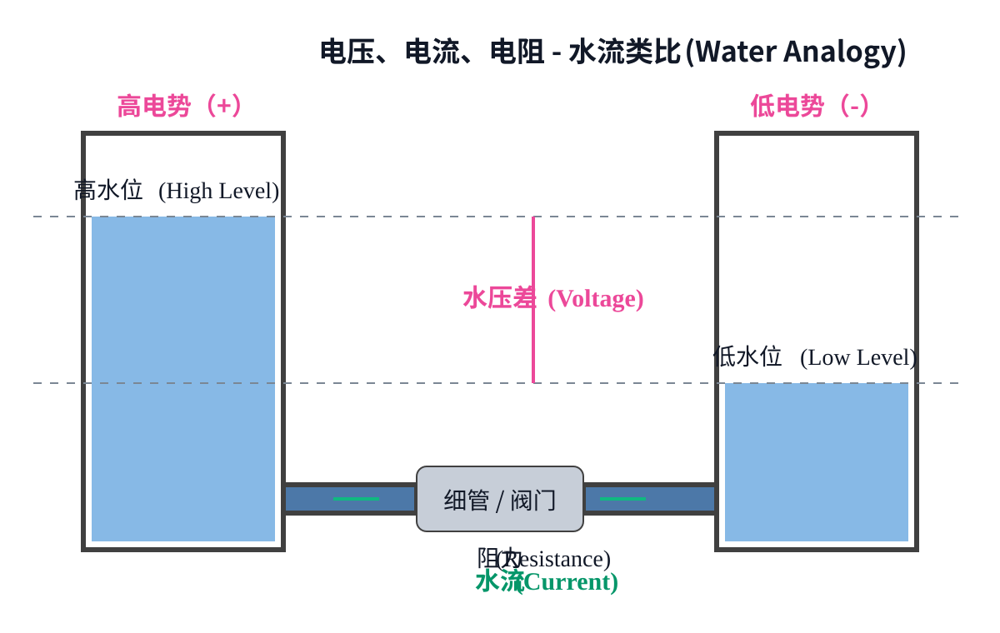
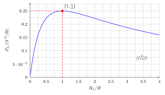
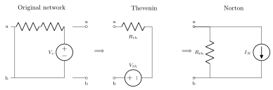
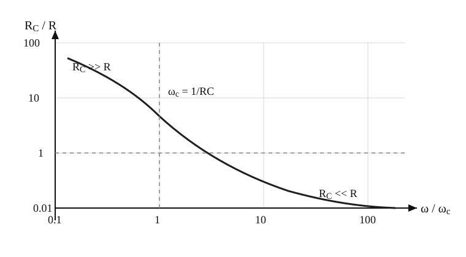
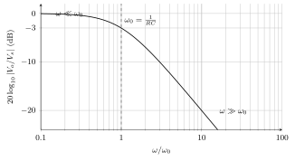
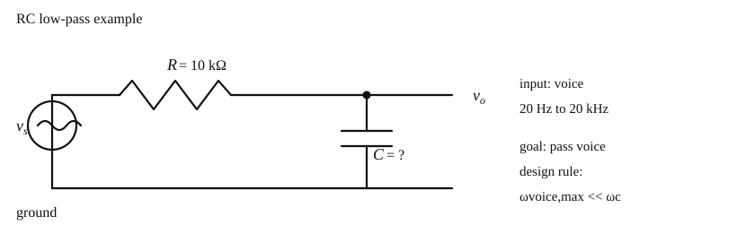
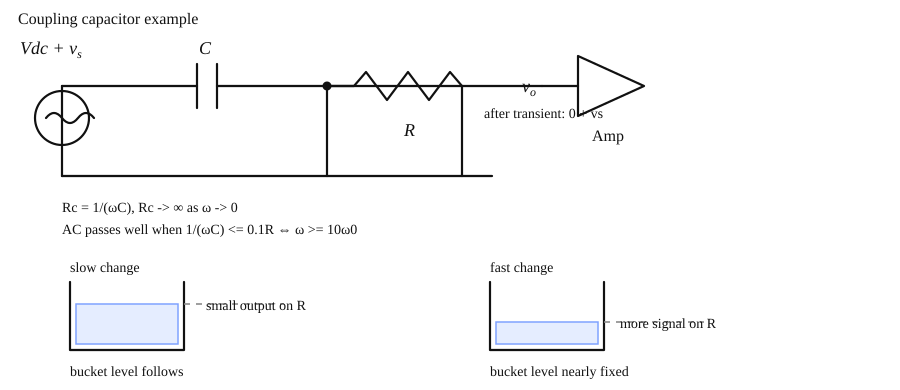
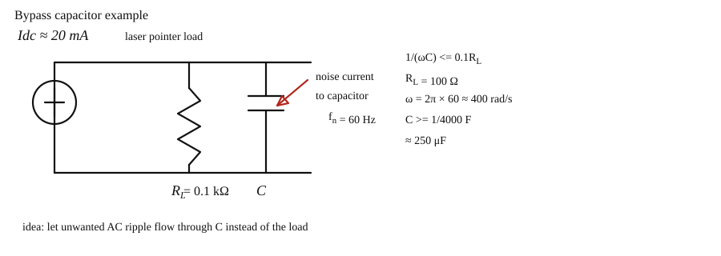
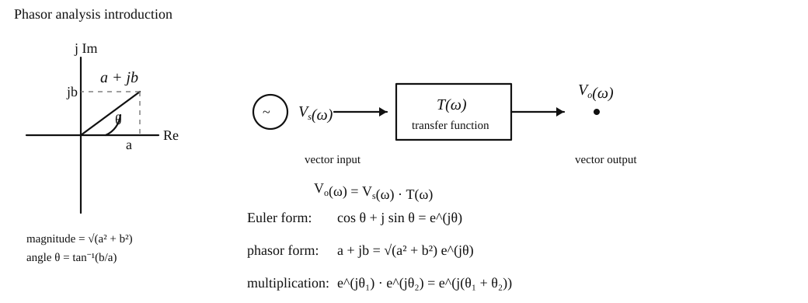
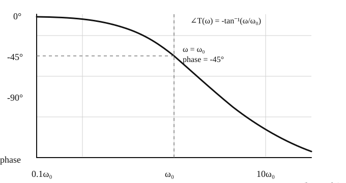

# 电子学一

- [ ] 来源: [NYCU OCW - Electronics (I) - 112](https://ocw.nycu.edu.tw/?course_page=all-course%2Fcollege-of-science%2Fep%2Felectronics-i-112)
- [ ] 时间: 2026.03.13
- [ ] 状态: 进行中
- [ ] 标签: 电子学, 模拟电路, 电路基础, NYCU

---

## 目录

- [Chapter 1 Basic Concepts 第一章 基本概念](#chapter-1-basic-concepts-第一章-基本概念)
  - [1.1 Voltage, Current, and Resistance 电压、电流与电阻](#11-voltage-current-and-resistance-电压电流与电阻)
    - [1.1.1 Water-Flow Analogy 水流类比](#111-water-flow-analogy-水流类比)
    - [1.1.2 Power 功率](#112-power-功率)
  - [1.2 Circuit Analysis, Equivalent Circuit, and Source Representation 电路分析、等效电路与源表示](#12-circuit-analysis-equivalent-circuit-and-source-representation-电路分析等效电路与源表示)
    - [1.2.1 Maximum Output Power Theorem 最大输出功率定理](#121-maximum-output-power-theorem-最大输出功率定理)
    - [1.2.2 Equivalent Circuit 等效电路](#122-equivalent-circuit-等效电路)
    - [1.2.3 Source Representation 源表示](#123-source-representation-源表示)
    - [1.2.4 Example 示例](#124-example-示例)
  - [1.3 Capacitor and a Capacitive Microphone 电容与电容式麦克风](#13-capacitor-and-a-capacitive-microphone-电容与电容式麦克风)
    - [1.3.1 Capacitor 电容](#131-capacitor-电容)
    - [1.3.2 A Capacitive Microphone 电容式麦克风](#132-a-capacitive-microphone-电容式麦克风)
  - [1.4 DC and AC Voltage Charging C, Transient and Steady-State Solutions 电容的直流与交流充电、暂态与稳态解](#14-dc-and-ac-voltage-charging-c-transient-and-steady-state-solutions-电容的直流与交流充电暂态与稳态解)
    - [1.4.1 DC Voltage Charging C 直流对电容充电](#141-dc-voltage-charging-c-直流对电容充电)
    - [1.4.2 Transient and Steady-State Solutions 暂态与稳态解](#142-transient-and-steady-state-solutions-暂态与稳态解)
    - [1.4.3 AC Voltage Charging C 交流对电容充电](#143-ac-voltage-charging-c-交流对电容充电)
  - [1.5 DC Voltage Blocking and AC Voltage Passing 阻挡直流电压与交流通过](#15-dc-voltage-blocking-and-ac-voltage-passing-阻挡直流电压与交流通过)
    - [1.5.1 Basic C Concepts 基本电容概念](#151-basic-c-concepts-基本电容概念)
    - [1.5.2 Blocking DC Voltage 阻挡直流电压](#152-blocking-dc-voltage-阻挡直流电压)
    - [1.5.3 Condition for AC Voltage Passing 交流通过的条件](#153-condition-for-ac-voltage-passing-交流通过的条件)
  - [1.6 Equivalent Model for C Charging 电容充放电等效模型](#16-equivalent-model-for-c-charging-电容充放电等效模型)
    - [1.6.1 Equivalent Model for C Charging 电容充放电等效模型](#161-equivalent-model-for-c-charging-电容充放电等效模型)
  - [1.7 Phasor Analysis, RC Circuit, and Bode Plots 相量分析、电阻电容电路与波特图](#17-phasor-analysis-rc-circuit-and-bode-plots-相量分析电阻电容电路与波特图)
    - [1.7.1 Phasor Analysis 相量分析](#171-phasor-analysis-相量分析)
    - [1.7.2 RC Circuit 电阻电容电路](#172-rc-circuit-电阻电容电路)
    - [1.7.3 Bode Plots 波特图](#173-bode-plots-波特图)
  - [1.8 Impedance C in the Phasor Analysis, DC and AC Circuits, and Amplifier Concepts 相量分析中的电容阻抗、直流与交流电路、放大器概念](#18-impedance-c-in-the-phasor-analysis-dc-and-ac-circuits-and-amplifier-concepts-相量分析中的电容阻抗直流与交流电路放大器概念)
    - [1.8.1 Impedance C in the Phasor Analysis 相量分析中的电容阻抗](#181-impedance-c-in-the-phasor-analysis-相量分析中的电容阻抗)
    - [1.8.2 DC and AC Circuits 直流和交流电路](#182-dc-and-ac-circuits-直流和交流电路)
    - [1.8.3 Amplifier Concepts 放大器概念](#183-amplifier-concepts-放大器概念)
  - [1.9 A Simple MOS Amplifier, DC Operating Point, and AC Amplification 简易 MOS 放大器、直流工作点与交流放大](#19-a-simple-mos-amplifier-dc-operating-point-and-ac-amplification-简易-mos-放大器直流工作点与交流放大)
    - [1.9.1 A Simple MOS Amplifier 简易 MOS 放大器](#191-a-simple-mos-amplifier-简易-mos-放大器)
    - [1.9.2 DC Operating Point 直流工作点](#192-dc-operating-point-直流工作点)
    - [1.9.3 AC Amplification 交流放大](#193-ac-amplification-交流放大)
- [Chapter 2 Operational Amplifiers 第二章 运算放大器](#chapter-2-operational-amplifiers-第二章-运算放大器)
  - [2.1 Ideal Properties, Negative Feedback, Virtual Short Circuit, Amplifiers, and Adders 理想特性、负回授、虚短、放大器与加法器](#21-ideal-properties-negative-feedback-virtual-short-circuit-amplifiers-and-adders-理想特性负回授虚短放大器与加法器)
    - [2.1.1 Ideal Properties 理想特性](#211-ideal-properties-理想特性)
    - [2.1.2 Negative Feedback 负回授](#212-negative-feedback-负回授)
    - [2.1.3 Virtual Short Circuit 虚短](#213-virtual-short-circuit-虚短)
    - [2.1.4 Voltage Follower 电压追随器](#214-voltage-follower-电压追随器)
    - [2.1.5 Positive-Gain Amplifier 正增益放大器](#215-positive-gain-amplifier-正增益放大器)
    - [2.1.6 Adder 加法器](#216-adder-加法器)
    - [2.1.7 Negative-Gain Amplifier 负增益放大器](#217-negative-gain-amplifier-负增益放大器)
  - [2.2 Differential Amplifier, Instrumentation Amplifier, EKG Measurements, and Voltage and Current Limitations 差动放大器、仪表放大器、心电图量测与电压电流限制](#22-differential-amplifier-instrumentation-amplifier-ekg-measurements-and-voltage-and-current-limitations-差动放大器仪表放大器心电图量测与电压电流限制)
    - [2.2.1 Differential Amplifier 差动放大器](#221-differential-amplifier-差动放大器)
    - [2.2.2 Instrumentation Amplifier 仪表放大器](#222-instrumentation-amplifier-仪表放大器)
    - [2.2.3 EKG Measurements 心电图量测](#223-ekg-measurements-心电图量测)
    - [2.2.4 Right-Leg Drive Circuit 右脚驱动电路](#224-right-leg-drive-circuit-右脚驱动电路)
    - [2.2.5 Voltage and Current Limitations 电压与电流的极限](#225-voltage-and-current-limitations-电压与电流的极限)
  - [2.3 Integrator, Square-to-Triangular Waves Converter, and DC Offset Problem 积分器、方波三角波转换与直流偏移问题](#23-integrator-square-to-triangular-waves-converter-and-dc-offset-problem-积分器方波三角波转换与直流偏移问题)
    - [2.3.1 Integrator 积分器](#231-integrator-积分器)
    - [2.3.2 Square-to-Triangular Waves Converter 方波三角波转换](#232-square-to-triangular-waves-converter-方波三角波转换)
    - [2.3.3 DC Offset Problem 直流偏移问题](#233-dc-offset-problem-直流偏移问题)
    - [2.3.4 Effect of Offset on Integrator 直流偏移对积分器的影响](#234-effect-of-offset-on-integrator-直流偏移对积分器的影响)
  - [2.4 Integrator with Additional Resistance, Bode Plots, Differentiator, and Solving a Differential Equation 积分器外加电阻、波特图、微分器与微分方程求解](#24-integrator-with-additional-resistance-bode-plots-differentiator-and-solving-a-differential-equation-积分器外加电阻波特图微分器与微分方程求解)
    - [2.4.1 DC Problem with the Integrator 积分器直流问题](#241-dc-problem-with-the-integrator-积分器直流问题)
    - [2.4.2 Integrator with Additional Resistance 积分器外加电阻](#242-integrator-with-additional-resistance-积分器外加电阻)
    - [2.4.3 Bode Plots of Integrator 积分器波特图](#243-bode-plots-of-integrator-积分器波特图)
    - [2.4.4 Differentiator 微分器](#244-differentiator-微分器)
    - [2.4.5 Differentiator with Additional Resistance 微分器外加电阻](#245-differentiator-with-additional-resistance-微分器外加电阻)
    - [2.4.6 Solving a Differential Equation 解一微分方程](#246-solving-a-differential-equation-解一微分方程)
  - [2.5 P-N Junction Photodetector and Its Equivalent Model P-N 介面光侦测器与其等效模型](#25-p-n-junction-photodetector-and-its-equivalent-model-p-n-介面光侦测器与其等效模型)
    - [2.5.1 P-N Junction Photodetector P-N 介面光侦测器](#251-p-n-junction-photodetector-p-n-介面光侦测器)
    - [2.5.2 P-N Diodes P-N 二极体](#252-p-n-diodes-p-n-二极体)
    - [2.5.3 Equivalent Model of P-N Photodetector 光侦测器等效模型](#253-equivalent-model-of-p-n-photodetector-光侦测器等效模型)
  - [2.6 Current-Voltage Converter for Photodetector and Automatic Street-Light Control System 光侦测器的电流电压转换器与自动街灯控制系统](#26-current-voltage-converter-for-photodetector-and-automatic-street-light-control-system-光侦测器的电流电压转换器与自动街灯控制系统)
    - [2.6.1 Current-Voltage Converter for Photodetector 光侦测器的电流电压转换器](#261-current-voltage-converter-for-photodetector-光侦测器的电流电压转换器)
    - [2.6.2 Automatic Street-Light Control System 自动街灯控制系统](#262-automatic-street-light-control-system-自动街灯控制系统)
    - [2.6.3 BJT Current and Voltage 双极性介面电晶体的电流电压](#263-bjt-current-and-voltage-双极性介面电晶体的电流电压)
    - [2.6.4 The Protection Diode 保护二极体](#264-the-protection-diode-保护二极体)
  - [2.7 Photo Sensor, Current-Voltage Conversion, and Light-Emitting Devices 光侦测器、电流电压转换与光发射元件](#27-photo-sensor-current-voltage-conversion-and-light-emitting-devices-光侦测器电流电压转换与光发射元件)
    - [2.7.1 A Photo Sensor 光侦测器](#271-a-photo-sensor-光侦测器)
    - [2.7.2 Current-Voltage Conversion 电流电压转换](#272-current-voltage-conversion-电流电压转换)
    - [2.7.3 Light-Emitting Devices 光发射元件](#273-light-emitting-devices-光发射元件)
  - [2.8 Modeling of OP Converters 运算放大器转换器模型](#28-modeling-of-op-converters-运算放大器转换器模型)
    - [2.8.1 Amplifier AC Modeling 放大器交流模型](#281-amplifier-ac-modeling-放大器交流模型)
    - [2.8.2 Modeling for Current-Voltage Converter 电流电压转换器模型](#282-modeling-for-current-voltage-converter-电流电压转换器模型)
    - [2.8.3 Modeling for Voltage-Current Converter 电压电流转换器模型](#283-modeling-for-voltage-current-converter-电压电流转换器模型)
    - [2.8.4 Current-Current Amplifier 电流电流放大器](#284-current-current-amplifier-电流电流放大器)
  - [2.9 Summary of OP Converters 运算放大器转换器总整理](#29-summary-of-op-converters-运算放大器转换器总整理)
    - [2.9.1 Summary of OP Converters 运算放大器转换器总整理](#291-summary-of-op-converters-运算放大器转换器总整理)
  - [2.10 OP Bandwidth and Slew Rate 运算放大器频宽与迴转率](#210-op-bandwidth-and-slew-rate-运算放大器频宽与迴转率)
    - [2.10.1 OP Bandwidth and Slew Rate 运算放大器频宽与迴转率](#2101-op-bandwidth-and-slew-rate-运算放大器频宽与迴转率)
    - [2.10.2 Avoid SR Distortion 避免迴转率扭曲](#2102-avoid-sr-distortion-避免迴转率扭曲)
  - [2.11 OP with BJT to Increase Current-Driving Capability and Class AB Output Stage 外加 BJT 增加电流驱动能力与 AB 类输出级](#211-op-with-bjt-to-increase-current-driving-capability-and-class-ab-output-stage-外加-bjt-增加电流驱动能力与-ab-类输出级)
    - [2.11.1 BJT Current Amplification 双极性介面电晶体的电流放大](#2111-bjt-current-amplification-双极性介面电晶体的电流放大)
    - [2.11.2 OP with BJT to Increase Current-Driving Capability 运算放大器外加 BJT 来增加电流驱动](#2112-op-with-bjt-to-increase-current-driving-capability-运算放大器外加-bjt-来增加电流驱动)
    - [2.11.3 Class AB Output Stage AB 类输出级](#2113-class-ab-output-stage-ab-类输出级)
  - [2.12 Class AB Output Stage with Diodes and a Simple Stereo System AB 类输出级外加二极体与简易音响系统](#212-class-ab-output-stage-with-diodes-and-a-simple-stereo-system-ab-类输出级外加二极体与简易音响系统)
    - [2.12.1 Class AB Output Stage with Diodes AB 类输出级外加二极体](#2121-class-ab-output-stage-with-diodes-ab-类输出级外加二极体)
    - [2.12.2 A Simple Stereo System 简易音响系统](#2122-a-simple-stereo-system-简易音响系统)

---

## Chapter 1 Basic Concepts 第一章 基本概念

---

### 1.1 Voltage, Current, and Resistance 电压、电流与电阻

#### 1.1.1 Water-Flow Analogy 水流类比

> ◎ 核心：用水流类比建立电压、电流、电阻之间的直觉关系，并落到欧姆定律。

##### ◇ 直觉理解

为了直观理解电压、电流和电阻之间的关系，可以使用经典的水流类比：

1. **电压 (Voltage, $V$)**
   - 类比为水位差或压差。
   - 水位差驱动水流，电压驱动电荷流动。

2. **电流 (Current, $I$)**
   - 类比为水在管道中的流动。
   - 电流表示单位时间内通过截面的电荷量。

3. **电阻 (Resistance, $R$)**
   - 类比为水管粗细、阀门开度或流动阻碍。
   - 电阻越大，在相同电压下电流越小。

---

##### ∎ 定义 / 公式

欧姆定律为
$$
V = I \times R.
$$
对应关系是：

- 电压越大，若电阻不变，则电流越大。
- 电阻越大，若电压不变，则电流越小。

---

##### ✓ 结论

电压提供驱动力，电阻限制流动，电流是两者共同作用后的结果。

---

##### ✎ 备注

这部分是后续电子学课程的共同前提，主要用于统一直觉，不展开记录串并联基础推导。

---

#### 1.1.2 Power 功率

> ◎ 核心：功率描述单位时间内做功的快慢，在电路中可直接写成 $P = VI$。

##### ◇ 直觉理解

电压推动电荷移动，电荷在单位时间内完成的做功就是功率。

---

##### ∎ 定义 / 公式

电功与功率可由下式得到：
$$
\begin{aligned}
W &= Q \times V \\
P &= \frac{W}{t} = \frac{Q \times V}{t} = V \times \frac{Q}{t}
\end{aligned}
$$
又因为
$$
I = \frac{Q}{t},
$$
所以
$$
P = V \times I.
$$

---

##### ✓ 结论

只要知道某元件两端的电压和流过它的电流，就可以判断它吸收或输出多少功率。

---

##### ✎ 备注

这里的核心是记住功率与电压、电流的关系，后面分析电阻耗散、源输出能力、放大器功耗时都会反复使用。

---

### 1.2 Circuit Analysis, Equivalent Circuit, and Source Representation 电路分析、等效电路与源表示

#### 1.2.1 Maximum Output Power Theorem 最大输出功率定理

> ◎ 核心：当负载电阻等于源内阻时，负载获得最大功率。

##### ◇ 问题

给定电源电压 $V$ 和内阻 $R$，当负载电阻 $R_L$ 取何值时，负载获得的功率最大？

---

##### ∎ 推导

1. 负载电流为
$$
I_L = \frac{V}{R + R_L}.
$$

2. 负载功率为
$$
P_L = I_L^2 \times R_L
= \left( \frac{V}{R + R_L} \right)^2 \times R_L
= \frac{V^2 R_L}{(R + R_L)^2}.
$$

3. 对 $R_L$ 求极值：
$$
\frac{dP_L}{dR_L}
= V^2 \left[
\frac{1 \cdot (R + R_L)^2 - R_L \cdot 2(R + R_L)}{(R + R_L)^4}
\right] = 0
$$
化简后得到
$$
(R + R_L) - 2R_L = 0
\Rightarrow R - R_L = 0.
$$

---

##### ◇ 可视化理解

如果把负载功率写成
$$
P_L = \frac{V^2 R_L}{(R + R_L)^2},
$$
再做归一化，令
$$
x = \frac{R_L}{R},
$$
则有
$$
\frac{P_L}{V^2 / R} = \frac{x}{(1+x)^2}.
$$

这说明问题本质上是在观察一个单峰函数，它在 $x=1$ 处取得最大值，也就是在 $R_L = R$ 时达到峰值。

---

##### ✓ 结论

当
$$
R_L = R
$$
时，负载功率最大；最大功率为
$$
P_{L(max)} = \frac{V^2}{4R}.
$$

---

##### ⚠ 易错点

最大输出功率不等于输出电压最稳定，也不等于效率最高。

---

##### ✦ 我的理解

这个结论说明“最大功率传输”和“最大电压保持”不是同一个目标。

- 如果追求最大功率传输，通常要求负载与源内阻匹配。
- 如果追求输出电压尽量稳定，通常希望负载远大于源内阻。

后面看放大器和信号源时，要明确自己优化的到底是哪一个目标。

---

#### 1.2.2 Equivalent Circuit 等效电路

> ◎ 核心：把复杂线性网络压缩成更容易分析的简单源模型。

##### ∎ 戴维宁等效

线性含源电阻网络可以等效为一个电压源 $V_{th}$ 与一个串联电阻 $R_{th}$：

- $V_{th}$：端口开路电压，即 $V_{oc}$
- $R_{th}$：独立源置零后，从端口看入的等效电阻

独立源置零规则：

- 电压源短路
- 电流源开路

若电路中含受控源，则可采用测试源法：在端口外加测试电压 $V_{test}$，测得测试电流 $I_{test}$，于是
$$
R_{th} = \frac{V_{test}}{I_{test}}.
$$
也可以通过短路电流直接求
$$
R_{th} = \frac{V_{oc}}{I_{sc}}.
$$

---

##### ∎ 诺顿等效

同一个线性网络也可以等效为一个电流源与一个并联电阻：

- 等效电流：短路电流 $I_{sc}$
- 等效电阻：仍为 $R_{th}$

---

##### ✓ 结论

戴维宁与诺顿不是两套不同理论，而是同一线性网络的两种等价表达。

---

##### ✦ 我的理解

遇到一个两端口线性网络时，不一定要一直抱着原电路硬算。很多时候，先把它改写成戴维宁或诺顿形式，再分析负载、电压或功率，会更直接。

---

#### 1.2.3 Source Representation 源表示

> ◎ 核心：只要端口关系是线性的，就能用少量参数描述整个网络。

##### ◇ 前提

当电路中的元件都是线性元件时，端口电压电流关系可写成线性形式
$$
V = aI + b.
$$

---

##### ∎ 如何确定系数

只需要两次独立测量：

1. 开路，即 $I = 0$，
$$
b = V_{oc}.
$$

2. 短路，即 $V = 0$，
$$
a = -\frac{V_{oc}}{I_{sc}}.
$$

---

##### ✓ 结论

从量纲上看，$a$ 的单位是电阻，$b$ 的单位是电压，因此它们分别对应戴维宁等效中的 $R_{th}$ 与 $V_{th}$。

---

##### ✎ 备注

这里的关键不在公式本身，而在于认识到：只要端口关系是线性的，就一定能被压缩成简化源模型。

---

#### 1.2.4 Example 示例

> ◎ 核心：先对未知负载 $R_L$ 所看到的前级网络做戴维宁等效，再直接套用最大功率定理。

##### ◇ 题目

已知电路中，电压源为 $10\text{ V}$，串联电阻为 $5\Omega$，节点到地并联了两个 $10\Omega$，最右侧接一个未知负载 $R_L$。要求：

1. 从 $R_L$ 端看进去，求左侧网络的戴维宁等效
2. 求使 $R_L$ 获得最大功率时的负载值
3. 求此时的最大负载功率

---

##### ∎ 第一步：求开路电压 $V_{th}$

先把负载 $R_L$ 拿掉，输出端开路。此时两个 $10\Omega$ 并联为
$$
10\parallel10 = 5\Omega,
$$
因此左侧电路化成一个 $5\Omega$ 与 $5\Omega$ 的分压，开路电压为
$$
V_{th} = 10 \times \frac{5}{5+5}
= 5\text{ V}.
$$

---

##### ∎ 第二步：求等效电阻 $R_{th}$

将独立电压源置零，也就是短路。此时从 $R_L$ 端看进去，有三条对地支路：

- 左边的 $5\Omega$
- 中间的 $10\Omega$
- 右边的 $10\Omega$

所以
$$
R_{th} = 5 \parallel 10 \parallel 10.
$$
先并联两个 $10\Omega$，
$$
10\parallel10 = 5\Omega,
$$
于是
$$
R_{th} = 5 \parallel 5
= \frac{5\times5}{5+5}
= 2.5\Omega.
$$

---

##### ∎ 第三步：套用最大功率定理

对负载而言，前级网络已经等效成一个戴维宁电压源 $V_{th}$ 串联内阻 $R_{th}$。根据最大功率定理，当
$$
R_L = R_{th}
$$
时，负载获得最大功率，因此
$$
R_L = 2.5\Omega.
$$

---

##### ∎ 第四步：求最大功率 $P_{L(\max)}$

最大功率为
$$
P_{L(\max)} = \frac{V_{th}^2}{4R_{th}}
= \frac{5^2}{4\times2.5}
= 2.5\text{ W}.
$$

---

##### ✓ 结论

这个例子说明：求未知负载问题时，可以先把前级网络压缩成戴维宁等效。对这个电路，等效结果是 $V_{th}=5\text{ V}$、$R_{th}=2.5\Omega$，因此当 $R_L=2.5\Omega$ 时负载获得最大功率，且最大功率为 $2.5\text{ W}$。

---

##### ✎ 我的理解

这类题的关键，是先把“原电路”转成“负载眼里的等效电路”。一旦前级被压缩成 $V_{th}$ 和 $R_{th}$，后面的最优负载与最大功率就都能直接从标准结论得到。

---

### 1.3 Capacitor and a Capacitive Microphone 电容与电容式麦克风

#### 1.3.1 Capacitor 电容

> ◎ 核心：先用模型与等效的观点引入电容，再把 $C=\dfrac{Q}{V}$ 与 $C=\dfrac{\varepsilon A}{d}$ 连起来。

##### ∎ 电容的引入

可以先用水桶来类比电容：桶里的水量对应电荷 $Q$，水位对应电压 $V$。如果从外面挤压桶壁，等于改变“容纳电荷的几何空间”；在电荷近似不变时，水位会上下变化，对应的就是电压变化。于是我们把电容定义为
$$
C = \frac{Q}{V}.
$$
对平行板结构而言，
$$
C = \frac{\varepsilon A}{d},
$$
所以当声音使板间距 $d$ 改变时，电容 $C$ 也会随之改变。

---

##### ∎ 由场量推到电容公式

对平行板之间的电场，利用高斯定理
$$
\oint \vec{E}\cdot d\vec{A} = \frac{Q}{\varepsilon},
$$
忽略边缘效应并把板间电场近似看成均匀场，就有
$$
EA = \frac{Q}{\varepsilon}
\quad\Rightarrow\quad
E = \frac{Q}{\varepsilon A}.
$$
再由
$$
V = Ed
$$
得到
$$
V = \frac{Qd}{\varepsilon A},
\qquad
C = \frac{Q}{V} = \frac{\varepsilon A}{d}.
$$

---

##### ✓ 结论

电容既可以从定义上写成 $C=\dfrac{Q}{V}$，也可以在平行板模型下写成 $C=\dfrac{\varepsilon A}{d}$。前者强调“存多少电荷才升到这个电压”，后者强调“几何结构如何决定电容大小”。

#### 1.3.2 A Capacitive Microphone 电容式麦克风

> ◎ 核心：把麦克风振膜看成可移动极板，用可变电容模型说明声音如何变成小信号电压，并接到后级放大器。

##### ◇ 物理模型

把电容式麦克风简化成平行板结构：上板是可移动振膜，下板是固定极板，两板面积为 $A$，板间距离为 $d$，板上分别带电 $+Q$ 与 $-Q$。声音进入后，振膜发生微小位移，使间距从 $d$ 变成 $d+\Delta d$，于是输出电压也随之变化。

---

##### ∎ 与前面的等效电路结合

没有声音时，麦克风两端只有静态偏压，
$$
V_{dc} = \frac{Q}{C}.
$$
有声音时，由于 $d \to d+\Delta d(t)$，电容随时间变化，于是输出可写成“直流偏压加小信号”的形式：
$$
V_{out}(t) = V_{dc} + v_{ac}(t).
$$
从等效观点看，应先把麦克风本体做成戴维宁等效：对后级而言，它近似为一个电压源 $V_{dc}+v_{ac}(t)$ 串联一个本体等效电阻 $R_{mic}$，然后再由这个等效源去驱动后面的耦合电容与放大器输入。

---

##### ∎ 接到后级放大器

后续要放大的其实是交流小信号 $v_{ac}(t)$，不希望把直流偏压 $V_{dc}$ 一起送进下一级。因此通常会在麦克风和放大器之间串一个耦合电容，只让交流成分通过，同时挡住直流。理想电压放大器的输入电阻希望很大，也就是
$$
R_i \to \infty,
$$
这样前级信号才不会被后级明显加载；于是后级输出就可以近似看成
$$
v_o(t) \approx A\,v_{ac}(t).
$$

---

##### ✎ 我的理解

这部分最重要的不是死记电容公式，而是看懂因果链：先由高斯定理得到电场，再由电场得到电位差，最后把“振膜位移”翻译成“输出电压变化”。这样电容式传感器的工作原理就会很清楚。

---

### 1.4 DC and AC Voltage Charging C, Transient and Steady-State Solutions 电容的直流与交流充电、暂态与稳态解

#### 1.4.1 DC Voltage Charging C 直流对电容充电

> ◎ 核心：先用最简单的 RC 充电回路建立一阶微分方程，并记住它的标准响应形式。

##### ◇ 水流类比与电路模型

可以把电池看成一个大水池，它提供固定水位，对应固定电压 $V$；中间的电阻 $R$ 像一段细水管，限制流量；右边的电容 $C$ 则像一个小水桶，能逐渐积累电荷 $Q$，并让桶内“水位”也就是电容电压 $v_C$ 慢慢上升。刚开始两边水位差最大，所以流动最强；随着小水桶越来越满，压差变小，电流也就逐渐减小。

---

##### ∎ 从定义推出 $i=C\dfrac{dv_C}{dt}$

由电容定义
$$
C = \frac{Q}{v_C},
$$
若把 $C$ 看成常数，就有
$$
Q = Cv_C.
$$
对时间微分，
$$
i = \frac{dQ}{dt} = C\frac{dv_C}{dt}.
$$
这条关系非常关键，它把“电容中存了多少电荷”转成了“电容电压变化得有多快”。

---

##### ∎ 建立微分方程

对串联的 $R$ 与 $C$ 回路套用 KVL，可得
$$
V = v_R + v_C = Ri + v_C.
$$
再代入
$$
i = C\frac{dv_C}{dt},
$$
便得到直流充电电路的微分方程
$$
V = RC\frac{dv_C}{dt} + v_C.
$$

---

##### ∎ 标准结果

对这个最基本的充电回路，若初始条件为 $v_C(0)=0$，则完整响应可直接写成
$$
v_C(t) = V\left(1-e^{-t/RC}\right),
\qquad
i(t) = \frac{V}{R}e^{-t/RC}.
$$

---

##### ∎ 时间常数 $\tau = RC$

在这个一阶 RC 电路里，最重要的参数之一就是时间常数
$$
\tau = RC.
$$
它决定了电容充电“有多快”。把它代回响应式，
$$
v_C(t) = V\left(1-e^{-t/\tau}\right),
\qquad
i(t) = \frac{V}{R}e^{-t/\tau},
$$
就能更清楚地看出整个过程由指数项 $e^{-t/\tau}$ 控制。

几个常用的时间点值得直接记住：

- 当 $t=\tau$ 时，
$$
v_C(\tau) = V\left(1-e^{-1}\right) \approx 0.63V,
$$
也就是充到最终值的大约 $63\%$。

- 当 $t=2\tau$ 时，约充到 $86\%$。

- 当 $t=3\tau$ 时，约充到 $95\%$。

- 当 $t=5\tau$ 时，约充到 $99\%$，通常工程上就可以近似看成“已经充满”或“已经到稳态”。

所以课堂上常说：一阶 RC 电路经过几个 $\tau$ 以后，暂态项就已经很小了；大约经过 $5\tau$，就基本进入稳态。

---

##### ✓ 结论

直流给电容充电时，输入电压是阶跃到 $V$；电流从 $\dfrac{V}{R}$ 开始指数下降到 $0$；电容电压则从 $0$ 指数上升到 $V$。这一节的目的，是先把最基本的 RC 响应模板建立起来；下一节再把这个模板推广到更一般的电路。

#### 1.4.2 Transient and Steady-State Solutions 暂态与稳态解

> ◎ 核心：把上一节的公式推广成通用解题方法，再用一个具体电路把 $V(0)$、$V(\infty)$ 与 $\tau$ 真正算出来。

##### ∎ 通用写法

一阶电路的响应最常写成

$$
v_C(t)=V(\infty)+\bigl[V(0)-V(\infty)\bigr]e^{-t/\tau}.
$$

它的含义很直接：

- $V(0)$：初始值
- $V(\infty)$：最终稳态值
- $\tau$：时间常数

所以解题时最重要的不是重新解微分方程，而是先把这三个量找出来。

---

##### ◇ 例题：串联电容与两侧电阻

考虑上图。电源 $V$ 通过 $R_1$ 接到电容左端，电容右端再通过 $R_2$ 接地。现在要求电容电压 $v_C(t)$。

---

##### ∎ 第一步：求初值 $V(0)$

若电容一开始没有储能，则电容初始电压不能突变，因此

$$
V(0)=v_C(0)=0.
$$

---

##### ∎ 第二步：求终值 $V(\infty)$

当 $t\to\infty$ 时，电容对直流相当于开路，所以没有电流流过电容支路。

- 左端没有电流流过 $R_1$，因此左端电位就是 $V$
- 右端通过 $R_2$ 接地，因此右端最终为 $0$

所以电容两端的最终电压为

$$
V(\infty)=V-0=V.
$$

---

##### ∎ 第三步：求时间常数 $\tau$

求时间常数时，把独立源置零，也就是把电压源短路。然后从电容两端往外看：

- 左边看到一个 $R_1$ 接地
- 右边看到一个 $R_2$ 接地

因此电容看到的等效电阻是

$$
R_{eq}=R_1+R_2.
$$

所以

$$
\tau = R_{eq}C = C(R_1+R_2).
$$

---

##### ∎ 第四步：写出响应

直接代入通用公式：

$$
v_C(t)=V(\infty)+\bigl[V(0)-V(\infty)\bigr]e^{-t/\tau},
$$

得到

$$
v_C(t)=V+(0-V)e^{-t/[C(R_1+R_2)]}
=V\left(1-e^{-t/[C(R_1+R_2)]}\right).
$$

---

##### ∎ 这个例子在说明什么

这个例子的重点不是答案本身，而是解题顺序：

1. 先看初值能不能由“电容电压不能突变”得到
2. 再看终值能不能由“电容对直流开路”得到
3. 最后把源置零，从电容端求 $R_{eq}$，得到 $\tau$

这样就能不靠硬解微分方程，直接写出一阶响应。

---

##### ✓ 结论

对一阶 RC 电路，真正实用的套路是：

$$
\boxed{
v_C(t)=V(\infty)+\bigl[V(0)-V(\infty)\bigr]e^{-t/\tau}
}
$$

其中

$$
\tau=R_{eq}C.
$$

一旦把 $V(0)$、$V(\infty)$ 和 $R_{eq}$ 找到，题目基本就已经做完了。

#### 1.4.3 AC Voltage Charging C 交流对电容充电

> ◎ 核心：当输入改成正弦波后，重点不再是终值，而是电容能不能跟上变化速度。

##### ∎ 从时域过渡到频域

前两节处理的是阶跃输入，因此我们关心的是 $V(0)$、$V(\infty)$ 和 $\tau=RC$。但当输入变成交流时，信号一直在变，电容不会停在某个固定终值上；这时更自然的问题变成：

- 低频时，电容来不来得及充放电？
- 高频时，电容会不会来不及跟随？

这些问题会直接导向下一节的主题：电容为什么能挡直流、又为什么会让交流通过。

---

##### ✓ 结论

时域里的一阶响应，到了交流问题里会转成频率选择性；而这条分界线，仍然由 $\tau=RC$ 决定。

### 1.5 DC Voltage Blocking and AC Voltage Passing 阻挡直流电压与交流通过

> ◎ 核心：把电容看成一个随频率变化的“等效电阻”，就能自然看懂为什么它会挡直流、通交流。

#### 1.5.1 Basic C Concepts 基本电容概念

> ◎ 核心：先忽略相位，只看振幅，就能把电容的交流特性压缩成一个很直观的量 $R_C=\dfrac{1}{\omega C}$。

##### ∎ 核心结论

若只看振幅大小，电容可先近似成一个随频率变化的“等效电阻”
$$
R_C=\frac{1}{\omega C}.
$$

---

##### ∎ 说明 / 推导

从 $i=C\dfrac{dv}{dt}$ 出发，

电容最根本的关系仍然是
$$
i=C\frac{dv}{dt}.
$$
若输入是正弦波，并先忽略电流与电压之间的相位差，只看振幅大小，可写成
$$
v(t)=V\sin\omega t.
$$
微分后得到
$$
i(t)=C\frac{dv}{dt}=C\omega V\cos\omega t.
$$
若此处只取振幅，
$$
I \approx \omega C V.
$$
于是可以定义一个“等效电阻大小”
$$
R_C=\frac{V}{I}\approx \frac{1}{\omega C}.
$$

---

##### ✓ 小结

这个结果说明电容对不同频率的“阻碍能力”不同：

- $\omega \to 0$ 时，$R_C \to \infty$，电容近似开路
- $\omega$ 很大时，$R_C \to 0$，电容近似短路

也就是说，频率越高，电容越容易让信号通过。

#### 1.5.2 Blocking DC Voltage 阻挡直流电压

> ◎ 核心：直流对应 $\omega=0$，所以电容的等效阻碍趋近无穷大，自然就挡住了直流。

##### ∎ 核心结论

由
$$
R_C=\frac{1}{\omega C}
$$
可直接看出：当 $\omega=0$ 时，$R_C\to\infty$，所以电容对直流近似开路，稳态时没有持续电流流过它。这和前面的时域结果一致：直流刚加上去时会先充电，但时间够久以后电流会降到 $0$。

---

##### ◇ 应用

这也是为什么前面电容式麦克风后面要串一个耦合电容。前级的直流偏压不希望送到后级，于是利用电容的“挡直流”特性，把直流隔开，只把变化的交流小信号往后传。

#### 1.5.3 Condition for AC Voltage Passing 交流通过的条件

> **核心**
> 把电容看成 $R_C=\dfrac{1}{\omega C}$ 以后，RC 电路就能先用分压直觉得到转折频率，再用 Bode 图整理成频率响应。

##### ∎ 核心结论

对最基本的 RC 低通电路，若输出取在电容两端，则低频更容易保留在输出端；判断边界由
$$
\omega_c=\frac{1}{RC}
$$
决定。

---

##### ∎ 说明 / 推导

对最基本的 RC 低通电路，若输出取在电容两端，并先忽略相位，只看振幅，可把电容当成大小为
$$
R_C=\frac{1}{\omega C}
$$
的等效电阻。于是输出和输入的振幅比可先近似写成
$$
\frac{V_o}{V_s}\approx \frac{R_C}{R+R_C}
=\frac{1/(\omega C)}{R+1/(\omega C)}
=\frac{1}{1+\omega RC}.
$$

这个式子虽然还没把 phase 算进去，但已经足够抓到最重要的转折点：
$$
\omega_c=\frac{1}{RC}.
$$
也就是
$$
RC=\frac{1}{\omega_c},
\qquad
f_c=\frac{1}{2\pi RC}.
$$

---

##### ∎ 频率意义

当
$$
\omega \ll \omega_c,
$$
有
$$
R_C \gg R,
$$
于是大部分电压落在电容上，输出近似等于输入，所以交流几乎完整通过。

当
$$
\omega \gg \omega_c,
$$
有
$$
R_C \ll R,
$$
于是电容两端只分到很小的电压，输出明显变小。

这和前面用 $\tau=RC$ 对比周期的直觉是同一件事，只是这里改成了更适合频率分析的写法。

---

##### ∎ Bode 图

若进一步把相位也考虑进去，标准幅值比会写成
$$
\left|\frac{V_o}{V_s}\right|
=\frac{1}{\sqrt{1+(\omega RC)^2}}
=\frac{1}{\sqrt{1+(\omega/\omega_c)^2}}.
$$
于是就得到常见的 Bode 幅频图：

图上最该记住的点只有三个：

- 低频区：$\left|V_o/V_s\right|\approx 1$
- 转折点：$\omega=\omega_c$ 时，幅值约为 $0.707$，也就是 $-3\text{ dB}$
- 高频区：频率越高，输出越小

---

##### ◇ 例题：低通滤波器允许声音通过

仍考虑上面的 RC 低通电路。若希望语音信号大致都能通过，可先抓最严格的那一端，也就是语音的最高频率。设语音频率上限约为
$$
f_{voice,max}\approx 20\text{ kHz},
$$
则对应角频率约为
$$
\omega_{voice,max}=2\pi f_{voice,max}\approx 10^5 \text{ rad/s}.
$$

为了让这个最高语音频率仍落在通带里，可用一个很常见的工程条件：
$$
\omega_{voice,max}\le 0.1\,\omega_c.
$$
也就是让语音最高频率至少比转折频率低一个 decade，也就是相差约 $10$ 倍。于是
$$
0.1\,\omega_c \ge 10^5
\quad\Rightarrow\quad
\omega_c \ge 10^6.
$$
再代入
$$
\omega_c=\frac{1}{RC},
$$
便得到
$$
\frac{1}{RC}\ge 10^6.
$$

若已知
$$
R=10\text{ k}\Omega =10^4\Omega,
$$
则
$$
\frac{1}{10^4 C}\ge 10^6
\quad\Rightarrow\quad
C\le 10^{-10}\text{ F}=0.1\text{ nF}.
$$

---

##### ✓ 小结

“交流能不能通过”并不是一句绝对的话，而是要看它的频率相对于 $\omega_c=\dfrac{1}{RC}$ 是高还是低。对这个 RC 低通结构来说，要让声音通过，关键不是去看最低频，而是去看语音范围里的最高频率有没有压到转折区附近。电容之所以表现出这种选择性，根源就在
$$
R_C=\frac{1}{\omega C}.
$$

### 1.6 Equivalent Model for C Charging 电容充放电等效模型

> ◎ 核心：把耦合电容放回真实电路里，就能同时看懂两件事：它为什么能挡掉直流偏压，以及什么样的交流才过得去。

#### 1.6.1 Equivalent Model for C Charging 电容充放电等效模型

> ◎ 核心：这里不再重新推导 $R_C=\dfrac{1}{\omega C}$，而是直接拿 1.5 的结论来分析实际电路：同样是电容，换一个输出位置，频率选择性就会反过来。

##### ∎ 核心结论

同样沿用
$$
R_C=\frac{1}{\omega C},
$$
但若输出改取在电阻 $R$ 上，则较高频率更容易保留在输出端；这就是耦合电容常见的高通直觉。

---

##### ◇ 应用：耦合电容

上图是很典型的耦合结构。输入端同时含有直流偏压与交流小信号，
$$
v_{in}(t)=V_{dc}+v_s(t).
$$
中间串一个电容，再接后级输入电阻 $R$ 与放大器。这个结构最重要的任务只有两个：

- 挡掉前级的直流偏压 $V_{dc}$
- 让真正要放大的交流小信号 $v_s(t)$ 送到后级

经过一段暂态以后，输出端的直流基准会回到接近 $0$；因此后级更关心的是交流成分能不能保留下来。这里“挡直流”的理由和 1.5.2 完全相同：对直流而言，电容近似开路。

---

##### ∎ 说明 / 判断

沿用 1.5.3 的等效写法，把电容看成
$$
R_C=\frac{1}{\omega C},
$$
则此处输出改取在 $R$ 上，所以分压关系变成
$$
\frac{V_o}{V_s}\approx \frac{R}{R+R_C}
=\frac{R}{R+1/(\omega C)}.
$$

因此要让交流信号大部分落在 $R$ 上，只要满足
$$
R_C \ll R.
$$
工程上仍用前面的 one-decade 规则即可：
$$
R_C \le 0.1R.
$$
于是
$$
\frac{1}{\omega C}\le 0.1R
\quad\Rightarrow\quad
\omega \ge \frac{10}{RC}.
$$
若定义
$$
\omega_0=\frac{1}{RC},
$$
则条件可写成
$$
\omega \ge 10\omega_0.
$$

---

##### ∎ 水桶直觉

可以把电容继续想成前面那个“小水桶”：

- 若输入变化很慢，水桶水位有足够时间慢慢跟着变，电容两端电压会自己调整掉大部分变化，所以送到后级的交流很小
- 若输入变化很快，水桶里的水位来不及明显升降，电容两端电压近似维持不变，于是输入的快速变化会更多地落到右边的电阻 $R$ 上

所以对这个“串联电容、输出取在电阻上”的结构来说，真正更容易通过的是较高频率；而直流和太低的频率则更容易被挡掉。

---

##### ✓ 小结

前一节输出取在电容上，所以讨论出来的是低通直觉；这里输出改取在电阻上，同样用
$$
R_C=\frac{1}{\omega C}
$$
分析，就会得到相反的频率选择性。也就是说，关键不只是“电容存在”，更重要的是“输出到底取在哪一边”。

---

##### ◇ 例题：用电容旁路激光笔驱动中的杂讯

设激光笔驱动电路希望提供稳定的直流电流
$$
I_{dc}\approx 20\text{ mA},
$$
让激光亮度稳定。但实际电路中常会混入电源纹波或其他杂讯，例如
$$
f_n=60\text{ Hz}.
$$
这类杂讯会让负载两端电压波动，进而使激光电流也跟着抖动，所以输出亮度会不稳定。

---

##### ∎ 电容在这里的角色

这次电容不是串联在信号路径上，而是并联在负载旁边，提供一条额外通路给杂讯电流走。若杂讯频率对应的电容等效电阻够小，
$$
R_C=\frac{1}{\omega C},
$$
那么交流杂讯会更倾向流进电容，而不是流过负载 $R_L$；这样负载上的交流波动就会变小，输出会更稳定。

---

##### ∎ 判断条件

这和上一小节是同一个判断，只是把“有用交流通过”换成了“杂讯交流泄掉”。因此这里直接用同一条规则：
$$
R_C \ll R_L.
$$
工程上仍取
$$
R_C \le 0.1R_L.
$$

若题目给
$$
R_L=0.1\text{ k}\Omega=100\Omega,
$$
则条件变成
$$
\frac{1}{\omega C}\le 0.1\times 100=10\Omega.
$$

对 $60\text{ Hz}$ 杂讯，
$$
\omega=2\pi f_n\approx 2\pi\times 60\approx 400\text{ rad/s}.
$$
于是
$$
\frac{1}{400C}\le 10
\quad\Rightarrow\quad
C\ge \frac{1}{4000}\text{ F}.
$$
也就是
$$
C\ge 2.5\times 10^{-4}\text{ F}=250\,\mu\text{F}.
$$

---

##### ✓ 小结

若要稳定激光笔这类直流驱动输出，可在负载旁并联一个足够大的电容，让杂讯优先走电容支路。前面的串联耦合电容，是让想要的交流通过；这里的并联旁路电容，则是让不想要的交流杂讯直接泄到地。对本例，
$$
C\ge 250\,\mu\text{F}
$$
就能让 $60\text{ Hz}$ 纹波所看到的电容阻抗降到负载的十分之一以下。

### 1.7 Phasor Analysis, RC Circuit, and Bode Plots 相量分析、电阻电容电路与波特图

> ◎ 占位：对应 NYCU OCW `1.7 Phasor analysis, RC circuits and Bode plots`。

#### 1.7.1 Phasor Analysis 相量分析

> ◎ 核心：把正弦讯号改写成相量后，振幅与相位可以一起被压缩进一个复数；这样通过线性电路时，输入、转移函数与输出都能用向量乘法直接表达。

##### ∎ 核心结论

若输入是固定频率的正弦讯号，则可把它改写成一个相量（phasor）来表示。此时线性电路的关系可以从时域的正弦波运算，压缩成
$$
V_o(\omega)=V_s(\omega)\,T(\omega),
$$
也就是

- 输入 $V_s(\omega)$ 是一个向量
- 转移函数 $T(\omega)$ 也是一个向量
- 输出 $V_o(\omega)$ 仍然是一个向量

所以相量分析的重点，就是把“幅值变化”和“相位变化”一起编码进复数表示里。

---

##### ∎ 从复平面引入向量

任意一个复数都可写成
$$
a+jb,
$$
其中

- 水平轴是实轴 $\mathrm{Re}$
- 垂直轴是虚轴 $j\mathrm{Im}$

于是这个复数也可以看成平面上的一个向量。若记它的长度为 $r$、与实轴夹角为 $\theta$，则
$$
r=\sqrt{a^2+b^2},
\qquad
\theta=\tan^{-1}\frac{b}{a}.
$$
因此
$$
a+jb=r(\cos\theta+j\sin\theta).
$$
再由欧拉公式
$$
e^{j\theta}=\cos\theta+j\sin\theta
$$
便可写成
$$
a+jb=r\,e^{j\theta}.
$$
这就是相量最常见的形式：长度代表振幅，角度代表相位。

---

##### ∎ $e^{j\omega t}$ 的微分形式

相量分析之所以有用，关键就在于正弦讯号写成复指数后，微分会变得非常简单。若
$$
v(t)=Ve^{j\omega t},
$$
则对时间微分可直接得到
$$
\frac{dv(t)}{dt}
=\frac{d}{dt}\left(Ve^{j\omega t}\right)
=j\omega Ve^{j\omega t}
=j\omega v(t).
$$
也就是说，对 $e^{j\omega t}$ 而言，
$$
\frac{d}{dt}\quad \longleftrightarrow \quad j\omega.
$$
这正是相量法最重要的一步：原本在时域里要做微分，到了相量表示里，只要乘上 $j\omega$ 即可。

例如电容关系
$$
i=C\frac{dv}{dt}
$$
若改写到相量形式，就会变成
$$
I=j\omega C\,V.
$$
后面 RC 电路的分析，主要就在用这个转换。

---

##### ∎ 定义相量乘法

若两个单位向量分别写成
$$
e^{j\theta_1},\qquad e^{j\theta_2},
$$
则它们的乘法定义为
$$
e^{j\theta_1}\cdot e^{j\theta_2}=e^{j(\theta_1+\theta_2)}.
$$
这条规则的物理意义很直观：向量相乘时，长度相乘、角度相加。于是若
$$
V_s(\omega)=A_se^{j\phi_s},
\qquad
T(\omega)=|T|e^{j\phi_T},
$$
便有
$$
V_o(\omega)=V_s(\omega)T(\omega)
=A_s|T|e^{j(\phi_s+\phi_T)}.
$$
也就是输出振幅相乘、输出相位相加。

---

##### ∎ 简单证明左右相等

把欧拉公式代回去，左边可写成
$$
(\cos\theta_1+j\sin\theta_1)(\cos\theta_2+j\sin\theta_2).
$$
展开后得到
$$
\cos\theta_1\cos\theta_2
+j^2\sin\theta_1\sin\theta_2
+j(\sin\theta_1\cos\theta_2+\cos\theta_1\sin\theta_2).
$$
又因为
$$
j^2=-1,
$$
所以它变成
$$
(\cos\theta_1\cos\theta_2-\sin\theta_1\sin\theta_2)
+j(\sin\theta_1\cos\theta_2+\cos\theta_1\sin\theta_2).
$$
再利用三角恒等式
$$
\cos(\theta_1+\theta_2)=\cos\theta_1\cos\theta_2-\sin\theta_1\sin\theta_2,
$$
$$
\sin(\theta_1+\theta_2)=\sin\theta_1\cos\theta_2+\cos\theta_1\sin\theta_2,
$$
便得到
$$
(\cos\theta_1+j\sin\theta_1)(\cos\theta_2+j\sin\theta_2)
=\cos(\theta_1+\theta_2)+j\sin(\theta_1+\theta_2)
=e^{j(\theta_1+\theta_2)}.
$$

---

##### ✓ 小结

相量分析只是在做三件事：把正弦波写成复数向量、用 $e^{j\theta}$ 统一表示振幅与相位、再把线性电路的关系改写成相量乘法。后面 RC 电路的微分关系，就会逐渐被这种写法取代。

#### 1.7.2 RC Circuit 电阻电容电路

> ◎ 核心：把最基本的 RC 低通电路写成微分方程后，再把输入改写成 $V_se^{j\omega t}$，就能把时域微分问题直接转成相量代数问题，并定义转移函数 $T(\omega)=\dfrac{V_o}{V_s}$。

##### ∎ 电路与微分方程

仍考虑最基本的 RC 低通电路：输入是 $v_s(t)$，串联一个电阻 $R$，输出取在电容两端，记为 $v_o(t)$。  
由 KVL 可得
$$
v_s(t)=v_R(t)+v_o(t).
$$
又因为
$$
v_R(t)=Ri(t),
\qquad
i(t)=C\frac{dv_o(t)}{dt},
$$
所以整个电路满足
$$
v_s(t)=RC\frac{dv_o(t)}{dt}+v_o(t).
$$
这就是前面已经见过的时域微分方程。

---

##### ∎ 改写成相量形式

若输入是固定频率的正弦波，例如
$$
v_s(t)=V_s\cos\omega t,
$$
它可以看成复指数实部的一部分，因为
$$
e^{j\omega t}=\cos\omega t+j\sin\omega t.
$$
所以在相量分析里，常先把输入写成
$$
v_s(t)=V_se^{j\omega t}.
$$
这并不是把真实电压改成“复数电压”，而是先借用复指数来计算；最后再取回实部即可。类似地，可设输出为
$$
v_o(t)=V_oe^{j\omega t}.
$$
此时
$$
\frac{d}{dt}e^{j\omega t}=j\omega e^{j\omega t},
$$
于是微分会直接变成乘法。将输入与输出代回
$$
v_s(t)=RC\frac{dv_o(t)}{dt}+v_o(t),
$$
得到
$$
V_se^{j\omega t}
=RC\frac{d}{dt}\left(V_oe^{j\omega t}\right)+V_oe^{j\omega t}.
$$
对输出项微分：
$$
\frac{d}{dt}\left(V_oe^{j\omega t}\right)=j\omega V_oe^{j\omega t},
$$
于是
$$
V_se^{j\omega t}=RC(j\omega V_oe^{j\omega t})+V_oe^{j\omega t}.
$$
消去共同因子 $e^{j\omega t}$，便得到
$$
V_s=(1+j\omega RC)V_o.
$$

---

##### ∎ 定义转移函数

现在定义转移函数
$$
T(\omega)=\frac{V_o(\omega)}{V_s(\omega)}.
$$
由上式
$$
V_s=(1+j\omega RC)V_o
$$
可直接得到
$$
T(\omega)=\frac{V_o}{V_s}=\frac{1}{1+j\omega RC}.
$$
这就是最基本 RC 低通电路的转移函数。

---

##### ✓ 小结

这一节只是把
$$
v_s(t)=RC\frac{dv_o(t)}{dt}+v_o(t)
$$
改写成相量方程，并得到
$$
T(\omega)=\frac{V_o}{V_s}=\frac{1}{1+j\omega RC}.
$$
后面的 Bode 图，就是从这个式子继续往下读振幅与相位。

#### 1.7.3 Bode Plots 波特图

> ◎ 核心：先把转移函数写成“幅值与相位”分开的形式，再用 dB 表示幅值，就能得到最常用的 Bode 图读法。

##### ∎ 先把 $T(\omega)$ 改写

上一节已经得到最基本 RC 低通的转移函数：
$$
T(\omega)=\frac{V_o}{V_s}=\frac{1}{1+j\omega RC}.
$$
若定义
$$
\omega_0=\frac{1}{RC},
$$
则它也可写成
$$
T(\omega)=\frac{1}{1+j\omega/\omega_0}.
$$

现在把分母写成极座标形式。对复数
$$
1+j\frac{\omega}{\omega_0},
$$
其长度为
$$
\sqrt{1+\left(\frac{\omega}{\omega_0}\right)^2},
$$
角度为
$$
\tan^{-1}\left(\frac{\omega}{\omega_0}\right).
$$
因此
$$
1+j\frac{\omega}{\omega_0}
=
\sqrt{1+\left(\frac{\omega}{\omega_0}\right)^2}\;
e^{\,j\tan^{-1}(\omega/\omega_0)}.
$$
于是
$$
T(\omega)
=
\frac{1}{
\sqrt{1+\left(\frac{\omega}{\omega_0}\right)^2}\;
e^{\,j\tan^{-1}(\omega/\omega_0)}
}.
$$
也就是
$$
T(\omega)
=
\frac{1}{\sqrt{1+\left(\frac{\omega}{\omega_0}\right)^2}}
\;
e^{-j\tan^{-1}(\omega/\omega_0)}.
$$
因此可直接读出
$$
|T(\omega)|=\frac{1}{\sqrt{1+\left(\frac{\omega}{\omega_0}\right)^2}},
$$
$$
\angle T(\omega)= -\tan^{-1}\left(\frac{\omega}{\omega_0}\right).
$$

---

##### ∎ dB 的定义

在 Bode 图里，幅值通常不用线性比例，而改用 dB 表示。对电压比或转移函数幅值，
$$
G_{dB}=20\log_{10}|T(\omega)|.
$$
最常用的几个数值只要先记下面这些：

| 幅值比 | dB |
|---|---:|
| $10$ | $20\text{ dB}$ |
| $\sqrt{10}\approx 3.16$ | $10\text{ dB}$ |
| $2$ | $\approx 6\text{ dB}$ |
| $1$ | $0\text{ dB}$ |
| $0.707=\dfrac{1}{\sqrt{2}}$ | $\approx -3\text{ dB}$ |
| $0.1$ | $-20\text{ dB}$ |

最重要的是：幅值差一个数量级，对应 dB 差 $20\text{ dB}$。

---

##### ∎ 把 RC 低通幅值写成 dB

把上一节得到的幅值
$$
|T(\omega)|=\frac{1}{\sqrt{1+\left(\frac{\omega}{\omega_0}\right)^2}}
$$
改写成 dB：
$$
G_{dB}
=20\log_{10}|T(\omega)|
=20\log_{10}\left(
\frac{1}{\sqrt{1+\left(\frac{\omega}{\omega_0}\right)^2}}
\right).
$$
整理后可写成
$$
G_{dB}
=-20\log_{10}\sqrt{1+\left(\frac{\omega}{\omega_0}\right)^2}
$$
也就是
$$
G_{dB}
=-10\log_{10}\left(1+\left(\frac{\omega}{\omega_0}\right)^2\right).
$$
这就是 Bode 幅频图真正画的量。

---

##### ✓ 小结

Bode 图这一步，只是在把转移函数拆成“幅值 + 相位”，再把幅值改写成 dB。对最基本的 RC 低通，
$$
|T(\omega)|=\frac{1}{\sqrt{1+\left(\frac{\omega}{\omega_0}\right)^2}},
$$
因此其 dB 形式为
$$
G_{dB}
=-10\log_{10}\left(1+\left(\frac{\omega}{\omega_0}\right)^2\right).
$$
后面读图时，主要就是看低频区、转折点与高频区。

### 1.8 Impedance C in the Phasor Analysis, DC and AC Circuits, and Amplifier Concepts 相量分析中的电容阻抗、直流与交流电路、放大器概念

> ◎ 占位：对应 NYCU OCW `1.8 Impedance C in the phasor analysis and amplifier concepts`。

#### 1.8.1 Impedance C in the Phasor Analysis 相量分析中的电容阻抗

> ◎ 占位：对应 NYCU OCW `1.8.1 Impedance C in the phasor analysis`。

#### 1.8.2 DC and AC Circuits 直流和交流电路

> ◎ 占位：对应 NYCU OCW `1.8.2 DC and AC circuits`。

#### 1.8.3 Amplifier Concepts 放大器概念

> ◎ 占位：对应 NYCU OCW `1.8.3 Amplifier concepts`。

### 1.9 A Simple MOS Amplifier, DC Operating Point, and AC Amplification 简易 MOS 放大器、直流工作点与交流放大

> ◎ 占位：对应 NYCU OCW `1.9 A simple MOS amplifier, DC operating point and AC amplification`。

#### 1.9.1 A Simple MOS Amplifier 简易 MOS 放大器

> ◎ 占位：对应 NYCU OCW `1.9.1 A simple MOS amplifier`。

#### 1.9.2 DC Operating Point 直流工作点

> ◎ 占位：对应 NYCU OCW `1.9.2 DC operating point`。

#### 1.9.3 AC Amplification 交流放大

> ◎ 占位：对应 NYCU OCW `1.9.3 AC amplification`。

## Chapter 2 Operational Amplifiers 第二章 运算放大器

---

### 2.1 Ideal Properties, Negative Feedback, Virtual Short Circuit, Amplifiers, and Adders 理想特性、负回授、虚短、放大器与加法器

> ◎ 占位：对应 NYCU OCW `2.1 Ideal properties, negative feedback, virtual short circuit, amplifiers and adders`。

#### 2.1.1 Ideal Properties 理想特性

> ◎ 占位：对应 NYCU OCW `2.1.1 Ideal properties`。

#### 2.1.2 Negative Feedback 负回授

> ◎ 占位：对应 NYCU OCW `2.1.2 Negative feedback`。

#### 2.1.3 Virtual Short Circuit 虚短

> ◎ 占位：对应 NYCU OCW `2.1.3 Virtual short circuit`。

#### 2.1.4 Voltage Follower 电压追随器

> ◎ 占位：对应 NYCU OCW `2.1.4 Voltage follower`。

#### 2.1.5 Positive-Gain Amplifier 正增益放大器

> ◎ 占位：对应 NYCU OCW `2.1.5 Positive-gain amplifier`。

#### 2.1.6 Adder 加法器

> ◎ 占位：对应 NYCU OCW `2.1.6 Adder`。

#### 2.1.7 Negative-Gain Amplifier 负增益放大器

> ◎ 占位：对应 NYCU OCW `2.1.7 Negative-gain amplifier`。

### 2.2 Differential Amplifier, Instrumentation Amplifier, EKG Measurements, and Voltage and Current Limitations 差动放大器、仪表放大器、心电图量测与电压电流限制

> ◎ 占位：对应 NYCU OCW `2.2 Differential amplifier, instrumentation amplifier, EKG measurements and voltage and current limitations`。

#### 2.2.1 Differential Amplifier 差动放大器

> ◎ 占位：对应 NYCU OCW `2.2.1 Differential amplifier`。

#### 2.2.2 Instrumentation Amplifier 仪表放大器

> ◎ 占位：对应 NYCU OCW `2.2.2 Instrumentation amplifier`。

#### 2.2.3 EKG Measurements 心电图量测

> ◎ 占位：对应 NYCU OCW `2.2.3 EKG measurements`。

#### 2.2.4 Right-Leg Drive Circuit 右脚驱动电路

> ◎ 占位：对应 NYCU OCW `2.2.4 Right-leg drive circuit`。

#### 2.2.5 Voltage and Current Limitations 电压与电流的极限

> ◎ 占位：对应 NYCU OCW `2.2.5 Voltage and current limitations`。

### 2.3 Integrator, Square-to-Triangular Waves Converter, and DC Offset Problem 积分器、方波三角波转换与直流偏移问题

> ◎ 占位：对应 NYCU OCW `2.3 Integrator, and DC offset problem and its effects`。

#### 2.3.1 Integrator 积分器

> ◎ 占位：对应 NYCU OCW `2.3.1 Integrator`。

#### 2.3.2 Square-to-Triangular Waves Converter 方波三角波转换

> ◎ 占位：对应 NYCU OCW `2.3.2 Square to triangular waves converter`。

#### 2.3.3 DC Offset Problem 直流偏移问题

> ◎ 占位：对应 NYCU OCW `2.3.3 DC offset problem`。

#### 2.3.4 Effect of Offset on Integrator 直流偏移对积分器的影响

> ◎ 占位：对应 NYCU OCW `2.3.4 Effect of offset on integrator`。

### 2.4 Integrator with Additional Resistance, Bode Plots, Differentiator, and Solving a Differential Equation 积分器外加电阻、波特图、微分器与微分方程求解

> ◎ 占位：对应 NYCU OCW `2.4 Integrator with additional resistance, Bode plots, differentiator and solving a differential equation`。

#### 2.4.1 DC Problem with the Integrator 积分器直流问题

> ◎ 占位：对应 NYCU OCW `2.4.1 DC problem with the integrator`。

#### 2.4.2 Integrator with Additional Resistance 积分器外加电阻

> ◎ 占位：对应 NYCU OCW `2.4.2 Integrator with additional resistance`。

#### 2.4.3 Bode Plots of Integrator 积分器波特图

> ◎ 占位：对应 NYCU OCW `2.4.3 Bode plots of integrator`。

#### 2.4.4 Differentiator 微分器

> ◎ 占位：对应 NYCU OCW `2.4.4 Differentiator`。

#### 2.4.5 Differentiator with Additional Resistance 微分器外加电阻

> ◎ 占位：对应 NYCU OCW `2.4.5 Differentiator with additional resistance`。

#### 2.4.6 Solving a Differential Equation 解一微分方程

> ◎ 占位：对应 NYCU OCW `2.4.6 Solving a differential equation`。

### 2.5 P-N Junction Photodetector and Its Equivalent Model P-N 介面光侦测器与其等效模型

> ◎ 占位：对应 NYCU OCW `2.5 P-N junction photodetector and its equivalent model`。

#### 2.5.1 P-N Junction Photodetector P-N 介面光侦测器

> ◎ 占位：对应 NYCU OCW `2.5.1 P-N junction photodetector`。

#### 2.5.2 P-N Diodes P-N 二极体

> ◎ 占位：对应 NYCU OCW `2.5.2 P-N diodes`。

#### 2.5.3 Equivalent Model of P-N Photodetector 光侦测器等效模型

> ◎ 占位：对应 NYCU OCW `2.5.3 Equivalent model of p-n photodetector`。

### 2.6 Current-Voltage Converter for Photodetector and Automatic Street-Light Control System 光侦测器的电流电压转换器与自动街灯控制系统

> ◎ 占位：对应 NYCU OCW `2.6 Current-voltage converter for photodetector, automatic street-light control system`。

#### 2.6.1 Current-Voltage Converter for Photodetector 光侦测器的电流电压转换器

> ◎ 占位：对应 NYCU OCW `2.6.1 Current-voltage converter for photodetector`。

#### 2.6.2 Automatic Street-Light Control System 自动街灯控制系统

> ◎ 占位：对应 NYCU OCW `2.6.2 Automatic street-light control system`。

#### 2.6.3 BJT Current and Voltage 双极性介面电晶体的电流电压

> ◎ 占位：对应 NYCU OCW `2.6.3 BJT current and voltage`。

#### 2.6.4 The Protection Diode 保护二极体

> ◎ 占位：对应 NYCU OCW `2.6.4 The protection diode`。

### 2.7 Photo Sensor, Current-Voltage Conversion, and Light-Emitting Devices 光侦测器、电流电压转换与光发射元件

> ◎ 占位：对应 NYCU OCW `2.7 Automatic street-light system with BJT and protection diode` 与周次标题。

#### 2.7.1 A Photo Sensor 光侦测器

> ◎ 占位：对应 NYCU OCW `2.7.1 A photo sensor`。

#### 2.7.2 Current-Voltage Conversion 电流电压转换

> ◎ 占位：对应 NYCU OCW `2.7.2 Current-voltage converter`。

#### 2.7.3 Light-Emitting Devices 光发射元件

> ◎ 占位：对应 NYCU OCW `2.7.3 Light-emitting devices`。

### 2.8 Modeling of OP Converters 运算放大器转换器模型

> ◎ 占位：对应 NYCU OCW `2.8 Modeling of OP converters`。

#### 2.8.1 Amplifier AC Modeling 放大器交流模型

> ◎ 占位：对应 NYCU OCW `2.8.1 Amplifier ac modeling`。

#### 2.8.2 Modeling for Current-Voltage Converter 电流电压转换器模型

> ◎ 占位：对应 NYCU OCW `2.8.2 Modeling for current-voltage converter`。

#### 2.8.3 Modeling for Voltage-Current Converter 电压电流转换器模型

> ◎ 占位：对应 NYCU OCW `2.8.3 Modeling for voltage-current converter`。

#### 2.8.4 Current-Current Amplifier 电流电流放大器

> ◎ 占位：对应 NYCU OCW `2.8.4 Current-current amplifier`。

### 2.9 Summary of OP Converters 运算放大器转换器总整理

> ◎ 占位：对应 NYCU OCW `2.9 Summary of various OP converters`。

#### 2.9.1 Summary of OP Converters 运算放大器转换器总整理

> ◎ 占位：对应 NYCU OCW `2.9.1 Summary of OP converters`。

### 2.10 OP Bandwidth and Slew Rate 运算放大器频宽与迴转率

> ◎ 占位：对应 NYCU OCW `2.10 OP bandwidth and Slew rate (SR)`。

#### 2.10.1 OP Bandwidth and Slew Rate 运算放大器频宽与迴转率

> ◎ 占位：对应 NYCU OCW `2.10.1 OP bandwidth and Slew rate (SR)`。

#### 2.10.2 Avoid SR Distortion 避免迴转率扭曲

> ◎ 占位：对应 NYCU OCW `2.10.2 Avoid SR distortion`。

### 2.11 OP with BJT to Increase Current-Driving Capability and Class AB Output Stage 外加 BJT 增加电流驱动能力与 AB 类输出级

> ◎ 占位：对应 NYCU OCW `2.11 OP with BJT to increase current-driving capability and class AB output stage`。

#### 2.11.1 BJT Current Amplification 双极性介面电晶体的电流放大

> ◎ 占位：对应 NYCU OCW `2.11.1 BJT current amplification`。

#### 2.11.2 OP with BJT to Increase Current-Driving Capability 运算放大器外加 BJT 来增加电流驱动

> ◎ 占位：对应 NYCU OCW `2.11.2 OP with BJT to increase current-driving capability`。

#### 2.11.3 Class AB Output Stage AB 类输出级

> ◎ 占位：对应 NYCU OCW `2.11.3 Class AB output stage`。

### 2.12 Class AB Output Stage with Diodes and a Simple Stereo System AB 类输出级外加二极体与简易音响系统

> ◎ 占位：对应 NYCU OCW `2.12 Class AB output stage with diodes and a simple stereo system`。

#### 2.12.1 Class AB Output Stage with Diodes AB 类输出级外加二极体

> ◎ 占位：对应 NYCU OCW `2.12.1 Class AB output stage with diodes`。

#### 2.12.2 A Simple Stereo System 简易音响系统

> ◎ 占位：对应 NYCU OCW `2.12.2 A simple stereo system`。

---
