# 电子学一 · 第二章 运算放大器

- [ ] 来源: [NYCU OCW - Electronics (I) - 112](https://ocw.nycu.edu.tw/?course_page=all-course%2Fcollege-of-science%2Fep%2Felectronics-i-112)
- [ ] 时间: 2026.03.13
- [ ] 状态: 进行中
- [ ] 标签: 电子学, 模拟电路, 运算放大器, NYCU
- [ ] 上一章: [电子学一 · 第一章](./电子学一.md)

正文保留 **◎ 核心、电路图、公式与关键推导**；小结收束要点。RC 一阶方程两种解法见 [附录 A](#附录-a-两种解法同一答案)。

---

## 目录

- [Chapter 2 Operational Amplifiers 第二章 运算放大器](#chapter-2-operational-amplifiers-第二章-运算放大器)
  - [2.1 Ideal Properties, Negative Feedback, Virtual Short Circuit, Amplifiers, and Adders 理想特性、负反馈、虚短、放大器与加法器](#21-ideal-properties-negative-feedback-virtual-short-circuit-amplifiers-and-adders-理想特性负反馈虚短放大器与加法器)
    - [2.1.1 Ideal Properties 理想特性](#211-ideal-properties-理想特性)
    - [2.1.2 Negative Feedback 负反馈](#212-negative-feedback-负反馈)
    - [2.1.3 Virtual Short Circuit 虚短](#213-virtual-short-circuit-虚短)
    - [2.1.4 Voltage Follower 电压追随器](#214-voltage-follower-电压追随器)
    - [2.1.5 Positive-Gain Amplifier 正增益放大器](#215-positive-gain-amplifier-正增益放大器)
    - [2.1.6 Adder 加法器](#216-adder-加法器)
    - [2.1.7 Negative-Gain Amplifier 负增益放大器](#217-negative-gain-amplifier-负增益放大器)
  - [2.2 Differential Amplifier, Instrumentation Amplifier, EKG Measurements, and Voltage and Current Limitations 差动放大器、仪表放大器、心电图量测与电压电流限制](#22-differential-amplifier-instrumentation-amplifier-ekg-measurements-and-voltage-and-current-limitations-差动放大器仪表放大器心电图量测与电压电流限制)
    - [2.2.1 Differential Amplifier 差动放大器](#221-differential-amplifier-差动放大器)
    - [2.2.2 Instrumentation Amplifier 仪表放大器](#222-instrumentation-amplifier-仪表放大器)
    - [2.2.3 EKG Measurements 心电图量测](#223-ekg-measurements-心电图量测)
    - [2.2.4 Right-Leg Drive Circuit 右脚驱动电路](#224-right-leg-drive-circuit-右脚驱动电路)
    - [2.2.5 Voltage and Current Limitations 电压与电流的极限](#225-voltage-and-current-limitations-电压与电流的极限)
  - [2.3 Integrator, Square-to-Triangular Waves Converter, and DC Offset Problem 积分器、方波三角波转换与直流偏移问题](#23-integrator-square-to-triangular-waves-converter-and-dc-offset-problem-积分器方波三角波转换与直流偏移问题)
    - [2.3.1 Integrator 积分器](#231-integrator-积分器)
    - [2.3.2 Square-to-Triangular Waves Converter 方波三角波转换](#232-square-to-triangular-waves-converter-方波三角波转换)
    - [2.3.3 DC Offset Problem 直流偏移问题](#233-dc-offset-problem-直流偏移问题)
    - [2.3.4 Effect of Offset on Integrator 直流偏移对积分器的影响](#234-effect-of-offset-on-integrator-直流偏移对积分器的影响)
  - [2.4 Integrator with Additional Resistance, Bode Plots, Differentiator, and Solving a Differential Equation 积分器外加电阻、波特图、微分器与微分方程求解](#24-integrator-with-additional-resistance-bode-plots-differentiator-and-solving-a-differential-equation-积分器外加电阻波特图微分器与微分方程求解)
    - [2.4.1 DC Problem with the Integrator 积分器直流问题](#241-dc-problem-with-the-integrator-积分器直流问题)
    - [2.4.2 Integrator with Additional Resistance 积分器外加电阻](#242-integrator-with-additional-resistance-积分器外加电阻)
    - [2.4.3 Bode Plots of Integrator 积分器波特图](#243-bode-plots-of-integrator-积分器波特图)
    - [2.4.4 Differentiator 微分器](#244-differentiator-微分器)
    - [2.4.5 Differentiator with Additional Resistance 微分器外加电阻](#245-differentiator-with-additional-resistance-微分器外加电阻)
    - [2.4.6 Solving a Differential Equation 解一微分方程](#246-solving-a-differential-equation-解一微分方程)
  - [2.5 P-N Junction Photodetector and Its Equivalent Model P-N 介面光侦测器与其等效模型](#25-p-n-junction-photodetector-and-its-equivalent-model-p-n-介面光侦测器与其等效模型)
    - [2.5.1 P-N Junction PN 结](#251-p-n-junction-pn-结)
    - [2.5.2 P-N Junction Photodetector 光电原理](#252-p-n-junction-photodetector-光电原理)
    - [2.5.3 P-N Diode and Photodetector Equivalent Model 二极体与光侦测器等效模型](#253-p-n-diode-and-photodetector-equivalent-model-二极体与光侦测器等效模型)
  - [2.6 Current-Voltage Converter for Photodetector and Automatic Street-Light Control System 光侦测器的电流电压转换器与自动街灯控制系统](#26-current-voltage-converter-for-photodetector-and-automatic-street-light-control-system-光侦测器的电流电压转换器与自动街灯控制系统)
    - [2.6.1 Current-Voltage Converter for Photodetector 光侦测器的电流电压转换器](#261-current-voltage-converter-for-photodetector-光侦测器的电流电压转换器)
    - [2.6.2 Automatic Street-Light Control System 自动街灯控制系统](#262-automatic-street-light-control-system-自动街灯控制系统)
    - [2.6.3 BJT Current and Voltage 双极性介面电晶体的电流电压](#263-bjt-current-and-voltage-双极性介面电晶体的电流电压)
    - [2.6.4 The Protection Diode 保护二极体](#264-the-protection-diode-保护二极体)
  - [2.7 Photo Sensor, Current-Voltage Conversion, and Light-Emitting Devices 光侦测器、电流电压转换与光发射元件](#27-photo-sensor-current-voltage-conversion-and-light-emitting-devices-光侦测器电流电压转换与光发射元件)
    - [2.7.1 A Photo Sensor 光侦测器](#271-a-photo-sensor-光侦测器)
    - [2.7.2 Current-Voltage Conversion 电流电压转换](#272-current-voltage-conversion-电流电压转换)
    - [2.7.3 Light-Emitting Devices 光发射元件](#273-light-emitting-devices-光发射元件)
  - [2.8 Modeling of OP Converters 运算放大器转换器模型](#28-modeling-of-op-converters-运算放大器转换器模型)
    - [2.8.1 Amplifier AC Modeling 放大器交流模型](#281-amplifier-ac-modeling-放大器交流模型)
    - [2.8.2 Modeling for Current-Voltage Converter 电流电压转换器模型](#282-modeling-for-current-voltage-converter-电流电压转换器模型)
    - [2.8.3 Modeling for Voltage-Current Converter 电压电流转换器模型](#283-modeling-for-voltage-current-converter-电压电流转换器模型)
    - [2.8.4 Current-Current Amplifier 电流电流放大器](#284-current-current-amplifier-电流电流放大器)
  - [2.9 Summary of OP Converters 运算放大器转换器总整理](#29-summary-of-op-converters-运算放大器转换器总整理)
    - [2.9.1 Summary of OP Converters 运算放大器转换器总整理](#291-summary-of-op-converters-运算放大器转换器总整理)
  - [2.10 OP Bandwidth and Slew Rate 运算放大器频宽与迴转率](#210-op-bandwidth-and-slew-rate-运算放大器频宽与迴转率)
    - [2.10.1 OP Bandwidth and Slew Rate 运算放大器频宽与迴转率](#2101-op-bandwidth-and-slew-rate-运算放大器频宽与迴转率)
    - [2.10.2 Avoid SR Distortion 避免迴转率扭曲](#2102-avoid-sr-distortion-避免迴转率扭曲)
  - [2.11 OP with BJT to Increase Current-Driving Capability and Class AB Output Stage 外加 BJT 增加电流驱动能力与 AB 类输出级](#211-op-with-bjt-to-increase-current-driving-capability-and-class-ab-output-stage-外加-bjt-增加电流驱动能力与-ab-类输出级)
    - [2.11.1 BJT Current Amplification 双极性介面电晶体的电流放大](#2111-bjt-current-amplification-双极性介面电晶体的电流放大)
    - [2.11.2 OP with BJT to Increase Current-Driving Capability 运算放大器外加 BJT 来增加电流驱动](#2112-op-with-bjt-to-increase-current-driving-capability-运算放大器外加-bjt-来增加电流驱动)
    - [2.11.3 Class AB Output Stage AB 类输出级](#2113-class-ab-output-stage-ab-类输出级)
  - [2.12 Class AB Output Stage with Diodes and a Simple Stereo System AB 类输出级外加二极体与简易音响系统](#212-class-ab-output-stage-with-diodes-and-a-simple-stereo-system-ab-类输出级外加二极体与简易音响系统)
    - [2.12.1 Class AB Output Stage with Diodes AB 类输出级外加二极体](#2121-class-ab-output-stage-with-diodes-ab-类输出级外加二极体)
    - [2.12.2 A Simple Stereo System 简易音响系统](#2122-a-simple-stereo-system-简易音响系统)
- [附录](#附录)
  - [A RC 充电：稳态+瞬态 与 ZIR/ZSR](#附录-a-两种解法同一答案)

---

## Chapter 2 Operational Amplifiers 第二章 运算放大器

> ◎ 核心：运算放大器（OP，operational amplifier）是单片集成电路；先掌握**开环**理想模型 $v_o=A_d(v_{+}-v_{-})$ 与输出饱和，再在第 2.1.2 起用负反馈做成可用的线性放大。

---

### 2.1 Ideal Properties, Negative Feedback, Virtual Short Circuit, Amplifiers, and Adders 理想特性、负反馈、虚短、放大器与加法器

#### 2.1.1 Ideal Properties 理想特性

> ◎ 核心：理想运放输入电流为零、开环差模增益 $A_d\to\infty$ ；实际器件 $A_d$ 很大但有限（如 $10^5$）。无反馈时 $v_o=A_d(v_{+}-v_{-})$ 会迅速撞电源极限，正弦输入往往变成方波输出。

##### ∎ 运放是什么

**运算放大器**（operational amplifier，OP）是模拟集成电路。引脚通常包括同相输入 $v_{+}$ 、反相输入 $v_{-}$ 、输出 $v_o$ ，以及正/负电源 $V_{cc}$ 、$V_{ee}$ （常见约 $+10\sim 15\,\text{V}$ 与 $-10\sim -15\,\text{V}$）。

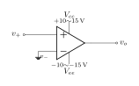

---

##### ∎ 理想特性（先记住三条）

| 理想条件 | 含义 |
|---|---|
| $i_{+}=0,\ i_{-}=0$ | 输入端不吸取电流（输入阻抗极高） |
| $A_d\to\infty$ | 开环差模增益无穷大 |
| 线性区关系 | $v_o=A_d(v_{+}-v_{-})$ |

实际运放（如 **μA741**）开环增益量级约为

$$
A_d\approx 10^5,
$$

仍远大于 1，但**不能**在数学上当作真正的 $\infty$ 去忽略饱和。

---

##### ∎ 开环输出关系与饱和

开环、理想线性区内：

$$
v_o=A_d(v_{+}-v_{-}).
$$

输出还受电源限制：当 $|A_d(v_{+}-v_{-})|$ 超过可提供的 $V_{cc}$ 、$V_{ee}$ 时，$v_o$ **饱和**在正/负电源附近（板书上常记 ceiling / floor，例如 $\pm 10\,\text{V}$）。


转移特性：中间斜率 $\approx A_d$ 极陡；超出线性区后 $v_o$ 贴在 $+V_{\mathrm{sat}}$ 或 $-V_{\mathrm{sat}}$。

---

##### ◇ 例： $v_{-}$ 接地、$v_{+}$ 为正弦

取 $v_{-}=0$ ，$v_{+}=V_m\sin\omega t$。则

$$
v_o=A_d V_m\sin\omega t.
$$

因 $A_d$ 极大（或 $10^5$），几乎任一非零瞬间所需 $v_o$ 都超过 $\pm V_{\mathrm{sat}}$ ，输出在电源极限之间**来回切换**，波形接近**方波**，而不是放大的正弦。


---

##### ⚠ 易错点

- 开环运放**不是**「把正弦线性放大」的常规用法；要做线性放大必须靠后面的**负反馈**（2.1.2 起）。
- $A_d\to\infty$ 是理想极限；讨论饱和时要用 $V_{cc}$ 、$V_{ee}$ （或 $V_{\mathrm{sat}}$）。
- $i_{+}=i_{-}=0$ 是理想输入；实际有微小偏置电流，精密电路才需细抠。

---

##### ✓ 小结

- 理想 OP： $i_{+}=i_{-}=0$ ，$A_d\to\infty$ ，$v_o=A_d(v_{+}-v_{-})$  
- 实际 OP： $A_d\sim 10^5$ 仍很大  
- 无反馈 + 大 $A_d$ → 输出易饱和；正弦进、方波出是正常现象  
- 下一节：用负反馈把增益「压」到可用范围，并引出虚短

#### 2.1.2 Negative Feedback 负反馈

> ◎ 核心：运放通常接成**负反馈**——把输出的一部分送回 $v_{-}$ ，使放大器「纠正」自己的误差，而不是开环硬放大到饱和。

##### ∎ 什么是负反馈

负反馈（negative feedback）指：输出经反馈网络回到**反相端** $v_{-}$。误差信号近似为 $v_{+}-v_{-}$ ，运放据此调节 $v_o$ ，让 $v_{-}$ 跟上 $v_{+}$。  
与 2.1.1 开环方波不同，负反馈把有效增益压到有限、可控的范围，电路才稳定可用。

---

##### ✓ 小结

实用 OP 电路几乎都在负反馈下工作；下一节由 $A_d$ 很大推出 **虚短** $v_{+}\approx v_{-}$。

#### 2.1.3 Virtual Short Circuit 虚短

> ◎ 核心：负反馈 + $A_d$ 极大时，$v_{+}$ 与 $v_{-}$ 被迫几乎相等——称为**虚短**（virtual short）；并非真正短接，而是电压差极小。

##### ∎ 推导（$v_{+}\approx v_{-}$）

开环 $v_o=A_d(v_{+}-v_{-})$。负反馈且未饱和时 $v_o$ 有限，故

$$
v_{+}-v_{-}=\frac{v_o}{A_d}\xrightarrow{A_d\to\infty}0
\quad\Rightarrow\quad
\boxed{v_{+}\approx v_{-}}\quad\text{（虚短）}.
$$

**跟随器接法：** $v_o$ 连回 $v_{-}$ ，则 $v_{-}=v_o$ ，代入得 $v_{-}=\dfrac{A_d}{1+A_d}\,v_{+}\xrightarrow{A_d\to\infty}v_{+}$。

---

##### ⚠ 易错点

- 虚短成立前提是：**负反馈 + 线性区（未饱和）**；开环或饱和时不能直接用 $v_{+}=v_{-}$。
- $i_{+}=i_{-}=0$ 仍成立；虚短说的是**电压**近似相等，不是端子真的连在一起。

---

##### ✓ 小结

$A_d$ 很大 → $(v_{+}-v_{-})=v_o/A_d\approx 0$ → **虚短**；这是后面所有 OP 电路分析的起点。

#### 2.1.4 Voltage Follower 电压追随器

> ◎ 核心：输出直接连 $v_{-}$ 的负反馈电路叫**电压跟随器**；虚短给出 $v_o\approx v_i$。从**输入端**看 $R_{in}\to\infty$ ，从**输出端**看戴维宁 $V_{th}=v_i$ 、$R_{th}\approx 0$ ，负载 $R_L$ 上几乎分到全部输入电压。

##### ∎ 电路与结论

$v_i$ 接 $v_{+}$ ，$v_o$ 反馈到 $v_{-}$：


虚短 → $\boxed{v_o\approx v_i}$ （**buffer**）。

**输入电阻：** $i_{+}=0$ → $R_{in}=v_{+}/i_{+}\to\infty$。

**输出戴维宁：** 开路 $V_{th}=v_i$ ；$v_i=0$ 时负反馈钉住输出 → $R_{out}\approx R_o/(1+A_d)\to 0$。

| 端口 | 理想等效 |
|------|----------|
| 输入 | $R_{in}\to\infty$ |
| 输出 | $V_{th}=v_i$ ，$R_{out}\approx 0$ |


**接 $R_L$：** $v_{R_L}=v_i\dfrac{R_L}{R_{out}+R_L}\approx v_i$ （$R_{out}\ll R_L$）。

---

##### ✓ 小结

- 虚短： $v_{-} \approx v_o$ 、$v_{+} \approx v_i$ → $v_o \approx v_i$  
- 输入端： $R_{in}\to\infty$ ；输出端： $V_{th}=v_i$ ，$R_{th}\approx 0$  
- 接 $R_L$ 时 $v_{R_L}\approx v_i$ ；常用作 buffer

#### 2.1.5 Positive-Gain Amplifier 正增益放大器

> ◎ 核心：在电压跟随器基础上，$v_{-}$ 接 $R_1$–gnd 分压、$R_2$ 从 $v_o$ 反馈到 $v_{-}$ ；虚短给出 $v_{-}=v_i$ ，分压给出 $v_{-}=v_o\beta$ ，故 $v_o=v_i/\beta=(1+R_2/R_1)v_i$——**同相放大**，闭环增益由反馈网络决定。

##### ∎ 电路

$v_i$ 接 $v_{+}$ ；$v_{-}$ 经 $R_1$ 接地，并经 $R_2$ 接 $v_o$ （负反馈）：


定义**反馈因子**（feedback factor）

$$
\beta=\frac{R_1}{R_1+R_2},
$$

即 $v_{-}$ 节点上由 $R_1$ 、$R_2$ 对 $v_o$ 的分压比（$v_{-}$ 对 gnd 的戴维宁等效即此分压器）。

---

##### ∎ 虚短 + 分压 → 闭环增益

负反馈 + $A_d$ 很大 → $v_{+}\approx v_{-}$ ；又 $v_{+}=v_i$ ，故 $v_{-}=v_i$。

$v_{-}$ 处 $i_{-}=0$ ，$R_1$ 、$R_2$ 对 $v_o$ 分压： $v_{-}=v_o\beta$ ，$\beta=R_1/(R_1+R_2)$。联立

$$
\boxed{v_o=\frac{v_i}{\beta}=\left(1+\frac{R_2}{R_1}\right)v_i}.
$$

亦可用 $v_o=\dfrac{A_d}{1+A_d\beta}v_i\xrightarrow{A_d\to\infty}v_i/\beta$。

---

##### ✓ 小结

- 同相放大： $v_i\to v_{+}$ ，$R_1$–gnd + $R_2$ 反馈  
- $\beta=R_1/(R_1+R_2)$ ；虚短 → $v_o=v_i/\beta=(1+R_2/R_1)v_i$  
- 一般式 $v_o=\dfrac{A_d}{1+A_d\beta}v_i$ ；$A_d$ 很大时 $\to v_i/\beta$

#### 2.1.6 Adder 加法器

> ◎ 核心：**同相加法器**——$v_1$ 、$v_2$ 经 $R_3$ 、$R_4$ 在 $v_{+}$ 节点相加，再经 2.1.5 的同相放大 $(1+R_2/R_1)$ 输出；$v_{+}$ 用**叠加原理**求，取 $R_1+R_2=R_3+R_4$ 时 $v_o=\dfrac{R_4}{R_1}v_1+\dfrac{R_3}{R_1}v_2$。

##### ∎ 例题 · 电路

$v_1$ 经 $R_3$ 、$v_2$ 经 $R_4$ 接到 $v_{+}$ ；$v_{-}$ 侧与 2.1.5 相同（$R_1$–gnd，$R_2$ 反馈）：

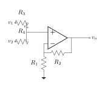

---

##### ∎ $v_{+}$：叠加

$v_2=0$： $v_{+}=v_1 R_4/(R_3+R_4)$ ；$v_1=0$： $v_{+}=v_2 R_3/(R_3+R_4)$。叠加得

$$
\boxed{v_{+}=\frac{R_4 v_1+R_3 v_2}{R_3+R_4}}.
$$

##### ∎ $v_o$：同相放大

虚短 → $v_o=v_{+}(1+R_2/R_1)$。若 **$R_1+R_2=R_3+R_4$**，

$$
\boxed{v_o=\frac{R_4}{R_1}v_1+\frac{R_3}{R_1}v_2}.
$$

（$R_3=R_4=R_1=R_2$ → $v_o=v_1+v_2$。）

---

##### ✓ 小结

- $v_{+}$：叠加 → $v_{+}=\dfrac{R_4 v_1+R_3 v_2}{R_3+R_4}$  
- $v_o=v_{+}(1+R_2/R_1)$ ；$R_1+R_2=R_3+R_4$ → $v_o=\dfrac{R_4}{R_1}v_1+\dfrac{R_3}{R_1}v_2$

#### 2.1.7 Negative-Gain Amplifier 负增益放大器

> ◎ 核心：**反相放大器**——$v_{+}$ 接地，$v_i$ 经 $R_1$ 到 $v_{-}$ ，$R_2$ 从 $v_o$ 负反馈到 $v_{-}$ ；虚地使 $v_{-}\approx 0$ ，同一电流流过 $R_1$ 、$R_2$ ，得 $v_o=-(R_2/R_1)v_i$ （负增益、输出与输入反相）。

##### ∎ 电路

$v_{+}$ 接 gnd；$v_i$ 经 $R_1$ 到 $v_{-}$ ；$R_2$ 连 $v_o$ 与 $v_{-}$ （负反馈）：

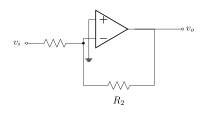

---

##### ∎ 虚地 → 放大公式

$v_{+} = 0$ → 虚地 $v_{-} \approx 0$。$i_{-}=0$ 时

$$
\frac{v_i}{R_1}=\frac{-v_o}{R_2}
\quad\Rightarrow\quad
\boxed{v_o=-\frac{R_2}{R_1}\,v_i}.
$$

---

##### ◇ 例题 1： $R_1=1\,\text{k}\Omega$ ，$R_2=10\,\text{k}\Omega$

$$
v_o=-\frac{10\,\text{k}\Omega}{1\,\text{k}\Omega}\,v_i=-10\,v_i.
$$

正弦 $v_i$ 时，$v_o$ 幅度放大 10 倍且**相位相反**（$180^\circ$）。

---

##### ◇ 例题 2：反相器（Inverter）

板书为**四电阻**接法（与 2.2 差动放大同型）： $v_1$ 经 $R_1$ 到结点 $O$ ，$O$ 接 $v_{+}$ 且经 $R_2$ 接地；$v_2$ 经 $R_3$ 到 $v_{-}$ ；$v_o$ 经 $R_4$ 负反馈到 $v_{-}$。

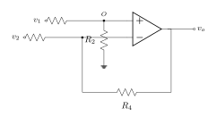

**解（叠加法）：**

$$
v_o=v_1\frac{R_2}{R_1+R_2}\!\left(1+\frac{R_4}{R_3}\right)-\frac{R_4}{R_3}\,v_2.
$$

匹配 $R_1+R_2=R_3+R_4$ 时 $v_o=\dfrac{R_2}{R_3}(v_1-v_2)$。**反相器：** $v_1=0$ 、$v_2=v_i$ 、$R_3=R_4=r$ → $\boxed{v_o=-v_i}$。

---

##### ⚠ 易错点

- 虚地 $v_{-}\approx 0$ 的前提是 $v_{+}=0$ 且**负反馈、线性区**；不能把 $v_{-}$ 与 gnd 真的焊死。
- 公式里是 $v_o=-(R_2/R_1)v_i$ ，负号表示反相；$R_2/R_1$ 才是增益幅度。
- 与同相放大（2.1.5）不同：此处 $v_i$ 接 $v_{-}$ ，$v_{+}$ 接地。

---

##### ✓ 小结

- 反相放大： $v_{+} = 0$ → 虚地 $v_{-} \approx 0$  
- $v_i/R_1=(0-v_o)/R_2$ → $v_o=-(R_2/R_1)v_i$  
- 例题 2：四电阻拓扑，$v_1=0$ 、$v_2=v_i$ 、$R_3=R_4=r$ → $v_o=-v_i$

### 2.2 Differential Amplifier, Instrumentation Amplifier, EKG Measurements, and Voltage and Current Limitations 差动放大器、仪表放大器、心电图量测与电压电流限制

> ◎ 结构：**2.2.1** 单运放差动 → **2.2.2** 三运放仪表放大器（理想）→ **2.2.3** EKG 共模/差模与失配 → **2.2.4** 右脚驱动 → **2.2.5** 实际运放电压/电流极限（饱和、$I_o$ 、失真）。

#### 2.2.1 Differential Amplifier 差动放大器

> ◎ 核心：**单运放四电阻**差动放大（与 [2.1.7 例题 2](#217-negative-gain-amplifier-负增益放大器) 同拓扑）。匹配 $R_1+R_2=R_3+R_4$ 时 $\boxed{v_o=\dfrac{R_2}{R_3}(v_1-v_2)}$ ；反相器为 $v_1=0$ 、$R_3=R_4=r$ 的特例。

##### ∎ 电路

与 2.1.7 例题 2 相同： $v_1$ 经 $R_1$ 到结点 $O$ ，$O$ 接 $v_{+}$ 且经 $R_2$ 接地；$v_2$ 经 $R_3$ 到 $v_{-}$ ；$v_o$ 经 $R_4$ 负反馈到 $v_{-}$。


---

##### ∎ 公式（叠加法）

$$
v_o=v_1\frac{R_2}{R_1+R_2}\!\left(1+\frac{R_4}{R_3}\right)-\frac{R_4}{R_3}\,v_2.
$$

匹配 **$R_1+R_2=R_3+R_4$** 时 $\boxed{v_o=\dfrac{R_2}{R_3}(v_1-v_2)}$。

---

##### ✓ 小结

- 拓扑同 2.1.7 例题 2；$v_o=\dfrac{R_2}{R_3}(v_1-v_2)$ （匹配时）  
- 三运放仪表放大器见 **2.2.2**；EKG 与右脚驱动见 **2.2.3–2.2.4**

#### 2.2.2 Instrumentation Amplifier 仪表放大器

> ◎ 核心：**三运放仪表放大器**——$A_1$ 、$A_2$ 与 $R_1$ 、$R_2$ 组成输入级；$A_3$ 为 2.2.1 型四电阻差动级。$\boxed{v_o=\dfrac{R_4}{R_3}\!\left(1+\dfrac{2R_2}{R_1}\right)(v_1-v_2)}$ ，$A_d=\dfrac{R_4}{R_3}\!\left(1+\dfrac{2R_2}{R_1}\right)$。

##### ∎ 电路

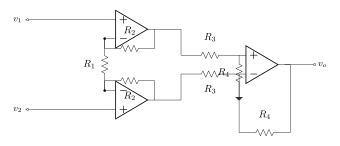

| 级 | 连接 |
|----|------|
| **$A_1$ 、$A_2$** | $v_1$ 、$v_2$ 接各 $v_{+}$ ；$R_2$ 水平负反馈；$R_1$ 竖直跨两 $v_{-}$ |
| **$A_3$** | $v_{o1}\!\to\!R_3\!\to\!v_{+}$ ，$R_4$ 垂直接地；$v_{o2}\!\to\!R_3\!\to\!v_{-}$ ，$R_4$ 自 $v_o$ 反馈（底母线绕行） |

---

##### ∎ 1. 输入级（$A_1$ 、$A_2$）

虚短： $A_1$ 得 $v_a=v_1$ ，$A_2$ 得 $v_b=v_2$。$i_{-}=0$ ，在 $v_a$ 、$v_b$ 列 KCL：

$$
\frac{v_{o1}-v_a}{R_2}+\frac{v_b-v_a}{R_1}=0,\qquad
\frac{v_{o2}-v_b}{R_2}+\frac{v_a-v_b}{R_1}=0.
$$

解得

$$
v_{o1}=v_1+\frac{R_2}{R_1}(v_1-v_2),\quad
v_{o2}=v_2+\frac{R_2}{R_1}(v_2-v_1).
$$

故

$$
\boxed{v_{o1}-v_{o2}=\left(1+\frac{2R_2}{R_1}\right)(v_1-v_2)}.
$$

共模检验： $v_1=v_2=v_{cm}$ → $v_{o1}=v_{o2}=v_{cm}$。

##### ∎ 2. 输出级（$A_3$）

末级同 [2.2.1](#221-differential-amplifier-差动放大器) 四电阻差动，输入换为 $v_{o1}$ 、$v_{o2}$。

$i_{+}=0$： $\dfrac{v_{o1}-v_{+}}{R_3}=\dfrac{v_{+}}{R_4}$ → $v_{+}=v_{o1}\dfrac{R_4}{R_3+R_4}$。

$i_{-}=0$ ，虚短 $v_{-}\approx v_{+}$：

$$
\frac{v_{o2}-v_{-}}{R_3}+\frac{v_o-v_{-}}{R_4}=0
\Rightarrow v_o=v_{+}\left(1+\frac{R_4}{R_3}\right)-\frac{R_4}{R_3}\,v_{o2}.
$$

化简得 $v_o=\dfrac{R_4}{R_3}(v_{o1}-v_{o2})$ ，代入输入级：

$$
\boxed{v_o=\frac{R_4}{R_3}\left(1+\frac{2R_2}{R_1}\right)(v_1-v_2)},\quad
A_d=\frac{R_4}{R_3}\left(1+\frac{2R_2}{R_1}\right).
$$

$v_1=v_2$ 时 $v_o=0$ （理想共模不放大）。

**延伸：** EKG、失配、右脚驱动 → [2.2.3](#223-ekg-measurements-心电图量测)–[2.2.4](#224-right-leg-drive-circuit-右脚驱动电路)。

---

##### ✓ 小结

- 输入级 → $v_{o1}-v_{o2}=(1+2R_2/R_1)(v_1-v_2)$ ；末级同 2.2.1 → $v_o=(R_4/R_3)(v_{o1}-v_{o2})$  
- **$A_d=\dfrac{R_4}{R_3}\!\left(1+\dfrac{2R_2}{R_1}\right)$**；理想时只放大 $v_1-v_2$

#### 2.2.3 EKG Measurements 心电图量测

> ◎ 核心：EKG 电极信号分解为 **差模** $v_d$ （心电）与 **共模** $v_{cm}$ （噪声）。在 [2.2.2](#222-instrumentation-amplifier-仪表放大器) 仪表放大器上，设 **$A_3$ 四电阻均为 $R$ 、误差 $\Delta R$**，则 $v_o$ 呈 **$A_d v_d + A_{cm} v_{cm}$**；仅靠匹配往往不够，需 [2.2.4](#224-right-leg-drive-circuit-右脚驱动电路) **右脚驱动** 进一步压低共模。

##### ∎ 要点

| 量 | 定义 |
|----|------|
| $v_d=v_1-v_2$ | 心电（EKG） |
| $v_{cm}=\tfrac12(v_1+v_2)$ | 共模噪声 |

**理想**（$R_3=R_4=R$ ，$\Delta R=0$）： $v_o=\bigl(1+2R_2/R_1\bigr)v_d$。

**$A_3$ 失配**（板书： $A_3$ 四电阻标称 $R$ ，误差 $\Delta R$）：

$$
v_o=\left(1+\frac{2R_2}{R_1}+\frac{\Delta R}{R}\,\frac{R_2}{R_1}\right)(v_1-v_2)+\frac{\Delta R}{R}\,v_1.
$$

代入 $v_1=\dfrac{v_d}{2}+v_{cm}$ 、$v_2=-\dfrac{v_d}{2}+v_{cm}$ ，因式分解得

$$
\boxed{v_o=
\underbrace{\left(1+\frac{2R_2}{R_1}\right)\!\left(1+\frac{1}{2}\frac{\Delta R}{R}\right)}_{A_d}v_d
+\underbrace{\frac{\Delta R}{R}}_{A_{cm}}v_{cm}}.
$$
$|v_{cm}|\gg|v_d|$ 时易淹没心电 → 精密电阻 + [2.2.4 RLD](#224-right-leg-drive-circuit-右脚驱动电路)。

##### ⚠ 易错点

须把 $\dfrac{\Delta R}{R}v_1$ 中的 $v_1$ 写成 $\dfrac{v_d}{2}+v_{cm}$ 才得到 $A_{cm}v_{cm}$。

##### ✓ 小结

- $v_d$ / $v_{cm}$ 分解；失配时 $v_o=A_d v_d+A_{cm}v_{cm}$  
- 共模过大 → 右脚驱动（2.2.4）

#### 2.2.4 Right-Leg Drive Circuit 右脚驱动电路

> ◎ 核心（板书 + 原理图）：**右脚驱动（RLD）** 从差分输入侧拾取共模 $v_{cm}$ ，经 **反相放大** 与大电阻回馈 **右脚电极**，形成并联负反馈；有效共模 $\dfrac{v_{cm}}{1+R_2/R_1}$。下图为一例 **EKG 采集 + RLD** 工程实现（AD620 仪表放大 + AD705 驱动级）。

##### ∎ 1. EKG 与右脚驱动电路图

**完整原理图**（教材/课程参考，含器件型号与阻值）：

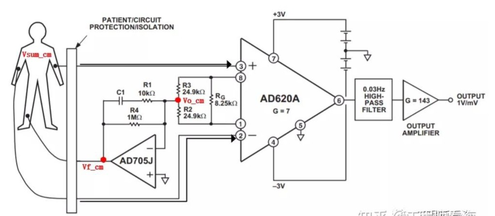

| 模块 | 器件 / 参数 | 作用 |
|------|-------------|------|
| 人体与隔离 | 左/右臂 → 差分输入；**右脚** ← 驱动回送；**PATIENT/CIRCUIT PROTECTION/ISOLATION** | 安全隔离 |
| 仪表放大 | **AD620A**，$G=7$ ，$R_G=8.25\,\mathrm{k}\Omega$ （Pin 1–8）；$\pm 3\,\mathrm{V}$ 供电 | 放大心电差模（对应 [2.2.2](#222-instrumentation-amplifier-仪表放大器)） |
| 共模拾取 | **$R_3=R_2=24.9\,\mathrm{k}\Omega$** 串联于两输入端，中点 **$V_{o,\mathrm{cm}}$** | 估计 $\dfrac{v_1+v_2}{2}\approx v_{cm}$ |
| 右脚驱动 | **AD705J** 反相放大；$v_{+}$ 接地；**$R_4=1\,\mathrm{M}\Omega$** 反馈；**$R_1=10\,\mathrm{k}\Omega$** 与 **$C_1$** 串联支路与 $R_4$ 并联；输出 **$V_{f,\mathrm{cm}}$** → 右脚 | 反相共模回馈（$R_4$ 限制注入电流） |
| 后级 | **0.03 Hz 高通** → 输出放大 $G=143$ → **OUTPUT 1 V/mV** | 去基线漂移、定标输出 |

---

| 原理（三运放 IA） | 本图（AD620/AD705） |
|------------------|---------------------|
| $R_1$ 中点 $\approx v_{cm}$ | $R_2,R_3$ 中点 $V_{o,\mathrm{cm}}$ |
| 反相 + 大电阻 → 右脚 | AD705 + $R_4=1\,\mathrm{M}\Omega$ → $V_{f,\mathrm{cm}}$ |

##### ∎ 2. 并联反馈（板书）

右脚驱动输出记为 $v$ （相对共模的回馈量）。反相放大得

$$
v=-\frac{R_2}{R_1}(v_{cm}+v)
\Rightarrow v=-\frac{R_2/R_1}{1+R_2/R_1}\,v_{cm}.
$$

故**反馈后有效共模**

$$
\boxed{v+v_{cm}=\frac{v_{cm}}{1+R_2/R_1}}.
$$

##### ∎ 3. 代入 2.2.3 的共模项

$$
\boxed{v_o=\left(1+\frac{2R_2}{R_1}\right)\!\left(1+\frac{1}{2}\frac{\Delta R}{R}\right)v_d
+\frac{\Delta R}{R}\cdot\frac{v_{cm}}{1+R_2/R_1}}.
$$
（板书 **due to feedback**：共模项多除以 $1+R_2/R_1$）。

---

##### ⚠ 易错点

- RLD 降低的是 **进入仪表放大器的有效 $v_{cm}$**，不能代替 $A_3$ 的 $\Delta R$ 匹配。  
- $R_{\mathrm{RL}}$ 过小：电流与安全风险；过大：反馈在信号频段内变弱。  
- 右脚电极是 **参考/驱动肢体**，名称固定为 right-leg drive，亦可接其他参考点（原理相同）。

---

##### ✓ 小结

- $v_{\mathrm{mid}}\approx v_{cm}$ ；$v=-\dfrac{R_2/R_1}{1+R_2/R_1}v_{cm}$  
- 有效共模 $\dfrac{v_{cm}}{1+R_2/R_1}$  
- 最终 $v_o=(1+2R_2/R_1)(1+\tfrac12\Delta R/R)v_d+\dfrac{\Delta R}{R}\dfrac{v_{cm}}{1+R_2/R_1}$

#### 2.2.5 Voltage and Current Limitations 电压与电流的极限

> ◎ 核心（板书）：实际运放有 **电源电压**（如 $\pm 15\,\mathrm{V}$）、**饱和输出**（如 $\pm 13\,\mathrm{V}$）、**有限开环增益** $A_d\sim 10^5$ 、**最大输出电流** $|I_o|<13\,\mathrm{mA}$。以 [2.1.5](#215-positive-gain-amplifier-正增益放大器) 同相放大为例： $v_o=V_I(1+R_2/R_1)\sin\omega t$ 过大时 **削顶失真**；退出饱和需 **较长时间**；$I_o$ 受限 → **负载/反馈电阻不能过小**。

##### ∎ 限制一览

| 项目 | 板书例 |
|------|--------|
| 电源 | $\pm 15\,\mathrm{V}$ |
| 饱和摆幅 | $\boxed{-13\,\mathrm{V}<v_o<13\,\mathrm{V}}$ |
| 开环 $A_d$ | $\sim 10^5$ |
| $\lvert I_o\rvert_{\max}$ | $\boxed{<13\,\mathrm{mA}}$ |

##### ∎ 同相例题（$R_1=1\,\mathrm{k}\Omega$ ，$R_2=9\,\mathrm{k}\Omega$ ，增益 $10$）


$v_o=V_I(1+R_2/R_1)\sin\omega t$。**免饱和：** $V_I(1+R_2/R_1)<13\,\mathrm{V}$ → $\boxed{V_I<1.3\,\mathrm{V}}$。


线性区斜率 $1+R_2/R_1$ ；外侧 sat。开环传递特性见 [2.1.1](./image/电子学一/figures/02-op-ideal-transfer-characteristic-plot-01.svg)。

**电流 / 失真：** 电阻过小 → $|I_o|$ 超限；$V_I$ 过大 → 削顶；饱和后 **恢复较慢** → 须留幅度裕量。

---

##### ⚠ 易错点

- **$\pm 15\,\mathrm{V}$ 电源** $\neq$ **$\pm 13\,\mathrm{V}$ 输出**：后者是可达摆幅/饱和电平。  
- 饱和判据用 **峰值** $|v_o|_{\max}$ ，不是 RMS。  
- 电流限制与电压限制 **同时** 存在；只满足 $V_I<1.3\,\mathrm{V}$ 仍可能因 $R$ 太小而违反 $|I_o|<13\,\mathrm{mA}$。

---

##### ✓ 小结

- 实际运放： $A_d\sim 10^5$ ；$v_o\in(-13,+13)\,\mathrm{V}$ （例）；$|I_o|<13\,\mathrm{mA}$  
- 同相例： $v_o=V_I(1+R_2/R_1)\sin\omega t$ ；$R_1=1\,\mathrm{k}$ 、$R_2=9\,\mathrm{k}$ → 增益 $10$ ，$V_I<1.3\,\mathrm{V}$ 免饱和  
- 传递特性：线性区斜率 $1+R_2/R_1$ ；外侧 sat  
- 信号过大 → 失真；饱和后恢复慢；$I_o$ 受限 → 电阻不宜过小

### 2.3 Integrator, Square-to-Triangular Waves Converter, and DC Offset Problem 积分器、方波三角波转换与直流偏移问题

> ◎ 结构：**2.3.1** 理想积分器（时域）→ **2.3.2** $Z_C$ 与转移函数、Bode 图、方波→三角波 → **2.3.3–2.3.4** 直流偏移及其对积分器的影响。

#### 2.3.1 Integrator 积分器

> ◎ 核心：
> - **反相积分器**：$v_+$ 接地；$v_i$ 经 $R$ 到 $v_-$；$C$ 从 $v_o$ 负反馈到 $v_-$
> - 虚地 $v_-\approx 0$ → KCL：$\dfrac{dv_o}{dt}=-\dfrac{v_i}{RC}$
> - $\boxed{v_o=-\dfrac{1}{RC}\displaystyle\int v_i\,dt + K}$

##### ∎ 电路

与 [2.1.7 反相放大器](#217-negative-gain-amplifier-负增益放大器) 同型，反馈电阻 $R_2$ 换为电容 $C$：


| 元件 | 接法 |
|------|------|
| $v_+$ | 接地 |
| $R$ | $v_i\to v_-$ |
| $C$ | $v_o\to v_-$（负反馈） |

---

##### ∎ 虚短（$v_-\approx 0$）

开环 $v_o=A_d(v_+-v_-)$。$v_+=0$，负反馈且输出未饱和时 $v_o$ 有限，故
$$
v_--v_+=\frac{v_o}{A_d}\xrightarrow{A_d\to\infty}0
\quad\Rightarrow\quad
v_+\approx v_-\approx 0\quad\text{（虚地）}.
$$
与 [§2.1.3](#213-virtual-short-circuit-虚短) 相同：靠 **差模电压增益 $A_d$ 很大** + **负反馈** 把 $v_+$、$v_-$ 钳在同一电位。

---

##### ∎ $v_-$ 处 KCL → 积分关系

$i_-=0$。$R$ 上电流 $i_R=v_i/R$（因 $v_-\approx 0$）。$C$ 两端 $v_C=v_o-v_-\approx v_o$，故
$$
i_C=C\frac{dv_o}{dt}.
$$
在 $v_-$ 节点 $i_R+i_C=0$：
$$
\frac{v_i}{R}+C\frac{dv_o}{dt}=0
\quad\Rightarrow\quad
\frac{dv_o}{dt}=-\frac{v_i}{RC}.
$$
积分（$K$ 由初始电容电压 / $t=0$ 条件定）：
$$
\boxed{v_o=-\frac{1}{RC}\int v_i\,dt + K}.
$$

**正弦输入** $v_i=V_m\cos\omega t$ 时，$v_o=-\dfrac{V_m}{\omega RC}\sin\omega t$（幅度随 $\omega$ 增大而减小；相位滞后 $90^\circ$）。

---

##### ∎ 实际运放：积分有上限（饱和）

与 [§2.2.5](#225-voltage-and-current-limitations-电压与电流的极限) 相同，输出只能在 **$\pm V_{\mathrm{sat}}$** 内线性积分（板书例 **$V_{\mathrm{sat}}=13\,\mathrm{V}$**）。对 **恒正** 阶跃 $v_i=V_i$（如 $V_i=1\,\mathrm{V}$），$v_o$ 自 $0$ **线性下降**：
$$
v_o(t)\approx -\frac{V_i}{RC}\,t \quad (0\le t\le t_{\mathrm{sat}}),
$$
直至 $|v_o|=V_{\mathrm{sat}}$ 后 **钳在 $-V_{\mathrm{sat}}$**，不再按 $\int v_i\,dt$ 变化。

**到达饱和的时间**（自 $0$ 积分到 $-V_{\mathrm{sat}}$）：
$$
\boxed{t_{\mathrm{sat}}=\frac{V_{\mathrm{sat}}\,RC}{V_i}}.
$$
**例：** $V_{\mathrm{sat}}=13\,\mathrm{V}$，$V_i=1\,\mathrm{V}$，$RC=1\,\mathrm{ms}$ →
$t_{\mathrm{sat}}=13\times 0.001/1=13\,\mathrm{ms}$。

| 阶跃宽度 $T_{\mathrm{step}}$ | $\lvert v_o\rvert$ 峰值（线性区） | 说明 |
|------------------------------|----------------------|------|
| $10\,\mathrm{ms}$ | $10\,\mathrm{V}$ | $<\!13\,\mathrm{V}$，**未饱和** |
| $\ge 13\,\mathrm{ms}$（$v_i$ 仍为 $1\,\mathrm{V}$） | $13\,\mathrm{V}$ | 进入饱和，$v_o$ 拉平 |

**设计要点：** 阶跃（或方波高电平）持续时间须 **$T_{\mathrm{step}}<t_{\mathrm{sat}}$**，否则积分器先饱和；饱和后负反馈失效、$v_-\not\approx 0$，且如 §2.2.5 **退出饱和很慢**，波形难以回到理想积分直线。故 $RC=1\,\mathrm{ms}$、$V_i=1\,\mathrm{V}$ 时，**$10\,\mathrm{ms}$ 阶跃宜在饱和前结束**（$10\,\mathrm{ms}<13\,\mathrm{ms}$），不要继续让 $v_i$ 保持 $1\,\mathrm{V}$ 积分到 $\pm 13\,\mathrm{V}$。

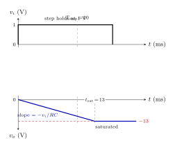

上：$v_i$ 阶跃至 $1\,\mathrm{V}$ 后保持（不再升高）；下：$v_o$ 先以斜率 $-v_i/(RC)$ 下降，$t_{\mathrm{sat}}=13\,\mathrm{ms}$ 处触及 $-13\,\mathrm{V}$ 后 **水平**；虚线标 $T_{\mathrm{step}}\approx 10\,\mathrm{ms}$ 为推荐上限。

---

##### ⚠ 易错点

- 公式前的 **负号**：反相积分；勿写成 $+\dfrac{1}{RC}\int v_i\,dt$。  
- **虚地** 前提是 $v_+=0$ 且线性区、未饱和；饱和后 $v_-\not\approx 0$，积分关系失效。  
- 恒压阶跃不是「想积多久都可以」：$T_{\mathrm{step}}$ 须 $<V_{\mathrm{sat}}RC/V_i$。  
- 理想模型下 **直流** $v_i=\text{常数}$ 会使 $v_o$ 线性漂移直至饱和（见 [2.3.3](#233-dc-offset-problem-直流偏移问题)、[2.4.1](#241-dc-problem-with-the-integrator-积分器直流问题)）。

---

##### ✓ 小结

- 拓扑：$v_+\!=\!0$；$v_i$–$R$–$v_-$；$C$：$v_o\to v_-$  
- $A_d$ 很大 + 负反馈 → $v_-\approx 0$  
- $\dfrac{dv_o}{dt}=-\dfrac{v_i}{RC}$；$v_o=-\dfrac{1}{RC}\int v_i\,dt + K$  
- 实际：$t_{\mathrm{sat}}=V_{\mathrm{sat}}RC/V_i$；阶跃 $T_{\mathrm{step}}<t_{\mathrm{sat}}$（例 $RC=1\,\mathrm{ms}$、$V_i=1\,\mathrm{V}$ → $T_{\mathrm{step}}\lesssim 10\,\mathrm{ms}$）

#### 2.3.2 Square-to-Triangular Waves Converter 方波三角波转换

> ◎ 核心：
> - 用 **$Z_C=1/(j\omega C)$** 求 $H(\omega)=V_o/V_i$ 与 Bode 图
> - **$\omega_0=1/(RC)$** 以下相对 **放大**，以上 **$-20\,\mathrm{dB/dec}$** 缩小 → 频域「积分」
> - 方波经积分器 → **三角波**

##### ∎ 1. 用 $Z_C$ 求转移函数

[2.3.1](#231-integrator-积分器) 电路：$v_+\!=\!0$，$Z_R=R$（$v_i\to v_-$），反馈 $Z_C=1/(j\omega C)$（$v_o\to v_-$）。虚地 + $i_-=0$：
$$
\frac{V_i}{R}+\frac{V_o}{Z_C}=0
\quad\Rightarrow\quad
\boxed{H(\omega)=\frac{V_o}{V_i}=-\frac{Z_C}{R}=-\frac{1}{j\omega RC}}.
$$
（亦见 [电子学一 · 1.8.1](../电子学一.md#181-impedance-c-in-the-phasor-analysis-相量分析中的电容阻抗) $Z_C=1/(j\omega C)$。）

令 **$\omega_0=1/(RC)$**，则
$$
H(\omega)=-\frac{\omega_0}{j\omega}.
$$

---

##### ∎ 2. 幅值与相位

$$
|H(\omega)|=\frac{1}{\omega RC}=\frac{\omega_0}{\omega},
\qquad
\angle H(\omega)=-90^\circ.
$$

dB 幅值（取 $|H|$）：
$$
\boxed{G_{\mathrm{dB}}=20\log_{10}|H|=20\log_{10}\frac{\omega_0}{\omega}
=-20\log_{10}\frac{\omega}{\omega_0}}.
$$

在 **$\omega=\omega_0$** 处 $|H|=1$（**$0\,\mathrm{dB}$**）；$\omega$ 每增 10 倍，增益降 **$20\,\mathrm{dB}$**（斜率 **$-20\,\mathrm{dB/dec}$**）。

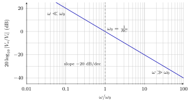

---

##### ∎ 3. 频域上什么是「积分」

- **$\omega\ll\omega_0$**（低频）：$\lvert H\rvert\gg 1$，Bode 图左侧抬高 → 低频分量相对 **放大**，时域上表现为 **累积**（直流则持续积分直至饱和，见 [2.3.1](#231-integrator-积分器)）。
- **$\omega\gg\omega_0$**（高频）：$\lvert H\rvert\ll 1$，以 $-20\,\mathrm{dB/dec}$ 下降 → 高频分量 **缩小**，快速变化被抑制。
- **$\omega=\omega_0$**（转折）：$\lvert H\rvert=1$（$0\,\mathrm{dB}$）→ 幅频参考点。

一句话：**积分器在频域里压低 $\omega>\omega_0$ 的成分、相对保留 $\omega<\omega_0$ 的成分**；时域 $\dfrac{dv_o}{dt}\propto v_i$ 与「对输入求积分」在正弦稳态下等价于乘以 $\dfrac{1}{j\omega}$。

**正弦检验：** $v_i=V_m\cos\omega t$ → $v_o=-\dfrac{V_m}{\omega RC}\sin\omega t$，$\lvert v_o\rvert/\lvert v_i\rvert=1/(\omega RC)$，与上列三条一致。

---

##### ∎ 4. 方波 → 三角波（应用）

理想 **方波** 含基频与奇次谐波。经积分器后，各分量乘以 $\dfrac{1}{j\omega}$（幅度 $\propto 1/\omega$、相位 $-90^\circ$）：
- **基频** 相对最强 → 输出接近 **三角波**；
- 高频谐波被 **$|H|$** 额外压低 → 波形比输入方波 **圆滑**。

故 [2.3.1](#231-integrator-积分器) 积分器作 **方波–三角波转换器** 时，输入方波频率应 **$\ll f_0=\omega_0/(2\pi)=1/(2\pi RC)$**，并注意 [2.3.1](#231-integrator-积分器) 饱和对阶跃/直流分量的限制。

---

##### ⚠ 易错点

- $|H|$ 随 $\omega$ **增大而减小**（高通？否——是 **积分**，低频增益高）；勿与 RC **低通** $|T|=1/\sqrt{1+(\omega/\omega_0)^2}$ 混淆。  
- 相位 **恒为 $-90^\circ$**（反相积分）；幅值 Bode 与 [1.7.3](../电子学一.md#173-bode-plots-波特图) 画法相同，但斜率方向相反。  
- 方波转三角波仍须在 **线性区** 且 $f\ll f_0$，否则失真或饱和。

---

##### ✓ 小结

- $H(\omega)=-1/(j\omega RC)$；$\omega_0=1/(RC)$  
- $|H|=\omega_0/\omega$；$G_{\mathrm{dB}}=-20\log_{10}(\omega/\omega_0)$；$\angle H=-90^\circ$  
- $\omega<\omega_0$ 相对放大，$\omega>\omega_0$ 缩小（$-20\,\mathrm{dB/dec}$）→ 频域「积分」  
- 方波 → 三角波：基频主导 + 高频衰减

#### 2.3.3 DC Offset Problem 直流偏移问题

> ◎ 核心：
> - 实际运放 **必有** $V_{\mathrm{of}}$、$I_B$ 等；**无法彻底消除**
> - 积分器对直流 / 近直流 **特别敏感** → 无输入也会 **漂移**
> - 最终可能 **饱和**（见 [2.3.4](#234-effect-of-offset-on-integrator-直流偏移对积分器的影响)）

##### ∎ 偏移从哪来

| 来源 | 说明 |
|------|------|
| 输入失调电压 $V_{\mathrm{of}}$（$V_{OS}$） | $v_+$ 与 $v_-$ 理想应相等时仍存在的差值 |
| 输入偏置电流 $I_B$ | $i_+$、$i_-$ 不完全为零，经 $R$ 产生附加压降 |
| 输出失调、温漂 | 温度、老化、电源变动、PCB 热梯度 |
| 电源纹波（低频） | 在积分器上近似当作慢变直流扰动 |

这些在 **任何** 实际运放上都存在，只能 **规格化**（选低 $V_{OS}$、低 $I_B$ 型号）、**补偿**（调零脚、外接 RC 反馈电阻，见 [2.4.2](#242-integrator-with-additional-resistance-积分器外加电阻)），不能指望理想模型里 $V_{\mathrm{of}}=0$。

---

##### ∎ 对积分器为何特别严重

[2.3.2](#232-square-to-triangular-waves-converter-方波三角波转换)：**$\omega\ll\omega_0$ 的分量相对放大**；**直流 ($\omega=0$) 增益理论上趋于无穷**。因此：

- 即使 $v_i=0$，运放自身的 $V_{\mathrm{of}}$、$I_B$ 也会在 $R$ 上形成 **等效输入**；
- 电容 $C$ 把该等效直流 **积进** $v_o$ → 输出 **线性漂移**（斜率恒定），与 [2.3.1](#231-integrator-积分器) 阶跃积分类似；
- 一段时间后会触及 $\pm V_{\mathrm{sat}}$（例 $\pm 13\,\mathrm{V}$），**饱和后** 负反馈失效，电路不再按理想积分器工作。

故：**不是「输入为零输出就为零」**，而是 **「输入为零，输出仍会自己积分到饱和」**——这是积分器在系统设计中必须单独处理的问题。

---

##### ⚠ 易错点

- 偏移与 **信号幅度** 无关：$v_i=0$ 也会漂移。  
- 饱和后不能再用 [2.3.1](#231-integrator-积分器) 的 $v_o=-\dfrac{1}{RC}\int v_i\,dt$。  
- 频域上「$\omega<\omega_0$ 放大」包含 **直流**，不能把希望滤掉的慢漂当成「有用低频」。

---

##### ✓ 小结

- 实际运放必有 $V_{\mathrm{of}}$、$I_B$ 等；温漂与电路环境会改变其大小  
- 积分器对直流 / 近直流 **特别敏感** → 无输入也会漂移  
- 最终可能饱和；需建模（2.3.4）与电路对策（2.4）

#### 2.3.4 Effect of Offset on Integrator 直流偏移对积分器的影响

> ◎ 核心：
> - 失调等效输入 **$V_{\mathrm{of}}/A_d$**
> - $v_i=0$：$v_o=\dfrac{V_{\mathrm{of}}}{A_d}-\dfrac{V_{\mathrm{of}}}{RC}\,t$ → **仍会饱和**
> - $t_{\mathrm{sat}}\approx V_{\mathrm{sat}}RC/V_{\mathrm{of}}$（例 $V_{\mathrm{sat}}=13\,\mathrm{V}$）

##### ∎ 等效输入：$V_{\mathrm{of}}/A_d$

实际运放用 **有限** $A_d$ 与失调电压 $V_{\mathrm{of}}$ 描述。闭环时，可把输入侧看成在理想 $v_i$ 之外多了一项失调贡献；与 [2.1.7](#217-negative-gain-amplifier-负增益放大器) 反相放大器记法一致，令反馈分压因子
$$
\beta=\frac{R_1}{R_1+R_2}.
$$
（[2.3.1](#231-integrator-积分器) 取 **$R_1=R$**（$v_i\to v_-$ 的电阻）；交流时反馈元件为 $C$，$\beta$ 用于 **失调 / 低频** 的等效分析，与电阻反馈闭环形式相同。）

等效到输入端的小信号失调项可写为 **$\dfrac{V_{\mathrm{of}}}{A_d}$**（$A_d$ 很大时很小，但 **不为零**）。分析时视作
$$
v_{i,\mathrm{eff}}=v_i+\frac{V_{\mathrm{of}}}{A_d}.
$$

---

##### ∎ $v_i=0$ 时的输出

在 [2.3.1](#231-integrator-积分器) 上，除 $v_i$ 外再计入失调引起的等效输入。令 **$v_i=0$**，由积分关系（与 $\dfrac{dv_o}{dt}=-\dfrac{v_{i,\mathrm{eff}}}{RC}$ 同类）得
$$
\boxed{
v_o(t)=\frac{V_{\mathrm{of}}}{A_d}-\frac{V_{\mathrm{of}}}{RC}\,t+K
}.
$$

| 项 | 含义 |
|----|------|
| $\dfrac{V_{\mathrm{of}}}{A_d}$ | 有限 $A_d$ 下闭环「残余」失调（通常很小） |
| $-\dfrac{V_{\mathrm{of}}}{RC}\,t$ | **失调被积分** 的主项 → 输出 **恒速漂移** |
| $K$ | 电容初始电压等 |

因 $A_d\sim 10^5$ 量级（[§2.2.5](#225-voltage-and-current-limitations-电压与电流的极限)），$\dfrac{V_{\mathrm{of}}}{A_d}$ 往往远小于 $\dfrac{V_{\mathrm{of}}\,t}{RC}$，**饱和时间主要由斜坡项决定**。

---

##### ∎ 饱和时间（$V_{\mathrm{sat}}=13\,\mathrm{V}$ 例）

设漂移朝 $-V_{\mathrm{sat}}$ 方向，忽略 $\dfrac{V_{\mathrm{of}}}{A_d}$ 的微小初值，令 $|v_o|=V_{\mathrm{sat}}$：
$$
\frac{V_{\mathrm{of}}}{RC}\,t_{\mathrm{sat}}\approx V_{\mathrm{sat}}
\quad\Rightarrow\quad
\boxed{t_{\mathrm{sat}}\approx\frac{V_{\mathrm{sat}}\,RC}{V_{\mathrm{of}}}}.
$$

**例：** $V_{\mathrm{sat}}=13\,\mathrm{V}$，$RC=1\,\mathrm{ms}$，$V_{\mathrm{of}}=5\,\mathrm{mV}$ →
$t_{\mathrm{sat}}\approx 13\times 0.001/0.005=2.6\,\mathrm{s}$。

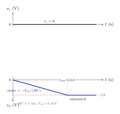

上：$v_i=0$；下：仅由失调积分，$v_o$ 以斜率 $-V_{\mathrm{of}}/(RC)$ 漂向 $-V_{\mathrm{sat}}$，约 $2.6\,\mathrm{s}$ 饱和后钳在 $-13\,\mathrm{V}$（与 [2.3.1](#231-integrator-积分器) 阶跃饱和波形对照）。

可见：**即使无信号输入**，积分器也会在 **秒级**（取决于 $V_{\mathrm{of}}$、$RC$）内漂入饱和——这就是 [2.3.3](#233-dc-offset-problem-直流偏移问题) 的定量后果。对比 [2.3.1](#231-integrator-积分器) 有信号时 $t_{\mathrm{sat}}=V_{\mathrm{sat}}RC/V_i$：偏移相当于在 **不断施加一个极小的有效直流 $V_{\mathrm{of}}$**。

---

##### ∎ 一般输入（叠加）

$v_i\neq 0$ 时，理想部分与失调引起的漂移 **叠加**：
$$
v_o(t)=-\frac{1}{RC}\int v_i\,dt+\frac{V_{\mathrm{of}}}{A_d}-\frac{V_{\mathrm{of}}}{RC}\,t+K.
$$
设计时必须为 **信号积分幅度 + 失调漂移** 同时留出摆幅裕量，或用电阻与 $C$ 并联限制直流增益（[2.4.2](#242-integrator-with-additional-resistance-积分器外加电阻)）。

---

##### ⚠ 易错点

- $V_{\mathrm{of}}/A_d$ **不是** 输出最终停留值；长时间后仍以 $-V_{\mathrm{of}}/(RC)$ 漂移为主。  
- 勿把 $V_{\mathrm{of}}$ 与信号 $V_i$ 混用：饱和公式 $V_{\mathrm{sat}}RC/V_i$ 针对 **输入阶跃**；失调用 $V_{\mathrm{sat}}RC/V_{\mathrm{of}}$。  
- $\beta$ 在纯 $C$ 反馈的积分器里 **直流不成立**；此处 $\beta$ 仅在与电阻反馈相同的 **失调等效模型** 中出现。

---

##### ✓ 小结

- 等效失调输入 $\propto V_{\mathrm{of}}/A_d$；$\beta=R_1/(R_1+R_2)$，$R_1=R$  
- $v_i=0$：$v_o=\dfrac{V_{\mathrm{of}}}{A_d}-\dfrac{V_{\mathrm{of}}}{RC}\,t$  
- $t_{\mathrm{sat}}\approx\dfrac{V_{\mathrm{sat}}\,RC}{V_{\mathrm{of}}}$（例 $13\,\mathrm{V}$）  
- 与信号响应叠加；需限幅或改电路（2.4）

### 2.4 Integrator with Additional Resistance, Bode Plots, Differentiator, and Solving a Differential Equation 积分器外加电阻、波特图、微分器与微分方程求解

> ◎ 结构：**2.4.1** 直流问题回顾 → **2.4.2** 反馈并联 $R_f$、KCL 建微分方程并求解 → **2.4.3** Bode 图 → **2.4.4–2.4.6** 微分器与方程应用。

#### 2.4.1 DC Problem with the Integrator 积分器直流问题

> ◎ 核心：
> - 理想积分器 **$\omega=0$** 增益无穷，直流与失调 **无法稳定**
> - 与 [2.3.3](#233-dc-offset-problem-直流偏移问题)–[2.3.4](#234-effect-of-offset-on-integrator-直流偏移对积分器的影响) **同问题**
> - 对策：**反馈并联 $R_f$** → [2.4.2](#242-integrator-with-additional-resistance-积分器外加电阻)

#### 2.4.2 Integrator with Additional Resistance 积分器外加电阻

> ◎ 核心：
> - 反馈 **$C\parallel R_f$**（板书 **§ Add $R_f$**）
> - KCL → $\tau\,\dot v_c+(R/R_f)v_c=v_i+V_{\mathrm{of}}/A_d$，$\tau=R_f C$
> - **瞬态+稳态**：$v_{\mathrm{ss}}=(R_f/R)(v_i+V_{\mathrm{of}}/A_d)$，$v_c=v_{\mathrm{ss}}+(v_c(0)-v_{\mathrm{ss}})e^{-t/\tau}$
> - 失调不再漂向饱和（对比 [2.3.4](#234-effect-of-offset-on-integrator-直流偏移对积分器的影响)）


$v_c$ 为 $C\parallel R_f$ 两端电压（$+$ 在 $v_o$ 侧）；$v_-\approx 0$ 时 $v_c\approx v_o$。

##### ∎ KCL 与标准形

$i_-=0$，$v_-$ 处：
$$
\frac{v_i}{R}=\frac{v_c}{R_f}+C\frac{dv_c}{dt}
\quad\Rightarrow\quad
\boxed{RC\,\frac{dv_c}{dt}+\frac{R}{R_f}\,v_c=v_i+\frac{V_{\mathrm{of}}}{A_d}},\quad \tau=R_f C.
$$
（$v_i=0$ 时右端只剩失调项，与 [2.3.4](#234-effect-of-offset-on-integrator-直流偏移对积分器的影响) 板书同型。）

##### ∎ 瞬态 + 稳态

设 $v_c=v_{\mathrm{ss}}+v_{\mathrm{tr}}$。**稳态**（$\dot v_c=0$，常数 $v_i$、失调）：
$$
\boxed{v_{\mathrm{ss}}=\frac{R_f}{R}\left(v_i+\frac{V_{\mathrm{of}}}{A_d}\right)}.
$$
**瞬态**（代回得 $\tau\,\dot v_{\mathrm{tr}}+v_{\mathrm{tr}}=0$）：
$$
\boxed{v_c(t)=v_{\mathrm{ss}}+\bigl(v_c(0)-v_{\mathrm{ss}}\bigr)e^{-t/\tau}}.
$$
（拆法细节见 [附录 A](#附录-a-两种解法同一答案)。）

**失调、$v_i=0$、$v_c(0)=0$** → $v_c(t)=\dfrac{R_f}{R}\dfrac{V_{\mathrm{of}}}{A_d}(1-e^{-t/\tau})$，趋于有限 $V_\infty=\dfrac{R_f}{R}\dfrac{V_{\mathrm{of}}}{A_d}$，**不再** 像纯积分器那样 $\propto t$ 直至饱和；直流增益 **$R_f/R$**（有限）。

**正弦** $v_i=V_m\cos\omega t$（略失调）：$\dfrac{V_i}{R}=\dfrac{V_c}{R_f}+j\omega C V_c$ → $H(\omega)=-\dfrac{R_f/R}{1+j\omega R_f C}$（一阶低通 × 有限直流增益；Bode 见 [2.4.3](#243-bode-plots-of-integrator-积分器波特图)）。$\omega\gg 1/\tau$ 时仍近似 [2.3.1](#231-integrator-积分器) 积分。

##### ⚠ 易错点

- $R_f$ 须与 $C$ **并联**于 $v_o$–$v_-$；$\tau=R_f C$ 是 **反馈** 时间常数，不是 $RC$。  
- $R_f$ 过大 → 仍近似理想积分、失调慢饱和；过小 → 低频积分被削弱。

##### ✓ 小结

- $RC\,\dot v_c+(R/R_f)v_c=v_i+V_{\mathrm{of}}/A_d$；$v_c=v_{\mathrm{ss}}+(v_c(0)-v_{\mathrm{ss}})e^{-t/\tau}$  
- 失调：$v_c=V_\infty(1-e^{-t/\tau})$，$V_\infty=\dfrac{R_f}{R}\dfrac{V_{\mathrm{of}}}{A_d}$

#### 2.4.3 Bode Plots of Integrator 积分器波特图

> ◎ 核心：
> - $C\parallel R_f$ 积分器 **低频平坦**：$\lvert H\rvert\to R_f/R$
> - **$\omega_0=1/(R_f C)$** 起 **$-20\,\mathrm{dB/dec}$** 滚降
> - **$\omega\gg\omega_0$** 与 [2.3.2](#232-square-to-triangular-waves-converter-方波三角波转换) 理想积分器 **同斜率**
> - 相对直流归一化：$\lvert H\rvert/(R_f/R)=1/\sqrt{1+(\omega/\omega_0)^2}$

##### ∎ 频域 $H(\omega)$

[2.4.2](#242-integrator-with-additional-resistance-积分器外加电阻) KCL 相量式 $\dfrac{V_i}{R}=\dfrac{V_c}{R_f}+j\omega C V_c$，$v_o\approx -v_c$：
$$
\boxed{
H(\omega)=\frac{V_o}{V_i}
=-\frac{R_f/R}{1+j\omega R_f C}
=-\frac{R_f/R}{1+j\,\omega/\omega_0},
\qquad \omega_0=\frac{1}{R_f C}.
}
$$

##### ∎ 幅值与 Bode

$$
\lvert H(\omega)\rvert=\frac{R_f/R}{\sqrt{1+(\omega/\omega_0)^2}},
\qquad
G_{\mathrm{dB}}=20\log_{10}\frac{R_f}{R}-10\log_{10}\!\left(1+\frac{\omega^2}{\omega_0^2}\right).
$$

- **$\omega\ll\omega_0$**：$\lvert H\rvert\to R_f/R$（平坦）——[2.4.2](#242-integrator-with-additional-resistance-积分器外加电阻) 稳态有限直流增益
- **$\omega=\omega_0$**：$\lvert H\rvert=(R_f/R)/\sqrt{2}$（相对 DC $\approx -3\,\mathrm{dB}$）——转折
- **$\omega\gg\omega_0$**：$\lvert H\rvert\approx 1/(\omega RC)$——与理想积分器同 **$-20\,\mathrm{dB/dec}$**

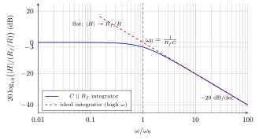

图：纵轴为 **相对直流** $20\log_{10}(\lvert H\rvert/(R_f/R))$；实线 **$C\parallel R_f$** 低频平坦、$\omega_0$ 后滚降；虚线为 [2.3.2](#232-square-to-triangular-waves-converter-方波三角波转换) **理想积分器** 渐近线（$\omega\gg\omega_0$ 重合）。

**相位：** $\angle H=-180^\circ-\arctan(\omega/\omega_0)$（DC 反相 $\to$ 高频 $\to -270^\circ$ 即 $+90^\circ$ 积分相）。

##### ⚠ 易错点

- $\omega_0=1/(R_f C)$ 由 **$R_f$** 定，不是 [2.3.2](#232-square-to-triangular-waves-converter-方波三角波转换) 的 $1/(RC)$。  
- 低频 **不** 再随 $\omega$ 升高（理想积分器 $\lvert H\rvert\propto 1/\omega$ 全频段）；只有 **$\omega\gg\omega_0$** 才像积分器。

##### ✓ 小结

- $H(\omega)=-(R_f/R)/(1+j\omega/\omega_0)$；$\omega_0=1/(R_f C)$  
- 低频 $\lvert H\rvert\to R_f/R$；$\omega\gg\omega_0$：$-20\,\mathrm{dB/dec}$，$\approx$ 理想积分器

#### 2.4.4 Differentiator 微分器

> ◎ 核心：
> - **反相微分器**：与 [2.3.1](#231-integrator-积分器) **对偶**——输入 **$C$**，反馈 **$R$**
> - 虚地 → KCL：$v_o=-RC\,\dfrac{dv_i}{dt}$
> - 频域 $H(\omega)=-j\omega RC$；$\lvert H\rvert=\omega/\omega_0$，**$+20\,\mathrm{dB/dec}$**（$\omega_0=1/(RC)$）
> - 三角波 → 方波；高频噪声被 **放大** → [2.4.5](#245-differentiator-with-additional-resistance-微分器外加电阻)

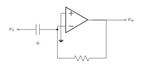

与 [2.3.1](#231-integrator-积分器) 互换 $R$、$C$：$v_+\!=\!0$；$v_i$ 经 **$C$** 到 $v_-$；**$R$** 从 $v_o$ 负反馈到 $v_-$。

##### ∎ 虚地 + KCL → 微分关系

$v_-\approx 0$（同 [2.3.1](#231-integrator-积分器)）。$C$ 上 $i_C=C\,\dfrac{d(v_i-v_-)}{dt}\approx C\,\dfrac{dv_i}{dt}$；$R$ 上 $v_R=v_o-v_-\approx v_o$。$i_-=0$：
$$
C\frac{dv_i}{dt}+\frac{v_o}{R}=0
\quad\Rightarrow\quad
\boxed{v_o=-RC\,\frac{dv_i}{dt}}.
$$

**正弦** $v_i=V_m\cos\omega t$ → $v_o=RC\omega V_m\sin\omega t$（幅度 **随 $\omega$ 增大**；相对输入 **超前 $90^\circ$**，再叠加反相）。

##### ∎ 频域 $H(\omega)$ 与 Bode

用 $Z_C=1/(j\omega C)$（[1.8.1](../电子学一.md#181-impedance-c-in-the-phasor-analysis-相量分析中的电容阻抗)）。$Z_C$ 接输入、$Z_R=R$ 反馈，虚地 + $i_-=0$：
$$
\frac{V_i}{Z_C}+\frac{V_o}{R}=0
\quad\Rightarrow\quad
\boxed{H(\omega)=\frac{V_o}{V_i}=-j\omega RC=-j\,\frac{\omega}{\omega_0}},
\qquad \omega_0=\frac{1}{RC}.
$$

$$
\lvert H\rvert=\omega RC=\frac{\omega}{\omega_0},
\qquad
\angle H=-90^\circ,
\qquad
G_{\mathrm{dB}}=20\log_{10}\frac{\omega}{\omega_0}.
$$

- **$\omega\ll\omega_0$**：$\lvert H\rvert\ll 1$，低频 **缩小**（与 [2.3.2](#232-square-to-triangular-waves-converter-方波三角波转换) 相反）
- **$\omega=\omega_0$**：$\lvert H\rvert=1$（$0\,\mathrm{dB}$）
- **$\omega\gg\omega_0$**：$\lvert H\rvert\propto\omega$，**$+20\,\mathrm{dB/dec}$** → 频域「微分」

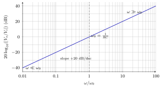

图：$G_{\mathrm{dB}}=20\log_{10}(\omega/\omega_0)$；$\omega=\omega_0$ 处 **$0\,\mathrm{dB}$**；斜率 **$+20\,\mathrm{dB/dec}$**（与 [2.3.2](#232-square-to-triangular-waves-converter-方波三角波转换) 积分器 **相反**）。

**应用：** 三角波各谐波 $\propto 1/\omega$ 经 **$H\propto j\omega$** 补偿 → 输出接近 **方波**（与 [2.3.2](#232-square-to-triangular-waves-converter-方波三角波转换) 方波→三角波 **对偶**）。

##### ∎ 实际限制

理想微分器 **$\omega\to\infty$ 增益 $\to\infty$** → 高频噪声、运放 **带宽 / 迴转率** 限制；输入突变时 $dv_i/dt$ 很大 → 易 **饱和**（[§2.2.5](#225-voltage-and-current-limitations-电压与电流的极限)）。对策：输入 **$C$ 串 $R$** → [2.4.5](#245-differentiator-with-additional-resistance-微分器外加电阻)。

##### ⚠ 易错点

- 与积分器 **元件位置对调**：$C$ 在 **输入**，$R$ 在 **反馈**；勿与 [2.4.2](#242-integrator-with-additional-resistance-积分器外加电阻) 的 $R_f\parallel C$ 混淆。  
- $\lvert H\rvert$ 随 $\omega$ **增大**（$+20\,\mathrm{dB/dec}$），不是积分器的 $-20\,\mathrm{dB/dec}$。

##### ✓ 小结

- $v_o=-RC\,\dot v_i$；$H(\omega)=-j\omega RC$；$\omega_0=1/(RC)$  
- Bode：$\omega<\omega_0$ 缩小，$\omega>\omega_0$ 以 $+20\,\mathrm{dB/dec}$ 放大  
- 三角波 → 方波；实用须限高频（2.4.5）

#### 2.4.5 Differentiator with Additional Resistance 微分器外加电阻

> ◎ 核心：
> - [2.4.4](#244-differentiator-微分器) 输入 **$C$ 串 $R$**（与 [2.4.2](#242-integrator-with-additional-resistance-积分器外加电阻) **对偶**）
> - $Z_{\mathrm{in}}=R+1/(j\omega C)$ → $H(\omega)=-j\omega R_f C/(1+j\omega RC)$；常取 $R_f=R$，$\omega_0=1/(RC)$
> - **$\omega\ll\omega_0$**：仍 **$+20\,\mathrm{dB/dec}$**（近似理想微分）；**$\omega\gg\omega_0$**：$\lvert H\rvert\to R_f/R$（**限高频**）
> - 抑制噪声放大、减轻饱和；设计时在「微分带宽」与「高频平坦」间折中

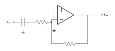

在 [2.4.4](#244-differentiator-微分器) 的 **$C$** 与 $v_-$ 之间 **串 $R$**；反馈 **$R$** 不变（两电阻常为 **同值 $R$**）。

##### ∎ 频域 $H(\omega)$

输入阻抗 $Z_{\mathrm{in}}=R+Z_C=R+\dfrac{1}{j\omega C}=\dfrac{1+j\omega RC}{j\omega C}$。反相结构 $H=-R_f/Z_{\mathrm{in}}$（同 [2.4.4](#244-differentiator-微分器) 对 [2.3.1](#231-integrator-积分器)）：
$$
\boxed{
H(\omega)=-\frac{R_f\,j\omega C}{1+j\omega RC}
=-\frac{R_f/R}{1+j\,\omega/\omega_0}\cdot j\,\frac{\omega}{\omega_0},
\qquad \omega_0=\frac{1}{RC}.
}
$$
（$R$ 为输入串联电阻；$R_f$ 为反馈电阻。）

##### ∎ 幅值与 Bode

$$
\lvert H\rvert=\frac{R_f}{R}\cdot\frac{\omega/\omega_0}{\sqrt{1+(\omega/\omega_0)^2}},
\qquad
G_{\mathrm{dB}}=20\log_{10}\frac{R_f}{R}+20\log_{10}\frac{\omega}{\omega_0}-10\log_{10}\!\left(1+\frac{\omega^2}{\omega_0^2}\right).
$$

- **$\omega\ll\omega_0$**：$\lvert H\rvert\approx (R_f/R)(\omega/\omega_0)$——与 [2.4.4](#244-differentiator-微分器) 同 **$+20\,\mathrm{dB/dec}$**
- **$\omega=\omega_0$**：$\lvert H\rvert=(R_f/R)/\sqrt{2}$（相对高频平坦 $\approx -3\,\mathrm{dB}$）
- **$\omega\gg\omega_0$**：$\lvert H\rvert\to R_f/R$——**不再**随 $\omega$ 无限增大

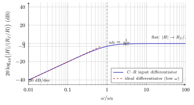

图：纵轴 **相对高频** $20\log_{10}(\lvert H\rvert/(R_f/R))$；实线 **$C$–$R$** 输入、$\omega_0$ 后 **平坦**；虚线为 [2.4.4](#244-differentiator-微分器) **理想微分器** 渐近线（$\omega\ll\omega_0$ 重合）。

**相位：** $\angle H=-90^\circ-\arctan(\omega/\omega_0)$（低频近 $-90^\circ$ → 高频 $\to -180^\circ$）。

##### ∎ 为何加 $R$

- **高频噪声**（[2.4.4](#244-differentiator-微分器) $\lvert H\rvert\propto\omega$）→ $\omega\gg\omega_0$ 增益 **封顶** $R_f/R$
- **输入突变** $dv_i/dt$ 大、易饱和 → 高频分量被 **滚降**
- 理想 $\omega\to\infty$ 增益 $\to\infty$ → 一阶 **高通型** 微分，带宽 $\sim\omega_0$

$R$ **过小** → 仍近理想微分、噪声大；$R$ **过大** → 微分频段变窄、三角→方波变差。

##### ⚠ 易错点

- 外加 **$R$ 在输入**（与 $C$ **串联**），不是 [2.4.2](#242-integrator-with-additional-resistance-积分器外加电阻) 反馈并联 $R_f$。  
- $\omega_0=1/(RC)$ 由 **输入** $R$、$C$ 定；与 [2.4.4](#244-differentiator-微分器) 理想式同形式，但 **高频不再** $+20\,\mathrm{dB/dec}$。

##### ✓ 小结

- $H(\omega)=-R_f j\omega C/(1+j\omega RC)$；$\omega_0=1/(RC)$  
- 低频像微分器；$\omega\gg\omega_0$：$\lvert H\rvert\to R_f/R$  
- 实用微分：限高频噪声与饱和（对偶 [2.4.2](#242-integrator-with-additional-resistance-积分器外加电阻) 限直流漂移）

#### 2.4.6 Solving a Differential Equation 解一微分方程

> ◎ 核心（扩展见识）：**电压 = 变量**，用 [2.1.6](#216-adder-加法器) 加减、[2.1.7](#217-negative-gain-amplifier-负增益放大器) 定系数、[2.3.1](#231-integrator-积分器) 积分，搭成闭环 **实时** 跑微分方程（模拟计算机）；少用 [2.4.4](#244-differentiator-微分器) 微分。

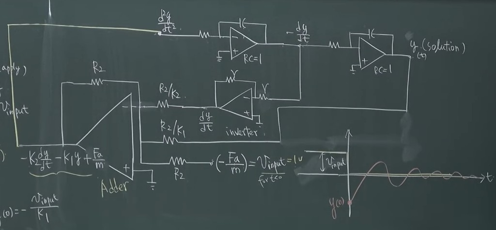

**质量–弹簧–阻尼**（板书例）：
$$
M\frac{d^2y}{dt^2}+B\frac{dy}{dt}+Ky=f(t)
\quad\Rightarrow\quad
\frac{d^2y}{dt^2}=-K_2\frac{dy}{dt}-K_1 y+\frac{f(t)}{M}.
$$
（$K_2=B/M$，$K_1=K/M$；电阻比设定系数。）

- 左：**加法器** 把 $\dot y$、$y$、输入 $V_{\mathrm{input}}$ 合成 **$\ddot y$**
- 上：**两个积分器**（$RC=1$）→ $-\dot y$ → **$y(t)$**（solution）
- 中间 **反相器** 把 $-\dot y$ 变回 $\dot y$ 送入加法器
- 右下：阶跃输入 → **阻尼振荡** 波形

更完整的积木说明与可调参数仿真见 [I4CY · Analogue Computing](https://www.i4cy.com/analog_computing/)。

##### ✓ 小结

- 方程改写成 **最高阶导数 = …** → 加法 + 积分链 + 反馈；$n$ 阶要 $n$ 个积分器
- 不是手算 $y(t)$，而是 **看节点电压随时间演化**

### 2.5 P-N Junction Photodetector and Its Equivalent Model P-N 介面光侦测器与其等效模型

> ◎ 结构：**2.5.1** PN 结（掺杂、耗尽层、能带、偏压）→ **2.5.2** 光电原理（光生载流子、$I_{\mathrm{ph}}=\eta I_L$）→ **2.5.3** 模型（Shockley 二极体 + $I_{\mathrm{ph}}$ 源 $\parallel$ $D$）。

#### 2.5.1 P-N Junction PN 结

> ◎ 核心：
> - **P 型**：受主掺杂（$N_A$），多数载流子 **空穴** $h^+$；**N 型**：施主掺杂（$N_D$），多数载流子 **电子** $e^-$
> - P 与 N 接合 → 载流子 **扩散** 越过界面 → 界面附近留下 **固定离子**（$N_A^-$、$N_D^+$）→ **耗尽层**（空间电荷区），可动载流子被扫空
> - 平衡时形成 **内建电势** $V_{\mathrm{bi}}$ 与 **内建电场** $\vec{E}_{\mathrm{bi}}$（由 N 侧指向 P 侧），对应能带 **势垒** $qV_{\mathrm{bi}}$，阻碍多数载流子继续注入
> - **正向偏压** $V_F$（P 正、N 负）：外加电压 **削弱** $\vec{E}_{\mathrm{bi}}$ → 有效势垒 $\boxed{q(V_{\mathrm{bi}}-V_F)}$ **降低** → 注入电流增大（二极体导通）

##### ∎ 掺杂与平衡结构

| 区域 | 掺杂 | 多数载流子 |
|------|------|------------|
| P | 受主 $N_A$ | 空穴 $h^+$ |
| N | 施主 $N_D$ | 电子 $e^-$ |

P、N 接触后，$e^-$ 自 N 向 P、$h^+$ 自 P 向 N **扩散**；在界面附近复合，耗尽层内只剩 **不可动的受主负离子** $N_A^-$ 与 **施主正离子** $N_D^+$。载流子浓度骤降 → **内建电场** 由离子电荷建立，方向 **N → P**（与扩散趋势相反），直至扩散与漂移平衡。


图：经典 PN 结截面；灰色区为 **耗尽层**；$N_A^-$、$N_D^+$ 为固定离子；$\vec{E}_{\mathrm{bi}}$ 为内建电场。

##### ∎ 能带图怎么读（先看懂这张）

能带图回答：**电子在不同位置要多少能量？** 与 [截面图](#掺杂与平衡结构) 的对应关系：

| 图上看到什么 | 物理含义 |
|--------------|----------|
| 横轴 $x$ | 位置：左 **P**，右 **N**，中间灰区 = **耗尽层** |
| 纵轴 $E$ | **电子能量**（越高越难「拥有」这个电子） |
| 蓝线 $E_c$ | **导带底**：自由电子常待在这里 |
| 蓝线 $E_v$ | **价带顶**：电子被束缚在共价键里 |
| $E_c$ 与 $E_v$ 间距 $E_g$ | **带隙**（打断共价键、光吸收至少要 $E_g$） |
| 红线 $E_F$ | **费米能级**；平衡时 **水平** = P、N 化学势相同 |
| N 侧蓝线整体 **更低** | 相对 P 侧 **下移** 了 $qV_{\mathrm{bi}}$ |
| 绿色双箭头 $qV_{\mathrm{bi}}$ | **势垒高度**：N 区 $e^-$ 想到 P 区导带，须 **爬过** 这段能量差 |

**一句话：** P 侧能带「高」，N 侧能带「低」，中间弯成坡 → 多数 $e^-$ 不能轻易从 N **翻** 到 P，这就是 **势垒**（与 $\vec{E}_{\mathrm{bi}}$ 对应）。

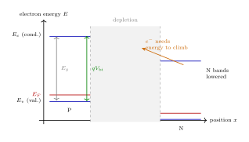

##### ∎ 电势图怎么读（与能带是同一回事的两种画法）

**能带图** 画 **电子能量 $E$**；**电势图** 画 **电势 $\phi(x)$**。二者关系：$\boxed{E_c \approx -q\phi + \text{常数}}$ → **能带在 P 侧高** 时，**电势在 P 侧反而低**（别搞反）。

| 子图 | 看什么 | 怎么理解 |
|------|--------|----------|
| **(1) $\phi(x)$** | P 左 **低**、N 右 **高** | 中性区 **平坦**；耗尽层里 **单调上升**（台阶的斜面） |
| 绿色 $V_{\mathrm{bi}}$ | $\phi_n - \phi_p$ | 内建电压 = N 侧减 P 侧电势（**恒为正**） |
| **(2) $E(x)$** | 红色 **负峰** 只在耗尽层 | $\boxed{E(x)=-\dfrac{d\phi}{dx}}$；中性区 **$E=0$** |
| 箭头 N→P | $\vec{E}_{\mathrm{bi}}$ | 与截面图一致；$e^-$ 被扫向 N、$h^+$ 被扫向 P |

**与截面图对照：** $\phi$ 在耗尽层里 **由低爬到高**（P→N）→ 斜率 $d\phi/dx>0$ → $E=-d\phi/dx<0$，箭头 **N→P**。

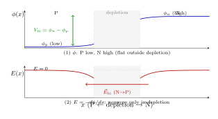

##### ∎ 两张图对照（记不住时看这里）

```
截面图          能带图                 电势图
────────        ──────                 ──────
N_A^- | N_D^+   E_c 在 P 侧高          φ：P 低 N 高
E_bi: N→P   ↔   势垒 qV_bi         ↔   耗尽层里 E≠0
耗尽层          中间灰区               中性区 E=0
```

- **能带图**：电子能量；N 侧整体 **低** $qV_{\mathrm{bi}}$ → 势垒。  
- **电势图**：$\phi_p < \phi_n$；$V_{\mathrm{bi}}=\phi_n-\phi_p$；$E$ 只在耗尽层。  
- **记一句**：能带 **往上**（P 侧）⇔ 电势 **往下**（P 侧），因为 $E_c \sim -q\phi$。

##### ∎ 正向偏压削弱内建场

外加 **正向电压** $V_F$：P 接 **正**、N 接 **负**。外加电场与 $\vec{E}_{\mathrm{bi}}$ **反向** → 净内建场 **减弱** → 能带弯曲 **减小**，有效势垒由 $qV_{\mathrm{bi}}$ 降为 $\boxed{q(V_{\mathrm{bi}}-V_F)}$（$0<V_F<V_{\mathrm{bi}}$ 时）。势垒降低 → 多数载流子更易越过结 → **正向电流** 增大（[2.5.3](#253-p-n-diode-and-photodetector-equivalent-model-二极体与光侦测器等效模型) 二极体 $I$–$V$）。

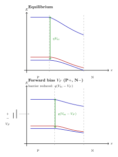

上：平衡；下：正向偏压 $V_F$，势垒 $q(V_{\mathrm{bi}}-V_F)$ **低于** 平衡时的 $qV_{\mathrm{bi}}$。

##### ⚠ 易错点

- **耗尽层** 内是 **固定离子** 电荷，不是可动载流子；$h^+$、$e^-$ 图在耗尽层 **外侧** 示意多数载流子。
- $\vec{E}_{\mathrm{bi}}$ 方向 **N → P**（由正离子区指向负离子区）；勿与 **电子漂移** 方向混淆。
- 正向偏压是 **P 正、N 负**；反向偏压会 **加高** 势垒（本节不展开）。

##### ✓ 小结

- P（$N_A$，$h^+$）/ N（$N_D$，$e^-$）→ 扩散 → 耗尽层 + $V_{\mathrm{bi}}$、$\vec{E}_{\mathrm{bi}}$
- 能带势垒 $qV_{\mathrm{bi}}$；$\phi(x)$、$E(x)=-d\phi/dx$ 描述内建场
- 正向 $V_F$ 削弱内建场 → 势垒 $q(V_{\mathrm{bi}}-V_F)\downarrow$ → 为 [2.5.2](#252-p-n-junction-photodetector-光电原理) 光电流、[2.5.3](#253-p-n-diode-and-photodetector-equivalent-model-二极体与光侦测器等效模型) 电路模型打基础

#### 2.5.2 P-N Junction Photodetector 光电原理

> ◎ 核心：
> - **光** 入射 **耗尽层** → 光子打断 **共价键** → **电子–空穴对**（$e^-$、$h^+$）
> - **内建电场** $\vec{E}_{\mathrm{bi}}$（[2.5.1](#251-p-n-junction-pn-结)）：$e^-$ **扫向 N**，$h^+$ **扫向 P** → 外电路 **光电流** $I_{\mathrm{ph}}$
> - **线性近似**：$\boxed{I_{\mathrm{ph}} = \eta\, I_L}$；电路模型见 [2.5.3](#253-p-n-diode-and-photodetector-equivalent-model-二极体与光侦测器等效模型)

##### ∎ 物理过程

1. **光吸收**：$h\nu > E_g$ → 价带电子激发到导带 → **光生载流子对**。
2. **分离**：耗尽层 **电场最强**；$e^-$、$h^+$ 被 **漂移**（非扩散主导）——$e^-$ → N，$h^+$ → P。
3. **光电流**：载流子经外电路补偿 → 测得 $I_{\mathrm{ph}}$（$\propto$ 光强）。

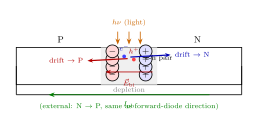

图：光 $h\nu$ 入射耗尽层 → $e^-$–$h^+$；$\vec{E}_{\mathrm{bi}}$ 驱动 drift；外电路 $I_{\mathrm{ph}}$：**N $\to$ P**。

##### ∎ 光电流公式

$$
\boxed{I_{\mathrm{ph}} = \eta\, I_L}
$$

| 符号 | 含义 | 备注 |
|------|------|------|
| $I_{\mathrm{ph}}$ | **光电流** | 弱光线性区 $\propto$ 光强 |
| $\eta$ | **效率** | 量子/耦合等综合 |
| $I_L$ | 光强表征 | 光源电流、照度或 $P_{\mathrm{opt}}$ 等效量 |

实用 **光二极体** 常 **反向偏压**（p 负、n 正），耗尽层变宽、收集效率更高；如何把 $I_{\mathrm{ph}}$ 与端电流 $i$ 合在一起，见 **2.5.3**。

##### ⚠ 易错点

- 光电流来自 **电场分离** 光生载流子，不是光直接注入电源。
- $e^-$ → N、$h^+$ → P，与 $\vec{E}_{\mathrm{bi}}$（N→P）一致。
- $I_{\mathrm{ph}}=\eta I_L$ 为 **线性区**；强光饱和，$\eta$ 随波长变。

##### ✓ 小结

- 光 → e-h 对 → $\vec{E}_{\mathrm{bi}}$ 分离 → $I_{\mathrm{ph}}=\eta I_L$
- 下一步：[2.5.3](#253-p-n-diode-and-photodetector-equivalent-model-二极体与光侦测器等效模型) 二极体 + 等效电路 → [2.6](#26-current-voltage-converter-for-photodetector-and-automatic-street-light-control-system-光侦测器的电流电压转换器与自动街灯控制系统) I–V 转换

#### 2.5.3 P-N Diode and Photodetector Equivalent Model 二极体与光侦测器等效模型

> ◎ 核心：
> - **二极体** $D$：Shockley 式 $i_D=I_s(e^{v/V_T}-1)$（无光照时的 PN 结端特性）
> - **光侦测器** = $D$ **并联** 光电流源 $I_{\mathrm{ph}}$（[2.5.2](#252-p-n-junction-photodetector-光电原理) 的 $\eta I_L$）
> - 端电流：$\boxed{i = I_s(e^{v/V_T}-1) - I_{\mathrm{ph}}}$；反向偏压下 **$I_{\mathrm{ph}}$** 可测

##### ∎ P-N 二极体（Shockley）

PN 结作 **二极体**：**p**（阳极）— **n**（阴极）；$v$ 以 **p 正、n 负** 为正；$i$ 自 **p → n**。


$$
\boxed{i=I_s\left(e^{v/V_T}-1\right)}
$$

| 量 | 含义 | 典型值（硅，RT） |
|----|------|------------------|
| $i$ | 二极体电流（p→n 为正） | — |
| $v$ | p 相对 n 的电压 | 正向 $\sim 0.7\,\mathrm{V}$ 量级导通 |
| $I_s$ | **饱和电流** | $\boxed{10^{-14}\sim 10^{-15}\,\mathrm{A}}$ |
| $V_T$ | **热电压** $kT/q$ | $\boxed{25\,\mathrm{mV}}$ |

- **反向**（$\lvert v\rvert\gg V_T$）：$i\approx -I_s$
- **正向**：$v\gtrsim 0.6\!\sim\!0.7\,\mathrm{V}$ 后电流 **指数上升**（硅膝区）

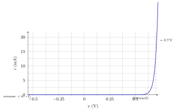

##### ∎ 光侦测器等效电路


- **$D$**：Shockley 二极体
- **$I_{\mathrm{ph}}$**：独立电流源，**p→n** 方向；$I_{\mathrm{ph}}=\eta I_L$（2.5.2）

$$
\boxed{
i = I_s\left(e^{v/V_T}-1\right) - I_{\mathrm{ph}}
= I_s\left(e^{v/V_T}-1\right) - \eta I_L
}
$$

| 情形 | 结果 |
|------|------|
| 无光照 | $I_{\mathrm{ph}}=0$ → 普通二极体 |
| 反向偏压 + 光 | $i \approx -I_s - I_{\mathrm{ph}}$；**$I_{\mathrm{ph}}$** 主导变化 |
| 正向偏压 | 光侦测器 **通常不用** |

##### ⚠ 易错点

- $I_{\mathrm{ph}}$ **并联** $D$，不是替代 $I_s$。
- 先 **2.5.1** 懂 $\vec{E}_{\mathrm{bi}}$ → **2.5.2** 懂 $I_{\mathrm{ph}}$ 从哪来 → **本节** 把两者收成电路。
- $v$：**p 正 n 负**；$i$ 与 $v$ 同向才为正向导通。

##### ✓ 小结

- 模型：**$I_{\mathrm{ph}}$ 源 $\parallel$ 二极体 $D$**
- $i = I_s(e^{v/V_T}-1) - \eta I_L$；[2.6.1](#261-current-voltage-converter-for-photodetector-光侦测器的电流电压转换器) 用运放读 $I_{\mathrm{ph}}$

### 2.6 Current-Voltage Converter for Photodetector and Automatic Street-Light Control System 光侦测器的电流电压转换器与自动街灯控制系统

> ◎ 占位：对应 NYCU OCW `2.6 Current-voltage converter for photodetector, automatic street-light control system`。

#### 2.6.1 Current-Voltage Converter for Photodetector 光侦测器的电流电压转换器

> ◎ 占位：对应 NYCU OCW `2.6.1 Current-voltage converter for photodetector`。

#### 2.6.2 Automatic Street-Light Control System 自动街灯控制系统

> ◎ 占位：对应 NYCU OCW `2.6.2 Automatic street-light control system`。

#### 2.6.3 BJT Current and Voltage 双极性介面电晶体的电流电压

> ◎ 占位：对应 NYCU OCW `2.6.3 BJT current and voltage`。

#### 2.6.4 The Protection Diode 保护二极体

> ◎ 占位：对应 NYCU OCW `2.6.4 The protection diode`。

### 2.7 Photo Sensor, Current-Voltage Conversion, and Light-Emitting Devices 光侦测器、电流电压转换与光发射元件

> ◎ 占位：对应 NYCU OCW `2.7 Automatic street-light system with BJT and protection diode` 与周次标题。

#### 2.7.1 A Photo Sensor 光侦测器

> ◎ 占位：对应 NYCU OCW `2.7.1 A photo sensor`。

#### 2.7.2 Current-Voltage Conversion 电流电压转换

> ◎ 占位：对应 NYCU OCW `2.7.2 Current-voltage converter`。

#### 2.7.3 Light-Emitting Devices 光发射元件

> ◎ 占位：对应 NYCU OCW `2.7.3 Light-emitting devices`。

### 2.8 Modeling of OP Converters 运算放大器转换器模型

> ◎ 占位：对应 NYCU OCW `2.8 Modeling of OP converters`。

#### 2.8.1 Amplifier AC Modeling 放大器交流模型

> ◎ 占位：对应 NYCU OCW `2.8.1 Amplifier ac modeling`。

#### 2.8.2 Modeling for Current-Voltage Converter 电流电压转换器模型

> ◎ 占位：对应 NYCU OCW `2.8.2 Modeling for current-voltage converter`。

#### 2.8.3 Modeling for Voltage-Current Converter 电压电流转换器模型

> ◎ 占位：对应 NYCU OCW `2.8.3 Modeling for voltage-current converter`。

#### 2.8.4 Current-Current Amplifier 电流电流放大器

> ◎ 占位：对应 NYCU OCW `2.8.4 Current-current amplifier`。

### 2.9 Summary of OP Converters 运算放大器转换器总整理

> ◎ 占位：对应 NYCU OCW `2.9 Summary of various OP converters`。

#### 2.9.1 Summary of OP Converters 运算放大器转换器总整理

> ◎ 占位：对应 NYCU OCW `2.9.1 Summary of OP converters`。

### 2.10 OP Bandwidth and Slew Rate 运算放大器频宽与迴转率

> ◎ 占位：对应 NYCU OCW `2.10 OP bandwidth and Slew rate (SR)`。

#### 2.10.1 OP Bandwidth and Slew Rate 运算放大器频宽与迴转率

> ◎ 占位：对应 NYCU OCW `2.10.1 OP bandwidth and Slew rate (SR)`。

#### 2.10.2 Avoid SR Distortion 避免迴转率扭曲

> ◎ 占位：对应 NYCU OCW `2.10.2 Avoid SR distortion`。

### 2.11 OP with BJT to Increase Current-Driving Capability and Class AB Output Stage 外加 BJT 增加电流驱动能力与 AB 类输出级

> ◎ 占位：对应 NYCU OCW `2.11 OP with BJT to increase current-driving capability and class AB output stage`。

#### 2.11.1 BJT Current Amplification 双极性介面电晶体的电流放大

> ◎ 占位：对应 NYCU OCW `2.11.1 BJT current amplification`。

#### 2.11.2 OP with BJT to Increase Current-Driving Capability 运算放大器外加 BJT 来增加电流驱动

> ◎ 占位：对应 NYCU OCW `2.11.2 OP with BJT to increase current-driving capability`。

#### 2.11.3 Class AB Output Stage AB 类输出级

> ◎ 占位：对应 NYCU OCW `2.11.3 Class AB output stage`。

### 2.12 Class AB Output Stage with Diodes and a Simple Stereo System AB 类输出级外加二极体与简易音响系统

> ◎ 占位：对应 NYCU OCW `2.12 Class AB output stage with diodes and a simple stereo system`。

#### 2.12.1 Class AB Output Stage with Diodes AB 类输出级外加二极体

> ◎ 占位：对应 NYCU OCW `2.12.1 Class AB output stage with diodes`。

#### 2.12.2 A Simple Stereo System 简易音响系统

> ◎ 占位：对应 NYCU OCW `2.12.2 A simple stereo system`。

---

## 附录

**对应正文：** [2.4.2](#242-integrator-with-additional-resistance-积分器外加电阻)。$V$–$R$–$C$ 串联，$v_C(0)=V_0$，$t\ge 0$ 接直流 $V$。KVL（$\tau=RC$）：

$$
\boxed{\tau\,\frac{dv_C}{dt}+v_C=V}.
$$

（$V_0=0$ 的标准解见 [电子学一 · 附录 B](../电子学一.md#附录-b-rc-直流充电微分方程与标准解)。）

---

### 附录 A 两种解法（同一答案）

设 $v_C=v_{\mathrm{ss}}+v_{\mathrm{tr}}$：**稳态** $v_{\mathrm{ss}}$ 不随 $t$ 变、最后留下；**瞬态** $v_{\mathrm{tr}}$ 会消失。电源 $V$ 是直流 → 很久以后电容必为 $V$；$t=0$ 若已有 $V_0\neq V$，差额 $(V_0-V)$ 经 $R$ 慢慢消掉。

#### 稳态 + 瞬态

| | 方程 | 解 |
|---|------|-----|
| **稳态** | $t\to\infty$：$\dfrac{dv_C}{dt}=0$ → $v_{\mathrm{ss}}=V$ | $v_{\mathrm{ss}}=V$ |
| **瞬态** | 代回后只剩衰减：$\tau\,\dfrac{dv_{\mathrm{tr}}}{dt}+v_{\mathrm{tr}}=0$，$v_{\mathrm{tr}}(0)=V_0-V$ | $v_{\mathrm{tr}}=(V_0-V)e^{-t/\tau}$ |

$$
\boxed{v_C(t)=V+\left(V_0-V\right)e^{-t/\tau}}.
$$

#### 零输入 ZIR + 零状态 ZSR

分开做两个实验，再相加（方程对 $v_C$、$V$ 都是一次方，可叠加）：

| | 条件 | 物理 | 方程 | 解 |
|---|------|------|------|-----|
| **ZIR** | $V=0$，$v_C(0)=V_0$ | 电容 **放电** | $\tau\,\dot v+v=0$ | $v_{zi}=V_0 e^{-t/\tau}$ |
| **ZSR** | $v_C(0)=0$，接 $V$ | 电容 **充电** | $\tau\,\dot v+v=V$ | $v_{zs}=V(1-e^{-t/\tau})$ |

$$
\boxed{v_C=v_{zi}+v_{zs}=V+\left(V_0-V\right)e^{-t/\tau}}.
$$

（展开后与上式相同。）

**易混：** 零状态 = $v_C(0)=0$，不是 $v_C(\infty)$；稳态 = $V$，不是「零状态」。

---

#### 与 [2.4.2](#242-integrator-with-additional-resistance-积分器外加电阻)

$RC\,\dot v_c+(R/R_f)v_c=V_{\mathrm{of}}/A_d$ 乘 $R_f/R$ 后形如 $\tau\,\dot v+v=V_\infty$，$\tau=R_f C$，$V_\infty=\dfrac{R_f}{R}\dfrac{V_{\mathrm{of}}}{A_d}$。$v_c(0)=0$ 时：

$$
v_c(t)=V_\infty\left(1-e^{-t/\tau}\right).
$$

运放 **饱和** 后方程非线性，不能再用上表叠加。

---
