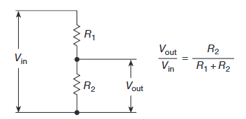
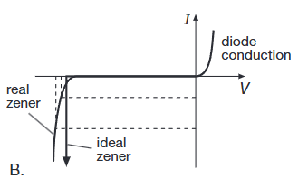
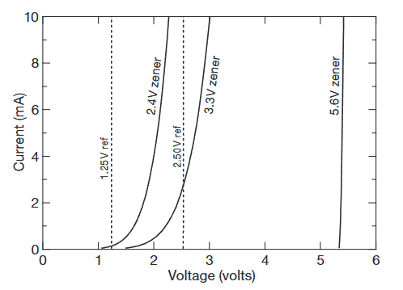
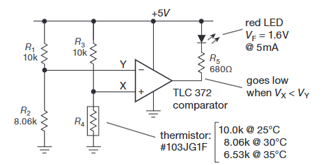
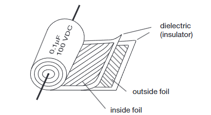
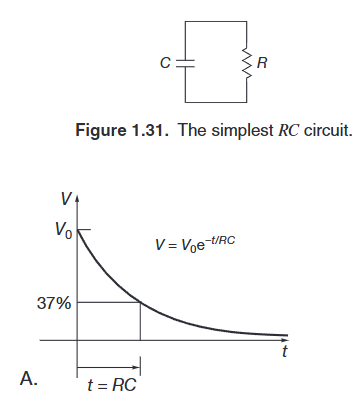
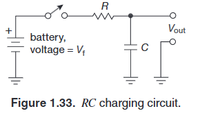
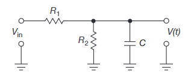
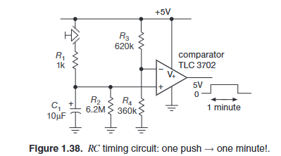
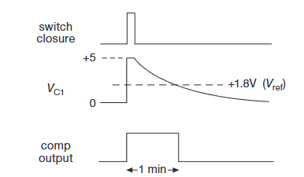

# The Art of Electronics

- **书籍作者**: Horowitz, Paul; Hill, Winfield
- **笔记时间**: 2026.03.22

---

## 📖 目录

- [PREFACE 前言](#preface-前言)
- [Foundations 基础](#foundations-基础)
  - [Introduction 引言](#introduction-引言)
  - [Voltage, Current, and Resistance 电压、电流和电阻](#voltage-current-and-resistance-电压电流和电阻)
  - [Thevenin's Theorem 戴维宁定理](#thevenins-theorem-戴维宁定理)
  - [Small-signal Resistance 小信号电阻](#small-signal-resistance-小信号电阻)
- [Signals 信号](#signals-信号)
  - [Sinusoidal Signal 正弦信号](#sinusoidal-signal-正弦信号)
  - [Signal Amplitude and Decibels 信号幅值和分贝](#signal-amplitude-and-decibels-信号幅值和分贝)
  - [Signal Sources 信号源](#signal-sources-信号源)
- [Capacitors and AC Circuits 电容和交流电路](#capacitors-and-ac-circuits-电容和交流电路)
  - [Capacitor 电容](#capacitor-电容)
  - [RC Circuit RC电路](#rc-circuit-rc电路)
    - [Decay to Equilibrium 衰减到均衡](#decay-to-equilibrium-衰减到均衡)
    - [Thevenin Simplification 戴维宁等效简化](#simplification-by-thevenin-equivalent-戴维宁等效简化)

---

## PREFACE 前言

- 源自哈佛实验电子学课程讲义，合工程师定量思维与物理学家务实思路，弱化复杂理论与高深数学，重思路构思与简易估算；同时在常规内容外增补晶体管实用模型、各类子电路、运放实操、低噪声设计、模数转换、微处理器应用及 PCB 制作等大量工程实用硬核内容。

## Foundations 基础

### Introduction 引言

#### 1️⃣ 萌芽期：电磁波的发现 (1880s - 1900s)

这是电子学的“石器时代”，设备巨大且效率极低。

*   **火花间隙 (Spark-gap)**：
    *   **原理**：利用高压电击穿空气产生火花，从而发射原始的电磁波。
    *   **工程地位**：人类第一个无线电发射器（赫兹实验）。
    *   **缺点**：信号杂乱（全频段噪音）、不可控、极度危险。
*   **猫须探测器 (Cat's-whisker)**：
    *   **原理**：用细金属丝触碰矿石表面，利用接触点的非线性实现整流。
    *   **工程地位**：第一个**半导体**应用，用于接收无线电信号。
    *   **局限**：只能“检波”，无法“放大”。

---

#### 2️⃣ 成长期：信号放大的奇迹 (1900s - 1940s)

这是电子学的“工业革命”，解决了信号传输距离的问题。

*   **真空管 (Vacuum Tube)**：
    *   **原理**：在真空灯泡里，用一个小电压控制一束电子流。
    *   **工程革命**：实现了**增益 (Gain)**。这意味着弱信号可以变强，长途电话、广播、雷达和第一代计算机 (ENIAC) 得以实现。
    *   **痛点**：费电、发热量巨大、体积大且极易损坏。

---

#### 3️⃣ 爆发期：固态电子的统治 (1947 - 至今)

这是电子学的“现代文明”，将物理规律压缩进了固体材料。

*   **晶体管 (Transistor)**：
    *   **原理**：利用硅等半导体材料内部的电子运动来控制电流。
    *   **工程地位**：彻底取代了真空管。它不需要加热，体积迅速缩小。
    *   **演进**：单个晶体管 $\to$ 集成电路 (IC) $\to$ 超大规模集成电路 (VLSI)。
    *   **现状**：现代手机处理器集成超过 **100 亿个** 晶体管。

---

### Voltage, Current, and Resistance 电压、电流和电阻

#### 💡 核心概念：电压、电流与功率

1.  **电压 (Voltage, $V$)**
    *   **定义**：一单位正电荷从一点移动到另一点所需的能量。
    *   **单位**：$1\text{V} = 1\text{J/C}$。
    *   **注意**：电压总是两点之间的电位差。若说某点电压，则默认另一点为**接地点 (Ground)**。

2.  **电流 (Current, $I$)**
    *   **定义**：电荷流过某点的速率。
    *   **单位**：$1\text{A} = 1\text{C/s}$。

3.  **KVL & KCL 定律**
    *   **KVL (基尔霍夫电压定律)**：在闭合回路中，电压的代数和等于 0。
    *   **KCL (基尔霍夫电流定律)**：在任意节点，流入电流的总和等于流出电流的总和（代数和为 0）。

4.  **功率 (Power, $P$)**
    *   **公式**：$P = V \times I$。
    *   **单位**：$1\text{W} = 1\text{V} \cdot 1\text{A}$。

---

#### 🧱 电阻 (Resistance, $R$)

通过分析 $I-V$ 特性曲线，可以识别元件的特性：
*   **电阻**：线性关系。
*   **电容**：$I$ 与 $V$ 的变化率成正比。
*   **二极管**：单向导通特性。
*   **传感器**：如热敏电阻（温度依赖）、光敏电阻（光强依赖）、应变计（应变依赖）。

**工程要点：**
*   **主要用途**：分压、滤波（配合电容）、上拉/下拉、设定增益/带宽、限流等。
*   **常见精度**：$1\%, 2\%, 5\%$。
*   **常见材质**：金属薄膜、碳膜、陶瓷、氧化物等。
*   **非理想特性**：阻值会随温度、电压、时间、湿度而漂移。

> 📌 **设计准则**：避免依赖精确的电阻值。良好的设计应当对元件公差（误差）不敏感，通常只需使用标称值的近似即可。

---

#### ⚖️ Voltage Divider 电压分压器

串联分压是最基础的电路，可通过将 $R_2$ 替换为**电位器 (Potentiometer)** 实现可调输出电压。

---

#### 🔋 Voltage Source & Current Source 电压源与电流源

*   **理想电压源**：电压恒定，电流可随负载改变。
*   **实际电压源**：只能提供有限电流（受内阻限制），如电池。
*   **理想电流源**：电流恒定，电压可随负载改变。

---

#### 📐 Thevenin's Theorem 戴维宁定理

任何线性双口网络都可以等效为一个电压源 $V_{th}$ 与一个电阻 $R_{th}$ 的串联。

1.  **$V_{th}$ (等效电压)**：原电路开路时的输出电压。
2.  **$R_{th}$ (等效电阻)**：$R_{th} = V_{th} / I_{sc}$，其中 $I_{sc}$ 是原电路输出短路时的电流。

> 📌 **阻抗匹配建议**：为了使电压传输最稳定，通常应满足 **负载电阻 $R_{load} \gg$ 源内阻 $R_{th}$**，以减小负载对电源的影响。
> $$V_{out} = V_{th} \cdot \frac{R_{load}}{R_{th} + R_{load}}$$

---

#### 🔍 Small-signal Resistance 小信号电阻

当 $I-V$ 关系是非线性时（如二极管），可以在工作点附近取微小变化量来近似电阻：
$$r = \frac{dV}{dI}$$
这被称为**小信号模型**。在特定偏置下，斜率越大，小信号电阻越小。

---

#### 🌡️ 应用实例：温度检测器

利用运放作为**比较器**实现温控逻辑：
*   **比较逻辑**：若 $Y > X$，输出 $5\text{V}$；否则输出 $0\text{V}$。
*   **参考电压 $Y$**：通过分压设定，$Y = 5\text{V} \cdot \frac{R_2}{R_1 + R_2}$。
*   **感应电压 $X$**：由热敏电阻分压，$X = 5\text{V} \cdot \frac{R_4}{R_3 + R_4}$。
*   **工作原理**：温度越高，热敏电阻阻值越小 $\to X$ 减小。当 $X < Y$（即温度超过设定阈值）时，比较器翻转，LED 亮起。

---

## Signals 信号

即使是交流信号，欧姆定律与戴维宁定理依然适用。

---

### Sinusoidal Signal 正弦信号

正弦信号是最基础的交流信号，其电压随时间呈正弦变化：
$$V = A \sin(\omega t)$$

**参数说明：**
- $A$：**幅值 (Amplitude)**
- $\omega$：**角频率**，$\omega = 2\pi f = 2\pi / T$
- $T$：**周期**

**重要指标：**
- **峰峰值 (Peak-to-peak, $V_{pp}$)**：$V_{pp} = 2A$
- **均方根值 (Root Mean Square, $V_{rms}$)**：
  对于正弦波：$V_{rms} = \frac{A}{\sqrt{2}} \approx 0.707A$
  > 💡 $V_{rms}$ 的物理意义：在阻性负载上产生相同热效应的直流电压值。

---

### Signal Amplitude and Decibels 信号幅值和分贝

**分贝 (dB)** 是用于表示两个量之间比例关系的对数单位。

1.  **功率增益**：$dB = 10 \log_{10}\left(\frac{P_{out}}{P_{in}}\right)$
2.  **电压增益**：$dB = 20 \log_{10}\left(\frac{V_{out}}{V_{in}}\right)$（前提是阻抗相同）

| dB | 功率比 ($P/P_0$) | 
| :--- | :--- | 
| **0** | 1.0 | 
| **3** | ~2.0 (1.995) | 
| **6** | ~4.0 | 
| **10** | 10.0 | 
| **20** | 100.0 | 
| **-3** | 0.5 | 

---

### Other Common Signals 其他常见信号

- **Ramp (斜坡)**：电压随时间线性增加。
- **Triangle (三角波)**：对称的上升和下降沿。
- **Square (方波)**：在两个电平间快速切换。
  - **上升时间 (Rise Time)**：信号从 $10\%$ 上升到 $90\%$ 所需的时间。
- **Pulse (脉冲)**：由振幅和**脉宽 (Width)** 定义，常用于 PWM 信号。
- **Step (阶跃)**：瞬时的电平跳变。

---

### Signal Sources 信号源

- **Signal Generator (信号发生器)**：主要生成正弦波，可调频率和幅值。
- **Function Generator (函数发生器)**：可生成多种波形（正弦、方波、三角波等）。
- **Pulse Generator (脉冲发生器)**：专门用于生成具有精确脉宽和重复频率的脉冲。

---

## Capacitors and AC Circuits 电容和交流电路

### Capacitor 电容

电容由两个导电极板夹一层绝缘电介质构成，其容量由几何尺寸与介质特性共同决定：
$$C = \varepsilon \frac{A}{d} = \varepsilon_0 \varepsilon_r \frac{A}{d}$$

**核心特性：**
1.  **定义式**：$C = Q / V$（单位电压存储的电荷量）。
2.  **微分关系**：$I = C \frac{dV}{dt}$
    - 电压不能突变。
    - 电流领先电压 $90^\circ$（或者说电压滞后电流）。
3.  **阻抗 (容抗)**：可以看作随频率变化的电阻，$X_C = \frac{1}{2\pi f C}$。频率越高，容抗越小。

---

### RC Circuit RC电路

#### ⏳ 时域分析：充放电过程

给定微分方程 $C \frac{dv}{dt} = I = -\frac{V}{R}$，其解为：
$$V(t) = V_0 e^{-t/RC}$$

- **时间常数 $\tau = RC$**：
  - 经过 $1\tau$ 后，电压下降到初始值的 $37\%$（或充电至 $63\%$）。
  - 经过约 $5\tau$ 后，认为充放电基本完成。

**充电公式：**
$$V_{out}(t) = V_{in}(1 - e^{-t/RC})$$

#### 📉 Decay to Equilibrium 衰减到均衡

经过 $5\tau$ (5个RC时间) 后，输出电压将达到最终稳态值的 $99\%$ 以上（即距离目标值仅剩 $1\%$）。

对于任意随时间变化的输入信号 $V_{in}(t)$，RC 电路的通用响应公式为：
$$V(t) = \frac{1}{RC} \int_0^t V_{in}(\tau) e^{-(t-\tau)/RC} d\tau$$

> 💡 **物理直觉**：RC 电路实际上是对输入信号进行**加权指数平均**。越接近当前时刻的输入，权重越大。在实际工程中，我们通常转向**频域分析**（低通滤波器）来简化此类问题的讨论。

---

#### ⚡ Simplification by Thevenin Equivalent 戴维宁等效简化

在复杂电路中，利用戴维宁定理可以极大地简化 RC 分析。

**示例：** 给定 $R_1 = R_2 = 10\text{k}\Omega, C = 0.1\mu\text{F}$，求输出电压 $V(t)$。

**解题思路：**
1.  **戴维宁等效**：将电阻网络与输入源看作一个整体。
    -   $V_{th} = V_{in} \cdot \frac{R_2}{R_1 + R_2} = \frac{V_{in}}{2}$
    -   $R_{th} = R_1 \parallel R_2 = 5\text{k}\Omega$
2.  **简化模型**：电路转化为一个理想电压源 $V_{th}$ 与 $R_{th}$ 和 $C$ 串联。
3.  **最终响应**：
    $$\tau = R_{th} \cdot C = 5\text{k}\Omega \cdot 0.1\mu\text{F} = 5 \times 10^{-4}\text{s}$$
    $$V_{out}(t) = \frac{V_{in}}{2} \left( 1 - e^{-t/RC} \right)$$

---

#### ⏱️ One Minute Circuit 1分钟电路

这是一个利用 RC 放电延时特性的典型应用电路。

**原理解析：**
1.  **参考电压**：通过电阻分压设定比较器的阈值。
    $$V_{ref} = \frac{360}{620 + 360} \times 5\text{V} \approx 1.83\text{V}$$
2.  **放电过程**：
    -   $$\tau = R \cdot C = 6.2\text{M}\Omega \cdot 10\mu\text{F} = 62\text{s}$$
    -   经过一个时间常数（约 $62\text{s}$）后，电容电压下降到初始值的 $37\%$ 左右，即 $5\text{V} \times 0.37 = 1.85\text{V}$。
3.  **状态翻转**：随着电容继续放电，当电压稍低于参考电压 $1.83\text{V}$ 时，运放（比较器）的输出状态将发生翻转，从 $5\text{V}$ 变为 $0\text{V}$。
4.  **扩展应用**：输出端可以接入 LED、蜂鸣器或继电器等，实现延时控制等有趣的应用。
5. **一些细节**：在状态转换的时候会有一些抖动，一般可以通过延迟处理；

---