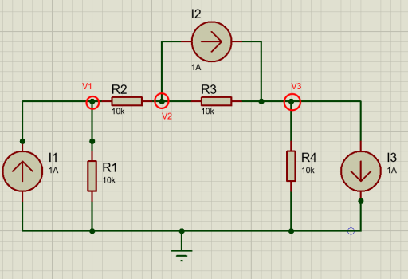
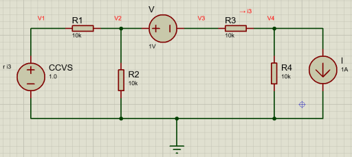
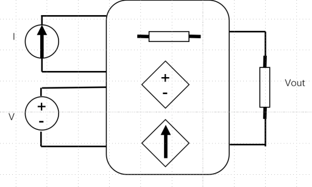
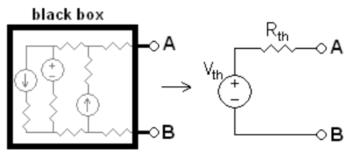
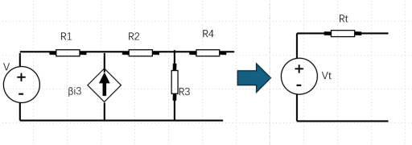
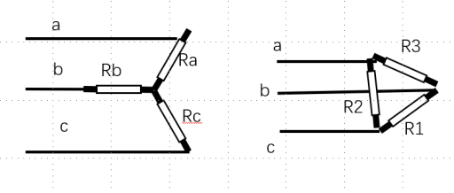
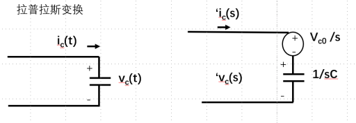
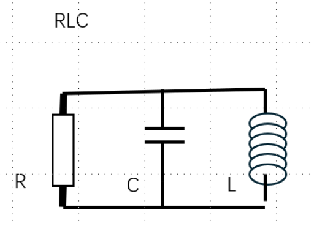
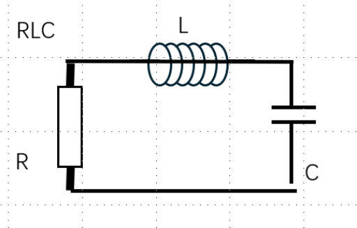
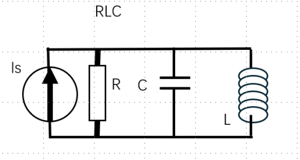

# Introduction to Electric Circuit (电路学概论)

- [ ] 笔记来源: [陈永平 Introduction to Electric Circuit](https://www.bilibili.com/video/BV1Pr421M7bW/?spm_id_from=333.1391.0.0&_source=75d343d583130dcc21675fbeadb22044)
- [ ] 笔记时间：2026.02.28

---

## Ch1 Fundamental Concepts (基本概念)

### SI Units and Prefixes (国际单位制和前缀)

#### SI Base Units (国际单位制基本单位)

使用基本单位 (base unit) 可以得到衍生单位 (derived unit)。

| Physical Quantity (物理量)     | SI Base Unit (基本单位) | Symbol (符号) | Definition (解释)                                                     |
| :----------------------------- | :---------------------- | :------------ | :-------------------------------------------------------------------- |
| Length (长度)                  | Meter (米)              | m             | 光在真空中 1/299792458 秒内行进的距离                                 |
| Mass (质量)                    | Kilogram (千克)         | kg            | 国际千克原器的质量（现改用普朗克常数定义）                            |
| Time (时间)                    | Second (秒)             | s             | 铯-133 原子基态超精细跃迁辐射的 9192631770 个周期                     |
| Current (电流)                 | Ampere (安培)           | A             | 真空中相距 1 米的两无限长平行导线产生$2\times 10^{-7}$ N/m 力的电流 |
| Temperature (热力学温度)       | Kelvin (开尔文)         | K             | 水的三相点热力学温度的 1/273.16                                       |
| Amount of substance (物质的量) | Mole (摩尔)             | mol           | 0.012 kg 碳-12 所含原子数（阿伏伽德罗常数）                           |
| Luminous intensity (发光强度)  | Candela (坎德拉)        | cd            | 频率$540\times 10^{12}$ Hz 单色光源在给定方向上的辐射强度           |

#### Derived Units Example (衍生单位案例)

$$
\begin{aligned}
\text{Voltage Definition (电压定义):} \quad &V = \frac{W}{Q} \\[6pt]
\text{Energy Unit (能量单位):} \quad &W = 1\,\mathrm{J} = 1\,\mathrm{N \cdot m} \\[6pt]
\text{Force Unit (力单位):} \quad &1\,\mathrm{N} = 1\,\mathrm{kg \cdot m \cdot s^{-2}} \\[6pt]
\Rightarrow \quad &W = \mathrm{kg \cdot m^2 \cdot s^{-2}} \\[10pt]
\text{Charge Unit (电荷单位):} \quad &Q = I \cdot t = \mathrm{A \cdot s} \\[10pt]
\text{Substitute into Voltage (代入电压):} \quad &V = \frac{\mathrm{kg \cdot m^2 \cdot s^{-2}}}{\mathrm{A \cdot s}} \\[10pt]
\text{Final Form (整理指数):} \quad &V = \mathrm{kg \cdot m^2 \cdot s^{-3} \cdot A^{-1}}
\end{aligned}
$$

#### Equation Example: RC Circuit (方程案例：RC 电路)

$$
\frac{\mathrm{d}v_C(t)}{\mathrm{d}t}+\frac{1}{RC}v_C(t)=\frac{1}{RC}v(t)\quad [\mathrm{V/s}]
$$

#### Metric Prefixes (数量级前缀)

| Prefix (前缀) | Symbol (符号) | Power of 10 (10 的幂) | Example (示例)     |
| :------------ | :------------ | :-------------------- | :----------------- |
| kilo          | k             | $10^3$              | 1 km = 1000 m      |
| mega          | M             | $10^6$              | 1 MHz              |
| giga          | G             | $10^9$              | 1 GHz              |
| tera          | T             | $10^{12}$           | 1 TB               |
| milli         | m             | $10^{-3}$           | mA, mV             |
| micro         | $\mu$       | $10^{-6}$           | $\mu$F, $\mu$s |
| nano          | n             | $10^{-9}$           | nF, ns             |
| pico          | p             | $10^{-12}$          | pF                 |

### Field Sources and Fields (场源和场)

- **Charge (电荷)**
  1. **Static Charge (静态电荷):** 形成静电场 (Electric Field)
  2. **Dynamic Charge (动态电荷):** 形成时变电场 (Time-varying Electric Field)
- **Current (电流)**
  1. 变化电流会形成磁场 (Magnetic Field) (也是时变磁场)
- **Electromagnetic Wave (电磁波)**
  1. 变化的电场和磁场会形成电磁波，也就是麦克斯韦方程 (Maxwell's Equations)。

### Electric Charges and Current (电荷和电流)

- **Current (电流)**
  1. 电子移动形成电流，电流方向是正电荷移动方向。定义：
     $$
     I = \frac{\mathrm{d}Q}{\mathrm{d}t}
     $$
  2. **Instantaneous Current (瞬时电流):**
     $$
     \begin{aligned}
      i(t) &= \frac{\mathrm{d}q(t)}{\mathrm{d}t}  \\
      q(t) &= \int_{t_0}^{t} i(\tau)\,\mathrm{d}\tau + q(t_0) = \int_{-\infty}^{t} i(\tau)\,\mathrm{d}\tau \\
      q(t_0) &= \text{Initial Charge (初始电荷)}
     \end{aligned}
     $$
  3. **Average Current (平均电流):**
     $$
     I_{av} = \frac{1}{t_1-t_0} \int_{t_0}^{t_1} i(t)\,\mathrm{d}t
     $$
  4. **Note:** 开关一开灯泡就会亮，不是电流速度快，而是电场建立速度快。

### Voltage and Power (电压和功率)

- **Voltage (电压)**

  1. 假设空间有两点的电势为 $V_1$ 和 $V_2$，有一个单位电荷 $+q$ 从 $V_1$ 到 $V_2$，那么：
     $$
     \begin{aligned}
     \text{Voltage (电压):} \quad &V = V_2 - V_1 = \frac{W}{q} \\[6pt]
     \text{Energy (电势能):} \quad &W = qV = q(V_2 - V_1) \\[6pt]
     \text{Power (功率):} \quad &P = \frac{W}{t} = \frac{\mathrm{d}W}{\mathrm{d}t} = \frac{\mathrm{d}W}{\mathrm{d}q}\frac{\mathrm{d}q}{\mathrm{d}t} = v(t)\,i(t)
     \end{aligned}
     $$
- **Passive Sign Convention ( PSC 被动符号约定)**

  1. 电流进正端 $\rightarrow$ 吸收功率；电压标注为 $+$，电流箭头流入 $+$ 端。

### Kirchhoff's Laws (基尔霍夫定律)

- **Lumped Component (集中元件)**

  1. 将电压集中到元件，不考虑线路的电压。KVL/KCL 限定在 lumped component。
  2. 如果考虑电磁波，那么线路上每一点的电压可能都会不同（波长决定），那么就是 **Distributed Component (分布元件)**。
- **KVL (Kirchhoff's Voltage Law - 基尔霍夫电压定律)**

  1. 电压守恒：电路回路中电压的总和为 0。
     $$
     \sum v = 0
     $$
- **KCL (Kirchhoff's Current Law - 基尔霍夫电流定律)**

  1. 电流守恒：电路节点中电流的总和为 0。
     $$
     \sum i = 0
     $$

### Conservation of Energy (能量守恒)

- 电路中能量的总和为 0。
- 符合 PSC (Passive Sign Convention)。

### Ideal Sources (理想源)

理想源没有内阻。

- **Independent Source (独立源):** 源的电压或电流不依赖于其他源的电压或电流。符号是圆形。
- **Dependent Source (受控源/依赖源):** 源的电压或电流依赖于其他源的电压或电流。符号是菱形，常见于三极管放大电路。

  - **VCVS (Voltage Controlled Voltage Source - 电压控制电压源):** 输出电压依赖于输入电压。$V_o = \alpha V_i$，其中 $\alpha$ 是增益系数。
  - **VCCS (Voltage Controlled Current Source - 电压控制电流源):** 输出电流依赖于输入电压。$I_o = g V_i$，其中 $g$ 是电导 (conductance)。
  - **CCVS (Current Controlled Voltage Source - 电流控制电压源):** 输出电压依赖于输入电流。$V_o = r I_i$，其中 $r$ 是电阻。
  - **CCCS (Current Controlled Current Source - 电流控制电流源):** 输出电流依赖于输入电流。$I_o = \beta I_i$，其中 $\beta$ 是增益系数。
- **Practical Source (实际源):**

  - 实际电压源需要串联电阻。
  - 实际电流源需要并联电阻。

### Resistors (电阻)

- **Linear Resistor (线性电阻)**

  $$
  \begin{aligned}
    R &= \rho\frac{L}{A},\quad \rho\text{ (Resistivity 电阻率)},\ L\text{ (Length 长度)},\ A\text{ (Area 面积)}\\
    U &= IR  \\
    P &= U \cdot I = I^2 \cdot R 
  \end{aligned}
  $$
- **Resistors in Series (串联电阻)**

  1. 串联电阻的总电阻等于所有电阻的电阻之和。
     $$
     R_{eq} = \sum R_i
     $$
  2. 电流相等，电压按比例分配 (**Voltage Division 串联分压**)。
  3. 实际电压源需要串联一个小电阻，才符合模型。
- **Resistors in Parallel (并联电阻)**

  1. 并联电阻的总电阻等于所有电阻的倒数之和的倒数。
     $$
     \frac{1}{R_{eq}} = \sum \frac{1}{R_i}
     $$
  2. 电压相等，电流按比例分配 (**Current Division 并联分流**)。
  3. 实际电流源需要并联一个大电阻，才符合模型（小电导）。

### Capacitors (电容)

电场储能：电容两端的电压会存储成电荷。

$$
\begin{aligned}
q &= C\,V \\[6pt]
C &= \varepsilon_0\,\frac{A}{d} ,\quad \varepsilon_0\text{ (Permittivity 真空介电常数)},\ A\text{ (Area 面积)},\ d\text{ (Distance 间距)} \\
i &= \frac{\mathrm{d}q}{\mathrm{d}t} = C\frac{\mathrm{d}V}{\mathrm{d}t}
\end{aligned}
$$

*注：如果 $V_c$ 是一直变化的，那么电容就会处于充电/放电状态。*

- **Continuity (连续性)**

  1. 根据上方的公式定义，电容两端的电流会用到微分。根据数学定义，微分的前提是函数是连续的。也就是电容两端的电压必须是连续的，才能计算电流。
  2. 电容两端电压不能突变：$V(t^-) = V(t) = V(t^+)$。
- **Capacitors in Series (串联电容)**

  1. 电容串联时等效电容的倒数等于各电容倒数之和。推导如下：
     $$
     \begin{aligned}
     i(t) &= C_k\,\frac{\mathrm{d}v_k}{\mathrm{d}t} \quad\text{(Series Current is same 各电容电流相同)}\\[4pt]
     v(t) &= v_1(t)+\cdots+v_n(t)=\sum_{k=1}^{n}v_k(t)\\[4pt]
     i(t) &= C_{\text{eq}}\,\frac{\mathrm{d}v}{\mathrm{d}t}
            =C_{\text{eq}}\sum_{k=1}^{n}\frac{\mathrm{d}v_k}{\mathrm{d}t}
            =C_{\text{eq}}\sum_{k=1}^{n}\frac{i(t)}{C_k}\\[4pt]
     \Rightarrow\quad
     \frac{1}{C_{\text{eq}}} &= \sum_{k=1}^{n}\frac{1}{C_k}
     \end{aligned}
     $$
- **Capacitors in Parallel (并联电容)**

  1. 根据 $C = \varepsilon_0\,\frac{A}{d}$，并联相当于面积 $A$ 增加，所以电容增加。
  2. $$
     C_{eq} = \sum C_i
     $$

### Inductors (电感)

磁场储能：电感通过磁通量变化存储能量。

$$
\begin{aligned}
  L &= \mu_0 \frac{N^2 A}{l},\quad \mu_0\text{ (Permeability 真空磁导率)},\ N\text{ (Turns 匝数)},\ l\text{ (Length 长度)} \\[6pt]
  v(t) &= L\frac{\mathrm{d}i(t)}{\mathrm{d}t}
\end{aligned}
$$

- **Inductors in Series (串联电感)**

  1. 电感串联相当于匝数增加，电感增加。
     $$
     L_{eq} = \sum L_i
     $$
- **Inductors in Parallel (并联电感)**

  1. 电感并联公式与电阻并联公式一致。
     $$
     \frac{1}{L_{eq}} = \sum \frac{1}{L_i}
     $$

### Component Formula Comparison (元件公式对比表)

| Component (元件)          | Series (串联)                     | Parallel (并联)                   |
| :------------------------ | :-------------------------------- | :-------------------------------- |
| **Resistor (R)**    | $R_s = R_1 + \dots + R_n$       | $1/R_p = 1/R_1 + \dots + 1/R_n$ |
| **Inductor (L)**    | $L_s = L_1 + \dots + L_n$       | $1/L_p = 1/L_1 + \dots + 1/L_n$ |
| **Conductance (G)** | $1/G_s = 1/G_1 + \dots + 1/G_n$ | $G_p = G_1 + \dots + G_n$       |
| **Capacitor (C)**   | $1/C_s = 1/C_1 + \dots + 1/C_n$ | $C_p = C_1 + \dots + C_n$       |

---

## Ch2 Resistive Circuits (电阻电路)

属于系统分析内容，包含电源和电阻。

### Independent Current Sources (独立电流源分析)

- **Node-Voltage Analysis (节点电压法 - KCL)**
  

$$
\begin{aligned}
(G_1+G_2)V_1 - G_2V_2 &= I_1 \quad\text{(KCL Node 1)}\\[4pt]
-G_2V_1 + (G_2+G_3)V_2 - G_3V_3 &= -I_2 \quad\text{(KCL Node 2)}\\[4pt]
-G_3V_2 + (G_3+G_4)V_3 &= I_2 - I_3 \quad\text{(KCL Node 3)}
\end{aligned}
$$

**Matrix Form (矩阵形式):**

$$
\underbrace{
\begin{bmatrix}
G_1+G_2 & -G_2 & 0\\[4pt]
-G_2 & G_2+G_3 & -G_3\\[4pt]
0 & -G_3 & G_3+G_4
\end{bmatrix}
}_{\mathbf{A}}
\begin{bmatrix}
V_1\\[4pt] V_2\\[4pt] V_3
\end{bmatrix}
=
\underbrace{
\begin{bmatrix}
1 & 0 & 0\\[4pt]
0 & -1 & 0\\[4pt]
0 & 1 & -1
\end{bmatrix}
}_{\mathbf{G}}
\begin{bmatrix}
I_1\\[4pt] I_2\\[4pt] I_3
\end{bmatrix}
$$

$$
\Longrightarrow\quad \mathbf{V} = \mathbf{A}^{-1}\mathbf{G}\mathbf{I}
$$

### Dependent Current Sources (受控电流源分析)

在上图的基础上，将 $I_3$ 变成受控电流源 $I_3 = g V_r$，其中 $V_r$ 为 $R_3$ 的电压（即 $V_2 - V_3$）。

$$
\begin{aligned}
(G_1+G_2)V_1 - G_2V_2 &= I_1 \quad\text{(KCL Node 1)}\\[4pt]
-G_2V_1 + (G_2+G_3)V_2 - G_3V_3 &= -I_2 \quad\text{(KCL Node 2)}\\[4pt]
(g-G_3)V_2 + (G_3+G_4-g)V_3 &= I_2  \quad\text{(KCL Node 3)}
\end{aligned}
$$

**Matrix Form (矩阵形式):**

$$
\underbrace{
\begin{bmatrix}
G_1+G_2 & -G_2 & 0\\[4pt]
-G_2 & G_2+G_3 & -G_3\\[4pt]
0 & g-G_3 & G_3+G_4-g
\end{bmatrix}
}_{\mathbf{A}}
\begin{bmatrix}
V_1\\[4pt] V_2\\[4pt] V_3
\end{bmatrix}
=
\underbrace{
\begin{bmatrix}
1 & 0 \\[4pt]
0 & -1 \\[4pt]
0 & 1 
\end{bmatrix}
}_{\mathbf{G}}
\begin{bmatrix}
I_1\\[4pt] I_2
\end{bmatrix}
$$

$$
\Longrightarrow\quad \mathbf{V} = \mathbf{A}^{-1}\mathbf{G}\mathbf{I},\quad \text{if } |\mathbf{A}| \neq 0
$$

### Voltage Sources (电压源分析)

- **Example (案例):**
  

$$
\begin{aligned}
V_1 - R\,G_3(V_3-V_4) &= 0 \quad\text{(KVL 1)}\\[4pt]
V_2 - V_3 &= V \quad\text{(KVL 2,3)}\\[4pt]
G_1(V_2-V_1)+G_2V_2+G_3(V_3-V_4) &= 0 \quad\text{(KCL 2,3 Supernode)}\\[4pt]
G_3(V_4-V_3) + G_4V_4 &= -I \quad\text{(KVL 4)}
\end{aligned}
$$

**Matrix Form (矩阵形式):**

$$
\underbrace{
\begin{bmatrix}
1 & 0 & -R\,G_3 & R\,G_3\\[4pt]
0 & 1 & -1 & 0\\[4pt]
-G_1 & G_1+G_2 & G_3 & -G_3\\[4pt]
0 & 0 & -G_3 & G_3+G_4
\end{bmatrix}
}_{\mathbf{A}}
\begin{bmatrix}
V_1\\[4pt] V_2\\[4pt] V_3\\[4pt] V_4
\end{bmatrix}
=
\underbrace{
\begin{bmatrix}
0 & 0\\[4pt]
0 & 1\\[4pt]
0 & 0\\[4pt]
-1 & 0
\end{bmatrix}
}_{\mathbf{G}}
\begin{bmatrix}
I\\[4pt] V
\end{bmatrix}
$$

### Mesh Current Analysis (回路电流/网孔电流分析)

基于回路电压求和等于 0 (KVL)，基本流程与节点电压法 (Node-Voltage) 类似，但求解的是网孔电流。

### Principle of Superposition (叠加原理)

在电阻电路中，输入有电压源/电流源，元件有电阻/线性受控源。它们符合线性叠加原理。
即：当输入有多个电压源/电流源时，可以将它们**分别单独**代入电路（其他源置零），然后将结果相加。

> **操作方法:**
>
> 1. 当 $V=0$ (电压源短路 Short Circuit), 产生 $V_{out1}$
> 2. 当 $I=0$ (电流源开路 Open Circuit), 产生 $V_{out2}$
> 3. 总结果 $V_{out} = V_{out1} + V_{out2}$

*也可以由之前的矩阵公式 $\mathbf{V} = \mathbf{A}^{-1}\mathbf{G}\mathbf{I}$ 理解，输入向量可以拆分为 $[I\ 0]^T$ 和 $[0\ V]^T$ 的叠加。*

### Thevenin Equivalent Circuits (戴维南等效电路)

将任意线性单口网络简化为一个电压源 $V_{th}$ 和一个电阻 $R_{th}$ 的串联。

1. **求 $V_{th}$:** 将输出端口开路 (Open Circuit)，此时端口电压即为 $V_{th}$ ($i=0$)。
2. **求 $R_{th}$:**
   - **方法一:** 将所有的**独立**源置零（电压源短路，电流源开路），从端口看进去的等效电阻即为 $R_{th}$。
   - **方法二:** 如果有受控源，不可直接置零。需在端口外加测试电压源 $V_{test}$，测量电流 $I_{test}$，则 $R_{th} = V_{test}/I_{test}$。

- **Example (案例):**
  1. $V_{th}$: 输出断路，使用 KCL 求出端口电压 $V_{out}$。
  2. $R_{th}$: 短路独立电压源，外加输入电压源，测量电流求电阻。
     

### Norton Equivalent Circuits (诺顿等效电路)

将任意线性单口网络简化为一个电流源 $I_{th}$ 和一个电阻 $R_{th}$ 的并联。

1. **求 $I_{th}$ ($I_{sc}$):** 将输出端口短路 (Short Circuit)，此时流过短路导线的电流即为 $I_{th}$ ($v=0$)。
2. **求 $R_{th}$:** 与戴维南等效电阻求法完全相同。

### Maximum Power Transfer Theorem (最大功率传输定理)

用于确定在给定电压源和负载条件下，电路中可以传输的最大功率。
假设戴维南等效电路连接负载 $R_L$：

$$
\begin{aligned}
  V_{\mathrm{L}} &= \frac{R_{\mathrm{L}}}{R_{\mathrm{th}}+R_{\mathrm{L}}}V_{\mathrm{th}} \\[6pt]
  i_{\mathrm{L}} &= \frac{V_{\mathrm{th}}}{R_{\mathrm{th}}+R_{\mathrm{L}}} \\[6pt]
  P_{\mathrm{L}} &= V_{\mathrm{L}}\,i_{\mathrm{L}}
                = \frac{V_{\mathrm{th}}^{2}R_{\mathrm{L}}}{(R_{\mathrm{th}}+R_{\mathrm{L}})^{2}}
\end{aligned}
$$

当 $P_{\mathrm{L}}$ 最大时需满足 $\frac{\mathrm{d}P_{\mathrm{L}}}{\mathrm{d}R_{\mathrm{L}}}=0$。
求导得：

$$
\frac{\mathrm{d}P_{\mathrm{L}}}{\mathrm{d}R_{\mathrm{L}}}
= V_{\mathrm{th}}^{2}\frac{(R_{\mathrm{L}}+R_{\mathrm{th}})^{2}
  -2R_{\mathrm{L}}(R_{\mathrm{L}}+R_{\mathrm{th}})}{(R_{\mathrm{L}}+R_{\mathrm{th}})^{4}}
= 0
$$

$$
\Rightarrow (R_{\mathrm{th}}+R_{\mathrm{L}})(R_{\mathrm{th}}-R_{\mathrm{L}})=0
$$

**Condition for Maximum Power (最大功率条件):**

$$
R_{\mathrm{L}} = R_{\mathrm{th}}
$$

### Y-△ Resistive Circuit Transformation (Y-△ 电阻电路转换)

- **Delta to Wye (△ 转 Y):**

$$
\begin{aligned}
R_a &= \frac{R_2 R_3}{R_1 + R_2 + R_3} \\[6pt]
R_b &= \frac{R_1 R_3}{R_1 + R_2 + R_3} \\[6pt]
R_c &= \frac{R_1 R_2}{R_1 + R_2 + R_3}
\end{aligned}
$$

*记忆口诀：两邻边乘积除以总和。*

- **Wye to Delta (Y 转 △):**

$$
\begin{aligned}
R_1 &= \frac{R_a R_b + R_b R_c + R_c R_a}{R_a} \\[6pt]
R_2 &= \frac{R_a R_b + R_b R_c + R_c R_a}{R_b} \\[6pt]
R_3 &= \frac{R_a R_b + R_b R_c + R_c R_a}{R_c}
\end{aligned}
$$

*记忆口诀：两两乘积之和除以对边。*

---

## Ch3 First-Order Linear Circuits (一阶线性电路)

$$
\begin{aligned}
\textbf{Capacitor (电容):}\quad &q = C\,v \quad\Rightarrow\quad i(t)=C\frac{\mathrm{d}v(t)}{\mathrm{d}t}\\[6pt]
\text{Integral Form:}\quad &v(t)=\frac{1}{C}\int_{t_0}^{t} i(\tau)\,\mathrm{d}\tau + v(t_0)\\[6pt]
\textbf{Inductor (电感):}\quad &\phi = L\,i \quad\Rightarrow\quad v(t)=L\frac{\mathrm{d}i(t)}{\mathrm{d}t}\\[6pt]
\text{Integral Form:}\quad &i(t)=\frac{1}{L}\int_{t_0}^{t} v(\tau)\,\mathrm{d}\tau + i(t_0)
\end{aligned}
$$

### Laplace Transform (拉普拉斯变换)

对于微分方程，将微分运算变成代数运算。

**Definition (定义):**

$$
\begin{aligned}
\mathcal{L}\{f(t)\} &= F(s) = \int_{0}^{\infty} e^{-st}f(t)\,\mathrm{d}t \\
(s &= \sigma+\mathrm{j}\omega)
\end{aligned}
$$

**Derivative Property (微分性质):**

$$
\begin{aligned}
\mathcal{L}\left\{\frac{\mathrm{d}f(t)}{\mathrm{d}t}\right\} &= sF(s)-f(0)
\end{aligned}
$$

**Integral Property (积分性质):**

$$
\begin{aligned}
\mathcal{L}\left\{\int_{0}^{t}f(\tau)\,\mathrm{d}\tau\right\} &= \frac{1}{s}F(s)
\end{aligned}
$$

**Common Transforms (常见变换表):**

$$
\begin{aligned}
\mathcal{L}\{1\} &= \frac{1}{s}, & \operatorname{Re}(s)>0 \\[6pt]
\mathcal{L}\{t\} &= \frac{1}{s^{2}} \\[6pt]
\mathcal{L}\{e^{-at}\} &= \frac{1}{s+a} \\[6pt]
\mathcal{L}\{e^{-\mathrm{j}\omega t}\} &= \frac{1}{s+\mathrm{j}\omega} \\[6pt]
\mathcal{L}\{t\,e^{-at}\} &= \frac{1}{(s+a)^{2}} \\[6pt]
\mathcal{L}\{\cos\omega t\} &= \frac{s}{s^{2}+\omega^{2}} \\[6pt]
\mathcal{L}\{\sin\omega t\} &= \frac{\omega}{s^{2}+\omega^{2}} \\[6pt]
\mathcal{L}\{e^{-at}\cos\omega t\} &= \frac{s+a}{(s+a)^{2}+\omega^{2}}
\end{aligned}
$$

### RC Circuit (RC 电路分析)

#### RC circuit with voltage source (电压源 RC 电路分析)
已知初始电压 $V_c(0)=V_{c0}$。

**Step 1: Time-Domain Model (第一步：建立时域模型)**

$$
V_c(t)=\frac{1}{C}\int_{0}^{t} i_c(\tau)\,\mathrm{d}\tau+V_{c0}
$$

**Step 2: Laplace Transform (第二步：进行拉普拉斯变换)**

$$
\hat{V}_c(s)=\frac{1}{sC}\hat{i}_c(s)+\frac{V_{c0}}{s},\quad Z_c=\frac{1}{sC}
$$

**Step 3: Thevenin Equivalent (第三步：戴维南等效形式求解)**

$$
\begin{aligned}
\hat{V}_T(s) &= \frac{V_{c0}}{s}+\frac{1}{sC}\hat{i}_c(s)+R_T\hat{i}_c(s) \\
\hat{i}_c(s) &= \frac{1}{R_T+\frac{1}{sC}}\left(\hat{V}_T(s)-\frac{V_{c0}}{s}\right) \\
\hat{V}_c(s) &= \frac{1}{sC}\hat{i}_c(s)+\frac{V_{c0}}{s}
\end{aligned}
$$

令 $a=\frac{1}{R_TC}$，整理得：

$$
\hat{V}_c(s)=\frac{V_{c0}}{s+a}+\frac{a}{s+a}\hat{V}_T(s)
$$

**Step 4: Time-Domain Solution (第四步：时域解)**

$$
v_c(t)=V_{c0}e^{-at}+\mathcal{L}^{-1}\left\{\frac{a}{s+a}\hat{V}_T(s)\right\}
$$

当 $t\to\infty$ 时，仅第二项起作用（稳态响应）。

**Case A: Constant Source (情况 A：常数源)**

$$
V_T(t)=V_T \quad \Rightarrow \quad v_c(t)=V_{c0}e^{-at}+V_T(1-e^{-at})
$$

**Case B: Cosine Source (情况 B：余弦源)**

输入电压为余弦激励：$V_T(t) = V_m \cos(\omega t) u(t)$，其拉普拉斯变换为 $\hat{V}_T(s) = V_m \frac{s}{s^2 + \omega^2}$。

代入 $s$ 域方程：
$$
\hat{V}_c(s) = \frac{V_{c0}}{s+a} + a V_m \frac{s}{(s+a)(s^2 + \omega^2)}
$$

进行部分分式展开 (Partial Fraction Expansion)：
$$
\frac{s}{(s+a)(s^2 + \omega^2)} = \frac{A}{s+a} + \frac{B s + C}{s^2 + \omega^2}
$$

解得待定系数 (Coefficients)：
$$
A = -\frac{a}{a^2 + \omega^2}, \quad B = \frac{a}{a^2 + \omega^2}, \quad C = \frac{\omega^2}{a^2 + \omega^2}
$$

得到全响应时域解 (Final Solution)：
$$
v_c(t) = (V_{c0} + a V_m A) e^{-at} + a V_m \left( B \cos \omega t + \frac{C}{\omega} \sin \omega t \right)
$$

当 $t \to \infty$ 时，暂态分量衰减为零，得到**稳态响应 (Steady-State Response)**：
$$
\begin{aligned}
v_{c,ss}(t) &= a V_m \left( B \cos \omega t + \frac{C}{\omega} \sin \omega t \right) \\
&= \frac{a V_m}{a^2 + \omega^2} (a \cos \omega t + \omega \sin \omega t) \\
&= \frac{a V_m}{\sqrt{a^2 + \omega^2}} \cos(\omega t - \theta)
\end{aligned}
$$

其中相角为 $\theta = \arctan\left(\frac{\omega}{a}\right) = \arctan(\omega R_T C)$。

**Frequency Response (频率响应分析)**

系统的传递函数 (Transfer Function) 为：
$$
H(s) = \frac{\hat{V}_c(s)}{\hat{V}_T(s)} = \frac{a}{s + a} = \frac{1}{1 + s R_T C}
$$

令 $s = j\omega$，得到频率响应：
$$
H(j\omega) = \frac{a}{a + j\omega} = \frac{1}{1 + j\omega R_T C}
$$
其幅度 (Magnitude) 与相位 (Phase) 为：
$$
|H(j\omega)| = \frac{a}{\sqrt{a^2 + \omega^2}}, \quad \phi(\omega) = -\arctan\left(\frac{\omega}{a}\right)
$$
这与时域稳态分析的结果完全一致。

---

### RL Circuit (RL 电路分析)

#### RL Circuit with Voltage Source (电压源 RL 电路分析)

已知初始电流 $I_L(0) = I_{L0}$。

**Step 1: Time-Domain Model (第一步：建立时域模型)**

$$
v_L(t) = L\frac{\mathrm{d}i_L(t)}{\mathrm{d}t} \quad \Rightarrow \quad v_s(t) = i_L(t)R_{eq} + L\frac{\mathrm{d}i_L(t)}{\mathrm{d}t}
$$

**Step 2: Laplace Transform (第二步：进行拉普拉斯变换)**

$$
\begin{aligned}
\hat{V}_s(s) &= \hat{I}_L(s)R_{eq} + L(s\hat{I}_L(s) - I_{L0}) \\
\hat{V}_s(s) + L I_{L0} &= \hat{I}_L(s)(R_{eq} + sL)
\end{aligned}
$$

**Step 3: Thevenin Equivalent (第三步：戴维南等效形式求解)**

$$
\hat{I}_L(s) = \frac{\hat{V}_s(s) + L I_{L0}}{R_{eq} + sL} = \frac{\frac{1}{L}\hat{V}_s(s) + I_{L0}}{s + \frac{R_{eq}}{L}}
$$

令 $a = \frac{R_{eq}}{L}$（时间常数倒数 $\tau = L/R$），整理得：

$$
\hat{I}_L(s) = \frac{I_{L0}}{s+a} + \frac{1}{L(s+a)}\hat{V}_s(s)
$$

**Step 4: Time-Domain Solution (第四步：时域解)**

$$
i_L(t) = I_{L0}e^{-at} + \mathcal{L}^{-1}\left\{\frac{1}{L(s+a)}\hat{V}_s(s)\right\}
$$

**Case A: Constant Voltage Source (情况 A：常数电压源)**

$$
\begin{aligned}
V_s(t) &= V_s \quad \Rightarrow \quad \hat{V}_s(s) = \frac{V_s}{s} \\
\hat{I}_L(s) &= \frac{I_{L0}}{s+a} + \frac{V_s}{L s(s+a)} \\
&= \frac{I_{L0}}{s+a} + \frac{V_s}{L a}\left(\frac{1}{s} - \frac{1}{s+a}\right) \quad (\text{其中 } a = \frac{R_{eq}}{L}) \\
&= \frac{I_{L0}}{s+a} + \frac{V_s}{R_{eq}}\left(\frac{1}{s} - \frac{1}{s+a}\right)
\end{aligned}
$$

时域解：
$$
i_L(t) = I_{L0}e^{-at} + \frac{V_s}{R_{eq}}(1 - e^{-at})
$$

**Case B: Sinusoidal Voltage Source (情况 B：正弦电压源)**

$$
\begin{aligned}
V_s(t) &= V_m \cos(\omega t) \quad \Rightarrow \quad \hat{V}_s(s) = V_m \frac{s}{s^2 + \omega^2} \\
\hat{I}_L(s) &= \frac{I_{L0}}{s+a} + \frac{V_m}{L}\frac{s}{(s+a)(s^2 + \omega^2)}
\end{aligned}
$$

部分分式展开：
$$
\frac{s}{(s+a)(s^2 + \omega^2)} = \frac{A}{s+a} + \frac{Bs+C}{s^2+\omega^2}
$$
最终解包含稳态响应（正弦项）和暂态响应（指数衰减项）。

## CH4 High Order Linear Circuits(高阶线性电路分析)

### RLC circuit
#### Parallel RLC circuit without any sources(无源并联 RLC 电路分析)

方程为
$$
\frac{v_C(t)}{R} + i_L(t) + i_C(t) = 0 \quad (\text{KCL})
$$

- 以电感电流 $i_L(t)$ 为变量，有
  $$
  \frac{L}{R}\frac{\mathrm{d}i_L(t)}{\mathrm{d}t} + i_L(t) + LC\frac{\mathrm{d}^2i_L(t)}{\mathrm{d}t^2} = 0
  $$
  整理得到
  $$
  \frac{\mathrm{d}^2i_L(t)}{\mathrm{d}t^2} + \frac{1}{RC}\frac{\mathrm{d}i_L(t)}{\mathrm{d}t} + \frac{i_L(t)}{LC} = 0
  $$

- 以电容电压 $v_C(t)$ 为变量，对上述 KCL 方程两边求导：
  $$
  \frac{1}{R}\frac{\mathrm{d}v_C(t)}{\mathrm{d}t} + \frac{\mathrm{d}i_L(t)}{\mathrm{d}t} + \frac{\mathrm{d}i_C(t)}{\mathrm{d}t} = 0
  $$
  代入 $v_L(t) = v_C(t) = L\frac{\mathrm{d}i_L(t)}{\mathrm{d}t}$ 即 $\frac{\mathrm{d}i_L(t)}{\mathrm{d}t} = \frac{v_C(t)}{L}$ 以及 $i_C(t) = C\frac{\mathrm{d}v_C(t)}{\mathrm{d}t}$：
  $$
  \frac{1}{R}\frac{\mathrm{d}v_C(t)}{\mathrm{d}t} + \frac{v_C(t)}{L} + C\frac{\mathrm{d}^2v_C(t)}{\mathrm{d}t^2} = 0
  $$
  整理得到
  $$
  \frac{\mathrm{d}^2v_C(t)}{\mathrm{d}t^2} + \frac{1}{RC}\frac{\mathrm{d}v_C(t)}{\mathrm{d}t} + \frac{v_C(t)}{LC} = 0
  $$

#### 分析
方程 
$$
v''_c(t) + \frac{1}{RC}v'_c(t) + \frac{v_c(t)}{LC} = 0 \\
v'_c(t) = \frac{1}{C} i_c(t) = \frac{1}{C}\left(-\frac{v_c(t)}{R} - i_L(t)\right)\\
v_c(0) = v_{c0},\quad v'_c(0) = \frac{1}{RC}v_{c0}-\frac{1}{C}i_L(0)
$$
拉普拉斯方程
$$
\hat{V}_c(s) = \frac{ s v_c(0) + v'_c(0) + \frac{1}{RC} v_c(0) }{ s^2 + \frac{1}{RC} s + \frac{1}{LC} }
$$

**Characteristic Polynomial Analysis (分析特征多项式)**

特征方程：
$$
\begin{aligned}
s^2 + \frac{1}{RC} s + \frac{1}{LC} &= 0 \\
\Rightarrow \quad s^2 + 2\zeta\omega_0 s + \omega_0^2 &= 0
\end{aligned}
$$

参数定义：
$$
\begin{aligned}
\text{Resonant Frequency (谐振频率):} \quad \omega_0 &= \frac{1}{\sqrt{LC}} \\
\text{Damping Factor (阻尼因子):} \quad \zeta &= \frac{1}{2R} \sqrt{\frac{L}{C}} \\
\text{Discriminant (判别式):} \quad \Delta &= (2\zeta\omega_0)^2 - 4\omega_0^2 = 4\omega_0^2(\zeta^2 - 1)
\end{aligned}
$$

特征根：
$$
\lambda_{1,2} = -\zeta\omega_0 \pm \omega_0\sqrt{\zeta^2 - 1}
$$

---

**Case 1: Overdamped (过阻尼, $\zeta > 1, \Delta > 0$)**

特征根 $\lambda_1, \lambda_2$ 为互异实数 ($\lambda_1 \neq \lambda_2, \lambda_{1,2} \in \mathbb{R}$)。

$$
\begin{aligned}
\hat{V}_c(s) &= \frac{a s + b}{(s-\lambda_1)(s-\lambda_2)} \\
\text{其中: } &a = v_c(0), \quad b = v'_c(0) + \frac{1}{RC}v_c(0) \\
\text{部分分式展开: } &\hat{V}_c(s) = \frac{A_1}{s-\lambda_1} + \frac{A_2}{s-\lambda_2} \\
\Rightarrow \quad &v_c(t) = A_1 e^{\lambda_1 t} + A_2 e^{\lambda_2 t}
\end{aligned}
$$

**Case 2: Critically Damped (临界阻尼, $\zeta = 1, \Delta = 0$)**

特征根 $\lambda_1, \lambda_2$ 为重实数 ($\lambda_1 = \lambda_2 = -\omega_0$)。

$$
\begin{aligned}
\hat{V}_c(s) &= \frac{a s + b}{(s+\omega_0)^2} = \frac{A_1}{s+\omega_0} + \frac{A_2}{(s+\omega_0)^2} \\
\Rightarrow \quad &v_c(t) = (A_1 + A_2 t) e^{-\omega_0 t}
\end{aligned}
$$

**Case 3: Underdamped (欠阻尼, $\zeta < 1, \Delta < 0$)**

特征根 $\lambda_{1,2}$ 为共轭复数 ($\lambda_{1,2} = -\alpha \pm j\omega_d$)。
其中衰减常数 $\alpha = \zeta\omega_0$，阻尼振荡频率 $\omega_d = \omega_0\sqrt{1-\zeta^2}$。

$$
\begin{aligned}
\hat{V}_c(s) &= \frac{a s + b}{(s+\alpha)^2 + \omega_d^2} = \frac{A(s+\alpha) + B\omega_d}{(s+\alpha)^2 + \omega_d^2} \\
\Rightarrow \quad &v_c(t) = e^{-\alpha t} (A \cos \omega_d t + B \sin \omega_d t)
\end{aligned}
$$

----

#### Series RLC circuit without any sources(无源串联 RLC 电路分析)  

方程为
$$
v_R(t)+v_L(t)+v_C(t)=0 \quad (\text{KVL})
$$

以回路电流 $i(t)$ 为变量，有
$$
Ri(t) + L\frac{\mathrm{d}i(t)}{\mathrm{d}t} + \frac{1}{C}\int_{-\infty}^{t} i(\tau)\,\mathrm{d}\tau = 0
$$
两边对时间 $t$ 求导，整理得到二阶微分方程：
$$
\frac{\mathrm{d}^2i(t)}{\mathrm{d}t^2} + \frac{R}{L}\frac{\mathrm{d}i(t)}{\mathrm{d}t} + \frac{i(t)}{LC} = 0
$$

**Characteristic Polynomial Analysis (分析特征多项式)**

特征方程：
$$
s^2 + \frac{R}{L} s + \frac{1}{LC} = 0
$$
对比标准形式 $s^2 + 2\zeta\omega_0 s + \omega_0^2 = 0$，参数定义如下：
$$
\begin{aligned}
\text{Resonant Frequency (谐振频率):} \quad \omega_0 &= \frac{1}{\sqrt{LC}} \\
\text{Damping Factor (阻尼因子):} \quad \zeta &= \frac{R}{2} \sqrt{\frac{C}{L}} \\
\text{Neper Frequency (衰减常数):} \quad \alpha &= \frac{R}{2L} = \zeta\omega_0
\end{aligned}
$$

特征根：
$$
\lambda_{1,2} = -\alpha \pm \sqrt{\alpha^2 - \omega_0^2}
$$

---

**Case 1: Overdamped (过阻尼, $\zeta > 1$)**

特征根 $\lambda_1, \lambda_2$ 为互异实数。
$$
i(t) = A_1 e^{\lambda_1 t} + A_2 e^{\lambda_2 t}
$$

**Case 2: Critically Damped (临界阻尼, $\zeta = 1$)**

特征根 $\lambda_1 = \lambda_2 = -\alpha$。
$$
i(t) = (A_1 + A_2 t) e^{-\alpha t}
$$

**Case 3: Underdamped (欠阻尼, $\zeta < 1$)**

特征根为共轭复数 $\lambda_{1,2} = -\alpha \pm j\omega_d$，其中 $\omega_d = \omega_0\sqrt{1-\zeta^2}$。
$$
i(t) = e^{-\alpha t} (B_1 \cos \omega_d t + B_2 \sin \omega_d t)
$$

---

**Initial Conditions (初始条件处理)**

求解常数需要两个初始条件：
1.  $i(0) = I_0$ （电感电流不能突变）
2.  $\frac{\mathrm{d}i(0)}{\mathrm{d}t}$ （需通过电路方程求得）

根据 KVL 方程 $v_L(0) + v_R(0) + v_C(0) = 0$：
$$
L\frac{\mathrm{d}i(0)}{\mathrm{d}t} + R I_0 + V_0 = 0
$$
整理得：
$$
\frac{\mathrm{d}i(0)}{\mathrm{d}t} = -\frac{1}{L}(R I_0 + V_0)
$$
其中 $V_0$ 为电容初始电压。

### RLC Circuit with Source (带源 RLC 电路分析)

#### Parallel RLC Circuit with Constant Current Source (并联 RLC 常数电流源分析)

**KCL Equation (KCL 方程):**
$$
\begin{aligned}
I_s &= i_R(t) + i_C(t) + i_L(t) \\
&= \frac{v(t)}{R} + C\frac{\mathrm{d}v(t)}{\mathrm{d}t} + \frac{1}{L}\int_{0}^{t} v(\tau)\,\mathrm{d}\tau + i_L(0)
\end{aligned}
$$

**Laplace Transform (拉普拉斯变换):**
假设 $I_s$ 为常数，则 $\hat{I}_s(s) = \frac{I_s}{s}$。
$$
\frac{I_s}{s} = \frac{\hat{V}(s)}{R} + C\left(s\hat{V}(s) - v(0)\right) + \frac{1}{Ls}\hat{V}(s) + \frac{i_L(0)}{s}
$$

整理求 $\hat{V}(s)$：
$$
\hat{V}(s)\left(\frac{1}{R} + sC + \frac{1}{Ls}\right) = \frac{I_s - i_L(0)}{s} + Cv(0)
$$
$$
\hat{V}(s) \frac{LCs^2 + \frac{L}{R}s + 1}{Ls} = \frac{I_s - i_L(0) + sCv(0)}{s}
$$
$$
\hat{V}(s) = \frac{\frac{1}{C}(I_s - i_L(0)) + s v(0)}{s^2 + \frac{1}{RC}s + \frac{1}{LC}}
$$
分母为特征多项式，根据阻尼情况进行反变换即可得到 $v(t)$。

#### Series RLC Circuit with Cosine Voltage Source (串联 RLC 余弦电压源分析)

电压源为 $v_s(t) = V_m \cos(\omega t)$，角频率为 $\omega$。

**KVL Equation (KVL 方程):**
$$
\begin{aligned}
v_s(t) &= v_R(t) + v_L(t) + v_C(t) \\
&= Ri(t) + L\frac{\mathrm{d}i(t)}{\mathrm{d}t} + \frac{1}{C}\int_{0}^{t} i(\tau)\,\mathrm{d}\tau + v_C(0)
\end{aligned}
$$

**Laplace Transform (拉普拉斯变换):**
$$
V_m \frac{s}{s^2 + \omega^2} = R\hat{I}(s) + L\left(s\hat{I}(s) - i(0)\right) + \frac{1}{Cs}\hat{I}(s) + \frac{v_C(0)}{s}
$$

整理求 $\hat{I}(s)$：
$$
\hat{I}(s)\left(R + sL + \frac{1}{Cs}\right) = V_m \frac{s}{s^2 + \omega^2} + Li(0) - \frac{v_C(0)}{s}
$$
$$
\hat{I}(s) \frac{LCs^2 + RCs + 1}{Cs} = V_m \frac{s}{s^2 + \omega^2} + \frac{sLi(0) - v_C(0)}{s}
$$
$$
\hat{I}(s) = \frac{\frac{V_m}{L}s^2}{(s^2 + \omega^2)(s^2 + \frac{R}{L}s + \frac{1}{LC})} + \frac{s i(0) - \frac{1}{L}v_C(0)}{s^2 + \frac{R}{L}s + \frac{1}{LC}}
$$

**Steady-State Analysis (稳态分析):**

1.  **Transient Response Decay (暂态衰减):**
    观察分母中的特征多项式 $s^2 + \frac{R}{L}s + \frac{1}{LC}$，其特征根为 $\lambda_{1,2}$。
    对于实际电路（$R > 0$），特征根的实部总是负的 ($\operatorname{Re}(\lambda) < 0$)。
    因此，当 $t \to \infty$ 时，与特征根对应的暂态分量 $A e^{\lambda_1 t}$ 和 $B e^{\lambda_2 t}$ 都会衰减为 0。
    也就是说，第二项（零输入响应）和第一项中的部分分量都会消失，只剩下由激励源 $\omega$ 决定的稳态分量。

2.  **Steady-State Component (稳态分量):**
    仅考虑第一项中的强迫响应部分。利用部分分式展开：
    $$
    \frac{\frac{V_m}{L}s^2}{(s^2 + \omega^2)(s^2 + \frac{R}{L}s + \frac{1}{LC})} = \frac{As + B}{s^2 + \omega^2} + \dots (\text{Transient Terms})
    $$
    我们只关注稳态项 $\hat{I}_{ss}(s) = \frac{As + B}{s^2 + \omega^2}$。
    
    更简便的方法是利用**相量法 (Phasor Method)** 或**频率响应 (Frequency Response)** 直接求稳态解。
    系统的阻抗为：
    $$
    Z(j\omega) = R + j\omega L + \frac{1}{j\omega C} = R + j\left(\omega L - \frac{1}{\omega C}\right)
    $$
    
    稳态电流相量：
    $$
    \tilde{I} = \frac{\tilde{V}}{Z(j\omega)} = \frac{V_m \angle 0^\circ}{|Z| \angle \phi} = \frac{V_m}{\sqrt{R^2 + (\omega L - \frac{1}{\omega C})^2}} \angle -\phi
    $$
    其中阻抗角 $\phi = \arctan\left(\frac{\omega L - 1/(\omega C)}{R}\right)$。

    最终稳态时域解：
    $$
    i_{ss}(t) = \frac{V_m}{\sqrt{R^2 + (\omega L - \frac{1}{\omega C})^2}} \cos(\omega t - \phi)
    $$
### General Linear RLC Circuits Analysis (一般线性 RLC 电路分析步骤)

对于更复杂的 RLC 电路，标准分析流程如下：

1.  **Circuit Simplification (电路化简):**
    *   使用戴维南 (Thevenin) 或诺顿 (Norton) 等效简化电源和电阻网络。
    *   合并串并联的电阻、电容和电感。

2.  **Formulate Differential Equations (建立微分方程):**
    *   利用 KCL 或 KVL 列写时域积分微分方程。
    *   若**忽略初始条件** (Zero-state Response only)，可直接在 $s$ 域建立代数方程：
        *   电感阻抗 (Inductive Reactance): $Z_L = sL$
        *   电容阻抗 (Capacitive Reactance): $Z_C = \frac{1}{sC}$
        *   电压源: $\hat{V}_s(s)$，电流源: $\hat{I}_s(s)$

3.  **Laplace Transform (拉普拉斯变换):**
    *   将时域方程转换为 $s$ 域代数方程。
    *   **考虑初始条件** (Zero-input Response) 时，需引入附加源：
        *   电感: 串联电压源 $Li(0)$ 或并联电流源 $i(0)/s$。
        *   电容: 串联电压源 $v(0)/s$ 或并联电流源 $Cv(0)$。

4.  **Solve for $\hat{V}(s)$ or $\hat{I}(s)$ (求解 $s$ 域响应):**
    *   解代数方程得到目标变量的 $s$ 域表达式。
    *   一般形式为有理分式：$\hat{F}(s) = \frac{N(s)}{D(s)}$。

5.  **Analyze Response (响应分析):**
    *   **Steady-State Response (稳态响应):** 由输入激励的极点决定 (Forced Response)。可直接令 $s=j\omega$ 求频响。
    *   **Transient Response (暂态响应):** 由系统特征方程 $D(s)=0$ 的根 (特征根/极点) 决定 (Natural Response)。根据阻尼因子 $\zeta$ 判断响应类型（过阻尼/临界/欠阻尼）。

6.  **Inverse Laplace Transform (反拉普拉斯变换):**
    *   使用部分分式展开 (Partial Fraction Expansion)。
    *   查表得到时域解 $v(t)$ 或 $i(t)$。

#### Impulse Function and Initial Conditions (冲激函数与初始条件)

冲激函数 $\delta(t)$ 在电路中的作用相当于瞬间注入能量，从而改变系统的初始状态。
我们可以通过一阶线性微分方程来证明：**零状态响应下输入为冲激函数，等效于零输入响应下非零初始值。**

考虑一阶 RC 电路微分方程：
$$
RC\frac{\mathrm{d}v_c(t)}{\mathrm{d}t} + v_c(t) = v_s(t)
$$

**Scenario 1: Zero State, Impulse Input (零状态，冲激输入)**
初始条件 $v_c(0^-) = 0$，输入 $v_s(t) = A \delta(t)$（$A$ 为冲激强度，单位 $\mathrm{V \cdot s}$）。
$$
RC\frac{\mathrm{d}v_c(t)}{\mathrm{d}t} + v_c(t) = A \delta(t)
$$
对两边进行拉普拉斯变换：
$$
RC(s\hat{V}_c(s) - v_c(0^-)) + \hat{V}_c(s) = A
$$
代入 $v_c(0^-) = 0$：
$$
\hat{V}_c(s)(RCs + 1) = A \quad \Rightarrow \quad \hat{V}_c(s) = \frac{A}{RCs + 1} = \frac{A/RC}{s + 1/RC}
$$
时域解：
$$
v_c(t) = \frac{A}{RC} e^{-t/RC} u(t)
$$
此时，$t=0^+$ 时刻电压瞬间变为 $v_c(0^+) = \frac{A}{RC}$。

**Scenario 2: Zero Input, Non-zero Initial Condition (零输入，非零初值)**
初始条件 $v_c(0^+) = V_0$，输入 $v_s(t) = 0$。
$$
RC\frac{\mathrm{d}v_c(t)}{\mathrm{d}t} + v_c(t) = 0
$$
对两边进行拉普拉斯变换：
$$
RC(s\hat{V}_c(s) - v_c(0^+)) + \hat{V}_c(s) = 0
$$
$$
\hat{V}_c(s)(RCs + 1) = RC V_0 \quad \Rightarrow \quad \hat{V}_c(s) = \frac{RC V_0}{RCs + 1} = \frac{V_0}{s + 1/RC}
$$
时域解：
$$
v_c(t) = V_0 e^{-t/RC} u(t)
$$

**Conclusion (结论):**
对比两种情况的结果：
若令初始电压 $V_0 = \frac{A}{RC}$，则两种情况的解完全一致。
这说明：**冲激函数 $\delta(t)$ 的作用是在 $t=0$ 瞬间对电容充电（或对电感充磁），使其状态发生突变。**
即：
$$
\text{Impulse Input } A\delta(t) \quad \Longleftrightarrow \quad \text{Initial Value } V_0 = \frac{A}{RC}
$$

---

