# 微积分理解

- 笔记时间:2022.3.29

## 1 Del算子

- 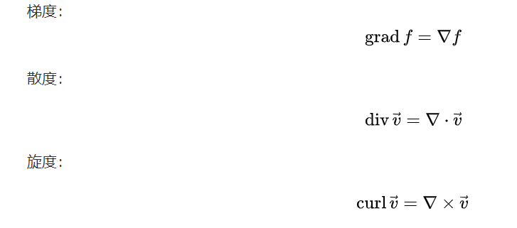

### 梯度

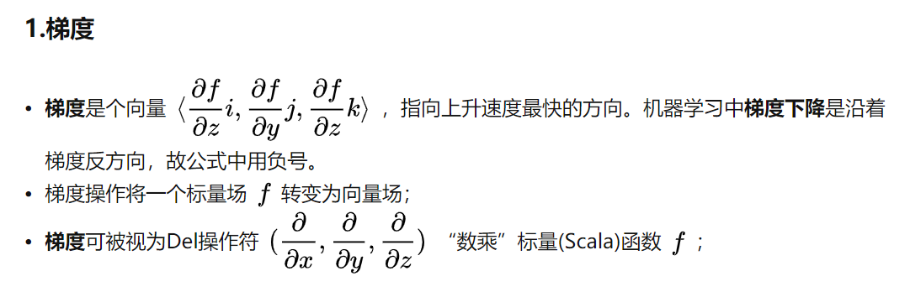

### 散度

- 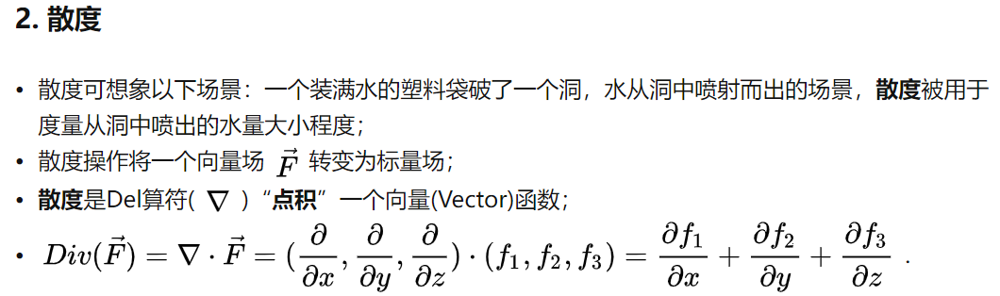

### 旋度

- 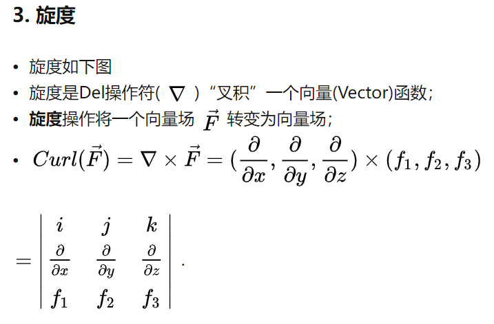

### 小结

- 梯度无旋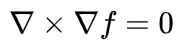
- 旋度无散,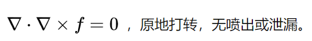

- 拉普拉斯算子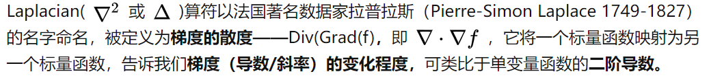
  - 图像处理中可以用于边缘检测

- 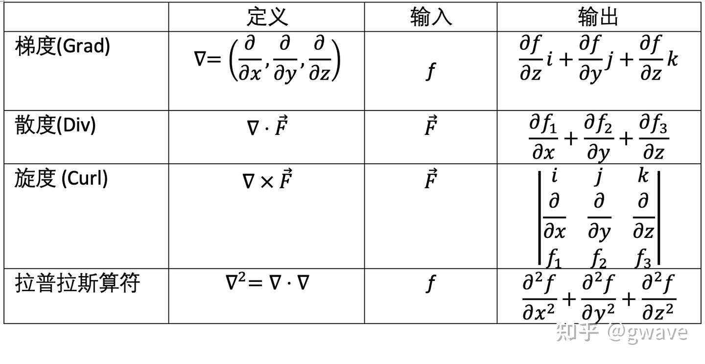

## 2 三大偏微分方程

### 拉普拉斯方程

- 椭圆方程

- 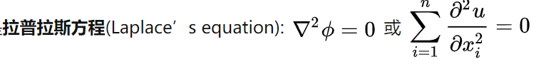
- 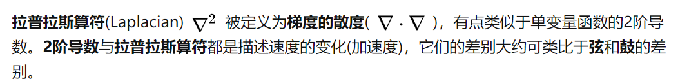

- Laplacian等于0的函数被称为Harmonic，这种函数描述的场景是：每个点的函数值等于它周围点的平均函数值。

- 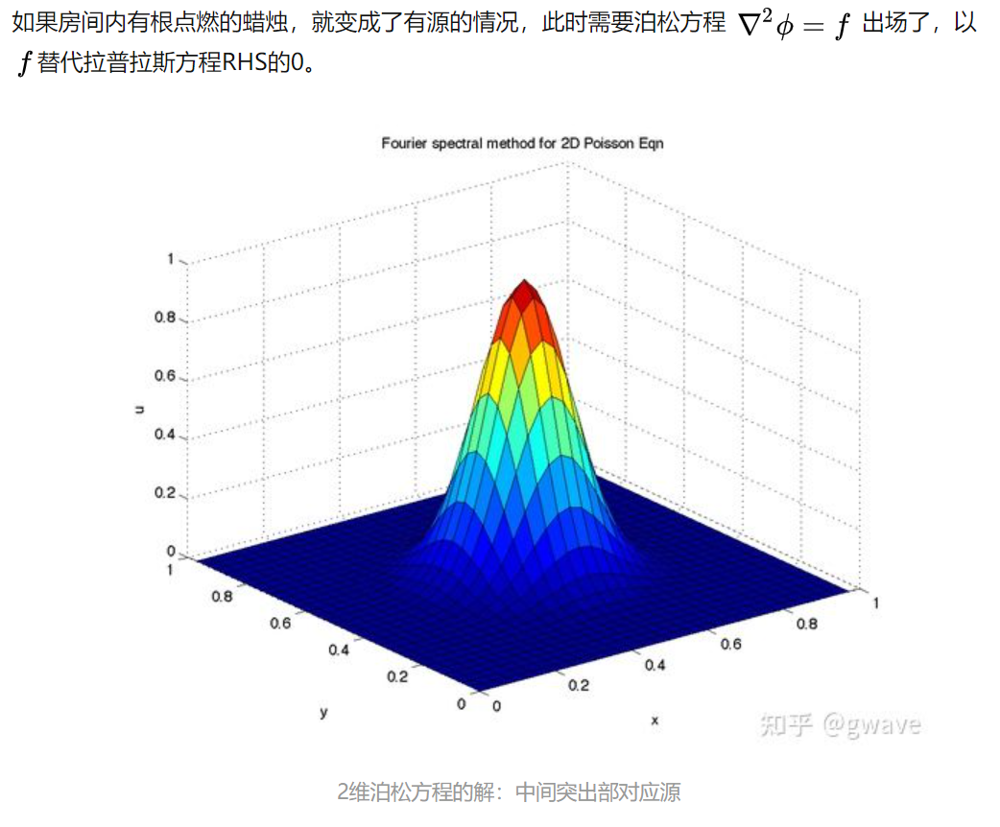

### 热方程

- 抛物线方程
- 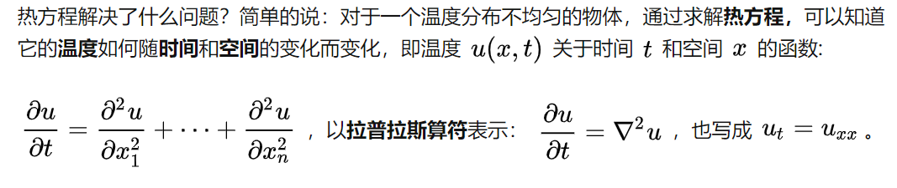

- 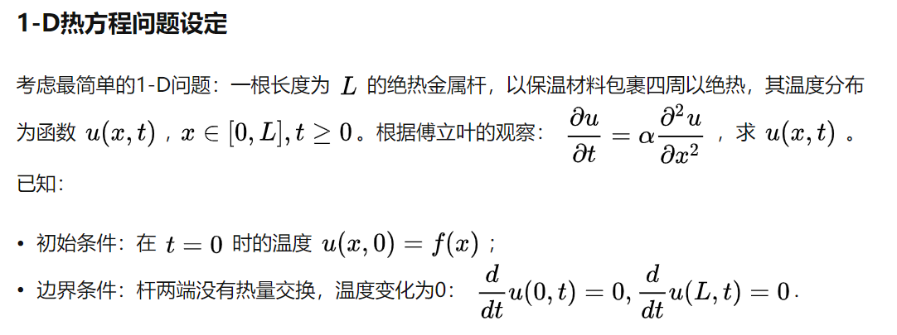

- 从特殊到通用:假设 u = sin

  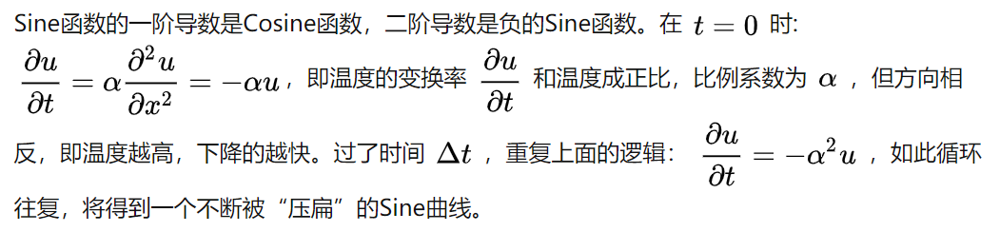

  

- 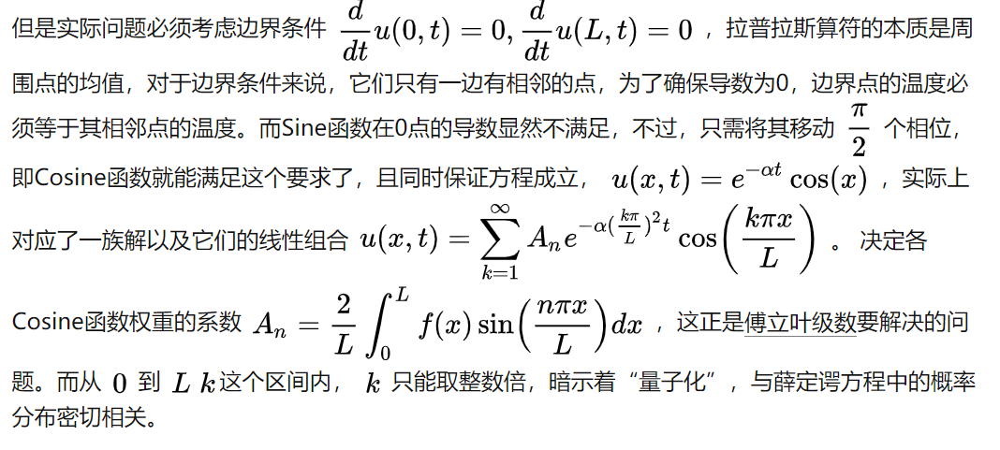

### 波方程

- 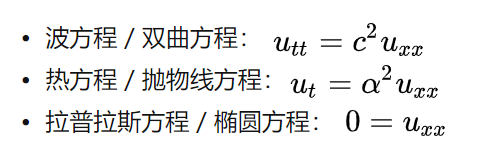

- 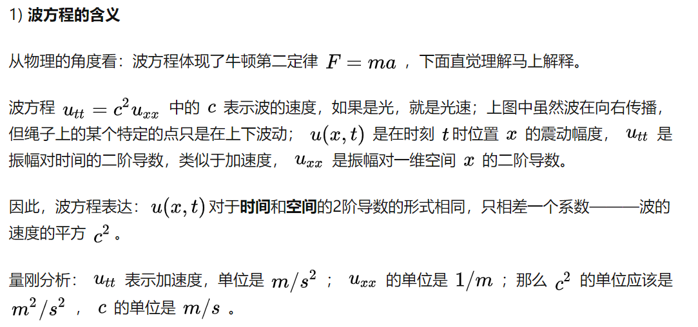

## 参考来源

- [Del算符与梯度、散度、旋度与Laplacian](https://zhuanlan.zhihu.com/p/349328782)

- 