# HeadFirst设计模式 笔记

- [ ] 书籍作者   Eric Freeman &  Elisabeth Freeman & Kathy Sierra & Bert Bates
- [ ] 2020.11.20

## 一  介绍设计模式(策略模式)

### 模拟鸭子应用

> 1. 设 计 了 一 个 鸭 子 超 类 （Superclass），并让各种鸭子继承此超类。  
> 2. 让鸭子能飞   ==>  橡皮鸭子能飞!!!
> 3. 改用 接口        ===> 代码无法复用
>
> 怎么办???????
>
> 

- [ ] `设计原则` 找出应用中可能需要变化之处 ，把它们独立出来，不要和那些不需要变化的代码混在一起。  (抽象)
- [ ] `设计原则` 针对接口编程 ，而不是针对实现编程  
- [ ] `设计原则`  多用组合，少用继承。  

> 总结: 将变化的行为抽象(接口或者抽象类),之后再进行组合,实现通用性

`『策略模式』` 定义了算法族，分别封装起来，让它们之间可以互相替换 ，此模式让算法的变化独立于使用算法的客户。  

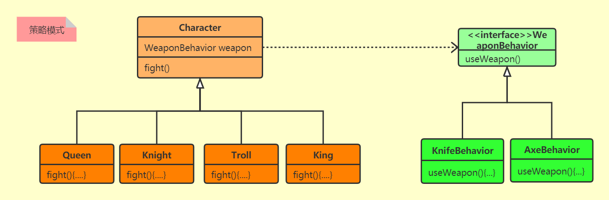

## 二  观察者模式

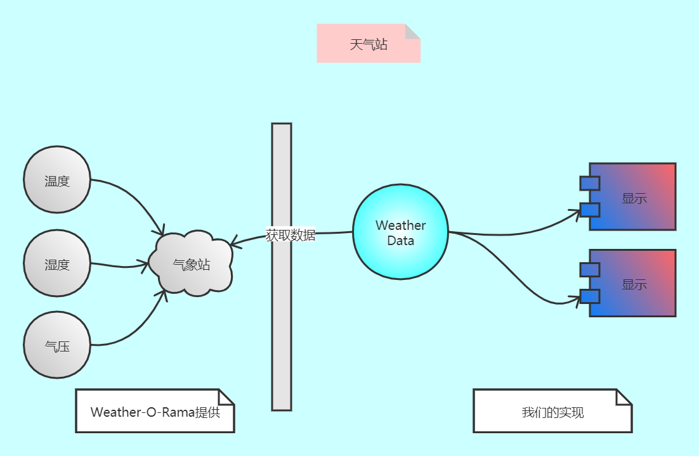

> **出版者**+**订阅者**=**观察者模式**  
>
> 定义了对象之间的一对多依赖，这样一来，当一个对象改变状态时，它的所有依赖者都
> 会收到通知并自动更新。  

`设计原则`为了交互对象之间的松耦合设计而努力。  

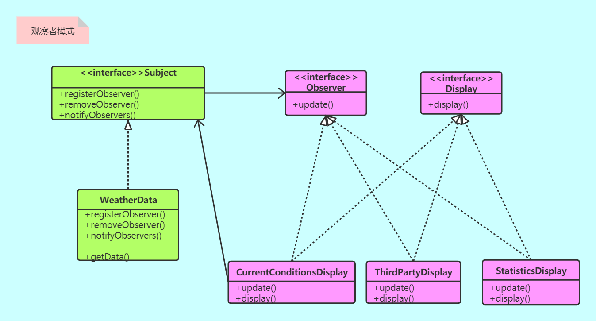

- Java内置观察者一些问题说明:

  > 1. 可观察者是一个“类”而不是一个“接口”，更糟的是，它甚至没有实现一个接口。 
  > 2. Observable将关键的方法保护起来  
  > 3. 如果你能够扩展java.util.Observable，那么Observable“可能”可以符合你的需求。
  >    否则，你可能需要像本章开头的做法那样自己实现这一整套观察者模式。   
  >
  > 
  >
  > **JDK观察者模式的应用:**
  >
  > - 其实在JavaBeans和Swing中，也都实现了观察者模式  JButton
  >
  > 

## 三 装饰模式

`开闭原则` 类应该对扩展开放，对修改关闭。  

> 问题:
>
> 星巴兹咖啡,有调料.需计算价格
>
> 装饰者可以在所委托被装饰者的行为之前与/或之后，加上自己的行为，以达到特定的目的。  
>
> `装饰者模式`动态地将责任附加到对象上。若要扩展功能，装饰者提供了比继承更有弹性
> 的替代方案。  
>
> 通常装饰者模式是采用抽象类，但是在Java中可以使用接口。尽管如此，通常我们都努力
> 避免修改现有的代码，所以，如果抽象类运作得好好的，还是别去修改它  

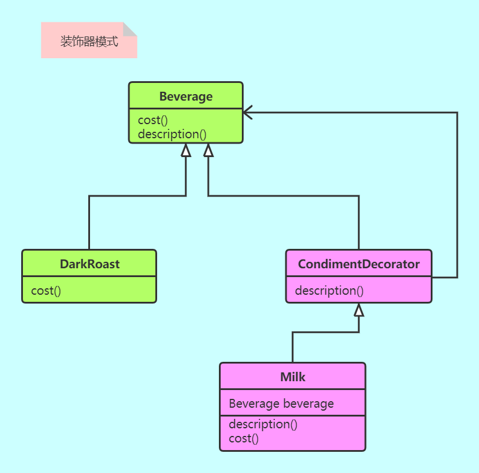

- [ ] 一些问题
  - [ ] 小类很多
  - [ ] 有些代码会依赖特定的类型，而这样的代码一导入装饰者，嘭！出状况了！  
  - [ ] 采用装饰者在实例化组件时，将增加代码的复杂度。一旦使用装饰者模式，不只需要实例化组件，还要把此组件包装进装饰者中， 天晓得有几个。  

## 四 工厂模式

> 当出现 new 就说明针对具体编程,期望出现一个帮助自动创建对象的对象

### 1 不是模式的 `简单工厂模式`

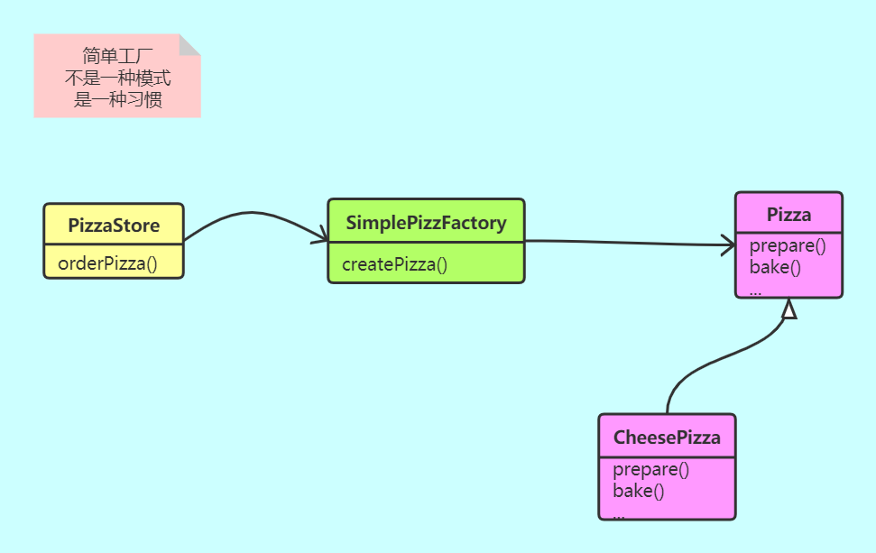

**问题:** 假如需要不同地区/工艺的披萨该如何生产

### 2 `工厂方法模式` 定义一个创建对象的接口,但由子类初始化.推迟实例化

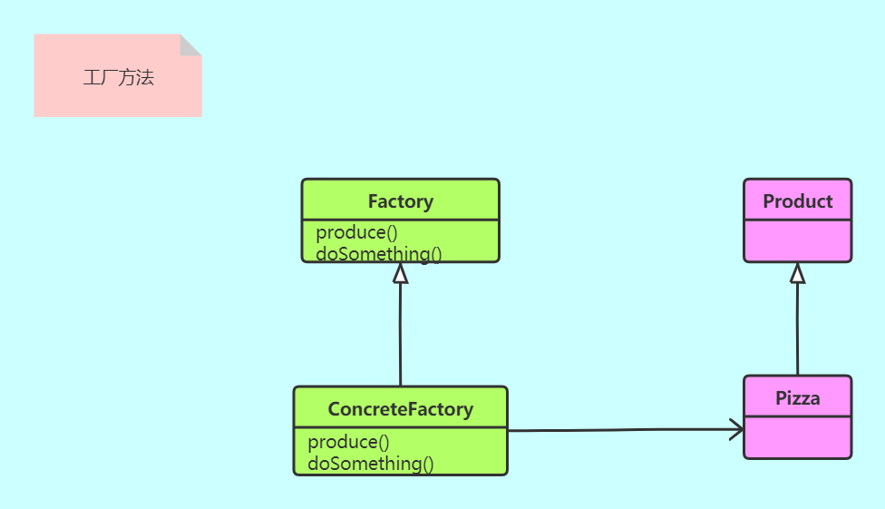

问题: 扩展时候要同时增加工厂类和产品类,类爆炸???

**只生产一种产品**

`依赖倒置原则` 依赖抽象,不要依赖具体实现

> **一些建议**:
>
> 1. 变量不要持有具体类
> 2. 不要继承具体子类
> 3. 不要覆盖基类方法

### 3 `抽象工厂`

- [ ] 2中的一些问题:

  > ​    不同区域的披萨店用的组件和步骤虽然一样,但是每种组件的制作方式又有差别,比如同一种酱汁有不同的原料

- [ ] 建立原料工厂 (生产一堆产品)

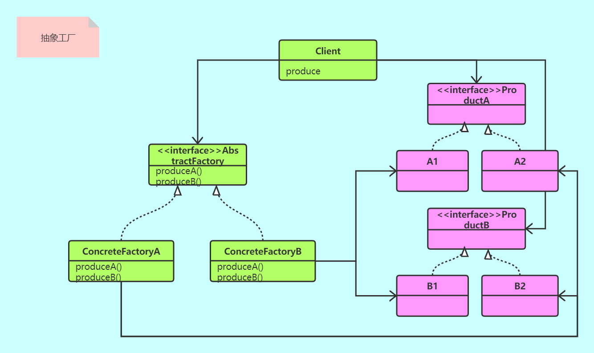 

### 4 区别

1. 工厂方法 使用的是继承方式, 扩展的时候需要继承工厂和产品
2. 抽象工厂 使用的是实现方式,扩展的时候需要实现具体工厂和具体产品(通常是一系列产品)

## 五 单例模式

解决多线程下单例模式 问题

1. 使用饿汉模式,不要延迟创建
2. 双重检查加锁(记得用volatile,禁止指令重排)
3. 一些问题: 多个类加载器可能会有多个实例,可以通过指定同一个类加载器解决

## 六 命令模式

引入 遥控器控制

> 将"请求"封装成对象, 以便来用不同的请求,队列或者日志来参数化其他对象. 可支持撤销操作

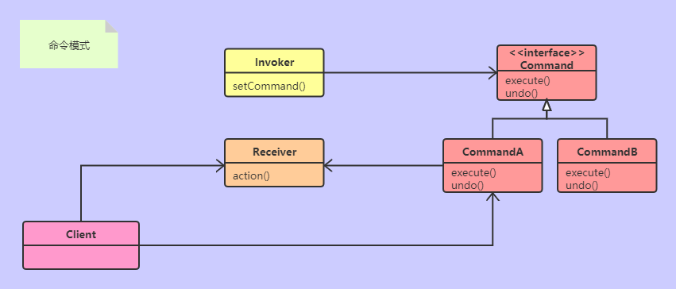

> undo() 的实现可以通过维护一个变量记录上一次的命令,也可以是一个栈实现多次撤销
>
> 可以创建一个宏命令,里面维护多个命令,一次调用多个命令的组合

**更多应用:**

1. 请求队列  (工作队列的一段是命令不停添加,另一端是多个线程不断取走命令并执行execute()

   应用有: 线程池  工作队列   日程安排  Web服务器

2. 日志请求  (将命令持久化,当宕机时候重新加载命令)

## 七 适配器模式 和 外观模式

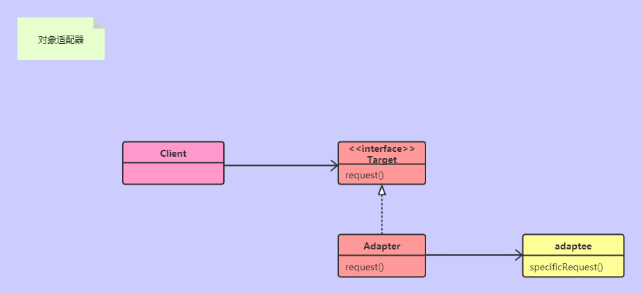

类适配器使用继承,但是Java不支持多继承

- [ ] **目的**: (转换接口)将一个类的接口转换为另一个类的接口

- [ ] **外观模式:** (目的是简化接口) 提供了一个统一的接口,用来访问系统中的一群接口.外观模式定义了一个高级接口,隔离了子组件

`最少知识原则` 只和密友谈话

​	

## 八 模板方法模式

- [ ] 在一个方法中定义一个算法骨架,将一些步骤推迟到子类实现.模板方法使得子类可以不改变算法骨架的情况下重新定义一些算法步骤

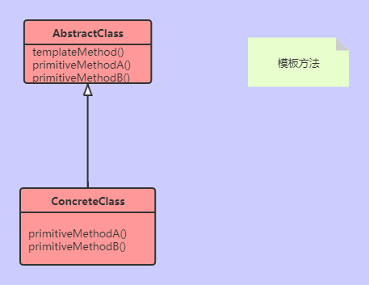

一些说明:

1. 当必须子类实现的时候采用抽象方法,可选的部分可以采用钩子
2. 抽象方法不宜太多

`好莱坞原则` 别调用我们(高层组件),我们会调用你(底层组件)

## 九 迭代器模式 和 组合模式 

> 引入: 需要合并两种类型的菜单(使用不同的存储方式),如何统一遍历?

迭代器模式**: 提供了一种顺序遍历一个聚合对象内部元素的方式,而又不暴露内部细节的方法

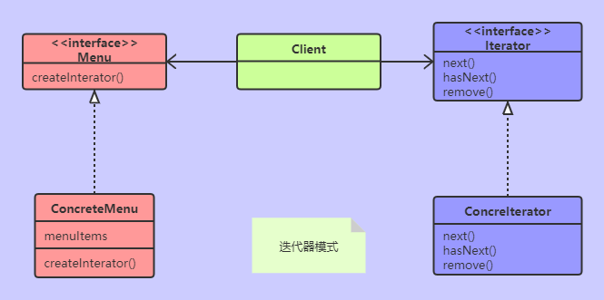

> 有内/外迭代器,可以将操作传给内迭代器,相对而言弹性较差但是使用简单;
>
> 区分: 可以得到迭代器对象并跨越它(外部) , ==>常见的Iterator对象,增强for循环都是
>
> ​			不能得到迭代器对象(内部)				==>流操作的forEach()
>
> ArrayList使用的是外迭代器,虽然它声明了内部类Itr

`单一职责` 一个类应该只有一个引起变化的原因

> 引入:  假如菜单项是 子菜单 该如何处理?

**组合模式**: 允许将对象组合成部分和整体的关系(注意: 这里违反单一职责 抽象类居然有两个责任)

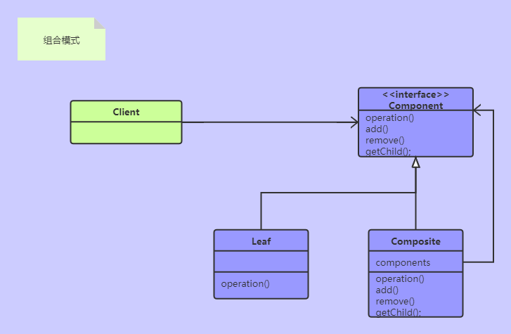

> > 将两者结合起来,组合迭代器

## 十 状态模式

> 策略模式和状态模式是双胞胎,在出生时才分开
>
> > 引入: 糖果机抽奖
> >
> > 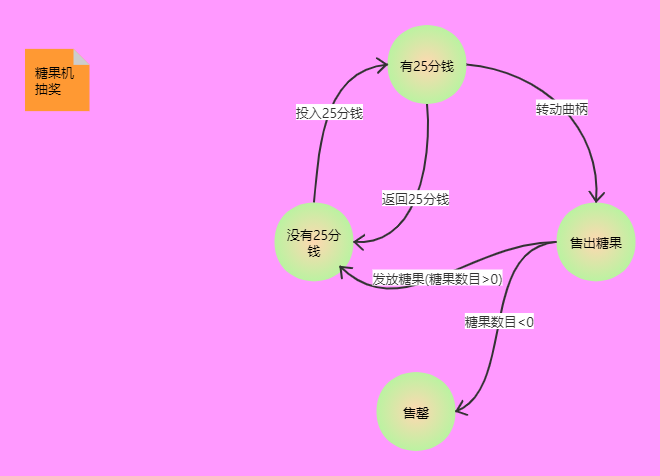

设计实现:

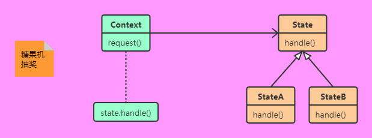

**状态模式** : 允许对象在内部状态改变时改变他的行为,看起来好像修改了它的类

## 十一 代理模式

> 引入: 远程监控糖果机状态

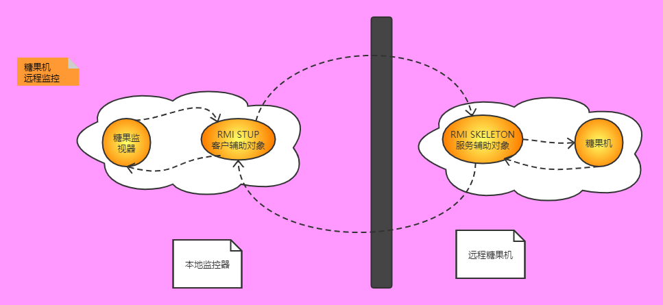

### **代理实现一: 远程代理**

为另一个对象提供替身/代理以控制对这个对象的访问

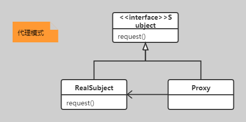

> RMI使用步骤:
>
> 1. 声明一个接口(假设叫IMyRemote)用于stup和skeleton之间传输的,该接口必须继承 Remote 和 Serializable
> 2. 服务器端 要传输的类 必须实现 IMyRemote
> 3. 服务器端启动 registry ,将要传输的类实例化并绑定到 registry 里面
> 4. 客户端 获取 registry,利用registry获取对象,记得要用IMyRemote进行接收
>
> ====================================================
>
> `注意` 
>
> 1. 出现一些问题.默认端口是1099,默认主机是localhost或者127.0.0.1
> 2. 假如要传输的类没有实现Remote接口,启动不会报错,但是接收端会出现类型转换异常

### 代理实现二 ;**虚拟代理**

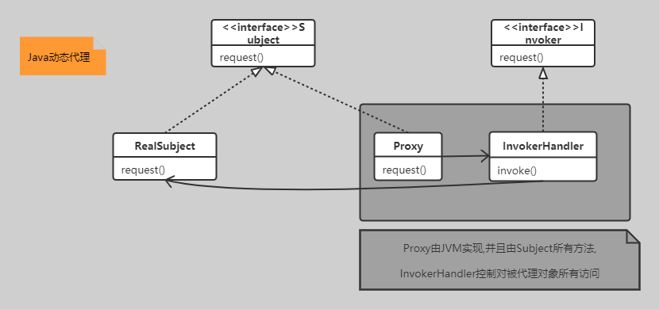

其他 代理形式:

1. 缓存代理
2. 防火墙代理
3. 智能引用代理
4. 同步代理
5. 复杂隐藏代理
6. 写时复制代理

## 十二 复合模式

多个模式一起工作

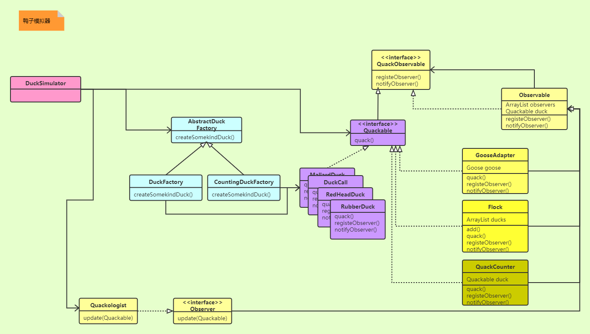

> 重点 : MVC模式

1. 示意图

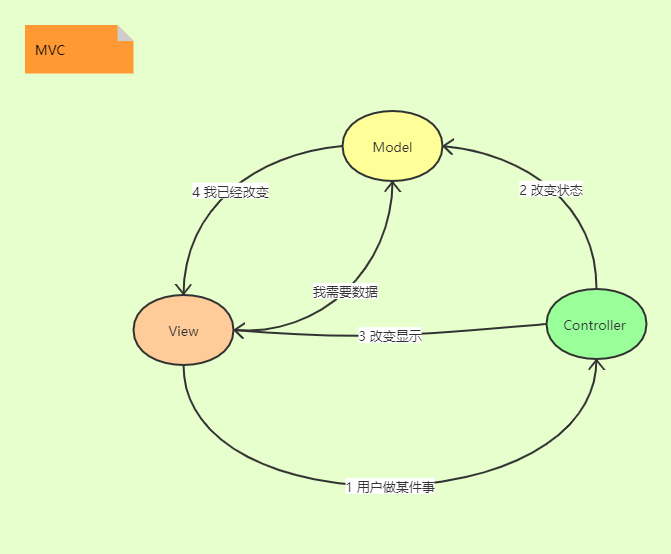

>  说明 :
>
> View和Controller使用了策略模式,View还有组合模式
>
> Model使用了观察者模式
>
> 其中一些会穿插 适配器模式 

## 最后 更多的模式

1. 桥接模式
2. 生成器模式
3. 责任链
4. 蝇量模式
5. 解释器模式
6. 中介者模式
7. 备忘录模式
8. 原型模式
9. 访问者模式

---

> 书籍推荐:
>
> <<Design Patterns>>作者   Erich Gamma/ Richard Helm / Ralph Johnson / John Vlissides
>
> <<The Timeless Way of Buiding>>
>
> <<A Pattern Language>>

