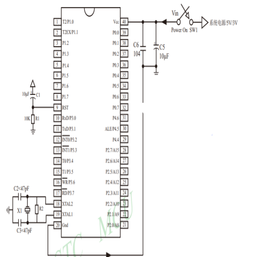
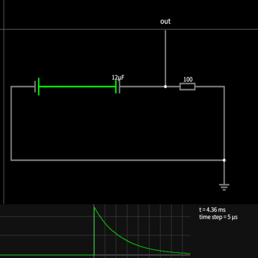

# 51单电机学习

- [ ] 参考来源: [单片机入门教程](https://www.bilibili.com/video/BV1uN411M7PB?spm_id_from=333.788.videopod.episodes&vd_source=75d343d583130dcc21675fbeadb22044&p=3)
- [ ] 笔记时间: 20260228

## 开发环境与工具

### Keil5

Keil5（Keil uVision 5） 是由 ARM（原 Keil 公司） 提供的一套嵌入式开发环境。支持经典的 8051 单片机架构（通过 C51 编译器套件）。

### 8051 芯片介绍

8051 是一种经典的 8 位微控制器架构，由 Intel 公司于 1980 年代首次推出。它被广泛用于嵌入式系统、消费电子设备和工业控制等领域。
AT89C51 是一款基于经典 8051 架构 的 8 位单片机，由 Atmel（后被 Microchip 收购）推出，是 8051 系列中最经典、最常见的型号之一。

| 特性             | 描述                       |
| ---------------- | -------------------------- |
| CPU              | 8 位                       |
| 结构             | 哈佛结构（程序和数据分离） |
| Flash 程序存储器 | 4 KB                       |
| 内部 RAM         | 128 B                      |
| 可编程 I/O 口    | 32 个                      |
| 16 位定时器      | 2 个                       |
| 串口             | 1 个                       |
| 中断源           | 5 个                       |

- AT89C51 采用标准 8051 指令集
  | 寄存器/部件   | 位数 | 功能简述                 |
  | ------------- | ---- | ------------------------ |
  | 8 位 ALU      | 8    | 算术逻辑运算单元         |
  | 累加器 ACC    | 8    | 累加运算结果，通用寄存器 |
  | B 寄存器      | 8    | 乘除运算辅助寄存器       |
  | PSW 状态字    | 8    | 存放运算标志位           |
  | 程序计数器 PC | 16   | 指向下一条待执行指令地址 |
  | 堆栈指针 SP   | 8    | 指向内部 RAM 堆栈顶部    |
- 时钟周期
  时钟周期（Clock Cycle）: 假设晶振是12MHz, 那么每个时钟周期的时间就是1/12us
  机器周期（Machine Cycle）: 经典8051 机器周期是12个时钟周期, 即1us
  指令周期（Instruction Cycle）: 每个指令周期包含多个机器周期, 具体取决于指令的操作类型和操作数。

1. 定时器每个机器周期只能计数1次, 所以定时器的计数周期是机器周期的倍数
   12 MHz → 1 μs 一个机器周期 → 定时器 1 μs 加 1
2. 串口波特率: 由定时器分频得到, 11.0592 MHz 特别适合 9600 波特率
   11.0592/(12x32x3) = 9600
3. 软件延时与中断响应时间
   - 软件延时: 利用定时器计数实现, 每个机器周期计数1次, 所以延时时间是机器周期的倍数
   - 中断响应时间: 需要机器周期保存现场,耗时变长

### 外部基本电路

#### 启动电路(RST)

- 外部复位引脚(RST): 低电平有效, 用于复位单片机
  由于电容两端电压不能突变,上电一瞬间,当成导线压降全在电阻; 随着逐步充电,电容右端电压逐渐下降,左端电压始终不变
  

#### 晶振电路(XTAL)

- 外部晶振引脚(XTAL): 用于提供单片机的时钟信号
  晶振是一种周期性振动的电子元件, 其频率由外部电路提供, 用于驱动单片机的内部时钟电路
  [皮尔斯振荡器](https://www.bilibili.com/video/BV1cC4y1M7oJ/?spm_id_from=333.337.search-card.all.click&vd_source=75d343d583130dcc21675fbeadb22044): 用一个反相放大器 + 晶体 + 两个电容，构成满足振荡条件的反馈环路，让晶体在自身共振频率上持续振动。
  [演示与讲解-SteveMould](https://www.youtube.com/watch?v=_2By2ane2I4)

