# 图灵完备思路

图灵完备(Turing Complete)，是一款在steam上的游戏，玩家需要设计数字电路，来实现各种功能。

### 基础逻辑电路

> 通关要求我们使用 NAND 电路完成门电路设计
> 需要使用到布尔逻辑运算和 De Morgan 定律

$$
\neg (A \land B) = (\neg A) \lor (\neg B)
$$

| 门电路 | 实现                                     | 思路                                                                                                               |
| ------ | ---------------------------------------- | ------------------------------------------------------------------------------------------------------------------ |
| NOT    |        | $A \operatorname{NAND} A = \neg (A \land A) = \neg A$                                                            |
| AND    |        | $A \land B = \neg \big(A \operatorname{NAND} B\big)$                                                             |
| OR     |          | $A \lor B = \neg \big(\neg A \land \neg B\big)$                                                                  |
| NOR    |        | $A \operatorname{NOR} B = \neg (A \lor B)$                                                                       |
| HIGH   |      | $1 \lor A = 1$                                                                                                   |
| second |  |                                                                                                                    |
| XOR    | 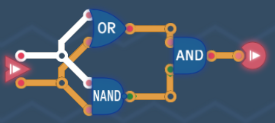       | $ A \operatorname{XOR} B = (A \land \neg B) \lor (\neg A \land B)$    使用 De Morgan 定律 可以变成四个nand门实现 |
| 3路OR  | 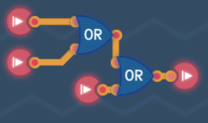       | 串联即可,3路and也是                                                                                                |

### 算数运算

> 基于上面的门电路实现加法 存储 编码 译码 等功能

#### 双数麻烦(Double Trouble)

> 计算4个输入中1的个数是否大于2个

思路:

1. 如果只有1个或者0个1 ,那么只要通过 and 任意两个输入就会得到 0
2. 如果两两and, 那么只有当两个输入都是1时, 才会得到1
3. 对所有结果进行or, 那么只有当有超过2个1时, 才会得到1
   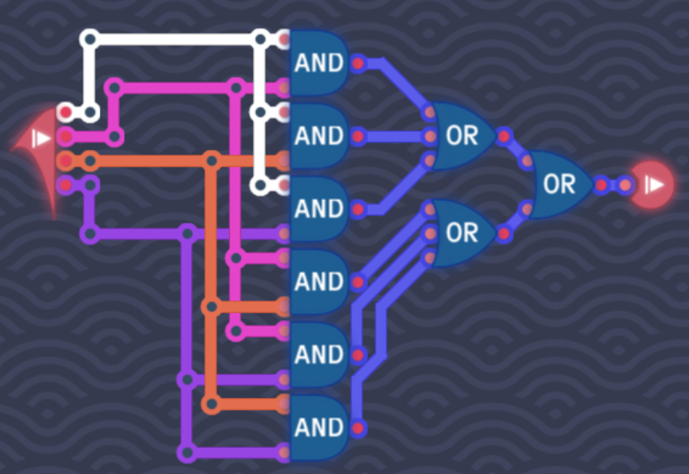

#### 奇偶个数(Odd Number of Signals)

> 计算输入1的个数是否为奇数

思路: 使用 异或 门电路,异或所有输入, 最后结果就是1的个数是否为奇数

#### 信号计数(Counting Signals)

> 计算输入里面 1 的个数并存储到三个输出中,分别为二进制的0 2 4位, 即输出000 001 010 011 100

思路:

1. 最低位只有 0 1 两种情况, 也就是奇偶,使用上面的 奇偶个数 电路, 就可以得到最低位
2. 最高位只有4个1,所以通过 and 门, 每个and门的输入分别为 输入0 输入1 输入2 输入3, 就可以得到最高位
3. 中间位只有只要大于2个1就可以设置为1, 所以通过 双数麻烦 电路, 就可以得到中间位
4. 考虑有四个1 ,输出是 100,所以中间位需要排除这个情况
   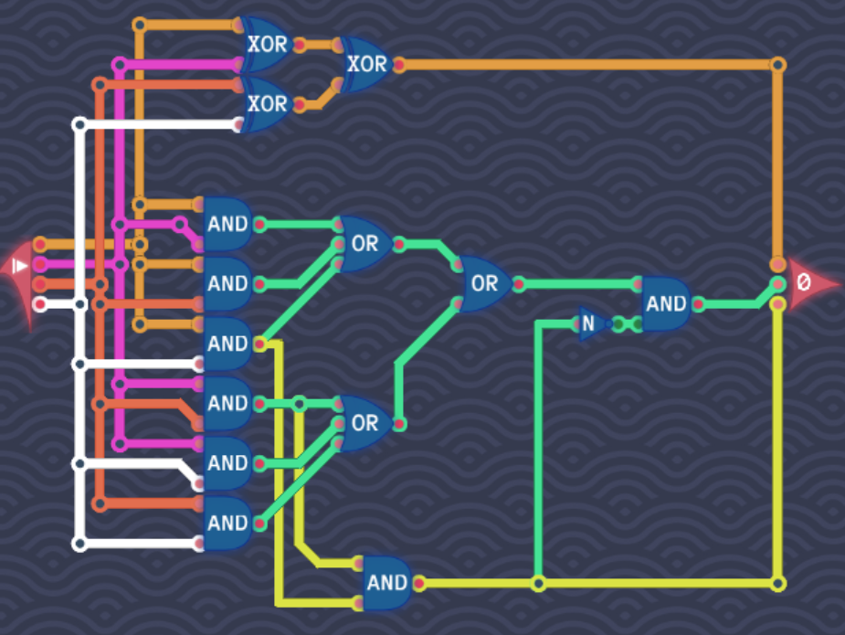

#### 半加器(Half Adder)

> 计算两个二进制位的和, 并输出结果和进位

思路:

1. 结果位 = 输入位1 异或 输入位2
2. 进位位 = 输入位1 与 输入位2 (两个1才需要进位)
   

#### 全加器(Full Adder) 

> 计算三个二进制位的和, 并输出结果和进位

思路:

1. 结果位 = 输入位1 异或 输入位2 异或 输入位3 (奇偶个1)
2. 进位位 = 只要有2个1 就发生进位
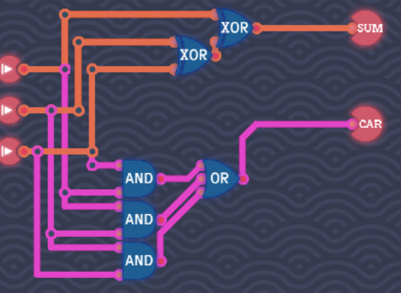

#### 8位全加器(Adding Bytes)

> 计算8个二进制位的和, 并输出结果和进位
> 其他8位逻辑运算也是类似的思路, 只是需要不同门电路

思路:

1. 单独计算每一位的和, 串联起来
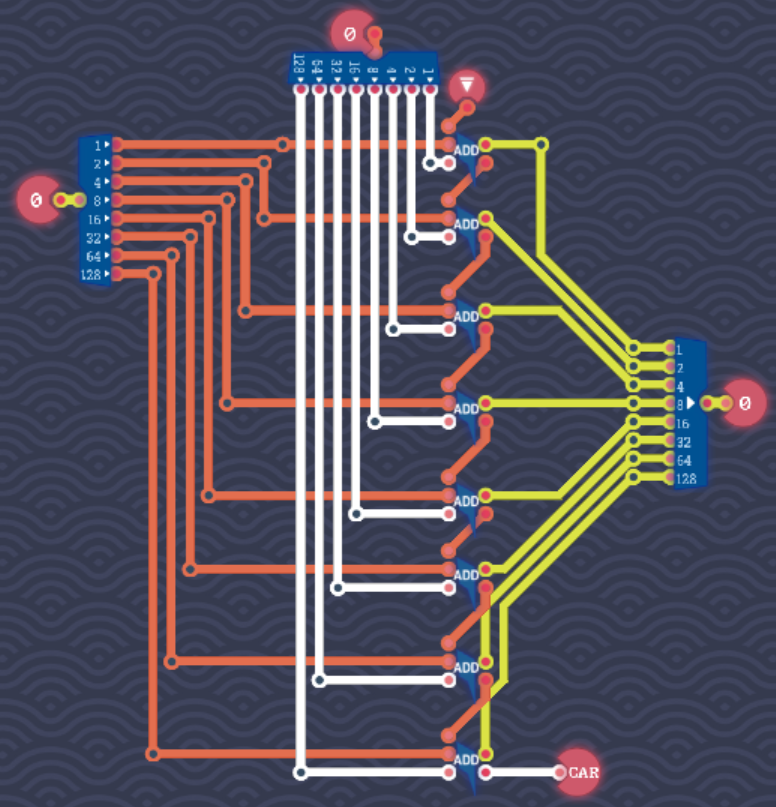

#### 1位解码器(Decoding Bits)
> 输入一位二进制数, 输出2位二进制数, 只有对应位为1, 其他位为0

#### 3位解码器(Decoding Triples)
> 输入3位二进制数, 输出8位二进制数, 只有对应位为1, 其他位为0
> 用到了最小项的概念, 每个输出位都是输入位的最小项

思路:
1. 每个输出位都是输入位的最小项, 例如输出位0 就是 输入位0 与 输入位1 与 输入位2 的与门
2. 其他输出位也是类似的思路, 只是需要不同的输入组合 
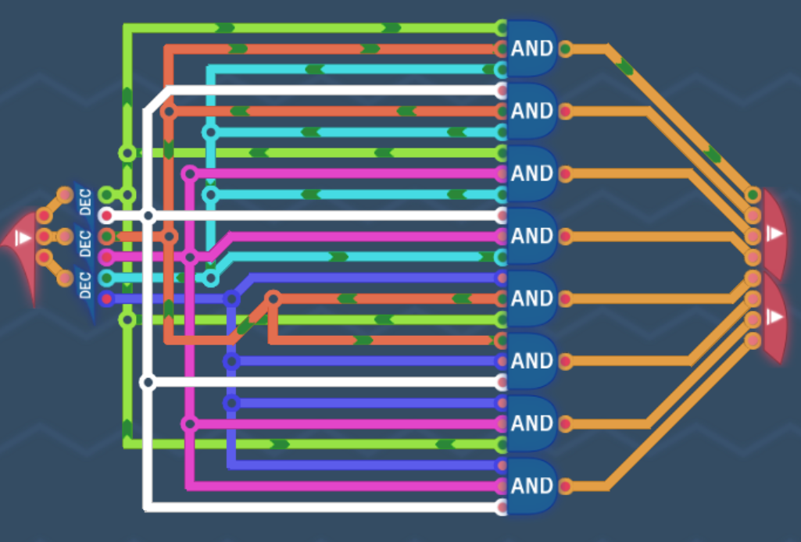

#### 相反数
> 对输入获取补码形式的相反数 补码 = 取反 + 1

#### 逻辑引擎(Logic Engine)
> 对两个输入进行运算,指令通过编码输入,0是and,1是or ...

思路:
1. 解码器解码,每次只能让一个运算结果输出
2. 运算参与的数字是 8 位,控制信号是 8 位,解码后是 1 位
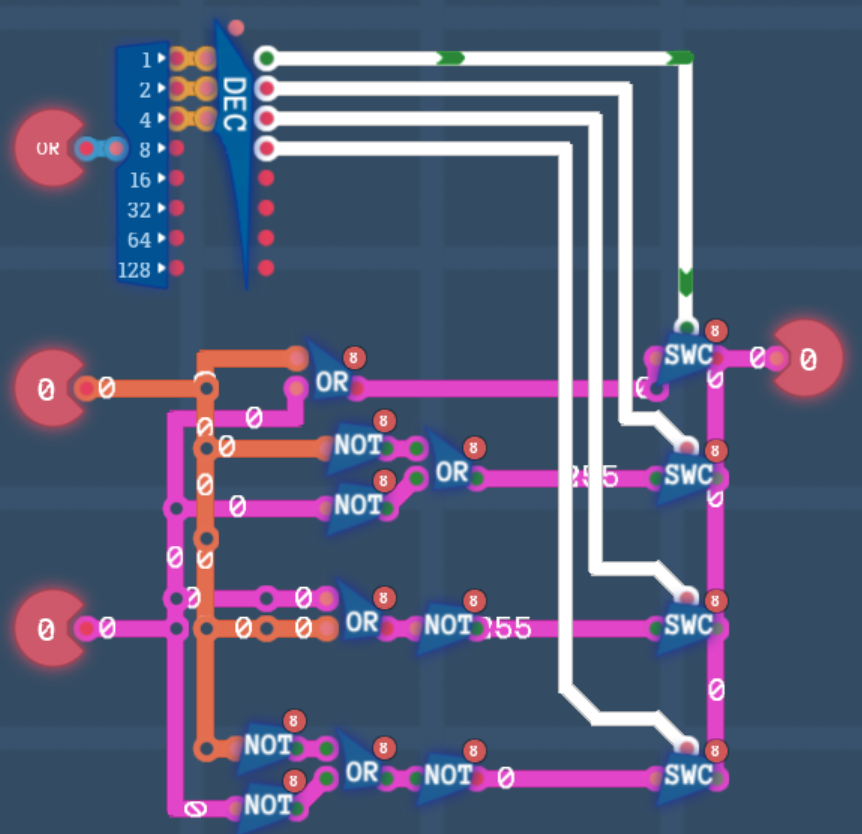

### 存储

#### 奇变偶不变(Flip Flop)
> 0/1 交替输出,提供了一个可以延迟1个时钟周期的组件

思路:
1. 用一个寄存器存储上一个时钟周期的输出
2. 每个时钟周期, 直接取反放到输入
  

#### 1位取反(Inverting Bit)
> 当控制信号为1时, 输出取反; 否则输出不变
> 真值表和 xor 相同

#### 数据选择器(Input Selector)
> 根据控制信号, 选择不同的输入到输出; 提供了一个switch组件,可以控制信号是否输出,并且输出可以共线

思路:
1. 控制信号同时输出一组相反信号,那么就只有1个信号会输出到输出端
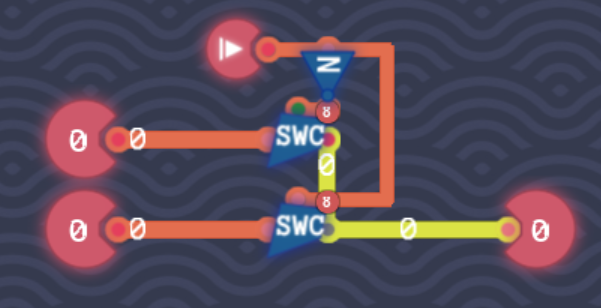

#### 优雅存储(Saving Gracefully)
> 当控制信号为1时,存储新的输入到输出; 否则输出不变

思路:
1. 存储使用延迟组件,可以延迟1个时钟周期
2. 输入要么不变,要么是新的输入(直接复用数据选择器)

#### 存储字节(Saving Bytes)
> 存储8个二进制位

思路:
1. 用8个寄存器存储8个二进制位
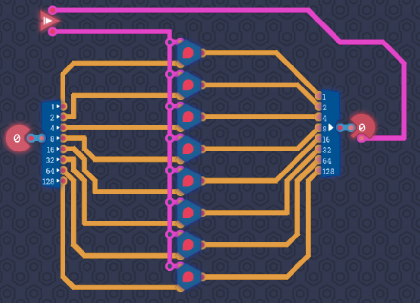

#### 小盒子(Little Box)
> 根据地址(A0,A1,B0,B1),选择不同的寄存器,进行写入或者输出

思路: 
1. 使用两位解码器,选择不同寄存器进行写入或者输出
2. 对写入和输出控制信号进行与门,只有寄存器被选中并且读取/写入才允许操作

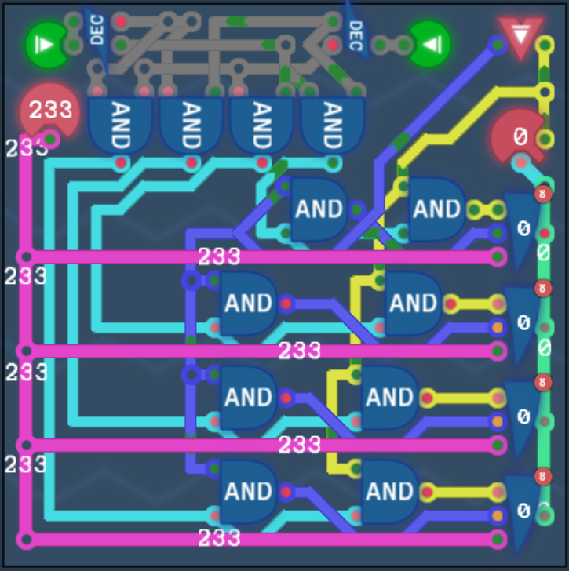

### 处理器架构
#### 算数引擎(Arithmetic Engine)
> 对两个输入进行运算,指令通过编码输入,0是 add ,1是 sub ...

思路:
1. 和逻辑引擎一样的思路,通过解码器决定不同的运算
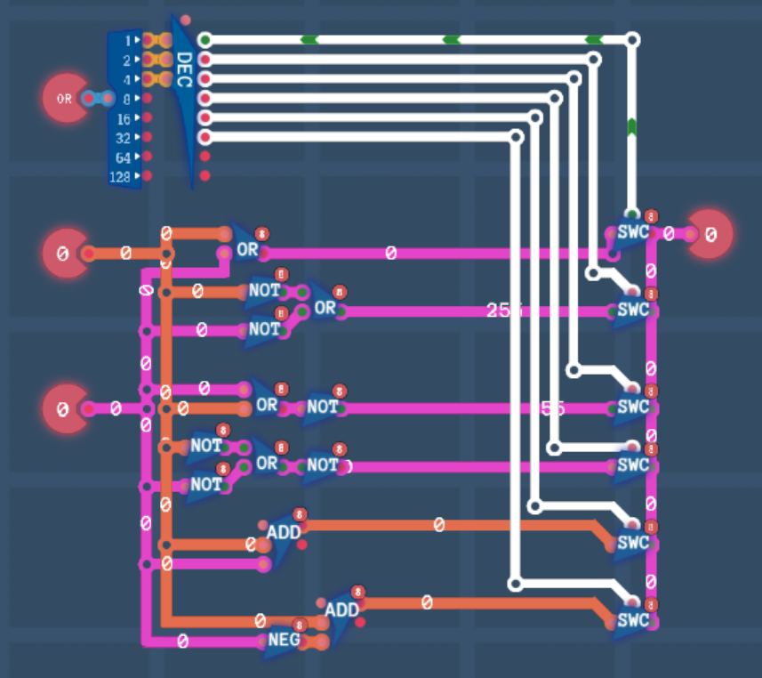

#### 指令解码器(Instruction Decoder)
> 对指令进行解码, 输出不同的控制信号

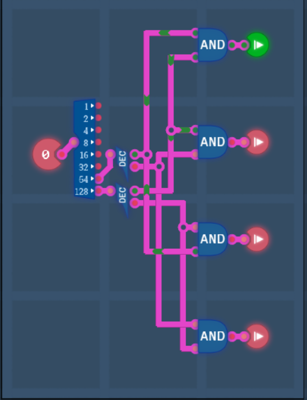

#### 寄存器之间(Registers)
> 可以对指定的寄存器进行复制,比如 复制寄存器A到寄存器B
> 012 位是源寄存器地址, 345 位是目标寄存器地址 

思路: 
1. 对寄存器地址进行解码, 得到源寄存器和目标寄存器
2. 对源寄存器进行复制, 放到目标寄存器
3. 数据总线连接源寄存器和目标寄存器, 实现复制,通过地址选中控制输出还是输入
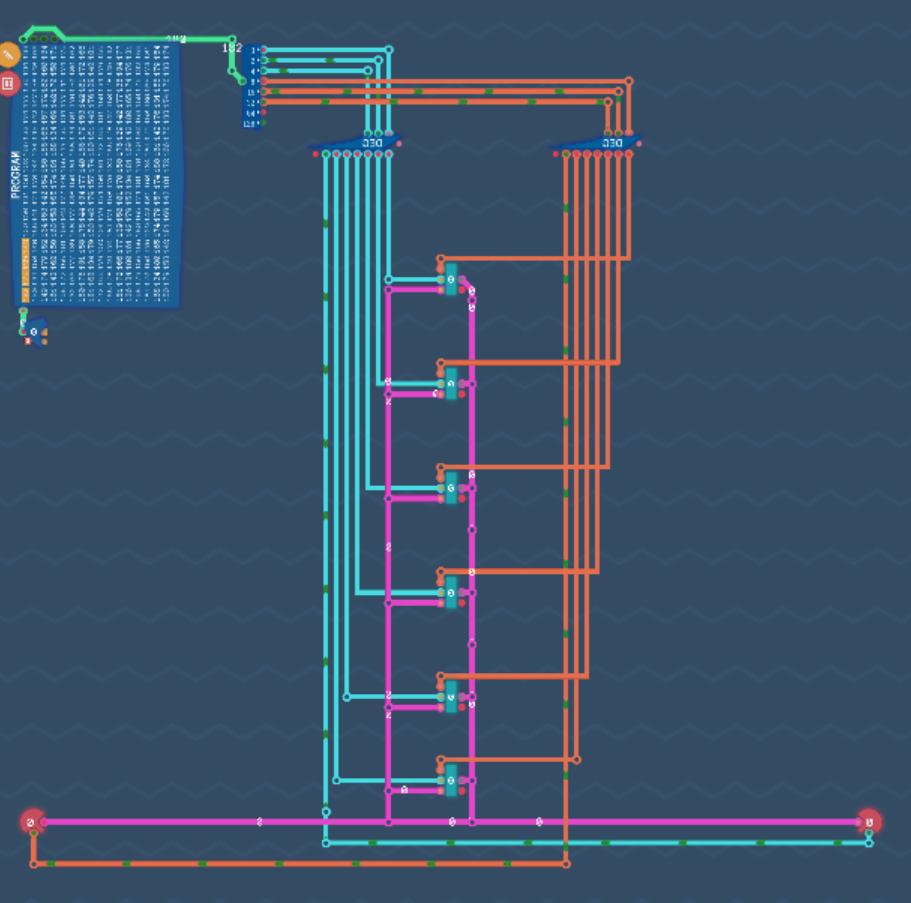

#### 计算单元(Computation Unit)
> 对寄存器中的数据进行运算, 并将结果放到寄存器中, r1 op r2 -> r3

思路:
1. 对指令进行解码,决定是复制模式还是计算模式
2. 连接输入寄存器到计算单元,结果放到输出寄存器
3. 使能结果寄存器
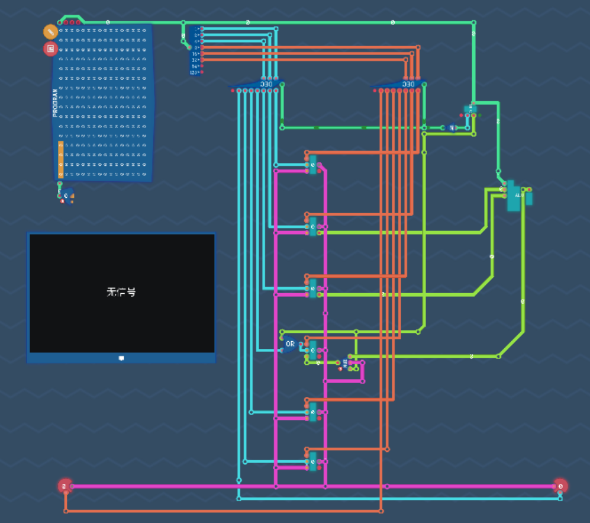

#### 条件判断
> 判断输入和0之间的关系,判断条件是否成立;条件由指令码决定

思路: 
1. 和运算单元类似, 只是运算不同
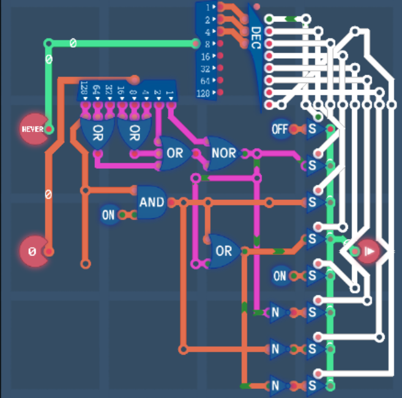

#### 图灵完备
> 基本的系统
1. 定时器会自增,每次从程序读取指令,地址解码器和解码器同时工作
2. 不同颜色代表不同模块,需要注意跳转时候需要禁止寄存器写入
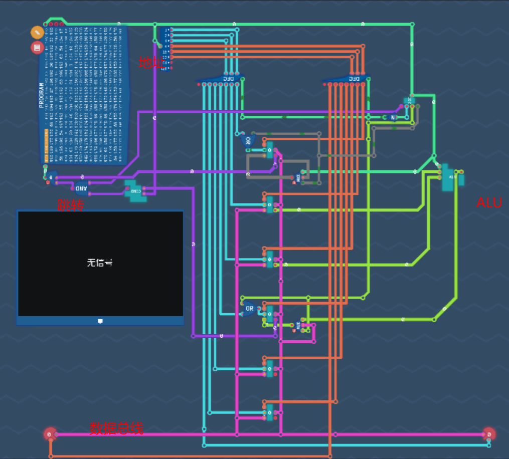

### 编程
#### +5
> 对输入的数据加5, 结果放到输出中

思路:
1. 输入复制到 R1
2. R1 加 5, 结果放到 R2
3. R2 复制到输出
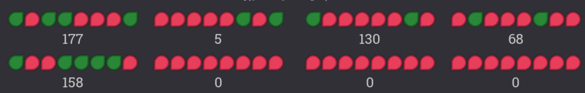

#### 密码锁
> 输出密码,如果错误,输入会提示大于还是小于

思路:
1. 从0开始不停加一并输出, 直到输出密码
2. 如果输入错误, 会提示大于还是小于密码
3. 如果输入正确, 会输出密码正确
4. 为了方便需要自定义指令,比如 inout,表示 in -> out ,自定义指令可以减少指令码的长度
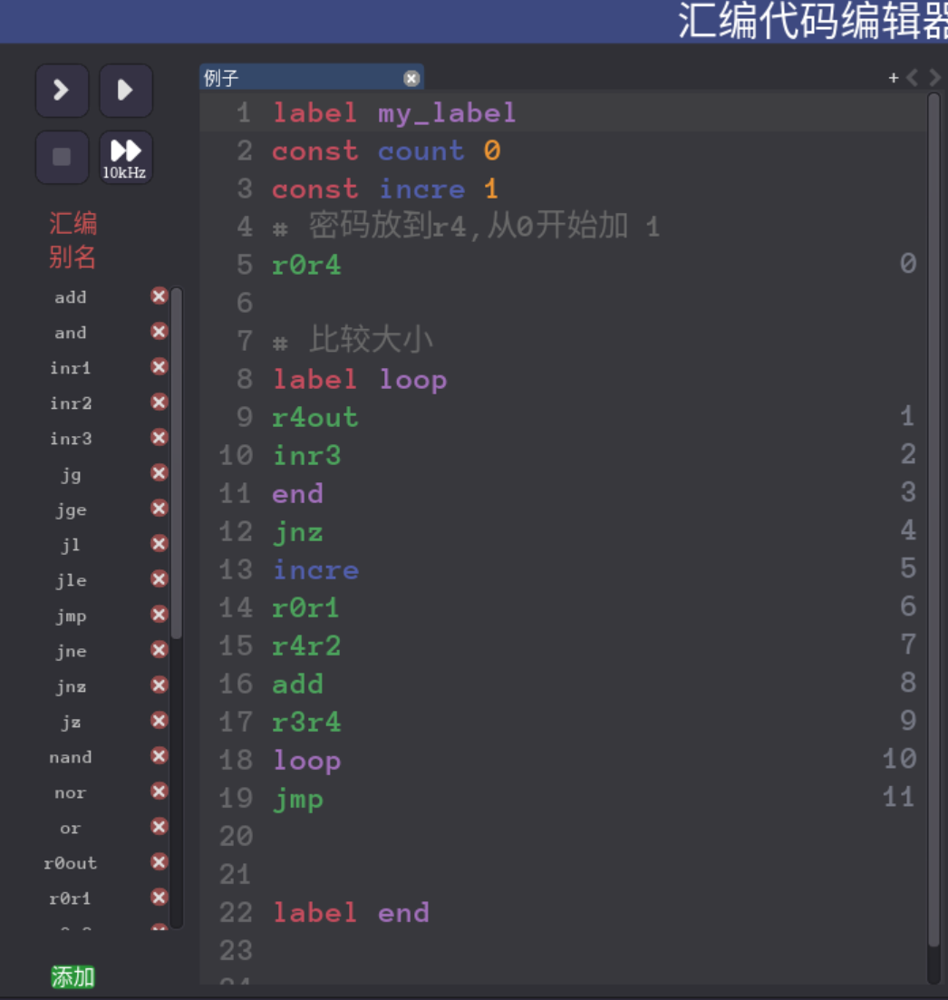

### 最终系统

思路:
1. 设置指令 call ,无条件跳转 ,将当前地址+4(返回时候下一行执行)保存到栈中
2. 设置指令 ret ,无条件跳转 ,将 栈顶 中的地址放到 PC 中,需要屏蔽寄存器写入
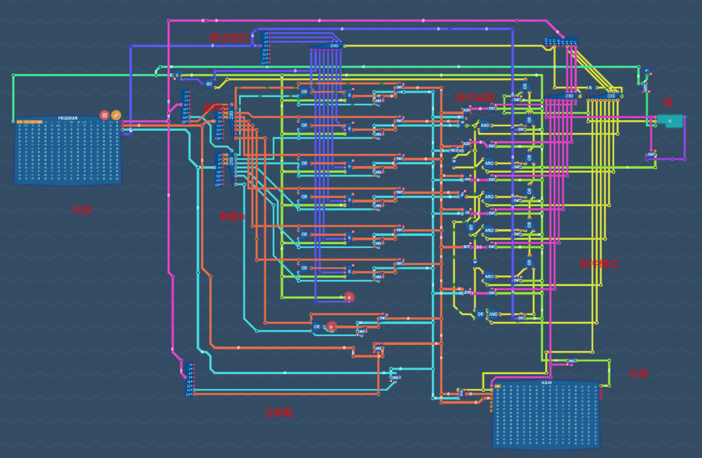
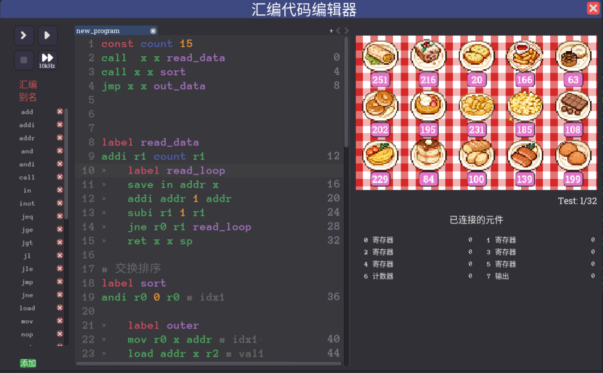