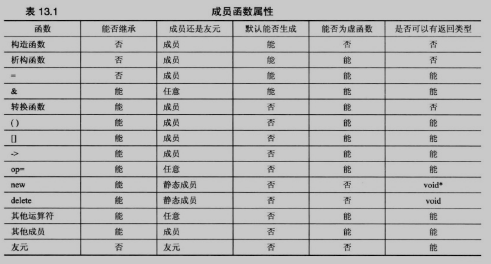
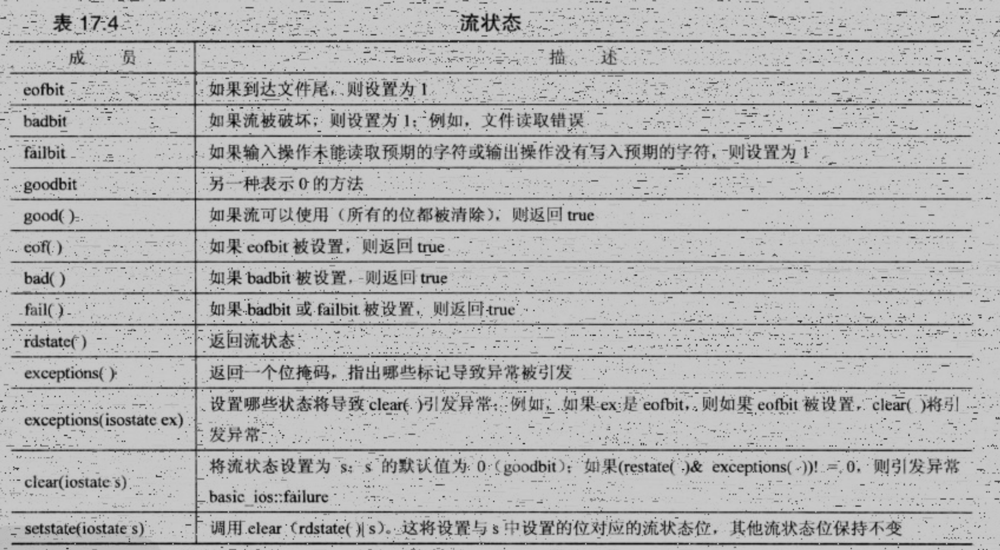

# C++ Primer

- [ ] 书籍作者：李普曼（Lippman,S.B.），拉乔伊（Lajoie,J.），（美）默（Moo,B.E.）
- [ ] 笔记时间：2021.9.1

## 第1章 预备知识

- 20世纪70年代，贝尔实验室为了开发Unix系统发明了C语言。此时提出了结构化编程，和自顶向下的设计。强调的是算法。

  数据（黄油，糖，鸡蛋）+	算法（奶油，加糖，打鸡蛋）→	程序（蛋糕）

- 20世纪80年代贝尔实验室开发。应对编写大型程序时带来挑战，出现了OOP，强调的是数据。带来的是自下向上的设计。
- C++的标准是ANSI/ISO C++
- 编译和链接
  - Unix系统：CC调用cfront，将C++生成C文件，再由C把编译器处理
  - Linux系统：使用的是g++，来自GNU
  - Windows系统：使用的是Cygwin和MinGW，当然也有GNU C++。祖传MSVC。
  - Macintosh系统：使用Xcode

## 第2章 开始学习C++

- 规则

  - 在dll不需要main，但是在特殊环境（机器人芯片，框架）可能会隐藏地调用main()，调用_tmain()

  - 预处理：预处理器将用到的文件内容添加到程序里，头文件没有后缀

  - 名称空间：使用using编译指令可以方便引入；用于隔离程序；

  - ```c++
    // C++ 主函数格式
    int main(){
    	return 0;
    }
    ```

- 语句 变量声明、赋值、函数、cout、cin

## 第3章 处理数据

- 数值类型没有固定长度，可以使用 sizeof 进行查看；可以使用花括号初始化  

- ```c++
  cout << hex << 123 << endl;// 7b
  cout.put('$');	//$
  cout << '$';	//36,Relase2.0以后不会打印ASCII码
  cout << \u222B;	//∫
  ```

- const常量比define更强大，作为常量的时候

- 基本运算、强转、引入auto

## 第4章 复合类型

- ```c++
  int nums[3]={1,2,3};	//可以使用 new 绕过大小限制
  short things[] = {1,2,3,4};
  int len = sizeof things / sizeof short;	//获取个数
  cin.getline();
  cin.get();				//留下换行符
  R("abc");				//R表示Row，("表示定界符开始
  int* arr = new int[10];
  delete [] arr;			//创建、释放对象
  ```

- cin.get() 读取空行后会设置失效位，使用clear()恢复。当字符串过长，getline()会留下字符并设置失效位。

- string是类型，需要引入；支持字符数组的初始化；

- 数组、结构体 不允许缩窄转换。结构体允许指定使用的位数，字段后面跟上 冒号位数

- Union适合类型会变化的变量

- 枚举：本身是只读的，但是可以参与数值运算

- 指针：声明时候带\*，使用时候\*表示解除引用，&表示取地址。指针一定要初始化后才使用。

  直接引用new 类型，内存不够会返回空指针对象，而不是0；

  使用delete释放new出来的对象，并且不要重复delete

  指针+1表示下一个元素。结构使用箭头运算，

- 内存管理方式

  - 自动存储：函数内部的常规变量
  - 静态存储：使用了static修饰，生命周期可能是类级别
  - 动态存储：new和delete

- 模板类

  - vector是动态数组，自动完成new和delete。效率稍低。
  - array固定长度，跟数据比方便一些。

## 第5章 循环和关系表达式

- 当表达式改变了内存中数据的值，称为表达式有副作用；比如c++

- 顺序点是程序执行过程的一个点，此处确保对前面所有的副作用进行了评估。

- 建立别名可以使用 #define 或者 typedef。

- C++11支持foreach

- cin 测试到达结尾可以使用 fail() / eof() 来获取输入结束，有可能使用-1来表示EOF，

  但是char 表示不了负数，可以以此为判断条件 。

- cin 的>>具有返回值，输入错误会得到0

## 第6章 分支语句和逻辑运算符

- 字符函数库cctype，判断字母、数字等工具类
- ofstream 文件写出流，文件读写的时候最好检测文件是否打开成功

## 第7章 函数——C++的编程模块

- 原型很重要，用好const修饰形参。

  ```c++
  int var = 10;
  const int * a = &var;	//不可以修改var的值内容，也就是只能是 *a = 10
  int *const  a = &var;	//不可以修改指针指向，也就是a只能指向var地址
  ```

- 结构比较小按值传递，比较大时候可以传递地址，需要使用箭头访问。还有引用传递可以解决指针表示的复杂问题。

- ```c++
  double (*pf) (int);		//传递 double pam(int) 类型函数
  double * pf (int);		//表示返回double*的函数pf
  double* (*pa[3])(int);	//函数指针数组
  ```

  

## 第8章 函数探幽

- 内联函数，使用inline修饰，典型的空间换时间

- 引用变量声明时候用 &表示，声明时候必须初始化。可以看成伪装的指针，是会修改传入参数的值的。

  - 配合const使用，能够是函数正确生成并使用临时变量。返回引用效率更高。
  - 数组使用指针，类对象使用引用

- 默认参数，必须从右往左添加，声明时指定，定义时候不用

- 函数重载

- 函数模板，也就是泛型（泛型类和泛型方法）

  ```c++
  template<typename T>
  void swap(T a,T b);		//模板原型
  template <> void swap<job>(job a,job b);	//显示具体化
  template void swap<char>(char a,char b);	//显示实例化
  
  // f
  template<class T1,class T2>
  auto gt(T1 x,T2 y) -> decltype(x+y)
  {
      return x+y;
  }
  ```

## 第9章 内存模型和名称空间

- 单独编译，将单个源文件编译再与其他文件链接，加快速度

- 存储持续性，也就是生命周期

  - 自动存储持续性，函数定义中声明的变量，函数结束自动释放
  - 静态存储持续性，static修饰的变量
  - 线程存储持续性，thread_local修饰
  - 动态存储持续性，new出来的变量

- 连接性描述名称如何在不同单元间共享，也就是可访问性

- const默认是文件可访问，mutable 表明局部可修改；

  函数自动为静态，全局，使用static设置为文件访问

- ```c++
  p2 = new (buf) chaff;	//将chaff放在buf里面
  p2 = new(sizeof chaff,buf)		//转为等价的new函数
  ```

- 名称空间

  - 支持嵌套，using时候最好使用限定，不要全部引入
  - 匿名空间可以限定在文件范围访问

## 第10章 对象和类

- 类中声明，实现用完全限定名

- 具有构造和析构函数，析构函数负责释放类中使用的new对象

  ```c++
  User user = User(1,2,3,4);	
  User user(10,"Jerry");			//显示调用构造函数，还支持列表初始化
  User* usr = new User(1,2,3,4);	//使用new，需要配合delete
  ```

- this是指针，返回对象需要解引用。数组初始化比较方便 。

- 类中常量使用枚举，也可以使用static常量

## 第11章 使用类

- 运算符重载、友元函数、

  ```c++
  User User::operator+(const User & u) const;	//重载运算符
  // 友元函数使得函数支持交换律
  friend User operator+(double m，const User& t);	//不用限定符
  operator double();		//转换函数
  ```

- 构造函数只有一个参数的时候会允许自动转换，需要关闭的话使用 explicit

  转换函数最好也使用explicit

## 第12章 类和动态内存分配

- 类会自动生成复制构造函数、默认构造函数、默认析构函数、赋值运算符、地址运算符

  C++11还有 移动构造函数、移动赋值运算符

  - 复制构造函数在深复制的时候需要重写
  - 赋值运算符也是需要重写，还需要注意赋值给自身的问题

- 返回对象会调用复制构造函数，重载赋值、\<\< 不用const返回

- 构造函数支持初始化列表

## 第13章 类继承

- 虚析构函数为了确保正确释放派生对象，通常应该给基类一个虚析构函数
  - 构造函数、友元函数不可以是虚方法，返回类型可以是协变类型
- 当基类和派生类都采用动态内存分配时候，派生类的析构、复制、赋值必须采用相应的基类方法处理基类元素
- 

## 第14章 C++中的代码重用

- 支持多继承，有public 、protected、 private继承方式

- 菱形继承需要使用虚基类

- 类模板（泛型类 ），关键字 typename\< class,A\>，使用指针时候注意初始化

  可以使用别名简化使用

## 第15章 友元、异常和其他

- 友元类，比如TV和Remote的关系；友元类的部分方法称为友元方法的话，需要顺序安排好
- std::abort()会往标准错误输出流写出，结束程序；try-catch处理

- 栈解退，就是异常处理流程。析构函数和异常处理，return之间的关系调用顺序。

  会自动释放自动变量和调用析构函数。

- 异常发生的时候，没有被捕捉的话会首先调用 terminate()函数，再由它调用 abort() 函数。

- RTTI是运行阶段类型识别，只适合包含虚函数的类
  - dynamic_cast 测试能否安全转换，还有const_cast static_cast reinterpret_cast
  - typeid和type_info类

## 第16章 string类和标准模板库

- string类
  - string实际上是模板具体化basic_string\<char\>的一个typedef
  - 构造函数 string(string&& str)类似复制构造函数，倒是新创建的string为str副本，但是不保证str视为const，称为移动构造函数。
- 智能指针模板类
  - auto_ptr，当指针过期时，析构函数将使用delete释放内存。还有share_ptr 和 unique_ptr

- 标准模板库
  - 模板类vector
  - 迭代器是一个名为iterator的typedef
  - STL是一种泛型编程，也定义了函数符概念（Java的Function接口）

## 第17章 输入、输出和文件

- 基于流的文件IO，利用缓冲区加速。

- cout对基本类型都重写了插入运算符，根据终止符停止显示。

  width()只影响下一次输出，

- IO不引发异常，但是可以使用exceptions() 进行处理

- tmpnam()可以辅助生成临时文件名

- sstream用于内核格式化，写入缓冲区。

- 


## 第18章

- 初始化统一可以使用大括号，std::initializer_list，auto，decltype，后置返回类型，using模板别名，

  nullptr，智能指针，异常

- 移动构造函数使用右值引用，转移所有权，提高效率；

  可以用std::move()将左值变成右值引用

- 默认方法、禁用方法、override、final、Lambda

  ```c++
  [](double x)->{int y=x;return x-y;}
  ```

- 包装器function可能导致模板的低效，可变参数（展开有问题，利用递归）


