# CUDAC编程权威指南

- 书籍作者:程润伟(John Cheng) ,马克斯·格罗斯曼(Max Grossman) ,泰·麦克切尔( Ty McKercher )
- 笔记时间 : 2022.5.27

## 第1章 基于CUDA的异构并行计算 

- 高性能计算（HPC）逐渐普及,它涉及多个处理器或计算机的使用，以高吞吐量和高效率来完成一个复杂的任务。

  过去十几年,尤其是GPU-CPU异构架构的出现,导致了并行程序设计中一个基本范例转变

### 1 并行计算

- 目的是提高速度,前提是问题可以分解为多个小问题并行运算

  - 计算机架构(硬件)关注的是结构支持并行性,大多数现代处理器使用哈弗体系结构(Harvard Architecture)
  - 并行程序设计(软件)关注的是充分利用架构的并行计算能力,前提是硬件支持,

- 哈佛架构

  - 内存,指令内存和数据内存分开

  - 中央处理单元(CPU),一个芯片只有一个CPU称为 单核处理器,现在芯片含有多个CPU,称为 多核处理器

    并行程序可以看作将一个问题分配给可用核心并行运算的过程

  - 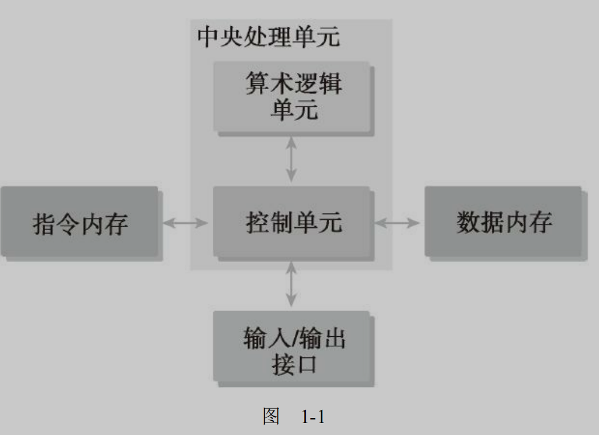

- 串/并行编程

  - 解决一个问题时,把问题划分为多个运算块,一个一个执行(具有前后次序),称为串行程序

    当运算块没有前后次序,可以并发执行,称为 并行程序

  - 当问题被分割为小的计算块之后,分析计算块之间的关系就显得十分重要

    - 当一个计算块需要用到其他计算块的数据时就产生了 数据相关性
    - 相关性是限制并行性的主要因素

  - 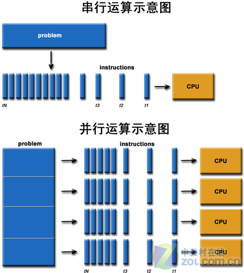


- 并行性
  - 任务并行,当许多任务/函数可以大规模并行执行,重点在于利用多核系统对任务进行分配

  - 数据并行,可以同时处理数据,重点在于多核系统对数据进行分配(CUDA适合解决该类)

    数据并行可以把数据映射给并行线程

    - 把数据依据线程划分,使得每个线程处理一部分数据
      - 块划分(block partitioning),一组连续数据划分到一个块内
      - 周期划分(cyclic partitioning),更少的连续数据划分到一个块,块更多
    - 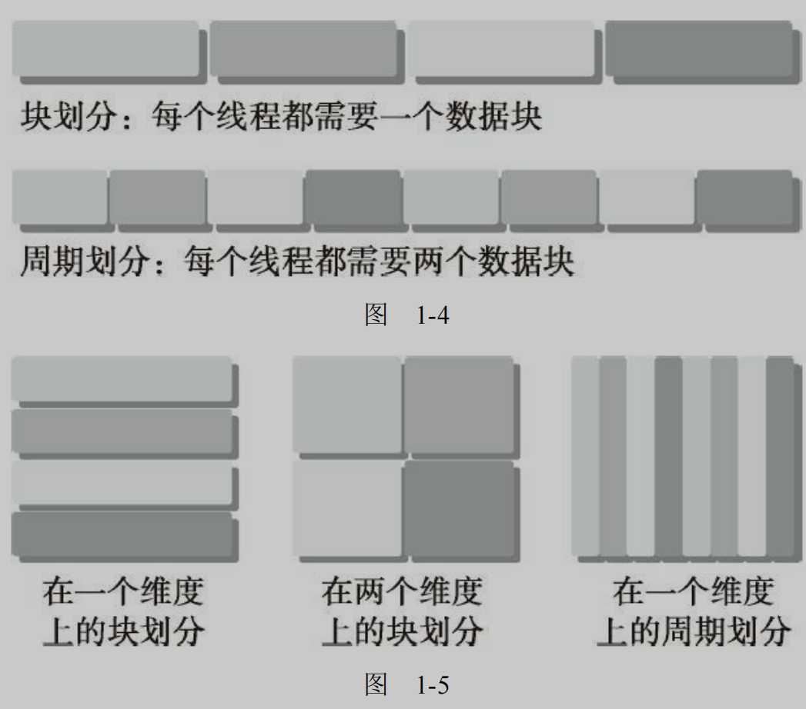

- 计算机架构

  - 使用弗林分类法(Flynn's Taxonomy),Single Instruction Multiple Data

  - | 类型 | 特点                                                         | 好处                           |
    | ---- | ------------------------------------------------------------ | ------------------------------ |
    | SISD | 传统计算机串行架构,任何时刻只会有一个指令流处理一个数据流    |                                |
    | SIMD | 并行架构,多个核心,任何时间点所有核心只有一个指令流处理不同数据流 | 串行逻辑思考对并行数据实现加速 |
    | MISD | 每个核心使用多个指令流处理同一个数据流                       | 少见                           |
    | MIMD | 多指令以部多数据流                                           |                                |

  - 延迟是一个操作从开始到结束所需的时间,通常用微秒表示

    带宽是单位时间内看可以处理的数据量,通常是GB/s,TB/s

    吞吐量是单位时间内成功处理的运算数量,tflops(每秒1T浮点数运算)

  - 分布式多节点系统中,大型计算引擎由许多网络连接的处理器构成,每个处理器都有自己的内存,通常称为集群,

    共享内存多处理器系统,共享内存意味着共享地址,但不意味着它是一个独立的物理内存,现在一个芯片可以由多个处理器通过总线(PCIE)共享内存

  - GPU代表了众核架构,多线程/MIMD/SIMD/指令级并行,NVIDIA称为 SIMT(单指令多线程)

- GPU/CPU核心

  - CPU核心比较重,适合处理复杂控制逻辑,优化串行
  - GPU较轻,适合简单逻辑,注重吞吐量

### 2 异构计算

- 典型异构架构

  - CPU核GPU是两个独立的处理器,通过总线连接,

    同构计算使用的是同一架构下的多个处理器进行运算

  - 异构架构 -- 两个多核CPU核一个众核GPU,GPU不是独立运行的平台,而是CPU的协处理器(由CPU控制),送一CPU称为主机端,GPU称为设备端

    - 主机代码在CPU运行,异构平台应用初始化通常由CPU完成
    - 设备代码在GPU运行,计算密集型应用往往有很多并行数据的程序段,GPU可以提高并行运算速度
    - 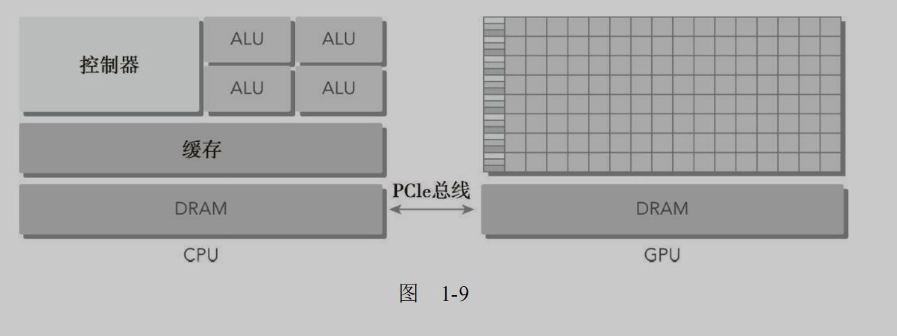

- NVIDIA的GPU计算平台

  - 系列

    - Tegra是为移动和嵌入式设计
    - GeForce面向图形用户
    - Tesla专业GPU加速,Fermi是其中一种,用于科学计算
    - Quadro专业绘图工作站

  - 参数

    - CUDA核心数 -- 峰值计算性能用于评估计算容量的指标,

      定义为每秒处理的单精度/双精度浮点运算数量,单位TFlops(每秒万亿次浮点计算)

    - 内存大小 -- 内存带宽是从内存读写的每秒数据量,单位 GB/s,TB/s

    - 计算能力,用于描述Tesla系列的硬件版本

- 异构计算范例

  - GPU计算不是用于取代CPU计算,而是提高对数据并行的密集计算能力,CPU适合控制密集型任务

  - 在代码中可以同时使用CPU和GPU进行运算的编程模型,称为CUDA

    - 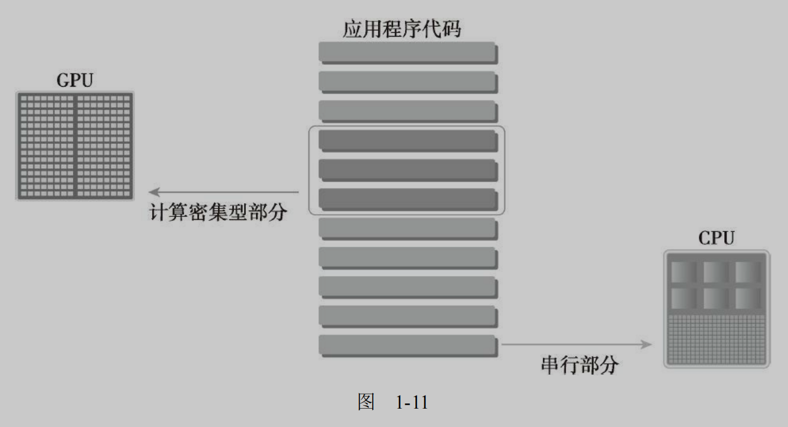

  - CPU线程 与 GPU 线程

    - CPU的线程通常是重量级实体,操作系统必须交替线程启停CPU执行通道以提供多线程能力,上下文切换缓慢开销大

      CPU核设计为极可能减少一两个线程的时间延迟,超线程技术使得多核支持更多线程

    - GPU线程高度轻量级,会有成千上万排队等待,如果GPU等待有一组线程执行结束,只要调用另一组线程执行其他任务

      GPU设计是处理大量并发轻量线程,提高吞吐量,每个处理器可以支持几千个线程

- CUDA:一种异构计算平台

  - CUDA是一种通用的并行计算平台核编程模型,可以通过CUDA加速库、编译器指令、应用编程接口以及行业标准程序语言的扩展
  - CUDA提供了两层API管理设备核组织线程
    - 驱动API,低级API,编程较难,提供了更过控制
    - 运行时API,高级API,每个运行时API被分解为更多驱动API基本运算
    - 两者之间没有明显性能差异,不可以混合调用
  - 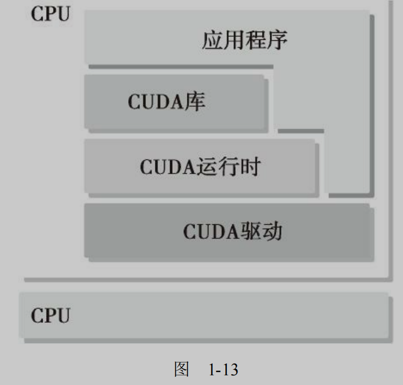

- CUDA程序

  - nvcc编译器在编译过程把设备代码分离出来,主机代码采用标准C编译,设备代码(核函数)使用扩展的带有标记数据的并行函数关键字的CUDA C语言编译,链接阶段在内核程序调用核显示GPU河北操作中添加CUDA运行时库
  - nvcc是以LLVM开源编译系统为基础
  - 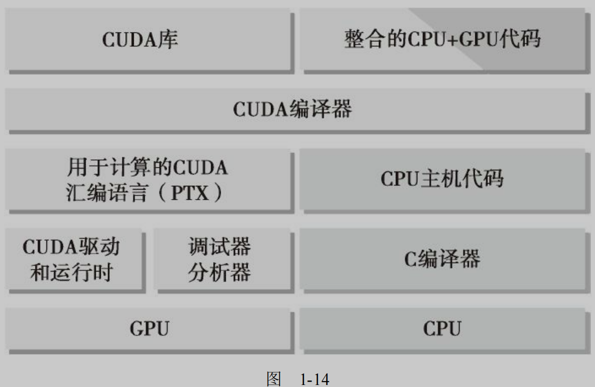

### 3 用GPU输出的Hello World

- 源文件扩展名是.cu,使用nvcc进行编译

  - hello.cu 使用命令  nvcc -arch sm_61 hello.cu 进行编译,

    参数arch表示GPU型号版本,[官网](https://developer.nvidia.com/cuda-gpus#collapseOne)查看

  - ```c
    #include <stdio.h>
    // global 告诉编译器从CPU调用,GPU执行
    __global__ void helloGPU(){
            printf("hello GPU\n");
    }
    
    int main(void){
            helloGPU <<<1,10>>>();	//一组线程(10个)调用
            cudaDeviceReset();		//同步等待
            printf("hello cpu\n");
            return 0;
    }
    ```

  - 典型的CUDA编程结构

    - 分配GPU内存
    - 从CPU内存拷贝数据到GPU内存
    - 调用CUDA内核函数完成程序指定运算
    - 从GPU内存拷贝数据到CPU内存
    - 释放GPU内存空间

### 4 使用CUDA C编程难吗

- 主要考验对GPU架构的了解程序

  - 需要对CPU架构由基本了解
  - 知道局部性原理(时间/空间局部性),现代CPU使用大容量缓存来优化局部性原理的应用程序

- CUDA内存层次和线程层次

  - 内存层次,CUDA编程模型中使用的共享内存可以视为被软件管理的告诉缓存,通过为主存节省带宽大幅提高运行速度,可以直接控制代码的数据局部性

  - 用ANSI C语言编写并行程序时需要pthreads或者OpenMP显示组织线程

    CUDA C编写时只用类单个线程调用的一小段串行代码


## 第2章 CUDA编程模型

### 1 CUDA编程模型概述

- CUDA模型抽象

  - CUDA编程模型提供了一个计算机架构抽象作为应用程序和其可用硬件之间的桥梁。

    通信抽象时程序与编程模型实现之间的分界线,通过专业的硬件原语和操作系统编译器/库实现

  - 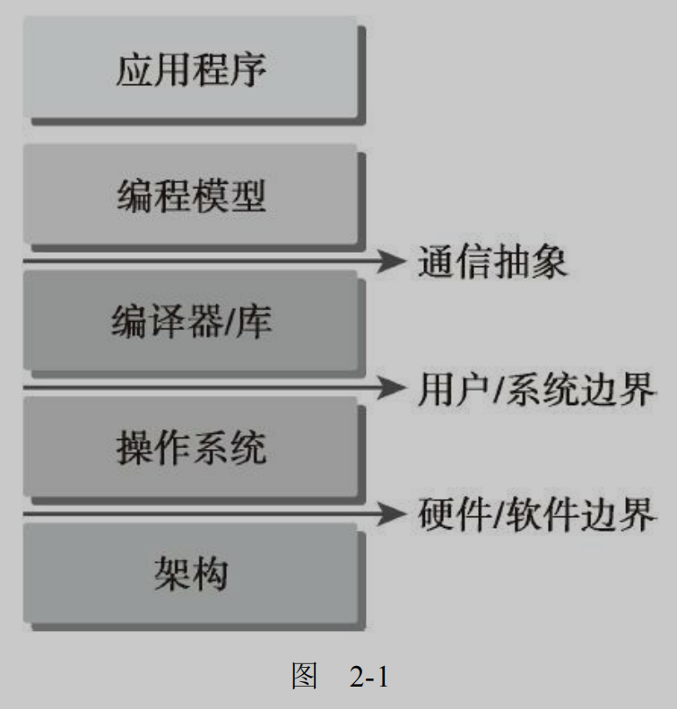

- CUDA编程结构
  - 在一个异构环境中,CPU和GPU的内存都由PCI-Express总线分隔

  - 主机是CPU与主存,设备是GPU与显存,

    CUDA6.0提出统一寻址(Unified Memory)的编程模型,可使用单指针访问CPU/GPU内存而无需手动拷贝

  - 内核(kernel)是CUDA的重要组成部分,,代码在GPU上运行,可以串行执行和函数

    大多数情况下,主机可以独立对设备操作,内核一旦启动就立即把管理权返回给CPU,

    CUDA属于异步模型,nvcc支持主机代码和设备代码放在同一个源文件

  - 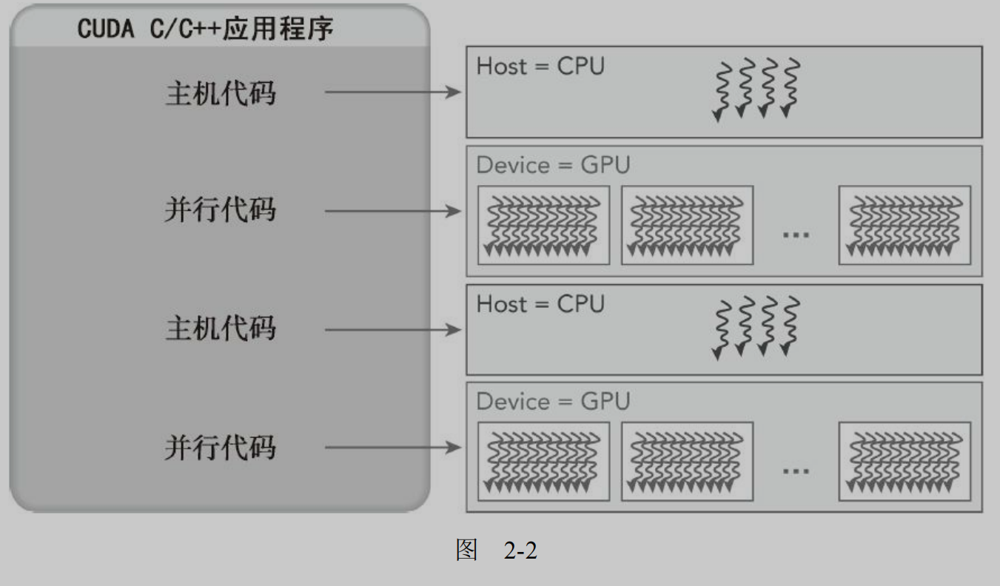

- 内存管理

  - 假设系统由一个主机和设备组成,各自拥有独立内存.

    核函数在设备上运行,CUDA负责运行时分配和释放内存,并且在主机和设备内存之间传输数据

  - cudaMalloc 函数用于分配GPU内存

    cudaMemcpy 负责数据传输,cudaMemcpykind指定拷贝方向(主机与设备之间的方向)

    代码调用都会返回cudaError_t类型,通过cudaGetErrorString()可以获取对应错误信息

    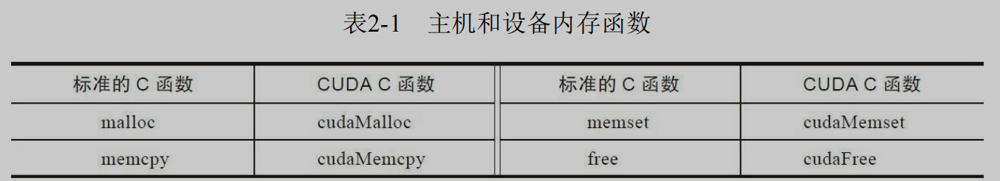

- 内存层次结构

  - 全局内存类似主机的主存,共享内存则是类似缓存,可以由内核控制
  - 使用CUDA C编程容易烦的错误是对不同内存空间的不恰当引用,引用程序会崩溃
  - 


- 线程管理

  - 核函数在主机端启动时会移动到设备上执行,CUDA线程层次由线程块核线程块网络构成

  - 一个内核启动产生的所有线程称为一个网格,同一网格所有线程共享全局内存空间

    网格包含多个线程块,线程块包含一组线程,不同块内的线程不协作

    通过同步/共享内存进行协作,线程使用<块ID,线程ID>进行定位

  - 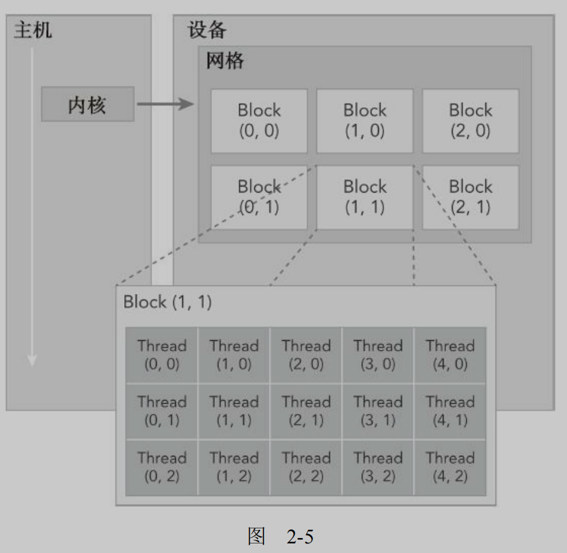

- 网格核线程块维度

  - 一般网格组织成二维,线程块组织成三维

  - ```c
    #include<stdio.h>
    #include<cuda_runtime.h>
    // 设备端输出线程的坐标
    __global__ void checkIndex(void){
    	printf("threadIdx:(%d,%d,%d) blockIdx:(%d,%d,%d) "
    		" blockDim: (%d,%d,%d) gridDim:(%d,%d,%d)\n",
    		threadIdx.x, threadIdx.y,threadIdx.z,
    		blockIdx.x, blockIdx.y,blockIdx.z,
    		blockDim.x, blockDim.y,blockDim.z,
    		gridDim.x, gridDim.y,gridDim.z);
    }
    
    int main(int argc,char ** argv){
    	// 一共有nEle个线程
    	int nEle = 6;
    	dim3 block(3);							// 主机端定义线程块大小
    	dim3 grid((nEle+block.x-1)/block.x);	// 主机端定义网格大小
    	printf("host  blockDim: (%d,%d,%d)  gridDim:(%d,%d,%d)\n",
    		block.x,block.y,block.z,
    		grid.x,grid.y,grid.z);
    	checkIndex<<<grid,block>>>();
    	cudaDeviceReset();
    
    	return 0;
    }
    
    ```

- 启动一个CUDA核函数

  - `<<<grid,block>>>`是核函数的执行分配位置,grid和block可以指定GPU线程数目
  
    同一个块内线程可以相互协作
  
  - function<<<4,8>>>结果如图所示,核函数的调用与主机线程是异步的
  
    cudaDeviceSynchronize() 可以强制主机代码等待
  
  - 所有的CUDA核函数的启动都是异步的。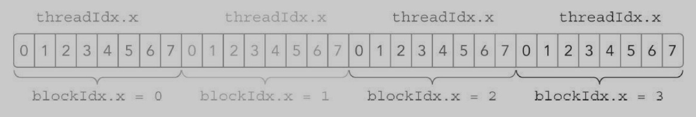

- 编写核函数

  - 使用 `__global__` 定义核函数,必须是 `void `返回类型

  - | 限定符       | 执行   | 调用                                        |
    | ------------ | ------ | ------------------------------------------- |
    | `__global__` | 设备端 | 主机调用,计算能力3的设备调用,返回值必须void |
    | `__device__` | 设备端 | 只能设备端调用                              |
    | `__host__`   | 主机端 | 只能主机端调用                              |

  - 核函数具有一些限制 

    - 只能访问设备内存,
    - 必须是void返回类型
    - 不支持可变数量参数
    - 不支持静态类型
    - 显示异步行为

  - 例子

    - ```c
      //向量加法,每个分量的加法都用一个线程处理,使用线程id替代索引
      __global__ void sumArraysOnGPU(float *A,float *B,float *C){
          int idx = threadIdx.x;
          C[idx]=A[idx]+B[idx];
      }
      ```

- 验证和函数

  - 使用主机函数验证核函数结果
  - 在和函数中printf打印结果,或者将执行参数设置为 `<<<1,1>>>` 模拟串行程序

- 处理错误

  - ```c
    // 可以通过定义一个宏来获取错误信息
    // CHECK(cudaDeviceSynchronize()) 会阻塞主机代码
    #define CHECK(call){						\
    	const cudaError_t error = call;			\
    	if(error != cudaSuccess){				\
            printf("Error:%s:%d",__FILE__,__LINE__);		\
            printf("code:%d ,reson: %s\n",error,cudaGetErrorString(error));\
            exit(1);\
        }\
    }
    ```

### 2 给核函数计时

- CPU计时器

  - `<sys/time.h>`包含gettimeofday系统调用可以获取当前时间戳

  - GPU线程个数可以比向量分量更多,需要注意越界判断

  - ```c
    // 获取设备信息
    int  dev = 0;
    cudaDeviceProp deviceProp;
    CHECK(cudaGetDeviceProperties(&deviceProp,dev));
    printf("Using Device %d:%s \n",dev,deviceProp.name);
    CHECK(cudaSetDevice(dev));
    ```

- nvprof工具

  - NVIDIA提供的工具
  - 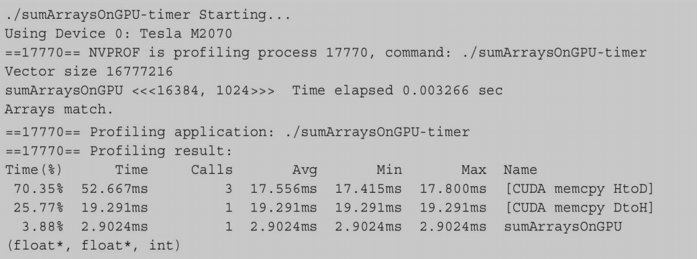
  - 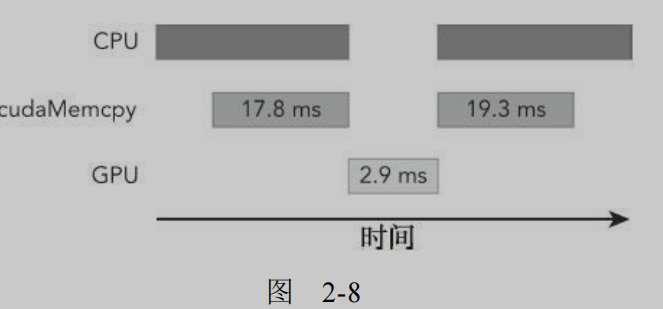

- 比较应用程序的性能将理论界限最大化

  - 以Tesla K10 为例,单精度浮点运算次数 

    745MHz 核心频率 * 2 GPU/芯片 * (8个多处理器 * 192浮点单元 * 32核心/多处理器) * 2OPS/周期 = 4.58TFLOPS

  - 内存带宽峰值

    2GPU/芯片 * 256位 * 2500MHz * 2 DDR/8位/字节 = 320GB/s

  - 指令比 ,4.58TFLOPS/320GB/s = 13.6 指令/字节

    如果你的应用程序每访问一个字节所产生的指令数多于13.6，那么你的应用程序受算法性能限制。大多数HPC工作负载受内存带宽的限制。

### 3 组织并行线程

> 如果使用了合适的网格和块大小来正确地组织线程，那么可 以对内核性能产生很大的影响。

- 使用块和线程建立矩阵索引
  - 通常矩阵使用行优先的方法在全局内存中进行线性存储
  - 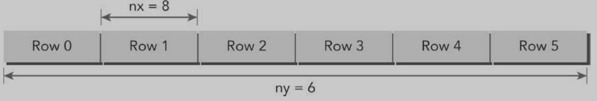
  - 需要管理三种索引
    - 线程和块索引,矩阵中给定点的坐标,全局线性内存中的偏移量
    - 可以让块对应矩阵元素,线程直接运算
    - 我们可以把它看成矩阵的分块运算
    - 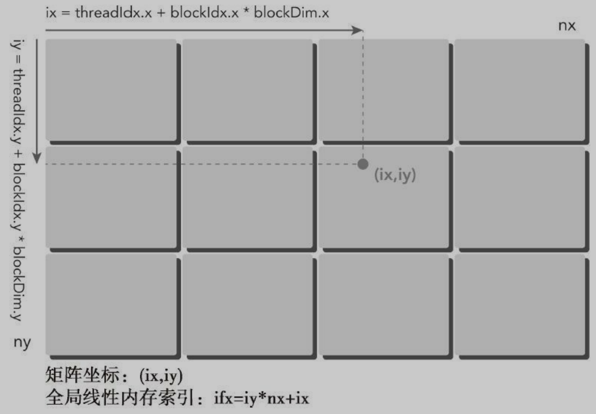

- 使用二维网格和二维块对矩阵求和
  - 内核的数量配置会影响矩阵求和速度
  - 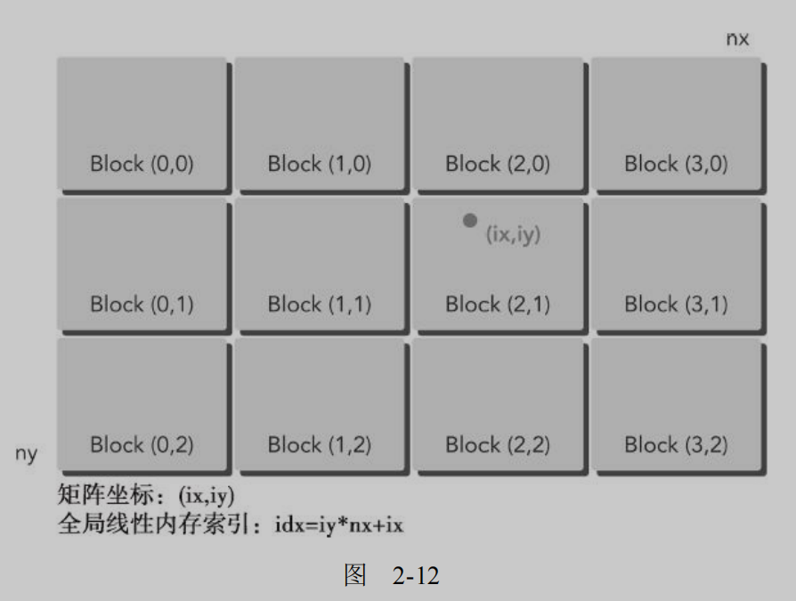
  - 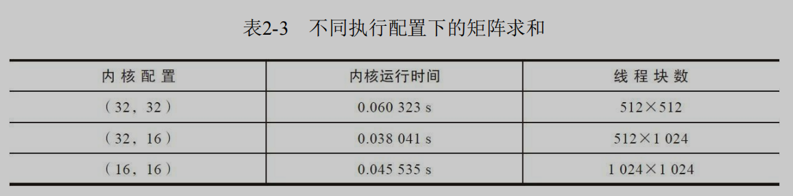

- 使用一维网格和一维块对矩阵求和
  - 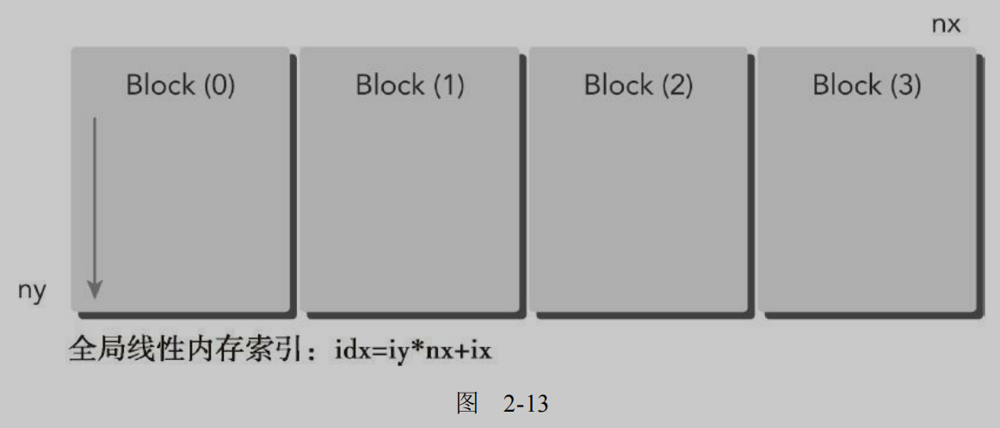

- 使用二维网格和一维块对矩阵求和 
  - 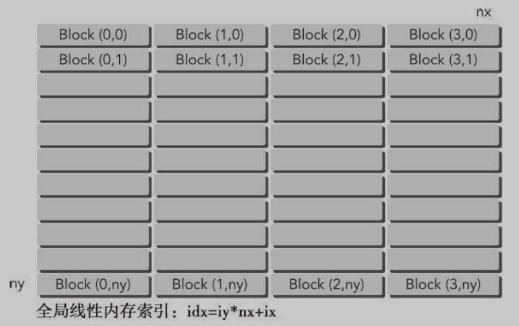

- 对比
  - 改变执行配置对内核性能有影响
  - 传统的核函数实现一般不能获得最佳性能
  - 对于一个给定的核函数，尝试使用不同的网格和线程块大小可以获得更好的性能 
  - 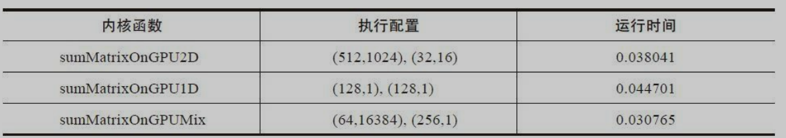

### 4 设备管理

- 使用运行时API查询GPU信息 

  - ```c
    // 获取GPU设备属性,内存/时钟频率/等等信息
    cudaError_t cudaGetDeviceProperties(cudaDeviceProp *prop,int device);
    
    // 确定最优GPU
    cudaGetDeviceCount(&numDevices);	//查询GPU个数
    cudaGetDeviceProperties(&props,device);
    props.multiProcessorCount;			// 核心数查询
    ```

  - nvidia-smi 命令

    - -L 确定安装了多少个GPU及其ID
    - -q -i 0 显示0号GPU的详细信息
    - -q -i 0 -d MEMORY 只显示内存信息

- 运行时设置设备

  - 使用环境变量 `CUDA_VISIBLE_DEVICES` 指定设备号,程序就可以自动使用而无需手动设置.可设置多个

## 第3章 CUDA执行模型

### 1 CUDA执行模型概述

- 一般来说，执行模型会提供一个操作视图，说明如何在特定的计算架构上执行指令。 

  CUDA执行模型揭示了GPU并行架构的抽象视图，使我们能够据此分析线程的并发

- GPU架构概述

  - GPU架构是围绕一个流式多处理器（Streaming Multiprocessor,SM）的可扩展阵列搭建的。可以通过复制这种架构的构建块来实现GPU的硬件并行

  - 每个SM都能支持数百个线程并发执行，每个GPU通常有多个SM，所以在一个GPU上并发执行数千个线程是有可能的。

  - 启动内核时,线程块被分配到可用SM执行,多个线程块可能位于同一个SM

    同一线程中的指令使用流水线

  - CUDA采用单指令多线程(SIMT)管理线程,以32个线程为一个线程束(warp),线程束执行相同指令,每个SM把分配给它的线程块划分到包含32个线程的线程束中

  - 

- SIMT

  - 跟SIMD差不多,具有自己的特点,
    - 每个线程都有自己的指令地址计数器
    - 每个线程都有自己的寄存器状态
    - 每个线程可以有一个独立的执行路径
    - SIMT确保可以编写独立的线程级并行代码、标量线程以及用于协调线程的数据并行代码。
  - 神奇的32
    - 一个线程块只能在一个SM上被调度。一旦线程块在一个SM上被调度，就会保存在该SM上直到执行完成。在同一时间，一个SM可以容纳多个线程块。
    - 在SM中,共享内存和寄存器是非常重要的资源。共享内存被分配在SM上的常驻线程块中，寄存器在线程中被分配。
    - 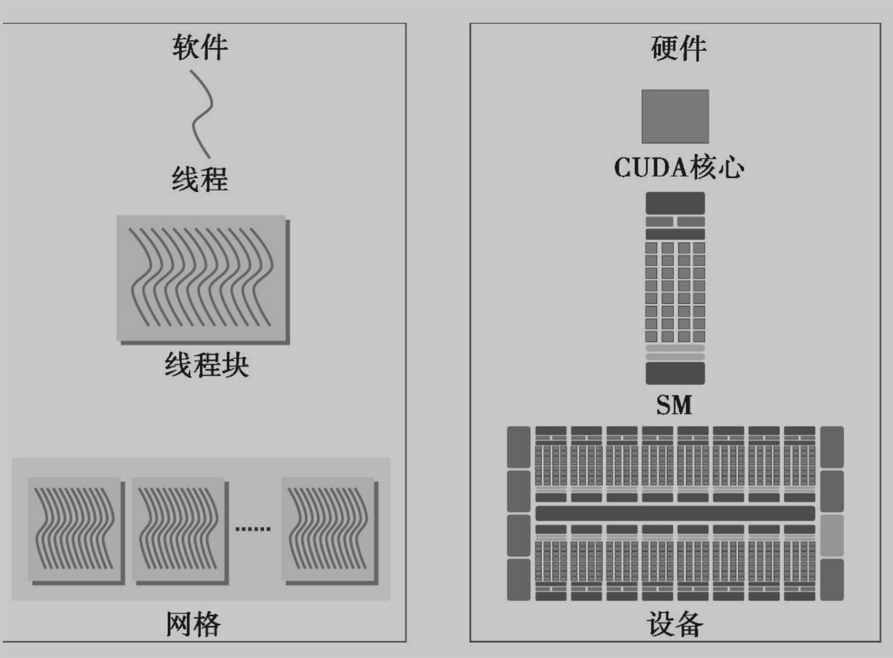

- SM:GPU架构的核心

  - Fermi架构

    - 第一个完整GPU计算架构,能够为大多数高性能计算应用提供所需要的功能
    - 具有512个加速核心,称为CUDA核心,每个核心都有一个全流水线的整数算术逻辑单元（ALU）和一个浮点运算单元（FPU），每个时钟周期执行一个整数或是浮点数指令。
    - 具有16个SM,每个SM包含32个CUDA核心,具有6个384位的DDR5 DRAM接口,支持6GB内存,通过PCIE与CPU相连
    - 二级缓存768K被16个SM共享
    - 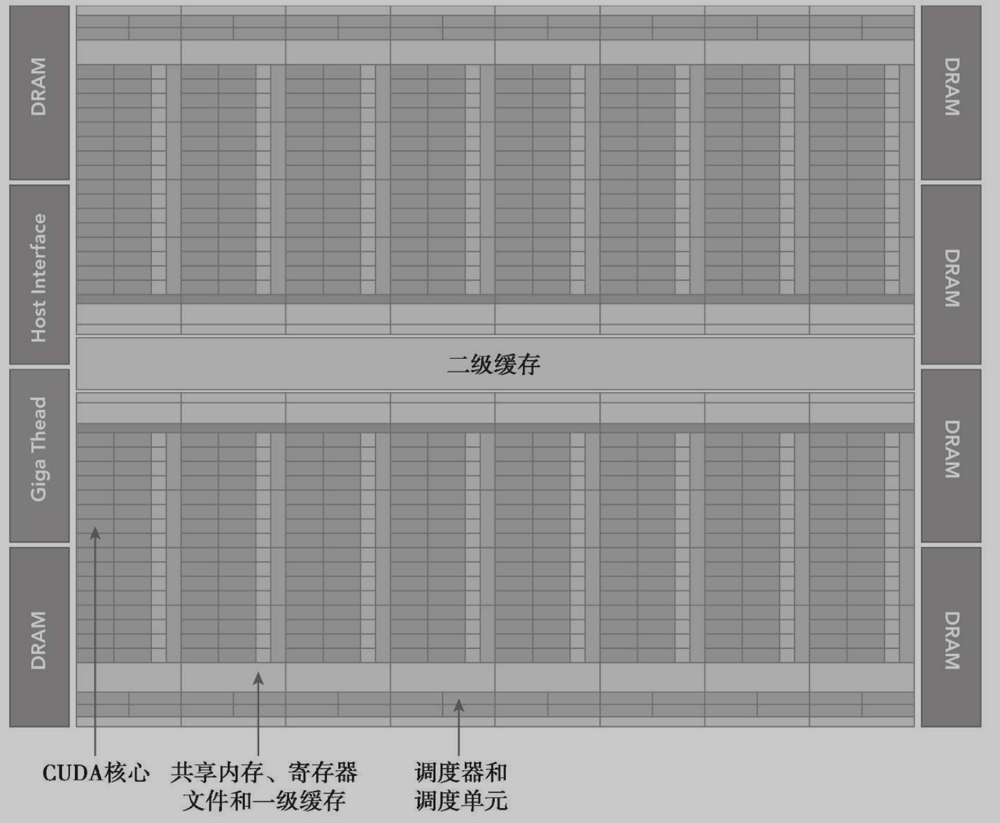

    - SM结构

      - 每个SM包含16个加载/存储单元,允许每个时钟周期内由16个线程计算源地址和目的地址,特殊功能单元SFU执行固有指令(如正余弦/平方/开方/插值等)

      - 每个SM有两个线程束调度器和指令调度单元,线程块指定给一个SM时,其中的所有线程被分成了线程束,

        线程束调度器选择两个线程束,再把指定从线程束发送到一个组上,组里由16个CUDA核心,16个加载/存储单元,5个特殊特殊功能单元

      - Fermi架构,计算性能2.x,可以在SM同时处理48个线程束,即一个SM同时可以常驻1536个线程

      - Fermi架构也支持并发内核执行：在相同的GPU上执行相同应用程序的上下文中，同时启动多个内核

      - 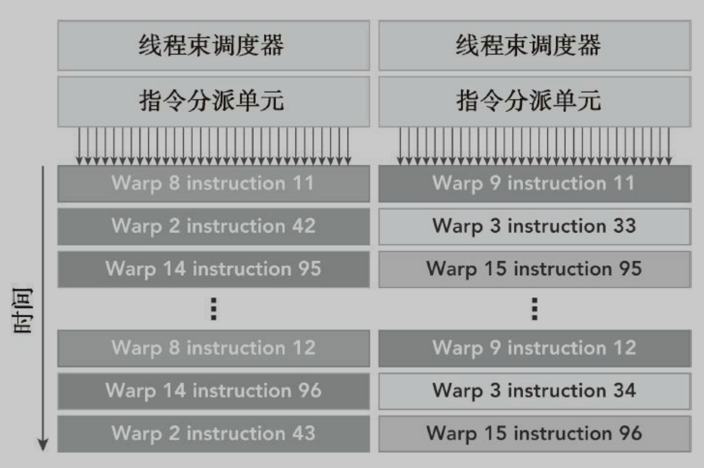

  - Kepler架构

    - 15个SM,6个64位内存控制器,强化SM,
    - 动态并行,并行内核执行,每个Kepler SM单元包含192个单精度CUDA核心，64个双精度单元，32 个特殊功能单元（SFU）以及32个加载/存储单元（LD/ST）
    - 每个Kepler SM包括4个线程束调度器和8个指令调度器，以确保在单一的SM上同时发送和执行4个线程束。每个KM可以调度64个线程束,常驻线程2048个
    - 动态并行允许GPU动态启动新的网络
    - Hyper-Q在CPU和GPU之间提供了32个工作队列
    - 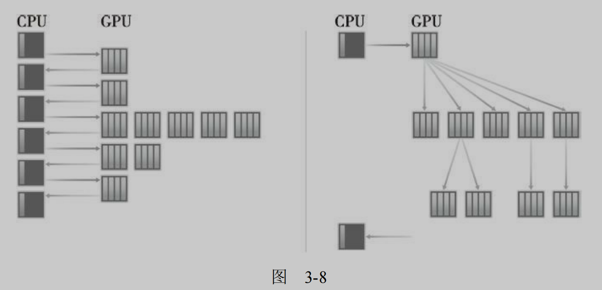

  - 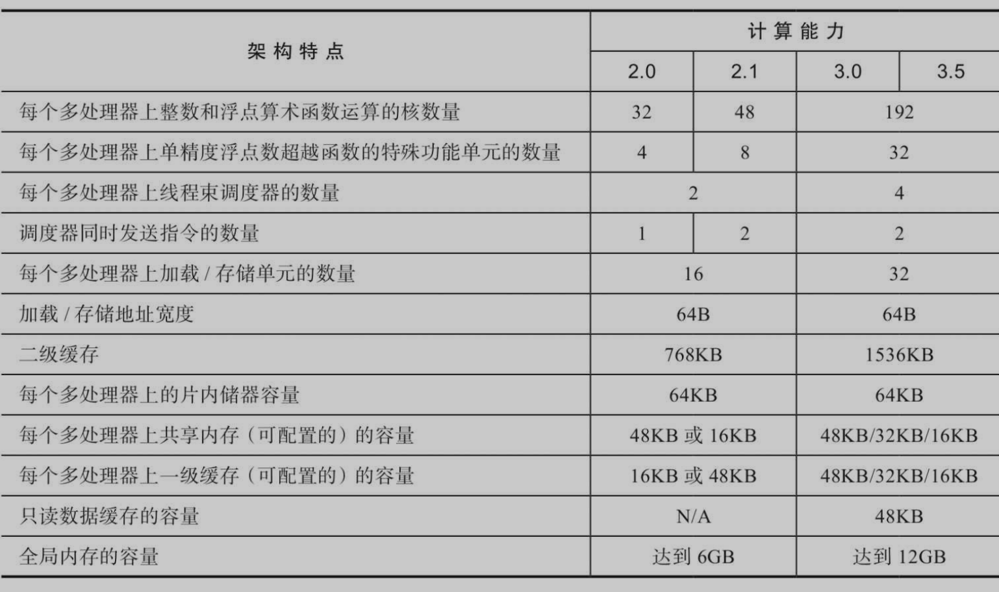

- 配置文件驱动优化

  - CUDA提供了一个硬件架构的抽象，它能够让用户控制线程并发。性能分析工具可 以检测和优化，并将优化可视化。

    - nvvp是可视化工具,显示CPU与GPU上的程序活动的时间表，从而找到可以改善性能的机会。
    - nvprof是命令行工具,可以获得CPU与GPU上CUDA关联活动的时间表，其中包括内核执行、内存传输和CUDA的API调用。它也可以获得硬件计数器和CUDA内核的性能指标

  - 事件和指标

    - 事件是可计算的活动,对应一个在内核执行期间被收集的硬件计数器。

      指标是内核的特征，它由一个或多个事件计算得到。

      - 大多数计数器通过流式多处理器来报告，而不是通过整个GPU。
      - 一个单一的运行只能获得几个计数器。
      - GPU执行的变化,重复运行可能不会产生相同的计数

  - 了解硬件资源的详细信息

### 2 理解线程束执行的本质

- 线程束和线程块

  - 线程束是SM中基本的执行单元,网格中的线程会被分配到SM中,当一个线程块被调度到一个SM上,就会进一步划分为线程束

    线程束由32个连续线程组成,线程执行相同指令,数据相互独立

  - 从逻辑角度,线程块是三维的;

    从硬件角度,所有线程放到一维里,比如128个线程的线程块被组织到4个线程束

  - 假设一个x轴40个线程,y轴2个线程的二维线程块,共80个线程,会被分配到3个下线程束,

    共96个硬件线程去支持,存在一些不活跃线程

  - 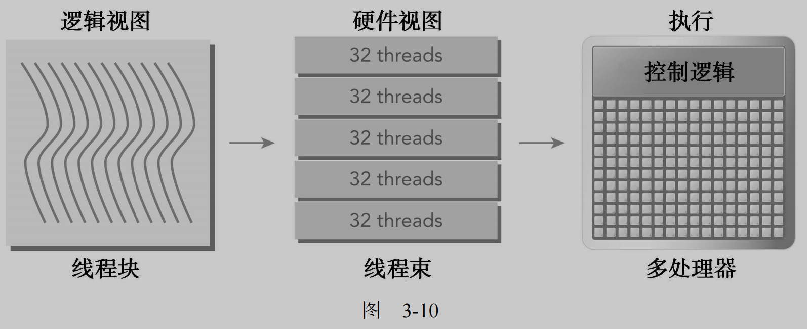

- 线程束分化

  - GPU支持显示控制流,分支/循环,使用流水线,

    当一个线程束部分线程执行if语句块,一些线程执行else语句块,称为 线程束分化

  - 线程束分化产生后,线程束将连续执行每一个分支,禁用不执行路径的线程,会导致性能下降

  - 假如线程束分化发生在不同线程束则不会影响,所以确保线程束里线程执行相同控制路径

  - 使用线程束方法交叉存取数据设备利用率不会下降,比如条件 `(tid / warpSize) == 0`

- 资源分配

  - 线程束的本地执行上下文主要由以下资源组成： 程序计数器 ,寄存器 ,共享内存

  - SM都有32位寄存器组,同时固定数量的共享内存用来在线程块中进行分配

    若每个线程消耗的寄存器越多，则可以放在一个SM中的线程束就越 少。如果可以减少内核消耗寄存器的数量，那么就可以同时处理更多的线程束

    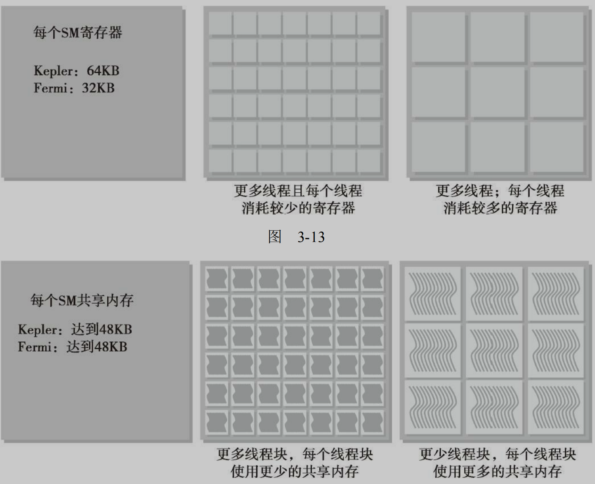

  - 当计算资源（如寄存器和共享内存）已分配给线程块时，线程块被称为活跃的块。

    它 所包含的线程束被称为活跃的线程束

    活跃执行的线程束被称为选定的线程束

    如果一个活跃的线程束准备执行但尚未执行，它是一个符合条件的线程束。

    如果一个线程束没有做好执行的准备，它是一个阻塞的线程束。当32个CUDA核心可用以及当前指令参数就绪就符合执行条件

- 延迟隐藏

  - SM依赖线程级并行以最大化利用率,在指令发出和完成之间的时钟周期被定义为指令延迟

  - 算术指令延迟是一个算术操作从开始到它产生输出之间的时间,算术操作位10~20周期

  - 内存指令延迟是指发 送出的加载或存储操作和数据到达目的地之间的时间,为400~800周期

  - 利特尔法则可以提供估算隐藏延迟所需要的活跃线程束的数量,所需线程束数=延迟x吞吐量

    假如执行平均延迟5个周期,那么保证每个周期执行6个线程束就需要至少30个未完成线程束

- 带宽和吞吐量

  - 带宽通常是指理论峰值，用来描述单位时间内最大可能的数据传输量，
  
  - 吞吐量是指已达到的值。用来描述单位时 间内任何形式的信息或操作的执行速度,比如指令数/每周期

  - 假设 每个线程把一个浮点数据从全局内存移动到SM中计算,那么共需要 74KB/4B=18500线程,
  
    也就是579线程束,,平均每个SM要36个线程束
  
  - 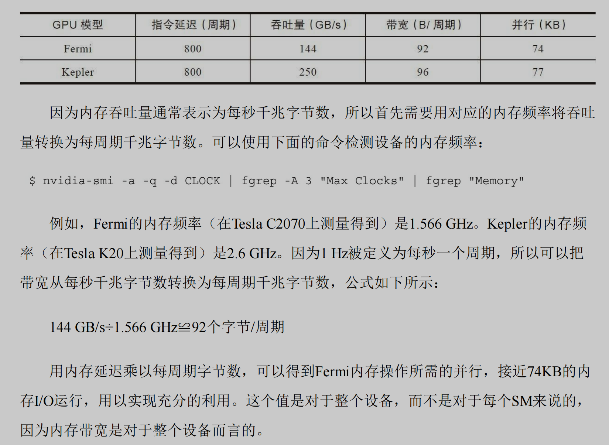
  
- 显示后充足的并行

  - 因为GPU在线程间分配计算资源并在并发线程束之间切换的消耗很小,

    如果有足够的并发活跃线程,那么可以让GPU在每个周期内的流水线忙碌,

    所需并行计算公式是 用每个SM核心的数量乘以在该SM上一条算术指令的延迟。

- 占有率

  - CUDA核心指令顺序执行,一个线程束阻塞时SM会切换其他线程

    占有率 = 活跃线程束数量 / 最大线程束数量,`cudaGetDeviceProperties`可以获取每个SM最大线程束数量(获取SM线程最大数量,除以32)

- 网格和线程块大小准则

  - 保持块中线程个数为32的整数倍,避免块太小,至少128/256线程
  - 根据内核资源需求调整,块数量要远多于SM数量
  - 通过实验得到最佳配置和资源使用
  - 占有率唯一注重的是活跃线程数量,然而充分占有率不是性能唯一目标

- 同步

  - 栅栏同步是一个原语，CUDA支持系统级(cudaDeviceSynchronized())和块级同步(`__device__`)

  - 线程块中的线程可以通过共享内存和寄存器来共享数据,此时会有竞争条件.

    不同块之间没有线程同步,唯一安全的方法是在每个内核执行结束端 使用全局同步点

- 可扩展性

  - 真正的可扩展性取决于算法设计和硬件特性,能够在可变数量的计算核心上执行相同的应用程序代码的能力被称为透明可扩展性。

###  3 并行性的表现

- 用nvprof检测活跃线程束

  - 一个内核 的可实现占用率被定义为：每周期内活跃线程束的平均数量与一个SM支持的线程束最大 数量的比值。

    `nvprof --metrics achieved_occupancy  ./sum 32 16`

  - 内存检测, `--metrics gld_throughput`检测内核的内存读取效率

    用gld_efficiency指标检测全局加载效率，即被请求的全局加载吞吐量占所需 的全局加载吞吐量的比值。

  - 对网格和块启发式算法来说，最内层的维数应该总是线程束大小的倍数。

  - `inst_per_warp` 查看每个线程束上执行指令数量的平均值。 

- 增大并行性

  - 最好的执行配置既不具有最高的可实现占用率，也不具有最高的加载 吞吐量。从这些实验中可以推断出，没有一个单独的指标能直接优化性能。
  - 与总体性能最直接相关的指标或事件取决于内核代码的本质 
  - 平衡各个指标

### 4  避免分支分化

- 并行规约问题

  - 对N个元素的数组求和,CPU代码直接循环求和

  - 因为整数加法支持交换律和结合律,改变顺序不影响结果,那么就可以先求部分和再求总和

    在向量中执行满足交换律和结合律的运算，被称为归约问题。

    - 相邻配对

      - 使用两个全局内存数组,大数组存放整个数组,另一个小数组放部分和

      - 使用原地算法,就是修改元数据, `__syncthreads`用于同步

      - 跨度由1到N/2

      - 用到了 `if ((tid % (2 *stride)) == 0)`用于判断相邻元素的第一个元素,

        只对偶数ID线程为true,会导致很高的线程束分化 

        `int index = 2 * stride * tid` 对应下标可以减少分化 

    - 交错配对

      - 跨度由N/2到1,比相邻快主要是由于全局内存加载/存储模式对内核性能的影响

    - 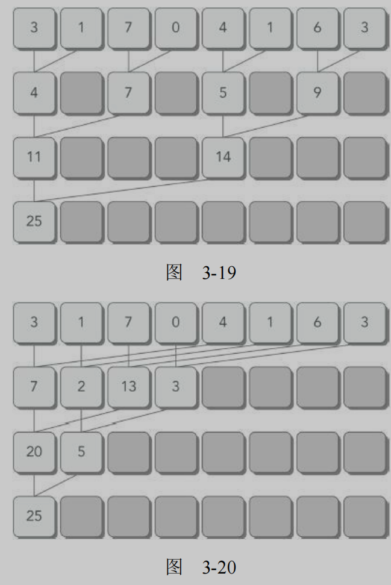

### 5 循环展开

- 循环展开是一个尝试通过减少分支出现的频率和循环维护指令来优化循环的技术。

  循环体的复制数 量被称为循环展开因子，迭代次数就变为了原始循环迭代次数除以循环展开因子。

  通过减少指令消 耗和增加更多的独立调度指令来提高性能

- 展开的规约

  - 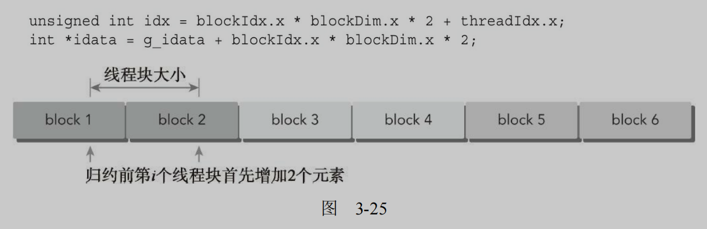
  - 展开线程的规约
    - `__syncthreads()` 可以减少新的核函数的阻塞, `stall_sync`可以用来证实
    - 完全展开的规约时间会有一些改善
    - 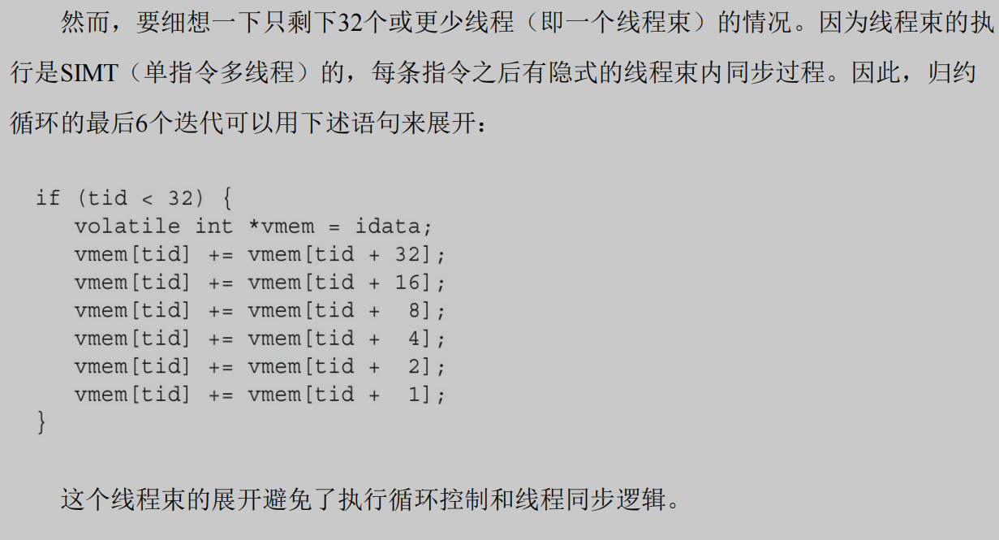

- 模板函数的规约

  - if语句将在编译时被评估,如果为false将会被删除
  - gst_efficiency 可以检测存储效率
  - 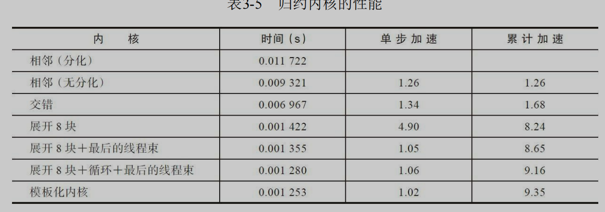
  - 

### 6 动态并行

- CUDA的动态并行允许在GPU端直接创建和同步新的GPU内核。

  可以推迟到运行时决定需要在GPU上创建多少个块和网格,动态利用GPU硬件调度和加载平衡器 

  可以减少主机和设备之间传输控制和数据的需求

- 嵌套执行

  - 父网格会同步等待子网格完成才结束
  - 父网格和子网格共享相同的全局和常量内存存储，但它们有不同的局部内存和共享内存。
  - 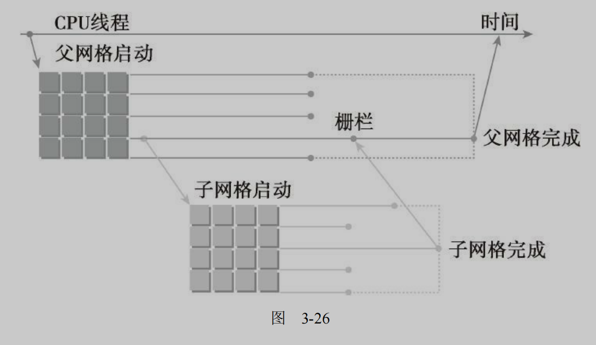

- GPU嵌套hello world

  - 递归调用自己,记得设置出口条件

  - `nvcc -arch=sm_61 -rdc=true  nestedHelloWorld.cu -o nestHello -lcudadevrt`

    动态并行是设备被运行库支持,需要使用-lcudadevrt明确链接 -rdc强制生成可重定位的设备代码,动态并行要求

  - 可以使用nvvp查看层次关系

  - 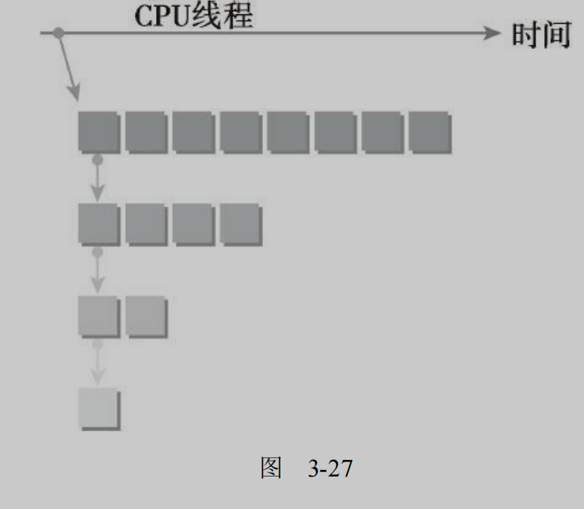

  - 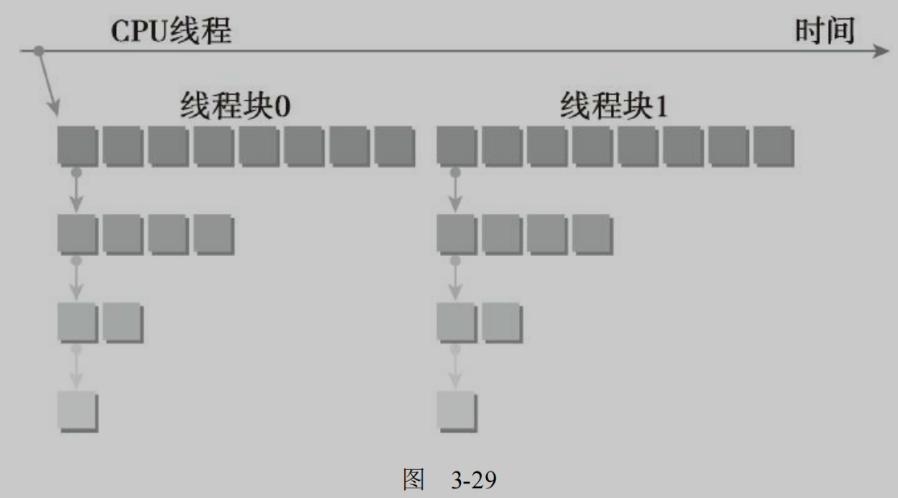

- 动态并行的限制条件 
  - 计算能力不低于 3.5的设备
  - 内核不能在物理独立的设备启动,嵌套深度限制24

- 嵌套规约

  - 将数组全局地址转为每个线程块地址,满足跳出条件则返回结果(叶子节点)

    否则就地规约,同步

  - 每个线程块产生一个子网格会引起大量调用,导致效率低下

    可以通过参数控制子网格生成数量,比如网格第一个块才能创建子网格

## 第4章 全局内存

### 1  CUDA内存模型概述

- 内存层次结构的优点
  - 局部性原理,时间局部性认为如果一个数据位置被引用，那么该数据在较短的时间周期内很可能会 再次被引用，随着时间流逝，该数据被引用的可能性逐渐降低。空间局部性认为如果一个 内存位置被引用，则附近的位置也可能会被引用。
  - CPU/GPU主存使用DRAM,低延迟内存使用SRAM
  - 

- CUDA内存模型
  - 存储器对程序员来说分为可编程与不可编程两种

  - CPU内存层次中,一二级缓存就是不可编程的,CUDA提供了多种可编程内存类型

    线程私有:本地内存,寄存器

    线程块私有:共享内存

    共享内存: 常量内存/纹理内存空间/全局内存

  - 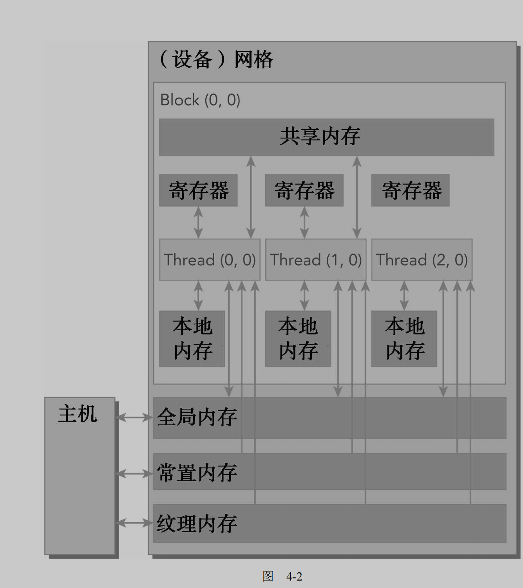

- 寄存器,速度最快,核函数中声明的没有其他修饰符的自变量,通常存储在寄存器中。在核函数声明的数组中，如果用于引用该数组的索引是常量 且能在编译时确定，那么该数组也存储在寄存器中。

  - 资源很少,FermiGPU中,每个线程最多63个寄存器,Kepler GPU则是255个

  - `nvcc -V,-abi=no`命令会输出 寄存器的数量、共享内存的字节数以及每个线程所使用的常量内存的字节数。

  - 如果寄存器溢出会使用本地内存替代,可以在代码中为每个核函数显式地加上额外的信息 来帮助编译器进行优化

    ```c
    __global__ void
    __launch_bounds__(maxThreadsPerBlock,minBlockPerMultiprocessor)
        kernel(...){
        // code
    }
    ```

  - maxrregcount编译器选项，来控制一个编译单元里所有核函数使用的寄存器最大数量

- 本地内存
  - 编译时使用未知索引引用的本地数组
  - 占用大量寄存器的较大结构体/数组
  - 不满足寄存器限制条件的变量,本质和全局内存在同一块区域,特点高延迟,低带宽
- 共享内存
  - `__shared__` 修饰变量,速度比本地内存快,块内线程共享,过度使用会影响活跃线程束数量
  - 访问时需要注意使用同步,SM具有64KB的一级缓存和共享内存,可以静态划分
- 常量内存
  - `__constant` 常量内存驻留在设备内存中，并在每个SM专用的常量缓存中缓存。
  - 常量必须在全局空间内和所有核函数之外声明,只可以声明64KB,,属于静态声明

- 纹理内存
  - 纹理内存驻留在设备内存中，并在每个SM的只读缓存中缓存。纹理内存是一种通过 指定的只读缓存访问的全局内存。
  - 支持和硬件滤波,实对二维空间局部性优化
- 全局内存
  - GPU中最大最慢最常使用,设备代码中`__device__`声明变量,或者使用cudaMalloc
  - 线程不能跨线程块同步,并发修改会出现未定义程序行为
  - 全局内存常驻于设备内存中，可通过32字节、64字节或128字节的内存事务进行访 问。这些内存事务必须自然对齐，也就是说，首地址必须是32字节、64字节或128字节的 倍数。

- GPU缓存
  - 不可编程,有4种类型
  - 一级缓存,每个SM都有;
  - 二级缓存,所有SM共享,一/二级缓存用来存储本地内存/全局内存的数据
  - 每个SM也有一个只读常量缓存和只读纹理缓存，它们用于在设备内存中提高来自于 各自内存空间内的读取性能
  - 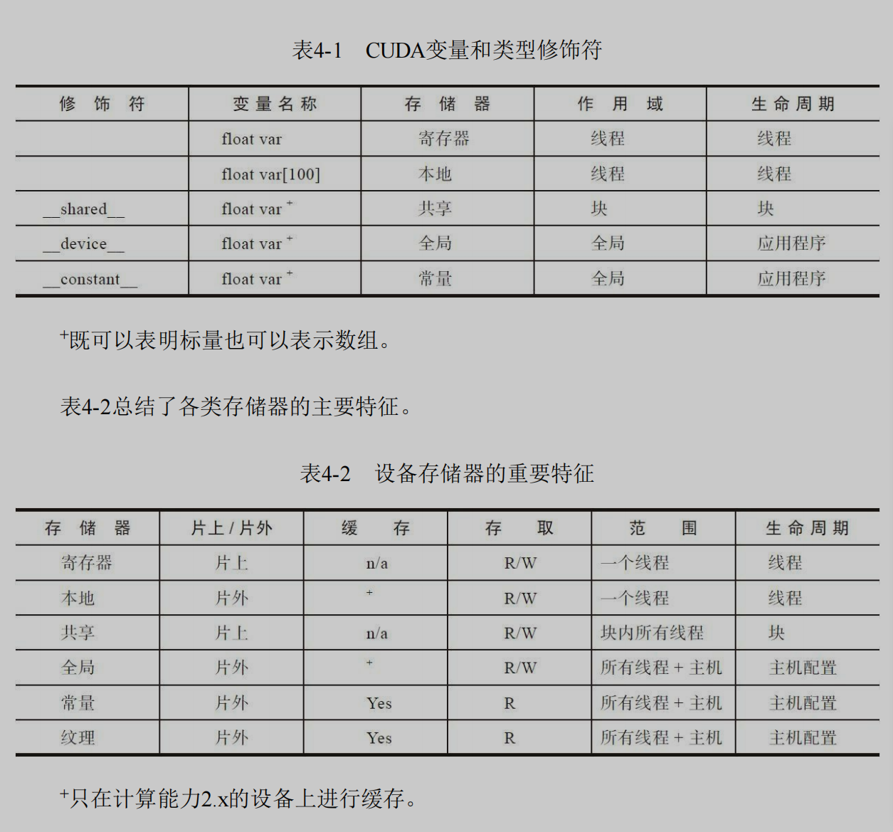

- 静态全局内存
  - 即使在同一文件内可见,主机代码与设备代码变量不互通,必须使用拷贝函数
  - 有一个例外，可以直接从主机引用GPU内存：CUDA固定内存。主机代码和设备代码 都可以通过简单的指针引用直接访问固定内存。

### 2 内存管理

- 内存分配和释放

  - ```c
    // 分配了count字节的全局内存 ,并返回该地址
    cudaError_t cudaMalloc(void **devPrt,size_t count);
    // 使用value进行填充
    cudaError_t cudaMemset(void *devPrt,int valie,size_t count);
    // 释放
    cudaError_t cudaFree(void *devPrt);
    ```

- 内存传输

  - `cudaMemcpy()` 内存传输(主机和设备间) ,尽可能减少CPU与GPU之间的数据传输
  - 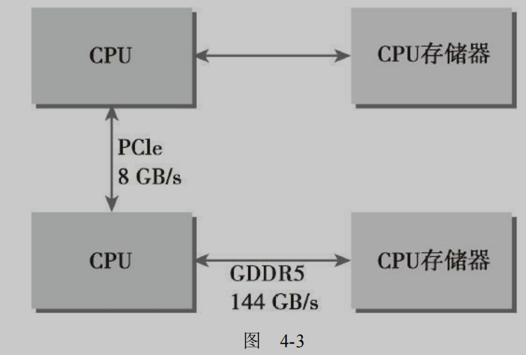

- 固定内存

  - 主机内存默认是可分页的,虚拟内存会比实际内存大得多
  
  - GPU不能在可分页内存上安全访问数据,因为当主机操作系统在物理位置移动该数据时无法控制,所以CUDA驱动首先分配临时页面锁定内存然后复制 
  
- 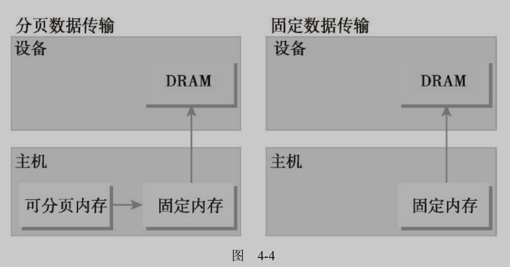
  
  - CUDA使用`cudaMallocHost()` 直接分配补丁主机内存,分配过多可能导致主机性能下降
  
    对应的释放 `cudaFreeHost()`,相比内存拷贝,使用固定内存性能会高得多
    
    

- 主机与设备间的内存传输
  
  - 固定内存分配和释放成本更高,当超过10MB数据时,在Fermi设备使用固定内存是更好的选择
- 零拷贝内存 
  - 一般来说,主机和设备内存变量不共享,零拷贝内存除外
  - 使用时必须同步主机与设备间的内存访问,同时更改零拷贝数据结果是不可预知的
  - 属于固定内存,`cudaHostAlloc()` 创建一个到固定内存的映射,`cudaFreeHost()`进行释放
  - 频繁读写的数据不适合使用零拷贝内存,因为每次映射到内存的传输都需要经过PCIE
  - 异构架构
    - 集成架构,CPU和GPU在同一个芯片上,物理地址共享主存,无需再PCIE总线备份数据
    - 离散架构,通过PCIe总线连接设备,零拷贝内存只有再特殊情况下有优势

- 同一虚拟寻址(UVA)
  - 通过UVA,由`cudaHostAlloc()` 分配的固定内存具有相同的主机和设备指针
  - 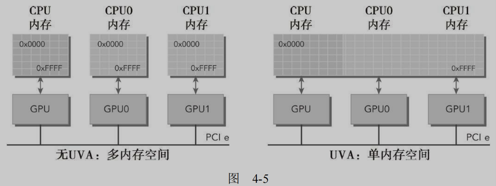

- 统一内存寻址
  - 统一内存中创建了一个托管内存池，内存池中已分配的空间可以用相同的内存 地址（即指针）在CPU和GPU上进行访问。底层系统在统一内存空间中自动在主机和设备 之间进行数据传输
  - 依赖于UVA支持,但是两者属于完全不同的技术,UVA为所有处理器提供单一的虚拟内存地址空间,但是不会自动将数据从一个位置移动到另一个位置,这是统一内存寻址的功能
  - 托管内存可以被静态分配,使用`___managed__`注释,动态分配使用 `cudaMallocManaged()`

### 3 内存访问模式

- 对齐与合并访问

  - 全局内存通过缓存来实现加载/存储。全局内存是一个逻辑内存空间， 你可以通过核函数访问它。核函数请求通常是DRAM设备和片上内存间以128字节/32字节内存事务实现

  - 如果内存访问用到了一级和二级缓存,那么使用128字节事务

    如果只用到34级缓存,使用32字节事务实现

  - 一行一级缓存是128个字节，它映射到设备内存中一个128字节的对齐段。如果线程束 中的每个线程请求一个4字节的值，那么每次请求就会获取128字节的数据

  - 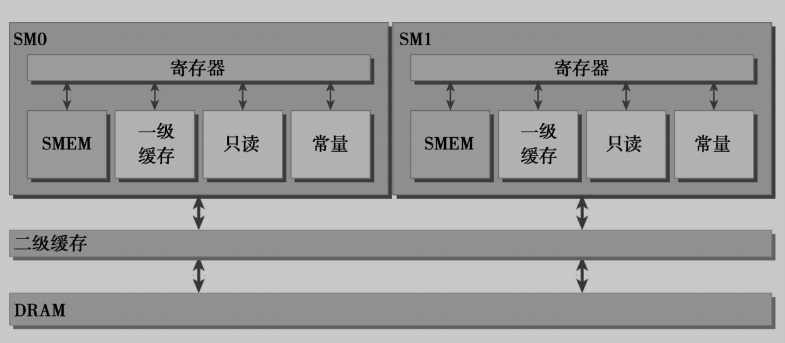

- 当设备内存事务的第一个地址是用于事务服务的缓存粒度的偶数倍时（32字节的二级 缓存或128字节的一级缓存），就会出现对齐内存访问。运行非对齐的加载会造成带宽浪费。
  - 当一个线程束中全部的32个线程访问一个连续的内存块时，就会出现合并内存访问
  - 对齐合并内存访问的理想状态是线程束从对齐内存地址开始访问一个连续的内存块。 为了最大化全局内存吞吐量，为了组织内存操作进行对齐合并是很重要的
  - 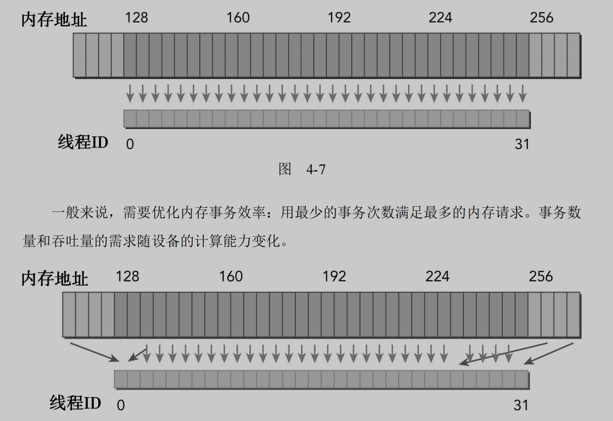

- 全局内存读取

  - SM种数据默认通过一二级缓存,可以通过编译器禁止一级缓存 `-Xptxas -dlcm=cg` ,ca表示启用
  - 一级缓存专 门用于缓存寄存器溢出到本地内存中的数据。

- 缓存加载

  - 对齐与合并内存访问,利用率100%

    对齐不是连续ID,而是128字节范围内随机值,仍然命中同一缓存行,同上

    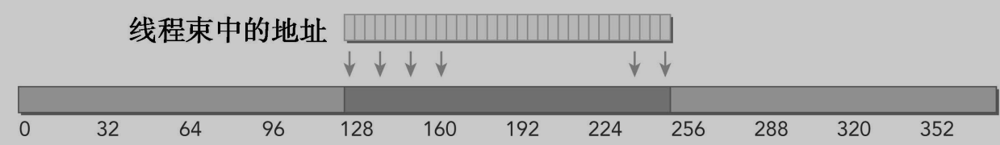

  - 线程束请求32个连续4字节非对齐数据,落在两个128字节范围内,要用到两个128字节事务,总线利用率 50%,

    假如线程束请求同一个地址.利用率则是4/128=3.125%

    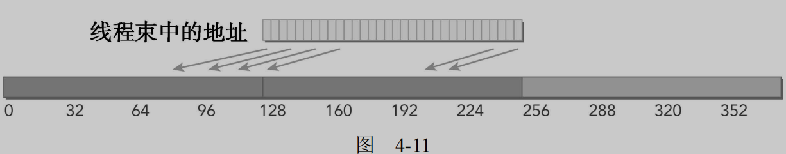

  - 线程请求分散到32个4字节地址,需要申请N次事务(0<N<=32)

  - 没有缓存的加载

    - 不经过一级缓存,在内存段的粒度上(32字节)而非缓存池的力度(128字节)
    - 粒度更小使用率可以提升

  - 非对齐影响

    - 全局加载效率  = 请求的全局内存加载吞吐量 / 需要的全局内存加载吞吐量 
    - 随着设备占用率的提高，没有缓存的加载 可帮助提高总线的整体利用率。对于没有缓存的非对齐加载模式来说，未使用的数据传输 量可能会显著减少

  - 只读缓存

    - 只读缓存最初是预留给纹理内存加载使用的,对于计算能力不低于3.5的设备里说,也支持全局内存加载代替一级缓存
      - 使用函数`__ldg`或者间接引用的指针上使用修饰符可以指导内存通过只读缓存
      - `__restrict__`应用到指针上。这些修饰符帮助nvcc编译器识别无 别名指针

- 全局内存写入

  - 一级缓存不能用在Fermi或Kepler GPU上进行存储操作， 在发送到设备内存之前存储操作只通过二级缓存。
  - 存储操作在32个字节段的粒度上被执 行。内存事务可以同时被分为一段、两段或四段。

- 结构体数组(AoS)与数组结构体(SoA) 
  - SIMD更倾向于使用SoA,
  - 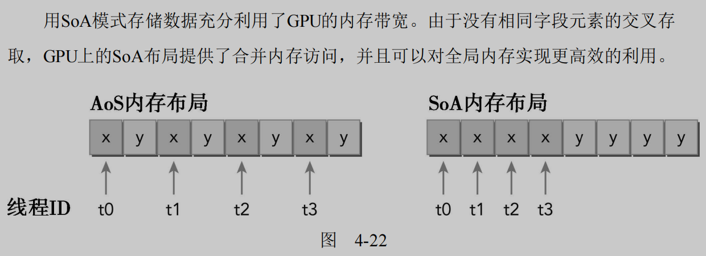

- 性能调整

  - 展开技术,并不影响执行内存操作的数量

  - 增大并行性,使用核函数启动的网格和线程块大小实验,找到最佳执行配置
  - 最大化带宽利用率,有效利用DRAM与SM片上内存的字节传输;避免内存贷款浪费,内存访问模式应是对齐和合并的

### 4 核函数可达到的带宽

- 分析核函数性能时，需要注意内存延迟，即完成一次独立内存请求的时间；内存带 宽，即SM访问设备内存的速度，它以每单位时间内的字节数进行测量。
  - 使用最大化并行执行线程束数量隐藏内存延迟
  - 适当的对齐和合并内存访问最大化带宽效率

- 矩阵转置分析内存带宽优化

  - 多数 核函数对内存带宽敏感,全局内存数据安排方式以及线程束方位该数据方式对带块有显著影响

    有效带宽(GB/s) = (读写字节数)*10^-9^/运行时间

  - 矩阵转置,基于主机实现的使用单精度浮点值的错位转置算法。假设矩阵存储在一个一维 数组中。通过改变数组索引值来交换行和列的坐标，可以很容易得到转置矩阵。
  
  - 假如禁用一级缓存,两者(按行/列读取)性能理论相同,
  
    开启一级缓存,案列读取会更好,虽然不合并,但是读操作会命中
  
    写操作不在缓存,两者一致
  
    一般一级缓存不用于全局内存访问
  
  - 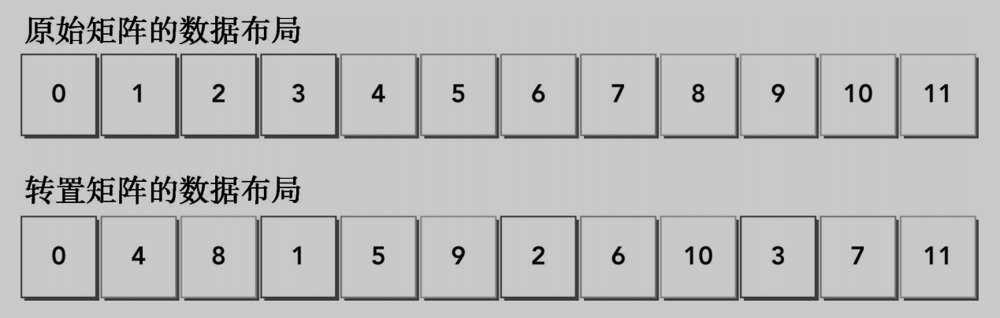

- 为转置核函数设置性能的上限和下限 
  - 上限,通过加载和存储行来拷贝矩阵,只能使用合并访问
  - 下限,只是用交叉访问来加载和存储行来拷贝矩阵
  - 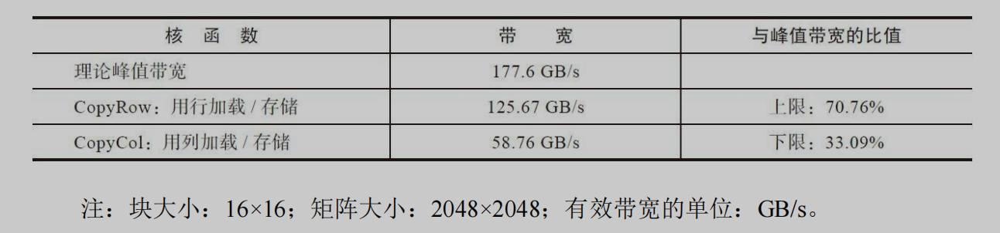

- 朴素转置:读取行和列
  - 按行加载,按列存储
  - 按列加载,按行存储,效果更好的可能原因是使用到了一级缓存
  - 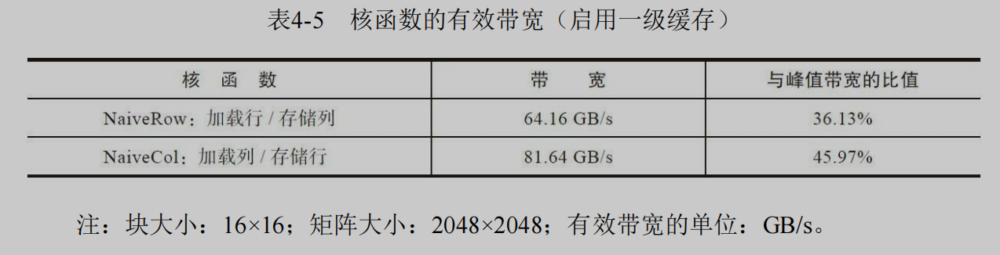

- 展开转置:读写行列
  
- 展开因子为4,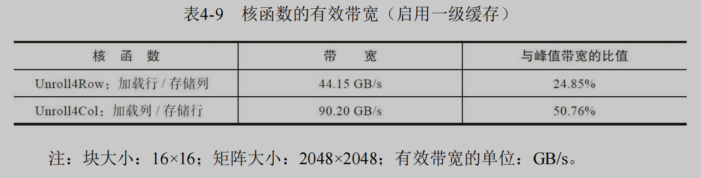
  
- 对角转置

  - 当启用一个核函数,线程块被分配给SM的顺序由块ID来确定。一旦所有的SM都被 完全占用，所有剩余的线程块都保持不变直到当前的执行被完成。一旦一个线程块执行结 束，将为该SM分配另一个线程块。

  - 对角坐标系用于确定一维线程块ID,左边是笛卡尔坐标,右边是对角坐标

    block_x = (blockIdx.x + blockidx.y) % gridDim.x

    block_y=blockIdx.y

  - 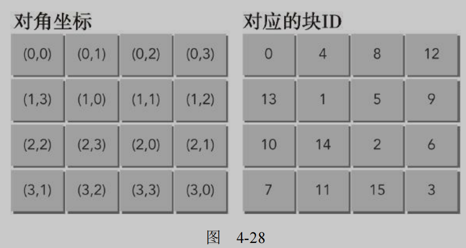

  - 基于列的型能够提升与DRAM的并行访问有关。发送给全局内存的请求由DRAM分区 完成。设备内存中的连续的256字节区域被分配到连续的分区。当使用笛卡尔坐标将线程 块映射到数据块时，全局内存访问可能无法均匀地被分配到整个DRAM从分区中，这时就 可能发生“分区冲突”的现象

  - 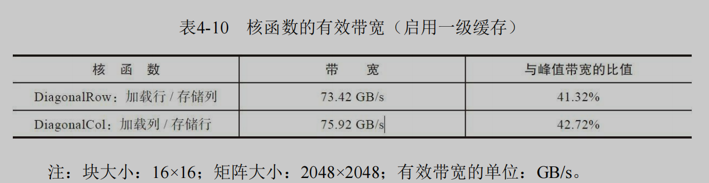

- 使用瘦块来增加并行性
  - 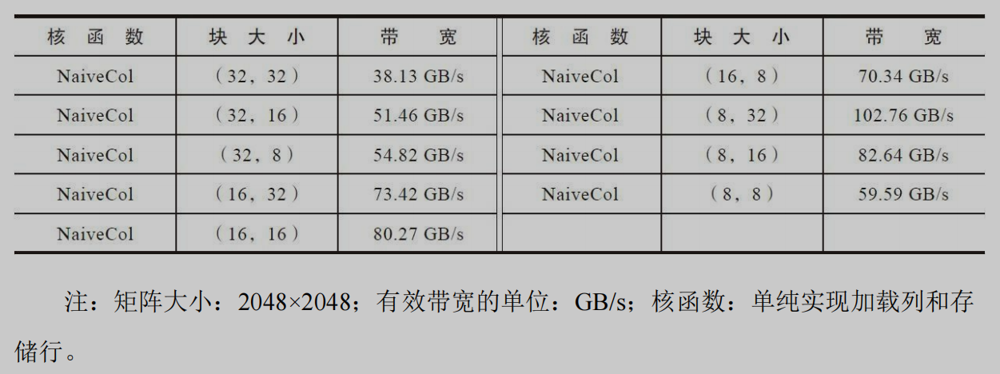
  - 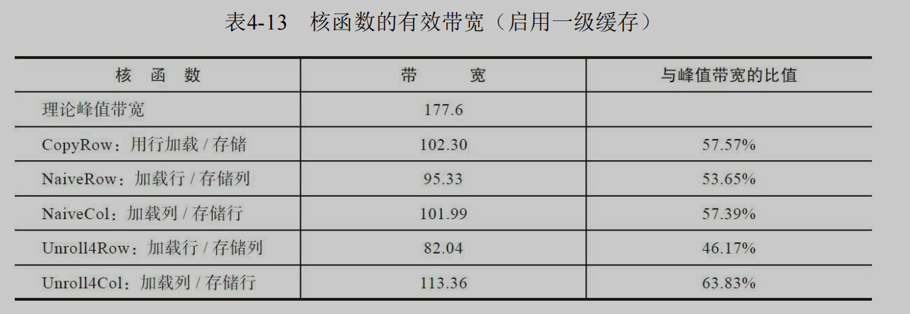

### 5  使用统一内存的矩阵加法

- 使用托管数组分配内存,消除重复指针

- ```shell
  #限制GPU对程序的可见性
  export CUDA_VISIBLE_DEVICES=0
  #启用统一内存指标
  nvprof --unified-memory-profiling per-process-device  
  ```

## 第5章 共享内存和常量内存

### 1 CUDA共享内存概述 

- 全局内存是较大的板载内存，具有相对较高的延迟。

  共享内存是较小的片上内存，具有相对较低的延迟，并且共享内存可以提供比全局内存高得多的带宽。
  - 共享内存(shared memory),每个SM都有一个低延迟小内存池,块内线程共享,描述为 可编程管理的缓存

  - 内容和创建时所在的线程块具有相同生命周期

    如果 多个线程访问共享内存中的同一个字，一个线程读取该字后，通过多播把它发送给其他线 程如果 多个线程访问共享内存中的同一个字，一个线程读取该字后，通过多播把它发送给其他线程

    共享内存是限制活跃线程块个数的 关键资源

    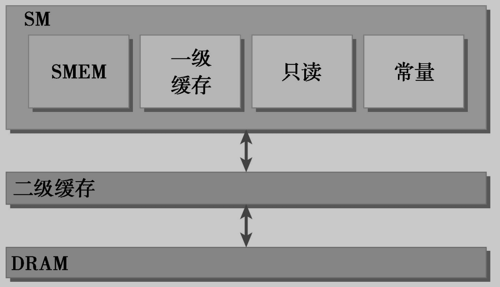

- 可编程管理缓存
  - 一般来说,缓存对程序透明,不能手动控制.共享内存是一个可编程管理的缓存
  - `__shared__`修饰共享内存变量,如果大小时位置的使用`extern`修饰,核函数可以调用时使用动态分配(大小作为第三个参数),只能声明一维

- 共享内存存储体和访问模式

  - 内存存储体,被分为32个大小一样的内存模型,可以同时访问.

    共享内存时一个一维地址,。如果通过线程束发布共享内存加载或存储操作，且在每个存储体 上只访问不多于一个的内存地址，那么该操作可由一个内存事务来完成

  - 存储体冲突,在共享内存中当多个地址请求落在相同的内存存储体中时，就会发生存储体冲突，硬件会尽量将请求切割为无冲突事务中

    - 线程束发出请求,并行访问,多个地址访问多个存储体,最常见
    - 串行访问,多个地址访问同一个存储体,必须以串行方式访问
    - 广播访问,单一地址读取单一存储体,线程束中所有线程访问相同地址,带宽利用率差
    - 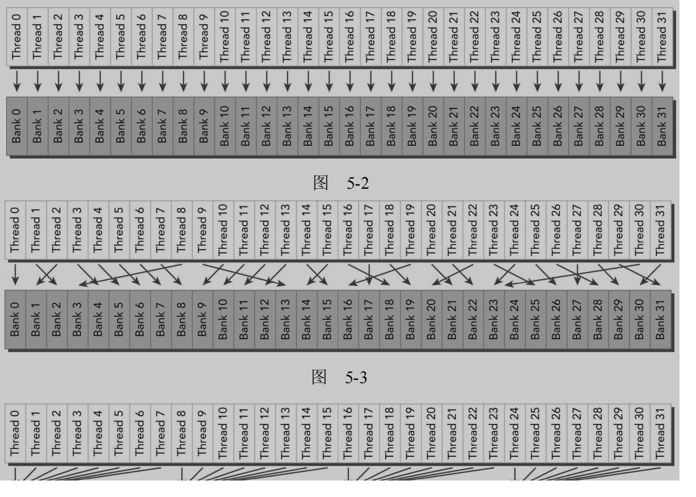

  - 访问模式 

    - 计算能力2.x时4字节,每个存储体每两个时钟周期内有32位带宽,存储体索引= (字节地址/4)%32
    - 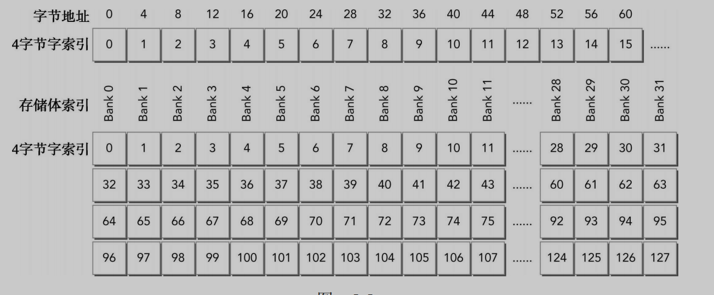
    - 3.x时8字节,具有更少得访问冲突,64位是两个字
    - 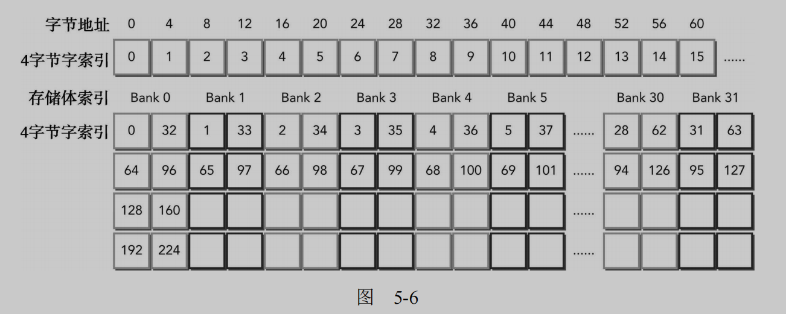

  - 内存填充

    - 通过填充数据使数据移动到不同的存储体
    - 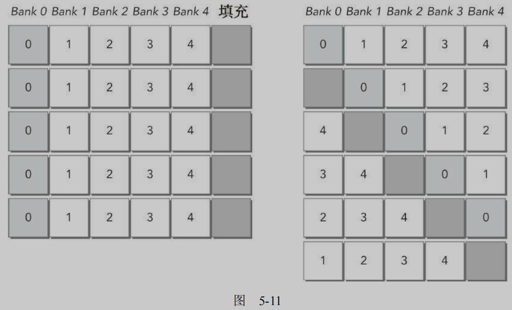

  - 访问模式配置

    - 默认4字节共享内存访问,`cudaDeviceGetSharedMemConfig()`可以查看

- 配置共享内存量

  - SM具有64KB片上内存,共享内存和一级缓存共享一件资源
  - `cudaDeviceSetCacheConfig()`划分共享内存大小
  - 指定-Xptxas- v选项给nvcc，可以知道核函数使用了多少寄存器。当内核使用的寄存器数量超过了硬件 限制所允许的数量时，应该为寄存器溢出配置一个更大的一级缓存。
  - 共 享内存是通过32个存储体进行访问的，而一级缓存则是通过缓存行进行访问的。
  - GPU缓存与CPU缓存,使用GPU共享内存 不仅可以显式管理数据而且还可以保证SM的局部性

- 同步

  - 弱排序内存模型(写入顺序不一定按照程序顺序)
  - 显式障碍,`__syncthreads()`作为障碍点,要求块中线程必须等待直到所有线程都到达.代码要小心,假如有线程没有到达障碍点就会永久等待
  
- 一个CUDA核函数要求跨线程块全局同步，那么通过在同步点分割核函数并执行多个内核 启动可能会达到预期的效果。
  
- 内存栅栏,确保栅栏前写操作对栅栏后所有线程可见,区分块/网格/系统级别
  
  - `__threadfence_block()` 块级别,
  
    `__threadfence()` 网格级别,
  
    `__threadfence_system()` 系统级别,
  
- Volatile 修饰符,阻止编译器优化,直接写入内存
  
- 共享内存与全局内存
  
    - GPU全局内存使用DRAM,延迟较高,带宽较小,访问粒度可以32/128字节

### 2 共享内存的数据布局

- 方形共享内存

  - 使用共享内存可以直接缓存具有方形维度的全局数据。

  - 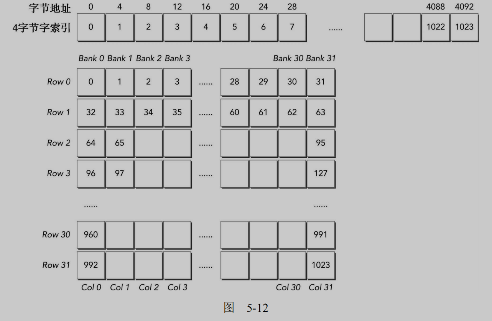

  - 按行主序读和按列主序写,按行主序访问共享内存无冲突

  - 按行主序写和按列主序读,按列主序写入无冲突

  - 动态共享内存,按行主序写入,按列主序将其读出并写入全局内存,写操作是无冲突的

  - 填充静态声明的共享内存,通过在每行添加一个元素，列元素便分布在了不同的存储体中，因此读和写 操作都是无冲突的。

  - 填充动态声明的共享内存 ,当执行从二维线程索引到一维内存索引的索 引转换时，对于每一行必须跳过一个填充的内存空间

  - 方形共享内存内核性能的比较

    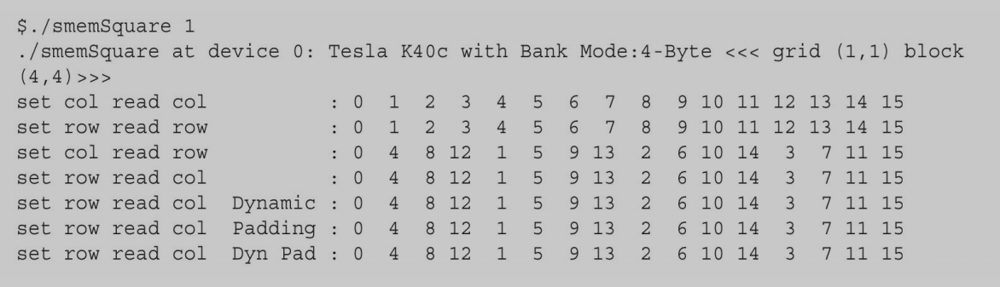

- 矩形共享内存
  - 与方形比较,需要注意维度计算访问索引
  - 行主序写操作和列主序读操作,这个内核在现实的应用程序中是可用的。它使用共 享内存执行矩阵转置，通过最大化低延迟的加载和存储来提高性能，并合并全局内存访 问。
  - 动态共享内存只能被声明为一维数组，当按照行写入和按照列读取时，将二维线 程坐标转换为一维共享内存索引需要一个新的索引
  - 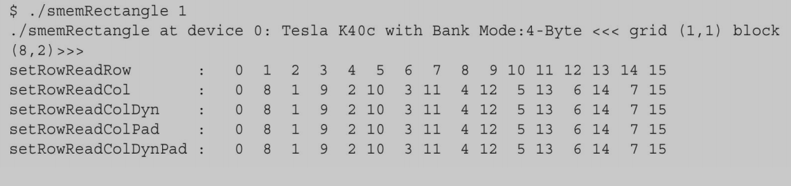

### 3 减少全局内存访问

- 使用共享内存的并行归约
  - 使用全局内存,完全展开作为基准
  - 原地规约,增加带有共享内存得全局内存,性能快乐1.84被
  - 使用展开的并行规约,全局内存加载事务的数量在核函数中没有变化，但是全局内存存储事 务的数量减少了1/4。
  - 使用动态共享内存的并行归约,和静态实现没差别
  - 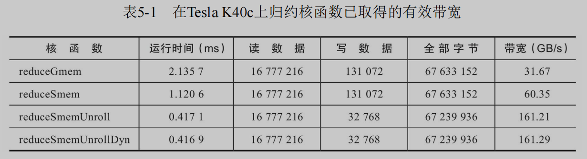

### 4 合并的全局内存访问

- 基准转置内核,使用全局内存的朴素矩阵转置实现作为基准
- 使用共享内存的矩阵转置
  - 为了避免交叉全局内存访问，可以使用二维共享内存来缓存原始矩阵的数据。
  - 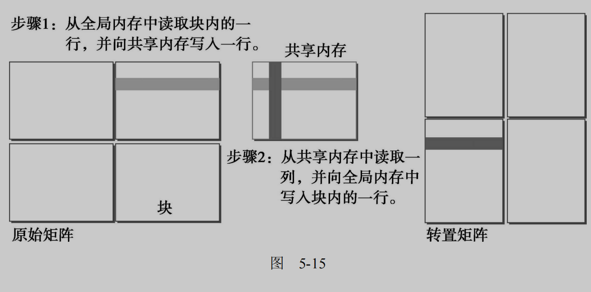

- 使用填充共享内存的矩阵转置 
  - 通过给二维共享内存数组tile中的每一行添加列填充，可以将原矩阵相同列中的数据 元素均匀地划分到共享内存存储体中。
- 使用展开的矩阵转置
  - 核函数展开两个数据块的同时处理：每个线程现在转置了被一个数据块跨越的 两个数据元素。这种转化的目标是通过创造更多的同时加载和存储以提高设备内存带宽利用率。
  - 

- 对比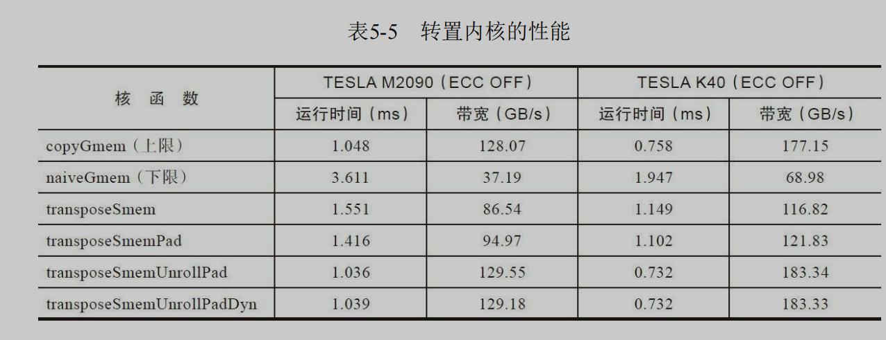
- 增大并行性
  - 调整线程块维度
  - 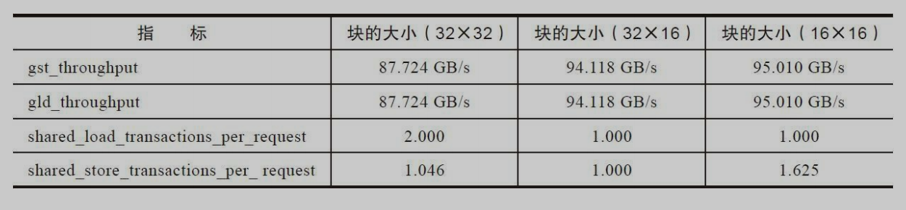

### 5 常量内存

- 常量内存是一种专用的内存，它用于只读数据和统一访问线程束中线程的数据。

  - 常量 内存对内核代码而言是只读的，但它对主机而言既是可读又是可写的

  - 位于设备的DRAM,有专用片上缓存,大小64KB
  - 在常量内存中，如果线程束中的所有线程都访问相同的位置，那么这个访 问模式就是最优的。否则串行访问
  - `__constant__`全局作用域必须用它修饰,使用 `cudaMemcpyToSymbol()`进行初始化

- 使用常量内存实现一维模板

  - 是实变量函数f在x上一阶导数的第八阶中心差分公式,这里的系数就用到常量
  - 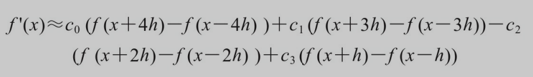
  - 

- 与只读缓存的比较

  - Kepler GPU添加了一个功能，即使用GPU纹理流水线作为只读缓存，用于存储全局内 存中的数据。
  - 每个Kepler SM都有48KB的只读缓存。一般来说，只读缓存在分散读取方面比一级缓 存更好，当线程束中的线程都读取相同地址时，不应使用只读缓存。
  - 当通过只读缓存访问全局内存时，需要向编译器指出在内核的持续时间里数据是只读 的,使用内部函数`__ldg()`或者`const __restrict__`进行限定

  - | 项目     | 常量缓存     | 只读缓存     |
    | -------- | ------------ | ------------ |
    | 资源大小 | 64KB         | 48KB         |
    | 性能     | 统一读取更好 | 适合分散读取 |

    

### 6 线程束洗牌指令

- 洗牌指令（shuffle instruction）
  - 作为一 种机制被加入其中，只要两个线程在相同的线程束中，那么就允许这两个线程直接读取另 一个线程的寄存器
- 一个束内线程指的是线程束内的单一线程。
  - 线程束中的每个束内线程是 [0，31]范围内束内线程索引（lane index）的唯一标识。
  - laneID = threadIdx.x % 32
  - warpID =  threadIdx.x / 32

- 线程束洗牌指令的不同形式

  - 有两组洗牌指令(整数/浮点),每组具有四种 `int __shfl(var,srcLane,width=warpSize)`是基本形式

    - var是返回值,通过有srcLane确定的 统一线程传递给__shfl
    - srcLane指定源线程的 束内线程索引。
    - 变量width可被设置为2～32之间2任何的指数（包括2和32），这是可选择的。
    - 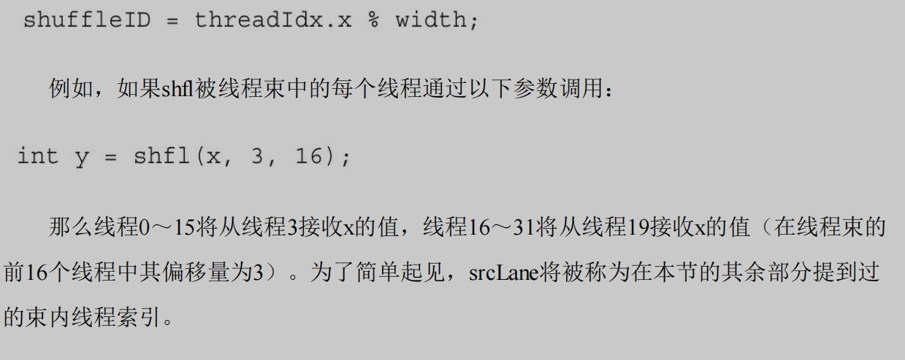

    - 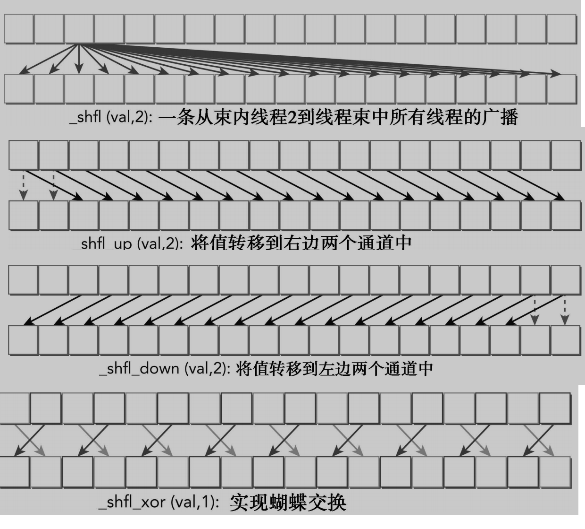

- 线程束内的共享数据

  - 跨线程束值的广播,每个线程都有一个寄存器变量value。源束 内线程由变量srcLane指定，它等同于跨所有线程
  - 跨线程束的蝴蝶交换 ,通过调用线程和线程掩码确定的
  - 跨线程束交换数组值,每个线程都有一个寄存器数组value，其大小是SEGM。每个线程从 全局内存d_in中读取数据块到value中，使用由掩码确定的相邻线程交换该块，然后将接收 到的数据写回到全局内存数组d_out中

- 使用线程束洗牌指令的并行归约 
  - 对于线程束级归约来说，每个线程束执行自己的归 约。每个线程不使用共享内存，而是使用寄存器存储一个从全局内存中读取的数据元素.
  - 对于线程块级归约，先同步块，然后使用相同的线程束归约函数将每个线程束的总和 进行相加。之后，由线程块产生的最终输出由块中的第一个线程保存到全局内存中，对于网格级归约，g_odata被复制回到执行最终归约的主机中
  - 使用洗牌指令实现线程束级并行归约获得了1.42倍的加速

## 第6章 流和并发

### 1 流和事件概述

- CUDA流

  - 是一系列异步的CUDA操作，这些操作按照主机代码确定的顺序在设备上执行。使用多个流同时启动多个内核，可以实现网格级并发

  - 所有的CUDA操作（包括内核和数据传输）都在一个流中显式或隐式地运行,隐式是空流

  - `cudaMemcpyAsync()`是异步传输数据,可以显示指定CUDA流,

    `cudaStreamCreate()`创建CUDA流,数据传输必须使用固定内存

    `cudaStreamDestroy()`销毁CUDA流

    `cudaStreamSynchronize()`强制阻塞主机，直到在给定流中所有的操作都完成了

    `cuda- StreamQuery()`会检查流中所有操作是否都已经完成，但在它们完成前不会阻塞主机。

  - 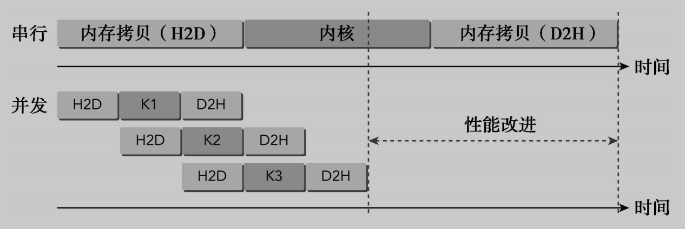

- 流调度
  - 虚假的依赖关系
  - Hyper-Q技术,使用多个硬件队列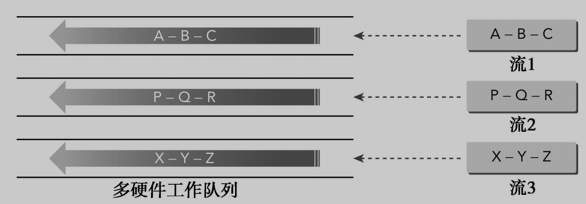

- 流的优先级
  
- `cudaStreamCreateWithPriority()`创建具有优先级的流,高优先级流的网格队列可以优先占有低优先级 流已经执行的工作。只对内核计算有影响.
  
- CUDA事件

  - 可以在流中任一点插入事件

  - `cudaEvent_t`声明事件, 

    `cudaEventCreate()` `cudaEventDestroy()`创建和销毁,

  - 事件在流执行中标记了一个点。它们可以用来检查正在执行的流操作是否已经到达了 给定点。

- 流同步
  - 阻塞流和非阻塞流
    - 使用cudaStreamCreate函数创建的流是阻塞流，这意味着在这些流中操作执行可以被 阻塞，一直等到空流中先前的操作执行结束。
    - 空流是隐式流，在相同的CUDA上下文中它 和其他所有的阻塞流同步。
    - 指定cudaStreamNonBlocking使得非空流对于空流的阻塞行为失效。
  - 隐式同步 
    - 许多与内存相关的操作意 味着在当前设备上所有先前的操作上都有阻塞
    - 锁页主机内存分配/设备内存分配/设备内存初始化/....
  - 显式同步
    - `cudaDeviceSynchronize()`阻塞主机线程直到完成,少用 
    - 用`cudaStreamSynchronize()`函数可以阻塞主机线程直到流中所有的操作完成为止，
    - 使 用`cudaStreamQuery()`函数可以完成非阻塞测试，
    - `cudaStreamWaitEvent()`函数提供了一个使用CUDA事件引入流间依赖关系比较灵 活的方法
  - 可配置事件
    - `cudaEventCreateWithFlags()`可以指定阻塞调用线程,默认围绕事件进行等.

### 2 并发内核执行

- 非空流中的并发内核
  - 使用NVIDIA的可视化性能分析器（nvvp）可视化并发核函数执行

- Fermi GPU上的虚假依赖关系
  - 虚假的依赖关系是由主机调度内核的顺序引起的。该应用程序使用深度优先的方 法
  - 采用广度优先顺序可以确保工作队列中相邻的任务来自于不同的流,任何相邻的任务对之间都不会再有虚假的依赖关系，从而得以实现并发内核 执行。
  - 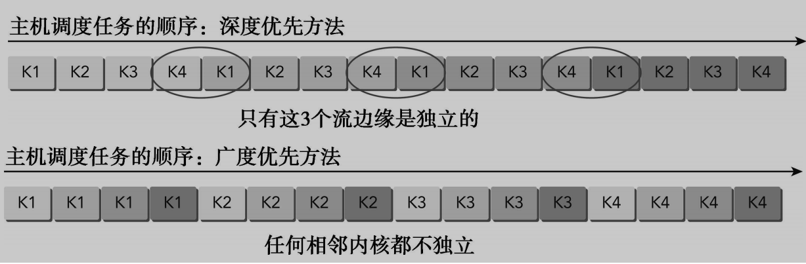

- 使用OpenMP的调度操作
  - OpenMP是CPU的并行编程模型，它使用编译器指令来识别并行区域。在使用OpenMP的同时使用CUDA，不仅可以提高便携性和生产效率，而且还可以提 高主机代码的性能。
- 用环境变量调整流行为 
  - 支持Hyper-Q的GPU在主机和每个GPU之间维护硬件工作队列，消除虚假的依赖关 系。
  - 可以使用 CUDA_DEVICE_MAX_CONNECTIONS环境变量来调整并行硬件连接的数量
- GPU资源的并发限制
  - 实际应用中，内核启动时通常会创建多个线程。可用的硬件资源可能会成为并发的主要限制因素，因为它们阻止启动符 合条件的内核。

- 创建流间依赖关系
  - 事件可以用来添加流间依赖关系。
  - 首先，将标志设置为cudaEventDisableTiming，创建 同步事件
  - 使用cudaEventRecord函数，在每个流完成时记录不同的事件。
  - 使用 cudaStreamWaitEvent使最后一个流等待其他所有流

### 3 重叠内核执行和数据传输

- Fermi GPU和Kepler GPU有两个复制引擎队列(双工),只有数据方向不同的流才可以重叠
- 使用深度优先调度重叠
  - 网格管理单元 ,GMU可以暂停新网格的调度，使网格排队等待且暂停网格直到它们准备好执行，这 样就使运行时变得非常灵活强大，动态并行就是一个很好的例子。
- 使用广度优先调度重叠
  - 对于Kepler设备而言，在大多数情况下无须关注其工作调度顺序

### 4 重叠GPU和CPU执行 

- 实现GPU和CPU执行重叠是比较简单的，因为所有的内核启动在默认情况 下都是异步的。
- 主机只要循环等待

### 5 流回调

- 一旦流回调之前所有的流操作全 部完成，被流回调指定的主机端函数就会被CUDA运行时所调用。
  - 是另一种CPU和GPU同步机制。回调功能十分强大
  - `cudaStreamAddCallback()`添加回调,不可以执行同步,不可以调用CUDA的API函数

## 第7章 调整指令级原语 

### 1 CUDA指令概述

- 浮点指令

  - 采用IEEE-754标准,也就是分为三部分 符号(1bit)|指数段|尾数

  - 浮点数由于采用近似表示,会存在取舍问题,

    浮点的粒度分布不均匀

  - 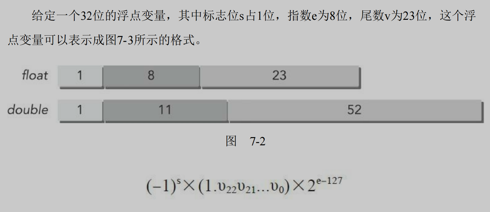

- 内部函数和标准函数
  - 标准函数用于支持可对主机和设备进行访问并标准化主机和设备的操作。包括标准库的sin/cos等
  - 内置函数只能对设备代码进行访问。如果一个函数是内部函数或是 内置函数，那么在编译时对它的行为会有特殊响应，从而产生更积极的优化和更专业化的 指令生成。
  - 内部函数速度更快,数值精度更低

- 原子操作指令 

  - 一条原子操作指令用来执行一个数学运算，此操作是一个独立不间断的操作

  - 原子运算函数分为3种：算术运算函数、按位运算函数和替换函数。(类比Java中的原子类)

    `atomicAdd()` `atomicExch()`

  - 需要小心性能问题

### 2 程序优化指令

- 单精度与双精度的比较
  - 双精度数值的精确性是以空间和性能消耗为代价的。
  - 默认使用的是双精度,单精度声明需要加上后缀f
  - 
- 标准函数与内部函数的比较 
  - 使用nvcc的--ptx标志能够让编译器在并行线程执行（PTX）和指令集架构 （ISA）中生成程序的中间表达式
  - `.entry`指令标志了一个函数定义的开始
  - 内部函数结果精度更差,速度更快.移植CPU程序到GPU程序时,需要考虑精度问题
  - 操纵指令生成 
    - 控制指令级优化类型：编译器标志、内部或标准函数调用。
    `- nvcc --fmad=true` 表示可以使用FMAD优化乘加操作
    - 禁用优化可以生成和主机代码一样的结果
    - 更多标志可以通过 `nvcc --help`查看
  - 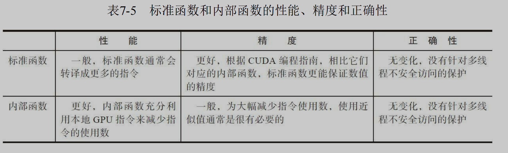

- 了解原子指令

  - CAS(比较相等则设置,返回目标地址的存储值),`atomicCAS()`

    需要配合循环

  - 原子函数性能代价很高,

    - 当在全局或共享内存中执行原子操作时，能保证所有的数值变化对所有线程都是立 即可见的。
    - 共享地址冲突的原子访问可能要求发生冲突的线程不断地进行重试
    - 当线程在同一个线程束中时必须执行不同的指令，线程束执行是序列化的

  - 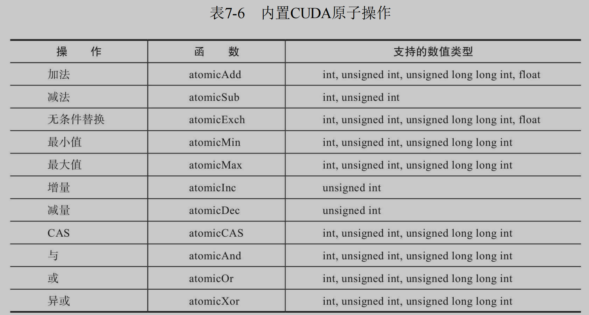

  - 限制原子操作的性能成本

    - 可以使用局 部操作来增强全局原子操作，这些局部操作能从同一线程块的线程中产生一个中间结果。
    - 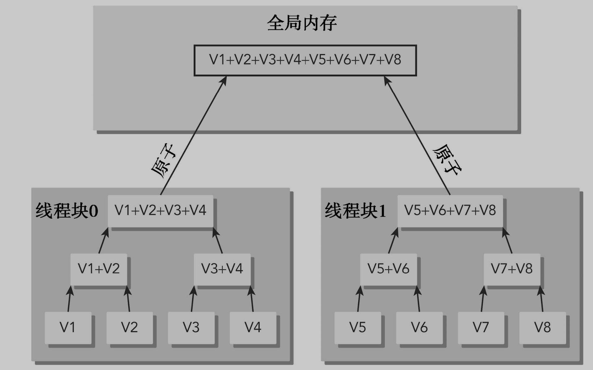

  - 原子级浮点支持

    - 只有atomicExch和atomicAdd支持单精度浮点 数。所有原子函数都不支持双精度数值的运算。

  - 综合范例

    - 是一个普通的仿真基准,它模拟了一系列的粒子和它们之间的相互操作
    - NBody实现要进行两个全局统计：是否有任何粒子已经超过了相对于原点的某个距离，有多少粒子移动的速度比指定速度快。
    - 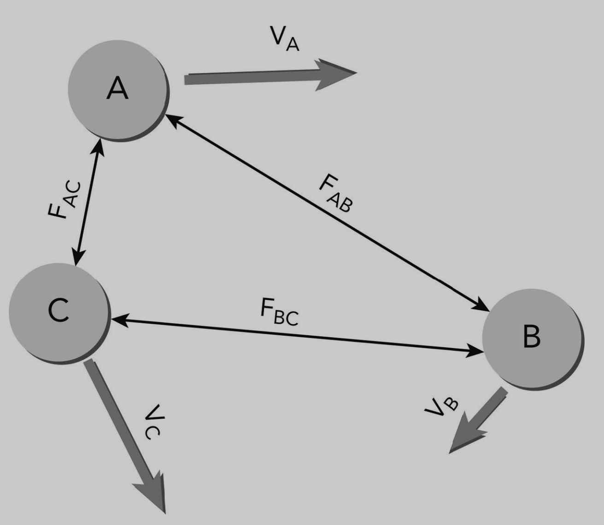
    - 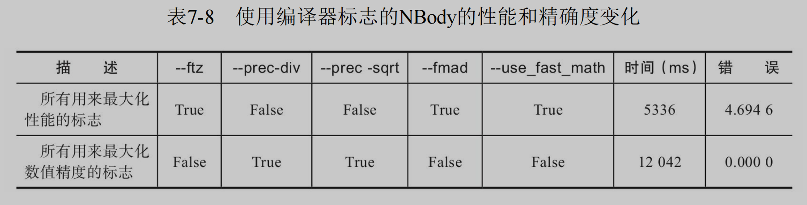

## 第8章 GPU加速库和OpenACC

> CUDA提供了一系列的库来提高CUDA开发人员的开发效率,CUDA库在CUDA运行时之上，
>
> 为主机应用程序和第三方库提供一个简 单、熟悉且有针对性的接口

- 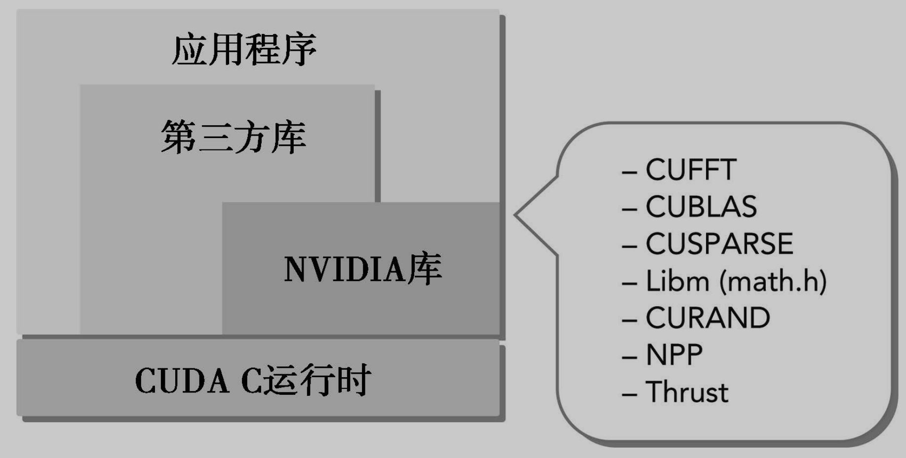

- 在CUDA上提供抽象层的工具是OpenACC
  - OpenACC使用编译指令注释来自于主机端和加速设备端用于减荷的代码和数据区域。编译器通过自动生成任意必要的内存拷 贝、内核启动以及其他CUDA API调用，来对这些在设备上执行的代码进行编译。

### 1 CUDA库概述

- CUDA库和系统库或用户自定义库没有什么不同，它们是一组在头文件中说明其原型的函数定义的集合。特殊性在于使用了GPU加速.
  - CUDA库在性能方面已经超过了主机库，而且有时也超过了手写的CUDA实现。

- CUDA库支持的作用域 
  - 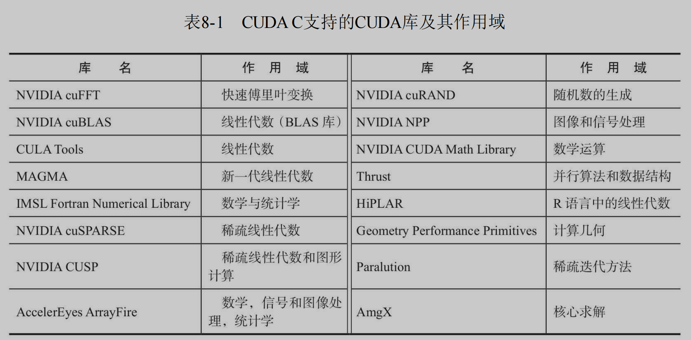

- 通用的CUDA库工作流
  1. 创建一个函数库句柄,句柄包含了该库的一些上下文信息,如数据结构格式/设备端使用.库调用前需要为句柄分配内存及初始化.
  2. 分配设备内存,只有在使用多GPU编程库时，才需要使用API来分配设备内存。
  3. 输入数据转换为函数库支持的格式,比如数据维度,行列优先存储.
  4. 将数据传送到设备内存中，以供CUDA设备上的库函数使用。
  5. 配置数据库,被调用的库函数必须明确自己所用的数据格式、维度或其他配置参数。
  6. 执行,直接调用API
  7. 取回设备内存中的结果,输出数据按预定义的格式从设备内存中传回至主机内存
  8. 将数据转换回原始格式,第3步反过程
  9. 释放CUDA资源
  10. 继续应用程序的其他部分

### 2 cuSPARSE库

- cuSPARSE分为了三类函数,第一类只能稠密向量/稀疏向量,第二类稀疏矩阵/稠密向量,第三类可以在稀疏矩阵/稠密矩阵 操作
  - 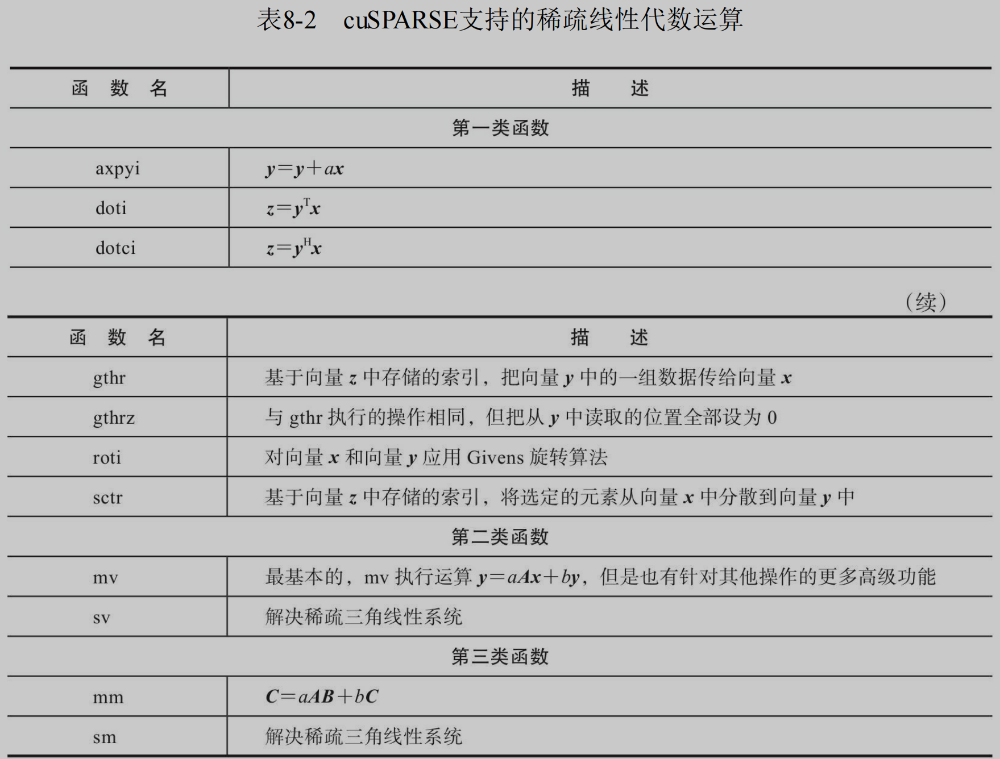

- cuSPARSE数据存储格式
  - 稠密存储方式
    - 稠密矩阵格式是一种常见的存储方式，这种方式把矩阵中的每个元素都存储起来，不管它是否为零
    - 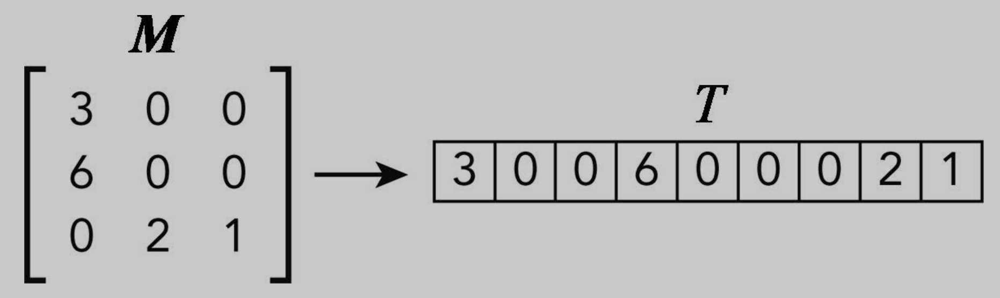
  - 坐标存储方式
    - 存储了稀疏矩阵中每个非零元素的行坐标、列坐标及其元素值
    - 坐标矩阵存储格式与稠密矩阵存储格式所占用的空间大小取决于矩阵的稀疏程度、元 素的大小以及存储坐标类型的大小。
    - 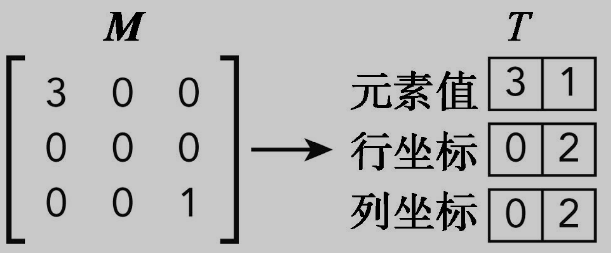
  - 压缩稀疏行方式
    - CSR则为同一行的所有元素值存储一个偏移量。
    - 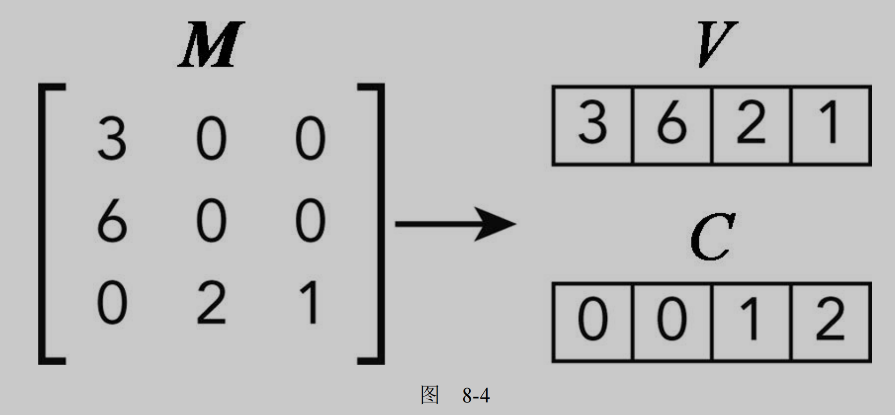

- 用cuSPARSE进行格式转换 
  - 在cuSPARSE中执行矩阵与向量或矩阵与矩阵之间的操作时就 要求用CSR，BSR，BSRX或HYB等存储格式。
  - 尽量避免转换,代价很高
  - 编译时候需要使用库 `-lcusparse`
- cuSPARSE发展中的重要主题
  - 需要保证正确的矩阵和向量数据格式,本身是不能检测到错误或不恰当的数据输入格式
  - 为了对计算函数验证输入数据格式，建议与具有相同功能的主机端实现进行对比。
  - 是cuSPARSE默认的异步行为,使用cudaMemcpy将cuSPARSE的结果从设备传到主机，那么应用程序将会自动阻塞
  - 是标量参数的转换，它总是以引用的方式传递的

### 3 cuBLAS库

- cuBLAS库
  - 是一个传统线性代 数库的接口,即基本线性代数子程序库,不支持稀疏矩阵,仅支持并善于优化稠密向量和稠密矩阵的操作
  - 最初的BLAS库使用FORTRAN编写的,是以列优先的数组存储和以1为基准的索引
  - 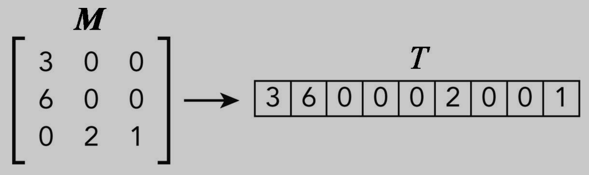

- 管理cuBLAS数据 
  - 所有操作都 是在稠密cuBLAS向量或矩阵上完成的。
  - 使用cudaMalloc分配连续的设备内存给这些向量和矩阵
- BLAS库的程序移植 
  - 使用cudaMalloc分配内存,并释放
  - 主机与设备之间数据传输
  - 调用对应的cuBLAS库
- cuBLAS发展中的重要主题
  - 使用列优先存储,如果常用的是行优先的编程语言，用cuBLAS进行开发则可能需要多关注细节\

### 4 cuFFT库

- 提供了一个优化的且基于CUDA实现的快速傅里叶变换
- cuFFT通常指两个独立的库：
  - 核心高性能的cuFFT库,是在CUDA中能提供自身API的FFT实现
  - 可移植的cuFFTW库,与标准的FFTW主机端FFT库有相同的API。
  - 支持多种输入输出(复数与实数之间转换)

### 5 cuRAND库

- 一个随机数生成器（RNG）是一个没有任何参数的函数f，但是在每次调用时都能返回随机值序列的下一个值。
  - cuRAND库用在基于CUDA库的拟随机数和伪随机数的生成
- 拟随机数或伪随机数的选择
  - 一个伪随机数生成器（PRNG）使用RNG算法生成随机数序列,每次采样都是独立统计事件，对以后抽样的样本观察值 并不会有影响(放回抽样)
  - 拟随机数生成器（QRNG）会尽量均匀地填充 输出类型的范围(不放回抽样)

- cuRAND库概述

  - 它既有一个主机端API又有一 个设备端API

  - 用于生成随机序列的RNG算法，返回值遵循 的一个分布，初始种子数值和随机数序列开始采样的一个偏移量。

    支持正态分布、均匀分布、对数正态分布和泊松分布

-  cuRAND介绍 
  - 替换rand()函数
  - 基于cuRAND的对象中最重要的部分就是 了解随机性的要求
  - 要确保你已经正确配置了cuRAND环境以生成期望的随机数类型。即便给出了高度 依赖随机性的应用程序的范围，也不知道选择哪个应用程序是正确的。

### 6 CUDA6.0中函数库的介绍

- Drop-In库
  - 可以使某些GPU加速库无缝地替换已有的CPU库。只要GPU加速库与原主机 库使用相同的API，就可以直接把一个应用程序链接到一个Drop-In库中。
  - 目前只支持两个CUDA库。NVBLAS是cuBLAS库的一个子函数 库，它可以替换任意的三层BLAS函数。cyFFTW可以替换FFTW库的调用。
  - 强制在主机库之前加载CUDA库，这种方法是在Linux环境下使用CUDA Drop-In的。使用LD_PRELOAD环境变量来实现
- 多GPU库
  - 它们能使单一的函数库 调用在多个GPU上自动地执行.由于在多个GPU上执行需要在设备上划分任务，与GPU全 局内存相比，一个多GPU库可以对更大规模的数据集进行操作
  - cuFFT中的一些函数和所有的Level 3 cuBLAS函数都支持多GPU上的 程序执行。在性能优化上，cuBLAS Level 3多GPU库调用利用内核计算自动覆盖了内存传 输
  - cuFFTXT库使用FFT函数之前的知识来分配GPU之间的数据，这样做没有破坏FFT结 果的有效性

### 7 CUDA函数库的性能研究

- cuSPARSE与MKL的比较 
  - 数学核心库（MKL）是稀疏线性代数性能的黄金准则。MKL使用向量指令 在多核CPU上手动优化的执行密集和稀疏线性代数
- cuBLAS与MKL BLAS的比较 
  - 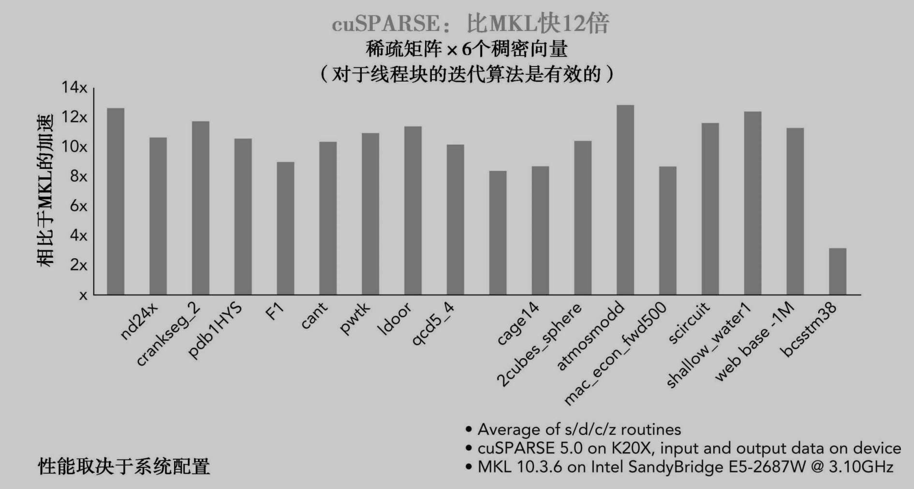

- cuBLAS与MKL BLAS的比较 
  - 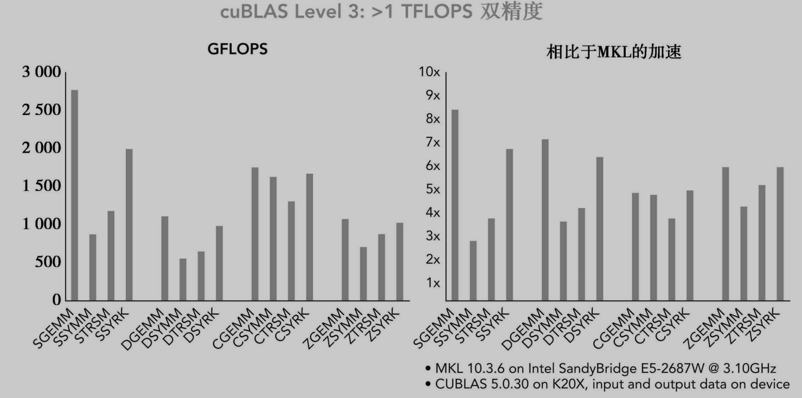

- cuFFT与FFTW及MKL的比较
  - 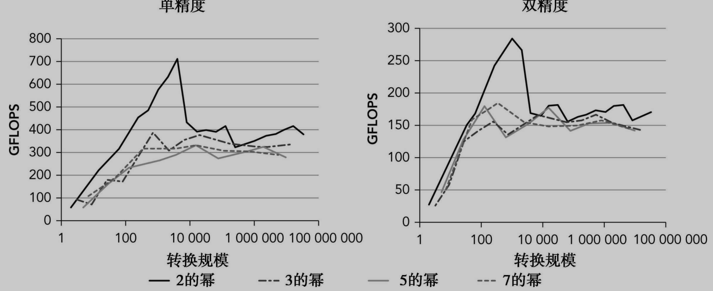

### 8 OpenACC的使用

- OpenACC是CUDA的一个补充编程模型，
  - 使用基于编译器指令的API，具有高性能、 可编程性和跨平台可移植性。
  - 线程模型类似,增加了一个并行维度.gang类似线程块,worker类似线程束,vector类似线程.(CUDA没有明确指出线程束)
  - OpenACC的目标是建立一个具有单线程的主机程序平台，代码中内核交给多处理单元(PU),每个PU一次运行一个gang
  - `#pragma acc`内核指令标志着下列顺序代码块在OpenACC加速器上符合执行的条件 
- OpenACC计算指令的使用
  - 内核指令的使用
    - `#pragma acc kernels` 采取了一种比`#pragma acc parallel`更自动化且编译器可驱动的方法
    - 当在一个代码块中应用内核指令时，编译器会自动分析这个代码块中可并行的循环。 
    - 为PGI编译器添加-acc标志使其支持OpenACC，允许其在所提供的代码中识别任何带 有#pragma acc的指令。
    - 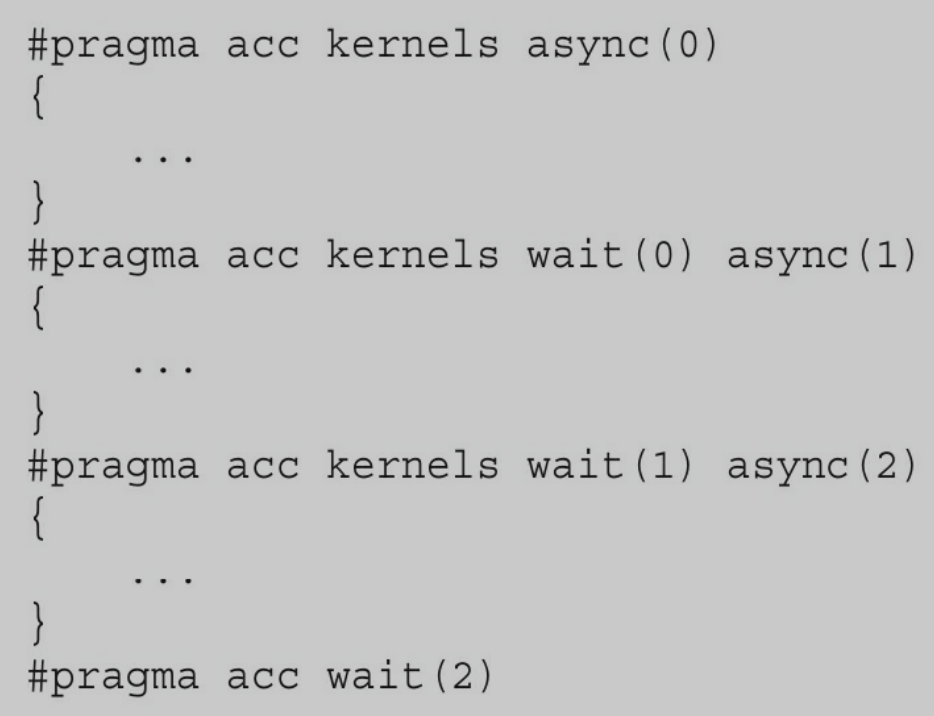
  - 并行指令的使用
    - `#pragma acc`并行指令。内核 指令允许编译器将标记代码分组到尽可能多的加速器内核中，该内核中包含编译器认为所 有必要的并行部分
    - 支持简化运算符
  - 循环指令的使用
    - 部分子句截图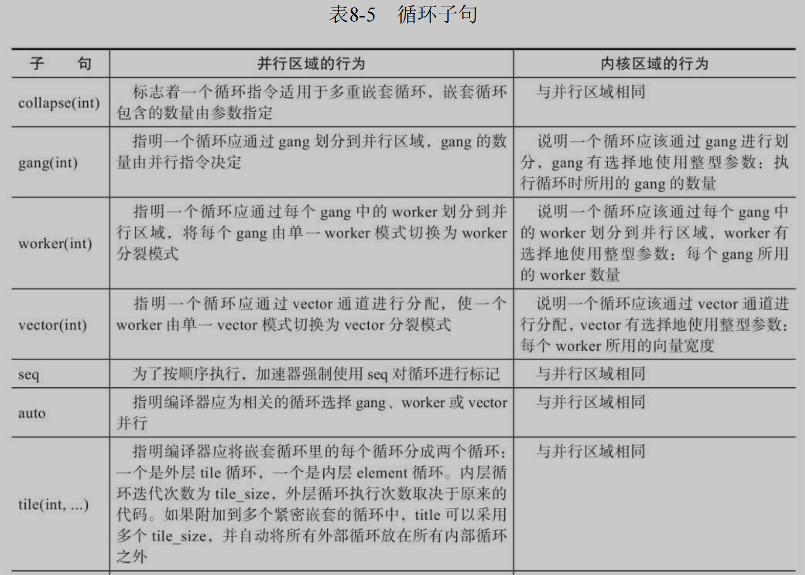

- OpenACC数据指令的使用
  - 数据指令的使用
    - `#pragma acc data`被显式地用于在主机应用程序和加速器之间传输数 据
    - 在执行过程中也可以用`#pragma acc enter data`和`#pragma acc exit data`来 标记任意节点传入和传出加速器的数组。
  - 为内核指令和并行指令添加data子句
    - 由于输入和输出数据都是在计算区域之前或之后进行传输的，所以数据 指令与计算指令紧密相关。尽管可以对每个任务使用独立的指令，但OpenACC还是支持 使用计算指令上的data子句来简化代码。
  - OpenACC运行时API
    - OpenACC也
    - 供了一个函数库,OpenACC运行时API函数可分成4个方面：
      - 设备管理函数允许你显式控制使用哪个加速器或加速器类型来执行OpenACC计算区域
      - 异步控制函数允许你检查或等待异步操作的执行状态
      - 运行时初始化函数用来初始化或管理OpenACC的内部状态
      - 内存管理函数用于管理加速器内存分配以及在主机和加速器之间的数据传输
- OpenACC和CUDA库的结合
  - CUDA和OpenACC是相互独立的编程模型，但它们仍可在同一应用程序中使用
  - 步骤
    1. 使用cudaMalloc为矩阵分配设备内存，使用curandCreateGenerator和cublasCreate为 cuRAND和CUBLAS库创建句柄。 
    2. cuRAND库中的curandGenerateUniform函数产生的随机数据对设备内存中的输入矩阵 进行填充。 
    3. 使用OpenACC指令，在GPU上并行执行两个矩阵间的乘法。 
    4. cublasSasum用于计算输出矩阵中所有元素的总和。 
    5. 使用cudaFree释放设备内存。
    6. `pgcpp -acc cuda-openacc.cu -o cuda-openacc -Minfo=accel -L${CUDA/HOME}/lib64 -lcurand -lcublas -lcudart`

## 第9章 多GPU编程

### 1 从一个GPU到多GPU

- 集群的简化拓扑结构
  - 节点可能包含多个CPU/DRAM/本地存储设备/HCA/USB/多个GPU的PCI交换机
  - 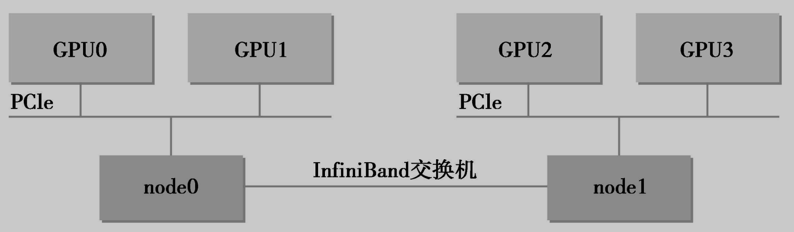
  - 问题分区之间没有数据交换,只需了解如何在多个设备中传输数据及调用内核
    - 问题分区有数据交换,必须考虑数据如何在设备之间实现最优移动,尽量避免数据复制到主机
- 在多GPU上执行 
  - `cudaGetDeviceCount()`返回CUDA设备数量,通过`cudaGetDeviceProperties()`查询性能参数
  - 一旦选定了当前设备，所有的CUDA运算将被应用到那个设备上,
    - 任何从主线程分配来的设备内存
    - 任何CUDA运行时函数分配的主机内存都会有与该设备相关的生存时间
    - 任何主机线程创建的流/事件都会与该设备相关
    - 任何由主机线程启动的内核都会在该设备上执行
    - 可以使用循环进行设置
- 点对点通信
  - 内核可以直接访问任何GPU的全局内存，这些GPU连接到同一个PCIe根节点上。
  - 启用点对点访问 
    - 对于透明的内核，引用的数据将通过PCIe总线传输到请求的线程上。 
    - 使用`cudaDeviceCanAccessPeer()`进行检查是否支持
    - 使用`cudaDeviceEnablePeerAccess()`开启
    - 使用`cudaMemcpyPeerAsync()`可以异步复制设备数据

- 多GPU间的同步 
  1. 选择这个应用程序将使用的GPU集。
  2. 为每个设备创建流和事件。
  3. 为每个设备分配设备资源（如设备内存）。 
  4. 通过流在每个GPU上启动任务（例如，数据传输或内核执行）。 
  5. 使用流和事件来查询和等待任务完成。 
  6. 清空所有设备的资源。

### 2 多GPU间细分计算

- 在多设备上分配内存
  - 查询GPU个数并声明主机内存/设备内存/流/事件
  - 为每个GPU分配主机和设备内存了，为每个设备创建CUDA流

- 单主机线程分配工作 
  - 使用一个循环在多个设备之间分配数据和计算
- 编译和执行

### 3 多GPU上的点对点通信

- 实现点对点访问

  - 必须对所有设备启用双向点对点访问

- 点对点的内存复制

  - 启用点对点访问后，可以在两个设备之间直接复制数据
  - 如果不支持点对点,那么这两个设备之间的点对点内存复制将通过主机内存中 转，从而会降低其性能。

- 统一虚拟寻址的点对点内存访问

  - 所有由cudaHostAlloc分配的主机内存和由 cudaMalloc分配的设备内存驻留在这个统一的地址空间内。内存地址所驻留的设备可以根 据地址本身确定。

  - 将点对点CUDA API与UVA相结合，可以实现对任何设备内存的透明访问

    注意，过于依赖UVA进行对等访问对性能将产生 负面的影响，如跨PCIe总线的许多小规模的传输会明显地有过大的消耗。

  - 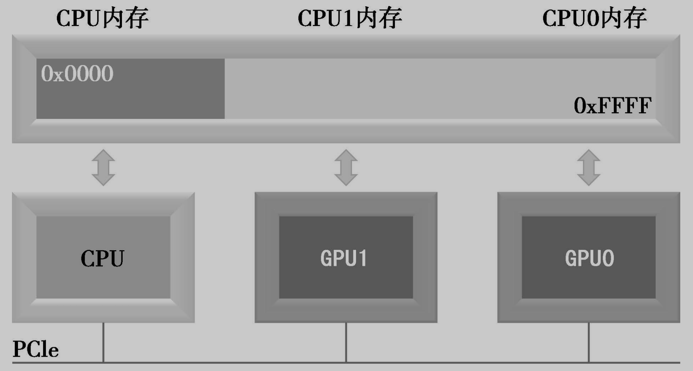

  - 如果同时启用点对点访问和UVA，那么在一个设备上执行的核函数，可以解除另一个设备上存储的指针

### 4 多GPU上的有限差分

- 二维波动方程的模板计算
  - 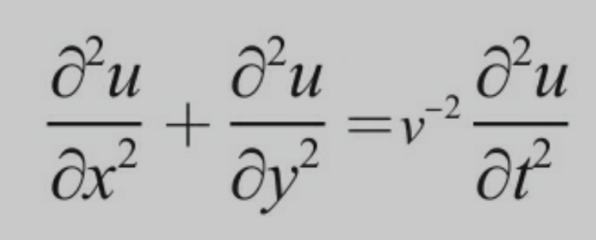
  - 偏导数可以由一个泰勒展开式来表示，比如对x的求导可以由x方向加权和得到
  - 

- 多GPU程序的典型模式 
  - 为了准确地模拟通过不同介质的波传播，需要大量的数据.需要跨多个GPU的数据域分解
  - 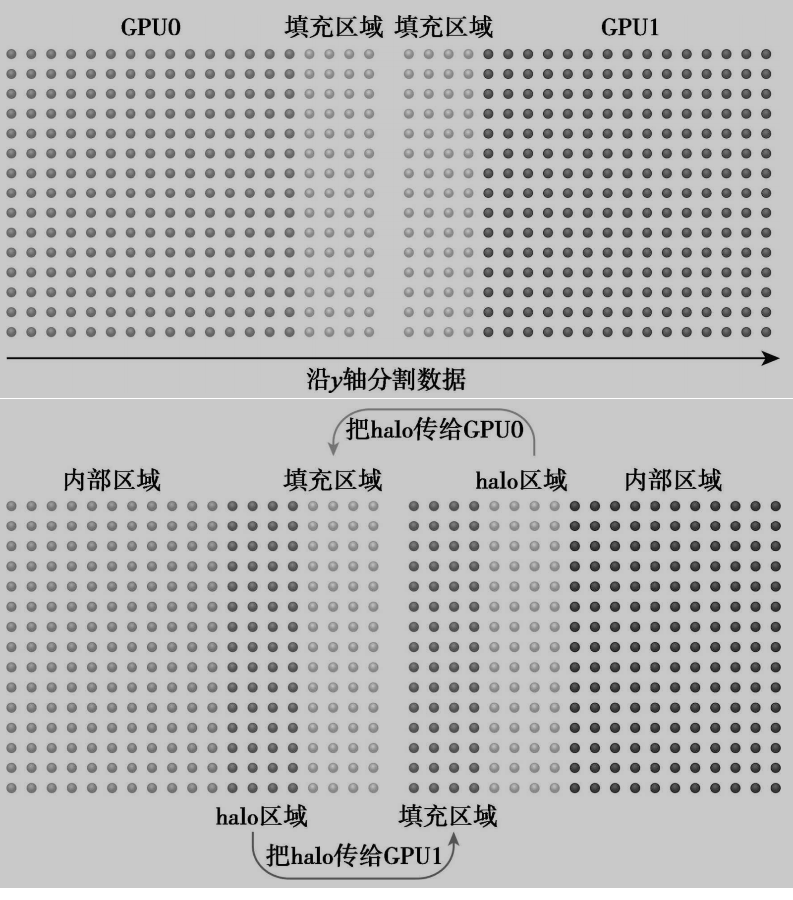

- 多GPU上的二维模板计算
  - 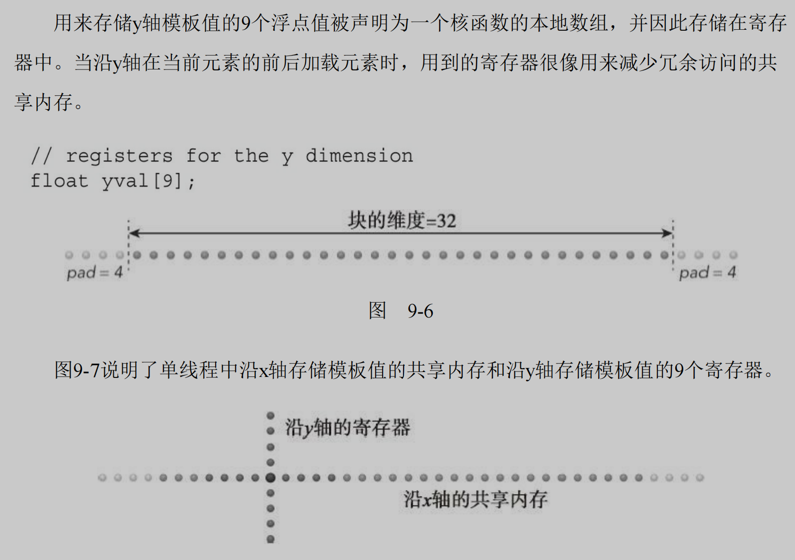
- 重叠计算与通信
  - 此二维模板的执行配置使用一个具有一维线程块的一维网格

- 编译和执行

### 5 跨GPU集群扩展应用程序

- GPU加速集群被公认为极大地提升了性能效果和节省了计算密集型应用程序的功耗
  - MPI（消息传递接口）是一个标准化和便携式的用于数据通信的API，它通过分布式进程 之间的消息进行数据通信
  - MPI与CUDA是完全兼容的,在CUDA-aware MPI中，可以把GPU内存中的内容直接传递到 MPI函数上，而不用通过主机内存中转数据。


- pass,以后用到再学


## 第10章 程序实现的注意事项

### 1 CUDAC的开发过程 

- 了解GPU内存和执行模型抽象有助于更好地控制大规模并行GPU环境。
  - APOD开发周期 
    - 评估(Assessment),是评估应用程序，确定限制性能的瓶颈或具有高计算强度的临界区,数据并行循环结构包含很重要的计算，应该始终给予其较高的评估优先级
    - 并行化(parallelization),利用现有GPU加速库,比如cuBLAS/cuFFT,或者使用OpenACC.需要注意块划分和循环划分
    - 优化(optimization),网格级优化可以同时运行多个内核/CUDA流/CUDA事件重叠,内核级优化注意GPU内存带宽和计算资源的高效使用
    - 部署(deployment),只要确定GPU加速应用程序的结果是正确的就可以进入最后阶段.
  - 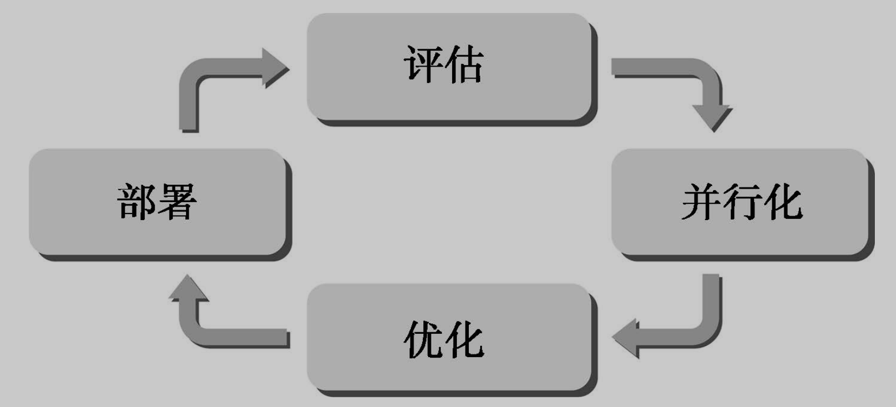
- 优化因素
  - 对之前的线程模型/内存模型进行总结