# Hadoop权威指南

- [ ] 书籍作者: [(美) Tom White](https://book.douban.com/search/Tom White)
- [ ] 笔记时间: 2021.01.11

## 第Ⅰ部分 Hadoop基础知识

### 第1章 初识Hadoop

#### 1.1 数据!数据

数据级别是 TB,PB

#### 1.2 数据的存储与分析

硬盘存储量大,传输慢 -- 多个硬盘同时读写

- 硬件故障--复制(replication)
- 任务的合并--Hadoop

#### 1.3 查询所有数据

MapReduce

##### 1.4 不仅仅是批处理

不适合交互,Hadoop不仅仅是HDFS和Map Reduce

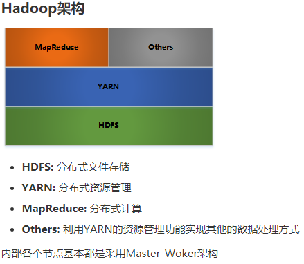

#### 1.5 相较于其他系统的优势

##### 1.5.1 关系型数据库管理系统

寻址速度提升远远小于传输速度提升

MapReduce适合一次写入,多次读取数据

RDBMS适合持续更新数据集

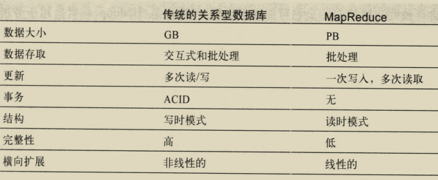

##### 1.5.2 网格计算

高性能计算和网格计算主要使用消息传递接口(MPI)的API,使用共享文件系统,适合计算密集型,控制权大,控制复杂

Hadoop尽量在计算节点存储数据,数据本地化是核心

##### 1.5.3 志愿计算

志愿计算把问题分成很多块,每块称为一个工作单元,主要贡献是CPU周期,而不是网络带宽

#### 1.6 Apache Hadoop发展简史

### 第2章 关于MapReduce

可用于数据处理的编程模型

#### 2.1 气象数据集

#### 2.2 使用Unix工具来分析数据

使用awk,需要多线程加上数据控制

#### 2.3 使用Hadoop来分析数据

##### 2.3.1 map 和 reduce

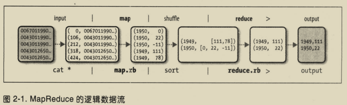

#### 2.3.2 Java MapReduce

###### 2.3.2.1 运行测试

#### 2.4 横向扩展

需要把资源放到HDFS里面

##### 2.4.1 数据流

作业是客户端需要执行的一个单元: 输入数据 Map Reduce程序和配置信息

作业分为若干个任务(分为map和reduce任务),运行在集群,通过YARN进行调度

输入数据划分为等长小数据块,称为输入分片,每个分片构建一个map任务(默认128M),map输出写入本地硬盘,reduce才是结果放入到HDFS

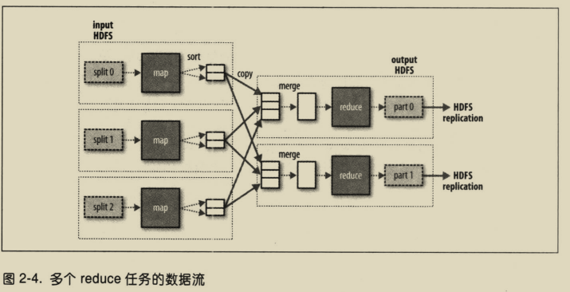

##### 2.4.2 combiner函数

属于优化方案,针对map任务的输出制定一个combiner,作为reduce的输入

#### 2.5 Hadoop Streaming

使用Unix标准流作为Hadoop和应用程序之间的接口,可以通过任何编程语言写程序

### 第3章 Hadoop分布式文件系统

管理网络中跨多台计算机存储的文件系统称为 分布式文件系统

#### 3.1 HDFS的设计

以流式数据访问模式存储超大文件

- 超大文件 几百MB,GB,已经由PB级别
- 低延迟数据访问 使用HBase更好
- 大量小文件 受限于namenode
- 目前只能单用户添加模式

#### 3.2 HDFS的概念

##### 3.2.1 数据块

文件系统基于块进行管理(磁盘块通常为512KB),HDFS128MB(减少寻址时间)

- 所有块不一定在一块硬盘上
- 块复制(默认3个)

##### 3.2.2 namenode 和 datanode

- namenode管理文件系统树以及书内所有文件和目录(存于命名空间镜像文件和编辑日志文件)
- datanode记录每个文件中各个块所在的数据节点信息

没有namenode,文件系统将无法运行,容错非常重要

- 备份组成文件系统元数据持久状态的文件
- 运行辅助namenode(定期合并两个文件)

##### 3.2.3 块缓存

默认情况下,一个块仅缓存在一个datanode中

##### 3.2.4 联邦HDFS

2.x版本引入,namenode管理的是一部分文件系统命名空间

每个namenode维护一个命名空间卷(命名空间元数据和一个数据块池组成)

##### 3.2.5 HDFS的高可用性

依旧存在单点失效问题.增加了HDFS(HA),配置一对活动-备用namenode

- namenode共享存储,实现编辑日志的共享
- datanode需要同时向两个namenode发送数据块报告

共享存储有 QJM和NFS过滤器

**故障切换与规避**

故障转移控制器,一种是使用Zookeeper确保只有一个namenode(心跳机制)

#### 3.3 命令行接口

#### 3.4 Hadoop文件系统

是一个接口,有很多实现,HDFS只是其中一种

**接口**

使用Java的FileSystem类提供文件系统操作

1. HTTP

   速度慢,尽量不要用来传输(直接访问,代理访问都可)

   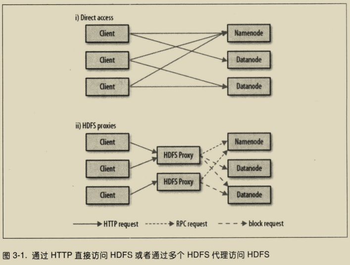

2. C语言

   libhdfs的库

3. NFS

4. FUSE

#### 3.5 Java接口

##### 3.5.1 从Hadoop URL读取数据

最简单的使用java.net.URL读取数据流

通过FsUrlStreamHandleFactory实例调用URL的setURLStreamHandlerFactory()方法,只能调用一次

##### 3.5.2 通过FileSystem API读取数据

Hadoop文件系统通过HadoopPath对象代表文件.

FileSystem是一个通用的文件API,有一些静态方法可以获取

Configuration对象封装客户端/服务器配置

建议使用流数据来构建应用访问模式,而非大量使用Seek方法

##### 3.5.3 写入数据

最简单方法是给准备建的文件制定一个Path对象,返回输出流

FSDataOutputStream类不允许在文件定位,只允许追加/顺序写入

##### 3.5.4 目录

FileSystem类的mkdirs提供

##### 3.5.5 查询文件系统

1. 文件元数据: FileStatus
2. 列出文件 listStatus方法
3. 文件模式 globStatus方法,支持通配符
4. PathFilter对象 编程方式控制通配符

##### 3.5.6 删除数据

delete方法

#### 3.6 数据流

##### 3.6.1 剖析文件读取

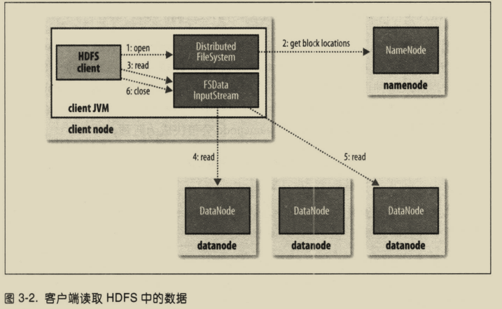

客户端可以直连datanode且namenode告知客户端每个块所在的最佳datanode

namenode只需响应块位置请求

带宽是稀缺资源,Hadoop把网络看做一棵树,节点之间距离是到祖先节点之和

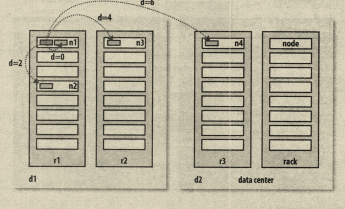

##### 3.6.2 剖析文件写入

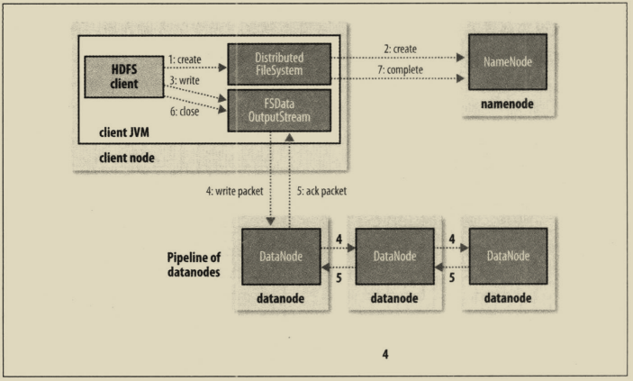

客户端写入数据,DFSOutputStream将其分为若干数据包,写入内部的 数据队列.DataStreamer挑出一组datanode进行存储

DFSOutputStream同时也维护一个 确认队列,收到datanode的确认信息,数据包才会从确认队列删除

datanode写入错误,先关闭管线,确认把所有数据包添加回数据队列前端.为存储在另一正常datanode的当前数据块指定一个新的标识

只要写入了dfs.namenode.replication.min的副本数,写操作就会成功,并且这个块可以在集群中异步复制

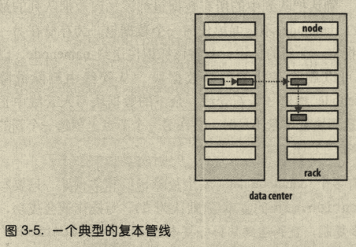

##### 3.6.3 一致模型

文件系统的一致模型(coherency model)描述了文件读写可见性

HDFS的FSDataOutputStream的hflush方法提供强制刷新,刷入内存,hsync方法刷入硬盘

#### 3.7 通过distcp并行复制

大批量复制数据,是作为MapReduce作业来实现的,只有map(默认20个)

### 第4章 关于YARN

Apache YARN(Yet Another Resource Negotiator)是Hadoop集群资源管理系统

#### 4.1 剖析YARN应用运行机制

两类进程: 资源管理器 和 节点管理器(启动和监控容器)

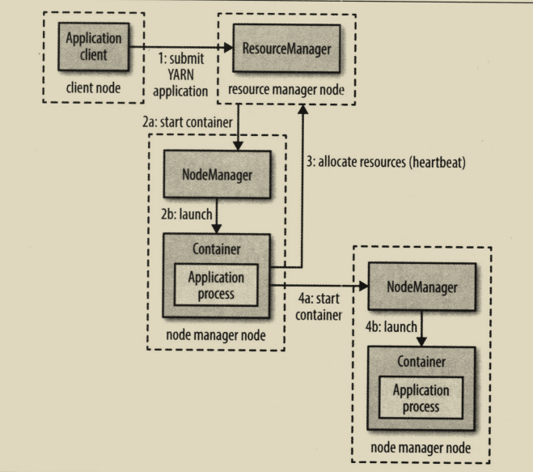

##### 4.1.1 资源请求

YARN允许指定容器需要的计算机资源数量(内存和CPU)

##### 4.1.2 应用生命周期

1. 一个应用对应一个作业(map-reduce)
2. 作业的每个工作流对应一个应用(Spark)
3. 多个用户共享一个长期运行的应用

##### 4.1.3 构建YARN应用

Spark 或者 Slider 都可以直接用

#### 4.2 YARN与MapReduce 1相比

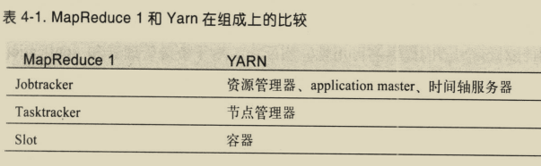

#### 4.3 YARN中的调度

##### 4.3.1 调度选项

FIFO调度器 容量调度器 公平调度器

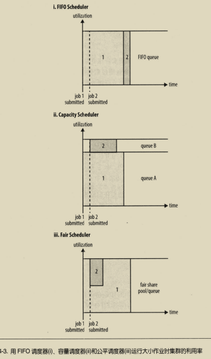

##### 4.3.2 容量调度器配置

弹性队列: 容量调度器会将空余资源分配给队列,哪怕超出队列容量

capacity-scheduler.xml进行配置

##### 4.3.3 公平调度器配置

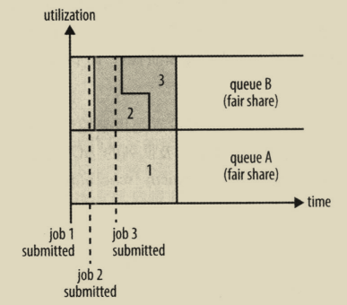

fair-scheduler.xml进行配置,启动方式查看文档

支持抢占

##### 4.3.4 延迟调度

容量和公平调度器都支持(请求等待一段时间,能够增加分配到所请求节点一个容器的机会)

##### 4.3.5 主导资源公平性

看资源占比,占比大的为主要资源

默认不启用

#### 4.4 延伸阅读

Apache Hadoop YARN -- Arun C.Murthy

### 第5章 Hadoop的I／O操作

#### 5.1 数据完整性

校验和只能检验不能修复,主要使用 CRC-32,HDFS使用其变体

##### 5.1.1 HDFS的数据完整性

默认512字节校验一次,占比开销低于1%

管线最后一个datanode负责验证校验和

##### 5.1.2 LocalFileSystem

执行客户端的校验,会在包含每个文件快校验和的同目录建一个 .firename.crc 隐藏文件

##### 5.1.3 ChecksumFileSystem

用该类向其他文件系统加入校验和

#### 5.2 压缩