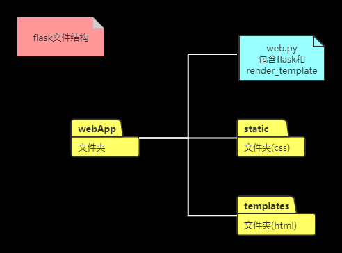

# HeadFirstPython 学习笔记

- [ ] 作者 Paul Barry
- [ ] 笔记开始时间 2020.11.25

## 1 基础知识

1. 安装python(这里选择版本3.6)

2. 打开IDLE 位置在 python安装位置\Lib\idlelib\idle.bat

   > Python Shell 是一个 REPL(read-eval-pring-loop)环境
   >
   > 书中使用IDLE为了教学逐步深入,为了记录文件方便,我使用PyCharm

3. 解释型语言(逐条解释运行),自带解释器和IDE

4. **函数 + 模块 = 标准库**

5. [官方库文档地址]: https://docs.python.org/zh-cn/3.6/library/index.html

6. 没有{}所以成为代码组(使用缩进进行区分)  没有分号

   

## 2 列表数据

1. list 有序集合,大小可变,可以异构
2. tuple 有序集合,大小不可变
3. Directory  键值对,无序
4. Set   无序不可重复

> **列表**   (相当于Java的ArrayList)

```python
# 声明方式
list = [1,2,3,1.1,"123"] #字面声明 
#字符串支持迭代器,但是不能调用数组的方法
remvoe()
append()
pop()
extend()
insert()
#变成字符串可以用 "".join() 注意类型问题 
copy() #深复制使用
letters[start:end:step] # 切片,返回list类型
print("abc"*2)#表示打印abc两次
```

## 3 结构化数据

### 字典(无序,不重复)

键值对,使用冒号分割

```python
person = {
    "name": "Tom",
    "age": 12,
}
person["name"] # Toms
person["gender"]="male"  #会自动创建一个键值对,假如没有的话需要初始化

for key in person	#获取的key的值

for k, v in person.items() #获取键值对

if "gender" not in person:
    person['gender'] = "female"
#等价于下面这一句
person.setdefault("gender", "female")
```

### 集合(无序,不重复)

普通对象,放于大括号里面

```python
#创建集合
odds = {1, 3, 5, 7}
evens = set([0, 2, 4, 6, 8])
#支持一些集合的操作
odds.union(evens)
odds.intersection()
odds.difference()
```

### 元组Tuple(不可变数组)

普通对象,放在小括号里面

```python
print(type(("string",)), type([]), type({}), type(set()))
#<class 'tuple'> <class 'list'> <class 'dict'> <class 'set'>
```


### 总结

>1. 类型之间的互相转换 除了字典,其他的直接用 构造器 就可以了


## 4 代码重用

### 1. 函数

```python
# 参数可选,返回值可选 
#指定参数类型和默认值		指定返回值类型
def func(args:str="")->str:
    print(args)
 	return args
# bool() 传入非空结构为真

#调用的时候可以 关键字赋值
func(args="hello")
```

### 2. 模块

> 每个.py文件就是一个模块,解释器搜索位置:
>
> 1. 当前目录
> 2. site-packages
>    1. 创建一个发布描述(setup.py  README.txt)
>    2. 生成一个发布文件 python setup.py sdist
>    3. 安装发布文件 python -m pip install 发布文件名字
> 3. 标准库

### 3. 值传递 和 引用传递

值传递  => 不可变的类型 tuple 字符串 数值

引用传递 => 可变类型  set dict list

## 5 web

1. 使用pip 安装flask(一个简易的web服务器)
2. 创建一个开始的文件

```python
from flask import Flask	

app = Flask(__name__)


@app.route("/")								#指定路由,根请求映射到这里
def hello() -> str:
    return "Hello world from Flask"


app.run()									#程序开始

```

3. 默认在本机的5000 端口

4. flask的模板引擎是jinja

   文件结构

   

5. `__name__` 如果该模块是python直接启动 值是 `__main__`

   假如是模块导入则是模块名字

## 6 IO

1. 文件

```python
#写文件
ori = open("origin.txt", "a")
print("This is a text \n", file=ori, end="")
#读文件
with open("origin.txt") as ori:
    for line in ori:
        print(line)
    #ori.read()
```

## 7 DB-API

1. 下载驱动 [MySQL-connector/python](https://dev.mysql.com/downloads/connector/python/)(假定已经会MySQL了) 平台独立zip版本
2. 解压后 执行python setup.py install
3. 引入相关API的模块 mysql.connector
4. 引出 :  with创建 上下文管理器

## 8 类

```python
#对象共享行为  不共享状态
class A:
    def __init__(self, v: int = 0, i: int = 1):
        self.val = v
        self.incr = i

    def increase(self):
        self.val += self.incr

    def __repr__(self) -> str:
        return str(self.val)  
        
"""打印对象  第一个是代表类型  第二个是id 可以通过重写__repr__"""        
<__main__.A object at 0x00000196744BE160>
```

## 9 挂接python的with语句

> `__init__` 初始化
>
> `__enter__` 完成建立工作
>
> `__exit__` 完成清理工作

## 10 修饰符

1. python 可以返回 一个函数
2. 不定参数 使用 *args,字典使用**args
3. 修饰符是一个函数,取被修饰函数为参数,返回一个新函数,参数列表与被修饰函数相同

```python
from functools import wraps
def check_logged_in(func):	#func是被修饰函数
    @wraps(func)
    def wrapper(*args,**kwargs):
        if('login' in session):
            return func(*args,**kwargs)
        return 'You are not login'
    return wrapper
```

## 11 异常处理

````python
try:
    code 
except SomeKindOfError as err:
    print(str(err))
    raise MyException("oops")
except:
    err = sys.exc_info()
    
    """自定义异常""""
    
class MyException(Exception):
    pass
````

## 11 3/4 线程

```python
from threading import Thread
Thread(target=method,args=(...))
```

## 12 迭代

```python
destinations = []
for dest in flights.values():
    destinations.append(dest.title())
====等价于========
more_dest = [dest.title() for dest in flights.values()]#list
more_dest = {k:v for k,v in flights.items() if k==1} #dict,可以增加过滤器

有字典/集合/列表推导式,没有元组推导式
使用()的话是生成器,生成器每生成一个数据项就会释放数据,不用得到全部生成

===============
urls = ('u1','u2','u3')
for len,sta,url in gen_urls(urls):
    print(len,sta,url)

def gen_url(urls:tuple)->tuple:
    for resp in (requests.get(url) for url in urls)
    	yield len(resp.content),resp.status,resp.url


```

