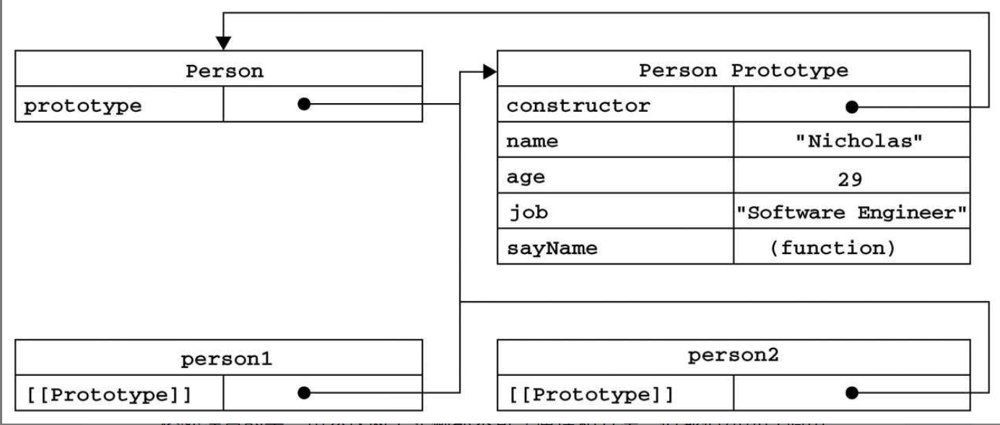
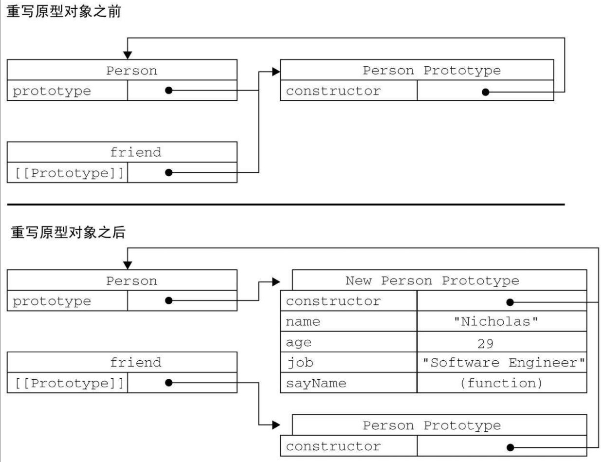
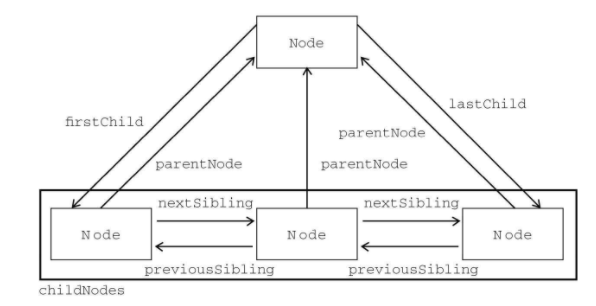

# JavaScript高级程序设计

- [ ] 书籍作者：Nicholas C.Zakas
- [ ] 笔记时间：2021.7.23

## 第1章 JavaScript简介

- 诞生缘由处理由服务器负责的一些验证操作，而后成为浏览器的必备

### 1.1 JavaScript简史

- 早期带宽很小，为了减轻负担，开发出来的客户端语言。微软和网景公司的争斗也开始了，后来产生了ECMAScript标准。

### 1.2 JavaScript实现

- ECMAScript 核心
  - 浏览器只是实现之一，nodejs也是一种。定义的是核心语法，类型，语句，关键字等

- 文档对象模型（DOM）
  - 针对XML但经过扩展用于HTML的应用程序编程接口。
  - 标准是W3C，DOM1级由两个模块组成：DOM核心（DOM Core）和DOM HTML。
    - DOM核心规定的是如何映射基于XML的文档结构。
    - DOM HTML模块则在DOM核心的基础上加以扩展，添加了针对HTML的对象和方法。
  - 也是标准，实现不仅仅是JS。还有DOM2，DOM3标准，不同浏览器支持不同

- 浏览器对象模型（BOM）
  - BOM只处理浏览器窗口和框架。在HTML5之后逐步标准化。

### 1.3 JavaScript版本

## 第2章 在HTML中使用JavaScript

### 2.1 \<script\>元素

- Html4定义了6个属性
  - async 可选，不妨碍页面其他操作下载脚本
  - charset 忽略
  - defer 可选，表示脚本可以延迟到文档完全被解析和显示之后再执行
  - language 废弃
  - type 可选，使用的都还是text/javascript
  - src 可选
- 一般放在最后才加载，防止找不到对象和导致卡顿。设置defer可以延迟加载，一般不用。
- XHTML严格语法要求，特殊符号用字面量替代，比如 \<  用 & lt;替代。可以使用\<CDATA\>,并注释该标签，可以兼容所有现代浏览器

### 2.2 嵌入代码与外部文件

- 外部用的多

### 2.3 文档模式

- 这个概念是通过使用文档类型（doctype）切换实现的

  - 混杂模式 如果文档开始处没有发现文档类型声明

  - ### 准标准模式，则可以通过使用过渡型（transitional）或框架集型（frameset）文档类型来触发

2.4 \<noscript\>元素

- 浏览器不支持脚本或者脚本被禁用时候，启用

## 第3章 基本概念

### 3.1 语法

- 区分大小写，严格模式`use strict`开启，尽量使用分号和花括号

### 3.2 关键字和保留字

### 3.3 变量

- 松散类型可以用来保存任何类型的数据。换句话说，每个变量仅仅是一个用于保存值的占位符
- var默认是局部变量，省略变成全局变量

### 3.4 数据类型

- String Null  Undefined Boolean Number 和 Object Function
- typeof 可以鉴定null是object类型，===可以判断undefined，但是typeof会把未定义的变量认为是undefined

- Null类型，实际上undefined值是派生自null值的，两者会相等
- Number 会尽力将浮点数转为整型，可以使用E科学计数法。浮点计算误差较大，超过上下限是Infinity

- NaN 任何数值除以非数值就会返回
- Object实例具有以下属性：
  - constructor：保存用于创建当前对象的函数
  - isPrototypeOf(object)：用于检查传入的对象是否是当前对象的原型
  - toString() 和 valueOf()

### 3.5 操作符

- 运算之前都会进行转换，不是调用valueOf就是toString
- == 操作符
  - null和undefined是相等的。
  - 对象则比较地址
- === 操作符 -- 不进行转换的情况下比较

### 3.6 语句

- with语句作用是将代码的作用域设置到一个特定的对象中。严格模式不许用，建议不用

### 3.7 函数

- 不在乎参数类型和个数，即使有两个形参，不传也是可以的。内部用数组arguments表示

- ECMAScript中的所有参数传递的都是值，不可能通过引用传递参数

- 没有重载，参数都是封装到数组里了

## 第4章 变量、作用域和内存问题

### 4.1 基本类型和引用类型的值

- 值类型 -- 5种基本数据类型 Undefined Null Boolean Number String（You‘re so NiuBility）
- 引用类型 -- 对象，JavaScript不允许直接访问内存中的位置，只能操纵对象的引用。

- 对象（引用类型）可以动态添加属性，函数参数全是值类型
- 类型检测 -- 基本类型使用typeof，引用类型使用 instanceof，根据原型链进行判断，但是判断基本类型会返回false

### 4.2 执行环境及作用域

- 执行环境定义了变量或函数有权访问的其他数据，决定了它们各自的行为。每个执行环境都有一个与之关联的变量对象（variable object），环境中定义的所有变量和函数都保存在这个对象中，无法直接访问，解析器会在后台处理数据式使用它。

- 全局执行环境是最外围的一个执行环境，WEB环境默认为是window对象（全局变量方法保存的地方）。
- 函数都有自己的执行环境，会被推入一个环境栈中。代码在一个环境中执行时，会创建变量对象的一个作用域链，变量由内往外添加，直到全局变量，找到就停止
  - 通过try-catch或者with可以演唱作用域链
- 作用域问题，尤其是for语句，i会放到全局变量从而导致问题。使用var声明的变量会放到最近的环境变量，否则放到全局变量

### 4.3 垃圾收集

- JavaScript具有自动垃圾收集机制，最常用垃圾收集方式是标记清除（可达性算法）。引用计数比较少见，循环引用问题。
- 内存管理 -- 由于是web浏览器，所以分配给的内存比一般桌面应用少，防止内存耗尽导致系统崩溃。所以比较好的做法是使用局部变量，不用的变量手动置为空 

## 第5章 引用类型

- 没有类这种强类型的概念，对象应该说是属性/函数的集合，构造函数就是一个函数用于创建新对象

### 5.1 Object类型

- 花括号或者new Object() 都可以创建一个新对象
- JS属性访问支持 点 和 中括号（在某些情况下需要使用，含有空格等特殊字符）

### 5.2 Array类型

- new Array() 或者中括号，不要多加逗号，可能导致不同浏览器运行结果不一样
- 没有数组越界，会直接扩展到指定索引长度，修改length可以控制长度
- Array.isArray 可以检测对象是不是数组，支持栈和队列操作，支持排序，
- concat/slice 返回新数组，splice可以删除，插入，替换
- 迭代 -- every filter  forEach map some

- 规约 -- reduce 和 reduceRight

### 5.3 Date类型

- ECMAScript中的Date类型是在早期Java中的java.util.Date类基础上构建的。所以保存的是毫秒数（距离1970年1月1日0时）

### 5.4 RegExp类型

```shell
var reg = /pattern/flags    #flags g全局，i忽略大小写，m
([{^$|.*?}]) # 这些是元字符，需要转义才能代表原来的意思
 #较老版本同一个正则就是同一个对象，ECMA5规定字面量正则像调用RegExp构造函数
```

- 正则对象的方法有 exec 和 test，传入被匹配项即可
- 捕获组使用（），获取可以用＄数字 进行获取。正则对象具有许多属性，并且有对应短属性名。

### 5.5 Function类型

- 每个函数都是Function类型的实例，而且都与其他引用类型一样具有属性和方法
- 函数名字相当于引用，所以并没有重载，会被最后的覆盖掉
- 解析器会率先读取函数声明，并使其在执行任何代码之前可用（可以访问）；至于函数表达式，则必须等到解析器执行到它所在的代码行，才会真正被解释执行
- arguments的主要用途是保存函数参数，但这个对象还有一个名叫callee的属性，该属性是一个指针，指向拥有这个arguments对象的函数

- 函数对象包含length和prototype两个属性，前者表示形参个数，后者保存所有对象实例方法
- 函数引用自带有两个函数 apply 和 call，用于特定作用域调用函数，用来重定义 this 这个对象的，扩充作用域。bind()返回的是函数。

### 5.6 基本包装类型

- Boolean、Number和String 特殊的引用类型，区别在于生命周期，基本类型立即释放，对象需要离开作用域才释放。

- 建议是永远不要使用Boolean对象

### 5.7 单体内置对象

- 对象在ECMAScript程序执行之前就已经存在
- Global 所有全局对象都是在这里定义，它还有一些方法，URI编码方法，空格对应20%。
  - 各种特殊值 NaN，Undefined，原生引用类型构造函数等
  - window对象，Web浏览器将Global作为window的一部分加以实现。`var global = function(){return this;}()` 可以获取global对象
  - Math对象，各种数学方法、常量
- eval方法可以解析js语句，完成后插入当前位置执行。严格模式不允许使用，强大而危险。

## 第6章 面向对象的程序设计

- ECMA-262把对象定义为：“无序属性的集合，其属性可以包含基本值、对象或者函数。”

### 6.1 理解对象

- 一般使用字面量创建对象，ECMA-262第5版在定义只有内部才用的特性（attribute）时，描述了属性（property）的各种特征，使用两个 中括号
  - 数据属性 -- 包含可以读写数据值的位置。
    -  [[Configurable]]：表示能否通过delete删除属性从而重新定义属性
    -  [[Enumerable]]：表示能否通过for-in循环返回属性
    - [[Writable]]：表示能否修改属性的值
    -  [[Value]]：包含这个属性的数据值
    - 使用ECMAScript 5的Object.defineProperty()可以修改默认属性
  - 访问器属性 -- 包含getter和setter，没有数据值
    - 也是  [[Configurable]] 和   [[Enumerable]]
    - [[Get]] 和 [[Set]] 特性，都是函数，默认undefined，属性读取和写入时候自动调用。
    - 跟 C#的属性用法很像，历史问题，老版本使用\_\_defineGetter\_\_()

- 读取属性的特性
  - Object.getOwnPropertyDescriptor()方法

### 6.2 创建对象

- 工厂模式 -- 单纯的封装对象创建过程，无法识别对象
- 构造函数模式 -- 也是函数，用于创建对象，属性放在this里面。任何函数只要new就是构造函数，可以通过不同对象改变作用域。
  - 因为有this作用域的限定，即使方法不是独立对象，也是可以用的，可以将方法定义提到构造函数外部。问题在于会导致window的属性过多。
- 原型模式
  - 每个函数（对象）都有一个prototype属性，是一个指向对象的指针，对象的用途是包含可以由特定类型的所有实例共享的属性和方法。-- 当成类属性和方法

1. 理解原型对象

   > - 只要创建了一个新函数，就会根据一组特定的规则为该函数创建一个prototype属性，这个属性指向函数的原型对象。该原型对象会自动获得一个constructor属性，指向prototype所在函数。
   >
   > - 将Prototype对象认为是类，该类的constructor指向它对应的函数
   >
   > - Object.getPrototypeOf()，在所有支持的实现中，这个方法返回[[Prototype]]的值
   > - 原型链查找先查找实例的属性，再去原型查找，属性同名会隐藏掉原型的，可以通过delete实例属性，使其可访问。hasOwnProerty()可以检测实例是否有对应属性

   

2. 原型与in操作符
   - in 检测属性是否在实例或者原型中，或者配合for使用
   - Object.keys 可以获得所有可枚举实例属性

3. 更简单的原型语法

   ```shell
   function Person(){}
   Person.prototype={...}
   ```

   - 唯一的问题是constructor不再指向Person了，指向Object构造函数。

4. 原型的动态性

   - 在原型中查找值的过程是一次搜索，即使是先创建了实例后修改原型也会立即从实例反映出来。
   - 如果重写原型对象，会指向别的构造函数。
   - 实例中的指针仅指向原型，而不指向构造函数。
   - 

5. 原生对象的原型
   - 可以像修改自定义对象的原型一样修改原生对象的原型，因此可以随时添加方法

6. 原型对象的问题
   - 省略构造器初始化参数
   - 共享，实例会共享引用

- 组合使用原型模式和构造函数模式
  - 构造器定义实例属性，原型定义共享属性

- 动态原型模式
  - 可以初始化的时候检测某个属性存在性，不存在则添加

- 寄生构造函数模式
  - 构造函数在不返回值的情况下，默认会返回新对象实例。而通过在构造函数的末尾添加一个return语句，可以重写调用构造函数时返回的值。

- 稳妥构造函数模式
  - 稳妥对象是没有公共属性，也不引用this的对象。
  - 实例不引用this，不使用new调用构造函数。

### 6.3 继承

- 不支持接口，只支持是实现继承，依靠原型链实现
- 原型链
  - 让原型对象等于另一个类型的实例
  - 使用instanceof可以确认原型和实例的关系，isPrototypeOf也可以
  - 通过原型链实现继承时，不能使用对象字面量创建原型方法。因为这样做就会重写原型链
- 借用构造函数
  - 即在子类型构造函数的内部调用超类型构造函数

- 组合继承
  - 使用原型链实现对原型属性和方法的继承，而通过借用构造函数来实现对实例属性的继承
- 原型式继承
  - 在object()函数内部，先创建了一个临时性的构造函数，然后将传入的对象作为这个构造函数的原型，最后返回了这个临时类型的一个新实例。
- 寄生式继承
  - 在原型式继承的基础上添加方法
- 寄生组合式继承

## 第7章 函数表达式

### 7.1 递归

- arguments.callee是一个指向正在执行的函数的指针，因此可以用它来实现对函数的递归调用
- 可以使用命名函数表达式来达成相同的结果

### 7.2 闭包

- 闭包是指有权访问另一个函数作用域中的变量的函数，利用作用域链访问。谨慎使用，闭包会携带包含它的函数的作用域，因此会比其他函数占用更多的内存。
- 变量，闭包只能取得包含函数中任何变量的最后一个值
- this 默认指向全局，也就是window

### 7.3 模仿块级作用域

- 作用域只在函数里，定义匿名函数并立即调用。

### 7.4 私有变量

- 所有对象属性都是公有的，任何在函数中定义的变量，都可以认为是私有变量
- 有权访问私有变量和私有函数的公有方法称为特权方法
  - 构造函数里面定义方法访问
  - 私有作用域中定义私有变量或函数私有作用域中定义私有变量或函数，类注册到全局
-  模块模式
  - 为单例创建私有变量和特权方法，闭包里面 返回一个字面量声明的对象。
- 增强的模块模式
  - 模块模式返回新创建并设置的特定类型的对象

## 第8章 BOM

- ECMAScript是JavaScript的核心，但如果要在Web中使用JavaScript，那么BOM（浏览器对象模型）则无疑才是真正的核心。

### 8.1 window对象

- window扮演global对象的角色，全局变量不可以通过delete删除属性。而在window定义的可以。
- 访问全局变量未声明的会报错，而window的是未定义

- 窗口关系及框架
  - 如果页面包含frame，每个都有自己的window对象，在 frames 集合可以通过所以获取对应的window
  - self，它始终指向window

- 窗口位置
  - screenLeft和screenTop属性，还有moveTo具有浏览器兼容问题，对最外层window对象使用

- 窗口大小
  - innerWidth、innerHeight、outerWidth和outerHeight和还有对应的页面视口大小
  - resizeTo()和resizeBy()方法可以调整浏览器窗口的大小
- 导航和打开窗口
  - 使用window.open()方法既可以导航到一个特定的URL，也可以打开一个新的浏览器窗口
  - 检测返回值可以知道弹窗是否被拦截，如果是第三方则是报错。

- 间歇调用和超时调用
  - setTimeout ，定时任务加入队列，会在指定时间后加入队列，可以通过返回的对象引用进行取消。推荐
  - setInterval ，指定时间间隔重复执行

- 系统对话框
  - 浏览器通过alert()、confirm()和prompt()方法可以调用系统对话框向用户显示消息。都是同步和模态的。（模态 -- 某种特定状态下的窗体）
  - pring 和 find  是异步显示

### 8.2 location对象

- location对象的用处不只表现在它保存着当前文档的信息，还表现在它将URL解析为独立的片段
- search是 参数，assign改变url

### 8.3 navigator对象

- 检测插件 --  plugins 数组直接遍历
- 注册处理程序 -- registerContentHandler，表明站点可以处理什么类型程序

### 8.4 screen对象

- 客户端的基本属性，宽高颜色等

### 8.5 history对象

- 使用 history.go 可以实现跳转，前几后退

## 第9章 客户端检测

- 先设计最通用的方案，然后再使用特定于浏览器的技术增强该方案。

### 9.1 能力检测

- 常用的客户端检测形式是能力检测，目的是识别浏览器是否 支持某种能力 -- 就是检测存不存在
  - 先检测常用的，保证最优化
  - 必须测试实际要用到的特性
- 更可靠的能力测试
  - 先利用 typeof 区分方法和属性，每次都是IE

- 能力检测，不是浏览器检测
  - 将需要的能力一次性检测

### 9.2 怪癖检测

- 目标是识别浏览器的特殊行为
  - Safari 3以前版本会枚举被隐藏的属性
  - IE8及更早版本中存在一个bug，即如果某个实例属性与[[Enumerable]]标记为false的某个原型属性同名，那么该实例属性将不会出现在fon-in循环当中

### 9.3 用户代理检测

- 检测用户代理字符串来确定实际使用的浏览器，万不得已才使用，因为看可能存在电子欺骗--历史遗留问题
- 用户代理字符串检测技术
  - 识别呈现引擎 -- IE、Gecko、WebKit、KHTML和Opera
    - 识别Opera，检测window.opera
    - 检测webKit，因为WebKit包含Gecko和KHTML字符串 
    - 检测KHTML，因为包含 Gecko
    - 剩下的
  - 识别浏览器 -- 一般识别引擎已经够用，通过字符串，版本等信息进一步识别
  - 识别平台 -- ，检测navigator.platform
  - 识别Windows操作系统 --- 家庭版等，system.win
  - 识别移动设备 -- 检测字符串，版本
  - 识别游戏系统 -- 代理字符串中可以识别

## 第10章 DOM

- DOM（文档对象模型）是针对HTML和XML文档的一个API

### 10.1 节点层次

- DOM可以将任何HTML或XML文档描绘成一个由多层节点构成的结构。
  - 文档节点是每个文档的根节点，称为文档元素。注释也是节点。

- Node类型
  - DOM1级定义了一个Node接口，该接口将由DOM中的所有节点类型实现。
  - 定义了基本属性
    - 节点类型 nodeType，nodeName，nodeValue
    - 节点关系 childNodes，调用slice可以转换为数组。自然可以访问父节点和兄弟节点
    - 
  - 操作节点
    - appendChild 添加节点，insertBefore，replaceChild
  - 其他方法
    - cloneNode()，用于创建调用这个方法的节点的一个完全相同的副本
    - normalize()，这个方法唯一的作用就是处理文档树中的文本节点

- Document类型
  - document对象是HTMLDocument的实例，是window对象的一个属性
  - document.documentElement表示html节点，还可以获取docType和body
  - title 。。。。
  - getElementById()和getElementsByTagName()。只有HTMLDocument类型才有的方法，是getElementsByName()。
  - DOM一致性检测 -- 检测浏览器实现了DOM的哪些部分，document.implementation属性等
  - 文档写入 -- 将输出流写入到网页，：write()、writeln()、open()和close()

- Element类型
  - Element类型用于表现XML或HTML元素，提供了对元素标签名、子节点及特性的访问
  - 所有HTML元素都是由HTMLElement
  - 操作特性的DOM方法主要有三个，分别是getAttribute()、setAttribute()和removeAttribute()。
  - 特殊的特性 Style 和 事件处理
  - document.createElement()方法可以创建新元素

- Text类型
  - 不可以包含HTML代码的文本/字符串
  - document.createTextNode
-  Comment类型
  - 注释节点，document.createComment

### 10.2 DOM操作技术

- 动态脚本 -- 行内方式 和 src 引入，利用JS创建script节点加入body尾部。
- 动态样式 -- 创建style节点插入
-  操作表格 -- form元素
- 使用NodeList -- 每当文档结构发生变化时，它们都会得到更新。“近亲”NamedNodeMap和HTMLCollection
  - 需要提前拿到length，否则会无限循环
  - 建议缓存元素。因为每次访问NodeList，都会运行一次基于文档的查询

## 第11章 DOM扩展

- 两个主要的扩展是Selectors API（选择符API）和HTML5

### 11.1 选择符API

- JQuery的核心就是通过CSS选择符
  - querySelector() -- 通过document调用，传入css选择符
  - querySelectorAll -- 用法一致，返回快照
  - matchesSelector() -- 在取得某个元素引用的情况下，使用这个方法能够方便地检测它是否会上面两者返回

### 11.2 元素遍历

-  childElementCount 返回子元素（不包括文本节点和注释）的个数。

### 11.3 HTML5

- getElementsByClassName()方法
- classList属性 -- 方便操纵class样式
- document.activeElement -- 始终指向获取焦点的元素
- HTMLDocument的变化
  - readyState属性 -- 通过它实现一个指示文档已经加载完成的指示器
  - 兼容模式 -- compatMode
  - head属性
  - 字符集属性
- innerHTML 不同浏览器返回不同
  - 在使用innerHTML、outerHTML属性和insertAdjacentHTML()方法时，最好先手工删除要被替换的元素的所有事件处理程序和JavaScript对象属性。

### 11.4 专有扩展

- 文档模式 -- IE，强制浏览器以某种模式渲染页面，可以使用HTTP头部信息X-UA-Compatible，或通过等价的<meta>标签来设置
- children -- IE，处理文本节点中的空白符
- scrollIntoView()是唯一一个所有浏览器都支持的方法，因此还是这个方法最常用。

## 第12章 DOM2和DOM3

- DOM1级主要定义的是HTML和XML文档的底层结构。DOM2和DOM3级则在这个结构的基础上引入了更多的交互能力，也支持了更高级的XML特性

### 12.1 DOM变化

- 针对XML命名空间的变化
  - XHTML支持XML命名空间，混合多种语言用处很大，比如html和svg一起使用。
  - DOM2对Node类型增加了一些名称空间属性，DOM3引入相关方法
- “DOM2级视图”模块添加了一个名为defaultView的属性，其中保存着一个指针，指向拥有给定文档的窗口（或框架）
- DOM3级引入了两个辅助比较节点的方法：isSameNode()和isEqualNode()。
- 框架和内嵌框架分别用HTMLFrameElement和HTMLIFrameElement表示，它们在DOM2级中都有了一个新属性，名叫contentDocument
  - 所有浏览器都支持contentWindow属性。

### 12.2 样式

- 三种方式  link style 内联
- 任何支持style特性的HTML元素在JavaScript中都有一个对应的style属性
- getPropertyValue()方法取得的始终都是CSS属性值的字符串表示，提供了getComputedStyle()方法
- 修改样式表
  - 应用于文档的所有样式表是通过document.styleSheets集合来表示的
  - cssText、selectorText和style最常用
  - 要向现有样式表中添加新规则，需要使用insertRule()方法
- 元素大小
  - 客户区大小 -- 指的是元素内容及其内边距所占据的空间大小
  - 滚动大小 -- 
  - 确定元素大小 -- getBoundingClientRect()

### 12.3 遍历

- “DOM2级遍历和范围”模块定义了两个用于辅助完成顺序遍历DOM结构的类型：NodeIterator和TreeWalker，使用深度遍历。
- NodeIterator类可以使用document.createNodeIterator()方法创建它的新实例，可以前进后退
- TreeWalker是NodeIterator的一个更高级的版本，可以遍历第一个/最后一个子节点等操作，甚至可以随意移动

### 12.4 范围

- DOM2级在Document类型中定义了createRange()方法。
  - 最简单的方式使用selectNode()范围选择，包含子元素
  - 要创建复杂的范围就得使用setStart()和setEnd()方法。
  - 可以进行编辑，插入，折叠，比较，复制

## 第13章 事件

- JavaScript与HTML之间的交互是通过事件实现的

### 13.1 事件流

- 事件流描述的是从页面中接收事件的顺序。
- 事件冒泡 -- 由内往外（子标签-》父标签）逐级向上传播
- 事件捕获 -- 由外往内（父标签-》子标签）逐级向下传播
- “DOM2级事件”规定的事件流包括三个阶段：事件捕获阶段、处于目标阶段和事件冒泡阶段

#### 13.2 事件处理程序

- 响应某个事件的函数就叫做事件处理程序，以on开头
- HTML事件处理程序
  - 内联，直接将js代码写到属性里，或者调用函数。可以传入event变量，this.value值 
  - 缺点：强耦合

- DOM0级事件处理程序
  - 通过JavaScript指定事件处理程序的传统方式，就是将一个函数赋值给一个事件处理程序属性。

- DOM2级事件处理程序
  - addEventListener()和removeEventListener()，添加多个监听器会按顺序触发
  - IE实现了与DOM中类似的两个方法：attachEvent()和detachEvent()。

### 13.3 事件对象

- 触发DOM某个事件时，就会产生一个事件对象event，默认会将该对象传入事件处理程序中
- event事件对象具有很多属性，可以通过preventDefault阻止冒泡，stopPropagation立即停止传播
- IE的event对象和DOM的又不同了，需要处理兼容问题

### 13.4 事件类型

- UI事件 -- 指的是那些不一定与用户操作有关的事件。比如加载页面，加载错误，改变窗口大小等。
- 焦点事件 -- blur和focus不冒泡。
- 鼠标键盘事件
- 复合事件 -- IME（Input MethodEditor，输入法编辑器）可以让用户输入在物理键盘上找不到的字符
- 变动事件 -- 在DOM中的某一部分发生变化时给出提示
- HTML5事件 -- contextmenu事件（右键），加载等
- 设备事件 -- 翻转，查看模式
- 触摸与手势事件 -- 

### 13.5 内存和性能

- 事件处理函数是对象，会导致内存不够用。解决方案是事件委托，利用事件冒泡，只指定一个处理程序，通过检测不同节点进行不同处理
- 移除事件处理程序，不需要的建议置空

### 13.6 模拟事件

- 可以在document对象上使用createEvent()方法创建event对象。需要使用dispatchEvent()方法进行触发。
- IE中的事件模拟也有兼容问题

## 第14章 表单脚本

### 14.1 表单的基础知识

- 可以设置提交/重置按钮。

### 14.2 文本框脚本

- 单行/多行，select方法可以选中。可以屏蔽某些按键，操作剪切板。
- 可以提前验证某些字段，比如大小，不能为空等

### 14.3 选择框脚本

### 14.4 表单序列化

- Ajax出现之后，一般使用JSON格式

### 14.5 富文本编辑

- 在网页中编辑富文本内容（所见即所得），iframe节点
- 另一种编辑富文本内容的方式是使用名为contenteditable的特殊属性，
- 由于富文本编辑是使用iframe而非表单控件实现的，因此从技术上说，富文本编辑器并不属于表单

## 第15章 使用Canvas绘图

### 15.1 基本用法

- 先设置其width和height属性，指定可以绘图的区域大小，首先要检测getContext()方法是否存在

### 15.2 2D上下文

- 填充和描边，绘制矩形，绘制路径，绘制文本，变换，绘制图像，阴影，合成

### 15.3 WebGL

- 针对Canvas的3D上下文，不是W3C指定的标准。由Khronos Group制定，该阻止还制定了OpenGL ES 2.0标准。

- 类型化数组 -- 元素被设置为特定类型，核心就是一个名为ArrayBuffer的类型，该类型对象表示内存中指定的字节数。
  - 数组缓冲器视图，DataView，通过它可以选择一小段字节。可以在创建DataView实例的时候传入一个ArrayBuffer、一个可选的字节偏移量（从该字节开始选择）和一个可选的要选择的字节数
    - 需要明确类型占用大小，默认大端字节对齐
  - 类型化视图 -- 为了不用自己管理字节对齐，处理，继承DataView，构造函数都有一个名为BYTES_PER_ELEMENT的属性，表示类型化数组的每个元素需要多少字节
    - 可以传入普通数组，访问时候可以通过中括号访问，数字越界会取余
    - 可以使用subarry创建子视图
- WebGL上下文，通常该对象命名为gl
  - 通过给getContext传入参数，可以设置一些选项，比如用各种缓冲区，抗锯齿等
  - 常量 -- 在上下文没有以GL_开头
  - 方法 -- 通过名字传达有关数据类型的信息，后缀会表明接收几个什么类型参数
  - 准备绘图 -- 操作之前必须使用clearColor()方法来指定要使用的颜色值，传入argb，0-1之间
  - 视口与坐标 -- 先定义WebGL的视口，默认视口可以使用整个canvas区域，可以通过viewport指定大小，坐标有所不同
  - 缓冲区 -- 顶点信息保存在JavaScript的类型化数组中，使用之前必须转换到WebGL的缓冲区。可以调用createBuffer创建缓冲区，然后使用bindBuffer进行绑定，之后用数据填充。
    - 不用以后可以调用deleteBuffer释放内存
  - 错误 -- 手工调用getError
  - 着色器（shader）
    - 顶点着色器 -- 用于将3D顶点转为2D点
    - 片段（或像素）着色器 -- 用于准确计算要绘制的每个像素的颜色
  - 编写着色器 -- GLSL是一种类C语言，专门用于编写OpenGL着色器。每个着色器都有一个main方法，重复执行，使用Attribute和Uniform传递数据。
  - 编写着色器程序 -- 浏览器不能理解GLSL程序，因此必须准备好字符串形式的GLSL程序，以便编译并链接到着色器程序。使用 script 标签，指定一个自定义type属性。使用createShader进行创建
  - 传值 -- getUniformLocation
  - 绘图 -- WebGL只能回值点、线、三角，组合后会知道三维空间。
  - 纹理 -- 可以使用DOM的图像，createTexture进行创建
  - 读取像素 -- 方法readPixels()，最后一个参数必须是类型化数组，从帧缓冲区读取，保存在类型化数组中。

## 第16章 HTML5脚本编程

### 16.1 跨文档消息传递

- XDM，cross-document messaging，核心是postMessage()方法。
- 接收到消息会触发window对象的message事件，需要先进行验证。最好传递字符串再进行解析。

### 16.2 原生拖放

- drag | dragstart | dragend方法，拖动时会触发相应事件。
- 重写dragenter和dragover事件将元素变成有效放置目标。
- dataTransfer对象 -- getData 和 setData 方法用于向目标元素传递信息。
- 确定被拖动的元素以及作为放置目标的元素能够接收什么操作。为此，需要访问dataTransfer对象的两个属性：dropEffect和effectAllowed。
- 可拖动 -- 默认图像/文本/连接可拖动，设置draggable属性

### 16.3 媒体元素

- audio 和 video 标签，可以创建自定义控件。具有完善的接口和属性，还能触发很多事件，通过JS代码很容易实现自定义播放器。

### 16.4 历史状态管理

- 通过history对象进行管理，hashchange可以知道URL参数变化状况。

## 第17章 错误处理与调试

### 17.1 浏览器报告的错误

- IE -- 是唯一一个在浏览器的界面窗体（chrome）中显示JavaScript错误信息的浏览器，需要进一步配置
- Firegox -- ErrorConsole，可以使用插件
- Safari -- 默认隐藏，需要配置
- Opera -- 默认隐藏，需要配置
- Chrome -- 默认隐藏

### 17.2 错误处理

-  try-catch语句，错误类型 -- EvalError、RangeError等
- 抛出错误，抛出错误时，必须要给throw操作符指定一个值
- 错误（error）事件 -- 任何没有通过try-catch处理的错误都会触发window对象的error事件，尽量不要使用它
- 常见的错误类型 
  -  类型转换
  - 数据类型 -- 不要与null比较，使用instanceof，typeof检测
  - 通信 -- 格式错误，转换错误等

- 把错误记录到服务器，将错误极可能详细记录下来。

### 17.3 调试技术

- 打印到控制台
- 将消息记录到当前页面
- 抛出错误 assert判断

### 17.4 常见的IE错误

- 微软都抛弃了，还要用吗

## 第18章 JavaScript与XML

### 18.1 浏览器对XML DOM的支持

- DOM2级核心 -- DOMParser类型，调用parseFromString()进行解析。
- XMLSerializer类型将DOM文档序列化为XML字符串

### 18.2 浏览器对XPath的支持

- DOM3级XPath规范定义了在DOM中对XPath表达式求值的接口
  - XPathEvaluator用于在特定的上下文中对XPath表达式求值
  - 返回XPathResult类型

### 18.3 浏览器对XSLT的支持

- XSLT是与XML相关的一种技术，它利用XPath将文档从一种表现形式转换成另一种表现形式

## 第19章 E4X

### 19.1 E4X的类型

- XML类型是E4X中定义的一个重要的新类型，可以用它来表现XML结构中任何独立的部分。甚至可以使用xml字面量
- XMLList类型表现XML对象的有序集合，
- E4X中使用Namespace对象来表现命名空间
- QName类型表现的是XML对象的限定名

### 19.2 一般用法

- 属性访问需要名称前面加上@字符，或者调用attribute方法。
- E4X提供的查询语法在很多方面都与XPath类似
- 构建和操作XML -- 字面量，构造器，类似DOM的方法。
- 可以使用foreach

## 第20章 JSON

### 20.1 语法

- 简单值 -- 字面量，字符串用双引号
- 对象 -- 花括号键值对
- 数组 -- 中括号

### 20.2 解析与序列化

- 早期使用eval()解析，因为JSON是JavaScript语法子集
- JSON对象有两个方法：stringify()和parse()，可以指定解析的属性，缩进等
- 可以自定义toJSON方法

## 第21章 Ajax与Comet

- AJAX -- Asynchronous JavaScript+XML，核心是XMLHttpRequest对象（简称XHR），使用远程脚本技术。

### 21.1 XMLHttpRequest对象

- xhr对象第一个方法是open，只是准备，发送是send。通过status检测响应状态。异步则检测readyState属性，或者触发readystatechange事件。
- 浏览器头部可以重写

### 21.2 XMLHttpRequest 2级

- FormData -- 可以构造表单对象发送数据
- timeout -- 超时则触发对应事件
- overrideMimeType()方法 -- 用于重写XHR响应的MIME类型

### 21.3 进度事件

- 请求都从触发loadstart事件开始，接下来是一或多个progress事件，然后触发error、abort或load事件中的一个，最后以触发loadend事件结束。

### 21.4 跨源资源共享

- 默认情况下，XHR对象只能访问与包含它的页面位于同一个域中的资源
- CORS（Cross-Origin Resource Sharing，跨源资源共享），发送请求添加额外Origin头部，由服务器决定Access-Control-Allow-Origin，不能发送cookie等安全限制
- Preflighted Reqeusts -- CORS通过一种叫做Preflighted Requests的透明服务器验证机制支持开发人员使用自定义的头部、GET或POST之外的方法，以及不同类型的主体内容。
- 带凭据的请求 -- 通过将withCredentials属性设置为true，可以指定某个请求应该发送凭据。

### 21.5 其他跨域技术

- 使用\标签，一个网页可以从任何网页中加载图像，不用担心跨域不跨域。只能GET，不能得到响应文本。
- JSONP （JSON with Padding），由两部分组成：回调函数和数据。远程执行脚本。
- Comet则是一种服务器向页面推送数据的技术，长轮询和流。前者是隔一段时间轮询，后者保持http长连接发送数据。
  - 服务器发送事件，围绕只读Comet推出的API。SSE（Server-SentEvents，服务器发送事件）
  - 组合XHR和SSE也可以实现双向通信。
- WebSockets的目标是在一个单独的持久连接上提供全双工、双向通信。基于HTTP的协议升级，需要服务器支持。

### 21.6 安全

- 对于未被授权系统有权访问某个资源的情况，我们称之为CSRF（Cross-Site Request Forgery，跨站点请求伪造）
- 验证资源访问权限 -- SSL 或者  携带验证码
- 不要用POST，检查URL，基于cookie进行验证

## 第22章 高级技巧

### 22.1 高级函数

- 类型检测 -- 由于原生数组的构造函数名与全局作用域无关，因此使用toString()就能保证返回一致的值
- 惰性载入函数 -- 将函数覆盖掉或声明函数时指定适当函数。
- 函数绑定 -- 使用闭包调用函数。
- 函数柯里化 -- 使用一个闭包返回一个函数

### 22.2 防篡改对象

- 一旦把对象定义为防篡改，就无法撤销了。
- 调用了Object.preventExtensions()方法后，就不能给person对象添加新属性和方法了
- 密封对象不可扩展，而且已有成员的[[Configurable]]特性将被设置为false。
- 最严格的防篡改级别是冻结对象（frozen object）。冻结的对象既不可扩展，又是密封的，而且对象数据属性的[[Writable]]特性会被设置为false。

### 22.3 高级定时器

- 除了主JavaScript执行进程外，还有一个需要在进程下一次空闲时执行的代码队列。定时器只是指定加入队列的时间，而不是执行时间。
- 为了避免setInterval的调用时机不对，可以使用递归调用timeout
- 运行在浏览器中的JavaScript都被分配了一个确定数量的资源，如果代码运行超过特定的时间或者特定语句数量就不让它继续执行。可以使用数组将任务分为小任务，使用定时器逐个执行。
- 函数节流 -- 某些代码不可以在没有间断的情况连续重复执行。使用定时器对该函数进行节流。

### 22.4 自定义事件

### 22.5 拖放

- 创建一个绝对定位的元素，使其可以用鼠标移动。这个技术源自一种叫做“鼠标拖尾”的经典网页技巧。

## 第23章 离线应用与客户端存储

### 23.1 离线检测

- navigator.onLine属性，还有对应的事件

### 23.2 应用缓存

- HTML5的应用缓存（application cache），或者简称为appcache，可以在一个manifest文件里写需要下载的文件，在html里面的manifest指定。

### 23.3 数据存储

- cookie -- 基于特定域名，大小数量都有限制。
  - 使用子cookie绕开数量限制

- Web Storage的目的是克服由cookie带来的一些限制
  - Storage类型提供最大的存储空间
  - sessionStorage对象存储特定于某个会话的数据，也就是该数据只保持到浏览器关闭
- Indexed Database API，或者简称为IndexedDB，是在浏览器中保存结构化数据的一种数据

## 第24章 最佳实践

### 24.1 可维护性

- 注释、命名、变量初始化
- 松散耦合（HTML，CSS，JS要尽量分离），事件处理
- 避免全局量，不要修改别人的对象，命名空间的使用，避免和null比较，使用常量。

### 24.2 性能

- 作用域 -- 避免全局查找，避免with
- 避免不必要的属性查找，优化循环，展开循环，避免双重解释（eval执行js），极可能使用原生方法，位运算
- 使用字面量，变量声明在一个语句
- 优化DOM交互，
  - 使用文档片段构建DOM，添加到元素里。
  - 使用innerHTML
  - 使用事件代理

### 24.3 部署

- 产权，文件大小，代码组织
- 校验语法 -- JSLint
- 压缩 -- 删除空格等，使用HTTP压缩

## 第25章 新兴的API

### 25.1 requestAnimationFrame()

### 25.2 Page Visibility API

### 25.3 Geolocation API

### 25.4 File API

- FileReader类型实现的是一种异步文件读取机制，看成XHR
- File对象还支持一个slice()方法，读取部分内容
- 对象URL也被称为blob URL，指的是引用保存在File或Blob中数据的URL
- 围绕读取文件信息，结合使用HTML5拖放API和文件API可以读取拖放文件。
- 通过File API能够访问到文件内容，利用这一点就可以通过XHR直接把文件上传到服务器。

### 25.5 Web计时

- 核心是window.performance对象。

### 25.6 Web Workers

- 实例化Worker对象并传入要执行的JavaScript文件名就可以创建一个新的Web Worker
- Worker是通过message和error事件与页面通信的
- 所执行的JavaScript代码完全在另一个作用域中，与当前网页中的代码不共享作用域
- worker的全局变量提供了 importScripts()方法，可以加载js文件。


## A 其他

### 1. 原型

- 显式原型 prototype 是Function独有的属性，定义时候自动添加，默认为{}
- 隐式原型 \_\_proto\_\_是每个对象都有的属性，创建时候自动添加，默认是构造函数的原型对象，和 [[Prototype]]意义相同
- 对象的隐式原型的值为其对应构造函数的显式原型的值

