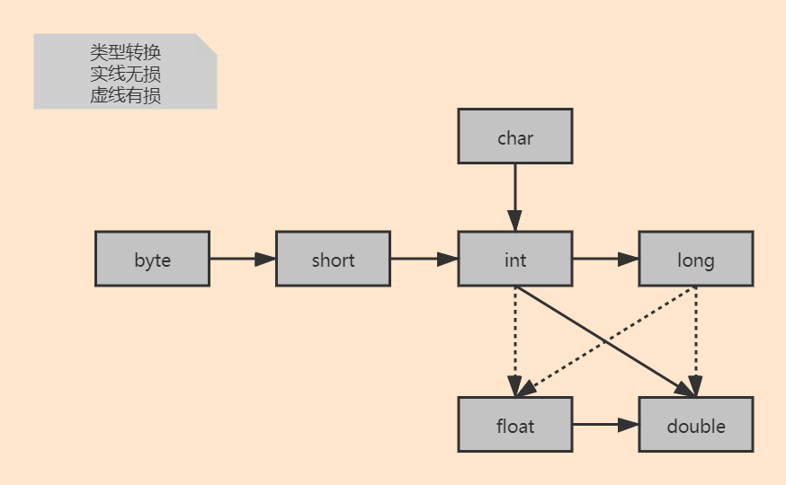
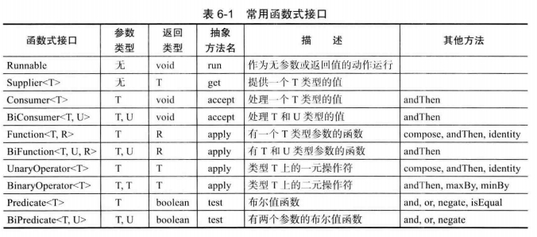
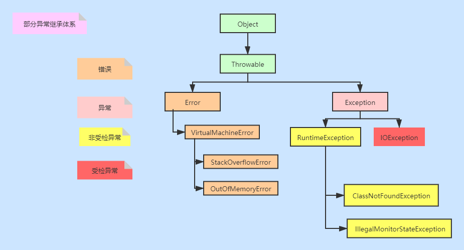
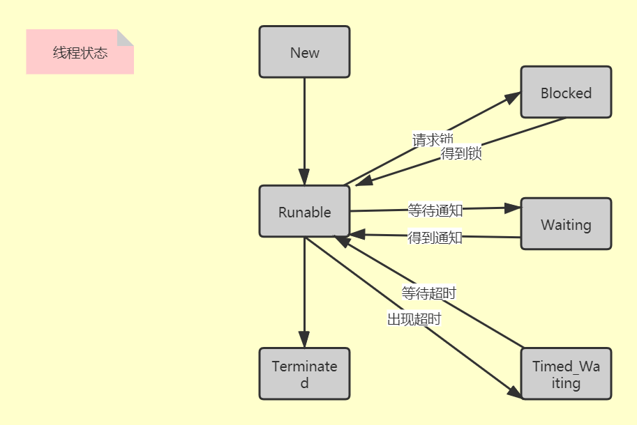

# `Java核心技术_卷Ⅰ 基础知识 笔记

- [ ] 读书笔记,记录关键知识点
- [ ] 2020.11.16
- [ ] 书籍作者 Cay S.Horstmann


## 第 1 章 概 述

**语言优点**: 可移植 高性能 分布式 健壮性 多线程

**开发者**: Patrick Naughton 和 James Gosling  , 1994

**变化较大版本**: 5(泛型 枚举 装箱),7(钻石操作符),8(流操作,lambda表达式,接口默认方法)

## 第 2 章 环 境

JDK:  编写 Java 程序的程序员使用的软件,等于JRE+一些调试工具

JRE: 使用Java的最小环境

JVM: 

## 第 3 章 Java 的基本程序设计结构  

### 3.1 命名规则

| 类型 | 规则      |
| ---- | --------- |
| 类名 | CamelCase |
| 变量 | xxxYyy    |
| 常量 | XXX_YYY   |

### 3.3数据类型

| 类型    | 大小            |
| ------- | --------------- |
| int     | 4               |
| short   | 2               |
| long    | 8               |
| byte    | 1               |
| float   | 4               |
| double  | 8               |
| char    | 2               |
| boolean | 4(变量) 1(数组) |

- [ ] 可以为整型字面量添加下划线便于阅读,添加后缀区别类型,添加前缀表示进制
- [ ] `Double_POSITIVE_INFINITY `  `Double.NEGATIVEJNFINITY `  `Double.NaN  `(0/0 或者 负数平方根)
- [ ] Unicode 转义序列会在解析代码之前得到处理  ,所以不要随便使用 \u;`我们强烈建议不要在程序中使用 char 类型， 除非确实需要处理 UTF-16 代码单元。最好将字符串作为抽象数据类型处理  `
  - [ ] **码点** （code point ) 是指与一个编码表中的某个字符对应的 **代码值**  
  - [ ] **代码单元**（code unit)   每个字符用 16 位表示  
- [ ] bolean占用大小: https://blog.csdn.net/dhaibo1986/article/details/108500514


### 3.5 运算

1. Math类

- [ ] 对于使用 `strictft `关键字标记的方法必须使用严格的浮点计算来生成可再生的结果,可能会溢出
- [ ] 使用 `StrictMath` 类可以得到可重复的结果
- [ ] `% `会出现余数为负数的现象,可以使用`Math.floorMod`,除数为负数依旧会出现余数为负数

2. 类型转换



- [ ] `+=` 结合赋值操作会自动进行`类型强制转换`

### 3.6 字符串

`不可变`    为了共享

### 3.10 不规则数组

需要手动初始化,需要显示指定第一个维度

## 第 4 章 对 象 与 类  

### 4.1 对象

```
三个特性:
- 标识 如何辨别具有相同行为与状态的不同对象
- 行为 可以对对象施加哪些操作，或可以对对象施加哪些方法
- 状态 当施加那些方法时，对象如何响应
```

- [ ] 如果需要返回一个可变数据域的拷贝， 就应该使用 clone  

### 4.4 工厂方法

出现该设计模式的类有 : Math  LocalDate NumberFormat

原因: 

1. 无法命名构造器
2. 需要返回不同类型的对象

> Java每个类都可以有main方法,但是只会执行一个,其余的当成普通静态方法

### 4.5 Java只有值传递

**证明: 假如有引用传递,那么交换两个引用指向的对象,结果也会换**

```java
public void testSwap() {
    Integer a = new Integer("2");
    Integer b = new Integer("20");

    swap(a, b);
    System.out.println("a=" + a + " b=" + b);
}

private void swap(Integer a, Integer b) {
    Integer tmp = a;
    a = b;
    b = tmp;
}
```

### 4.6 构造器

1. 调用另一个构造器使用 `this`
2. 父类构造器`super`

> 类初始化顺序: 
>
> 父类 静态代码块 -> 子类 静态代码块 ->父类代码块 -> 父类构造器 -> 子类代码块  -> 子类构造器


### 4.7 包

编译的时候带有路径名(也就是用`/`分割),加载的时候使用全类名(也就是用`.`分割)

利用`-classpath `选项设置类路径是首选的方法  


### 4.10 OOP设计技巧

> 1. 一定要保证数据私有  
> 2. 一定要对数据初始化  
> 3. 不要在类中使用过多的基本类型  (用好封装)
> 4. 不是所有的域都需要独立的域访问器和域更改器  
> 5. 将职责过多的类进行分解  
> 6. 类名和方法名要能够体现它们的职责  
> 7. 优先使用不可变的类  


## 第 5 章 继 承  


### 5.1 父类和子类

在 Java 中， 子类数组的引用可以转换成超类数组的引用， 而不需要采用强制类型转换  

```java
// 		引发 java.lang.ArrayStoreException
// 		编译会通过
		Son[] sons = new Son[2];
        Father[] fathers = sons;
        fathers[0] = new Father();
```

- 静态绑定: private / static / final / 构造器  编译期间能确定调用的方法
- 动态绑定: 运行时候才能确定(使用方法表,jvm会根据对象的实际类型进行调用)

- [ ] 一般情况下，应该**尽量少用类型转换和 instanceof 运算符**  

### 5.2 Object类

1. Object.equals() 
2. Java 语言规范要求 equals 方法具有下面的特性  
   1. 自反性
   2. 对称性
   3. 传递性
   4. 一致性
   5. 任意非空引用和null返回false

> **equal** 写法建议
>
> 1. 检测 this 与 otherObject 是否引用同一个对象  
> 2. 检测 otherObject 是否为 null  
> 3. 比较 this 与 otherObject 是否属于同一个类  
> 4. 将 otherObject 转换为相应的类类型变量  
> 5. 比较属性

3. hashCode应该与equal一致
4. toString
5. 工具类 Objects Arrays 

### 5.3 泛型擦除

[泛型只在编译时候进行检查,进行运行时候都是没有的](https://www.jianshu.com/p/2bfbe041e6b7)

### 5.4 自动装箱

- 自动装箱规范要求 boolean、byte、char < 127，介于-128 ~ 127之间的 short 和 int 被包装到固定的对象中  (缓存)

- 编译器级别,不是虚拟机
- 常用方法: `valueOf `和 `xxxValue`

### 5.6 Enum

比较两个枚举类型的值时， 永远不需要调用 equals, 而直接使用“ ==” 就可以了  

常用方法: `toString`  `Enum.valueOf` `values` `ordinal  ` 

### 5.7 反射

- [ ] 主要类有

- Class : getMethods  (属性class / getClass() / forName())

- Field : getModifiers  

- Method : getParameterTypes  

- Constructor : getReturnType  

- Modifier :  toString  

- Array: getLenth

- [ ] 私有域需要设置属性 `setAccessible   `

- [ ] > 建议 Java 开发者不要使用 Method 对象的回调功能。使用接口进行回调会使得代码的执行速度更快， 更易于维护  

### 5.8 使用继承建议

> 1. 将公共操作和域放在超类  
> 2. 不要使用受保护的域  
> 3. 使用继承实现“ is-a” 关系  
> 4. 除非所有继承的方法都有意义， 否则不要使用继承  
> 5. 在覆盖方法时， 不要改变预期的行为  
> 6. 使用多态，而非类型信息  
> 7. 不要过多地使用反射  

## 第 6 章 接 口、lambda 表达式与内部类

### 6.1 接口

- Comparable 与 compare方法
- 可以将接口方法标记为 public, 将域标记为 public static final。有些程序员出于习惯或提高清晰度的考虑， 愿意这样做。但 Java 语言规范却`建议不要书写这些多余的关键字`， 本书也采纳了这个建议  
- `静态方法`: 目前为止， 通常的做法都是将静态方法放在伴随类中。在标准库中， 你会看到成对出现的接口和实用工具类， 如 Collection/Collections 或 Path/Paths。  理论上讲，没有任何理由认为这是不合法的。 只是这有违于将接口作为抽象规范的初衷  
- `默认方法`: 可以兼容旧代码并且进行功能增加
  - 冲突解决方法:
  - 1. 父类优先 / 类优先
    2. 接口方法名冲突,子类覆盖该方法

### 6.2 clone

- `少用`,对象的深复制还可以用`序列化机制`,

- 使用时候需要实现Cloneable接口(标记接口),object.clone是浅拷贝

### 6.3 Lambda表达式

- 对于`只有一个抽象方法的接口`， 需要这种接口的对象时， 就可以提供一个 lambda 表达式。这种接口称为`函数式接口  `

- `java.util.fimction` 包下有很多函数式接口
- `方法引用` 
  - object::instanceMethod   
  - Class::staticMethod   方法引用等价于提供方法参数的 lambda 表达式  
  - Class::instanceMethod  第 1 个参数会成为方法的目标  
- `构造器引用  ` 使用new关键字  例子 int[]::new
- 关于代码块以及自由变量值有一个术语： 闭包（closure) 在 Java 中，` lambda 表达式就是闭包  `
  1. lambda 表达式中， 只能引用值不会改变的变量。  
  2. lambda 表达式的体与嵌套块有相同的作用域  



### 6.4 内部类

- [ ] 嵌套是一种类之间的关系， 而不是对象之间的关系  ,内部类可以对同包的类屏蔽

- [ ] `outer`指向外围类对象

- [ ] 内部类中声明的所有静态域都必须是 final  ,内部类不能有 static 方法  

- [ ] 编译器将会把内部类翻译成用 $ (美元符号）分隔外部类名与内部类名的常规类文件， 而虚拟机则对此一无所知  

  1. 内部类增加属性 `final OuterClass this$O;  `

  2. 外部类增加方法`static boolean access$O(OuterClass);  `

  3. [ ] 局部内部类  

     1. 方法中定义内部类,没有修饰符,局部变量只能访问final修饰的
     2. 可以使用数组进行修改值

  4. [ ] 匿名内部类

     1. 双括号初始化  

     ```java
     ArrayList<String> friends = new ArrayList()；
     friends.add("Harry")；
     friends.add("Tony");
     invite(friends);
     ==============
     invite(new ArrayList<String>(){{ add("Harry"); add("Tony"); }});
     外层括号建立了 ArrayList 的一个匿名子类。
     内层括号则是一个对象构造块
     ```

  5. [ ] 静态内部类

     1. 使用内部类只是为了把一个类隐藏在另外一个类的内部，并不需要内部类引用
        外围类对象  
     2. 与常规内部类不同，静态内部类可以有静态域和方法。  
     3. 声明在接口中的内部类自动成为 static 和 public 类  

### 6.5 代理

> 代理类可以在运行时创建全新的类 ,它具有下列方法：
> 		•指定接口所需要的全部方法。
> 		•Object 类中的全部方法， 例如， toString、 equals 等  
>
> 提供一个调用处理器( invocation handler)。调用处理器是实现了 InvocationHandler 接口的类对象。在这个接口中只有一个方法：
> Object invoke(Object proxy, Method method, Object □ args)  

1. Sun 虚拟机中的 Proxy类将生成一个以字符串 SProxy 开头的类名  


## 第 7 章 异常、断言和曰志  



### 7.1 异常

1. 受检异常应该使用`throws`声明,没有 throws 说明符的方法将不能抛出任何受查异常  
2. 子类方法中声明的受查异常不能比超类方法中声明的异常更通用   
3. 将原始异常设置为新异常的“ 原因”, 强烈建议使用这种包装技术  

```java
try{
access the database
}
catch (SQLException e){
    Throwable se = new ServletException ("database error")；
	se.ini tCause(e);
    throw se;
}
==================================
    Throwable se = se.getCause();
```

4. try 资源关闭,会"抑制"资源关闭带来的异常
5. 分析堆栈轨迹元素  

```java
Throwable t = new Throwable() ;
StackTraceElement[] frames = t.getStackTrace() ;
for (StackTraceElement frame : frames)
	analyze frame
```

### 7.3 建议

1.   异常处理不能代替简单的测试  
2. 不要过分地细化异常  
3. 利用异常层次结构  
4. 不要压制异常  
5. 早抛出，晚捕获  

### 7.4 断言

> 断言机制允许在测试期间向代码中插入一些检査语句。当代码发布时，这些插入的检测语句将会被自动地移走。  
>
> 在默认情况下， 断言被禁用。可以在运行程序时用 -enableassertions 或 -ea 选项启用：
> java -enableassertions MyApp  
>
> 断言是一种测试和调试阶段所使用的战术性工具;  


### 7.5 日志

> 可以统一管理
>
> 格式化
>
> 重定向

- 基本日志	 Logger.getGlobal().info("hello logger");
- 高级日志    private static final Logger myLogger = Logger.getLogger("com.mycompany.myapp"):  
- 日志配置修改
  - java -Djava.util.logging.config. file=configFile MainClass  
  - System.setProperty("java.util_logging.config_file"，file)  
- 在默认情况下 日志记录器将记录发送到 ConsoleHandler 中， 并由它输出到 System.err流中  
- 将日志存储到文件里面
  - FileHandler handler = new FileHandler();
    1ogger.addHandler(handler);  

### 7.6 技巧

1. println 或者 info()
2. 每个类放置main()方法
3. JUnit 或者 日志代理
4. 利 用 Throwable 类提供的 printStackTmce 方法，可以从任何一个异常对象中获得堆栈情况  Thread.duapStack():  
5. 日志发送到文件中

```java
StringWriter out = new StringWriter();
new Throwable().printStackTrace(new PrintWriter(out));
String description = out.toString();
```

6. ```shell
   java MyProgram 1> errors.txt 2>&1
   ```

7. 要想观察类的加载过程， 可以用 -verbose 标志启动 Java 虚拟机  

8. -Xlint 选项告诉编译器对一些普遍容易出现的代码问题进行检査  

9. ```shell
   jconsole processID
   ```

10. ```shell
    map -dump:format=b, file=dumpFileName processID
    jhat dumpFileName
    然后，通过浏览器进人丨oCalhOSt:7000, 将会运行一个网络应用程序，借此探查转储对象
    时堆的内容。
    ```

11. ```java
    如果使用-Xprof标志运行 Java 虚拟机， 就会运行一个基本的剖析器来跟踪那些代
    码中经常被调用的方法。剖析信息将发送给 System.out 。输出结果中还会显示哪些方法是由
    即时编译器编译的
    ```


## 第 8 章 泛 型 程 序 设 计  

1. 出现的问题

```java
 //编译器将会自动打包参数为 1 个Double 和 2 个 Integer 对象，而后寻找这些类的共同超类型。
double middle = ArrayAlg.getMiddle(13.14, 1729, 0);
```

2. 限定类型

```java
限定类型用“ &” 分隔，而逗号用来分隔类型变量
    Pair<T extends Comparable&Serializable>
```

### 8.5 泛型代码与虚拟机

> 虚拟机没有泛型类型对象—所有对象都属于普通类  ,引出泛型擦除
>
> 无论何时定义一个泛型类型， 都自动提供了一个相应的原始类型 （ raw type)。原始类型
> 的名字就是删去类型参数后的泛型类型名。擦除（ erased) 类型变M , 并替换为限定类型 （无
> 限定的变量用 Object。  

````java
class Pair<T>{
    T obj;
}
========擦除以后=====
class Pair{
	String obj;// 假如没有指定类型 Object obj;
}

1. 同时,原始类型用第一个限定的类型变量来替换， 如果没有给定限定就用 Object 替换
所以标记接口往后面放
2. 假如没有限定类型,编译器会翻译两条指令: 调用方法/获取数据,强制类型转换    
````

1. 类型擦除与多态发生了冲突  ===> 桥方法

```java
class Datelnterval extends Pair<LocalDate>{}
Datelnterval interval = new Datelnterval(. . .);
Pair<Loca1Date> pair = interval; // OK assignment to superclass
pair.setSecond(aDate);
=============
在虚拟机中，用参数类型和返回类型确定一个方法。因此， 编译器可能产生两个仅返回类型不同的方法字节码，虚拟机能够正确地处理这一情况
LocalDate getSecond() // defined in Datelnterval
Object getSecond0 // overrides the method defined in Pair to call the first method
```

2. **协变**: 子类A覆盖父类B方法，返回类型R可以是父类返回类型T的子类  A<= B,F(A)<=F(B) 数组是协变的
3. **逆变**: A<=B, F(A)>=F(B)
4. **不变**:  A<=B时,上述两条不成立 泛型是不变的

`总结`

- 虚拟机中没有泛型，只有普通的类和方法。
- 所有的类型参数都用它们的限定类型替换。
- 桥方法被合成来保持多态。
- 为保持类型安全性，必要时插人强制类型转换。  


### 8.6 局限

1. 不能使用基本类型,原因是类型擦除
2. 运行时类型查询只适用于原始类型  
3. 不能创建参数化类型的数组  

   > 数组会记住它的元素类型， 如果试图存储其他类型的元素， 就会抛出一个 ArrayStoreException 异常  
   >
   > 不过对于泛型类型， 擦除会使这种机制无效  

4. Varargs 警告 

   > 向参数个数可变的方法传递一个泛型类型的实例 ,只会得到一个警告，而不是错误  

5. 不能实例化类型变置  

   > 不能使用像 new T(...，) newT[...] 或 T.class 这样的表达式中的类型变量 
   >
   > **解决方法:** 
   >
   > ```java
   > Pair<String> p = Pair.makePair(String.class);  
   > 
   > public static <T> Pair<T> makePair(Cl ass<T> cl){
   > 	try { return new Pair()(cl.newInstance(). cl.newInstance()；) }
   > 	catch (Exception ex) { return null; }
   > }  
   > ```

6. 不能构造泛型数组  

7. 泛型类的静态上下文中类型变量无效  

8. 不能抛出或捕获泛型类的实例  ,在异常规范中使用类型变量是允许的  

9. 可以消除对受查异常的检查  

   > - 正常情况下， 你必须捕获线程 run 方法中的所有受查异常， 把它们“ 包装” 到非受查异常中， 因为 run 方法声明为不抛出任何受查异常  
   >
   > - 通过使用泛型类、 擦除和@SuppressWamings 注解， 就能消除 Java 类型系统的部分基本限制  
   > - @SuppressWamings("unchecked")
   >   public static <T extends Throwable> void throwAs(Throwable e) throws T{
   >        throw (T) e;
   >   }  

10. 注意擦除后的冲突  

    > ​    要想支持擦除的转换， 就需要强行限制一个类或类型变量不能同时成为两个接口类型的子类， 而这两个接口是同一接口的不同参数化  
    >
    >    可能与桥方法的合成冲突

### 8.8 通配符

1. 带有超类型限定的通配符可以向泛型对象写人，带有子类型限定的通配符可以从泛型对象读取  
2. Pair<?> 和 Pair 本质的不同在于： 可以用任意 Object 对象调用原始 Pair 类的 setObject方法。  

## 第 9 章 集 合  

### 9.1 集合框架

1. `迭代器 `对 next 方法和 remove 方法的调用具有互相依赖性。如果调用 remove 之前没有调用next 将是不合法的。 如果这样做， 将会抛出一个 IllegalStateException 异常。  也可以调用add,不过要有序才行
2. set 方法不被视为结构性修改  ,不会出现并发修改异常

### 9.2 HashSet

1. 桶数默认16,每次×2

2. 负载因子 0.75

3. WeakHashMap 当对键的唯一引用来自散列条 目时， 这一数据结构将与垃圾回收器协同工作一起删除键 / 值对。  

   > WeakHashMap 使用弱引用 （weak references) 保存键。
   > WeakReference 对象将引用保存到另外一个对象中， 在这里， 就是散列键。对于这种类型的
   > 对象， 垃圾回收器用一种特有的方式进行处理。通常， 如果垃圾回收器发现某个特定的对象
   > 已经没有他人引用了， 就将其回收。然而， 如果某个对象只能由 WeakReference 引用， 垃圾
   > 回收器仍然回收它，但要将引用这个对象的弱引用放人队列中。WeakHashMap 将周期性地检
   > 查队列， 以便找出新添加的弱引用。一个弱引用进人队列意味着这个键不再被他人使用， 并
   > 且已经被收集起来。于是， WeakHashMap 将删除对应的条目。  

4. LRU 可以用LinkedHashMap实现
5. IdentityHashMap  散列值用 System.identityHashCode 方法计算的  

### 9.4 视图/包装器

> keySet 方法返回一个实现 Set 接口的类对象， 这个类的方法对原映射进行操作。这种集合称为视图   
>
> 由于视图只是包装了接口而不是实际的集合对象， 所以只能访问接口中定义的方法  

1. Arrays.asList 轻量级包装
2. subSet等 子范围
3. 不可修改集合 Collections.unmodifiableXxx
4. 同步视图 Collections 类的静态 synchronizedMap方法  
5. 受检视图 Collections.checkedList  

### 9.6 历史遗留

1. Vector和Stack
2. Hashtable(Properties还在用)
3. BitMap

## 第 1 0 章 图 形 程 序 设 计  (选看)

> 从现在开始，Swing 是指 “ 被绘制的” 用户界面类；
>
> AWT 是指像事件处理这样的窗口工具箱的底层机制。  

1. 绝大多数 Swing 组件类都以“ J” 开头， 例如，JButton、JFrame 等。在 Java 中有 Button 和 Frame 这样的类， 但它们属于 AWT 组件。  
2. 所有的 Swing 组件必须由**事件分派线程**（ event dispatch thread ) 进行配置，线程将鼠标点击和按键控制转移到用户接口组件。  

### 10.4 显示文本

> 无论何种原因， 只要窗口需要重新绘图， 事件处理器就会通告组件， 从而引发执行所有组件的 paintComponent 方法。
>       一定不要自己调用 paintComponent 方法  

## 第 1 1 章 事 件 处 理   (选看)

### 11.1 监听器

观察者模式

事件监听器对象通常需要执行一些对其他对象可能产生影响的操作。可以策略性地将监听器类放置在需要修改状态的那个类中。  

适配器模式

## 第 1 2 章 Swing 用户界面组件  (选看)

## 第 1 3 章 部 署 Java 应用程序  

### 13.1 Jar包

> 一个 JAR 文件既可以包含类文件，也可以包含诸如图像和声音这些其他类型的文件。此外， JAR 文件是压缩的，它使用了大家熟悉的 ZIP 压缩格式  
>
> jar cvf  JARFileName File1 File2 . . .  

1. 每个 JAR 文件还包含一个用于描述归档特征的清单文件（manifest。)  清单文件被命名为 MANIFEST.MF, 它位于 JAR 文件的一个特殊 META-INF 子目录中  
2. java -jar MyProgram.jar  启动一个程序
3. 案例

```shell
javac resource/ResourceTest.java
jar cvfm ResourceTest.jar resource/ResourceTest.mf resource/*.class resource/*.gif resource/*.txt
java -jar ResourceTest.jar
```

4. 用Properties来存储配置信息

## 第 1 4 章 并 发  

###  14.2 线程中断

>  当对一个线程调用 `interrupt `方法时，线程的中断状态将被置位。这是每一个线程都具有的boolean 标志。每个线程都应该不时地检査这个标志， 以判断线程是否被中断  
>
> 如果线程被阻塞， 就无法检测中断状态  
>
> 如果在中断状态被置位时调用 sleep 方法，它不会休眠。 相反，它将清除这一状态（!）并拋出 IntemiptedException。  

### 14.3 线程状态

> 记住，在任何给定时刻，二个可运行的线程可能正在运行也可能没有运行（这就是为什
> 么将这个状态称为可运行而不是运行。 |中断| 
>
> `阻塞状态  ` 当一个线程试图获取一个内部的对象锁（而不是 javiutiUoncurrent 库中的锁，) 而该
> 锁被其他线程持有， 则该线程进人阻塞状态  
>
> `等待状态` 当线程等待另一个线程通知调度器一个条件时， 它自己进入等待状态  



### 14.4 线程属性

> 1. 可以通过调用t.setDaemon(true);将线程转换为守护线程(daemon thread)。当JVM只剩下守护线程就会关闭虚拟机
>
> 2. 未捕获异常处理器  
>
>    - 线程死亡之前， 异常被传递到一个用于未捕获异常的处理器  
>
>    - 处理器必须属于一个实现 Thread.UncaughtExceptionHandler 接口的类  
>    - 不安装默认的处理器, 默认的处理器为空 . 此时的处理器就是该线程的 ThreadGroup 对象  
>
>    1. 如果有父线程组,调用父线程uncaughtException  
>    2. 否则 如果线程默认处理器不为空,调用
>    3. 否则,如果Throwable 是 ThreadDeath 的一个实例， 什么都不做  
>    4. 线程的名字以及 Throwable 的栈轨迹被输出到 System.err 上  

### 14.5 同步

>  竞争条件: 多个线程竞争一个资源的情况

1. ReentrantLock

   > - 加锁lock,解锁unlock
   >
   >   条件锁,await等待,signalAll 不会立即激活一个等待线程
   >
   > - **总结**
   >
   >   - 锁用来保护代码片段， 任何时刻只能有一个线程执行被保护的代码。
   >   - 锁可以管理试图进入被保护代码段的线程。
   >   - 锁可以拥有一个或多个相关的条件对象。
   >   - 每个条件对象管理那些已经进入被保护的代码段但还不能运行的线程。  
   >
   > =============
   >
   > - tryLock带有时间限制,可以打破死锁(lock 方法不能被中断。如果一个线程在等待获得一个锁时被中断，中断线程在获得锁之前一直处于阻塞状态。如果出现死锁， 那么，lock 方法就无法终止  )

2. synchronized

   > Java中的每一个对象都有一个内部锁。 如果一个方法用 synchronized关键字声明，那么对象的锁
   > 将保护整个方法。  
   >
   > 内部锁和条件存在一些局限。包括：
   >
   > - 不能中断一个正在试图获得锁的线程。
   > - 试图获得锁时不能设定超时。
   > - 每个锁仅有单一的条件， 可能是不够的。  

   `使用建议` 都尽量不要用

   > 理由:
   >
   > 1. 在许多情况下你可以使用 java.util.concurrent 包中的一种机制，它会为你处理所有的加锁 
   > 2. 如果 synchronized 关键字适合你的程序， 那么请尽量使用它，这样可以减少编写的代码数量，减少出错的几率   
   > 3. 如果特别需要 Lock/Condition 结构提供的独有特性时，才使用 Lock/Condition  

3. monitor  

   > PerBrinchHansen和 Tony Hoare 在 20 世纪 70 年代提出的  
   >
   > - 监视器是只包含私有域的类。
   > - 每个监视器类的对象有一个相关的锁。
   > - 使用该锁对所有的方法进行加锁  
   > - 该锁可以有任意多个相关条件  
   >
   > Java类的实现不完全符合以上概念:
   >
   > 1. 域不要求private
   > 2. 方法不要求synchronized
   > 3. 内部锁对象可用

4. Volatile 域  

   > 内存可见性,禁止指令重排,不保证原子性
   >
   > 还可以使用final 进行同步

5. Atomic包

   > 使用CAS保证同步
   >
   > 如果有大量线程要访问相同的原子值 ,性能会大幅下降
   >
   > LongAdder 和 LongAccumulator 类来解决这个问题。LongAdder 包括多个变量（加数), 其总和为当前值。  

6. 死锁

   > Java 编程语言中没有任何东西可以避免或打破这种死锁现象  

7. ThreadLocal  

   > 在一个给定线程中首次调用 get 时， 会调用 initialValue 方法。在此之后， get 方法会返回
   > 属于当前线程的那个实例。  

8. 读写锁

   > 读锁共享,其余(读写,写写)互斥

### 14.6 阻塞队列

   > 当试图向队列添加元素而队列已满， 或是想从队列移出元素而队列为空的时候， 阻塞队列（ blockingqueue ) 导致线程阻塞。  

|作用         | 名称               | 返回值/响应        |
|------------ | ------------------ | ------------------ |
|线程管理工具 | put/take           | 如果满/空阻塞线程  |
|普通队列     | add/remove/element | 如果满/空,会报异常 |
|多线程环境   | offer/ poll /peek  | 如果满/空,给返回值 |


### 14.7 线程安全的集合

   > 1. 并发集合size()通常需要遍历
   > 2. 集合返回弱一致性（ weakly consistent) 的迭代器  
   > 3. ConcurrentHashMap 中不允许有null 值  
   >    - compute 调用 compute 方法时可以提供一个键和一个计算新值的函数 ,会阻塞其他线程
   >    - merge  默认值和处理函数
   > 4. 批操作: search / reduce / forEach
   > 5. 并发集: 并发Map.newKeySet得到视图
   > 6. 最好使用 java.util.concurrent包中定义的集合， 不使用同步包装器中的  
   >
   > 

### 14.8 Future / Callable

> FutureTask 包装器是一种非常便利的机制， 可将 Callable转换成 Future 和 Runnable, 它
> 同时实现二者的接口  
>
> ​	get()会阻塞线程,可以利用这个递归


### 14.9 执行器

> 线程池: 有以下五种,建议不要用,若使用,自定义 ThreadPoolExecutor
>
> CachedThreadPool
>
> FixedThreadPool
>
> SingleThreadExecutor
>
> ScheduledThreadPool
>
> SingleThreadScheduledExecutor

- 预定执行 : 可以定时
- 任务组: 
  1. invokeAny 返回任意一个完成的结果
  2. ExecutorCompletionService  使结果有序
- CompletableFuture   


### 14.10 同步器

1. 信号量:  一个信号量管理许多的许可证（permit)  ,但是它只是维护一个变量,任意线程都可以释放

2. CyclicBarrier  

   > 如果任何一个在障栅上等待的线程离开了障栅， 那么障栅就被破坏了（线程可能离开是
   > 因为它调用 await 时设置了超时， 或者因为它被中断了）。在这种情况下， 所有其他线程的
   > await 方法抛出 BrokenBarrierException 异常  


