# Linux内核设计的艺术：图解Linux操作系统架构设计与实现原理

- [ ] 书籍作者：新设计团队
- [ ] 笔记时间：2021.8.22

## 第1章 从开机加电到执行main函数之前的过程

- 三步走：
  1. 启动BIOS，准备实模式下的中断向量表和中断服务程序
  2. 从启动盘加载操作系统程序到内存
  3. 为执行32位的main函数做过渡工作

- 实模式（Real Mode）是Intel 80286和之后的80x86兼容CPU的操作模式。特性是一个20位的存储器地址空间（1MB），可以直接软件访问BIOS以及周边硬件，没有硬件支持的分页机制和实时多任务概念。

### 1.1 启动BIOS，准备实模式下的中断向量表和中断服务程序

- BIOS 负责在RAM中什么程序也没有的时候，完成加载软盘中操作系统的任务

#### 1.1.1 BIOS的启动原理

- 0xFFFF0，软件无法启动BIOS，只能使用硬件，给出一个固定地址
- Intel将所有80x86系列的CPU，包括最新型号的CPU的硬件都设计为加电即进入16位实模式状态运行。
- 将CPU的硬件逻辑设计为 CS→0xF000，IP→0xFFF0.寻址空间 1MB，书里为了方便选择BIOS启动块 8KB。
  - CS（Code Segement Register）代码段寄存器，存在于CPU中，指向CPU当前执行代码在内存中的区域
  - IP/EIP（Instruction Pointer）：指令指针寄存器，存在于CPU中，记录将要执行的指令在代码段内的偏移地址
  - 纯硬件动作，如果没有代码/代码错误，无法启动
- 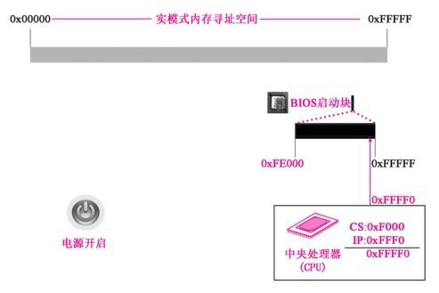

#### 1.1.2 BIOS在内存中加载中断向量表和中断服务程序

- BIOS程序被固化在计算机主机板上的一块很小的ROM芯片里。
- BIOS用1KB构建中断向量表，紧接着是256B的BIOS数据区，隔了约57KB加载了8KB左右终端服务程序。
  - 中断向量每个占4B，所以共有256个。每个都是CS：IP

- 

### 1.2 加载操作系统内核程序并为保护模式做准备

- 将操作系统程序加载至内存
- Linux0.11 将分三次加载操作系统

#### 1.2.1 加载第一部分内核代码——引导程序（bootsect）

- 经过系统自检之后，BIOS让CPU收到一个0x19中断 ，执行对应中断服务程序。该程序作用把软盘第一扇区（512B）中的程序加载到内存指定位置。
- 将软驱0号磁头对应盘面的0磁道1扇区的内容复制至内存 0x07C00 处。该扇区就是Linux0.11的引导程序，称为 boot  sector，启动扇区。程序由 bootsect.s 汇编程序汇编而成

- 

#### 1.2.2 加载第二部分内核代码——setup

1. bootsect对内存的规划
   - bootsect的作用给就是开始规划内存，加载接下去的系统代码。
   - 实模式寻址范围只有1MB，内存规划如下
   - 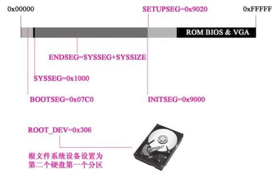

2. 复制bootsect

   - 将 bootsect  自身512B从原本0x07c00复制到 0x90000，也就是INITSEG处

   - 复制完成后，跳转到 INITSEG 处 ，偏移到复制完成后的代码处接着执行

   - 对DS、ES、SS（栈指针）和SP（栈顶指针） 进行调整

     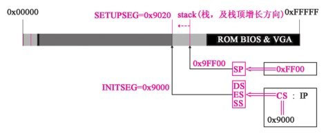

3. 将setup程序加载到内存中
   - 使用 0x13 中断服务程序，调用者是操作系统程序。
   - 将第二扇区开始的4个扇区，也就是setup.s加载至SETUPSEG（0x90200），紧挨着移动后的bootsect
   - 此时已经加载了5个扇区，从 0x90000 开始，当bootsect执行完毕，接下去就是setup程序了。
   - 栈大小是（0xFF00 也就是 63KB），减去5个扇区 2.5KB ，还有 60.5 KB的空间
   - 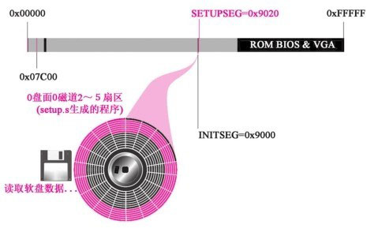

#### 1.2.3 加载第三部分内核代码——system模块

- 还是使用 0x13 中断加载系统模块，大小是240扇区
- 因为加载时间长，可以在屏幕显示提示，需要用汇编代码实现
- 从磁盘的第6个扇区开始的240扇区加载到0x10000（SYSSEG），此时bootsect主体任务已经完成，再确认一下根设备号
  - Linux 0.11没有提供建立文件系统的工具，因此启动需要两部分数据，内核和文件系统

- 通过 jmpi 0，SETUPSEG 跳转到 0x90200，也就是setup位置，开始执行 setup 程序

  1. 利用BIOS中断获取需要的机器系统数据，并分别从中断向量0x41和0x46向量值所指的内存地址处获取硬盘参数表1、硬盘参数表2，把它们存放在0x9000:0x0080和0x9000:0x0090处。

  2. 这些机器系统数据被加载到内存的0x90000～0x901FC位置。

  3. BIOS提取的机器系统数据将覆盖bootsect程序所在部分区域，同时剩下2个字节没有使用，也就是0xaa55结尾

     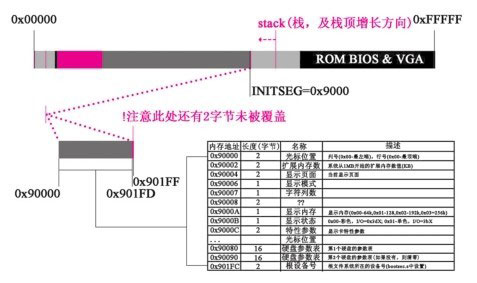

- 到此为止，操作系统内核程序的加载工作已经完成

### 1.3 开始向32位模式转变，为main函数的调用做准备

#### 1.3.1 关中断并将system移动到内存地址起始位置0x00000

- 将CPU的标志寄存器 EFLAGS 中的 IF （中断允许标志位）置零，不允许中断，知道中断服务体系重构完毕。
  - 标志寄存器，32位，CF（carry flag）表示进位。
  - cli 和 sti 是一对指令，用于关闭/打开中断响应 ，关闭中断是为了进行实模式下中断向量表和保护模式下中断描述符表（IDT）的交接工作。防止中断进入导致崩溃（旧中断机制废除，新中断未建立）
  - 

- 将 system 程序，也就是 0x10000处的代码复制到 0x00000，此时没有中断向量表了。称为破旧立新一点都不为过。

  

#### 1.3.2 设置中断描述符表和全局描述符表

- 此时要通过setup程序自身提供的数据信息对中断描述符表寄存器（IDTR）和全局描述符表寄存器（GDTR）进行初始化设置。（0x90200处的代码）
- GDT（global descriptor  table），全局描述符表，在系统中唯一的存放段寄存器内容（段描述符）的数组，配合程序进行保护模式下的段寻址。可以认为所有进程的总目录表
  - GDTR 记录GDT的入口，GDT可以存放在内存的任意位置。
- IDT（Interrupt Descriptor Table，中断描述符表），保存保护模式下所有中断服务程序的入口地址
  - IDTR（Interrupt Descriptor Table Register，IDT基地址寄存器），保存IDT的起始地址。

- 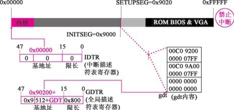

- 16位中断采用向量表，位置固定在起始位置。32位中断采用中断描述符表，位置不固定，由IDTR确定位置。类似与数组和链表的感觉
  - GDT第一项为空
  - 第二项为内核代码段描述符
  - 第三项为内核数据段描述符
  - 其余皆为空

- 专用寄存器的指向由程序中的lidt和lgdt指令完成，划分一块内存区域并初始化。

#### 1.3.3 打开A20，实现32位寻址

- 意味着CPU可以进行32位寻址，范围达到 4GB。
- 实模式下，当程序寻址超过0xFFFFF时，CPU将“回滚”至内存地址起始处寻址，因为CS：IP是超过1MB寻址的 ，多了将近 64KB。

#### 1.3.4 为保护模式下执行head.s做准备

- 对 中断控制器8259A 进行重新编程，单片管理8级，可级联到64级的向量优先级中断系统。

- setup将CR0的 PE（第0位） 位置 1，表示工作在保护模式

  - CR0寄存器是32位控制寄存器，存放系统控制标志

  

- setup执行完成后通过跳转，执行 head 程序。此时已经采用保护模式，不能使用CS：IP拼接寻址，

  所以代码为 `jmpi 0,8` ，0 表示段内偏移，8（1000）表示段选择符

  - 10`00` 表示内核特权级，（11）表示用户特权级；1`0`00表示GDT类型，1表示LGDT；`1`000表示第几项
  - 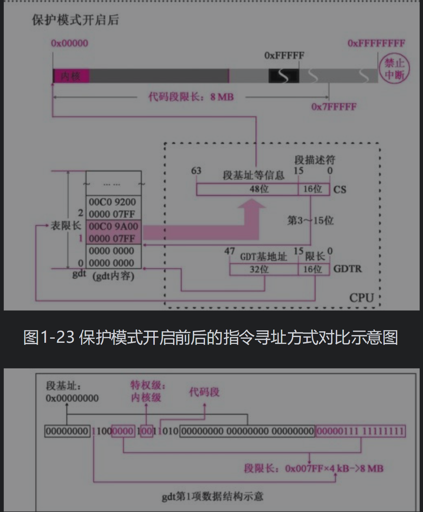

#### 1.3.5 head.s开始执行

- 执行main函数之前，需要先执行汇编代码 bootsect   setup  head
  1. 加载bootsect到 0x07c00，然后复制到 0x90000
  2. 加载setup到 0x90200
  3. head 加载有所不同，先将head.s汇编成目标代码，将用C语言编写的内核程序编译成目标代码，然后链接成system模块。所以system模块既有内核代码，又有head程序，重点是head在前，内核在后
     1. head占用25KB+184B大小
     2. head做了一件十分重要的事，创建内核分页机制。即在0x000000的位置创建了页目录表、页表、缓冲区、GDT、IDT，并将head程序已经执行过的代码所占内存空间覆盖。
     3. 

- head程序

  - 标号\_pg\_dir标识内核分页机制完成后的内核起始位置，物理内存的   0x000000，到 0x4FFF，共 20 KB，作为页目录表。

  - 将其他寄存器（DS、ES、FS和GS)转为保护模式，值全都是0x10，也就是8。段限长是 8MB。

  - 设置IDT

    - 中断描述符为64位，包含基址，偏移，选择符，特权级，标志等
    - 将所有中断描述符默认值想 ignore_int 位置，之后对IDTR进行设置。
    - 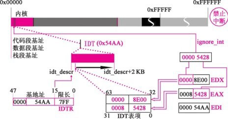

  - 废除已有GDT，重建GDT

    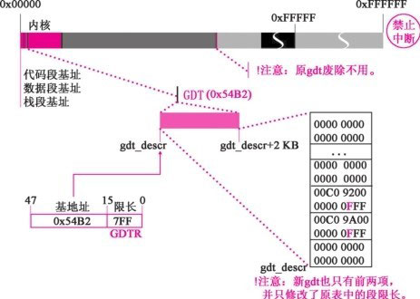

  - 最后阶段，将envp、argv、argc、L6和main函数地址压栈

    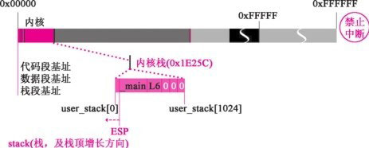

  - head程序将跳转至setup_paging:去执行，开始创建分页机制。

    - 将最后一个页表项指向寻址范围的最后一个页面（4KB为一页）
    - 从后往前逐个页表项设置，这些页表都是内核专属页表，将来进程会有自己的专属页表，寻址范围有所区别。
    - 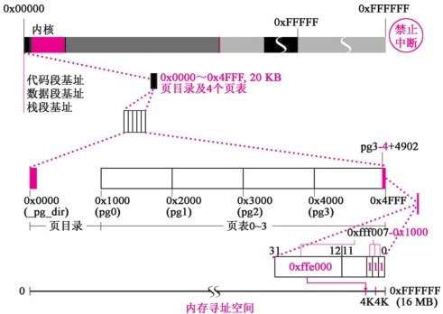

  - 内核程序内存分布情况，设置页目录表基址寄存器CR3，将CR0的最高位置1

    - PG标志：CR0的最高位，表示分页机制开启
    - CR3寄存器，高 20 位存放页目录表基址，配合页表进行虚拟地址到物理地址的映射
    - 

  - head最后一步 ret，弹栈给EIP，进入main函数。因为call指令会保存现场，将EIP压栈；

    ret则是还原现场，将弹栈给EIP。操作系统模拟了call的动作，同时将返回时的地址设置为主函数入口

    

  - C语言编写的程序必须在操作系统平台运行，也就是它是一个应用进程，由操作系统加载并执行。

    操作系统又由BIOS加载的bootsect引导加载，此处处于实模式，也就是16位，而c语言是32位平台的

    所以只有在转为保护模式后才能使用c语言

  - 此时还没有开启`中断`

## 第2章 设备环境初始化及激活进程0

- 系统达到怠速状态前所做的一切准备工作的核心目的就是让用户程序能够以“进程”的方式正常运行
  - 怠速表示操作系统已经完成所有准备工作，随时可以响应用户操作

### 2.1 设置根设备-4、硬盘

- 初始化根设备，用bootsect中写入机器系统数据的0x901FC，并用0x90080开始的32字节的硬盘参数设置内核硬盘信息 drive_info
- 

### 2.2 规划物理内存格局，设置缓冲区、虚拟盘、主内存

- 主内存 ：进程代码运行空间，包括内核管理进程的数据结构
- 缓冲区：主机与外设数据交互的中转站
- 虚拟盘：将外设数据先复制到虚拟盘，然后使用
- 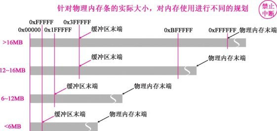

- | 操作  | 意义           |
  | ----- | -------------- |
  | << 20 | 乘以 1MB       |
  | << 12 | 乘以 4KB，一页 |
  | << 10 | 乘以 1KB       |

  

### 2.3 设置虚拟盘空间并初始化

- 检查makefile文件中“虚拟盘使用标志”是否设置，以此确定本系统是否使用了虚拟盘。

  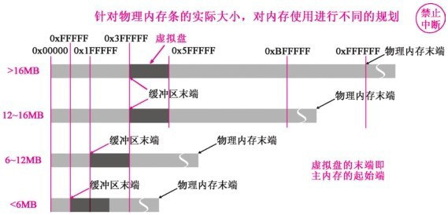

- 在rd_init()函数中，先要将虚拟盘区的请求项处理函数do_rd_request()与请求项函数控制结构blk_dev[7]的第二项挂接

  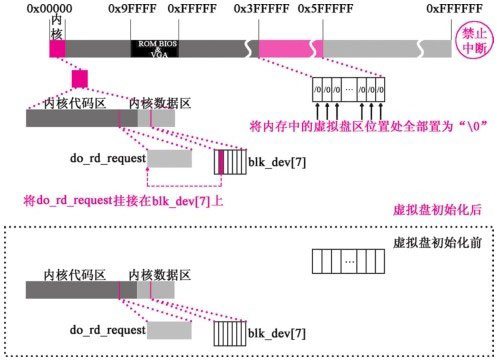

### 2.4 内存管理结构mem_map初始化

- 内核采用分页方法，可以直接获取物理地址；而用户进程只能使用逻辑地址，不可以访问内核或者其他用户地址空间。
- 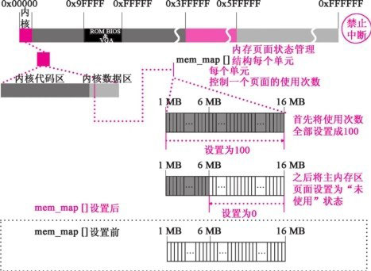

### 2.5 异常处理类中断服务程序挂接

- 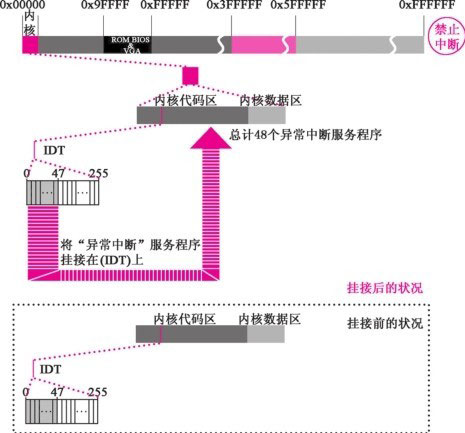

- 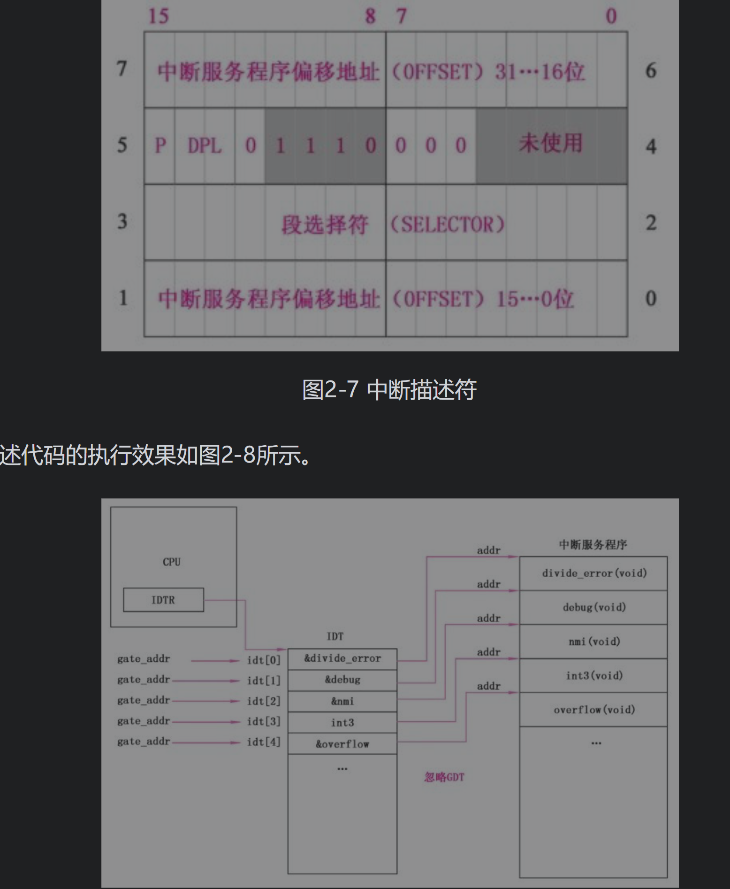

### 2.6 初始化块设备请求项结构

- 块设备：将 存储空间分为若干块，每块可以独立随机读写，比如硬盘。
  - 必须经过内存中的缓冲区，request[32]就是操作系统管理缓冲区中的缓冲块与块设备上逻辑块之间读写关系的数据结构。request[32]是一个由数组构成的链表
- 字符设备：以字符为单位进行I/O的设备，如键盘、早期显示器等

- 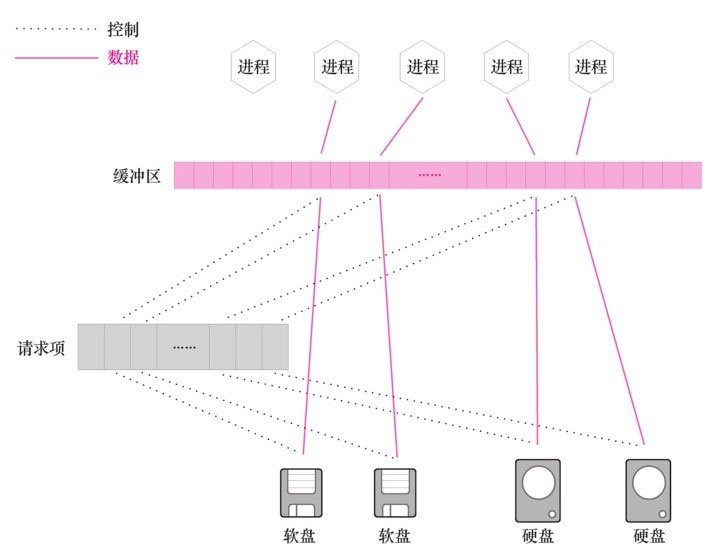

- 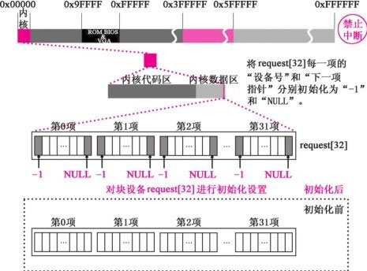

### 2.7 与建立人机交互界面相关的外设的中断服务程序挂接

- Linus又设计了tty_init()函数，内容就是初始化字符设备。

  在tty_init()函数中，先调用rs_init()函数来设置串行口，再调用con_init()函数来设置显示器

#### 2.7.1 对串行口进行设置

- 把两个串行口中断服务程序与IDT相挂接，根据tty_table数据结构内容将串行口初始化。包括控制器，波特率等，允许主芯片发送中断请求
- 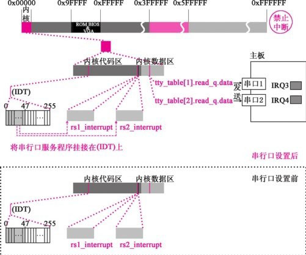

#### 2.7.2 对显示器进行设置

- 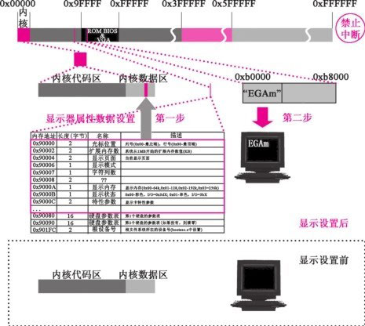

#### 2.7.3 对键盘进行设置

- 跟串口差不多，先禁止再允许就可以正常使用

### 2.8 开机启动时间设置

- CMOS是主板上的一个小存储芯片，系统通过调用time_init()函数，先对它上面记录的时间数据进行采集，提取不同等级的时间要素
- 

### 2.9 初始化进程0

- 进程0是Linux操作系统中运行的第一个进程，也是Linux操作系统父子进程创建机制的第一个父进程。
  - 系统先初始化进程0。进程0管理结构task_struct的母本，需要跟LDT、TSS与 GDT挂接，初始化。
  - 进程具备参与轮询的能力，系统这里对时钟中断进行设置
  - 进程0要具备处理系统调用的能力。
  - 以上三点在 sched_init() 函数中实现

#### 2.9.1 初始化进程0

- set_tss_desc 和 set_ldt_desc两行代码负责初始化进程0所占的四五项
- 进程0的task_struct是由操作系统设计者事先写好的，就是sched.h中的INIT_TASK
- 初始化进程0相关的管理结构的最后一步是非常重要的一步，是将TR寄存器指向TSS0、LDTR寄存器指向LDT0
- 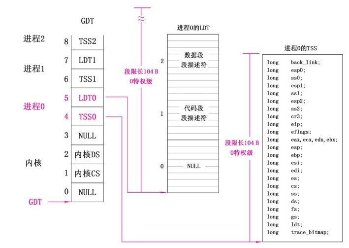
- 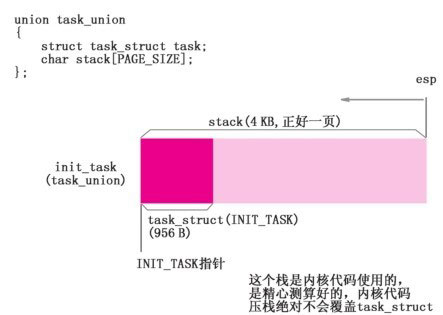

- 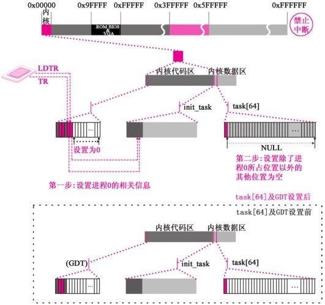

#### 2.9.2 设置时钟中断

- 时钟中断是进程0及其他由它创建的进程轮转的基础

1. 对支持轮询的8235定时器进行设置，其中LATCH最为关键，每10ms发生一次时钟中断。
2. 挂接timer_interrupt
3. 将8259A芯片中与时钟中断相关的屏蔽码打开，时钟中断就可以产生

- 

#### 2.9.3 设置系统调用总入口

-  将系统调用处理函数system_call与int 0x80中断描述符表挂接。system_call  是整个操作系统中系统调用软中断总入口。
- 触发 0x80 中断 ，由CPU响应后反转特权级（从3到0），通过IDT找到系统调用端口，调用具体函数处理，之后 iret翻转回3特权级

### 2.10 初始化缓冲区管理结构

- 硬盘无法寻址，自然就不能参与运算；内存需要跟CPU、总线配合进行数据运算 ；

  缓冲区介于两者之间，既能保存信息，也能 参与运算 

- 操作系统通过hash_table[NR_HASH]、buffer_head双向环链表组成的复杂的哈希表管理缓冲区。

- 在buffer_init()函数里，从内核的末端及缓冲区的末端同时开始，方向相对增长、配对地做出buffer_head、缓冲块，直到不足一对buffer_head、缓冲块。

- 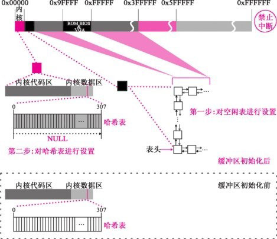

### 2.11 初始化硬盘

- 硬盘请求项服务程序do_hd_request()与blk_dev控制结构相挂接

- 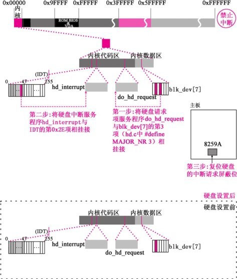

### 2.12 初始化软盘

- 挂接的函数是do_fd_request，初始化的是与软盘相关的中断

### 2.13 开启中断

- 系统中所有中断服务程序都已经和IDT正常挂接，调用sti()即可

### 2.14 进程0由0特权级翻转到3特权级，成为真正的进程

- 程0的代码和数据都是由操作系统的设计者写在内核代码、数据区
- 调用move_to_user_mode()函数，模仿中断返回动作，实现进程0的特权级从0转变为3。

## 第3章 进程1的创建及执行

### 3.1 进程1的创建

- 进程0正式开始运行要做的第一件事就是作为父进程调用fork函数创建第一个子进程——进程1

#### 3.1.1 进程0创建进程1

- 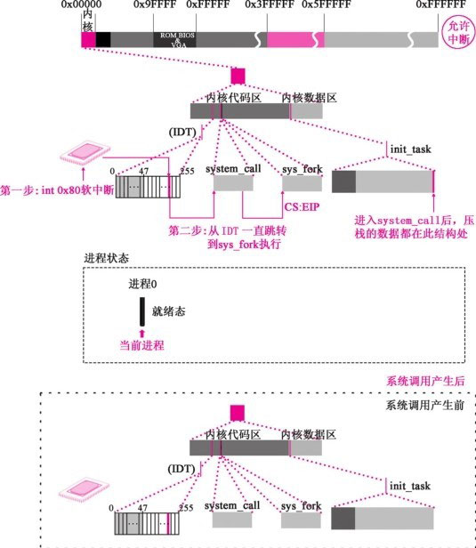

- 1. 先获取中断的偏移量，之后调用 "int $0x80" 中断，CPU从3特权级的进程0跳到0特权级内核代码中执行。中断导致自动压栈到进程0的内核栈，其中EIP是fork的下一行，所以子进程也是从fork之后开始执行的
  2. 这些函数的参数是通过压栈的方式“做”出来的
  3. 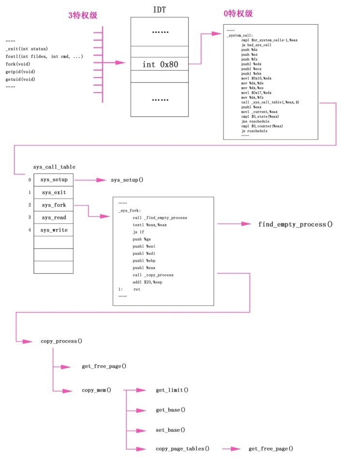

#### 3.1.2 在task[64]中为进程1 申请一个空闲位置并获取进程号

- 调用find_empty_process()函数为进程1获得一个可用的进程号和task[64]中的一个位置。

  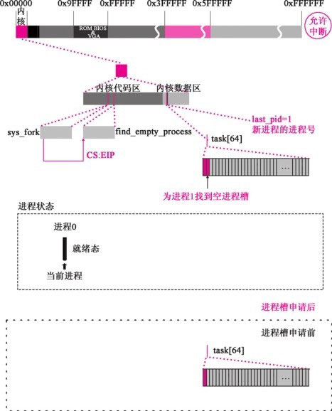

#### 3.1.3 调用copy_process函数

- 进程0将在copy_process()函数中做非常重要的、体现父子进程创建机制的工作：
  1. 为进程1创建task_struct，将进程0的task_struct的内容复制给进程1。
  2. 为进程1的task_struct、tss做个性化设置。
  3. 为进程1创建第一个页表，将进程0的页表项内容赋给这个页表。
  4. 进程1共享进程0的文件。
  5. 设置进程1的GDT项。
  6. 最后将进程1设置为就绪态，使其可以参与进程间的轮转。

#### 3.1.4 设置进程1的分页管理

1. 在进程1的线性地址空间中设置代码段、数据段
2. 为进程1创建第一个页表并设置对应的页目录项，申请页空间，复制页。指向相同页面
3. 

-  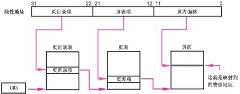

#### 3.1.5 进程1共享进程0的文件

- 返回copy_process()函数中继续调整。设置文件，i节点等

#### 3.1.6 设置进程1在GDT中的表项

- 把进程1的TSS和LDT挂接在GDT里面

#### 3.1.7 进程1处于就绪态

- 进程1的状态设置为就绪态，参与进程调度。返回sys_fork()中call_copy_process()的下一行执行，清栈，返回进程id号。
- iret 返回，CS：EIP指向fork( )中int 0x80的下一行if（__res > =0）。

### 3.2 内核第一次做进程调度

- 进程切换的情况
  - 允许进程时间结束，时间片用完
  - 进程停止运行，比如等待其他程序，或者已经执行完毕

- 进程0角色特殊。现在进程0切换到进程1既有第二种情况的意思，又有怠速进程的意思。进程0执行for（;;）pause( )，最终执行到schedule()函数切换到进程1

  - pause()运行的时候和 fork() 调用一样，也会产生0x80中断，会设置进程状态为可中断等待状态，然后调用schedule()进行进程切换
  - 第一次遍历所有进程，只要地址指针不为空，就对alarm和signal进行处理
  - 第二次遍历所有进程，比较进程状态和时间片，选择进程并切换

  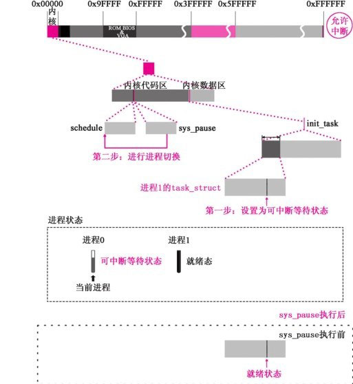

### 3.3 轮转到进程1执行

- 从 if(__res >= 0) 开始执行，返回后进入 ini() ，此时中断还没有返回

#### 3.3.1 进程1为安装硬盘文件系统做准备

1. 进程1设置硬盘的hd_info，根据机器系统数据中的drive_info进行设置

2. 读取硬盘的引导块到缓冲区，在Linux 0.11中，硬盘最基础的信息就是分区表，该表所在块就是引导块

   1. 引导块在一块硬盘里只有一个，标号0，有两个扇区。

3. 将找到的缓冲块与请求项挂接

4. 读硬盘

5. 等待硬盘读数据时，进程调度切换到进程0执

6. 进程0执行过程中发生硬盘中断

7. 读盘操作完成后，进程调度切换到进程1执行

   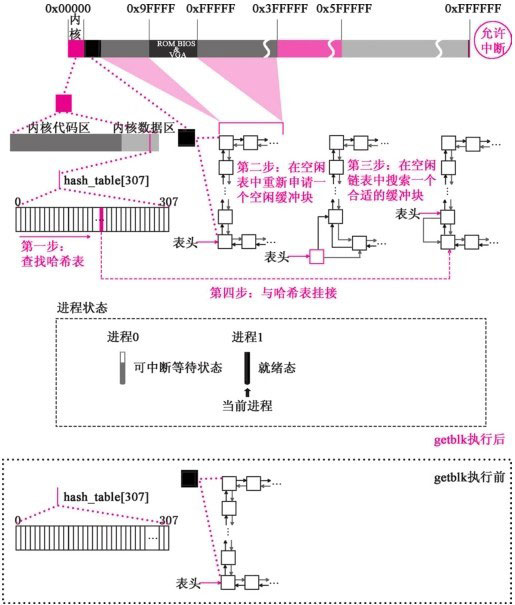

#### 3.3.2 进程1格式化虚拟盘并更换根设备为虚拟盘

- “格式化”虚拟盘的信息从256扇区开始。进程1调用rd_load( )函数，用软盘上256以后扇区中的信息“格式化”虚拟盘，使之成为一个块设备。
- 调用breada( )函数，把与文件系统相关的内容，从软盘上拷贝到虚拟盘中，然后及时释放缓冲块，最终完成“格式化”这个过程

#### 3.3.3 进程1在根设备上加载根文件系统

- 操作系统中的文件系统可以大致分成两部分；一部分在操作系统内核中，另一部分在硬盘、软盘、虚拟盘中

  - 文件系统用i节点来管理文件，一个i节点管理一个文件，形成树形结构，根节点就叫文件系统的根i节点，一个逻辑设备只有一个文件系统。

  - 加载文件系统最重要的标志，就是把一个逻辑设备上的文件系统的根i节点，关联到另一个文件系统的i节点上。

  - 根文件系统是只被挂接的文件系统，所在设备叫根设备。根文件系统挂载在super_block[8]，每个元素是一个超级块

    1. 复制根设备的超级块到super_block[8]中，将根设备中的根i节点挂在super_block[8]中对应根设备的超级块上。
    2. 将驻留缓冲区中16个缓冲块的根设备逻辑块位图、i节点位图分别挂接在super_block[8]中根设备超级块的s_zmap[8]、 s_imap[8]上。
    3. 将当前进程1的pwd、root指针指向根设备的根i节点。

    - 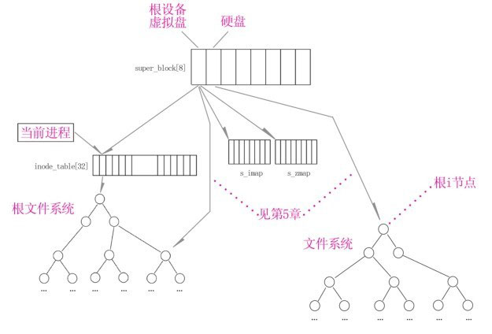

## 第4章 进程2的创建及执行

### 4.1 打开终端设备文件及复制文件句柄

#### 4.1.1 打开标准输入设备文件

1. file_table[0]挂接在进程1的filp[0]，加载完根文件系统后，通过open函数打开标准输入设备文件（open也是产生软中断，最终映射到内核的sys_open函数）
2. 确定绝对路径起点，内核将调用open_namei( )函数，最终获取标准输入设备文件的i节点
3. 获得dev目录文件i节点
4. 确定dev目录文件i节点为枝梢（topmost）i节点
5. 确定tty0文件的i节点
6. 确定tty0是字符设备文件
7. 设置file_table[0]

- 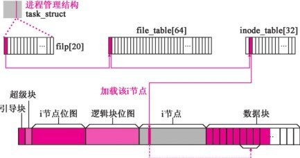
- 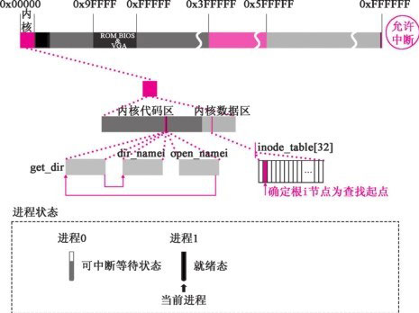

- 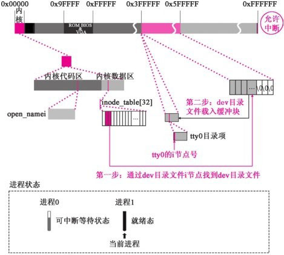

#### 4.1.2 打开标准输出、标准错误输出设备文件

- open( )函数返回后，进程1在tty0文件已经被打开的基础上，通过调用dup( )函数，复制文件句柄，一共复制了两次。
- dup( )函数最终会映射到sys_dup( )，调用dupfd()函数。确定具备复制条件后，在进程1的filp[20]中寻找到空闲项，将filp[0]中存储的tty0文件指针复制进filp[1]中，并将file_table[0]中f_count文件引用计数这一字段的数值累加为2

### 4.2 进程1创建进程2并切换到进程2执行

- 进程1将调用fork( )函数，创建进程2
- 创建完成后  pid 不为 0，进程1开始等待， 切换到进程2

### 4.3 加载shell程序

#### 4.3.1 关闭标准输入设备文件，打开rc文件

- 进程2调用close关闭标准输入，并用rc替代。rc文件打开后，进程2将调用execve( )函数开始加载shell程序
- 参数和变量都是在内核代码写好的

#### 4.3.2 检测shell文件

1. 检测i节点属性，先调用namei( )函数获取shell文件的i节点，确定有权限执行
2. 检测文件头属性，通过i节点中提供的设备号和块号信息，将文件头载入缓冲块并获取其信息

#### 4.3.3 为shell程序的执行做准备

1. 加载参数和环境变量，设置参数和环境变量的管理指针表page，并统计参数和环境变量个数，最终将它们复制并映射到进程2的栈空间中。
2. 调整进程2的管理结构，设为可执行，释放一些内核数据等 
3. 为执行shell调整EIP和ESP

#### 4.3.4 执行shell程序

1. 执行shell引导加载第一页程序，第一次执行产生一个“页异常”中断。此中断会进一步调用“缺页中断”处理程序来分配该页面，并加载一页shell程序
2. 映射加载页的物理地址与线性地址，内核会将该页内容映射到shell进程的线性地址空间内，建立页目录表→页表→页面的三级映射管理关系。

### 4.4 系统实现怠速

#### 4.4.1 创建update进程

- shell进程刚开始执行，就用rc文件替换了标准输入设备文件tty0，因此，shell程序执行后读取的是rc文件上的信息。

- 根据/etc/update这条命令，shell先创建一个新进程，进程号是3，称之为“update进程”。
- update进程有一项很重要的任务：将缓冲区中的数据同步到外设（软盘、硬盘等）上

#### 4.4.2 切换到shell进程执行

- rc 第二条命令，将"/dev/hd1 /"这一字符串写入虚拟盘中/etc/mtab文件。读取rc完毕就执行 exit 函数，会处理孤儿进程，僵死进程，解除文件占用等
- 退出之前通知父进程，变成僵尸进程，准备切换

- 因为之前进程1处于等待状态，切换到它就会处理子进程退出信号。释放页面等操作。

#### 4.4.3 重建shell

- 进程1继续执行，重建shell，此时进程4是shell进程。船舰完成后设置为可中断状态，如此全部进程都是可等待状态，再次切换到进程0实现怠速
- shell进程处理指令原理：没有输入就处于挂起；如果用户输入，发生中断，中断将字符存储在指定缓冲队列并通知shell进程，shell江金城被唤醒后，读取处理后接着挂起

## 第5章 文件操作

### 5.1 安装文件系统

1. 将硬盘上的超级块读取出来，并载入系统中的super_block[8]中。
2. 将虚拟盘上指定的i节点读出，并将此i节点加载到系统中的inode_table[32]中。
3. 将硬盘上的超级块挂接到inode_table[32]中指定的i节点上。

#### 5.1.1 获取外设的超级块

- 硬盘是可以分区的，每个分区都可以算作一个设备。
- sys_mount( )函数先调用namei( )函数，根据/dev/hd1路径名，获得hd1设备文件的i节点，再从i节点中获得设备号，最终根据设备号，读取设备的超级块。

#### 5.1.2 确定根文件系统的挂接点

- 再次调用namei( )函数，根据/mnt路径名，获得mnt目录文件的i节点，获取后，分析i节点的属性，判断该i节点是否可以用来挂接文件系统

#### 5.1.3 将超级块与根文件系统挂接

### 5.2 打开文件

- 操作系统中就是确定进程操作哪个文件
  1. 将用户进程task_struct中的*filp[20]与内核中的file_table[64]进行挂接。
  2. 将用户进程需要打开的文件对应的i节点在file_table[64]中进行登记。
- 文件可以多次打开，或者一次打开多个文件，由filp记录，一个进程最多打开二十次。
- 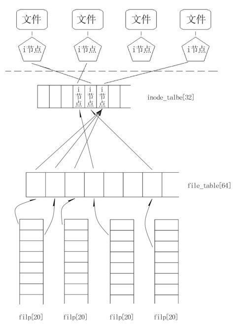

#### 5.2.1 将进程的*filp[20]与file_table[64]挂接

- 在sys_open( )函数中，分别在\*filp[20]、file_table[64]中找到空闲项，找到后，将当前进程的\*filp[20]与file_table[64]的对应项挂接，并增加file_table[64]中对应项的文件句柄计数

- 

#### 5.2.2 获取文件i节点

- 文件存储在硬盘上，通过虚拟盘找到硬盘上的文件

- 
- 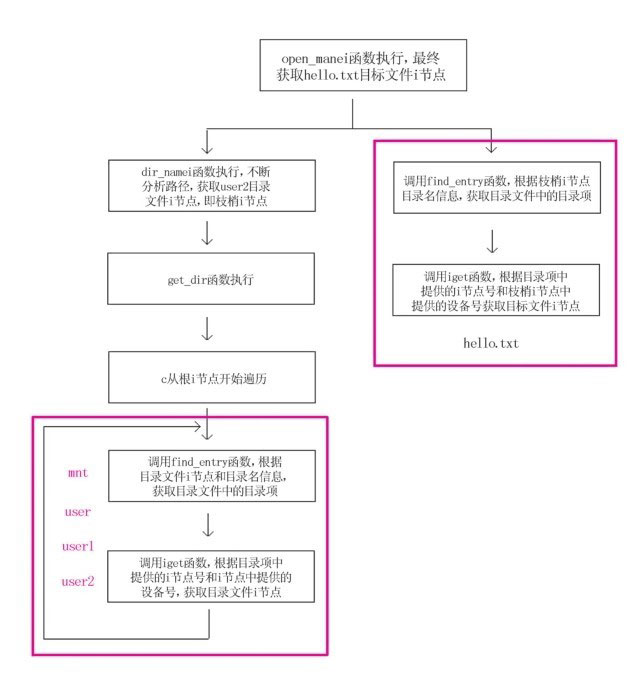

#### 5.2.3 将文件i节点与file_table[64]挂接

- 将目标文件的i节点与file_table[64]进行挂接，目的是使file_table[64]通过inode_table[32]中hello.txt文件i节点所在表项的指针，找到该i节点

### 5.3 读文件

#### 5.3.1 确定数据块在外设中的位置

- 在file_read()中，通过调用bmp( )函数来确定指定的文件数据块在外设上的逻辑块号
- 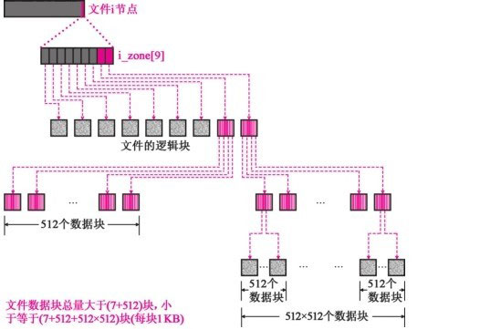

#### 5.3.2 将数据块读入缓冲块

- 调用bread( )函数，从硬盘中将hello.txt文件的第一个数据块读入指定的缓冲块

#### 5.3.3 将缓冲块中的数据复制到进程空间

### 5.4 新建文件

#### 5.4.1 查找文件

- 直接调用sys_open( )函数来新建文件。

#### 5.4.2 新建文件i节点

- 需要检查创建标志是否置位，文件夹权限，之后调用new_inode( )函数来新建i节点
  1. 要在i节点位图中，对新建i节点对应的位予以标识。
  2. 要将i节点的部分属性信息载入inode_table[32]表中指定的表项。

#### 5.4.3 新建文件目录项

- 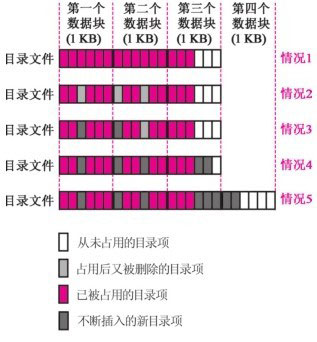

### 5.5 写文件

#### 5.5.1 确定文件的写入位置

- 调用create_block( )函数，创建一个与该文件位置对应的外设逻辑块，并返回逻辑块号。
- 具体的创建工作是在new_block( )函数中进行的，内容包括两部分：
  1. 将新建数据块对应的逻辑块位图置1。
  2. 在缓冲区中为新建的数据块申请缓冲块，用以承载写入的内容。

#### 5.5.2 申请缓冲块

#### 5.5.3 将指定的数据从进程空间复制到缓冲块

#### 5.5.4 数据同步到外设的两种方法

- update定期同步，该进程会调用pause( )函数，使该进程被设置为可中断等待状态。调用sync( )函数，将缓冲区中的数据同步到外设上。

  将文件i节点位图、文件i节点、文件数据块、数据块对应的逻辑块位图，全都同步到外设。

- 缓冲区使用达到极限，操作系统强行同步。由getblk( )函数完成的。

### 5.6 修改文件

#### 5.6.1 重定位文件的当前操作指针

- 用户进程调用lseek( )函数，将文件的当前操作指针f_pos进行重新定位，它最终映射到sys_lseek( )函数去执行。

#### 5.6.2 修改文件

- 通过sys_read( )函数、sys_write( )函数和sys_lseek( )函数联合使用

### 5.7 关闭文件

#### 5.7.1 当前进程的filp与file_table[64]脱钩

- 当前进程的task_struct中的filp[20]与file_table[64]解除关系

#### 5.7.2 文件i节点被释放

- 先要对i节点的各类属性进行检查，然后，递减i节点的i_count，使i节点的引用计数变为0，这个i节点在inode_table[32]中的表项成为空闲项。

### 5.8 删除文件

#### 5.8.1 对文件的删除条件进行检查

#### 5.8.2 进行具体的删除工作

- 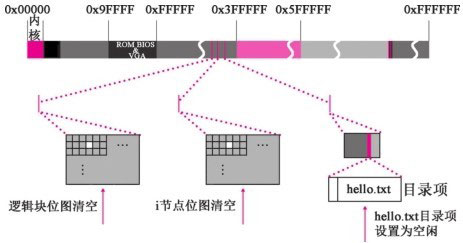

## 第6章 用户进程与内存管理

### 6.1 线性地址的保护

- 在Intel IA-32架构中，进程保护体现在对进程内存空间的保护，进程内存空间的保护是由线性地址保护、物理地址保护实现的。

#### 6.1.1 进程线性地址空间的格局

- 只要打开PE、PG，就只能使用线性地址，由MMU自动转换为物理地址。Linux 0.11将4GB空间分为64份，每个进程一份。
  - task[64] 是基点，所有进程等级注销都由它管理。操作系统根据task[64]的项号nr在GDT中找到对应的LDT。task[64]起到了控制进程总量，关联进程与GDT中的LDT、TSS的关键作用。

#### 6.1.2 段基址、段限长、GDT、LDT、特权级

- Intel IA-32架构对进程线性地址空间的保护是基于段的。利用段限长可以防止越界。但是可以利用ljmp跨越边界

- 从一个进程非法跨越到另一个进程

  > 从 CPU 来看都是特权级3，所以允许跳转。Linux 0.11 利用LDT阻止跳转。
  >
  > 每个进程占GDT两项，TSS和LDT。LDT所有进程的设计都是一样的。第一段为空，第二段进程代码段，第三段进程数据段。跳转只能“段内偏移段选择子”，但是CS都是一样的，所以只能在本段，无法跨越。

- 从一个进程非法跨越到内核

  > 默认禁止特权级越级访问，硬件决定的
  >
  > Linux 0.11中的进程间切换是在schedule()中完成的，其技术路线很像任务门。是在0特权级下，用ljmp指令直接跳转到要切换的进程的TSS，利用中断机制进行特权级翻转

### 6.2 分页

#### 6.2.1 线性地址映射到物理地址

- 线性地址是通过页目录表——页表——页面三级映射模式，最终落实到物理地址的。

- 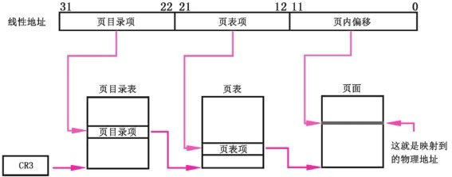

#### 6.2.2 进程执行时分页

1. 只能从空闲页面中分配新页面，怠速前内核通过mem_map结构对1 MB以上的内存空间进行分页管理，而且主内存中每个页面的引用计数都被初始化为0，即默认为空闲页面。
2. 要明确什么时候该为进程新申请页面，什么时候不该申请。每个页目录项和页表项的最后3位，标志着其所管理的页面的属性，分别是U/S、R/W和P。判断是否该申请页面，是在解析线性地址时确定的，关键要看P这个标志位。
3. 为进程新申请的页面要映射到该进程的线性地址空间内。

#### 6.2.3 进程共享页面

- 比如父子进程复制后共用代码 ，Linux 0.11用页表中的U/S、R/W两个位控制并发。共享的时候页面只读不写，采用 写时复制，每个进程拥有一份。

#### 6.2.4 内核分页

- 进入保护模式后，内核先给自己分页。分页是建立在线性地址空间基础上的。
- 内核的段基址是0，代码段和数据段的段限长都是16 MB。每个页面大小为4 KB，每个页表可以管理1024个页面，每个页目录表可以管理1024个页表。
- 由于内核使用直接映射，可以访问任意内存，所以可以修改进程 的页面 ，比如复制缓冲区到用户进程

### 6.3 一个用户进程从创建到退出的完整过程

#### 6.3.1 创建str1进程

1. 为创建进程str1准备条件，使用 `./a.out,shell`
   - shell调用fork函数开始创建进程，产生int 0x80软中断，最终映射到sys_fork( )这个函数中，调用find_empty_process( )函数，为str1进程申请一个可用的进程号、在task[64]中为该进程申请一个空闲位置。我们这里假设str1这个进程是操作系统怠速以后第一个申请的用户进程。

2. 为str1进程管理结构找到存储空间
   - copy_process( )函数的第一件事就是为str1进程申请一个页面，这个页面用来承载进程的task_struct和内核栈。task_struct管理进程，分配页面，准备进程的内核栈。

3. Shell进程给str1进程复制task_struct结构
   - 由shell把自己的task_struct结构复制给str1进程

4. 复制str1进程页表并设置其对应的页目录项
   - 设置信号，进程id等
   - TSS结构用于现场保存

5. 复制str1进程页表并设置其对应的页目录项
6. 建立str1进程与全局描述符表（GDT）的关联
7. 将str1进程设为就绪态

#### 6.3.2 str1进程加载的准备工作

1. 为用户进程str1的加载做准备
   - 对参数和环境变量等外围环境的检测、对str1可执行文件的检测、对str1进程task_struct的针对性调整以及最终设置EIP、ESP这几部分。
2. 释放str1进程的页表
3. 重新设置str1的程序代码段和数据段
4. 调整str1进程task_struct

#### 6.3.3 str1进程的运行、加载

1. 产生缺页中断并由操作系统响应
   - 检测str1进程是否已经把程序加载进来了，或者产生缺页中断的线性地址值是否已经超出了程序代码的末端。
   - 检测str1是否有可能与某个现有的进程共享代码

2. 为str1程序申请一个内存页面
3. 将str1程序加载到新分配的页面中
4. 将分配给str1程序的物理内存地址与str1进程的线性地址空间对应

5. 不断通过缺页中断加载str1程序的全部内容
6. 运行过程基本就是不断 缺页中断-加载页面-压栈/弹栈 直到执行完毕，清空栈

#### 6.3.4 str1进程的退出

1. str1进程准备退出
   - 退出之前释放文件，接触 task[64]关联
2. 释放str1程序所占页面
3. 解除str1程序与文件有关的内容并给父进程发信号
   - 先将与父进程共享的文件释放掉，然后内核将str1进程设置为僵死状态，并给它的父进程shell发送“子进程退出”信号

4. str1程序退出后执行进程调度

### 6.4 多个用户进程同时运行

#### 6.4.1 进程调度

1. 依次创建str1、str2和str3进程。进程号应该依次是5、6、7，在task [64]中的项号依次为4、5、6。由此进一步可以得出，它们在线性地址空间的位置应该依次是4×64～5×64MB、5×64～6×64 MB、6×64～7×64 MB。
2. str1进程压栈的执行效果。缺页中断请求页面，加载页面 
3. str1运行过程中产生时钟中断并切换到str2执行
   - 调动schedule函数，切换至str2，一样执行效果
4. 不难发现，任何时刻都只有一个进程在执行，根本不存在多个进程同时执行的情况。进程切换，就会用TSS和LDT全套数据跟着进程走，以此实现对进程的保护。（当然是在一个CPU核心的情况下）

- 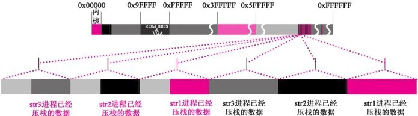

#### 6.4.2 页写保护

1. 进程A和进程B共享页面，页面设置为只读，引用计数加一
2. 进程A准备进行压栈操作，会产生页写保护中断  
3. 进程A的压栈动作引发页面写保护，申请新页面，原页面引用计数减一
4. 将进程A的页表指向新申请的页面
5. 复制原页面内容到进程A新申请的页面
6. 进程B准备操作共享页面
7. 假设进程B先执行压栈操作的情况

## 第7章 缓冲区和多进程操作文件

### 7.1 缓冲区的作用

- 缓冲区可以让效率更高，两端速度可以不匹配。原因是内存存取速度比硬盘快得多。

### 7.2 缓冲区的总体结构

- 使用图中两个 数据结构管理，尽量让缓冲中的数据生存周期长
- 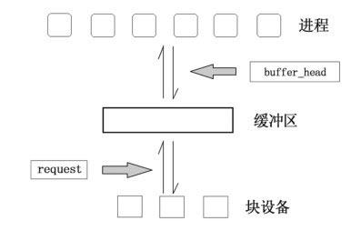

### 7.3 b_dev、b_blocknr及request的作用

#### 7.3.1 保证进程与缓冲块数据交互的正确性

- 进程与缓冲区不是以文件为单位、而是以缓冲块为单位进行数据交互的。保证数据交互的正确性，首先要保证硬盘上的数据块与缓冲块必须严格对应。
- 硬盘设备号和块号能唯一确定硬盘快，操作系统通过  buffer_head 结构中的 b_dev 和b_blocknr 两个字段，把缓冲块和硬盘数据块的关系绑定。
- 内核通过文件操作指针计算出文件数据内容所在的b_dev和b_blocknr，进程方面的延伸到此为止。
- 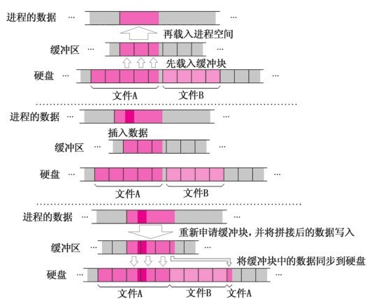

#### 7.3.2 让数据在缓冲区中停留的时间尽可能长

- 数据是否停留在缓冲区中的标志是，缓冲块是否还与硬盘的数据块存在绑定关系

- 请求项的大小为32项，即request[32]。
- 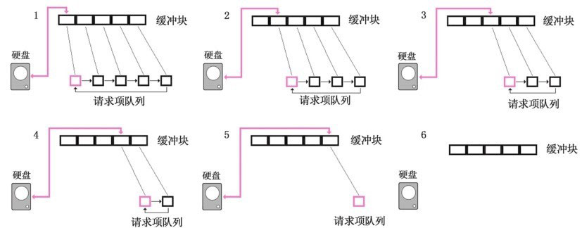

### 7.4 uptodate和dirt的作用

#### 7.4.1 b_uptodate的作用

- 设置b_uptodate为1，就标志着缓冲块中的数据是基于硬盘数据块的，内核可以放心地支持进程与缓冲块进行数据交互。

  为此，当硬盘中断服务程序执行时，在数据从硬盘读入缓冲块后，或从缓冲块同步到硬盘后，都会将b_uptodate设置为1。

- 新建文件不存在读操作，缓冲块被清零即使由垃圾数据也没事

#### 7.4.2 b_dirt的作用

- b_uptodate标志设置为1后，内核就可以支持进程共享该缓冲块的数据
- 如果b_dirt被设置为1，这个缓冲块的数据已经和数据块上的不一致了，需要同步，虽然用不着立即就同步

#### 7.4.3 i_uptodate、i_dirt和s_dirt的作用

- 文件管理信息也有类似的字段，比如inode_table[32]中存储的i节点，在多进程操作同一文件时，就要共享文件i节点信息。为此它的数据结构中也设计了两个字段：i_uptodate 和 i_dirt

### 7.5 count、 lock、wait、request的作用

#### 7.5.1 b_count的作用

- 在缓冲块中设置一个字段，使内核能够随时知道“每个缓冲块有多少进程在共享”，这个字段就是b_count。
- 在所有共享缓冲块的进程全部脱离共享关系后，虽然b_count肯定为0，但这并不等于缓冲块与数据块解除了绑定关系

#### 7.5.2 i_count的作用

- inode_table[32]中也需要i_count这一字段来标识该i节点项被多少进程共享了

#### 7.5.3 b_lock、*b_wait的作用

- 如果为进程申请到的缓冲块中b_lock字段被设置为1，即便已经申请到了，该进程也需要挂起，直到该缓冲块被解锁后，才能访问。
- 使用了进程等待队列，所以一个字段就可以解决这个记录问题。这个字段就是*b_wait。

#### 7.5.4 i_lock、i_wait、s_lock、*s_wait的作用

- 文件管理信息的数据结构也有同样类似的字段存在

#### 7.5.5 补充request的作用

- 请求项request要和硬盘进行交互，所以要明确是读交互还是写交互，为此设计了cmd字段；
- 此外，还需要明确是哪个缓冲块要进行交互，比如*bh和*buffer字段；
- 还需要考虑数据块与扇区的映射规则，比如sector和nr_sectors字段；
- 还需要考虑如果交互出现了问题怎么办，用errors记录出现问题的次数。

### 7.6 实例1：关于缓冲块的进程等待队列

### 7.7 总体来看缓冲块和请求项

### 7.8 实例2：多进程操作文件的综合实例

## 第8章进程间通信

### 8.1 管道机制

- 操作系统在内存中为每个管道开辟一页内存，给这一页内存赋予了文件的属性。这一页内存由两个进程共享，但不会分配给任何进程，只由内核掌控。

#### 8.1.1 管道的创建过程

- 创建管道相当于创建一个文件，不能访问线性地址，不会发生缺页中断。
  1. 为管道文件在file_table[64]中申请空闲项（父进程里面），子进程自动继承
  2. 进程task_struct中的*filp[20]与file_table[64]中的表项挂接
  3. 创建管道文件i节点，默认操作这个管道文件的进程“能且仅能”有两个，一个是读进程，另一个是写进程
  4. 将管道文件i节点与file_table[64]建立联系
  5. 将管道文件句柄返给用户进程

#### 8.1.2 管道的操作

- 如果管道中有未读数据，就读取数据，没有未读数据，就挂起；

  如果管道中有剩余空间，就写入数据，没有剩余空间了，就挂起；

### 8.2 信号机制

- 信号机制是Linux 0.11为进程提供的一套“局部的类中断机制”

#### 8.2.1 信号的使用

1. processsig进程开始执行。调用signal( )函数来实现这个绑定，产生0x80中断，将用户的自定义函数与进程绑定
2. processsig进程进入可中断等待状态。
3. sendsig进程开始执行并向processsig进程发信号。
4. 系统检测当前进程接收到信号并准备处理
5. 系统检测信号处理函数指针挂接是否正常
6. 调整processsig进程的内核栈结构，使其系统调用返回后，先执行信号处理函数。软中断产生后，CPU将自动在当前进程“内核栈”中保存用户进程执行的“指令和数据”

#### 8.2.2 信号对进程执行状态的影响

1. 用户进程退出并向shell进程发送信号。用户进程先调用exit( )函数来处理自己退出前的一些事务，包括将自己的程序所占用的内存页面释放、解除该进程与所操作文件的关系等，之后，给shell进程发送“子进程退出”信号，通知shell进程，自己即将退出，最后将自己设置为僵死状态并调用schedule( )函数
2. shell进程被唤醒并调度执行
3. shell进程执行，为子进程退出做最后的处理

4. shell进程再次被挂起

- 不可中断状态
  - 进程A由于等待读盘而被挂起，对处于不可中断等待状态的进程而言，除直接将其设置为就绪态之外，没有任何办法将它的状态改设为就绪态，是否接收信号都没意义。

## 第9章操作系统的设计指导思想

### 9.1 运行一个最简单的程序，看操作系统为程序运行做了哪些工作

- 硬盘上有一个名叫hello的可执行文件，执行该文件
  1. 用户输入命令，shell被唤醒并解析命令
     - 用户敲击键盘后，键入的信息记录在终端设备文件（tty0）上。文件系统的各种信息，超级快、逻辑块位图、i节点等
     - 敲击键盘后，还要产生键盘中断信号，系统要能够对键盘中断信号进行处理。寻找IDTR进行终端服务的查找，调用等
     - 进程调度机制，需要轮询机制和时钟中断
  2. shell程序解析出用户命令后，调用fork函数创建一个用户进程，以便对hello world文件的程序进行控制。
     - 创建进程管理结构，如TSS，LDT，GDT，相关的寄存器数据表修改等
  3. 新进程创建完毕后，加载hello world文件对应的程序。
     - 从硬盘加载文件到内存，数据块，文件系统
     - 缺页中断机制，逻辑地址的转换
  4. hello world程序开始执行，将“hello world”字符串显示在屏幕上。
     - 显卡的设定，如颜色，显存，位置，等

### 9.2 操作系统的设计指导思想——主奴机制

#### 9.2.1 主奴机制中的进程及进程创建机制

1. 程序边界与进程，task_struct是进程最主要的标志
2. 进程创建，Linux采用对象创建模式，父子进程创建的主要机制就是从父进程的task_struct复制一份作为子进程的task_struct。

#### 9.2.2 操作系统的设计如何体现主奴机制

1. 操作系统在进程调度中体现的主奴机制。

   操作系统进行进程调度时，对待内核和进程的方式是截然不同的，准确地说，进程调度就是内核操作的。

2. 操作系统在内存管理中体现的主奴机制。

   在task_struct数据结构中，明确地定义了进程的边界，任何未经允许的跨越边界行为都将被制止。但是内核进程可以访问任意地址。

3. 操作系统在文件系统中体现的主奴机制

   当用户需要向磁盘写文件时，首先需要向内核提出申请，说明自己是哪个进程、自己需要的资源大小，以及资源的读写权限

### 9.3 实现主奴机制的三种关键技术

#### 9.3.1 保护和分页

- Linux 0.11打开了PE和PG，即打开了保护模式和分页机制
- 对主奴机制影响深远的是特权级。Intel从硬件上禁止低特权级的代码段的代码使用一些关键性的指令，如LGDT、LLDT、LTR、LIDT。用户进程的逻辑地址要由内核转换为线性地址。物理地址是由内核将线性地址转换而成的

#### 9.3.2 特权级

- 特权级主要是依托CPU硬件提供的保护模式，在所有的段选择符的最后两位标识特权级，最终影响的是段选择符决定的段。这些段选择符包括CS、SS、DS、ES、FS和GS。特权级影响的范围是“段”，这是关键点！

#### 9.3.3 中断

- 

### 9.4 建立主奴机制的决定性因素——先机

- 计算机开机启动的时候是实模式，实模式没有特权级的概念。这时操作系统内核开始加载。正常情况下，此时不应该有BIOS、操作系统以外的任何程序。当操作系统的启动程序打开PE的时候，特权级状态必须是最高特权级
- 操作系统的设计者就是利用这个最有利的时间，以时间换特权，先霸占所有特权，并充分利用这些特权，创建进程。

### 9.5 软件和硬件的关系

#### 9.5.1 非用户进程——进程0、进程1、shell进程

- shell必须是一个专门为操作系统配套设计的特殊进程，从开始接受用户使用到关机，都不应该退出。
- 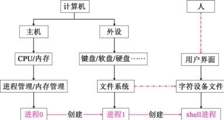

#### 9.5.2 文件与数据存储

1. 内存、硬盘、缓冲区：计算级存储、存储级存储、过渡态
   - 我们称参与用户进程计算的内存为全运算存储，称参与内核为文件系统的运行所做运算的内存为半运算存储，称在内存中完全模拟外设、没有任何运算的内存为无运算存储。
2. 缓冲区的设计指导思想
   - 要使数据的读写有序
   - 让数据在缓冲区中停留的时间尽可能长

3. 利用文件系统实现进程间通信——管道
   - 管道不是用内存管理的方式进行管理的，而是用文件系统的管理方式来管理的
   - 进程管理的设计指导思想，就是要使进程之间完全独立和隔离。进程间通信意味着数据要跨越进程边界流动，如果采取直接交互的方式，显然违背了这个设计指导思想。

### 9.6 父子进程共享页面

- 为什么不在子进程刚刚创建完毕就切断这个关系？此时的子进程没有任何自己的代码，加载自己代码的工作也是需要代码的，这份代码按照Linux的规则，只在父进程中有

### 9.7 操作系统的全局中断与进程的局部中断——信号

- 中断技术发明的最初动机是为了避免操作系统频繁地主动轮询外设的IO状态，空耗主机资源。
- 中断技术使操作系统由主动轮询变为被动响应，极大地降低了IO过程中主机资源的消耗，提高了运行效率。
- 对比分析中断和信号，可以看出信号明显是在模仿中断的技术路线，使进程间的沟通由主动轮询变为被动响应，同样大幅度减少了进程间沟通引起的操作系统的消耗，提高了整体运行效率。
