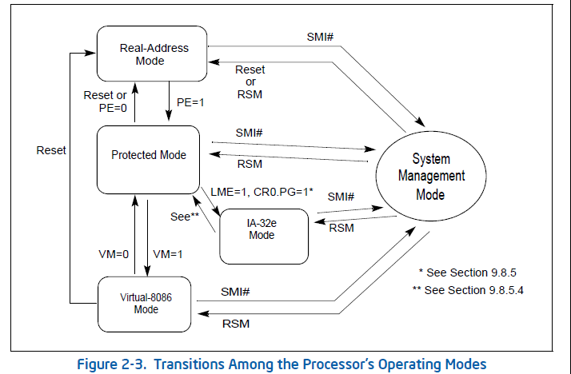

# 一些概念

## 1. CPU工作模式

- 所谓工作模式，是指CPU的寻址方式、寄存器大小、指令用法和内存布局	
  - 从80386开始，CPU有三种工作模式：实模式、保护模式和虚拟8086模式。

- 实模式：用到的地址都是真实的物理地址，也就是 基地址<<4+偏移地址，得到的地址等价于真实物理地址。最大寻址空间1MB，最大分段64KB。
  - 在32位CPU下，系统复位或加电时都是以实模式启动，然后再切换为保护模式。
  - 在实模式下没有特权级，程序可以任意修改内存，包括操作系统所在内存。
- 保护模式：内存的管理模式分为两种——段模式和页模式
  - 寻址方式没有变，还是基地址+偏移地址，但是加上一些限制，这些限制放在一张表里，叫做**全局描述符表(GDT)**
  - 现代多数的x86处理器操作系统都运行在保护模式下

- 

- x64架构CPU工作模式

  

## 2. BIOS

- 在初始开机时，BIOS是直接从ROM执行的.。ROM芯片映射到处理器存储空间中的固定位置(这通常是芯片组的功能)。当x86处理器退出复位状态时，它将立即从0xFFFFFFF0开始执行。
- 但是，直接从ROM执行非常慢，因此通常BIOS要做的第一件事就是将BIOS代码复制并解压缩到RAM中，然后从那里执行
