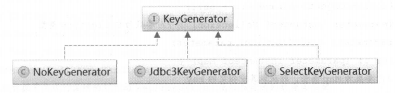
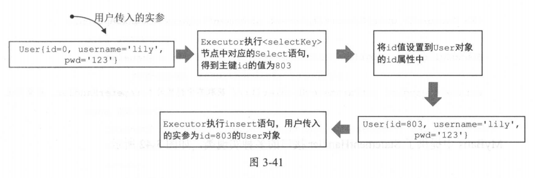

# MyBatis技术内幕

- [ ] 书籍作者: 徐郡明
- [ ] 笔记时间: 2021.02.23

## 第一章 快速入门

### 1.1 ORM 简介

ORM 框架的主要功能就是根据映射配置文件，完成数据在对象模型与关系模型之间的映射，同时也屏蔽了上述重复的代码，只暴露简单的 API 供开发人员使用

### 1.2 常见持久化框架

- Hibernate -- 自动化框架,具有缓存,映射,HQL,十分强大,但是对于需要优化SQL时候比较麻烦
- JPA (Java Persistence API) -- 规范
- Spring JDBC -- 对原生JDBC进一步封装,与Spring集成,设计优秀
- MyBatis -- 暴露SQL的Hibernate,更灵活

### 1.3 MyBatis 示例

### 1.4 MyBatis 整体架构

#### 1.4.1 基础支持层

- 反射模块 -- 原生基础上进一步封装并优化,缓存元数据
- 类型转换模块 -- 别名机制;实现JDBC类型与Java类型之间的转换
- 资源加载模块 -- 主要是对类加载器进行封装,确定其顺序
- 解析器模块 -- 对XPath进行封装,实现解析配置文件;处理动态SQL占位符
- 事务管理 -- 与Spring集成时候,由Spring管理事务;本身提供简单实现.
- 缓存模块 -- 两级缓存,但是在同一个JVM,如果需要大量缓存的话建议用 redis等
- Binding 模块 -- 可以尽早发现错误,自动创建代理对象.

#### 1.4.2 核心处理层

- 配置解析

  > 加载 mybatis-config.xml 配置文件、映射配置文件以及Mapper 接口中的注解信息，解析后的配置信息会形成相应的对象并保存到Configuration 对象中.利用该 Configuration 对象创建 SqlSessionFactory 对象

- SOL 解析与 scripting 模块

  > SQL的拼凑和解析,Scripting负责占位符解析

- SOL 执行

  > Executor 主要负责维护缓存，并提供事务管理的相关操作
  >
  > 

- 插件

#### 1.4.3 接口层

核心是 SqlSession 接口，该接口中定义了 MyBatis 暴露给应用程序调用的 API ，也就是上层应用与 MyBatis 交互的桥梁

## 第二章 基础支持层

### 2.1 解析器模块

- DOM(Document Object Model) -- 易于编程,消耗较多资源(需要加载整个文档)

- SAX(Simple API for XML)

  > 基于事件模型的 XML 解析方式,不用加载整个文档,采用推模式.通过回调执行方法,缺点在于复杂度增加,需要自己维护.

- StAX(Streaming API for XML)

  > JAXP JDK 提供的 套用于解析 XML API 它很好地支持 DOM SAX 解析方式，采用拉模式.

#### 2.1.1 XPath 简介

My Batis 在初始化过程中处理 mybatis.config.xml 配置文件以及映射文件时，使用的是 DOM解析方式，井结合使用 XPath 解析 XML 配置文件。JDK自带

#### 2.1.2 XPathParser 

MyBatis 提供 XPathParser 封装  XPath ,Document, EntityResolver

- XMLMapperEntityResolver 会指定目录下的dtd
- XPathParser.createDocument() 加载XML文件,会调用PropertyParser. parse（） 方法处理节点中相应的默认值
- PropertyParser中会创建 GenericTokenParser 解析器,进行占位符,转义等处理,占位符由 TokenHandler 接口的实现进行解析
- XPathParser.evalNode()方法解析Node对象并封装为XNode

### 2.2 反射工具箱

#### 2.2.1 Reflector&ReflectorFactory 

JavaBean类中成员称为 字段,而通过getter/setter设置的称为属性(可以没有对应的字段)

- 每个 Reflector 对象都对 个类，在 Reflector 缓存了反射操作需要使用的类的元信息。
  1. 字段保存各种getter/setter和属性的映射
  2. 构造器会解析指定的Class对象,并进行属性填充
     - 反射获取对象类的所有方法对象,添加到 uniqueMethods 集合.会为其生成唯一方法签名, 格式: 返回值类型＃方法名称：参数类型列表
     - 获取所有getter方法(长度大于3,get开头),add\*Method（）方法和 add\*Field（）方法在向上述集合添加元素时，会将 etter/setter 方法对应的 Method 对象以及字段对应的 Field 对象统一封装成 Invoker 对象
     - 处理协变的方法覆盖
- Reflector Factory 接口主要实现了对 Reflector 对象的创建和缓存
  - 默认实现类使用ConcurrentMap进行缓存	
  - findForClass （） 方法实现会为指定的 lass 创建 Reflector 对象，并将 Reflector 象缓存到 reflectorMap 中，

#### 2.2.2 TypeParameterResolver 

- Type接口简介

  

  - Class -- Class 类的对象表示 NM 中的 个类或接口，
  - ParameterizedType 表示的是参数化类型,带有泛型
  - Type Variable 表示的是类型变量 ，它用来反映在 JVM 编译该泛型前的信息。
  - GenericArrayType 表示的是数组类型且组成元素是 ParameterizedType TypeVariable . 
  - WildcardType 表示的是通配符泛型，

- TypeParameterResolver 是一个工具类,解析各种字段,参数类型
  - 最终会调用`resolveType(fieldType , srcType , declaringClass) ; `,分别是 参数类型,起始位置,所在类
  - resolveParameterizedType(),具有嵌套处理
  - resolveTypeVar()方法负责解 TypeVariable
    - scanSuperTypes()方法 该方法会递归整个继承结构井完成类型变量的解析
  - resolveGenericArrayType()方法，该方法负责解析 GenericArrayType 类型的变量

#### 2.2.3 ObjectFactory

默认实现使用反射创建对象.

#### 2.2.4 Property 工具集

- PropertyTokenizer -- 级联属性表达式解析,使用迭代器根据 . 和 [] 进行分割.
- PropertyCopier-- 属性拷贝 工具类
- PropertyNamer 静态方法帮助完成方法名到属性名的转换

#### 2.2.5 MetaClass 

MetaC!ass 通过 Reflector 和PropertyTokenizer 组合使用， 实现了对复杂的属性表达式的解析，并实现了获取指定属性描述信息的功能。

- MetaC!ass. findPrope （） 方法只查找“．”导航的属性，并没有检测下标。
- hasGetter()方法当字段没有对应getter方法时会添加相应的GetFieldlnvoker对象

#### 2.2.6 ObjectWrapper 

ObjectWrapper 接口是对对象的包装，抽象了对象的 信息 ，它定义了一系列查询对象属性信息的方法，以及更新属性的方法

- BaseWrapper.getCollection Value（）方法法会解析属性表达式的索引信息，然后获 ／设置 应项

#### 2.2.7 MetaObject 

对属性表达式解析过程是 MetaObject 实现的。主要通过递归处理(利用 PropertyTokenizer).

### 2.3 类型转换

MyBatis 中使用 JdbcType 这个枚举类型代表 JDBC 中的数据类型

#### 2.3.1 TypeHandler 

MyBatis 中所有的类型转换器都继承了 TypeHandler ，通过继承可以自定义

TypeHandler 用于单个参数以及单个列值的类型转换

#### 2.3.2 TypeHandlerRegistry 

管理各种TypeHandler,维护类型与Handler之间的映射

1. 注册 TypeHandler 对象

   > ④方法实现: 根据参数将TypeHandler对象保存到Map中
   >
   > ①～③: 会尝试读 TypeHandler 类中定义的＠MappedTypes 注解和＠MappedJdbcTypes 注解
   >
   > 上述方法在 TYPE_HANDLER_MAP 集合和 ALL_TYPE_HANDLERS MAP 集合注册 TypeHandler 对象
   >
   > ⑤是向 JDBC_ TYPE_ HANDLER _MAP 集合注册 TypeHandler 对象

   

2. 查找 TypeHandler

   由1注册的里面查找

#### 2.3.3 TypeAliasRegistry 

通过 TYPE_ALIASES 宇段管理别名与 Java 类型之间的对应关系

通过 TypeAliasRegistry.registerAlias （）方法 册别名

- registerAliases() 会扫描指定包下所有的类，并为指定类的子类添加别名：
- registerAlias() 会尝试读取@Alias 注解

### 2.4 日志模块

#### 2.4.1 适配器模式

自带多种适配器

#### 2.4.2 日志适配器

位于 org.apache.ibatis.logging 包中,LogFactory 工厂类负责创建对应的日志组件适配器

- LogFactory 类加载时会执行其静态代码块，其逻辑是按序加载并实例化对应日志组件的适配器，然后使用 LogFactory. logConstructor 这个静态宇段，记录当前使用的第三方日志组件的适配器

#### 2.4.3 代理模式与 JDK 动态代理

#### 2.4.4 JDBC 调试

MyBatis 的日志模块中有 Jdbc 包,通过 JDK 动态代理的方式，将 JDBC 操作通过指定的日志框架打印出来。

BaseJdbcLogger 个抽象类，它是 Jdbc 包下其他 Logger 类的父类

- ConnectionLogger 会为其封装的connection对象创建代理,

### 2.5 资源加载

#### 2.5.1 类加载器简介

#### 2.5.2 ClassloaderWrapper 

封装多个类加载器,会自动返回第一个合适的.

#### 2.5.3 ResolverUtil 

可以根据指定的条件查找指定包下的类，其中使用的条件由 Test 接口表示。

提供了两个常用的 Tes 接口实现，分 IsA 与 AnnotatedWith

#### 2.5.4 单例模式

- 双重检查机制,记得volatile
- 静态内部类 -- 第一次访问类中的静态字段时，会触发类加载

#### 2.5.5 VFS 

VFS 表示虚拟文件系统 Virtual File System 来查找指定路径下的资源。

isValid（）负责检测当前 VFS 对象在当前环境下是否有效， list(URL, String）方法负 责查找指定的资源名称列表，

### 2.6 DataSource

#### 2.6.1 工厂方法模式

#### 2.6.2 DataSourceFactory 

UnpooledDataSourceFactory构造函数会直接创建UnpooledDataSource对象,通过setProperties()完成属性注入.

JndiDataSourceFactory 是依赖开IDI 服务从容器中获取用户配置的 DataSource

#### 2.6.3 UnpooledDataSource 

每次通过getConnection()都会创建一个新连接.底层使用DriverManager获取连接.

#### 2.6.4 PooledDataSource 

实现了简易数据库连接池的功能.

在 PooledConnection 中封装了 真正的数据库连接对象（java.sql.Connection ）以及其代理对象，这里的代理对象是通过 JDK 动态代理产生的 

popConnection（） 方法获PooledConnection对象,从而得到代理对象.

注意 PooledDataSource.forceCloseAII（）方法,修改配置时候会将所有连接关闭,清空连接,之后重新创建.

### 2.7 Transaction 

事务的提交和回漆都是依靠容器管理的,ManagedTransaction 中通过 closeConnection 宇段的值控制数据库连接 关闭行为。

### 2.8 binding 模块

#### 2.8.1 MapperRegistry&MapperProxyFactory 

Mapper Registry是 Mapper 接口及其对应的代理对象工厂的注册中心。

ConfigurationMy Batis 全局性的配置对象,会记录当前使用的 MapperRegistry 象，其中保存的映射时Mapper.class和MapperProxyFactory.需要执行SQL时候得到的实际上时Proxy对象.

#### 2.8.2 MapperProxy

Mapper Proxy 实现了 lnvocationHandler 接口,核心字段就是保存Method与MapperMethod之间的映射.后者负责解析和执行SQL

- MapperProxy.invoke 默认会从缓存获取MapperMethod对象,没有则创建

#### 2.8.3 MapperMethod 

Mapper Method 中封装了 Mapper 接口中对应方法的信息，以及对应 SQL 语句的信息

- SqlCommand -- 会记录SQL名称和类型

- ParamNameResolver -- 会记录参数索引和名称的映射

  > 如采参数是 RowBounds 类型或 ResultHandler 类型，会跳过对该参数的分析”param＋索号”格式的默认参数名称

- MethodSignature

  > 封装了 Mapper 接口中定义的方法的相关信息，MethodSignature 的构造函数中会解析相应 Method 对象， 并初始化对应信息.不同类型返回值调用不同方法处理.

### 2.9 缓存模块

具有一级和二级缓存,都是实现Cache接口.

#### 2.9.1 装饰器模式

Java IO流典型应用.

#### 2.9.2 Cache 接口及其实现

- PerpetualCache 提供了 Cac 接口的基本实现。

  > 底层使用HashMap进行存储.

- BlockingCache 

  > 阻塞版,ConcurrentHashMap进行存储

- FifoCache&LruCache 

  > FIFO使用LinkedList存储,LRU使用LinkedHashMap

- SoftCache&WeakCache 

  > 用到对应的SoftReference 和 WeakReference,So Cache 中缓存项的 value SoftEn町对象， SoftEntry 继承 Soft:Reference 其中指向key 的引用是强引用， 而指向 value 的引用是软引用

- ScheduledCache&LoggingCache&Synchronized&CacheSerializedCache 

  > - ScheduledCache 是周期性清理缓存的装饰器,默认1h
  > - SynchronizedCache 通过在每个方法上添加 synchronized 关键字
  > - Serialized Cache 提供了将 value 对象序列化的功能。

#### 2.9.3 CacheKey 

唯一确定一个缓存项需要使用缓存项的 key,updateList里面内容共同决定是否为同一个对象

- MappedStatement.id
- 指定查询结果集的范围
- 查询所使用的 SQL 语句
- 用户传递给上述 SQL 句的实际参数值。

## 第三章 核心处理层

### 3.1 MyBatis 初始化

#### 3.1.1 建造者模式

#### 3.1.2 BaseBuilder 

初始化入口是 SqlSessionFactoryBuilder. build（）方法

父类BaseBuilder定义了全局唯一的一些信息(配置,别名等)

#### 3.1.3 XMLConfigBuilder

主要负责解析 mybatis-config.xml 配置文件

1. 解析 property 节点

   > 解析并封装为Properties对象,	设置到 XPathParser和Configuration 的 variable 字段中

2. setting节点

   > 记录的是全局信息,会保存到Configuration里面.使用MetaClass 检测 key 定的属性在 onfiguration 类中是否有对应 se er 方法的步骤。

3. typeAIiases 和 typeHandlers 节点

4. plugin节点

   > 自定义插件只需实现 Interceptor 接口，并通过注解指定想要拦截的方法签名即可.InterceptorChain 层使 ArrayList\<Interceptor\>实现。

5. objectFactory

   > 可以通过添加自定义 Objectory 实现类、ObjectWrapperFactory 实现 ReflectorFactory 实现类对 MyBatis 进行扩展。

6. environments节点

7. databaseldProvider

8. mappers

   > 告诉mybatis去哪里加载mapper配置,也会一同加载对应的接口

#### 3.1.4 XMLMapperBuilder 

负责解析映射配置文件

1. 解析\<cache \>节点

   > 默认不开启二级缓存,辅助类MapperBuilderAssistant 用到了StrictMap,该Map继承于HashMap,做了一些修改
   >
   > - key重复抛异常
   > - 根据key生成short key,使用.分割的最后字符串
   > - Ambiguity 标识value具有二义性.
   >
   > CacheBuilder会根据属性的配置创建Cache并添加合适的装饰器.

2. cache-ref 节点

   > 每个 namespace 创建 个对应的 Cache 对象,使用该节点可以共享缓存

   

3. ~~parameterMap~~

4. resultMap

   > 定义结果集与JavaBean之间的映射.

   

   

   

   

5. SQL节点

#### 3.1.5 XMLStatementBuilder 

使用 SqISource 接口表示映射文件或注解中定义的 SQL 语句

1. include--解析替换SQL占位符,递归处理
2. selectKey -- 解决 键自增问题，如果SQL包含任何标签节点,则是动态SQL
3. 解析 SQL 节点

#### 3.1.6 绑定 Mapper 接口

调用 MapperAnnotationBuilder.parse（）方法解析 Mapper 接口中的注解信息

#### 3.1.7 处理 incomplete ＊集合

XMLMapperBuilder.configurationElement（）方法解析映射配置文件时，是按照从文件头到文件尾的顺序解析的，但是 时候在解析一个节点时， 引用定义在该节点之后的、还未解析的节点，这就会导致解 失败井抛出 IncompleteElementException.

根据抛出异常的节点不同， MyBatis 建不同 的＊Resolver 对象， 井添加到 Configuration的不同 incomplete 集合中。

### 3.2 SqlNode&SqlSource

#### 3.2.1 组合模式

#### 3.2.2 OGNL 表达式简介

使用 OgnlCache 对原 OGNL 进行了封装

#### 3.2.3 DynamicContext 

主要用于记录解析动态 SQL 语句之后产生的 SQL 语句片段

DynamicContext 的构造 方法会初始 bindings 集合,构造方法的第二个参数包含用于替换占位符的参数.3.2.4 SqlNode 

#### 3.2.4 SqlNode 

SqlNode 扮演了抽象组件的角色， MixedSqlNode 扮演了树枝节点的角色，TextSqlNode 节点扮演了树叶节点的角色

Foreach标签

#### 3.2.5 SqlSourceBuilder 

SqlSourceBuilder 主要完成了两方面的操作， 方面是解析 SQL 语句中的“＃｛｝”占位符 中定义的属性,另一方面是将 SQL 语句中的呀"#{}"占位符替换成“？ 占位符。

#### 3.2.6 DynamicSqlSource 

使用了组合模式.

#### 3.2.7 RawSqlSource 

在 XMLScriptBuilder.parseScriptNode（） 方法中会判断整 SQL 点是否为动态的，如果不是动态的 SQL ，则创建相应的 rawSqlSource 对象

### 3.3 ResultSetHandler 

负责映射 elect 语句查询得到的结果集，还会处理存储过程执行后的输出参数。

#### 3.3.1 handleResultSets （）方法

#### 3.3.2 ResultSetWrapper 

DefaultRes ultSetHandler 在获取 ResultSet 对象之后，会将其封装成 Resu ltSetWrapper 对象再进处理。构造函数中会初始化 columnNames jdbcTypes classNames 个集合

#### 3.3.3 简单映射

DefaultResultSetHandler.handleResultSet()完成对单个 ResultSet 映射

handleRowValues（）方法是映射结果集核心代码

1.  skipRows （）方法＆ shouldProcessMoreRow （）方法 -- 定位和检测后续记录操作

2. resolveDiscriminatedResultMap （）方法

   > 根据 ResultMap 对象中记录Discriminator 以及参与映射的列值，选择映射操作最终使用的 ResultMap 对象，这个选择程可能嵌套多层。

3. createResultObject（）方法 -- 

   ​	getRowValue（）完成对该记录的映射

   - 根据 ResultMap 指定的类型创建对应的结果对象，以及对应的 MetaObject 对象
   - 根据配置信息，决定是否自动映射 ResultMap 未明确映射的列。
   - 根据 ResultMap 映射明确指定的属性和列。
   - 返回映射得到的结果对象

   ​    createResultObject（） 方法负责 建数据库记录映到的结果对象

   - 结果只有1列 ,转换成 result Type 类型的位
   - ResultMap 中记录 constructor 节点的信息， j)rj 通过反射方式调用构造方法
   - 使用默认的无参构造函数，则直接使用 ObjectFactory 创建对象
   - 通过自动映射的方式查找合适的构造方法并创建结果对象(需要配置才能开启自动映射)

4. applyAutomaticMappings （）方法 -- 负责自动映射 esultMa 中未明确映射的列

5. applyPropertyMappings （）方法 -- 处理 ResultMap 需要进行映射的列，

6. storeObject（）方法 -- 将结果对象保存

#### 3.3.4 嵌套映射

1. createRowkey()--负责生成CacheKey,根据节点生成(ResultMap的id,、 idArg节点的列名,该记录对应的列值 )

2.  getRowValue （）方法

   

3. applyNestedResultMappings （）方法 -- 处理嵌套映射

   

   - 循环引用(跟spring原理很像)

     > 在进app lyNestedResultMappings（）方法之前，会将外层对象保存到 ancestorObjects 集合中，在applyN ested.ResultMappings（）方法处理嵌套映射时，会先查找嵌套对象在 ancestorObjects 集合中是否存，如果存在就表示当前映射的嵌套对象在之前已经进行过映射，可重用之前映射产生的对象。

   - combinedKey 

     

#### 3.3.5 嵌套查询＆延迟加载

延迟加载时,映射属性使用的是代理对象;真正执行时候通过代理对象调用.

配置有两处 开启延迟和指定节点延迟加载

1. 代理方式除了JDK的代理,还有cglib和javassist
2. Resultloader&ResultloaderMap 
   - ResultLoader 主要负责保存一次延迟加载操作所需的全部信息， 核心是 loadResult（） 方法，该方法会通过 Executor 执行 Resu tLoader 中记SQL 语句井返回相应的延迟加载对象-
   - Re ultLoaderMap ResultLoader 间的 系非常密切，使用 loadMap字段（ HashMap\<String， LoadPair\>类型）保存对象中延迟加载属性及其对应的 ResultLoader 对象之间的关系 

4. ProxyFactory 

   

5. DefaultResultSetHandler 相关实现

   在创建构造函数的参数时涉及的嵌套查询，无论配置如何，都不会延迟加载

#### 3.3.6 多结果集处理

DefaultResultSetHandler.getPropertyMapping Value（）方法，其中会调 addPendingChildRelation（） 方法对多结果集的情况进行处理

#### 3.3.7 游标

MyBatis 中使用 Cursor 接口表示游标， Cursor 接口继承了 Iteratable 接口。

可以调用其 iterator（）方法获取法代器对结果集进行迭代， 过程中才会真正映射操作 将记录行映射成结果对象

#### 3.3.8 输出类型的参数

DefaultResultSetHandler 对存储过程中输出参数的相关处理，该处理过程是handleOutputParameters（）方法中实现;它会按照指定ResultMap 对该 ResultSet 类型的输出参数进行映射，并将映射得到的结果对象设置到用户传入的 parameterObject 对象

### 3 .4 KeyGenerator 

默认情况下， insert 语句并不会返回自动生成的主键，而是返回插入记录的条数。

#### 3.4.1 Jdbc3KeyGenerator 

用于取回数据库生成的自增 id ，它对应于 mybatis-config.xml 配置文件中的 useGeneratedKeys 全局配置 ，以及映射配置文件中 SQL 节点（＜insert> 节点）的useGeneratedKeys 属性。

#### 3.4.2 SelectkeyGenerator 

用于Oracle之类的主键策略

### 3.5 StatementHandler 

StatementHandler 接口中的功能很多，例如创建 Statement 对象，为 SQL 语句绑定实参，执行 select insert update delete 等多种类型的 QL 语句，批量执行 SQL 语句，将结果集映射成结果对象。

#### 3.5.1 RoutingStatementHandler

作者倾向于策略模式

会根据 MappedStatement 指定的 statementType 宇段，创建对应StatementHandler 接口实现。

#### 3.5.2 BaseStatementHandler

抽象类,只提供了一些参数绑定相关的方法，并没有实现操作数据库的方法。

#### 3.5.3 ParameterHandler

在 BoundSql 中记录的 SQL 语句中可能包含“？”占位符，而每个 “？”占位符都对应了 BoundSql.parameterMappings 集合中的 个元素，在该ParameterMapping 中记录了对应 参数名称以及该参数的相关属性。

DefaultParameterHandler.setParameters()方法中会遍BoundSql.parameterMappings 集合中记录的 ParameterMapping 对象，井根据其中记录的参数名称查找相应实参 然后与 SQL 语句绑定

#### 3.5.4 SimpleStatementHandler

底层使用 java.sql.Statement 对象来完成数据库的相关操作 所以 SQL 语句中不能存在占位符,等完成了数据库查询的操作，并通过 ResultSetHandler 将结果集映射 结果对象。

#### 3.5.5 PreparedStatementHandler 

显然底层依赖 java.sql.PreparedStatement

CallabletablementHandler 底层依赖于java.sql.CallableStatement 存储过程 parameterize ()方法也会调用 ParameterHandler.setParameters （）方法完 SQL 语句 参数绑定,并指定输出参数的索引位置和 JDBC 类型。

### 3.6 Executor 

#### 3.6.1 模板方法模式

#### 3.6.2 BaseExecutor 

主要提供了缓存管理和事务管理的基本功能,使用了模板方法模式.继承该类只用实现四个方法(查询和更新)

1. 一级缓存简介

   > 会话级别的缓存，在 MyBatis 中每创建 Sq!Session 对象，就表示开启 一次数据库会话,如果查询语句完全一样就直接走缓存.生命周期与 I Session 中封装的 Executor 对象的生命周期相同。默认开启

2. 一级缓存的管理

   > 如果一级缓存中缓存了嵌套查询的结果对象，则可以从 级缓存中直接加载该结果对象：如果一级缓存中记录的嵌套查询的结对象并未完全加载，则可以通过 DeferredLoad 实现类似延迟加载的功能。
   >
   >  
   >
   > 在调用 doUpdate（）方法之前会清空缓存

   

3. 事务相关操作

   > 在 BaseExecutor.commit（）、 rollback（）等方法中都会首先调用 flushStatements()方法，然后再执行相关事务操作.
   >
   > BaseExecutor.commit（）方法首先会清空一级缓存、调用 flushStatements() 方法，最后才根据参数决定是否真正提交事务。

#### 3.6.3 SimpleExecutor 

executor 使用了模板方法模式， 级缓存等固定不变的操作都封装到了 BaseExecutor.只需专注实现四个方法即可.基本就是获取配置,得到StatementHandler进行调用,结果集映射.

#### 3.6.4 ReuseExecutor 

重用 Statement 对象是常用的一种优化手段，该优化手段可以减 SQL 预编译的开销以及创建和销毁 Statement 象的开销，从而提高性能。使用的是HashMap进行缓存.

当事务提交或回被、连接关闭时，都需要关闭这些缓存的 Statement 对象.

ReuseExecutor iery（）方法，在 se lect 语句执行之后，会立即将结果集映射成结果对象，然后关闭结果集，但是不会关闭相关的 Statement 对象

#### 3.6.5 BatchExecutor

批量执行多条 SQL 语句时，每次向数据库发送的 SQL 语句条数是有上限的，BatchExecutor 实现了批处理多条 SQL 语句的功能

JDBC只支持update操作.BatchExecutor.doUpdate（）方法在添加一条 SQL 语句时，首先会将 currentSql 字段记录的 SQL语句以及 urrentStatement 字段记录的 MappedStatement 对象与当前添加的 SQL 以及MappedSta nt 对象进行比较，如果相同 加到同 Statement 等待 行，如果不同则创建新的 ate nt 对象井将其缓存到 statementList 集合 等待 行。

Statement 中可以添加不同模式的 SQL ，但是每添加个新模式的 QL 语句都会触发一次编译操作 Prepared Statement 中只能添加同一模式的 SQL语句，只会触发一次编译操作，但是可以通过绑定多组不同的实参实现批处理。

#### 3.6.6 CachingExecutor 

是一个 Executor 接口的装饰器，它为 Executor 对象增加了二级缓存的相关功能

1. 二级缓存简介

   > 应用级别的缓存，它的生命周期与应用程序的生命周期相同。
   >
   > 1. mybatis-config nl 配置文件中的 cacheEnabled 配置，它是二级缓存的总开关。
   > 2. 映射配置文件中可以配置＜cache＞节点或＜cached f>节点
   > 3. ＜select>节点中的 useCache 属性，该属性表示查询操作产生的结果对象是否要保存到二级缓存中。

   

2. TransactionalCache & TransactionalCacheManager 

   > CachingExecutor 依赖的两个组件
   >
   > - TransactionalCache 主要用于保存在某个 Sq!Session 的某个事务中需要向某个二级缓存中添加的缓存数据;事务提交的时候才加入缓存

3. CachingExecutor 的实现

   

   

### 3.7 接口层

#### 3.7.1 策略模式

#### 3. 7 .2 SqlSession

DefaultSq!Session 中使用到了策略模式，所有数据库相关的操作全部封装到 Executor 接口实现中，并通过 executor 字段选择不同的Executor 实现。

#### 3.7.3 DefaultSqlSessionFactory 

- 通过数据源获取数据库连接 并创建 xecutor 对象以及 DefaultSqlSession 
- 用户提供数据库连接对象 DefaultSqlSessionFactory 使用 据库连接对象创建 xecutor 对象 DefaultSq !Session 对象

#### 3.7.4 SqlSessionManager 

- 第一种模式式 DefaultSq!SessionFactory 的行为相同,每次访问数据库都会创建新的DefaultSession 对象完成数据库操作
- 第二种模 Sq!SessionManager 通过 loca!Sq!Session 这个 ThreadLocal ，记录与当前线程绑定的 Sq!Session 对象，供当前线程循环使用，

## 第四章 高级主题

### 4.1 插件模块

通过拦截器实现,用到责任链模式和JDK代理.

#### 4.1.1 责任链模式

#### 4.1.2 Interceptor 

默认情况下， MyBati 允许拦截器拦截 Executor 方法 ParametHandler 方法 ResultSetHandler方法以及 Statem ntHandl 的方法

用户自定义的拦截器除了继承 Interceptor 接口，还需要使用＠intercept 和＠signature 两个注解进行标识。

在配置文件配置好后即可.MyBatis初始化时会解析配置文件,属性填充,将Interceptor对象添加到Configuration. interceptorChain 宇段中保存

在 MyBatis 中使用的四类的对象 都是通过 Configuration.new\*()方法创建的.如 果配置了用户自定 拦截器，则在该系列方法中 通过 InterceptorChain pluginAll()方法为目标对象 ，所以通过new\*() 方法得到的对象实际是一个代理对象。

用户自定义拦截器的 plugin （）方法，可以考虑使用 MyBatis 提供的 Plugin 工具类实现，它实现了 InvocationHandler 接口，并提供了一个 wrap（） 静态方法用于创建代理对象。

#### 4.1.3 应用场景分析

1. 分页插件

   > DefaultResultSetHandler并没有转换成分页相关语句,例如limit语句。用户可 以添加自定义拦截器并在其中拦截 Executor.query()
   >
   > PageHelper 是国人开发的一款 MyBatis 分页插件，它的核心原理也是基于 Interceptor 实现的

   

2. JsqlParser 介绍

   > 一个 SQL 语句的解析器 主要用于完成对 SQL 语句进行解析和组装的 工作.

3. 分表插件

   > 常见的分库分表的方式有分区方式、取模方式以及数据路由表方式
   >
   > 选择具体分库由spring拦截器实现,选择表由mybatis实现.
   >
   > 利用分表插件拦截Executor.update()和query()方法,根据用户ID计算编号,修改SQL.
   >
   > 用到了四种设计模式:策略 简单工厂 单例 访问者
   >
   > SelectSqlParser Sq!Parse 接口的实现之 ，主要负责解析 select 语句.
   >
   > 有许多分库分表插件: Amoeba Cobar TDDL MyCAT等

   

   

4. 其他场景

   > 白名单和黑名单功能,禁止一些SQL(like %%这种)
   >
   > 生成全局唯 ID

### 4.2 MyBatis Spring 集成

#### 4.2.1 Spring 基本概念

IoC DI AOP概念

#### 4.2.2 Spring MVC 介绍

#### 4.2.3 集成环境搭建

#### 4.2.4 Mybatis-Spring 剖析

1. SqlSessionFactoryBean -- 完成配置文件读取,映射文件等的配置

2. SpringManagedTransaction 

   > SpringManagedTransactionF actory默认事务管理

3. SqlSessionTemplate& SqlSessionDaoSupport 

   > 前者用来代替 My atis 中的 DefaultSq!Session 的功能,线程安全的
   >
   > 后者时一个实现了 Dao Support 接口的抽象类，其主要功能是辅助开发人员编写 DAO 层实现。

4. MapperFactoryBean&MapperScannerConfigurer

   > 前者是为了 替手工 使用3的dao实现,Mybatis-Spring供了动态代理的实现一－MapperFactoryBean 。它可以直接 Mapper口注入 Service an 中，这样开发人员就不需要编写任 DAO 现的代码.
   >
   > 后者是批量扫描Mapper接口

### 4.3 拾遗

#### 4.3.1 应用＜SQI ＞节点

设计动态SQL可以考虑使用

#### 4.3.2 OgnlUtils 工具类

主要用于动态SQL的表达式替换,建议提供 OgnlUtils ，其中提供多个用于条件检测的静态方法

#### 4.3.3 SOL 语旬生成器

使用 MyBatis 中提供的 SQL 重新组织上述 SQL 语句

#### 4.3.4 动态 SQL 脚本插件

用户只要提供 rg .apach e.ibati sc ripting .LanguageDriver 接口实现， 进行配置后就可以让 MyBati 支持用户自定义的动态 SQL 语言驱动器，用户就可 自己熟悉的脚本编写动态 SQL 语句了。

#### 4.3.5 MyBatis-Generator 逆向工程

GitHub 找到 MyBatis-Generator 根据说明操作.