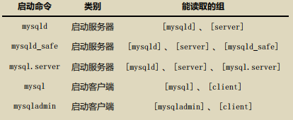
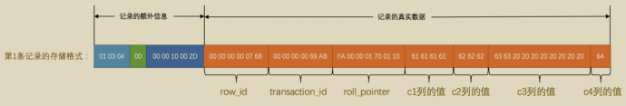
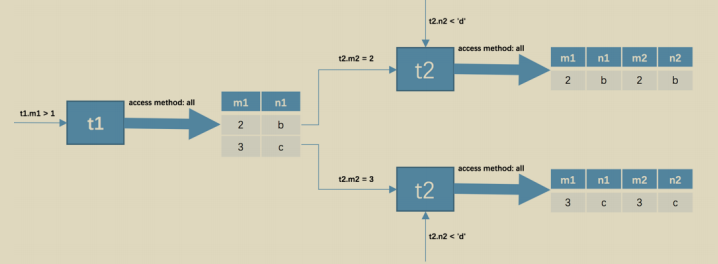

# MySQL是怎样运行的：从根儿上理解MySQL 笔记

- [ ] 书籍作者: [小孩子4919](https://book.douban.com/search/小孩子4919)
- [ ] 笔记时间: 2021.01.01

## 第0章 如何愉快的阅读本小册

顺序阅读,非正经科学专注

>  ----启动MySQL-----------------
> mysqld --defaults-file=/etc/my.cnf &
> mysqld_safe --defaults-file=/etc/my.cnf --user=mysql &
> service mysql start
> /etc/init.d/mysql start
> mysqld_multi start #多实例
> net start mysql #Windows
>
> ----关闭MySQL---------------------
> mysqladmin -uroot -plhr -S /tmp/mysql3306.sock shutdown
> service mysql stop
> /etc/init.d/mysql stop
> mysqld_multi stop #多实例
> net stop mysql #Windows
>
> --杀死mysql------------------------
> killall mysqld
> killall -9 mysqld


## 第1章 装作自己是个小白-重新认识MySQL

### 1.1 MySQL的客户端/服务器架构

MySQL 服务器程序的进程也被称为 MySQL数据库实例，简称 数据库实例

 MySQL 服务器进程的默认名称为 mysqld，而我们常用的 MySQL 客户端进程的默认名称为 mysql 。 

### 1.2 MySQL的安装

[官网文档](https://dev.mysql.com/doc/mysql-installation-excerpt/5.7/en/general-installation-issues.html)

```shell
#安装 MySQL 服务端、核心程序
sudo apt-get install mysql-server

#安装 MySQL 客户端
sudo apt-get install mysql-client
```

##### 1.2.1 bin目录下的可执行文件

1. 数据库文件默认在： /usr/share/mysql
2. 配置文件默认在：/etc/my.cnf
3. 数据库目录：/var/lib/mysql/
4. 配置文件：/usr/share/mysql(mysql.server命令及配置文件)
5. 相关命令：/usr/bin
6. 启动脚本：/etc/rc.d/init.d/

### 1.3 启动MySQL服务器程序

#### 1.3.1 mysqld 

mysqld 这个可执行文件就代表着 MySQL 服务器程序，运行这个可执行文件就可以直接启动一个服务器进程。

#### 1.3.2 mysqld_safe

启动脚本，它会间接的调用 mysqld ，而且还顺便启动了另外一个监控进程，这个监控进程在服务器进程挂了的时候，可以帮助重启它

#### 1.3.3 mysql.server

mysql.server 也是一个启动脚本，它会间接的调用 mysqld_safe. mysql.server 文件其实是一个链接文件，它的实际文件是 *../support-files/mysql.server*

`mysql.server start/stop` 开启/关闭mysql

#### 1.3.4 mysqld_multi

mysql_multi 可执行文件可以对每一个服务器进程的启动或停止进行监控

### 1.4 启动MySQL客户端程序

`mysql -h主机名 -u用户名 -p密码` 连接MySQL服务器

#### 1.4.1 连接注意事项

- 最好不要在一行命令中输入密码
- 一行不要加空格

### 1.5 客户端与服务器连接的过程

本质上是一个进程间通信的过程,MySQL支持三种

#### 1.5.1 TCP/IP

默认3306,可以启动时候指定`mysqld -P3307`

`mysql -h127.0.0.1 -P3307 -uroot -p`进行连接

#### 1.5.2 命名管道和共享内存

Windows下

- 使用 命名管道 进行通信

  > 需要在启动服务器程序的命令中加上 --enable-named-pipe 参数，然后在启动客户端程序的命令中加入 --pipe 或者 --protocol=pipe 参数

- 使用 共享内存 来进行进程间通信

  > 在启动服务器程序的命令中加上 --shared-memory 参数，在成功启动服务器后， 共享内存 便成为本地客户端程序的默认连接方式，不过我们也可以在启动客户端程序的命令中加入 --protocol=memory 参数来显式的指定使用共享内存进行通信

##### 1.5.3 Unix域套接字文件

启动客户端程序的时候指定的主机名为 localhost ，或者指定了 --protocol=socket 的启动参数

MySQL 服务器程序默认监听的 Unix 域套接字文件路径为 /tmp/mysql.sock ，客户端程序也默认连接到这个Unix 域套接字文件

`mysql -hlocalhost -uroot --socket=/tmp/a.txt -p` 进行指定

### **1.6** 服务器处理客户端请求


#### 1.6.1 连接管理

线程与客户端连接一一对应,连接可以基于SSL

#### 1.6.2 解析与优化

##### **1.6.2.1** 查询缓存

缓存*不命中*情况有:

- 两次查询请求任何字符不同(大小写 空格 注释)
- 包含某些系统函数 自定义变量 和 函数 系统表

缓存*失效*情况有:

- MySQL的缓存系统会监测涉及到的每张表，只要该表的结构或者数据被修改

**!! 已经在MySQL8.0删除了**

##### 1.6.2.2 语法解析

词法分析 - 语法分析 - 提取条件到数据结构

##### **1.6.2.3** 查询优化

#### 1.6.3 存储引擎

真实存取数据的功能划分为 存储引擎 的功能

### 1.7 常用存储引擎

最常用的就是 InnoDB 和 MyISAM ，有时会提一下 Memory

### 1.8 关于存储引擎的一些操作

#### 1.8.1 查看当前服务器程序支持的存储引擎

`SHOW ENGINES;` 

#### 1.8.2 设置表的存储引擎

可以为不同的表设置不同的存储引擎

##### 1.8.2.1 创建表时指定存储引擎

```SQL
CREATE TABLE engine_demo_table(
i int
)ENGINE=MyISAM;
```

##### 1.8.2.2 修改表的存储引擎

`ALTER TABLE 表名 ENGINE = 存储引擎名称;`

`SHOW CREATE TABLE 表名\G` 查看表结构

## 第2章 MySQL的调控按钮-启动选项和系统变量

### 2.1 在命令行上使用选项

`mysqld --skip-networking` 禁用TCP/IP连接

#### 2.1.1 选项的长形式和短形式

-P端口 -p密码

### 2.2 配置文件中使用选项

#### 2.2.1 配置文件的路径

##### 2.2.1.2 类Unix操作系统中的配置文件

| 路径名              | 备注                                              |
| ------------------- | ------------------------------------------------- |
| /etc/my.cnf         |                                                   |
| /etc/mysql/my.cnf   |                                                   |
| SYSCONFDIR/my.cnf   | CMake 构建 MySQL 时使用 SYSCONFDIR 选项指定的目录 |
| $MYSQL_HOME/my.cnf  | MYSQL_HOME 是一个环境变量                         |
| defaults-extra-file |                                                   |
| ~/.my.cnf           |                                                   |
| ~/.mylogin.cnf      |                                                   |

#### 2.2.2 配置文件的内容

[组名]			-- 组名有server mysqld ....

(启动选项)	-- 使用长形式,没有--前缀,可以有空格



#### 2.2.3 特定MySQL版本的专用选项组

#### 2.2.4 配置文件的优先级

相同的启动选项，那以最后一个配置文件中的为准

#### 2.2.5 同一个配置文件中多个组的优先级

将以最后一个出现的组中的启动选项为准

#### 2.2.6 defaults-file的使用

`mysqld --defaults-file=/tmp/myconfig.txt`

使用`defaults-extra-file`可以指定额外的配置文件搜索路径

### 2.3 命令行和配置文件中启动选项的区别

两者同时出现,以命令行中的启动选项为准

### 2.4 系统变量

#### 2.4.1 系统变量简介

MySQL 服务器程序运行过程中会用到许多影响程序行为的变量，它们被称为 MySQL 系统变量

#### 2.4.2 查看系统变量

`SHOW VARIABLES [LIKE 匹配的模式];`

#### 2.4.3 设置系统变量

##### 2.4.3.1 通过启动选项设置

- 命令行
- 配置文件

##### 2.4.3.2 服务器程序运行过程中设置

值可以在服务器程序运行过程中进行动态修改而无需停止并重启服务器

- 设置不同作用范围的系统变量

  GLOBAL ：全局变量 

  SESSION ：会话变量

  `SET [GLOBAL|SESSION] 系统变量名 = 值;`

- 查看不同作用范围的系统变量

  `SHOW [GLOBAL|SESSION] VARIABLES [LIKE 匹配的模式];`

#### 2.4.4 启动选项和系统变量的区别

- 大部分的系统变量都可以被当作启动选项传入
- 有些系统变量是在程序运行过程中自动生成的，是不可以当作启动选项来设置
- 有些启动选项也不是系统变量

### 2.5 状态变量

值只能由服务器程序自己来设置,也有范围

`SHOW [GLOBAL|SESSION] STATUS [LIKE 匹配的模式];`

## 第3章 乱码的前世今生-字符集和比较规则

### 3.1 字符集和比较规则简介

### 3.2 MySQL中支持的字符集和排序规则

#### 3.2.1 MySQL中的utf8和utf8mb4

- utf8mb3 ：只使用1～3个字节表示字符,utf8的别名MySQL里面
- utf8mb4 ：使用1～4个字节表示字符

#### 3.2.2 字符集的查看

`SHOW (CHARACTER SET|CHARSET) [LIKE 匹配的模式];`

| 字符集名称      | Maxlen |
| --------------- | ------ |
| ascii \| latin1 | 1      |
| gbk \| gb2312   | 2      |
| utf8            | 3      |
| utf8mb4         | 4      |

#### 3.2.3 比较规则的查看

`SHOW COLLATION [LIKE 匹配的模式];`

每种字符集对应若干种比较规则，每种字符集都有一种默认的比较规则

### 3.3 字符集和比较规则的应用

#### 3.3.1 各级别的字符集和比较规则

##### 3.3.1.1 服务器级别

character_set_server  collation_server 

##### **3.3.1.2** 数据库级别

```SQL
CREATE DATABASE 数据库名
 [[DEFAULT] CHARACTER SET 字符集名称]
 [[DEFAULT] COLLATE 比较规则名称];
```

character_set_database   collation_database 这两个系统变量是只读的，我们不能通过修改这两个变量的值而改变当前数据库的字符集和比较规则

##### 3.3.1.3 表级别

把上面的 DATABASE 改成 TABLE 即可,默认使用数据库级别

##### 3.3.1.4 列级别

```sql
CREATE TABLE 表名(
 列名 字符串类型 [CHARACTER SET 字符集名称] [COLLATE 比较规则名称],
 其他列...
);
ALTER TABLE 表名 MODIFY 列名 字符串类型 [CHARACTER SET 字符集名称] [COLLATE 比较规则名称];
```

##### 3.3.1.5 仅修改字符集或仅修改比较规则

- 只修改字符集，则比较规则将变为修改后的字符集默认的比较规则。
- 只修改比较规则，则字符集将变为修改后的比较规则对应的字符集。

#### 3.3.2 客户端和服务器通信中的字符集

##### 3.3.2.1 编码和解码使用的字符集不一致的后果

乱码

##### 3.3.2.2 字符集转换的概念

##### 3.3.2.3 MySQL中字符集的转换

|                          |                                                              |
| ------------------------ | ------------------------------------------------------------ |
| 系统变量                 | 描述                                                         |
| character_set_client     | 服务器解码请求时使用的字符集                                 |
| character_set_connection | 服务器处理请求时会把请求字符串从 character_set_client 转为 character_set_connection |
| character_set_results    | 服务器向客户端返回数据时使用的字符集                         |


`SET NAMES 字符集名;` 进行统一编码设置

客户端配置 [client] 下 default-character-set=utf8

#### 3.3.3 比较规则的应用

不同规则排序结果不同

## 第4章 从一条记录说起-InnoDB记录结构

### 4.1 准备工作

真实数据在不同存储引擎中存放的格式一般是不同的

### 4.2 InnoDB页简介

将数据划分为若干个页，以页作为磁盘和内存之间交互的基本单位，InnoDB中页的大小一般为 **16** KB

### 4.3 InnoDB行格式

#### 4.3.1 指定行格式的语法

`CREATE TABLE 表名 (列的信息) ROW_FORMAT=行格式名称`

`ALTER TABLE 表名 ROW_FORMAT=行格式名称`

#### 4.3.2 COMPACT行格式


##### 4.3.2.1 记录的额外信息

###### 变长字段长度列表

将变长类型(VARCHAR之类的)的 真正数据内容 和 占用的字节数 记录下来

将列的真实长度使用头插法进行存储,所以是逆序

真实数据长度计算方法:

> 前置: W 代表 maxlen,字符集表示一个字符最长长度
>
> ​		M 代表VACHAR(M)最多存储M字符,大小 W*M
>
> ​		L 代表 实际存储字符串字节数是L

如果该可变字段允许存储的最大字节数（ M×W ）超过255字节并且真实存储的字节数（ L ）超过127字节，则使用2个字节，否则使用1个字节。

变长字段长度列表中只存储值为 非NULL 的列内容占用的长度，值为 NULL 的列的长度是不储存的

###### NULL值列表

1. 首先统计表中允许存储 NULL 的列有哪些。

   主键 | NOT NULL修饰 不可以是null的

2. 否则 使用二进制位进行对应,依旧是逆序
3. 规定NULL值列表必须是整字节


###### 记录头信息

5个字节组成


##### 4.3.2.2 记录的真实数据

会添加一些 隐藏列

| 列名        | 必须 | 占用(Byte) | 描述     |
| ----------- | ---- | ---------- | -------- |
| DB_ROW_ID   | 否   | 6          | 行ID     |
| DB_TRX_ID   | 是   | 6          | 事务ID   |
| DB_ROLL_PTR | 是   | 7          | 回滚指针 |

主键生成策略:

- 优先使用用户自定义主键作为主键
- 否则,选取一个 Unique 键作为主键
- 否则,添加隐藏列

注意点:

- CHAR(M)除真实数据以外的字节的统统都用空格字符填充
- NULL记录不会存储,已经记录在NULL列表了

##### 4.3.2.3 CHAR(M)列的存储格式

- 当列采用的是定长字符集时，该列占用的字节数不会被加到变长字段长度列表
- 如果采用变长字符集时，该列占用的字节数也会被加到变长字段长度列表

变长字符集的 CHAR(M) 类型的列要求至少占用 M 个字节，而 VARCHAR(M) 却没有这个要求.

- c1 c2 c3 c4 -> aaaa bbb cc d



#### 4.3.3 Redundant行格式

已经弃用


- 字段长度偏移列表

  记录所有列,逆序;采用两个相邻数值的差值来计算各个列值的长度(字段长度偏移列表 实质上是存储每个列中的值占用的空间在 记录的真实数据 处结束的位置)

- 记录头信息 6 字节

  > - 1byte_offs_flag 区分1B还是2B表示偏移
  >   - 当记录的真实数据占用的字节数不大于127 => 1字节
  >   - 当记录的真实数据占用的字节数大于127，但不大于32767 =>每个列2字节
  >   - 更大放到溢出页
  > - NULL 值的处理
  >   -  将列对应的偏移量值的第一个比特位作为是否为 NULL 的依据，该比特位也可以被称之为 NULL比特位
  >   - 定长会记录NULL,用0x00填充
  >   - 变长NULL不记录

##### 4.3.3.1 CHAR(M)列的存储格式

占用的真实数据空间就是该字符集表示一个字符最多需要的字节数和 M 的乘积

#### 4.3.4 行溢出数据

##### 4.3.4.1 VARCHAR(M)最多能存储的数据

对于 VARCHAR(M) 类型的列最多可以占用 65535 个字节

 MySQL 对一条记录占用的最大存储空间是有限制的，除了 BLOB 或者 TEXT 类型的列之外，其他所有的列（不包括隐藏列和记录头信息）占用的字节长度加起来不能超过 65535 个字节的

这里还包括 变长列表 NULL列表,假如采用变长字符集,取最多表示长度

##### 4.3.4.2 记录中的数据太多产生的溢出

在 Compact 和 Reduntant 行格式中，数据过大使用如下格式


不只是 **VARCHAR(M)** 类型的列，其他的 **TEXT**、**BLOB** 类型的列在存储数据非常多的时候也会发生

##### 4.3.4.3 行溢出的临界点

MySQL规定 : 一个页中至少存放两行记录

- 除了记录外,页需要 136字节 附加信息
- 每个记录需要 27字节 额外信息

针对一个列的情况可以得到行溢出临界点:

 136 + 2*(27+n)>16384 ===> n>8089

重点就是：你不用关注这个临界点是什么，只要知道如果我们想一个行中存储了很大的数据时，可能发生 *行溢出* 的现象

#### 4.3.5 Dynamic和Compressed行格式

和 Compact 差别在这里


Compressed 顾名思义采用压缩算法对页面进行压缩

##  第5章 盛放记录的大盒子-InnoDB数据页结构

### 5.1 不同类型的页简介

存放记录的页为索引页

### 5.2 数据页结构的快速浏览


### 5.3 记录在页中的存储

记录插入到 User Record ,每次都是从Free Space划过去,有点像数组栈 

#### 5.3.1 记录头信息的秘密

记录的头部信息

| 名称         | 大小(bit) | 描述                                                         |
| ------------ | --------- | ------------------------------------------------------------ |
| 预留位1      | 1         | 没有使用                                                     |
| 预留位2      | 1         | 没有使用                                                     |
| delete_mask  | 1         | 标记该记录是否被删除                                         |
| min_rec_mask | 1         | B+树的每层非叶子节点中的最小记录都会添加该标记               |
| n_owned      | 4         | 表示当前记录拥有的记录数                                     |
| heap_no      | 13        | 表示当前记录在记录堆的位置信息                               |
| record_type  | 3         | 表示当前记录的类型， 0 表示普通记录， 1 表示B+树非叶节点记录， 2 表示最小记录， 3表示最大记录 |
| next_record  | 16        | 表示下一条记录的相对位置                                     |

- delete_mask

  所有被删除掉的记录都会组成一个所谓的 垃圾链表 ，在这个链表中的记录占用的空间称之为所谓的 可重用空间,可以被覆盖

- heap_no

  InnoDB 自动插入两个伪记录,对应的heap_no为0和1,分别代表最小和最大记录

  记录大小比较默认是 主键的比较

  

  

- next_record

  从当前记录的真实数据到下一条记录的真实数据的地址偏移量,下一条数据是按照主键值自然排序的下一条.

  

  > netx_record这个位置十分巧妙,正向是真实数据,逆向是头部记录(内容都是逆序存储)
  >
  > 当数据页中存在多条被删除掉的记录时，这些记录的next_record属性将会把这些被删除掉的记录组成一个垃圾链表，以备之后重用这部分存储空间

总结: 

​	不论我们怎么对页中的记录做增删改操作，InnoDB始终会维护一条记录的**单链表**，链表中的各个节点是按照主键值由小到大的顺序连接起来的

### 5.4 Page Directory（页目录）

将每个组的最后一条记录的地址偏移量单独提取出来按顺序存储到靠近 页 的尾部的地方，这个地方就是所谓的 Page Directory ，也就是 页目录

分组规则: 对于最小记录所在的分组只能有 **1** 条记录，最大记录所在的分组拥有的记录条数只能在 **1~8** 条之间，剩下的分组中记录的条数范围只能在是 **4~8** 条之间(基本就是添加到一个组到8个之后再分裂)

对页目录进行 二分查找 确定组,之后线性遍历即可


### 5.5 Page Header（页面头部）


### 5.6 File Header（文件头部）


- FIL_PAGE_OFFSET

  InnoDB 通过页号来可以唯一定位一个 页

### 5.7 File Trailer

验证完整性

- 前4个字节代表页的校验和
- 后4个字节代表页面被最后修改时对应的日志序列位置（LSN）

## 第6章 快速查询的秘籍-B+树索引


### 6.1 没有索引的查找

`SELECT [列名列表] FROM 表名 WHERE 列名 = xxx;`

#### 6.1.1 在一个页中的查找

- 以主键为搜索条件

  二分法定位槽,组里顺序查找

- 以其他列作为搜索条件

  顺序查找

#### 6.1.2 在很多页中查找

顺序遍历页

> 我的问题: 页里面有slot,管理很多页也使用slot不可以吗?

### 6.2 索引

之前记录的头部信息里面有一个字段 record_type 这时候就要用上了

#### 6.2.1 一个简单的索引方案

这里是为了引入而使用的简单案例

- 下一个页数据用户记录主键值大于上一个页的(插入排序)
- 记录页主键最小值(key) 和 页的目录


这个目录叫做索引,看起来就是 多叉树

#### 6.2.2 InnoDB中的索引方案

上面方案的缺点:

- 页是InnoDB基本单位,16KB是存不下几个亿的数据量(分多个页)
- 修改代价巨大(使用链表)

统一结构: 将目录项用 record_type 标识(索引是1 普通是0)

索引记录只有主键值和页的编号两列 (没有隐藏列)

min_rec_mask 只有在目录项主键最小值


 抽象一下可以看出是 B+ 树,数据全在 叶子结点

##### 6.2.2.1 聚簇索引

把具有以下两种特性的 B+ 树称为 聚簇索引(正经B+树没有兄弟节点之间的连接): 

- 使用记录主键值的大小进行记录和页的排序(记录单向链表,页双向链表)
- B+ 树的叶子节点存储的是完整的用户记录(就是有隐藏列等信息的)

InnoDB 存储引擎会自动的为我们创建聚簇索引,聚簇索引 就是数据的存储方式(结构相同),索引即数据，数据即索引

##### 6.2.2.2 二级索引

聚簇索引 只能在搜索条件是主键值时才能发挥作用，因为 B+ 树中的数据都是按照主键进行排序的; 也可以通过其他键建立索引


同聚簇索引的差别:

- 使用记录 c2 列的大小进行记录和页的排序
  - 页内大小按c2排序
  - 页记录按c2排序
  - 不同层次也是

- B+ 树的叶子节点存储的只是 c2列+主键 这两个列的值

- 目录项记录中变成了 c2列+页号 的搭配

查找过程:

- 确定 记录所在页
- 在真实存储用户记录的页中定位到具体的记录
- 必须再根据主键值去聚簇索引中再查找一遍完整的用户记录 称为 回表

> 因为这种按照 非主键列 建立的 B+ 树需要一次 回表 操作才可以定位到完整的用户记录，所以这种 B+ 树也被称为 二级索引 （secondary index ），或者 辅助索引 。由于我们使用的是 c2 列的大小作为 B+ 树的排序规则，所以我们也称这个 B+ 树为为c2列建立的索引

**联合索引**

同时以多个列的大小作为排序规则,

- 每条 目录项记录 都由 c2 、 c3 、 页号 这三个部分组成
- B+ 树叶子节点处的用户记录由 c2 、 c3 和主键 c1 列组成


#### 6.2.3 InnoDB的B+树索引的注意事项

##### 6.2.3.1 根页面万年不动窝

B+树形成过程:

- 每当为某个表创建一个 B+ 树索引（聚簇索引不是人为创建的，默认就有）的时候，都会为这个索引创建一个 根节点 页面
- 随后向表中插入用户记录时，先把用户记录存储到这个 根节点 中
- 记录过多就会先进行复制,然后新页会 页分裂,根节点升级为索引

一个B+树索引的根节点自诞生之日起，便不会再移动

##### 6.2.3.2 内节点中目录项记录的唯一性

需要保证在B+树的同一层内节点的目录项记录除 页号 这个字段以外是唯一的。所以对于二级索引的内节点的目录项记录的内容实际上是由三个部分构成的：

- 索引列的值

- 主键值

- 页号

##### 6.2.3.3 一个页面最少存储2条记录

如果不存储至少2条记录，则这个B+树是没有意义的，形不成一个有效的索引

#### 6.2.4 MyISAM中的索引方案简单介绍

将索引和数据分开存储：

- 将表中的记录按照记录的插入顺序单独存储在一个文件中，称之为 数据文件


- 使用 MyISAM 存储引擎的表会把索引信息另外存储到一个称为 索引文件 的另一个文件中,存储的是主键加行号(全部是 二级索引)

#### 6.2.5 MySQL中创建和删除索引的语句

InnoDB 和 MyISAM 会自动为主键或者声明为 UNIQUE 的列去自动建立 B+ 树索引

```SQL
CREATE TALBE 表名 (
 各种列的信息 ··· , 
 [KEY|INDEX] 索引名 (需要被索引的单个列或多个列),
 INDEX idx_c2_c3 (c2, c3)
)
ALTER TABLE 表名 ADD [INDEX|KEY] 索引名 (需要被索引的单个列或多个列);
```

## 第7章 好东西也得先学会怎么用-B+树索引的使用

- 每个索引都对应一棵 B+ 树,叶子结点是用户记录,内节点都是索引
- InnoDB 存储引擎会自动为主键建立 聚簇索引,叶子是完整用户记录
- 二级索引 叶子节点是由 索引列 + 主键 组成.

- B+ 树中每层节点都是按照索引列值从小到大的顺序排序而组成了双向链表，而且每个页内的记录都是按照索引列的值从小到大的顺序而形成了一个单链表。
- 通过索引查找记录是从 B+ 树的根节点开始，一层一层向下搜索。

### 7.1 索引的代价

- 空间上的代价

- 时间上的代价

  主要是对索引的维护

### 7.2 B+树索引适用的条件

```SQL
CREATE TABLE person_info(
 id INT NOT NULL auto_increment,
 name VARCHAR(100) NOT NULL,
 birthday DATE NOT NULL,
 phone_number CHAR(11) NOT NULL,
 country varchar(100) NOT NULL,
 PRIMARY KEY (id),
 KEY idx_name_birthday_phone_number (name, birthday, phone_number)
);
```


#### 7.2.1 全值匹配

搜索条件中的列和索引列一致,顺序无所谓,查询优化器会处理

```sql
SELECT * FROM person_info WHERE name = 'Ashburn' AND birthday = '1990-09-27' AND phone_number = '15123983239';
```

#### 7.2.2 匹配左边的列(前缀)

联合索引一定要符合前缀,排列规则可以推出

```sql
SELECT * FROM person_info WHERE name = 'Ashburn';
```

#### 7.2.3 匹配列前缀

单列的匹配符合字典序,所以只使用 前缀n个字符也可以

```sql
SELECT * FROM person_info WHERE name LIKE 'As%';
```

假如需要查询后缀可以存储的时候逆序存储

#### 7.2.4 匹配范围值

如果对多个列同时进行范围查找的话，只有对索引最左边的那个列进行范围查找的时候才能用到 B+ 树索引

因为索引只有第一列相同才会比较第二列

```SQL
SELECT * FROM person_info WHERE name > 'Asa' AND name < 'Barlow' AND birthday > '1980-01-01';
```

#### 7.2.5 精确匹配某一列并范围匹配另外一列

```sql
SELECT * FROM person_info WHERE name = 'Ashburn' AND birthday > '1980-01-01' AND birthday < '2000-12-31' AND phone_number > '15100000000';
```

原理同上

#### 7.2.6 用于排序

MySQL把排序统称为 文件排序,但是 order by用到索引列的话,可以加速,原因本身存储就是有序的

```sql
SELECT * FROM person_info ORDER BY name, birthday, phone_number LIMIT 10;
```

##### 7.2.6.1 使用联合索引进行排序注意事项

ORDER BY 的子句后边的列的顺序也必须按照索引列的顺序给出

当联合索引左边列的值为常量，也可以使用后边的列进行排序

```sql
SELECT * FROM person_info WHERE name = 'A' ORDER BY birthday, phone_number LIMIT 10;
```

##### 7.2.6.2 不可以使用索引进行排序的几种情况

- ASC、DESC混用 不能高效利用索引
- WHERE 子句中出现非排序使用到的索引列

- 排序列包含非同一个索引的列

- 排序列使用了复杂的表达式

  ​		要想使用索引进行排序操作，必须保证索引列是以单独列的形式出现，而不是修饰过的形式

  ```sql
  SELECT * FROM person_info ORDER BY UPPER(name) LIMIT 10;
  ```

#### 7.2.7 用于分组

```sql
SELECT name, birthday, phone_number, COUNT(*) FROM person_info GROUP BY name, birthday, phone_number
```

和排序注意事项一致

### 7.3 回表的代价

```sql
SELECT * FROM person_info WHERE name > 'Asa' AND name < 'Barlow';
```

1. 根据索引查询 用户记录(范围内)
2. 回表,查询完整记录

记录在磁盘中的存储是相连的，集中分布在一个或几个数据页中,称为 顺序I/O

相对的,分布在不同数据页称为 随机I/O

访问二级索引使用 顺序I/O ，访问聚簇索引使用 随机I/O,需要回表的记录越多，使用二级索引的性能就越低

查询优化器会事先对表中的记录计算一些统计数据，然后再利用这些统计数据根据查询的条件来计算一下需要回表的记录数，需要回表的记录数越多，就越倾向于使用全表扫描，反之倾向于使用 二级索引 + 回表 的方式。

#### 7.3.1 覆盖索引

最好在查询列表里只包含索引列,称为 索引覆盖;排序也是;

不鼓励用 * 号作为查询列表，最好把我们需要查询的列依次标明

### 7.4 如何挑选索引

#### 7.4.1 只为用于搜索、排序或分组的列创建索引

只为出现在 WHERE 子句中的列、连接子句中的连接列，或者出现在 ORDER BY 或 GROUP BY 子句中的列创建索引

#### 7.4.2 考虑列的基数

列的基数 指的是某一列中不重复数据的个数

最好为那些列的基数大的列建立索引，为基数太小列的建立索引效果可能不好。

#### 7.4.3 索引列的类型尽量小

- 数据类型越小，在查询时进行的比较操作越快
- 数据类型越小，索引占用的存储空间就越少，在一个数据页内就可以放下更多的记录，从而减少磁盘 I/O 带来的性能损耗

#### 7.4.4 索引字符串值的前缀

只对字符串的前几个字符进行索引,查找记录时虽然不能精确的定位到记录的位置，但是能定位到相应前缀所在的位置，然后根据前缀相同的记录的主键值回表查询完整的字符串值

只索引字符串值的前缀的策略是我们非常鼓励的，尤其是在字符串类型能存储的字符比较多的时候

##### 7.4.4.1 索引列前缀对排序的影响

使用索引列前缀的方式无法支持使用索引排序

#### 7.4.5 让索引列在比较表达式中单独出现

1. WHERE my_col * 2 < 4
2. WHERE my_col < 4/2

前者用不到索引

#### 7.4.6 主键插入顺序

让主键具有 AUTO_INCREMENT ，让存储引擎自己为表生成主键，而不是我们手动插入

#### 7.4.7 冗余和重复索引

主键本身就会生成聚簇索引，所以定义的唯一索引和普通索引是重复的，这种情况要避免

## 第8章 数据的家-MySQL的数据目录

### 8.1 数据库和文件系统的关系

InnoDB 、 MyISAM 这样的存储引擎都是把表存储在文件系统上的

### 8.2 MySQL数据目录

#### 8.2.1 数据目录和安装目录的区别

存储表文件的地方

#### 8.2.2 如何确定MySQL中的数据目录

```sql
SHOW VARIABLES LIKE 'datadir';
```

### 8.3 数据目录的结构

#### 8.3.1 数据库在文件系统中的表示

- 数据库都会在 datadir 目录下有一个文件夹
- 文件夹里有db.opt文件

#### 8.3.2 表在文件系统中的表示

- 表结构

  建表语句,文件 表明.frm (8.0取消了)

- 表数据

这个后缀名为.frm是以二进制格式存储的，我们直接打开会是乱码的

##### 8.3.2.1 InnoDB是如何存储表数据的

表空间是一个抽象的概念，它可以对应文件系统上一个或多个真实文件

- 系统表空间（system tablespace）----ibdata1 文件

  ```txt
  # 修改配置
  [server]  
  innodb_data_file_path=data1:512M;data2:512M:autoextend
  ```

- 独立表空间(file-per-table tablespace)---表名.ibd

  ```txt
  [server]
  innodb_file_per_table=0 #0是系统表空间,1是独立表空间
  ```

- 其他类型的表空间

##### 8.3.2.2 MyISAM是如何存储表数据的

test.frm--表格式		test.MYD--表数据   test.MYI--表索引

#### 8.3.3 视图在文件系统中的表示

只需要把它的结构存储起来就行了

#### 8.3.4 其他的文件

- 服务器进程文件。
- 服务器日志文件。
  常规的查询日志、错误日志、二进制日志、redo日志...
- 默认/自动生成的SSL和RSA证书和密钥文件

### 8.4 文件系统对数据库的影响

文件大小 名称等都受到文件系统的限制

 MySQL 会把数据库名和表名中所有除数字和拉丁字母以外的所有字符在文件名里都映射成 @+编码值 的形式作为文件名。

### 8.5 MySQL系统数据库简介

- mysql

  它存储了MySQL的用户账户和权限信息，一些存储过程、事件的定义信息，一些运行过程中产生的日志信息，一些帮助信息以及时区信息等。

- information_schema

  这个数据库保存着MySQL服务器维护的所有其他数据库的信息，比如有哪些表、哪些视图、哪些触发器、哪些列、哪些索引...。这些信息并不是真实的用户数据，而是一些描述性信息，有时候也称之为元数据。

- performance_schema

  这个数据库里主要保存MySQL服务器运行过程中的一些状态信息，算是对MySQL服务器的一个性能监控。包括统计最近执行了哪些语句，在执行过程的每个阶段都花费了多长时间，内存的使用情况等等信息。

- sys

  这个数据库主要是通过视图的形式把 information_schema 和 performance_schema 结合起来，让程序员可以更方便的了解MySQL服务器的一些性能信息。

## 第9章 存放页面的大池子-InnoDB的表空间

### 9.1 回忆一些旧知识

#### 9.1.1 页面类型


#### 9.1.2 页面通用部分

- File Header ：记录页面的一些通用信息
- File Trailer ：校验页是否完整，保证从内存到磁盘刷新时内容的一致性

表空间中的每一个页都对应着一个页号,FIL_PAGE_OFFSET都是唯一的,一个表空间最多支持64TB的数据(16KB * 2^32^)

### 9.2 独立表空间结构

#### 9.2.1 区（extent）的概念


- extend 0 最开始的3个页面的类型是固定的
  - FSP_HDR 类型：用来登记整个表空间的一些整体属性以及本组所有的 区 ，整个表空间只有一个 FSP_HDR 类型的页面。
  - IBUF_BITMAP 类型：存储本组所有的区的所有页面关于 INSERT BUFFER 的信息。
  - INODE 类型：存储了许多称为 INODE 的数据结构
- 其余各组最开始的2个页面的类型是固定的
  - XDES 类型：全称是 extent descriptor ，用来登记本组256个区的属性
  - IBUF_BITMAP同上

#### 9.2.2 段（segment）的概念

 随机I/O 是非常慢的，所以我们应该尽量让链表中相邻的页的物理位置也相邻，这样进行范围查询的时候才可以使用所谓的 顺序I/O 。

一个区就是在物理位置上连续的64个页,在表中数据量大的时候，采用区进行分配

一个索引会生成2个段，叶子节点段和非叶子节点段,段的分配单位是区;

段的定义是 某些零散的页面以及一些完整的区的集合

碎片区中，并不是所有的页都是为了存储同一个段的数据而存在的

- 在刚开始向表中插入数据的时候，段是从某个碎片区以单个页面为单位来分配存储空间的。
- 当某个段已经占用了32个碎片区页面之后，就会以完整的区为单位来分配存储空间。

#### 9.2.3 区的分类


 

Page State Bitmap 

一个区默认有64个页，这128个比特位被划分为64个部分，每个部分2个比特位，对应区中的一个页.第一个位表示对应的页是否是空闲的，第二个比特位还没有用。

##### 9.2.3.1 XDES Entry链表

- 数据少,查找剩余碎片区(没有就申请)并放入

  List Node 部分会形成 FREE 区链表,同理 FREE_FRAG等

- 占32个页,申请完整区

  段里区的XDES Entry维护三个链表:

  - FREE: 段里页面都是空闲的区
  - NOT_FULL
  - FULL

举例 : 一张表有两条索引,那么就是一个表空间里面有 四个段,对应12条链表,加上表空间的 3条 ,共15条链表

##### 9.2.3.2 链表基节点

放置在表空间中固定的位置


#### 9.2.4 段的结构

段都定义了一个 INODE Entry 结构来记录一下段中的属性


- Magic Number 标记这个 INODE Entry 是否已经被初始化了(97937874 标识已经初始化)

#### 9.2.5 各类型页面详细情况

##### 9.2.5.1 FSP_HDR 类型


- File Space Header部分

  是用来存储表空间的一些整体属性

  

  - FREE Limit

    该字段表示的页号之前的区都被初始化,之后的区尚未被初始化

  - Next Unused Segment ID

    表明当前表空间中最大的段ID的下一个ID

  - List Base Node for SEG_INODES_FULL List 和 List Base Node for SEG_INODES_FREE List

    每个段对应的 INODE Entry 结构会集中存放到一个类型为 INODE 的页中,页形成链表

- XDES Entry部分

  XDES Entry 0 就对应着 extent 0

##### 9.2.5.2 XDES 类型

每组开头的一个页面记录着本组内所有的区对应的 XDES Entry 结构


##### 9.2.5.3 IBUF_BITMAP 类型

##### 9.2.5.4 INODE 类型

存储 INODE Entry 结构(管理段的)


- SEG_INODES_FULL 链表：该链表中的 INODE 类型的页面中已经没有空闲空间来存储额外的 INODE Entry 结构了。

- SEG_INODES_FREE 链表：该链表中的 INODE 类型的页面中还有空闲空间来存储额外的 INODE Entry 结构了。

基节点就存储在 File Space Header 里边

#### 9.2.6 Segment Header 结构的运用 

INDEX 类型的页时有一个 Page Header 部分,里面PAGE_BTR_SEG_LEAF 和 

PAGE_BTR_SEG_TOP 都占用10个字节，它们其实对应一个叫 Segment Header 的结构

只需要在索引的根页面中记录这两个结构即可


#### 9.2.7 真实表空间对应的文件大小

.ibd 文件会随着数据增大而增大

### 9.3 系统表空间

 表空间 ID （Space ID）是 0

#### 9.3.1 系统表空间的整体结构


系统表空间的 extent 1 和 extent 2 这两个区，也就是页号从 64 ~ 191这128个页面被称为 Doublewrite buffer ，也就是双写缓冲区


##### 9.3.1.1 InnoDB数据字典

InnoDB存储引擎特意定义了一些列的内部系统表（internal system table）来记录这些这些 元数据 ：


前四个称之为基本系统表

- SYS_TABLES 记录表的ID 类型 空间ID 列数等 两个索引
- SYS_COLUMNS 列的详细信息 一个聚簇索引 (TABLE_ID, ID)
- SYS_INDEXES  (TABLE_ID, ID) 列为主键的聚簇索引
- SYS_FIELDS  (INDEX_ID, POS) 列为主键的聚簇索引

页号为 7 的页面，类型为 SYS ，记录了 Data Dictionary Header ，也就是数据字典的头部信息


- Max Row ID ：InnoDB 存储引擎会默认为我们生成一个名为 row_id 的列作为主键,使用MaxRowID+1作为主键值
- Root of SYS_TABLES clust index ：本字段代表 SYS_TABLES 表聚簇索引的根页面的页号。

information_schema系统数据库

​	information_schema 中提供了一些以 innodb_sys 开头的表

#### 9.3.2 总结图


## 第10章 条条大路通罗马-单表访问方法

 查询优化器优化的结果就是生成一个所谓的 执行计划

### 10.1 访问方法（access method）的概念

查询的执行方式:

- 使用全表扫描进行查询
- 使用索引进行查询
  - 针对主键或唯一二级索引的等值查询
  - 针对普通二级索引的等值查询
  - 针对索引列的范围查询
  - 直接扫描整个索引

MySQL 执行查询语句的方式称之为 访问方法

### 10.2 const

 const 访问方法只能在主键列或者唯一二级索引列和一个常数进行等值比较时才有效，如果主键或者Unique索引是由多个列构成的话，索引中的每一个列都需要与常数进行等值比较，这个const 访问方法才有效


### 10.3 ref

普通二级索引并不限制索引列值的唯一性，所以可能找到多条对应的记录

- 二级索引列值为 NULL 的情况

  Unique索引也是只能使用ref方式

- 对于某个包含多个索引列的二级索引来说，只要是最左边的连续索引列是与常数的等值比较就可能采用 ref 的访问方法


### 10.4 ref_or_null

某个二级索引列不仅是常数记录还包括NULL


### 10.5 range

利用索引进行范围匹配的访问方法称之为： range 

### 10.6 index

遍历二级索引记录

### 10.7 all

直接扫描聚簇索引

### 10.8 注意事项

#### 10.8.1 重温 二级索引 + 回表

一般情况下只能利用单个二级索引执行查询

#### 10.8.2 明确range访问方法使用的范围区间

##### 10.8.2.1 所有搜索条件都可以使用某个索引的情况

使用同一个索引

##### 10.8.2.2 有的搜索条件无法使用索引的情况

使用不同的索引确定区间,用TRUE替换没有用到的条件,

一个使用到索引的搜索条件和没有使用该索引的搜索条件使用 OR 连接起来后是无法使用该索引的。

##### 10.8.2.3 复杂搜索条件下找出范围匹配的区间

#### 10.8.3 索引合并

使用到多个索引来完成一次查询的执行方法称之为： index merge

##### 10.8.3.1 Intersection合并

某个查询可以使用多个二级索引，将从多个二级索引中查询到的结果取交集

触发条件:

- 二级索引列是等值匹配的情况，对于联合索引来说，在联合索引中的每个列都必须等值匹配，不能出现只出现匹配部分列的情况。
- 主键列可以是范围匹配

原理是 根据主键求交集

##### 10.8.3.2 Union合并

触发条件同上,加上一条 也可以是Intersection合并的

Union 索引合并的使用条件太苛刻,必须保证各个二级索引列在进行等值匹配的条件下才可能被用到

##### 10.8.3.3 Sort-Union合并

先按照二级索引记录的主键值进行排序，之后按照 Union 索引合并方式执行的方式称之为 SortUnion 索引合并

##### 10.8.3.4 索引合并注意事项

##### 10.8.3.5 联合索引替代Intersection索引合并

## 第11章 两个表的亲密接触-连接的原理

### 11.1 连接简介

#### 11.1.1 连接的本质

笛卡尔乘积

#### 11.1.2 连接过程简介

- 涉及单表的过滤条件 也成为搜索条件
- 涉及两表的条件

携带过滤条件的连接查询的大致执行过程:

1. 确定第一个需要查询的表，这个表称之为 驱动表,使用单表访问方式(上一章)

2. 从驱动表产生的结果集中的每一条记录，过滤条件的记录

   其他表也就称为 被驱动表

两表连接查询中，驱动表只需要访问一次，被驱动表可能被访问多次



#### 11.1.3 内连接和外连接

-  内连接 的两个表,在被驱动表中找不到匹配的记录,不会加入到结果集
- 外连接会加入到结果集(分为左右外连接,取决于哪一侧为驱动表)

过滤条件:

- where 两种连接都可以
- on 外连接驱动表会加入结果

ON 子句中的过滤条件也称之为 连接条件

##### 11.1.3.1 左（外）连接的语法

```sql
SELECT * FROM t1 LEFT [OUTER] JOIN t2 ON 连接条件 [WHERE 普通过滤条件];
```

必须使用 ON 子句来指出连接条件

##### 11.1.3.2 右（外）连接的语法

##### 11.1.3.3 内连接的语法

```sql
SELECT * FROM t1 [INNER | CROSS] JOIN t2 [ON 连接条件] [WHERE 普通过滤条件];
```

### 11.2 连接的原理

#### 11.2.1 嵌套循环连接（Nested-Loop Join）

驱动表只访问一次，但被驱动表却可能被多次访问，访问次数取决于对驱动表执行单表查询后的结果集中的记录条数的连接执行方式称之为 嵌套循环连接

#### 11.2.2 使用索引加快连接速度

不要使用 * 作为查询列表，最好把真实用到的列作为查询列表

#### 11.2.3 基于块的嵌套循环连接（Block Nested-Loop Join）

 join buffer 就是执行连接查询前申请的一块固定大小的内存，先把若干条驱动表结果集中的记录装在这个 join buffer 中，然后开始扫描被驱动表，每一条被驱动表的记录一次性和 join buffer 中的多条驱动表记录做匹配


## 第12章 谁最便宜就选谁-MySQL基于成本的优化

### 12.1 什么是成本

- I/O 成本

  从磁盘到内存这个加载的过程损耗的时间称之为 I/O 成本.读取一个页面成本为 1.0

- CPU 成本

  读取以及检测记录是否满足对应的搜索条件、对结果集进行排序等这些操作损耗的时间称之为 CPU 成本。读取及检测一条记录成本为0.2

### 12.2 单表查询的成本

#### 12.2.1 准备工作

```sql
CREATE TABLE single_table (
 id INT NOT NULL AUTO_INCREMENT,
 key1 VARCHAR(100),
 key2 INT,
 key3 VARCHAR(100),
 key_part1 VARCHAR(100),
 key_part2 VARCHAR(100),
 key_part3 VARCHAR(100),
 common_field VARCHAR(100),
 PRIMARY KEY (id),
 KEY idx_key1 (key1),
 UNIQUE KEY idx_key2 (key2),
 KEY idx_key3 (key3),
 KEY idx_key_part(key_part1, key_part2, key_part3)
) Engine=InnoDB CHARSET=utf8;
```


#### 12.2.2 基于成本的优化步骤

MySQL 的查询优化器会找出执行该语句所有可能使用的方案,对比之后找出成本最低的方案，就是所谓的 执行计划 ，之后才会调用存储引擎提供的接口真正的执行查询

1. 根据搜索条件，找出所有可能使用的索引

2. 计算全表扫描的代价

3. 计算使用不同索引执行查询的代价

4. 对比各种执行方案的代价，找出成本最低的那一个

```sql
SELECT * FROM single_table WHERE 
 key1 IN ('a', 'b', 'c') AND 
 key2 > 10 AND key2 < 1000 AND 
 key3 > key2 AND 
 key_part1 LIKE '%hello%' AND
 common_field = '123';
```

##### 12.2.2.1 根据搜索条件，找出所有可能使用的索引

把一个查询中可能使用到的索引称之为 possible keys 。

##### 12.2.2.2 计算全表扫描的代价

维护每个表维护了一系列的 统计信息

```sql
 SHOW TABLE STATUS LIKE 'single_table'\G
```

- Rows 记录条数
- Data_length 表占用的存储空间字节数

所以成本为:

- IO = Data_length/16/1026 * 1.0 + 1.1
- CPU = Rows * 0.2 + 1.0

##### 12.2.2.3 计算使用不同索引执行查询的代价

MySQL 查询优化器先分析使用唯一二级索引的成本，再分析使用普通索引的成本

- 使用 Unique Index 执行查询的成本分析

  - 范围区间查询为就认为一个页面

  - 需要回表的记录数

    读取最左/右记录数,相距不远就直接统计;否则沿最左记录读十个页面取记录均值,之后乘以页面数

    CPU成本 = 记录数*0.2+0.01

    - 回表成本:回表一次等于一个页面

      IO成本 = 记录数*1.0 + 1.0

    - 再检测其他搜索条件是否成立

      CPU成本 = 记录数*0.2

- 使用聚簇索引执行查询的成本分析:同上
- 是否有可能使用索引合并

#### 12.2.3 基于索引统计数据的成本计算

通过直接访问索引对应的 B+ 树来计算某个范围区间对应的索引记录条数的方式称之为 index dive

 eq_range_index_dive_limit,超过就使用所谓的 索引统计数据 来进行估算

```sql
# 查看索引属性
SHOW INDEX FROM single_table;
```

- Cardinality 基数,是一个估计值，并不是精确的
- Rows / Cardinality = 重复次数,所以回表次数估计值 = 重复次数*范围内参数数

当你的查询中使用到了IN查询，但是却实际没有用到索引，就
应该考虑一下是不是由于 eq_range_index_dive_limit 值太小导致的。

### 12.3 连接查询的成本

#### 12.3.1 准备工作

复制single_table一份

#### 12.3.2 Condition filtering介绍

连接成本有两个部分构成:

- 驱动表单词查询成本: 记录数称为扇出

  计算驱动表扇出值时需要靠 猜:

  - 全表扫描 需要猜符合的扇出
  - 索引需要猜满足其他搜索条件的扇出数

  这个 猜 的过程称之为 condition filtering 

- 多次被动表成本

#### 12.3.3 两表连接的成本分析

连接查询总成本 = 单次访问驱动表的成本 + 驱动表扇出数 x 单次访问被驱动表的成本

优化连接就是 

- 减少扇出 
- 降低被驱动表访问成本--建立索引

#### 12.3.4 多表连接的成本分析

n表连接就要计算N!成本,显然是不可能的

- 提前结束某种顺序的成本评估
- 系统变量 optimizer_search_depth(设置一个表个数上限)
- 根据某些规则压根儿就不考虑某些连接顺序(启发式)

### 12.4 调节成本常数

- 读取一个页面花费的成本默认是 1.0

- 检测一条记录是否符合搜索条件的成本默认是 0.2

```sql
SHOW TABLES FROM mysql LIKE '%cost%';
```

#### 12.4.1 mysql.server_cost表

MySQL在执行诸如DISTINCT查询、分组查询、Union查询以及某些特殊条件下的排序查询都可能在内部先创建一个临时表,操作代价还是很高的

```sql
 UPDATE mysql.server_cost 
 SET cost_value = 0.4
 WHERE cost_name = 'row_evaluate_cost';

FLUSH OPTIMIZER_COSTS;
```

#### 12.4.2 mysql.engine_cost表

## 第13章 兵马未动，粮草先行-InnoDB统计数据是如何收 集的

### 13.1 两种不同的统计数据存储方式

- 永久性的统计数据 服务器重启还在
- 非永久性的统计数据 某些情境下重新收集

 innodb_stats_persistent 进行控制,默认OFF(5.6.6之前)

InnoDB 默认是以表为单位来收集和存储统计数据的

### 13.2 基于磁盘的永久性统计数据

```sql
SHOW TABLES FROM mysql LIKE 'innodb%';
```

#### 13.2.1 innodb_table_stats

都是估计值,记录数,索引占用页数等

##### 13.2.1.1 n_rows统计项的收集

- 按照一定算法（并不是纯粹随机的）选取几个叶子节点页面，计算每个页面中主键值记录数量，然后计算平均一个页面中主键值的记录数量乘以全部叶子节点的数量就算是该表的 n_rows 值。

 innodb_stats_persistent_sample_pages 的系统变量来控制使用永久性的统计数据时，计算统计数据时采样的页面数量

##### 13.2.1.2 clustered_index_size和sum_of_other_index_sizes统计项的收集

- 从数据字典里找到表的各个索引对应的根页面位置。
- 从根页面的 Page Header 里找到叶子节点段和非叶子节点段对应的 Segment Header
- 从叶子节点段和非叶子节点段的 Segment Header 中找到这两个段对应的 INODE Entry 结构

#### 13.2.2 innodb_index_stats

innodb_index_stats表的每条记录代表着一个索引的一个统计项

#### 13.2.3 定期更新统计数据

- 开启 innodb_stats_auto_recalc

  决定着服务器是否自动重新计算统计数据，它的默认值是 ON

  自动重新计算统计数据的过程是异步发生的，也就是即使表中变动的记录数超过了 10% ，自动重新计算统计数据也不会立即发生

- 手动调用 ANALYZE TABLE 语句来更新统计信息

  ANALYZE TABLE语句会立即重新计算统计数据，也就是这个过程是同步的

#### 13.2.4 手动更新 innodb_table_stats 和 innodb_index_stats 表

```sql
 UPDATE innodb_table_stats 
 SET n_rows = 1
 WHERE table_name = 'single_table';
 
 FLUSH TABLE single_table;
```

### 13.3 基于内存的非永久性统计数据

MySQL 查询优化器计算查询成本的时候依赖的是经常变化的
统计数据，也就会生成经常变化的执行计划

### 13.4 innodb_stats_method的使用

- nulls_equal ：认为所有 NULL 值都是相等的。默认值
- nulls_unequal ：认为所有 NULL 值都是不相等的。如果某个索引列中 NULL 值特别多的话，这种统计方式会让优化器认为某个列中平均一个值重复次数特别少，所以倾向于使用索引进行访问
- nulls_ignored ：直接把 NULL 值忽略掉。

正解: 不要存储NULL值

## 第14章 不好看就要多整容-MySQL基于规则的优化

查询重写 

### 14.1 条件化简

#### 14.1.1 移除不必要的括号

```sql
((a = 5 AND b = c) OR ((a > c) AND (c < 5)))
 # 优化
(a = 5 and b = c) OR (a > c AND c < 5)
```

#### 14.1.2 常量传递（constant_propagation）

```sql
a = 5 AND b > a
 # 优化
a = 5 AND b > 5
```

#### 14.1.3 等值传递（equality_propagation）

```sql
a = b and b = c and c = 5
# 这个表达式可以被简化为：
a = 5 and b = 5 and c = 5
```

#### 14.1.4 移除没用的条件（trivial_condition_removal）

```sql
(a < 1 and b = b) OR (a = 6 OR 5 != 5)
a < 1 OR a = 6
```

#### 14.1.5 表达式计算

```sql
a = 5 + 1  ==> a=6
但是 以下不会
-a < -8
最好让索引列以单独的形式出现在表达式中
```

#### 14.1.6 HAVING子句和WHERE子句的合并

如果查询语句中没有出现诸如 SUM 、 MAX 等等的聚集函数以及 GROUP BY 子句，优化器就把 HAVING 子句和WHERE 子句合并起来。

#### 14.1.7 常量表检测

- 查询的表中一条记录没有，或者只有一条记录。

  依靠的是统计数据,适用于使用Memory或者MyISAM存储引擎的表。

- 使用主键等值匹配或者唯一二级索引列等值匹配作为搜索条件来查询某个表。

通过这两种方式查询的表称之为 常量表;优化器在分析一个查询语句时，先首先执行常量表查询，然后把查询中涉及到该表的条件全部替换成常数，最后再分析其余表的查询成本，

### 14.2 外连接消除

凡是不符合WHERE子句中条件的记录都不会参与连接

在外连接查询中，指定的 WHERE 子句中包含被驱动表中的列不为 NULL 值的条件称之为 空值拒绝

在被驱动表的WHERE子句符合空值拒绝的条件后，外连接和内连接可以相互转换。这种转换带来的好处就是查询优化器可以通过评估表的不同连接顺序的成本，选出成本最低的那种连接顺序来执行查询。

### 14.3 子查询优化

#### 14.3.1 子查询语法

子查询可以在一个外层查询的各种位置出现

由子查询结果集组成的表称之为 派生表

##### 14.3.1.1 按返回的结果集区分子查询

- 标量子查询 只返回一个单一值的子查询称之为 标量子查询
- 行子查询 返回一条记录的子查询，不过这条记录需要包含多个列
- 列子查询 查询出一个列的数据,这个列的数据需要包含多条记录
- 表子查询 子查询的结果既包含很多条记录，又包含很多个列

##### 14.3.1.2 按与外层查询关系来区分子查询

- 不相关子查询 子查询可以单独运行出结果，而不依赖于外层查询的值
- 相关子查询 子查询可依赖于外层查询的值

##### 14.3.1.3 子查询在布尔表达式中的使用

- 使用 = 、 > 、 < 、 >= 、 <= 、 <> 、 != 、 <=> 作为布尔表达式的操作符

  布尔表达式:  操作数 comparison_operator (子查询)

  子查询只能是标量子查询或者行子查询

- [NOT] IN/ANY/SOME/ALL子查询

- ANY/SOME

- ALL

- EXISTS子查询

  仅仅需要判断子查询的结果集中是否有记录，而不在乎它的记录具体是个啥

##### 14.3.1.4 子查询语法注意事项

- 在 SELECT 子句中的子查询必须是标量子查询
- 对于 [NOT] IN/ANY/SOME/ALL 子查询来说，子查询中不允许有 LIMIT 语句
- 不允许在一条语句中增删改某个表的记录时同时还对该表进行子查询。

#### 14.3.2 子查询在MySQL中是怎么执行的

##### 14.3.2.1 小白们眼中子查询的执行方式

##### 14.3.2.2 标量子查询、行子查询的执行方式

- 不相关的标量子查询或者行子查询的查询语句来说，MySQL会分别独立的执行外层查询和子查询，就当作两个单表查询就好了。

- 相关的标量子查询
  - 先从外层查询中获取一条记录
  - 找出子查询中涉及到的值执行子查询。
  - 根据子查询的查询结果来检测外层查询 WHERE 子句的条件是否成立

##### 14.3.2.3 IN子查询优化

- 物化表的提出

  该结果集写入一个临时表,会去重,建立基于内存的使用 Memory 存储引擎的临时表，而且会为该表建立哈希索引

  将子查询结果集中的记录保存到临时表的过程称之为 物化Materialize

- 物化表转连接

  

- 将子查询转换为semi-join

  只关心在 s2 表中是否存在与之匹配的记录是否存在，而不关心具体有多少条记录与之匹配，最终的结果集中只保留 s1 表的记录
  
  - Table pullout （子查询中的表上拉）
  
    当子查询的查询列表处只有主键或者唯一索引列时，可以直接把子查询中的表 上拉 到外层查询的 FROM 子句中，并把子查询中的搜索条件合并到外层查询的搜索条件中
  
  - DuplicateWeedout execution strategy （重复值消除）
  
    使用临时表消除 semi-join 结果集中的重复值的方式称之为 DuplicateWeedout
  
  - LooseScan execution strategy （松散索引扫描）
  
    取值相同的记录的第一条去做匹配操作的方式称之为 松散索引扫描
  
    
  
  - Semi-join Materialization execution strategy
  
  - FirstMatch execution strategy 
  
  由于相关子查询并不是一个独立的查询，所以不能转换为物化表来执行查询
  
- semi-join的适用条件

  -  IN 语句组成的布尔表达式，并且在外层查询的 WHERE 或者 ON 子句中出现
  - 和 IN 子查询的搜索条件必须使用 AND 连接起来
  - 单一子查询,不能是由若干查询由 UNION 连接起来的形式
  - 不能包含 GROUP BY 或者 HAVING 语句或者聚集函数

- 不适用于semi-join的情况

  - 适用情况的反面

  - 对于不相关子查询来说，可以尝试把它们物化之后再参与查询

  - 可以把 IN 子查询尝试专为 EXISTS 子查询

    如果 IN 子查询不满足转换为 semi-join 的条件，又不能转换为物化表或者转换为物化表的成本太大，那么它就会被转换为 EXISTS 查询。

##### 14.3.2.4 ANY/ALL子查询优化

```sql
< ANY (SELECT inner_expr ...) 
# 转换为
< (SELECT MAX(inner_expr) ...)
```


##### 14.3.2.5 [NOT] EXISTS子查询的执行

- 不相关子查询，可以先执行子查询，得出该 [NOT] EXISTS 子查询的结果是 TRUE 还是 FALSE ，并重写原先的查询语句

- 对于相关的 [NOT] EXISTS 子查询来说,只能按照最朴素的方式一条一条匹配了

##### 14.3.2.6 对于派生表的优化

把子查询放在外层查询的 FROM 子句后，那么这个子查询的结果相当于一个 派生表

- 派生表物化

  延迟物化 的策略，也就是在查询中真正使用到派生表时才回去尝试物化派生表，而不是还没开始执行查询就把派生表物化掉

- 派生表和外层的表合并

  含有以下语句不能合并 聚集函数，比如MAX()、MIN()、SUM()啥的

  DISTINCT GROUP BY HAVING LIMIT UNION 或者 UNION ALL

## 第15章 查询优化的百科全书-Explain详解（上）

具体的查询语句前边加一个 EXPLAIN

### 15.1 执行计划输出中各列详解

#### 15.1.1 table

EXPLAIN语句输出的每条记录都对应着某个单表的访问方法，该条记录的table列代表着该表的表名

#### 15.1.2 id

查询语句中每出现一个 SELECT 关键字，设计 MySQL 的大叔就会为它分配一个唯一的 id 值 (子查询和UNION会出现多个select)

在连接查询的执行计划中，每个表都会对应一条记录，这些记录的id列的值是相同的，出现在前边的表表示驱动表，出现在后边的表表示被驱动表

查询优化器可能对涉及子查询的查询语句进行重写，从而转换为连接查询

 UNION 子句是为了把 id 为 1 的查询和 id 为 2 的查询的结果集合并起来并去重，所以在内部创建了一个名为 \<union1, 2\> 的临时表

#### 15.1.3 select_type

- SIMPLE  查询语句中不包含 UNION 或者子查询的查询
- PRIMARY 对于包含 UNION 、 UNION ALL 或者子查询的大查询来说，它是由几个小查询组成的，其中最左边的那个查询的 select_type 值就是 PRIMARY

- UNION 对比上一条
- UNION RESULT 临时表去重
- SUBQUERY 物化不相关子查询,只需要执行一次
- DEPENDENT SUBQUERY 相关子查询不能转为 semi-join,执行多次
- DEPENDENT UNION
- DERIVED 物化的方式执行的包含派生表的查询
- MATERIALIZED 子查询物化之后与外层查询进行连接查询

#### 15.1.4 partitions

#### 15.1.5 type

- system 当表中只有一条记录并且该表使用的存储引擎的统计数据是精确的，比如MyISAM、Memory
- const 主键或者唯一二级索引列与常数进行等值匹配
- eq_ref 连接查询时，如果被驱动表是通过主键或者唯一二级索引列等值匹配的方式进行访问
- ref 普通的二级索引列与常量进行等值匹配时来查询某个表
- ref_or_null 普通二级索引进行等值匹配查询，该索引列的值也可以是 NULL 值
- index_merge
- unique_subquery 查询优化器决定将 IN 子查询转换为 EXISTS 子查询，而且子查询可以使用到主键进行等值匹配的话
- index_subquery 使用普通索引

#### 15.1.6 possible_keys和key

可能用到的索引 和 实际用到的索引

使用 index 访问方法来查询某个表时， possible_keys 列是空的，而 key 列展示的是实际使用到的索引

possible_keys列中的值并不是越多越好，可能使用的索引越多，查询优化器计算查询成本时就得花费更长时间，所以如果可以的话，尽量删除那些用不到的索引

#### 15.1.7 key_len

索引记录的最大长度

- 对于使用固定长度类型的索引列来说，它实际占用的存储空间的最大长度就是该固定值
- 如果该索引列可以存储 NULL 值，则 key_len 比不可以存储 NULL 值时多1个字节
- 对于变长字段来说，都会有2个字节的空间来存储该变长列的实际长度

#### 15.1.8 ref

ref 列展示的就是与索引列作等值匹配的列或者字段

#### 15.1.9 rows

需要扫描的行数(记录/索引)

#### 15.1.10 filtered

之前提到的扇出,是百分比 

执行被驱动表查询次数=rows* filtered%

## 第16章 查询优化的百科全书-Explain详解（下）

### **16.1** 执行计划输出中各列详解

#### 16.1.1 Extra

- No tables used 查询语句没有 FROM 子句
- Impossible WHERE
- No matching min/max row

- Using index 索引覆盖

- Using index condition 使用 索引条件下推

  搜索的时候先利用索引过滤再回表

- Using where 全表扫描且有where进行过滤(使用索引,但是where有其他条件)
- Using join buffer 
- Not exists WHERE 子句中包含要求被驱动表的某个列等于 NULL 值的搜索条件，而且那个列又是不允许存储 NULL 值
- Using intersect(...) 、 Using union(...) 和 Using sort_union(...)
- Zero limit
- Using filesort 内存中或者磁盘上进行排序的方式统称为文件排序
- Using temporary 包含 GROUP BY子句的查询中默认添加上 ORDER BY 子句
- Start temporary, End temporary 执行策略为 DuplicateWeedout,驱动表前者,被驱动表后者
- LooseScan
- FirstMatch(tbl_name)

### 16.2 Json格式的执行计划

在 EXPLAIN 单词和真正的查询语句中间加上 FORMAT=JSON 。

```sql
 EXPLAIN FORMAT=JSON SELECT * FROM s1 INNER JOIN s2 ON s1.key1 = s2.key2 WHERE s1.common_field = 'a'\G
```

### 16.3 Extented EXPLAIN

使用 EXPLAIN 语句查看了某个查询的执行计划后，可以使用 SHOW WARNINGS 语句查看与这个查询的执行计划有关的一些扩展信息

## 第17章 神兵利器-optimizer trace表的神器功效

```sql
# 1. 打开optimizer trace功能 (默认情况下它是关闭的):
SET optimizer_trace="enabled=on";
# 2. 这里输入你自己的查询语句
SELECT ...; 
# 3. 从OPTIMIZER_TRACE表中查看上一个查询的优化过程
SELECT * FROM information_schema.OPTIMIZER_TRACE;
# 4. 可能你还要观察其他语句执行的优化过程，重复上边的第2、3步...# 5. 当你停止查看语句的优化过程时，把optimizer trace功能关闭
SET optimizertrace="enabled=off";
```

大致分为三个阶段

- prepare 阶段

- optimize 阶段 基于成本的优化

- execute 阶段

## 第18章 调节磁盘和CPU的矛盾-InnoDB的BufferPool

### 18.1 缓存的重要性

即使我们只需要访问一个页的一条记录，那也需要先把整个页的数据加载到内存中.不急于释放,而是缓存起来

### 18.2 InnoDB的Buffer Pool

#### 18.2.1 啥是个Buffer Pool

默认情况下 Buffer Pool 只有 128M 大小,用于缓存页

```txt
[server]
innodb_buffer_pool_size = 268435456
```

#### 18.2.2 Buffer Pool内部组成

每一个缓存页都创建了一些所谓的 控制信息.控制块和缓存页是一一对应的，它们都被存放到 Buffer Pool 中，其中控制块被存放到 Buffer Pool 的前边，缓存页被存放到 Buffer Pool 后边


#### 18.2.3 free链表的管理

把所有空闲的缓存页对应的控制块作为一个节点放到一个链表中，这个链表也可以被称作 free链表


#### 18.2.4 缓存页的哈希处理

可以用 表空间号 + 页号 作为 key ， 缓存页 作为 value 创建一个哈希表

#### 18.2.5 flush链表的管理

脏页(缓存页修改导致和磁盘的数据不一致),是一个flush链表,记录脏页


#### 18.2.6 LRU链表的管理

##### 18.2.6.1 缓存不够的窘境

页面置换算法

##### 18.2.6.2 简单的LRU链表

再创建一个链表，由于这个链表是为了 按照最近最少使用 的原则去淘汰缓存页的，所以这个链表可以被称为 LRU链表

只要我们使用到某个缓存页，就把该缓存页调整到 LRU链表 的头部，这样 LRU链表 尾部就是最近最少使用的缓存页

##### 18.2.6.3 划分区域的LRU链表

可能降低 Buffer Pool 命中率的两种情况：

- 加载到 Buffer Pool 中的页不一定被用到。(预读)
  - 线性预读 超过 innodb_read_ahead_threshold 会异步加载下一个区
  - 随机预读 innodb_random_read_ahead

- 如果非常多的使用频率偏低的页被同时加载到 Buffer Pool 时，可能会把那些使用频率非常高的页从Buffer Pool 中淘汰掉。

为了应对上面的情况,LRU链表按一定比例划分为两截:

- 热数据,存储使用频率很高的缓存页(young区域)
- 冷数据,old区域(可能有些页面会升级为热数据)


```txt
[server]
innodb_old_blocks_pct = 40
```

- 针对预读的页面可能不进行后续访情况的优化

  当磁盘上的某个页面在初次加载到Buffer Pool中的某个缓存页时，该缓存页对应的控制块会被放到old区域的头部

- 针对全表扫描时，短时间内访问大量使用频率非常低的页面情况的优化

  在对某个处在 old 区域的缓存页进行第一次访问时就在它对应的控制块中记录下来这个访问时间，如果后续的访问时间与第一次访问的时间在某个时间间隔内，那么该页面就不会被从old区域移动到young区域的头部，否则将它移动到young区域的头部

  innodb_old_blocks_time

##### 18.2.6.4 更进一步优化LRU链表

比如只有被访问的缓存页位于 young 区域的 1/4 的后边，才会被移动到 LRU链表 头部，这样就可以降低调整 LRU链表 的频率，从而提升性能

#### 18.2.7 其他的一些链表

 unzip LRU链表 用于管理解压页

#### 18.2.8 刷新脏页到磁盘

- 从 LRU链表 的冷数据中刷新一部分页面到磁盘

  后台线程会定时从 LRU链表 尾部开始扫描一些页面，扫描的页面数量可以通过系统变量innodb_lru_scan_depth 来指定，如果从里边儿发现脏页，会把它们刷新到磁盘。这种刷新页面的方式被称之为 BUF_FLUSH_LRU 。 

- 从 flush链表 中刷新一部分页面到磁盘

  后台线程也会定时从 flush链表 中刷新一部分页面到磁盘，刷新的速率取决于当时系统是不是很繁忙。这种刷新页面的方式被称之为 BUF_FLUSH_LIST 。

刷新单个页面到磁盘中的刷新方式被称之为 BUF_FLUSH_SINGLE_PAGE 

#### 18.2.9 多个Buffer Pool实例

在 Buffer Pool 特别大的时候，我们可以把它们拆分成若干个小的 Buffer Pool ，每个 Buffer Pool 都称为一个 实例

```txt
[server]
innodb_buffer_pool_instances = 2
```

当innodb_buffer_pool_size的值小于1G的时候设置多个实例是无效的，InnoDB会默认把innodb_buffer_pool_instances 的值修改为1。而我们鼓励在 Buffer Pool 大小或等于1G的时候设置多个 Buffer Pool 实例。

#### 18.2.10 innodb_buffer_pool_chunk_size

Buffer Pool不再一次性申请一大片连续空间,而是以一个所谓的 chunk 为单位向操作系统申请空间

innodb_buffer_pool_chunk_size的值只能在服务器启动时指定，在服务器运行过程中是不可以修改的

#### 18.2.11 配置Buffer Pool时的注意事项

- innodb_buffer_pool_size 必须是 innodb_buffer_pool_chunk_size × innodb_buffer_pool_instances 的倍数

- 假如 乘法结果超过poo_size,那么会修改chunk_size

#### 18.2.12 Buffer Pool中存储的其它信息

#### 18.2.13 查看Buffer Pool的状态信息

```sql
SHOW ENGINE INNODB STATUS\G
```

## 第19章 从猫爷被杀说起-事务简介

### 19.1 事务的起源

#### 19.1.1 原子性（Atomicity）

#### 19.1.2 隔离性（Isolation）

#### 19.1.3 一致性（Consistency）

- 数据库本身能为我们保证一部分一致性需求
- 更多的一致性需求需要靠写业务代码的程序员自己保证

数据库某些操作的原子性和隔离性都是保证一致性的一种手段，在操作执行完成后保证符合所有既定的约束则是一种结果

#### 19.1.4 持久性（Durability）

### 19.2 事务的概念

需要保证 原子性 、 隔离性 、 一致性 和 持久性 的一个或多个数据库操作称之为一个 事务


### 19.3 MySQL中事务的语法

#### 19.3.1 开启事务

- BEGIN 

- START TRANSACTION [访问模式]

  - READ ONLY | READ WRITE
  - WITH CONSISTENT SNAPSHOT

  

#### 19.3.2 提交事务

COMMIT 

#### 19.3.3 手动中止事务

ROLLBACK

#### 19.3.4 支持事务的存储引擎

目前只有 InnoDB 和 NDB 存储引擎支持

#### 19.3.5 自动提交

如果我们不显式的使用 START TRANSACTION 或者 BEGIN 语句开启一个事务，那么每一条语句都算是一个独立的事务，这种特性称之为事务的 自动提交

```sql
 SET autocommit = OFF;
```

#### 19.3.6 隐式提交

- 定义或修改数据库对象的数据定义语言 DDL

- 隐式使用或修改 mysql 数据库中的表

- 事务控制或关于锁定的语句

- 加载数据的语句

- 关于 MySQL 复制的一些语句

- 其它的一些语句

  使用 ANALYZE TABLE 、 CACHE INDEX 、 CHECK TABLE 、 FLUSH 、 LOAD INDEX INTO CACHE 、 OPTIMIZETABLE 、 REPAIR TABLE 、 RESET 等语句也会隐式的提交前边语句所属的事务。

#### 19.3.7 保存点

```sql
SAVEPOINT 保存点名称;
ROLLBACK [WORK] TO [SAVEPOINT] 保存点名称;
RELEASE SAVEPOINT 保存点名称;
```

## 第20章 说过的话就一定要办到-redo日志（上）

### 20.1 事先说明

### 20.2 redo日志是个啥

保证持久性而直接刷新数据代价大:

- 刷新一个完整的数据页太浪费(可能只修改一个字节)
- 随机IO刷起来比较慢

方案: 把修改记录下来 也就是 redo日志(数据库恢复重做一遍操作进行恢复)

- redo日志占用空间小
- redo日志顺序写入磁盘

### 20.3 redo日志格式

日志类型 表空间ID 页号 具体内容


#### 20.3.1 简单的redo日志类型

row_id 隐藏列赋值的方式如下：

- 维护全局变量,插入row_id时候,使用并自增
- 每当这个变量的值为256的倍数时，就会将该变量的值刷新到系统表空间的页号为 7 的页面中一个称之为Max Row ID 的属性处
- 当系统启动时，会将上边提到的 Max Row ID 属性加载到内存中，将该值加上256之后赋值给我们前边提到的全局变量

日志类型:

- MLOG_1BYTE (对应数值 1)表示在页面的某个偏移量处写入1个字节的 redo 日志类型 还有2  4 8 类型
- MLOG_WRITE_STRING (30) 表示在页面的某个偏移量处写入一串数据


#### 20.3.2 复杂一些的redo日志类型

把一条记录插入到一个页面时需要更改的地方非常多

- MLOG_REC_INSERT ( 9 ) 表示插入一条使用非紧凑行格式的记录时的 redo 日志类型。
- MLOG_COMP_REC_INSERT (38)：表示插入一条使用紧凑行格式的记录时的 redo 日志类型。
- MLOG_COMP_PAGE_CREATE (58)
- MLOG_COMP_REC_DELETE (42)
- MLOG_COMP_LIST_START_DELETE(44)表示从某条给定记录开始删除页面中的一系列使用紧凑行格式记录的 redo 日志类型。
- MLOG_COMP_LIST_END_DELETE (43)

系统奔溃重启时，并不能直接根据这些日志里的记载，将页面内的某个偏移量处恢复成某个数据，而是需要调用一些事先准备好的函数，执行完这些函数后才可以将页面恢复成系统奔溃前的样子。


### 20.4 Mini-Transaction

#### 20.4.1 以组的形式写入redo日志

- 更新 Max Row ID 属性时产生的 redo 日志是不可分割的。
- 向聚簇索引对应 B+ 树的页面中插入一条记录时产生的 redo 日志是不可分割的。
- 向某个二级索引对应 B+ 树的页面中插入一条记录时产生的 redo 日志是不可分割的。
- 还有其他的一些对页面的访问操作时产生的 redo 日志是不可分割的

保证方式: 

- 某个需要保证原子性的操作产生的一系列 redo 日志必须要以一个类型为 MLOG_MULTI_REC_END 结尾

- 有的需要保证原子性的操作只生成一条 redo 日志，比如更新 Max Row ID 属性的操作就只会生成一条 redo 日志。

#### 20.4.2 Mini-Transaction的概念

对底层页面中的一次原子访问的过程称之为一个 Mini-Transaction ，简称 mtr


### 20.5 redo日志的写入过程

#### 20.5.1 redo log block

通过 mtr 生成的 redo 日志都放在了大小为 512字节的 页 中,这种页称为 block


#### 20.5.2 redo日志缓冲区


启动参数 innodb_log_buffer_size 来指定 log buffer 的大小,默认16MB

#### 20.5.3 redo日志写入log buffer


每个 mtr 运行过程中产生的日志先暂时存到一个地方，当该 mtr 结束的时候，将过程中产生的一组 redo 日志再全部复制到 log buffer 中

## 第21章 说过的话就一定要办到-redo日志（下）

### 21.1 redo日志文件

#### 21.1.1 redo日志刷盘时机

- log buffer 空间不足时
- 事务提交时
- 后台线程自动提交
- 正常关闭服务器时
- 做所谓的 checkpoint 时

#### 21.1.2 redo日志文件组

MySQL 的数据目录下默认有两个名为 ib_logfile0 和ib_logfile1 的文件， log buffer 中的日志默认情况下就是刷新到这两个磁盘文件中

通过启动参数可以调整 

innodb_log_group_home_dir

innodb_log_file_size

innodb_log_files_in_group


#### 21.1.3 redo日志文件格式

将logbuffer中的redo日志刷新到磁盘的本质就是把block的镜像写入日志文件中，所以 redo 日志文件其实也是由若干个 512 字节大小的block组成。


### 21.2 Log Sequeue Number

已经写入的 redo 日志量，称之为 Log Sequeue Number 日志序列号，简称 lsn,初始lsn 值为 8704

统计 lsn 的增长量时，是按照实际写入的日志量加上占用的 log block header 和 log block trailer 来计算的

每一组由mtr生成的redo日志都有一个唯一的LSN值与其对应，LSN值越小，说明redo日志产生的越早。

#### 21.2.1 flushed_to_disk_lsn


表示刷新到磁盘中的 redo 日志量的全局变量，称之为flushed_to_disk_lsn 。初始值也是8704

如果两者的值相同时，说明log buffer中的所有redo日志都已经刷新到磁盘中了

#### 21.2.2 lsn值和redo日志文件偏移量的对应关系


#### 21.2.3 flush链表中的LSN

把在mtr执行过程中可能修改过的页面加入到Buffer Pool的flush链表

flush链表中的脏页按照修改发生的时间顺序进行排序，也就是按照oldest_modification代表的LSN值进行排序，被多次更新的页面不会重复插入到flush链表中，但是会更新newest_modification属性的值

### 21.3 checkpoint

判断某些redo日志占用的磁盘空间是否可以覆盖的依据就是它对应的脏页是否已经刷新到磁盘里


全局变量 checkpoint_lsn 来代表当前系统中可以被覆盖的 redo 日志总量是多少，这个变量初始值也是8704

进行一个增加checkpoint_lsn 的操作，我们把这个过程称之为做一次 checkpoint

- 计算一下当前系统中可以被覆盖的 redo 日志对应的 lsn 值最大是多少。

  凡是在系统lsn值小于该节点的oldest_modification值时产生的redo日志都是可以被覆盖掉的

- 将 checkpoint_lsn 和对应的 redo 日志文件组偏移量以及此次 checkpint 的编号写到日志文件的管理信息

#### 21.3.1 批量从flush链表中刷出脏页

#### 21.3.2 查看系统中的各种LSN值

SHOW ENGINE INNODB STATUS\G

### 21.4 innodb_flush_log_at_trx_commit的用法

- 0 ：当该系统变量值为0时，表示在事务提交时不立即向磁盘中同步 redo 日志
- 1 ：当该系统变量值为1时，表示在事务提交时需要将 redo 日志同步到磁盘，可以保证事务的 持久性
- 2 ：当该系统变量值为2时，表示在事务提交时需要将 redo 日志写到操作系统的缓冲区中

### 21.5 崩溃恢复

#### 21.5.1 确定恢复的起点

最近发生的那次checkpoint的信息

#### 21.5.2 确定恢复的终点

普通block的 log block header 部分有一个称之为 LOG_BLOCK_HDR_DATA_LEN 的属性，该属性值记录了当前block里使用了多少字节的空间。对于被填满的block来说，该值永远为 512 。如果该属性的值不为 512 ，那么就是它

#### 21.5.3 怎么恢复

- 使用哈希表

  

- 跳过已经刷新到磁盘的页面

  在 File Header 里有一个称之为FIL_PAGE_LSN 的属性，该属性记载了最近一次修改页面时对应的 lsn 值,假如刷新过,就会大于 

  checkpoint_lsn 

### 21.6 遗漏的问题：LOG_BLOCK_HDR_NO是如何计算的

log block header 处有一个称之为LOG_BLOCK_HDR_NO 的属性

((lsn / 512) & 0x3FFFFFFFUL) + 1 进行计算

redo 日志文件组中包含的所有文件大小总和不得超过512GB，一个block大小是512字节，也就是说redo日志文件组中包含的block块最多为1GB个，所以有1GB个不重复的编号值也就够用了。

另外， LOG_BLOCK_HDR_NO 值的第一个比特位比较特殊，称之为 flush bit ，如果该值为1，代表着本block是在某次将 log buffer 中的block刷新到磁盘的操作中的第一个被刷入的block。 

## 第22章 后悔了怎么办-undo日志（上）

### 22.1 事务回滚的需求

### 22.2 事务id

#### 22.2.1 给事务分配id的时机

某个事务执行过程中对某个表执行了增、删、改操作，那么 InnoDB 存储引擎就会给它分配一个独一无二的事务id ，分配方式如下

- 对于事务来说，只有在它第一次对某个用户创建的临时表执行增、删、改操作时才会为这个事务分配一个 事务id ，否则的话是不分配 事务id 的。

#### 22.2.2 事务id是怎么生成的

和row_id原理差不多

- 256倍数时候,，就会将该变量的值刷新到系统表空间的页号为 5 的页面中一个称之为Max Trx ID 的属性处

#### 22.2.3 trx_id隐藏列

聚簇索引的记录除了会保存完整的用户数据以外，而且还会自动添加名为trx_id、roll_pointer的隐藏列，如果用户没有在表中定义主键以及UNIQUE键，还会自动添加一个名为row_id的隐藏列

### 22.3 undo日志的格式

 undo日志 会被从 0 开始编号，也就是说根据生成的顺序分别被称为 第0号undo日志 、 第1号undo日志 、...、 第n号undo日志 等，这个编号也被称之为 undo no 。被记录到类型为 FIL_PAGE_UNDO_LOG页面

#### 22.3.1 INSERT操作对应的undo日志

TRX_UNDO_INSERT_REC 的 undo日志


##### 22.3.1.1 roll pointer隐藏列的含义

roll_pointer 本质就是一个指针，指向记录对应的undo日志


#### 22.3.2 DELETE操作对应的undo日志

- 标记阶段: 仅仅将记录的 delete_mask 标识位设置为 1 ，其他的不做修改
- 清除阶段: 当该删除语句所在的事务提交之后，会有专门的线程后来真正的把记录删除掉. 加入FREE链表

TRX_UNDO_DEL_MARK_REC 类型的 undo日志


- 在对一条记录进行 delete mark 操作前，需要把该记录的旧的 trx_id 和 roll_pointer 隐藏列的值都给记到对应的 undo日志 中来，就是我们图中显示的 old trx_id 和 old roll_pointer 属性

#### 22.3.3 UPDATE操作对应的undo日志

##### 22.3.3.1 不更新主键的情况

- 就地更新（in-place update）

  如果更新后的列和更新前的列占用的存储空间都一样大，那么就可以进行 就地更新 ，也就是直接在原记录的基础上修改对应列的值

- 先删除掉旧记录，再插入新记录

  这里是真正的删除,不是标记

TRX_UNDO_UPD_EXIST_REC 的 undo日志


##### 22.3.3.2 更新主键的情况

- 将旧记录进行 delete mark 操作
- 根据更新后各列的值创建一条新记录，并将其插入到聚簇索引中

## 第23章 后悔了怎么办-undo日志（下）

### 23.1 通用链表结构


### 23.2 FIL_PAGE_UNDO_LOG页面

FIL_PAGE_UNDO_LOG 类型的页面是专门用来存储 undo日志 的


### 23.3 Undo页面链表

#### 23.3.1 单个事务中的Undo页面链表

一个事务执行过程中就可能需要2个 Undo页面 的链表，一个称之为 insert undo链表 ，另一个称之为 update undo链表

对普通表和临时表的记录改动时产生的 undo日志 要分别记录,所以在一个事务中最多有4个以 Undo页面 为节点组成的链表：

#### 23.3.2 多个事务中的Undo页面链表

不同事务执行过程中产生的undo日志需要被写入到不同的Undo页面链表中。

### 23.4 undo日志具体写入过程

#### 23.4.1 段（Segment）的概念

#### 23.4.2 Undo Log Segment Header

每一个 Undo页面 链表都对应着一个 段 ，称之为 Undo Log Segment 。


#### 23.4.3 Undo Log Header

Undo页面 链表的第一个页面在真正写入 undo日志 前，其实都会被填充 Undo Page Header 、 Undo Log Segment Header 、 Undo Log Header 这3个部分


#### 23.4.4 小结

对于没有被重用的 Undo页面 链表来说，链表的第一个页面，也就是 first undo page 在真正写入 undo日志前，会填充 Undo Page Header 、 Undo Log Segment Header 、 Undo Log Header 这3个部分，之后才开始正式写入 undo日志 。对于其他的页面来说，也就是 normal undo page 在真正写入 undo日志 前，只会填充 Undo Page Header 。链表的 List Base Node 存放到 first undo page 的 Undo Log Segment Header 部分， List Node 信息存放到每一个 Undo页面 的 undo Page Header 部分

### 23.5 重用Undo页面

- 该链表中只包含一个 Undo页面
- 该 Undo页面 已经使用的空间小于整个页面空间的3/4。

Undo页面 链表按照存储的 undo日志 所属的大类可以被分为 insert undo链表 和 update undo链表 两种，这两种链表在被重用时的策略也是不同的

- insert undo链表

  只存储类型为 TRX_UNDO_INSERT_REC 的 undo日志 ，这种类型的 undo日志 在事务提交之后就没用了，就可以被清除掉。

- update undo链表

  update undo链表 中的 undo日志 也不能立即删除掉;如果之后的事务想重用 update undo链表 时，就不能覆盖之前事务写入的 undo日志

### 23.6 回滚段

#### 23.6.1 回滚段的概念

 Rollback Segment Header 的页面，在这个页面中存放了各个 Undo页面链表的 frist undo page 的 页号 ，他们把这些 页号 称之为 undo slot


每一个 Rollback Segment Header 页面都对应着一个段，这个段就称为 Rollback Segment ，这个 Rollback Segment 里其实只有一个页面

#### 23.6.2 从回滚段中申请Undo页面链表

初始情况下，由于未向任何事务分配任何 Undo页面 链表，所以对于一个 Rollback Segment Header 页面来说，它的各个 undo slot 都被设置成了一个特殊的值： FIL_NULL （对应的十六进制就是 0xFFFFFFFF ），表示该undo slot 不指向任何页面。

- 如果是 FIL_NULL ，那么在表空间中新创建一个段，然后从段里申请一个页面作为 Undo页面 链表的 first undo page ，然后把该 undo slot 的值设置为刚刚申请的这个页面的地址
- 如果不是 FIL_NULL ，那就跳到下一个 undo slot ，判断该 undo slot 的值是不是 FIL_NULL

 Rollback Segment Header 页面中包含 1024 个 undo slot 

当一个事务提交时，它所占用的 undo slot 有两种命运：

- 如果该 undo slot 指向的 Undo页面 链表符合被重用的条件,加入链表
- 否则,insert undo链表会释放,设置FIL_NULL; update undo链表将该 undo slot 的值设置为 FIL_NULL ，然后将本次事务写入的一组undo 日志放到所谓的 History链表 中

#### 23.6.3 多个回滚段

定义了 128 个回滚段

系统表空间的第 5 号页面的某个区域包含了128个8字节


#### 23.6.4 回滚段的分类

- 第 0 号(必须在系统空间)、第 33～127 号回滚段属于一类

  如果一个事务在执行过程中由于对普通表的记录做了改动需要分配 Undo页面 链表时，必须从这一类的段中分配相应的 undo slot 。

- 第 1～32 号回滚段属于一类。这些回滚段必须在临时表空间

在修改针对普通表的回滚段中的Undo页面时，需要记录对应的redo日志，而修改针对临时表的回滚段中的Undo页面时，不需要记录对应的redo日志

#### 23.6.5 为事务分配Undo页面链表详细过程

- 事务在执行过程中对普通表的记录首次做改动之前，首先会到系统表空间的第 5 号页面中分配一个回滚段（其实就是获取一个 Rollback Segment Header 页面的地址）。一旦某个回滚段被分配给了这个事务，那么之后该事务中再对普通表的记录做改动时，就不会重复分配了。

  使用传说中的 round-robin （循环使用）方式来分配回滚段。比如当前事务分配了第 0 号回滚段，那么下一个事务就要分配第 33 号回滚段，下下个事务就要分配第 34 号回滚段，简单一点的说就是这些回滚段被轮着分配给不同的事务（就是这么简单粗暴，没啥好说的）。

- 在分配到回滚段后，首先看一下这个回滚段的两个 cached链表 有没有已经缓存了的 undo slot ，比如如果事务做的是 INSERT 操作，就去回滚段对应的 insert undo cached链表 中看看有没有缓存的 undo slot ；

- 如果事务做的是 DELETE 操作，就去回滚段对应的 update undo cached链表 中看看有没有缓存的 undo slot 。如果有缓存的 undo slot ，那么就把这个缓存的 undo slot 分配给该事务。

- 如果没有缓存的 undo slot 可供分配，那么就要到 Rollback Segment Header 页面中找一个可用的 undo slot 分配给当前事务。

  从 Rollback Segment Header 页面中分配可用的 undo slot 的方式我们上边也说过了，就是从第 0 个 undo slot 开始，如果该 undo slot 的值为 FIL_NULL ，意味着这个 undo slot 是空闲的，就把这个 undo slot分配给当前事务，否则查看第 1 个 undo slot 是否满足条件，依次类推，直到最后一个 undo slot 。如果这 1024 个 undo slot 都没有值为 FIL_NULL 的情况，就直接报错喽（一般不会出现这种情况）～

- 找到可用的 undo slot 后，如果该 undo slot 是从 cached链表 中获取的，那么它对应的 Undo Log Segment 已经分配了，否则的话需要重新分配一个 Undo Log Segment ，然后从该 Undo Log Segment 中申请一个页面作为 Undo页面 链表的 first undo page 。

- 然后事务就可以把 undo日志 写入到上边申请的 Undo页面 链表了！

### 23.7 回滚段相关配置

#### 23.7.1 配置回滚段数量

innodb_rollback_segments 来配置回滚段的数量，可配置的范围是 1~128 

临时表 32

#### 23.7.2 配置undo表空间

- 通过 innodb_undo_directory 指定 undo表空间 所在的目录
- 通过 innodb_undo_tablespaces 定义 undo表空间 的数量。该参数的默认值为 0 ，表明不创建任何 undo表空间 。

##  第24章 一条记录的多幅面孔-事务的隔离级别与 MVCC

### 24.1 事前准备

### 24.2 事务隔离级别

#### 24.2.1 事务并发执行遇到的问题

- 脏写（Dirty Write ）如果一个事务修改了另一个未提交事务修改过的数据
- 脏读（ Dirty Read ）如果一个事务读到了另一个未提交事务修改过的数据
- 不可重复读（Non-Repeatable Read）如果一个事务只能读到另一个已经提交的事务修改过的数据，并且其他事务每对该数据进行一次修改并提交后，该事务都能查询得到最新值
- 幻读（Phantom）如果一个事务先根据某些条件查询出一些记录，之后另一个事务又向表中插入了符合这些条件的记录，原先的事务再次按照该条件查询时，能把另一个事务插入的记录也读出来

幻读只是重点强调了读取到了之前读取没有获取到的记录

#### 24.2.2 SQL标准中的四种隔离级别

脏写 > 脏读 > 不可重复读 > 幻读


#### 24.2.3 MySQL中支持的四种隔离级别

MySQL在REPEATABLE READ隔离级别下，是可以禁止幻读问题的发生的

#### 24.2.3 MySQL中支持的四种隔离级别

##### 24.2.3.1 如何设置事务的隔离级别

```sql
SET [GLOBAL|SESSION] TRANSACTION ISOLATION LEVEL level;
```

可以修改启动参数 transaction-isolation 的值

```sql
 SHOW VARIABLES LIKE 'transaction_isolation';
```

### 24.3 MVCC原理

#### 24.3.1 版本链

每次对记录进行改动，都会记录一条 undo日志 ，每条 undo日志 也都有一个 roll_pointer 属性，可以将这些 undo日志 都连起来，串成一个链表

对该记录每次更新后，都会将旧值放到一条 undo日志 中，就算是该记录的一个旧版本，随着更新次数的增多，所有的版本都会被 roll_pointer 属性连接成一个链表，我们把这个链表称之为 版本链 ，版本链的头节点就是当前记录最新的值


#### 24.3.2 ReadView

 ReadView 中主要包含4个比较重要的内容：

- m_ids ：表示在生成 ReadView 时当前系统中活跃的读写事务的 事务id 列表。
- min_trx_id : m_ids最小值
- 表示生成 ReadView 时系统中应该分配给下一个事务的 id 值。
- creator_trx_id ：表示生成该 ReadView 的事务的 事务id 。

版本可见性管理:

- 如果被访问版本的 trx_id 属性值与 ReadView 中的 creator_trx_id 值相同，意味着当前事务在访问它自己修改过的记录，所以该版本可以被当前事务访问。
- 如果被访问版本的 trx_id 属性值小于 ReadView 中的 min_trx_id 值，事务已提交,可访问
- 大于max_trx_id,未开启,不可访问
- 两者之间,在m_ids中不可以访问,不在可以访问

##### 24.3.2.1 READ COMMITTED —— 每次读取数据前都生成一个ReadView


##### 24.3.2.2 REPEATABLE READ —— 在第一次读取数据时生成一个ReadView

#### 24.3.3 MVCC小结

指的就是在使用 READ COMMITTD 、 REPEATABLE READ 这两种隔离级别的事务在执行普通的 SEELCT 操作时访问记录的版本链的过程，这样子可以使不同事务的 读-写 、 写-读 操作并发执行，从而提升系统性能

### 24.4 关于purge

在确定系统中包含最早产生的那个 ReadView 的事务不会再访问某些 update undo日志 以及被打了删除标记的记录后，有一个后台运行的 purge线程 会把它们真正的删除掉

## 第25章 工作面试老大难-锁

### 25.1 解决并发事务带来问题的两种基本方式

当事务 T1 改动了这条记录后，就生成了一个 锁结构 与该记录关联

事务提交后所结构就会释放


- 方案一：读操作利用多版本并发控制（ MVCC ），写操作进行 加锁 。

  采用MVCC 时， 读-写 操作并不冲突。写操作是最新版本

- 方案二：读、写操作都采用 加锁 的方式

#### 25.1.1 一致性读（Consistent Reads）

事务利用 MVCC 进行的读取操作称之为 一致性读

所有普通的 SELECT 语句（ plain SELECT ）在 READ COMMITTED 、 REPEATABLE READ 隔离级别下都算是 一致性读

并不会对表中的任何记录做 加锁 操作，其他事务可以自由的对表中的记录做改动

#### 25.1.2 锁定读（Locking Reads）

##### 25.1.2.1 共享锁和独占锁

- 共享锁 ， Shared Locks ，简称 S锁
- 独占锁 ，也常称 排他锁 ，Exclusive Locks ，简称 X锁

兼容就是不会阻塞


##### 25.1.2.2 锁定读的语句

- 对读取的记录加 S锁 ,其他事务不可以获取这些记录的X锁

  ```sql
   SELECT ... LOCK IN SHARE MODE;
  ```

- 对读取的记录加 X锁

  ```sql
   SELECT ... FOR UPDATE;
  ```

#### 25.1.3 写操作

- DELETE 先在 B+ 树中定位到这条记录的位置，然后获取一下这条记录的 X 锁 ，然后再执行 delete mark 操作
- UPDATE 
  - 未修改主键,原地更新的--定位节点,获取X锁,修改
  - 未修改主键,不能原地更新--定位节点,获取X锁,删除,插入
  - 修改键值，则相当于在原记录上做 DELETE 操作之后再来一次 INSERT 操作
- INSERT  隐式锁 

### 25.2 多粒度锁

行级锁 或者 行锁 ，对一条记录加锁  ;  表锁,针对某张表,

- 意向共享锁，英文名： Intention Shared Lock ，简称 IS锁 。当事务准备在某条记录上加 S锁 时，需要先在表级别加一个 IS锁 。
- 意向独占锁，英文名： Intention Exclusive Lock ，简称 IX锁 。当事务准备在某条记录上加 X锁 时，需要先在表级别加一个 IX锁 。

IS、IX锁是表级锁，它们的提出仅仅为了在之后加表级别的S锁和X锁时可以快速判断表中的记录是否被上锁，以避免用遍历的方式来查看表中有没有上锁的记录，也就是说其实IS锁和IX锁是兼容的，IX锁和IX锁是兼容的


### 25.3 MySQL中的行锁和表锁

#### 25.3.1 其他存储引擎中的锁

对于 MyISAM 、 MEMORY 、 MERGE 这些存储引擎来说，它们只支持表级锁，而且这些引擎并不支持事务,一般都是针对当前会话来说的

#### 25.3.2 InnoDB存储引擎中的锁

##### 25.3.2.1 InnoDB中的表级锁

- 表级别的 S锁 、 X锁

  一般情况下也不会使用 InnoDB 存储引擎自己提供的表级别的 S锁 和 X锁

  DDL是通过在 server层 使用一种称之为 元数据锁

- 表级别的 IS锁 、 IX锁

  IS锁 和 IX锁的使命只是为了后续在加表级别的 S锁 和 X锁 时判断表中是否有已经被加锁的记录，以避免用遍历的方式来查看表中有没有上锁的记录。

- 表级别的 AUTO-INC锁

  系统实现这种自动给 AUTO_INCREMENT 修饰的列递增赋值的原理主要是两个：

  - 采用 AUTO-INC 锁，也就是在执行插入语句时就在表级别加一个 AUTO-INC 锁，然后为每条待插入记录的 AUTO_INCREMENT 修饰的列分配递增的值，在该语句执行结束后，再把 AUTO-INC 锁释放掉
  - 采用一个轻量级的锁，在为插入语句生成 AUTO_INCREMENT 修饰的列的值时获取一下这个轻量级锁，然后生成本次插入语句需要用到的 AUTO_INCREMENT 列的值之后，就把该轻量级锁释放掉，并不需要等到整个插入语句执行完才释放锁。

##### 25.3.2.2 InnoDB中的行级锁

- Record Locks 对单行记录加锁 分S/X锁

- Gap Locks  gap锁 的作用仅仅是为了防止插入幻影记录的而已。不允许其他事务往这条记录前边的间隙插入新记录
- Next-Key Locks  next-key锁 的本质就是一个 正经记录锁 和一个 gap锁 的合体

- Insert Intention Locks  

  事务在等待的时候也需要在内存中生成一个 锁结构 ，表明有事务想在某个 间隙 中插入新记录，但是现在在等待,把这种类型的锁命名为 Insert Intention Locks

- 隐式锁 
  - 聚簇索引记录，有一个 trx_id 隐藏列,代表最后修改的事务id;其他事务想要获取S/X锁,会先查看trx_id,如果是活跃事务的话,就辅助当前事务创建X锁
  - 二级索引页面的 Page Header 部分有一个 PAGE_MAX_TRX_ID 属性，该属性代表对该页面做改动的最大的 事务id ，如果PAGE_MAX_TRX_ID 属性值小于当前最小的活跃 事务id ，那么说明对该页面做修改的事务都已经提交了，否则就需要在页面中定位到对应的二级索引记录，然后回表找到它对应的聚簇索引记录，然后再重复 情景一 的做法。

#### 25.3.3 InnoDB锁的内存结构

- 在同一个事务中进行加锁操作
- 被加锁的记录在同一个页面中
- 加锁的类型是一样的
- 等待状态是一样的

那么这些记录的锁就可以被放到一个 锁结构 中。


- 表锁／行锁信息 

  - 表锁：记载着这是对哪个表加的锁

  - 行锁：Space ID ：记录所在表空间。Page Number ：记录所在页号。

    n_bits ：一条记录就对应着一个比特位

  - type_mode  rec_lock_type lock_type lock_mode

    

- 一堆比特位

  如果是 行锁结构 的话，在该结构末尾还放置了一堆比特位，比特位的数量是由上边提到的 n_bits 属性表示的,一个比特位映射一个 heap_no