# OpenCV计算机视觉编程攻略

- 书籍作者:[[加\] Robert Laganière](https://book.douban.com/search/Robert Laganière)
- 笔记时间:2022.04.13

## 第1章 图像编程入门

- 安装过程自己查查即可,主要使用CMake进行编译,编译时候选项可以自己配置

### 3 装载、显示和存储图像

- ```cpp
  cv::Mat image;	//创建一个空图像,大小 0x0
  				// 通过 Mat的size/cols/rows/channels可以确认
  image = cv::imread("puppy.bmp");	// 读取图像,解码,分配内存
  if(image.empty())					// 读取失败
      //  ...
  ```

- 实现原理

  - 使用cv函数的时候通过前缀便于分别是OpenCV函数

  - highgui模块 ,imread可以读入图片时指定色彩转换,`cv::IMREAD_GRAYSCALE`指定灰度

    图像显示的时候会除以256,值得范围是0~1

- 扩展阅读

  - 图像点击,需要定义合适的回调函数

    - ```cpp
      // event表示鼠标事件类型,(x,y)则是像素坐标
      // flags表示按键(左中右)
      // param是附加参数
      void onMouse(int event,int x,int y,int flags,void* param);
      
      //onMouse和"img"窗口进行绑定,把图片作为附加参数传给回调
      cv::setMouseCallback("img",onMouse,reinterpret_cast<void*>(&image));
      ```

  - 图像上绘图

    - ```cpp
      #include <opencvv2/imgproc.hpp>
      cv::circle/ellipse/line/rectangle
  cv::putText
      ```

### 4 深入了解 cv::Mat

- cv::Mat 由头部和数据块组成
  头部包含矩阵相关信息(大小/通道/数据类型),通过一个指针指向数据块(data属性)
  只有明确要求内存块才会复制(比如 copy(),clone()),默认是仅仅复制 cv::Mat 头部

- ```c++
  // CV_8U表示8位无符号,CV_8UC3表示三个通道,CV_32F表示32位浮点型
  // Scalar表示当前图像填充的值
  cv::Mat img(240,320,CV_8U,100);
  
  // 用于重新分配图像
  img.create();
  img.copyTo();
  img.clone();
  
  // 由于直接使用浅复制,所以不要直接返回类的成员
  // 最好返回一个副本,否则可能导致内存无法释放
  ```
  
- 扩展阅读

  - 输入输出数组
    - 很多方法使用了 `cv::InputArray`作为输入参数,兼容很多类型比如 `std::vector`,`cv::Scalar`等
  - 处理小矩阵
    - `cv::Matx33d` 表示3x3得double类型矩阵
    - `cv::Matx31d`表示3x1的double类型向量,支持常见的数学运算

### 5 定义感兴趣区域(ROI)

- ```C++
  // 定义Mat时候指定范围或者使用两个 cv::Range 表明范围
  cv::Mat imageROI(image, 
      cv::Rect(image.cols-logo.cols, // ROI 坐标
      image.rows-logo.rows, 
      logo.cols,logo.rows)); // ROI 大小
  
  // cv::copyTo()可以指定掩码
  ```

- 扩展阅读

  - 使用图像掩码
    - 掩码是8位凸显,如果不为0那么操作就会起作用

## 第2章 操作像素

### 1 简介

- 人类的视觉系统是三原色的，视网膜上有三种类型的视锥细胞，它们将颜色信息传递给大脑。
- 在摄影和数字成像技术中，常用的主颜色通道是红色、绿色和蓝色，因此每三个 8 位数值组成矩阵的一个元素。请注意，8 位通道通常是够用的，但有些特殊的应用程序需要用 16 位通道（例如医学图像）。

### 2 访问像素值

- 准备工作

  - 添加椒盐噪声(salt and pepper noise),随机选择像素点变成黑/白

  - ```c++
    // 图像作为参数没必要使用引用,因为默认浅复制,对于编译器代码优化用值传递比较容易实现
    image.at<uchar>(i,j)[0] = 255;		//图像的(i,j)处像素点设置为 255
    image.at<cv::Vec3b>(i, j)[0] = val;	//( B通道)
    image.at<cv::Vec3b>(i,j) = cv::Vec3b(255,255,255);
    ```

- 扩展阅读

  - cv::Mat_ 模板类

    - 每次调用都需要在模板参数位置指明返回类型,可以使代码更简短

    - ```cpp
      cv::Mat_<uchar> img(image);
      img(i,j) = 0;
      ```

### 3 用指针扫描图像

- 准备工作
  
  - 将颜色减少为原来1/N,将每个通道颜色除以N再乘以N即可
  
- 实现原理
  
  - 在彩色图像中，图像数据缓冲区的前 3 字节表示左上角像素的三个通道的值(BGR)
  
    宽W高H的RGB图像需要内存大小 W\*H\*channels 字节.
  
  - 如果行数是某个数字（例如 8）的整数倍，图像处理的性能可能会提高，因此最好根据内存配置情况将数据对齐。
  
  - 用 step 数据属性可得到单位是字节的有效宽度
  
  - `uchar* data= image.ptr<uchar>(j); ` 可以获取图像的某一行首地址
  
- 扩展阅读

  - 其他减色算法

    - ```cpp
      data[i]= (data[i]/div)*div + div/2;		// 取最接近且不超过的值
      data[i]= data[i] – data[i]%div + div/2; // 
      
      uchar mask= 0xFF<<n; // 如 div=16，则 mask= 0xF0
      *data &= mask; // 掩码
      *data++ += div>>1; // 加上 div/2
      ```

  - 对连续图像的高效扫描

    - 用 cv::Mat 的 isContinuous 方法可轻松判断图像有没有被填充

      `image.step == image.cols*image.elemSize(); ` 检测连续性

    - 假如没有填充就可以把图像压缩成一维,只用一个循环处理

      是用 reshape 方法修改矩阵的维数

  - 低层次指针算法

    - ```cpp
      uchar *data= image.data;	//获取数据
      data+= image.step; 			// 下一行,包括填充像素
      data= image.data+j*image.step+i*image.elemSize();	// 可以但不推荐
      ```

### 4 用迭代器扫描图像

- 实现

  - ```cpp
    cv::MatIterator_<cv::Vec3b> it;			//创建彩色图像迭代器
    cv::Mat_<cv::Vec3b>::iterator it;		// 另一种方法
    
    // 实际使用
    cv::Mat_<cv::Vec3b>::iterator it= image.begin<cv::Vec3b>(); 
    cv::Mat_<cv::Vec3b>::iterator itend= image.end<cv::Vec3b>();
    for ( ; it!= itend; ++it) {
        // ...
    }
    ```

### 5 编写高效的图像扫描循环

- 除非确实必要，不要以牺牲代码的清晰度来优化性能。简洁的代码总是更容易调试和维护。

  只有对程序效率至关重要的代码段，才需要进行重度优化。

- 实现

  - `cv::getTickCount()`返回从最近一次计算机开机到当前的时钟周期数

  - ```cpp
    const int64 start = cv::getTickCount();
    //...todo
    double duration = (cv::getTickCount() - start) / cv.getTickFrequency() );
    ```

- 实现原理

  - 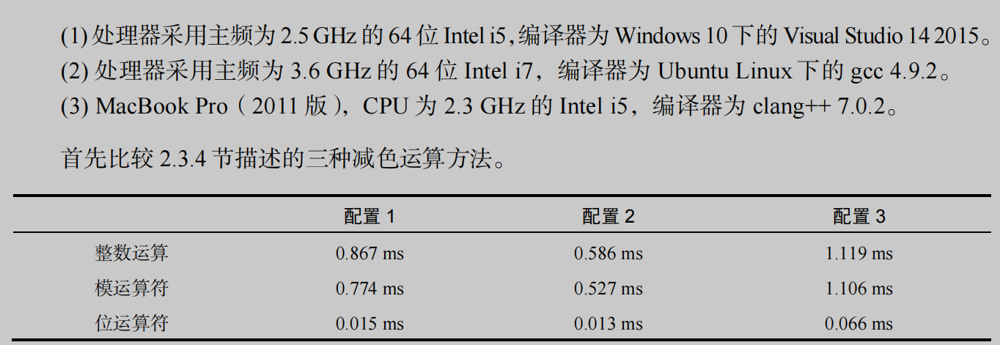

- 扩展阅读
  
  - 采用多线程处理,比如使用 OpenMP / Intel线程构建模块(Treading Building Block,TBB) 和 Posix

### 6 扫描图像并访问相邻像素

- 准备工作
  - 锐化图像,基于拉普拉斯算子.`sharpened_pixel = 5 * current - left - right - up - down;`
- 实现
  - 每次都需要访问三行(第一行/最后一行需要排除)
  - 调用了` cv::saturate_cast` 模板函数用于处理结果,原因是可能数值大小越界
  - 该变换等价于一个滤波器,使用`cv::filter2D`可以实现

### 7 实现简单的图像运算

- 图像的基本运算(加减乘除)

  - `cv::addWeighted()`,可以指定mask范围内执行加法

  - ```cpp
    cv::substract / cv::absdiff  / cv::multiply / cv::divide
    cv::bitwise_and /  cv::bitwise_not / cv::bitwise_xor / cv::bitwise_or
    cv::min / cv::max
    cv::saturate_cast 
    cv::sqrt / cv::pow /cv::abs / cv::cuberoot / cv::exp / cv::log
    ```

- 扩展阅读

  - 重载图像运算法
    - 比如 `cv::addWeighted` 可以直接使用  `result = a * img1 + b*img2;`替代
  - 分割图像通道
    - `cv::split`可以划分不同通道图像
    - `cv::merge`合并不同的通道

### 8 图像重映射

- 这个过程不会修改像素值，而是把每个像素的位置重新映射到新的位置。

  这可用来创建图像特效，或者修正因镜片等原因导致的图像扭曲。

- 实现

  - `cv::remap`可以实现,需要定义映射参数,比如图像每一行x坐标不变,y坐标沿着sin变化
  - 可以指定不同的插值法

## 第3章 处理图像的颜色

### 1 简介

- 人眼中的视杆细胞主要分布在视网膜的边缘，用于感光,覆盖可见光光谱,无法区分颜色
- 而视锥细胞分布在视网膜的中心,专门感知不同波长光线,RGB就是模仿人类的三种视锥细胞

### 2 用策略设计模式比较颜色

- 实现

  - 比较简单,颜色相同(欧式距离在一定范围内)直接赋值黑色,其余白色
  - `cv::getColorDistance`计算欧式距离,现代体系结构,浮点数的欧氏距离可能比城区距离更快(不开平方的话)

- 扩展阅读

  - 计算颜色向量距离

    - ```cpp
      abs(color[0]-target[0])+abs(color[1]-target[1])+abs(color[2]-target[2]);	// 城区距离
      
      ```

  - OpenCV函数

    - 好处:可以快速建立复杂程序,减少错误,效率高

    - 缺点: 内存消耗更多,中间步骤多

    - ```cpp
      cv::Mat ColorDetector::process(const cv::Mat &image) { 
       cv::Mat output; 
       // 计算与目标颜色的距离的绝对值
       cv::absdiff(image,cv::Scalar(target),output); 
       // 把通道分割进 3 幅图像
       std::vector<cv::Mat> images; 
       cv::split(output,images); 
       // 3 个通道相加（这里可能出现饱和的情况）
       output= images[0]+images[1]+images[2]; 
       // 应用阈值
       cv::threshold(output, // 相同的输入/输出图像
       output, 
       maxDist, // 阈值（必须<256）
       255, // 最大值
       cv::THRESH_BINARY_INV); // 阈值化模式
       return output; 
      }
      ```

  - cv::floodFill

    - 该方法除了检测每个像素与目标像素的距离,还会查询周围像素,可以找出颜色接近的连续区域


### 3 用 GrabCut 算法分割图像

- GrabCut 算法比较复杂，计算量也很大，但结果通常很精确。

  如果要从静态图像中提取前景物体最好采用GrabCut 算法

- 实现

  - cv::grabCut 函数的用法非常简单，只需要输入一幅图像，并对一些像素做上“属于背景”或“属于前景”的标记即可。

  - GrabCut 算法通过以下步骤进行背景/前景分割
    - 把所有未标记的像素临时标为前景,把像素划分为多个颜色相似的组
    - 是通过引入前景和背景像素之间的边缘，确定背景/前景的分割，这将通过一个优化过程来实现.该过程会试图链接相似标记的像素并且避免边缘出现强度相对均匀的区域
      - 把问题表示成一幅连通的图形，然后在图形上进行切割，以形成最优的形态。分割完成后，像素会有新的标记。然后重复这个分组过程，找到新的最优分割方案

### 4 转换颜色表示法

- RGB 并不是感知均匀的色彩空间。也就是说，两种具有一定差距的颜色可能看起来非常接近，
  而另外两种具有同样差距的颜色看起来却差别很大

- CIELab颜色模型解决了RGB的缺点,使用图像像素与目标颜色之间的欧几里得距离，来度量颜色之间的视觉相似度。

  - L亮度,0~100;

    a和b表示色度,包含了像素的颜色信息与亮度无关,范围 -127~127

  - CIELuv是另一种感知均匀的色彩空间

  - 因为信息的损失,颜色转换并不是完全可逆的

### 5 用色调、饱和度和亮度表示颜色

- HSV

  - 之所以要引入色调/饱和度/亮度的色彩空间概念，是因为人们喜欢凭直觉分辨各种颜色

    - Hue,色调表示主色,比如(绿色/黄色/红色)

    - Saturation,饱和度表示颜色鲜艳程度

    - Brightness,亮度是主观属性,表示颜色的光亮程度

    - 因为是主观颜色空间,所以没有明确定义

      - 亮度等价于 max(B,G,R)

      - 饱和度等于 = [max(R,G,B)-min(R,G,B)]/max(R,G,B),

        原理是假如三个通道颜色接近,那么是不饱和的颜色,范围 [0,1]

      - 色调使用0-360的角度表示,0是红色.如果颜色的饱和度很低,那么计算出来的色调就不可靠.为了不越界使用0-180表示

- 扩展阅读

  - 颜色用于检测:肤色检测

    - 在搜寻特定颜色的物体时，HSV 色彩空间也是非常实用的。

    - 在对特定物体做初步检测时，颜色信息非常有用。

      - 例如辅助驾驶程序中的路标检测功能，就要凭借标准路标的颜色快速识别可能是路标的信息。

      - 另一个例子是肤色检测，检测到的皮肤区域可作为图像中有人存在的标志。

        手势识别就经常使用肤色检测确定手的位置

## 第4章 用直方图统计像素

### 1 简介

- 像素值在整幅图像中的分布情况

### 2 计算图像直方图

- 直方图是一个简单的表格，表示一幅图像（有时是一组图像）中具有某个值的像素的数量
  - 每个种类称为一个bin
  - `cv::calcHist`是一个通用的直方图计算函数,对于返回的结果需要手动绘制直方图

### 3 利用查找表修改图像外观

- 图像直方图提供了利用现有像素强度值进行场景渲染的方法,

  通过分析图像中像素值的分布情况，你可以利用这个信息来修改图像，甚至提高图像质量

- 查找表是个一对一（或多对一）的函数，定义了如何把像素值转换成新的值

  - `cv::LUT`函数在图像上应用查找表生成一个新的图像

  -  伸展直方图以提高图像对比度

    - 查找直方图的最小/大强度值,使用一个百分比阈值，表示伸展后图像的最小强度值（0）和最大强度值（255）像素的百分比。

    - 重新映射强度值，使 imin 的值变成强度值 0，imax 的值变成强度值 255。

      两者之间的 i 进行线性映射,`255.0 * (i-imin)/(imax-imin)`

  - 在彩色图像上应用查找表

    - 在第二章的减色函数可以使用查找表实现
    - 对于每种强度独立使用减色公式,(如果查找表超过一个维度，那么它和所用图像的通道数必须相同)

### 4 直方图均衡化

- 很多时候，图像的视觉缺陷并不因为它使用的强度值范围太窄，而是因为部分强度值的使用频率远高于其他强度值

  均衡对所有像素强度值的使用频率可以作为提高图像质量的一种手段

- 实现

  - `cv::equalizeHist`用于直方图均衡化处理

  - 在一个完全均衡化的直方图中,所有bin的像素数量是相等的(也就是看起来是一条水平线)

    所以用一条规则表示 p%像素的强度值必须小于等于 255\*p% , 所以也称为累计直方图

### 5 反向投影直方图检测特定图像内容

- 如果图像的某个区域含有特定的纹理或物体，这个区域的直方图就可以看作一个函数，该函数返回某个像素属于这个特殊纹理或物体的概率
- 实现
  - `cv::normalize`归一化,可得到一个函数,确定特定强度的像素属于这个区域的概率
  - `calcBackProject`从归一化后的直方图读取概率值并把输入图像中的每个像素替换成与之对应的概率值

- 原理

  - 很多其他像素的强度值与云彩像素的强度值是相同的，

    在对直方图进行反向投影时会用相同的概率值替换具有相同强度值的像素。

- 扩展阅读

  - 反向映射颜色直方图

    - 分离成三个通道再调用

    - 通常来说，采用 BGR 色彩空间识别图像中的彩色物体并不是最好的方法。

      为了提高可靠性，在计算直方图之前减少了颜色的数量

    - 如果要寻找色彩鲜艳的物体，使用 HSV 色彩空间的色调通道可能会更加有效。

    - 其他情况下，最好使用感知上均匀的色彩空间（例如 Lab）的色度组件

### 6 用均值平移算法查找目标

- 直方图反向投影的结果是一个概率分布图，表示一个指定图像片段出现在特定位置的概率
- 如果已经知道物体大概位置,那么就可以用概率分布反复移动找到最高匹配概率,称为 均值平移算法
- `cv::TermCriteria`用于创建匹配条件,`cv::meanShift`用于均值平移
  - 是一个迭代过程,停止条件是迭代次数达到最大值或者中心移动距离小于某个极限(认为是收敛)

### 7 比较直方图搜索相似图像

- 基于内容的图像检索是计算机视觉的一个重要课题
- 为了得到更加可靠的相似度测量结果，需要在计算直方图时减少bin的数量。
- `cv::compareHist` 用交叉法比较直方图
  - 交叉点方法（带有 cv::HISTCMP_INTERSECT 标志）。该方法只是逐个箱子地比较每个直方图中的数值，并保存最小的值。然后把这些最小值累加，作为相似度测量值。
  - 卡方测量法累加各箱子的归一化平方差
  - 关联性算法基于信号处理中的归一化交叉关联操作符测量两个信号的相似度
  - Bhattacharyya 测量法和 Kullback-Leibler发散度都用在统计学中，评估两个概率分布的相似度。

### 	8 用积分图像统计像素

- 实际上，累计图像某个子区域内的像素总数是很多计算机视觉算法中的常见过程

- 实现

  - 通常来说,要获得感兴趣区域全部像素的累加和可以使用 `cv::sum`,它遍历所有像素并计算累加和

  - 积分图像只需要三次加法,但是需要先计算积分图像

    `cv::integral`计算完成后只需要用加减法就可以得到区域内像素和

- 原理

  - 取图像左上方的全部像素计算累加和，并用这个累加和替换图像中的每一个像素，用这种方式得
    到的图像称为积分图像。
  - 当前像素的积分值等于上方像素的积分值加上当前行的累计值
  - 目标ABCD区域的像素和就等于 A+D-B-C
  - 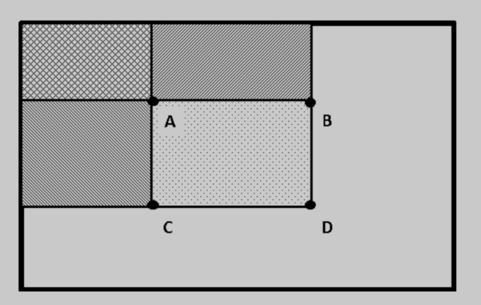

- 扩展阅读

  - 积分图像适合用来执行多次像素累计值的统计

  - 自适应阈值化

    - 对图像全局进行一个阈值处理总会有部分信息丢失,可以使用局部阈值,根据每个像素的邻域计算阈值的策略称为 自适应阈值化

    - 如果某像素的值与它的局部平均值差别很大，就会被当作异常值在阈值化过程中剔除。

      因此需要多次计算平均值,此时积分图像就可以提高效率

    - `cv::adaptiveThreshold`的实现原理就是如此

  - 用直方图实现视觉追踪

    -  0 和 1 组成的二值图像生成积分图像是一种特殊情况，这时的积分累计值就是指定区域内值为 1 的像素总数。
    - 用积分图像计算图像子区域的直方图,只需简单地把图像转换成由二值平面组成的多通道图像，每个平面关联直方图的一个箱子，并显示哪些像素的值会进入该箱子

## 第5章 用形态学运算变换图像

### 1 简介

- 数学形态学是一门 20 世纪 60 年代发展起来的理论，用于分析和处理离散图像

  定义了一系列运算，用预先定义的形状元素探测图像，从而实现图像的转换

### 2 用形态学滤波器腐蚀和膨胀图像

- 数学形态学中最基本的概念是结构元素,可以简单地定义为像素的组合,

  在对应的像素上定义了一个原点（也称锚点）

  把某个像素设为结构元素的原点后，结构元素和图像重叠部分的像素集就是特定形态学运算的应用对象

- 实现
  - 黑色背景,白色前景
  - `cv::erode` 腐蚀白色区域,如果结构元素放大奥某个像素位置时碰到了背景(交集有一个黑色像素),那么该点设置为背景
  - `cv::dilate` 膨胀扩大白色区域
  - 可以指定矩阵的中心点

### 3 用形态学滤波器开启和闭合图像

- 为了应用较高级别的形态学滤波器，需要用 `cv::morphologyEx `函数
- 闭运算是 先膨胀后腐蚀,连接空隙
- 开运算是 先腐蚀后膨胀,去除小物体

### 4 在灰度图像中应用形态学运算

- 形态学梯度运算可以提取出图像的边缘，具体方法为使用` cv::morphologyEx` 函数,

  中输入 cv::MORPH_GRADIENT 参数,这种边缘检测运算称为 Beucher 梯度

  膨胀 - 腐蚀

- 顶帽（hat-top）变换，它可以从图像中提取出局部的小型前景物体

  - 礼帽运算,  原始图像-开运算  
  - 黑帽运算, 闭运算 - 原始图像

### 5 用分水岭算法实现图像分割

- 分水岭变换是一种流行的图像处理算法，用于快速将图像分割成多个同质区域。

  - 使用分水岭分割法需要调用 `cv::watershed `函数

  - 原理是对图像中部分像素做标记，表明它们的所属区域是已知的。

    - 使用简单的腐蚀/膨胀将前景标记为白色,背景标记为其他颜色,黑色为未知区域

    - 用分水岭算法分割图像的原理是从高度 0 开始逐步用洪水淹没图像,

      当“水”的高度逐步增加时（到 1、2、3 等），会形成聚水的盆地。

      随着盆地面积逐步变大，两个盆地的水最终会汇合到一起。

      这时就要创建一个分水岭，用来分割这两个盆地。

      当水位达到最大高度时，创建的盆地和分水岭就组成了分水岭分割图。

- 扩展阅读
  
  - 用户客户交互式地在场景中地物体和背景上绘制区域以标记物体

### 6 用 MSER 算法提取特征区域

- 最大稳定外部区域(MSER)算法也用相同的水淹类比，以便从图像中提取有意义的区域。

- 实现

  - `cv::MSER`是一个抽象接口,继承自`cv::Feature2D`类

  - ```cpp
    // 基本的 MSER 检测器
    cv::Ptr<cv::MSER> ptrMSER= 
     cv::MSER::create(5, // 局部检测时使用的增量值
     200, // 允许的最小面积
     2000); // 允许的最大面积
    // 点集的容器
    std::vector<std::vector<cv::Point> > points; 
    // 矩形的容器
    std::vector<cv::Rect> rects; 
    // 检测 MSER 特征
    ptrMSER->detectRegions(image, points, rects);
    ```

- 实现原理

  - 与分水岭算法相同，即高度为 0~255，逐渐淹没图像
  - 通常把高于某个阈值的像素集合称为高度集。随着水位的升高，颜色较黑并且边界陡峭的区域会形成盆地 ，并且在一段时间内有相对稳定的形状
    - 检测它们地方法就是观测每个水位联通的区域并测量它们的稳定性。
    - 测量稳定性的方法是：计算区域的当前面积以及该区域原先的面积（比当前水位低一个特定值的时候），并比较这两个面积。
  - 

## 第6章 图像滤波

### 1 简介

- 滤波是信号和图像处理中的一种基本操作。它的目的是选择性地提取图像中某些方面的内容

  滤波可去除图像中的噪声，提取有用的视觉特征，对图像重新采样，等等

- 起源于通用的信号和系统理论

  - 一种描述图像特性的方式，即观察图像灰度级变化的频率。这种特征称为频域（frequency domain）；

  - 通过观察灰度分布来描述图像特征，称为空域（spatial domain）。

  - 频域分析把图像分解成从低频到高频的频率成分。图像强度值变化慢的区域只包含低频率，

    而强度值变化快的区域产生高频率

  - 在频域分析框架下，滤波器是一种放大（也可以不改变）图像中某些频段，同时滤掉（或减弱）其他频段的算子

### 2 低通滤波器

- 目的是减少图像变化的幅度。
  - `cv::blur`将每个像素值替换为像素邻域的均值,也称为 块滤波器(box filter)
  - `cv::GaussianBlur`则是使用了加权平均数
- 实现原理
  - 如果一种滤波器是用邻域像素的加权累加值来替换像素值，我们就说这种滤波器是线性的。
  - 可以使用一个矩阵(称为内核)进行卷积操作
  - 低通滤波器会过滤掉高频部分,使得图像更加平滑,消除锐利边缘,产生模糊效果

### 3 用滤波器进行缩减像素采样

- 需要调整图像精度（重新采样）的情况屡见不鲜，

  降低图像精度的过程称为缩减像素采样（downsampling），

  提升图像精度的过程称为提升像素采样（upsampling）

- 实现

  - 缩小一副图像只需要简单消除一部分行和列,但是图像会出现一种叫做 空间假频 的现象

    当你试图在图像中包含高频成分，但由于图像太小而无法包含时，就会出现这种现象。

    边缘出现锯齿状的变形

  - 删除部分行列之前必须先应用低通滤波器才不会出现伪影

- 实现原理

  - 为避免混叠现象的发生，在缩减图像之前必须进行低通滤波。

    低通滤波的作用是消除在缩减后的图像中无法表示的高频部分。

    这一现象称为 Nyquist-Shannon 定理，它表明如果把图像缩小一半，那么其可见的频率带宽也将减少一半。

  - `cv::pyrDown`利用这个原理实现了图像缩减,内部使用了高斯滤波器

- 扩展阅读

  - 按比例缩放图像后，必须进行像素插值，以便在原像素之间的位置插入新的像素值。

    通用的图像重映射属于另一种需要像素插值的情况。

  - 像素插值

    - 最基本方法使用 最近邻策略,把待生成图像的像素网格放在原图像的上方，每

      个新像素被赋予原图像中最邻近像素的值

      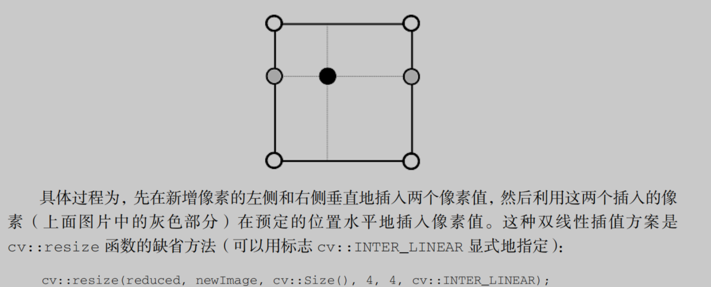

### 4 中值滤波器

- 非线性滤波器在图像处理中也起着很重要的作用,对去除椒盐噪声很有用

- `cv::medianBlur`是非线性,不能用核来表示,具体就是取邻域的中值替代当前当前像素值

- 中值滤波器还有利于保留边缘的尖锐度，但它会洗去均质区域中的纹理

  因为中值滤波器具有良好的视觉效果，因此照片编辑软件常用它创建特效。

### 5 用定向滤波器检测边缘

- Sobel 滤波器只对垂直或水平方向的图像频率起作用,所以被认为是一种定向滤波器

- `cv::Sobel`应用该滤波器,会产生浮雕效果,因为Sobel算子有正有负,所以结果需要进行取绝对值后才符合图像无符号要求

- 实现原理

  - Sobel 算子是一种典型的用于边缘检测的线性滤波器，它基于两个简单的 3×3 内核

  - 如果把图像看作二维函数，那么 Sobel 算子就是图像在垂直和水平方向变化的速度。

    在数学术语中，这种速度称为梯度,数学使用L2范数表示幅度,图像处理则使用L1范数(速度快,结果比较接近)

    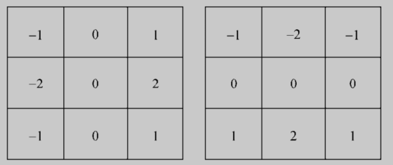

  - 如果需要同时计算方向和范数可以使用 `cv::cartToPolar`

  - 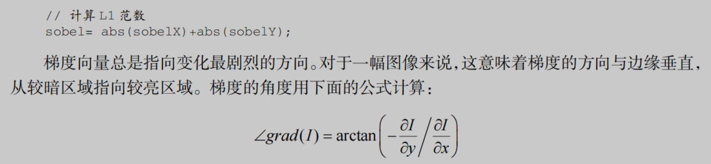

- 扩展阅读

  - 这些滤波器 都会计算一阶导数

    - 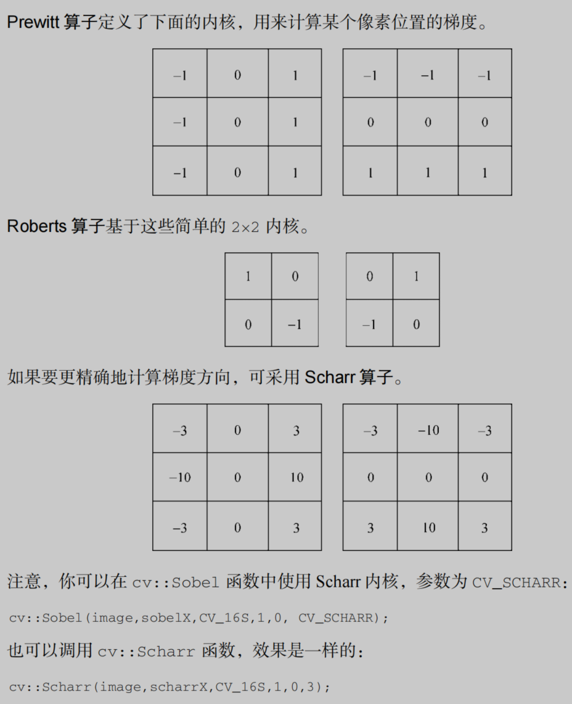

  - 高斯导数

    - 导数滤波器属于高通滤波器，因此它们往往会放大图像中的噪声和细小的高对比度细节

    - 可以先通过平滑处理后计算导数,而这两步可以合并

    - 有一个著名的数学定理：项的累加和的导数等于项的导数的累加和

      图像的卷积操作可以看作累加项,高斯内核连续可导,因此可以这么处理

### 6 计算拉普拉斯算子

- 拉普拉斯算子也是一种基于图像导数运算的高通线性滤波器，它通过计算二阶导数来度量图像函数的曲率

- 实现

  - `cv::Laplacian`计算,使用`cv::getDerivKernels`获取核心矩阵,用了导数所以结果需要进行缩放处理才能正常显示

- 原理

  - 对图像噪声更敏感,更大的内核使用高斯函数的二阶导数计算的,该算子也称为 高斯-拉普拉斯算子(Laplacian of Gaussian,LoG),

    内核的累加和是0,保证强度值恒定的区域中算子结果是0,度量的是图像曲率

  - 追踪拉普拉斯图像的过零点可以检测到亚像素精度的图像边缘,由于对噪声敏感并且会检测所有边缘,一般配合其他算子使用

  - 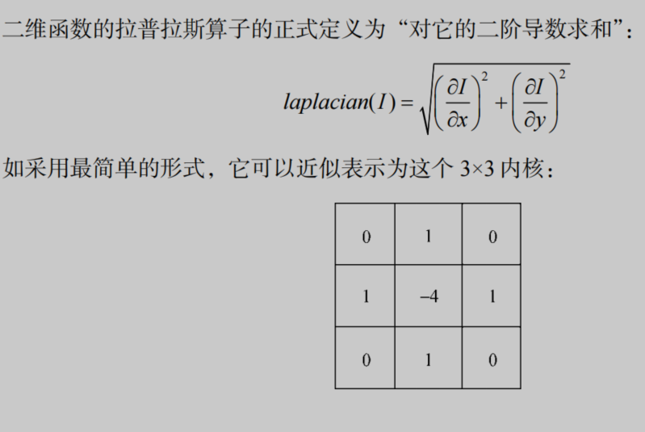

- 扩展阅读

  - 拉普拉斯算子是一种高通滤波器。你可以将多个低通滤波器结合，近似模拟出它的功能

  - 用拉普拉斯算子增强图像的对比度

    - 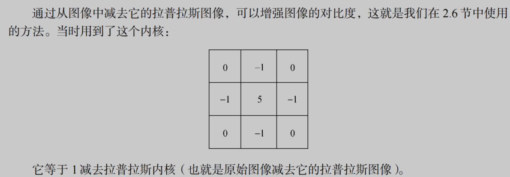

  - 高斯差分

    - 高斯滤波器过滤的频率范围取决于参数 *σ* 的值，这个参数控制了滤波器的宽度。

      现在用两个不同带宽的高斯滤波器对一幅图像做滤波，然后将这两个结果相减，就能得到由较高的频率构成的图像。

      这些频率被一个滤波器保留，被另一个滤波器丢弃。这种运算称为高斯差分（Difference of Gaussians，DoG）

    - 事实上，如果选择了合适的 *σ* 值，DoG 算子其实可以很好地模拟 LoG 滤波器

    - 如果从一个 σ 值的增长队列中选取连续的数据对，用以计算一系列的高斯差分，就可以得到该图像的尺度空间表示法。

## 第7章 提取直线、轮廓和区域

### 1 简介

### 2 用 Canny 算子检测图像轮廓

- `cv::Canny` 函数实现,使用这个算法时，需要指定两个阈值

- Canny算子通常基于Sobel算子,核心理念是用两个不同的阈值来判断点是否属于轮廓
  - 选择低阈值时，要保证它能包含所有属于重要图像轮廓的边缘像素
  - 高阈值界定重要轮廓的边缘，排除掉异常的边缘
  - Canny 算法将结合这两种边缘分布图，生成最优的轮廓分布图。
    - 具体做法是在低阈值边缘分布图上只保留具有连续路径的边缘点，同时把那些边缘点连接到属于高阈值边缘分布图的边缘上,该策略称为 滞后阈值化
    - 此外Canny还使用了额外策略优化边缘分布,如果梯度幅值不是梯度方向的最大值,那么对应的边缘点都会被移除,这是一个细化轮廓的运算

### 3 用霍夫变换检测直线

- ρ = xcosθ + y sinθ, ρ(可以取负数)是直线与图像原点(左上角)的距离,θ(0-180)是直线与坐标纵轴的夹角

- 实现

  - 基础版是` cv::HoughLines `它输入的是一个二值分布图，其中包含一批像素点（用非零像素表示），一些对齐的点构成了直线

  - 通过 `cv::HoughLinesP `函数可以处理重复检测/错误检测

    - 检查输入的二值分布图中每个独立的像素点，识别出穿过该像素点的所有可能直线。

      如果同一条直线穿过很多像素点，就说明这条直线明显到足以被认定。

    - 为了统计某条直线被标识的次数，霍夫变换使用了一个二维累加器。累加器的大小依据(*ρ*, *θ*)的步长确定，其中(*ρ*, *θ*)参数用来表示一条直线。

    - 概率霍夫变换在二值分布图上随机选择像素点而不是系统逐行扫描

- 扩展阅读

  - 检测圆 
    - r^2^ = (x-a)^2^ + (y-b)^2^ ,包含三个参数,需要用到三维累加器
    - OpenCV使用两轮筛选,第一轮检测可能的圆未知,因为圆周的像素梯度方向与半径一致,累加器只需要对沿着梯度方向的入口增加计数
    - 一旦检测到可能的圆心,就在第二轮筛选中建立半径值范围的一维直方图

### 4 点集的直线拟合

- 光是检测出图像中的直线还不够，还需要精确地估计直线的位置和方向。

- 实现

  - 使用霍夫直线检测得到的直线放入 `std::vector<cv::Vec4i>`中,对象保存(x0,y0,x1,y1)

    可以使用 `cv::line`画线

  - 点集的直线拟合是一个经典数学问题,OpenCV实现方法是使每个点到直线的距离最短,距离用L2范数,对应了最小二乘法

- 扩展阅读

  - `cv::fitEllipse `函数在二维点集上拟合一个椭圆,会返回一个 `cv::RotatedRect`对象

### 5 提取连续区域

- `cv::findContours`可以提取图像中连续区域的轮廓,

  `cv::drawContours`可以绘制图像轮廓

- 原理

  - 扫描图像直到找到连续区域,从区域的起点开始沿着轮廓对边界像素做标记

- 扩展阅读

### 6 计算区域的形状描述子

- 连续区域通常代表着场景中的某个物体。为了识别该物体，或将它与其他图像元素做比较，需要对此区域进行测量，以提取出部分特征。

- `cv::boundingRect`轮廓的矩形边框

  `cv::minEnclosingCircle` 轮廓的最小覆盖圆

  `cv::approxPolyDP`轮廓多边形逼近

  `cv::convexHull`凸包

  `cv::moments` 轮廓矩,可以绘制出重心

- 原理

  - 矩形边框,能完整包含该形状的最小垂直矩形

  - 最小覆盖圆通常在只需要区域尺寸和位置的近似值时使用

  - 形状的凸包（或凸包络）是包含该形状的最小凸多边形。可以把它看作一条绕在区域周围的橡皮筋

    在形状轮廓中凹进去的位置，凸包轮廓会与原始轮廓发生偏离。

    专门用于识别凸包缺陷的函数 cv::convexityDefects

- 扩展阅读

  - 函数` cv::minAreaRect` 计算最小覆盖自由矩形

    函数` cv::contourArea `估算轮廓的面积（内部的像素数量）

    函数` cv::pointPolygonTest `判断一个点在轮廓的内部还是外部

    函数` cv::matchShapes` 度量两个轮廓之间的相似度

## 第8章 检测兴趣点

### 1 简介

- 视觉不变性是图像分析中一个非常重要的属性,

  用于图像内容的分析，不管图像拍摄时采用了什么视角、尺度和方位，理想情况下同一个场景或目标位置都要检测到特征点

### 2 检测图像中的角点

- 角点是很容易在图像中定位的局部特征，并且大量存在于人造物体中.Harris特征检测是检测角点的经典方法
- 实现
  - 函数是` cv::cornerHarris`，返回的结果是一个浮点数型图像，其中每个像素表示角点强度

- 原理
  - 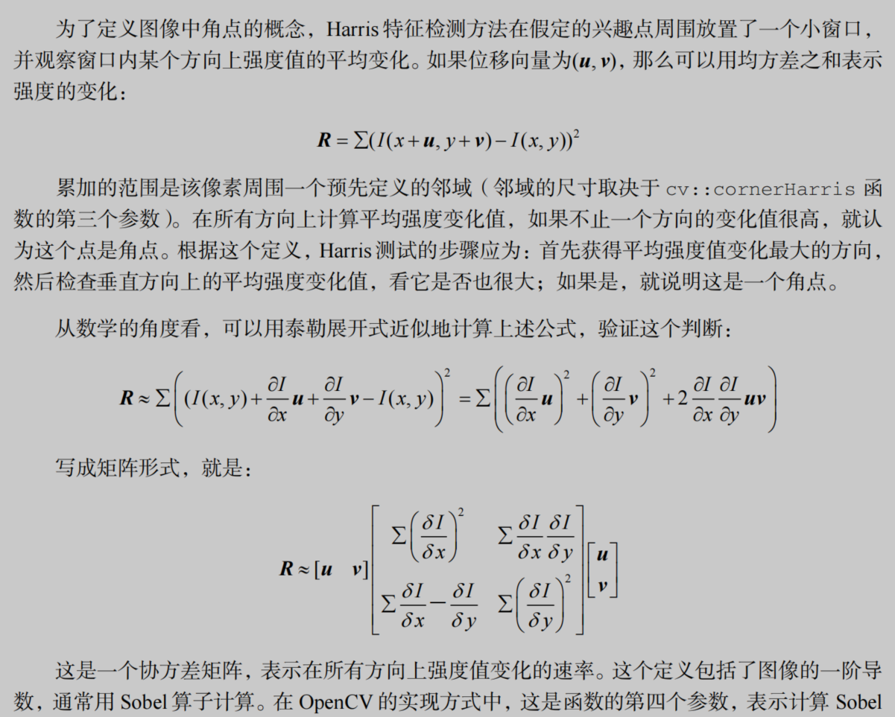

- 扩展阅读
  - 适合跟踪的特征
    - 通过显式地计算特征值来检测 Harris 角点,可以避免使用随意的 k 参数。
    - 有两个函数可以用来显式地计算 Harris 协方差矩阵的特征值（以及特征向量），即 cv::cornerEigenValsAndVecs 和 cv::cornerMinEigenVal
    - OpenCV 中用 good-features-to-track（GFTT）,从 Harris 值最强的点开始（即具有最大的最低特征值），只允许一定距离之外的点成为兴趣点

### 3 快速检测特征

- Harris 算子对角点（或者更通用的兴趣点）做出了规范的数学定义，该定义基于强度值在两个互相垂直的方向上的变化率因为用到了导数,计算很耗时
- FAST（Features from Accelerated Segment Test，加速分割测试获得特征）。这种算子专门用来快速检测兴趣点

- 实现

  - 用到了 `cv::FastFeatureDetect`类,可以用 `cv::drawKeyPoints`绘制关键点

  - FAST 对角点的定义基于候选特征点周围的图像强度值。以某个点为中心做一个圆，根据圆上的像素值判断该点是否为关键点

    如果存在这样一段圆弧，它的连续长度超过周长的 3/4，并且它上面所有像素的强度值都与圆心的强度值明显不同（全部更暗或更亮），那么就认定这是一个关键点

  - 测试方法很简单,也很高效,直接通过四个相隔90度的点可以快速排除

  - 像素是 1、5、9 和 13，至少需要 9 个比圆心更暗（或更亮）的连续像素。

    这种设置通常称为 FAST-9 角点检测器

    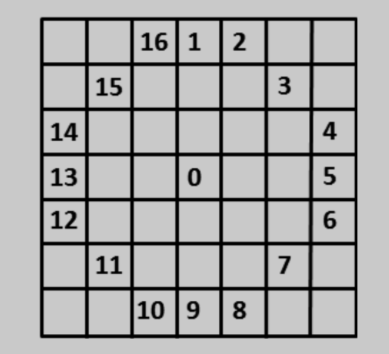

- 扩展阅读

  - 在事先明确兴趣点数量的情况下，可以对检测过程进行动态适配。

    简单的做法是采用范围较大的阈值检测出很多兴趣点，然后从中提取出 n 个强度最大的

    可以使用 `std::nth_element`函数

  - 角点分布很不均匀,可以把图像分割成网格状单独检测

### 4 尺度不变特征的检测

- 前面的Harris,Fast检测可以解决方向不变性问题,但是并不能解决尺度不变性问题

  不仅在任何尺度下拍摄的物体都能检测到一致的关键点，而且每个被检测的特征点都对应一个尺度因子

- SURF 特征，它的全称为加速稳健特征（Speeded Up Robust Feature）。

  - 属于 `opencv_contrib`库,用到 ` cv::xfeatures2d `模块和它的 `cv::xfeatures2d::SurfFeature Detector `类。

- 实现原理

  - 高斯滤波器用 *σ* 参数定义内核的口径,这个 *σ* 参数对应了用于构建滤波器的高斯函数的变化幅度，还隐式地定义了计算导数的范围

  - 如果在不同的尺度内用高斯滤波器计算指定像素的拉普拉斯算子，会得到不同的数值。

    观察滤波器对不同尺度因子的响应规律，所得曲线最终在给定的 *σ* 值处达到最大值

  - 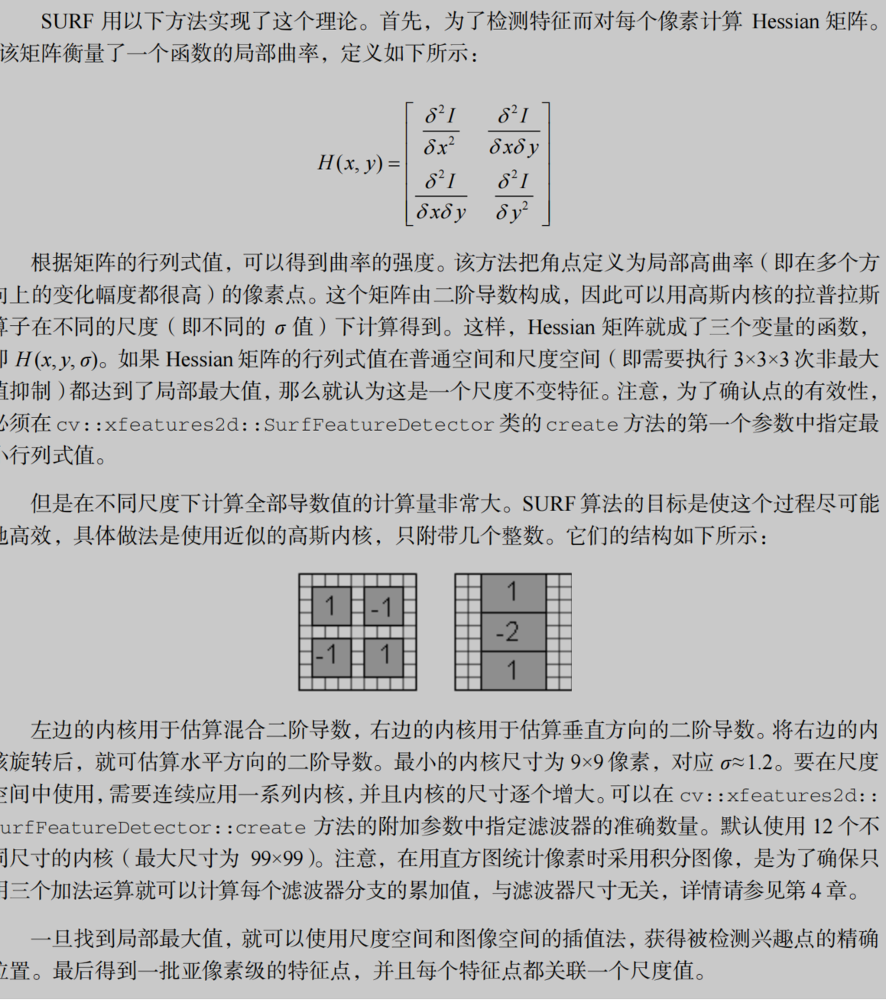

- 扩展阅读

  - 而 SIFT（Scale-Invariant Feature Transform，尺度不变特征转换）是另一种著名的尺度不变特征检测法,SURF是它的加速版
  - SURF和SIFT是受专利保护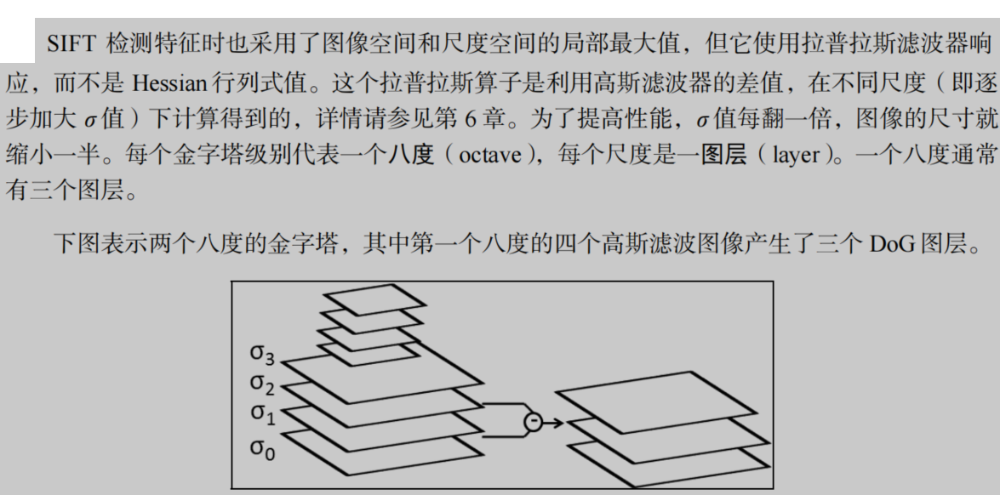

### 5 多尺度 FAST 特征的检测

- BRISK（Binary Robust Invariant Scalable Keypoints，二元稳健恒定可扩展关键点）检测法
  - 不仅是一个特征点检测器还包含了描述每个被检测关键点的邻域的过程
  - 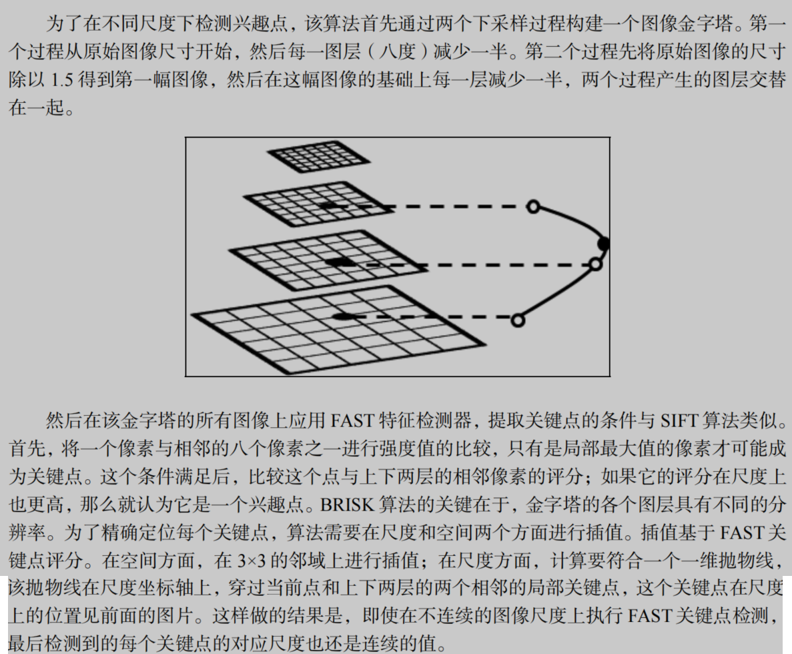
- ORB（Oriented FAST and Rotated BRIEF，定向 FAST 和旋转 BRIEF）。
  - 跟 BRISK 一样，ORB 首先创建一个图像金字塔。它由一系列图层组成，每个图层都是用固定的缩放因子对前一个图层下采样得到的（典型情况是用 8 个尺度，缩放因子为 1.2；这是创建cv::ORB 检测器的默认参数）。在具有关键点评分的位置接受 N 个强度最大的关键点，关键点评分用的是 8.2 节定义的 Harris 角点强度衡量方法

## 第9章 描述和匹配兴趣点

### 2 局部模板匹配

- 最常见的图像块是边长为奇数的正方形，关键点的位置就是正方形的中心。

  可通过比较块内像素的强度值来衡量两个正方形图像块的相似度。常见的方案是采用简单的差的平方和（Sum of Squared Differences，SSD）算法。

- 结果不理想,光照/对称等会产生误判,可以使用归一化的差值平方和

- 扩展阅读
  - 模板匹配
    - cv::matchTemplate，函数的输入对象是一个小图像模板和一个被搜索的图像。

### 3 描述并匹配局部强度值模式

- 描述子通常是一个 *N* 维的向量，在光照变化和拍摄角度发生微小扭曲时，它描述特征点的方式不会发生变化。

  通常可以用简单的差值矩阵来比较描述子，例如用欧几里得距离。

  综上所述，特征描述子是一种非常强大的工具，能进行目标的匹配。

- 好的特征描述子不受照明和视角微小变动的影响，也不受图像中噪声的影响，因此它们通常基于局部强度值的差值。
  - SIFT 描述子包含的内容更多，它采用图像梯度而不是单纯的强度差值。它也将关键点周围的正方形邻域分割成 4×4 的子区域
  - 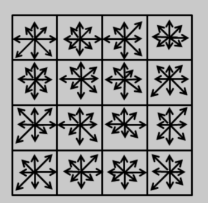

- 扩展阅读
  - 交叉检查匹配项
  - 比率检验法
    - 为每个关键点找到两个最佳的匹配项，可以用 cv::Descriptor Matcher 类的 knnMatch 方法实现这个功能
  -  匹配差值的阈值化
    - cv::DescriptorMatcher 类的 radiusMatch 方法

### 4 用二值描述子匹配关键点

- ORB 算法在多个尺度下检测特征点，这些特征点含有方向

  实际上，ORB 就是在 BRIEF 描述子的基础上构建的（前面介绍过 BRIEF 描述子），然后在关键点周围的邻域内随机选取一对像素点，创建一个二值描述子。比较这两个像素点的强度值，如果第一个点的强度值较大，就把对应描述子的位（bit）设为 1，否则就设为 0。对一批随机像素点对进行上述处理，就产生了一个由若干位（bit）组成的描述子，通常采用 128 到 512 位（成对地测试）

- FREAK
  
  - FREAK 全称为 Fast Retina Keypoint（快速视网膜关键点），也是一种二值描述子，但没有对应的检测器。

## 第10章 估算图像之间的投影关系

### 1 简介

- 成像过程
  - 1/f = 1/do +1/di ,称为薄镜公式,f是焦距
  - 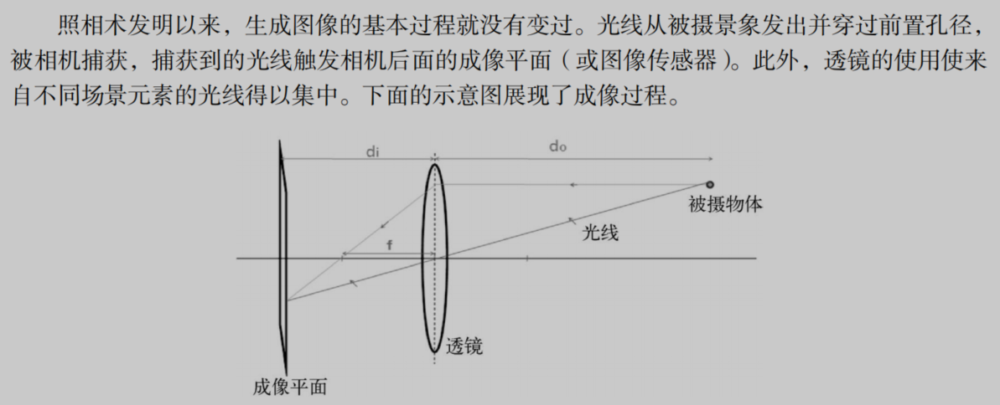
  - 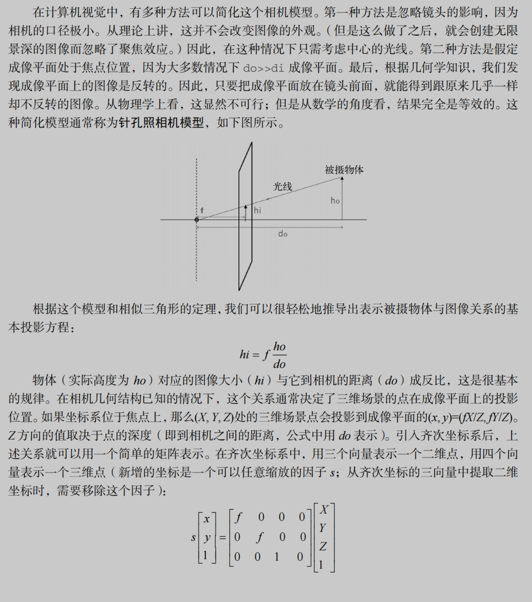

### 2 计算图像对的基础矩阵

- 同一场景的两幅图像之间的投影关系。可以移动相机，从两个视角拍摄两幅照片；也可以使用两个相机，分别对同一个场景拍摄照片。如果这两个相机被刚性基线分割，我们就称之为立体视觉。
- 准备工作
  - 两个针孔设想i观察同一个场景点
  - X和相机中心点之间的连线对应 x,该 X 点在另一个摄像机中成像位置在 X 和中心点连线与平面得焦点 l',该直线称为对极线
  - e和 e'称为极点,图像的点和对极线之间的关系可以用矩阵表示
  - 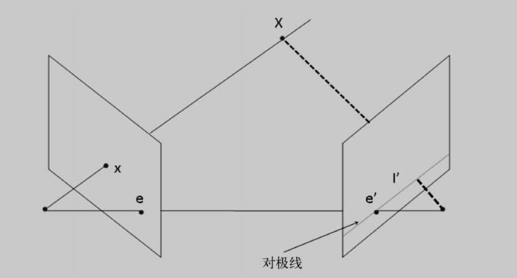


- 实现
  - 如果图像有一定数量的匹配点,可以用方程组计算基础矩阵
  - 函数 `cv::findFundamentalMat` 计算基础矩阵时，将使用这些匹配项
- 原理
  - 
  - 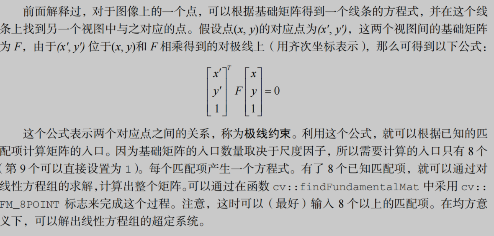

### 3 用 RANSAC（随机抽样一致性）算法匹配图像

- 可以根据一些特征点匹配项计算图像对的基础矩阵。为了确保结果准确，采用的匹配项必须都是优质的

  通过比较被检测特征点的描述子得到的匹配项是无法保证全部准确的。正因为如此，人们引入了基于 RANSAC（RANdom SAmpling Consensus）策略的基础矩阵计算方法。

- RANSAC 算法旨在根据一个可能包含大量局外项的数据集，估算一个特定的数学实体。其原理是从数据集中随机选取一些数据点，并仅用这些数据点进行估算。选取的数据点数量，应该是估算数学实体所需的最小数量。

- 扩展阅读

  - 改进基础矩阵
    - 有了高质量的匹配项，用全部匹配项重新估算基础矩阵是个不错的主意,有一种线性的 8 点算法可以估算这个矩阵。因此可以得到一个超定方程组，求得最小二乘法形式的基础矩阵
  - 改进匹配项
    - 双视图系统中，每个点肯定位于与它对应的点的对极线上。这就是基础矩阵表示的极线约束,函数 `cv::correctMatches`

### 4 计算两幅图像之间的单应矩阵

- 原理

  - 可以选取特征点，使用 cv::BFMatcher 函数匹配这两幅图像

    接下来对此应用 RANSAC算法，包含基于匹配集估算单应矩阵的步骤

  - 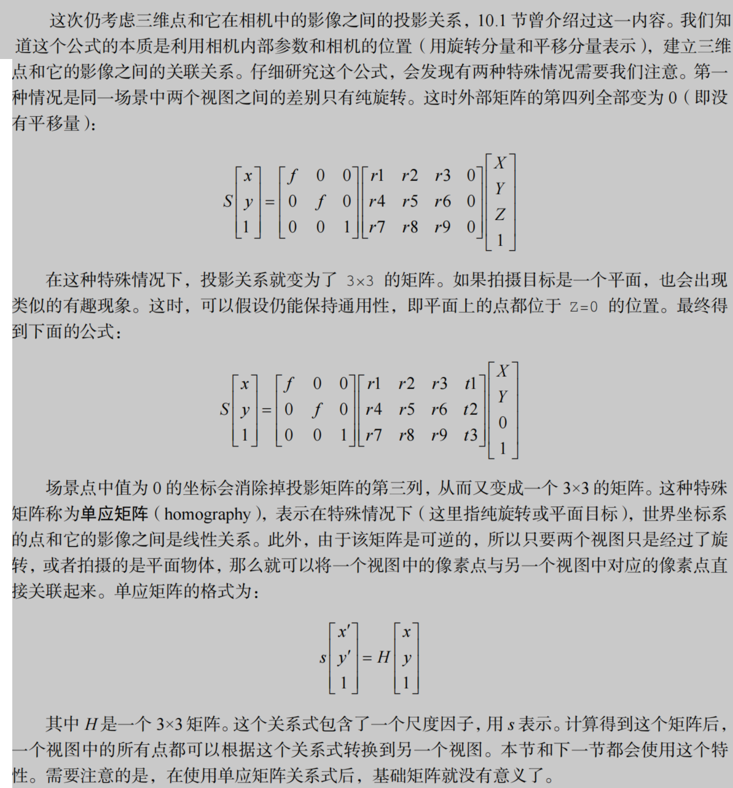

- 扩展阅读
  
  - 用 `cv::Stitcher` 生成全景图

### 5 检测图像中的平面目标

- 实现
  - 采取的方法是检测这个平面物体的特征点，然后试着在图像中匹配这些特征点。然后和前面一样，用鲁棒匹配方案来验证这些匹配项，但这次要基于单应矩阵。
  - 图像采用金字塔,每层都检测特征点

## 第11章 三维重建

### 1 简介

- 普通图像是三维图像头投影到二维平面形成,损失了深度(距离)的信息

- 数字图像的成像过程

  - 从焦点引出与成像平面的交点(u~0~,v~0~)称为 主点,理论上可以认为是成像平面中心

  - 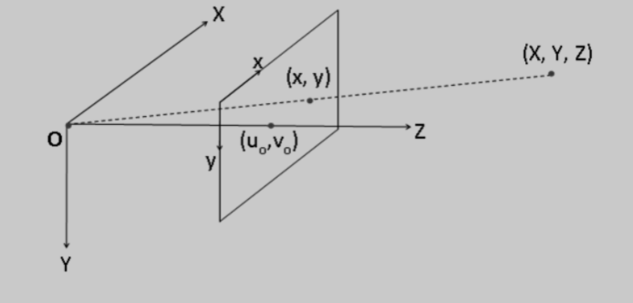

  - 空间的点(X,Y,Z)投影到平面的(fX/Z,fY/Z)

    像素宽高为 px和py,焦距用像素表示为 fx和fy

  - 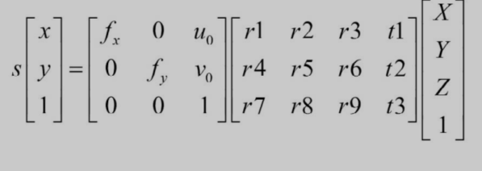

### 2 相机标定

- 相机标定就是设置相机各种参数（即投影公式中的项目）的过程。

  真正有效的相机标定过程，就是用相机拍摄特定的图案并分析得到的图像，然后在优化过程中确定最佳的参数值。

- OpenCV 推荐使用国际象棋棋盘的图案生成用于标定的三维场景点的集合。

  `cv::findChessboardCorners`可以检测角点

  使用 `cv::cornerSubPix `函数可以使图像上点的位置更精确

  用 `cv::TermCriteria` 对象指定终止的条件，它定义了最大迭代次数和最小亚像素级坐标精度

- 原理

  - 投影方程第一个将矩阵包含了相机全部参数,，称作相机的内部参数。

    是一个 3×3 矩阵，是函数 cv::calibrateCamera 输出的矩阵之一

  - 第二个矩阵式输入点,以相机为坐标系中心,由一个旋转量和一个平移量组成，旋转量用矩阵入口 r1 到 r9 表示，平移量用 t1、t2 和 t3 表示,是函数 cv::calibrateCamera 的输出参数。旋转和平移部分通常称为标定的外部参数，并且对于每个视图都各不相同

  - 超广角镜头产生的典型畸变，称为径向畸变。通过引入合适的畸变模型，可以对变形的情况加以改善。在标定阶段可以获得纠正畸变所需的准确变换参数以及其他相机参数。

- 扩展阅读
  - 用已知的内部参数进行标定
    - 如果可以准确估算相机的内部参数，那么将这些参数输入函数 cv::calibrateCamera 将十分有利
  - 使用圆形组成的网格进行标定
    - OpenCV 还可以使用由圆形组成的网格进行相机标定。这时就用圆心作为标定点。

### 3 相机姿态还原

- 投影方程描述了完整的成像过程。如果该方程中的大多数项目是已知的，利用若干张照片，就可以计算出其他元素（二维或三维）的值。
- 实现
  - 长椅的物理尺寸。它的椅座为 242.5 cm×53.5 cm×9 cm，靠背为 242.5 cm× 24 cm×9 cm，椅座与靠背之间相距 12 cm
  - 要计算出拍照时相机与这些点之间的相对位置。因为在二维成像平面中，包含这些点的图像的坐标是已知的，所以解决这个问题非常简单，只需调用 `cv::solvePnP `函数即可
    - 函数实际上是做了一个刚体变换（旋转和平移），把物体坐标转换到以相机为中心的坐标系上
    - 这是一种简洁的表示方法，表示物体绕着一个单位向量（旋转轴）转了某个角度。这种“轴+角度”的表示方法又称为罗德里格旋转公式（Rodrigues rotation formula）。

- 原理

  - 物体上的点与图像中的点的对应关系也是已知的,通过标定，相机的内部参数也是已知的

    那么只有第二个矩阵是未知的(相机外参),我们要做的就是观察三维场景中的点，并计算出这些未知的参数。这就是透视 n 点定位（Perspective-n-Point，PnP）问题。

  - 外参就是将世界坐标映射到相机坐标,用到了旋转和平移,共六个参数,OpenCV 还提供了 `cv::SolvePnPRansac` 函数。顾名思义，它使用 RANSAC 算法来求解 PnP 问题

- 扩展阅读

  - 三维可视化模块 cv::viz

    - OpenCV中,`cv::viz `是一个基于可视化工具包(Visualization Toolkit,VTK)的附加模块

      可以创建虚拟的三维环境,并添加各种物体

### 4 用标定相机实现三维重建

- 只要相机经过标定，就有可能根据三维场景还原相机的位置

- 实现

  - 相机的标定参数是能够获取到的，因此可以使用世界坐标系，还可以用它在相机姿态和对应点的位置之间建立一个物理约束。

    这里引入一个新的数学实体——本质矩阵。简单来说，本质矩阵就是经过标定的基础矩阵

    `cv::findEssentialMat`输入已建立的点之间的对应关系,会剔除掉偏离较大的点,只留下检测到的几何形状一致的匹配项

  - 本质矩阵封装了表示两个视图之间差异的旋转量和平移量

- 实现原理
  - 三维重建只受限于缩放因子。如果要测量实际尺寸，就必须预先确定至少一个长度值，例如两个相机之间的实际距离或者画面中某个物体的实际高度。
  - 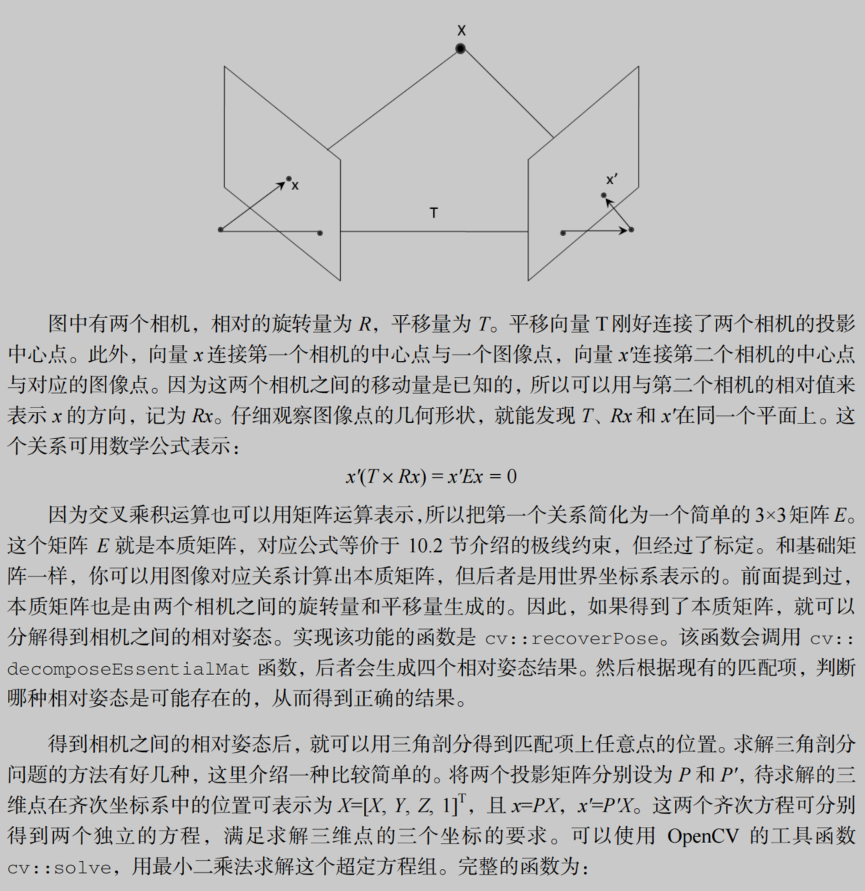

- 扩展阅读
  - 分解单应矩阵

    - 本质矩阵是可以分解的,从而得到两个相机之间的旋转量和平移量。

      平面的两个视图之间存在一个单应矩阵，这里的单应矩阵也包含旋转量和平移量这两个分量

  - 光束调整

    - 首先根据匹配项计算相机位置，然后通过三角剖分实现三维重建。这个过程可以一般化，使用任意数量的视图。对每个视图都检测特征点，并与其他视图匹配。有了这些信息，就可以建立方程，将视图间旋转/偏移量、三维点集以及标定信息关联起来。然后，进行一个很长的优化过程，使所有点在每个视图（如果视图上有这个点）上的重投影误差达到最小，使全部未知项得到优化。这个经过组合的优化过程就是光束调整。

### 5 计算立体图像的深度

- 一个立体视觉系统通常需要两台并排的相机，并且都对准同一个场景

  两台相机只有水平方向的平移,极线都是水平方向的

- 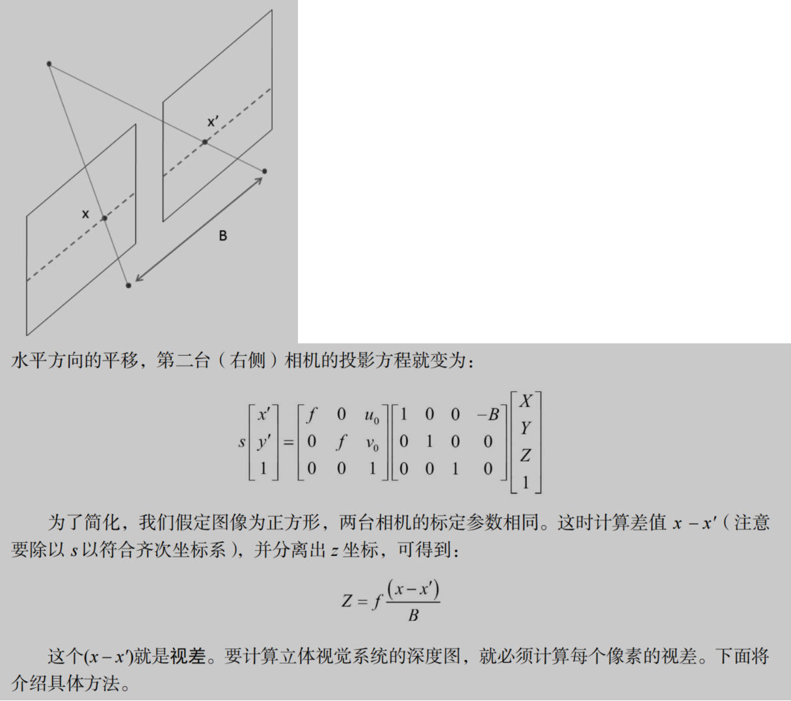

- 实现

  - OpenCV 提供了一个矫正函数，它利用单应变换将每个相机的图像平面投影到完全对齐的虚拟平面上。这个变换过程使用了一批匹配点和一个基础矩阵。然后用这些单应矩阵变换图像

    `cv::stereoRectifyUncalibrated`计算矫正量

  - 调用相关的方法计算视差图了，调用时相机和水平对极线都是平行的

    `cv::Ptr<cv::StereoMatcher>	` 计算视差

## 第12章 处理视频序列

### 2 读取视频序列

- 视频由一系列图像构成，这些图像称为帧，帧是以固定的时间间隔获取的（称为帧速率，通常用帧/秒表示）

- 实现

  - `cv::VideoCamera`可以读取视频或者摄像机(USB/IP)

    `capture.get(CV_CAP_PROP_FRAME_COUNT)`获取总帧数

    `capture.set(CV_CAP_PROP_POS_FRAMES,pos)`跳转到指定帧

  - 有一点需要特别注意，计算机中必须安装有相关的编解码器，才能打开指定的视频文件，

    否则 cv::VideoCapture 将无法对文件进行解码

### 3 处理视频帧

- 可以为视频序列指定回调函数

   `void callback(cv::Mat& img,cv::Mat& out)`

  `capture.setFrameProcessor()`

- 使用帧处理类而不是函数,具有更大灵活性

### 4 写入视频帧

- `cv::VideoWriter`类负责,需要指定文件名/帧率/帧大小/彩色信息/编码
- 人们使用四个字符的代码来指定一种编解码器。

### 5 提取视频中的前景物体

- 最简单方式 `cv::absdiff`做差,但一般不会出现这种情况
- 计算滑动平均值（又叫移动平均值）。这是一种计算时间信号平均值的方法，该方法还考虑了最新收到的数值
  
- 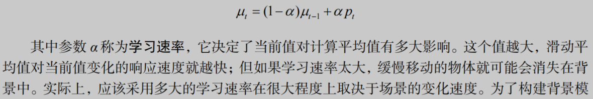
  
- 原理

  - ` cv::accumulateWeighted` 函数计算图像的滑动平均值非常方便，它在图像的每个像素上应用滑动平均值计算公式。

    需要注意的是结果是浮点型,需要先进行处理再对差异值阈值化(先 cv::absdiff 再 cv::threshold)

- 扩展阅读
  - 很多时候背景会频繁变动,比如水面/树叶等
  - 混合高斯模型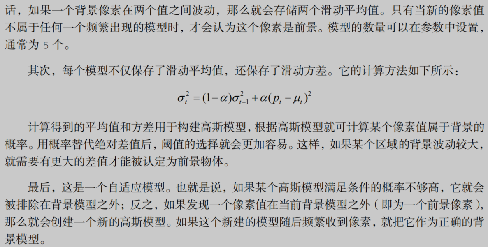

## 第13章 跟踪运动目标

### 1 简介

- 跟踪表观运动都是极其重要的。

  它可用来追踪运动中的物体，以测定它们的速度、判断它们的目的地。

  对于手持摄像机拍摄的视频，可以用这种方法消除抖动或减小抖动幅度，使视频更加平稳。

  运动估值还可用于视频编码，用以压缩视频，便于传输和存储

### 2 跟踪视频中的特征点

- 函数 `cv::calcOpticalFlowPyrLK `实现输入两个连续的帧和第一幅图像中特征点的向量，将返回新的特征点位置的向量
  - 如果现有特征点很少,那么就需要检测新的特征点
  - 根据应用程序定义的条件剔除部分被跟踪的特征点
  - 在当前帧画直线，连接特征点和它们的初始位置

- 原理
  - Lukas-Kanade 特征跟踪算法使用了这个约束方程。除此之外，该算法还做了一个假设，即特征点邻域中所有点的位移量是相等的
  - 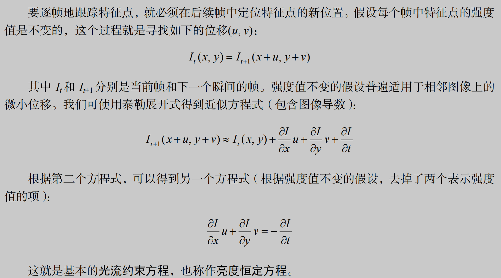

### 3 估算光流

- 三维运动向量的投影图被称作运动场,只有一个相机传感器的情况下只能观察到帧与帧之间运动的亮度模式,亮度模式上的表观运动被称作光流
- 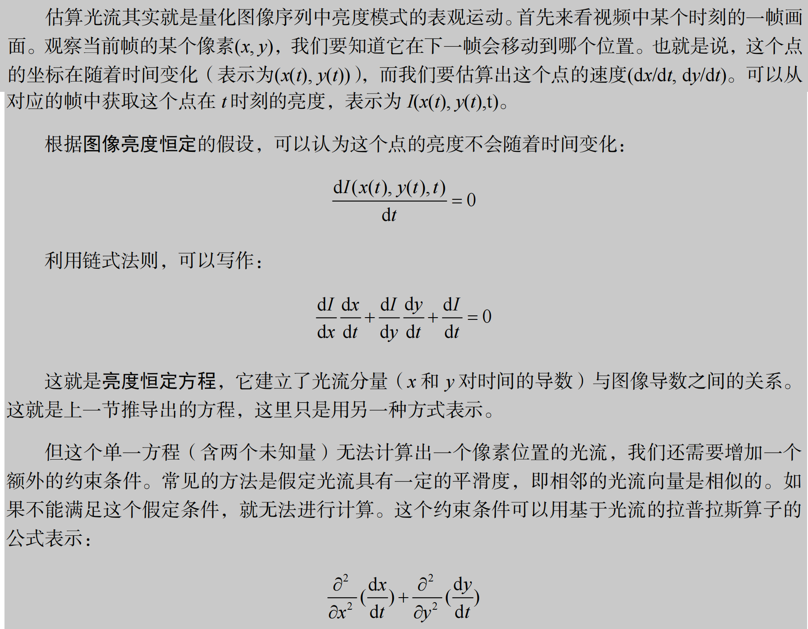

- 估算稠密光流的方法很多,可以使用` cv::Algorithm `的子类 `cv::DualTVL1OpticalFlow`。

### 4 跟踪视频中的物体

- OpenCV 中的物体跟踪框架类` cv::Tracker` 包含两个主方法 init 用于定义初始不妙矩形框, update 用于输出新帧的目标框

- 原理

  - 中值流量跟踪算法的基础是特征点跟踪。它先在被跟踪物体上定义一个点阵。

    可以改为检测物体的兴趣点 

  - 接着使用 Lukas-Kanade 特征跟踪算法

  - 中值流量算法估算跟踪过程中产生的误差。估算误差的一种方法是在点的初始位置和跟踪位置的周边设一个窗口，计算窗口内像素差值的绝对值之和

  - 计算出每个点的跟踪误差后，只使用其中误差最小的 50%来计算矩形在下一幅图像中的位置。

    计算出每个点的位置后，取它们的中值。

    为计算图像缩放比例，要把这些点分组，每组两个；
    然后分别计算这两个点在初始帧和后续帧中的距离，并计算这两个距离的比值。

    同样，这里要采用这些比值的中值。

- 扩展

  - 还有一类方法基于模板匹配，其中有代表性的是 Kernelized Correlation 滤波法（Kernelized Correlation Filter，KCF），它在 OpenCV 中用` cv::TrackerKCF `类实现
    - 使用了傅里叶变换来计算模板

## 第14章 使用案例

- 人脸识别 / 人脸定位 /行人检测
- 用的是机器学习算法,就不在这里做笔记


## 附录

- 安装后Visual Studio配置
  - 项目解决方案需要修改为 x64
  - 右键项目 - 属性 
    -  VC++目录
      - 包含目录,指定opencv的include (在opencv/build/include)
      - 库目录,指定opencv的lib (在opencv/build/x64/vc15/lib)
    - 链接器-输入
      - 附加依赖库,添加 opencv_world455d.lib(这里采用了将opencv的所有库打包成一个,假如使用多个库的话就直接填写,455是版本号,d表示Debug模式)

- 相机标定原理
  - https://blog.csdn.net/kk55guang2/article/details/81143175