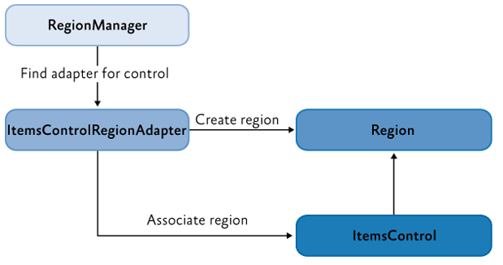

# PrismLibrary8 学习笔记

## 1. 简介

​	Prism是MVVM框架，提供IoC，帮助构建松散耦合的项目。

## 2. 入门

### 2.1 项目安装并启动

1. 使用nuget可以下载Prism.DryIoc
2. 引入名称空间，使用PrismApplication替代原有的Application类
3. 去掉StartUri，在cs文件里使用代码（CreateShell（）方法）进行加载主窗口。
4. 文件夹名称需要固定，会自动映射 Views =》 ViewModels

### 2.2 组合视图

​	只使用用户空间就可以，分离xaml和逻辑代码

#### 2.2.1 一些概念

1. Shell 应用窗口，由region组成
2. Views 视图是基本单位，组合多个控件可以命令或者事件集成
3. Regions 区由视图组成，由RegionManager维护。实现了IRegion接口，
   1. Region Adapter，负责创建和关联控件，默认三种Adapter。ContentControlRegionAdapter  SelectorRegionAdapter  ItemsControlRegionAdapter
   2. Region Behaviors，可选部分，提供视图发现和区域上下文。默认提供一些自动注册，自动选择等行为
4. 

#### 2.2.2 视图组合

1. 视图发现，RegionViewRegistry 里面建立region和view之间的联系。--- 自动视图加载或者单例视图
2. 视图注入，通过 RegionManager 可以把视图添加到区域里。
3. 导航，8新增，简化视图注入处理过程
4. 步骤：
   1. 实现Shell，也就是Window对象，可以有多个shell。这里放置Region的布局
   2. 定义Regions，引入名称空间，使用对应的控件，定义好名字。也可以使用代码进行添加
   3. RegionViewRegistry 通过它将视图添加到region进行显示/隐藏等操作。Region 可以用于添加视图，添加时候可以指定是否需要创建新的RegionManager
   4. RegionContext 可以用于不同region传输数据，是附加属性

### 2.3 导航

​		交互的时候需要变换UI坐标，控件切换等，称为导航。

#### 2.3.1 类型

1. 可以基于状态或者视图进行导航

#### 2.3.2 Basic Region Navigation

​	视图注入和视图发现都可以认为是受限的导航。

1. 可以使用 INavigateAsync 接口定义的 RequestNavigate 方法以编程方式启动导航。这里虽然命名是异步，但是不会在新线程处理。

2. View / ViewModel 可以实现  INavigationAware，然后选择参与导航。

   | 方法名称           | 作用                                                     |
   | ------------------ | -------------------------------------------------------- |
   | IsNavigationTarget | 允许现有（显示）视图或视图模型指示它是否能够处理导航请求 |
   | OnNavigatedFrom    | 导航之前调用，用于保存状态。                             |
   | OnNavigatedTo      | 导航之后调用，参数处理之类的。                           |

3. IRegionMemberLifetime 可以用于视图生命周期控制，

4. 一般使用导航更新数据，重用控件。配合2的接口可以实现控件类型的判断以决定是否更新，参数 NavigationContext 可以获取有用信息。

5. NavigationParameters，导航的时候可以传递进去或者通过拼接的方式。

#### 2.3.3 Confirming Navigation

1. IConfirmNavigationRequest  接口，一般确认/取消可以直接使用MessageBox 或者 DialogService 直接处理。
2. 导航时候通过 RequestNavigate 
3. IRegionMemberLifetime，控制视图生命周期(当隐藏时候直接移除)，可以通过特性使用。
4. IRegionNavigationService，通过实现该接口可以实现前进/后退导航。

### 2.4 事件绑定到命令

1. InvokeCommandAction 提供绑定到 ICommand 属性的功能。
2. 使用
   1. 添加命名空间，`xmlns:i="http://schemas.microsoft.com/xaml/behaviors"`还有Prism的命名空间。
   2. 绑定命令属性

### 2.5 Dialog Service

1. 实现DialogView ，是一个 UserControl，
2. 实现 Dialog ViewModel，实现了 IDialogAware 接口，最好能利用ViewModelLocator
3. 注册 Dialog，类型注册里面指定即可。
4. 使用 Dialog，容器自动注入（构造器）
5. 使用第三方控件，需要实现 IDialogResult ，注册 DialogWindow，可以取名以注册多个。

### 2.6 通用功能

#### 2.6.1 命令

1. 原生使用 ICommand 接口实现命令，这里使用 DelegateCommand ，底层已经实现了接口。
2. 封装了两个方法，Execute 和 CanExecute 。XAML 使用方式一样，可以传递参数。
3. RaiseCanExecuteChanged 用于通知属性变化。使用 ObservesProperty 方法可以自动通知属性变化。

#### 2.6.2 组合命令

1. CompositeCommand 使用属性设置，最好单例共享，可以采用依赖注入。可以使用静态类进行组合命令声明。
2. 当需要执行在激活视图时才执行命令可以实现 IActiveAware 接口，

#### 2.6.3 事件聚合器

1. PubSubEvent 工作由它完成，通过继承它创建事件

2. 发布事件 通过DI获取 IEventAggregator 对象，使用Publish进行发布。

   订阅事件 调用 Subscribe 进行

3. 假如需要更新UI，那么需要保证订阅者在UI线程，可以通过框架提供的 ThreadOption.UIThread 参数

4. 订阅的时候可以指定线程，还可以指定过滤方法

5. 默认订阅使用弱引用，短时间大量事件通知的话建议使用强引用


#### 2.6.4 视图模型定位器

1. 默认行为， region navigation 和 IDialogService 会将视图的 DataContext 连接到 ViewModel 的实例
2. 其中的 AutoWireViewModel 是附加属性，可以通过 Window 配置关闭。
   1. 查找经过 ViewModelLocationProvider.Register 注册的视图
   2. ViewModels 查找视图模型，Views 查找视图，文件命名前者以ViewModel结尾。
   3. 覆盖 SetDefaultViewTypeToViewModelTypeResolver 方法可以实现自定义映射。
3. 自定义视图模型注册，直接调用  ViewModelLocationProvider.Register 进行处理，支持类型注册，工厂注册
4. 默认视图模型通过DI注入，可以通过覆盖 SetDefaultViewModelFactory 自定义解析方式。

#### 2.6.5 模块

1. 核心概念

   1. IModule，每个模块都需要有一个管理的类，该类实现了 IModule接口。两个方法，参数都接受容器对象。
   2. 生命周期 -- 也就是利用反射实现类库自动加载
      - Registering 通过实现接口定义
      - Discovering 模块清单里面记录，运行时加载
      - Loading 程序集加载
      - Initializing 调用接口方法
   3. 在应用集成模块，覆盖 Application.CreateModuleCatalog 方法进行控制。
   4. 

2. 核心场景

   1. 定义模块 -- 一个实现 IModule 的类

   2. 注册和发现模块 -- ModuleCatalog 类可以定义，在App类可以通过方法获取。

      - 直接通过ModuleCatalog可以注册模块，需要覆盖配置模块方法。
      - 可以通过特性声明。
      - 可以在XAML声明使用。
      - 配置文件
      - DirectoryModuleCatalog 允许指定文件夹为模块清单

   3. 

      

### 2.7 其他

1. 类型注册，也就是将类注入容器，可以选择单例。使用 Lazy\<\> 或者 Func\<\> 可以延迟解析。IEnumerable\<T\> 可以解析所有为T类型的类。

2. ContainerResolutionException 用于帮助确定容器抛出的异常。

3. ContainerLocator 

   ```c#
   var createContainerExtension = () => new DryIocContainerExtension();
   ContainerLocator.SetContainerExtension(createContainerExtension);
   ```

4. 定制容器

   1. 创建WPF类库，添加容器类实现 IContainerExtension  接口。
   2. Application 里面覆盖指定方法。

   
