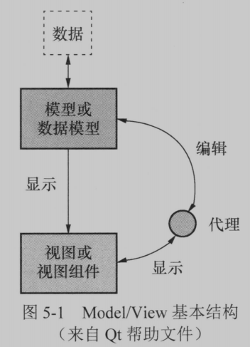
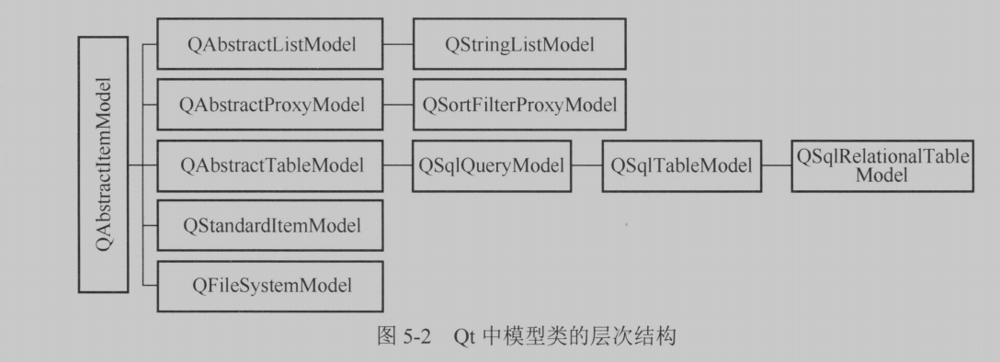
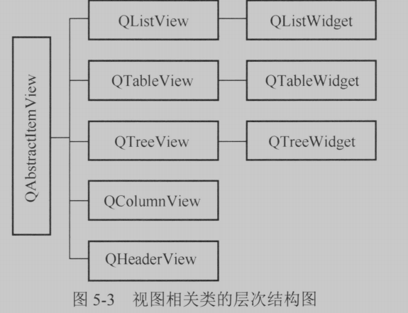
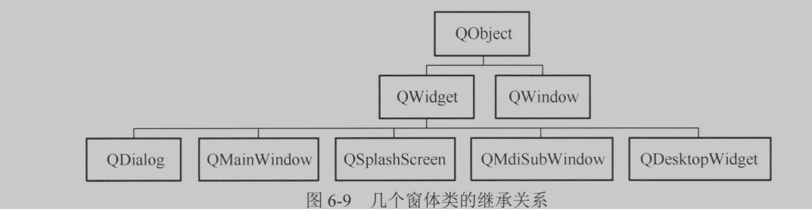
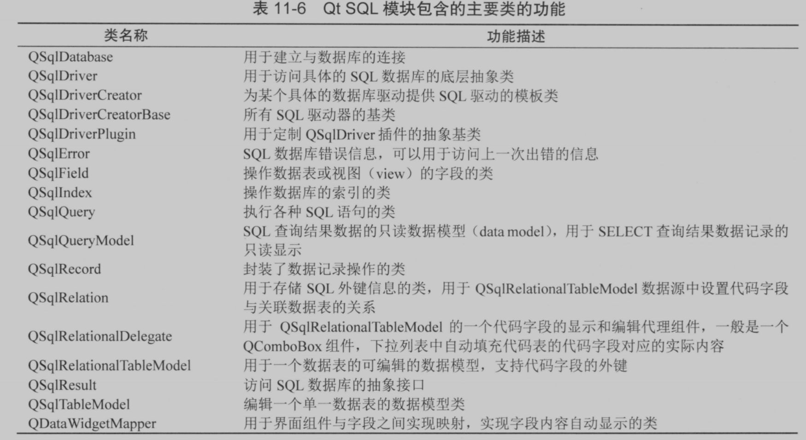
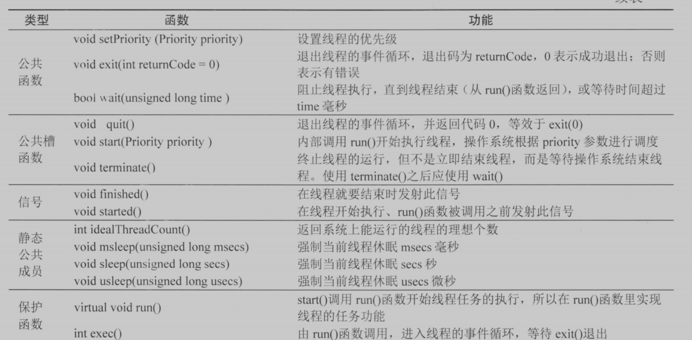
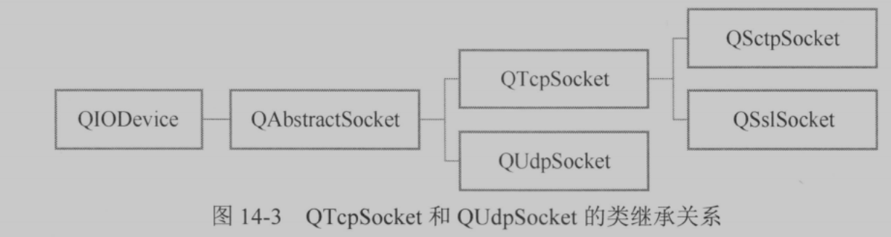

# Qt5.9C++开发指南

- [ ] 书籍作者：王维波 栗宝鹃 侯春望
- [ ] 笔记时间：2021.11.9

## 第1章 认识Qt

- Qt是一套应用程序开发类库，支持跨平台，1991年开发，1994发布。

## 第2章 GUI应用程序设计基础

- 项目文件组成
  - pro	项目设置文件，记录项目使用Qt版本，使用模块
  - ui xml格式的窗体布局文件
  - widget.h 设计窗体类头文件，含有Ui名称空间的一个类Widget，
  - main.cpp 入口类
  
- 编译后会自动生成 ui_widget.h 文件内，定义了一个类Ui_Widget，进行信号和槽的关联，组件关联。

- 伙伴关系是指一个label和一个组件相关联，文本输入如` Input(&N)`按住Alt就会提示N的快捷键

- 信号与槽是Qt基础，信号是被发射的事件，槽就是信号响应函数。

  使用QObject::connect进行关联

- 代码化实现，编写头文件，实现时候代码多

- QAction可以创建菜单项、工具栏按钮等，部分不能通过Creator直接添加的，可以通过代码手动添加

  - 创建控件，初始化，加入容器，绑定信号和槽

## 第3章 Qt类库概述

- Qt的元对象编译器（Meta-Object Compiler，MOC）是一个预处理器。提供对信号与槽的预处理
- 元对象系统
  - QObject 类是所有使用元对象系统的类的基类
  - private部分声明Q_OBJECT宏，使得类可以使用元对象特性
  - MOC为每个QObject子类提供必要代码实现元对象系统特性
  - 提供了一些方法
    - QObject::metaObject()返回关联的元对象，可以获取类的名称等
    - QMetaObject::newInstance()创建一个实例
    - QMeta::inherits()函数判断子类对象
    - qobject_cast()动态转换
- 属性系统
  - Q_PROPERTY宏可以定义属性，基于MOC，通过QObject::property()可以获取，可以动态添加
- 信号与槽
  - 执行速度与回调比慢一些，需要查找连接对象和槽函数，更灵活
  - connect()函数
    - 具有默认参数的信号/槽需要保证没有重载的函数
    - QObject::sender()可以获取发送者指针
    - 可以自定义信号，继承QObject，再signals定义信号
- Qt全局定义
  - QTGlobal包含一些全局定义，如基本数据类型、函数和宏
    - 基本类型，固定字节长度，跨平台
    - 函数，取整，随即数，大小比较等
    - 宏，qt版本、qDebug、foreach等 
- 容器类
  - 基于模板的类，线程安全，速度和存储进行过优化
  - 迭代器有两种：Java和STL版本 ，有只读和读写两种类型
    - Java指向数据项之间
    - STL是数组的指针，可以使用++，指向的是项，使用了隐式共享
    - 支持foreach
- Qt模块
  - 基本模块，core 、gui、qml等，使用qmake构建的话，可以再项目配置文件设置
  - 附加模块，蓝牙、定位等
  - 增值模块，
  - 预览模块，

## 第4章 常用界面设计组件

- 字符串
  - 转换处理，QString类自带转换函数
  - 存储的是Unicode码，常用函数 trim、isNull、count等 

- SpinBox
  - 和QDoubleSpinBox 输入控件，可以设置前后缀、最大值、最小值等
  - 其他输入控件  QSlider、QScrollBar、QDial、等

- 日期与定时器
  - QTime、QDate、QDateTime，通过fromString方法可以把字符串转为日期
  - QCalendarWidget显示日期

- QComboBox、QPlainTextEdit、QListWidget、QToolButton、QTabWidget、QTreeWidget、

  QDockWidget、QTabWidget、QLabel、QPixmap

## 第5章 Model/View结构

- 三者之间使用信号-槽 进行通信，代理是QBastractItemDelegate的派生类
- 
- 模型索引，视图和代理通过索引获取数据，是临时的。利用行、列、父项获取数据
- 

- 

## 第6章 对话框与窗体设计

- QFileDialog、QColorDialog等，自定义对话框从QDialog继承，模态直接exec()执行即可;

  show()则是以非模态框展示。可以通过信号-槽关联起来。

- 多窗口，QWidget没有指定父容器可以作为独立窗口

- 

## 第7章 文件系统额文件读写

- 文本文件读写 QFile的IODevice读写，或者QFile和QTextStream读写；

  使用setCodecForLocale对UTF-8进行识别。

- 二进制文件读写使用QFile和QTextStream读写；

- 文件目录操作，QFile、QCoreApplication、QDir等

## 第8章 绘图

- QPainter基本绘图，QPaintDevice提供绘图的抽象二维绘图界面，常见QWidget、QPixmap等。
- 覆盖paintEvent事件就可以绘制了
  - QPen线条绘制，粗细、虚线、端点等
  - QBrush 画笔颜色，支持渐变等效果
  - 图形绘制，drawArc、drawRect等

- 坐标系，平移、旋转等，支持状态的保存与回复
- 视口和窗口，视口表示绘图设备的任意一个矩形区域的物理坐标。窗口使用逻辑坐标定义的坐标系。

- Graphics View绘图架构，适合交互的绘图，比如绘图软件  。
  - QGraphicsScene提供场景，QGraphicsView提供视图，QGraphicsItem绘图项（支持鼠标等事件）
  - 可以自定义控件将事件响应转为信号和槽

## 第9章 Qt Charts

- 图表绘制，基于Qt的GraphicsView架构，核心是QChartView和QChart
- 使用需要添加项目配置文件里添加charts，引入头文件使用名称空间
- 可以绘制常见的各种图表，饼图、折线图、柱状图等

## 第10章 Qt DataVisualization

- 数据三维显示，主要是三维柱状图、三维散点图和三维曲面

## 第11章 数据库

- Qt SQL模块
- 

## 第12章 自定义插件和库

- 继承一个QWidget或其派生类，实现paintEvent().
  - UI设计其使用需要提升，无法可视化设计信号-槽
- 创建项目的时候选择Custom，需要进行各种配置，只能使用MSVC编译，解决中文乱码可以使用QStringLiteral或者强制MSVC使用UTF-8编码
- 静态链接库创建项目时候可以选择，使用都是复制到Release/Debug文件夹

## 第13章 多线程

- 通过QThread创建工作线程，线程可以通过信号-槽进行同步
- 除此之外，还提供了各种同步工具信号量，读写锁，互斥量
- 

## 第14章 网络编程

- QHostInfo QNetworkInterface
- TCP

- UDP数据报长度一般小于512字节，具有单播、组播、广播三种模式，API和TCP差不多
- HTTP，QNetWorkRequest、QNetworkAccessManager等

## 第15章 多媒体

- 音频 视频 摄像头

## 第16章 应用程序设计辅助功能

- 字符串使用tr()封装，尽量使用常量字符串，并且使用替换而不是拼接；

  项目配置TRANSLATION翻译文件，并使用lupdate工具生成语言翻译文件；

  Qt Linguist翻译ts文件，qm文件更紧凑；

- Qt样式表和CSS几乎一致

