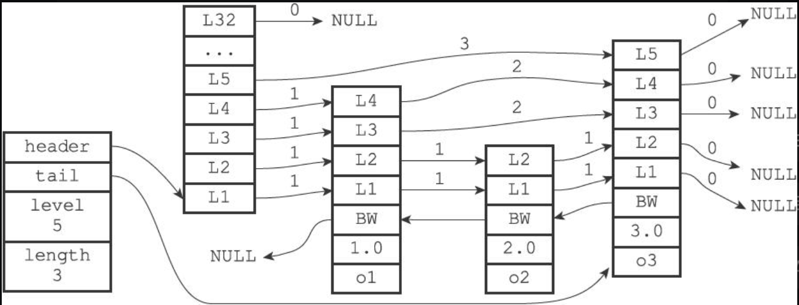
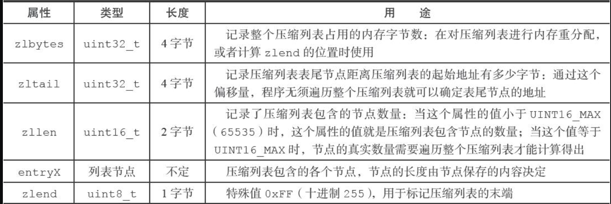
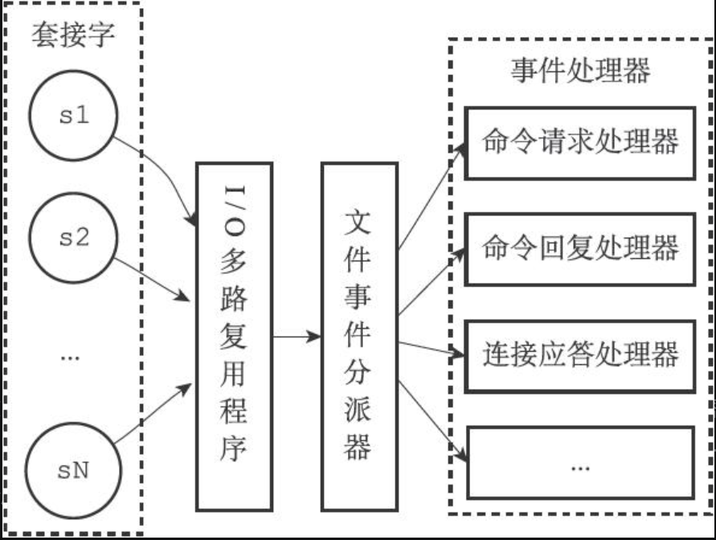
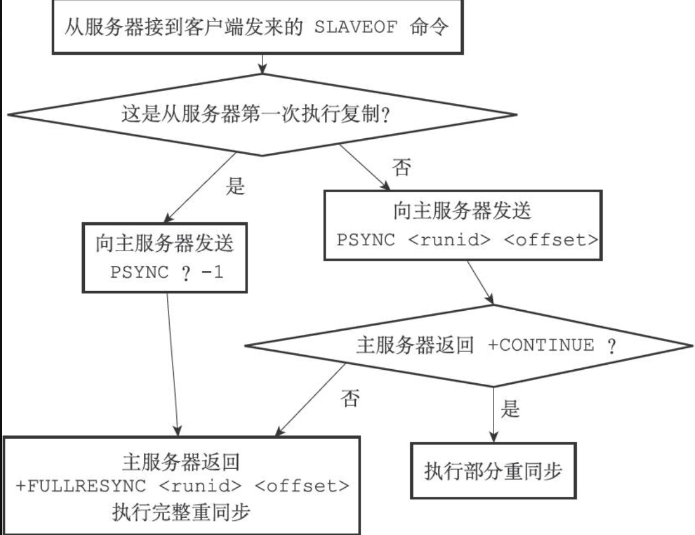
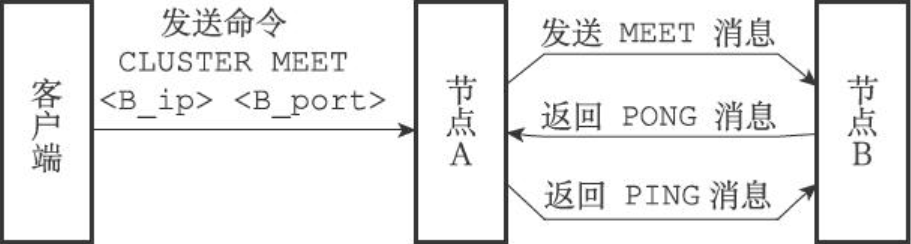
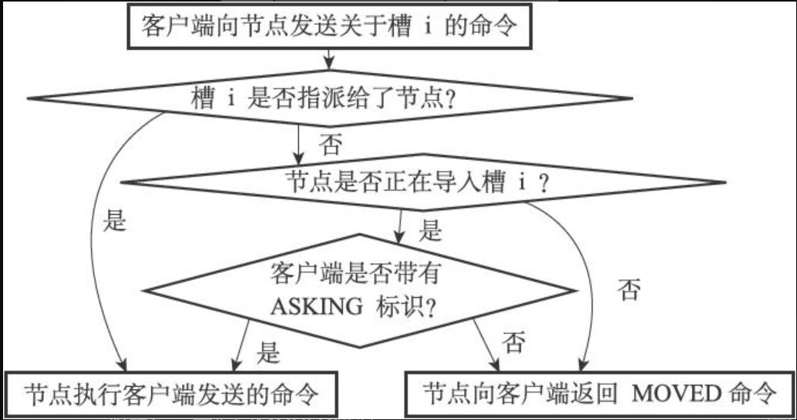
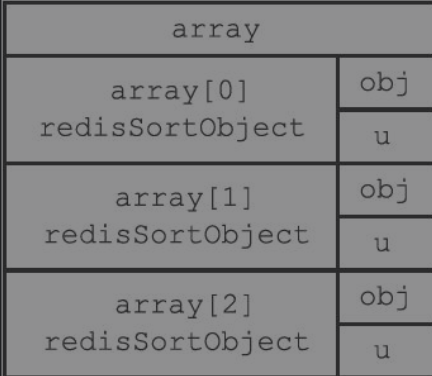

# Redis设计与实现

- [ ] 书籍作者：黄健宏 [书籍网站](http://redisbook.com/)
- [ ] 笔记时间：2021.7.15

## 第一部分 数据结构与对象

### 第2章 简单动态字符串

#### 2.1 SDS的定义

- 每个sds.h结构表示一个SDS值,可以重用一些c的代码

    ```c
    struct sdshdr{
        int len;	// 已经使用的字节数量,不考虑结尾
        int free;
        char buf[];	// 字符串,c自带'\0'
    }
    ```

#### 2.2 SDS与C字符串的区别

- c字符串长度需要计算,SDS不用
- 杜绝字符串长度溢出,strcat可以拼接.然而sdscat可以进行空间的检查
- 减少修改字符串带来的内存重新分配次数(默认拼接/截取都需要重新分配)
  - 如果对SDS修改后长度小于1MB，那么会分配 len*2+1字节
  - 如果大于等于1MB，则 free 等于 1MB

- 惰性控件释放 -- 当截取的时候没有重新分配，而是修改len
- 二进制安全 -- redis不是以'\0'来识别字符串结尾,可以储存任意字符串
- 兼容部分C字符串函数

### 第3章 链表

- Redis就会使用链表作为列表键的底层实现

#### 3.1 链表和链表节点的实现

- 使用的是双向链表，带有头尾节点

  ```c
  typedef struct listNode{
  	struct listNode * prev;
  	struct listNode * next;
  	void * value;
  }
  //----------------------------
  typedef  struct list{
      listNode * head;
      listNode  * tail;
      unsigned long len;
      void *(*dup)(void *ptr);
      // 释放节点函数 节点值对比函数
  }
  
  ```

### 第4章 字典

#### 4.1 字典的实现

- 也是采用数组+链表的形式,冲突链接法

  ```c
  typedef struct dictht{
      dictEntry  **table;// 哈希表数组
      unsigned long size;
      unsigned long sizemask; // size - 1
      unsigned long used;
  }
  // ------------------------------
  typedef struct dictEntry{
      void * key;
      union  {
          void * val;
          uint64_tu64;
          int64_ts64;
      }v;
  	struct dictEntry*  next;  	
  }dictEntry;
  ```

#### 4.2 哈希算法

- 基本就是hash函数计算哈希值,跟掩码与确定索引位置.hash函数采用了 MurmurHash2算法

#### 4.3 解决键冲突

- 链接法

#### 4.4 rehash

- 两张表同时查询,只插入新表.步骤如下
  1. 为新表ht[1]分配空间,大小为2^n^(接近used的数)
  2. 保存新键值对到ht[1],ht[0]迁移过去(部分)
  3. 迁移完毕,释放ht[0],新表接上

#### 4.5 渐进式rehash

- ht[1]分配空间后,字典维护一个索引器变量,每次CRUD顺带 将ht[0]在变量上的键值对rehash到新表,完成后将变量赋值为-1

### 第5章 跳跃表

- 在大部分情况下，跳跃表的效率可以和平衡树相媲美
- 有序集合键 和 集群节点内部数据据结构用到

#### 5.1 跳跃表的实现

- 跳跃表中的节点按照分值大小进行排序，当分值相同时，节点按照成员对象的大小进行排序。
- 每个跳跃表节点的层高都是1至32之间的随机数。
- 

### 第6章 整数集合

#### 6.1 整数集合的实现

- 整数在 集合里有序

  ```c
  typedef struct intset{    
      uint32_t  encoding;
      uint32_t length;
      int8_t contents[];
  }intset;
  ```

#### 6.2 升级

- 扩容 -> 转换 ->添加

#### 6.3 升级的好处

- 节约内存,提高灵活性

#### 6.4 降级

- 不支持

### 第7章 压缩列表

- 压缩列表（ziplist）是列表键和哈希键的底层实现之一.当一个哈希键/列表键只含少量键值对时自动使用.
- 使用连续空间记录,每个节点会记录节点大小,头部占1或5个字节

#### 7.1 压缩列表的构成

- 

#### 7.2 压缩列表节点的构成

- 每个压缩列表节点可以保存一个字节数组或者一个整数值.由previous_entry_length、encoding、content三个部分组成
- previous_entry_length 字节为单位,记录前一个节点长度

#### 7.3 连锁更新

- 因为使用连续空间的原因,所以一旦进行大小更改便会触发扩容,移动

### 第8章 对象

- Redis 通过五种类型的对象,底层使用了至少一种结构

#### 8.1 对象的类型与编码

- 每个对象由 redisObject 结构表示

  ```c
  typedef struct redisObject{
      unsigned type:4;
      unsigned encoding :4;
      void *ptr;
  }
  ```

- type 记录对象的类型,可能是 字符串,列表,哈希,集合,有序集合

  TYPE 命令返回的时对象类型,不是底层类型

- 编码和 底层实现

  - ptr指针指向对象的底层实现数据结构, 整型,字符串,等等,使用 OBJECT ENCODING 可以查看 

#### 8.2 字符串对象

- 编码可以是
  - int 保存的是整型,可以用long表示的话
  - raw 字符串且长度大于32字节,简单动态字符串SDS就可以保存
  - embstr 小于32字节时使用,只读,添加会变成raw

#### 8.3 列表对象

- 列表对象的编码可以是ziplist或者linkedlist。
- 编码转换 所有字符串成都小于64字节,元素个数小于512 就会使用压缩列表

#### 8.4 哈希对象

- 哈希对象的编码可以是ziplist或者hashtable。
  - 压缩列表键值对紧挨在一起,后来的键值对放在表尾方向
- 编码转换 和列表对象的一样

### 8.5 集合对象

- 集合对象的编码可以是intset或者hashtable。
  - 值全都是NULL
  - intset 条件,都是整数,不超过512

#### 8.6 有序集合对象

- 有序集合的编码可以是ziplist或者skiplist。
  - 压缩列表实现,第一个节点是成员,第二个是元素的分值,有序
  - 跳表实现包含一个字典和一个跳表,字典保存元素和分值,字典负责查找键,跳表负责查找值 
- 转换条件 个数小于128长度小于64使用 压缩列表

#### 8.7 类型检查与命令多态

- 通用的命令 DEL EXPIRE 等,多态命令
- 特定类型 SET  GET等,通过检查 redisObject 的type属性实现

#### 8.8 内存回收

- 利用引用计数进行释放回收

#### 8.9 对象共享

- 目前来说，Redis会在初始化服务器时，创建一万个字符串对象，这些对象包含了从0到9999的所有整数值

#### 8.10 对象的空转时长

- lru属性，该属性记录了对象最后一次被命令程序访问的时间

## 第二部分

### 第9章 数据库

#### 9.1 服务器中的数据库

- Redis服务器将所有数据库都保存在服务器状态redis.h/redisServer结构的db数组中

#### 9.2 切换数据库

- SELECT num,默认有16个数据库

#### 9.3 数据库键空间

- 服务器中的每个数据库都由一个redis.h/redisDb结构表示，其中，redisDb结构的dict字典保存了数据库中的所有键值对，我们将这个字典称为键空间
- CRUD -- SET DEL GET 
- 读取会更新命中，LRU，
  - 如果过期会清除键
  - 如果客户端使用WATCH监视某个键，服务器对键修改之后会标记为脏，将对应计数器加一

#### 9.4 设置键的生存时间或过期时间

- 通过EXPIRE命令或者PEXPIRE命令，客户端可以以秒或者毫秒精度为数据库中的某个键设置生存时间，SETEX只能用于字符串
- redisDb结构的expires字典保存了数据库中所有键的过期时间，盖子点称为过期字典
  - 键是一个指针，指向键空间中某个键对象
  - 过期字典值是一个long long的整数
- PERSIST 是 PEXPIREAT 反操作，接触键值在过期字典的关联
- 过期键判定 -- 过期字典查询，当前时间戳大于过期时间？

#### 9.5 过期键删除策略

- 定时删除 -- 内存友好，CPU不友好，复杂度O（N），原因无序链表
- 惰性删除 -- CPU友好，内存不友好，可以认为某种内存泄露
- 定期删除 -- 定时延长版

#### 9.6 Redis的过期键删除策略

- 过期键的惰性删除策略由db.c/expireIfNeeded函数实现,读写命令执行之前都会调用进行检查,过期则删除
- 过期键的定期删除策略由redis.c/activeExpireCycle函数实现,规定的时间内，分多次遍历服务器中的各个数据库，从数据库的expires字典中**随机检查**一部分键的过期时间，并删除其中的过期键。

#### 9.7 AOF、RDB和复制功能对过期键的处理

- 执行SAVE命令或者BGSAVE命令创建一个新的RDB文件时，过期的键不会加入
- 载入RDB文件
  - 主服务器模式,过期键会被忽略
  - 从服务器模式,全都加载
- AOF文件写入 -- 没有影响,但是重写会忽略
- 复制模式 -- 由主服务器控制,只有它发送DEL才会删除

#### 9.8 数据库通知

- 服务器配置的notify-keyspace-events选项决定了服务器所发送通知的类型
- 订阅-发布模型

### 第10章 RDB持久化

#### 10.1 RDB文件的创建与载入

- SAVE 和 BGSAVE 命令可以生成RDB文件,默认优先AOF
- BGSAVE期间禁止SAVE,BGSAVE和BGREWRITEAOF
- 载入RDB期间处于阻塞状态

#### 10.2 自动间隔性保存

- 900s 修改一次,300s修改10次,60s修改10 000次,保存条件是 redisServer.saveparam属性
- dirty计数器记录距离上一次成功执行SAVE命令或者BGSAVE命令之后，服务器对数据库状态进行了多少次修改
- lastsave属性是一个UNIX时间戳，记录了服务器上一次成功执行SAVE命令或者BGSAVE命令的时间
- Redis的服务器周期性操作函数serverCron默认每隔100毫秒就会执行一次

#### 10.3 RDB文件结构

| REDIS |db_version |databases |EOF |check_sum |
| ------------------------------------------------ | ---- | ---- | ---- | ---- |
| 常量 | 版本 | 保存任意多个非空数据库 | 常量 | 校验和 |
|                                                  |      |      |      |      |

- 

- 不带过期时间键值对由 TYPE key value 三部分组成

#### 10.4 分析RDB文件

- 使用od命令来分析Redis服务器产生的RDB文件，该命令可以用给定的格式转存（dump）并打印输入文件

- Redis本身带有RDB文件检查工具redis-check-dump

### 第11章 AOF持久化

- 记录的是操作指令

#### 11.1 AOF持久化的实现

- 命令追加 -- 执行完写命令后追加到 aof_buf 缓冲区
- AOF文件的写入与同步 -- Redis的服务器进程就是一个事件循环,默认每秒同步aof文件

#### 11.2 AOF文件的载入与数据还原

- 步骤 服务器启动载入程序 -> 创建伪客户端 -> AOF文件分析并读取一条写命令 -> 执行直到所有命令完成 

#### 11.3 AOF重写

- 实现功能是通过读取服务器当前的数据库状态来实现的,将命令放在AOF文件替换掉原来的AOF文件
  - 对集合的处理,假如元素数量过多(超过64个),会分为多条添加指令
- 后台重写带有父进程数据副本,同时父进程还在处理请求,可能造成数据不一致.所以命令会同时发给AOF缓冲区和AOF重写缓冲区

### 第12章 事件

#### 12.1 文件事件

- Redis基于Reactor模式开发了自己的网络事件处理器：这个处理器被称为文件事件处理器
  - 文件时间处理器处理器使用 IO多路复用 程序监听套接字,执行操作就会有对应的事件产生
  - 通过队列传输事件,复用程序实现有 select epoll evport kqueue,监控Socket 的读写状态并发送事件,优先读
  - 

#### 12.2 时间事件

- 定时 和  定期两种类型,由 id when timeProc 三个属性组成
- 实现 -- 所有时间事件都放在一个无序链表中,头插法,执行需要遍历

#### 12.3 事件的调度与执行

- 处理完文本事件后若没有时间事件到达,再次等待处理时间事件
- 事件处理都是同步、有序、原子地执行的,耗时过长的事件会分多次(命令事件)或者交给子线程(时间事件)进行处理

### 第13章 客户端

- 对于每个与服务器进行连接的客户端，服务器都为这些客户端建立了相应的redis.h/redisClient结构（客户端状态）
- 客户端状态连成一条链表

#### 13.1 客户端属性

- 通用属性 
  - 套接字描述符 fd -- 记录了客户端正在使用的套接字描述符, -1 表示伪客户端,
  - 名字 name -- 默认为空,可以设置
  - 标志 flags -- 记录客户端的角色以及状态. 默认不修改的操作就是读操作,不会写入AOP,PUBSUB命令和SCRIPT LOAD命令.它们会影响客户端状态和服务器状态
  - 服务器会把命令保存到querybuf属性,直接将参数和参数个数保存到其他属性里
  - 输出也会放到缓冲区,大小16k字节,太大数据就会放到链表里 
  - 身份验证 -- authenticated属性
  - 时间 -- 创建时间 最后互动时间 
- 特定功能相关属性 

#### 13.2 客户端的创建与关闭

- 网络连接的客户端会调用连接事件处理器,将客户端状态添加到clients尾部
  - 客户端输出大小可以通过设置限定大小
- Lua脚本的伪客户端会一直存在,直到服务器关闭
- AOF伪客户端载入完成后关闭

### 第14章 服务器

#### 14.1 命令请求的执行过程

- 客户端会将协议格式的请求发送给服务器
- 服务器在socket可读时候，将请求保存到客户端状态的输入缓冲区，提取参数等信息，调用命令执行器
- 服务器
  - 根据 信息查找 命令保存到客户端状态的cmd属性
  - 执行预备操作,检查指针,属性,身份验证等
  - 执行,完成后处理后续(慢查询 ,计数器,AOF等)
  - 命令回复,清空缓冲区

#### 14.2 serverCron函数

- serverCron函数默认每隔100毫秒执行一次，这个函数负责管理服务器的资源，并保持服务器自身的良好运转。
  - 更新服务器时间缓存,减少系统调用次数,用于时间要求不是很精确的情况
  - 更新LRU时钟,serverCron函数默认会以每10秒一次的频率更新lruclock属性的值
  - 更新服务器每秒执行命令次数
  - 更新服务器内存峰值记录
  - 处理SIGTERM信号
  - 管理客户端资源
  - 管理数据库资源
  - 执行被延迟执行的BGREWRITEAOF
  - 检查持久化操作的运行状态

#### 14.3 初始化服务器

- 创建  redisServer 类型实例并初始化一些信息(ID,运行频率,配置文件路径,端口号,AOF/RDB条件等)
- 载入配置文件,命令行参数设置
- 初始化其他结构 比如clients链表,db数组等,含进行重要处理:
  - 为服务器设置进程信号处理器
  - 创建共享对象
  - 打开监听端口,创建时间事件,打开AOF
- 还原数据库状态,载入RDB/AOF
- 执行事件循环

## 第三部分

### 第15章 复制

- 通过执行SLAVEOF命令或者设置slaveof选项，让一个服务器去复制（replicate）另一个服务器

#### 15.1 旧版复制功能的实现

- 同步 -- slaveof 命令执行后
  - 从服务器发送SYNC给主服务器
  - 主服务器BGSAVE生成RDB发送给从服务器
  - 从服务器载入,再接收来自主服务器的缓冲区写命令 
- 命令传播 -- 主服务器将命令发送给从服务器,两者达到数据一致

#### 15.2 旧版复制功能的缺陷

- 断线重连后效率低 ,会跟同步操作一样

#### 15.3 新版复制功能的实现

- 使用PSYNC,完整重同步和部分重同步(断点续传)

#### 15.4 部分重同步的实现

- 复制偏移量 -- 双方分别维护一个复制偏移量
- 复制积压缓冲区 -- 大小默认1MB,主服务器维护,如果复制偏移量(从服务器)在挤压缓冲区内,那么就是部分重同步
- 服务器运行ID -- 需要主服务器保存从服务器ID,已经保存了才能部分重同步

#### 15.5 PSYNC命令的实现



#### 15.6 复制的实现

- 设置主服务器地址和端口，保存到服务器状态的属性里
- 建立Socket连接，从服务器变成主服务器的客户端
- 发送PING命令，连接成功后身份验证
- 发送端口消息，监听端口号
- 同步，从该服务器向主服务器发送PSYNC命令 
- 命令传播

#### 15.7 心跳检测

- 命令传播阶段默认每秒向主服务器发送  REPLCONF ACK offset 命令
- 主从服务器可以通过发送和接收REPLCONF ACK命令来检查两者之间的网络连接是否正常
- 当主服务器发现偏移量不对，会从复制积压缓冲区找到并发送给它

### 第16章 Sentinel

- 哨兵是Redis的高可用解决方案：监视多个主服务器及其从服务器，当主服务器下线后自动升级新的从服务器

#### 16.1 启动并初始化Sentinel

- 启动Sentinel命令 `redis-sentinel /patn/to/your/sentinel.conf`

1. 初始化服务器 -- 本质是运行在特殊模式下的redis服务器，所以也许需要初始化，只是内容有所不同。比如不需要载入RDB/AOF
2. 将一部分普通Redis服务器使用的代码替换成Sentinel专用代码，比如端口使用，命令表的映射等
3. 初始化Sentinel状态 -- sentinelState的结构，一般状态由redisServer保存
4. 初始化Sentinel状态的masters属性 -- 记录被监视主服务器名字
5. 创建连向主服务器的网络连接 -- 成为主服务器客户端，创建 命令连接和订阅连接

#### 16.2 获取主服务器信息

- 默认10s一次通过命令连接向 主服务器发送INFO命令，可以获得主服务器本身信息以及从服务器的信息

#### 16.3 获取从服务器信息

- 也会创建两个连接，获取关于从服务器的各种信息，比如id，role等

#### 16.4 向主服务器和从服务器发送信息

- 2s发送一次PUBLISH命令 \_sentinel_:hello 频道,

#### 16.5 接收来自主器和从服务器的频道信息

- `SUSCRIBE _sentinel_:hello`直到连接断开才不接收，就是说既是发布者又是订阅者，会被多个sentinel 接收到
- 更新sentinels字典，键就是sentinel名字，值就是对应实例结构。通过分析接收到的频道信息Sentinel可以感知其他Sentinel
- 感知到其他sentinel，会创建一个新的命令连接，双向

#### 16.6 检测主观下线状态

- 每秒发送一次PING命令，通过命令连接
- 配置down-after-milliseconds可以判断超过该时长没有响应的服务器就是掉线了，sentinel会修改标志位，不同sentinel可能有不同的判断时长

#### 16.7 检查客观下线状态

- 当足够数量的Sentinel判断主服务器集下线，就会执行故障转移，quorum就是限制
- `SENTINEL is-master-down-by-addr`该命令询问是否同意主服务器已下线

#### 16.8 选举领头Sentinel

- 由领头Sentinel对下线服务器执行故障转移
- 选举领头Sentinel规则
  - 所有在线sentinel都资格，每次选举epoch自增一次
  - 同一个epoch里面都有一次机会成为局部领头Sentinel，规则就是先到先得
  - 如果半数以上Sentinel都设置了，那么就选举完成

#### 16.9 故障转移

- 选出新的主服务器 -- 删除下线、最近五秒没有回复INFO命令、连接中断，剩下的根据优先级排序，相同优先级则看偏移量，再看ID（小的当选）
- 修改从服务器复制目标 SLAVEOF 可以实现 
- 旧服务器转为从服务器
- Raft算法的实现

### 第17章 集群

#### 17.1 节点

- 连接节点`CLUSTER MEET ip port`可以进行握手，成功则加入
- 启动时候根据 cluster-enabled 决定单机还是集群

- 集群数据结构clusterNode，保存节点的创建时间，IP，纪元等，并为其他节点创建结构

- CLUSTER MEET 命令实现 -- 握手，源节点创建集群结构，发送MEET消息，接收响应PONG，再发送PING确认

  

#### 17.2 槽指派

- 集群通过分片保存键值对，一共分为 16384 个槽，数据库每个键都属于其中一个槽
- 通过向节点发送CLUSTER ADDSLOTS命令，我们可以将一个或多个槽指派（assign）给节点负责

- 槽指派信息
  - 记录 -- clusterNode 的 slots属性是一个二进制位数组，1表示负责处理
  - 传播 -- 发送给集群的其他节点
  - 记录集群所有指派信息 -- clusterState 的 slots 数组，存储的是clusterNode，可以直接知道该槽是否被指定

-  CLUSTER ADDSLOTS命令的实现
  - 遍历所有输入槽 ，如果已经指派，报错。否则修改曹指派信息

#### 17.3 在集群中执行命令

- 槽指派完毕，集群进入上线状态，客户端发送与数据库键有关的命令会计算属于哪个槽，之后定位到对应的节点
-  计算键属于哪个槽
  - `CRC16(key) & 16383`
  - MOVED错误，当节点发现自己不是该槽指派节点，就会引导到正在处理的节点（集群模式默认不打印，单机默认打印）
  - 节点只能使用0号数据据库，除了将键值对保存在数据库里面之外，节点还会用clusterState结构中的slots_to_keys跳跃表来保存槽和键之间的关系

#### 17.4 重新分片

- 可以将任意数量已经指派给某个节点（源节点）的槽改为指派给另一个节点（目标节点），可以在线进行

- Redis集群的重新分片操作是由Redis的集群管理软件redis-trib负责执行的
  - redis-trib对目标/源节点发送CLUSTER SETSLOT，准备好迁移
  - redis-trib向源节点发送CLUSTER GETKEYSINSLOT，获取键名，对于每个键名都要发送一条 MIGRATE命令，直到完成。

#### 17.5 ASK错误

- 当客户端向源节点发送一个与数据库键有关的命令，并且命令要处理的数据库键恰好就属于正在被迁移的槽时
  - 找到则 执行
  - 否则返回ASK错误，引导至目标节点

- CLUSTER SETSLOT IMPORTING命令
  - importing_slots_from 数组记录当前节点正在从其他节点导入的槽

- ASKING命令 -- 打开发送该命令的客户端的REDIS_ASKING标识，是迁移过程中的一种临时措施

  

#### 17.6 复制与故障转移

- 集群节点分主从
  - 设置从节点 `CLUSTER  REPLICATE  id`，修改自己在clusterState.myself.flags中的属性，复制代码
- 故障检测
  - 集群节点定期发送心跳PING，各节点之间交换节点状态新信息，半数以上节点认为节点 x下线后，广播 该节点FAIL消息
- 故障转移
  - 从节点挑一个，成为新主节点，接手槽指派并且广播PONG消息
  - 选举也是基于Raft算法实现

#### 17.7 消息

- 五种消息
  - MEET消息 -- 将加入集群
  - PING -- 每秒选出五个节点中醉酒没有发送过PING的节点发送
  - PONG -- 对PING的响应
  - FAIL -- 将某个节点标记为下线
  - PUPBLISH -- 执行相同的命令

- 消息头 -- 记录新消息类型/长度/来源/发送者的指派槽/集群状态等

- 消息正文 -- 是一个联合，接收者根据消息进行新增/更新

## 第四部分

### 第18章 发布与订阅

#### 18.1 频道的订阅与退订

- Redis将所有频道的订阅关系都保存在服务器状态的pubsub_channels字典里面，这个字典的键是某个被订阅的频道，而键的值则是一个链表
- 操作就是定位频道，通知，删除节点，批量操作也只是遍历

#### 18.3 发送消息

- 遍历模式，匹配则通知链表各节点

#### 18.4 查看订阅信息

- PUBSUB命令可以查看订阅信息

### 第19章 事务

#### 19.1 事务的实现

- MULTI 开头，EXEC结尾
- 指令入队，除开EXEC、DISCARD、WATCH、MULTI。每个客户端都有自己的事务队列

#### 19.2 WATCH命令的实现

- WATCH是一个乐观锁，可以在EXEC命令执行之前，监视任意数量的数据库键，并在EXEC执行时，检测是否被修改过
- 也是字典记录watch的键，所有修改命令在执行之后都会视情况修改REDIS_DIRTY_CAS
- 服务器接收到EXEC会先检查REDIS_DIRTY_CAS是否打开，若是则拒绝执行。

#### 19.3 事务的ACID性质

- 不支持回滚，效率问题
- Redis通过谨慎的错误检测和简单的设计来保证事务的一致性
  - 入队错误拒绝执行，只有成功入队的SET命令和GET命令被执行
  - 执行错误，不会中断事务，已经执行的命令也不会受影响
  - 服务器停机，不影响一致性
- 单线程保证隔离性
- 持久性，AOF保存的情况下才有持久性，手动SAVE，不推荐，低效

### 第20章 Lua脚本

- 使用EVAL命令可以直接对输入的脚本进行求值

#### 20.1 创建并修改Lua环境

1. 创建 Lua 环境，服务器首先调用Lua的C API函数lua_open，创建一个新的Lua环境。
2. 载入函数库，引入各种函数 库
3. 创建redis全局表格，服务器将在Lua环境中创建一个redis表格（table），并将它设为全局变量。
4. 使用Redis自制的随机函数来替换Lua原有的随机函数
5. 创建排序辅助函数
6. 创建redis.pcall函数的错误报告辅助函数
7. 保护Lua的全局环境
8. 将Lua环境保存到服务器状态的lua属性里面

#### 20.2 Lua环境协作组件

- 伪客户端 -- Redis必须有客户端才可以执行命令。
- lua_scripts字典 -- 执行过的脚本保存到该字典，

#### 20.3 EVAL命令

- 生成校验和命名的函数 ，保存到字典，调用

#### 20.5 脚本管理命令的实现

- SCRIPT FLUSH -- 清除服务器中所有和Lua脚本有关的信息
- SCRIPT EXISTS -- 判断服务器中是否有该脚本
- SCRIPT LOAD -- 创建函数，保存到字典 
- SCRIPT KILL -- 超时就强制结束脚本

#### 20.6 脚本复制

- Redis复制 EVAL 、SCRIPT FLUSH、SCRIPT LOAD三个命令和其他命令 一样
- 复制EVALSHA -- EVALSHA命令的时候，必须确保EVALSHA命令要执行的脚本已经被所有从服务器载入过 
- 每当主服务器添加一个新的从服务器时，主服务器都会清空自己的repl_scriptcache_dict字典，这是因为随着新从服务器的出现，repl_scriptcache_dict字典里面记录的脚本已经不再被所有从服务器载入过
- 当主服务器成功在本机执行完一个EVALSHA命令之后，它将根据EVALSHA命令指定的SHA1校验和是否存在于repl_scriptcache_dict字典来决定是向从服务器传播EVALSHA命令还是EVAL命令

### 第21章 排序

#### 21.1 SORT＜key＞命令的实现

- 创建一个和numbers列表长度相同的数组，元素是排序对象
- 遍历 将各个数组项的obj指针分别指向numbers列表的各个项，转换浮点数，根据分数进行排序，返回obj指针指向的列表



#### 21.2 ALPHA选项的实现

- 对字符串进行排序
- 创建数组，obj指针指向各个元素，排序，遍历

#### 21.3 ASC选项和DESC选项的实现

#### 21.4 BY选项的实现

- 通过使用BY选项，SORT命令可以指定某些字符串键
- 可以组合使用

#### 21.6 LIMIT选项的实现

- 需要先排序，支持跳过

#### 21.7 GET选项的实现

- 指定返回的部分值

#### 21.8 STORE选项的实现

- 排序后检查键是否存在，存在则 置空，使用RPUSH逐个压入

#### 21.9 多个选项的执行顺序

- 排序：在这一步，命令会使用ALPHA、ASC或DESC、BY
- 限制排序结果集的长度
- 获取外部键，get
- 保存结果，store
- 返回结果集

### 第22章 二进制位数组

#### 22.1 位数组的表示

- Redis使用字符串对象来表示位数组，因为字符串对象使用的SDS数据结构是二进制安全的
- buf数组使用逆序来保存位数组

#### 22.2 GETBIT命令的实现

- GETBIT 返回位数组bitarray在offset偏移量上的二进制位的值。O（1）数组定位

#### 22.3 SETBIT命令的实现

- 同上，超过位数会扩大，默认SDS存储两倍长度

#### 22.4 BITCOUNT命令的实现

- 遍历 On
- 查表 表需要很大，会有内存压力
- 二进制统计 ，计算汉明重量，variable-precision SWAR算法
- redis使用后两者结合，低于128位直接查表

#### 22.5 BITOP命令的实现

- 直接用C语言的实现

### 第23章 慢查询日志

- Redis的慢查询日志功能用于记录执行时间超过给定时长的命令请求
  - slowlog-log-slower-than选项指定执行时间
  - slowlog-max-len选项指定服务器最多保存多少条
- SLOWLOG GET命令查看，

#### 23.1 慢查询记录的保存

- 服务器状态中包含了几个和慢查询日志功能有关的属性
  - slowlog_entry_id属性的初始值为0，每当创建一条新的慢查询日志时自增
  - slowlog链表保存了服务器中的所有慢查询日志，

#### 23.2 慢查询日志的阅览和删除

- 链表的操作

#### 23.3 添加新日志

- 每次执行命令的之前和之后，程序都会记录微秒格式的当前UNIX时间戳

### 第24章 监视器

- 通过执行MONITOR命令，客户端可以将自己变为一个监视器，实时地接收并打印出服务器当前处理的命令请求的相关信息

#### 24.1 成为监视器

- 又是链表，观察者模式

#### 24.2 向监视器发送命令信息

- 服务器在每次处理命令请求之前，都会将被处理的命令请求的相关信息发送给各个监视器。
