# [Sklearn 与 TensorFlow 机器学习实用指南第二版](https://hands1ml.apachecn.org/#/?id=sklearn-与-tensorflow-机器学习实用指南第二版)

- 书籍作者：: [Aurélien Géron](https://book.douban.com/search/Aurélien Géron)

- 笔记时间：2022.02.25

## 第一章 机器学习概览

- 机器学习：是让计算机具有学习的能力，无需进行明确编程
  - 垃圾邮件过滤举例，手动编程需要自定义过滤规则，而机器学习可以通过训练生成
  - 具有适应新数据的能力

- 数据挖掘：使用机器学习方法挖掘大量数据，可以发现并不显著的规律

- 机器学习分类
  - 人类监督：
    - 监督：用来训练算法的数据里包含了答案，称为标签 。典型任务是分类和预测
    - 非监督：训练数据没有标签，典型任务聚类、可视化、异常检测、关联规则
    - 半监督：训练数据大部分不带标签，典型任务相册分类
    - 强化学习：学习系统称为Agent，根据奖励/惩罚做出选择策略
  - 动态渐进式学习：
    - 批量学习：不能持续学习，必须使用所有可用数据
    - 在线学习：使用数据持续进行训练，每次训练小批量数据。典型任务 股票分析。会受到异常数据影响
  - 数据比较：
    - 基于实例学习：系统先用记忆学习案例，然后使用相似度测量推广到新的例子
    - 基于模型学习：建立这些样本的模型，然后使用这个模型进行预测
  
- 挑战

  - 数据量不足，一般需要几百上千
  - 没有代表性的训练数据，就会有样本噪音，出现样本偏差
  - 低质量数据，异常值、噪音过多
  - 不相关特征，特征工程就是为了提取好的特征进行训练
  - 过拟合
    -  数据量小、参数过多导致模型复杂，
    - 限定一个模型以让它更简单，降低过拟合的风险被称作正则化
    - 正则化的度可以用一个超参数控制，它是学习算法的参数
  - 欠拟合
    - 模型过于简单
    - 减少模型限制，减少正则化超参数、用更强大的模型、更好的特征

  

- 确认和测试

  - 将数据分为测试集和训练集，一般2：8 。同时使用交叉验证

## 第二章 一个完整的机器学习项目

- 项目是基于加州房产数据，目标是预测街区的中位数价格

- 划分问题：

  - 商业目标是什么 ？比如模型输出给另一套机器学习系统以预测该街区值不值得投资
  - 解决方案效果？参考性能，比如误差率 15%

- 拟定方案

  - 根据以上问题选择 监督/非监督/强化学习？属于监督学习，因为数据集带有标签，典型回归问题

  - 选择性能指标，回归问题典型使用均方根误差  RMSE，平均绝对误差 MAE

  - m是验证集样本数量，x是样本的特征向量，y是标签值，h是预测函数。RMSE对异常值更敏感

    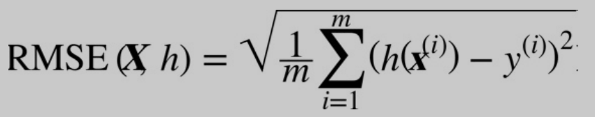

    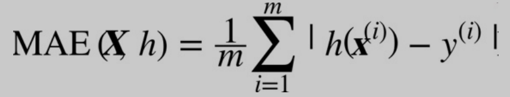

- 数据
  - 数据预处理
    - 加载文件，查看数据信息（如NaN，有没有上下限设置，对于超过上下限的数据可以重新收集数据或者剔除），数据分布
    
    - 划分测试集
      - 随机生成索引，划分索引 ------ 假如数据集发生变化则会导致划分不一致
      
        好处在于大小相同的数据集会有相同的划分
      
      - 利用对象的hash值进行划分，比如大小比较，mod等，ID可以利用主键，行号，经纬度等唯一标识
      
      - 以上两种是基于纯随机的抽样方法，假如是分层抽样，会出现较大偏差
      
        以收入中位为例，集中在2~5万美元，将中位数除以1.5，向上取整并限制范围，之后就可以分层抽样
      
      - API 使用 sklearn.model_selection 下的 train_test_split 和 StratifiedShuffleSplit
      
    - 数据探索
    
      - 将房屋根据经纬度绘制成散点图，可以看到加州的大致形状。通过设置不透明度可以看到集中的区域。
      - 绘制房价图，plot(s=,c=) ,s用人口数量，c用颜色，cmap用jet。可以看到房屋信息与沿海距离有关系，可以使用聚类算法分析
      - 寻找相关性，corr，皮尔逊相关系数。scatter_matrix可以用于绘制关系散点图
      - 通过观察 房价和收入 的散点图可以发现有比较明显关联信息，还可以根据需求观察更多信息，比如人均房间数与房价关系等
    
  - 数据准备
  
    - 数据清洗：缺失值函数处理
  
      - 丢弃属性
  
      - 丢弃该条记录
  
      - 补充为0、平均数、中位数
  
      - API 使用 sklearn.impute 下的 SimpleImputer
  
      - fit作用：求得各种数据指标，比如均值，方差，最大值，最小值等
  
        transform作用：标准化，降维，归一化等
  
    - 文本值处理
  
      - 将标签进行编号，使用 LabelEncoder，但是机器学习算法会以为两个数字接近就代表两类接近
      - one-hot编码，转为向量。接收的是二维数组，所以需要将一维转二维
      - 使用CategoricalEncoder完成前面两者的功能
      - 自定义转换器需要依赖鸭子类型，BaseEstimator，TransformerMixin
  
    - 特征缩放
  
      - 归一化：缩放到0~1之间，
      - 标准化：受异常值影响较小

- 训练
  - 模型选择：线性回归、决策树回归、随机森林回归
  - 验证：交叉验证
  - 损失函数：RMSE
  - 目的：筛选可用模型2~5个，记得随时保存模型
  - 调整模型：通过调整超参数
    - 网格搜索，自动尝试超参数的各个取值，并使用交叉验证获取最佳参数
    - 随即搜索：当参数范围过大时候选择
    - 集成方法：表现最优模型组合起来

## 第三章 分类

- MNIST数据集

  - 加载数据集，scikit-learning 有API可以下载，不同版本会有变化，参看[官网文档](https://scikit-learn.org/stable/datasets/loading_other_datasets.html#loading-other-datasets)

  - 查看，数据集是一个字典，通过data，target等属性获取，图片是28*28大小，

    可以通过数组的合并显示为一张图

  - 划分数组集，通过打乱下标进行划分

- 训练一个二元分类器，只区分是不是某个数字

  - 使用SGD（随机梯度下降）分类器进行训练

  - 使用交叉验证+混淆矩阵，

    - 精度 R=TP/(TP+FP)，表示被分为正例的示例中实际为正例的比例，针对的是预测样本

    - 召回率 R=TP/(TP+FN)，度量有多少个实际正例被分为正例,也叫灵敏度，TPR，针对的是实际样本

    - 准确率 ACC=(TP+TN)/(TP+TN+FP+FN)，

      准确率通常无法成为分类器的首要性能指标，特别是处理偏斜数据集的时候

    - F1 = 2/(ACC^-1^+R^-1^) ,谐波平均值

      召回率和准确率需要平衡 

    - ROC曲线，受试者工作特征曲线，描绘 TPR与FNR关系

    - 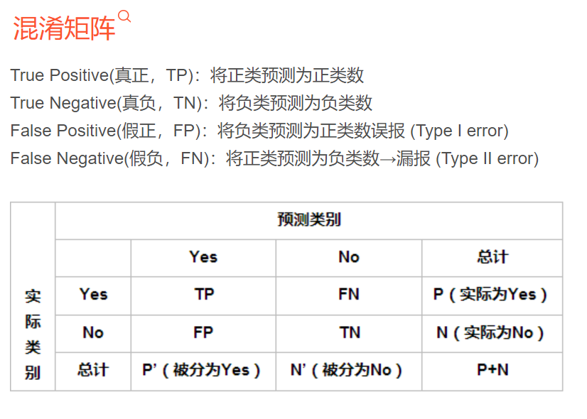

    - 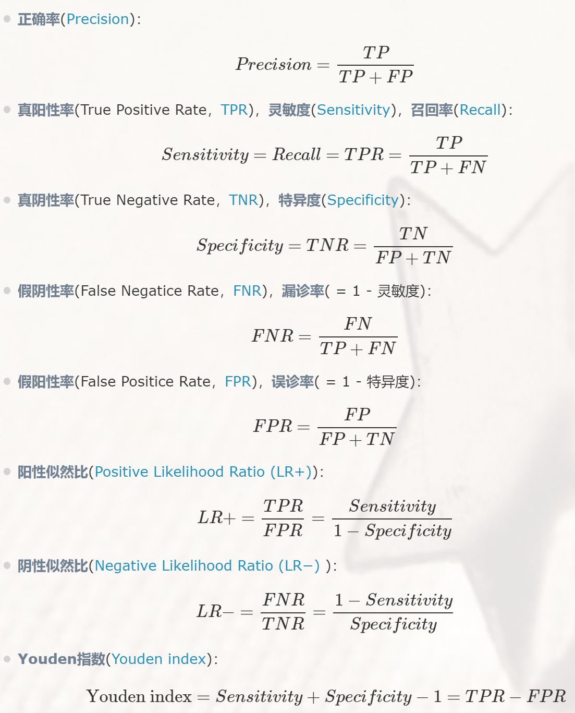

- 多类别分类器

  - 有两种策略OvO和 OvA，
    - One versus One 表示为每一对数字训练二元分类器（比如 0和1，0和2，。。。），SVM一般会使用
    - One versus Rest 表示为每个种类建立一个分类器，得分高的选中（比如 0分类器，1分类器。。。）

  - 错误分析
    - 混淆矩阵可以分析分类器常把那些类别错误分类，针对某些分类可以进行优化，比如预处理，标准化，图像识别等
    - 查看分析错误例子
    - 选择更优模型，比如SGD是线性模型，

- 多标签分类
  - 一个样本可以识别出多个标签，比如YOLO中的图像物体识别
  - 评价指标：F1
- 多输出分类
  - 比如去除噪音的图像处理

## 第四章 训练模型

- 线性回归

  - 这种方法θ求法导致复杂度O(n^2.4^)~O(n^3^)，不适合特征量较多的数据

    y是预测值，x是特征值，θ是权重/偏置，n是特征数量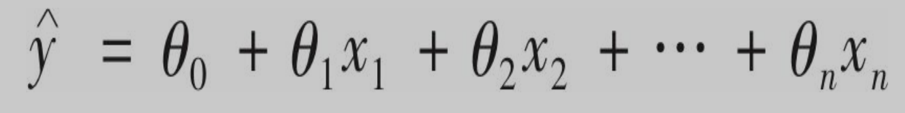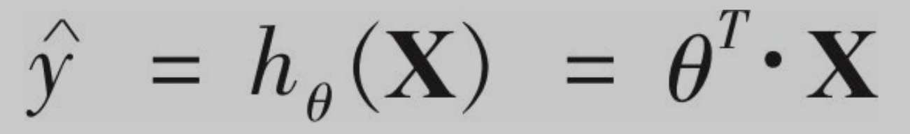

  - 误差衡量：使用MSE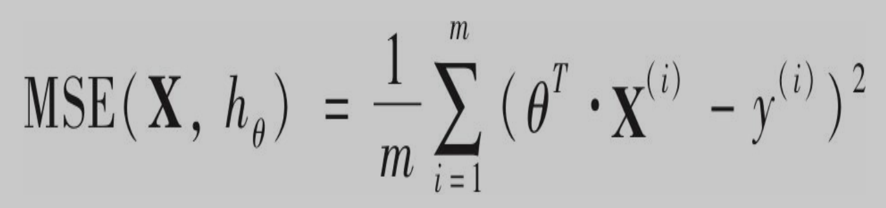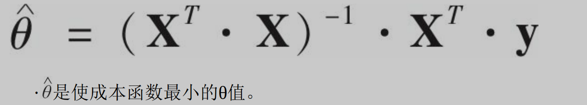

- 梯度下降

  - 梯度下降的中心思想就是迭代地调整参数从而使成本函数最小化。

    使用随机的初始值，逐步改进，减少损失函数的值

  - 需调整步长，并且可能会在局部最小值徘徊

  - 应用梯度下降时，需要保证所有特征值的大小比例都差不多 ，否则收敛的时间会长很多

  - 目的是使损失函数最小，所以每一步往损失函数减少的最大方向前进，那就是梯度方向的反方向

    - 梯度就需要偏导，梯度是上升最快的方向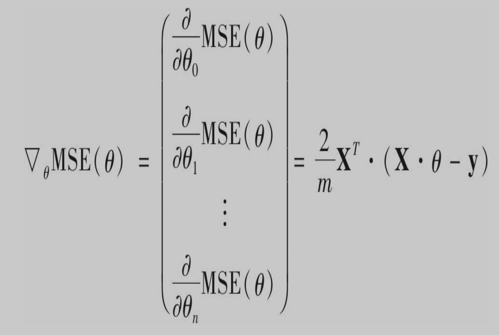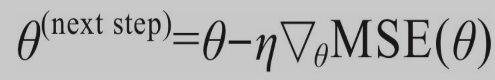

  - 随机梯度下降：每一步在训练集中随机选择一个实例，并且仅基于该单个实例来计算梯度；

    同时减少步长，尽量接近最小值

  - 小批量梯度下降，方向不是基于全部数据集，而是部分数据集

- 多项式回归
  - 将每个特征的幂次方添加为一个新特征，然后在这个拓展过的特征集上训练线性模型
  - 需要注意假如是三次多项式，会添加 a^2^,b^2^,...，共有 (n+d)/(d!n1)个参数，
  - 使用交叉验证评估模型，假如训练集表现良好，交叉验证泛化糟糕，那就是过度拟合
    - 查看学习曲线（MSE与训练次数/训练集大小等的图）

- 误差
  - 偏差：错误原因在于错误的假设，比如是用直线拟合曲线
  - 方差：模型对训练数据微小变化过度敏感导致，出现过度拟合
  - 不可避免的误差：数据本身噪音导致
  - 增加模型复杂度会提升方差，减少偏差；反之同理。

- 正则线性模型：约束模型，降低参数个数，自由度

  - 岭（Ridge）回归：线性回归的正则化，损失函数增加一个正则项

    使用之前必须进行数据标准化，因为对输入特征大小十分敏感

    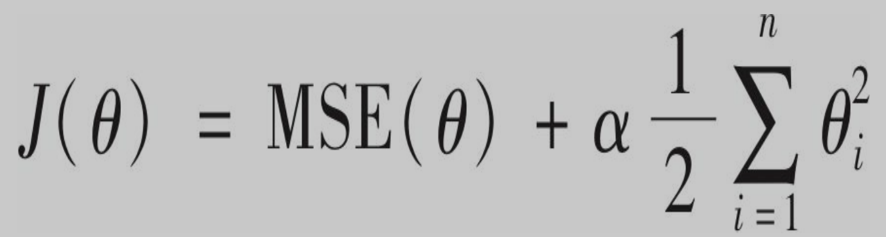

  - Lasso回归：最小绝对收缩和选择算子回归，权重系数是l1范数

    但是梯度下降的时候是不可微的，使用sign函数

    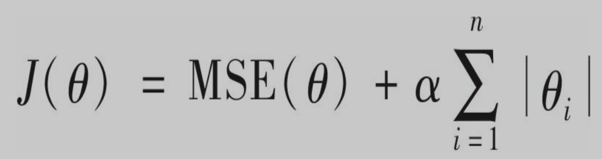

    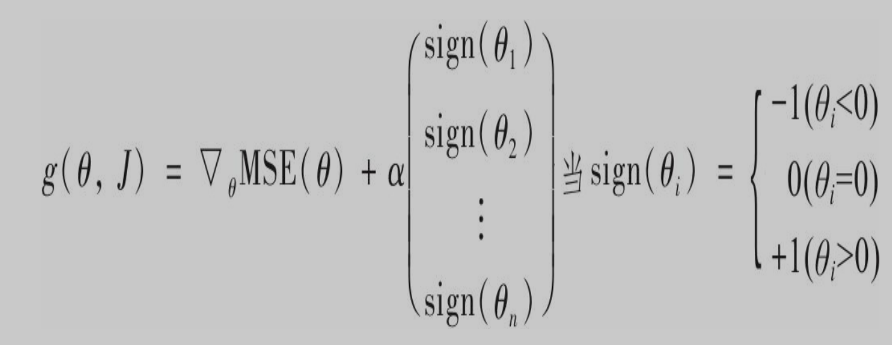

  - 弹性网络，岭回归和lasso回归的混合，通过系数r进行控制比例

  - 早期停止发，当损失函数达到最小值就停止训练，可以通过误差超过在最小值一段时间再停止。

- 逻辑回归：估算样本属于某个分类概率

  - 本身也是特征向量与权重的乘积，输出结果是数理逻辑，常用有sigmoid函数，softmax函数

    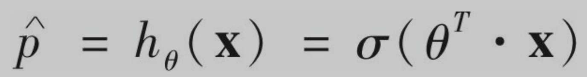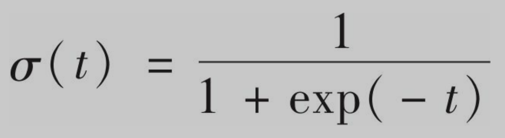

  - 损失函数：y=1，正例的情况下，判断为0的时候损失函数会无限大；

    ​					y=0，反例的情况下，判断为1的时候损失函数会无限大

    ​					所以log损失函数由两者构成，由系数控制，本身是凸函数，可以通过梯度下降找到最小值

    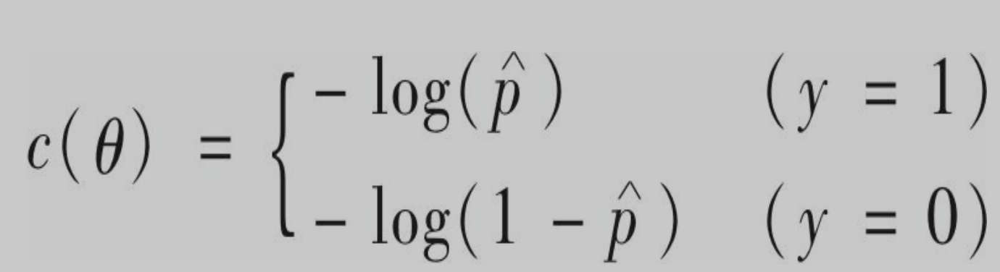

    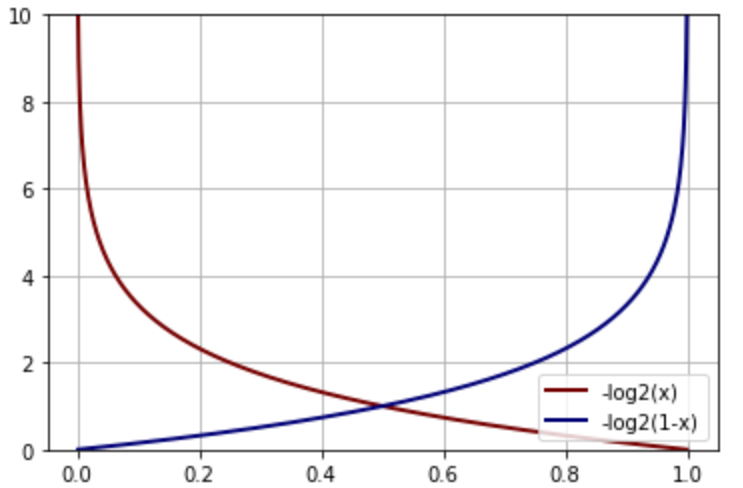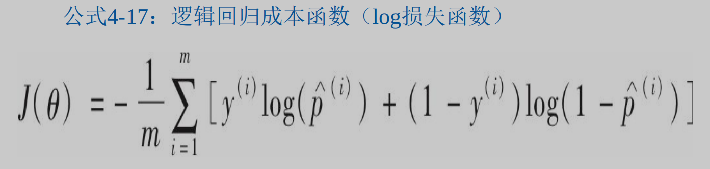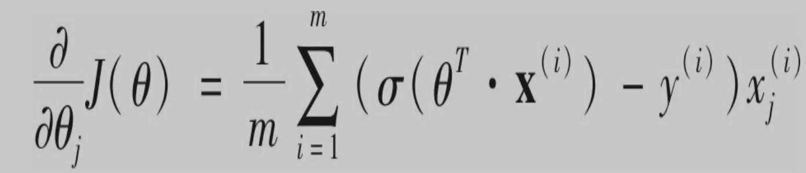

  - 决策边界：当特征超过某个临界值，就有很大信心认为是某一类，这个临界值就是决策边界

- Softmax回归：对于实例x，Softmax模型计算每个分类得分，然后应用softmax函数估算概率，最高者得

  - softmax函数相当于将分数进行放大，e ^sk^ ，最终只会有一个类别输出

  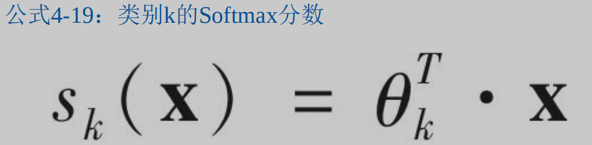

  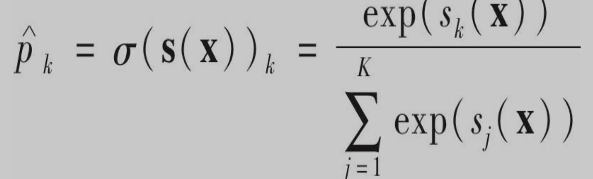

  - 损失函数：使用交叉熵进行估计

    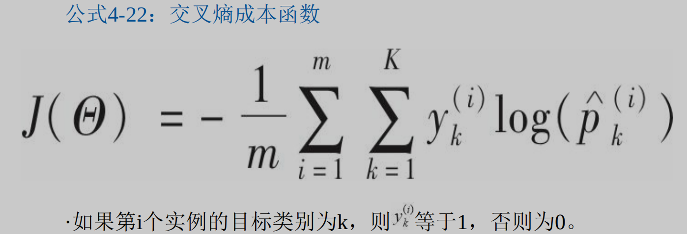

## 第五章 支持向量机

- 支持向量机（简称SVM）是一个功能强大并且全面的机器学习模型，它能够执行线性或非线性分类、回归，甚至是异常值检测任务。

- 线性SVM分类

  - SVM分类器的决策边界在类别之间拟合可能的最宽的街道

  - 对特征缩放非常敏感

  - 硬间隔分类：让所有实例都不在街道上，并且位于正确得一边，对异常值敏感

    软间隔分类：目标是尽可能在保持街道宽阔和限制间隔违例

- 非线形SVM分类
  - 多项式会用到更多特征，使用多项式核，可以通过网格搜索进行优化
  - 添加相似特征，使用高斯RBF作为相似函数
- 计算复杂度
  - LinearSVC O(m*n)
  - SVC O(m^2^*n)~O(m^3^*n)

- SVM回归：让实例尽量位于街道上，限制街道宽度

- 原理：

  - 决策函数，w是特征权重（没有偏置），b是偏置，是两个超平面得交集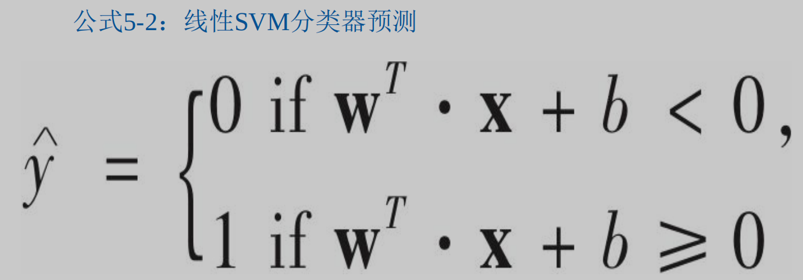

  - 把决策函数看成一条直线，w的范数就是斜率，w越小斜率越小，在x轴的投影越长

    目标就是最小化w获得最大街道宽度

    |w|不可导，w^2^的导数是2w，所以选择最小化  1/2 w^2^

    软间隔引入一个松弛变量，衡量允许多大程度间隔违例

    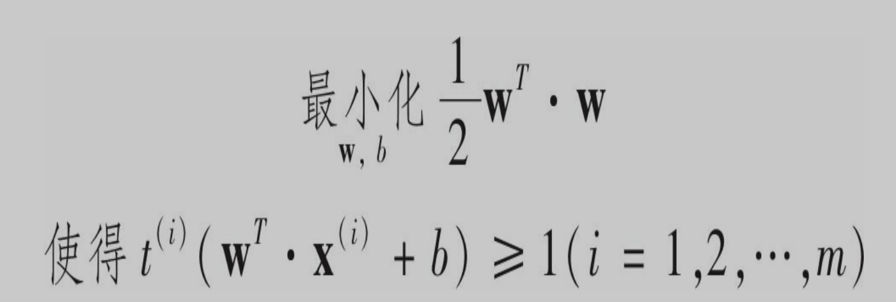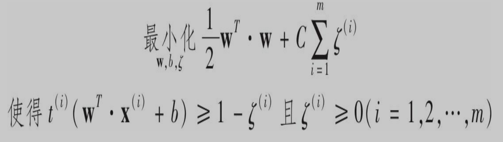

- 二次规划
  - 硬间隔和软间隔问题都属于线性约束的凸二次优化问题。这类问题被称为二次规划（QP）问题
  - 核化SVM
    - 转换后向量的点积等于原始向量的点积的平方
    - 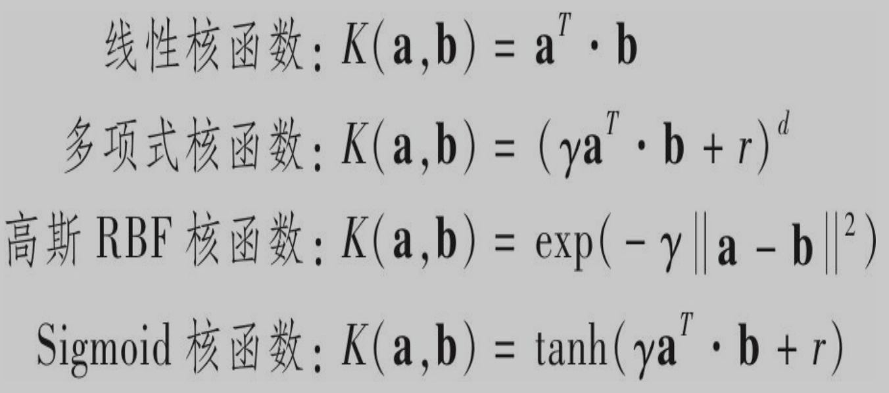

- 在线SVM
  - 梯度下降比二次规划慢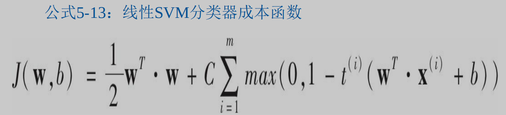
  - 损失函数：hinge损失函数

## 第六章 决策树

- 决策树也是一种多功能的机器学习算法，它可以实现分类和回归任务，甚至是多输出任务
- graphviz软件包可以查看决策
- 需要的数据准备工作少，不需要特征缩放

- Scikit-Learn使用的是分类与回归树（Classification And Regression Tree，简称CART）

  算法来训练决策树，该算法仅生成二叉树

  算法根据特征k和阈值t~k~将训练集划分为两类，复杂度是log级别

  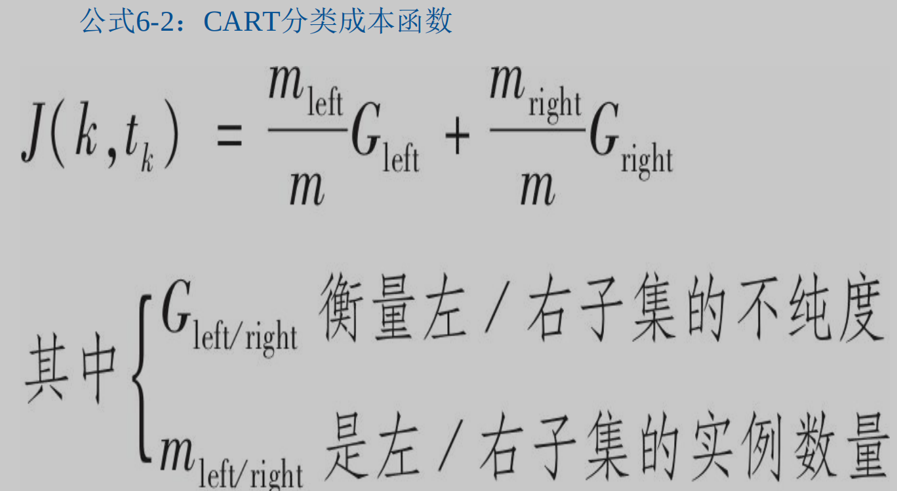

- 默认使用基尼不纯度进行测量，也可以使用信息熵
- 正则化超参数，限制树的深度、叶子数量等
- 回归使用的是最小化MSE
- 不稳定性：青睐正交的决策边界，对旋转非常敏感

## 第七章 集成学习和随机森林

- 一组决策树的集成被称为随机森林

- 投票分类器：将多种分类器的结果汇总，选出最高的投票，前提是分类器尽可能独立

- bagging：放回采样，pasting不放回采样

- 随机森林

  - 随机森林在树的生长上引入了更多的随机性：分裂节点时不再是搜索最好的特征

    而是在一个随机生成的特征子集里搜索最好的特征

  - 极端随机树：对每个特征使用随机阈值，而不是搜索得出的最佳阈值

  - 特征重要性：重要的特征一般更靠近根节点，通过深度可以估算其重要程度

- 提升法：Boosting，将几个若机器学习器集成一个强学习器

  - AdaBoost 新预测器对其前序进行纠正的办法之一，就是更多地关注前序拟合不足的训练实例。

    迭代中调整实例权重，缺点无法并行

  - 梯度提升 ：让新的预测器针对前一个预测器的残差进行拟合

- 堆叠法：训练模型聚合继承中的所有预测其

## 第八章 降维

- 投影

  - 训练实例在维度上不是均匀分布的，许多特征几乎不变，而一些相关联

    比如 空间里面位于同一个平面的集合，就可以从三维变二维

- 流形学习

  - d维流形就是n（其中，d＜n）维空间的一部分，局部类似于一个d维超平面

- PCA 主成分分析，识别出最接近数据的超平面，然后将数据投影其上。
  - 分析不同分量的贡献程度，定义第i条轴的单位向量就叫作第i个主成分（PC）
  - 奇异值分解（SVD）。它可以将训练集矩阵X分解成三个矩阵的点积U·∑·VT，其中VT正包含我们想要的所有主成分，
  - 确定d个主成分就可以投影
  - 方差解释率：表示每个主成分轴对整个数据集的方差的贡献度。
  - 降维后再升维与原始数据的均方距离称为重建误差
  - 增量主成分分析 （IPCA）算法：你可以将训练集分成一个个小批量，一次给IPCA算法喂一个
  - 核主成分分析（kPCA），擅长在投影后保留实例的集群，有时甚至也能展开近似于一个扭曲流形的数据集。

- 局部线性嵌入 （LLE）基于流形学习级数
  
  - 首先测量每个算法如何与其最近的邻居线性相关，然后为训练集寻找一个能最大程度保留这些局部关系的低维表示

## 第九章 运行TensorFlow

- 开源数值计算软件库，适合大型机器学习
- 由于[TF2.0](https://tensorflow.google.cn/tutorials/quickstart/beginner)已经和1.0有很大API差异，不适合学习1.0代码

## 第十章 人工神经网络

- 1943年就已经提出ANN，用简化过的计算模型描述神经元

- 人工神经元：具有一个或者多个二进制输入，一个输出。当一定量输入是激活状态才激活输出

  运算就是简单的逻辑运算，与或非

- 感知机：最简单的ANN架构，1957年提出，是一个具有线形阈值单元（LTU）的人工神经单元，

  输入和输出是数字，每个输入都有权重。z=w^T^x，感知机使用介于函数产生输出，常见的有 Heaviside函数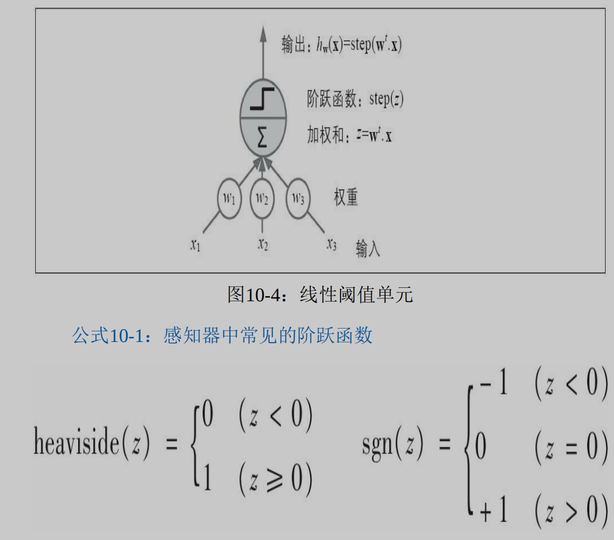

- 感知器：单层LTU，每个神经元都与所有输入相连，偏差特征使用偏差神经元表示，永远输出1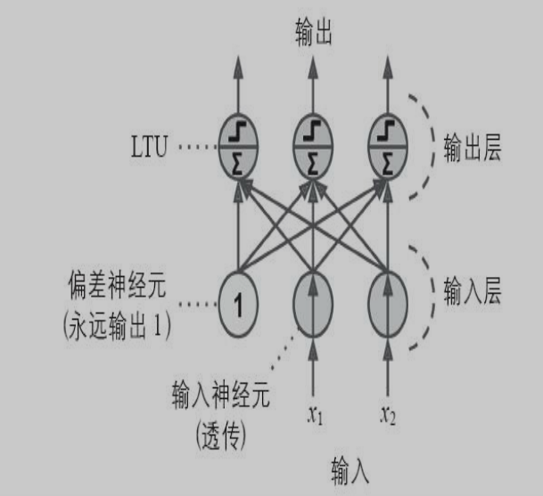

- 训练感知器：
  - Hebb‘s定律：如果一个神经元总是触发另外神经元，那么两者之间连接会更强
  - w是连接权重，i是输入神经元，j是输出神经元，x当前训练实例输入，y是当前训练实例输出， η是学习速率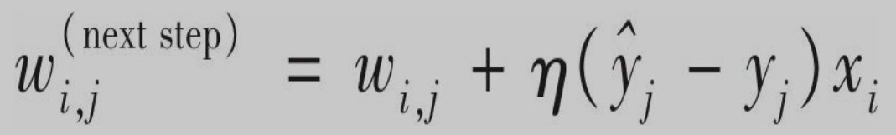
  - 每个输出神经元的决策边界是线性的，Rosenblatt证明如果训练实例是线性可分的，这个算法会收敛到一个解
  - 感知器问题较多，比如无法处理XOR分类

- 多层感知器
  - MLP包含一个透传输入层，若干个隐藏层，一个输出层，输入层包含一个偏移神经元
  - 如果ANN有2各个及以上的隐藏层，就成为深度神经网络 DNN
  - 层与层之间是全连接
  - 对于每个训练实例，反向传播算法先做一次预测度量误差，然后反向的遍历每个层次来度量每个连接的误差贡献度（反向过程），最后再微调每个连接的权重来降低误差（梯度下降）。
  - 为了微分，把阶跃函数改成σ（z）=1/（1+exp（-z）），还有其他激活函数，双曲正切函数，ReLU函数等 
  - 有趣的是，ReLU激活函数通常在ANN中工作得更好

- 微调NN得超参数
  - 网格搜索、随机搜索、Oscar工具
  - 隐藏层个数
  - 通常来说，通过增加每层的神经元数量比增加层数会产生更多的消耗。
  - 激活函数

## 第十一章 训练DNN

- 梯度消失/爆炸问题

  - 反向 传播算法从输出往输入传播误差梯度，梯度在底层网络有时候基本没有改变，训练也不会收敛，称为梯度消失；

    有时梯度越来越大，算法无法收敛，称为梯度爆炸

  - 缓和方法：让每层输入和输出保持方差一致，实现采用折中方案，连接权重必须按照特定公式进行随机初始化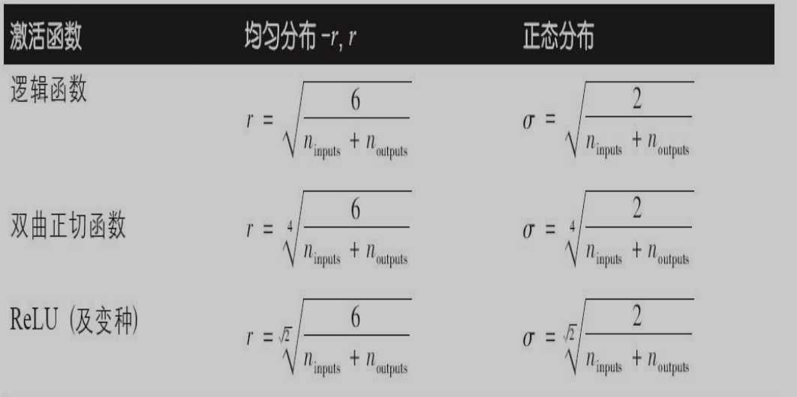

  - S型激活函数当斜率接近饱和（0或1），再传播也就会保持饱和。

    梯度爆炸/消失问题一个原因就是选错激活函数，ReLU表现更好是因为不稀释正值

    - ReLU出现 dying ReLU问题：部分神经元只输出零，不会再工作
    - 采用leakyReLU = max(a，az),a表示泄露程度
    - 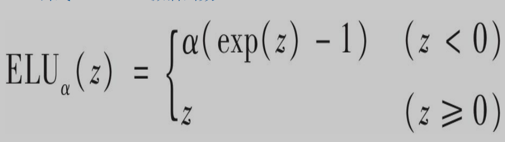

  - 通常来说ELU函数>leaky ReLU函数（和它的变种）>ReLU函数>tanh函数>逻辑函数

  - 批量归一化，该技术包括在每一层激活函数之前在模型里加一个操作，

    简单零中心化和归一化输入，之后再通过每层的两个新参数缩放和移动结果。

    μ是平均值，σ是标准方差，m是实例数，x是零中心化和归一化输入，γ是缩放 ，z是输出，∈是平滑项，β是偏移

    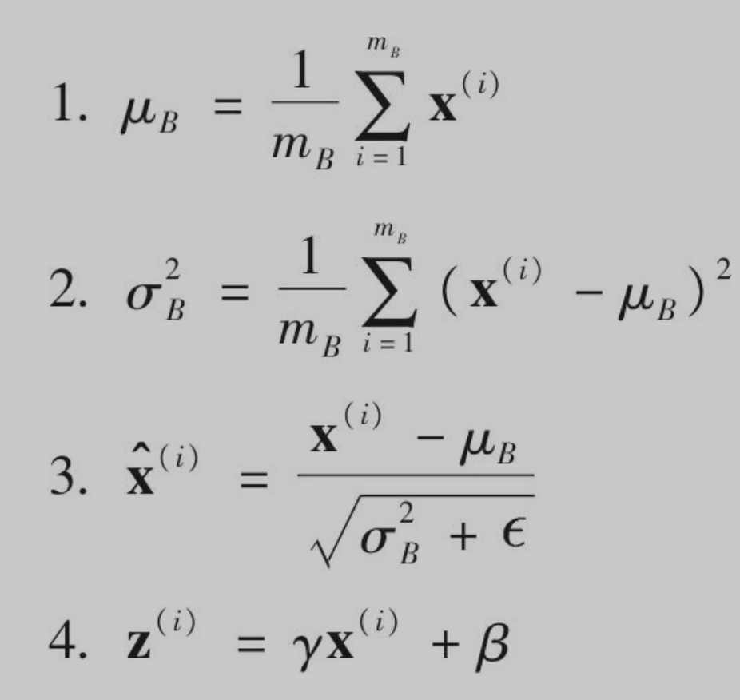

  - 梯度剪裁：简单裁剪梯度，保证不会超过阈值，在循环神经网络很有效

  - 任务越类似，我们就可以重用越多的层（从低层开始）。对于特别相似的任务，我们可以试着将所有隐藏层都保留，只替换外层

  - 冻结低层，便于快速训练高层，高层容易被替换丢弃

- 快速优化器

  - 结论是你几乎一直需要使用Adam优化，简单的将梯度下降优化器替换即可

  - Momentum优化

    - 模拟重力加速度，球在光滑表面滚下一个平缓的斜坡
    - 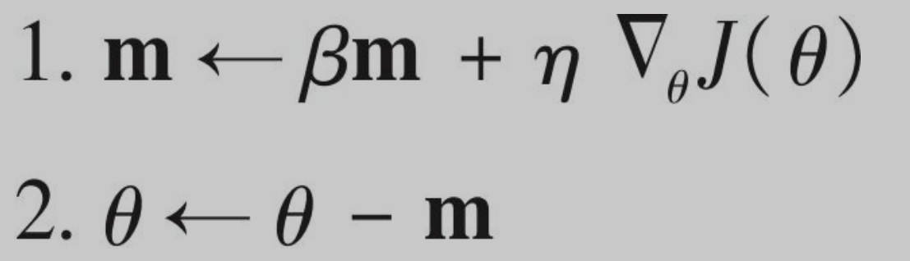

  - Nesterov梯度加速

    - 与Vanilla Momentum优化唯一的不同就是用θ+βm来 测量梯度，而不是θ。

  - AdaGrad算法

    - 通过沿着最陡尺寸缩小梯度向量来实现这一点
    - 降速太快而且没办法收敛到全局最优

  - RMSProp

    - 通过仅累积最近迭代中的梯度解决AdaGrad问题

  - Adam优化 

    - 类似Momentum优化，它会跟踪过去梯度的指数衰减平均值，

      同时也类似RMSProp，它会跟踪过去梯度平方的指数衰减平均值

- 学习速率调度
  - 预定分段常数学习速率
  - 性能调度
  - 指数调度
  - 功率调度

- 通过正则化避免过度拟合

  - 提前停止

  -  正则化，l1 和 l2，就是在成本函数添加正则项，不要忘记将正则化损失加到整体损失中，

  - dropout：每一个训练步骤，每一个神经元都有一个会被暂时“丢弃”的可能性p

  - 最大范数正则化：对 每一个神经元，包含一个传入连接权重w满足ǁwǁ2≤r，其中r是最大范 

    数超参数，ǁ·ǁ~2~是 l~2~ 范数。 

  - 数据扩充:一般偏向在训练过程中快速生成训练实例，而不是浪费存储空间和网络带宽。TensorFlow提供了多种图片处理操作，比如转置（偏移）、旋转、调整大小、翻转和裁剪，同时还有调整亮度、对比度、饱和度和色调（详见API文档）。这样就可以轻松地实现图像数据集

    的数据扩充。

## 第十二章 跨设备和服务器的分布式TensorFlow

## 第十三章 卷积神经网络

- CNN，20世纪80年代开始被用于图像识别，

- David H.Hubel和Torsten Wiesel在1958年提出视觉皮层神经元有一个小的局部接受野，

  一些神经元作用于图片的水平方向，而另一些神经元作用于其他方向

  高阶神经元是基于相邻的低阶神经元的输出

- 卷积层：
  - 由于卷积操作会缩小图像尺寸，所以通常在图像周围填充0，称为零填充
  - 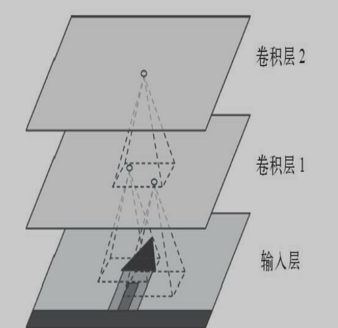
  - 过滤器：神经元的权重可以用接受野大小表示，权重集合称为过滤器/卷积核。

- 池化层：
  - 通过对输入图像进行二次采样以减小计算负载、内存利用率和参数数量
  - 池化层的每个神经元都连接到上一层输出中矩形接收野内的有限个神经元上
  - 没有权重，它做的所有事情就是使用聚合函数聚合输入，比如max，mean

- CNN架构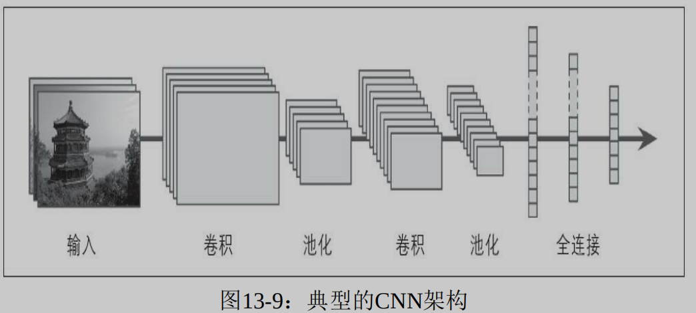
  - LeNet：上图典型架构，激活函数是tanh，输出全连接RBF
  - AlexNet ：激活函数ReLU，输出全连接Sofmax，使用了正则化，数据填充
  - GoogLeNet：层数更深，通过一个称为初始化模块 （inception modules）的子网使之成为可能
  - ResNet：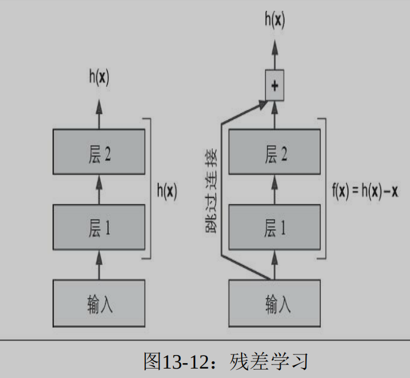

## 第十四章　循环神经网络

- RNN可以用于股票预测，自动翻译等等
- 循环神经元，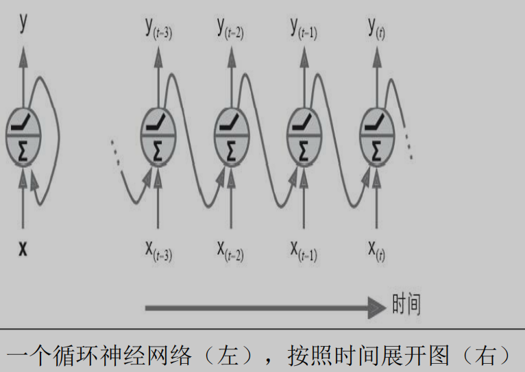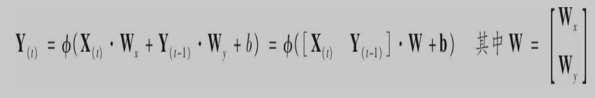

- 记忆单元：循环神经元在时间迭代t得输出是之前时间迭代所有输入的函数，可以认为是一种形式的记忆

- 训练RNN：关键是像之前做的那样将其通过时间展开，然后简单地使用一个定期的反向传播这种策略称为通过时间反向传播（BPTT）。

- 长期记忆单元：LSTM单元管理着两个向量

  h是短期状态，c是长期状态，门限应该是阈值

  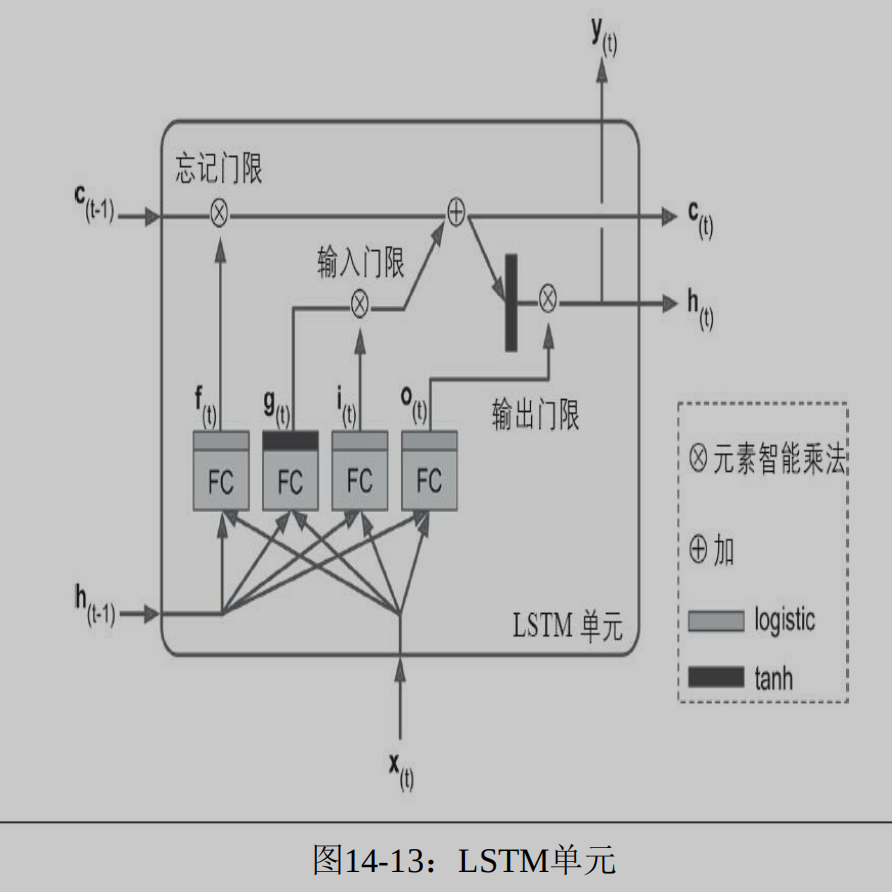

- GRU单元，门限循环单元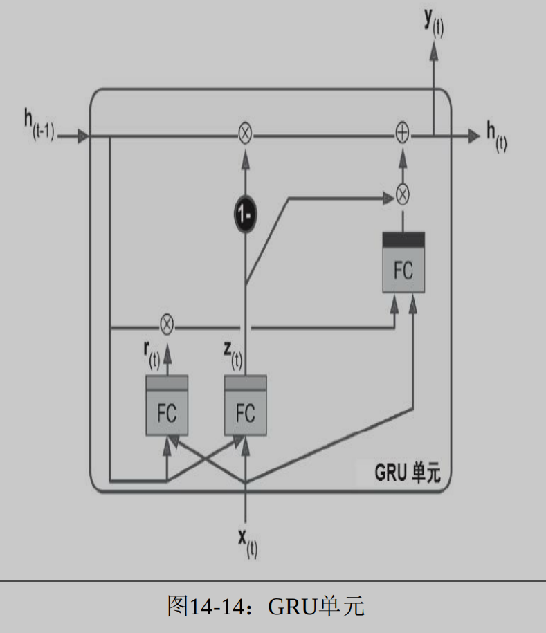

## 第十五章　自动编码器

- 自动编码器是能够在无须任何监督的情况下学习有效表示输入数据（称为编码）的人工神经网络。

  它们能够生产与训练数据非常相似的新数据；这被称为生成模型。

- 高效的数据表示 

  - 发现数据中的模式

  - 自动编码器通常和多层感知器具有相同的 架构，

    不同之处在于自动编码器的输出层的神经元数量必须等于输入 层的数量。

  - 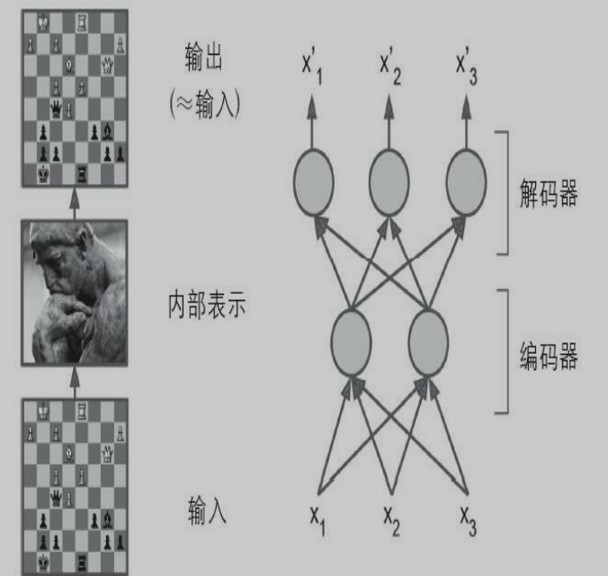

- 使用不完整的线性自动编码器实现PCA 
  - 如果自动编码器仅使用线性激活，并且成本函数是均方误差（MSE），则表示它可以用来实现PCA

- 栈式自动编码器：自动编码器可以有多个隐藏层
- - 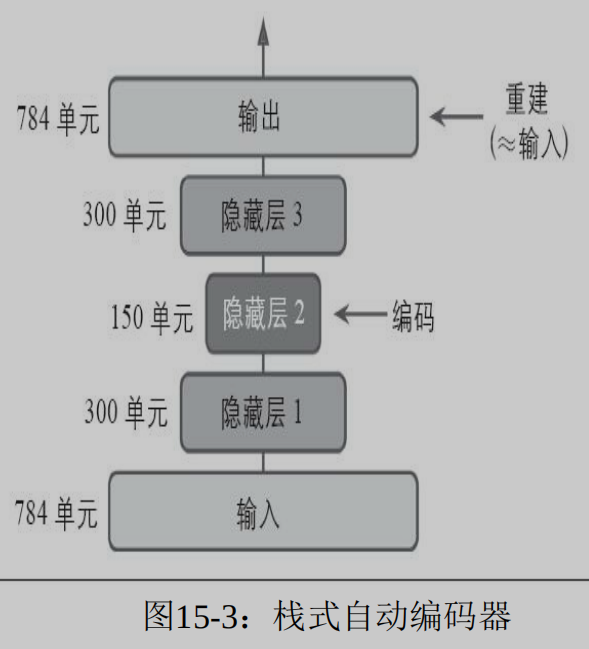

- 查看特征
  - 对于第一个隐藏层的每个神经元，可以创建一个图像，其中每一个像素的强度代表了连接到给定神经元的权重。

- 使用堆叠的自动编码器进行无监控的预训练
  - 找到一个执 行类似任务的神经网络，然后重用它的底层。
  - 首先使用所有数据训练一个堆叠的自动编码器，然后重用较低层来为你的实际任务创建一个神经网络，并使用已标记的数据来训练它。

- 去噪自动编码器
  - 在输入中增加噪音，训练它以恢复原始的无噪音输入。

- 稀疏自动编码器 
  - 通过在成本函数中增加适当的条件，推动自动编码器减小编码层中活动神经元的数量

- 变分自动编码器 
  - 是概率自动编码器
  - 是生成自动编码器

## 第十六章 强化学习 

- 学习奖励最优化：比如迷宫走一步扣分，糖豆人吃到加分
- 策略搜索
  - 随机策略：使用概率决定行动
  - 遗传算法：随机创造第一代100个策略，穷尽杀掉80，剩下的生成后代（加上偏差）
  - 策略梯度：通过对策略参数的回报梯度的评估使用优化技术，然后根据获得较高回报的梯度（梯度上升）调整这些参数。

- OpenAI gym是一个提供各种模拟环境（Atari游戏，棋盘游戏，2D和3D的环境模拟等）的工具包，

  因此可以使用它训练代理，比较这些代理，或者开发新的RL算法。

- 神经网络策略

  - 它将估计每个行为的可能性，然后根据估计的可能性随机选取一种行为

    使用概率是为了能在探索新方法和正常运行之间达到平衡

- 评估行为：信用分配问题 

  - 监督学习：最小化估计的概率和目标概率之间的交叉熵来训练神经网络

  - 强化学习：通过回报，而回报通常是稀疏和延迟

    根据获得回报的总和来评估一个行为，通常在每步之后乘以折扣率r。

- 策略梯度
  - 神经网络策略多次玩游戏，然后计算每一步更有可能被选择的行为的梯度，
  - 运行几遍之后，计算每个行为的得分
  - 如果一个行为的得分是正数，意味着该行为是好的，该行为在未来更有可能被选择
  - 计算得到的所有梯度向量的平均值，并使用它来执行梯度下降步骤。 

- 马尔可夫决策过程

  - 具有固定的状态数，并且在每一步中随机地从一个过程转换为另一个过程。从状态s转换

    为状态s'的概率是固定的，且只依赖于状态对（s，s'），与过去的状态无关（系统没有记忆）。

    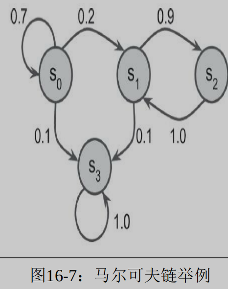

- 时间差分学习与Q学习

  - 评估任何状态s的最优状态值，贝尔曼最优方程式就适用

  - 评估最优状态-行为值，通常称为Q值，状态-行为对（s，a）的最优Q值，标记为Q*（s，a），

    是代理到达状态s并选择了行为a后，假设在此行为后其行为最优，

    预期的平均折扣后未来回报的总和

  - 具有离散行为的强化学习问题通常可以建模为马尔可夫决策过程，但是最初时代理不知道转换概率是什么，回报是什么 

  - 时间差分学习：探索策略来探索MDP，然后随着它的进展，TD学习算法根据实际观察到的转换和回报更新估计的状态值

  - Q学习算法是对Q值算法在初始状态时转换概率和回报未知情况下的调整

## 附录

- **范数**：norm，度量某个向量空间的向量长度或大小

  - 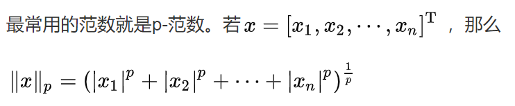

- **随机变量**：表示随机试验各种结果的实值单值函数。随机试验结果的量的表示。

  随机变量在不同的条件下由于偶然因素影响，可能取各种不同的值，

  故其具有不确定性和随机性，但这些取值落在某个范围的概率是一定的，此种变量称为随机变量

- **数学期望**：试验中每次可能结果的概率乘以其结果的总和，它反映随机变量平均取值的大小。

  - 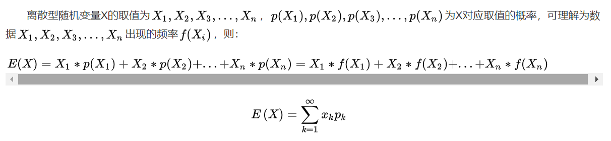

- **方差**：用来度量随机变量和其数学期望（即均值）之间的偏离程度。

  - 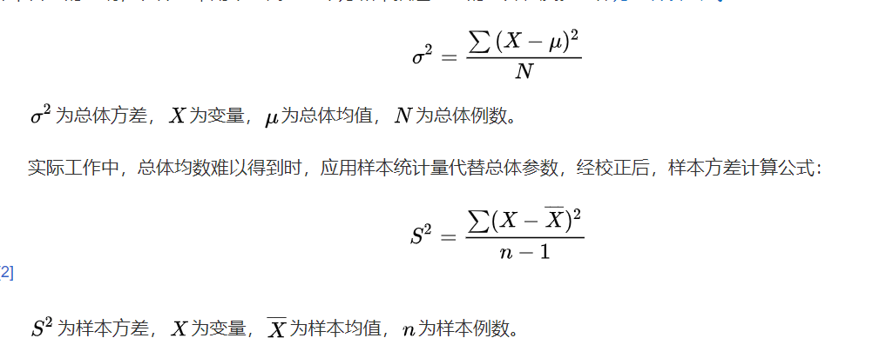

- **标准差**：是离均差平方的算术平均数（即：方差）的算术平方根，用σ表示。

  - 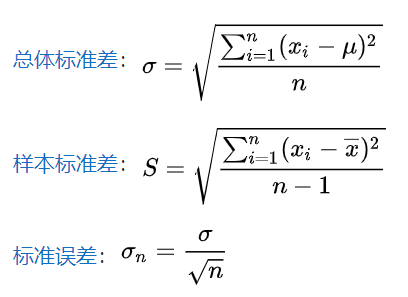

- **协方差**：衡量两个变量的总体误差。

  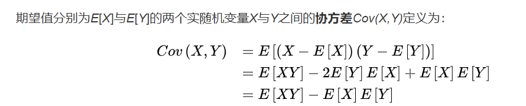

- **皮尔逊相关系数**：是用于度量两个变量X和Y之间的相关（线性相关），其值介于-1与1之间。

  - 

- **信息熵**：

- **交叉熵**：

- 