# Spring 实战

- [ ] 书籍作者:  [Craig Walls 沃尔斯](https://book.douban.com/search/Craig Walls 沃尔斯)

- [ ] 笔记时间: 2020.12.20

## 第一部分 Spring 基础

### 第 1 章 Spring 入门

#### 1.1 什么是 Spring？

Spring 的核心是一个 *容器*，通常称为 *Spring 应用程序上下文*，用于创建和管理应用程序组件。这些组件（或 bean）在 Spring 应用程序上下文中连接在一起以构成一个完整的应用程序.

将 bean 连接在一起的行为是基于一种称为 *依赖注入*（DI）的模式

自动配置起源于 Spring 技术，即 *自动装配* 和 *组件扫描*。借助组件扫描，Spring 可以自动从应用程序的类路径中发现组件，并将其创建为 Spring 应用程序上下文中的 bean。通过自动装配，Spring 会自动将组件与它们依赖的其他 bean 一起注入(spring boot 自动配置的优势已经远远超过两者)

#### 1.2 初始化 Spring 应用程序

使用 Spring Initializr 初始化

##### 1.2.2 Spring项目结构

- src 和 test 顾名思义
- `mvnw` 和 `mvnw.cmd` —— 这些是 Maven 包装器脚本。即使你的计算机上没有安装 Maven，也可以使用这些脚本构建项目。
- `pom.xml` —— 这是 Maven 构建规范
- `TacoCloudApplication.java` —— 这是引导项目的 Spring Boot 主类
- `application.properties` —— 该文件最初为空，但提供了一个可以指定配置属性的地方。
- `static` —— 在此文件夹中，可以放置要提供给浏览器的任何静态内容
- `templates` —— 在此文件夹中，放置用于向浏览器呈现内容的模板文件

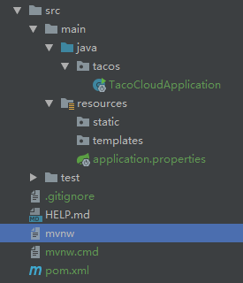

#### 1.3 编写 Spring 应用程序

##### 1.3.1 处理web请求

主要是Spring MVC模块的使用

构造一个*Controller*,返回一个视图 *home* 

##### 1.3.2 定义视图

*home.html*  会自动解析在 template 下面,使用*thymeleaf*模板

**.png* 会自动解析在static下面 

##### 1.3.3 测试控制器

`@WebMvcTest` 还为测试 Spring MVC 提供了 Spring 支持

##### 1.3.4 构建并运行应用程序

在 dashboard 启动,浏览器访问本地 8080端口 即可

##### 1.3.5 了解 Spring Boot DevTools

- 当代码更改时自动重启应用程序

  > ​		当 DevTools 起作用时，应用程序被加载到 Java 虚拟机（JVM）中的两个单独的类加载器中。一个类装入器装入 Java 代码、属性文件以及项目的 src/main/path 中的几乎所有东西。这些项目可能会频繁更改。另一个类加载器加载了依赖库，它们不太可能经常更改。
  >
  > ​		所以,当更改依赖就需要重启应用

- 当以浏览器为目标的资源（如模板、JavaScript、样式表等）发生变化时，浏览器会自动刷新

  > ​		默认情况下,模板选项被配置为缓存模板解析的结果
  >
  > ​		 DevTools 起作用时，它会自动启用 LiveReload （http://livereload.com/）服务器和应用程序。就其本身而言，LiveReload 服务器并不是很有用。但是，当与相应的 LiveReload 浏览器插件相结合时，它会使得浏览器在对模板、图像、样式表、JavaScript 等进行更改时自动刷新 —— 实际上，几乎所有最终提供给浏览器的更改都会自动刷新。
  >
  > ​		LiveReload 有针对 Google Chrome、Safari 和 Firefox 浏览器的插件。

- 自动禁用模板缓存

- 如果 H2 数据库正在使用，则在 H2 控制台中构建

理解 DevTools 不是 IDE 插件是很重要的，它也不要求您使用特定的 IDE

由于它仅用于开发目的，所以在部署生产环境时禁用它本身是非常明智的。

##### 1.3.6 回顾

在 pom.xml 文件中，声明了对 Web 和 Thymeleaf 启动器的依赖,带来了其他依赖

- Spring MVC 框架
- 嵌入式 Tomcat
- Thymeleaf 和 Thymeleaf 布局方言

还带来了 Spring Boot 的自动配置库,当应用程序启动时，Spring Boot 自动配置自动检测这些库并自动执行：

- 在 Spring 应用程序上下文中配置 bean 以启用 Spring MVC
- 将嵌入式 Tomcat 服务器配置在 Spring 应用程序上下文中
- 为使用 Thymeleaf 模板呈现 Spring MVC视图，配置了一个 Thymeleaf 视图解析器

#### 1.4 俯瞰 Spring 风景线

##### 1.4.1 Spring 核心框架

Spring 核心框架是 Spring 领域中其他一切的基础,提供了但不限于:

- SpringMVC
- SpringWeb
- JdbcTemplate
- SpringFlux(响应式编程模型)

##### 1.4.2 Spring Boot

好处:

- 启动依赖 和 自动配置
- Actuator 提供了对应用程序内部工作方式的运行时监控，包括端点、线程 dump 信息、应用程序健康状况和应用程序可用的环境属性。
- 灵活的环境属性规范。
- 在核心框架的测试辅助之外，还有额外的测试支持。

##### 1.4.3 Spring Data

将应用程序的数据存储库抽象为简单的 Java 接口，同时当定义方法用于如何驱动数据进行存储和检索的问题时，对方法使用了命名约定。

Spring Data 能够处理几种不同类型的数据库，包括关系型（JPA）、文档型（Mongo）、图型（Neo4j）等

##### 1.4.4 Spring Security

Spring Security 解决了广泛的应用程序安全性需求，包括身份验证、授权和 API 安全性。尽管 Spring Security 的范围太大，本书无法恰当地涵盖，但我们将在第 4 章和第 12 章中讨论一些最常见的用例。

##### 1.4.5 Spring Integration 和 Spring Batch

Spring Integration 解决了实时集成，即数据在可用时进行处理。相反，Spring Batch 解决了批量集成的问题，允许在一段时间内收集数据，直到某个触发器（可能是一个时间触发器）发出信号，表示该处理一批数据了。

##### 1.4.6 Spring Cloud

在我写这篇文章的时候，应用程序开发领域正在进入一个新时代，在这个时代中，我们不再将应用程序作为单个部署单元来开发，而是将由几个称为 *微服务* 的单个部署单元组成应用程序。

### 第 2 章 开发 Web 应用程序

内在的东西很重要，但外在的 —— 先看到的 —— 才是重要的。

在本章中，将开发 Taco Cloud 应用程序的第一个主要功能 —— 设计自定义 Taco 的能力。在此过程中，将深入研究 Spring MVC，并了解如何显示模型数据和处理表单输入。

#### 2.1 展示信息

从根本上说，Taco Cloud 是一个可以在线订购玉米饼的地方。但除此之外，Taco Cloud 还希望让顾客能够表达自己的创意，从丰富的配料中设计定制的玉米饼。

在 Spring web 应用程序中，**获取和处理数据是控制器的工作。视图的工作是将数据渲染成 HTML 并显示在浏览器中**。将创建以下组件来支持 Taco 创建页面：

- 一个定义玉米卷成分特性的领域类
- 一个 Spring MVC 控制器类，它获取成分信息并将其传递给视图
- 一个视图模板，在用户的浏览器中呈现一个成分列表

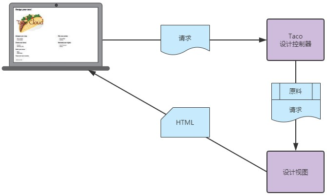

#####  2.1.1 建立域

应用程序的域是它所处理的主题领域 —— 影响应用程序理解的思想和概念

首先，我们将关注玉米饼配料。

建议添加 lombok 依赖和 相应的插件

##### 2.1.2 创建控制器类

控制器是 Spring MVC 框架的主要参与者。它们的主要工作是处理 HTTP 请求，或者将请求传递给视图以呈现 HTML（浏览器显示），或者直接将数据写入响应体（RESTful）

- 处理请求路径为 `/design` 的 HTTP GET 请求
- 构建成分列表
- 将请求和成分数据提交给视图模板，以 HTML 的形式呈现并发送给请求的 web 浏览器

总结: 接收请求,响应请求

##### 2.1.3 设计视图

使用thymeleaf进行展示

#### 2.2 处理表单提交

`<form>` 没有声明 action 属性,默认是发往当前url

`@PostMapping` 请求映射

#### 2.3 验证表单输入

Spring 支持 Java's Bean Validation API,JSR-303

##### 2.3.1 声明验证规则

[Hibernate Validator](https://docs.jboss.org/hibernate/stable/validator/reference/en-US/html_single/#validator-metadata-api)

##### 2.3.2 在表单绑定时执行验证

@Valid 注释告诉 Spring MVC 在提交的 Taco 对象绑定到提交的表单数据之后，以及调用 processDesign() 方法之前，对提交的 Taco 对象执行验证。如果存在任何验证错误，这些错误的详细信息将在传递到 processDesign() 的错误对象中捕获

##### 2.3.3 显示验证错误

Thymeleaf 通过 fields 属性及其 `th:errors` 属性提供了对 Errors 对象的便捷访问。

#### 2.4 使用视图控制器

到目前为止，已经为 Taco Cloud 应用程序编写了三个控制器。尽管每个控制器在应用程序的功能上都有不同的用途，但它们几乎都遵循相同的编程模型：

- 使用`@Controller`,表明控制器类,由容器进行初始化
- 类级别上使用 @RequestMapping 
- 方法都用 @GetMapping 或 @PostMapping 进行了注释

当一个控制器足够简单,可以使用视图控制器 —— 一个只将请求转发给视图的控制器

#### 2.5 选择视图模板库

支持FreeMarker Groovy Thymeleaf Mustache等

当应用程序启动时，Spring Boot 自动配置会检测到 Thymeleaf 的存在，并自动配置 Thymeleaf bean。

##### 2.5.1 缓存模板

使用 `spring.thymeleaf.cache = false` 部署之前一定要删除

一种选择是在 profile 文件中设置属性

一个更简单的选择是使用 Spring Boot 的 DevTools,配合浏览器插件

#### 2.6 小结

- Spring 提供了一个强大的 web 框架，称为 Spring MVC，可以用于开发 Spring 应用程序的 web 前端。
- Spring MVC 是基于注解的，可以使用 @RequestMapping、@GetMapping 和 @PostMapping 等注解来声明请求处理方法。
- 大多数请求处理方法通过返回视图的逻辑名称来结束，例如一个 Thymeleaf 模板，请求（以及任何模型数据）被转发到该模板。
- Spring MVC 通过 Java Bean Validation API 和 Hibernate Validator 等验证 API 的实现来支持验证。
- 视图控制器可以用来处理不需要模型数据或处理的 HTTP GET 请求。
- 除了 Thymeleaf，Spring 还支持多种视图选项，包括 FreeMarker、Groovy Templates 和 Mustache。

#### 第 3 章 处理数据

##### 3.1 使用 JDBC 读写数据

几十年来，关系数据库和 SQL 一直是数据持久化的首选

两个最常见的选择是 JDBC 和 JPA

##### 3.1.1 为域适配持久化

增加id字段

##### 3.1.2 使用 JdbcTemplate

添加依赖

编写由Repository修饰的类,用于查询数据

##### 3.1.3 定义模式并预加载数据

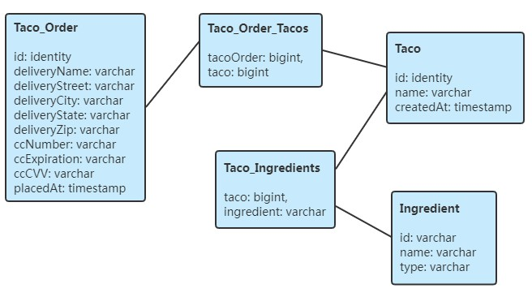

 spring-boot 会自动执行在 src/main/resources 下的 schema.sql 和 data.sql 的文件

##### 3.1.4 插入数据

- 直接使用 update() 方法

- 使用 SimpleJdbcInsert 包装类

id，这是使用 KeyHolder 和 PreparedStatementCreator 来获得的。

#### 3.2 使用 Spring Data JPA 持久化数据

*Spring Data JPA* - 针对关系数据库的持久化

*Spring Data Mongo* - 针对 Mongo 文档数据库的持久化

*Spring Data Neo4j* - 针对 Neo4j 图形数据库的持久化

*Spring Data Redis* - 针对 Redis 键值存储的持久化

*Spring Data Cassandra* - 针对 Cassandra 数据库的持久化

##### 3.2.1 添加 Spring Data JPA 到数据库中

默认是 Hibernate 实现,需要其他的JPA实现需要先排除Hibernate

##### 3.2.2 注解域作为实体

实体类 -- `@Entity`

id字段 -- `@Id`

key生成策略 -- `@GeneratedValue(strategy=GenerationType.AUTO)`

多对多映射 -- `@ManyToMany(targetEntity=Ingredient.class)`

##### 3.2.3 声明 JPA repository

直接扩展 `CrudRepository<Ingredient, IdType>` ,已经实现了基本的增删改查

##### 3.2.4 自定义 JPA repository

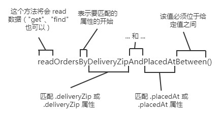

或者  @Query 对其进行注解

### 第 4 章 Spring 安全

#### 4.1 启用 Spring Security

添加依赖,当应用程序启动时，自动配置将检测类路径中的 Spring Security，并设置一些基本的安全性配置。

可以获得以下安全性: 

- 所有的 HTTP 请求路径都需要认证。
- 不需要特定的角色或权限。
- 没有登录页面。
- 身份验证由 HTTP 基本身份验证提供。
- 只有一个用户；用户名是 *user*。

#### 4.2 配置 Spring Security

继承 WebSecurityConfigurerAdapter 可以简化配置

覆盖 configure 自定义策略

##### 4.2.1 内存用户存储

AuthenticationManagerBuilder 使用构造器风格的 API 来配置身份验证细节

##### 4.2.2 基于 JDBC 的用户存储

AuthenticationManagerBuilder 上调用 jdbcAuthentication()。然后，必须设置 DataSource，以便它知道如何访问数据库。

1. 重写默认用户查询

   > 在将默认 SQL 查询替换为自己设计的查询时，一定要遵守查询的基本约定。它们都以用户名作为唯一参数。身份验证查询选择用户名、密码和启用状态；授权查询选择包含用户名和授予的权限的零个或多个行的数据；组权限查询选择零个或多个行数据，每个行有一个 group id、一个组名和一个权限。

2. 使用编码密码

   >  passwordEncoder() 方法指定一个密码编码器

##### 4.2.3 LDAP 支持的用户存储

可以使用 ldapAuthentication() 方法,userSearchFilter() 和 groupSearchFilter() 方法用于为基本 LDAP 查询提供过滤器，这些查询用于搜索用户和组。默认情况下，用户和组的基本查询都是空的，这表示将从 LDAP 层次结构的根目录进行搜索

1. 配置密码比较

   > 另一种选择是执行比较操作，这包括将输入的密码发送到 LDAP 目录，并要求服务器将密码与用户的密码属性进行比较。因为比较是在 LDAP 服务器中进行的，所以实际的密码是保密的。
   >
   > passwordCompare()

2. 引用远程 LDAP 服务器

   默认情况下，Spring Security 的 LDAP 身份验证假设 LDAP 服务器正在本地主机上监听端口 33389。

   如果 LDAP 服务器位于另一台机器上，则可以使用 contextSource() 方法来配置位置

3. 配置嵌入式 LDAP 服务器

   如果没有 LDAP 服务器去做身份验证，Spring Security 可提供一个嵌入式 LDAP 服务器。可以通过 root() 方法为嵌入式服务器指定根后缀，而不是将 URL 设置为远程 LDAP 服务器： LDAP 服务器启动时，它将尝试从类路径中找到的任何 LDIF 文件进行数据加载

##### 4.2.4 自定义用户身份验证

UserDetails 的实现将向框架提供一些基本的用户信息，比如授予用户什么权限以及用户的帐户是否启用。

1. 创建用户详细信息服务

   ```java
   interface UserRepository extends CrudRepository<User, Long>
   ```

   实现并注入到 configure方法,用 userDetailsService() 进行注入

2. 用户注册

   尽管 Spring Security 处理安全性的很多方面，但它实际上并不直接涉及用户注册过程，因此将依赖于 Spring MVC 来处理该任务

#### 4.3 保护 web 请求

WebSecurityConfigurerAdapter 的另一个 configure() ,参数是 HttpSecurity 对象.

##### 4.3.1 保护请求

使用 antMatchers() 进行拦截和过滤,支持SpEL

##### 4.3.2 创建用户登录页面

要替换内置的登录页面，首先需要告诉 Spring Security 自定义登录页面的路径。

 formLogin() 

loginPage()

defaultSuccessUrl()

##### 4.3.3 登出

logout()

logoutSuccessUrl("/")

##### 4.3.4 阻止跨站请求伪造攻击

跨站请求伪造（CSRF）是一种常见的安全攻击.它涉及到让用户在一个恶意设计的 web 页面上编写代码，这个页面会自动（通常是秘密地）代表经常遭受攻击的用户向另一个应用程序提交一个表单。

为了防止此类攻击，应用程序可以在显示表单时生成 CSRF token，将该 token 放在隐藏字段中，然后将其存储在服务器上供以后使用。提交表单时，token 将与其他表单数据一起发送回服务器。然后服务器拦截请求，并与最初生成的 token 进行比较。如果 token 匹配，则允许继续执行请求。否则，表单一定是由一个不知道服务器生成的 token的恶意网站呈现的。

Spring Security 有内置的 CSRF 保护。它是默认启用的，不需要显式地配置它。只需确保应用程序提交的任何表单都包含一个名为 _csrf 的字段，该字段包含 CSRF token。

```jsp
<input type="hidden" name="_csrf" th:value="${_csrf.token}"/>
```

#### 4.4 了解你的用户

有几种方法可以确定用户是谁。以下是一些最常见的方法

- 将主体对象注入控制器方法

- 将身份验证对象注入控制器方法

- 使用 SecurityContext 获取安全上下文

  > 可以在应用程序的任何地方使用，而不仅仅是在控制器的处理程序方法中，这使得它适合在较低级别的代码中使用。

- 使用 @AuthenticationPrincipal 注解的方法

### 第 5 章 使用配置属性

Spring Boot 提供了一种配置属性的方法。配置属性不过是 Spring 应用程序上下文中 bean 上的属性，可以从几个属性源（包括 JVM 系统属性、命令行参数和环境变量）之一进行设置

#### 5.1 微调自动配置

Spring两种配置

- *Bean wiring* —— 它声明应用程序组件将在 Spring 应用程序上下文中作为 bean 创建，以及它们应该如何相互注入。

- *Property injection* —— 在 Spring 应用程序上下文中设置 bean 的值。

##### 5.1.1 理解 Spring 环境抽象

Spring 环境抽象是任何可配置属性的一站式商店。它抽象了属性的起源，以便需要这些属性的 bean 可以从 Spring 本身使用它们。

Spring 环境来自几个属性源，包括：

- JVM 系统属性

- 操作系统环境变量

- 命令行参数

- 应用程序属性配置文件


比如可以在配置文件中设置 

```yaml
server.port=9090
```

或者启动Java程序的时候

```shell
$ java -jar tacocloud-0.0.5-SNAPSHOT.jar --server.port=9090
```

或者设置环境变量

```shell
$ export SERVER_PORT=9090
```

##### 5.1.2 配置数据源

可以手动在yaml文件设置数据源

```yaml
spring:
  datasource:
    url: jdbc:mysql://localhost/tacocloud
    username: tacodb
    password: tacopassword
```


或者你可能更喜欢在 JNDI 中配置数据源，并让 Spring 从那里查找它

```yml
spring:
  datasource:
    jndi-name: java:/comp/env/jdbc/tacoCloudDS
```

##### 5.1.3 配置嵌入式服务器

如果把server.port 设置为 0，但是服务器不会在端口 0 上启动。相反，它将从随机选择的可用端口启动。

需要对底层容器做的最常见的事情之一是将其设置为处理 HTTPS 请求。要做到这一点，你必须做的第一件事是通过使用 JDK 的 keytool 命令行工具创建一个密钥存储：

```shell
$ keytool -keystore mykeys.jks -genkey -alias tomcat -keyalg RSA
```

需要记住密码,在 application.yml 中，属性可能是这样的：

```yml
server:
  port: 8443
  ssl:
    key-store: file:///path/to/mykeys.jks
    key-store-password: letmein
    key-password: letmein
```

##### 5.1.4 配置日志

Spring Boot 通过 [Logback](http://logback.qos.ch/) 配置日志，默认为 INFO 级别，然后写入控制台

要完全控制日志配置，可以在类路径的根目录（在 src/main/resources 中）创建 log .xml 文件

spring的配置文件可以这么写

```yaml
logging:
  path: /var/logs/
  file: TacoCloud.log
  level:
    root: WARN
    org:
      springframework:
        security: DEBUG
```

##### 5.1.5 使用特殊的属性值

可以使用 `${}`占位标记

```yml
greeting:
  welcome: ${spring.application.name}
```

#### 5.2 创建自己的配置属性

配置属性只不过是指定来接受 Spring 环境抽象配置的 bean 的属性。没有提到的是如何指定这些 bean 来使用这些配置。

为了支持配置属性的属性注入，Spring Boot 提供了@ConfigurationProperties 注释。当放置在任何 Spring bean 上时，它指定可以从 Spring 环境中的属性注入到该 bean 的属性。(属性名字要对应)

##### 5.2.1 定义配置属性持有者

@ConfigurationProperties 实际上经常放在 bean 上。在应用程序中，这些 bean 的惟一目的是作为配置数据的持有者，这使控制器和其他应用程序类不涉及特定于配置的细节，它还使得在几个可能使用该信息的 bean 之间共享公共配置属性变得很容易。

通过使用配置属性持有者 bean，就在在一个地方收集了配置属性的细节，使得需要这些属性的类相对干净。

##### 5.2.2 声明配置属性元数据

配置属性元数据是完全可选的，并不会阻止配置属性的工作。但是元数据对于提供有关配置属性的最小文档非常有用，特别是在 IDE 中。

要为自定义配置属性创建元数据，需要在 META-INF（例如，在项目下的 src/main/resources/META-INF 中）中创建一个名为 addition-spring-configuration-metadata.json 的文件。

```json
{
    "properties": [
        {
            "name": "taco.orders.page-size",
            "type": "java.lang.String",
            "description":"Sets the maximum number of orders to display in a list."
        }
    ]
}
```

#### 5.3 使用 profile 文件进行配置

当应用程序部署到不同的运行时环境时，通常会有一些配置细节不同

profile 文件是一种条件配置类型，其中根据运行时激活的 profile 文件应用或忽略不同的 bean、配置类和配置属性。

##### 5.3.1 定义特定 profile 的属性

文件的名称应该遵循这个约定：application-{profile 名称}.yml 或 application-{profile 名称}.properties。比如 application-prod.yml

另一种指定特定 profile 文件的属性的方法只适用于 YAML 配置。

```yml
logging:
  level:
    tacos: DEBUG
---
spring:
  profiles: prod
```

##### 5.3.2 激活 profile 文件

设置 application.yml 中的这个属性：

```yml
spring:
  profiles:
    active:
    - prod
```

但是这可能是设定一个活动 profile 最糟糕的方式了。

推荐使用环境变量设置激活的 profile

```shell
% export SPRING_PROFILES_ACTIVE=prod
% java -jar taco-cloud.jar --spring.profiles.active=prod
```

##### 5.3.3 有条件地使用 profile 文件创建 bean

为不同的配置文件提供一组惟一的 bean 是很有用的

假设只有在某个配置文件处于活动状态时才需要创建一些 bean，在这种情况下，@Profile 注解可以将 bean 指定为只适用于给定的 profile 文件。

```yml
@Profile({"!prod", "!qa"})
```

## 第二部分 集成 Spring

### 第 6 章 创建 REST 服务

许多应用程序采用了一种常见的设计：将用户界面推近客户端，而服务器公开一个 API，通过该 API，所有类型的客户端都可以与后端进行交互

#### 6.1 编写 RESTful 控制器

springMVC  支持一些 Restful 风格的注解

##### 6.1.1 从服务器获取数据

controller添加以下注解,表明Controller 中的任何处理程序方法只在请求的 Accept 头包含 “application/json” 时才处理请求。

```java
@RequestMapping(path="/design", produces="application/json")
```

` @CrossOrigin `这个限制可以通过在服务器响应中包含 CORS（跨源资源共享）头来克服。Spring 使得使用 @CrossOrigin 注解应用 CORS 变得很容易。正如这里所应用的，@CrossOrigin 允许来自任何域的客户端使用 API。

`@PathVariable `可以映射路径变量

```java
/**
	用到了 Optional ,健壮性很好
*/
@GetMapping("/{id}")
public ResponseEntity<Taco> tacoById(@PathVariable("id") Long id) {
    Optional<Taco> optTaco = tacoRepo.findById(id);
    if (optTaco.isPresent()) {
        return new ResponseEntity<>(optTaco.get(), HttpStatus.OK);
    }
    
    return new ResponseEntity<>(null, HttpStatus.NOT_FOUND);
}
```

##### 6.1.2 向服务器发送数据

```java
@PostMapping(consumes="application/json")
@ResponseStatus(HttpStatus.CREATED)
public Taco postTaco(@RequestBody Taco taco) {
    return tacoRepo.save(taco);
}
```

*consumes* 表明 用于处理输入,只接受JSON

返回Restful的状态

##### 6.1.3 更新服务器上的资源

为什么有两种不同的 HTTP 方法来更新资源呢？PUT和PATCH

- GET 请求用于将数据从服务器传输到客户机，而 PUT 请求用于将数据从客户机发送到服务器。
- PUT 实际上是用于执行大规模替换操作，而不是更新操作。相反，HTTP PATCH 的目的是执行补丁或部分更新资源数据。

##### 6.1.4 从服务器删除数据

DELETE请求

#### 6.2 启用超媒体

*超媒体作为应用程序状态的引擎*（HATEOAS），是一种创建自描述 API 的方法，其中从 API 返回的资源包含到相关资源的链接。

这种特殊风格的 HATEOAS 被称为 HAL（超文本应用语言）这是一种简单且常用的格式，用于在 JSON 响应中嵌入超链接。

Spring HATEOAS 项目为 Spring 提供了超链接支持。它提供了一组类和资源汇编器，可用于在从 Spring MVC 控制器返回资源之前向资源添加链接。

##### 6.2.1 添加超链接

Spring HATEOAS 提供了两种表示超链接资源的主要类型：Resource 和 Resources。

```java
@GetMapping("/recent")
public Resources<Resource<Taco>> recentTacos() {
    PageRequest page = PageRequest.of(
        0, 12, Sort.by("createdAt").descending());
    
    List<Taco> tacos = tacoRepo.findAll(page).getContent();
    Resources<Resource<Taco>> recentResources = Resources.wrap(tacos);
   	/** 看起来很舒服,但是还是有硬编码
    recentResources.add(
    ControllerLinkBuilder.linkTo(DesignTacoController.class)
                         .slash("recent")
                         .withRel("recents"));
    */
    recentResources.add(
    linkTo(methodOn(DesignTacoController.class).recentTacos())
    .withRel("recents"));
    
    return recentResources;
}
```

##### 6.2.2 创建资源装配器

将定义一个实用工具类，将 taco 对象转换为新的 TacoResource 对象(继承 *ResourceSupport*)，而不是让 Resources.wrap() 为列表中的每个 taco 创建一个资源对象。TacoResource 对象看起来很像 Taco，但是它也能够携带链接。

> 选择创建一个单独的资源类型，这样 Taco 就不会在不需要链接的情况下不必要地与资源链接混杂在一起。另外，通过创建一个单独的资源类型，我可以很容易地去掉 id 属性，这样就不会在 API 中暴露它。

为了帮助将 Taco 对象转换为 TacoResource 对象，还需要创建一个资源装配器(继承  *ResourceAssemblerSupport*)

##### 6.2.3 嵌套命名关系

`@Relation` 注解可以帮助打破 JSON 字段名与 Java 中定义的资源类型类名之间的耦合

#### 6.3 启用以数据为中心的服务

Spring Data 拥有一种特殊的魔力，它根据在代码中定义的接口自动创建存储库的实现。但是 Spring Data 还有另一个技巧，可以为应用程序定义 API。

Spring Data REST 为 Spring Data 创建的存储库自动创建REST API。

这将设置 Spring Data REST 端点的基本路径为 `/api`

```yml
spring:
  data:
    rest:
      base-path: /api
```

##### 6.3.1 调整资源路径和关系名称

只需向 API 基础路径发出 GET 请求即可获得所有公开端点的链接

`@RestResource` 注解(标注在类上)让你可以给定任何你想要的的名称和路径的关系

##### 6.3.2 分页和排序

```shell
$ curl "localhost:8080/api/tacos?sort=createAt,desc?page=0&size=12"
```

问题在于硬编码

##### 6.3.3 添加用户端点

当你编写自己的 API 控制器时，它们的端点似乎以以下两种方式与 Spring Data REST 端点分离：

- 自己的控制器端点没有映射到 Spring Data REST 的基本路径下。
- 在自己的控制器中定义的任何端点都不会自动作为超链接包含在 Spring Data REST 端点返回的资源中。

基本路径可以使用 `@RepositoryRestController` 解决,它不确保从处理程序方法返回的值被自动写入响应体。因此，需要使用 @ResponseBody 对方法进行注解，或者返回一个包装响应数据的 ResponseEntity。

##### 6.3.4 向 Spring Data 端点添加用户超链接

通过声明资源处理器 bean，可以将链接添加到 Spring Data REST 自动包含的链接列表中。Spring Data HATEOAS 提供了 ResourceProcessor，这是一个在通过 API 返回资源之前操作资源的接口。出于需要自动包含链接列表的目的，需要对 ResourceProcessor 进行实现，该实现将一个最近链接添加到类型为 PagedResources\<Resource \<Taco\>\> 的任何资源（为 `/api/tacos` 端点返回的类型）。

```java
@Bean
public ResourceProcessor<PagedResources<Resource<Taco>>>
    tacoProcessor(EntityLinks links) {
    
    return new ResourceProcessor<PagedResources<Resource<Taco>>>() {
        @Override
        public PagedResources<Resource<Taco>> process(
            PagedResources<Resource<Taco>> resource) {
            resource.add(
                links.linkFor(Taco.class)
                .slash("recent")
                .withRel("recents"));
            
            return resource;
        }
    };
}
```

### 第 7 章 调用 REST 服务

就像薛定谔的猫一样，在我们向它发出请求之前，我们无法知道 API 是活动的还是返回 HTTP 404 响应。

Spring 应用程序可以通过以下方式使用 REST API：

- RestTemplate —— 一个由 Spring 核心框架提供的简单、同步 REST 客户端。
- *Traverson* —— 可感知超链接的同步 REST 客户端，由 Spring HATEOAS 提供，灵感来自同名的 JavaScript 库。
- WebClient —— 一个在 Spring 5 中引入的响应式、异步 REST 客户端。

#### 7.1 使用 RestTemplate 调用 REST 端点

使用低级 HTTP 库，客户端需要创建一个客户端实例和一个请求对象，执行请求，解释响应，将响应映射到域对象，并处理过程中可能抛出的任何异常。不管发送什么 HTTP 请求，所有这些样板文件都会重复。

RestTemplate 使你不必为调用 REST 资源而做单调的工作。

定义了12个唯一操作,比如 delete() exchange()等

##### 7.1.1 请求 GET 资源

```java
public Ingredient getIngredientById(String ingredientId) {
    return rest.getForObject("http://localhost:8080/ingredients/{id}",
                             Ingredient.class, ingredientId);
}
```

##### 7.1.2 请求 PUT 资源

##### 7.1.3 请求 DELETE 资源

##### 7.1.4 请求 POST 资源

#### 7.2 使用 Traverson 引导 REST API

Traverson 附带了 Spring Data HATEOAS，作为在 Spring 应用程序中使用超媒体 API 的开箱即用解决方案

要使用 Traverson，首先需要实例化一个 Traverson 对象和一个 API 的基础 URI：

```java
Traverson traverson = new Traverson(
    URI.create("http://localhost:8080/api"), MediaType.HAL_JSON);
```

有了 Traverson 对象，可以通过以下链接开始使用 API

```java
ParameterizedTypeReference<Resources<Ingredient>> ingredientType =
    new ParameterizedTypeReference<Resources<Ingredient>>() {};

Resources<Ingredient> ingredientRes =
    traverson.follow("ingredients").toObject(ingredientType);

Collection<Ingredient> ingredients = ingredientRes.getContent();
```

通过调用 Traverson 对象上的 follow() 方法，可以引导到链接关系名称为 ingredients 的资源。现在客户端已经引导到 ingredients，需要通过调用 toObject() 来提取该资源的内容。

当需要同时引导 API 和更新或删除资源时，需要同时使用 RestTemplate 和 Traverson。Traverson 仍然可以用于引导到将创建新资源的链接。然后可以给 RestTemplate 一个链接来执行 POST、PUT、DELETE 或任何其他 HTTP 请求。

#### 7.3 小结

- 客户端可以使用 RestTemplate 针对 REST API 发出 HTTP 请求。
- Traverson 可以通过使用在响应中嵌入的超链接来让客户端引导 API。

### 第 8 章 发送异步消息

*同步* 通信有它的地位，这是我们在 REST 中所看到的。但这并不是开发人员可以使用的惟一应用程序间通信方式。异步消息传递是一种间接地将消息从一个应用程序发送到另一个应用程序而无需等待响应的方式。这种间接方式提供了通信应用程序之间更松散的耦合和更大的可伸缩性。

#### 8.1 使用 JMS 发送消息

JMS 是一个 Java 标准，它定义了一个用于使用消息代理的公共 API

Spring 通过称为 JmsTemplate 的基于模板的抽象来支持 JMS。使用 JmsTemplate，很容易从生产者端跨队列和主题发送消息，并在消费者端接收这些消息。Spring 还支持消息驱动 POJO 的概念：简单的 Java 对象以异步方式对队列或主题上到达的消息做出响应。

##### 8.1.1 设置 JMS

在使用 JMS 之前，必须将 JMS 客户端添加到项目的构建中,Artemis 是 ActiveMQ 的下一代重新实现,加入依赖

```yml
spring:
  artemis:
    host: artemis.tacocloud.com	#broker 主机
    port: 61617					#broker 端口
    user: tacoweb
    password: 13tm31n
```

这将设置 Spring，以创建到监听 artemis.tacocloud.com（端口 61617）的 Artemis Broker 的 broker 连接

[Artemis安装官方文档](https://activemq.apache.org/artemis/docs/latest/using-server.html)

##### 8.1.2 使用 JmsTemplate 发送消息

有了JMS starter依赖,Spring Boot 将会自动配置 JmsTemplate，这样就可以将其注入并使用它发送和接收消息了。

```java
public void sendOrder(Order order) {
    jms.send(
        "tacocloud.order.com",
        session -> session.createObjectMessage(order));
}
```

1. 在发送前转换消息

   convertAndSend() 可以转换为消息,通过 MessageConverter 实现的，它完成了将对象转换为消息的复杂工作。

2. 配置消息转换器

   *MessageConverter*   实现该接口即可,Spring自带一些转换器

   SimpleMessageConverter 是默认的消息转换器，但是它要求发送的对象实现 Serializable 接口

   MappingJackson2MessageConverter 使用 Jackson 2 JSON 库对消息进行与 JSON 的转换

可以通过调用消息转换器上的 setTypeIdMappings() 将合成类型名称映射到实际类型。

3. 后期处理消息

   在消息中添加一个自定义头信息，以承载订单的源.,通过调用消息对象上的 setStringProperty() 轻松实现

##### 8.1.3 接收 JMS 消息

消费消息时，可以选择 *拉模型*（代码请求消息并等待消息到达）或 *推模型*（消息可用时将消息传递给代码）。

JmsTemplate 提供了几种接收消息的方法，但它们都使用拉模型。调用方法会阻塞

推模型,不会阻塞,但是消息到达的太快可能负担过重

1. 使用 JmsTemplate 接收

   ```java
   jms.receiveAndConvert() 
   ```

2. 声明消息监听器

   要创建对 JMS 消息作出响应的消息监听器，只需使用 @JmsListener 对组件中的方法进行注解。

#### 8.2 使用 RabbitMQ 和 AMQP

RabbitMQ 可以说是 AMQP 最优秀的实现，它提供了比 JMS 更高级的消息路由策略。JMS 消息使用接收方将从中检索它们的目的地的名称来寻址，而 AMQP 消息使用交换器的名称和路由键来寻址，它们与接收方正在监听的队列解耦。


 

##### 8.2.1 添加 RabbitMQ 到 Spring 中

将 AMQP starter 添加到构建中将触发自动配置，该配置将创建 AMQP 连接工厂和 RabbitTemplate bean，以及其他支持组件。只需添加此依赖项，就可以开始使用 Spring 从 RabbitMQ broker 发送和接收消息

```yml
spring:
  profiles: prod
  rabbitmq:
    host: rabbit.tacocloud.com
    port: 5673
    username: tacoweb
    password: l3tm31n
    template:
      exchange: tacocloud.orders
      routing-key: kitchens.central
```

##### 8.2.2 使用 RabbitTemplate 发送消息

RabbitTemplate 方法根据交换和路由键发送消息

```java
public void sendOrder(Order order) {
        MessageConverter converter = rabbit.getMessageConverter();
        MessageProperties props = new MessageProperties();
        Message message = converter.toMessage(order, props);
        rabbit.send("tacocloud.order", message);
    }
```


1. 配置消息转换器

   修改消息转换器，需要做的是配置 MessageConverter bean

2. 设置消息属性

   MessageProperties  对象可以修改

##### 8.2.3 从 RabbitMQ 接收消息

使用 RabbitTemplate 发送消息与使用 JmsTemplate 发送消息差别不大

#### 8.3 使用 Kafka 发送消息

乍一看，Kafka 是一个消息代理，就像ActiveMQ、Artemis 或 Rabbit 一样。但是 Kafka 有一些独特的技巧。

Kafka 集群由多个 broker 组成，每一个都作为 topic 分区的 leader


##### 8.3.1 在 Spring 中设置 Kafka

没有starter,添加依赖

##### 8.3.2 使用 KafkaTemplate 发送消息

topic 和 payload 是两个最重要的参数。

##### 8.3.3 编写 Kafka 监听器

对于 Kafka，消息监听器被定义为被 @KafkaListener 注解的方法。

### 第 9 章 集成 Spring

#### 9.1 声明简单的集成流

Spring Integration 支持创建集成流

第一个依赖项是 Spring Integration 的 Spring Boot starter。

第二个依赖项是 Spring Integration 的文件端点模块。此模块是用于与外部系统集成的二十多个端点模块之一。文件端点模块提供了将文件从文件系统提取到集成流或将数据从流写入文件系统的能力。

接下来，需要为应用程序创建一种将数据发送到集成流的方法，以便将数据写入文件。为此，将创建一个网关接口

```java
@MessagingGateway(defaultRequestChannel="textInChannel")
public interface FileWriterGateway {
    void writeToFile(
        @Header(FileHeaders.FILENAME) String filename,
        String data);
}
```

现在已经有了一个消息网关，还需要配置集成流。

##### 9.1.1 使用 XML 定义集成流

##### 9.1.2 在 Java 中配置集成流

```java
@Configuration
public class FileWriterIntegrationConfig {
    
    @Bean
    @Transformer(inputChannel="textInChannel", outputChannel="fileWriterChannel")
    public GenericTransformer<String, String> upperCaseTransformer() {
        return text -> text.toUpperCase();
    }
    
    @Bean
    @ServiceActivator(inputChannel="fileWriterChannel")
    public FileWritingMessageHandler fileWriter() {
        FileWritingMessageHandler handler = 
            new FileWritingMessageHandler(new File("/tmp/sia5/files"));
        handler.setExpectReply(false);
        handler.setFileExistsMode(FileExistsMode.APPEND);
        handler.setAppendNewLine(true);
        return handler;
    }
}
```

##### 9.1.3 使用 Spring Integration 的 DSL 配置

```java
@Bean
public IntegrationFlow fileWriterFlow() {
    return IntegrationFlows
        .from(MessageChannels.direct("textInChannel"))
        .<String, String>transform(t -> t.toUpperCase())
        .channel(MessageChannels.direct("fileWriterChannel"))
        .handle(Files.outboundAdapter(new File("/tmp/sia5/files"))
                .fileExistsMode(FileExistsMode.APPEND)
                .appendNewLine(true))
        .get();
}
```

#### 9.2 探索 Spring Integration

集成流由以下一个或多个组件组成

*Channels* —— 将信息从一个元素传递到另一个元素。

*Filters* —— 有条件地允许基于某些标准的消息通过流。

*Transformers* —— 更改消息值或将消息有效负载从一种类型转换为另一种类型。

*Routers* —— 直接将信息发送到几个渠道之一，通常是基于消息头。

*Splitters* —— 将收到的信息分成两条或多条，每条都发送到不同的渠道。

*Aggregators* —— 与分离器相反，它将来自不同渠道的多条信息组合成一条信息。

*Service activators* —— 将消息传递给某个 Java 方法进行处理，然后在输出通道上发布返回值。

*Channel adapters* —— 将通道连接到某些外部系统或传输。可以接受输入，也可以向外部系统写入。

*Gateways* —— 通过接口将数据传递到集成流。

##### 9.2.1 消息通道

消息通道意指消息移动的集成管道移动。它们是连接 Spring Integration 所有其他部分的管道。

```java
@Bean
public IntegrationFlow orderFlow() {
    return IntegrationFlows
        ...
        .channel("orderChannel")
        ...
        .get();
}
```

##### 9.2.2 过滤器

过滤器可以放置在集成管道的中间，以允许或不允许消息进入流中的下一个步骤。

##### 9.2.3 转换器

##### 9.2.4 路由

基于某些路由标准的路由器允许在集成流中进行分支，将消息定向到不同的通道。

```java
@Bean
@Router(inputChannel="numberChannel")
public AbstractMessageRouter evenOddRouter() {
    return new AbstractMessageRouter() {
        @Override
        protected Collection<MessageChannel>
            determineTargetChannels(Message<?> message) {
            Integer number = (Integer) message.getPayload();
            if (number % 2 == 0) {
                return Collections.singleton(evenChannel());
            }
            return Collections.singleton(oddChannel());
        }
    };
}
​
@Bean
public MessageChannel evenChannel() {
    return new DirectChannel();
}
​
@Bean
public MessageChannel oddChannel() {
    return new DirectChannel();
}
```

##### 9.2.5 分割器

在集成流中，将消息拆分为多个独立处理的消息可能很有用。Splitter 将为分割并处理这些消息。

有两个基本用例可以使用 Splitter：

- 消息有效载荷，包含单个消息有效载荷相同类型的项的集合。
- 信息有效载荷，携带的信息虽然相关，但可以分为两种或两种以上不同类型的信息。

可以使用 `@Splitter` 注解将 *OrderSplitter bean* 声明为集成流的一部分

##### 9.2.6 服务激活器

服务激活器从输入信道接收消息并发送这些消息给的 MessageHandler。

```java
@Bean
@ServiceActivator(inputChannel="someChannel")
public MessageHandler sysoutHandler() {
    return message -> {
        System.out.println("Message payload: " + message.getPayload());
    };
}
```

##### 9.2.7 网关

网关是通过一个应用程序可以将数据提交到一个集成信息流和接收这是该流的结果的响应的装置。通过 Spring Integration 实现的，网关是实现为应用程序可以调用将消息发送到集成信息流的接口。

##### 9.2.8 通道适配器

通道适配器代表集成信息流的入口点和出口点。数据通过入站信道适配器的方式进入到集成流中，通过出站信道适配器的方式离开集成流。

##### 9.2.9 端点模块

Spring Integration 可以让你创建自己的通道适配器，这是很棒的。但是，更棒的是 Spring Integration 提供了包含通道超过两打的端点模块适配器，包括入站和出站，用于与各种常用外部系统进行集成

#### 9.3 创建 Email 集成流

1. 定义一个简单的配置属性类

   ```java
   @Data
   @ConfigurationProperties(prefix="tacocloud.email")
   @Component
   public class EmailProperties {
       private String username;
       private String password;
       private String host;
       private String mailbox;
       private long pollRate = 30000;
       
       public String getImapUrl() {
           return String.format("imaps://%s:%s@%s/%s",
                this.username, this.password, this.host, this.mailbox);
       }
   }
   ```

   

2. Java DSL 配置下的 taco 订单电子邮件流(可以通过将 Email 端点模块作为项目构建的依赖项)

   ```java
   @Configuration
   public class TacoOrderEmailIntegrationConfig {
       
       @Bean
       public IntegrationFlow tacoOrderEmailFlow(
           EmailProperties emailProps,
           EmailToOrderTransformer emailToOrderTransformer,
           OrderSubmitMessageHandler orderSubmitHandler) {
           
           return IntegrationFlows
               .from(
                 Mail.imapInboundAdapter(emailProps.getImapUrl()),
                 e -> e.poller(
                     Pollers.fixedDelay(emailProps.getPollRate())))
               .transform(emailToOrderTransformer)
               .handle(orderSubmitHandler)
               .get();
       }
   }
   ```

3. 作为一个独立的 Spring Integration 流，应用程序并不需要 Spring MVC，或是嵌入的Tomcat。禁用MVC的自动配置

```yml
spring:
  main:
    web-application-type: none
```

## 第三部分 响应式 Spring

 Spring Reactor 或者说 Reactive Streams 和 Java 8 Stream 的差别是什么呢？

简单来说，这两者最大的差别是前者是 Push-based，后者是 Pull-based

### 第 10 章 Reactor 介绍

当我们开发应用程序时，有两种风格的代码我们可以写：同步式和响应式：

- *同步式* 的代码很像是假想的荒谬的报纸订阅的情况。这是一套串行任务，每次运行一个，完成前一个任务后再完成后一个。数据是批量进行处理的，在前面的任务没有完成批量数据处理前，不能将工作移交到下一个任务。
- *响应式* 的代码很像是真正的报纸订阅的情况。定义一组任务去处理数据，但这些任务可并行运行。每个任务处理这些数据的一个子集，当它处理另外一个子集的时候，把处理完成的数据交给下一个任务。

#### 10.1 理解响应式编程

响应式编程是对命令式编程进行替代的一个范例。这种替代的存在是因为响应式编程解决了命令式编程的限制。通过了解这些限制，可以更好地把握响应式模式的好处。

响应式编程是函数式和声明式的。响应式编程涉及描述通过该数据流的 pipeline 或 stream，而不是描述的一组按顺序执行的步骤。响应式流处理数据时只要数据是可用的就进行处理，而不是需要将数据作为一个整体进行提供。事实上，输入数据可以是无穷的

##### 10.1.1 定义响应式流

Backpressure是一种手段，通过对用户愿意处理的数据量设定限制，数据消费者可以避免被生产速度过快的数据淹没。

> **Java Streams** 与 **Reactive Streams** 对比
>
> 在 Java 流和响应式流之间有很大的相似性。首先，它们的名字中都含有 Streams。它们也都为处理数据提供函数式接口。
>
> Java 流通常是同步的，同时只能处理有限数据集。它们本质上是使用函数式进行集合迭代的一种手段。
>
> 响应式流支持任何大小的数据集，包括无限数据集的异步处理。它们使实时处理数据成为了可能。

响应式流的规范可以通过四个接口定义来概括：Publisher，Subscriber，Subscription 和 Processor

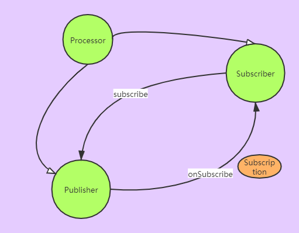

#### 10.2 Reactor

响应式编程是通过直接建立一个用于数据流通的管道，它可以被改变或以某种方式被使用。

Mono 是 Reactor 的两个核心类型之一，另一个是 Flux。两者都是响应式流的 Publisher 的实现。Flux 表示零个、一个或多个（可能是无限个）数据项的管道。Mono 特定用于已知的数据返回项不多于一个的响应式类型。

##### 10.2.1 图解响应式流

响应式流通常使用弹珠图（Marble Diagram）进行绘制


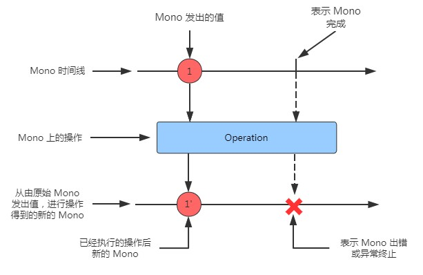

##### 10.2.2 添加 Reactor 依赖

除了 reactor依赖还有相应的测试依赖

#### 10.3 通用响应式操作实战

操作归类为

- 创建操作
- 联合操作
- 传输操作
- 逻辑处理操作

##### 10.3.1 创建响应式类型

1. 从对象进行创建

   *Flux.just()* 可以得到一个对象

   > 测试 Flux 或 Mono 更好的方式是使用 Reactor 中的 StepVerifier。给定一个 Flux 或 Mono，StepVerifier 订阅这个响应式类型，然后对流中流动的数据应用断言，最后验证流以预期方式完成。

2. 从集合创建
   *Flux.fromArray* 或者 fromIterable 或者 fromStream()

3. 生成 Flux 数据

   *Flux.range* 或者 interval

##### 10.3.2 响应式类型结合

1. 合并响应式类型
   使用 *mergeWith*

   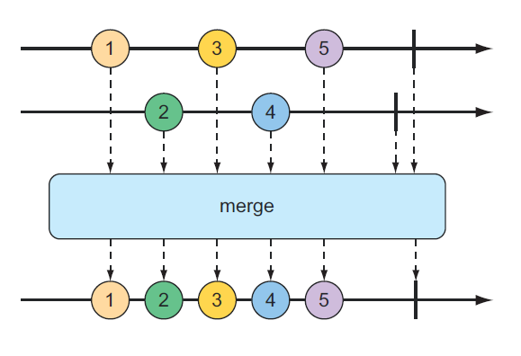

   使用 *zip*

   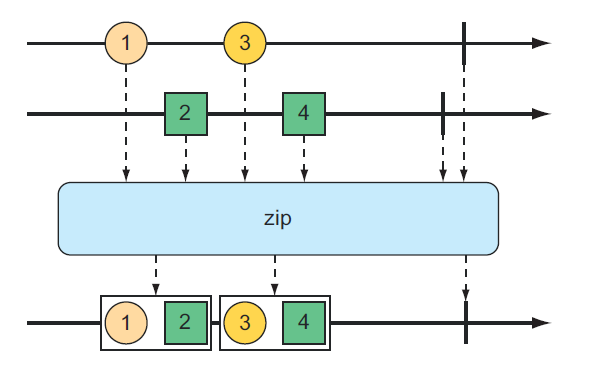

2. 选择第一个响应式类型进行发布

   first()

##### 10.3.3 转换和过滤响应式流

1. 从响应式类型中过滤数据
   skip() 跳过前几个项，take() 只发出前几个项 ,  filter() 过滤

2. 映射响应式数据

   map()  和 flapMap()

3. 在响应式流上缓冲数据
   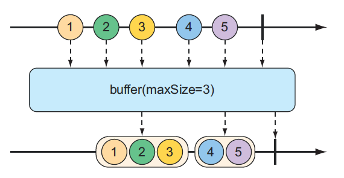

##### 10.3.4 对反应类型执行逻辑操作

all() 和 any() 

### 第 11 章 开发响应式 API

#### 11.1 使用 Spring WebFlux

典型的基于 Servlet 的 web 框架，比如 Spring MVC，本质上是阻塞和多线程的，每个连接使用一个线程。在处理请求时，将从线程池中提取一个工作线程来处理该请求。同时，请求线程被阻塞，直到工作线程通知它已完成为止。

异步 web 框架实现用较少的线程达到更高的可扩展性，通常一个 CPU 一个线程。通过应用被称为 *event looping* 的技术，这些框架的每个线程都能够处理许多请求，使得每个连接的成本低 。


##### 11.1.1 Spring WebFlux 介绍

Spring 5 所定义的完整的 web 开发技术栈。


Spring WebFlux 没有耦合到 Servlet API，因此它不需要运行一个 Servlet 容器。相反，它可以在任何非阻塞 web 容器上运行，包括 Netty、Undertow、Tomcat、Jetty 或任何 Servlet3.1 或更高版本的容器。

使用 WebFlux 而不是 Spring MVC 的一个有趣的副作用是，WebFlux 的默认嵌入式服务器是 Netty 而不是 Tomcat。Netty 是少数几个异步的事件驱动的服务器之一，它自然适合像 Spring WebFlux 这样的响应式 web 框架。

##### 11.1.2 编写响应式 Controller

理想情况下，一个响应式 cotroller 将是一个端到端的响应式栈的顶端，包括 controller、repository、database 和任何可能位于两者之间的 service。

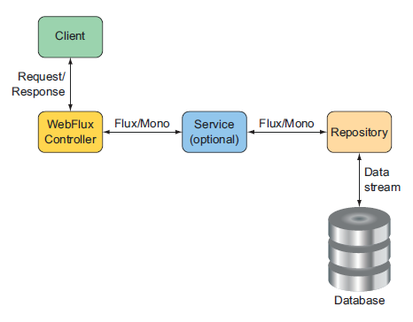

1. 返回单个值

   ```java
   @GetMapping("/{id}")
   public Mono<Taco> tacoById(@PathVariable("id") Long id) {
       return tacoRepo.findById(id);
   }
   ```

   

2. 返回多个值

   ```java
   @GetMapping("/recent")
   public Flux<Taco> recentTacos() {
       return tacoRepo.findAll().take(12);
   }
   ```

   

3. 响应式地处理输入

   ```java
   @PostMapping(consumes="application/json")
   @ResponseStatus(HttpStatus.CREATED)
   public Mono<Taco> postTaco(@RequestBody Mono<Taco> tacoMono) {
       return tacoRepo.saveAll(tacoMono).next();
   }
   ```

   

#### 11.2 定义函数式请求处理程序

作为 WebFlux 的替代，Spring 5 引入了一个新的函数式编程模型来定义响应式 API。这个新的编程模型更像是一个库，而不是一个框架，允许你将请求映射到不带注解的处理代码。

使用 Spring 的函数式编程模型编写 API 涉及四种主要类型：

- RequestPredicate —— 声明将会被处理的请求类型
- RouteFunction —— 声明一个匹配的请求应该如何被路由到处理代码中
- ServerRequest —— 表示 HTTP 请求，包括对头和正文信息的访问
- ServerResponse —— 表示 HTTP 响应，包括头和正文信息

```java
@Bean
public RouterFunction<?> helloRouterFunction() {
    return route(GET("/hello"), request -> ok().body(just("Hello World!"), String.class))
        .andRoute(GET("/bye"), request -> ok().body(just("See ya!"), String.class));
}
```

#### 11.3 测试响应式 Controller

##### 11.3.1 测试 GET 请求

```java
	@Test
    public void shouldReturnRecentTacos() {
        Taco[] tacos = {...}; // 数据
        Flux<Taco> tacoFlux = Flux.just(tacos);
        TacoRepository tacoRepo = Mockito.mock(TacoRepository.class);	// 服务层
        
        when(tacoRepo.findAll()).thenReturn(tacoFlux);
        WebTestClient testClient = WebTestClient.bindToController(
            new DesignTacoController(tacoRepo)).build();// 客户端
        
        testClient.get().uri("/design/recent")
            .exchange().expectStatus().isOk().expectBody()
            .jsonPath("$").isArray();
```

##### 11.3.2 测试 POST 请求

WebTestClient 针对 Spring WebFlux 控制器测试任何类型的请求

| HTTP方法 | WebTestClient 方法 |
| -------- | ------------------ |
| GET      | .get()             |
| POST     | .post()            |
| PUT      |                    |
| PATCH    |                    |
| DELETE   |                    |
| HEAD     |                    |

首先设置一些测试数据，模拟 TacoRepository，然后构建一个 WebTestClient，并绑定到 Controller。然后，使用 WebTestClient 向 `/design` 提交 POST 请求，请求的 body 类型为 application/json，有效负载是未保存 Mono 中 Taco 的 json 序列化形式。

##### 11.3.3 使用线上服务器进行测试

```JAVA
@RunWith(SpringRunner.class)
@SpringBootTest(webEnvironment=WebEnvironment.RANDOM_PORT)// 随机端口
public class DesignTacoControllerWebTest {
    @Autowired
    private WebTestClient testClient;
    
    @Test
	public void shouldReturnRecentTacos() throws IOException {
        testClient.get().uri("/design/recent")
            .accept(MediaType.APPLICATION_JSON).exchange()
            .expectStatus().isOk();
	}
}

```

#### 11.4 响应式消费 REST API

Spring 5 提供了 WebClient 作为 RestTemplate 的反应式版本。当 WebClient 向外部 APIs 发出请求的同时，也可以发出或接收反应式类型。

##### 11.4.1 通过 GET 方式获取资源

```java
Mono<Ingredient> ingredient = WebClient.create()   
  .get()   
  .uri("http://localhost:8080/ingredients/{id}", ingredientId)   
  .retrieve()   
  .bodyToMono(Ingredient.class);  
ingredient.subscribe(i -> { ... })
```

1. 使用基础 URI 发送请求

   ```java
   @Bean 
   public WebClient webClient() {  
     return WebClient.create("http://localhost:8080"); 
   }
   // 之后自动注入,用法同上,会使用相对路径
   ```

   

2. 对长时间运行的请求进行超时处理

   可以使用 Flux 或 Mono 的 `timeout()` 方法，为等待数据发布的过程设置一个时长限制。

##### 11.4.2 发送资源

把 get方式变成 post方式

```java
Mono<Ingredient> result = webClient
    .post()
    .uri("/ingredients")
    .body(ingredientMono, Ingredient.class)
    .retrieve()
    .bodyToMono(Ingredient.class);
result.subscribe(i -> { ... })
```

使用 syncBody() 可以把原始类型包装成Mono类型,进行发送;

除此之外还可以用 PUT 代替 POST方式

##### 11.4.3 删除资源

不需要负载,应该 subscribe 一个Mono\<Void\> 来发起请求

##### 11.4.4 处理错误

如果返回任何一种错误状态,WebClient应该记录它,否则默默忽略它

 onStatus() 接收两个参数,一个Http状态码,一个function(给ClientResponse对象,返回Moni\<Throw able\>)

subscribe时候可以传入success 和 failure 对应的lambda表达式

##### 11.4.5 交换请求

retrieve() 是 ResponseSpec的,处理不了响应头.

可以使用 exchange(),基于客户端请求

```java
Mono<Ingredient> ingredientMono = webClient
 .get()
 .uri("http://localhost:8080/ingredients/{id}", ingredientId)
 .exchange()
 .flatMap(cr -> {
 if (cr.headers().header("X_UNAVAILABLE").contains("true")) {
 return Mono.empty();
 }
 return Mono.just(cr);
 })
 .flatMap(cr -> cr.bodyToMono(Ingredient.class));
```

#### 11.5 保护响应式Web API

基于Servlet的Spring Security 可以使用 Filter 进行过滤拦截

Spring Security依然可以工作,它使用Spring的Web Filter来实现这一点，它是一种针对Servlet过滤器的Spring特定模拟，不需要依赖Servlet API。

使用起来基本没有差别

##### 11.5.1 配置响应式web security

SpringMVC 配置扩展 *WebSecurityConfigurerAdapter* 由`@EnableWebSecurity` 进行注解

```java
@Configuration
@EnableWebSecurity
public class SecurityConfig extends WebSecurityConfigurerAdapter {
     @Override
     protected void configure(HttpSecurity http) throws Exception {
     http
     .authorizeRequests()
     .antMatchers("/design", "/orders").hasAuthority("USER")
     .antMatchers("/**").permitAll();
     }
}
```

响应式配置如下:

```java
@Configuration
@EnableWebFluxSecurity
public class SecurityConfig {
     @Bean
     public SecurityWebFilterChain securityWebFilterChain(
     ServerHttpSecurity http) {
     return http
         .authorizeExchange()
         .pathMatchers("/design", "/orders").hasAuthority("USER")
         .anyExchange().permitAll()
         .and()
         .build();
     }
}
```

##### 11.5.2 配置响应式用户详细信息服务

SpringMVC 用户认证通过定义UserDetails对象进行

Flux 使用  ReactiveUserDetailsService 对象,


### 第 12 章 响应式持久化数据

Controller 层已经实现响应式了,那么为了不让整条数据流陷入瓶颈,其他部分也应该是响应式的.

#### 12.1 了解Spring Data的响应性故事

Spring Data的版本序列号Kay开始支持响应式持久. 支持Cassandra, MongoDB, Couchbase, or Redis

> Spring Data版本命名都是以计算机科学家,比如 Babbage, Codd,
>
> Dijkstra, Evans, Fowler, Gosling, Hopper, and Ingalls

目前不支持JPA,也就是关系型数据库

##### 12.1.1 反应式Spring Data的精华

repository层从 domain 对象变成 Mono和Flux对象进行持久化

查询时候的样式

```java
<Taco> Flux<Taco> saveAll(Publisher<Taco> tacoPublisher);
```

##### 12.1.2 响应和非响应类型之间的转换

已有JPA进行持久化

```java
List<Order> findByUser(User user);
```

通过转化成 Flux /Mono类型进行对接

```java
Flux<Order> orderFlux = Flux.fromIterable(orders);
Mono<Order> orderMono = Mono.just(order);
```

使用如下方式可以把响应式对象变成阻塞式对象

```java
Taco taco = tacoMono.block();
tacoRepo.save(taco);
```

可进行如下优化

```java
tacoFlux.subscribe(taco -> {
 tacoRepo.save(taco);
});
```

##### 12.1.3 开发响应式持久层

对 Cassandra 和 MongoDB 进行响应式持久化

#### 12.2 与响应性Cassandra储存库合作

Cassandra处理的是一排排数据，这些数据被写入到表中，表被划分为多个分布式节点。 没有一个节点携带所有数据，但任何给定的行都可以跨多个节点复制，从而消除任何单点故障。

Spring Data Cassandra提供映射注释，将应用程序域类型映射到支持的数据库结构。

[数据库学习文档](https://cassandra.apache.org/doc/latest/)

##### 12.2.1 构建数据库

添加依赖对应的starter即可(响应式的带有 reactive后缀)

> 在Cassandra中，键空间是Cassandra节点中的表的分组。 它大致类似于表、视图和约束如何在关系数据库中分组。

```yml
spring: #yml 配置
 	data:
 	cassandra:
 		keyspace-name: tacocloud
 			schema-action: recreate-drop-unused
 		contact-points:
		- casshost-1.tacocloud.com
		port: 9043
 		username: tacocloud
		password: s3cr3tP455w0rd
```

##### 12.2.2 了解Cassandra数据建模

和 关系型数据库的差别

- 卡桑德拉表可能有任意数量的列，但并不是所有的行都必须使用所有这些列。
- Cassandra数据库被分割成多个分区。 给定表中的任何行都可以由一个或多个分区管理，但不太可能所有分区都有所有行。 
- Cassandra表有两种键：分区键和聚类键。 哈希操作在每个行的分区键上执行，以确定该行将由哪个分区管理。 聚类键决定了在分区内维护行的顺序（不一定是它们可能出现在查询结果中的顺序）。 
- Cassandra是高度优化的读取操作。 因此，表的高度去正化和数据的交叉复制是常见和可取的

##### 12.2.3 Cassandra持久性映射域类型

这里是了解 映射关系(持久对象和Cassandra之间的映射),参看文档,不深入了解

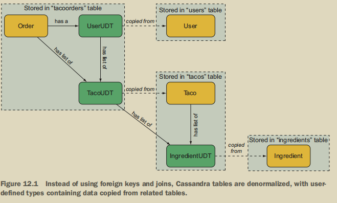

##### 12.2.4编写反应性Cassandra储存库

事实证明，编写反应性存储库并没有什么不同。 主要的区别是，您将扩展不同的基础存储库接口，您的方法将处理诸如Mono和Flux等反应性发布者，而不是域类型和集合。

*ReactiveCassandraRepository* 和 *ReactiveCrudRepository* 

 如果您要插入大量数据，您可以选择Reactive Cassandra Repository。 否则，最好坚持使用Reactive Crud Repository，它在其他数据库类型中更易于移植

此时方法返回的是Flux或Mono类型

查询语法和优化 pass

#### 12.3 编写响应式MongoDB存储库

文档型数据库,JSON格式.Spring里面使用方式差别不大

##### 12.3.1启用Spring Data Mongo DB

同Cassandra有两种依赖,方便测试可以添加嵌入式的mongoDB

```yml
spring:
 data:
 mongodb:
 host: mongodb.tacocloud.com
 port: 27018
 username: tacocloud
 password: s3cr3tp455w0rd
 database: tacoclouddb
```

##### 12.3.2将域类型映射到文档

[直接参考文档](https://docs.mongodb.com/guides/)

##### 12.3.3编写反应性Mongo DB存储库接口

扩展 *ReactiveCrudRepository* 或者 *ReactiveMongoRepository*

## 第四部分 云原生Spring

介绍微服务以及服务发现和注册,链路监视等

### 第 13 章 发现服务

#### 13.1  微服务思想

单应用服务体积随着业务不断膨胀,维护管理艰难,不便扩展,牵一发而动全身

微服务: 将应用分解为多个小的服务进行协作,共同构成一个大的服务

**好处**:

1. 每个小服务便于理解和维护,升级也不会影响其他服务,发布更频繁
2. 可以跨语言进行协作,

**缺点**:

1. 网络延迟是关键
2. 协调服务之间的调用是一项挑战

#### 13.2建立服务注册中心

Eureka(阿基米德的一个传说,洗澡-浮力-Eureka)

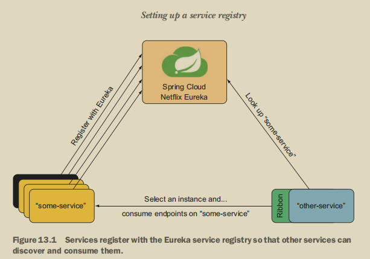

​	其他服务发送服务请求给Eureka,它返回对应服务的实例(负载均衡由Ribbon实现),之后就可以进行远程调用

​	Ribbon是客户端负载均衡,相对于集中式负载均衡,有以下好处:

- 与客户端数量成正比
- 客户端可以自定义均衡算法


1. 添加依赖 (服务端)
2. `@EnableEurekaServer` 启动
3. 默认8080端口

##### 13.2.1 配置Eureka

Eureka默认是集群模式,每30s发送一次心跳.单机模式可以如下配置:

```yml
eureka:
 instance:
 	hostname: localhost
 client:
 	fetch-registry: false
	register-with-eureka: false
 	service-url:
 		defaultZone: http://${eureka.instance.hostname}:${server.port}/eureka
	server:
		port: 8761
		enable-self-preservation: false
```

(开发环境)取消自我保护模式(90s内没有再次注册就会取消实例),

##### 13.2.2 缩放Eureka

可以在yml进行配置,实现多个Eureka启动

#### 13.3 注册和发现服务

添加依赖-客户端

##### 13.3.1 配置客户端属性

```yml
spring:	#多个服务可以有一样的名称
 application:
 	name: ingredient-service
eureka:
 client:
 	service-url:
 		defaultZone: http://eureka1.tacocloud.com:8761/eureka/ 	
```

它标识用于管理特定于应用程序的配置的配置服务的应用程序,端口设置为0的话可以随机监听端口

##### 13.3.2 获取服务

两种方式:

- 负载均衡的RestTemplate

  > 问题在于发起http请求时候需要URI,可以放到配置文件避免硬编码
  >
  > *@LoadBalanced*可以解决负载均衡问题
  >
  > URI里面把 主机名:端口 用服务名替代
  >
  > WebClient也可以@LoadBalance进行注解(说明响应式也可用)

- Feign客户端接口

  1. 添加依赖 openfeign,@EnableFeignClients 启用
  2. `@FeignClient` 注解表明对应的服务名,接口方法声明和远程方法声明要一致

### 第 14 章 配置管理

使用配置中心进行重复统一的配置设置

#### 14.1 共享配置

- 配置可以立即更改，甚至无需重新启动应用程序。 
- 共享公共配置的微服务不需要管理自己的属性设置副本，并且可以共享相同的属性。 如果需要对属性进行更改，则这些更改可以在一个地方进行一次，并应用于所有微服务。 
- 敏感配置细节可以与应用程序代码分开加密和维护。 未加密的值可以按需提供给应用程序，而不是要求应用程序携带解密信息的代码。

#### 14.2运行Config Server

 Config Server公开了一个REST API，客户端（其他服务）可以通过该API使用配置属性。 通过Config Server提供的配置位于Config Server外部，通常位于Git等源代码控制系统中。

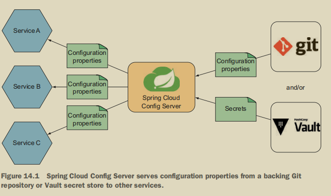

#####  14.2.1启用配置服务器

1. 添加依赖-带server,`@EnableConfigServer`启用

2. ```yaml
   spring:
    cloud:
    	config:
    		server:
    			git:
    				uri: https://github.com/tacocloud/tacocloud-config
   ```

3. > http://localhost:8888/application/default/master
   >
   > http://配置服务器主机名:端口/应用名/启用的Spring Profile/git分支

##### 14.2.2 填充配置存储库

- 将配置上传到配置中心,配置同上(注意修改分支等)可以通过分支 /子路径等进行获取

#### 14.3 使用共享配置

添加依赖-不带server,进行配置

#### 14.4 服务应用程序和配置文件特定属性

##### 14.4.1 提供特定于应用程序的特性

无论应用程序命名为什么，所有应用程序都将从application.yml文件接收配置属性。 但是每个服务应用程序的Spring.application.name属性将在请求中发送给ConfigServer（在请求路径的第一部分），如果有匹配的配置文件，这些属性也将被返回。 如果application.yml中的公共属性与特定于应用程序的配置文件中的公共属性之间重复属性定义，则应用程序特定属性将优先。

##### 14.4.2 从profiles使用属性

文件命名加上-prod等后缀进行区分

#### 14.5 保持配置隐秘

Config Server提供了两个使用秘密配置属性的选项：

- 在存储在Git中的配置文件中写入加密值
- 使用HashiCorp的Vault作为Config Server的后端存储，以及（或代替）Git

##### 14.5.1 加密Git中的属性

若要设置对称密钥，请将ConfigServer自己配置中的加密.密钥属性设置为将充当加密和解密密钥的某个值：

```yml
encrypt:
	key: s3cr3t
```

还可以使用keytool产生非对称加密公私钥

相关方法/属性参看相关文档

##### 14.5.2在Vault储存加密信息

[文档地址](https://www.vaultproject.io/docs/index.html)

#### 14.6 动态刷新配置属性

微服务都可以通过两种方式之一的新配置立即刷新：

- 手动--Config Server客户机在/actuator/refresh启用了一个特殊的Actuator端点。 对每个服务上的端点的HTTP POST请求将强制配置客户端从其后端检索最新配置。 
- 自动-Git存储库中的提交钩子可以触发ConfigServer客户端的所有服务的刷新。 这涉及另一个名为Spring Cloud Bus的Spring Cloud项目，用于Config Server与其客户机之间的通信。

##### 14.6.1 手动刷新配置属性

每当您启用应用程序是Config Server的客户端时，play中的autoconfiguration也会配置一个特殊的Actuator端点，用于刷新配置属性。 要使用这个端点，您需要在项目的构建中包含Actuator starter依赖项以及Config Client依赖项：

在运行的config客户机应用程序中，Actuator可以通过向/actuator/refresh提交HTTP POST请求，随时从后端存储库刷新配置属性。

##### 14.6.2自动刷新配置属性

Config Server可以通过另一个名为Spring Cloud Bus的Spring Cloud项目自动通知所有客户机对配置的更改

- 在配置Git存储库上创建一个webhook，以通知ConfigServer对Git存储库的任何更改(如任何推送。 许多Git实现都支持Webhooks，包括GitHub、GitLab、Bitbucket和Gogs。
- Config Server通过通过消息代理(如Rabbit MQ或Kafka)广播有关更改的消息来响应webhook POST请求。
- 订阅通知的单个Config Server客户机应用程序通过使用Config Server的新属性值刷新它们的环境来响应通知消息

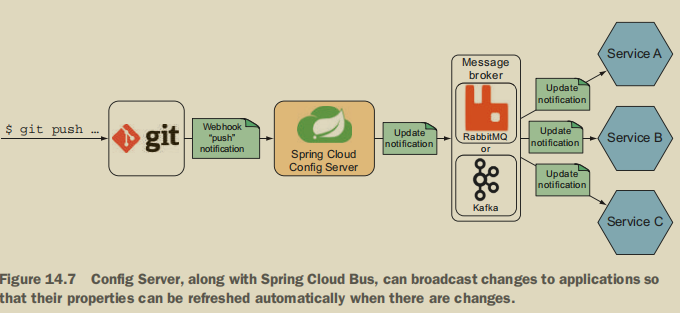

所以需要做的改变有:

- 您需要一个消息代理来处理Config Server与其客户机之间的消息传递。 您可以选择Rabbit MQ或Kafka。 
- 需要在后端Git存储库中创建Webhook，以通知ConfigServer任何更改。 
- ConfigServer将需要启用ConfigServer监视依赖项(它提供将处理来自Git存储库的Webhook请求的端点)和RabbitMQ或KafkaSpringCloud Stream依赖项（用于向代理发布属性更改消息）。 
- 除非消息代理使用默认设置在本地运行，否则您将需要配置连接到ConfigServer和其所有客户端中的代理的详细信息。
- 每个ConfigServer客户端应用程序都需要Spring云总线依赖

1. 创建一个WebHook(github-设置-新建一个钩子)

2. 配置中心处理钩子请求

   > 添加 monitor 依赖
   >
   > 顺便绑定 MQ依赖

3. 创建Gogs通知提取器

4. 在配置服务器客户端启用自动刷新

   > 添加 	bus-amqp 依赖

### 第 15 章 处理故障和延迟

#### 15.1了解断路器

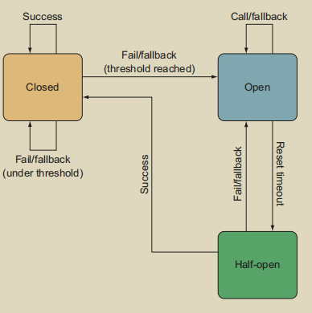

 几类断路器方法:

- 进行REST调用的方法-由于远程服务不可用或返回HTTP500响应，这些方法可能会失败。
- 执行数据库查询的方法-如果由于某种原因数据库变得无响应，或者模式以破坏应用程序的方式改变，这些方法可能会失败。
- 方法可能是缓慢的-这些方法不一定会失败，但如果他们花太长时间做他们的工作，可能会被认为是不健康的。

Netflix开源项目为Hystrix库提供了一个答案。 Netflix Hystrix是一个Java实现的断路器模式。 简单地说，Hystrix断路器是作为一个方面实现的，应用于一个方法，触发回退方法，如果目标方法失败。 此外，为了正确地实现断路器模式，该方面还跟踪目标方法失败的频率，然后在故障率超过某个阈值时将所有请求转发到回退。

#### 15.2 声明断路器

添加依赖 hystrix ,启用 @EnableHystrix

```java
@HystrixCommand(fallbackMethod="getDefaultIngredients")
public Iterable<Ingredient> getAllIngredients() {
 ...
}
```

回退方法也可以有回退方法

##### 15.2.1 减少延迟

```java
@HystrixCommand(//定时处理
 fallbackMethod="getDefaultIngredients",
 commandProperties={
 @HystrixProperty(
 name="execution.isolation.thread.timeoutInMilliseconds",
 value="500")
 })
public Iterable<Ingredient> getAllIngredients() {
 ...
}
```

##### 15.2.2 管理断路器阈值

默认情况下，如果断路器保护方法被调用超过20次，并且超过50%的调用在10秒内失败，则电路将被抛出到打开状态。 所有后续调用将由回退方法处理。 过5秒，电路将进入半开状态，再次尝试原方法

#### 15.3 监测失败

每次调用Hystrix方法都会记录 调用几次/成功几次/失败几次/超时几次等信息,需要Actuator支持

添加依赖 actuator ,配置如下

```yml
management:
 endpoints:
	 web:
		 exposure:
 			include: hystrix.stream
```

##### 15.3.1 介绍Hystrix仪表板

依赖 Hystrix-dashboard, @EnableHystrixDashboard:启用

##### 15.3.2 理解Hystrix线程池

来自Tomcat的请求处理线程，并且如果问题仍然存在，那么当所有线程饱和并等待响应时，可伸缩性就会受到影响。 为了避免这种情况，Hystrix为每个依赖项分配一个线程池(例如，为每个Spring bean分配一个或多个Hystrix命令方法)。 当调用Hystrix命令方法之一，它将在来自Hystrix管理的线程池的线程中执行，将其与调用线程隔离开来。 这允许调用线程在调用时间过长的情况下放弃和退出调用，并将任何潜在的线程饱和隔离到Hystrix管理的线程池。

#### 15.4 聚合多个Hystrix流

添加依赖 turbine ,@EnableTurbine 启用

注册操Eureka,聚合流

```yml
turbine:
 app-config: ingredient-service,taco-service,order-service,user-service
 cluster-name-expression: "'default'"
```

## 第五部分 部署Spring

### 第 16 章 使用 SpringBoot Actuator

 Actuator为Spring Boot应用程序提供了可生产的特性，如监视和指标。 Actuator的特性是通过几个端点提供的，这些端点通过HTTP以及JMX MBeans提供。

#### 16.1 Actuator介绍

在机器中，执行器是负责控制和移动机构的部件。 在SpringBoot应用程序中，SpringBoot Actuator扮演同样的角色，使我们能够查看正在运行的应用程序的内部，并在某种程度上控制应用程序的行为.使用Actuator暴露的端点，我们可以询问正在运行的SpringBoot应用程序的内部状态：

- 配置属性
- 日志级别
- 内存消耗
- Http被请求了几次
- 应用健康状况

添加 actuator 依赖,会自动暴露一些端点*/health*等

##### 16.1.1 配置actuator的基本路径

默认情况下,所有端点的路径都以/actuator作为前缀

```yml
management:
     endpoints:
 			 web:
	      base-path: /management
```

##### 16.1.2启用和禁用执行器端点

默认开启端点很少 /health 和 /info

```yaml
management:
 	endpoints:
    	web:
 			exposure: #支持通配符
 				include: health,info,beans,conditions 
```

可以使用SpringSecurity进行配合

#### 16.2 使用actuator端点

Actuator的基本路径的GET请求将为每个端点提供HATEOAS链接。

```shell
 curl localhost:8081/actuator
```

##### 16.2.1 获取必要的应用信息

看医生,你是谁,感觉怎么样? /info端点告诉您一些关于应用程序的信息，而/health端点告诉您应用程序的健康程度

1. 询问有关应用程序的信息

   可以自定义信息

   ```yml
   info:
    contact:
    	email: support@tacocloud.com
    		phone: 822-625-6831
   ```

2. 检查应用程序的健康

   - 如果所有的健康指标都是UP，那么应用的健康状况是UP。
   - 如果一个或多个健康指标为DOWN，则应用健康状态为DOWN。
   - 如果OUT_OF_SERVICE一个或多个健康指标，则应用健康状况OUT_OF_SERVICE。
   - UN KNOWN健康状态被忽略，并且没有被卷进应用程序的总健康状态。

   ```yml
   management:	#默认是健康总和
   	endpoint:
   		 health:
   	 show-details: always
   ```

   

##### 16.2.2 查看配置详细信息

1. 获取 bean 注入报告(GET  /beans)

   ​	探索Spring应用程序上下文最基本的端点是/beans端点。 这个端点返回一个JSON文档，描述应用程序上下文中的每个bean、它的Java类型以及它注入的任何其他bean。 从GET请求到/beans的完整响应可以很容易地填充整个章节。

2. 解释自动配置

   ​	自动配置是SpringBoot提供的最强大的东西之一。 然而，有时你可能会想，为什么有些东西是自动配置的。 或者，你可能会认为有些东西是自动配置的，让你想知道为什么它没有。 在这种情况下，您可以向/conditions发出GET请求，以了解在自动配置中发生了什么。 从/conditions返回的autoconfiguration报告分为三个部分：正匹配（通过的条件配置)，负匹配(失败的条件配置）和无条件类。

3. 检查环境和配置属性

   ​	当您向/env端点发出GET请求时，您将收到一个相当长的响应，其中包括Spring应用程序中所有播放的属性源的属性。 这包括来自环境变量、JVM系统属性、application.properties和application.yml文件的属性，甚至包括Spring Cloud Config Server(如果应用程序是Config Server的客户端)。 下面的列表展示了一个非常简短的例子，说明您可能从/env端点获得的响应类型，从而让您了解它提供的信息类型。

   ​	也可以对特定属性值进行请求

4. 导航HTTP请求映射

    Actuator的/mapping端点提供了应用程序中每个HTTP请求处理程序的一站式视图，无论它来自Spring MVC控制器还是Actuator自己的端点之一。

5. 管理日志级别

   可以向/loggers端点发出GET请求

   /loggers端点还允许您通过发出POST请求来更改配置的日志级别。

   ```shell
    curl localhost:8081/actuator/loggers/tacos/ingredients \
    -d'{"configuredLevel":"DEBUG"}' \
    -H"Content-type: application/json"
   ```

##### 16.2.3 查看应用程序活动

监视正在运行的应用程序中的活动可能是有用的，包括应用程序正在处理的HTTP请求的类型和应用程序中所有线程的活动。 为此，Actuator提供了/httptrace、/threaddump和/heapdump端点。 /heapdump端点可能是最难详细描述的Actuator端点。 简单地说，它下载一个gzip压缩的HPROF堆转储文件，该文件可用于跟踪内存或线程问题。

1. 追踪HTTP活动

   /httptrace端点报告应用程序处理的最近100个请求的详细信息。 详细信息包括请求方法和路径、指示何时处理请求的时间戳、来自请求和响应的标题以及处理请求所需的时间。

2. 监控线程

   除了HTTP请求跟踪之外，线程活动还可以用于确定正在运行的应用程序中发生了什么。 线程转储端点生成当前线程活动的快照

##### 16.2.4 映射运行时指标

/metrics端点能够报告由正在运行的应用程序生成的所有指标，包括有关内存、处理器、垃圾收集和HTTP请求的指标。 

#### 16.3 定制Actuator

##### 16.3.1 向/info端点提供信息

Spring Boot提供了一个名为Info Contributor的接口，它允许您以编程方式向/info端点响应添加任何您想要的信息。 Spring Boot甚至准备好了Info Contributor的几个有用的实现

1. 创建自定义信息提供器

   ```java
   @Component
   public class TacoCountInfoContributor implements InfoContributor {
    private TacoRepository tacoRepo;
    public TacoCountInfoContributor(TacoRepository tacoRepo) {
   	 this.tacoRepo = tacoRepo;
    }
    @Override
    public void contribute(Builder builder) {
    	long tacoCount = tacoRepo.count();
    	Map<String, Object> tacoMap = new HashMap<String, Object>();
    	tacoMap.put("count", tacoCount);
    	builder.withDetail("taco-stats", tacoMap);
    }
   }
   ```

2. 将构建信息注入/info端点

   ​	Spring Boot附带了Info Contributor的一些内置实现，这些实现自动将信息添加到/info端点的结果中。 其中是Build Info Contributor，它将项目Build文件中的信息添加到/info端点结果中。 这包括项目版本、构建的时间戳以及执行构建的主机和用户等基本信息。

   ​	启用需要开启插件

   ```xml
   <build>
    <plugins>
        <plugin>
            <groupId>org.springframework.boot</groupId>
            <artifactId>spring-boot-maven-plugin</artifactId>
            <executions>
                <execution>
                    <goals>
                   	 <goal>build-info</goal>
                    </goals>
                </execution>
            </executions>
        </plugin>
    </plugins>
   </build>
   ```

3.  暴露GIT提交信息

   ```xml
   <build>
    <plugins>
        <plugin>
            <groupId>pl.project13.maven</groupId>
            <artifactId>git-commit-id-plugin</artifactId>
        </plugin>
    </plugins>
   </build>
   ```

   它们生成一个名为git.properties的构建时工件，该工件包含项目的所有Git元数据。 一个特殊的Info Contributor实现在运行时发现该文件并将其内容作为/info端点的一部分公开。

##### 16.3.2 定制健康指示器

实现 HealthIndicator 接口, 使用Health构建器返回状态

可以通过远程调用根据健康状态进行返回

##### 16.3.3 注册自定义指标

```java
@Component
public class TacoMetrics extends AbstractRepositoryEventListener<Taco> {
 	private MeterRegistry meterRegistry;
    public TacoMetrics(MeterRegistry meterRegistry) {
 		this.meterRegistry = meterRegistry;
 }
 @Override
 protected void onAfterCreate(Taco taco) {
     List<Ingredient> ingredients = taco.getIngredients();
     for (Ingredient ingredient : ingredients) {
     	meterRegistry.counter("tacocloud","ingredient", ingredient.getId()).increment();
     }
 }
}
```

##### 16.3.4 创建自定义端点

需要注意的是，虽然我只演示了如何使用HTTP与端点交互，但它也将作为MBean公开，可以使用您选择的任何JMX客户端访问。 但是，如果要将其限制为只公开HTTP端点，则可以使用@Web Endpoint而不是@Endpoint注释端点类：

```java
@Component
@Endpoint(id="notes", enableByDefault=true)
public class NotesEndpoint {
 private List<Note> notes = new ArrayList<>();
 @ReadOperation
 public List<Note> notes() {
 	return notes;
 }
 @WriteOperation
 public List<Note> addNote(String text) {
 	notes.add(new Note(text));
 	return notes;
 }
 @DeleteOperation
 public List<Note> deleteNote(int index) {
 	if (index < notes.size()) {
 		notes.remove(index);
 	}
 	return notes;
 }
 @RequiredArgsConstructor
 private class Note {
 @Getter
 private Date time = new Date();
 @Getter
 private final String text;
 }
}
```

#### 16.4 保护Actuator

```java
@Override
protected void configure(HttpSecurity http) throws Exception {
     http
     .requestMatcher(EndpointRequest.toAnyEndpoint())
     .authorizeRequests()
     .anyRequest().hasRole("ADMIN")
     .and()
     .httpBasic();
}
```

为了帮助解决硬编码，SpringBoot还提供了Endpoint Request——一个请求匹配器类，它使得这个类更加容易，并且不那么依赖于给定的字符串路径。 使用端点请求，您可以对Actuator端点应用相同的安全要求，而无需硬编码/Actuator/*路径

### 第 17 章 管理Spring

将前端用户界面(UI)放在Actuator之上，以使其更容易使用，以及捕获难以直接从Actuator中使用的实时数据

#### 17.1使用Spring Boot Admin

SpringBootAdmin服务器及其客户端。 管理服务器收集和显示从一个或多个SpringBoot应用程序中输入的Actuator数据，这些应用程序被标识为SpringBootAdmin客户端

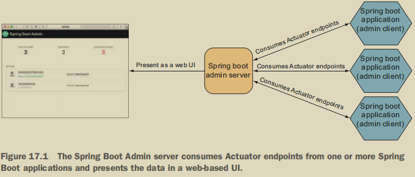

##### 17.1.1 创建一个Admin服务器

添加admin的server依赖,@EnableAdminServer启用

##### 17.1.2 注册Admin客户端

在Admin服务器上注册SpringBootAdmin客户端的两种方法如下：

- 每个应用程序都显式地在Admin服务器上注册自己。

  首先添加客户端依赖,进行配置

```yml
 application:
 	name: ingredient-service
 boot:
 	admin:
 		client:
 			url: http://localhost:9090
```

- 管理服务器通过Eureka服务注册表发现服务

  服务器只需要Eureka客户端依赖,它会自动获取Eureka注册的程序

#### 17.2 探索Admin服务器

提供的信息种类:

- 一般健康和信息
- 通过Micrometer和/metrics端点发布的任何指标
- 环境属性
- 包和类的日志记录级别
- 请求
- 审计日志的线程跟踪详细信息和HTTP跟踪

##### 17.2.1查看一般应用程序的健康和信息

##### 17.2.2观察关键指标

##### 17.2.3审查环境特性

##### 17.2.4查看和设置记录级别 	

##### 17.2.5监测线程

##### 17.2.6跟踪HTTP请求

#### 17.3 确保Admin服务器的安全

##### 17.3.1启用管理服务器登录

添加security依赖,进行配置

```yml
spring:
 security:
	 user:
		 name: admin
		 password: 53cr3t
```

##### 17.3.2 用Actuator进行身份验证

spring.boot.admin.client.instance.metadata.user.name和spring.boot.admin.client.instance.metadata.user.password属性指定管理服务器可以用来访问应用程序的Actuator端点的凭据。

### 第 18 章 使用JMX监视Spring

十多年来,Java管理扩展(JMX)一直是监视和管理Java应用程序的标准手段。 通过公开被称为MBean(托管bean)的托管组件，外部JMX客户机可以通过调用操作、检查属性和监视来自MBean的事件来管理应用程序。 默认情况下，在SpringBoot应用程序中自动启用JMX。 因此，所有执行器端点都以MBean的形式暴露。

#### 18.1 与Actuator MBeans合作

使用JConsole可以发现以下MBeans

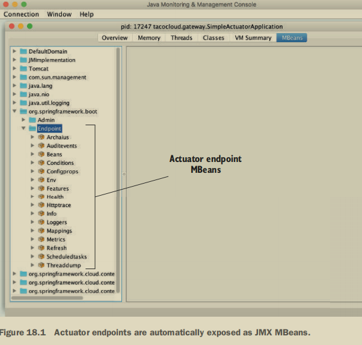

 设置  management.endpoints.jmx.exposure.include 进行向外暴露端点

#### 18.2 创建自己的MBean

很容易将想要的任何bean作为JMX MBean公开。 用@Managed Resource注释bean类，然后用@Managed Operation或@Managed Attribute注释任何方法或属性。 

```java
@Service
@ManagedResource
public class TacoCounter
 extends AbstractRepositoryEventListener<Taco> {
     private AtomicLong counter;
     public TacoCounter(TacoRepository tacoRepo) {
         long initialCount = tacoRepo.count();
         this.counter = new AtomicLong(initialCount);
     }
     @Override
     protected void onAfterCreate(Taco entity) {
     	counter.incrementAndGet();
     }
    @ManagedAttribute
     public long getTacoCount() {
     	return counter.get();
     }
     @ManagedOperation
     public long increment(long delta) {
     	return counter.addAndGet(delta);
     }
}
```

#### 18.3 发送通知

MBeans可以使用Spring的Notification Publisher将通知推送到感兴趣的JMX客户机。 Notification Publisher有一个单一的Send Notification()方法，在给定Notification对象时，将该通知发布到订阅MBean的任何JMX客户端。 要使MBean能够发布通知，它必须实现NotificationPublisher感知接口，该接口要求实现一个集合NotificationPublisher()方法

```java
@Service
@ManagedResource
public class TacoCounter
 extends AbstractRepositoryEventListener<Taco>
 implements NotificationPublisherAware {
     private AtomicLong counter;
     private NotificationPublisher np;
     // ...
     @Override
     public void setNotificationPublisher(NotificationPublisher np) {
     this.np = np;
     }
     // ...
     @ManagedOperation
	 public long increment(long delta){...}
```

### 第 19 章 部署Spring

#### 19.1权衡部署选择

方式有:

- 使用SpringToolSuite或IntelliJIDEA在IDE中运行应用程序
- 使用Maven spring-boot:run从命令行运行应用程序目标或Gradle 的bootRun任务
- 使用Maven或Gradle生成一个可执行的JAR文件，该文件可以在命令行运行，也可以部署在云中
- 使用Maven或Gradle生成一个可以部署到传统Java应用程序服务器的WAR文件

部署到传统服务器只能使用war文件

部署到云的话使用jar是更好的选择(Azuel AWS 等平台)

#### 19.2建立和部署WAR文件

为了使应用服务器知道如何运行应用程序，还需要在WAR文件中包含一个servlet初始化器来发挥web.xml文件的作用，并声明Dispatcher Servlet。

如果初始化项目时候选择了war,不用看了; 

如果是jar类型,可以进行如下处理:

1. 您需要一种配置Spring的Dispatcher Servlet的方法.若要使用SpringBoot Servlet Initializer，请创建一个子类并覆盖configure()方法来指定Spring配置类

   ```java
   public class IngredientServiceServletInitializer
    extends SpringBootServletInitializer {
        @Override
        protected SpringApplicationBuilder configure(
        SpringApplicationBuilder builder) {
        	return builder.sources(IngredientServiceApplication.class);
        }
   }
   ```

2. pom文件 

   ```xml
   <packaging>war</packaging>
   ```

   ```shell
    mvnw package
   ```

   

3. 可以运行进行查看

   ```shell
    java -jar target/ingredient-service-0.0.19-SNAPSHOT.war
   ```

#### 19.3将JAR文件推送到Cloud Foundry

1. 注册云服务平台账号,本地登陆,类似github

2. 现在剩下的就是使用cf命令将JAR文件推送到Cloud Foundry：

   ```shell
    cf push ingredient-service -p target/ingredient-service-0.0.19-SNAPSHOT.jar
   ```

3. 与平台的数据库进行协作的话需要参考平台手册

#### 19.4在Docker容器中运行SpringBoot

Docker(https://www.docker.com/)已成为在云中分发各种部署应用程序的实际标准。 许多不同的云环境，包括AWS、MicrosoftAzure、GoogleCloud平台和PivotalWebServices（仅举几个例子）Docker容器来部署应用程序。

虽然创建Docker映像并不困难，但Spotify已经创建了一个Maven插件，它使得从SpringBoot构建的结果中创建Docker容器就像吹口哨一样容易。 若要使用Docker插件，请将其添加到<构建>/<插件>块下的SpringBoot项目pom.xml文件中，如下所示：

```xml
<build> 
	<plugins>
    ...
         <plugin>
         <groupId>com.spotify</groupId>
         <artifactId>dockerfile-maven-plugin</artifactId>
         <version>1.4.3</version>
         <configuration>
         <repository>
         ${docker.image.prefix}/${project.artifactId}
         </repository>
         <buildArgs>
         <JAR_FILE>target/${project.build.finalName}.jar</JAR_FILE>
         </buildArgs>
             </configuration>
         </plugin>
     </plugins>
</build>
```

Dockerfile如下:

```makefile
FROM openjdk:8-jdk-alpine
ENV SPRING_PROFILES_ACTIVE docker
VOLUME /tmp
ARG JAR_FILE
COPY ${JAR_FILE} app.jar
ENTRYPOINT ["java",\
 "-Djava.security.egd=file:/dev/./urandom",\
 "-jar",\
 "/app.jar"]
```

可以使用application.yml指定数据库位置

```shell
 mvnw package dockerfile:build
```

启用容器之前先启用之前指定的数据库

```shell
docker run --name tacocloud-mongo -d mongo:3.7.9-xenial
# 启用服务
docker run -p 8080:8081 \
 --link tacocloud-mongo:mongo \
 tacocloud/ingredient-service
```

如果您在Dockerhub上有一个帐户并登录，那么您可以使用Maven这样推送图像

```shell
 mvnw dockerfile:push
```

#### 19.5 结束就是我们开始的地方